## 认识与装好

这一篇先完成两件事：认识 Codex，并在电脑上完成安装。

安装完成后，我们会一起运行三个简单任务，让你体验 Codex 如何查找资料、读取项目文件，以及通过浏览器核对信息。整个过程不需要编程基础，跟着步骤操作即可。

### 1.1 Codex 是什么

你可以把 Codex 理解成一个能够使用电脑工具的 **AI 助手**。

普通的 AI 聊天工具主要负责回答问题、提供建议；Codex 除了回答问题，还能在**你允许的范围内读取文件、修改内容、运行命令，并把完成后的文件交给你**。

例如，你让普通聊天工具帮忙整理一批照片，**它通常会告诉你如何分类和命名**；如果把照片放进 Codex 的项目文件夹，**它可以直接查看照片，并按照你的要求完成重命名**。

这类能够调用工具、执行任务的 AI，通常称为“智能体”（Agent）。现阶段不必专门记住这个术语，先理解它与普通聊天工具的区别即可：**普通聊天工具主要提供答案，Codex 还可以执行操作。**

Codex 可以协助完成很多日常工作，例如整理文件、制作 Excel 和 PPT、处理 PDF、查找资料、汇总报告、搭建网站，以及按计划运行重复任务。后续课程会通过具体案例逐步介绍这些用法。

虽然 Codex 的名字容易让人联想到代码，它**并不只适合程序员**。写代码只是它的能力之一，不会编程也可以用它处理日常工作。当然，它也有能力边界和使用风险，课程后面会结合实际任务说明哪些工作适合交给它，哪些工作需要人工确认。

### 1.2 在哪里使用 Codex

根据当前实机界面，模式菜单中有两个选项：

- **ChatGPT（创建、学习和探索）**：适合问问题、讨论想法、学习知识和撰写内容。

- **Codex（执行任务）**：适合读取和修改电脑中的文件、运行工具，以及交付实际成果。本课程的大部分操作都会在这里完成。

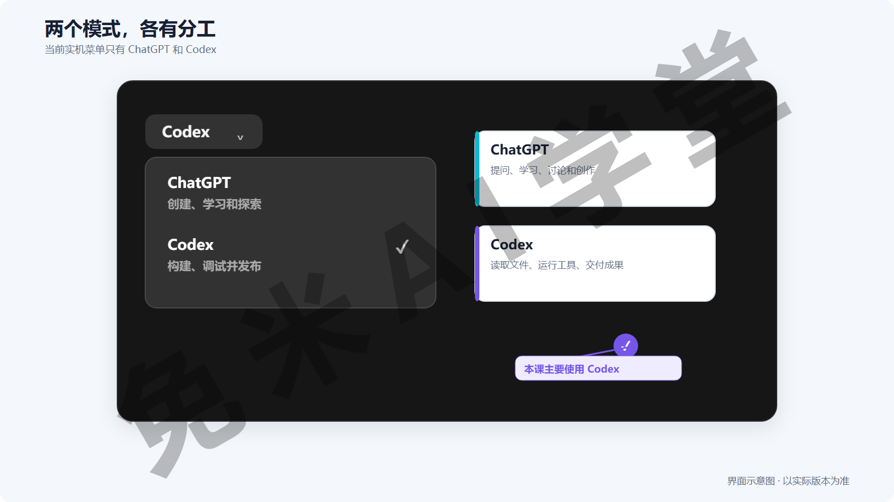

如果暂时分不清，可以先按下面的方法选择：

- 只想提问或讨论，使用 Chat。

- 需要读取、修改电脑中的文件，使用 Codex。

另外有两点可以提前了解：

- 你可以在设置中把 Codex 设为默认视图，以后打开应用时会直接进入 Codex。

- 如果在网上看到“ChatGPT Classic”，它指的是产品整合前的旧版桌面应用，不是本课程使用的版本。

### 1.3 Codex 的几种使用方式

搜索 Codex 时，你可能会看到桌面应用、CLI、IDE 插件和 Cloud 等不同名称。它们面向的使用场景不同：

- **桌面应用**：适合 Windows 和 macOS 用户，有完整的图形界面，也是本课程采用的方式。

- **CLI 命令行**：适合 Linux 用户，以及习惯通过命令行操作的人。

- **IDE 插件**：安装在 VS Code、Cursor 等开发工具中，主要面向程序员。

- **Cloud 云端**：可以将任务放到云端运行，后续课程会介绍相关用法。

如果你是第一次使用 Codex，直接选择**桌面应用即可**。本课程中的操作都以**桌面应用**为准。

### 1.4 账号、订阅与额度

安装前，先了解几个与账号和费用有关的问题。

1. **需要一个 ChatGPT 账号。** 账号注册和网络环境配置可以参考课程配套的《图文手册》，这里不重复展开。

2. **免费账号也可以安装应用。** 如果准备长期使用 Codex，通常需要开通相应的订阅方案。本课程使用 Plus 账号演示，具体可用功能和额度请以账号页面显示为准。

3. **订阅不等于无限使用。** Codex 的使用量会受到短期窗口和每周总额度的共同限制。额度用完后，需要等待系统刷新。

4. **可以随时查看剩余额度。** 在对话框输入 `/状态`，或者打开“设置 → 剩余额度”，即可查看当前余量和预计刷新时间。

5. **达到限额后的处理方式。** Plus 或 Pro 账号可能提供限额重置机会，实际数量和规则以账号页面为准。后续课程还会结合真实任务讨论如何合理使用额度。

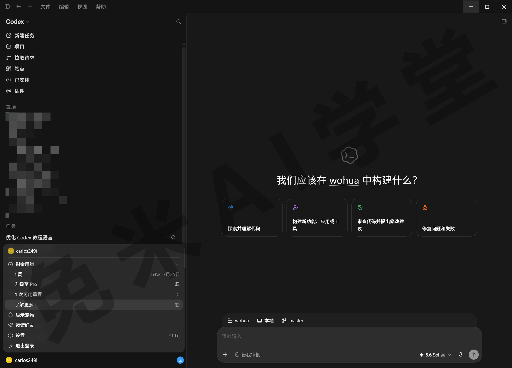

如果暂时不准备订阅，也可以先安装应用并继续学习。等确定有实际需求后再选择订阅方案，不影响理解课程内容。

### 1.5 安装与登录

正常情况下，安装和首次设置大约需要 5—10 分钟。

**第 1 步：下载安装包**

打开 ChatGPT 官网下载页(https://chatgpt.com/zh-Hans-CN/download/)。网站通常会识别你的操作系统，并提供对应的安装包。Windows 用户下载完成后，双击安装文件，按照页面提示完成安装。

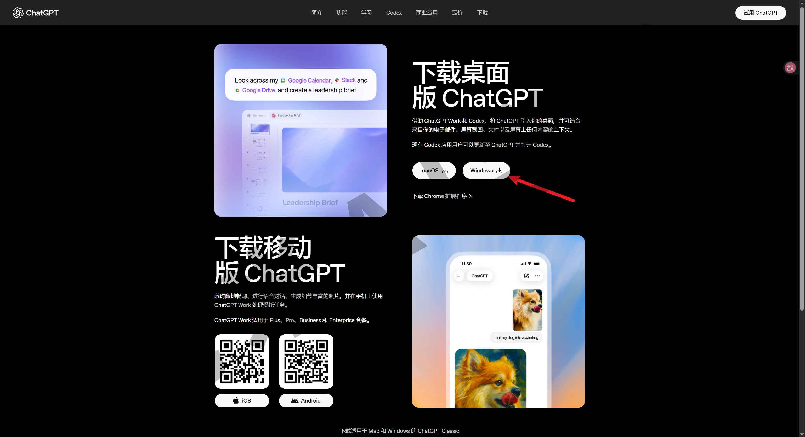

**第 2 步：登录账号**

首次打开应用时会看到登录页面。建议选择 **Continue with ChatGPT**，使用现有的 ChatGPT 账号登录。

页面上的 **Sign in another way** 用于其他登录方式。普通用户一般不需要使用这个入口。

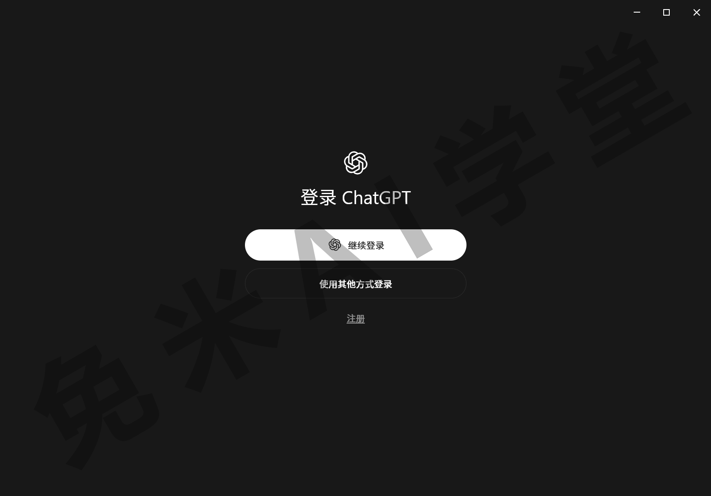

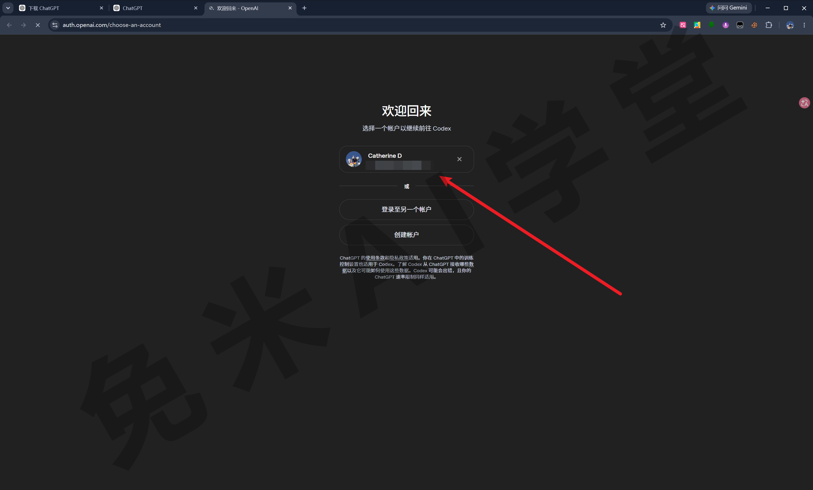

**第 3 步：完成首次启动设置**

第一次进入应用时，系统可能会询问你的职业和主要用途，例如办公、写作或开发。根据自己的实际情况选择即可。应用可能会根据选择推荐或安装相关插件和技能，之后仍然可以在设置中调整。

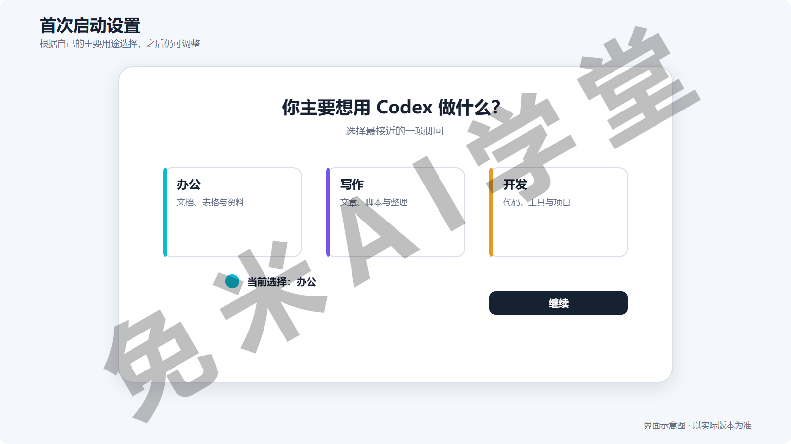

**第 4 步：进入 Codex 并选择项目文件夹**

切换到 Codex 视图后，应用会提示你选择一个项目文件夹。项目文件夹就是 Codex 本次工作的主要位置。

第一次练习时，建议在桌面新建一个空文件夹，例如“AI 试验田”，然后将它设为项目。暂时不要直接选择整个磁盘或包含大量重要文件的目录。关于项目和权限的详细说明，会在后续课程中展开。

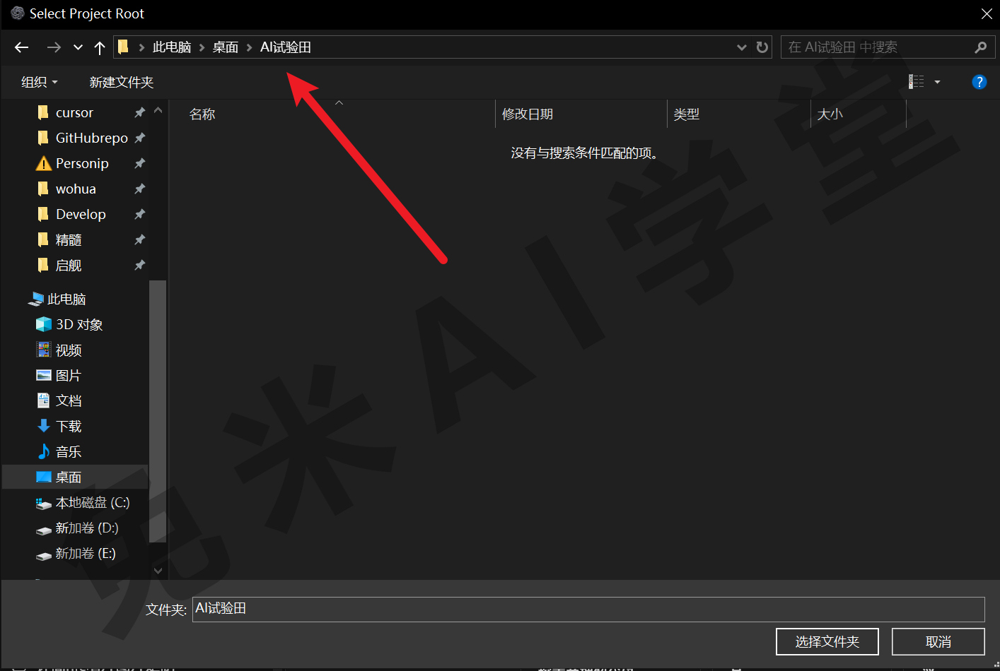

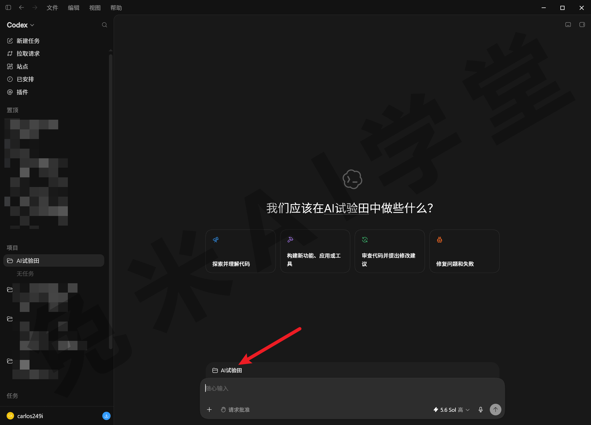

**第 5 步：发送第一条消息**

在输入框中发送一句简单的问候。如果 Codex 正常回复，说明安装和登录已经完成。

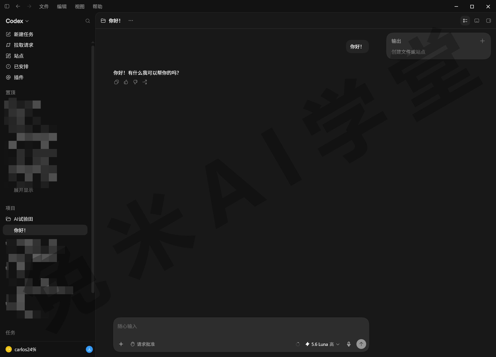

如果登录时一直转圈或出现网络错误，可以按下面的顺序排查：

1. 确认代理工具已经正常连接。

2. 如果当前使用规则模式，可以临时切换为全局模式重试。

3. 如果仍然失败，尝试更换节点。

具体操作可以参考课程配套的《图文手册》。以后遇到类似网络问题，也可以先按这个顺序检查。

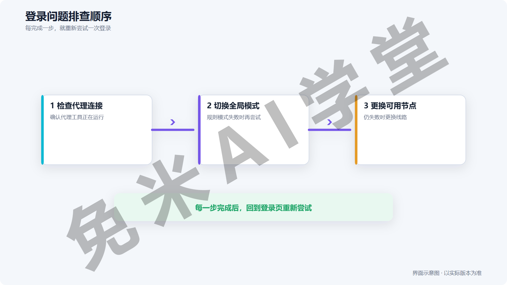

如果以前使用过 Claude Code 等同类工具，首次启动时可能会看到 **Import to Codex** 选项，可以用它导入原来的部分配置。没有使用过这类工具，可以直接跳过。

### 1.6 安装完成后，运行三个体验任务

下面通过三个简单任务，看看 Codex 与普通聊天工具有什么不同。提示词可以直接复制使用。

**任务一：联网查找资料**

帮我查一下今天 AI 圈有什么值得关注的新闻，挑 3 条，每条用一句话说清楚发生了什么。

Codex 会搜索网络，并整理出一份带有来源的结果。因为新闻会随时间变化，这些内容是根据你发送任务时的网络信息生成的。

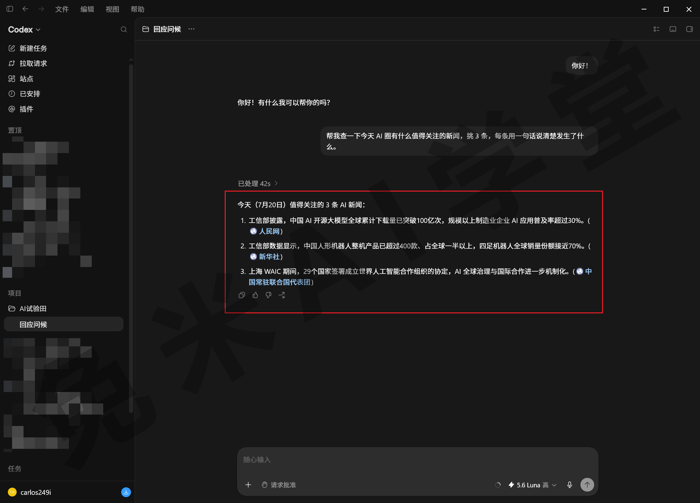

**任务二：读取项目文件夹**

看一下当前项目文件夹里有哪些东西，按文件类型分个类，整理成一张清单给我。

Codex 会读取当前项目文件夹，并按文件类型整理内容。如果文件夹还是空的，可以先放入几个测试文件再运行任务。

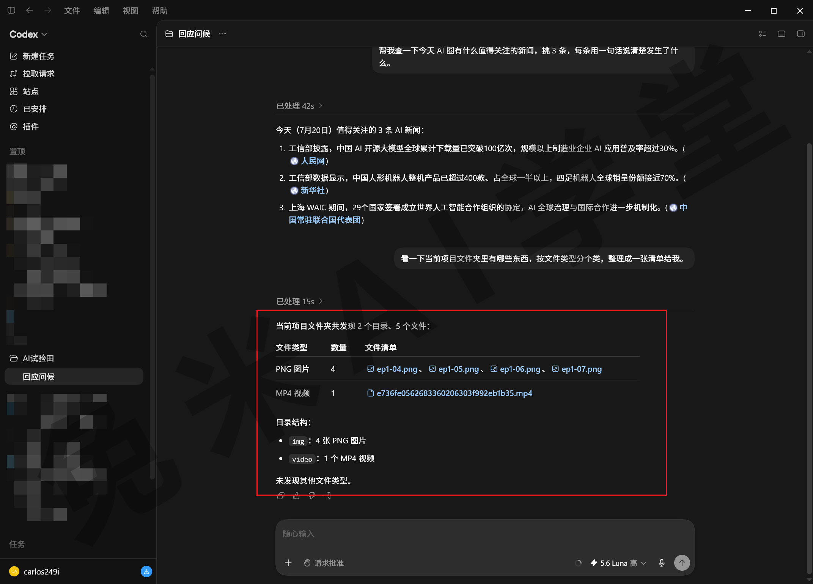

**任务三：通过浏览器核对信息**

刚才第一条新闻，你打开浏览器找到原始报道，确认标题和内容是否属实，把网页标题和链接发给我。

运行任务后，Codex 可能会在侧边区域打开浏览器，进入网页并核对内容。你可以在任务执行过程中查看它访问了哪些页面。

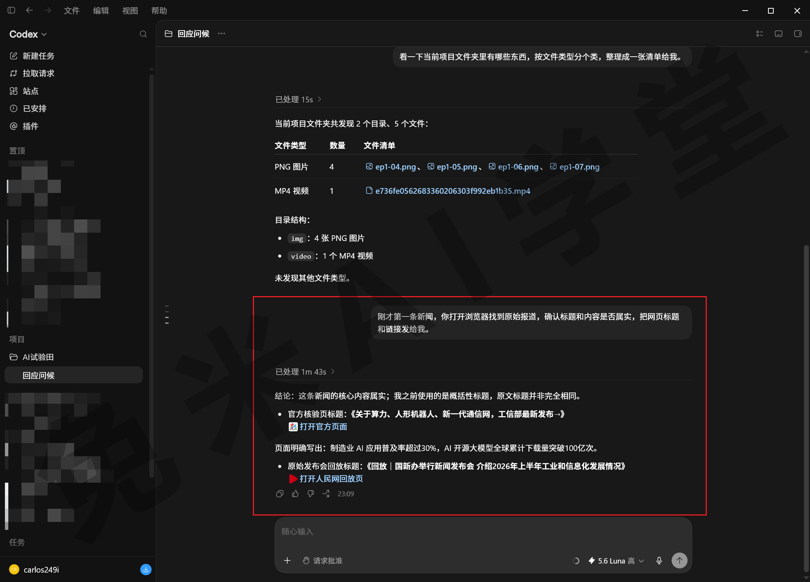

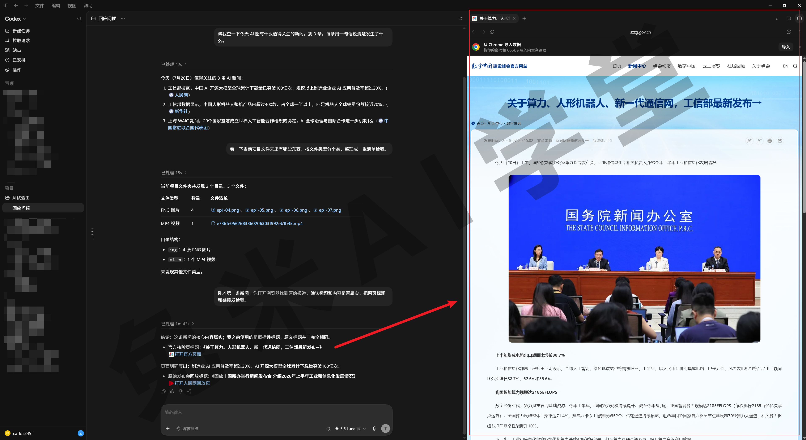

完成这三个任务后，你应该已经能够直观看到两类工具的差别：普通聊天工具主要生成回答，Codex 还可以根据任务调用工具并执行操作。

### 1.7 本篇小结与自检

这一篇介绍了 Codex 的基本定位，并完成了桌面应用的安装和首次使用。你还需要记住：Chat 适合一般问答，Codex 适合执行需要读取或修改文件的任务。

可以对照下面的清单检查学习结果：

* [ ] 已经安装 ChatGPT 桌面应用，并使用 ChatGPT 账号登录

* [ ] 能大致区分 ChatGPT 和 Codex 两个模式

* [ ] 已经创建并选择一个用于练习的项目文件夹

* [ ] 三个体验任务至少完成两个

* [ ] 能说明普通聊天工具与 Codex 的基本区别

如果以上内容基本完成，就可以进入下一篇《界面全导览》，它会带你熟悉 Codex 的主要界面和常用入口。

### 1.8 新手常见问题

**Q1：完全不会编程，也能使用 Codex 吗？**

可以。本课程以零基础用户为主要对象，遇到术语时会先解释。即使不写代码，也可以用 Codex 整理文件、处理文档和完成资料汇总等任务。

**Q2：免费账号可以先体验吗？**

免费账号通常可以安装和登录应用，但可用功能、模型和额度可能有限。**本课程是以Plus来演示，建议大家开通Plus账户，体验更加完整的功能。**

**Q3：Windows 版和 macOS 版有区别吗？**

本课程使用 Windows 版演示。两个版本的主要功能基本一致，少量系统相关的入口和功能可能不同，课程中遇到时会单独说明。

**Q4：Codex 会不会随意修改电脑中的文件？**

Codex 的操作会受到项目范围、沙盒和权限审批等机制限制。接下来《界面全导览》先介绍项目和界面，《权限、沙盒与模型》会专门说明权限与安全机制。在了解这些内容之前，建议只使用单独创建的练习文件夹。

**Q5：可以在手机上使用吗？**

手机端 ChatGPT 可以在部分场景中查看或发起与 Codex 相关的任务，但需要操作电脑本地文件时，仍然要依赖电脑端环境。课程后面会介绍相关用法。
