## 权限、沙盒与模型

《认识与装好》和《界面全导览》完成了安装，也熟悉了界面。这一篇回答一个更关键的问题：Codex 能直接操作电脑里的文件，怎么保证它不越界？我们会讲清沙盒和权限审批这两层机制的分工，看懂权限确认弹窗、选对三种权限模式，再说明模型挡位、速度选项与额度消耗的关系。

### 3.1 沙盒：Codex 的安全边界

**为什么需要沙盒**

先从一个具体场景说起。你让 Codex “把下载文件夹里的旧安装包清理掉”，它理解成了“把下载文件夹清空”；或者它想装一个工具，顺手改动了系统设置。AI 的理解可能有偏差，判断也可能失误，而它和普通聊天工具的最大区别恰恰是能真的动手。所以在放手让它干活之前，必须先回答一个问题：它的活动范围到哪里为止？

Codex 的答案是沙盒：先把工作圈进一个受限的环境里，越界的动作默认做不了。界面提示里它也写作“沙箱”，是同一个概念，本课程统一称沙盒。

**沙盒管住了什么**

你可以把沙盒理解成一个透明的铁盒子。盒子以当前项目为界：项目文件夹里的文件，Codex 可以自由读取、修改，也可以运行完成任务所需的常规工具，这些不用逐一请示。涉及盒子外面的两类操作，它必须先征得你的同意：

- **联网**：默认关闭。查资料、下载文件、访问网页这类需要联网的动作，都要先经过你确认。
- **修改项目以外的文件**：桌面、其他文件夹、系统设置都在盒子外面，想动就得先问你。


这个边界设计得很务实：项目内放开，是为了让它不被琐碎的确认打断，能连贯地干活；项目外收紧，是因为盒子外面才是你真正的数字资产。这也是《界面全导览》建议你为练习单独建项目的原因之一：项目就是边界，练习项目里怎么折腾都出不了圈。

**你会在哪里看到它**

《界面全导览》里第一次让它修改文件时，你可能见过“在沙箱中运行”这样的提示，来源就是这个机制。它表示任务正在受限环境里执行。这是正常现象，不是警告，也不需要你处理。

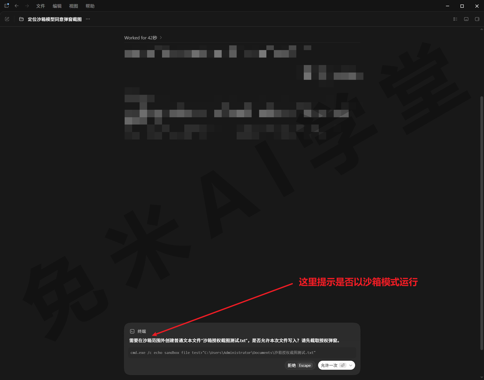

**边界与常见误会**

两个新手常见的误会，提前说清：

第一，“在沙箱中运行”不代表出了问题。它说明保护机制正在工作，真正需要你留神的是下一节要讲的权限确认弹窗。

第二，任务“卡住不动”多半不是死机。Codex 碰到需要越界的操作时会停下来等你批准，你没注意到确认提示，它就一直等着。感觉任务没动静，先看看界面上有没有待处理的确认请求（提示的具体位置和形态，需实机验证），大概率是它在等待你的确认，而不是坏了。

**沙盒管不住什么**

沙盒管的是“能不能做”，不管“做得对不对”。项目内的修改它一律放行，改得好不好、要不要撤销，靠的是另一套机制：Codex 的每次改动都会留下记录，可以逐条查看、一键还原，《AGENTS.md、Diff 与还原》会专门讲。正确的心态是把两层各归各位：沙盒保证它闯不出项目边界，改动记录保证项目内的小错随时能撤销。两层都在，才谈得上放手让它干活。

最后补一句认知：沙盒的松紧**并非固定不变**。哪些操作自动放行、哪些必须问你，可以整体调整，这就是 3.3 节要讲的权限模式。在那之前，先弄懂“问你”这个动作本身。

### 3.2 权限审批：由你做最终决定

**审批和沙盒不是一回事**

沙盒是技术边界，决定了哪些操作不经同意做不了；权限审批是确认流程，把“同意与否”的决定权交到你手里。两层配合才是完整的安全机制：沙盒负责拦，审批负责问。后面选权限模式时你会发现，所谓“模式”，本质就是这两个开关的不同组合。

**什么时候会弹出确认**

日常使用中，触发审批的典型场景有三类：任务需要联网，例如查资料、下载安装包；任务要修改项目以外的文件，例如整理桌面；任务要执行影响较大的操作，例如删除文件、安装软件。项目内的常规读写一般不会打扰你，这正是沙盒边界的设计意图。

**弹窗怎么读：先看三件事**

弹出确认窗口时，不建议不看内容直接点允许。花几秒钟看清三件事再做决定：

- **它准备执行什么操作**：是读取、修改、删除，还是运行某条命令。看不懂命令内容没关系，弹窗一般会附带说明；实在拿不准，把内容复制下来直接问它“这一步是要做什么”，让它自己解释给你听。
- **涉及哪些文件或路径**：路径在不在你预期的范围里。任务明明是整理 A 文件夹，请求却指向 B 文件夹，就值得先问清楚再放行。
- **是否需要联网**：联网去哪个网站、做什么。

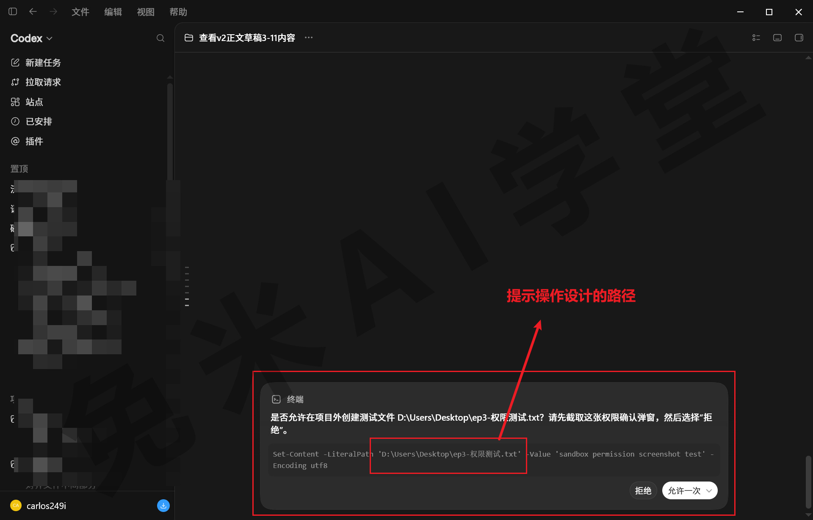

**批准的范围：能选窄就选窄**

有些确认请求会让你选择批准的范围，例如只允许这一次，或者在本对话内都允许（范围选项的具体形态，需实机验证）。原则是选能让任务继续的最窄范围：一次性的操作就只批这一次；同一个对话里要反复做同类操作，例如批量处理一批文件，再考虑放宽到本对话。范围越窄，你对它的行为就越有数。

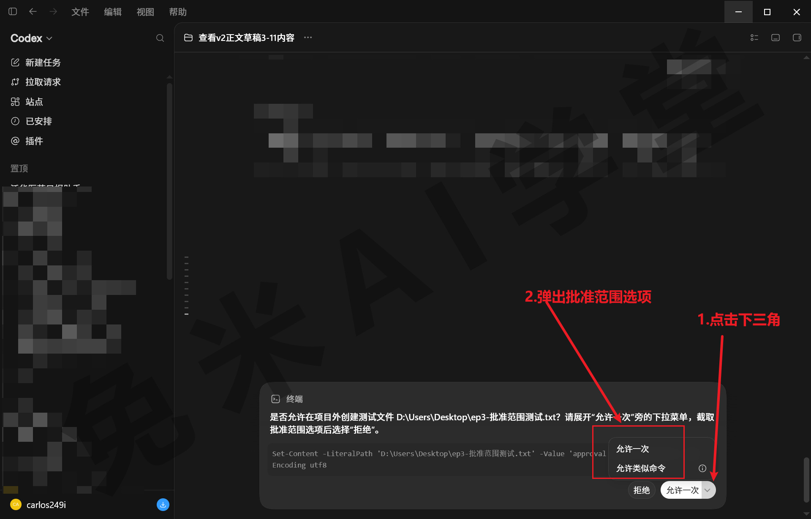

**拒绝不会把任务搞砸**

不确定时可以放心拒绝。拒绝之后任务不会终止，Codex 通常会换一种不需要这个权限的方式继续完成，或者向你说明为什么需要这个操作，由你再判断一次。把拒绝当成一次追问就好：它相当于在问“能不能这么干”，你回一句“先不要，换个办法”。

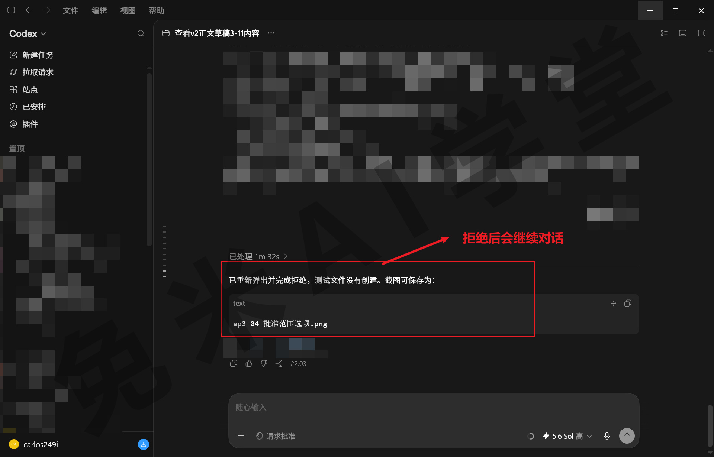

**小知识点：只想聊天时，把它收到只读**

如果这个对话你只想讨论方案、阅读文件，完全不打算改任何东西，可以把权限收到最紧的只读状态：它能看、能答，凡是动手一律要问。入口在输入框附近的权限控件里（控件中各档的确切名称与有无单独的只读档，需实机验证；权限切换当前不走斜杠命令，命令的全量盘点见《斜杠命令全集》）。切到只读后，你会发现它连改一个字都会先来请示，聊完记得切回来。

**常见坑**

- 最大的坑是把弹窗当成障碍，养成不看内容直接点允许的习惯。审批是你唯一的把关机会，跳过它，后面权限模式选得再谨慎也没有意义。
- 任务迟迟没有进展，先检查有没有待处理的确认请求，而不是关掉重来。上一节说过，它在等你，不是坏了。

### 3.3 三种权限模式怎么选

**模式是什么**

每个操作都问一遍最安全，但弹窗太频繁；全都不问最省事，但风险也最大。权限模式就是在这两端之间给你的三个预设档位，决定哪些操作自动放行、哪些需要人工确认。结合前两节的概念，每一档都是“沙盒边界 + 审批频率”的一种组合：档位越高，边界越松、提问越少。

三档按本课程的叫法是：**默认（每步确认）**、**自动审查**、**完全访问**

**在哪里切换：两个入口**

- **输入框下方的权限控件**：点开可以直接为当前对话切换档位，菜单里通常能看到与三档对应的选项（菜单项的名称与数量，需实机验证）。临时想收紧或放开，用这里最快。
- **设置页**：《界面全导览》介绍设置页时见过“常规 → 权限”，在这里调整的是默认档位，对之后的新对话生效（两处设置如何配合，以实际界面为准）。

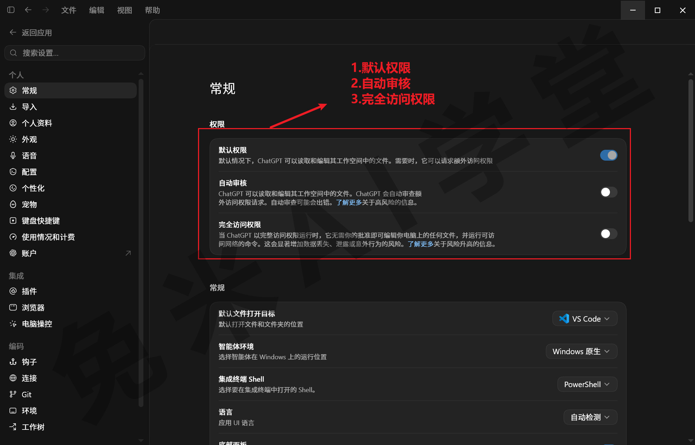

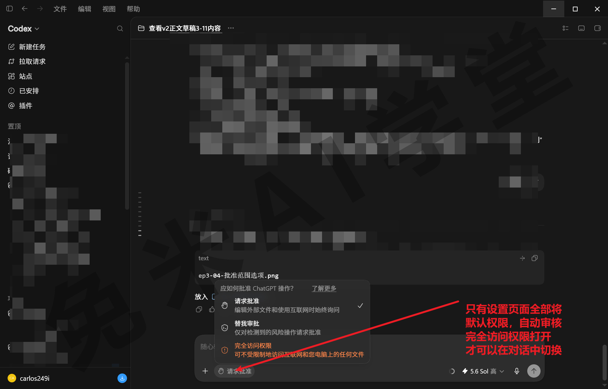

**三档逐一说清**

- **默认（每步确认）**：每个可能有影响的操作都来问你。最稳妥，代价是弹窗频繁，任务节奏会被打断。适合两种情况：处理重要文件时，以及刚上手、想看清它每一步都在做什么的阶段。这一档也是最好的学习工具，弹窗看多了，你自然摸清它的工作套路。
- **自动审查**：常规操作自动放行，重要操作才来问你，例如删除、联网、修改项目外文件。这是安全和效率的平衡点，建议新手从这一档起步。要了解一个代价：它的运行时间有时反而比完全访问长，因为缺工具或缺权限时，它会先尝试不需要人工审批的替代方案，绕一圈行不通才来问你（该行为是否仍然如此，需实机验证）。
- **完全访问**：全部放行，不再询问，速度最快。风险同样直白：指令有歧义或它判断失误时，文件可能在你不知情的情况下被修改。官方的使用建议里，“过早开放完全访问”被明确列为常见错误。包含重要文件的文件夹不要用这一档；想少看弹窗，先考虑自动审查，而不是一步跳到完全访问。

**选择原则：按文件夹的重要程度定档**

选模式的依据是这个项目文件夹里放着什么：

- **存放重要资料的项目**：用默认（每步确认）。多弹几次窗没有什么代价，换来的是每一步都经你过目，出了偏差也能当场拦下。
- **日常工作的项目**：用自动审查。常规操作不来打扰你，删除、联网这类关键动作仍然把关，效率和安全两头都不耽误。
- **专门的练习文件夹**：可以开完全访问。里面本来就没有怕丢的东西，省下的每一次确认都让练习更顺畅。

再加一条通用保险：担心某批文件被改坏，动手前先复制一份备份。这个习惯和权限模式无关，任何档位下都值得保持。

**进阶一提**：三档之外，产品还提供更细的自定义权限能力，例如固定放行某类操作、扩大可写目录的范围。这属于进阶用法，新手阶段用三档预设完全够用（是否提供及入口形态，以实际界面为准）。

**常见坑**

- 在存放重要资料的文件夹里开完全访问，等于把最后一道闸门也拆了。真出问题时，你甚至不知道它改了哪些东西。
- 切换档位后，留意它作用的范围是当前对话还是之后的所有对话（两个入口各自的生效范围，需实机验证），别在一个地方改了就以为处处生效。

### 3.4 模型挡位与速度

**挡位是什么**

同一个 Codex，处理任务时可以调用不同强度的思考力度，这就是模型挡位。本课程按低、中、高、超高四档来讲：挡位越高，它想得越深、处理复杂任务的能力越强，代价是等待更久、额度消耗成倍增加。每一档背后对应的具体型号名会随版本更新，以界面显示为准，不必专门记忆（当前挡位名称与显示方式，需实机验证）。

**在哪里切换**

入口在输入区域的模型选择（《界面全导览》提到过，输入区域包含模型选择功能）。当前版本的选择器通常是一个滑杆：向左偏向更快出结果，向右偏向想得更深，默认停在中间的均衡档；旁边一般还有“高级”入口，可以具体指定模型、挡位和速度（选择器的具体形态，需实机验证）。

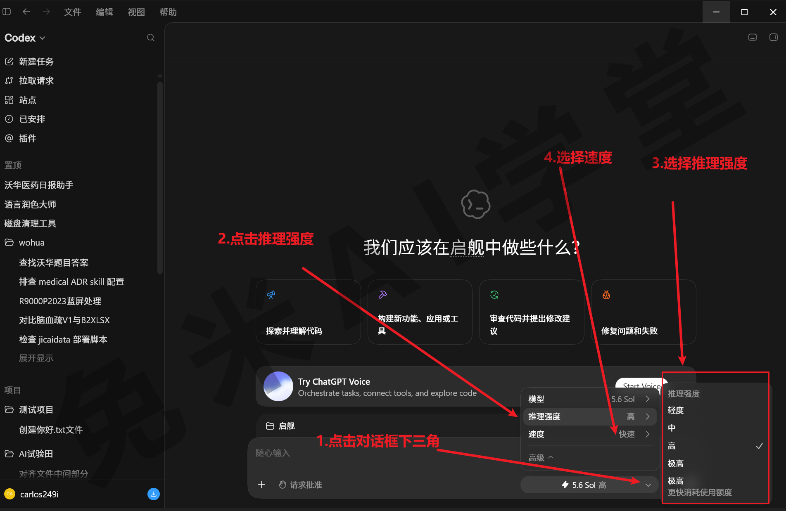

**四个挡位怎么用**

- **低挡（轻度）**：反应快、消耗少，适合简单明确的小任务：改文件名、转格式、问一个具体的小问题。任务一句话能说清、不需要它做太多判断的，低挡足够。
- **中挡**：日常主力，默认从这里开始。整理文件、写文档、做表格这类常规任务，中挡在质量和速度之间的平衡最好。
- **高挡**：任务复杂、步骤多、怕它漏考虑时用，例如涉及多个文件的批量改动、需要先分析再动手的任务。
- **极高挡**：想得最深，也最慢、最耗额度，留给复杂且出错代价大的任务。日常几乎用不到，真正复杂的实战项目（第二部分会遇到）才值得开。

判断规则一句话：**从中挡开始，效果不满意再升一档；能不用超高挡就不用。**升挡解决的是“想得不够深”，解决不了“要求没说清”。效果不好先检查自己的提示词有没有把要求讲明白，再考虑升挡。

**小知识点：速度选项**

速度是独立于挡位的另一个选项，分标准、快速两档，通常在模型选择的高级入口里（存在形态与入口，需实机验证）。快速档响应更快，但更消耗额度。日常保持标准档即可；真正着急要结果、且任务本身不复杂时，再临时切快速，用完切回。

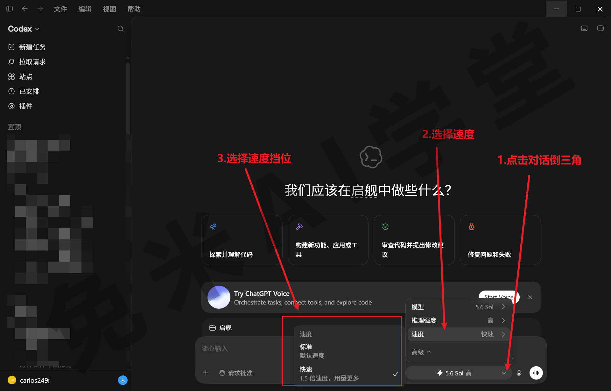

**认知一提**：部分版本的选择器里还会出现更高的选项，例如给单个难题更长思考时间的档位，或者把任务拆给多个子智能体并行处理的档位（是否出现、叫什么名字，以实际界面为准）。新手阶段用不上，见到也不必研究，知道它们是“更高也更贵的挡位”即可。

**常见坑**

- **把超高挡当默认挡**：日常任务全程开最高档，额度消耗成倍增加，产出却未必看得出差别，纯属浪费。
- **用升挡代替把话说清**：要求本身含糊，挡位升得再高也救不回来。效果不好先回头改提示词，再考虑升挡。
- **临时升挡后忘了切回**：跑完复杂任务记得把挡位调回中挡，别让下一个简单任务跟着多花额度。多数版本会在输入区显示当前挡位，发任务前瞄一眼（显示位置以实际界面为准）。

### 3.5 额度的使用逻辑

**额度是什么**

订阅方案里包含的 Codex 使用量就是额度。它不是无限的，也不是简单的“每天多少次”。搞懂它的结构，你才能安排好自己的使用节奏。

额度通常分成两个并行的池子（以账号页面显示为准）：

- **短期窗口**：管最近几个小时的用量，防止短时间内爆发式消耗，此前用掉的部分会随时间滚动归还。
- **每周总额度**：管一整周的累计总量。即使短期窗口还宽裕，一周内的累计用量到顶，同样会被暂停。

两个池子同时计数，先碰到哪个上限，哪个就先生效。这里藏着一种容易被忽略的情况：一个特别大的任务连续跑几个小时，可能短期窗口还有余量，每周总额度先被打穿了。大任务开跑前先看余量，必要时拆成几个小任务分天跑。

**消耗的逻辑**

消耗额度的核心变量是“用了多强的挡位、跑了多久”：同一个任务，挡位越高、运行时间越久，消耗越多；快速档也比标准档更费。这解释了上一节的判断规则为什么是“从中挡开始”：高挡本身没有问题，把它用在简单任务上才是浪费。

窗口的恢复方式也和直觉不同：它一般不是到整点一次性重置，而是滚动释放，几小时前用掉的部分到点逐步归还（具体机制以账号页面说明为准）。所以额度紧张时等一等，往往就能继续用，不必干等一个“重置时刻”。

**在哪里看余量：两个入口**

《认识与装好》里用过，这里复习并讲细：

- **`/状态` 命令**：在对话框输入 `/状态` 发送，直接返回当前额度信息：两类额度各剩多少、预计什么时候刷新。想快速看一眼，用它最方便。
- **“设置 → 剩余额度”页面**：打开设置找到剩余额度（不同版本里也可能叫“使用情况和计费”，以实际界面为准），能看到与 `/状态` 相同的信息，通常还更详细。

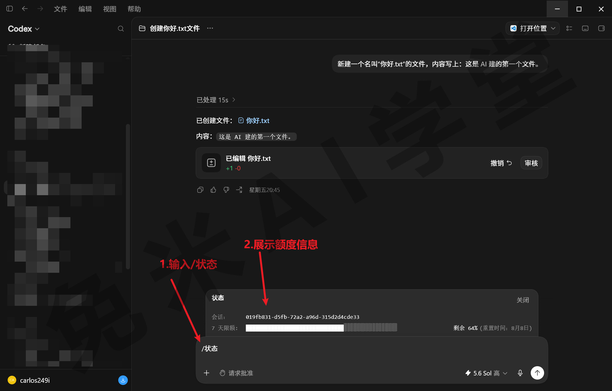

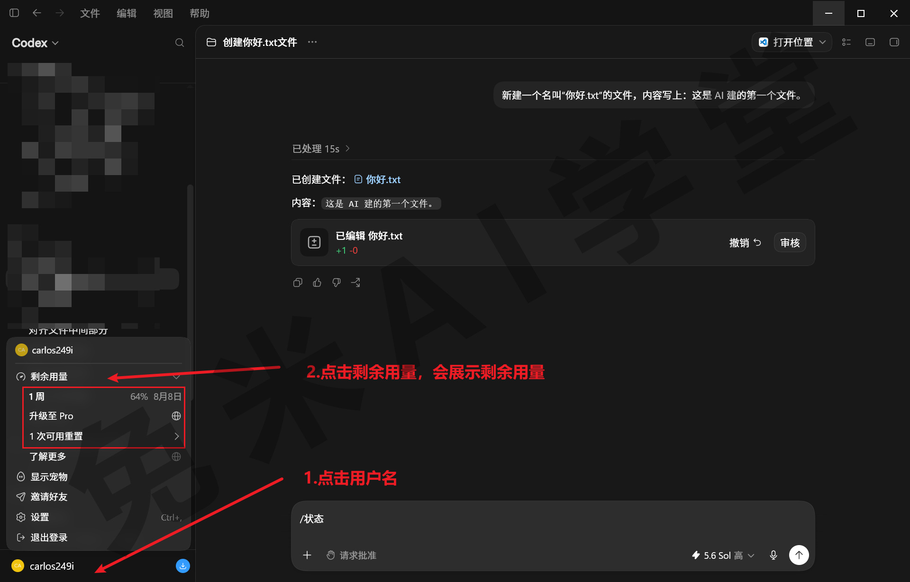


两处都看一遍，你应该能回答三个问题：短期窗口还剩多少、什么时候刷新？每周总额度还剩多少？哪一类会先见底？

**省额度的四个习惯**

- 纯问答、纯讨论的任务，切换到 ChatGPT（创建、学习和探索）模式进行，不占用 Codex 的额度。写方案、聊思路放那边，动手才回 Codex 模式。
- 日常从中挡起步，把高挡和超高挡留给真正复杂、出错代价大的任务，不为简单任务预支大额消耗。
- 速度保持标准档：快速档更费额度，只在真正着急、且任务本身不复杂时临时切换，用完记得切回来。
- 较大的任务开跑之前，先看一眼余量：中途额度见底，任务会停在半路，收尾还要再花一轮沟通成本。

**额度用完了怎么办**

先用 `/状态` 或设置页查看预计刷新时间：短期窗口到点自动恢复，每周总额度按周期滚动恢复。等待期间，可以把纯问答任务切到 ChatGPT 模式继续推进，不耽误思考类的工作。部分订阅账号还可能提供加购或限额重置的机会，是否提供、怎么计费，以账号页面显示为准，本课程不写死具体规则。

### 3.6 三个体验任务

下面通过三个任务，把权限、挡位和额度实际感受一遍。提示词可以直接复制使用。

**任务一：三种权限模式下运行同一条指令**

这条指令涉及项目外的文件，正好用来观察不同模式的把关差异。发送：

```
看一下我桌面上有哪些文件，按文件类型分个类，整理成一份清单；
将清单保存为桌面上的“权限测试-文件清单.md”，同时把内容发给我。
```

在设置里分别切换默认（每步确认）、自动审查、完全访问，各运行一次，记录每种模式下弹出了哪些确认、哪些步骤被自动放行（三种模式下的提示差异，需实机验证）。

完成标准：能说出这条指令在三种模式下各弹了几次确认、内容有什么不同，并能解释为什么完全访问一次都不问。

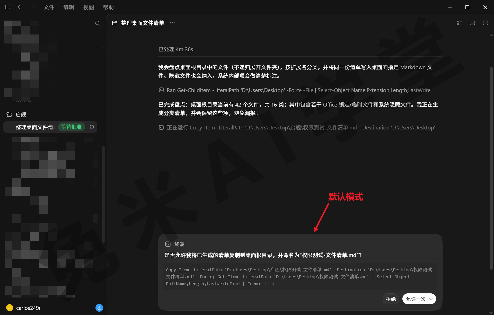

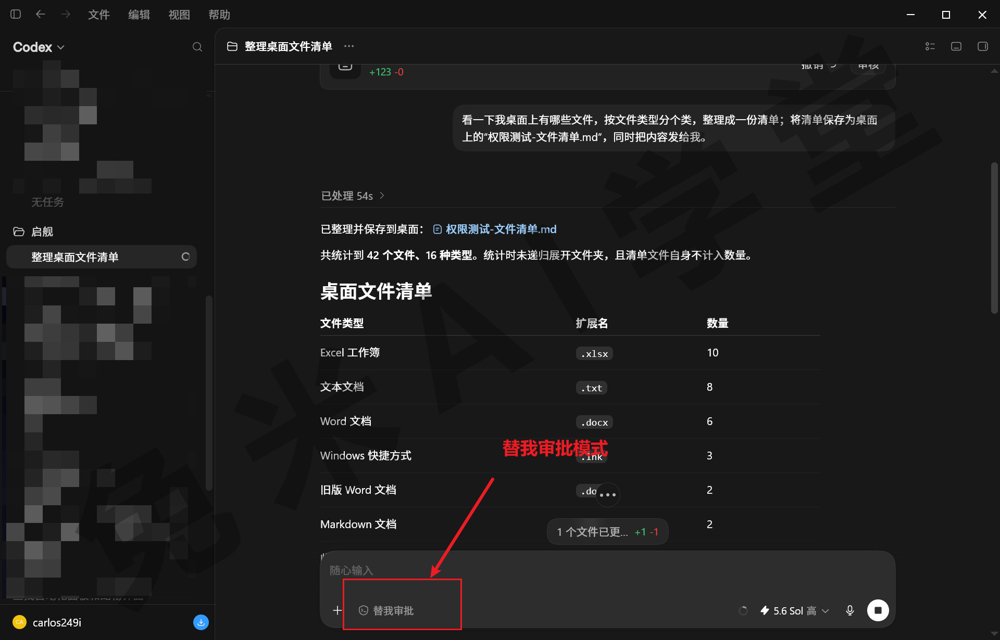

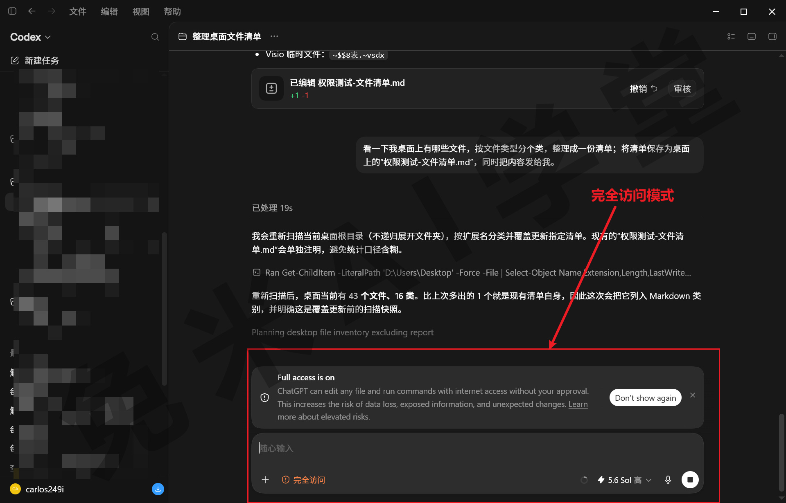


**任务二：两个挡位运行同一个任务**

先用低挡发送下面的任务，再新开一个对话，切到高挡发送同一条，对比输出质量和等待时间：

```
写一份 200 字以内的说明，向完全没接触过 AI 的朋友解释什么是权限审批，为什么需要它。
```

完成标准：对比两次输出后，能回答两个问题：高挡的答案是否明显更好？多等的时间值不值？这个判断以后会帮你省不少额度。


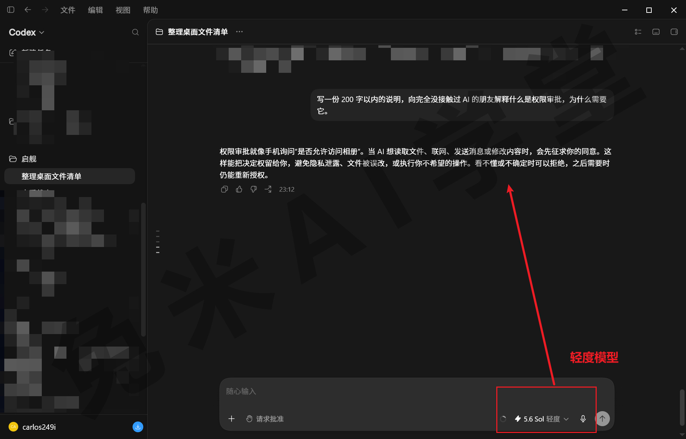

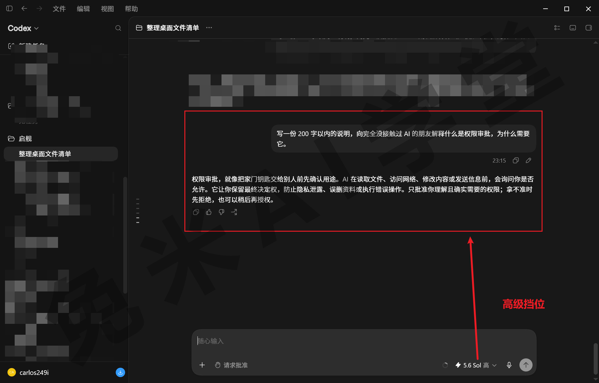

**任务三：查看剩余额度并读懂它**

在对话框输入 `/状态`，查看两类额度的余量；再打开“设置 → 剩余额度”，对照两处的显示。

完成标准：不看帮助，能说出短期窗口还剩多少、什么时候刷新，以及每周总额度还剩多少。

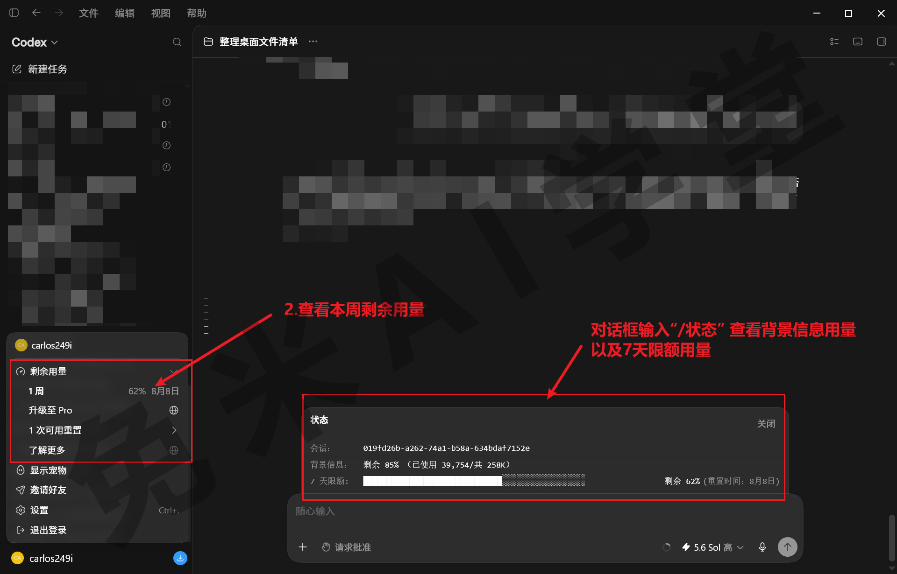

### 3.7 本篇小结与自检

这一篇介绍了 Codex 的安全机制：沙盒负责挡住越界操作，权限审批把最终决定权留给你。同时说明了模型挡位与额度消耗的关系。最需要记住的是：**按文件夹的重要程度选择权限模式，按任务的复杂程度选择模型挡位。**

可以对照下面的清单检查学习结果：

- [ ] 能说出沙盒默认限制的两类操作（联网、修改沙盒外的文件）
- [ ] 能说出三种权限模式的区别和各自适合的场景
- [ ] 已把常用项目的权限模式调到适合自己的档位
- [ ] 会切换模型挡位，知道日常任务从中挡开始
- [ ] 会用两种方式查看剩余额度，能看懂刷新时间

完成这些内容后，你已经可以放心地把更大的任务交给 Codex。下一篇《文件能力一集讲全》开始进入实际能力。

### 3.8 新手常见问题

**Q1：完全访问更方便，为什么不推荐新手用？**

因为它把大部分确认都跳过了。指令有歧义，或者 AI 判断失误时，文件可能在你不知情的情况下被修改，而新手往往还没有备份的习惯，也还不熟悉它的行为边界。官方的使用建议同样把“过早开放完全访问”列为常见错误。建议先用自动审查，观察一段时间它会在哪些操作上请求确认；等有了自己的判断，再对不含重要文件的文件夹放开完全访问。

**Q2：额度用完了怎么办？**

先用 `/状态` 或“设置 → 剩余额度”查看预计刷新时间。短期窗口是滚动恢复的，此前的用量到点逐步归还，等一等往往就能继续；每周总额度按周期恢复。等待期间，可以把纯问答任务切到 ChatGPT 模式，不占用 Codex 的额度。日常从中挡起步、少用快速档，也能明显延长额度的使用时间。部分订阅账号可能提供限额重置或加购机会，实际规则以账号页面显示为准。

**Q3：挡位越高，效果一定越好吗？**

不一定。简单明确的任务，高挡位带来的提升通常有限，反而多花额度、多等时间。挡位的意义在于匹配任务的复杂程度：日常任务中挡就够，复杂任务再上高挡。另外，效果不好未必是挡位不够，先检查提示词有没有把要求说清楚。同一个任务用两个挡位各跑一次（体验任务二），你会对这种差别有直观感受。

**Q4：每次弹窗都需要仔细看吗？**

刚上手的阶段建议都看：弹窗内容就是它准备执行的操作，看多了，你会很快识别出哪些属于常规操作。之后可以把注意力集中在高风险操作上：删除、覆盖、联网，以及涉及项目外路径的改动。批准范围能选窄就选窄，拿不准的先拒绝，让它换一种方式，任务不会因此中断。
