## 文件能力一集讲全

到上一篇《权限、沙盒与模型》为止，Codex 只处理过查资料、读文件夹这类简单任务。从这一篇开始进入它的实际能力：文件处理的基础能力一次讲完——读取、识别、重命名、归类、清理，以及让它自己安装工具。主线是一套图片素材包跑三步递进，外加磁盘清理和安装工具两个独立案例。这些能力是后面所有实战的地基，办公、建站、自动化，处理的都是文件。

### 4.1 Codex 能对文件做什么

**先看一个熟悉的场景**

每个人电脑里都有几个“回头再整理”的文件夹：截图攒了几百张，名字全是数字；下载文件夹里安装包、文档、压缩包混作一团。手动整理这类文件夹，难的不是技术，是枯燥——一张张看、一个个改，改到第二十个就放弃了。这类活恰好是 Codex 最擅长的：它能读懂文件内容，也能批量动手。

**能力全景**

围绕一个文件夹，它常用的能力可以归成四组：

- **读懂内容**：打开文档、读懂正文、按要求整理汇总是基本功；图片同样能看懂——知道一张照片拍的是海边还是猫，这是后面按内容整理图片的前提。
- **批量整理**：按内容重命名、按类型归类、找出内容重复的文件列成清单，几十上百个文件一次处理完，不需要你逐个动手。
- **格式转换**：例如把 HEIC、webp 转成 jpg——前两种是 iPhone 照片和网页图片的常见格式，部分软件打不开，转成 jpg 更通用（转换的支持范围以实际表现为准）。
- **磁盘分析与清理**：找出占空间的大文件，逐项说明它是什么、建不建议删，经你确认后代为清理。

还有一件事贯穿所有任务：干活时缺什么工具，它可以自己找、自己装，不用你先把环境配好。这个能力在 4.6 单独演示。

**用法只有一种：把要求说清楚**

这些能力的用法完全一致——用一句话说清你要什么，不需要记参数、背步骤。下面三条都可以原样拿去用：

```
把这个文件夹里的 HEIC 和 webp 图片都转成 jpg，原图保留。
```

```
把这批文件按类型归类，分别放进“图片”“文档”“安装包”三个子文件夹。
```

```
找出这个文件夹里内容重复的文件，列出清单，先不要删除任何东西。
```

留意第三条结尾的“先不要删除”：给 AI 派活时把边界一起说清，是全课程反复用到的习惯。

**和普通聊天工具的区别**

同样一批文件，普通聊天工具通常只能给建议：告诉你应该怎么分类、怎么命名，动手的还是你。Codex 的不同在于直接产出结果——处理完的文件就放在项目文件夹里，打开就能用。这正是《认识与装好》说过的区别：普通聊天工具主要提供答案，Codex 还可以执行操作。而且它处理的是你电脑上的本地文件，不需要把文件一个个上传到网页对话框，项目指向哪个文件夹，它就在哪里开工。

**本篇的安排与素材准备**

本篇五个案例分两组。4.2 到 4.4 是一条主线：同一套图片素材包三步递进，先按内容批量重命名，再挑同类图片合成一段视频，最后给视频配乐并迭代。4.5 和 4.6 是两个独立案例：磁盘大扫除，以及让它自己安装工具。

开始前先准备素材。新建一个项目（《界面全导览》讲过，项目就是一个文件夹），名字随意，例如“文件能力练习”；放入 40 张左右内容混杂的图片，风景、美食、宠物、手机截图混在一起效果最好。数量不必精确，几十张即可。有一条务必做到：用复制出来的副本练习，不要拿唯一一份原件——这是所有批量操作的第一习惯，本篇还会反复提到。

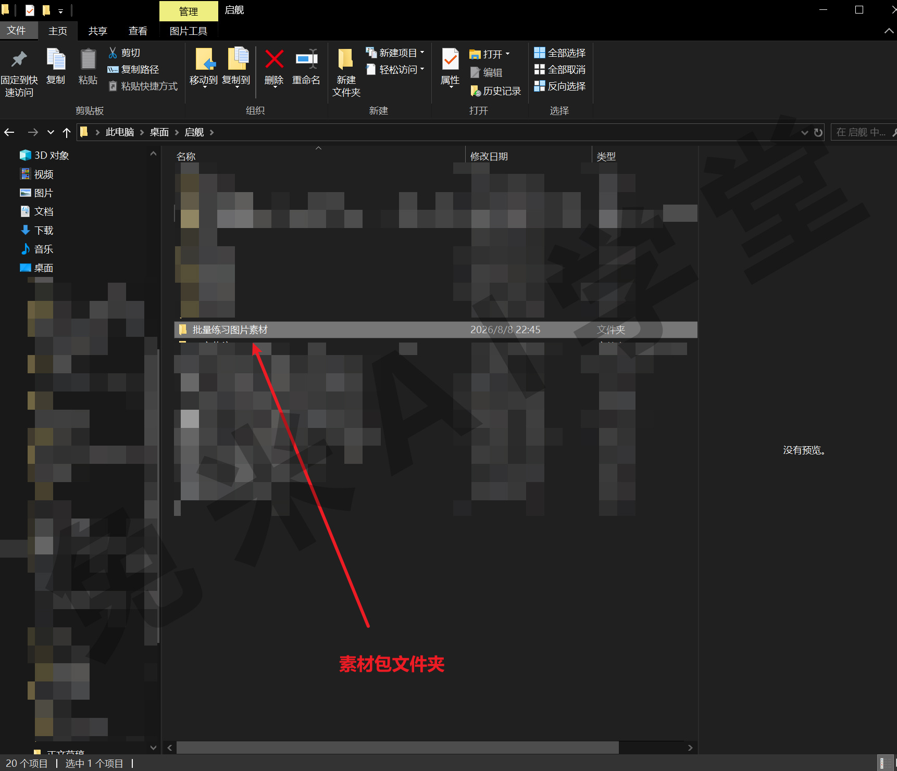

### 4.2 案例一：按内容批量重命名图片

**痛点：找图全靠翻**

相册和下载文件夹里，大量图片用的都是“IMG_2035.jpg”“屏幕截图 2026-08-01.png”这类名字，想找某张图只能一张张翻。名字一旦换成内容描述，在文件夹的搜索框里输入“日落”就能直接命中——这是性价比最高的一次性整理，也是主线的第一步。

**发出第一条指令**

进入素材项目，新开一个对话，发送：

```
把项目里这批图片按内容重新命名，格式用“编号-内容描述”，例如 01-海边日落.jpg；
编号保留在最前面；内容拿不准的图片先列出来问我，不要自行猜测。
```

这条提示词有三处设计，值得拆开看。格式给了样例（01-海边日落.jpg），它就不会自由发挥出五花八门的命名；编号放在最前面，是为了让文件按名称排序时顺序稳定，后面的案例引用这批图也方便；“拿不准的先问我”给了它一条退路，免得它对着一张模糊截图硬猜。给样例、给规则、给范围，写提示词的这三件套以后可以一直沿用。

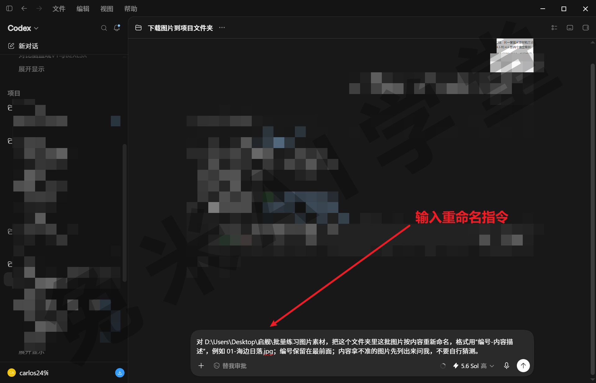

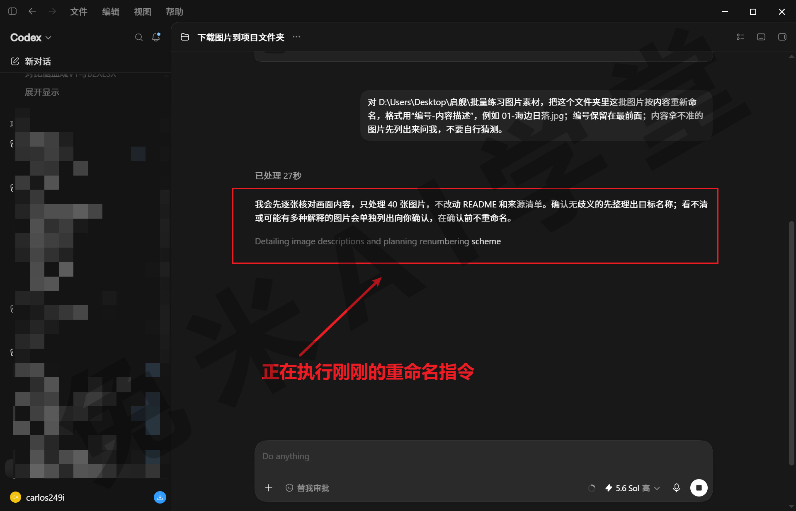


**看它怎么干活**

发送之后不必守着，但第一次值得看完全程。处理几十张图片时，它通常不会逐张打开慢慢看，而是可能先把所有图片拼成一张带编号的大图，一次看全——这种拼图在摄影行业叫联系表，好处是效率高，也能避免只看缩略图产生误判。拼完大图，它按编号逐张写出内容描述，再批量执行改名；你交代过“拿不准的先问”，它会把没把握的图片单独列出来等你答复。具体采用哪种看图策略，不同版本可能不同，以当前版本实际表现为准。

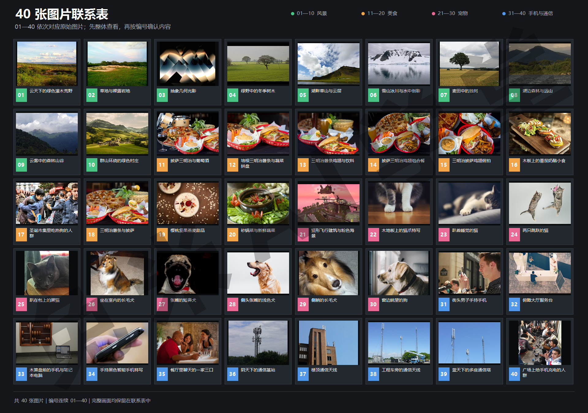

**核对成品**

任务完成后打开文件夹，核对三件事：文件名是否都变成了“编号-内容描述”的格式；按名称排序是否就是按编号排序；抽查几张，文件名和图片内容对不对得上。抽查这步别省——AI 看图偶尔会认错，内容杂、分辨率低的截图尤其容易。发现认错的不用重跑全部，直接说“04 那张不是海边，是湖边，重新命名”，单独修正快得多。

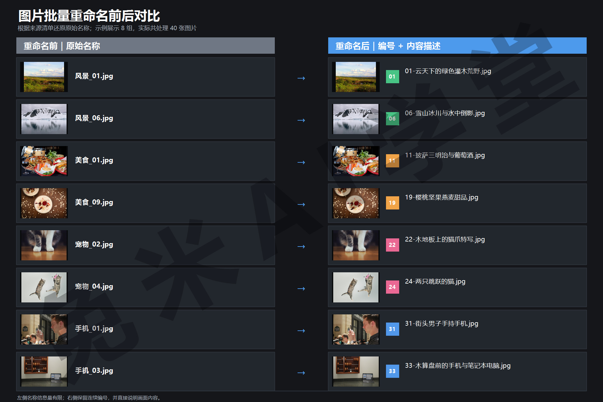

**边界与两个提醒**

什么图适合交给它：数量多、内容杂、名字没规律的，收益最大；已经命名规范的文件夹就别再折腾了。两类情况动手前先想一想：

- 涉及隐私的图片：看图识别通常要把图片交给云端模型分析，证件照、合同截图这类敏感内容，建议先挪出素材包再整理。
- 正被其他软件引用的文件：部分软件按路径记文件，改名后可能提示“文件丢失”，这类文件先关掉相关软件，或干脆让它跳过。

还可以加一道保险：让它在改名的同时输出一份“原名-新名”对照清单存进项目，万一想回退，拿着清单让它按原名改回去就行。最后再提一次开头的习惯：第一次批量改名，永远拿副本练手。

到这里，一批没法检索的图片变成了有名字的素材库，主线第一步完成。

### 4.3 案例二：同类图片合成视频

**这一步直接出作品**

素材有了名字，第二步直接出成品：从整理好的图里挑出一类，合成一段可以直接分享的视频。放在过去，这件事要装剪辑软件、学时间轴；在这里是一句话的事，顺便还能看清它处理复杂任务的两个关键表现。

**发出指令**

继续在这个项目里发送：

```
从这批图片里挑出所有风景照，合成一段视频：每张停留 3 秒，转场随机，
大小不一的图统一裁剪到满屏；原图不要动，成品命名为“风景集锦.mp4”，放在项目文件夹里。
```

这条要求明显比上一条多：挑哪些图、每张多久、转场怎么处理、尺寸怎么统一、原图怎么办、成品叫什么放哪里，一次说全。要求越具体，返工越少，多步骤任务里这一点尤其明显。

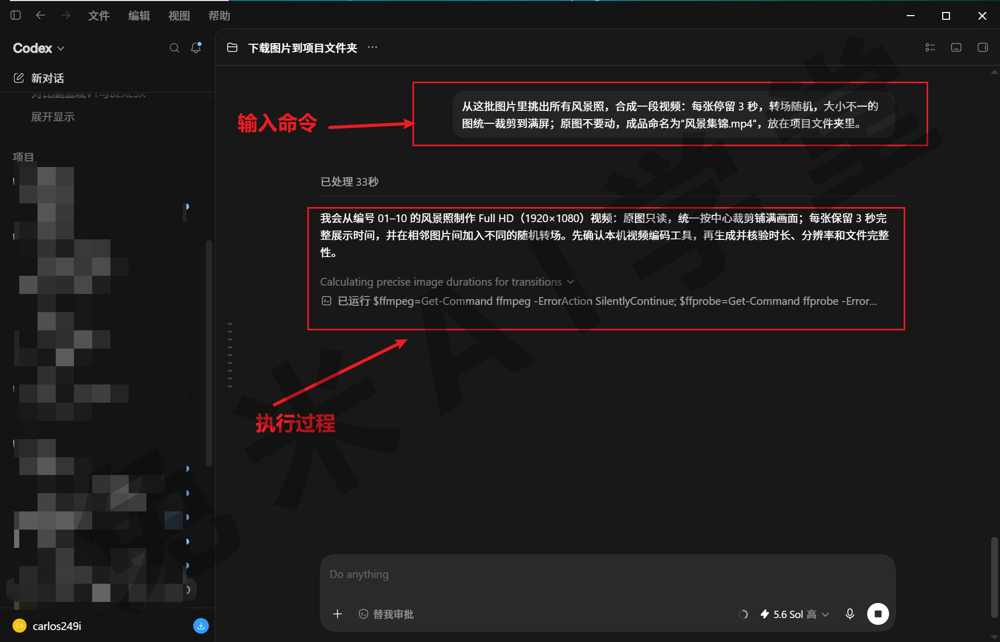

**观察点一：缺工具时它怎么办**

合成视频需要专门的处理工具，你的电脑上通常并没有。这正是本案例的第一个看点：留意它发现“缺工具”之后的动作。常见的处理方式是，它先检查电脑上有没有现成可用的方案，没有就自己挑一个合适的装上——业内处理音视频最常用的是一个叫 FFmpeg 的命令行工具，名字不用记，知道它是行业通用的音视频处理器即可；需要的依赖一般装进项目目录内，不改动你的系统环境，你的原图也不会被碰（具体选用什么工具、装到哪里，需实机验证）。装进项目还有一个好处：这些依赖跟着项目走，哪天不需要了，删掉项目文件夹就一并清走，不给系统留垃圾。整个过程它会在任务面板里同步说明，《界面全导览》讲过怎么看执行过程，这里正好用上。

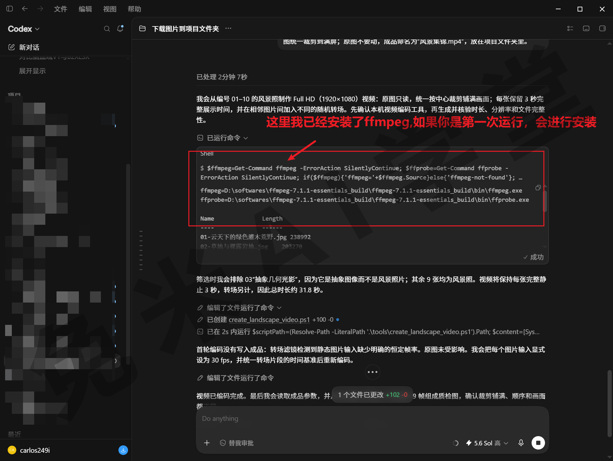

**观察点二：报错了先别急**

多步骤任务中途报错很常见：某个依赖版本不合、某张图尺寸异常，都可能让它停一下。先不要介入，看它自己读报错信息、调整方案、重新运行——多数情况下它能自行修复，这个自愈过程正是它和传统工具的本质区别。反复失败时，再把你看到的现象补充给它，例如“每次到合成那一步就停住”。是否报错、怎么修复，每次运行不完全相同（需实机验证）。方向明显跑偏也可以随时发消息纠正，甚至直接停止任务，处理办法见本篇常见问题第 4 问。

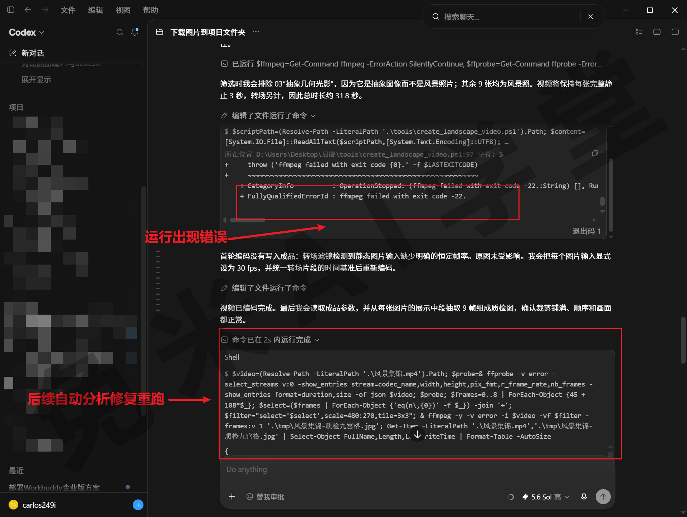

**验收**

完成后，项目文件夹里应出现“风景集锦.mp4”。核对三处：时长是否大约等于挑中的张数乘以 3 秒；画面是否满屏、无黑边；原图是否原样保留。再抽看两三处转场是否自然。对裁剪不满意也不用重来，例如竖图的主体被裁掉了，就告诉它“竖图改为居中留边，不要裁剪”，让它重出一版。验收习惯从小任务开始养成，后面的大项目会一直用到。

边界也交代一句：这种一句话合成，适合快速出片和批量处理；要逐帧调节奏、加字幕特效的精细剪辑，仍是专业剪辑软件的领地，别硬拿它做。

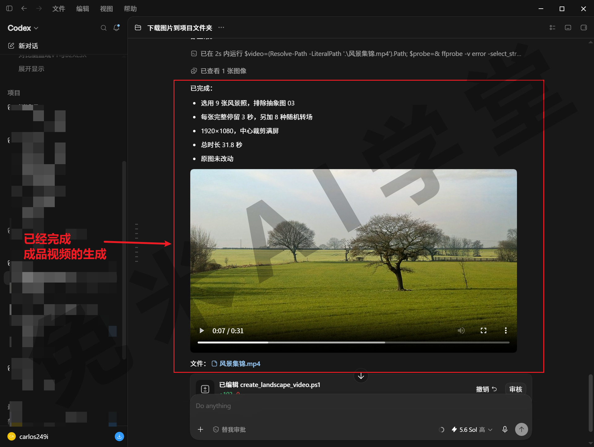

### 4.4 案例三：给视频配乐并迭代

**配乐难在找素材**

视频有了，还差背景音乐。配乐的麻烦从来不是“把音乐加上去”，而是找素材：曲子要合画面气氛，还得能放心使用——随手配一首流行歌，公开发布可能涉及版权问题。这一步把选曲的活也交给它，顺便学会 AI 协作里最常用的动作：迭代。

**先让它自动配**

发送：

```
给“风景集锦.mp4”配一段和画面气氛相符的背景音乐，输出为新文件，原视频保留。
```

留意它选音乐的方式：它通常会主动避开有版权风险的曲目，倾向选用可以自由使用的音乐素材，来源可能是免费素材库，也可能由程序生成（具体的音乐来源和实现方式，需实机验证）。另外，“输出为新文件”这个要求别省——保住无配乐的原版本，后面怎么换方向都有退路。成品的名字也可以顺手指定，例如“命名为 风景集锦-配乐版.mp4”，和上一节的习惯一致。

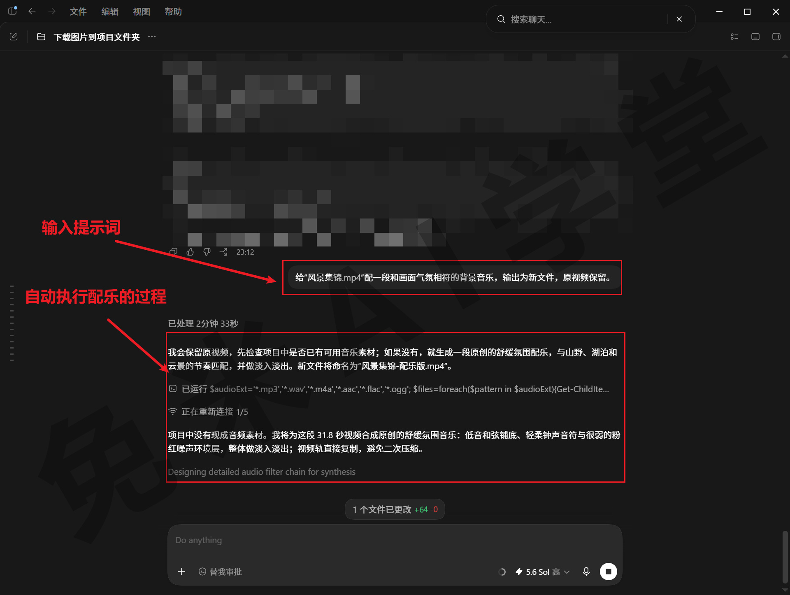


**不满意，一句话换方向**

配乐是主观的事，第一版不合心意很正常。不需要推倒重来，直接说出调整方向：

```
配乐换个方向：轻松欢快一些，不要人声。
```

它通常会在已有成果的基础上重做配乐这一步，而不是从合成视频开始全部重跑（具体行为以实际表现为准）。这就是与 AI 协作的基本节奏：先拿到一版，再用一句一句的反馈逼近你想要的样子。方向词可以很日常，“再安静一点”“节奏感强一些”都行，不需要懂音乐术语。调整时尽量一次只改一个维度：先把风格定下来，再调音量、加淡出，逐轮收敛，比一口气提五个要求更容易到位。觉得音乐盖住了画面，就说“把音乐音量压低一些，结尾做淡出”。

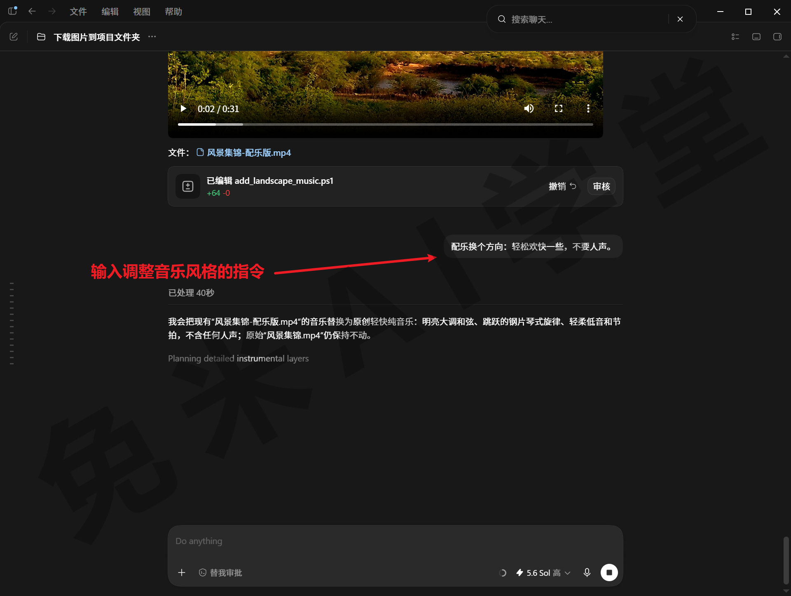

**进阶：用自己的音乐**

对配乐有明确想法，就直接给素材。把音乐文件放进项目文件夹，发送：

```
用项目里的 我的音乐.mp3 做背景音乐，从第 30 秒开始截取，长度和视频对齐。
```

“从第 30 秒开始”这类要求用来跳过前奏、直接进入主歌；“长度和视频对齐”让它把音乐裁到与画面同长，结尾不至于戛然而止。对音频的裁剪、对齐支持到什么程度，以实际表现为准（需实机验证）。项目里放了多首音乐时，记得点名用哪一首，否则它会自己挑一首合适的（挑选逻辑以实际表现为准）。自己的音乐自己负责版权：公开发布前，确认这首曲子你有权使用。

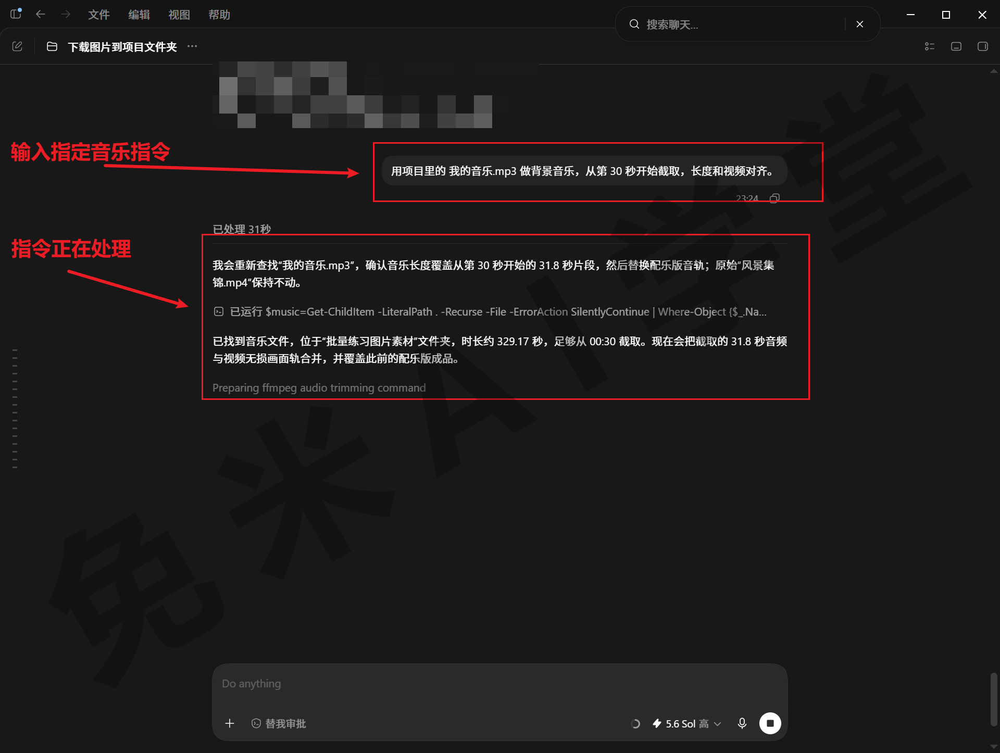


**主线收束**

到这里，主线三步全部走完：一批杂乱的图片，先变成有名字、能检索的素材库，再变成一段成品视频，最后配上音乐，每一步都只用了一句话。还有一点值得留意：三步之间不需要你搬运任何文件，上一步的产出留在项目里，自然成为下一步的素材——这正是把文件放进项目里干活的价值。这套“自动出一版、反馈调方向、最后亲自给素材”的三段式也请记住，后面做 PPT、做网站时还会反复用到。

### 4.5 案例四：磁盘大扫除

**痛点：乱的不是空间，是判断**

下载文件夹是多数人电脑上最乱的地方：安装包用完不删、压缩包解压完还留着、同一个文件下了两三遍，大块空间就这么占着。手动清理难在判断——每个文件都得想一下“这是什么，删了要不要紧”，想着想着就放弃了。这个案例让 Codex 当清理顾问：分析交给它，决定权留在你手里。

**动手前的两个交代**

- 下载文件夹通常在项目范围之外，访问它会触发权限确认——《权限、沙盒与模型》讲过的审批机制，这回第一次在真实任务里派上用场，弹窗出现时看清内容再允许。
- 清理拆成两步走：先只分析、不动手，看过建议再决定删什么。把“分析”和“删除”分成两条指令，是处理自己重要数据时最稳的节奏。这个节奏不只用在下载文件夹，桌面、旧项目盘、U 盘同样适用。

**第 1 步：只分析，不动手**

发送：

```
分析我的下载文件夹的空间占用：按大小列出前 20 个文件或文件夹，
每一项用一句话说明它是什么、是否建议清理；先不要删除任何东西。
```

它会扫描文件夹，按体积从大到小列出清单，逐项给出说明和建议。建议通常分两类：明显可删的，例如装完就没用的安装包、重复下载的同名文件；需要你判断的，例如个人文档、用途不明的文件夹。逐项看完，记下你确认可删的编号。清单里看不懂的项不要跳过，直接追问，例如“第 8 项是什么软件留下的，删了有什么影响”——顾问的价值就在于可以反复问，问明白再决定。

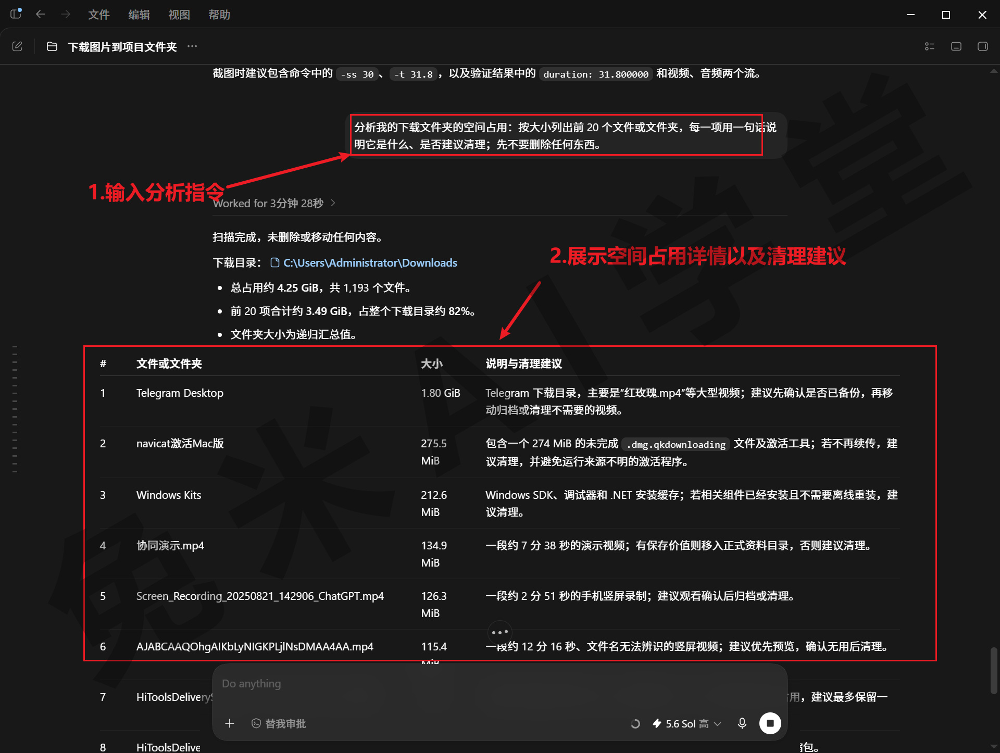

**第 2 步：确认后再删除**

发送（编号换成你确认过的）：

```
把清单里我确认过的第 3、7、12 项删除，其余一律不动。
```

**观察点：删除类操作的完整确认流程**

删除属于有影响的操作，它一般不会拿到指令就动手：先复述一遍要删哪些文件、等你确认，执行时还可能再次触发权限审批。删完它会汇报结果，一般包括删了哪些、释放了多少空间。这一整套流程，就是权限机制在真实任务里的样子——它可以提建议、做执行，但每个不可逆动作之前，决定权都会回到你手里。删除的具体方式是直接删除还是移入回收站，不同版本表现可能不同（需实机验证）；稳妥起见，把每一次删除都当作不可恢复来对待。

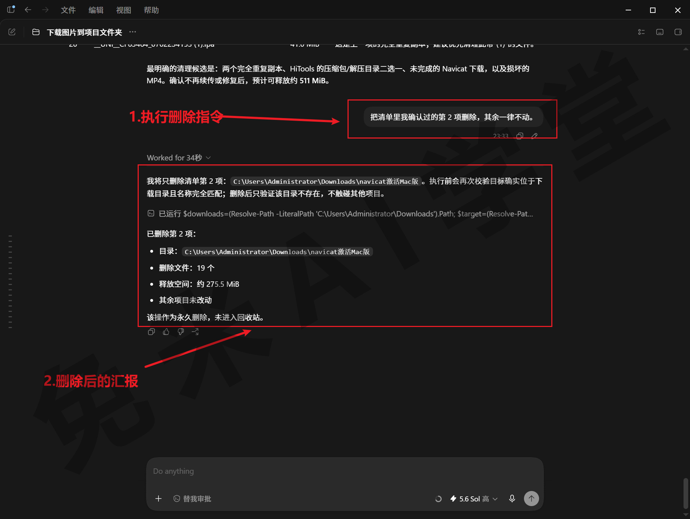

**两个习惯与一条退路**

拿不准的文件宁可留着，空间不差这一点；确认删除清单时逐项看过，不要凭列表长度整批同意——清单里混进一个不该删的，损失可能远超省下的空间。拿不准又实在占地方的还有一条退路：让它移动而不是删除，例如“把第 5 项移到 D 盘的归档文件夹”，先挪走观察一阵，确认不影响使用再删。练习阶段可以只做到“给出清理建议”这一步，4.7 的任务三就是这么安排的。

### 4.6 案例五：让它自己安装工具

**新手最常卡住的环节**

合成视频那一步，它已经悄悄装过一次依赖。这一节把“装工具”单独拿出来练，因为这是新手最常被卡住的环节：软件装不上、环境不会配、教程照着做还是报错，一步卡住，整个学习就停在那里——很多人学新工具半途而废，真实原因就是这个。以后这类问题，可以整个交给它。

**演示对象：Node.js**

演示选 Node.js：一个常见的程序运行环境，很多工具要靠它才能运行，后面《插件与部署上线》部署网站时也会用到。现在不需要理解它是什么——这一节的重点不是 Node.js，是看清 Codex 怎么替你装工具。发送：

```
请帮我安装 Node.js
```

指令故意只有一句：不给下载地址，不给版本要求，看它怎么补齐这些信息。

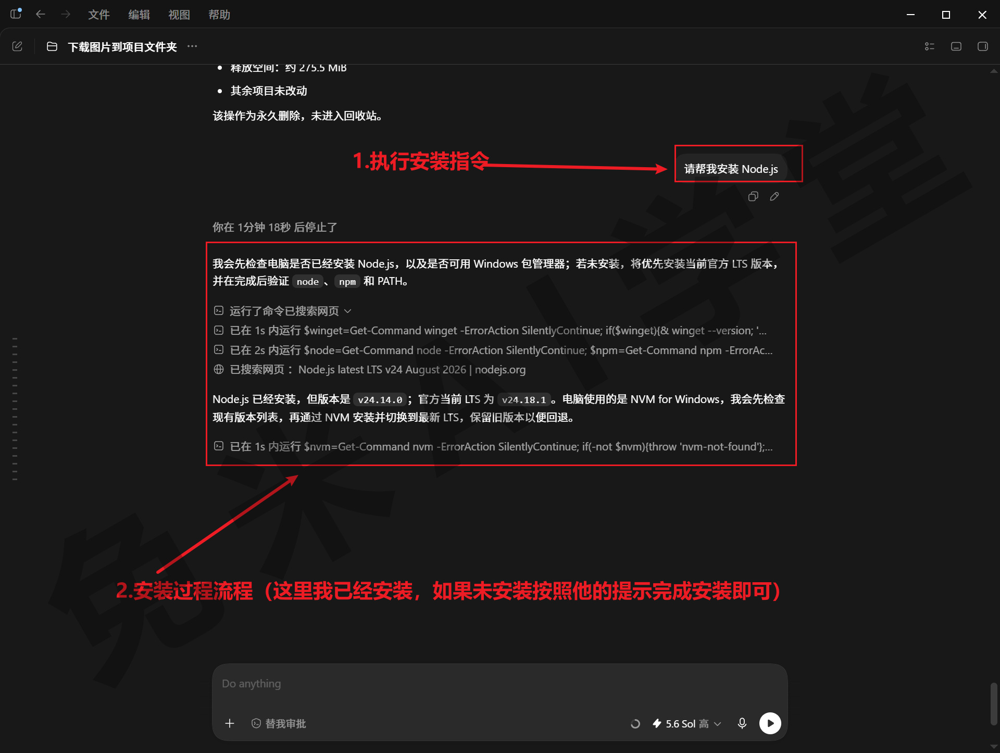

**盯住三个环节**

- **自己找安装包**：它会确定合适的来源和版本，一般倾向官方渠道的稳定版本（以实际表现为准），不需要你翻官网找链接、辨别版本号。
- **处理权限**：安装软件会改动系统，属于沙盒外的操作，会触发权限审批，由你放行；弹窗里能看到它准备执行的动作，看清再允许。
- **装完自行验证**：它一般不会装完就报成功，而是先查询一次版本号——例如在终端运行 node -v 这类命令，看到版本号正常输出才报告完成（具体验证方式以实际表现为准）。

这三个环节合起来是一次完整的“交办”：你给目标，它补齐路径、处理许可、自验结果。以后装任何工具，你要做的都只是在审批时看清两件事——装的是什么、从哪里下载。安装类任务涉及下载，整个过程可能要几分钟，速度受网络影响，开着让它跑就行，不必守着进度条。

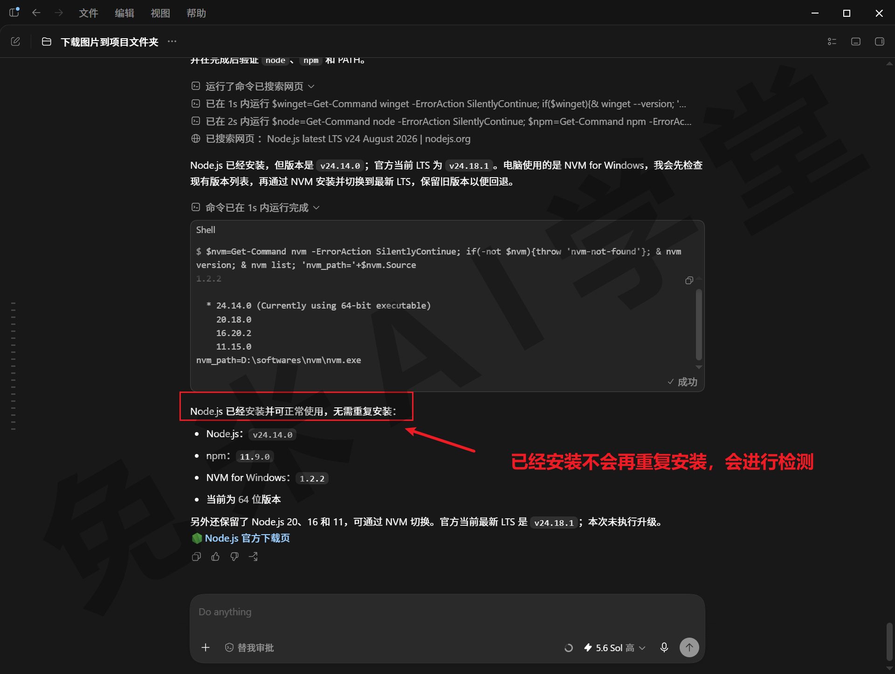

**装第三方软件的三个表现**

再补三个安装第三方软件时的常见场景：

- 重名：一个名字对应多个软件或多个来源时，它通常会先停下来和你确认要装哪一个，不会自作主张（具体表现需实机验证）。
- 重复安装：电脑上已经装过的软件，它一般会先检测出来，告诉你现成版本可用，不会盲目重装（以实际表现为准）。
- 失败兜底：某一步没装成时，它一般会说明卡在哪里，并给出可以直接复制执行的补救命令，照着跑通常就能续上（具体表现需实机验证）；实在续不上，把报错信息原样发回对话，让它换个方案。

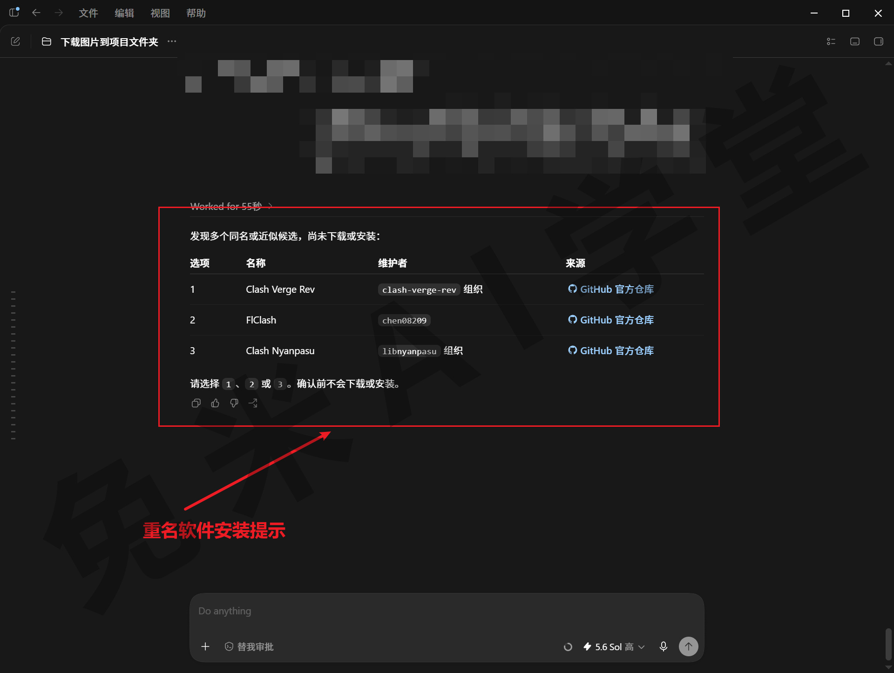

**留下一个习惯**

这一节的收获不是装上了 Node.js，而是一个习惯：安装和环境问题，以后第一反应是交给 Codex 处理，它解决不了的再自己动手。装完有疑问也直接问它，例如“Node.js 装到哪个目录了，占了多少空间”，把它当成一位随叫随到的装机师傅。对新手来说，这一条能省下的时间，比本篇其他内容加起来还多。

### 4.7 三个练习任务

下面三个任务用你自己的文件把本篇内容过一遍。提示词可以直接复制；方括号里的内容换成你自己的。

**任务一：批量重命名自己的照片**

先把自己的一个照片文件夹复制一份副本，把副本放进项目，然后发送：

```
把这个文件夹里的照片按内容重新命名，格式用“编号-内容描述”；内容拿不准的先列出来问我。
```

完成标准：文件名能看出内容，抽查几张没有明显认错。

**任务二：挑一类图片合成短视频**

从刚整理好的照片里挑一类，发送：

```
挑出所有[美食]照片，合成一段每张 3 秒的短视频；原图不要动，视频放在项目文件夹里。
```

完成标准：视频能正常播放，原图完好无缺。

**任务三：分析自己的下载文件夹**

发送：

```
分析我的下载文件夹的空间占用，按大小列出前 20 项并给出清理建议；先不要删除任何东西。
```

练习只做到“给出清理建议”这一步，是否删除、删除哪些，由你自己决定。

完成标准：能看懂建议清单，说得出哪几项自己敢删、哪几项要留。

### 4.8 本篇小结与自检

这一篇通过五个案例覆盖了文件处理的基础能力。最需要记住的是：**Codex 的产出是实际文件，直接保存在项目文件夹中；删除、安装这类有影响的操作，它会先征求你的确认。**

可以对照下面的清单检查学习结果：

- [ ] 完成过一次 50 个以上文件的批量整理
- [ ] 完整跑通“重命名 → 合成视频 → 配乐”三步递进
- [ ] 用 Codex 分析过一个文件夹的空间占用，并看懂清理建议
- [ ] 让 Codex 安装过一个工具，并看到它自行验证版本
- [ ] 知道任务跑偏时怎么停止和纠正

完成这些内容后，文件相关的日常需求你已经可以独立交给 Codex 处理。下一篇《办公能力一集讲全》把这些素材直接带进办公场景：Excel、PPT 和 PDF。

### 4.9 新手常见问题

**Q1：让它删文件安全吗？**

有多层保障，但别全靠机制。流程上，它一般会先给出清单、征求你的确认，执行时还可能触发权限审批（《权限、沙盒与模型》讲过），决定权始终在你手里。你自己再加三个习惯：重要资料所在的文件夹，操作前先备份；确认删除清单时逐项看过，不要凭数量整批同意；不要默认删掉的文件一定能找回来，确认之前把每一次删除都当作不可恢复来对待。机制加习惯，删除类任务的风险就很小了。

**Q2：一次处理多少文件比较合适？**

没有固定上限，但批量越大，耗时越长，中途出问题的排查成本也越高。建议第一次从几十个文件起步——本篇案例用的 40 张就是这个量级，跑顺之后再逐步加量。特别大的批量，可以让它先处理其中一小部分，你验收满意后再放开全量，这样返工成本最低。文件多、体积大时任务明显变慢是正常现象，耐心等它跑完即可。

**Q3：它自己装的软件可靠吗？**

它一般会优先从官方或常用渠道获取安装包，装完还会自行验证；同时，安装属于会改动系统的操作，通常要经过你的审批才会执行。你要做的是在审批时看清两件事：装的是什么、从哪里下载。对来源有疑问，可以直接问它“这个来源是官方的吗，有没有更稳妥的渠道”。在工作电脑等重要环境上，保持和平时自己装软件同样的谨慎即可。

**Q4：任务中途跑偏了怎么停？**

两种处理方式。想立刻停下：用界面上的停止入口结束当前任务，位置以实际界面为准。只是方向有偏差、不想整个作废：直接发消息说明正确方向，它会把新要求纳入执行；更系统的纠偏方法（引导注入）《计划模式》会专门演示。停下来之后，可以在《界面全导览》认识过的 Diff 改动面板里确认它已经改了什么；看懂改动、把不想要的改动还原，《AGENTS.md、Diff 与还原》会完整讲解。

