## 办公能力一集讲全

《文件能力一集讲全》整理的是文件本身，这一篇进入产出环节：Excel、PPT、PDF 和文档格式互转，把日常办公最常见的四类产出一次讲完。学完这一篇，“把数据做成带图表的统计表”“把统计结果变成汇报页”“给图片加水印输出 PDF”这类需求，你都可以直接交给 Codex。

素材不用另外准备：《文件能力一集讲全》大扫除时，Codex 分析过你的下载文件夹，这一篇就从那份数据出发，零准备开始。没有跟着练过也不要紧，5.2 的第一条指令会现场生成同样的素材。

### 5.1 两种产出方式：插件与直接写文件

**先想清楚一个问题**

办公文件和《文件能力一集讲全》里的图片、视频有一点不同：它讲究“格式”。一份 Excel 里有公式、样式和图表，一页 PPT 里有版式、字体和配色；内容写对只是第一步，格式做对才算能交付。普通聊天工具通常只能把内容写给你，格式还得你自己搬进办公软件；Codex 则直接产出做好格式的文件。为了把格式做好，它有两条路径，动手前先分清楚。

**方式一：通过插件**

插件是打包好的专项能力，你可以把它理解成给助手配的专业工具箱：处理什么文件，就换上对应的工具。办公场景最常用的是官方的表格（Spreadsheets）、演示（Presentations）两个插件，同一家族里还有负责 Word 文档的文档（Docs）插件和专门处理 PDF 的插件（各插件的确切名称与清单，需实机验证）。插件产出的文件格式化程度更高：表格自带样式和图表，演示文稿自带版式，拿到手就接近可以直接交付的状态。

**插件在哪里、怎么装**

插件集中放在应用的插件面板里，入口通常在侧边栏（位置与名称，需实机验证）。面板里能看到官方提供的插件列表，找到要用的插件点安装，装好后卡片上会出现已安装的标记；有的卡片还提供“在对话中试用”一类的快捷入口，点一下会把插件加进输入框并附上一条示例提示词（按钮名称与形态，需实机验证）。本篇用到的表格、演示插件都属于官方核心插件，一般随应用提供，装一次以后都能用。

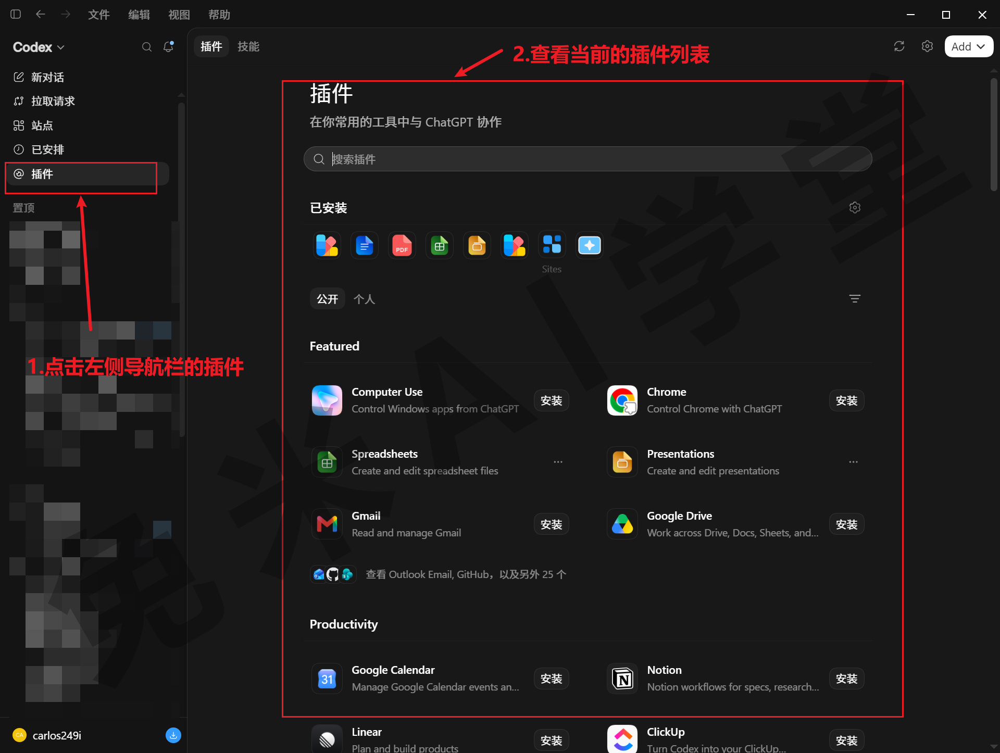

**怎么调用**

装好之后，在输入框输入 @，会唤出插件选择列表，选中要用的插件，再接上你的要求发送即可。两个细节：

- 没安装的插件不会出现在这个列表里，@ 了找不到，先回插件面板安装。
- 你也可以不做任何指定，直接把需求说出来，它判断需要时会自己启用合适的插件（是否自动启用，以实际表现为准）。

顺带认识一个相邻概念：输入 `$` 唤出的是技能列表，那是另一套“工作方法”体系，和插件不是一回事，《Skills 技能系统 + 桌面宠物》会专门讲，这一篇用不到它。

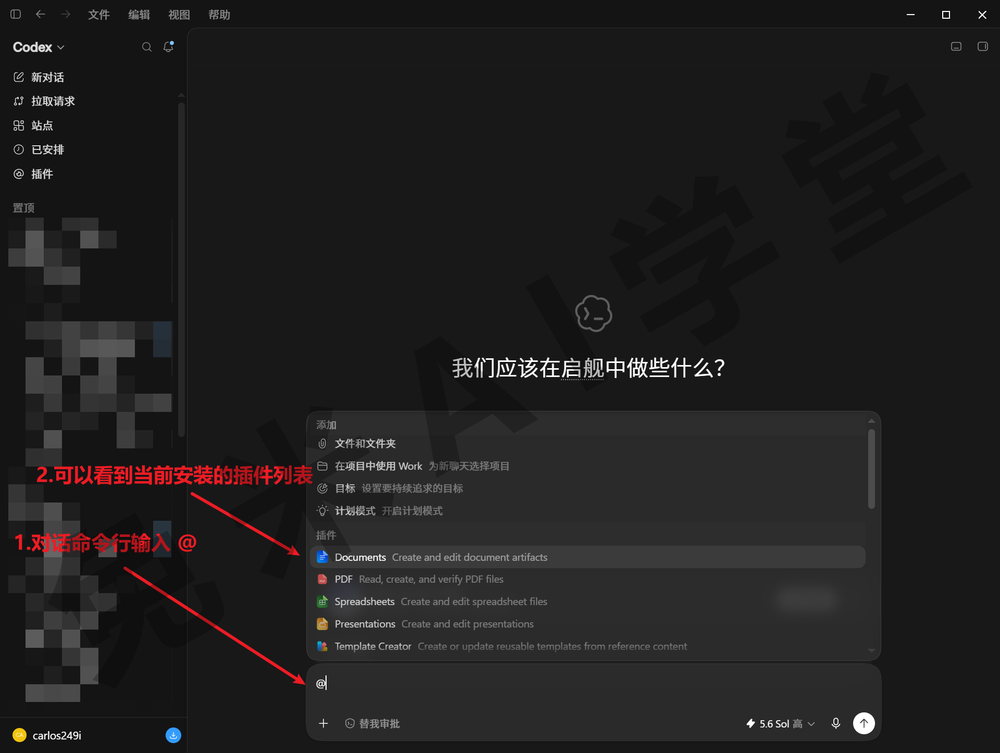

**先用一次：最小演示**

概念说到这里先停一下，动手用一次，比接着往下读直观得多。拿表格（Spreadsheets）插件做一个最小演示：在输入框输入 @，在列表里选中表格（Spreadsheets）插件（列表中的显示名称，需实机验证），选中后插件会出现在输入框里，接着输入这条指令发送：

```
新建一个演示表格：两列，列名“物品”和“数量”，随意填三行示例数据；
保存为“插件演示.xlsx”，放在项目文件夹里。
```

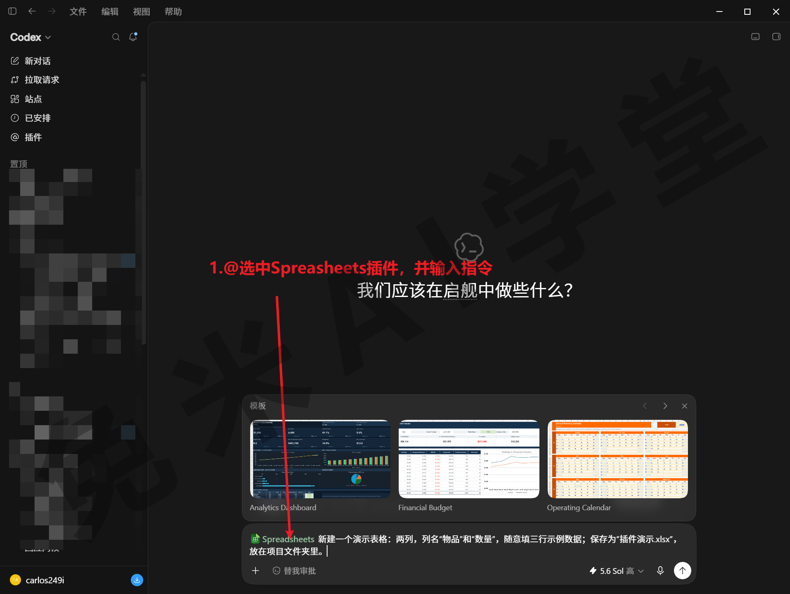

任务跑完，项目文件夹里会出现“插件演示.xlsx”，点开看一眼：表头带样式、数据排得整齐，是一份可以继续编辑的真表格。这就是“走插件”的完整动作——@ 选中插件、说清要求、拿到产物，后面三个案例都是这个动作的放大版。演示文件没用了，直接让它删掉即可。

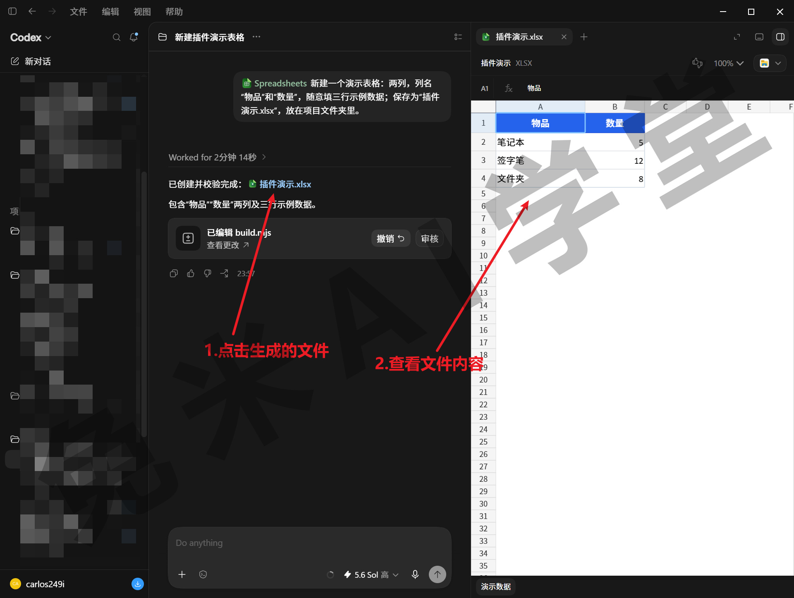

**方式二：直接写文件**

第二条路径不经过任何插件：直接让 Codex 生成或修改文档，和《文件能力一集讲全》里处理图片、视频是同一个道理。它靠通用能力把文件写出来，需要转换工具时自己安装，这正是上一篇“让它自己装工具”留下的习惯。这种方式更灵活，各种格式都能写，适合内容为主、格式要求不高的产出，也适合插件覆盖不到的格式。

**怎么选**

两条路径的取舍可以概括成一组对比：

- **走插件**——产物格式化程度高、更接近可交付状态，适合要给别人看的正式产出：汇报用的表格、演示文稿、对外发的文档。
- **直接写文件**——不挑格式、上手最快，适合自用的草稿、批量生成的简单产物，以及插件清单之外的文件类型。

这个判断不必先背：后面三个案例两种方式都会用到，跟着感受即可。拿不准就不指定，把需求说清楚，让它自己选路径。

**常见坑**

两个新手常绕弯的地方：

- 输入 @ 找不到想用的插件，多半是没有安装，回插件面板确认；刚装完的插件如果在旧对话里没生效，新开一个对话再试（生效时机，以实际表现为准）。
- 不必“为了用插件而用插件”：一份只给自己看的清单，直接写文件几秒钟就好，专门绕去调插件反而多一步。

分清这两条路径，本篇的地图就有了：接下来三个案例，分别落在 Excel、PPT 和 PDF 上。

### 5.2 案例一：文件清单变成带图表的 Excel

第一个案例把下载文件夹的数据变成一份带图表的统计表。这是日常办公里最常见的需求形态：手里一堆原始数据，要一份能看的报表。

**第 1 步：拿到素材**

发送：

```
把下载文件夹的文件清单（文件名、类型、大小、修改日期）整理成表格，
保存为“文件清单.xlsx”，放在项目文件夹里。
```

《权限、沙盒与模型》讲过，下载文件夹在项目之外，访问时会触发权限确认，看清提示里的路径再允许。任务完成后，项目文件夹里会出现“文件清单.xlsx”，点开可以在预览区看到整理好的四列数据。这一步没什么技术含量，却是后面所有产出的地基：先把数据装进表格，才谈得上统计。

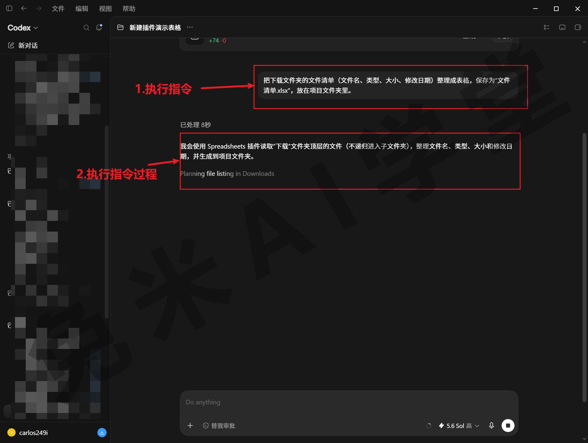

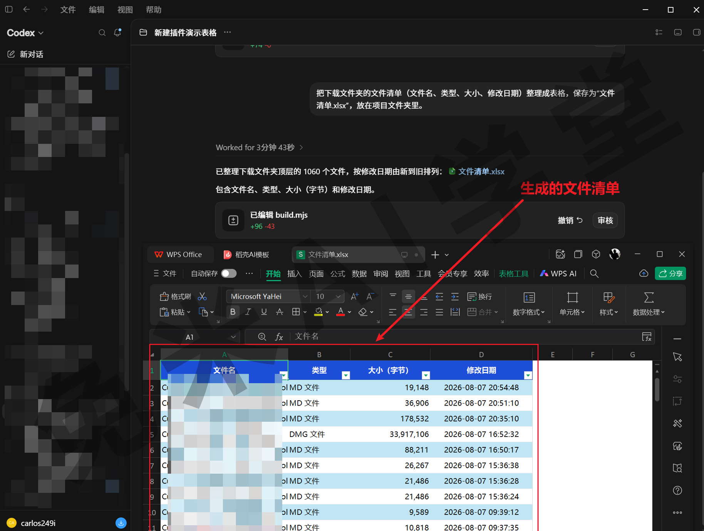


**第 2 步：一句话生成分类统计表**

发送：

```
基于“文件清单.xlsx”做一份分类统计表：按文件类型统计数量和总大小，
按占用空间从大到小排序，配一张图表；输出为“下载文件夹统计.xlsx”。
```

想明确走插件，就先输入 @，在列表里选中表格（Spreadsheets）插件，和 5.1 最小演示是同一个动作，再接这句话发送；不指定，它也会自行选择产出方式。跑完后打开成品：分类、数量、合计、排序、图表一次到位（统计表与图表的具体形态，需实机验证）。有一点值得专门确认：产物是真正的 xlsx 文件，不是一张截图——你可以用 Excel 或 WPS 打开它，里面的公式、格式、图表都能继续编辑。这是“能进工作流的产出”和“只能看的回答”的本质区别。

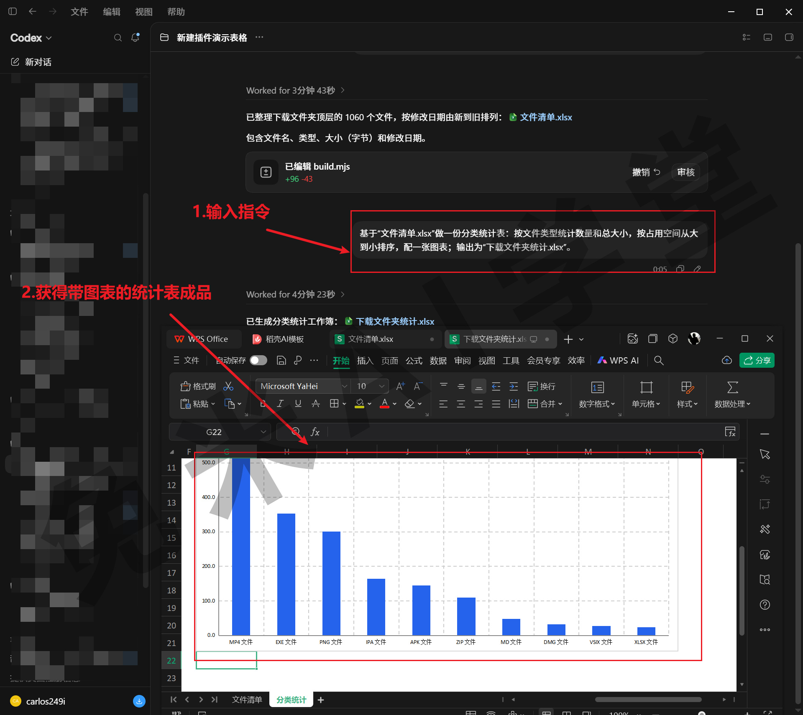

**第 3 步：抽样核对（本篇最重要的原则）**

自动生成的公式和图表必须抽样核对，这一条是本篇的底线原则。做法不复杂：从统计表里挑一行，例如“图片”类的数量，回到“文件清单.xlsx”里筛选同类型数一遍，两边对上才算过关；再抽一个合计类的数值，用同样的办法验一次。发现对不上，把差异描述给它，让它重查并说明原因。

也可以让它先自查一轮，发送：

```
把统计表和原始清单重新核对一遍，说明每个统计值的计算口径。
```

但要清楚自查的分量：AI 的自查报告可能写得很完整，实际仍有漏掉的错误，各类 AI 办公工具的公开实测里，“自称验证通过、页面上仍有明显疏漏”的情况并不罕见。它的自查是第一道防线，你的抽查是第二道；生成者不能自己当裁判，重要报表交付前一定自己过一遍。

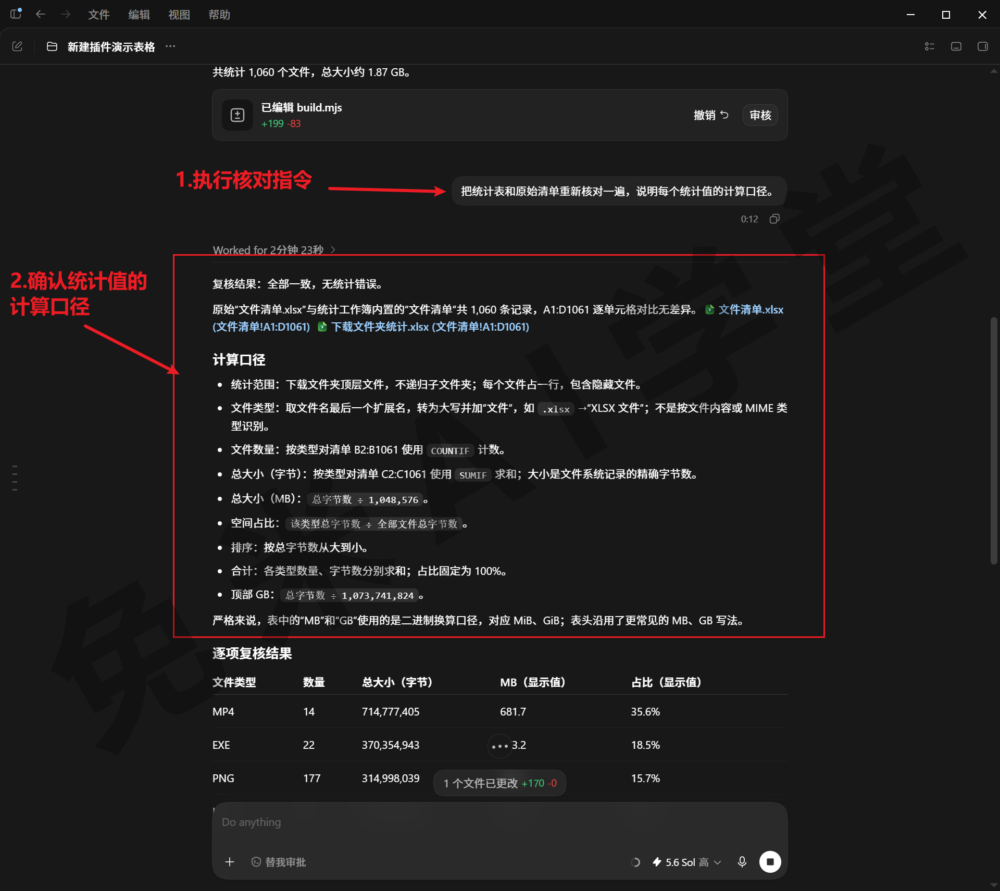

**第 4 步：二次修改**

统计表可以继续用一句话修改，发送：

```
在统计表里加一列“占比”，用公式计算，图表同步更新。
```

指令里点名“用公式计算”是个实用习惯：它有时会把结果直接写成固定数值，原始数据一变就不会跟着更新，提前要求用公式能避免这一点（实际生成公式还是数值，以实际表现为准）。改完再抽查一次新增的数值。到这里，“生成、核对、修改”的闭环就完整了，这个闭环适用于本篇后面的所有产出。

**常见坑**

数据量大时生成会明显变慢，先拿一部分数据验证思路，满意再放开全量，具体做法见 5.8 的 Q4；图表类型不合适，例如占比数据配了折线图，直接一句话让它换成柱状图或饼图即可，不必重做整张表。

### 5.3 案例二：一句话变一页汇报 PPT，再二次修改

数据有了，下一步是汇报。把统计结果讲给别人听，最常用的载体还是 PPT。这个案例从上一节的统计表出发，生成一页汇报 PPT，再练两种修改方式。

**第 1 步：生成**

发送：

```
基于“下载文件夹统计.xlsx”生成一页汇报 PPT：标题“下载文件夹体检报告”，
放一张最能说明问题的图表，配三条要点结论；输出为“下载文件夹体检报告.pptx”。
```

想明确走插件，做法和表格一样：先输入 @，在列表里选中演示（Presentations）插件（列表中的显示名称，需实机验证），再发送上面这条指令。生成过程中留意执行日志：它会读取统计表、规划版式、写入文件，中途可能请求联网或安装依赖，按《权限、沙盒与模型》的习惯看清再放行。

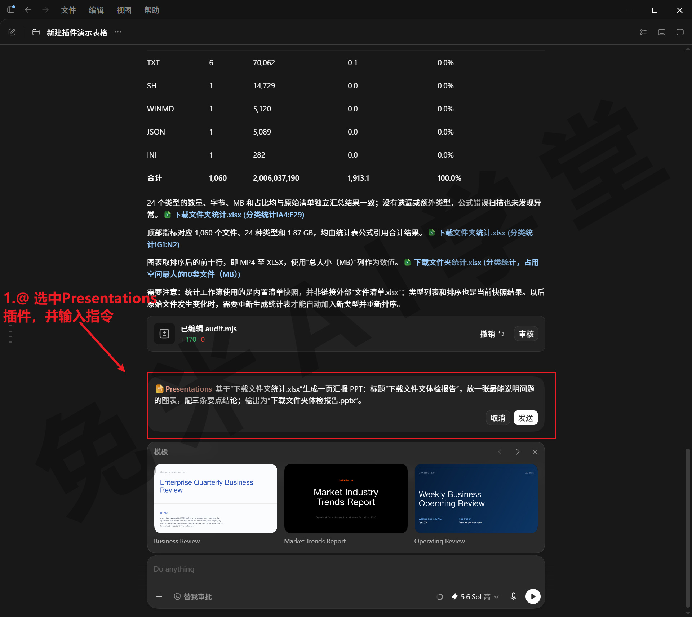

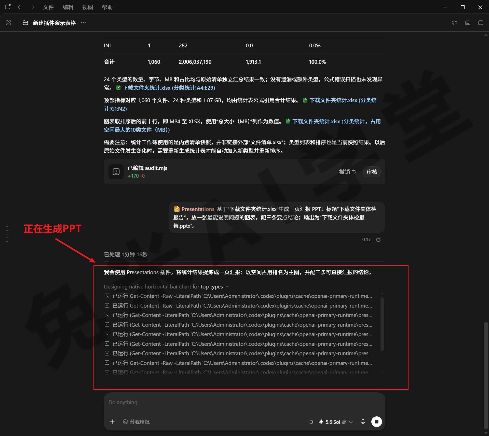

**第 2 步：查看成品**

任务完成后点开“下载文件夹体检报告.pptx”，在侧边预览区查看，《界面全导览》认识过这个区域；预览里可以整页查看版式、图表和文字（PPT 预览的具体呈现，需实机验证）。预览区一般还提供“用本地应用打开”一类入口，可以直接在 PowerPoint 或 WPS 里打开继续编辑（入口位置与名称，需实机验证）。和上一节的 xlsx 一样，这份 pptx 是真正的演示文稿：标题、要点、图表都是独立的可编辑元素，不是拼成一页的图片。

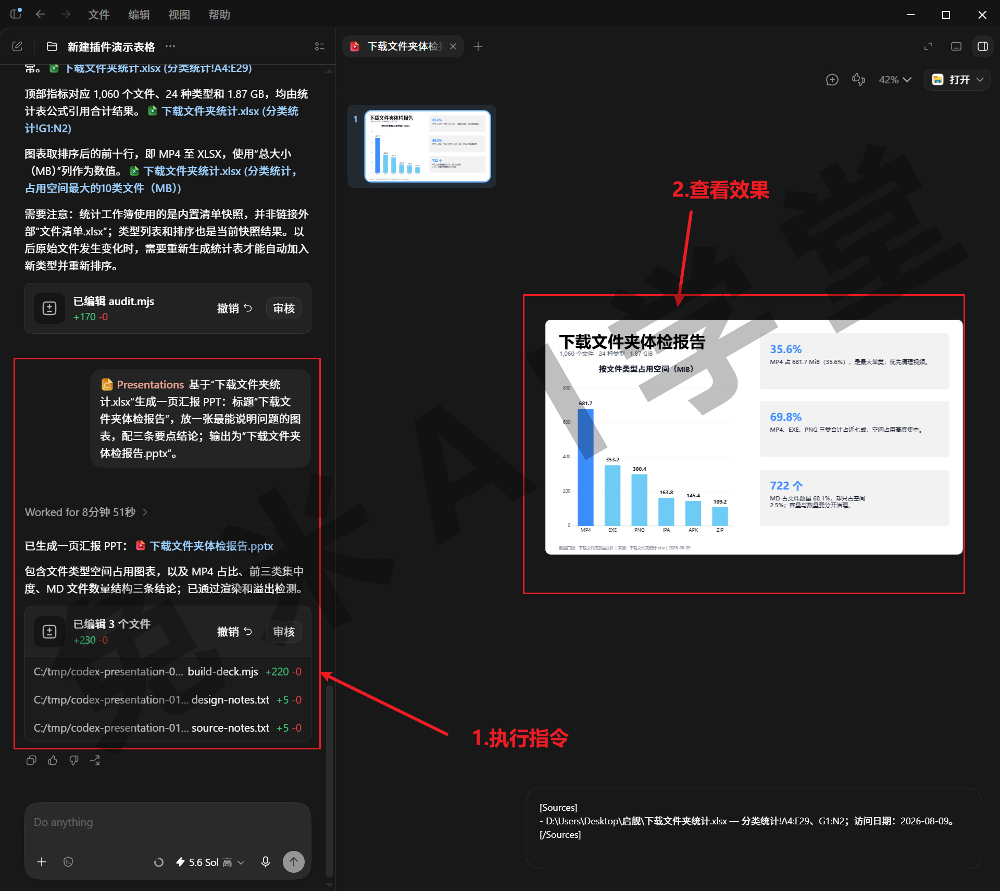

**第 3 步：两种改法**

第一种是整体描述，对着对话框说清改哪里，发送：

```
把标题改成“下载文件夹清理报告”，三条要点压缩成两条，只保留最重要的。
```

第二种更精确：在预览里选中要改的那处元素，直接输入指令，例如“这行字放大一号”。选中的位置会作为批注附进你的指令，修改只落在选中处，不会牵连其他内容；要改的地方多，可以连续选中、逐条下指令，让它把几处修改集中在一轮里处理（批注与批量处理的形态，需实机验证）。改标题、换重点、调图表都可以这样迭代，每次改完扫一眼预览，确认改动落在你要的位置。

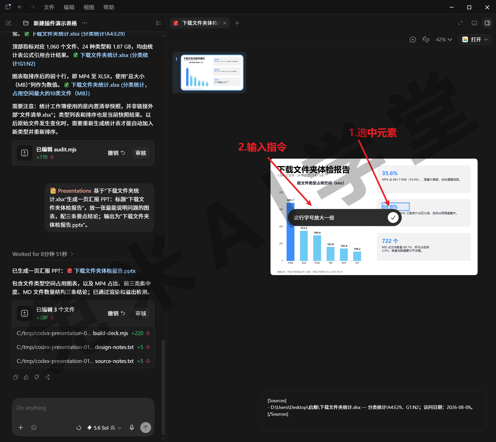

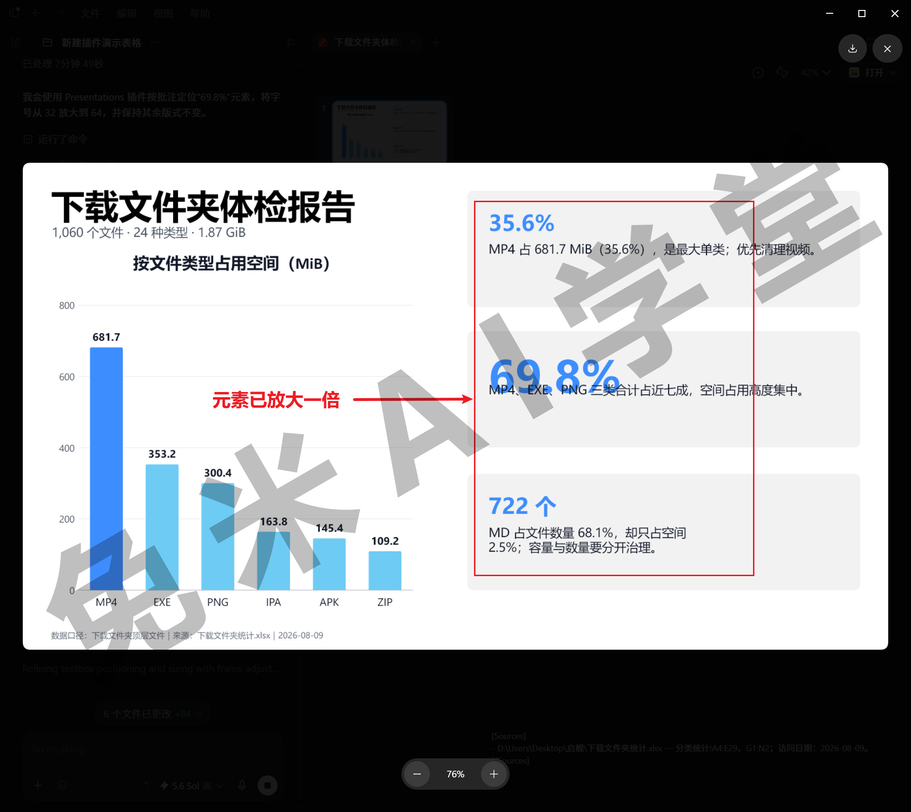


**边界与取舍**

这个案例做的是单页汇报：一页纸讲清一件事，也是新手最容易出效果的形态。整套几十页的演示涉及结构设计，要先定讲述顺序再逐页产出，直接一句话生成整套，风格和详略往往不受控。做整套演示更合适的路子是先规划、确认结构、再动手，下一篇《计划模式》讲的正是这种工作方式；对版式有更高要求时，还可以给它参考模板照着排，见 5.8 的 Q2。

**常见坑**

两个交付前必查的点：

- **文字**：投影场合的正文字号不要太小，页面上文字挤成一团，就让它精简要点、放大字号，一页放不下就拆成两页。
- **字体**：你电脑上生成的 PPT 换一台电脑放映，缺字体时版式可能变样，重要场合提前在目标电脑试放一遍，或者同时导出一份 PDF 版做保险（字体嵌入情况，以实际表现为准）。

### 5.4 案例三：图片批量转 PDF 加水印

第三个案例处理一个保护原创内容的常见需求：一批图片要交出去给人看，又不希望被直接拿去使用。常用做法是合成 PDF，并加上带自己名号的全屏水印：内容看得清，盗用成本却高了很多。摄影作品集、设计提案、课件预览，都是这个做法的典型场景。

**第 1 步：一句话生成**

素材接着用《文件能力一集讲全》里重命名过的照片。发送：

```
把项目里的风景照片按编号顺序合成一个 PDF，每页一张；
每页加一层半透明的全屏斜向水印，水印文字用“我的作品”；输出为“风景作品集.pdf”。
```

练习时把水印文字换成你自己的名号。上一篇批量重命名留下的编号前缀，在这里直接决定 PDF 的页序，素材管理的价值此刻就体现出来了。任务跑完，项目文件夹里会多出一个 PDF 文件，页数应当与照片张数一致，先核对这一点再看效果。

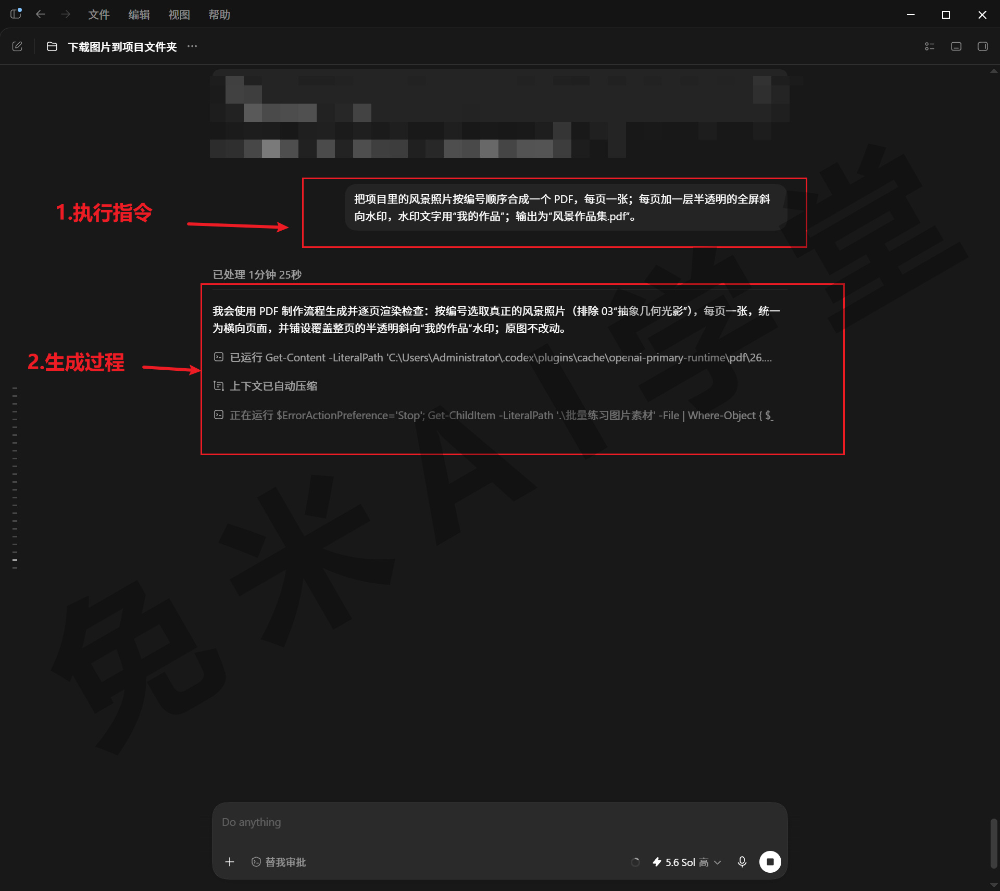

**第 2 步：翻页检查**

点开成品翻几页，重点看两件事：水印是否盖住了整页——只盖住角落起不到保护作用；画面主体是否仍然清晰可辨。水印的浓淡是一对矛盾：太淡形同虚设，太浓毁掉画面。不满意直接说，透明度、字号、倾斜角度、密度都可以一句话调整，例如“水印再淡一些，倾斜 45 度，每页铺两行”（实际水印样式与效果，需实机验证）。

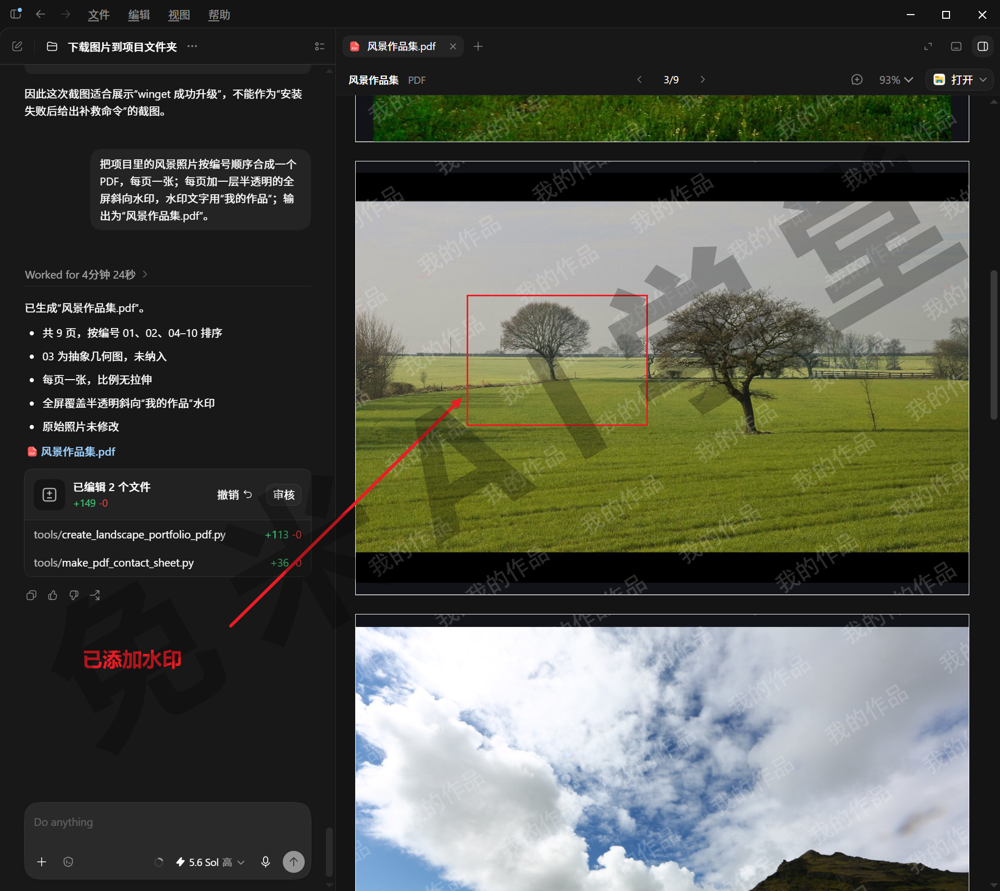


**页序、封面这些也能顺手调**

除了水印，PDF 的编辑类需求同样一句话：页序不对，让它按文件名重新排；想在开头加一页封面，说清标题和日期；后来新拍的照片要追加进去，或者要删掉其中一页，直接讲要求即可，不必回头重做整个文件（编辑类操作的支持范围，以实际表现为准）。竖构图的照片放进横向页面会怎么处理也值得看一眼：常见做法是等比缩放、两侧留白，想统一裁剪成满页效果，提前在指令里说明。

**顺带认识官方 PDF 能力**

刚才的水印任务走的是“直接写文件”路线。PDF 在官方插件家族里也有专门位置：PDF 插件负责读取、生成、检查这类版式固定的文件，核对合同页、报告版面、扫描资料时，比按纯文本读取更可靠（插件名称与能力范围，需实机验证）。预览则不需要额外准备，点开 PDF 文件就能在预览区翻页查看（创建、编辑的具体入口，需实机验证）。现阶段记住一件事就够：PDF 相关的需求，不管是生成、修改、加水印还是读内容，都可以直接用说的，需要插件时它会自己用上。

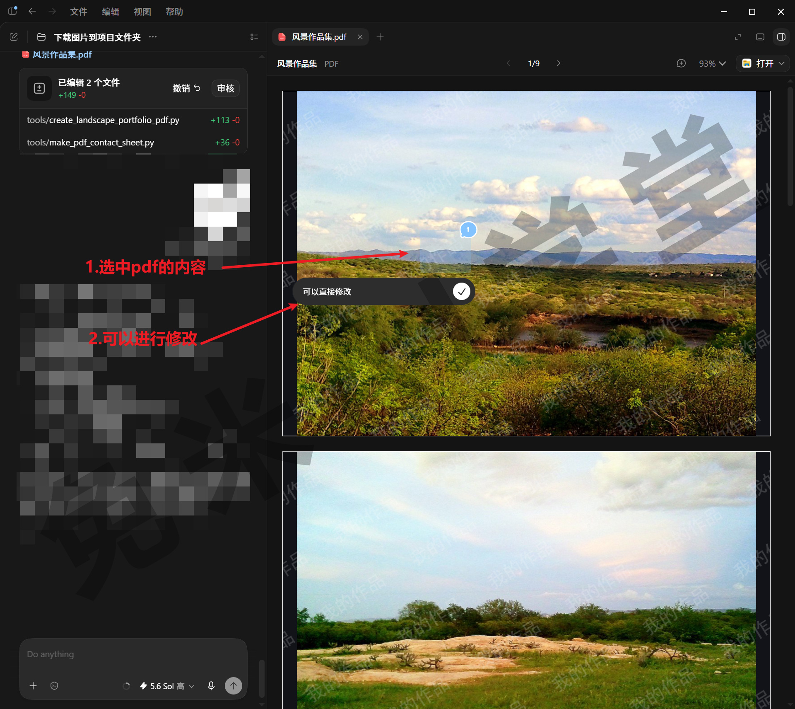


**边界与常见坑**

PDF 的定位是“定稿分发”：版式固定、对方不易误改，适合交出去；反过来，它也不适合继续编辑，内容要再改，回到源文件改好重新导出，比直接改 PDF 顺得多，这个话题下一节展开。另外两个提醒：大批高清图片合成的 PDF 体积可能很大，发送前让它压缩一版，或者按主题拆成几个文件；水印提高的是盗用成本，并非绝对防护，真正敏感的内容仍要控制发放范围。

### 5.5 文档格式互转

办公里经常要在 Word、Markdown、PDF 之间转换格式：对方点名要 Word，你手里是 PDF；用 AI 写作积累的是 Markdown，交付时要正式文档。格式转换过去要么装专门软件，要么找在线工具，现在直接交给它。

**先生成一份源文档**

发送：

```
把这次下载文件夹分析的结论写成一页 Word 报告，包含统计要点和清理建议，
保存为“清理报告.docx”。
```

想走插件路线，@ 选中文档（Documents）插件再发送也可以（插件在列表中的显示名称与产出形态，需实机验证）。打开看一眼：标题、正文、要点齐全，就是一份可以继续编辑的 Word 文件。

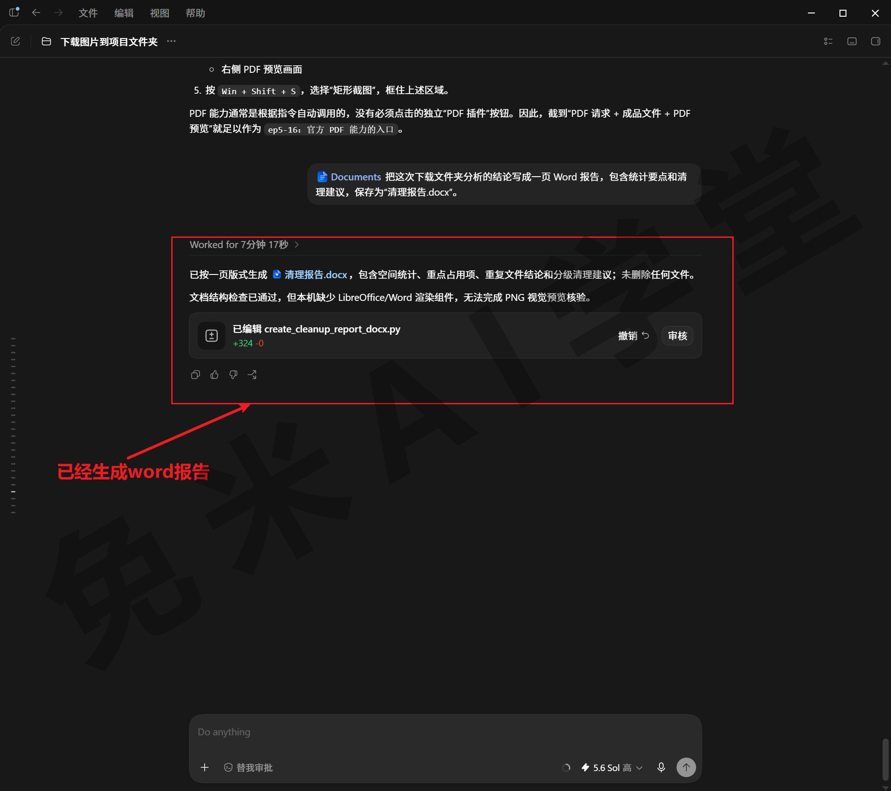

**各转一次**

接着把它转成另外两种格式。发送：

```
把“清理报告.docx”转成 PDF，排版尽量保持一致，输出“清理报告.pdf”。
```

再发送：

```
把“清理报告.docx”转成 Markdown，输出“清理报告.md”。
```

Markdown 是一种纯文本写作格式，《界面全导览》练习里生成的 .md 文件就是它，AI 工具普遍最擅长读写这种格式。转换时它一般会调用文档转换工具完成；机器上缺工具时，它会现场安装，装不上也会明说缺什么（实际转换方式与依赖，以实际表现为准）。首次转换弹出安装确认属于正常流程，《文件能力一集讲全》已经练过这一幕。

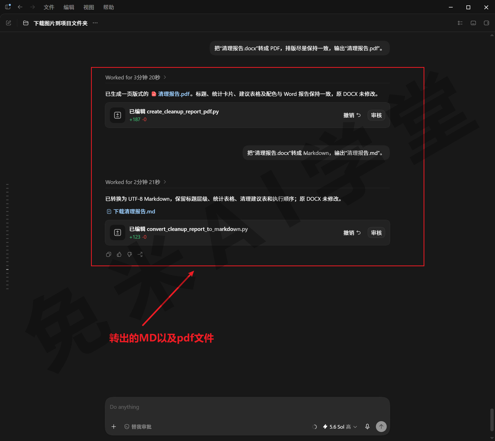

**不止单个文件**

转换也可以成批交付：例如发送“把项目里所有 .md 文件各转一份 PDF，存进‘导出’子文件夹”，它会逐个处理并汇报结果。遇到扫描出来的图片型 PDF 要格外留意：那类文件里的“文字”其实是图片，转换前它一般要先做文字识别，识别质量直接决定转换质量（是否自动识别，以实际表现为准）。

**什么格式适合什么场景**

三种格式各有明确分工：

- **PDF**——版式锁定，适合交付、打印、存档，对方打开即所见、不易误改；代价是几乎没法继续编辑。
- **Word**——适合还要继续修改、要走审批流程的场景，是大多数单位的通用格式，批注和修订也都在这里完成。
- **Markdown**——纯文本、轻便、不挑软件，适合让 AI 继续加工和长期维护的内容，做版本管理也最友好。

一个通用原则：内容没定稿，留在 Word 或 Markdown 里继续改；定稿要发出去，再导出 PDF。

**保真检查与常见坑**

复杂排版是互转的重灾区：多层表格、页眉页脚、目录页码、嵌入图表，转换时都可能丢失或变形，保真程度以实测为准（需实机验证）。转 PDF 时还有一个隐蔽变量是字体：机器上缺相应字体会用近似字体替代，长文档的分页位置也可能随之前后移动。重要文件转换后自己翻一遍，重点核对标题层级、表格、图片和页码。两个新手坑要避开：

- 转完就把源文件删掉——PDF 反向转回 Word 的保真度通常最差，源文件永远保留。
- 文档里带公式、特殊符号时，转换后容易乱码或走样，这类文档转完先检查那几处。

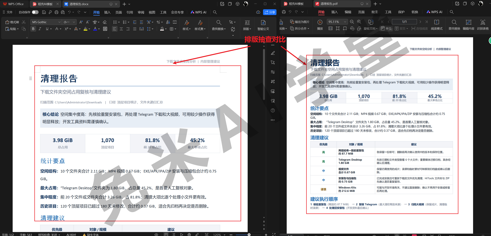

### 5.6 三个练习任务

下面三个任务换成你自己的素材，把本篇流程完整走一遍。提示词可以直接复制，方括号里的内容换成你自己的。

**任务一：拿自己的一批数据生成带图表的 Excel**

找一份自己的数据放进项目，家庭开支记录、工作台账、手机相册导出的清单都可以，然后发送：

```
基于项目里这份数据做一份分类统计表，配一张合适的图表，输出为新文件；
统计口径先列出来让我确认。
```

完成标准：拿到统计表后，至少抽样核对过一处数值，并完成一次二次修改。

**任务二：把它变成一页 PPT，并修改一处细节**

发送：

```
基于刚才的统计表生成一页汇报 PPT，标题你先拟一个，放一张图表加三条要点。
```

看过效果后，用一句话完成一处二次修改，改标题或换重点都可以；有条件再试一次“选中元素改”的批注方式。

完成标准：二次修改后的版本符合你的要求。

**任务三：给自己的一组图片加水印，输出 PDF**

挑一组自己的图片放进项目，发送：

```
把这组图片合成一个 PDF，每页一张，每页加半透明的全屏斜向水印，水印文字用“[你的名字]”；
输出为新文件。
```

完成标准：翻页检查过水印效果，图片主体仍然清晰可辨。

### 5.7 本篇小结与自检

这一篇覆盖了日常办公的四类产出：Excel、PPT、PDF 和格式互转。最需要记住的是：**自动生成的公式和图表必须抽样核对，重要文件交付前自己过一遍。**

可以对照下面的清单检查学习结果：

- [ ] 生成过一份带图表的 Excel，并完成一次二次修改
- [ ] 生成过一页 PPT，并完成一次二次修改
- [ ] 给一批图片加水印并输出为 PDF
- [ ] 能说出插件产物和直接写文件的区别
- [ ] 核对过至少一处自动生成的公式或图表

完成这些内容后，你已经能用 Codex 覆盖大部分日常办公产出。下一篇《计划模式》开始做第一个完整作品：搭一个迷你网站。

### 5.8 新手常见问题

**Q1：生成的公式可靠吗？**

大多数时候是对的，但不能默认它对，这正是本篇反复强调抽样核对的原因。实用做法分两道：第一道让它自查，生成后要求它“重新核对一遍并说明每个数值的计算口径”；第二道自己抽查，挑两三个关键数值回到原始数据里验证——公开实测里“自查说没问题、实际有漏洞”的情况并不罕见，所以第二道不能省。数据量大、口径复杂的报表，还可以让它在表格里附一列口径说明，方便日后回查。重要文件交付前，自己过一遍是底线。

**Q2：PPT 的风格可以更换吗？**

可以，用一句话描述想要的风格即可，例如配色、字号、版式的调整；也可以把公司模板或一张参考图放进项目，让它照着排。风格类调整通常要多迭代几轮，每次只提一两个改动点，收敛更快；只改单个元素时，用 5.3 的批注方式最省事。想从源头拿到更规整的整套版式，先规划再产出的做法见下一篇《计划模式》。插件支持的风格选项以实际界面为准。

**Q3：插件从哪里安装？**

在应用的插件面板里，入口通常在侧边栏（需实机验证）。面板里能看到官方提供的插件，本篇用到的表格、演示插件都在其中，点安装即可，装好后输入 @ 就能调用。@ 列表里找不到某个插件时，先确认它装没装，再确认当前版本是否提供这个插件（以实际界面为准）。插件的完整体系，包括市场、第三方插件、授权和信任分级，是《插件与部署上线》的主要内容；这一篇先把官方办公插件用起来，细节到时候展开。

**Q4：文件很大时处理很慢怎么办？**

文件越大，读取和生成耗时越长，变慢是正常现象，不代表出错。几个缓解办法：先让它只处理一部分，例如前 100 行或前 10 页，验证效果满意再放开全量；把大任务拆成几步，一步一步确认；耗时长的任务交给它之后，你可以另开对话处理别的事，《界面全导览》讲过多对话并行。如果长时间没有进展或反复失败，停止任务，把文件拆小一些再试。

