## 计划模式

《文件能力一集讲全》和《办公能力一集讲全》里，你发给 Codex 的任务都是同一种做法：一条指令发出去，它直接执行。这一篇介绍另一种做法，计划模式：复杂任务先对齐方案，你确认之后它再动手。我们还会用它完成课程的第一个完整作品：个人电子名片站。这个作品在后面的《AGENTS.md、Diff 与还原》《插件与部署上线》《内置浏览器全解》里会反复用到，请认真做完并保留好。

### 6.1 什么任务需要计划模式

**从一次不愉快的返工说起**

设想你直接发一条指令：帮我做一个个人名片网页。Codex 会立刻动手，几分钟后交出一个成品。问题在于，这个任务里藏着大量它替你做的决定：页面什么风格、放哪些内容、配色偏商务还是偏活泼。你没说，它就只能猜。猜对了皆大欢喜；猜偏了，你就要一轮一轮地提修改意见，改到后面常常发现，还不如推倒重来。

再想想前两篇的任务为什么没有这种烦恼：改文件名、转格式、生成一份带图表的 Excel，要求一句话说得清，做法也基本只有一种，没什么可猜的。做一个网站则完全不同：做法有很多种，你自己可能也没想全要什么。这类任务一上来就动手，方向一旦错了，返工的代价远比多聊几句大。

**计划模式是什么**

计划模式就是为这类任务准备的工作方式。开启之后，Codex 收到需求不再直接动手，而是先读你的项目、收集相关信息，把没说清楚的地方逐题问你，再整理出一份计划文档；你看过、改过、点头确认，它才开始实施。你可以把这套流程理解成装修：先和设计师把需求、预算聊透，出了设计图签字确认，工人才进场，而不是让施工队凭感觉直接开工。

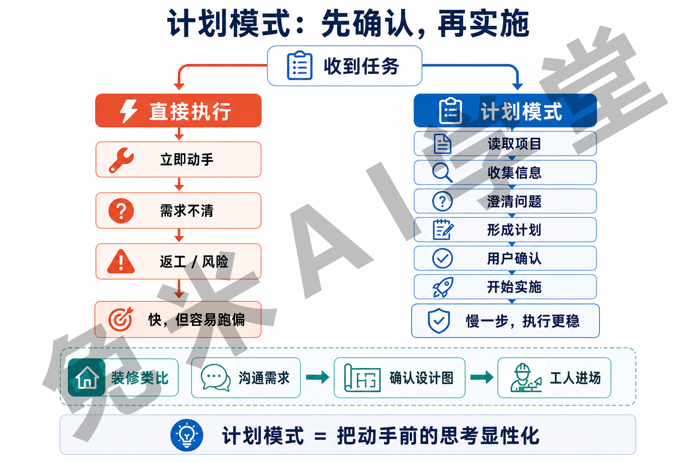

官方的使用建议也是同一个思路：复杂、含糊、一次说不清楚的任务，先让它计划再动手；官方整理的常见错误清单里，多步复杂任务跳过计划这一条名列其中。反过来，官方同样提醒计划模式不必常开，简单任务关掉更省时间、也更省额度。

**什么时候开，什么时候不开**

适合开计划模式的任务，通常至少符合下面一条：

- **步骤多、有先后依赖**：不是一步能做完的事。比如一个包含页面、头像、配色切换的完整网站，先做什么、后做什么，本身就需要安排。
- **同一个需求有多种做法**：技术、风格、结构都存在取舍，需要先选定方向再动手，否则它替你选的未必是你想要的那种。
- **你自己也没想全**：只有一个大概念头，细节说不清，需要它反过来把问题逐个问清楚，帮你把需求补完整。

反过来，一句话能说清、一步能做完的任务，别开计划模式：本来几十秒出结果的事，多走一轮追问和确认反而更慢，还多花额度。一个实用的判断口径：需求一句话讲得明白，直接做；要写上一段话才说得清，就值得先过一遍计划。

**别和只读权限混淆**

一个常见误会要提前说清：开了计划模式，不等于 Codex 进入只读状态。计划模式是协作流程，管的是先想清楚再动手；《权限、沙盒与模型》里讲过的只读权限是权限设置，管的是能不能动文件。两套东西互相独立，也可以叠加使用：讨论方案时想彻底保险，可以一边开计划模式、一边把权限收到只读。日常使用不必这么紧，因为在计划阶段它本来就只读项目、不改文件，确认实施之前你的文件是安全的。

**认知一提：还有一个目标模式**

和计划模式相邻的还有一个目标模式：给 Codex 设一个持久目标，长任务执行中它会一直对照这个目标，判断该做什么、做完没有。两者分工不同：计划模式用在动手之前，把方案对齐；目标模式用在长任务执行中，全程盯住方向。官方也建议，目标本身不好定义时，先用计划模式把它磨清楚。目标模式的深入用法留到实战部分再讲，现在知道有这个分工就够了（该模式在当前中文界面的入口与形态，需实机验证）。

### 6.2 计划模式的完整流程

这一节把流程完整过一遍，总共五步。每一步你要做什么、会看到什么，下面按顺序讲清；6.4 节会用真实作品再从头跑一次。

**动手前置：先找到开关**

计划模式的开关就在对话输入框附近，常用入口有两个：

- **加号菜单**：点开输入框旁的加号，展开的菜单里有计划模式的开关，点一下即开启（菜单项的确切名称与位置，需实机验证）。开启后输入框附近会出现计划模式已开启的标识，方便确认当前状态（标识样式以实际界面为准）。
- **斜杠命令**：在输入框输入 `/plan` 回车，同样可以切换到计划模式；后面还能直接带上需求，例如 `/plan 帮我规划一个报名页`，一条消息完成开启加提问（中文界面里该命令是否显示为本地化名称，需实机验证；斜杠命令的全量盘点见《斜杠命令全集》）。

两个入口一时找不到也不要紧，还有一个永远可用的兜底：把要求直接写进需求里，在消息末尾加一句“先出计划和我确认，再动手实施”，它同样会走先计划后实施的流程。

另有一个小限制：任务正在运行时暂时不能切换计划模式，等当前任务结束再开（运行中尝试切换时的界面表现，需实机验证）。

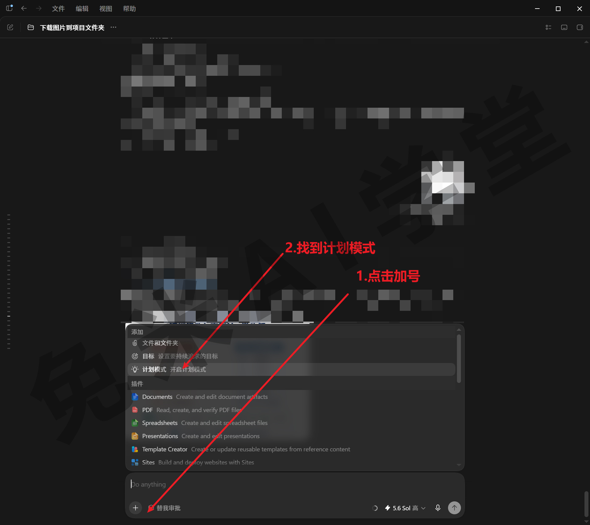

**第 1 步：说出你的需求**

开启计划模式后，像平常一样把需求发出去，一句话就够。和直接执行不同，这一次它不会立刻改任何东西，而是先读你的项目、收集相关信息，为接下来的提问和计划做准备。你会看到任务区开始忙碌，但项目文件不会有任何改动。

```
我想把当前项目里的所有风景照片制作成带水印的 PDF。
请先查看项目中的图片和现有文件，确认素材范围、排列顺序和输出规格，再给我一份实施计划；
在我确认计划之前，不要创建或修改任何文件。
```

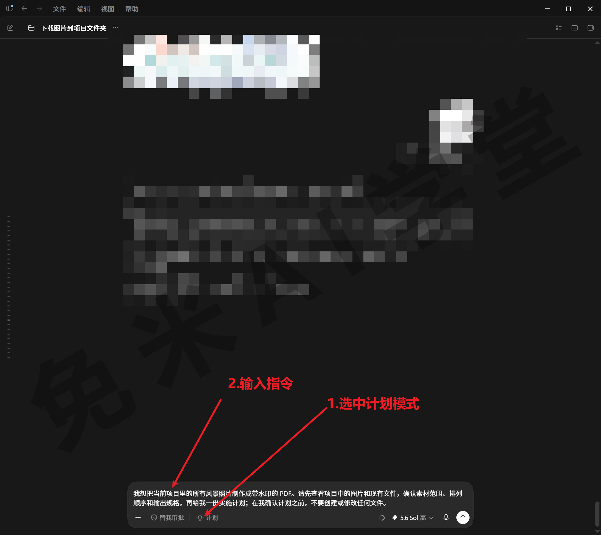

**第 2 步：回答逐题追问**

信息收集完，它会把没说清楚的地方逐题问回来：想要什么风格、包含哪些内容、有什么限制。追问通常逐题呈现，多数题目会附带一个推荐选项，你也可以不选推荐项、完全自己作答（题数、措辞与推荐项的呈现样式，以实际界面为准）。

答题记住两条：拿不准的题直接选推荐项，不必硬想答案；真正在意的点务必自己写清楚，你的回答质量直接决定计划质量。被问烦了也别敷衍，现在多答一题，后面就少返一次工。

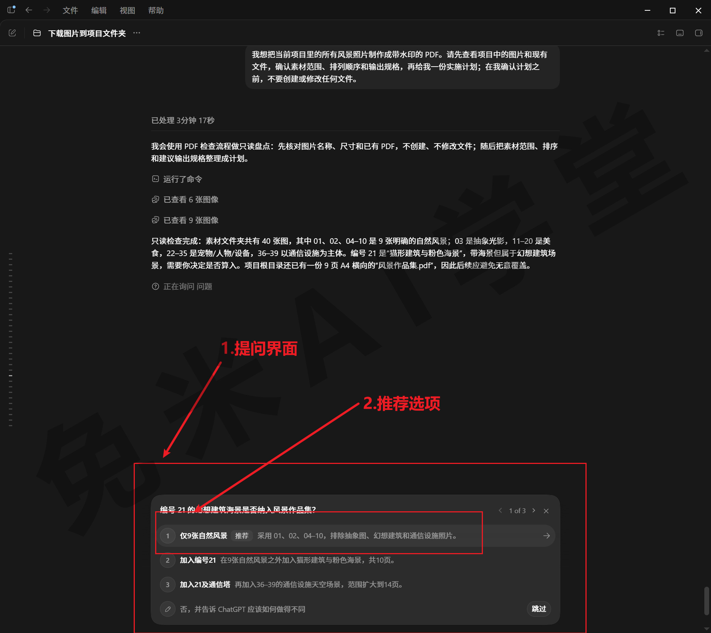

**第 3 步：审阅计划文档**

问答结束后，它会整理出一份计划文档：要做什么、分几步做、每一步产出什么，通常还会列出涉及的文件和验证方式（文档的具体结构，以实际界面为准）。注意此刻它还没写一行代码：这份文档就是你们双方对齐的合同，实施阶段做什么，全以它为准。

看计划抓四类要点就够：目标是不是你要的、范围有没有超出预期、步骤安排合不合理、有没有碰你不想动的内容。碰到看不懂的条目，把它复制下来问一句“这一步是要做什么”，让它自己解释，这和《权限、沙盒与模型》里读权限弹窗的技巧是同一个思路。其余实现细节可以放心交给它把握。

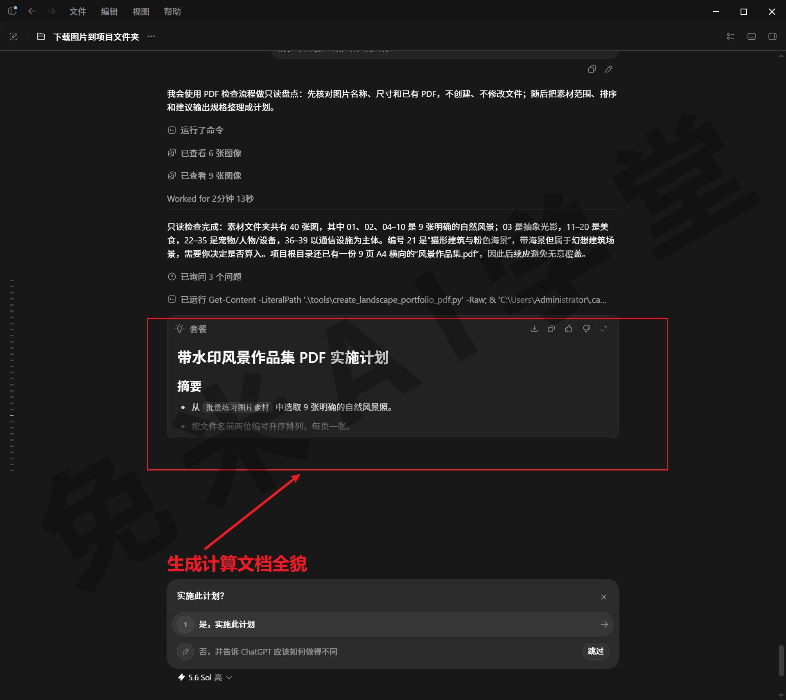

**第 4 步：确认实施**

对计划满意，点下实施计划一类的确认按钮，它才正式动手（按钮的确切文案，需实机验证）。不满意就先别点：怎么在计划层面提修改，下一节专门讲。确认之前，你的项目文件始终不会被改动，这是计划模式给你的底气。

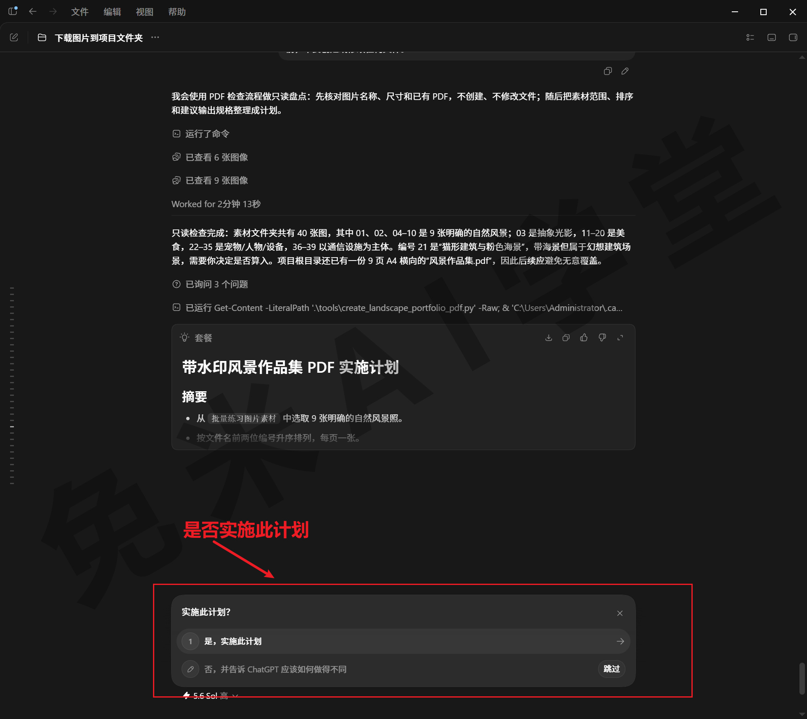

**第 5 步：等它执行并自测**

实施阶段它会按计划逐步推进，每完成一步自己核对结果，发现问题自行修正。你可以在任务区旁观整个过程，也可以先去忙别的。执行中途想补充要求也有办法，6.5 节专门讲。

**需求三要素：把话一次说全**

无论开不开计划模式，发需求时把三样东西尽量交代全，都能明显减少追问轮次、提高计划一次成型的概率：

- **样例**：想要什么效果，给它一个参照。一张截图、一个你喜欢的网站、以前做过的文件都算，文字和图片都可以直接贴进对话，比堆一串形容词管用得多。
- **规则**：必须遵守什么。用什么技术、什么风格、哪些内容不能动，有硬性要求就提前写明，不要等它来问。
- **范围**：做到哪一步为止。比如本次只做页面本身、不包含部署上线，一句话划清边界，免得它做多或者做少。

三要素给得越全，追问越少，计划一次成型的概率越高；就算漏了也不要紧，追问环节正是用来补这些的。

### 6.3 在计划层面改稿

**为什么在计划里改最划算**

计划文档最大的价值，是把改需求的成本压到最低。道理很直接：计划文档只有一页纸左右的篇幅，改计划就是改几行字，几秒钟出新版本；等成品做出来再返工，动的往往是好几个文件，既费时间也费额度。同一个改动，放在计划阶段处理，成本几乎可以忽略不计。

官方给出的用法同样是先审计划、再实施：对计划不满意，直接让它修改，改到满意为止。可以把这一步当成和设计师过图纸：图纸上多改一笔很便宜，房子盖好了再砸墙就贵了。看计划的时候不必客气，有不满意的地方，现在就是提出来的最好时机。

**怎么提修改**

方法很简单：在确认实施之前，用自然语言把修改要求发出去，并说清楚两点：先更新计划文档给你确认、不要直接动手改代码。一条消息可以同时提好几处修改，逐条列清楚就行。提的时候尽量指名道姓，引用计划里的原文或步骤编号，说明白改哪一条、改成什么样，别让它猜你指的是哪里。

以刚才的风景作品集为例。假设计划里采用的是全屏重复水印，但你希望水印更克制，可以在确认前发送：

```
请修改计划中的“水印设计”：把全屏重复平铺的“我的作品”水印改为右下角单个水印，
透明度设为15%，距离右边和底边各24pt。先更新计划给我确认，不要生成PDF；
其他素材范围、编号顺序、页面尺寸和输出文件名保持不变。
```

发出后，Codex 会更新计划中的水印处理步骤，素材筛选、编号顺序和页面规格保持不变。检查新版计划时，重点确认水印位置、透明度，以及修改后是否仍与图片适配步骤衔接。

除了改内容，计划阶段同样适合做减法：发现计划里多出了你没要的功能，直接让它删掉对应步骤、收窄范围。加法和减法都在文字层面完成，这正是这一步便宜的原因。

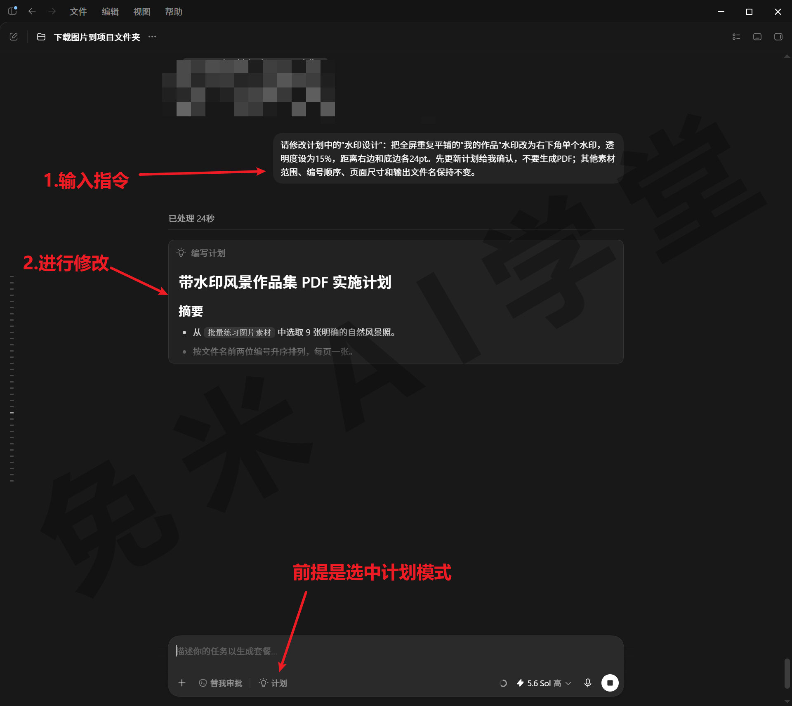

**哪些改动该放在计划层面**

凡是会影响任务范围、成品结构或验收结果的决定，都应该在计划阶段明确。例如：选择哪些照片、图片排列顺序、页面尺寸、完整适配还是裁切铺满、是否覆盖旧文件，以及采用平铺水印还是右下角单个水印。

水印透明度、边距等参数，如果你对最终效果有明确要求，也可以直接写进计划，作为验收标准。至于代码写法、临时文件位置等不影响成品的实现细节，可以留到实施阶段处理。

一句话：**影响成品方向和验收结果的内容在计划里确认，实施阶段负责按计划落地。**

**常见坑**

最大的坑是没有仔细检查计划就直接确认。确认前至少核对四件事：素材范围是否准确、处理顺序是否正确、成品规格是否符合预期，以及是否会覆盖已有文件。计划文档是整个流程中修改成本最低的一环；跳过审核，就等于放弃了计划模式最重要的价值。**审计划永远比返工成品便宜**，这个习惯应该从第一次使用时就养成。

另一个常见状况是修改了好几轮，计划仍然不满意。这往往说明需求本身还没有梳理清楚。此时不要继续叠加零散修改，可以暂停更新计划，让 Codex 反过来采访你。例如发送：

```
我还没有完全想清楚最终效果。请先不要继续修改计划，也不要开始实施。
围绕素材范围、排列顺序、页面版式、水印样式和输出文件名逐项问我；
等需求明确后，再整理一份新的完整计划给我确认。
```

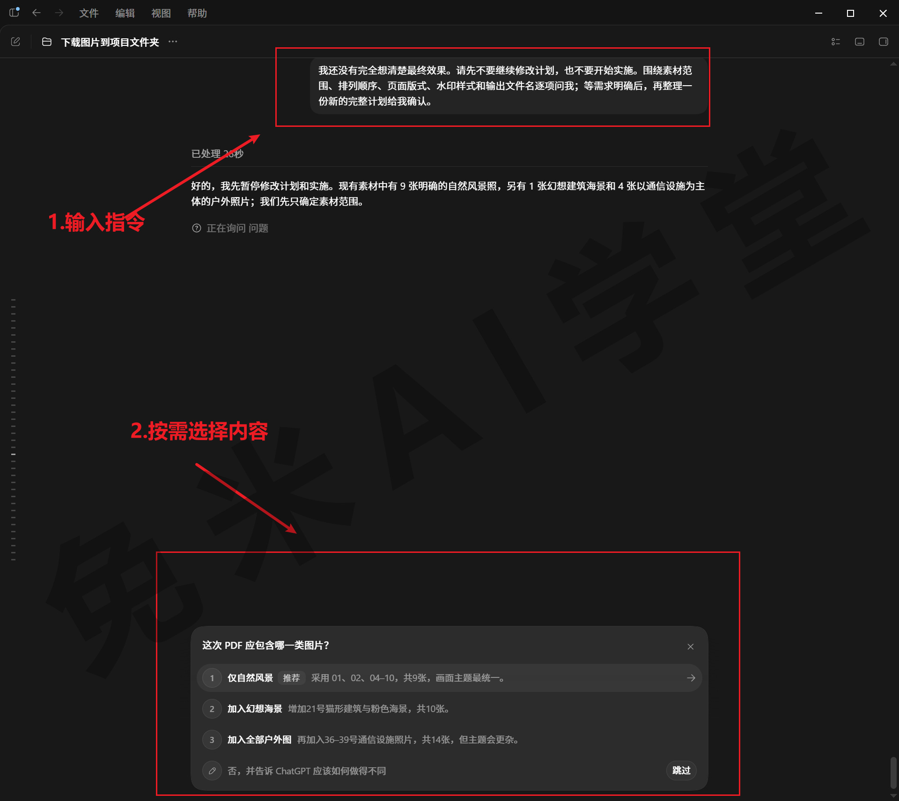

### 6.4 案例：第一个作品“电子名片站”

现在把这一篇学的东西串起来，完整跑一次计划模式，做出你的第一个作品：一个可以发给别人看的个人电子名片网页。它包含你的姓名、职业、一句话简介和联系方式，配一张 AI 生成的卡通头像，还能在几套主题配色之间切换。

**开工前的两项准备**

第一，单独建一个项目。新建一个空文件夹作为名片站的项目文件夹，在 Codex 里把它打开为项目。《权限、沙盒与模型》讲过项目就是沙盒边界，这个文件夹里怎么折腾都影响不到别处；《界面全导览》建议练习内容各自建项目，也是同一个道理。

第二，权限模式用替我审批就够。名片站项目里没有怕丢的东西，套用按文件夹重要程度定档的原则，不必开每步确认，也用不着完全访问。

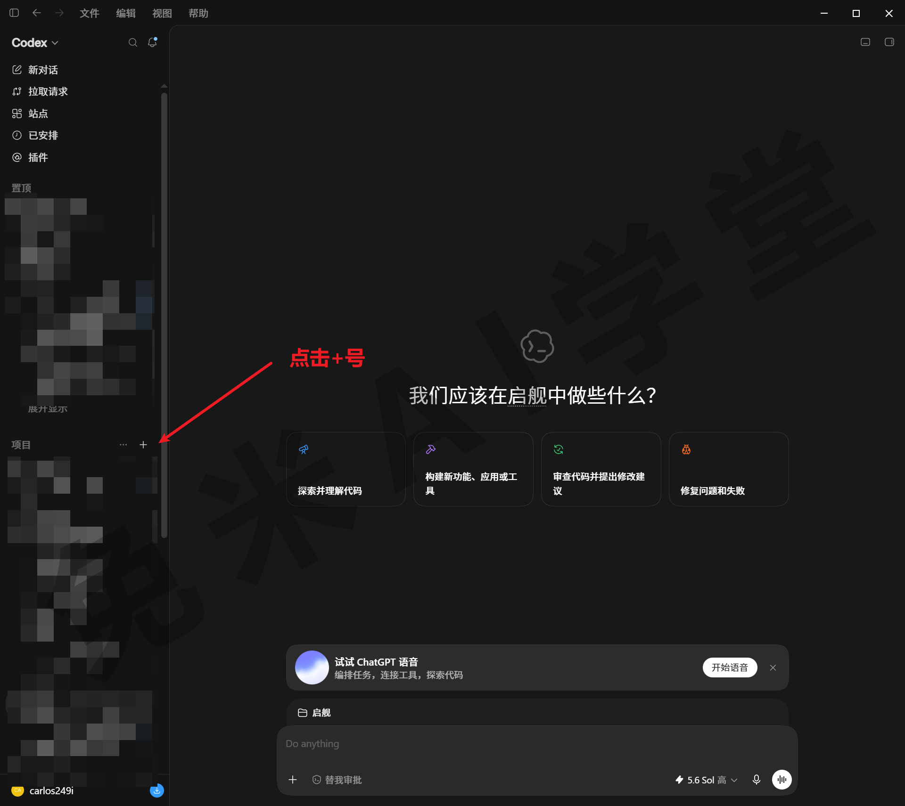

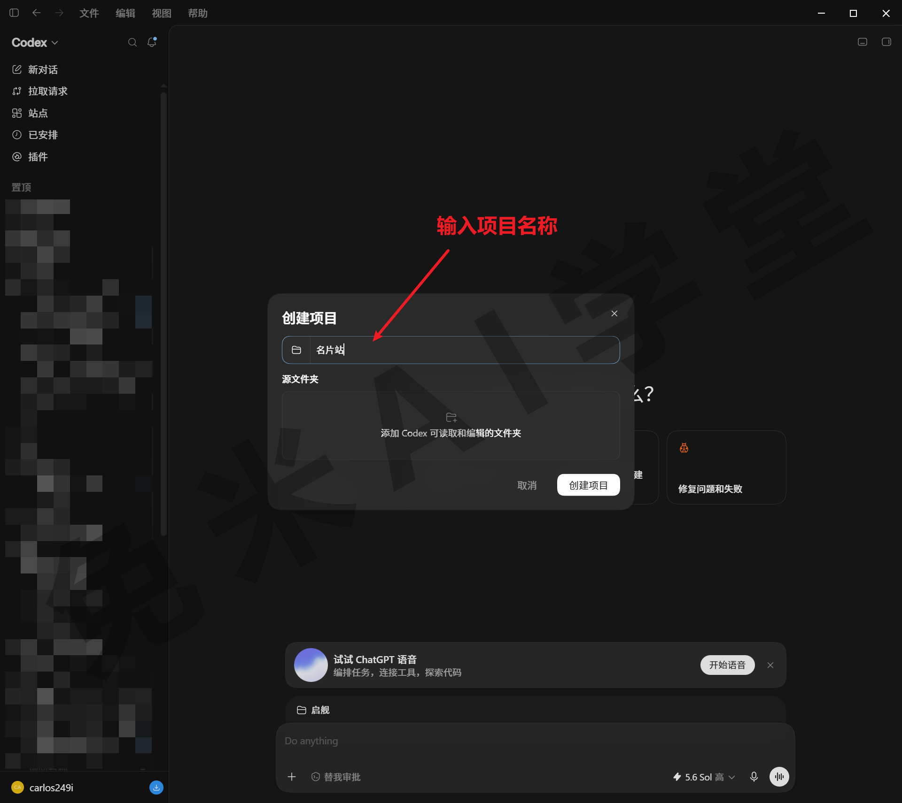

**发出需求**

开启计划模式，发送下面的提示词。内容可以先照抄跑一遍，做完再换成自己的真实信息：

```
帮我做一个个人电子名片网站。要求：页面包含姓名、职业、一句话简介和联系方式；
头像用 AI 生成一张卡通风格的；提供几套主题配色可以切换；手机和电脑打开都要显示正常。
先出计划和我确认，再动手实施。
```

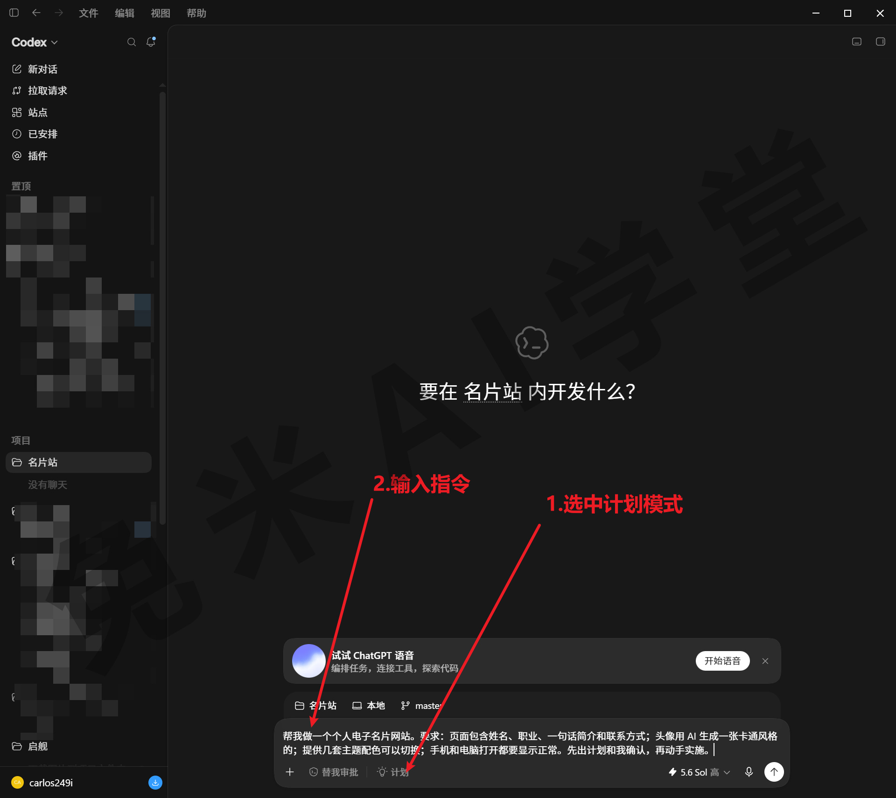

接下来就是 6.2 节走过的流程：逐题追问按你的真实情况回答，拿不准的选推荐项；计划文档出来后按四类要点过一遍；有不满意的地方，按 6.3 节的方法先改计划再确认。

**执行阶段看什么**

确认实施后，这次值得把执行过程完整旁观一遍，重点看三段。

**生成头像**。它会调用生图能力，为你生成卡通风格的头像（生图能力的可用性与效果，需实机验证）。注意生图消耗的额度比普通问答多，有一两张满意的就收手，不要反复批量生成。

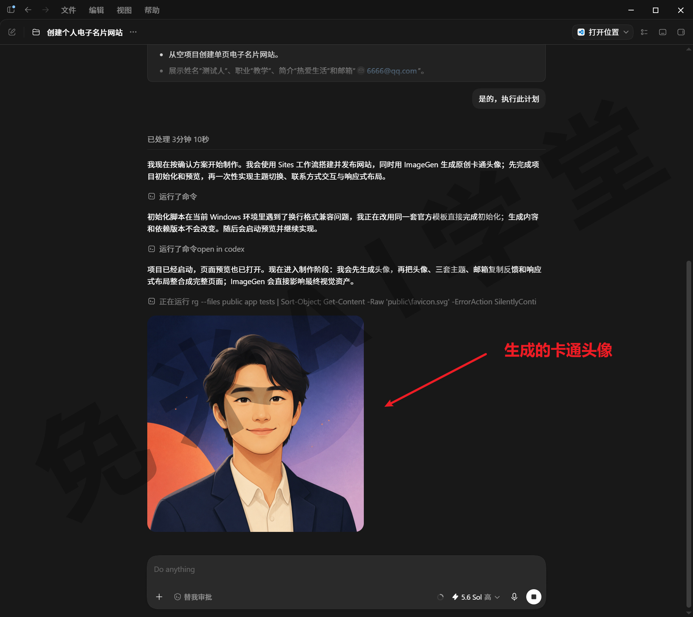

**写页面**。页面文件逐个建立，任务区能看到它建了哪些文件、每一步在做什么。这也是核对计划的机会：它实际做的事，应该和计划文档里的步骤一一对应，明显跑偏就值得出声纠正（纠正方法见 6.5 节）。

**自己测试**。页面写完后，它通常会自己打开浏览器查看效果、检查问题，发现不对会自行修正（自测行为的具体表现，以实际界面为准）。这个内置浏览器本身是个重要能力，《内置浏览器全解》会专门讲。

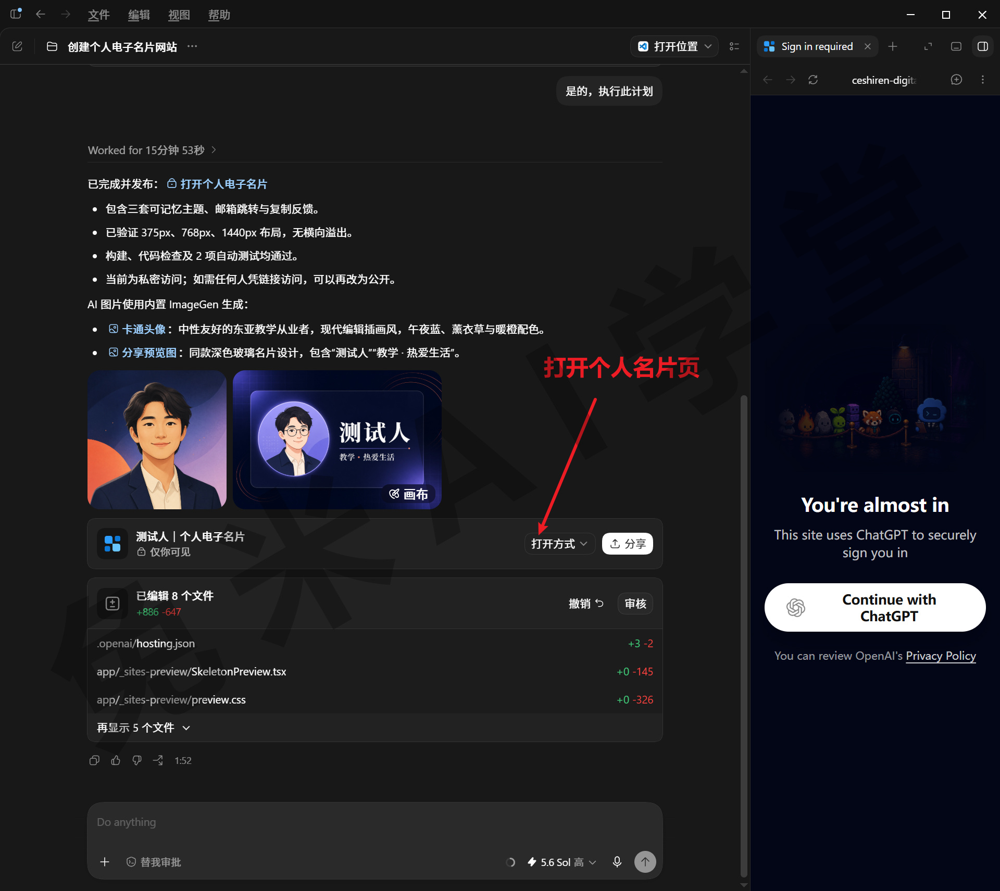


**验收你的第一个作品**

任务结束后，到项目文件夹里找到生成的页面文件，双击用浏览器打开，照四条验收：信息显示完整；头像正常显示；主题配色能切换；把窗口拉窄，布局不乱、内容不缺。四条都过，你的第一个完整作品就算完成了。

两个补充：不想用 AI 头像，把自己的照片放进项目文件夹，发消息让它直接使用即可；对成品有小的不满意，可以直接提修改，也可以先记下来，《AGENTS.md、Diff 与还原》会给你更稳妥的修改和反悔手段。

最后是保留提醒：这个名片站不是一次性练习。《AGENTS.md、Diff 与还原》拿它练立规矩和还原改动，《插件与部署上线》把它真正部署上线，《内置浏览器全解》用批注方式继续改版。请保留好这个项目文件夹，后面几篇都要用。

### 6.5 执行中纠偏：引导与排队

**执行到一半，想法变了怎么办**

计划再周全，实施途中也可能冒出新想法：看到半成品才想起联系方式区应该放个二维码，或者发现某个板块的方向不太对。新手这时常见两种反应，都不划算：一种是干等，等整个任务跑完再从头提需求，白白多耗一轮时间和额度；另一种是直接停掉任务重来，前面完成的部分全部作废。其实有第三条路：不打断任务，把新要求中途递进去。

**两种去向：排队与引导**

任务运行期间，你随时可以继续发消息。发出去的消息有两种去向：

- **排队**——消息先排着，等当前这一轮任务跑完，再作为下一轮的输入处理。好处是绝不打扰正在进行的执行，防止随手发的一条消息把任务带偏。
- **引导**——消息立刻注入当前任务，Codex 在不中断执行的前提下，把新要求吸收进后续步骤。适合现在就要生效的调整，改需求不必以牺牲进度为代价。

新消息默认走哪一条，取决于设置：应用设置里有一项跟进行为，用来选择任务执行中发送的消息是引导当前任务，还是排队等下一轮（设置项的中文名称、位置与当前版本的默认值，需实机验证）。不同版本的默认行为可能不同，发消息前留意界面上的排队或引导提示即可（提示样式以实际界面为准）。

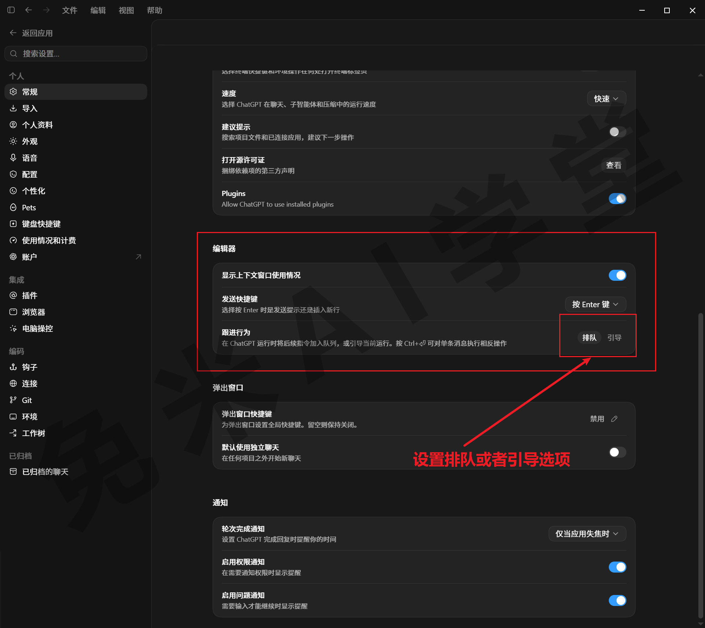

**演示一次中途纠偏**

用名片站实测。趁 6.4 节的任务还在执行，发送一条补充需求：

```
补充一个要求：联系方式区域加一个二维码占位图，位置放在最下方。继续当前任务，不要从头重来。
```

如果消息显示为排队状态，把它切换成引导注入（切换的入口与操作方式，需实机验证）；如果当前版本默认就是引导，直接发送即可。

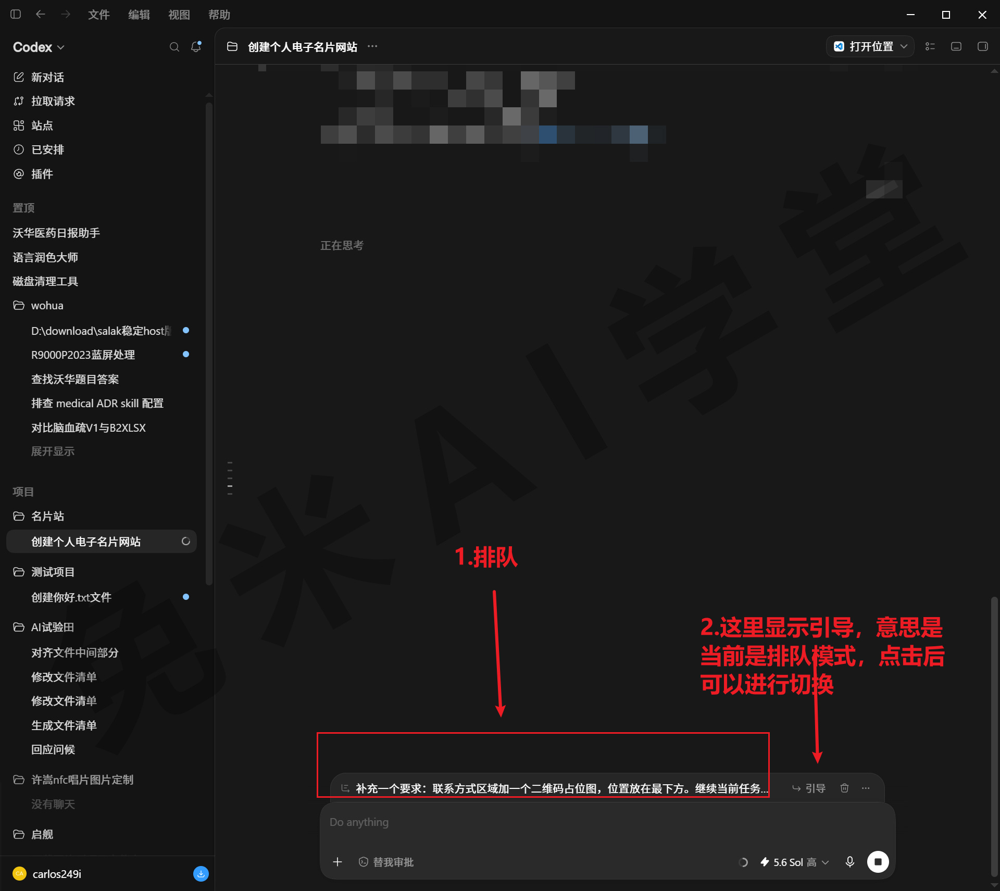

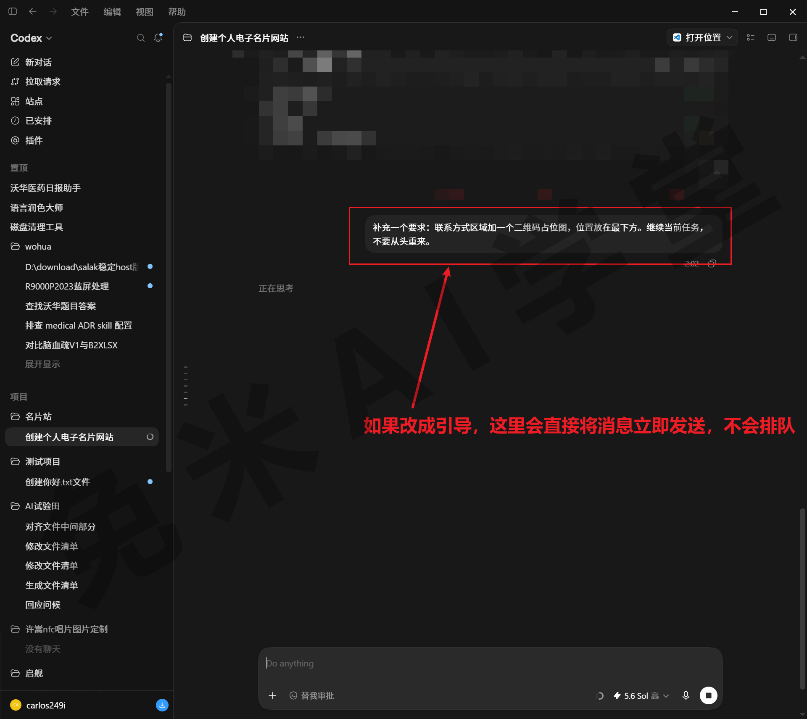

之后观察两点：任务没有中断重来，前面完成的部分原样保留；新要求被吸收进了后续步骤，最终成品的联系方式区出现了二维码占位图。

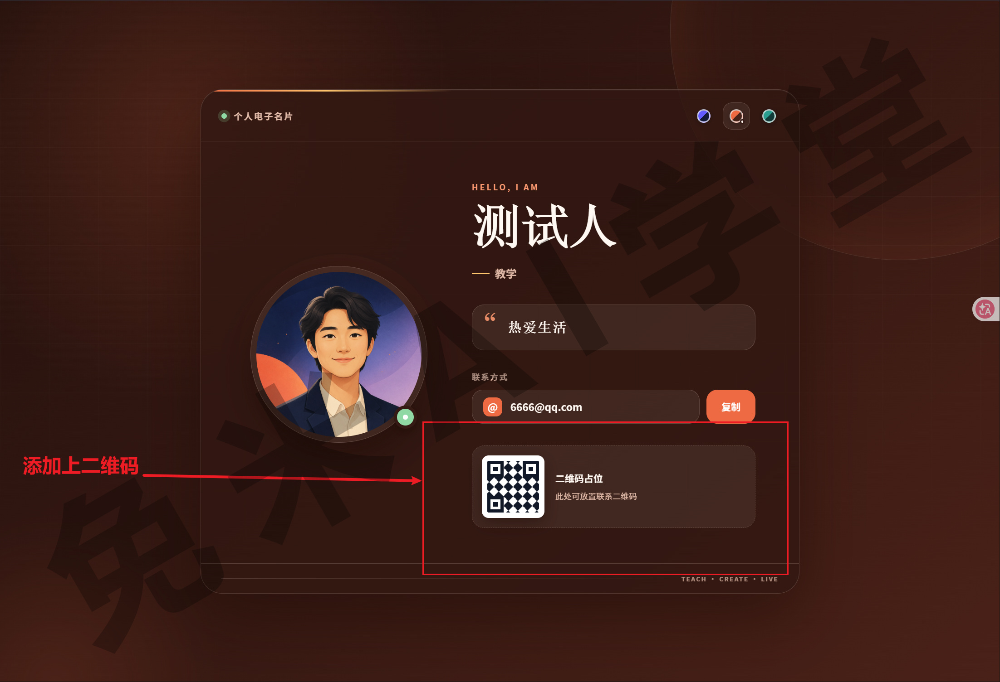

**三种处理方式怎么选**

- **引导**：方向级的小调整、现在就要生效的补充要求，用引导递进去，不中断、不返工，是执行中纠偏的首选。
- **排队**：不着急的新任务、和当前执行关系不大的需求，让它排队等这一轮结束再处理，避免干扰正在进行的步骤。
- **停止任务**：只留给一种情况：整个方案要推翻重来。这时停掉任务、回到计划层面重新对齐，比在错误的方向上继续省得多。

**常见坑**

- 消息发出去半天没反应，先看它是不是在排队：排队中的消息要等当前轮结束才会被处理，不是被忽略了。
- 把引导当万能药：它适合小调整，方向级的推翻还是要停下来回到计划层面，硬用引导缝补只会越改越乱。
- 这套机制不限于计划模式：直接执行的任务同样可以排队和引导，学会之后处处能用。

### 6.6 三个练习任务

下面三个任务把计划模式完整练一遍。提示词可以直接复制，方括号里的内容换成你自己的。

**任务一：用计划模式启动一个自己的小项目，先只走到计划文档**

想一个你真实需要的小东西，一个介绍页、一份旅行攻略、一个小工具都可以。开启计划模式后发送：

```
我想做 [你的项目]，先和我对齐方案：把需要确认的问题逐个问我，
然后生成一份计划文档给我看，在我确认之前不要动手实施。
```

完成标准：经历完整的逐题追问，拿到一份计划文档。本任务到此为止，先不确认实施，重点体会追问方式和计划的结构。

**任务二：在计划层面提出一处修改，确认后再实施**

接着任务一的计划，挑一处你不满意的地方，发送：

```
计划里 [你要改的点] 改成 [你想要的做法]，先更新计划文档给我确认，再开始实施。
```

完成标准：新版计划文档里能看到这处修改；确认后完整走完实施阶段，拿到成品。

**任务三：执行中用引导纠偏一次**

趁任务二的实施还在进行，想一个补充要求发送出去，并确保它以引导方式注入（如果显示排队，就手动切换一次）：

```
补充一个要求：[你的新要求]。继续当前任务，不要从头重来。
```

完成标准：任务没有中断，最终成品里包含了你补充的要求。

### 6.7 本篇小结与自检

这一篇介绍了计划模式的完整流程，并完成了课程的第一个作品。最需要记住的是：**复杂任务先在计划层面对齐和修改，比做完再返工省时间也省额度。**

可以对照下面的清单检查学习结果：

- [ ] 能说出哪类任务适合开计划模式
- [ ] 用计划模式从一句话需求推进到执行结果
- [ ] 在计划层面完成过一次修改
- [ ] 会用“引导”在执行中纠偏
- [ ] 电子名片站已经生成，并能在本地预览

完成这些内容后，你已经有了第一个完整作品。下一篇《AGENTS.md、Diff 与还原》给项目立规矩，并学会看懂和撤销 AI 的每一处改动。

### 6.8 新手常见问题

**Q1：什么任务不值得开计划模式？**

一句话能说清、一步能做完的任务：改错别字、转换格式、小幅调整样式。这类任务直接执行几十秒就有结果，开计划模式反而多一轮追问和确认，更慢也更费额度。官方的建议同样是简单任务关掉计划模式。也不建议把它设成一开到底的默认状态，按任务挑着用：复杂的开，简单的不开。判断口径复习一遍：需求一句话讲得明白就直接做，要写一段话才说得清再开计划。

**Q2：计划文档太长看不完怎么办？**

不必逐字读。可以先让它替你压缩，发送“把这份计划压缩成十条以内的要点，标出需要我决定的地方”。然后重点看四处：目标是不是你要的、范围有没有超出预期、步骤安排合不合理、有没有碰你不想动的内容。看不懂的条目复制下来问它“这一步是要做什么”。其余实现细节交给它把握，实施之后还有改动记录和一键还原兜底，《AGENTS.md、Diff 与还原》会专门讲。

**Q3：执行到一半想改需求，只能停掉重来吗？**

多数情况不用。小的方向调整，把消息以引导方式注入：任务不中断，新要求会被吸收进后续步骤，6.5 节演示过；不着急的补充也可以让它排队，等这一轮结束自动处理。真正值得停掉的只有一种情况：整个方案要推翻。这时回到计划层面重新对齐，比在错误方向上继续省得多。

**Q4：计划模式会多消耗额度吗？**

计划阶段有追问和整理的往返，确实多一份消耗。但对复杂任务来说，整体算下来通常更省：在计划里改一句话的成本，远低于成品返工的成本；方向对了，实施阶段也少走弯路。省额度的关键是用对场合：复杂任务开、简单任务不开；再配合《权限、沙盒与模型》讲过的从中挡起步的挡位习惯，额度就花在刀刃上。
