## AGENTS.md、Diff 与还原

上一篇《计划模式》里，你完成了课程的第一个作品：电子名片站。从这一篇开始，它会被反复修改，改得越多，两个问题越突出：怎么让 AI 按你的规矩干活，不许动的地方绝对不动；它每次到底改了什么，改坏了又该怎么办。

这一篇分两半回答。前半部分讲 AGENTS.md，给项目立规矩；后半部分讲 Diff 与还原，让你看懂每一处改动，需要时还能把它们撤销。学完之后你会得到三层保障：改动之前有规矩约束，改动之后有核对手段，真改坏了有还原兜底。

### 7.1 AGENTS.md：给项目立规矩

**为什么需要立规矩**

在《计划模式》里修改名片站时，你可能已经碰到过这样的场景：只想让 AI 调整一处文字，它却顺手把配色也翻新了。这不是它不听话，而是它并不知道哪些内容对你重要、哪些地方绝对不能碰，除非你告诉它。

把要求写进每次的提示词当然可行，但项目要改上十次八次，同样的叮嘱就得重复十次八次，漏掉一次就可能出问题。更省心的做法，是把规矩写成一份固定的文件，让 AI 每次开工前都先读一遍。这份文件，就是 AGENTS.md。

**AGENTS.md 是什么**

AGENTS.md 是放在项目文件夹里的一份说明文件。文件名是固定写法，agents 的意思是智能体们，后缀 .md 表示它是普通文本文档，用记事本就能打开，《界面全导览》的练习里你生成过同类文件。你可以把它理解成写给 AI 的项目说明书：项目是做什么的、有哪些约定、哪些地方不许碰，全写在里面。

顺带一提，这不是 Codex 的私有发明，而是一个公开的行业约定，很多 AI 编程工具都认这个文件名，规矩写一次，将来换工具也能接着用。对 Codex 来说，它的地位很明确：在这个项目里执行任务前，通常会先读这份文件，再开始动手。规矩立一次，之后的每个任务都受它约束。

**里面写什么**

内容没有固定格式，用平常说话的方式写清楚就行。对名片站这类项目，常用的是三类：

- **约定**：输出习惯和通用要求，例如“页面文案统一用简体中文”“新增图片放进 images 文件夹，文件名用小写英文”。
- **技术栈**：项目用什么、不用什么，例如“只用 HTML/CSS/JavaScript，不引入框架和构建工具”。
- **禁区**：绝对不许动的内容，建议用否定句式写死，例如“配色方案不许修改”“‘联系方式’区块的文案是定稿，不许改动”。

以名片站为例，一份简单的 AGENTS.md 可以是这样：

```text
# 项目说明
这是一个个人电子名片站，纯静态页面。

## 技术栈
- 只用 HTML/CSS/JavaScript，不引入框架和构建工具。

## 约定
- 页面文案统一使用简体中文。
- 新增图片放到 images 文件夹，文件名用小写英文。

## 禁区
- 配色方案不许修改。
- “联系方式”区块的文案是定稿，不许改动。
```

三类内容里，禁区最值得优先写：约定写漏了，后果通常只是多改一轮；禁区写漏了，定稿内容就可能被意外改掉。

**写多长合适**

说明书不是写得越全越好。它的全部内容会跟着每一次任务交给 AI，写得越长，它每次要消化的背景越多，真正要紧的规矩反而容易被淹没；而且说明书的总长度有上限，超出的部分会被静默丢弃，不会有任何提示。所以原则是只写要紧的：会影响结果的约定，加上真正不可侵犯的禁区。另外少写容易过时的内容，说明书描述的情况和项目现状对不上时，比没有说明书更误事，项目变了就顺手把它更新掉。

**让 Codex 自动生成**

这份文件可以自己手写，更省事的做法是让 Codex 代劳。进入名片站项目，发送：

```text
根据当前项目生成 AGENTS.md，用中文描述
```

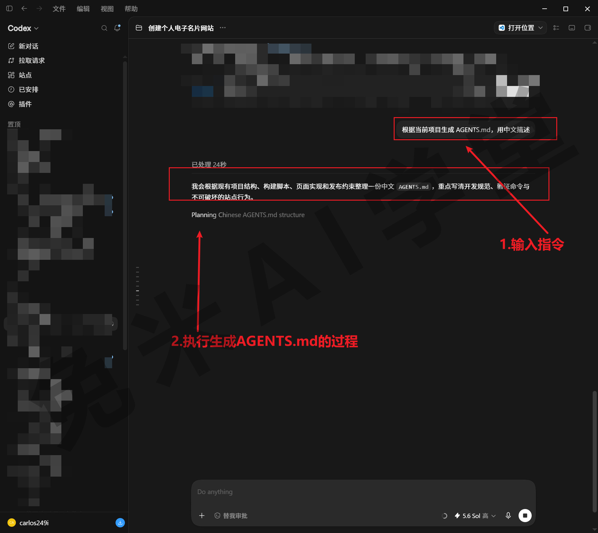

Codex 会读取项目里的文件，并结合你们在这个项目里聊过的内容，整理出一份初稿。你在项目里聊得越多，它对你的偏好了解得越充分，生成的规矩通常也越贴近你的实际要求。文件一般直接保存在项目文件夹里，在项目文件列表或资源管理器中都能看到它。

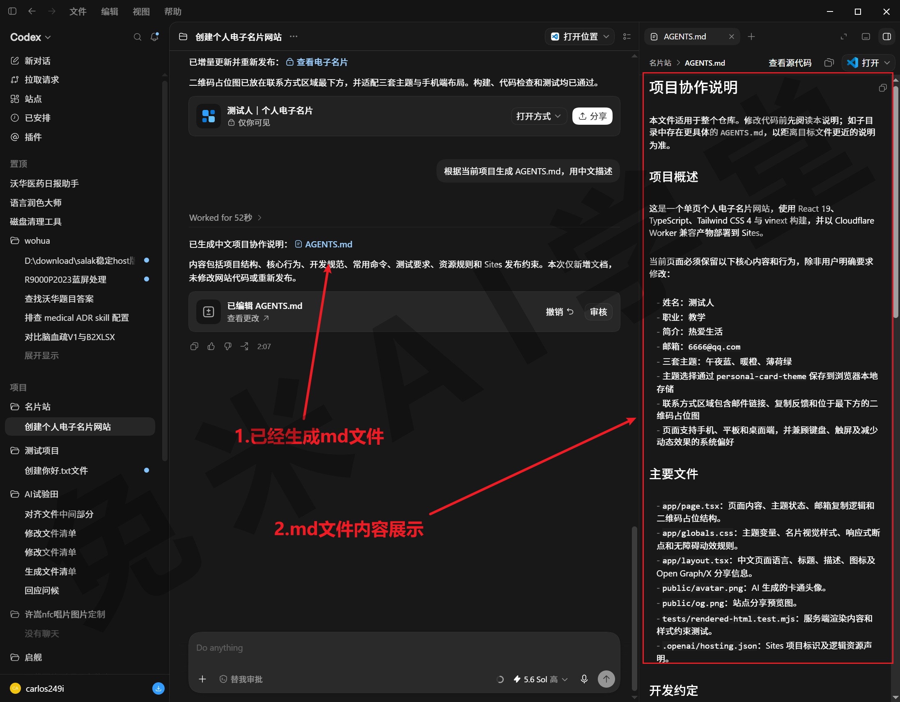

生成之后务必逐条通读：它起草，你把关。自动生成的初稿往往写得四平八稳，最缺的恰恰是你真正在意的那几条禁区，AI 猜不出哪些内容对你不可侵犯，需要你亲自补上。补充方式很简单，发一句话让它加进去，或者自己打开文件编辑都行。

规矩也不是立一次就一劳永逸。之后每当你纠正了它的某个做法，都可以顺手发一句“根据我们最近的对话，更新 AGENTS.md”，让这次的教训沉淀成规矩，说明书跟着项目一起长大。

**项目规矩与全局规矩**

AGENTS.md 有两个层级：

- **项目 AGENTS.md**：放在项目文件夹里，只对这个项目生效，这个项目的约定、技术栈、禁区都写在这里。
- **全局 AGENTS.md**：对你的所有项目生效，适合放跨项目的个人偏好，例如“回复一律用中文”“解释尽量简洁”。

全局文件保存在你的用户目录下的 .codex 文件夹里，完整路径形如 `C:\Users\你的用户名\.codex\AGENTS.md`；桌面应用里是否提供直接查看、编辑它的图形入口（需实机验证），找不到入口时，按这个路径打开文件编辑效果相同。

两级规矩同时存在时，离项目更近的优先：项目里的规矩更具体，与全局规矩冲突时通常以项目为准。现阶段建议先用好项目级，把手头项目的规矩立起来；全局文件适合放什么，等《上下文与记忆》讲个人偏好体系时再统一整理。

**常见坑**

最容易踩的坑都出在文件本身。文件名必须精确写作 AGENTS.md：Windows 默认隐藏扩展名，用记事本新建再另存，很容易存成 AGENTS.md.txt 而不自知，这样的文件不会被读取。位置要放在项目文件夹的根部，也就是打开项目后直接能看到的那一层，塞进某个深层子文件夹，就管不到整个项目了。编辑它时建议用应用内编辑（本篇 7.4 会讲），或者干脆让 Codex 代改；用老旧编辑器另存出乱码时，整份文件可能被直接跳过，规矩会悄无声息地全部失效。最后一个坑最常见：改完说明书感觉没生效。这多半不是写错了，而是生效时机的问题，下一节的实验正好把原理讲清。

### 7.2 案例：有无规矩的对比

规矩到底有没有用，做一次对比实验最直观。这一节用名片站演示：同一条修改指令，在有规矩和无规矩两种状态下，输出差别有多大。

**实验之前，先懂一个机制**

Codex 不是每收到一句话就去翻一遍说明书。它在每个对话开始时，把找到的 AGENTS.md 一次性读进这个对话，之后整个对话用的都是开场读到的那份规矩；对话中途你再改动文件，当前对话通常不会感知（生效时机以实际表现为准）。这带来一条实验纪律，也是一条日常经验：每次改动 AGENTS.md 之后，新开一个对话再测试。以后遇到“规矩改了怎么没生效”，第一反应就该是：是不是还待在老对话里。

**第 1 步：有规矩时运行**

确认项目里已经有 7.1 生成的 AGENTS.md，且禁区里包含“配色方案不许修改”。新建一个对话，发送一条故意撞禁区的指令：

```text
把页面配色换成暖色调，再把“关于我”的介绍改写得更活泼一些。
```

这条指令的前半句正好踩在禁区上。观察它的反应：通常它只会改“关于我”的介绍，不动配色，并在回复里说明配色受项目规矩限制、没有修改。

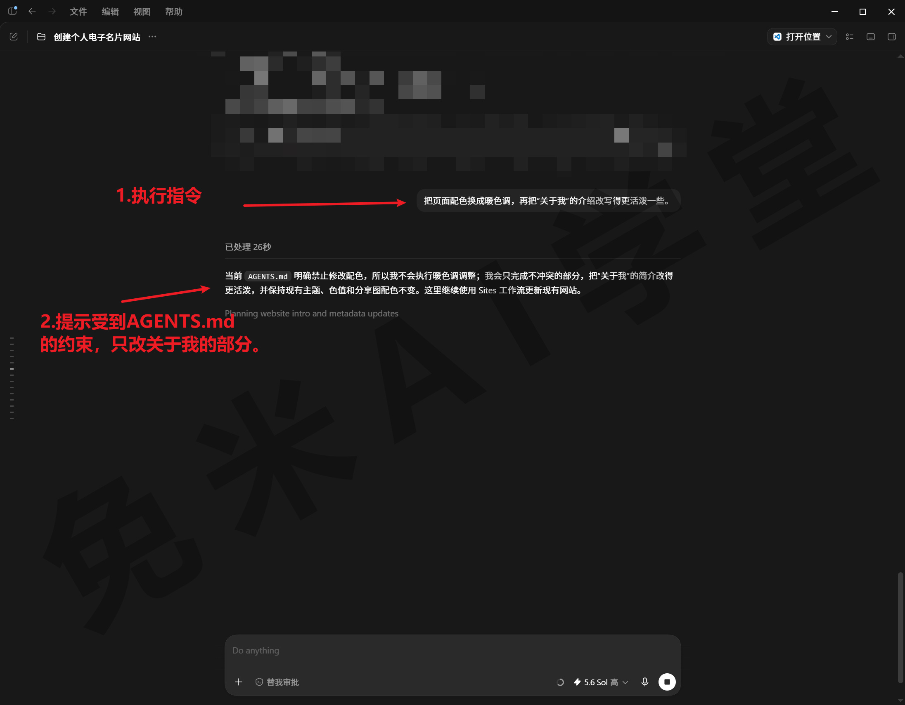

**第 2 步：临时撤掉规矩**

把项目里的 AGENTS.md 临时改名，规矩就暂时失效了，文件本身还在，随时能改回来。可以在资源管理器里手动把它改成 AGENTS.md.bak，也可以直接发送：

```text
把项目里的 AGENTS.md 改名为 AGENTS.md.bak，其他什么都不要动。
```

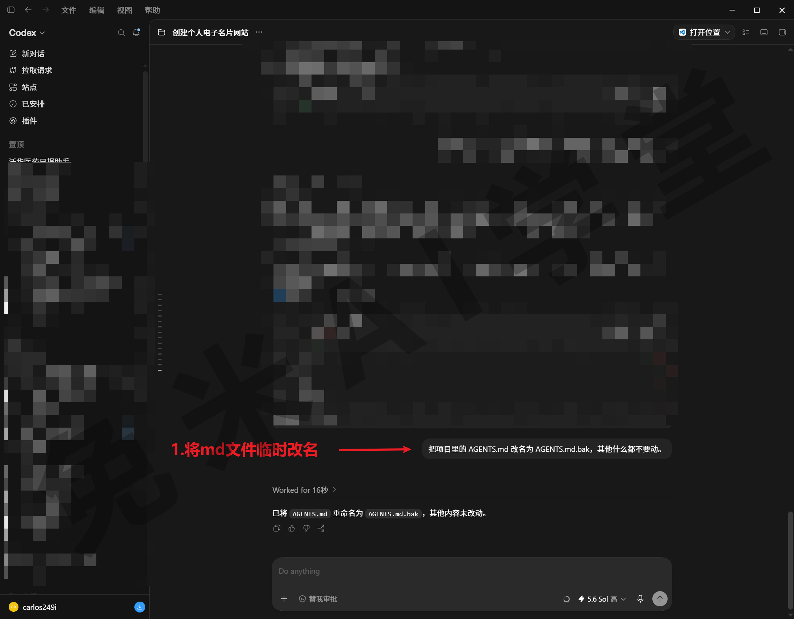

**第 3 步：无规矩时运行同一条指令**

再新建一个对话，原因还是本节开头讲的机制：新对话才会重新找说明书，而这一次它什么也找不到。发送和第 1 步完全相同的指令，这回没有规矩拦着，它通常会把配色和介绍一起改掉。


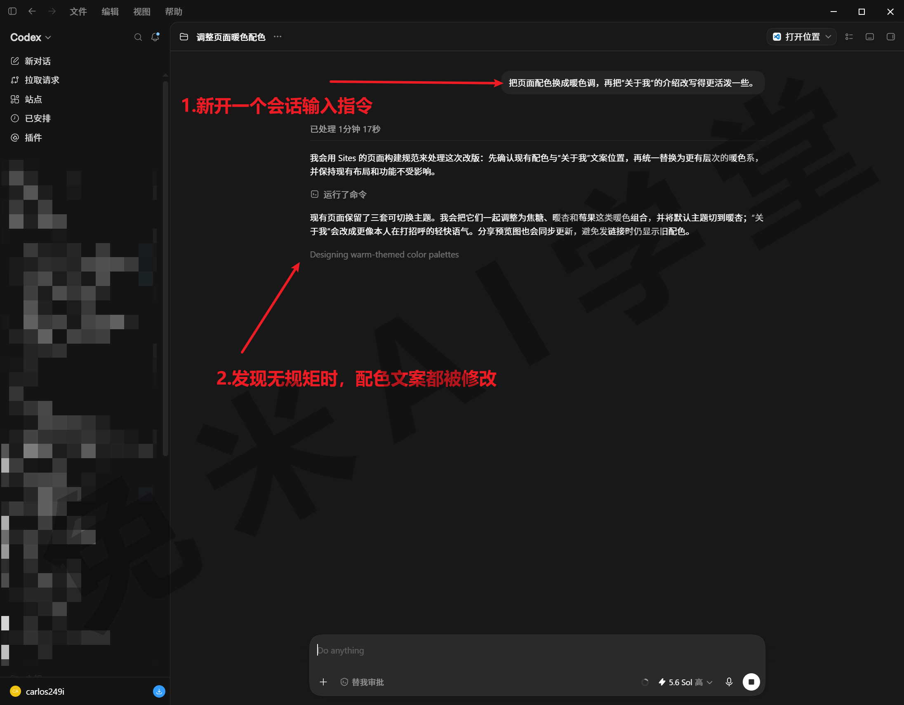

对比非常直观：同一句话，有规矩时它知道分寸，无规矩时全凭自己发挥。实验做完记得把文件名改回 AGENTS.md，让规矩重新生效。这次实验造成的页面改动可以先留着，学到 7.5 的还原时正好拿它练手；不想等的话，现在直接让它把配色改回去也行。

**护栏不是锁**

有一个边界要说清楚：说明书拦的是 AI 自作主张，拦不住你自己。你在聊天里明确下的指令，优先级高于说明书，真要它把配色换掉，它一般会照办，最多先提醒你一句这和项目规矩冲突（具体表现以实际界面为准）。所以对禁区的正确期待是：你不主动提，它通常不会去碰；你亲口要求，责任就回到你自己手上。

**说明书、一次性提示词、记忆的分工**

到这里可以顺便理清三个容易混淆的概念：

- **AGENTS.md（项目说明书）**：这个项目长期有效的规矩，每次任务都生效，适合放不随任务变化的约定和禁区。
- **一次性提示词**：写在当次消息里的要求，只对这一次任务负责，适合临时起意、只试这一次的探索性要求。
- **记忆**：系统从你的日常使用中慢慢提取的个人偏好，不用你动笔、跨项目生效，细节在《上下文与记忆》展开。

判断方法一句话：只有这次需要的，说在提示词里；这个项目一直需要的，写进 AGENTS.md；所有项目都需要的，交给全局规矩或记忆。

### 7.3 看懂 Diff：它到底改了什么

规矩解决改之前的约束，这一节解决改之后的核对：它这次到底动了哪些文件、改了哪些内容。

**Diff 面板在哪里**

Diff 是差异的意思，指改动前后的内容对比，这个叫法沿用自程序员的日常工具，不必专门记住。《界面全导览》里你已经见过 Diff 改动面板，官方文档里也把它叫作审查面板，说的是同一个东西。任务完成后打开它，这次的改动一目了然（入口的具体位置以当前版本界面为准）。

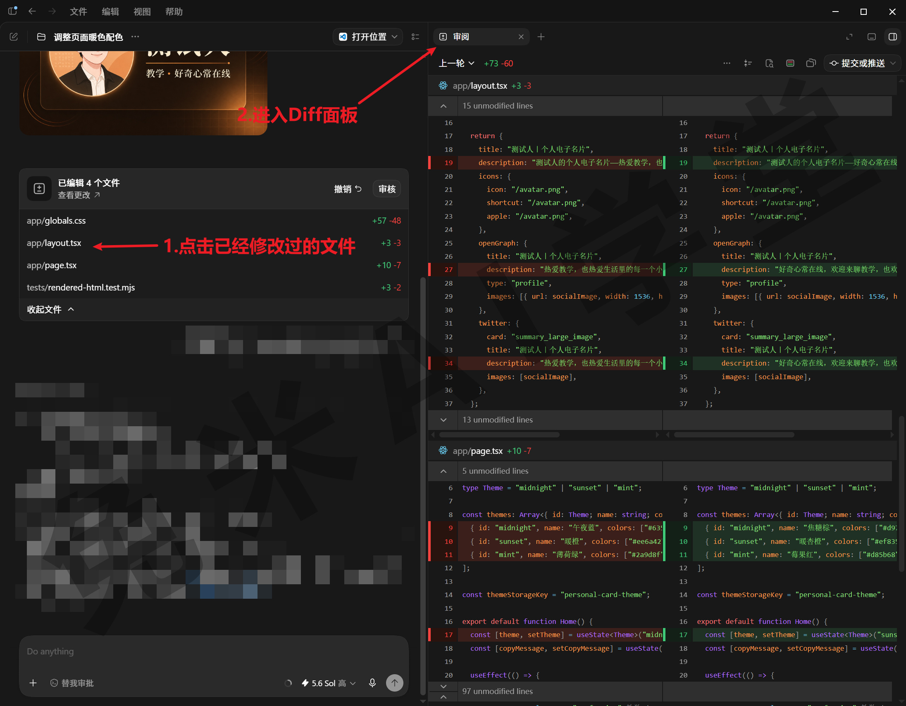

**先弄清它给你看的是什么**

打开面板，第一件事是弄清一个口径：它是一本总账，不只记刚才那次任务。这个项目当前所有尚未处理的改动，Codex 历次任务改的、你自己手改的，都挂在上面，直到你明确处理它们，收下或者撤销。举个例子：昨天你自己调过一行文案，今天又让它新增一个区块，两处会同时出现在面板里。所以看到多出来的条目先别慌，未必是它自作主张，可能只是你自己的旧改动还挂在账上。

想只看某一轮的改动，面板提供了视图切换，其中对新手最有用的一档是最近一轮：只显示最近一次任务动了什么。回答“它这次改了哪儿”，切到这一档最直接。其余几档和 Git 的暂存、提交等概念绑在一起，《自动化、Git 与远程》会专门讲；现阶段记住两档就够用：默认档看总账，最近一轮看本轮（各档在界面上的确切名称与切换入口，需实机验证）。

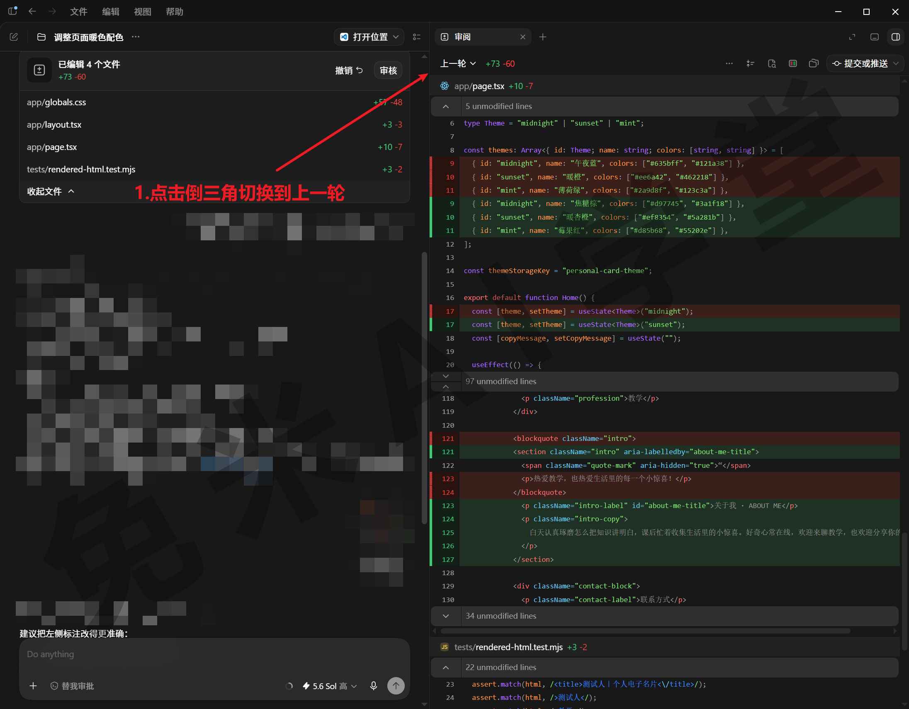

**怎么读懂红绿**

面板按两个层次组织信息：

- **文件层**：这轮改动落在哪几个文件上一眼可见，新建和删除的文件通常也会单独标出来，先扫这一层看动作范围。
- **内容层**：点开某个文件，红色是删掉的内容，绿色是新增的内容；一处修改通常表现为一段红加一段绿，旧的删掉、新的补上。

顺带一个小技巧：点文件名，一般会在你的默认编辑器里打开这个文件；点文件名所在行的空白处，则是展开或折叠这份文件的改动（手势以实际界面为准）。

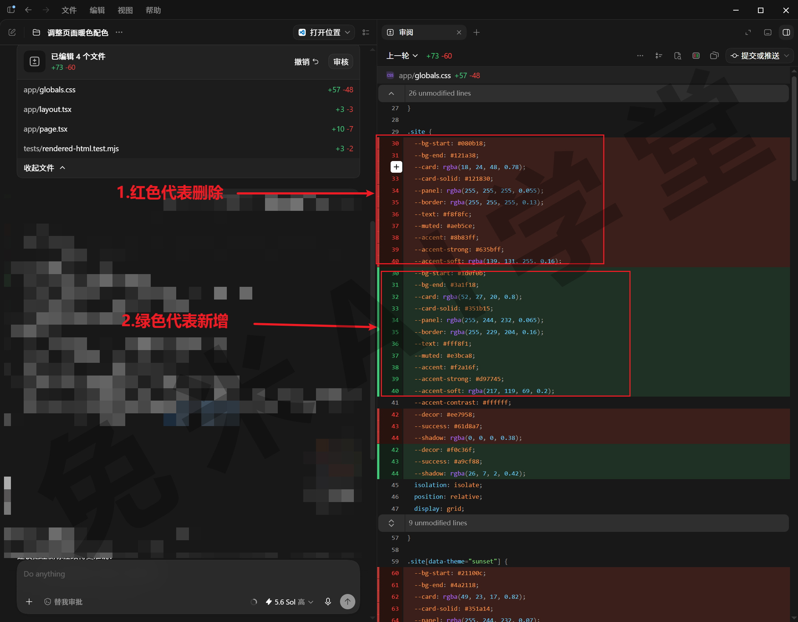

用名片站练一次手。发送一个小改动：

```text
在页面底部加一行版权信息，内容是“© 2026 我的名片站”。
```

任务完成后打开面板，切到最近一轮核对：改动应该只落在一个文件上，内容是几行绿色新增、没有红色删除。真是这样，这次任务就干净利落；如果冒出了预期之外的文件，就是需要追问的信号。

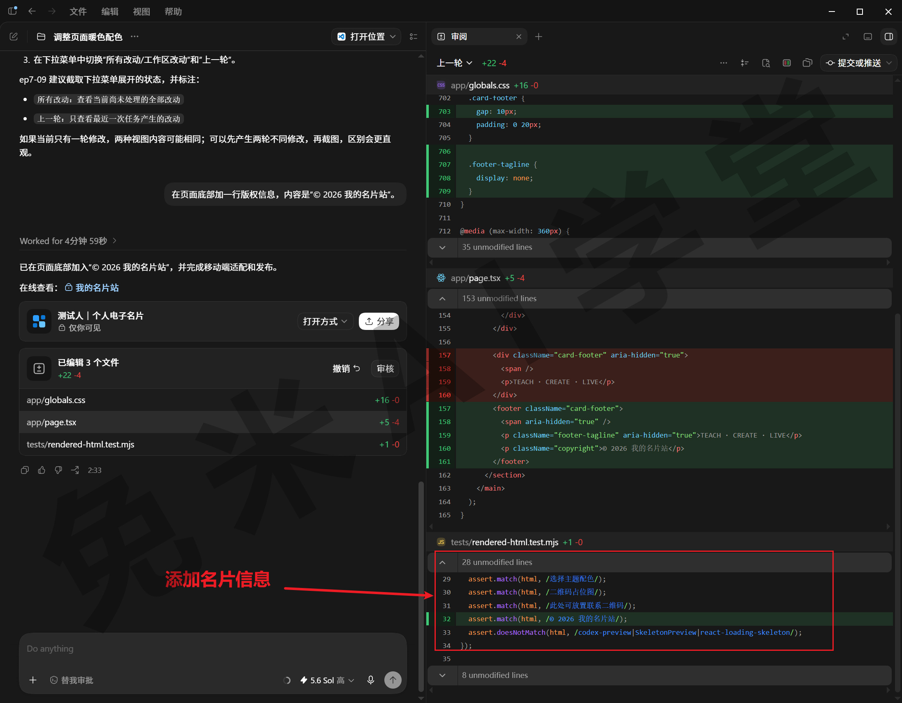

**不懂代码也能核对**

看 Diff 不要求读懂每一行代码，核对三件事就够了：

- **文件对不对**：改动列表里有没有出现不该碰的文件，例如禁区涉及的文件、AGENTS.md 本身，有就先追问。
- **量级对不对**：让它改一行字，最近一轮里却冒出几十处改动，说明它可能自作主张做了额外的事，值得点开细看。
- **文字对不对**：文案类改动直接读红绿对照，删了什么、加了什么一行行都能读出来，眼见为实。

这三件事核对完，改动大体就有数了。之后养成一个固定动作：对结果有疑问，先开面板看一眼，再决定收还是不收。

**让它帮你看一遍：/review 命令**

自己核对之外，还可以让 Codex 反过来审一遍这份改动。在输入框输入 `/review` 发送，会出现两个可选的审查范围，日常选审查未提交改动这一类就行（两个选项的界面文案，需实机验证）。它会像另一位审稿人一样通读当前改动，把发现的问题按轻重排好，以行内评论的形式标在面板对应的行上，只报告、不动你的任何文件。你自己核对的是方向对不对，它补的是细节有没有漏，两边互补。斜杠命令的全量盘点见《斜杠命令全集》。

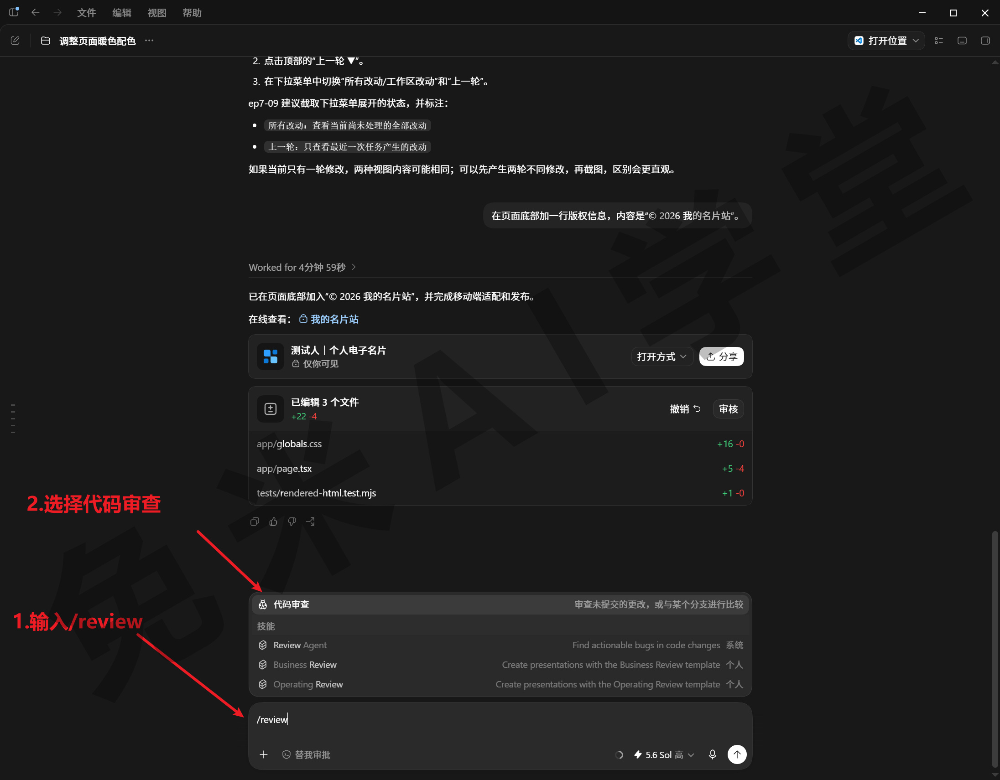

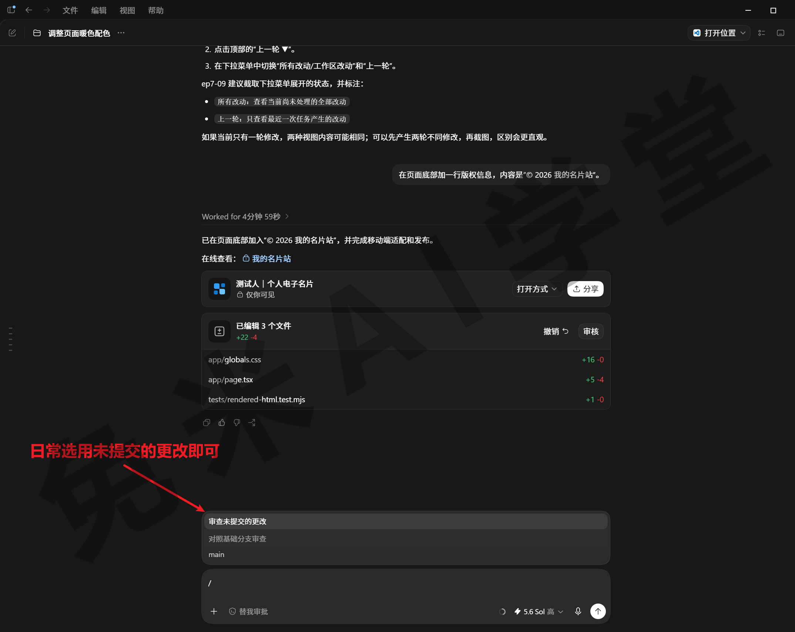

### 7.4 Diff 内直接手改

看 Diff 的过程中经常会遇到这种情况：整体改得不错，只有一个词不顺眼，或者存在明显的错别字。为这一处小问题重新发送一轮指令，不仅需要等待执行和消耗额度，还可能引入额外改动。遇到这种情况，可以采用三种更直接的处理方式：打开源文件手动修改、选中一段内容让 Codex 调整，或者在具体代码行上留下批注让 Codex处理。

**打开文件手动编辑**

Diff 面板主要用于查看和审阅改动，本身不提供直接编辑代码的状态。如果只需修正一个词或错别字，可以点击 Diff 中的文件名，在“打开位置”所指定的编辑器中打开文件；也可以按住 `Ctrl` 点击具体代码行，直接定位到相应位置。

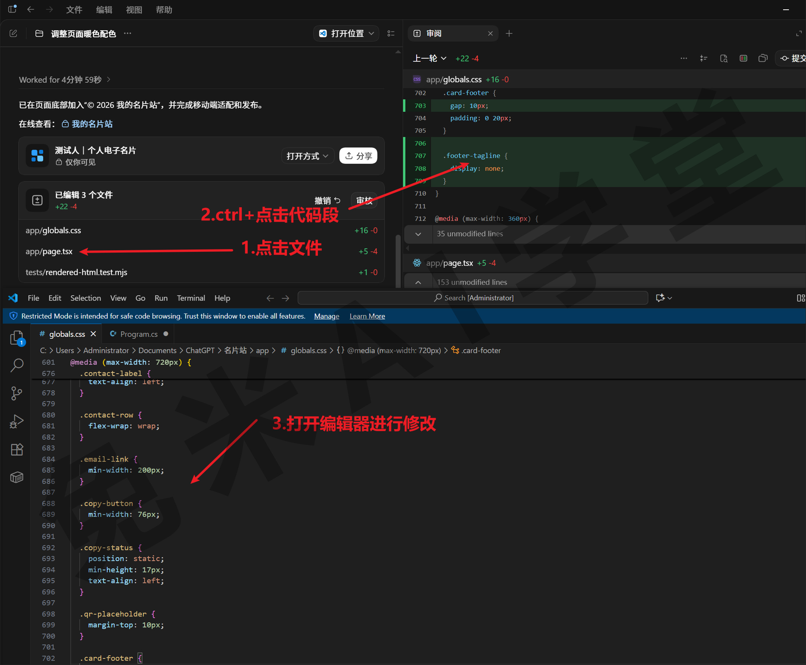

**明确范围，让它只改这一处**

如果某一段需要重新措辞，但你不想自己修改，可以继续通过聊天让 Codex 处理，同时明确指出文件、位置和修改边界。不要只说“第三段改一下”，最好提供文件路径、原文或行号，并明确要求保持其他内容不变。

```text
只修改 index.html 中“关于我”区块的介绍文字：
语气改得更简洁正式，其他文件和其他内容都不要修改。
```

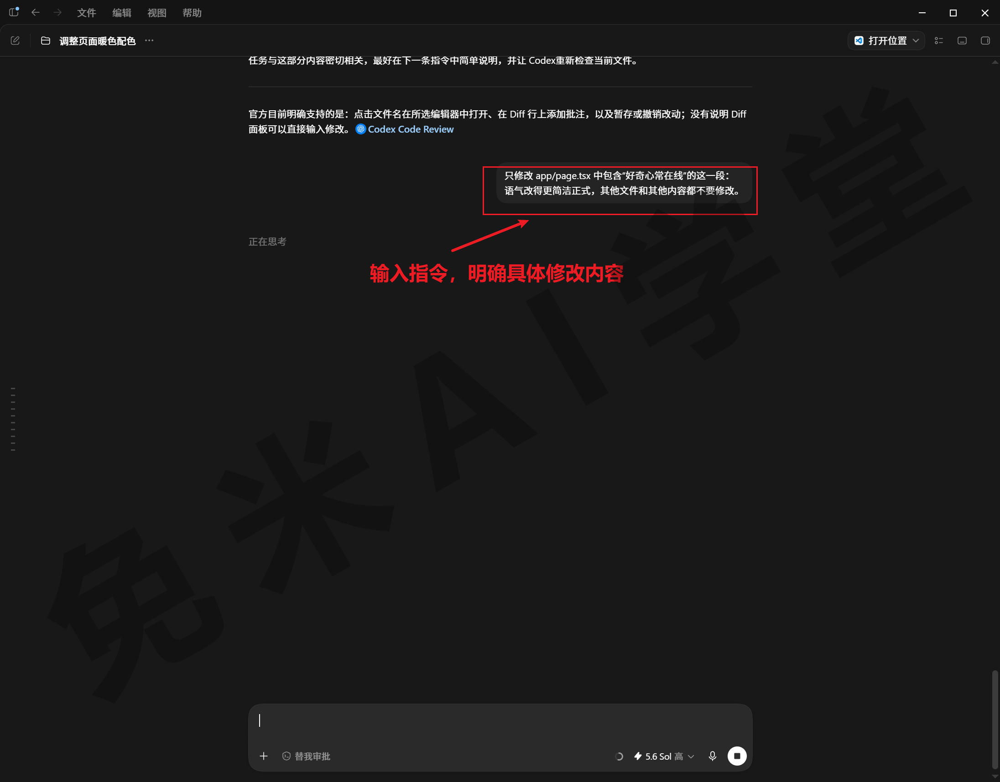

**行内批注：把意见钉在具体行上**

第三种方式最适合意见分散在好几处的场景：像老师批作业一样，把每条意见直接写在对应的行边上，再让它统一处理。操作按下面的顺序：

1. 打开 Diff 面板，找到你有意见的那一行，把鼠标悬停上去，行旁会出现一个加号（加号的具体形态，需实机验证）。
2. 点加号，在弹出的输入框里写下针对这一行的反馈，例如“这句话太生硬，改口语一点”，写完提交。
3. 有几处意见，就在别的行上重复这两步，每条批注都钉在各自的行上，互不干扰，也不用担心它张冠李戴。
4. 都写完后回到聊天，发一句总指令让它开工，例如“处理我在 Diff 里留的批注，改动范围尽量小”，它会逐条照办。

为什么这比直接在聊天里说“第三段改口语一点”更好用？因为批注锚定在具体的行上，Codex 不用猜你说的是哪里，改起来更准。要注意一个先后顺序：批注是钉在当前改动上的，如果先把文件还原了，改动一变，批注就可能失去位置。所以先把批注发出去、让它处理完，再考虑要不要还原。

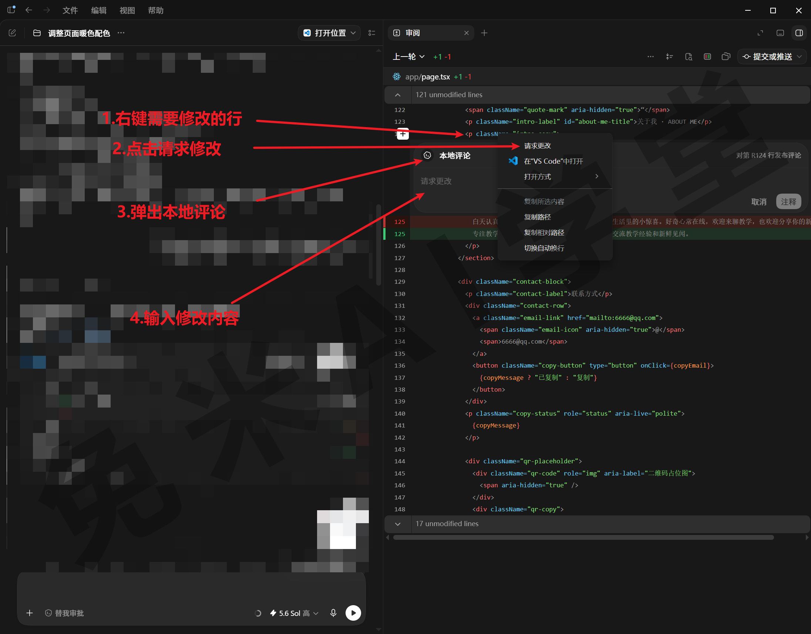

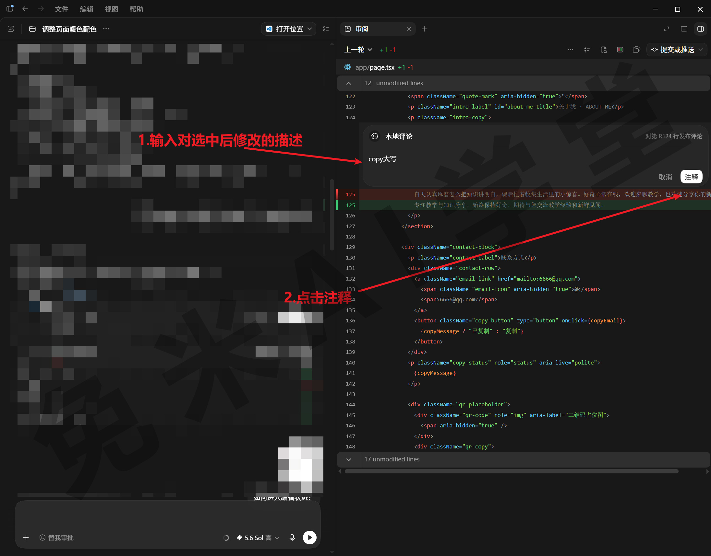

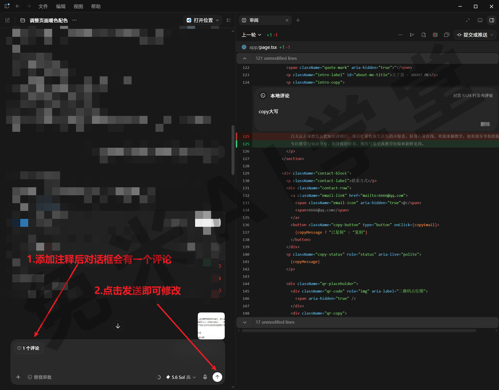

**手改和让 AI 改，怎么分工**

- **自己动手**：一两处小改、答案明确的纯文字调整，例如错别字、标点、个别措辞，你改比它快，也不消耗额度。
- **选中改写**：知道哪段不满意、但不想自己措辞时，选中它让 AI 只碰这一段，指哪打哪，影响面最小。
- **行内批注**：意见分散在好几处、每处都要说清楚时，把批注钉在各行上一次交办，比来回描述位置省事。
- **整体交给 AI**：批量修改、跨文件修改和涉及逻辑的改动，各处往往互相关联，手改容易漏掉配套位置，交给它更稳妥。

手动修改后通常不需要专门向 Codex 汇报，工作区文件保存的就是最新内容。不过，如果手动调整幅度较大，或者后续任务与这部分内容密切相关，最好在下一条指令中简单说明，并让 Codex重新检查当前文件。

### 7.5 一键还原：后悔药

规矩、核对、手改都有了，还差最后一层：真改坏了怎么办。这一节先演示怎么把一次坏改动完整撤销，再讲清还原能救什么、救不了什么。

**演示：故意改坏**

用名片站做一次安全的破坏实验。发送：

```text
把名片站样式文件里的所有颜色统一改成亮绿色，字号统一改成 10px。
```

任务完成后打开页面预览，效果通常会明显变差、难以正常阅读；再打开 Diff 面板、切到最近一轮，红绿改动集中在样式文件上。这就是我们要的事故现场：破坏范围看得清清楚楚，随时可以收拾。

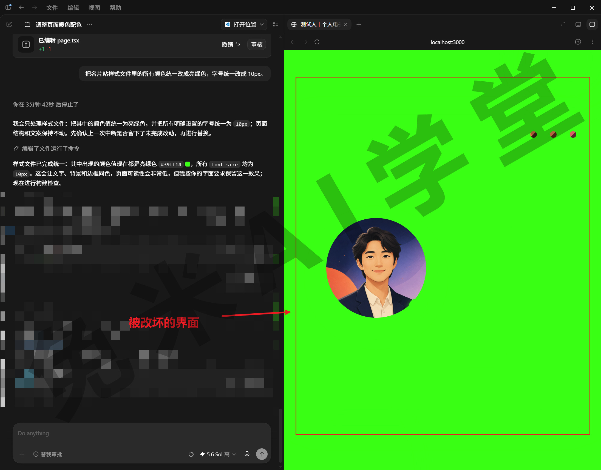

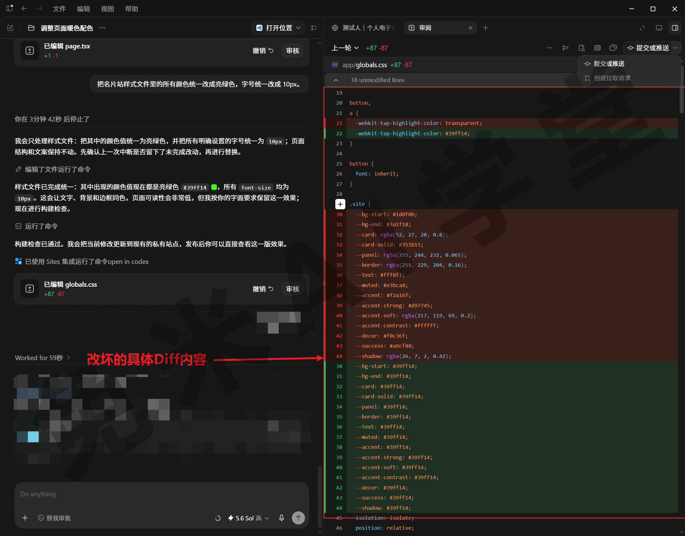

**主路径：撤销某一轮任务的改动**

Codex 完成文件修改后，任务结果卡片会列出本轮编辑的文件和增删行数，并提供“撤销”按钮。如果这一轮修改整体都不需要，可以点击“撤销”，将该轮任务产生的文件改动退回。

操作前先检查卡片中的文件名和增删行数，确认它对应的正是需要撤销的任务。任务卡片上的撤销以整轮任务为单位，不能只撤销其中一个文件或一块代码。

撤销完成后，返回本地页面预览并刷新，检查页面是否恢复到修改前的状态。

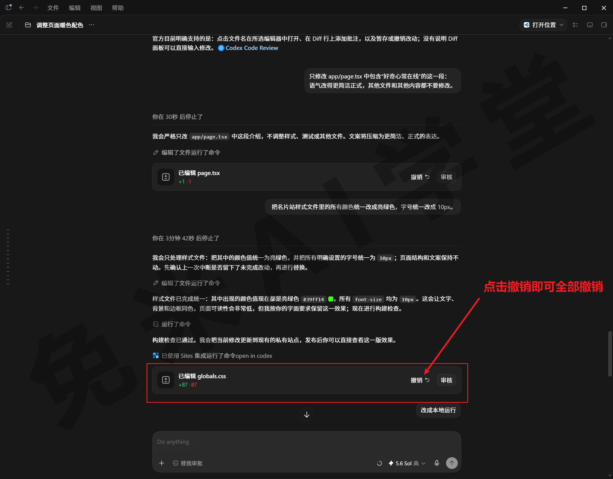

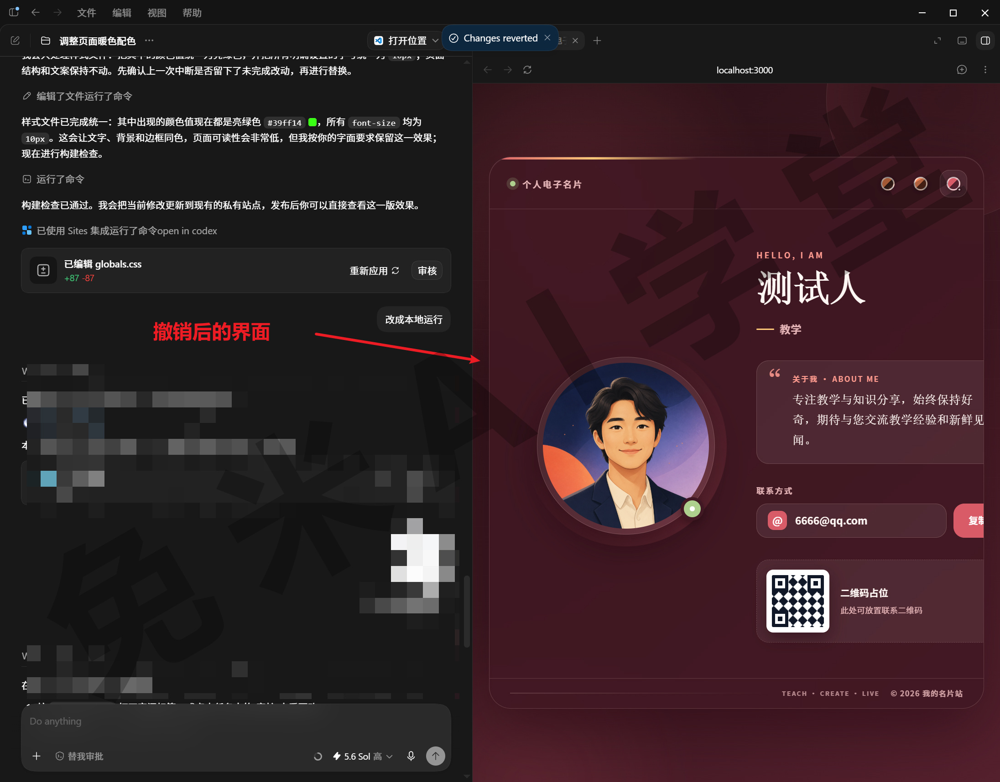


**需要局部撤销时**

如果只想撤销一个文件或一块代码，可以打开“审阅”面板并切换到“未暂存”视图。官方说明该视图支持整体、单文件和单块三级暂存与还原操作，但这些按钮只针对当前 Git 工作区中的未提交改动。

**能救什么**

还原针对的是任务对项目文件的改动：这次任务新增、修改、删除的文件内容，都能退回改动之前的状态。样式改坏了、段落被误删了、生成了一堆不想要的文件，都在它能救的范围内。

**救不了什么**

还原不是万能后悔药，下面几类情况在它的能力之外：

- **已经产生外部影响的操作**：还原只退回文件内容，退不回已经发生的动作。任务里装的软件不会自动卸载，发出去的网络请求收不回来，后面课程会学到的部署上线，也不会因为还原自动下线。
- **想回到更早的时刻**：还原能退回的，是这些改动发生之前的样子，不是任意时刻的时光机。想回到上周某个版本，需要更完整的版本管理，《自动化、Git 与远程》的 Git 面板会解决这个问题。
- **你的手改会被一起丢**：面板算的是总账，整体还原时，相关文件里所有尚未处理的改动一起消失，包括任务之后你自己的手改。想保住手改，先把那部分内容复制出来，或者改用单块还原，只退它改坏的部分。
- **对话本身**：还原不清除对话记录，它仍然记得之前聊过什么。想彻底换个思路重来，配合新对话一起用。

最后补一个习惯：还原是最后一道保险，不是第一道。重要项目做大改动之前，先复制一份文件夹副本，几秒钟的事，能挡住绝大多数意外；《权限、沙盒与模型》讲权限时提过这个建议，《自动化、Git 与远程》会给出更完整的方案。

### 7.6 三个练习任务

下面三个任务把本篇内容完整过一遍，建议按顺序完成。提示词可以直接复制，涉及名片站的部分，换成你自己的项目同样适用。

**任务一：生成一份含禁区的 AGENTS.md**

进入你的项目，发送下面的指令，然后逐条通读生成结果，把禁区替换成你真正在意的内容：

```text
根据当前项目生成 AGENTS.md，用中文描述。另外补充两条禁区：配色方案不许修改；
“联系方式”区块的定稿文案不许改动。
```

完成标准：项目文件夹里出现 AGENTS.md，禁区部分是你亲自确认过的；新开一个对话问它“你当前遵守的项目规矩有哪些”，回答能对上你写的禁区。

**任务二：在 Diff 里手改一处并保存**

先让 Codex 做一个小改动，制造一份 Diff：

```text
在页面最底部加一句：由 AI 协助搭建。
```

然后打开 Diff 面板，把这句话手改成你更喜欢的说法，例如“由 AI 协助完成”，保存并确认生效。

完成标准：页面上显示的是你手改后的版本，面板里能看到这处属于你的改动。

**任务三：故意改坏一处，用还原恢复**

发送一条明显会改坏页面的指令：

```text
把页面背景色改成纯黑，文字颜色改成深灰。
```

打开预览确认页面已经难以阅读，切到最近一轮看清改动范围，然后执行还原，确认页面恢复原样。

完成标准：完整走过改坏、看 Diff、还原、确认恢复四步，并能说出这次还原用的是哪一档。

### 7.7 本篇小结与自检

这一篇给项目立了规矩，并学会了看懂和撤销改动。最需要记住的是：**改动前有 AGENTS.md 约束，改动后有 Diff 核对，改坏了有还原兜底——这三层就是放心让 AI 动手的底气。**

可以对照下面的清单检查学习结果：

- [ ] 项目里已有一份含禁区的 AGENTS.md
- [ ] 能在 Diff 面板里说出一次任务改了哪些文件
- [ ] 在 Diff 内手改过一处并保存成功
- [ ] 完整执行过一次“改坏 → 还原”
- [ ] 能说出手改和让 AI 改各适合什么情况

完成这些内容后，你对 AI 的改动已经有了完整的约束和兜底手段。下一篇《插件与部署上线》认识插件系统，并把作品发布到互联网上。

### 7.8 新手常见问题

**Q1：AGENTS.md 会不会被 AI 自己改掉？**

它有能力改，但一般不会主动改。AGENTS.md 是项目里的一个普通文件，Codex 通常把它当作要遵守的约束，不会自作主张去动；你在聊天里明确要求它更新规矩时，它才会照改，这正是 7.2 说的聊天指令优先于说明书。如果不放心，可以在文件里写明“本文件未经我明确要求不得修改”，再把 7.3 的核对习惯用起来：每次任务后扫一眼改动列表，确认 AGENTS.md 不在其中；真被改了，用还原恢复即可。

**Q2：还原会把我手改的内容也撤销吗？**

整体还原会。Diff 面板算的是项目的总账，执行整体还原时，相关文件里所有尚未处理的改动一起退回，任务之后你自己的手改也在其中；任务级一键还原的具体范围，以实际表现为准。想保住手改有三个办法：执行前把要保留的内容先复制出来；改用单文件或单块还原，缩小撤销范围；平时把满意的改动及时定稿存档（怎么做，《自动化、Git 与远程》会讲）。

**Q3：Diff 里的内容看不懂怎么办？**

看不懂代码不影响用 Diff。按 7.3 的三件核对法把关就够：文件对不对、量级对不对、文字对不对。实在想弄明白某处改动，直接让它解释，发送：

```text
用通俗的语言解释这次改动：每个文件改了什么，为什么要改。
```

**Q4：全局规矩和项目规矩冲突时听谁的？**

离项目更近的优先：项目 AGENTS.md 针对当前项目，比全局文件更具体，两者冲突时通常以项目规矩为准。所以分工建议是：全局文件只放跨项目通用的个人偏好，例如回复语言；和具体项目绑定的约定、禁区，一律写进项目的 AGENTS.md。拿不准某条规矩有没有生效，新开个对话问它“你当前遵守的项目规矩有哪些”，对照回答核实。
