## 插件与部署上线

上一篇《AGENTS.md、Diff 与还原》给项目立了规矩，学会了核对与还原改动，现在可以放心地做更大的动作了。这一篇做两件事：先把插件系统讲清楚，弄明白插件从哪来、怎么装、怎么授权、怎么管理；再用部署能力把《计划模式》里做的电子名片站正式发布到互联网，拿到一个可以发给任何人的链接。过程中还会经历一次真实的部署排障，把翻车的处理方法一并学会。

### 8.1 插件是什么

插件在《办公能力一集讲全》已经打过照面：做 Excel 用的表格插件、做 PPT 用的演示插件，都是插件。那一篇只教了怎么用，这一节把插件系统本身讲透。

**本质：别人打包好的能力包**

插件是别人开发好、打包好的能力，装上就能用。一个插件里装的往往不止一样东西：可能是几套现成的工作方法，也可能是对某个外部服务的连接，比如邮箱、代码托管平台、网站托管平台，装一个插件，常常等于一次性获得一组配套能力。这些外部连接背后的机制，《MCP 全解》会专门讲，现在不必深究。

来源分两类：官方开发的，以及第三方开发者提供的。你在《办公能力一集讲全》用过的表格、演示插件属于官方核心插件。调用方式也在那一篇练过：输入 @ 从列表里选中它，或者干脆把需求说清楚，它判断需要时自己启用。

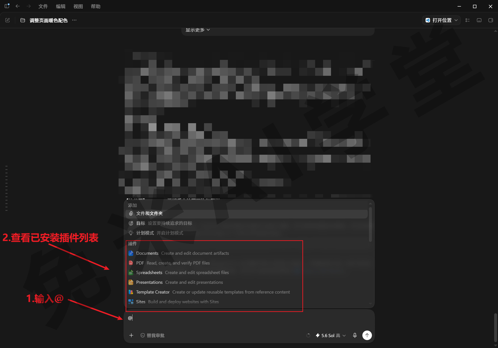

**插件面板：找插件的地方**

想看看还有哪些插件可装，去插件面板：入口通常在侧边栏，《办公能力一集讲全》装表格、演示插件时进去过。面板里可以浏览、搜索所有可安装的插件，这个集合官方叫插件目录，日常也有人叫它插件市场，说的是一回事。

目录里的插件一般分成几个区：官方出品的精选区、你所在团队或别人共享给你的、你自己创建的，另有一栏单独列出已安装的插件。新手阶段主要逛精选区就够了。

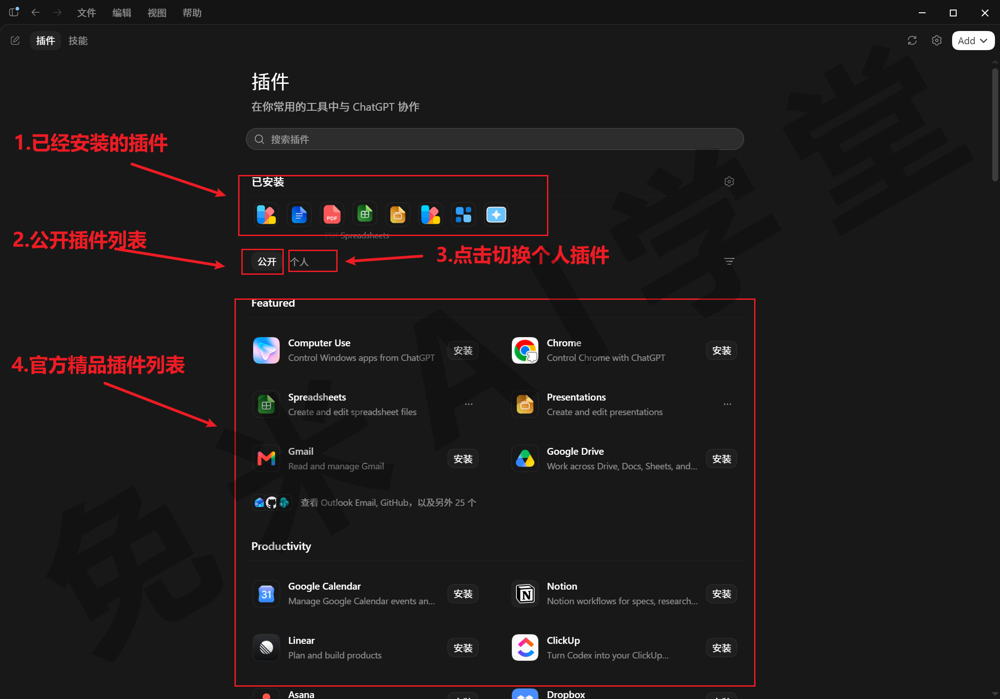

**安装路线有三条**

动手安装之前，先交代一个前提：插件面板不是唯一的安装入口，也不是所有插件都能在面板里装到。插件目录收录的只是一部分插件，开发者自己发布、没有进目录的第三方插件，面板里根本搜不到。所以安装一共有三条路线：目录里有的，在面板里装最稳妥；目录里没有的，后两条对话路线兜底。

**路线一：面板里点安装**

适用于目录里能找到的插件。从看到一个插件到用上它，标准流程是四步：

1. 在面板里浏览或搜索，点开插件的详情页，先读一遍它的介绍：它是做什么的、需要连接什么服务。
2. 点详情页上的安装按钮（按钮形态，需实机验证），装好后卡片上会出现已安装的标记。
3. 需要连接外部服务的插件会请求授权：有的在安装时就提示，有的等你第一次用它才提示；授权页怎么读，下面单独讲。
4. 新开一个对话再使用：刚装好的插件在旧对话里可能不出现，这和 AGENTS.md 的生效时机是一个道理，对话开场装载一次（以实际表现为准）。

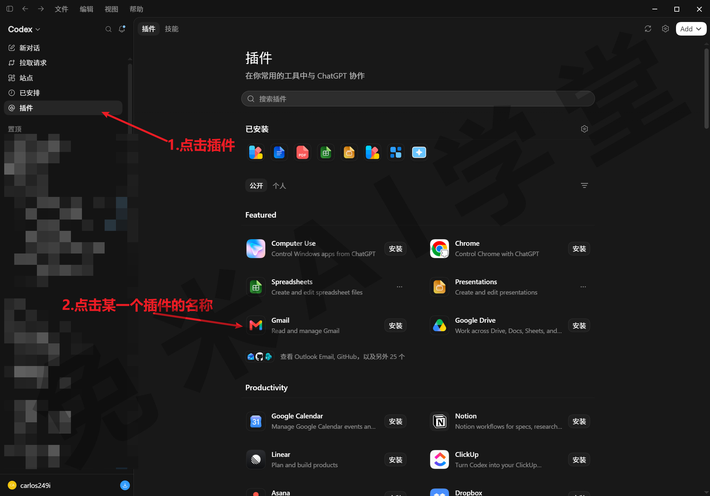

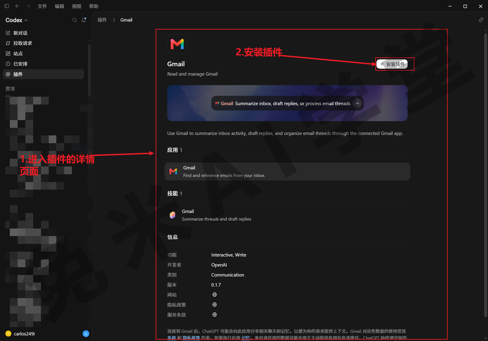

**路线二：报插件名，让它自己装**

不想在面板里翻，也可以在对话里直接说出插件名，让 Codex 自己去找、自己装。这条路线适合名气大的插件：越有名，它找对的把握越大。风险也在这里：同名或名字相近的插件可能不止一个，它有可能装成另外一个。所以指令里别只说一句“装上某某插件”，让它先报出找到的插件全名和来源，你确认之后再装。发送（方括号里的内容换成你自己的，下同）：

```
帮我安装 [插件名] 插件。先告诉我你找到的插件全名、开发者和来源，我确认后你再安装。
```

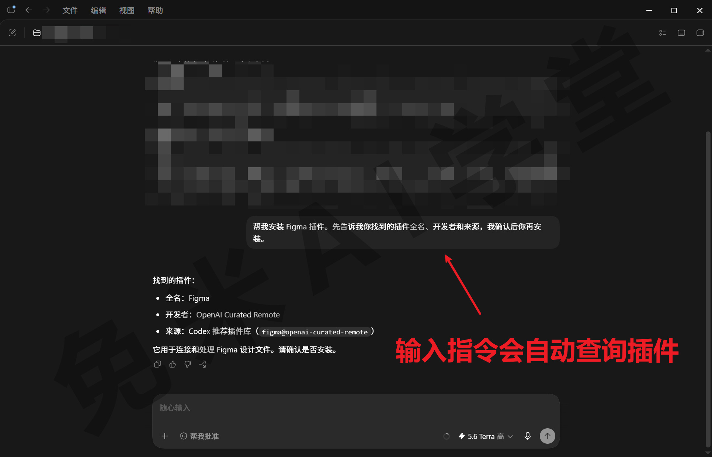

它会先回报找到的是哪一个，你对照插件名和开发者确认没认错，再让它继续。装好之后的授权和生效时机，与路线一相同。

**路线三：发 GitHub 地址给它，所有插件都适用**

第三方开发者发布插件时，通常会公布一个 GitHub 仓库地址。GitHub 是开发者存放和分享代码的网站，插件的源文件一般就放在那里，地址通常以 github.com 开头。把这个地址直接发给 Codex，让它照仓库里的说明安装（具体支持方式，需实机验证）。这条路线对所有插件都适用：目录里没有的、报名字怕装错的，给地址就不会认错对象，是三条路线里最保险的一条，也是面板里找不到时的兜底。发送：

```
帮我安装这个插件：[GitHub 仓库地址]。先按仓库说明确认安装方式，装好后告诉我该怎么调用它。
```

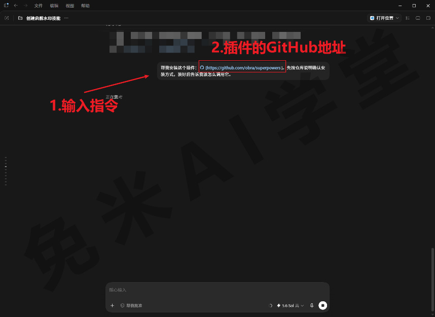

地址从哪里来？插件的介绍页、开发者的主页或教程帖里一般都会给出。来路不明的仓库别急着装，先按本节末尾信任分级的做法给它做一次体检，看过再决定装不装。

**授权页怎么读**

授权是安装环节里唯一需要认真对待的一步，因为它连接的是你的真实账号。授权页弹出来时，不要不看内容就点同意，看三件事：

- **连的是哪个账号**：页面会写明请求访问的服务和账号，确认它就是你打算交给它用的那个，别把工作账号和个人账号搞混。
- **权限范围有多大**：只读取，还是可以修改、发布内容，范围越大越要想清楚；用不到写入权限的插件却要写入权限，就值得多问一句。
- **撤销入口在哪里**：授权不是一次性的决定，随时可以解除。装完顺手确认一下撤销的位置，通常在插件卡片或设置的连接管理区（具体入口，需实机验证），需要时能马上找到。

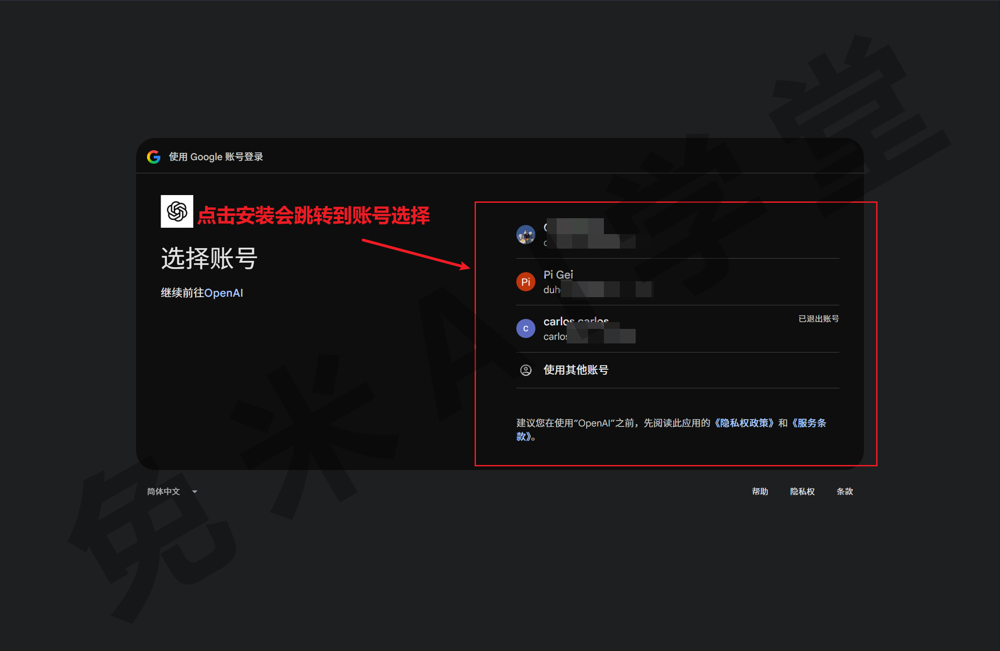

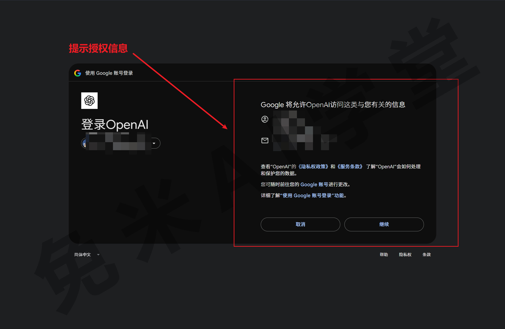

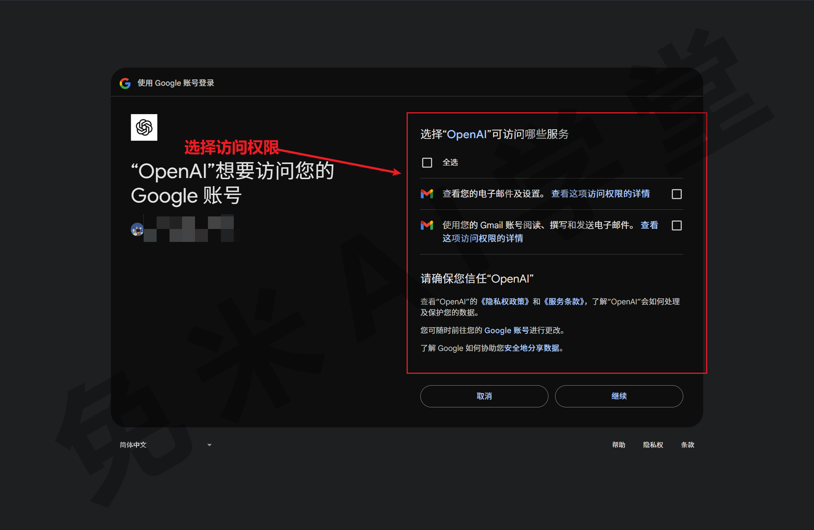

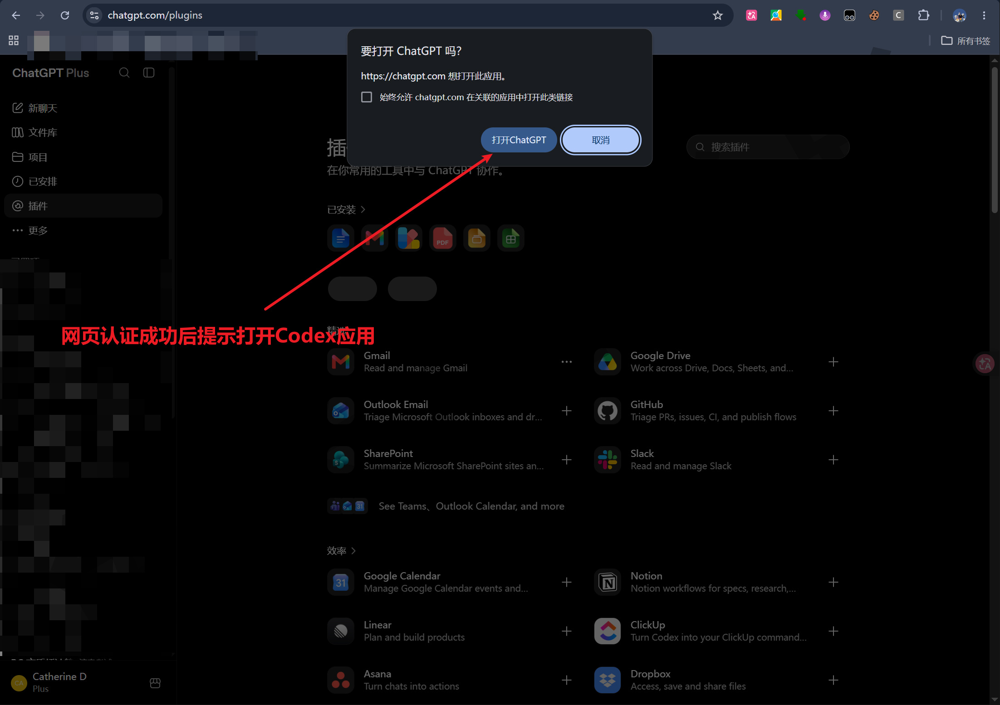

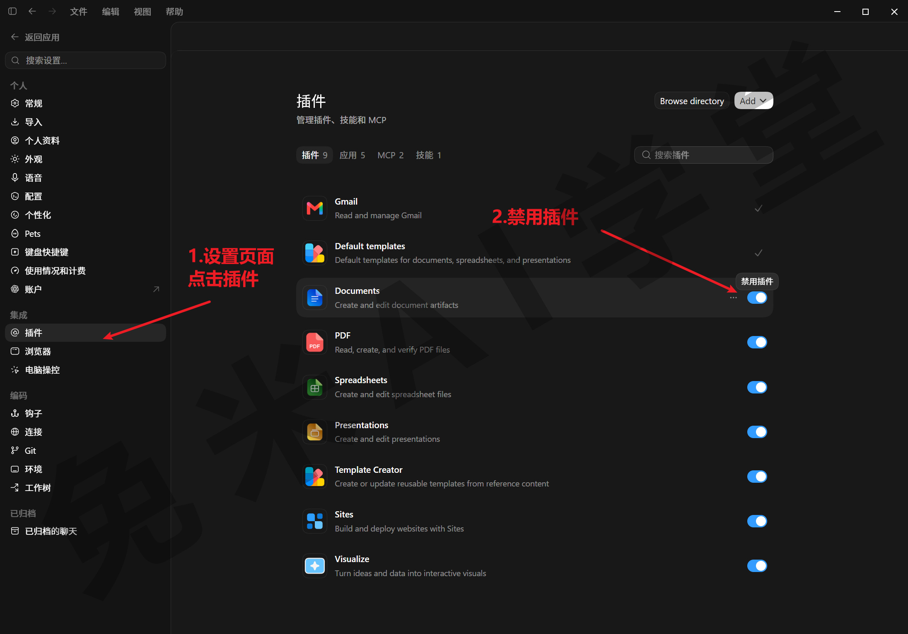

再补两个定心丸：

- **授权不等于放权**：授权只是打通连接，插件干活时的每一步动作，仍然受《权限、沙盒与模型》讲的权限机制约束，装了插件，不等于把权限也一并放开了。
- **按钮置灰不是故障**：如果安装或连接按钮是灰色的点不动，多半是套餐、地区或团队管理员设置的限制，不是软件故障（以实际界面提示为准）。

**信任分级：官方的直接装，小插件先掂量**

最后是来源判断。官方精选区的插件经过筛选，可以直接装；团队里共享的，看清是谁发布的；来路不明的第三方小插件要先掂量：看它要什么权限、服务方是谁，介绍页语焉不详的干脆不装，拿不准时可以把插件介绍或仓库地址发给 Codex，让它帮你分析用途和风险。走路线二、路线三装目录外的插件时，这一步体检尤其不要省。这个判断习惯和后面《Skills 技能系统 + 桌面宠物》里挑选社区技能是同一套。

### 8.2 新手装插件的节制观

逛完插件目录，很容易觉得什么都有用，恨不得全装上。这一节劝你克制，并教你怎么给已装的插件做管理。

**装太多的三笔账**

装太多的代价可以算成三笔账：

- **菜单账**：每装一个插件，@ 列表就长一截，真要用的那个反而要翻着找。
- **心智账**：功能相近的插件装了好几个，每次都要分辨该用哪个，选择本身就是负担。
- **行李账**（最容易被忽略）：装上的插件相当于 AI 每次开工都要背着的行李，它得知道自己有哪些工具、各自怎么用，装得越多，这份说明越厚，占用的注意力越多（成本随插件包含的内容多少而变，以实际表现为准）。

和上一篇说明书要精简是同一个道理：多出来的东西不是免费的。

**原则：装不装，看场景**

判断标准一句话：装之前自问，它能帮我少做哪一步？答得上来就装，答不上来就先不装。没有场景支撑，再强的插件也只是占地方。新手阶段先把官方核心插件用熟，比如办公三件套和部署插件，遇到具体需求、现有能力做不了或做不好时，再去目录里找对应的插件。反过来说，节制也不是能不装就不装：真正进入你工作流、隔三差五就会用到的插件，装得理直气壮。衡量标准从来不是装了几个，而是装上的每一个是否都在被用。

**动手：给插件做一次体检**

现在就把这套原则落到手上。发送：

```
列出我现在已经安装的插件，逐个说明用途，并标出你觉得我最近很少用到的。
```

它会盘点你的插件清单。对照回复问自己：每一个都答得上来它帮我少做了哪一步吗？答不上来的，就是这次体检筛出来的对象。

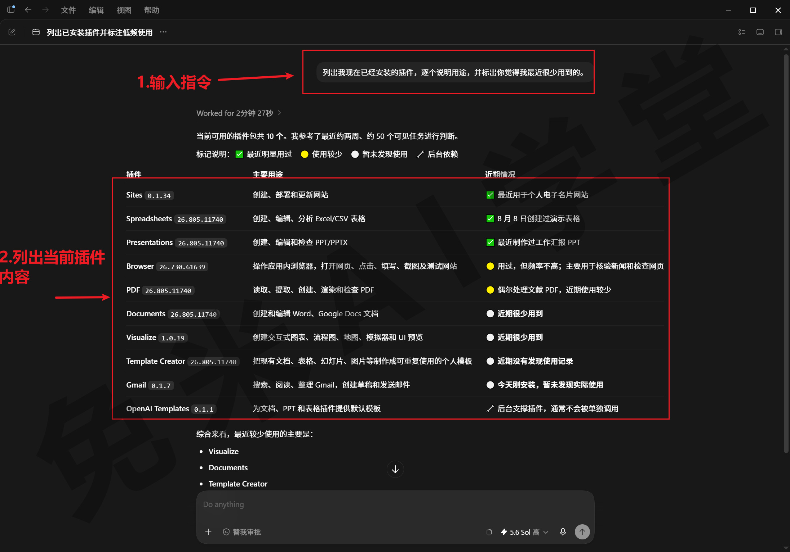

**停用与移除**

筛出来的插件不必一步删掉，插件管理有两档轻重。轻的一档是停用：插件卡片上一般有启用开关（位置与形态，需实机验证），关掉后插件还在，只是不再出现在 @ 列表、不再被自动启用，相当于收进抽屉，想用随时打开。重的一档才是移除，也就是卸载。日常建议多用停用、少用移除：判断失误的成本几乎为零。操作完成后新开一个对话，输入 @ 确认列表已经清爽（生效时机，以实际表现为准）。

另外要知道，移除插件和解除授权是两件事：卸载之后，之前给外部服务的授权是否同步解除，以实际界面为准。谨慎起见，移除连过账号的插件后，顺手到 8.1 说的撤销入口看一眼，确认没有留下还挂着的授权。

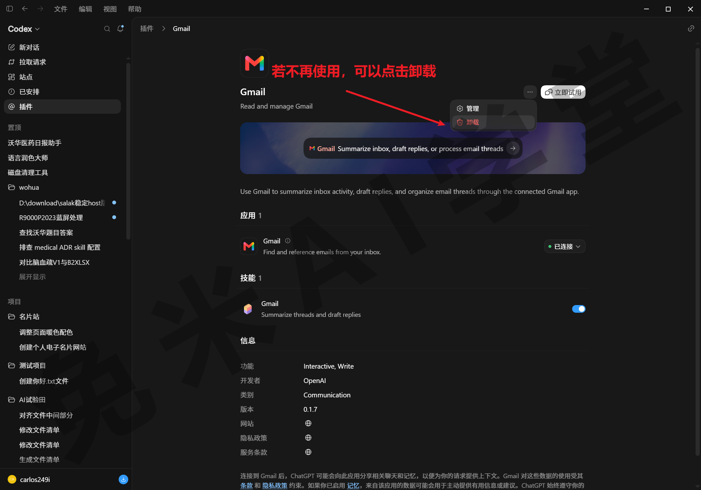

**认知一提：插件可以自己做**

这件事现在知道即可，不必动手：把你的工作方法打包成插件分享给别人，官方提供了配套工具，《Skills 技能系统 + 桌面宠物》讲技能时会顺带认识，属于进阶内容，这里先按下不表。至于目录之外的插件怎么装，8.1 的路线二、路线三已经讲过，需要时翻回去照做即可。

### 8.3 两条部署路线

现在进入本篇的重点：把《计划模式》里做好的名片站发布到互联网上。

先解释部署这个词：你的名片站现在只是电脑里的一个文件夹，只有你自己能打开；部署就是把这些文件搬到互联网上的服务器，换来一个公开链接，任何人在任何设备的浏览器里输入链接就能访问。这个词后面会经常出现，理解成把作品搬上网即可。当前有两条常用路线，都不需要你懂服务器。

**路线一：官方 Sites**

Sites 是应用自带的建站与托管能力，零配置：不用注册任何外部账号，选中项目发一句话，完成后直接拿到链接。入口通常在应用侧边栏或功能菜单里（入口位置与名称，需实机验证）。要先说明的是，Sites 目前公测分批开放，能不能用和套餐、地区、团队设置都有关系，部分地区首发不提供；你的账号里暂时找不到入口，不是故障，直接走路线二即可。

Sites 的发布分两步，这个设计值得先弄懂：第一步保存版本，把当前项目打包成一个可检查的候选；第二步才是正式部署，把保存的版本发布出去、生成访问链接。要记住一件事：部署出来的链接就是正式线上地址，没有草稿一说，想先自己看看再见人，就停在保存版本这一步，确认满意再部署。进入名片站项目，发送：

```
用 Sites 把当前项目部署上线：先保存一个版本，向我说明效果；
我确认后再正式发布，把访问链接发给我。
```

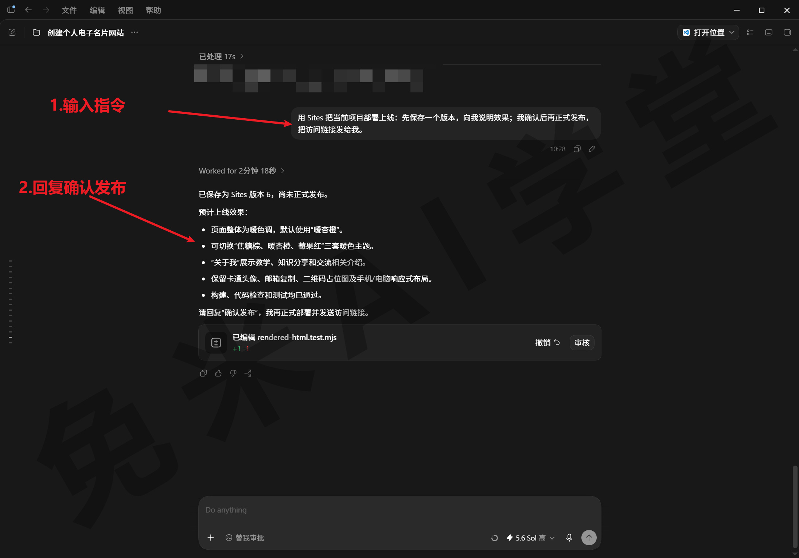

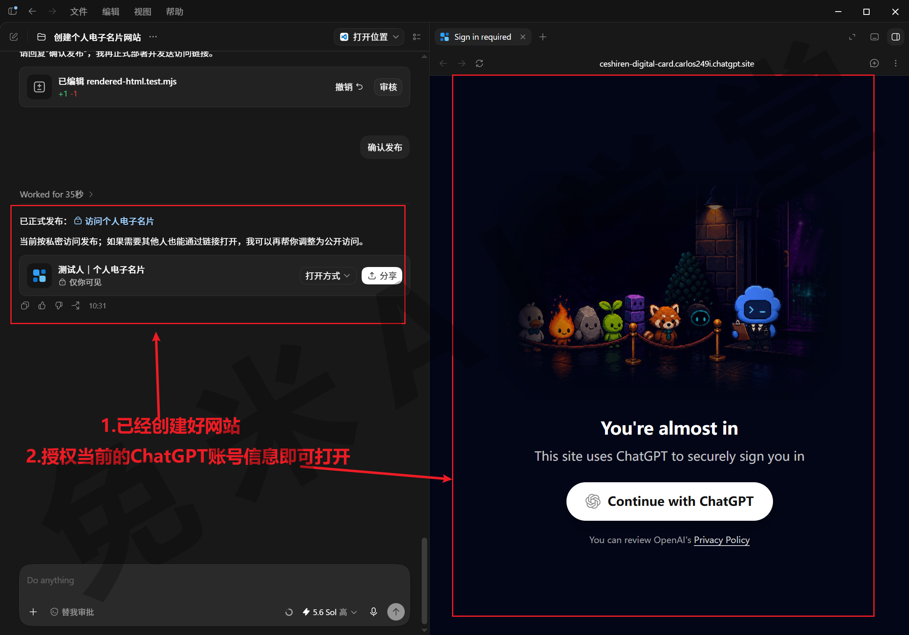


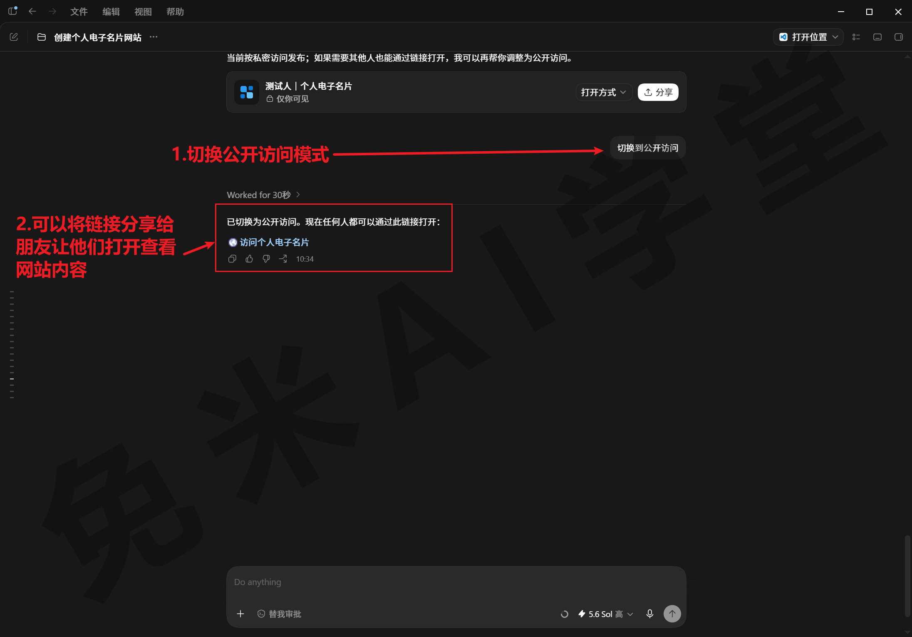

**绑定自己的域名（可选）**

Sites 给的默认链接已经可以正常访问，域名绑定是可选项：想让名片站用你自己的网址，比如你购买过的个人域名，可以在站点设置里添加域名，把它给出的解析记录加到你的域名服务商那边，等几分钟生效后回来刷新状态（界面措辞与流程，以实际界面为准）。前提有两个：域名得是你自己已经拥有的，Sites 不负责代买；你得能修改这个域名的解析记录。新手第一次上线，用默认链接完全够用，这一步可以留到以后。

**路线二：Netlify 插件**

Netlify 是一家老牌网站托管平台，对应的官方插件在插件目录里就能装。装好后首次使用会走授权流程，按 8.1 的方法把授权页读一遍再确认。之后部署就是一句话的事：

```
用 Netlify 插件把当前项目部署上线，部署完成后把正式访问链接发给我。
```

执行过程中它可能先给出一个预览性质的链接、确认后再发布正式地址（执行过程的具体形态，以实际表现为准）。要留意一点：过程中出现的临时链接可能有时效，分享给别人要用最终的正式链接。这条路线的好处是控制更细：Netlify 有自己完整的控制台，每次部署的记录、日志都查得到，部署出问题时它还能直接读取部署状态和构建日志，这一点下一节马上会用到。

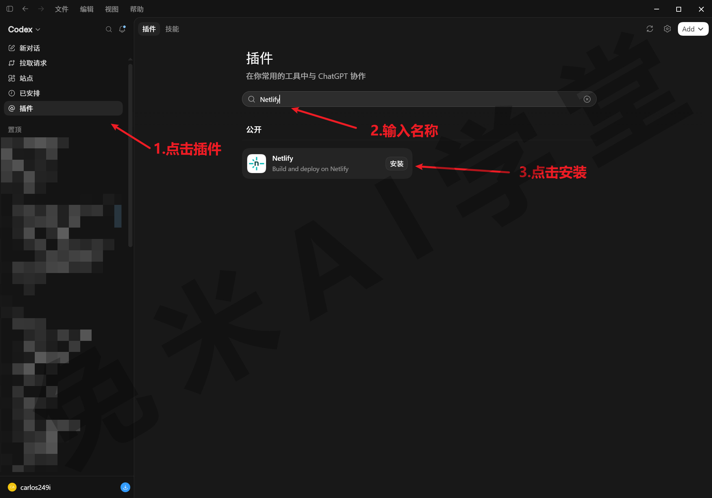

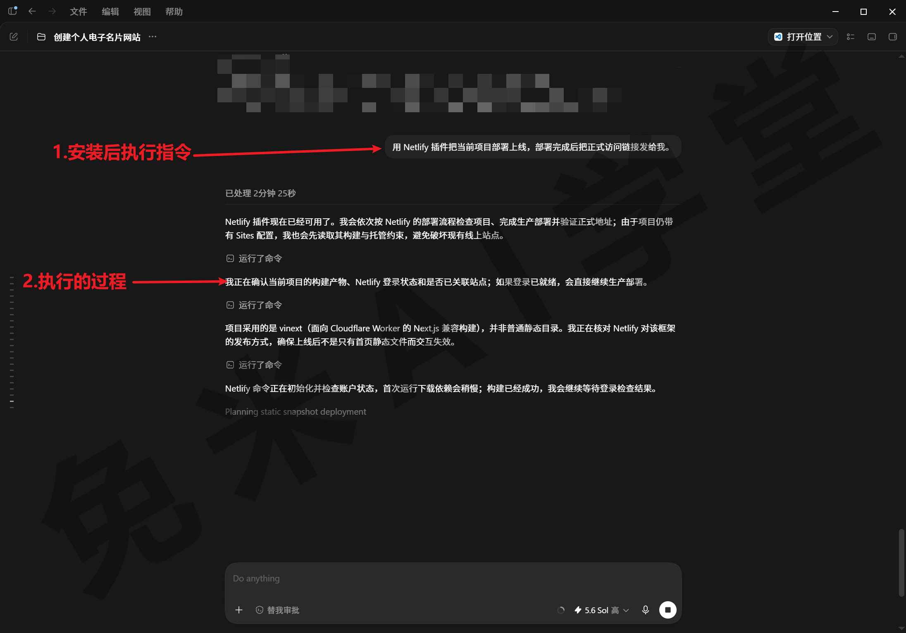

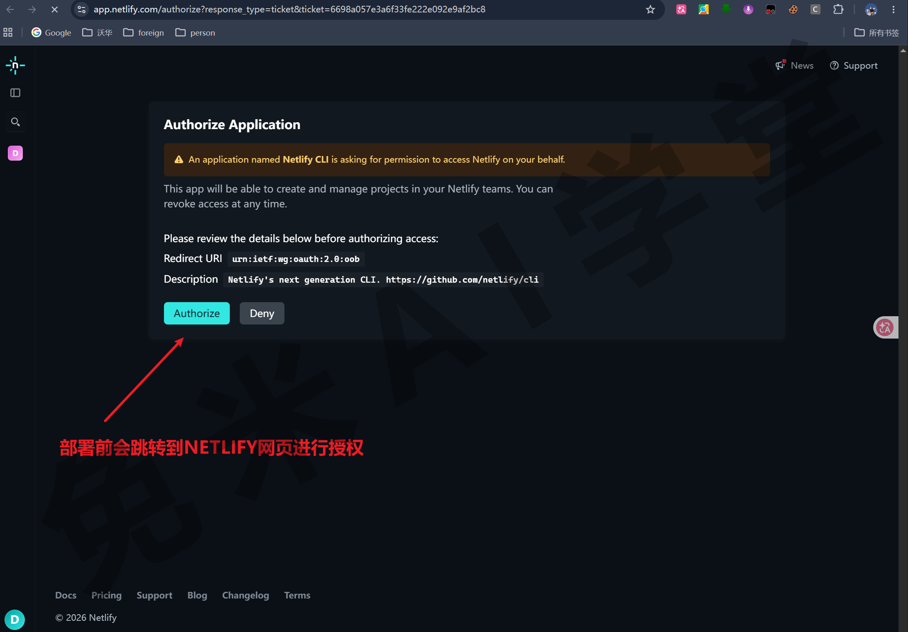

**两条路线怎么选**

- **官方 Sites**：零配置最省心，不用注册外部账号，和应用一体；公测阶段能不能用要看账号，适合图省事、快速见效的场景。
- **Netlify 插件**：任何人都能注册使用，不受公测限制；部署记录、日志、站点设置都有完整控制台，适合想要更细控制、以后打算认真维护站点的场景。

两条路线不冲突，同一个项目可以各上线一次，对比一下从发指令到拿链接的体验差别，再定自己的主力路线。

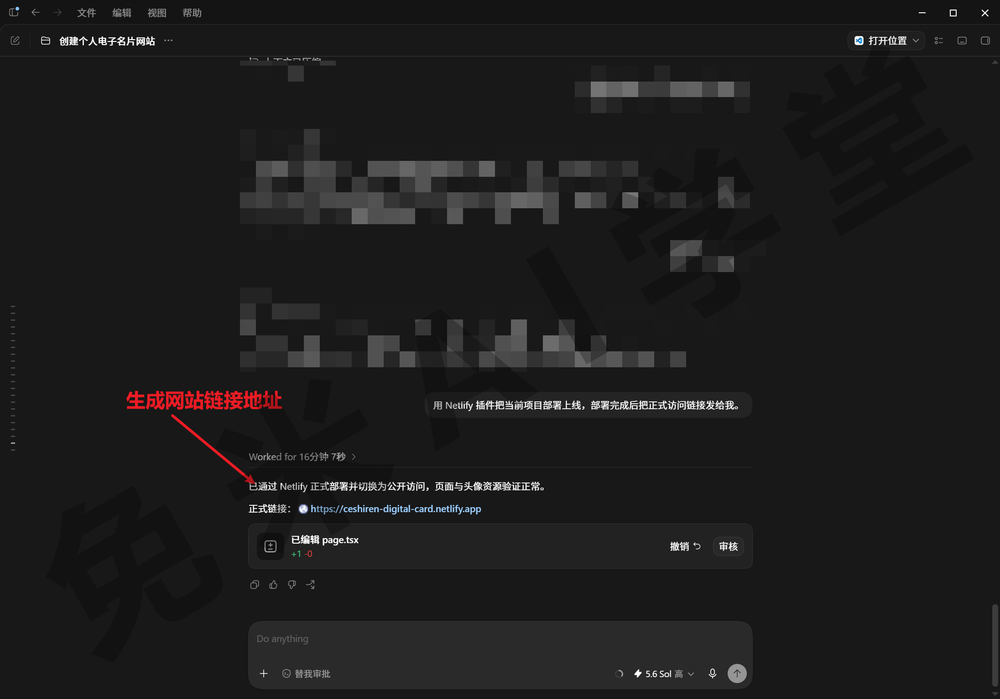

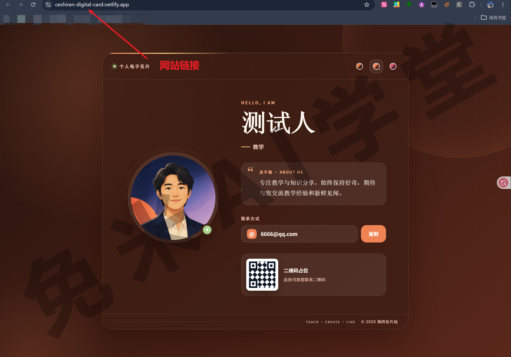

**拿到链接之后**

用手机浏览器打开正式链接，确认线上效果和本地一致，这一步经常能发现电脑上看不出的问题，比如文字在小屏幕上挤成一团。确认没问题后，做一件很实用的小事，发送：

```
把刚才的正式访问链接生成一张二维码图片，保存到项目文件夹里，方便我发给朋友扫码访问。
```

到这里，你的第一个作品正式上线了，链接和二维码都可以发出去了。

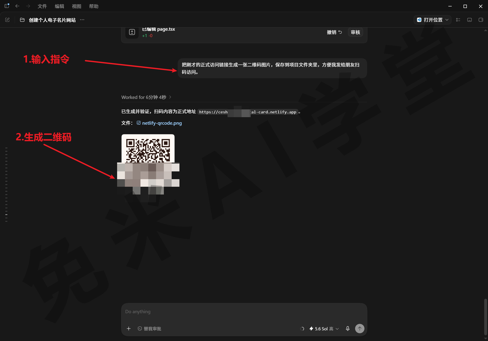


### 8.4 部署翻车实录与排障

部署平台显示成功，不代表网站已经能够正常交付。完整的部署流程不仅包括构建和上传，还要确认正式链接可以公开访问，页面内容和图片资源也能正常显示。

下面记录一次真实的 Netlify 部署排障过程。

**问题一：发布时重复运行构建**

项目在本地已经完成构建，也准备好了需要上传的页面文件。但第一次执行正式部署时，Netlify 又自动运行了一次构建，导致临时发布目录被重新生成，原本准备好的文件也随之被清理，最终部署失败。

Codex 根据部署返回的错误信息检查可用参数，确认问题不在页面代码，而在于部署阶段重复执行了构建。随后它重新准备发布文件，跳过多余的构建步骤，再次上传，正式部署成功。

这里不需要你另外发送“不要再次运行构建”之类的指令。只要最初的任务要求是完成部署，Codex 在遇到错误后就可以继续排查和尝试其他可行方式。是否能够连续处理，仍以当前任务权限、插件能力和实际错误为准。

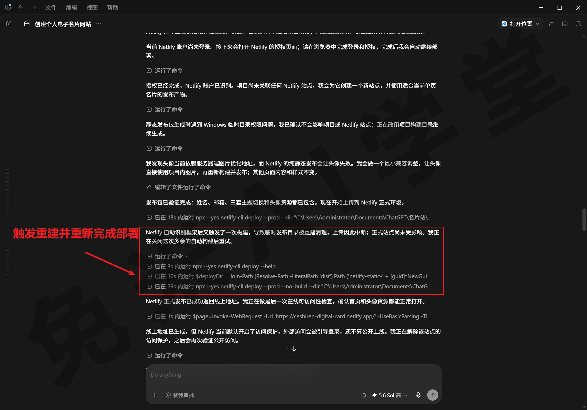

**问题二：部署成功，但访客需要登录**

Netlify 成功返回正式链接后，访问检查又发现了第二个问题：打开网站时会跳转到 Netlify 登录页面，未登录的访客无法直接查看名片。

这说明文件虽然已经上传成功，但站点还没有真正公开。

Codex 继续检查站点的访问配置，发现新站点开启了登录保护。关闭保护后，它再次访问正式链接，把页面逐项核了一遍：首页返回正常状态，普通访客不需要登录就能直接打开，姓名和邮箱都正常显示，头像资源可以打开，主题切换区域也已经加载。完成这些检查后，正式链接才具备交付条件。

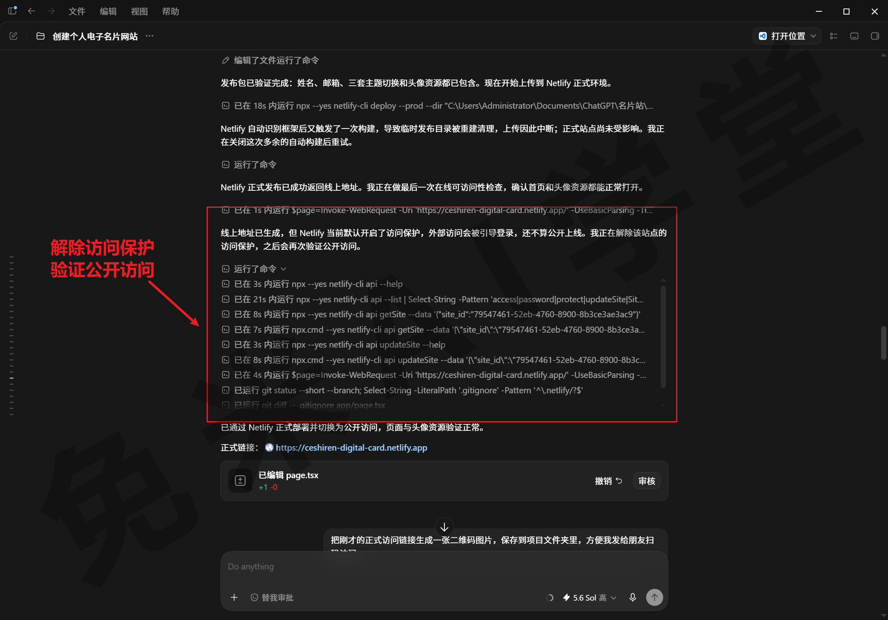

**把线上验证写进部署要求**

这次任务中，Codex 在部署后继续检查了正式页面，但不能默认每一次部署都会自动完成相同的验证。不同任务、插件和平台的行为可能不同。

更稳妥的做法，是在最开始的指令中明确写出验收条件：

```
用 Netlify 插件把当前项目部署到正式环境。

部署完成后不要立即结束，继续检查正式链接是否可以公开访问，并验证首页、主要文字、
头像和其他静态资源是否正常。
发现问题就继续排查和重新部署，确认无误后再把正式访问链接发给我。
```

这样，“部署成功”的标准就不再只是平台返回一个链接，而是链接已经经过实际检查，可以直接交给其他人访问。

**部署后至少检查这些内容**

每次部署完成后，建议逐项确认下面几件事：

- **正式链接能否直接打开**：换一台设备或用无痕窗口输入链接再试一次，避开本机缓存和已登录状态的干扰；打不开就按下面的方法交给它排查。
- **是否要求访客登录**：一打开就跳到部署平台的登录页，说明站点还没真正公开，就是上面问题二的情况，让它去检查站点的访问保护设置。
- **首页主要内容是否显示**：姓名、简介这类关键文字要完整出现；出现整块空白或占位内容，多半是文件没传全或引用路径写错了。
- **头像、样式等静态资源是否正常**：图片能加载、配色和排版与本地一致；图片裂开或页面只剩没有样式的白底黑字，通常是资源路径或文件遗漏的问题。
- **页面有没有空白、错位或明显报错**：整页发白、栏目叠在一起、屏幕上直接打出英文错误提示，都算没过关，把看到的画面原样截图丢回对话让它继续修。
- **手机和电脑是否都能正常查看**：两种屏幕各打开一次再确认，文字在小屏幕上挤成一团这类毛病，只有换了设备才看得出来。

其中，页面状态、主要文字和静态资源可以要求 Codex 协助检查。但自己在常用设备上打开一次仍然有必要，因为浏览器缓存、网络环境和设备尺寸造成的问题，不一定能通过自动检查发现。

**失败时根据实际信息排查**

如果部署失败，不需要自己先猜原因，也不要急着修改配置。可以直接发送：

```
检查最近一次部署返回的错误信息、部署状态和当前项目配置，说明失败原因，
并在当前任务中继续修复和部署。修复完成后，再验证正式链接是否可以公开访问。
```

这里使用“错误信息、部署状态和项目配置”，比直接要求“读取完整日志”更准确。不同平台和插件能够读取的信息范围并不相同，应以当前实际可用的能力为准。

**截图作为补充现场**

截图仍然是很有价值的排障材料，但它更适合作为补充手段，而不是每次部署后的固定步骤。

如果 Codex 检查显示正常，而你自己的浏览器仍然出现空白页、登录提示、图片不显示或排版异常，可以把完整页面截图发回对话：

```
自动检查显示正常，但这是我实际打开正式链接时看到的页面。
请结合截图继续排查，修复后重新验证。
```

截图尽量保留完整页面、地址栏和报错提示。你看到什么，就原样提供什么，不需要自己先分析，也不需要手动抄写截图中的英文错误。

这次排障最终留下的经验是：部署完成只是文件已经送到平台，线上验证通过才代表网站真正可以交付。

### 8.5 三个练习任务

下面三个任务把插件和部署完整练一遍。提示词可以直接复制，涉及名片站的部分，换成你自己的项目同样适用。

**任务一：安装一个官方核心插件并完成授权**

先让 Codex 当参谋，发送：

```
介绍一下我现在已经安装的插件有哪些；
再从官方插件里推荐两三个对日常办公有用的，说明各自的用途，我选一个来装。
```

选定后完成安装，需要授权的，按 8.1 的方法把授权页的三件事看完再确认。

完成标准：新开对话后 @ 列表里能看到新插件，并且你能说出它要了哪些权限、撤销授权的入口在哪里。

**任务二：把自己的名片站部署上线**

进入《计划模式》里做的名片站项目，发送：

```
把当前项目部署上线，完成后把正式访问链接发给我。
```

拿到链接后，用手机打开确认效果。

完成标准：手机浏览器能正常打开你的名片站，页面显示完整。

**任务三：做一处小改动并重新部署**

发送：

```
把页面里的一句话简介改成：正在学习用 AI 做事的普通人。
改完后重新部署，完成后告诉我，我来刷新线上页面确认更新。
```

完成标准：刷新正式链接，看到的已经是修改后的内容。

### 8.6 本篇小结与自检

这一篇认识了插件系统，并把第一个作品发布上线。最需要记住的是：**插件按需安装、先用熟官方核心；部署失败不慌，把报错截图丢回对话，让它自己排查。**

可以对照下面的清单检查学习结果：

- [ ] 装过并授权过至少一个插件
- [ ] 名片站已上线，拿到可访问的正式链接
- [ ] 经历或演练过一次部署排障
- [ ] 能说出两条部署路线各适合什么场景
- [ ] 知道在哪里撤销插件授权

完成这些内容后，你的第一个作品已经可以发给任何人。下一篇《内置浏览器全解》让 Codex 自己上网：查资料、汇总信息，以及在页面上圈哪改哪。

### 8.7 新手常见问题

**Q1：插件收费吗？**

插件本身的安装通常是免费的，但要分两层看：官方插件的基础使用一般包含在订阅内；插件背后连接的第三方服务，可能有自己的账号和收费规则，例如免费额度加付费套餐。具体以插件说明和对应服务方的页面为准，安装前扫一眼介绍，看到需要账号、有用量限制这类提示时，先了解清楚再装。本课程不写死任何价格，一切以页面显示为准。

**Q2：授权页面全是英文，看不懂怎么办？**

不用硬读。把授权页面整页截图发给 Codex，让它翻译并解读：这个页面在请求什么权限、涉及哪个账号、有没有需要警惕的地方，看懂之后再决定是否同意。任何时候拿不准，都可以先不授权，插件装着不授权不会有损失，需要它时再补授权也来得及。

**Q3：部署失败了从哪里查原因？**

按 8.4 的顺序做三件事：先把失败提示或报错截图丢回对话，让它自己排查，多数问题到这一步就解决了；需要更多线索时，让它读部署日志，失败原因大多写在里面；用 Netlify 这类平台时，平台控制台也保留每次部署的记录和日志，可以直接翻看（以实际平台界面为准）。

**Q4：上线的网站所有人都能看到吗？想下线怎么办？**

拿到正式链接的人就能访问，这正是上线的含义；部分平台支持设置访问范围，例如仅自己可见或指定人可见（是否提供，以实际界面为准）。所以发布前想清楚页面内容：联系方式放到什么程度、要不要放真实电话号码，由你自己权衡。想下线也不难：部署平台都提供停用或删除站点的入口，可以自己操作，也可以直接让 Codex 帮你下线（具体入口以平台界面为准）。另外，线上内容随时可以覆盖更新，改完重新部署，旧版本就被替换了。

