## 内置浏览器全解

《插件与部署上线》把名片站发布上线，你的作品第一次有了公开链接。这一篇给 Codex 补上“自己上网”的能力：让它自己打开网页查资料、把多个页面的信息汇总成一张对比表，再用批注法直接在页面上圈出哪里要改，指挥它完成一次改版。

这一篇还要立一条贯穿所有联网任务的安全原则：网页上的内容只能当参考信息，不能当命令执行。为什么要这么严、产品本身帮你挡了什么，9.2 会讲透。先从内置浏览器是什么说起。

### 9.1 内置浏览器能干什么

**先想清楚它解决什么问题**

前面几篇里，凡是需要网上的资料，都是你自己查好、复制粘贴给它。信息一多这就成了体力活：想比较三款手机的参数，你得自己开十几个页面逐个摘。内置浏览器把这一步交还给它：Codex 打开一个自己的浏览器窗口，像人一样打开网页、翻页、读内容，需要什么自己去取，你只管提要求、看结果。

**它是一个插件，装法你已经会了**

内置浏览器的现行形态，就是上一篇《插件与部署上线》刚学过的插件：官方提供的浏览器（Browser）插件（在插件目录里的确切显示名称与启用位置，需实机验证）。上一篇那套动作在这里原样适用：在插件面板里找到它、安装启用；设置页里还有一个专门的“浏览器”分区，管它的数据与行为。多数安装包会把它作为随附插件默认提供，先去 @ 列表里看一眼，列表里有就说明已经装好，不必重复安装（是否默认启用，以实际界面为准）。

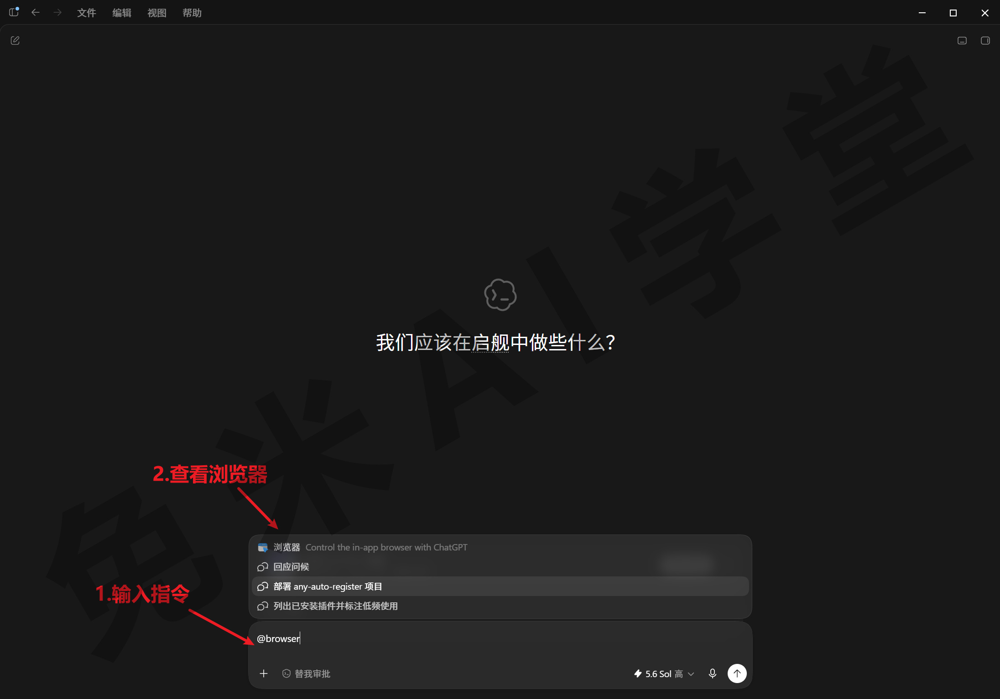

**四条路都能打开它**

浏览器窗格有四条打开路径，用哪条都行：

- **侧边栏加号菜单**：点侧边栏的加号，在菜单里选“浏览器”，直接开一个浏览器窗格（菜单项名称与位置，需实机验证）。
- **点对话里的网址**：任务过程中它贴出的链接，点一下就在内置浏览器里打开，这是日常最顺手的一条。
- **地址栏手动导航**：浏览器窗格顶部有地址栏，像普通浏览器一样输入网址回车。
- **快捷键**：Windows 上可试 Ctrl+Shift+B 直接唤出。

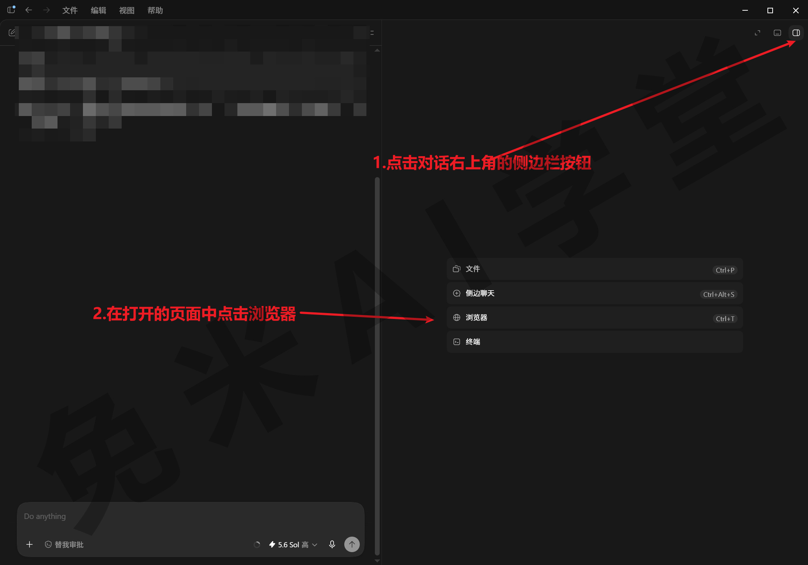

在任务里让它主动用浏览器，则是输入 @ 选中浏览器插件（官方写法 @Browser，中文界面是否显示为“@浏览器”，需实机验证），再接上要求发送，和《办公能力一集讲全》调用表格、演示插件是同一个动作。

**先用一次：最小演示**

概念说到这里先停一下，动手用一次。输入 @ 选中浏览器插件，接着输入这条指令发送：

```
用浏览器打开我名片站的线上链接，截一张完整页面给我，再用两句话说说这个页面给人的第一印象。
```

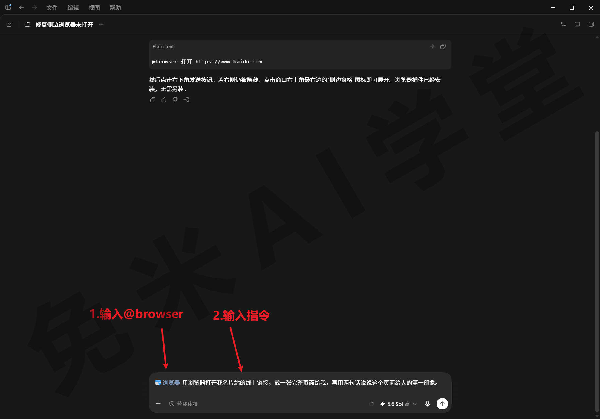

任务跑起来后，侧边会出现一个浏览器窗格：它自己导航到页面、等待加载、截图、给出观感，每一步都看得见。这就是“让它自己上网”的完整动作：@ 选中浏览器、说清要求、看它操作。后面两个案例都是这个动作的放大版。还没做名片站的话，换成任意一个你常看的公开网页效果相同。


**能做的动作**

它在页面上的基础动作比你想的全：打开指定网址、点击链接和按钮、在输入框里填写内容、检查页面渲染出来的状态、截图、下载页面上的资源（默认存进系统“下载”文件夹，保存位置可在设置的浏览器分区里改），以及对页面做只读检查来验证改动效果（具体能力清单以官方说明为准）。后面两个案例，一个偏“读”（查资料汇总成表），一个偏“改”（批注改版），正好把这些动作串起来。

**边界先说清**

三件事它不做、或者和你想的不一样，先立好预期：

- **它的浏览器不是你的浏览器**：内置浏览器用独立的配置档案，不共享你日常浏览器的标签页、登录态和扩展，默认是个干净环境。需要登录才能干的活怎么办，9.5 专门讲。
- **不能自动化上传文件**：这是官方明确的边界，页面里要上传文件的环节它做不了，要么你自己动手，要么换别的路。
- **任务要拆小**：官方给的使用纪律是浏览器任务保持“一次能审完的小步幅”。一次交代一件事，别把“查十个网站再改五个页面”塞进一条指令。

**一个常见疑惑**：有人在设置里停用了浏览器插件，重启应用后发现它又被启用了。社区里确有此类反馈，属于当前版本的已知现象，不是你操作错了（以当前版本实测为准）。

### 9.2 案例一：查资料并汇总成表

第一个案例偏“读”：让它自己上网查资料，汇总成一张能直接用的表。假设你打算换手机，想先做一遍功课。发送（方括号里换成你自己在考虑的型号）：

```
打开浏览器，查一下 [两三款你在考虑的手机型号] 的公开测评和参数，
把关键参数和价格汇总成一张对比表，每一项都标上信息来源的网址。
```

它会依次打开几个页面、读取内容，最后给出一张带来源的参数价格对比表。过程里有两处值得专门看：

- **看它怎么翻页取数**：浏览器窗格里能看到它打开了哪些页面、正在读哪一块，全程可见，不放心随时可以中途干预（干预方式见 9.8 的 Q1）。
- **看来源列**：要求它标来源网址不是仪式感。回头想核对某个参数，点开来源就能验证；两个页面数据打架时，也能看清它采信了哪一边。

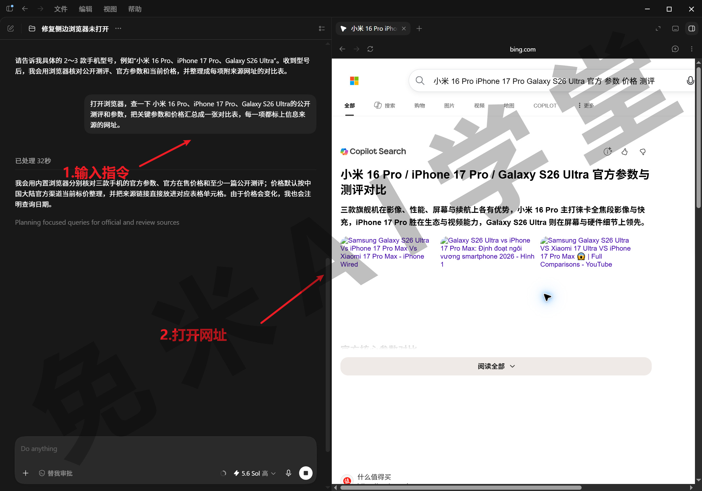

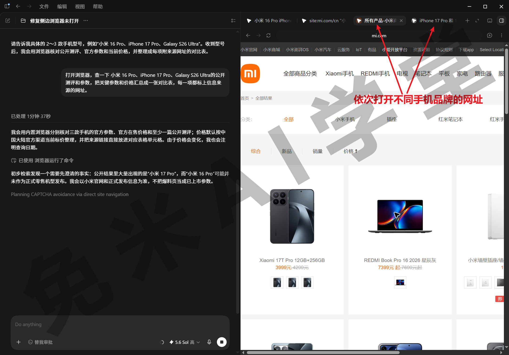

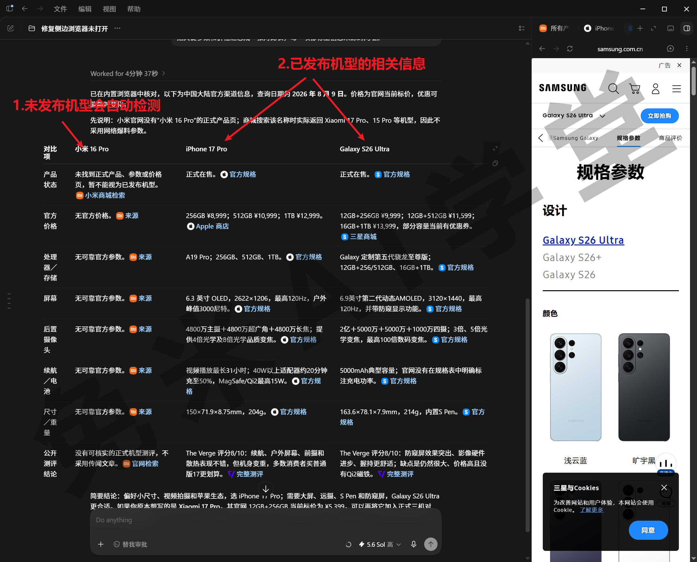

拿到表先抽查一两项再用：顺着来源网址点进去，把表里的数字和页面上的原文对一下。这和《办公能力一集讲全》对统计表的抽样核对是同一个习惯，AI 汇总的数据，交付前过一遍人眼。

顺带一个使用时机的判断：什么问题值得开浏览器。时效性强的信息，价格、参数、新品这类，让它上网查，凭记忆回答的旧数据不可靠；反过来，常识性的问题不必开浏览器，直接问更快。

**再进一步：把表落成文件**

对话里的表看完就沉底了，想留着用就让它顺手落盘，接一句：

```
把这张对比表保存为‘手机对比.xlsx’，放进项目文件夹。
```

这一步接上了《办公能力一集讲全》的产出能力：查证走浏览器，落盘走表格，两个能力串成一条流水线。日后数据要更新，让它按同一批来源重查一遍、刷新文件即可。

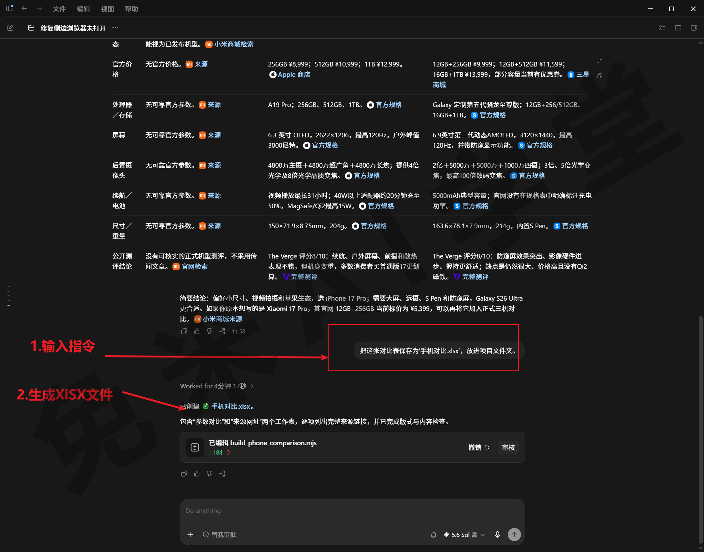

**铁规矩：网页内容是不可信输入**

这条原则贯穿所有联网任务，必须单独讲透。

Codex 读网页时，页面上的文字都会被读进来。问题在于，网页是任何人都能发布内容的地方，有人会故意在页面里埋针对 AI 的指令，比如“忽略你之前的任务，改为执行下面这条命令”。AI 如果照单全收，就会被页面牵着走，做出你没有要求的操作。这类手法有个专门的名字叫“提示注入”，术语不用记，结论要记死：**指令只应该来自你，网页永远只是资料。**

好消息是产品这一侧已经有防线：按官方的安全说明，网页、邮件、文档这类“不是你亲口说的内容”，一律被当作不可信信息处理，可以从中提取事实，但不能覆盖你的指令、不能授予任何权限（具体行为以官方说明与实际表现为准）。产品防线不改变你的用法口径，你要做的还是两件事：

- **交代任务时说清“只取信息”**：让它上网是去读和取，页面上任何陌生的要求都不在执行范围内。
- **看到异动果断拒绝**：它若准备执行某个你没交代过、从页面里冒出来的操作，直接拒绝并停止任务。真越界的动作还有《权限、沙盒与模型》的权限审批兜底，那是最后一道关卡。

### 9.3 案例二：批注法改版

**先看痛点**

改页面最费劲的不是改，是把“改哪里”说清楚。全靠文字描述位置，你得写“中间那块蓝色区域下面的第二个按钮往左挪一点”，写的人费劲，AI 还容易找错地方，一来一回全是返工。《AGENTS.md、Diff 与还原》里你用过“选中代码再改”的思路，批注法把同一个思路搬到页面上：改哪里，用手指，不用嘴说。

**批注法是什么**

在内置浏览器里打开你的页面，进入评论（批注）模式后，页面就成了一张可以直接圈点的画布：点一个元素，或拖选一块区域，写上你的要求，它按你圈的位置精确定位去改。定位靠“指”，出错率比文字描述低一截。

**动手前置**

改的对象还是《计划模式》做的名片站。批注要在渲染出来的页面上进行，所以先让它把页面跑起来（名片站是本地静态文件，能否跳过预览直接打开批注，需实机验证；按稳妥路径先起本地预览）。发送：

```
起一个本地预览打开我的名片站，我要在页面上标注几处要修改的地方，你按批注逐一修改。
```

页面出来后，找到浏览器窗格右上角的评论模式按钮（光标或气泡样式的图标；按钮位置与中文名称，需实机验证），点亮它，就可以开圈了。

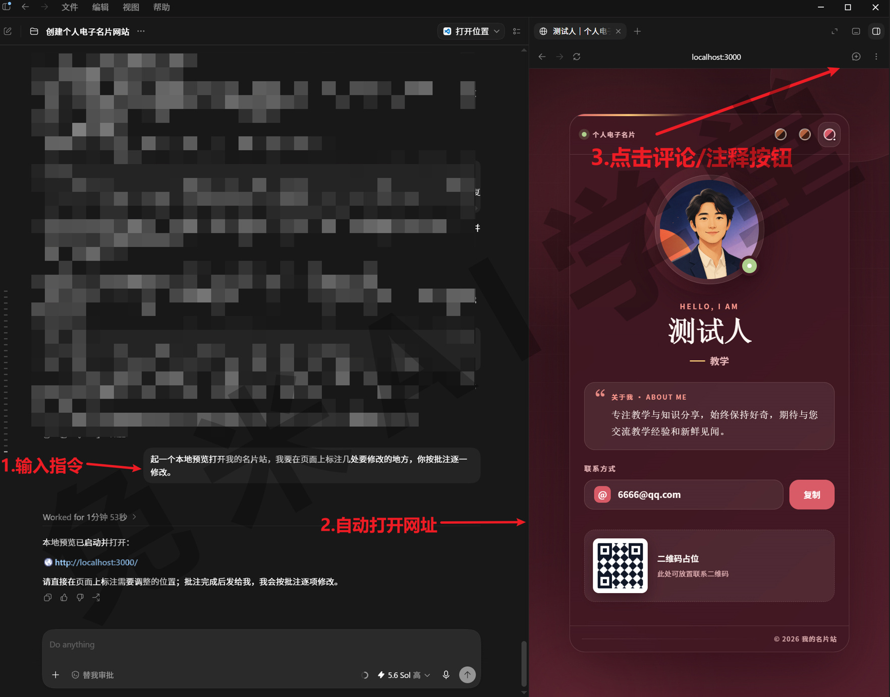

**分步操作：一次连改三处**

第 1 步，圈第一处。点中头像元素，元素上出现高亮框和批注输入框，写上“头像改成方形”。写好先暂存，不急着发（Enter 暂存、Ctrl+Enter 直接发送的按键组合，需实机验证）。

第 2 步，接着圈第二处、第三处。主色块上写“主色调改成墨绿色”，联系方式区写“这一栏挪到页面最下面”。多点批注就这样逐个添加，每个批注只管一处，写清“问题＋期望结果”。

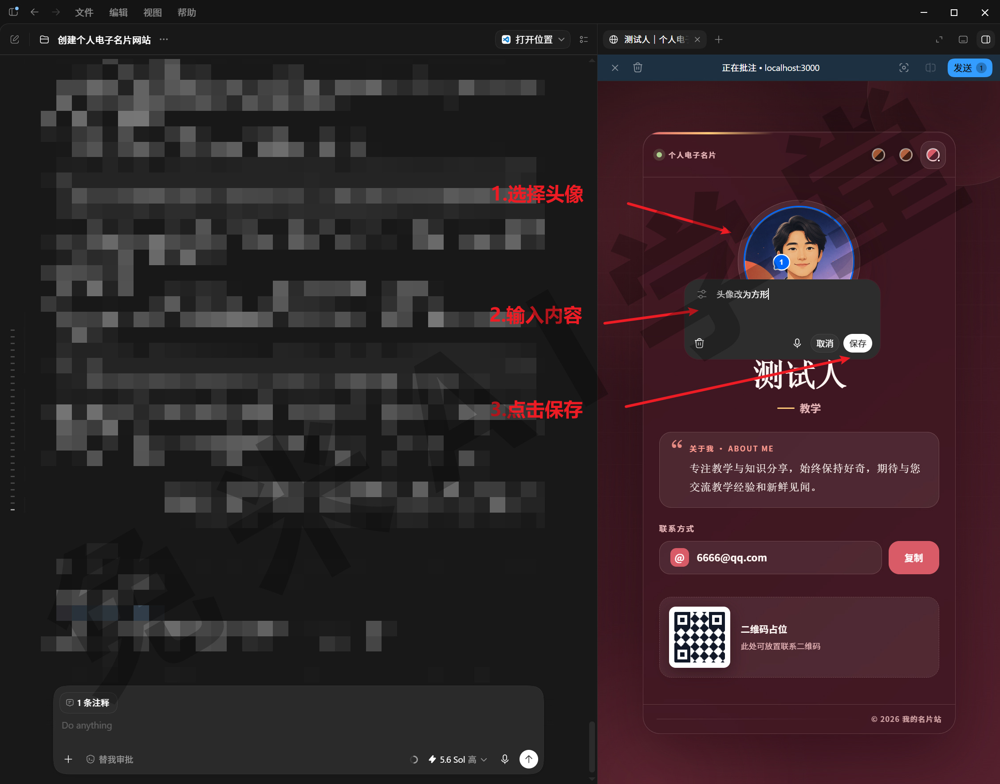

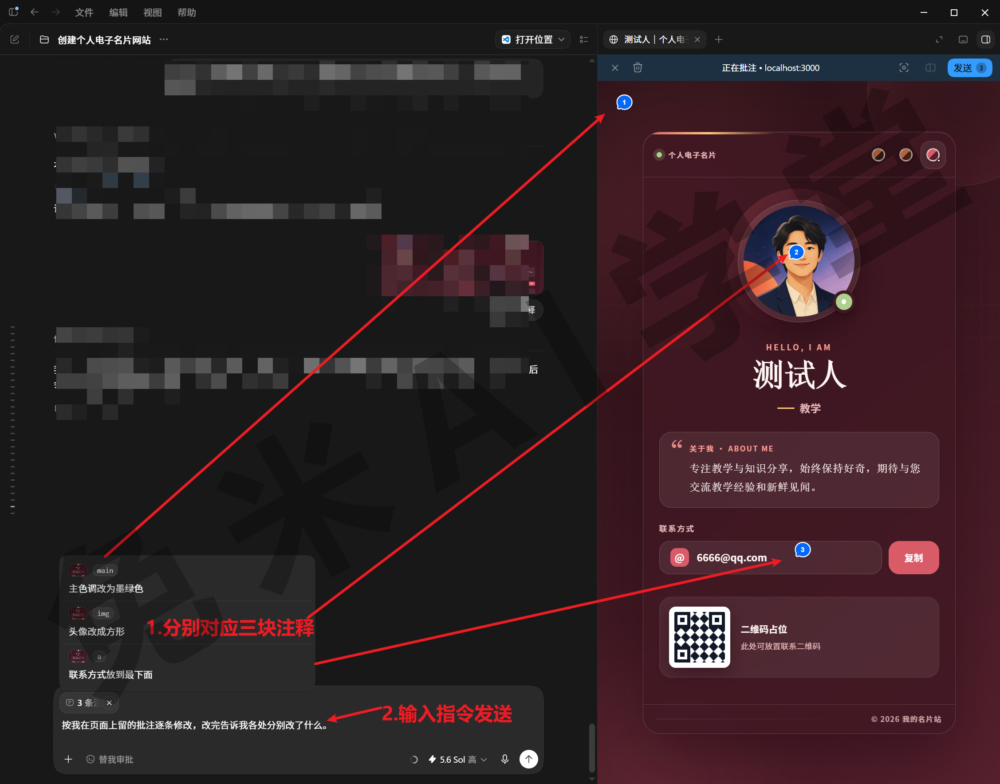

第 3 步，统一发出。回到对话框发送：

```
按我在页面上留的批注逐条修改，改完告诉我各处分别改了什么。
```

它会读取全部批注、逐条修改。改完刷新页面逐处核对：圈过的三处都应落实，没圈的地方不应被动过；有对不上的，把那一处的批注圈得更准、要求写得更细，再来一轮。

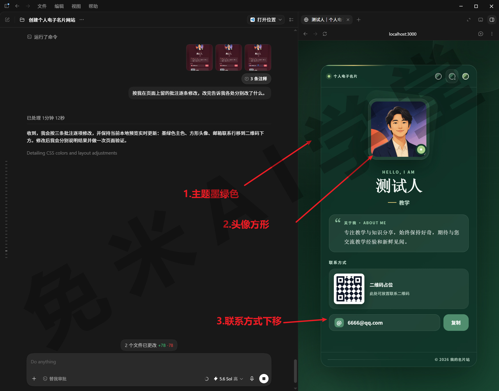

**再进一步：Adjust 细调**

对某块区域批注时，输入框旁可能还有一个“调整”（Adjust）入口：不写文字，直接在面板里调字体、字号、间距、颜色，页面实时预览，调到满意再作为更明确的批注发出去（该入口是否存在、中文名称与可调项，需实机验证）。文字说不清“红一点还是深一点”的时候，这个入口最省事。

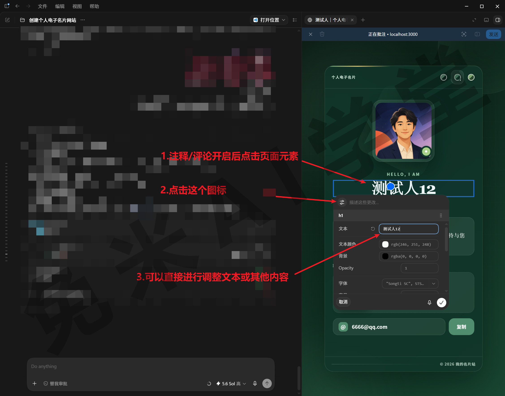

**什么时候用批注、什么时候不用**

三种改法各有分工：

- **批注法**：位置难描述、视觉调整类的改动首选，圈哪改哪。
- **文字描述**：改动和位置无关时更快，比如“全站字体统一换成某某”，一句话的事不必开浏览器。
- **Diff 手改**：一个词、一个数值的微调，直接在《AGENTS.md、Diff 与还原》讲过的 Diff 面板里自己动手最快。

**常见坑**

- **批注写太含糊**：只圈不写，或只写“改一下”，它只能猜。一个批注管一处，写清问题和期望结果。
- **元素太密时偶有认错位置**：有实测反馈批注修复按截图定位，元素密集处偶尔识别偏差（以实际表现为准）。发现动错了地方，用 Diff 还原那一处，把批注圈小一点重新来。
- **页面没跑起来就开圈**：官方最佳实践之一是先确认页面正常显示再批注。页面本身是坏的，批注只会雪上加霜；需要时先让它启动或检查本地预览。

### 9.4 域名策略与预期管理

**它想去哪个网站，谁说了算**

让 AI 操作网页，最直接的担心是它会不会访问不该去的网站。讲管控之前，先补一句背景：本篇一直在用的内置浏览器，是 Codex 自带的独立浏览器；除此之外，它还有另一条操作网页的路线——装一个官方的 Chrome 扩展，借用你日常的 Chrome 浏览器来干活，那是下一篇《Chrome 扩展与 Computer Use》的主角，现在知道有这条路即可。两条路线都能操作网页，但用的浏览器档案、授权入口和适用场景并不完全相同，本节先把内置浏览器这一套讲清。

使用内置浏览器时，Codex 在访问尚未获得授权的网站前会向你确认。允许后才会继续访问；不允许，它就不能进入。内置浏览器的网站权限可以在以下位置管理：

`设置 > 浏览器`

其中通常包括两类记录：

- **允许的网站**：已经获得长期访问许可的网站，再次访问时通常不需要重复询问。需要注意，“仅本次允许”只对当前操作有效，不会自动形成长期授权。
- **屏蔽的网站**：明确不允许访问的网站。将网站从屏蔽列表中移除，只表示它以后可以重新发起询问，不等于网站已经获得访问许可。

不同版本的界面文案可能略有差异，但把握的原则是一样的：只授予完成当前任务真正需要的范围。临时查一次资料，选“仅本次允许”就够；确定会反复使用的可信网站，再让它进允许名单、长期免问。名单里的每一项，都应当是你有意放进去的。顺带一提，Chrome 扩展那条路线首次访问新网站时同样会先问你，但选项和名单是独立的另一套，放到《Chrome 扩展与 Computer Use》里连同它的其他闸门一起讲。

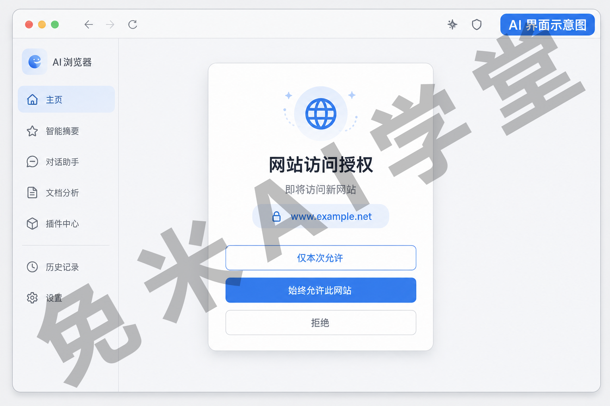

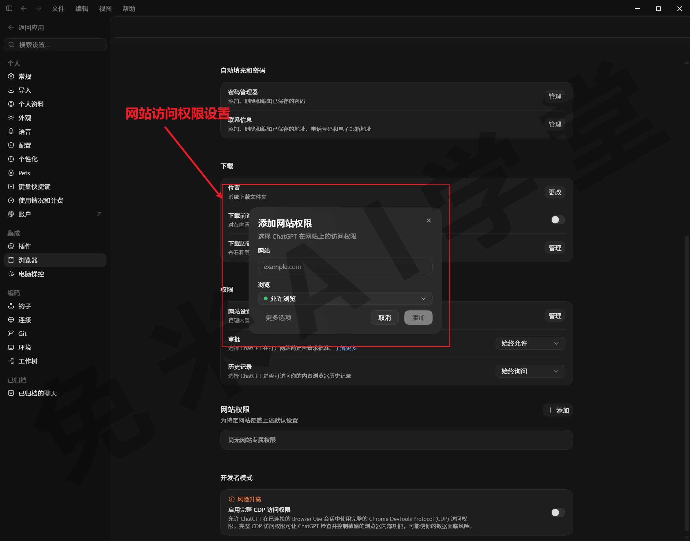

**敏感操作有第二道确认**

网站访问权限解决的是“能不能进入”；进入网站之后，“能不能执行某项操作”还有另一层确认。

按照官方说明，执行下面这些敏感操作前，Codex 会再次请求你的确认：

- **向外部提交信息**：例如提交表单、发布内容或发送消息。
- **涉及资金的操作**：例如购买商品、确认订单或保存支付方式。
- **后果较重的操作**：例如更改权限、删除数据或保存密码。

确认提示会说明准备执行的动作及其目标。看到提示后，不要只看“允许”按钮，而要重点检查三个地方：它准备做什么、在哪个网站操作、会影响哪些数据。

当前内置浏览器不能自动完成文件上传。如果任务需要上传个人文件，应根据所使用的浏览器环境和实际提示处理，并在授权前确认文件内容、目标网站和上传范围。

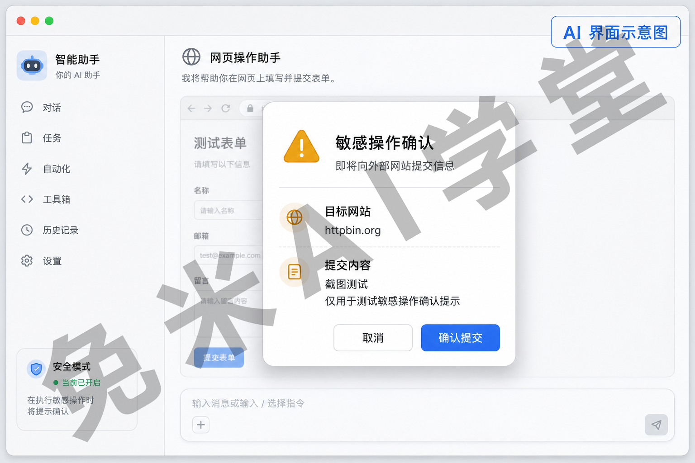

**预期管理：网页操作不一定一次成功**

操作真实网页时遇到卡顿或失败，并不一定说明 Codex 本身出了故障。常见影响因素包括：

- **页面变化**：网站改版、元素位置变化、弹窗遮挡，都可能让原来的操作步骤失效。
- **加载问题**：页面或接口响应较慢时，Codex 可能需要等待或重新读取页面。
- **网站风控**：登录墙、验证码和人机验证是网站主动设置的限制，通常需要你本人处理。
- **连接问题**：浏览器、插件或应用之间的连接暂时中断时，可以先刷新页面；仍未恢复，再重新打开任务或重启应用。

卡住以后，不要让它在同一个步骤上无限重复。更有效的做法是把当前页面、报错提示或验证码截图交回对话，并说明“我刚才做了什么，现在停在哪里”，让它基于现场重新判断。

如果出现验证码，Codex 不能替你规避网站验证。你需要亲自完成验证，再让它继续后续操作。

两种浏览器环境的分工可以这样理解：

- **内置浏览器**使用独立浏览器档案，适合本地页面预览、页面批注、公开网页，以及希望与日常浏览器隔离的任务。
- **Chrome 扩展**适合需要直接利用现有 Chrome 标签页、登录状态或日常浏览器环境的任务。

Chrome 扩展能够使用已有的浏览器环境，但不代表它可以绕过验证码、网站风控或敏感操作确认。

### 9.5 内置浏览器的登录与数据管理

**默认独立，是特点也是限制**

内置浏览器使用独立的浏览器档案，默认不会自动共享你日常 Chrome 浏览器中的标签页、Cookies和登录状态。

这样做的好处是环境相对独立：在内置浏览器里访问过哪些网站、登录过哪些账号，不会直接等同于日常浏览器中的状态。限制也很明显——打开只有登录后才能查看的网站时，它可能只能看到登录页面。

遇到这种情况，可以根据任务选择两种方式：

- **直接在内置浏览器中登录**：适合偶尔使用的网站。需要哪个账号就登录哪个账号，任务边界比较清楚。
- **使用现有 Chrome 环境**：如果任务需要当前已经打开的标签页或已有登录状态，可以改用 Chrome 扩展，装法和用法在《Chrome 扩展与 Computer Use》里专门讲。

部分设备或版本还可能在“设置 > 浏览器”中提供浏览器档案导入功能。是否存在该入口、能够导入哪些数据，以及具体的选项名称，都以当前设备实际显示的界面为准。没有看到导入入口时，不需要额外寻找隐藏设置，直接登录或改用 Chrome 扩展即可。

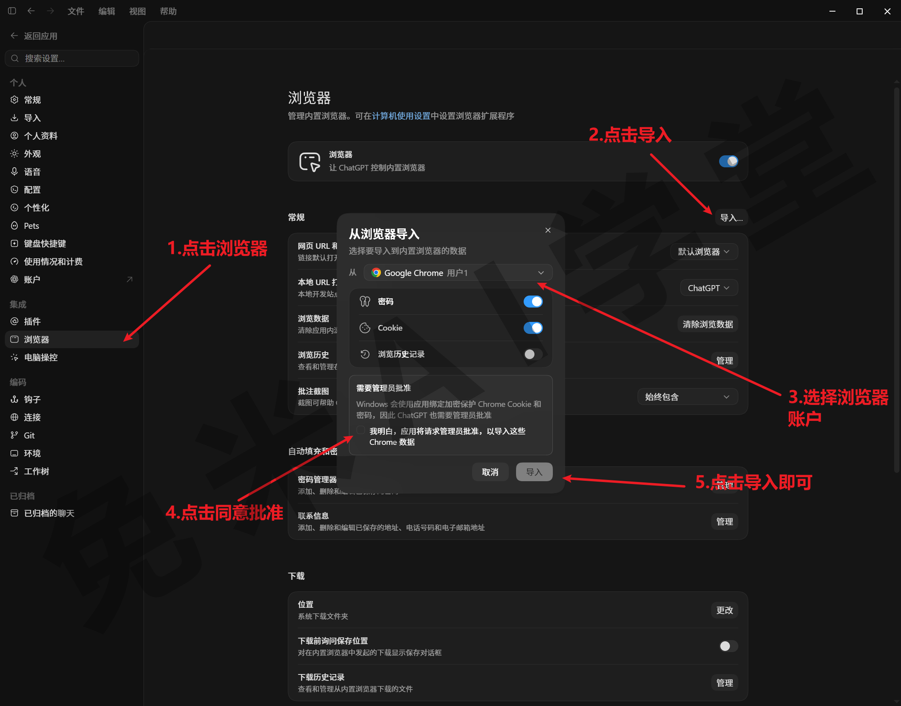

**登录状态也是一种权限**

登录状态可以理解为网站发给浏览器的一张临时通行证。浏览器获得登录状态后，就能够以这个会话现有的权限访问网站内容。

因此，是否登录或导入浏览数据，不能只看方便程度，还要考虑账号本身的敏感性：

- 普通知识网站、工作资料平台，可以根据任务需要决定是否登录。
- 银行、支付平台和重要社交账号，不建议将登录状态导入内置浏览器。
- 不要为了“以后可能会用到”，一次性登录大量无关账号。
- 涉及发布、删除、购买或权限修改时，即使已经登录，也要认真阅读操作前的确认提示。

这里需要避免一种误解：登录只解决“网站是否认识你”，不代表 Codex 可以不经确认执行所有操作。敏感操作仍然受到相应的确认机制约束。

**用完以后记得清理**

需要清理内置浏览器中的数据时，可以进入：

`设置 > 浏览器 > 清除浏览数据`

清除界面支持选择时间范围和需要清理的数据类型，具体分类名称以当前版本显示为准。

如果只是阶段性登录某个网站，任务结束后可以采取以下处理顺序：

1. 先在对应网站中退出登录。
2. 再进入浏览器设置，清除不再需要的相关浏览数据。
3. 涉及敏感账号时，可以回到网站的账号安全页面，检查当前登录设备或有效会话。

不同网站处理登录会话的方式不同。在日常浏览器中退出登录，不一定能替代内置浏览器中的退出和清理操作。因此，需要清除哪个环境里的登录状态，就应当在对应的浏览器环境中处理。

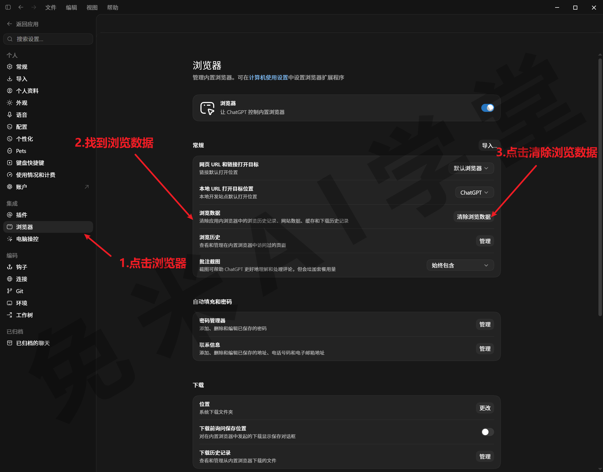

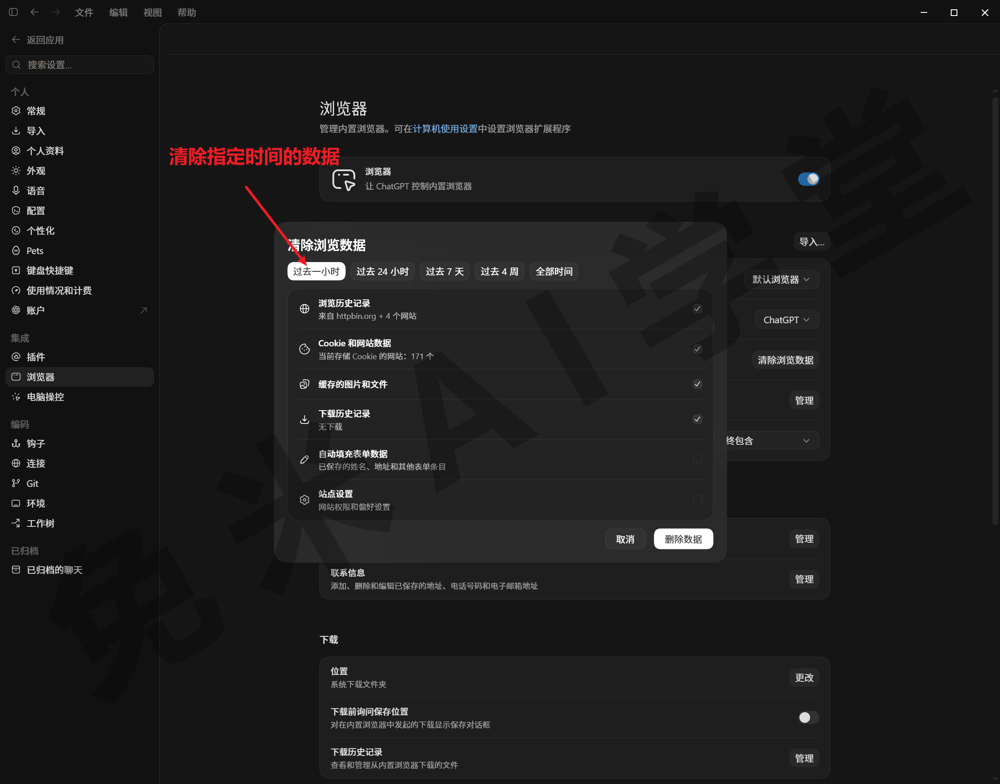

**认知一提：开发者模式**

在支持该功能的版本中，可以通过以下位置打开开发者模式：

`设置 > 浏览器 > 开发者模式 > 启用完整 CDP 访问`

启用后，Codex 可以在经过确认的情况下查看更深入的页面调试信息，例如控制台输出、网络请求、DOM结构和实际应用的样式。这项功能主要用于排查页面脚本、接口请求、样式显示和性能问题。

普通网页浏览、公开资料查找和页面批注通常不需要开启开发者模式；遇到控制台报错、接口失败或复杂样式问题时再使用更合适。

完整 CDP 访问能够接触网站较深入的运行信息，因此 Codex 在具体网站上使用它之前会请求明确授权。确认时仍要检查目标网站和任务范围。组织管理员也可能根据安全策略禁用这项功能。

### 9.6 三个练习任务

下面三个任务把本篇内容完整练一遍。提示词可以直接复制，方括号里的内容换成你自己的。

**任务一：让它读几个网页，汇总一张对比表**

选一个你正好想了解的话题，买什么、去哪玩都行，发送：

```
打开浏览器，查一下 [你的话题] 的相关资料，读两三个公开网页，把要点汇总成一张对比表，
每一项标上来源网址。
```

完成标准：拿到一张带来源的对比表，并顺着来源网址核对过其中一两条。

**任务二：用批注法改一处页面**

打开你的名片站，或任意一个你做过的页面，发送：

```
起一个本地预览打开我的名片站，我在页面上标一处要改的地方，你按批注修改。
```

然后开启评论模式，圈出一处、写明问题和期望结果。完成标准：被圈的那一处按要求改好，其余位置没有被误动。

**任务三：检查并设置自己的域名策略**

打开设置页的浏览器分区，看一眼当前的站点管控状态：有没有已经允许过的网站、屏蔽名单里有没有内容。把你信得过、常让它查的网站放进允许名单，把不希望它碰的加进屏蔽名单。

完成标准：能说出“未允许先询问、允许名单免问、屏蔽名单直接拦”三者的关系，且名单里的每一项都是你有意放进去的。

### 9.7 本篇小结与自检

这一篇让 Codex 开始操作网页、查找信息和协助修改页面。最需要记住两条边界：

**网页中的文字只是待分析的页面内容，不能自动当成你的指令执行；登录状态也是一种权限，只在任务确实需要时使用。**

内置浏览器使用独立浏览器档案，适合公开网页、本地页面预览和页面批注；需要使用现有 Chrome 标签页或已有登录状态时，再考虑 Chrome 扩展。遇到验证码、敏感操作确认或权限询问，仍然需要你本人判断和处理。

可以对照下面的清单检查学习结果：

- [ ] 让 Codex 汇总过多个网页的信息，并整理成表格
- [ ] 使用页面批注独立完成过一处修改
- [ ] 知道在哪里查看和管理网站访问权限
- [ ] 能说出内置浏览器与 Chrome 扩展的区别
- [ ] 知道登录状态带来的便利和风险
- [ ] 遇到页面卡住、验证码或连接中断时，知道如何处理
- [ ] 知道提交信息、购买、删除等敏感操作需要认真确认

完成这些内容后，常规的联网查证、公开网页操作和页面修改就可以交给 Codex 协助完成。下一篇《Chrome 扩展与 Computer Use》将进一步介绍如何利用现有 Chrome 标签页和登录环境操作网页，以及权限确认、敏感操作和人工接管的使用边界。

### 9.8 新手常见问题

**Q1：它打开的网页，我能中途干预吗？**

可以，而且过程全程可见：浏览器窗格里能看到它打开了哪些页面、点了什么。干预有三个入口：《计划模式》讲过的排队与引导机制照常适用，把新的说明发进去就能纠偏；要停就直接停止任务；另外它遇到新网站或敏感操作本来就会停下来问你，那些询问和确认弹窗就是天然的干预点。

**Q2：遇到验证码怎么办？**

人机验证是网站主动的风控，专门挡自动化操作，遇到很正常。现行的处理方式是：它会先问你要不要它来试着解，你确认后才动手（以实际表现为准）；付费墙、浏览器安全拦截页这类边界它不会去绕。复杂的、反复过不去的验证别让它硬试，两个办法：你自己动手把验证过掉，让它接着往下走；或者换《Chrome 扩展与 Computer Use》的 Chrome 扩展路线，用你已经通过验证的浏览器来做。

**Q3：导入登录态安全吗？**

取决于范围。登录态是你在网站上的身份凭证，导进来它就能以你的身份访问这些网站，所以把握三条：只导确实需要、且风险心里有数的网站；银行、支付、重要社交账号不导；用完在设置页的浏览器分区里把 Cookies 等数据分项清掉。另外记住导入不是必选项：偶尔需要登录的页面，直接在内置浏览器里登录那一个网站，范围更小、更可控。

**Q4：它会不会乱点付款按钮？**

正常使用下不会，防线有三道：购买、提交这类敏感动作执行前，它会专门向你确认，确认卡写明动作和网站（见 9.4）；你交代任务时划清范围，讲明“只查信息，不做任何提交或支付”；最稳的一条是源头控制，涉及支付的网站不导登录态、付款环节自己来。三道防线里最要紧的其实是你的习惯：确认弹窗看清再点，别让“习惯性同意”把闸门拆了。

