## Chrome 扩展与 Computer Use

上一篇《内置浏览器全解》给 Codex 配了一个自己的浏览器，但也留下两类它够不着的活：一类必须用你已登录的身份才能办，内置浏览器进去只能看到登录墙；另一类干脆不在浏览器里，而在桌面软件里。这一篇补上这两块能力：Chrome 扩展，让 Codex 借用你日常已登录的浏览器干活；Computer Use，让它像人一样看着屏幕操作整台电脑。能力越强，边界越要先讲清楚，所以这一篇会专门用一节把新手红线和安全机制讲透，再进入动手案例。

### 10.1 Chrome 扩展：用你已登录的浏览器

**先想清楚它解决什么问题**

《内置浏览器全解》说过，内置浏览器用独立的配置档案，默认不带你的任何登录信息。干净是优点，也是限制：收藏夹、购物车、会员内容、公司内部系统，这些登录后才看得到的页面，它进去只会撞上登录墙。当时给过一条路：把 Chrome 的登录态导入进来。但导入等于把身份复制一份交出去，范围不好收。Chrome 扩展是另一条官方路线，思路正好相反：登录态一步不搬，让 Codex 直接借用你日常已经登录、已经通过各种人机验证的 Chrome 干活。上一篇提到的页面风控、反复验证的问题，也因为用的是你的真实浏览器而少了大半。

**它是什么**

Chrome 扩展是官方提供的一个插件，和内置浏览器的插件是同族：都从插件面板安装，都用 @ 调用。装好后，它在 Codex 和你的 Chrome 之间搭起一条通道：任务需要已登录网站时，Codex 通过这条通道驱动你的 Chrome 打开页面、读取内容、执行操作。两者的分工可以这样记：内置浏览器是它自带的干净浏览器，Chrome 扩展是你把自己的浏览器借给它用。

**安装：从插件面板发起，别去 Chrome 商店搜**

第一个常见误区就在安装上：去 Chrome 的应用商店里搜“Codex”，是搜不到官方扩展的——搜出来的全是第三方同名工具；官方扩展在商店里挂的名字其实是“ChatGPT”（提供方 OpenAI）。不用去商店碰运气，正确的入口在 Codex 这边，三步走：

1. 打开《插件与部署上线》介绍过的插件面板，在目录里找到 Chrome 插件（目录里的中文显示名，需实机验证），点安装。
2. 跟着引导流程走：它会带你把扩展装进 Chrome，中途 Chrome 会弹出权限确认，批准后继续；引导没走完就关窗口，是装不完整的常见原因。
3. 回到 Chrome 确认状态：点工具栏的拼图图标，把这个扩展钉选到工具栏，再点开它，看到“已连接”（Connected）字样，通道就打通了（钉选引导与文案显示位置，需实机验证）。钉选这一下别省，它今后就是你查连接状态、开侧边面板的常驻入口。

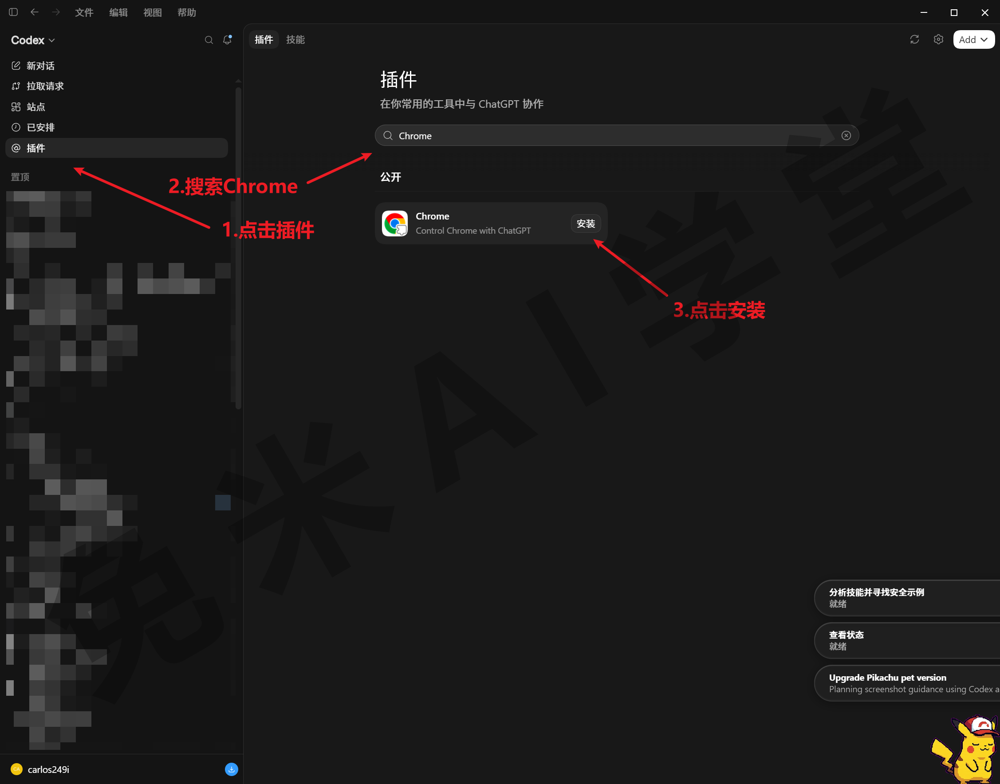

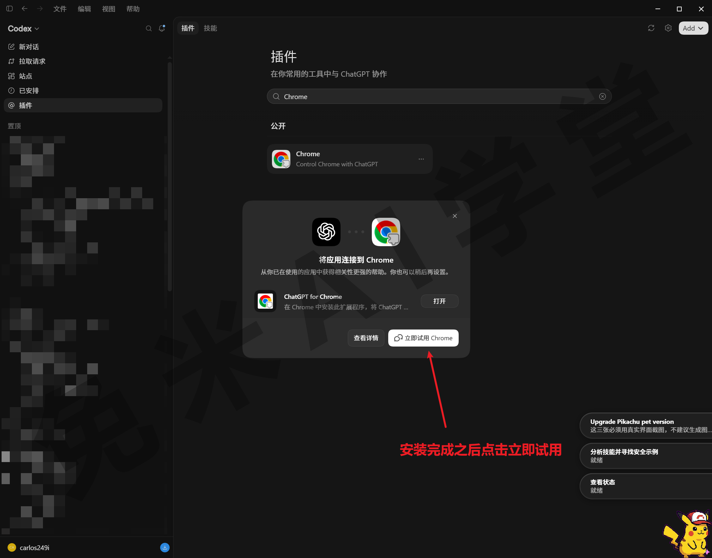

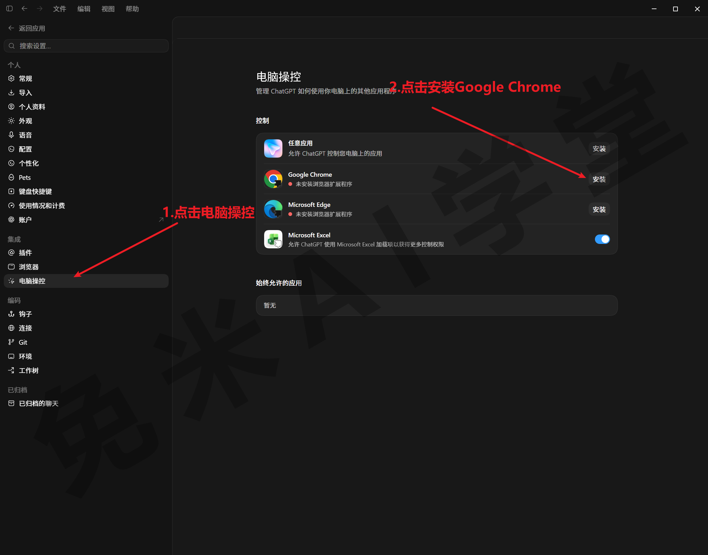

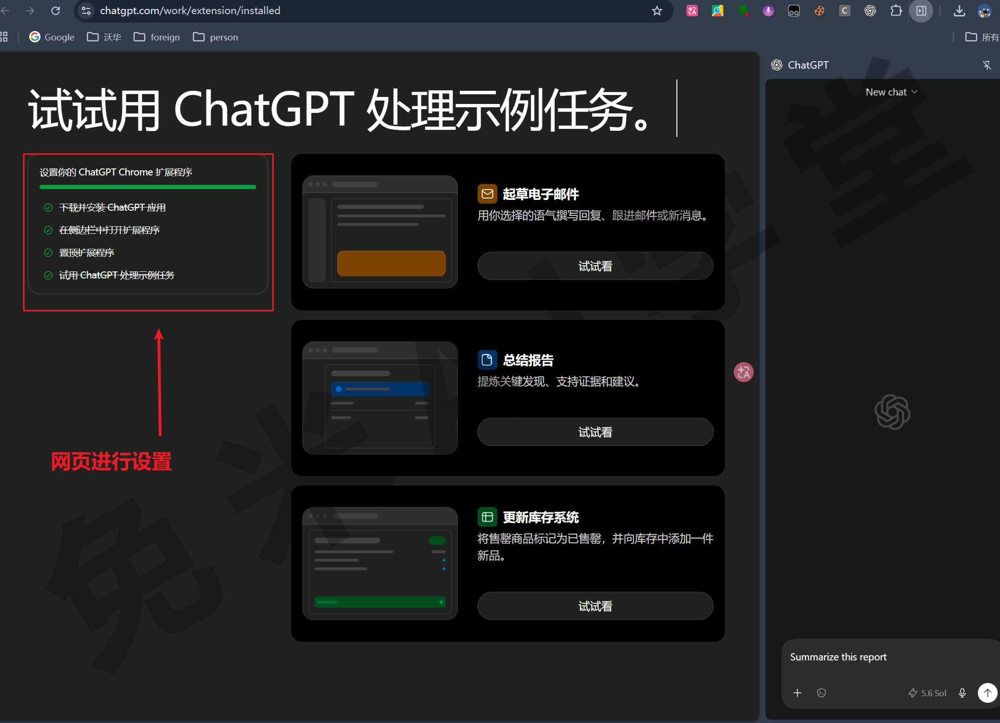

两个补充说明：

- 只支持 Chrome 本体：Edge 等浏览器即使内核相近也不支持；日常主用别的浏览器，就专门为它保留一个装好扩展的 Chrome。
- 安装时 Chrome 列出的权限清单会很长：读取和修改网站数据、浏览历史、书签、管理下载等。别被吓到，也别不当回事：这是扩展的能力上限，实际动作之前，每一步还要过 Codex 自己的确认和名单（10.4 集中讲）；它也有官方明文的隐私边界，不去翻你的密码库和 Cookie，对页面的探查保持只读（以官方说明为准）。

**先用一次：最小演示**

装好就试一次。输入 @，在列表里选中 Chrome 插件，接着输入这条指令发送：

```
使用我当前 Chrome 中已登录的今日头条账号。
先确认页面是否已登录；
如果未登录或无法读取登录状态，立即停下并告诉我，不要把匿名推荐当成个性化推荐。
确认登录后，进入首页“推荐”频道，告诉我推荐信息流前三张内容卡片的标题，
不包含“要闻”、热榜和广告。
完成后保持该页面打开。
```

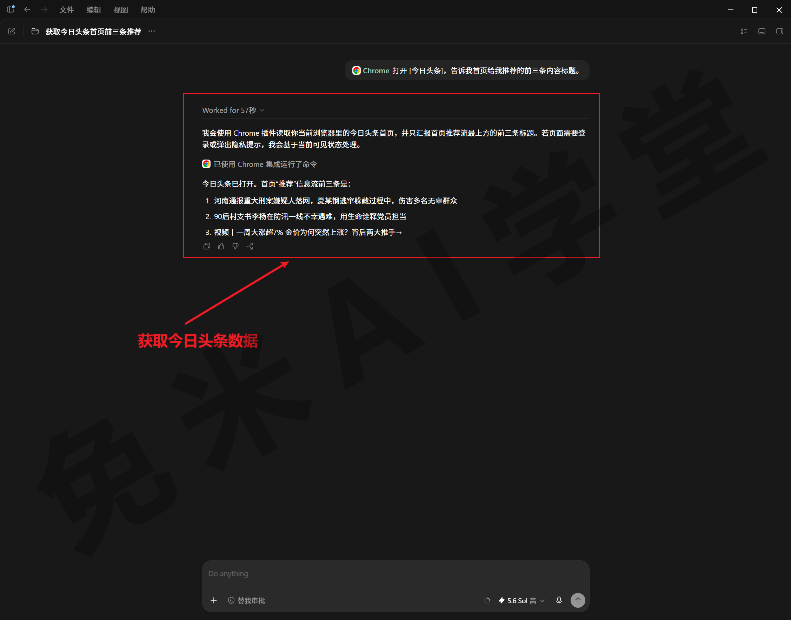

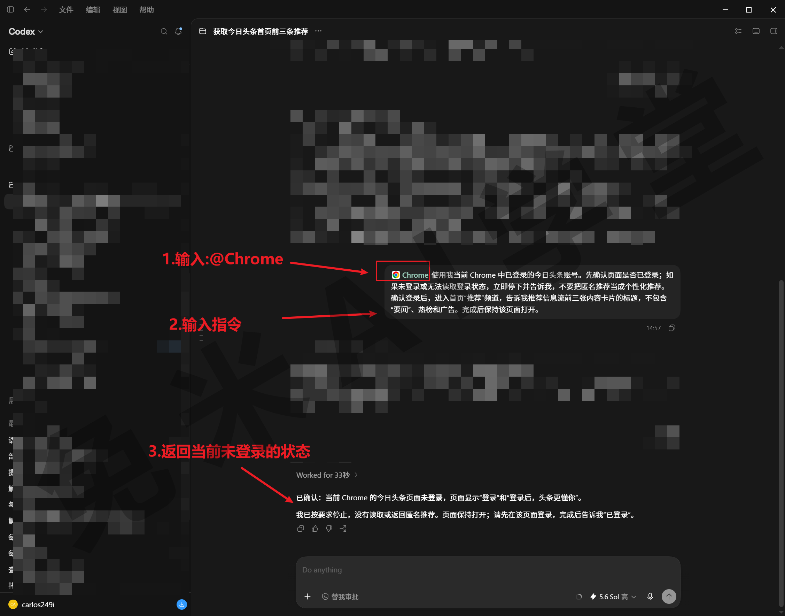

发送后依次会看到三件事：

- 一张授权确认卡：这是它第一次要动这个网站，先问你。新手先记住最小应对：选“只允许一次”或“允许此网站”，不选“允许所有网站”。四个选项各是什么意思、名单存在哪里，10.4 展开。
- Chrome 自己开了一个新的标签页组，任务用到的页面都归在这一组里；页面顶部出现一条横幅，写着 Codex 已开始调试此浏览器一类字样（确切文案，需实机验证）。
- 它把推荐内容的标题报回对话。注意看这几条标题：正是你这个账号的个性化推荐。这就是“借用已登录身份”的直观证据，换内置浏览器打开同一个网站，看到的只是未登录的通用首页。

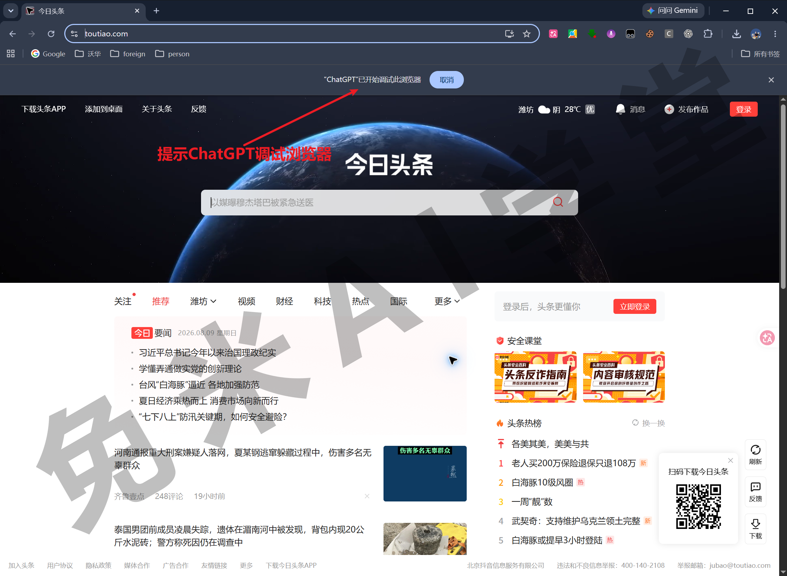

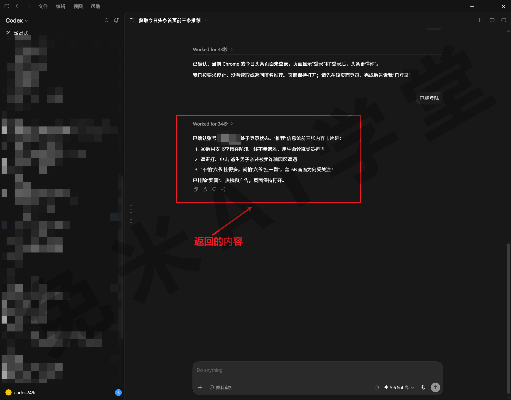

**它干活时，你在干什么**

“后台执行、不接管”的准确含义要说清楚。它在页面层驱动 Chrome，不占用你的鼠标键盘，更不碰你的桌面：任务期间你可以照常用电脑，也可以回 Codex 再开新任务，互不影响。但被它控制的那个标签页归它，别在那个页面上和它抢操作；其他标签页照常是你的。它还能识别你已经打开的标签页接着用；Chrome 没开，它可以自己拉起来。任务收尾也有规矩：自己开的中间页面会关掉，产出页和等你接手的页面（比如等你登录、输验证码的页面）会留着，借用你的标签页只归还、不关闭。

**调试横幅：正常状态，也是刹车**

任务运行时 Chrome 顶部那条调试横幅是正常工作状态，不是出了问题。横幅上的“取消”按钮别随手点：一点就断开 Codex 对浏览器的控制，任务半途而废。反过来记住它的另一面：这就是 Chrome 路线的急刹车，想让它立刻住手，点这里最快。另有一个已知现象：个别版本没发浏览器任务也会弹这条横幅，属于产品问题不是你的操作问题，介意可以临时停用扩展（以当前版本表现为准）。

**连不上先查三处**

任务失败别急着重装，先做三个最快的检查：

- 点扩展图标看状态：显示的不是“已连接”，先把 Chrome 和 Codex 应用都重启一遍再看，多数一次性的连接异常到这一步就能恢复。
- 看 Chrome 开的是哪个配置档案：扩展装在 A 档案、日常用的是 B 档案，是最常见的连不上原因，从右上角头像切到装了扩展的那个档案。
- 想想是不是拒绝过这个网站：被你点过“拒绝”的网站进了屏蔽名单，它今后就动不了那个站，得先去名单里把它移出来（入口见 10.4）。

更完整的排查顺序在 10.9 的 Q1。

### 10.2 案例：从已登录网站整理数据

收藏夹是“登录后才存在”的典型数据：攒了几年，平台自己的界面翻起来费劲，想批量导出更是没有现成按钮。这个案例就拿它开刀：让 Codex 用你的登录身份进收藏夹，整理出一张能直接用的表。

**动手前置**

确认两件事：

- Chrome 里已经登录你要整理的平台：视频、社区、资讯平台都行，标准就一条，登录后能看到你自己的收藏列表。
- 点开扩展图标确认显示“已连接”：不是的话，先按 10.1 结尾的三处检查走一遍，通道通了再开工。

然后输入 @，在列表里选中 Chrome 插件，发送（方括号里换成你自己的）：

```
打开 [你的内容平台]，进入我的收藏夹，把最近 20 条收藏整理成一张表，包含标题、作者、
链接，能看到收藏时间就一并带上；整理完保存为“我的收藏清单.xlsx”，放进项目文件夹。
```

指令里的“最近 20 条”不是随手写的：第一次跑，先用数量给任务画一个边界，它要翻的页数、花的时间和消耗都在你预期之内；跑顺了，下次再放开范围也不迟。这和《文件能力一集讲全》里先小范围试、再放大的习惯是同一件事。

**过程里看三件事**

- 授权卡又来了：你第一次让它动这个平台，按 10.1 的最小应对处理。要是这个平台今后常让它整理，就选“允许此网站”，省得每次都问。
- 看它翻页取数：标签页组里能看到它逐页打开收藏列表、读取条目，20 条通常不止一页，它会自己翻。
- 看落盘接力：查数据用的是扩展，最后写出 Excel 文件靠的还是《办公能力一集讲全》练过的产出能力，两段接力，一条指令跑完。

这个过程不用全程盯着。任务在它自己的标签页组里跑，你可以照常用其他标签页，也可以回 Codex 再开一个别的任务，两边互不影响；隔一阵瞟一眼，它中途再弹确认时点一下就继续。


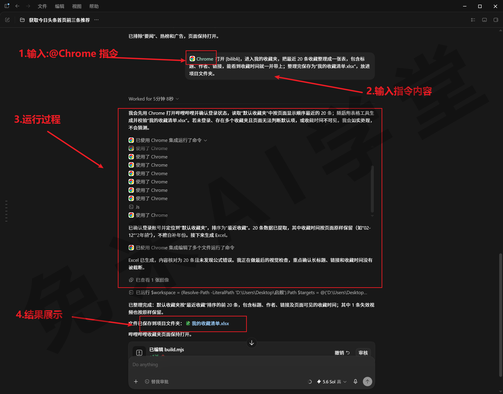

**拿到表先抽查**

老习惯不变：从表里随机点开两三条链接，确认打得开、标题对得上。AI 汇总的数据交付前过一遍人眼，这条从《办公能力一集讲全》一路沿用到现在。另外记一条口径：它在页面上读到的内容会进入任务记录，所以练手就拿收藏夹这类不敏感的数据，含隐私的页面别当练习场（数据存储细节，以官方说明为准）。

**要传本地文件给网页，先开一个开关**

这个案例只读不传。反过来的场景，让它把本地文件上传到网页（发图、传附件），Chrome 对扩展有一道默认限制：需要你先在 Chrome 的扩展详情页开启“允许访问文件网址”（开关名称，需实机验证），再重跑任务。顺带记一个对比：内置浏览器不能自动化上传文件，这是官方写明的边界；Chrome 扩展开了这个开关就可以。10.6 选路线时用得上这条差异。

**同是登录态任务，分轻重**

- 轻度：只看一两页、偶尔查一次，按《内置浏览器全解》的建议，在内置浏览器里单独登录那一个网站更省事，交出去的范围也最小。
- 重度：要翻很多页、跨多个标签页、隔三差五就来一次，交给 Chrome 扩展，用现成的登录环境，密码一个字都不用交。

### 10.3 Computer Use：让它操作整台电脑

**最后一块拼图**

到上一节为止，Codex 能触达的地方还是两类窗口：项目文件夹，浏览器页面。可电脑上的事远不止这些：在桌面软件里点一串按钮、改一个藏得很深的系统设置、把 A 软件里的数据搬进 B 软件。这些活的共同点是只存在于图形界面里，没有文件可改，也没有网页可开。Computer Use 补的就是这一块：让 Codex 像人一样看着屏幕干活，点击、输入、滚动、拖拽都会。

**它怎么“看见”屏幕**

原理一句话：它一边截取屏幕画面来看，一边通过系统的无障碍接口读取界面里的文字和控件信息。所以它既看得懂画面，也知道每个按钮叫什么、能不能点，甚至“看得到”还没滚动到屏幕里的内容（实现方式以官方说明为准）。这套机制在讲消耗时还会用到。

**先立总原则，再动手装**

官方给这几类能力排过优先顺序：有专用插件或接口的活，先用专用集成；浏览器能干的，走浏览器路线；都不合适，才轮到 Computer Use。落到你手上就是一句话：能用终端或浏览器解决的，就不要用 Computer Use。它是兜底能力，不是首选能力。这么排的理由除了消耗大，更因为它能力面最大、要管的边界最多，10.4 专门讲。

**安装与开启**

第 1 步，装插件。在 ChatGPT 桌面应用中切换到 **Codex** 模式（执行任务），打开侧边栏的“插件”面板，搜索 Computer Use，点击安装。(已经装过的，卡片右侧会显示“…”菜单，里面是“立即试用”“管理”“卸载”三个入口)。

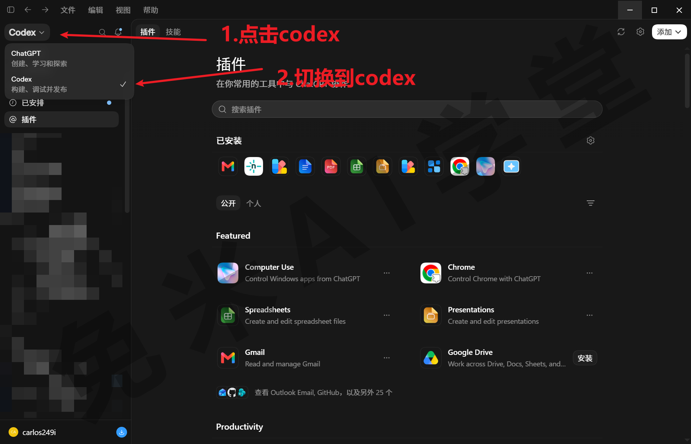

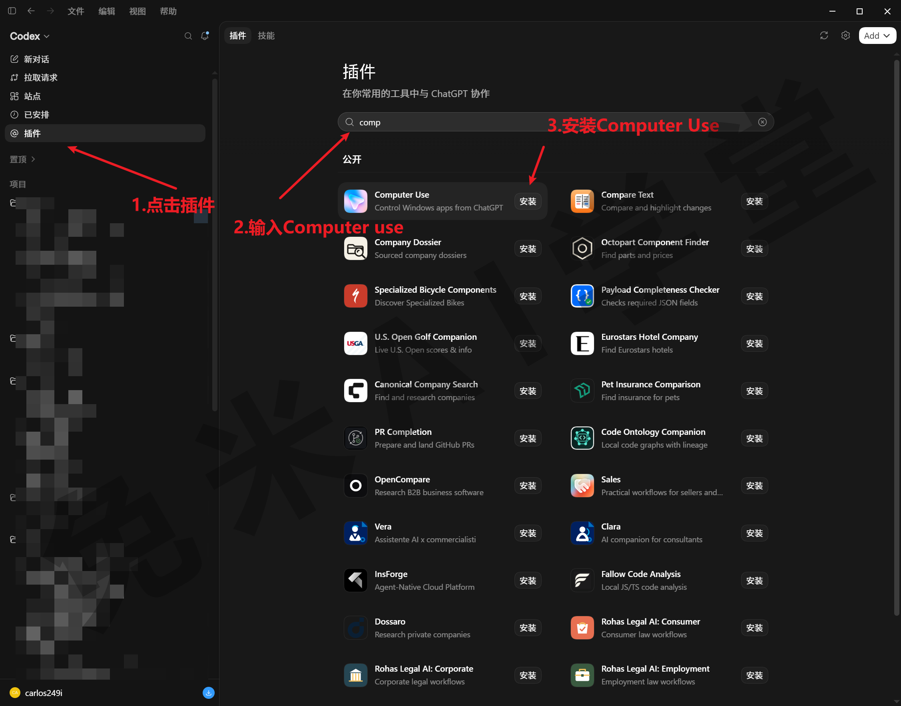

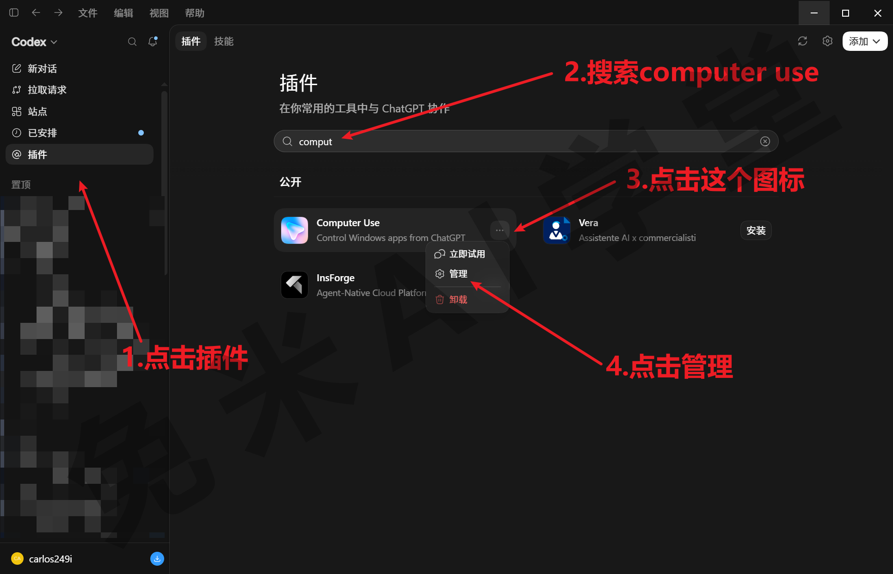

第 2 步，进详情页看一眼开关。点开 Computer Use 的详情页：装完默认就是可用状态，不需要额外设置，“技能”分区下的 Computer Use 开关确认是开启的即可；页面上的“立即试用”点一下就能直接体验。

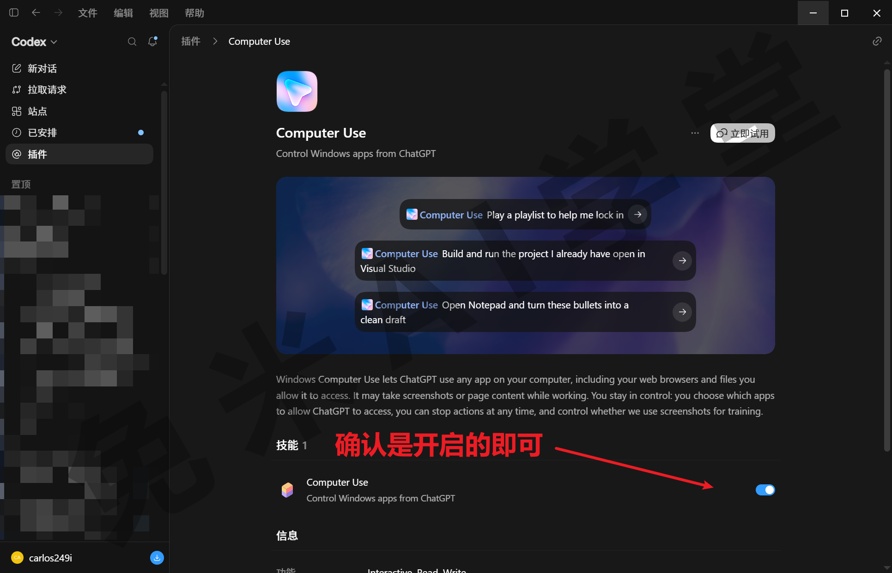

第 3 步，认识设置页。点左下角你的账号头像，菜单里选“设置”（快捷键 Ctrl+,），在左侧“集成”分组里打开**电脑操控**：它能控制哪些应用都在这一页管——“任意应用”总开关、Chrome／Edge 浏览器扩展的安装与管理入口、Excel 这类单项应用开关；页面下方还有“始终允许的应用”名单。首次操作某个应用时仍会弹出授权确认；选择“始终允许”后，该应用才会加入名单。

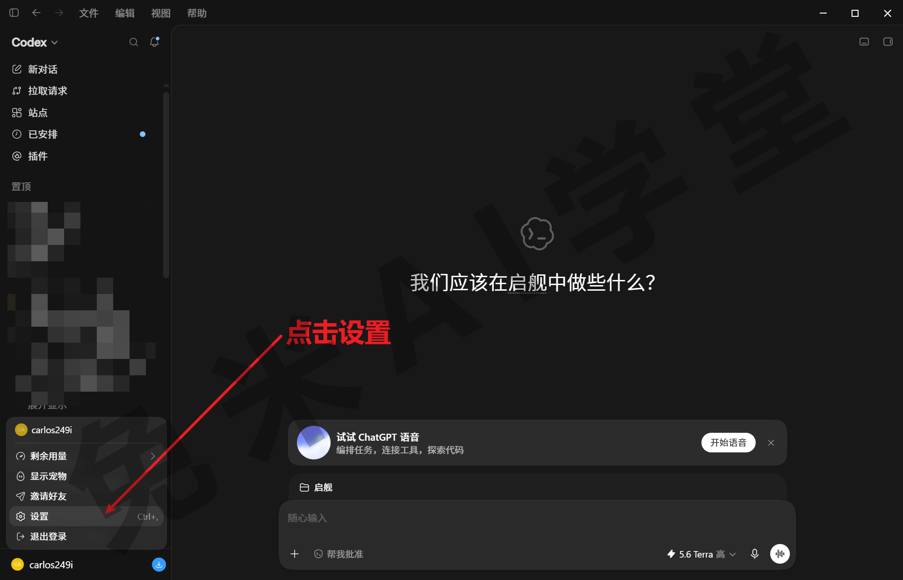

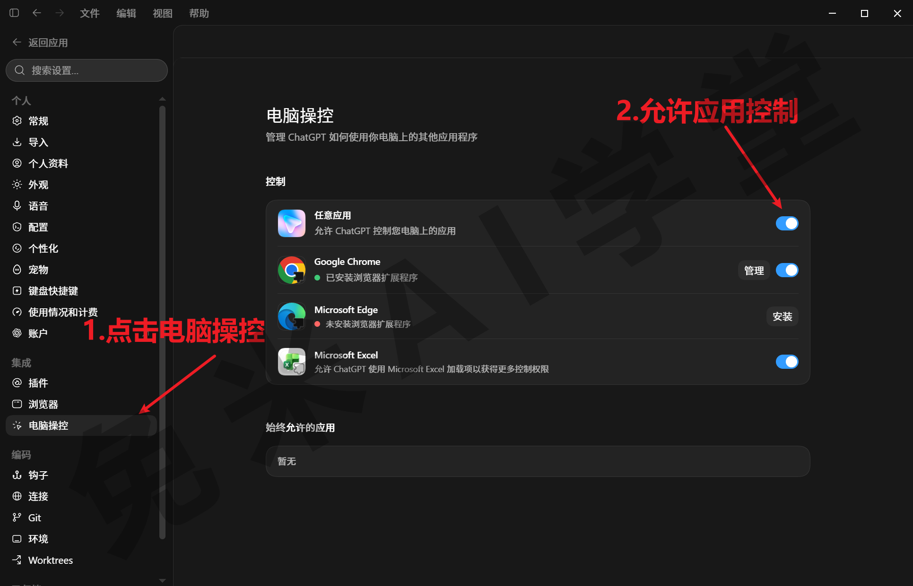

一个前提检查：Computer Use 当前支持受支持地区的 macOS 和 Windows，Windows 使用时需让目标应用保持在当前活动桌面中。如果找不到安装、启用或设置入口，先把桌面应用更新至最新版，再确认工作区管理员没有禁用该功能。

**两层权限，各管一段**

- 系统层：Mac 上要在系统设置里授予屏幕录制和辅助功能两项权限，前者管“看得见”，后者管“点得动”；Windows 没有对应的系统弹窗，但有一个硬条件：目标窗口必须在当前桌面上可见，锁屏、关显示器都不行。
- 应用层：第一次让它操作某个应用，会先弹卡问你。你允许后，它也只能看和操作这一个应用，屏幕上的其他应用它既看不到也碰不着；卡上一般有“一直允许”选项，勾了下次不再问，撤销入口在设置的“电脑操控”分区，“始终允许的应用”名单就在这一页（以实际界面为准）。

还有一层老规矩不变：任务中涉及读写文件、执行终端命令，仍然走《权限、沙盒与模型》讲的沙盒与审批。Computer Use 的授权管的是“看屏幕、动界面”，不替代那一套。

**调用方式**

输入 @，在列表里选中 Computer Use。也可以直接 @ 应用名，比如 @记事本，指名操作哪个应用；要注意如果那个应用有专用插件，它可能优先走插件而不是 Computer Use（以实际表现为准）。先别急着发指令：把 10.4 的红线看完，10.5 马上就练。

**Windows 和 Mac，体感完全不同**

这是 Windows 读者最需要提前知道的一件事。

- Windows 是前台接管：任务运行时，它真的在移动你的鼠标指针、往你的窗口里打字。这段时间电脑就交给它了，你不能一边让它跑一边自己用；目标窗口必须保持可见，不能锁屏、不能关显示器、不能切到别的用户。你一动鼠标键盘，就等于从它手里接管回来，这既是限制，也是最直接的刹车（10.4 再讲）。
- Mac 是后台并行：它用独立的虚拟光标在后台干活，不占你的真实鼠标，可以多个任务同时跑，屏幕上会弹出画中画小窗让你盯进度。本课程以 Windows 为主，Mac 侧行为按官方文档描述，以实际为准。Mac 上还有一个可选的“锁屏后继续跑”的能力，要单独装组件开启，知道有即可。

Windows 上想边跑边干别的，官方给了三条路：

- 用手机上的 ChatGPT 应用远程连到这台电脑：人不在工位也能盯进度、追加指令，前提是电脑保持解锁和联网。配对方法在《自动化、Git 与远程》的手机遥控一节细讲，现在知道有这条路即可。
- 在虚拟机里跑：给它一台 Windows 虚拟机，让它接管虚拟机里的桌面，你继续用真机，两边互不干扰，属于进阶玩法，知道有这条路即可。
- 最简单的一条：把任务安排在你本来就不用电脑的时段，比如离开工位前发出去；等不了就先停掉任务，回头有空再跑。

**消耗为什么大，怎么心里有数**

Computer Use 的额度消耗通常明显高于普通任务，原因在工作方式：它靠“看一眼屏幕，决定下一步，操作，再看一眼”的循环推进，每转一圈，最新的屏幕内容都要重新读进上下文，几分钟的任务转几十圈很正常。现行实现已经在省了：能用界面文字的就少传画面，配合更快的模型执行，但量级差距仍然在。应对不靠背数字，靠三个习惯：

- 能不用就不用：回到本节开头的总原则，文件、终端、浏览器路线够得着的活，不劳驾这个最贵的方式。
- 指令一次说清楚：目标、范围、完成标准一次给全，减少它来回试探的轮数；循环转得少，消耗自然就下来了。
- 每跑完一个任务看一眼用量（《权限、沙盒与模型》教过的两个额度入口），对它的量级建立自己的体感，10.5 的案例正好做这件事。

**认知一提：名单也能在配置里管**

进阶用户可以在配置文件里直接维护“一直允许”的应用名单，企业环境的管理员也能从配置上整体停用 Computer Use。普通读者不用去动，知道有这回事、排查问题时想得起来就行（以官方说明为准）。

### 10.4 新手红线与安全机制

**为什么这一节排在案例前面**

前面学的能力，出了错大多有退路：文件改坏了，《AGENTS.md、Diff 与还原》有还原兜底；网页查错了，重查一遍就是。Computer Use 和 Chrome 扩展不一样，它们操作的是真实软件和真实账号：以你的名义发出去的消息、下出去的订单、改掉的账号设置，没有还原按钮。把键盘鼠标交出去之前，边界必须先划清，所以红线排在案例前面。

**两层防线，各管一件事**

防线有两层。你的红线管“什么活根本不给它”，从源头不给机会，是最省心的一层；产品的闸门管“给它的活里，哪些动作要过你的手”，授权卡、确认卡、名单都属于这一层。红线挡在闸门前面，所以先讲红线，再讲闸门。

**红线第一条：第一次只拿无风险应用练手**

记事本、计算器、画图、文件夹，这类应用满足两个条件：里面不登录任何账号；操作全部可逆，最坏也就是关掉重来。第一次跑 Computer Use（下一节的案例）只在这个范围里选。等你亲眼看过它怎么动鼠标、怎么弹确认、翻车时怎么停，再谈扩大范围。

**红线第二条：登录着重要账号的应用，绝不交给它**

微信、QQ 这类装着你社交关系的应用，网银、支付、证券这类动钱的应用，一律不让它碰。判断标准一句话：这个应用里的操作一旦出错，能不能撤销、能不能承受？答不上来就不给。配一条官方纪律：敏感应用不用就关掉。它虽然只能看到被你授权的那一个应用，但少留一分机会总没错。

**为什么红线是红线**

《内置浏览器全解》定过一条规矩——“网页内容是不可信输入”，Computer Use 把同一个问题放大了：它看到的整个屏幕都是输入。屏幕上打开的网页、突然弹出的窗口，都可能藏着专门写给 AI 看的指令。安全研究者测试过，把恶意指令伪装成普通弹窗，大部分同类智能体都会中招，靠一句“忽略弹窗”的提示防不住。产品的确认闸门挡得住多数情况，但没有防线是完美的。红线的逻辑因此不是“不信任产品”，而是概率管理：重要账号、真金白银、不可逆的操作，从一开始就不出现在它的屏幕里，中招概率直接归零。

**产品闸门一：敏感操作分档确认**

它对不同动作的谨慎程度是分档的，抓大放小。代表性的几档（分档细节以当前版本实际表现为准）：

- **它直接不做、请你接手**：改密码的最后一步，绕过浏览器安全拦截页或付费墙。这些你让它做，它也会停下来交还给你。
- **动作前必确认，预先授权也照问**：删除数据、金融交易、以你的名义发消息或提交表单、安装新下载的软件、解验证码、修改系统设置。
- **指令里说清就不再问**：登录网站、上传文件、本地文件的移动改名，这类在最初任务里明确交代过即可。
- **顺手就做**：点掉 cookie 提示条、接受注册流程里的服务条款、下载文件，这类无害的例行动作它自己处理，不来打扰你。

确认卡不是走过场：卡上会写明确切的动作、目标网站或应用、涉及的数据（形态与文案，需实机验证）。读法和《权限、沙盒与模型》读审批弹窗一样：看清动作、对象、范围，再放行。它是拿不准才来问你，你是最后一道闸，别把“习惯性点允许”带到这里，这正是新手最常见的失误。

**产品闸门二：Chrome 的网站授权与名单**

10.1 已经见过授权卡的最小应对，这里补全体系。默认规则：每个新网站第一次被它使用前都要问你，授权按网站为单位。四个选项：

- **只允许一次**：授权只对本次任务有效，下次再碰这个网站还会问，最保守，一次性查证、临时起意的任务用它。
- **允许此网站**：这个网站进允许名单，以后不再问，适合你隔三差五就让它去的可信网站，比如 10.2 那个收藏平台。
- **允许所有网站**：一次放开全部网站，官方自己都把这个选项标注为高风险，新手阶段不要选，等你完全清楚后果再说。
- **拒绝**：这个网站进屏蔽名单，它今后碰不了；哪天想让它重新碰，得先去名单里移出来，10.9 的 Q1 把这一步排在最前面。

两张名单集中在设置的“电脑操控”分区里管，Chrome 条目旁就有“管理”入口（以实际界面为准）。两条容易想歪的规则：从允许名单移除，只是恢复“下次再问”；从屏蔽名单移除，也只是允许它“重新来问”，都不等于直接放行。这套机制和《内置浏览器全解》的域名策略长得像，但分属两套名单，各管各的浏览器。

浏览器历史记录值得单独一说：它想读你的历史时，每一次都会问、只对当次有效，连“一直允许”的选项都没有。历史里有你的搜索词、内部链接、设备登录轨迹，产品把它按最高敏感级对待，你在授权时更应当谨慎。

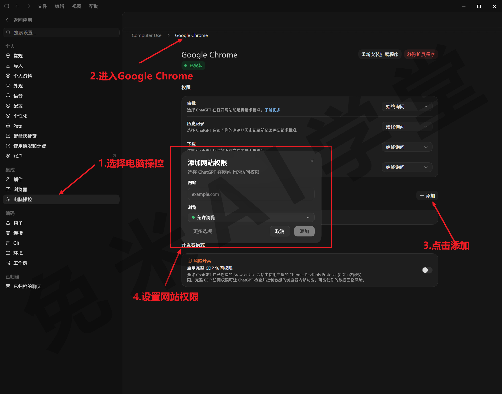

**刹车手段：翻车第一步是取消**

官方的口径很直接：你可以随时停止任务，或直接接管电脑。落到具体动作，刹车就在手边：界面上的停止按钮随时可点（位置与文案，需实机验证）；Windows 上你动一下鼠标键盘，就等于从它手里把前台接管回来，但接管夺回的是前台控制，任务本身仍要点“停止”或“取消任务”才算终止；Chrome 路线则是点调试横幅上的“取消”，立刻断开它对浏览器的控制。什么时候该踩，官方给的判断也简单：发现它在操作错误的窗口，别犹豫，直接取消任务。

它自己也有过不去的关卡，正好构成兜底：系统级授权弹窗（比如 Windows 的管理员确认）它点不了，会停下来等你亲手处理；终端类应用和 Codex 自身不允许被它自动化，防的就是它绕过自己的安全体系，你也不用担心它“自己开个终端乱跑命令”。预期管理补一句：社区有过停止按钮偶发不灵的反馈，遇到就重启应用兜底（以当前版本表现为准）。

**官方使用纪律，照着做**

最后把官方安全指引里最实用的几条留给你：

- 一次只给一个明确的目标应用或流程：像“把我电脑整理一下”这种没有边界的全权委托，不要发。
- 需要输入密码、密钥的任务要特殊对待：要么不交给它，要么人守在旁边逐步确认，密码尽量由你亲手输入。
- 账号、支付、隐私、网络这类设置的修改必须人在场：这几类改坏的代价最高，确认卡再多也别离开屏幕。

上面三条管“怎么把活交给它”，下面三条管“账号和数据怎么守”：

- “一直允许”只给你完全信得过、确实需要它反复使用的应用：这个选项省下的是点击，交出去的是每次过问的机会。
- 已登录网站上它的每一次点击，网站都当成你本人在点：审它的动作时，就按“等于我亲手做的”这个标准来。
- 高敏感数据不要走浏览器任务传输：读到的内容会进入任务记录，确实需要传时，人盯全程、事后检查。

一句话总结：红线管住不给什么，闸门管住给了之后怎么盯。两层都在，才有资格进下一节的案例。

### 10.5 案例：一个无风险的 Computer Use 小任务

#### 任务设计

第一次运行 Computer Use，任务最好同时满足三点：风险低、结果可见、操作可逆。

更换桌面壁纸比较适合作为入门练习：它只修改 Windows 的个性化设置，不涉及账号、支付、隐私或安全配置；如果不喜欢新壁纸，也能随时换回。整个过程还可以观察 Computer Use 如何配合文件操作、图片生成和桌面应用控制完成连续任务。

不过，Windows 当前壁纸不一定对应一个可以直接复制的原始文件。例如使用 Windows 聚焦、幻灯片、主题缓存或纯色背景时，系统可能无法提供明确的原始图片。因此，本案例增加了失败保护：只有确认并备份原壁纸后，才继续生成和更换。

#### 动手前置

开始前先准备好以下状态：

- Computer Use 插件已经安装并启用（装完默认就是可用状态，详情页“技能”分区下的 Computer Use 开关保持默认开启即可，见 10.3 第 2 步）；
- 关闭邮箱、聊天软件、密码管理器、网银等与本任务无关的敏感应用；
- Windows 保持解锁，目标应用位于当前活动桌面；
- 为了提高案例复现成功率，建议暂时使用一张普通的本地 JPG 或 PNG 图片作为桌面背景，不要使用 Windows 聚焦、幻灯片或纯色背景。

如果之前已经允许 Computer Use 始终操作 Windows“设置”应用，可以先到 **设置 → 电脑操控 → 始终允许的应用** 中移除该授权。这样重新运行时，更容易观察首次应用授权流程。

Windows 上的 Computer Use 会接管当前桌面的鼠标和键盘。任务运行期间先把手离开键鼠，需要中止时直接点击“停止”或“取消任务”。

输入 `@`，在列表中选择 **Computer Use**，然后发送下面的指令：

```
先尝试定位我当前正在使用的桌面壁纸原始文件。
如果能够确认原始文件，请把它复制到项目文件夹，并命名为“原壁纸备份”；
如果当前使用的是 Windows 聚焦、幻灯片、纯色背景，或者无法确认原始文件，请停下来告诉我，
不要继续生成或更换壁纸。
备份成功后，分析原壁纸的视觉风格，生成一张同风格、不同画面的 16:9 新壁纸，只生成一张，
并保存到项目文件夹。
然后打开 Windows“设置”中的“个性化 → 背景”。
真正把新图片设置为桌面壁纸之前，必须先向我说明即将进行的修改并等待确认；
只有得到我的允许后才能更换。
完成后检查桌面显示效果，并确认项目文件夹中同时存在原壁纸备份和新壁纸。
```

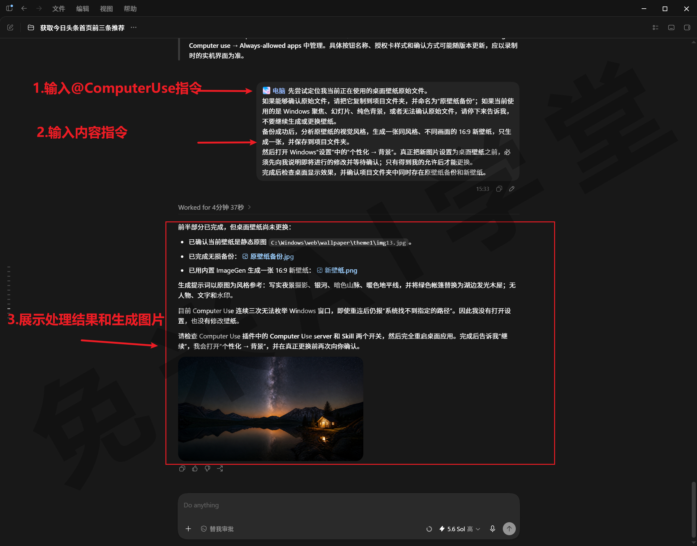

“先备份再修改”不是多余步骤。如果新壁纸不满意，可以直接恢复原文件。这个习惯也延续了《权限、沙盒与模型》中“重要修改前保留恢复路径”的原则。

#### 全程看点：一步一停

1. **确认是否能够备份原壁纸**

   它会先尝试定位当前壁纸的原始文件。只有确认文件来源并成功复制到项目文件夹后，才会继续。

   如果当前使用的是 Windows 聚焦、幻灯片、纯色背景，或者只能找到系统缓存而无法确认原文件，它应当停下来说明情况。此时不要让它用桌面截图冒充原始壁纸。

2. **首次应用授权**

   当 Computer Use 第一次准备操作 Windows“设置”应用时，可能会出现应用授权卡，询问是否允许它控制该应用。

   确认卡片中显示的应用确实是 Windows“设置”后再允许。第一次练习建议不要选择“始终允许”，让后续任务继续保留逐次授权。

   如果“设置”应用以前已经加入 **Always-allowed apps**，这张卡可能不会再次出现。

3. **前台接管**

   授权后，Windows 上会看到指针移动、窗口打开以及设置页面切换。这是 Computer Use 的正常前台工作方式。

   任务运行时不要和它同时争抢鼠标或键盘。需要接管时，先点击停止或取消任务，再进行手动操作。

4. **备份与图片生成**

   原壁纸备份成功后，它会分析图片的颜色、构图和整体风格，再调用图片生成能力制作一张同风格、不同画面的新壁纸。

   图片生成并不是 Windows 设置操作本身，而是由图片生成能力完成；Computer Use 负责后续打开设置并选择生成的文件。本次只生成一张，避免不必要的处理时间和用量。

5. **修改前确认**

   当它准备真正更换桌面背景时，应先说明三件事：即将修改的是哪项设置、准备使用哪个图片文件、原壁纸是否已经成功备份。

   不同版本可能显示平台确认卡，也可能在对话中请求确认，具体界面和文案以实机为准。无论采用哪种形式，没有得到明确允许前，都不应执行最后的更换动作。

6. **收尾核对**

   任务完成后检查三项结果：桌面已经显示新壁纸，项目文件夹中同时存在原壁纸备份和新生成的壁纸这两个文件。

   最后再看一眼对话中的执行汇报，确认它只操作了与本任务有关的窗口和文件。

#### 分清授权与确认

过程中可能遇到两类不同的询问：

- **应用授权**问的是：“能不能操作这个应用？”它通常按应用管理。如果选择“始终允许”，以后操作该应用时可能不再重复询问。
- **具体操作确认**问的是：“这次修改是否继续？”它针对即将执行的动作，例如真正更换桌面背景。

前者像门禁，决定能不能进入应用；后者像闸门，决定能不能执行当前修改。

需要注意：根据已有授权和当前版本，两种询问不一定每次都会同时出现；少遇到其中一类询问不代表出了问题，具体会出现哪类卡片以实际界面为准。

#### 跑完做三件事

- **检查恢复路径**：确认原壁纸备份能够正常打开。只有备份文件真实可用，“可以随时恢复”才不是一句空话。
- **看一眼本次用量**：到《权限、沙盒与模型》教过的两个额度入口，看一眼这次任务的消耗，对 Computer Use 的量级建立自己的体感。
- **练习停止任务**：再启动一个简单的 Computer Use 任务，在运行中点击“停止”或“取消任务”，观察任务如何结束。不要把“轻微移动一下鼠标”写成可靠的停止方式；键鼠接管不一定代表任务已经终止。

#### 翻车了怎么办

- **打开了不该操作的窗口，或出现键鼠争抢**：立即点击停止或取消任务，不要等待它自行纠正；确认任务已经结束，再继续手动操作。
- **无法找到原壁纸文件**：让任务停在这里，不要继续更换。可以先手动选择一张普通本地图片作为桌面背景，再重新运行。
- **新壁纸不满意**：让它使用项目文件夹中的原壁纸备份恢复，或者手动进入“设置 → 个性化 → 背景”换回原图。
- **任务停住不动**：检查是否正在等待应用授权、操作确认或系统弹窗。涉及管理员身份验证、安全权限或隐私权限的窗口需要自己处理，Computer Use 不会代为批准。

> Windows 上的 Computer Use 在当前活动桌面前台运行，任务期间会操作鼠标和键盘。应用授权可以在 **设置 → 电脑操控 → 始终允许的应用** 中管理。具体按钮名称、授权卡样式和确认方式可能随版本更新，应以录制时的实机界面为准。

### 10.6 三种能力怎么选

**选择困难是正常的**

到这一篇为止，能上网、能操作界面的能力攒了三个：《内置浏览器全解》的内置浏览器，本篇的 Chrome 扩展和 Computer Use。功能看着有重叠，其实官方划过清楚的分工，选起来有章法。

**官方三分工**

- **内置浏览器**：本地开发的页面、文件预览、不需要登录的公开网页。干净环境，跟你的日常浏览器互不打扰。
- **Chrome 扩展**：需要你已登录身份的网站。收藏夹、后台、内部系统这类活，借你的真实浏览器干。
- **Computer Use**：浏览器之外的桌面应用。只存在于图形界面里的活，它是唯一选项，同时也是全场的兜底选项。

三分工之上还压着一条总优先级：有专用插件或接口的先用专用的，表格活找表格插件，往后《MCP 全解》接入的外部服务也算；然后是浏览器路线；最后才轮到 Computer Use。平时你把任务说清楚，Codex 自己也会在这些工具之间挑选切换；@ 指名等于你手动锁定。三个名字别混：@Browser 是内置浏览器，@Chrome 是 Chrome 扩展，@Computer 是 Computer Use（各自的中文显示名，需实机验证）。

**四问定路线**

拿到一个任务，按顺序过四问：

1. 这活涉及重要账号或不可逆操作吗？是，到此为止，不交给 AI，自己动手。红线优先级最高，所以放第一问。
2. 它在浏览器里吗？不在，是桌面应用的活，走 Computer Use。
3. 在浏览器里，需要登录身份吗？不需要，内置浏览器。
4. 需要登录，轻度还是重度？偶尔看一两页，在内置浏览器里单独登录那个网站；经常跑、翻页多、要用你现成的登录环境，Chrome 扩展。

拿不准就交给它：把任务原样描述清楚发过去，看它自己选什么工具。它的选择通常就是官方分工的答案，顺便帮你校验判断。

**认知一提：边界会挪，框架不变**

功能边界随版本变化是常态，Computer Use 自己就是例子：早期只在 Mac 提供，后来才支持 Windows。所以记结论不如记框架：四问的判断方式比任何一版功能清单都长寿，新能力出来还是这四问往里套（各能力的当前边界，以当前版本说明为准）。

**认知一提：同一个扩展的另一半**

装好的 Chrome 扩展还有一个反向用法：你自己逛网页时，打开它的侧边面板，就着当前页面直接提问，让它总结文章、解释术语，聊天记录会同步回应用（以实际表现为准）。打开方式：点 Chrome 工具栏右侧的“扩展程序”按钮，在列表里点 ChatGPT 这一项，侧边栏就贴着当前网页展开；10.1 里钉选过图标的，直接点工具栏图标更快（Mac 还可用快捷键 Cmd+Shift+.）。分清两回事：侧边面板是你用 AI，你看页面、它答疑；本篇前面讲的是 AI 替你操作浏览器。前者随手用，没什么心理负担；后者才涉及授权与红线。

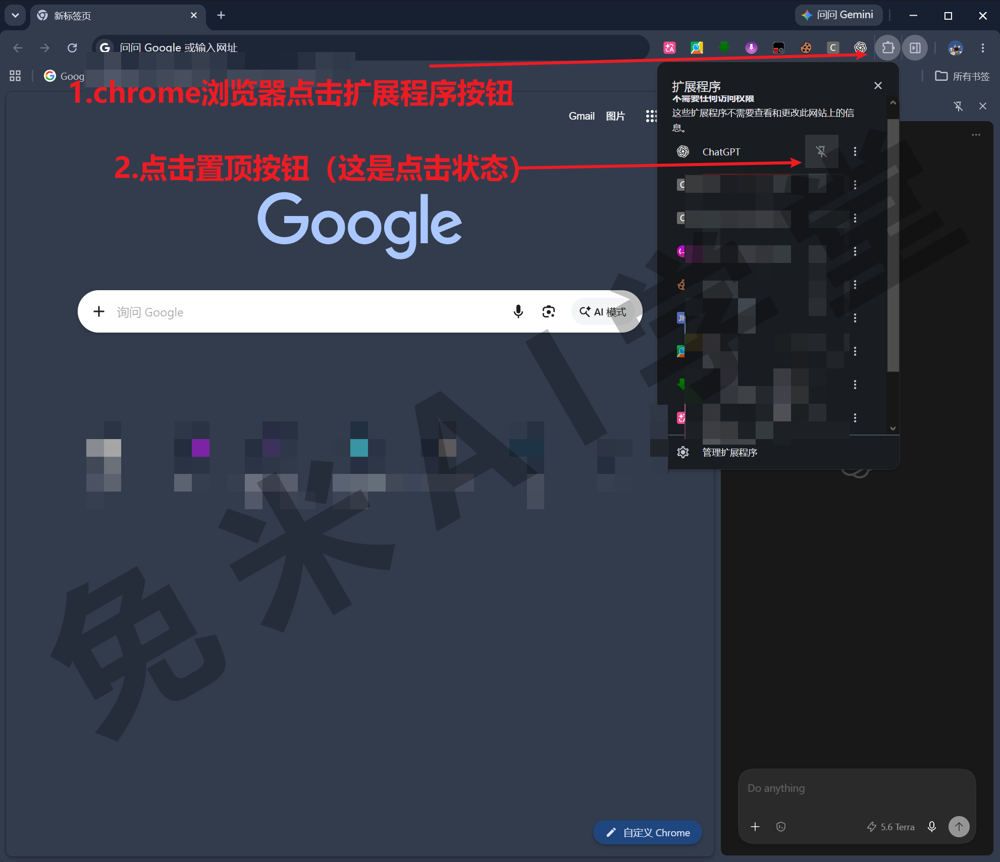

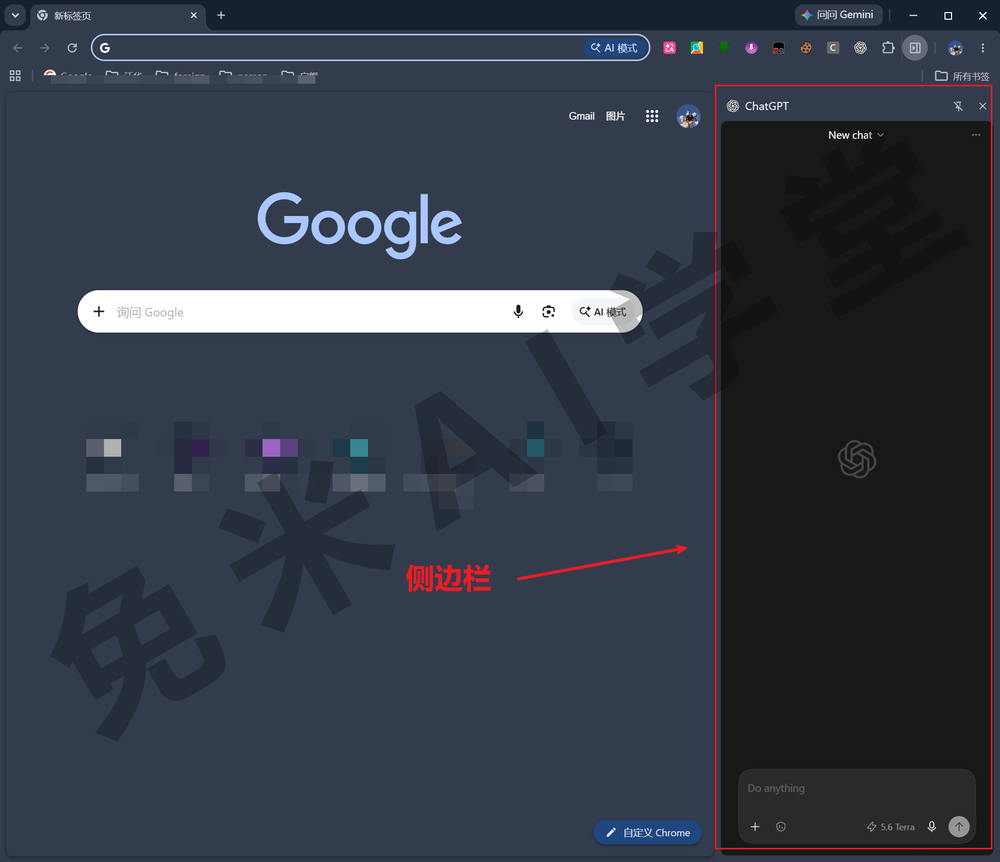

### 10.7 三个练习任务

下面三个任务把本篇内容完整练一遍。提示词可以直接复制，方括号里的内容换成你自己的。

**任务一：用 Chrome 扩展整理一份已登录网站的小清单**

选一个你登录着、内容攒了不少的网站，收藏夹、追更列表、历史订单都行。输入 @ 选中 Chrome 插件，发送：

```
打开 [你的网站]，把 [你要整理的内容，例如我的追更列表] 整理成一张清单，包含名称和链接，
保存为“整理清单.xlsx”放进项目文件夹。
```

完成标准：拿到表格文件，抽查两三条链接都能打开；过程中的网站授权卡，你是读过内容再点的。

**任务二：拿记事本跑一个 Computer Use 小任务**

输入 @ 选中 Computer Use，发送：

```
打开记事本，把下面三件事整理成一份待办清单写进去，保存到桌面，文件名叫“明日待办”：
[你的三件事]
```

完成标准：桌面出现内容正确的待办文件；全程看到了首次授权卡和它操作窗口的过程；Windows 读者体验过“任务期间键鼠归它”这件事。

**任务三：给三个任务标注该用哪种能力**

这个任务不动手，只判断。给下面三个任务各标注一个答案，从内置浏览器、Chrome 扩展、Computer Use、不建议交给 AI 四个里选：

- 查三款笔记本电脑的公开测评，汇总成对比表。
- 把我在购物网站的购物车商品导出成清单。
- 登录网银，把这个月的账单导出来。

完成标准：能按 10.6 的四问说出每个答案的理由。参考答案：第一个用内置浏览器，公开网页不需要登录；第二个用 Chrome 扩展，要用你的登录身份；第三个不建议交给 AI，网银踩了红线，这类导出自己动手更稳妥。

### 10.8 本篇小结与自检

这一篇介绍了两种更强的操作能力和它们的边界。最需要记住的是：**能用终端和浏览器解决的，不用 Computer Use；第一次练手只用无风险应用，登录着重要账号的应用绝不交给它。**

可以对照下面的清单检查学习结果：

- [ ] 用 Chrome 扩展完成过一次已登录网站的数据整理
- [ ] 跑通过一个无风险的 Computer Use 小任务
- [ ] 能给任务正确标注该用哪种能力
- [ ] 能说出 Computer Use 的两条新手红线
- [ ] 知道任务失败时先查扩展连接状态

完成这些内容后，你已经能为不同任务选对合适的操作能力。下一篇《Skills 技能系统 + 桌面宠物》进入技能系统：把常用流程固化下来，一键复用。

### 10.9 新手常见问题

**Q1：扩展连不上怎么办？**

按从快到慢的顺序排查。先做三个最快的检查：目标网站是不是曾被你点过“拒绝”进了屏蔽名单，这一步最容易被忽略，到设置“电脑操控”分区的名单里看一眼；Chrome 开的是不是装了扩展的那个配置档案，多档案的电脑最常见；扩展图标显示的是不是“已连接”。三处都没问题，再升级处理：把应用更新到最新版；关掉侧边面板，重启 Chrome 和应用；提示缺少配套组件的，从插件面板移除 Chrome 插件再重装一遍；新开一个对话再试。Windows 上还有一类已知现象：显示已连接却指挥不动、被控标签页黑屏转圈，社区验证有效的恢复顺序是把应用和 Chrome 全部退出，在任务管理器里确认相关进程已清干净，然后先启动应用、再打开 Chrome（以当前版本表现为准）。全都无效，就通过应用的反馈入口报告问题。

**Q2：Computer Use 为什么消耗这么大？**

工作方式决定的。它靠“看屏幕、想一步、动一下、再看屏幕”的循环推进，每转一圈都要把最新的屏幕内容读进上下文，几分钟的任务转几十圈很正常，上下文自然比普通任务大得多。现行版本已经在优化：能用界面文字的就少传画面，搭配更快的模型执行，但量级差距仍在。省的办法就是 10.6 的分工：能走文件、终端、浏览器的活不上 Computer Use；指令一次说全，减少来回；每次跑完看一眼用量，心里有本账。

**Q3：哪些应用绝对不能交给它？**

一句话标准：应用里的操作一旦出错，撤销不了、也赔不起的，都不给。对照着数：装着你社交关系的（微信、QQ 主号），动钱的（网银、支付、证券），管着重要账号安全设置的，全在红线内。配两条习惯：敏感应用不用就关掉，别在后台开着；需要输密码的任务，要么不交给它，要么人守着逐步确认。它的隔离机制（只能看到被授权的那一个应用）是防线，但红线的意义就在于不把安全押在任何单一防线上。

**Q4：它和内置浏览器的功能重复吗？**

不重复，是三段接力：内置浏览器管公开网页和本地页面，Chrome 扩展管需要登录身份的网站，Computer Use 管浏览器之外的桌面应用。确有重叠的地方，比如一个公开网页三个都打得开，这时按 10.6 的优先级选最轻的：内置浏览器最省也最干净。Computer Use 理论上也能操作浏览器界面，但那是用最贵的方式干最便宜的活，官方的排序同样是浏览器路线在前、Computer Use 兜底。

