## MCP 全解

上一篇《Skills 技能系统 + 桌面宠物》提到过 MCP，讲到 MCP 是“接外部程序的标准插口”。这一篇我们会先讲清楚 MCP 是什么，然后再通过几个案例来实际使用一下 MCP：学会配置、审批和密钥管理，接入一个文档查询服务，最后回答“什么时候才需要它”。

### 12.1 MCP 是什么

**从 2024 年的 ChatGPT 说起**

如果你用过 2024 年的 ChatGPT，应该还有很深的印象：当时的它只能回答训练数据截止2023年4月之前的问题，对这个时间点之后发生的事件一概不知。根本原因在于，当时的 ChatGPT 不会联网，模型只能靠训练时装进去的知识作答。后来的 AI 补上了联网搜索，公开网页上的新消息能查到了，但同样的局限换了个地方：你公司的数据库、团队内部的文档、要登录才能用的在线服务，搜索引擎够不着。要让 AI 用上这些信息、替你操作这些服务，得给它接上对应的外部信息源和程序。说到底都是同一件事：让 AI 和“外部程序”对话。

**各接各的，接口五花八门**

给 AI 接外部程序这件事，早就有人在做。上面说的联网搜索就是最早的例子之一：有人写了能联网搜索的程序，接到当时还不能联网的 ChatGPT 上，它的能力就多了一块；后来又接上能爬网页的、能操作设计软件的……问题随之而来：市面上的 AI 有很多家，外部程序数以万计，每一家的对接方式都不一样。就像插座——你家用两孔，他家用三孔，电器厂家为了适配各种插座疲于奔命，AI 这边的开发人员同样头昏脑胀。

**插排国标：大家定一个标准**

行业的解法和电器行业一模一样：坐下来定一个统一标准。现实里插座有国标，不管哪个厂生产插座都得按国标来，任何电器只要插头符合国标就能用电。AI 世界的这个“国标”就是 MCP（Model Context Protocol，模型上下文协议）——它规定了 AI 应用和外部程序之间怎么对话：给什么样的指令、返回什么样的结果。英文名不用记，记住它的身份就行：MCP 是一个沟通标准，外部程序按标准做好“插头”，Codex 这样的应用提供标准“插座”，一插即用，不需要每个组合单独适配。


**能力是谁的：把数据流向想清楚**

理解 MCP 最容易走偏的地方在这里：接入一个文档查询服务后，AI 会查最新文档了，这个本事是 MCP 给的吗？不是。查文档的能力是那个外部程序自己开发的；MCP 只规定了双方怎么沟通。数据流向是：你的要求经过这个标准接口交给外部程序，外部程序干完活，把结果按标准格式返回给 AI。MCP 本身不产生任何能力，它只是那根标准化的连接线。

顺手交代两个后面会反复用到的称呼。提供能力的外部程序，技术资料里叫“MCP 服务器”——后文说“服务器”，指的就是接进来的那个外部程序，不必联想成机房里的大铁柜。服务器把自己的能力打包成一个个“工具”，比如“查询文档”就是一个工具，Codex 干活时调用的就是这些工具。

**你可能已经在用它**

MCP 听起来像开发者的玩具，其实离你很近：桌面应用自己的一些内部能力，也是按 MCP 的方式接进来的。等下你可能会发现自己的配置文件里早就登记着一两个服务器，尽管你从没配置过（内部服务器是否出现在设置页列表里，以实际界面为准）。所以不用把它当成高深的东西——你要做的只是把别人做好的“插头”插进来。

**三件套各管一摊**

到这里可以把《Skills 技能系统 + 桌面宠物》提出的“技能、插件、MCP”三分法补全：

- **技能**——教 AI 怎么干活的工作规范，管的是“方法”：能力它本来就有，规范让它按你的标准发挥。
- **插件**——装上就有的能力包，管的是“分发”：装进应用、由应用直接运行的现成能力。
- **MCP**——接外部程序的标准插口，管的是“连接”：能力住在外部，MCP 负责让双方说得上话。

拿本篇的文档查询举例就能分清：把“查文档的步骤”写成技能，AI 得到的只是一份操作规范，用的仍是它原有的能力；接上文档查询的 MCP，它才真正连上了那份外部文档库。一句话总结：**规范决定它怎么干，接口决定它能碰到什么。**概念到此讲完，下面两节把它装起来、用起来。

### 12.2 配置方式与审批

**个人配置一次，本机多端复用**

动手前先建立一个认知：个人添加的 MCP 服务器默认记录在 Codex 的用户级配置文件中，文件位于用户目录下的 `.codex` 文件夹，名称是 `config.toml`。

Windows 上通常是：

```
C:\Users\你的用户名\.codex\config.toml
```

Mac上通常是：

```
~/.codex/config.toml
```

同一台电脑上的 ChatGPT 桌面应用、Codex CLI 和 IDE 扩展会读取同一套本地配置。因此，在其中一个客户端添加服务器后，通常不必在另外两个客户端中重复配置。

这里有两个边界需要分清：ChatGPT 网页版不会读取电脑里的本地配置；受信任的项目还可以在项目目录中使用 `.codex/config.toml`，添加项目专属的 MCP 配置。另外，插件自带的 MCP 服务器由插件提供启动信息，用户配置主要记录它的启用状态和工具策略，并不完全等同于手工添加的服务器。

平时不必直接打开配置文件。通过设置页或 `codex mcp` 命令添加服务器时，Codex 会自动写入配置；需要调整超时、工具范围和审批策略时，再手工编辑即可。

接入一个 MCP 服务器，最省事的官方办法是把服务商的接入说明直接交给 Codex，让它代为配置——下面先把这条路完整演示一遍。之后是三条手工路线：从设置页添加、运行服务商提供的安装命令，以及使用 Codex 自带的 `codex mcp` 命令，留给想自己动手的读者。

#### 最省事的一条路：把接入说明交给 Codex

每家服务商的接入说明写法都不一样：有的给一行安装命令，有的给一段要填进表单的配置，字段名还多是英文。自己逐项读懂、逐项填对，是新手最容易卡住的环节。官方支持一个省事办法：这份说明不用你自己读，直接交给 Codex，让它照着配。

下面以 Figma 为例完整走一遍。Figma 的正式接入说明放在它的开发者文档站：developers.figma.com 的“Figma MCP server”文档下，进“Remote server installation”（远程服务器安装）一页，里面有专门写给 Codex 的小节；帮助中心《Guide to the Figma MCP server》一文也能跳转过去（文档结构以官网当前页面为准）。其他服务商同理：找到官方接入说明，流程完全一样。

顺带一说，Figma 还把自己上架了 Codex 的插件目录，直接安装 Figma 插件也会把它的 MCP 服务器一起带进来——本节开头说的“插件自带的 MCP 服务器”就是这种情况（入口与形态以实机界面为准）。本节仍按通用流程演示：学会把说明交给 Codex，没上架插件目录的服务商也照样能接。

第 1 步，把接入说明交给 Codex。复制说明页的链接，粘贴进输入框，加上一句话说明来意：

```
这是 Figma 官方的 MCP 接入说明：[粘贴官方接入说明链接]
请按照这份说明，帮我把这个 MCP 服务器配置到 Codex。
配置完成后告诉我：需不需要重启，以及怎么验证已经接通。
```

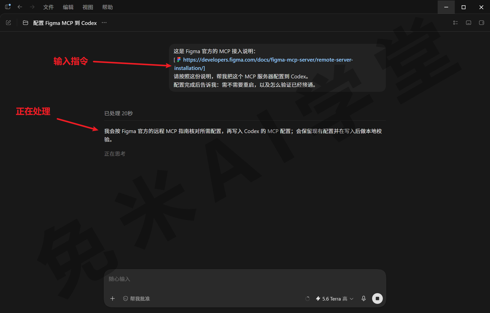

第 2 步，看它干活。它不会闷头就改，而是先讲打算怎么配再动手：读官方说明，核对本机环境和已有配置，然后写入配置。这次演示中，它替你运行的是说明里写给 Codex 的那行官方命令（`codex mcp add figma --url https://mcp.figma.com/mcp`），把服务器登记进用户级 `config.toml`；也可能直接编辑配置文件，走哪条以当次执行为准。

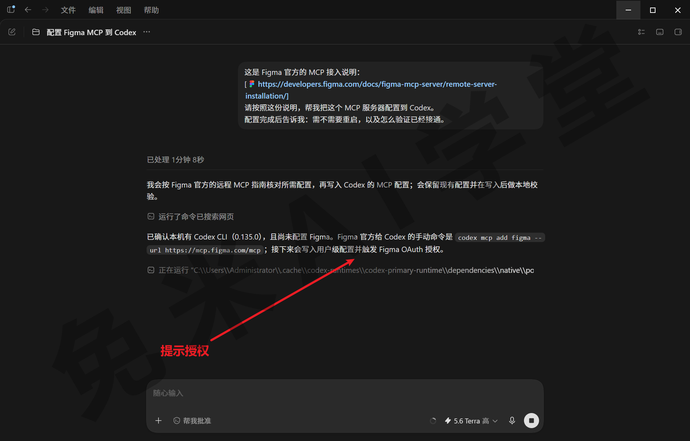

像 Figma 这类要登录账号的服务，配置写入后会直接弹出浏览器授权页。看清授权对象和权限范围再点同意——页面上写明了“Figma MCP in Codex”将获得你 Figma 账号的哪些访问权限。

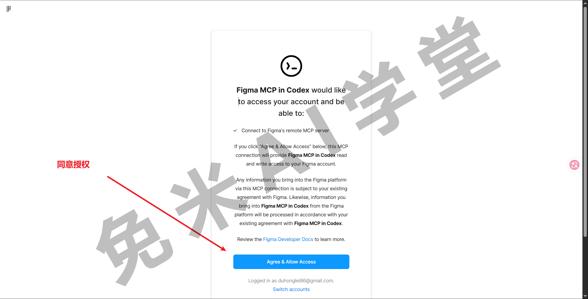

授权成功后，浏览器提示可以关闭窗口，回到 Codex 等它收尾即可。过程中要不要弹审批卡，取决于你当前的审批模式；凡有卡弹出，照《权限、沙盒与模型》养成的习惯，逐条看清它要做什么再允许。

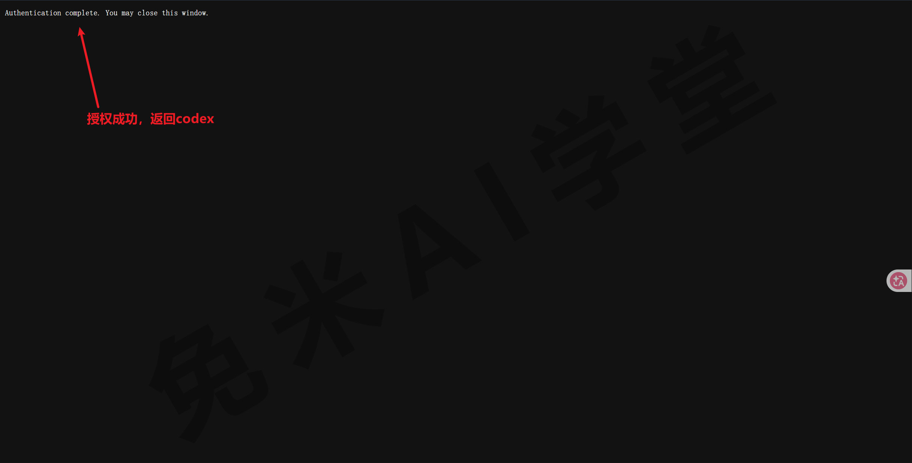

第 3 步，验证接通，不用重启。配置写好、授权完成后，它会答复你开头问的两件事——这条路写入即生效，不需要重启（要不要重启，以它当次的答复为准）。验证只要一步：在输入框敲 `/mcp` 回车，状态列表里出现 figma、标着“已通过身份验证（OAuth）”且已启用，就是接通了；“设置 → 插件 → MCP”页里同样能看到它。这两个入口后文都会细讲。

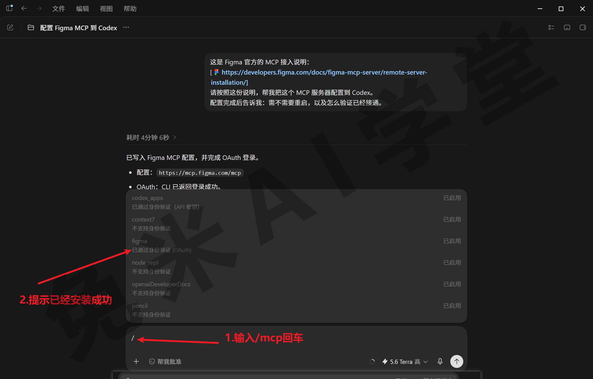

第 4 步，让它复述改了什么：

```
列出你刚才为配置这个 MCP 服务器做的全部改动：
改了哪个文件、写入了哪些内容、以后我想删掉它应该怎么删。
```

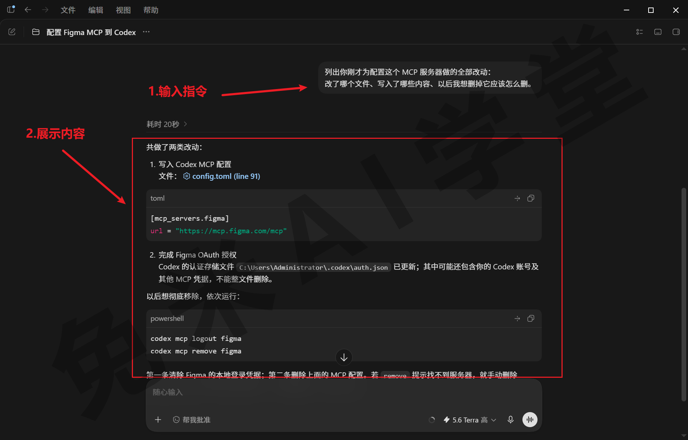

它会把改动明细逐条讲给你听。这次演示它列出了两类改动：配置写进 `config.toml` 的 `[mcp_servers.figma]` 一节；OAuth 登录凭据存进用户目录下的认证文件。连以后怎么删都一并交代了——先 `codex mcp logout figma` 清除登录凭据，再 `codex mcp remove figma` 删除配置，正是后文手工路径三那套管理命令。看完这一步，配置写在哪、写了什么，你心里就有底了——这也正是下面手工配置部分要展开的内容。

两个提醒：

- **说明认准官方来源。**发给它的接入说明要来自服务商官网或官方仓库；论坛旧帖和二手教程可能已经过时，照着配容易出错。
- **失败了不用换路。**配完没接通，把报错原样发回对话让它继续诊断，通常比自己对着配置文件排查快。

这条路的好处是不需要你理解配置细节。但如果你就是想自己动手，想弄清每个参数叫什么、填在哪，下面把纯手工配置完整教一遍：先讲设置页表单怎么填，再分清两种连接方式各要填什么参数，最后是命令行两条路。哪怕不打算手工配，看懂这部分，将来代配出了问题你也能自己检查。

#### 手工路径一：从设置页添加

第 1 步，打开“设置”，在左侧选择“插件”，再切换到页面上方的“MCP”标签。这里会列出自行添加的 MCP 服务器，以及由插件提供的 MCP 服务器；服务器右侧的开关用于控制是否启用。

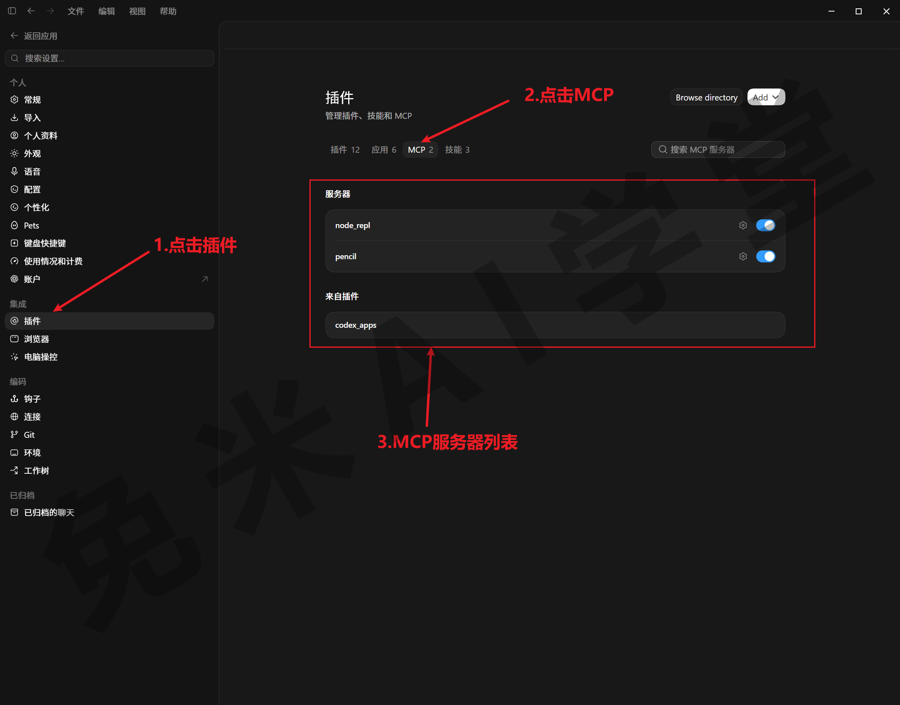

第 2 步，点击右上角的“Add”，再选择“Add MCP server”，进入“连接至自定义 MCP”页面。

先给服务器填写一个简短、容易辨认的名称，例如 `figma`；然后在“STDIO”和“流式 HTTP”之间选择连接方式。选择 STDIO 时，填写启动命令，并按照服务商说明配置参数、环境变量和工作目录；选择流式 HTTP 时，填写服务器地址。具体内容以服务商提供的接入说明为准。

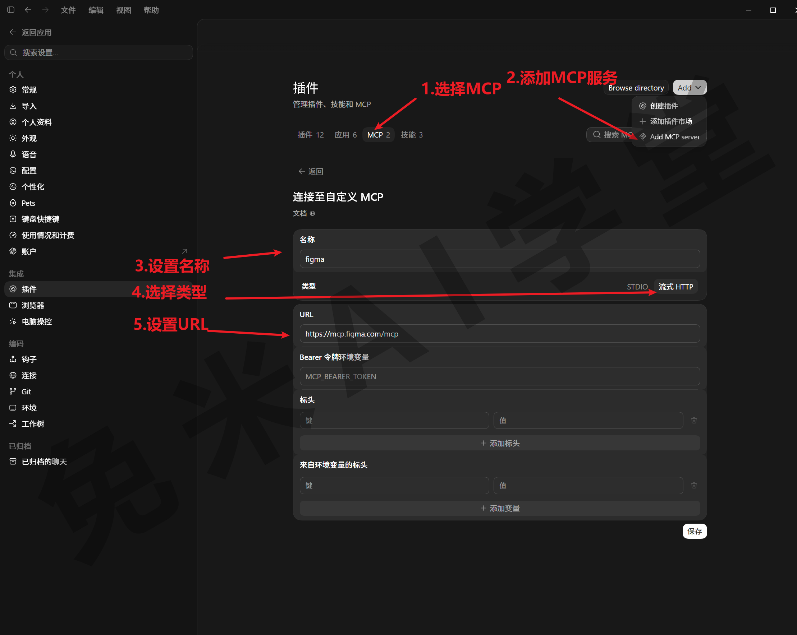

第 3 步，填写完成后点击“保存”，再按照界面提示重启应用。重启后回到“插件 → MCP”页面：新服务器出现在列表中且启用开关亮起，说明配置已经生效。

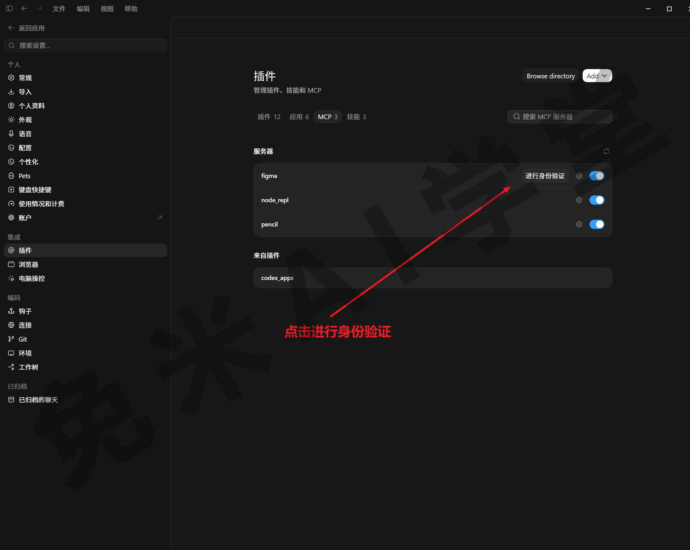

如果服务器使用 OAuth，条目中还会出现认证入口。点击后按照网页提示登录并授权。按钮的具体中文名称可能随版本变化，以实机界面为准。

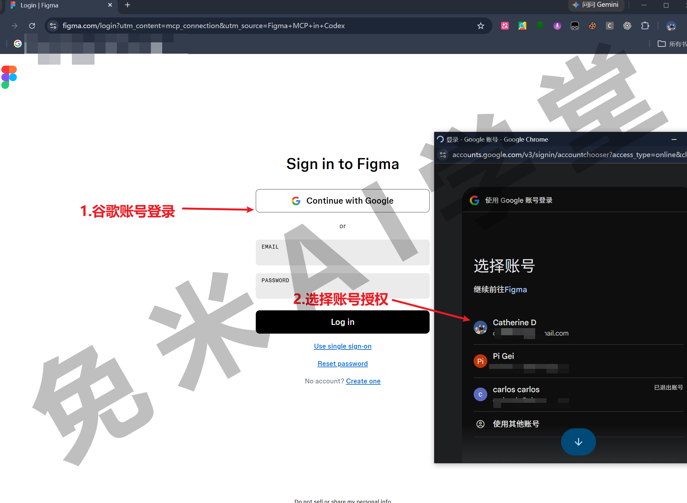

页面上方的“Browse directory”是浏览插件目录的入口，与添加自定义 MCP 服务器是两回事。

#### 手动填参数前，先分清两种连接方式

可以先记住一个简化口诀：“本地启动用 STDIO，远程地址用流式 HTTP。”

- **STDIO（本地启动）**：Codex 通过一条命令在电脑上启动服务器进程。电脑需要具备相应的 Node.js、Python 或其他运行环境。需要注意，本地启动不等于完全离线；服务器程序是否访问网络、是否把数据发送出去，仍取决于它自身的实现。
- **流式 HTTP（远程连接）**：Codex 通过网址连接已经运行的服务器，通常不需要在电脑上安装该服务器的本地运行环境。服务器可能使用 OAuth、访问令牌或自定义请求头认证，也可能允许无认证访问，具体以服务商说明为准。

选哪种通常不用自行猜测：服务商提供哪一种，就按它的说明配置。如果同一个服务同时提供两种方式，流式 HTTP 通常可以减少 Windows 上安装运行环境和处理依赖的麻烦；但请求会发送到远程服务器，需要同时考虑数据范围、账号权限和服务商是否可信。

#### 手工路径二与路径三：通过命令行添加

设置页之外，还有两种从终端开始的配置方式。

手工路径二是运行服务商提供的快捷命令。有些 MCP 服务商会给出一行安装命令，帮助你安装依赖并登记服务器。运行前要看清命令针对的是哪个客户端：写着 Claude、Cursor 或其他产品的命令，不会自动把服务器配置到 Codex。遇到交互式向导时，也要逐项看清它的提问再选择。

例如 Figma 安装命令：

```
codex mcp add figma --url https://mcp.figma.com/mcp
```

手工路径三是使用 Codex 自带的 `codex mcp` 管理命令。常用命令包括：

```
codex mcp add
codex mcp list
codex mcp get
codex mcp remove
codex mcp login
codex mcp logout
```

其中，`add` 用于添加服务器，`list` 用于查看配置，`remove` 用于删除服务器配置，`login` 和 `logout` 用于管理支持 OAuth 的服务器登录状态。

命令参数会因 STDIO 和流式 HTTP 而不同。使用时以服务商的当前接入说明和下面的帮助命令为准：

```
codex mcp --help
```

#### 工具调用不一定都会弹出审批

配置完成只代表 MCP 服务器已经接通。调用工具时是否进入审批流程，取决于工具声明的性质、服务器的审批设置、当前权限策略以及组织管理规则。

```
必须调用 figma MCP 的 get_metadata 工具，读取下面测试画框的名称、类型、坐标和尺寸：
[粘贴测试画框的 Figma 链接]
只读取元数据，不要创建、修改或删除任何 Figma 内容；
不要改用浏览器，也不要根据链接猜测结果。
```

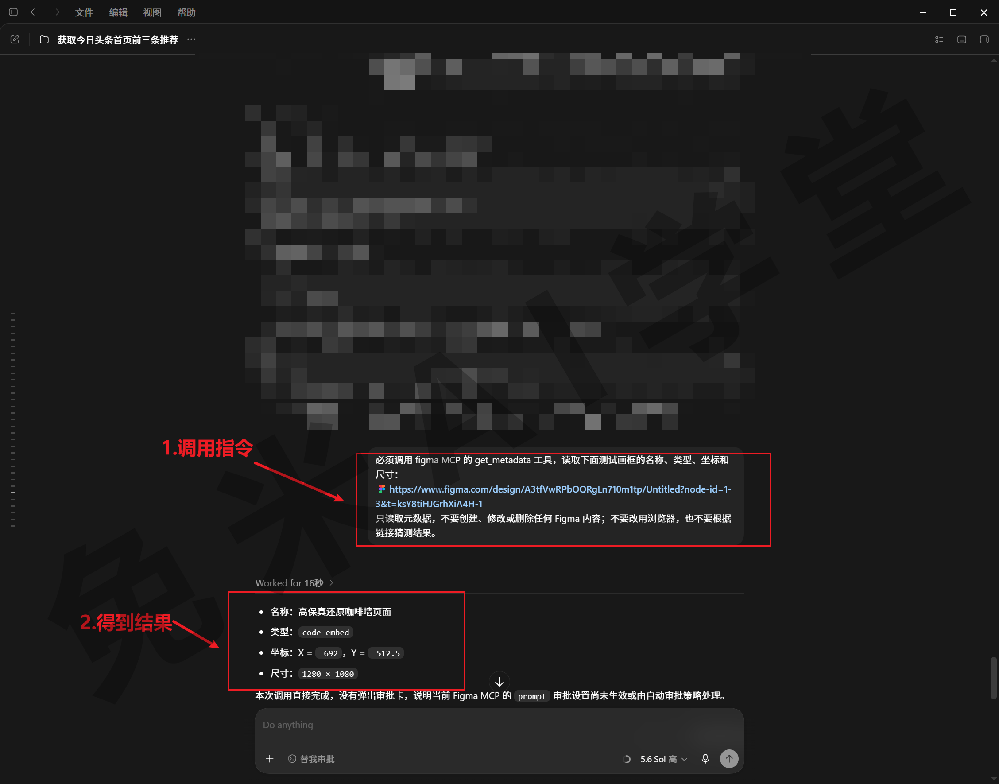

图中，Figma MCP 的只读 `get_metadata` 工具直接返回了画框信息，没有弹出审批卡。这说明只读、无副作用的工具可能直接运行；会写入数据、向外部发送内容或产生实际影响的工具，则更可能要求确认、接受自动审核，或者被组织策略直接禁止。

如果审批卡出现，重点核对三个信息：准备调用哪个服务器、哪个工具，以及会携带什么参数或内容。按钮名称、允许范围以及能否记住选择，可能随客户端版本和管理策略变化。第一次使用时，优先选择范围较小、有效期较短的选项。

对于被服务器正确标记为破坏性的工具调用，Codex 会将其纳入强制审批或评审流程。不过，这依赖服务器准确声明工具性质，组织策略也可能直接禁止某些工具。因此，审批机制不能代替对服务器来源的判断：只接入可信服务器，并坚持最小权限原则。

#### 随时查看状态：/mcp

想查看当前连接了哪些 MCP 服务器，不必每次进入设置。直接在输入框中输入：

```
/mcp
```

选择该命令后会打开 MCP 状态页面，显示当前连接的服务器及其状态。这个页面主要用于查看；要启用、停用、修改或删除服务器，仍应进入“设置 → 插件 → MCP”。

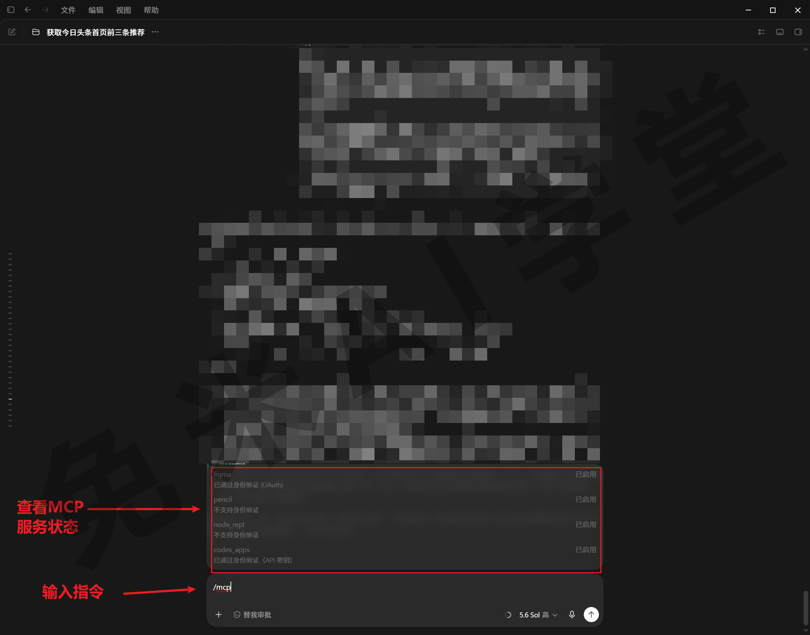

#### 登录凭据与访问令牌

流式 HTTP 服务器不一定都要登录。常见情况包括：

- 使用 OAuth：跳转到浏览器登录并授权；
- 使用访问令牌或 API key：通过请求头证明身份；
- 无认证：服务器允许直接连接。

API key 和访问令牌相当于账号通行证。不要把真实密钥写进教程截图、聊天内容、公开项目或可以提交到 Git 的配置文件中。更稳妥的做法是把密钥保存到系统环境变量，再让 MCP 配置引用环境变量；OAuth 则优先使用 Codex 提供的认证入口。

不再使用一个服务器时，可以分三层处理：

- **停用**：在“设置 → 插件 → MCP”中关闭服务器右侧的启用开关。配置仍然保留，以后可以重新启用。
- **删除配置**：使用设置页提供的删除入口，或者在终端运行：

```
codex mcp remove <服务器名称>
```

- **撤销凭据**：如果登录过账号或提供过密钥，还要到服务商后台撤销授权或吊销密钥。仅仅停用、删除本地配置，并不会自动让已经签发的密钥失效。支持 OAuth 的服务器还可以使用 `codex mcp logout <服务器名称>` 清除本地登录状态。

处理完成后，可以再次打开 `/mcp`，检查服务器的状态是否已经发生相应变化。

### 12.3 案例：接入文档查询服务

**认识今天的主角：Context7**

现在完整接入第一个 MCP。案例选 Context7：一个专门给 AI 喂“最新官方技术文档”的查询服务，收录了大量常用工具和开发库的文档，免费就能用，注册账号能提高用量上限（开放程度与限额，以服务方页面为准）。选它做第一个，正是因为它对准了 12.1 开场那个痛点：模型自带知识会过时，而它答题以官方当前文档为据，答案带出处、可核对。

**动手前置：两件小事**

- **装法认准官方命令。**Context7 的接入路不止一条，服务商自己有个安装向导，向导里会让你在“装成技能”和“装成 MCP”之间做选择——选错了装出来的是技能，MCP 列表里找不到它。课程统一走 Codex 官方文档给的一行命令，最不容易出岔子。
- **确认 Node.js 在位。**命令里的 npx 是 Node.js 自带的命令，《文件能力一集讲全》里你已经让 Codex 装过 Node.js；没装过的，老办法——让 Codex 替你装好再继续。

**四步接通**

第 1 步，跑安装命令。打开终端——点窗口右上角的底部展开栏按钮，或输入框旁加号（+）菜单里的“终端”，《Skills 技能系统 + 桌面宠物》用过（入口以实际界面为准）——把这行粘进去回车（当期写法以《图文手册》为准）：

```
codex mcp add context7 -- npx -y @upstash/context7-mcp
```

拆开看它在说什么：codex mcp add 是“登记一个新服务器”，context7 是你给它起的名字，两个短横线后面是启动这个服务器的命令——正是 12.2 里 STDIO 形态的“启动命令”，只是从表单换到了命令行。跑完会看到 `Added global MCP server 'context7'.` 的登记成功提示。

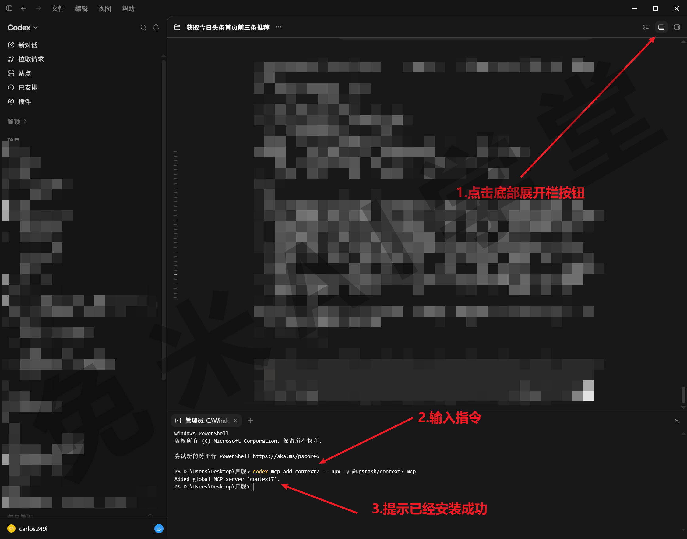

第 2 步，完全退出重启。和装技能、装宠物同一个习惯：不只关窗口，任务栏托盘里也退干净，再重新打开。

第 3 步，确认接通。设置页的 MCP 服务器列表里应当出现 context7、启用开关亮起；或者敲 /mcp 看状态弹窗，里面有它就是接通了。

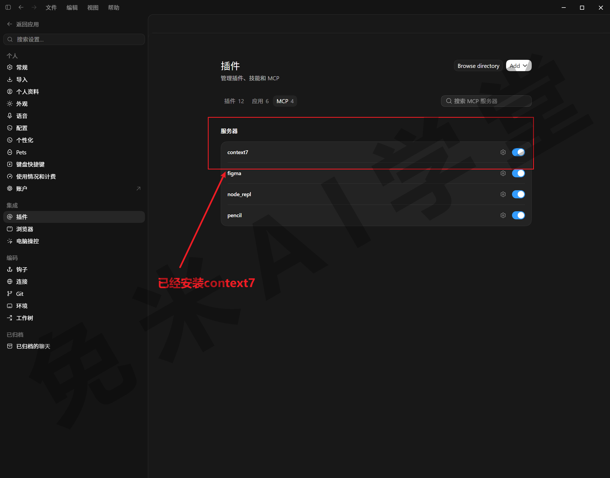

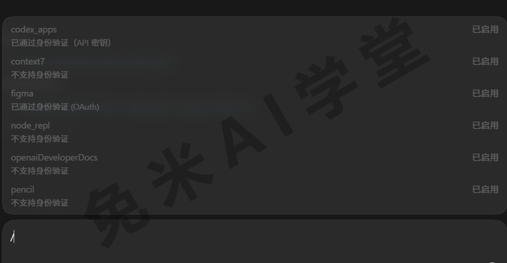

第 4 步，第一次调用。Context7 走免登录路线，装完直接能用；但要知道，部分服务器（接 GitHub、Linear 这类账号服务的）第一次使用会跳出登录授权页，按提示用对应账号登录一次即可（是否需要登录、流程形态，以各服务商说明为准）。我们的第一次调用做成一个对比实验，见下面。

**Windows 上起不来？三条兜底**

本地形态的服务器在 Windows 上偶尔会闹脾气——列表里状态不对，或调用时说连不上。按顺序试三条：

- **先重启。**装完没重启是最常见的原因，完全退出再启动，多数问题到这里就没了。
- **交给 Codex。**把报错和服务商的接入说明一起发回对话，让它诊断或干脆替你重装——让 Codex 代配 MCP 是官方背书的姿势，它比你更会读报错。
- **换远程形态。**Context7 也提供远程连接：到它官网注册拿一把 API key，回到 12.2 的添加服务器表单选远程方式、填服务地址和 key，绕开本机环境的所有问题（地址与 key 的申请入口，以 Context7 官方说明为准）。

**第一次调用：裸问与文档检索对比**

第一次使用 Context7，可以选择一个容易受版本变化影响的开发问题做对比。与其泛泛询问“最新版本新增了什么”，不如指定库、版本和具体 API，这样更容易判断答案是否准确。

先明确要求不调用外部资料：

```
不要查询网页、MCP 或其他外部资料，只根据你已有的知识回答：

在 Next.js 15 中，cookies() 应该怎样调用？它是同步 API 还是异步 API？请给出一个简短示例。
```

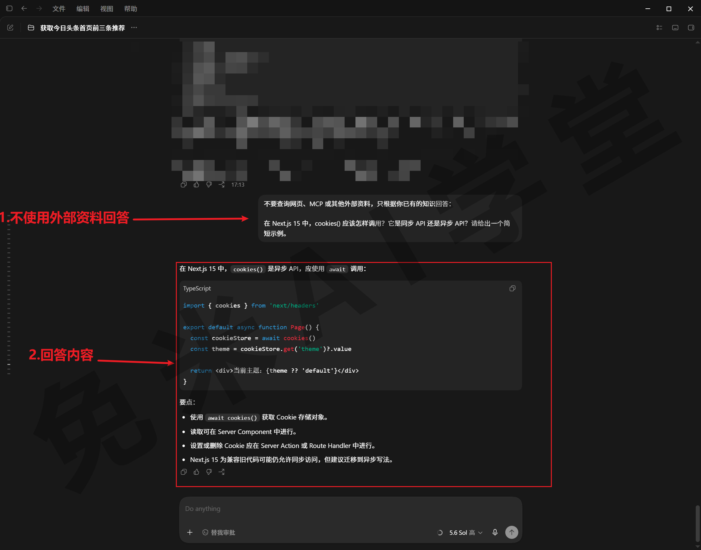

再用 Context7 查询同一个问题：

```
必须使用 Context7 查询 Next.js 15 的相关文档后回答：
在 Next.js 15 中，cookies() 应该怎样调用？它是同步 API 还是异步 API？请给出一个简短示例。
回答中注明 Context7 选中的库 ID、文档版本和资料来源；
如果无法确认版本或来源，请明确说明，不要把结果直接称为官方文档。
```

执行过程中，Context7 通常会先解析库名、选择匹配的库 ID，再查询相关文档。当前工具名称可能显示为 `resolve-library-id`、`query-docs` 或相近名称，以实机界面为准。

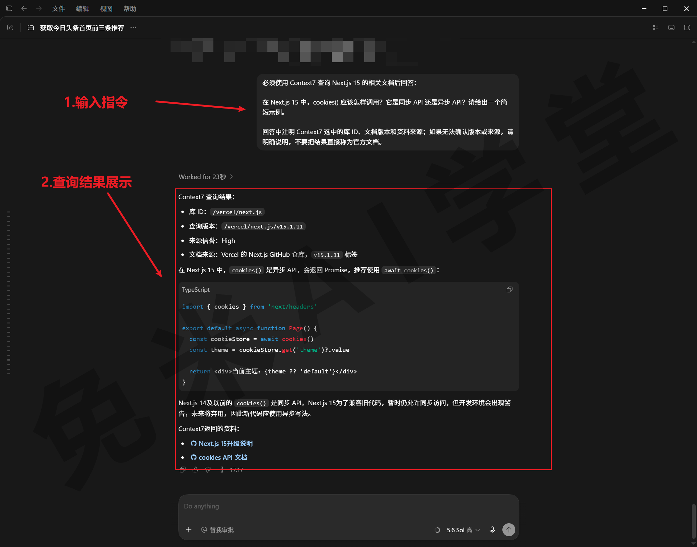

最后对照两次答案，重点观察四项：

- 是否明确区分版本；
- API 签名和示例是否一致；
- 是否说明资料来源；
- 遇到不确定信息时是否主动保留结论。

直接回答可能受到训练数据时间和版本混杂的影响；Context7 则可以提供当前索引中的版本化文档作为依据。不过，有依据不等于一定正确，仍要核对库 ID、版本和来源信誉。

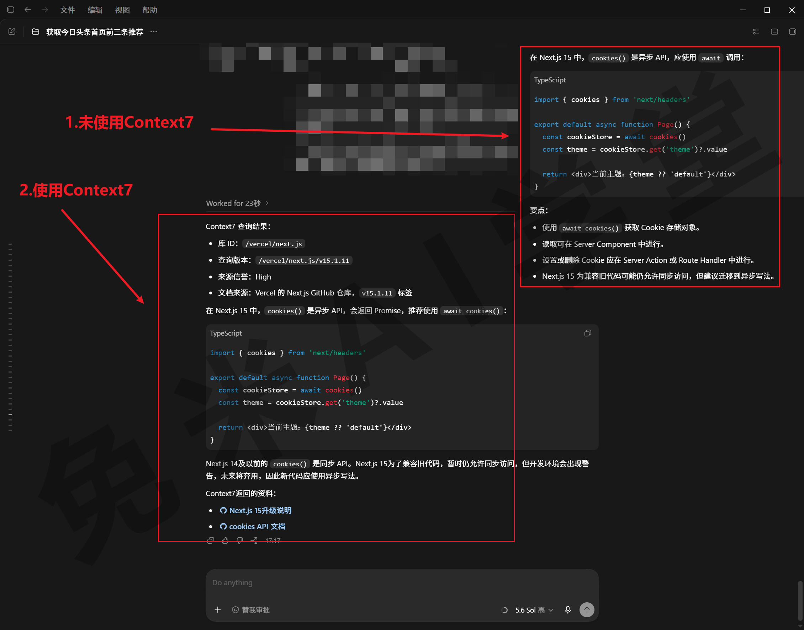

**安装了，不代表每次都会自动调用**

Context7 安装并启用后，Codex 仍会根据问题、工具说明和当前上下文决定是否调用。没有调用不一定代表服务器故障，也可能是问题看起来不依赖外部资料，或者指令没有明确要求检索。

需要文档依据时，最直接的办法是在指令中明确写：

```
必须使用 Context7 查询……
```

如果这是某个项目的长期要求，也可以写入该项目的 `AGENTS.md`：

```
在 AGENTS.md 中加入一条规则：
回答与本项目依赖库有关的版本差异、API 用法和迁移问题时，
优先使用 Context7 查询对应版本的文档。回答中注明库 ID、版本和来源；
如果 Context7 无法确认版本或来源，必须明确说明。
```

`AGENTS.md` 只对其所在项目及适用目录生效，并不是所有项目的全局规则。加入规则可以提高 Codex 主动调用 Context7 的概率，但服务器未连接、工具被停用、达到调用限额或管理策略禁止时，仍可能无法查询。

**进阶：把它当作文档学习助手**

Context7 更适合查询编程语言、框架和软件库的 API、配置方式、版本差异及迁移说明。例如：

```
必须使用 Context7 查询文档，讲清楚 [库名称和版本] 中 [具体功能] 的用法和常见注意事项。
回答中列出：
1. Context7 选中的库 ID；
2. 查询的版本；
3. 资料来源；
4. 最小可运行示例；
5. 文档没有明确说明的部分。
```

这类回答通常比完全依赖模型已有知识更容易核对，但不能笼统断言“比论坛一定可靠”。最终可信度仍取决于 Context7 选中了哪个库、哪个版本，以及资料是否来自项目官方仓库或官方文档站。

### 12.4 什么时候需要 MCP

**三类场景才轮到它**

工具多了，什么时候用什么要有准绳。对照官方给的判断标准，需要 MCP 的场景就三类：

- **要实时**——答案随时间变化：最新文档、当前数据、今天的状态。模型自带知识有截止日期，普通的联网搜索又未必覆盖到权威源，这类问题接上对应的信息源才答得稳。
- **要权威**——答案必须有出处、能核对：技术口径、官方规则。12.3 的对比实验演示的就是这两类场景。
- **要接外部系统**——你的数据库、公司内部服务、某个在线平台。这类能力模型本身不可能有，接口是唯一的路；顺带的好处是让 AI 直接调用工具干活，省去你在两边来回复制粘贴。

**先问技能，再想 MCP**

反过来，不在这三类里的需求，多半轮不到 MCP。判断顺序三问：先问“Codex 自己能不能干”：能干就直接下指令；再问“技能能不能教会它干”：固化流程、规范做法，用《Skills 技能系统 + 桌面宠物》的技能就够；最后才是“要不要接外部程序”。官方把这套定制体系归成互补的几层：AGENTS.md 管规矩，记忆管它该记住什么（《上下文与记忆》会讲），技能管流程，MCP 管外部系统——各管一摊，不互相替代。还有个进阶组合先记一句：技能文件里可以点名要用哪个 MCP 工具，让“流程”和“连接”配合干活，将来用到自然理解。

**装得多不等于更强**

MCP 生态热闹，别见一个装一个。每个开着的服务器都要把自己的工具说明塞进对话的上下文——服务器越多，Codex 每次要读的东西越多，额度消耗越快，挑工具还容易挑花眼。官方的建议同样克制：只在能解决真实需求时才加，从一两个开始；常用的三五个封顶，不用的关掉（设置页开关，不必删除，想用再打开）。这和《权限、沙盒与模型》里的额度习惯是同一件事：让每一分消耗都花在正事上。

**接入后花一分钟检查三件事**

任何一个新服务器接进来，长期使用前把三件事看一遍：

- **权限**——它的工具是只读还是能执行操作？只查资料的服务器风险很小；带“会改动东西”的工具的，审批弹窗来时要格外看清。
- **来源**——服务由谁提供？官方自营和知名团队的可信度高；来路不明的服务器别直接装——它的工具说明里可能藏着诱导 AI 的坏指令。这和《Skills 技能系统 + 桌面宠物》里“不知名技能先体检”是同一个习惯：拿不准，就把它的介绍页发给 Codex 分析一遍再决定。
- **数据范围**——你的什么内容会发给谁？本地形态数据留在本机；远程形态下，你的问题和相关内容会发到服务商那里。敏感内容不要发给来路不明的服务。

三件事在设置页和服务商页面上都能查到；也可以让 Codex 替你跑一遍体检，发送：

```
针对我刚接入的 [服务器名字] 做个检查：它提供哪些工具，是只读还是会执行操作；
它的能力由谁提供；我发送的什么内容会到它手里。
```

它会读配置和服务商的说明，把三件事逐条讲给你听。看完体检结果，心里有数再长期使用。

### 12.5 三个练习任务

下面三个任务把 MCP 从配置到管理练一遍。提示词可以直接复制，方括号里的内容换成你自己的。

**任务一：独立配置一个 MCP 并成功调用一次**

不靠 12.3 的手把手，独立再接一个服务器。对象推荐官方自营的文档服务器：专查 Codex 和相关产品的官方文档，免 key 免登录，而且是远程形态——正好把 12.2 的另一种连接方式练上。终端里执行（当期写法以《图文手册》为准）：

```
codex mcp add openaiDeveloperDocs --url https://developers.openai.com/mcp
```

重启并确认接通后，点名用它查一个问题，比如：

```
用 openaiDeveloperDocs 查官方文档：Codex 的 MCP 配置文件在哪里？
怎么临时停用一个 MCP 服务器？
```

完成标准：设置列表或 /mcp 里能看到它状态正常，且点名调用得到了带出处的回答。

**任务二：用它回答一个模型答不准的最新问题**

想一个和“最新版本、最新数据”有关的问题，一条指令完成对比：

```
先不查资料，凭你自己的知识回答：[你的问题]。
然后用 Context7 查官方文档再回答一次，注明引用来源，最后对比两次答案的差别。
```

完成标准：能用自己的话说出两次答案差在哪里、为什么会差。

**任务三：找到已接入 MCP 的撤销入口，说出它的数据流向**

对着你接入的任何一个服务器，确认三件事：在哪里可以停用或删除它；它的能力由谁提供；你的什么数据会发给它。先自己在设置里找，再让 Codex 对答案：

```
列出我目前接入的所有 MCP 服务器。
逐个告诉我：在哪里可以停用或删除它、能力由谁提供、我发送的内容会到谁手里。
```

完成标准：三个问题都能不看答案、各用一句话答上来。

### 12.6 本篇小结与自检

这一篇接通了第一个 MCP。最需要记住的是：**MCP 只负责沟通标准，能力来自接入的外部程序；Skills 能解决的优先 Skills，需要实时、权威的外部信息时再上 MCP。**

可以对照下面的清单检查学习结果：

- [ ] 能用插排类比说清 MCP 是什么
- [ ] 独立配置过一个 MCP 并成功调用
- [ ] 能说出它的数据流向和撤销方式
- [ ] 能说出技能与 MCP 的分工
- [ ] 知道接入后要检查权限、来源、数据范围

完成这些内容后，技能、插件、MCP 三件套的分工已经清楚。下一篇《斜杠命令全集》把全部斜杠命令一次过完。

### 12.7 新手常见问题

**Q1：MCP 和插件有什么区别？**

用起来都像给 AI 添了本事，区别在能力住在哪里。插件装进应用内部，由应用直接运行，装完即用；MCP 接的是外部程序，能力在外部，MCP 只负责双方的沟通标准。选择时不用纠结概念：插件市场里有现成的，用插件；要连接某个外部服务或系统，才考虑 MCP。顺带一个认知：两者还会搭伙——有的插件装好后会顺手带一个 MCP 服务器进来，由插件负责管理（以实际插件为准）。

**Q2：接入的服务能拿到我电脑里的什么数据？**

一般来说，它能看到的是你调用时发送给它的内容：你的问题、必要的参数，而不是整台电脑。本地形态的服务器，数据处理在本机完成；远程形态的，你发送的内容会传到服务商的服务器上。具体范围因服务而异，这正是 12.4 要求检查“数据范围”的原因。两条稳妥习惯：只接来源可信的服务；涉及敏感内容的问题，不要发给来路不明的 MCP。

**Q3：配置失败了从哪里查？**

按顺序排查四步：

- **先重启**——完全退出再启动。配置要重启后才生效，多数“失败”其实只是没重启。
- **看状态**——敲 /mcp 或进设置页，看那个服务器在不在列表里、启用没启用，有报错提示先读一遍。
- **交给 Codex**——把报错截图或原文发回对话让它诊断，必要时让它直接替你重装，这是官方背书的姿势。
- **核对写法**——老教程里的命令和字段可能已经过时，对照《图文手册》的当期写法检查一遍。

本地形态反复起不来的，还有 12.3 说过的最后一招：换远程形态。

**Q4：免费的 MCP 服务可靠吗？**

免费与可靠是两回事，判断还是 12.4 那三件事：提供方是谁——官方和知名团队的服务可信度高；要不要 key 或登录——涉及账号身份的服务要更谨慎；数据范围清不清楚。另外，知名服务的免费档位通常有用量限制，超出可能限速或要求付费，规则以服务方说明为准。收录社区内容的服务（比如文档库收录了社区贡献的文档）不对内容的准确性打包票，发现可疑内容可以用它提供的举报渠道反馈（以服务方页面为准）。


