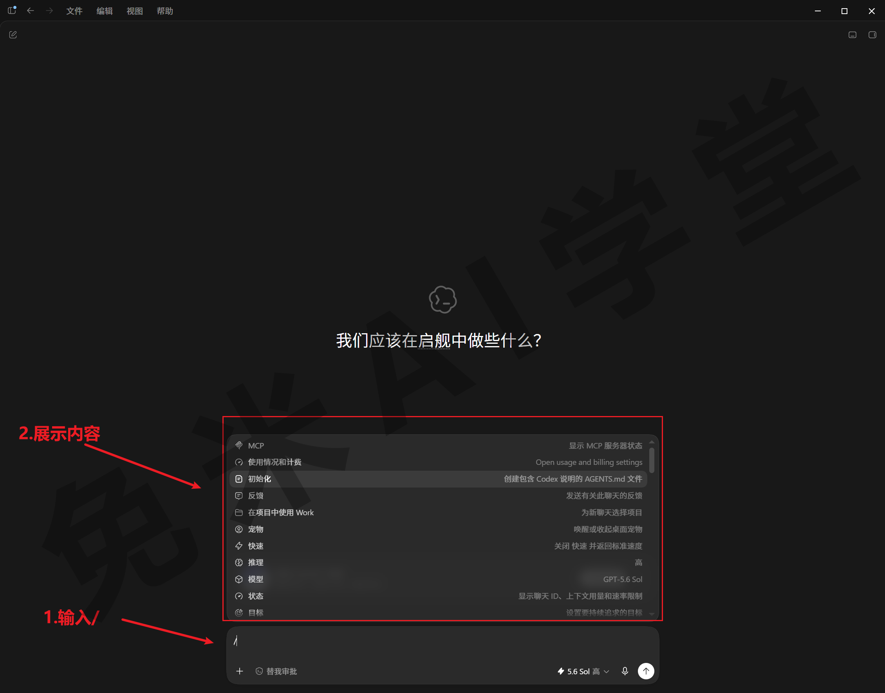
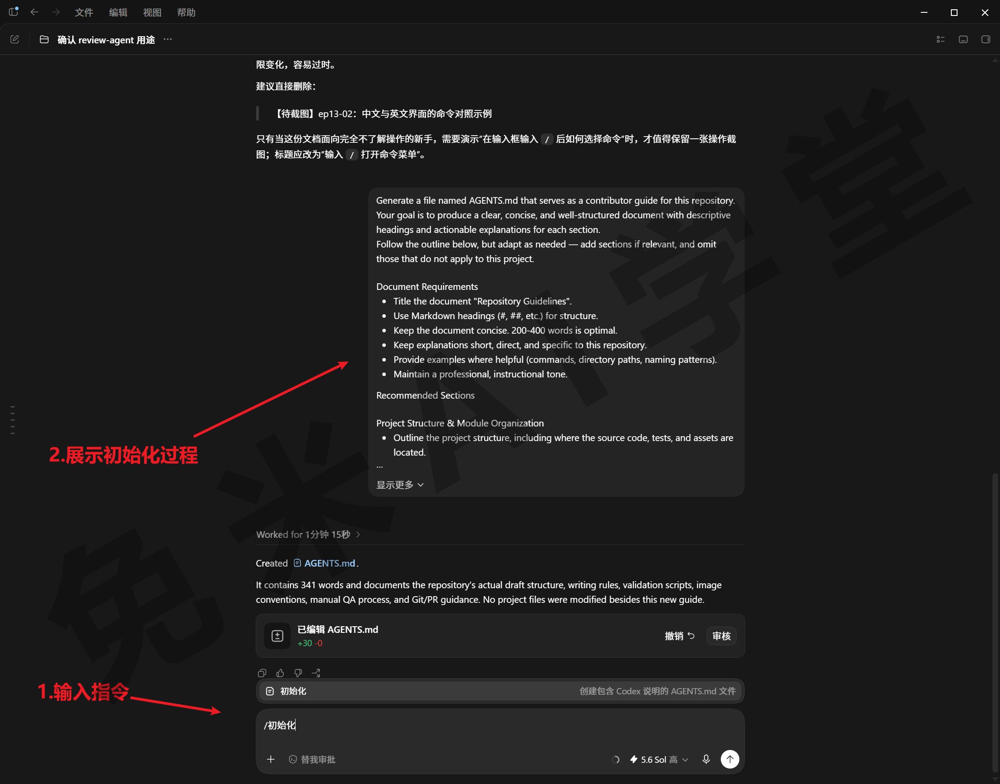
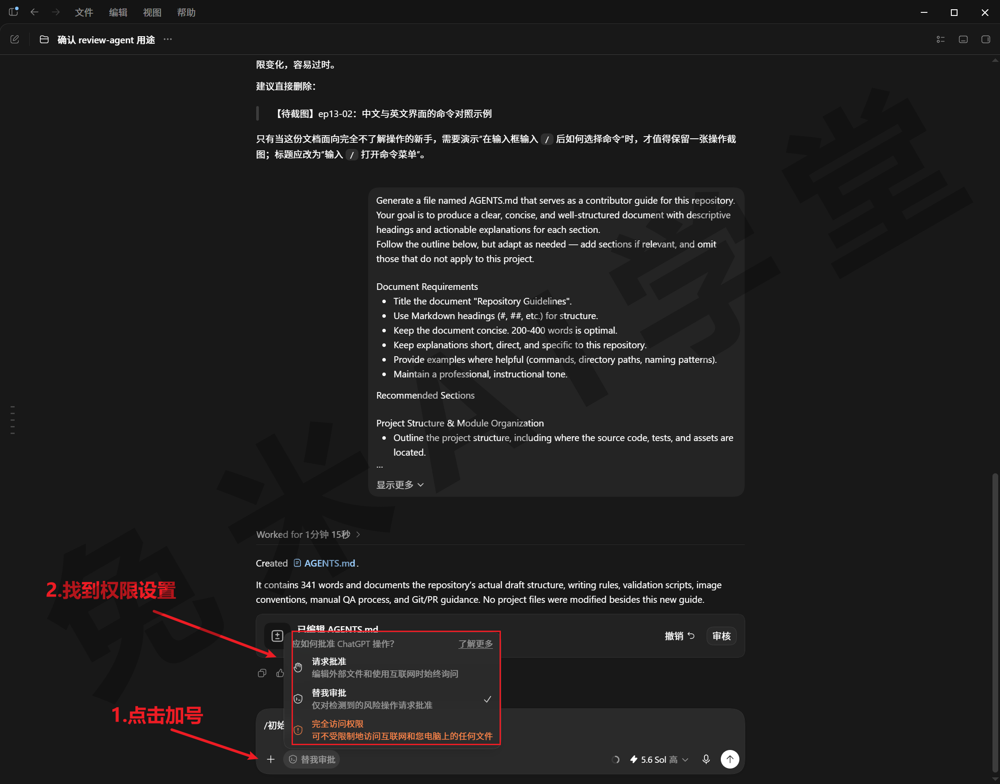
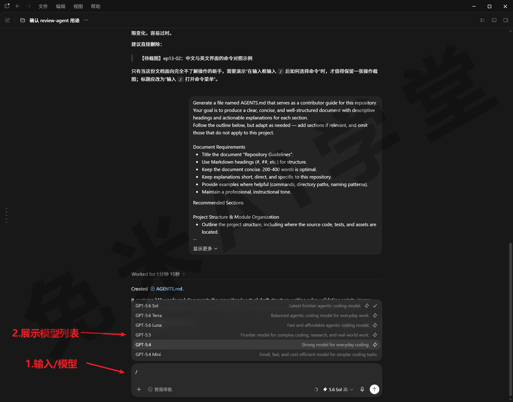
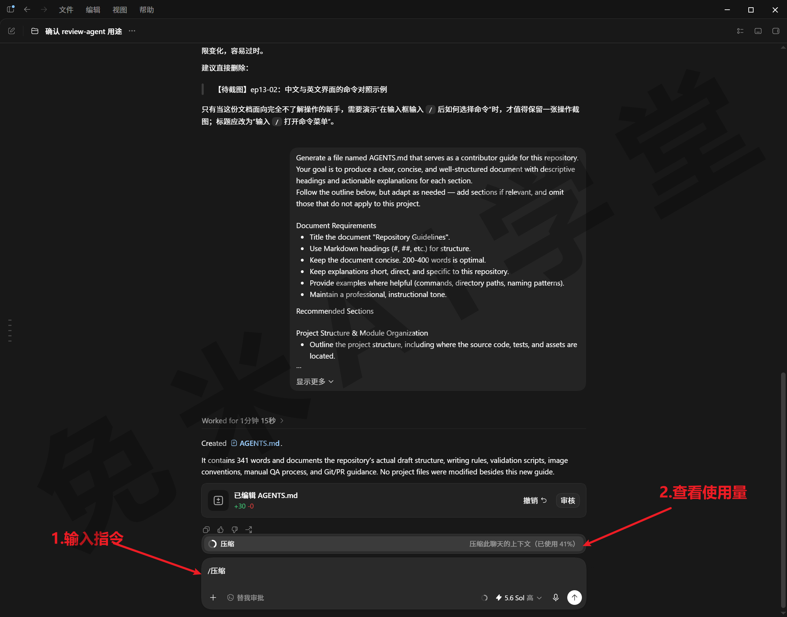
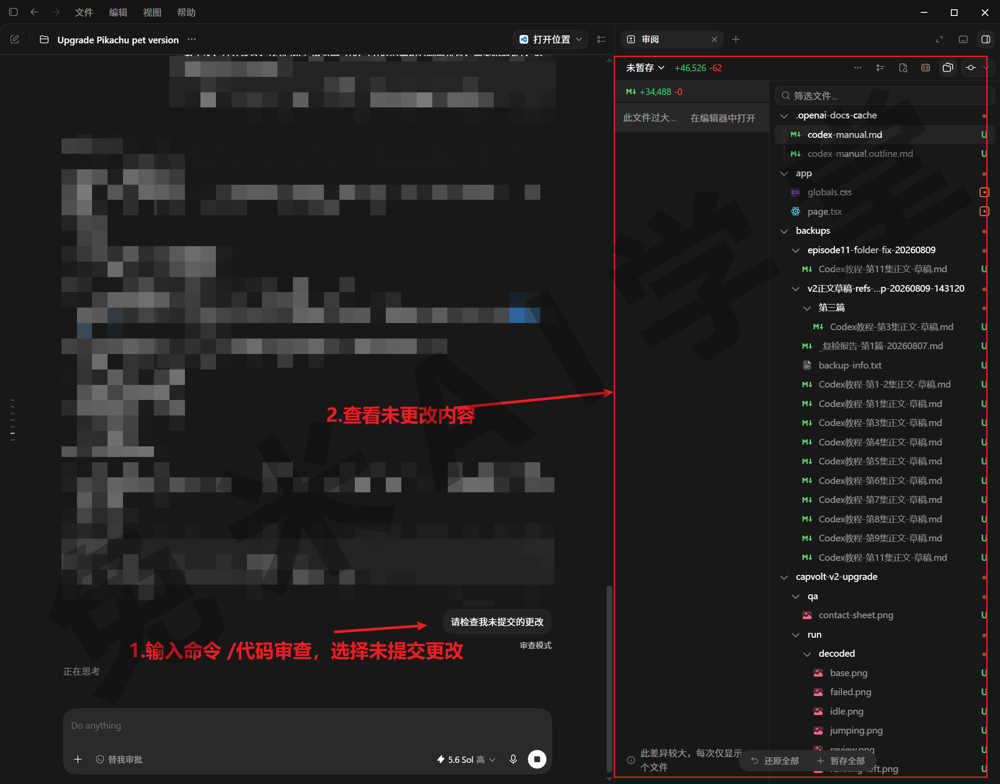
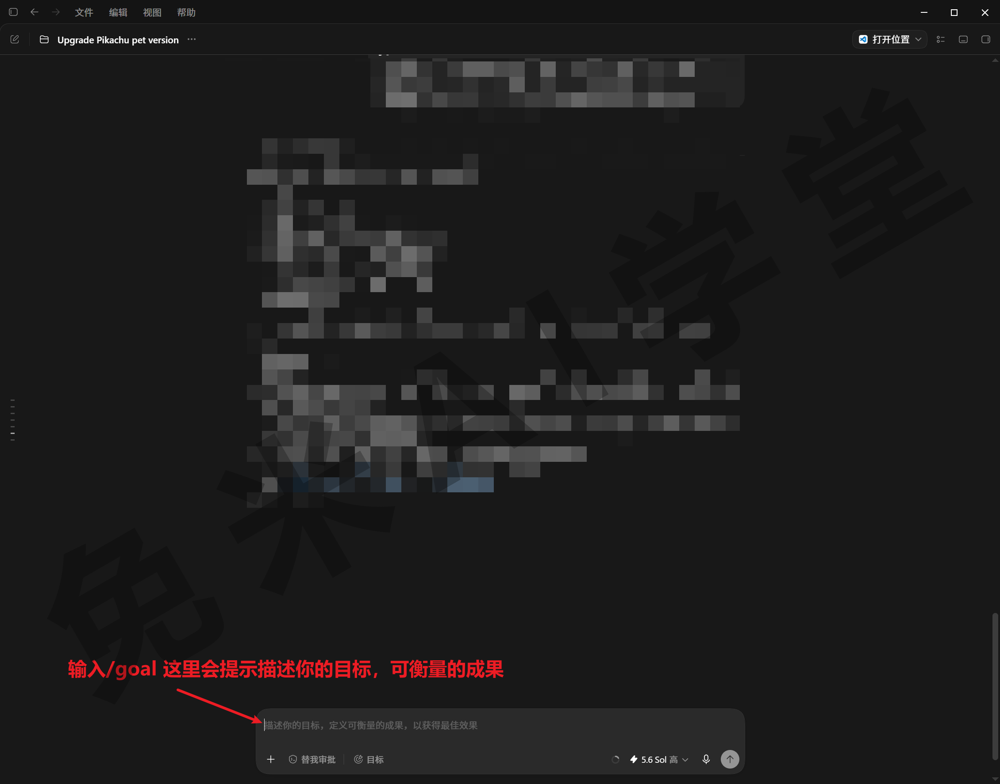
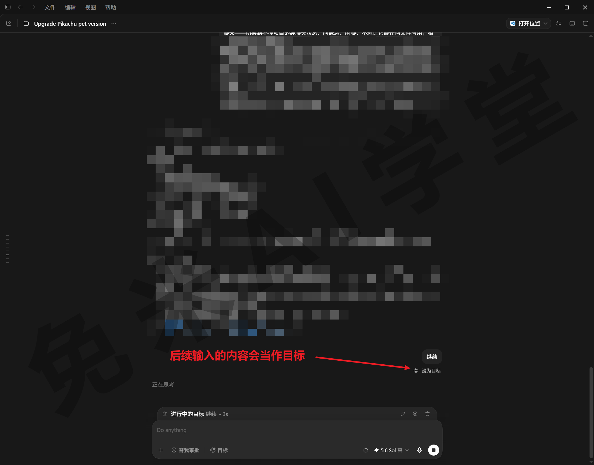

## 斜杠命令全集

《MCP 全解》补全了技能、插件、MCP 三件套，这一篇盘点最后一类快捷入口：斜杠命令。前面各篇里它零星出现过几次——查额度的 /状态 你已经用得很熟。这一篇把命令面板一次过完，但不用背清单：按使用场景记住它们就够——开工用哪些、救场用哪些、收尾用哪些。

### 13.1 命令面板与全量清单

**斜杠命令是什么**

斜杠命令是以 / 开头的快捷指令，每条命令对应一个固定操作：查看额度、压缩对话、开关某个功能。它和用自然语言下任务不同——命令不需要 AI 理解你的意图，选中即执行，没有歧义，速度也快。可以把它理解成应用的快捷键，只是形式是文字。

到这里，输入框的三个前缀就都认识了，分工各管一摊：@ 唤文件和插件，`$` 唤技能，/ 唤命令。三个都是“输入一个符号、弹出一张列表”的用法，肌肉记忆完全相同。

**怎么唤出与使用**

在输入框输入 /，命令面板弹出：可用命令列在这里，每条旁边有一句简短说明（面板样式与文案，需实机验证）。基本操作有三种：

- **键盘选择**——上下键挑中一条，回车执行。
- **输入筛选**——继续打字，列表实时过滤。中文界面输入“状”，很快就能定位到“状态”；输入英文名同样能唤起对应命令，例如输入 /goal 能唤出“目标”。
- **鼠标点选**——直接单击某条命令。

执行后的表现分两类：有的立即给出结果（例如查额度），有的弹出一个选择框或开关一个状态（例如选模型、开计划模式），跟着界面走即可。



**你看到的清单，和别人的不一样**

用这个面板前，先建立三个预期，能省掉后面大半的困惑：

- **文档列的是保底子集，面板里的才是全集。**官方文档的命令表更新常常滞后于应用本身，别拿任何一张表（包括本篇）当标准答案；输入 / 看到什么，你的版本就有什么。
- **清单因环境而变。**不少命令带出现条件：有的看当前模型支不支持，有的看相关功能开没开，有的看你的项目形态。列表里找不到某条命令，先想“条件没满足”，不用急着重装。
- **技能也混在里面。**列表尾部通常有一个技能分组，已启用的技能会以命令形式出现（比如生图技能对应一条 /imagegen 这样的条目）；这是给你多一个入口，技能的正牌入口仍然是 `$`（《Skills 技能系统 + 桌面宠物》定下的分工不变：@ 唤插件，`$` 唤技能）。

命令还会随版本增减、改名。将来面板里出现本篇没讲过的新命令，不必紧张：旁边有说明文字，看一眼、找个小场景试一次，就纳入自己的工具箱了。

**中英文名对不上？查这张表**

一个实用信息：界面语言不同，命令显示的名称不同。本课程全程用中文界面演示，但你在网上看到的教程几乎清一色按英文名讲——记 /status 的多，写“/状态”的少。遇到外部资料对不上号时，查下面这张对照表（按当前版本语言包整理，最终以实际界面为准，需实机验证）：

| 中文名 | 英文名 | 一句话功能 |
| --- | --- | --- |
| 状态 | Status | 查看对话信息、上下文占用与额度限制 |
| 压缩 | Compact | 把长对话浓缩成摘要，腾出上下文空间 |
| 批准 | Approve | 批准一次被自动审查拒绝的操作重试 |
| 初始化 | Init | 给项目生成 AGENTS.md 说明文件 |
| 计划模式 | Plan mode | 开启或关闭计划模式 |
| 目标 | Goal | 设一个让它持续推进的目标 |
| 模型 | Model | 选择当前对话用的模型 |
| 推理 | Reasoning | 选择推理力度挡位 |
| 个性 | Personality | 选择回应风格 |
| 记忆 | Memories | 配置本对话是否使用、生成记忆 |
| 项目 | Project | 为新聊天选择所属项目 |
| 宠物 | Pet | 唤醒或收起桌面宠物 |
| 反馈 | Feedback | 向官方发送反馈 |

**先记六个动作就够**

命令不需要专门记。真正值得刻意记住的只有六个动作，按三个场景组合：开工三连、救场两招、收尾一招。下一节逐个讲透；其余命令放在 13.3 过一遍，知道有这么回事，用到时输入 / 就能找到。

### 13.2 场景化串讲：开工、救场、收尾

以下名称按中文界面的常见显示书写，具体以你界面里的为准。每个动作讲清三件事：什么时候用、怎么用、做完会看到什么。

**开工三连：新项目开始时依次过一遍**

**第一连：初始化。**

```
/初始化
```

新建项目后的第一件事，或者把别人给的文件夹、久未打理的旧文件夹设为项目之后，输入 / 选“初始化”。它会查看项目的结构和内容，生成一份 AGENTS.md——《AGENTS.md、Diff 与还原》讲过的规矩文件，从此它认识这个项目、也有了办事章程。为什么要先做这一步：有了这份章程，它每次干活都先按你项目里的规矩来，不用你每次重新交代。不初始化也能用，但它对项目的理解只能靠每次现场摸索，你交代过的规矩也没有地方沉淀，项目一大就容易跑偏。执行完能在项目里看到新生成的文件；如果项目里已经有 AGENTS.md，它会自动跳过并提示，不会覆盖你写好的规矩（跳过提示的文案，需实机验证）。



**第二连：定权限。**开工时按《权限、沙盒与模型》的原则想一遍：这个文件夹里的东西有多重要、这次任务需要它做到什么程度。当前版本里，权限切换不在斜杠列表里，而是输入框旁边的权限控件：点开下拉，在三档之间选择：“请求批准”“替我审批”“完全访问权限”，没有自定义项（名称以实际界面为准）。练习用的文件夹可以放宽，存重要资料的项目从严。



**第三连：选模型。**

```
/模型
```

输入 / 选“模型”，按任务复杂度定一个基准：日常任务从中间挡位开始，确实复杂再换高挡（挡位与额度的关系见《权限、沙盒与模型》）。旁边还有一条独立的“推理”命令，管的是同一模型花多大力气想——两条分开记：模型定“用谁”，推理定“多用力”。开工时定好基准，之后整个对话沿用，不必每条消息都想一遍。



三连做完，一个新项目的工作环境就绪：它认识了项目，权限定了边界，模型定了基准。

**救场两招：对话出状况时用**

**第一招：压缩。**

```
/压缩
```

当你跟 Codex 的对话越来越长，AI 就会开始忘掉前面给过的要求，回答质量会明显开始下降。这时输入 / 选“压缩”，它把前面的对话浓缩成一份摘要：要点保留、细节合并，腾出空间继续聊；命令的说明文字里通常还能看到当前上下文已用的百分比，顺手就能判断该不该压（显示形态以实际界面为准）。还有一个使用细节：任务正在执行时，压缩一般用不了，界面会给出提示，等这一轮任务结束再压就可以。《计划模式》里讲过，任务执行中新发的指令会先排队、等本轮结束，压缩遇到的是同样的处理。至于压缩的原理、什么时候该压、压之前要做哪些保险动作，《上下文与记忆》会专门展开；这里你先记住：遇到上面这种情况，就用这条命令。



**第二招：批准。** 当某次操作被自动审查拒绝、任务因此停止时，可以输入 / 选“批准”（`/批准` 或 `/approve`）——操作被拒绝以后，用这条命令批准它，让它再重试一次。该命令仅在自动审查开启时可用。它不处理普通权限确认；如果任务显示“等待你确认”，应回到对话中的审批卡片进行同意或拒绝。记录选择方式、无记录时的提示文案及重试后的审查行为，以实际界面为准（无驳回记录时的空态提示与选择交互，需实机验证）。

**收尾一招：任务结束时用**

**代码审查。**任务完成后，输入 / 选“代码审查”，让它替你核对这批改动。会先弹出两个范围选项：审查未提交的更改（日常用这个），或与某个基础分支比较（协作场景用，现阶段知道即可）。它按问题的严重程度报告发现，只报告、不动你的文件。这和《AGENTS.md、Diff 与还原》里用过的审查入口是同一个能力，那一篇欠的“全量盘点”在本篇补上了。建议养成固定习惯：任务完成先审查，确认无误再进入下一件事；发现改错了，小问题在 Diff 里手工调，大问题用一键还原退回重来。



到这里六个动作讲完。它们覆盖一次任务的完整节奏：开工前把环境定好，中途出状况有对应的救场手段，结束后核对成果。按场景绑定记忆的好处是，遇到状况时想得起来用，比背清单可靠。

### 13.3 其余命令逐条过

剩下的命令按用途分组过一遍，每条记住“是干什么的、什么时候用”即可。名称与完整清单以当前版本面板为准。

**查询与状态类**

- **状态**——查看额度余量、上下文占用和对话信息，全课使用频率最高的一条，《权限、沙盒与模型》里用熟了。建议的习惯：开始大任务前先看一眼余量，别让任务跑到一半断粮。偶尔点了没反应，再点一次就出来（属已知小毛病，以实际表现为准）。
- **MCP**——显示已接入的 MCP 服务器和启用状态，《MCP 全解》里用过。记住那条老提醒：弹窗的“关闭”只是关窗口，不是停用服务器。

**对话调优类**

- **个性**——选择它的回应风格，常见“友好”和“务实”两种：前者温暖贴心，后者简洁直接（选项与模型支持情况以实际界面为准）。设置的个性化分区里有同款默认项，命令是快捷入口。
- **推理**——切换推理力度挡位，13.2 提过它和“模型”分工。参考用法：写文案、想方案这类要斟酌的活挡位往上调，机械性的整理任务用默认就够。
- **快速**——部分模型提供的加速档，响应更快、额度消耗也更高，而且开关状态会保留。用完记得切回标准，别让它一直开着白烧额度（是否出现、名称与耗量，随模型与版本而定）。
- **记忆**——配置当前这一个对话用不用已有记忆、要不要生成新记忆。注意“使用记忆”在对话开始后就改不了，要在开聊前设好；记忆体系的全貌在《上下文与记忆》。

**项目与任务类**

- **项目**——为新聊天选择所属项目：面板里这一条显示为“在项目中使用 <当前项目名>”，说明文字写明“为新聊天选择项目”——改的是新聊天的默认归属，不影响当前对话；列表里还有“无项目”一类选项。多项目并行时，不动鼠标就能切换。
- **聊天**——切换到不挂项目的纯聊天状态：问概念、闲聊、不想让它碰任何文件时用，相当于给它收走了文件权限。
- **目标**——给它设一个持续努力的方向（例如“把这个项目的文档补全”）。设好后输入框上方会出现目标进度行，暂停、恢复、编辑、清除都在那一行上点；列表里找不到这条命令，多半是相关功能开关没开，属于“清单因环境而变”的活例子。
- **计划模式**——开关计划模式，和界面上的开关等效，《计划模式》的正主，这里只是多一个入口。





**其他类**

- **宠物**——唤醒或收起桌面宠物，《Skills 技能系统 + 桌面宠物》结尾提过的那条 /pet 就是它。
- **反馈**——向官方发送问题反馈，可以附上日志，发送后生成一个反馈编号。遇到疑似产品缺陷、界面异常时用它，让官方能定位你的上下文。

**认知一提：运行位置类命令**

列表里可能还有一批和“对话在哪里跑”相关的命令：本地运行、工作树、云端运行、派生、侧边这类。它们与《自动化、Git 与远程操控》讲的工作树、云端能力是同一套体系，那一篇看完自然明白；现阶段不用动它们。另外，外部教程里常见的 /diff、/mention、/quit 是终端版（CLI）的专属命令，桌面应用里没有——对应的事用 Diff 面板和 @ 就能办，这再次说明：别人清单里的命令未必出现在你的界面里，一切以你输入 / 后实际看到的为准。

### 13.4 三个练习任务

下面三个任务把场景化用法练熟。提示词可以直接复制。

**任务一：用“开工三连”初始化一个新项目**

在桌面新建一个空文件夹设为项目，依次做完三连：/ 选“初始化”生成规矩文件；点输入框旁的权限控件选一档合适的权限；/ 选“模型”定一个基准挡位。然后发一个小任务确认环境正常：

```
在当前项目里新建一个名叫“命令测试.txt”的文件，内容写上：开工三连已完成。
```

完成标准：三个动作都完成了，能说出各自做了什么；小任务正常执行，项目里出现了那个文件。

**任务二：在一个长对话里完成一次压缩**

找一个聊得比较久的对话（没有合适的就用《计划模式》名片站那条），先看一眼“压缩”命令旁显示的用量，执行压缩，然后发送：

```
回顾一下：这个对话里我们最早确认过的几条要求分别是什么？
```

完成标准：压缩完成、用量明显回落，抽查问题答得上来，能说出压缩解决什么问题。

**任务三：给三个场景各说出该用哪个动作**

不看面板，回答三个场景：①新建项目后的第一件事；②它说某个操作被自动审查拒绝了，你确认无害想放行；③任务完成，想核对这批改动有没有问题。

参考答案：①初始化（开工三连第一连）；②批准；③代码审查。

完成标准：三个都答对，并能补上“什么时候不该用”——比如错过审批弹窗时该回对话找审批卡片，而不是用“批准”。

### 13.5 本篇小结与自检

这一篇过完了全部斜杠命令。最需要记住的是：**命令不用背——记住开工三连、救场两招、收尾一招，其余的用到时输入 / 就能找到。**

可以对照下面的清单检查学习结果：

- [ ] 会用命令面板找到需要的命令
- [ ] 用“开工三连”初始化过一个项目
- [ ] 用过压缩和批准两条救场命令
- [ ] 收尾时用审查命令核对过改动
- [ ] 给出场景能说出该用哪条命令

完成这些内容后，常用命令已经各就各位。下一篇《上下文与记忆》解决长对话的老问题。

### 13.6 新手常见问题

**Q1：命令记不住怎么办？**

不需要记。输入 / 就能看到全部命令，接着打字还能筛选；真正高频的就是三组六个动作，用几次自然就熟了。另外，绝大多数命令对应的事，用中文说需求也能完成——命令只是更快、更准的快捷方式，忘了命令不影响完成任务。

**Q2：中文界面和英文界面的命令不一样吗？**

功能一一对应，显示名称不同。中文界面显示中文名，英文界面显示英文名；网上教程多按英文名讲，对不上号时查 13.1 的对照表。拿不准时输入 / 看当前列表最可靠，本课程全程以中文界面演示。

**Q3：列表里怎么没有别人截图里的那条命令？**

三个可能，按序排查：

- **条件没满足**——不少命令看模型、功能开关或项目形态，比如“目标”要开对应功能、“快速”要看模型支不支持。
- **版本差异**——命令随版本增减改名，别人的截图可能新于或旧于你的版本。
- **不属于桌面应用**——CLI 终端版的命令表比应用长得多，外部教程常混着讲，在桌面应用里自然找不到。

结论不变：以你输入 / 看到的列表为准。

**Q4：快速档什么时候值得用？**

三个条件同时满足再用：赶时间、任务简单明确、对输出质量没有极致要求。它换来响应速度，付出更高的额度消耗，而且开关会保留，用完要记得切回标准。日常保持标准速度，把快速留给真正着急的时刻。

**Q5：用命令和直接说话有什么区别？**

多数场景两者都行，差别在效率和确定性。命令是精确入口：一条命令只做一件事，没有理解歧义，适合查状态、开关功能这类系统操作；说话更灵活，适合描述复杂需求。建议系统操作用命令，业务需求用说话，两者本来就是配合关系。

