## 上下文与记忆

用得久了你可能已经发现：同一个对话聊得越久，AI 越容易忘掉前面说过的要求，回答也开始跑偏。这不是它状态时好时坏，背后有一套确定的机制。

这一篇先讲清上下文是什么、为什么会越聊越乱；再给出压缩与开新窗口两套处理手段；最后配置好三级记忆，让长期偏好一次设置、处处生效。

### 14.1 上下文：AI 的工作记忆

**上下文是什么**

上下文（context）指 AI 当前能看到的全部信息：你们这个对话里说过的话、它读过的文件内容、执行任务的过程记录，都算。可以把它理解成 AI 的工作记忆，或者一张办公桌：所有正在处理的材料都摊在这张桌上。这个术语后面会经常出现，理解成“它眼前的信息”就可以，不必专门背。

**有效上下文有上限**

这张桌子有大小限制：模型一次能装下的信息量存在上限。总容量里还要预留一块给输出，真正留给“当前能看到的信息”的有效值更小一些。具体数字随模型与版本变化，不必记死，以录制时的模型口径为准。你只需要记住一件事：上限存在，而且长对话真的会碰到它。

这里容易和《权限、沙盒与模型》讲过的**额度**搞混：额度管的是你这个账号还能用多少；上下文管的是**当前这一场对话**眼前还能装多少。额度没耗尽，对话照样可以因为上下文爆满而开始忘事——两本账要分开看。

**先打开用量显示**

现行版本里，上下文用量指示器默认是关闭的。要先去设置里打开，小圆圈才会出现在输入框附近：

1. 打开设置。
2. 进入“常规”（General）分区。
3. 在“编辑器”小节里找到“显示上下文窗口使用情况”（Show context window usage）（中文文案以实际界面为准）。
4. 打开开关。回到对话后，输入框附近会出现一个逐渐填满的小圆圈（donut），用来观察当前对话用掉了多少上下文。

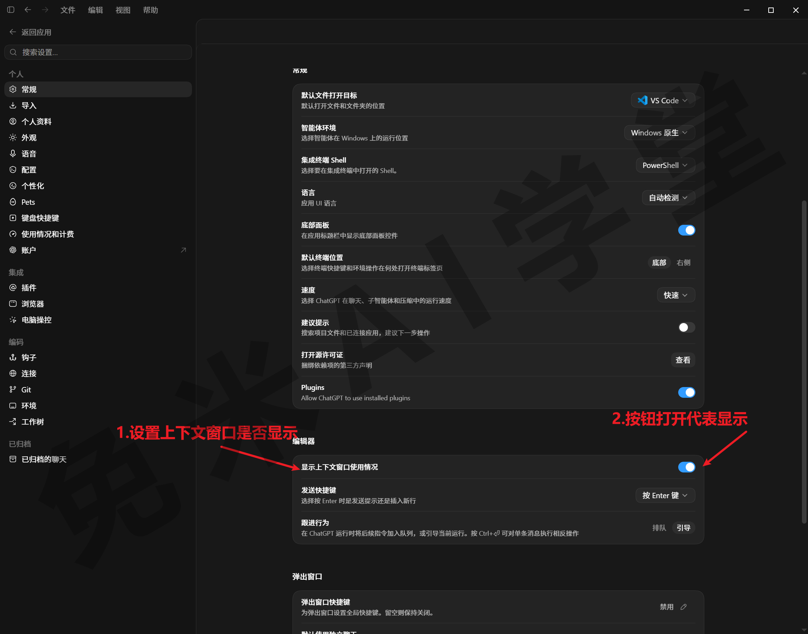

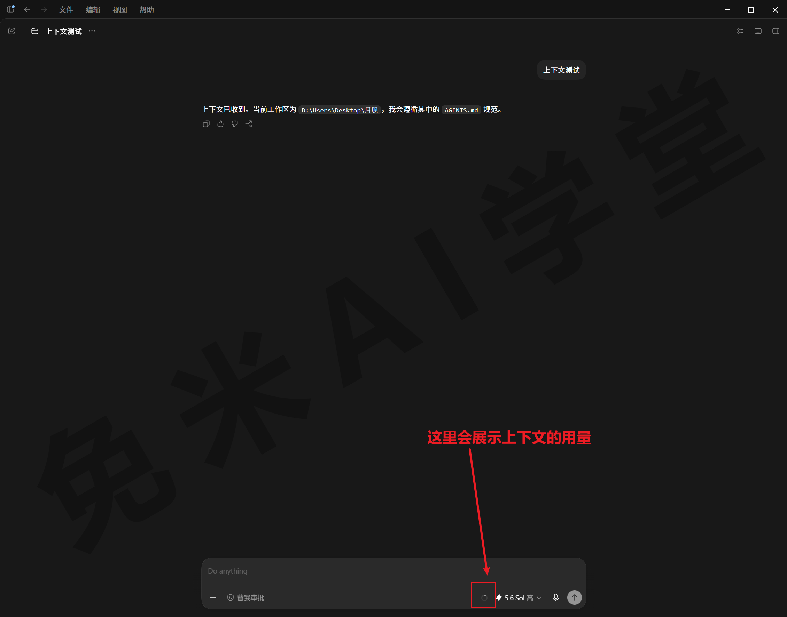

个别版本里，退出登录后再登录，这个开关可能被重置；也有过指示器暂时消失的情况。找不到小圆圈时，先回设置确认开关是否仍为开启（以当前版本实测为准）。悬停或点击小圆圈时，有的版本会弹出更细的占用说明，有的只显示图形进度——以你屏幕上实际表现为准，不必强求某个百分比数字。

另一条查看入口：在输入框输入斜杠，选“状态”（`/状态` 或 `/status`），会弹出临时面板，里面通常能看到任务状态、上下文占用与限额相关信息（Windows 上偶尔要点两次才弹出，以实际表现为准，需实机验证）。日常盯进度用小圆圈就够；想核对更完整的对话状态时，再开一次“状态”面板。

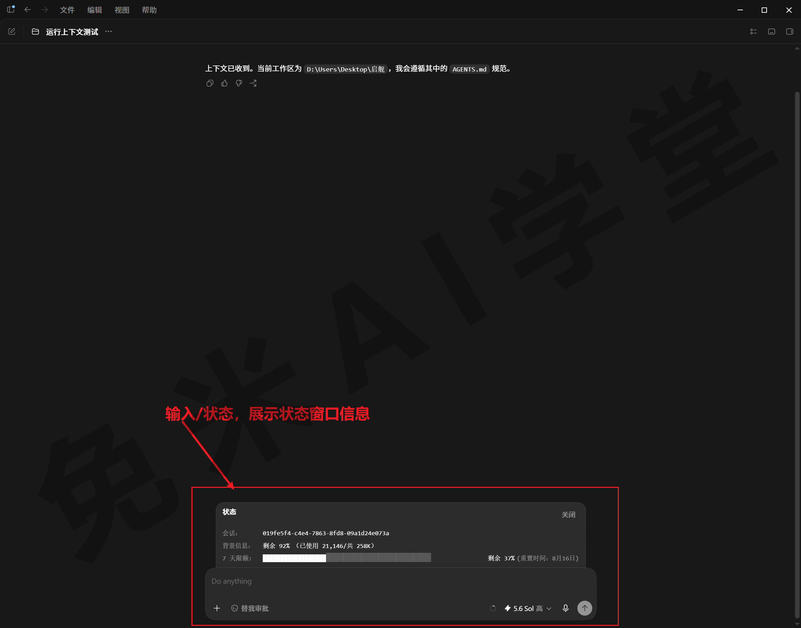

**越聊越乱的原理**

明白了上限，“越聊越乱”就好解释了。可以拿吃饭打个比方：AI 要答好你现在的问题，得知道以前聊过什么——好比服务员记得你前天说过不喜欢某道菜。传统做法是只回溯最近几轮；更早的内容一旦被挤出桌子，它就真的“看不见”了。这套原理几乎所有大模型都通用，不是 Codex 独有的脾气。

落到现象上，常见有两种：

- **早期信息被挤掉**：上下文装满后，为了装下新内容，最早的信息会被挤出去。你在对话开头提的要求，它后来“忘了”，是因为那段内容它真的看不到了。
- **无关信息稀释注意力**：即使没装满，一个对话里塞了太多不相干的话题，相关信息的密度就低了，它更容易被无关内容带偏。

还有一个连带现象：上下文越长，每一轮它要处理的信息越多，响应往往会变慢，额度消耗也更快。不是电脑坏了，是该压缩或开新窗口了。

所以对话质量的关键在于：当前对话里装的尽量都是相关信息。聊得多并不等于聊得好。接下来的两个手段都围绕这一点。

### 14.2 压缩与开新窗口

**压缩：给对话瘦身**

压缩（compact）是把前面的对话浓缩成一份摘要：要点保留，细节合并，腾出上下文空间。官方说法是：用一段简洁摘要替换较早的对话轮次，在保留关键细节的同时释放上下文。《斜杠命令全集》的救场命令里已经见过它。桌面端常见有两条入口（名称与位置需实机验证）：

- 输入框输入斜杠，在命令列表里选“压缩”（`/压缩` 或 `/compact`）。
- 在对话的上下文菜单里选“压缩此对话的上下文”一类选项（菜单项是否仍在、确切文案以实际界面为准）。

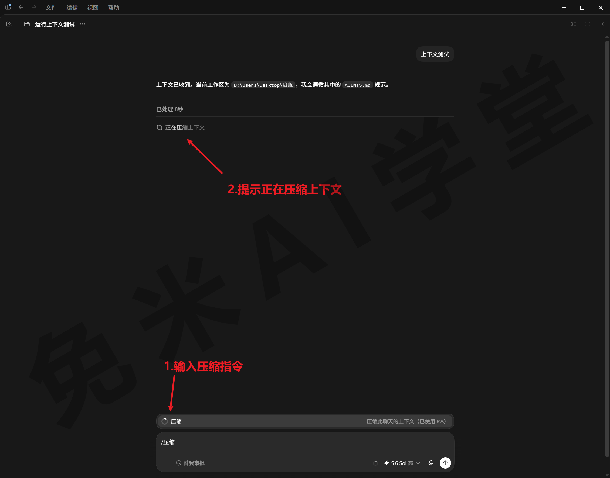

点下去之后，通常会看到对话里较早的部分被收成摘要，用量小圆圈明显回落；刚压过再立刻压一次，往往空间腾不出多少——等对话又攒了一截再压更划算。

**什么时候该手动压**

看到用量小圆圈已经接近上限，而这个对话还要继续推进，就主动压一次。经验上，用量到大约八成到九成就该动手，不要等到它开始忘事才想起来（具体占比以你看到的界面为准，不必抠死数字）。执行中的任务一般没法同时开压缩——先等当前任务告一段落再压。

系统在上下文接近上限时，也可能自动压缩。现行桌面端会出现类似“Context automatically compacted / 已自动压缩上下文”的事件条（确切中文文案与触发时机以实测为准，需实机验证）。这里有一处口径要分清：有的讲解会强调“到八九成你自己压”，也有资料写系统大约在九成附近自动压——两边说的不是同一件事。前者是**你主动干预的时机**，后者是**系统兜底触发的大致位置**；自动压缩的时机不由你控制，有时还会发生在任务中途，压完偶发跑偏或进度回退。别把希望全押在自动压缩上，主动掌握时机仍然更稳。

**保险三步：固化、压缩、抽查**

摘要不可能保留全部细节。社区里常见的翻车是：压缩后连“刚改过哪些文件”“项目规矩里写过什么”都对不上，甚至长任务进度看起来像往回退。所以长任务里养成下面三步：

1. **固化**：压缩前，把已经确认的结论和要求写成项目里的文件（例如 `阶段结论.md`，或写进项目 AGENTS.md，《AGENTS.md、Diff 与还原》介绍过）。压缩后它仍会重读项目里的规矩文件，文件比对话摘要可靠得多。
2. **压缩**：再执行压缩，观察用量明显回落。
3. **抽查**：压完后用一两个关键问题考它；答不全，就把刚写的文件发给它读一遍再继续。

文件还在，就不怕摘要漏掉关键细节。14.5 会把这三步完整演示一遍。

**开新窗口：不相关的事分开聊**

另一个手段更简单：换一件事，就新建一个对话。好处有两个：

- **更准**：新对话的上下文干净，全部空间都留给当前任务，不会被旧话题带偏。
- **更省**：上下文越短，每轮处理的信息越少，响应通常更快，额度消耗也更省。

配合《界面全导览》讲过的对话归档使用：一个任务一个对话，做完归档，需要时搜索找回。一个对话从早聊到晚、中间换了三四件无关的事，是最容易又贵又乱的用法。

**怎么选**

同一件事继续推进，用压缩；换一件事，开新对话。拿不准时问自己一句：接下来要说的内容，和这个对话前面的讨论有关系吗？没关系就新开。压缩解决的是“同一条线太长”，新窗口解决的是“线已经换了还挤在同一张桌上”。

### 14.3 三级记忆分别记什么

压缩和新窗口解决“当前对话”的问题，但有些信息你希望跨对话、甚至跨项目长期生效，例如个人偏好、项目规矩。这类信息不该依赖某一个对话的上下文，而应该交给记忆体系。

官方的分工可以记成一句话：**必须始终生效的规矩，写进 AGENTS.md 或存成文档；记忆是有用的回忆层，不是唯一靠山。** 更直白一点：AGENTS.md 塑造行为，记忆把上下文带向未来。

Codex 侧可以看成三级：

| 层级 | 界面/落盘叫什么 | 谁来写 | 何时读 | 适合记什么 |
| --- | --- | --- | --- | --- |
| 全局指令 | 设置里常叫“自定义指令”，落盘是用户目录下的全局 `AGENTS.md` | 你（或让 Codex 代写） | 每次新对话启动时构建指令链 | 跨项目的沟通偏好：回复语言、详略、默认习惯 |
| 项目规矩 | 项目根目录的 `AGENTS.md` | 你（或让它生成） | 进入该项目时按目录链合并 | 这个仓库的技术栈、约定、禁区 |
| 自动记忆 | 设置 → 个性化 → 启用记忆；本地 `memories` 目录 | 系统后台提取 | 新对话里按规则注入摘要 | 说不清但日积月累的习惯、常用工作流 |

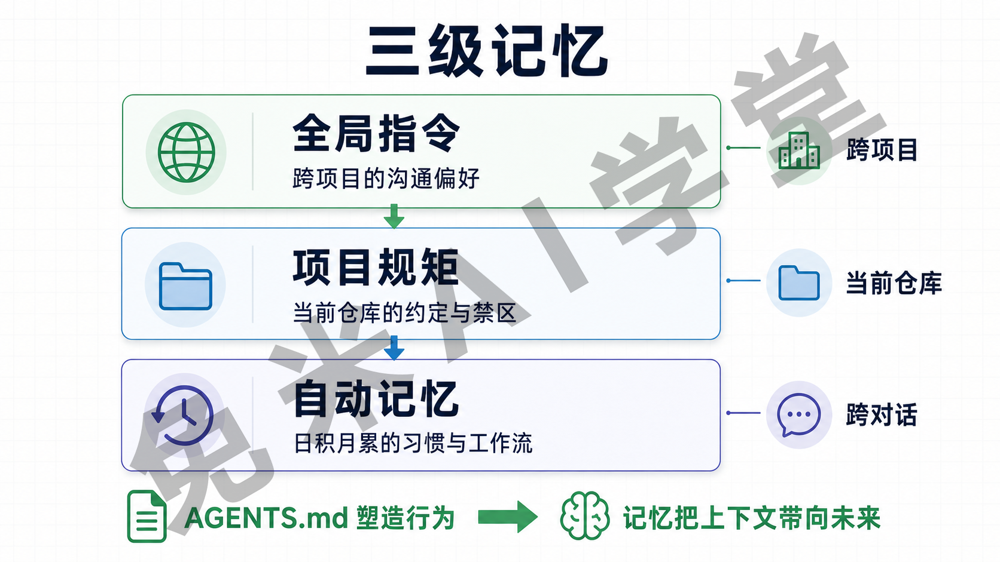

**全局指令：界面名与文件名要对上号**

设置里你看到的是“个性化 → 自定义指令”（文案以实际界面为准），保存后会同步到本机用户目录下的全局 `AGENTS.md`（Windows 一般在 `C:\Users\<用户名>\.codex\AGENTS.md`，macOS 在 `~/.codex/AGENTS.md`）。《AGENTS.md、Diff 与还原》里提过全局规矩文件，但当时只点到入口、正主留到本篇——这里就是那一层的展开。应用通常会替你建好这个文件；界面下方若出现一些英文条目，多半是 Codex 自己加的辅助说明，日常不用手改。

官方建议的分工是：

- **全局文件**管你个人的沟通偏好（例如“回复用中文”“表格用中文表头”“默认先给结论再展开”）。
- **仓库里的 AGENTS.md**管团队与代码库规则（技术栈、目录约定、禁止事项）。

指令链在对话启动时构建一次，所以改完全局指令后，要用**新对话**验证，旧对话里不一定立刻生效。临时想盖掉全局内容、又不动原文件时，同目录还可以放 `AGENTS.override.md` 一类覆盖文件——进阶用法，日常把偏好写进自定义指令即可。

项目级 AGENTS.md 的写法、合并上限、override 遮蔽等细节，《AGENTS.md、Diff 与还原》已经讲透，本篇不再重复；记住“本篇负责全局偏好与自动记忆，项目规矩回那一篇查”即可。

**怎么改、什么时候改**

- 改全局偏好：走设置里的自定义指令，或在对话里明确说“写进全局规矩”（14.5 的演示一会把两条路都走一遍）。
- 改项目规矩：直接改仓库里的 AGENTS.md，或让它按你的口述更新文件。
- 自动记忆：默认不手改文件；过时了用重置，敏感对话用对话级开关关掉生成。

前两级的共同点是：你亲手写的明文规矩，看得见、改得了、不靠系统猜。第三级是系统替你观察总结，下一节专门讲它的机制和代价。

### 14.4 自动记忆的机制与代价

**生成机制（不是实时记笔记）**

自动记忆不是你每说一句就记一句。官方口径可以压缩成三条：

- **太短不记**：活跃中的、或信息量太少的对话会被跳过。
- **搁置够久才提取**：对话空闲足够久、系统判断短期内不会再变动，才在后台从后往前压缩提取核心内容；你正聊着的那一个，反而常常暂不记。
- **额度紧张就跳过**：限额剩余百分比低于阈值时，这一轮记忆生成会被跳过，避免出现“额度还没用就先被记忆吃掉”的观感。

生成记忆时，系统会对记忆字段里的密钥一类内容做脱敏，但这是兜底，不是许可——敏感信息本来就不该写进记忆。记忆文件以明文形式存在本机，分享 `.codex` 目录前，仍应检查 `memories` 相关文件。

**为什么默认是关的**

提取记忆和使用记忆本身也要消耗额度，所以这个功能默认关闭，由你自己决定要不要打开。想让它越来越懂你、又不差额度，可以开；额度本来就紧、偏好也简单，全局指令加项目 AGENTS.md 往往已经够用。

打开路径：

1. 打开设置。
2. 进入“个性化”（Personalization）分区。
3. 打开“启用记忆”（Enable memories）。

部分地区历史上不可用（上线时欧洲经济区、英国、瑞士等有过限制）；现行页面一般写“在可用地区”，开不了时先核对本地区是否开放，先别当成故障。

配置文件进阶写法是在 `config.toml` 里打开 memories 相关特性开关；零基础阶段用图形开关即可，不必先碰配置文件。

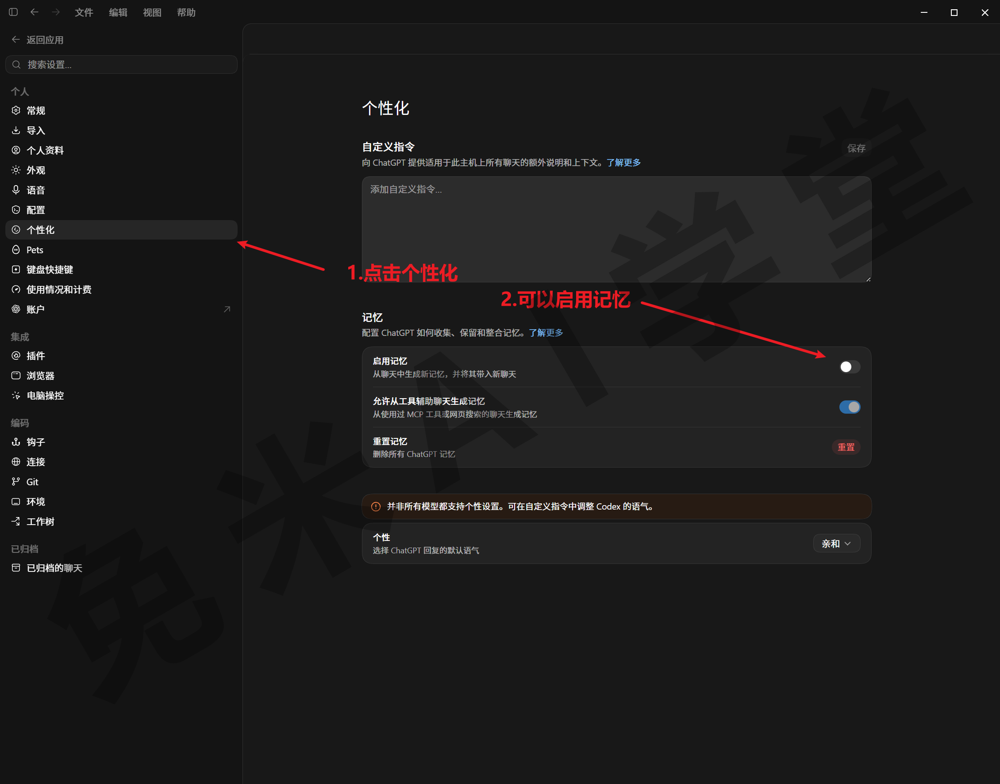

**对话级控制：`/记忆`**

《斜杠命令全集》里见过记忆类命令。在当前对话输入斜杠，选“记忆”（`/记忆` 或 `/memories`），通常可以单独决定：

- 这个对话**能不能使用**已有记忆；
- 这个对话**能不能被拿去生成**未来记忆；
- 或者保持关闭。

对话级选择不改全局设置。做敏感工作之前，把当前对话的“生成”关掉，是比事后清理更省心的做法（选项文案与交互形态需实机验证）。

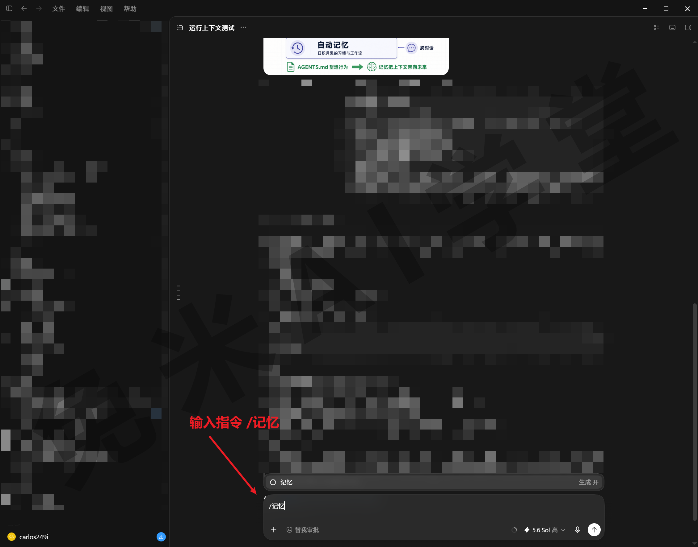

**两个配套项**

同在“设置 → 个性化”分区，启用记忆的下方还有两行配套设置，前面打开记忆时的设置页截图里就能看到（条目名称以实际界面为准）。

**允许从工具辅助聊天生成记忆**——控制要不要从使用过 MCP 工具、网页搜索等外部内容的对话里生成记忆。这类对话混着大量外部资料，页面内容还可能不可信（《内置浏览器全解》专门讲过这一点），敏感或外部资料占比高的工作场景，把这个开关关掉更稳妥。配置文件里有对应的进阶写法（`memories.disable_on_external_context` 一类配置项），零基础阶段用图形开关就够，不必去碰。

**重置记忆**——把已积累的记忆整体清空重来，按钮旁写明会删除所有记忆。项目大换方向、旧偏好反复被错误引用时用它。记忆文件属于系统生成的状态，不建议把手动修改 `memories` 目录当成常规控制手段——过时了就重置，或按上面对话级的办法关掉使用。

**自动记忆不会立即生效**

自动记忆在后台异步生成：对话需要闲置一段时间后才可能被提取，内容太少或额度紧张时也可能跳过。刚说完“记住以后都用中文表头”，立刻新建对话验证，失败并不代表功能异常，而可能是记忆尚未生成。需要立即、稳定生效的要求，应写进全局指令或项目 `AGENTS.md`。

长期未使用的记忆还会逐渐被淘汰，具体周期随版本和配置变化，不必记住固定天数。项目方向改变或旧偏好不再适用时，先用 `/memories` 在对话级关掉对已有记忆的使用，需要彻底清零就用上面的“重置记忆”。

**决策清单：什么写规矩，什么交记忆**

- **必须稳定生效的要求** → 写进规矩。跨项目通用的写进全局指令，项目专属的写进项目 `AGENTS.md`。这些内容清晰可见、方便修改，也不依赖后台记忆提取。
- **有帮助但不要求每次生效的经验** → 交给自动记忆。例如系统从长期使用中逐渐总结出的工作习惯和常用流程。
- **一句话原则**：必须遵守的写进规矩，希望系统逐渐记住的交给记忆。

官方还建议建立反馈环：当 Codex 对项目作出错误假设时，在 `AGENTS.md` 中补充或纠正规则，也可以直接让 Codex 更新该文件，让修正延续到后续任务。这正是《AGENTS.md、Diff 与还原》中让 Codex 生成和维护 `AGENTS.md` 的日常用法。

**认知一提：Chronicle（选读）**

Chronicle 是可选的研究预览能力：在已开启记忆的前提下，用屏幕上下文周期性喂给记忆（门槛通常是更高档订阅 + macOS，地区也可能受限；Windows 上一般无法完整体验）。官方明示它吃限额更快、提示注入风险更大、记忆仍不加密存本地。知道有这档进阶能力即可，零基础阶段不必开。

**认知一提：别和 ChatGPT 的自定义指令 / 记忆混淆**

ChatGPT 网页（以及应用里的 ChatGPT 模式）也有“自定义指令”和记忆，那是聊天侧的人格与偏好设定，影响问答语气与风格；Codex 的全局 AGENTS.md 与本地记忆，管的是干活侧的规矩与回忆。两套系统、两个入口、互不同步。给 Codex 立规矩，写全局指令和 AGENTS.md；调 ChatGPT 的聊天风格，用聊天侧的自定义指令。不要把干活的规矩写到聊天设定里。

### 14.5 案例：让偏好长期生效

这一节把两套机制各完整演示一遍：先设一条长期偏好并验证，再处理一次逼近上限的长对话。

**演示一：设一条全局偏好**

假设你的偏好是：表格一律用中文表头，回复尽量简短。这两条都是“明确、稳定、一句话能写清”的要求，按 14.4 的决策清单，归规矩文件管。写入有两条路，效果都应落到全局规矩上（写入路径与是否提示，需实机验证）。

**图形路**：设置 → 个性化 → 自定义指令，直接写入上述偏好并保存。

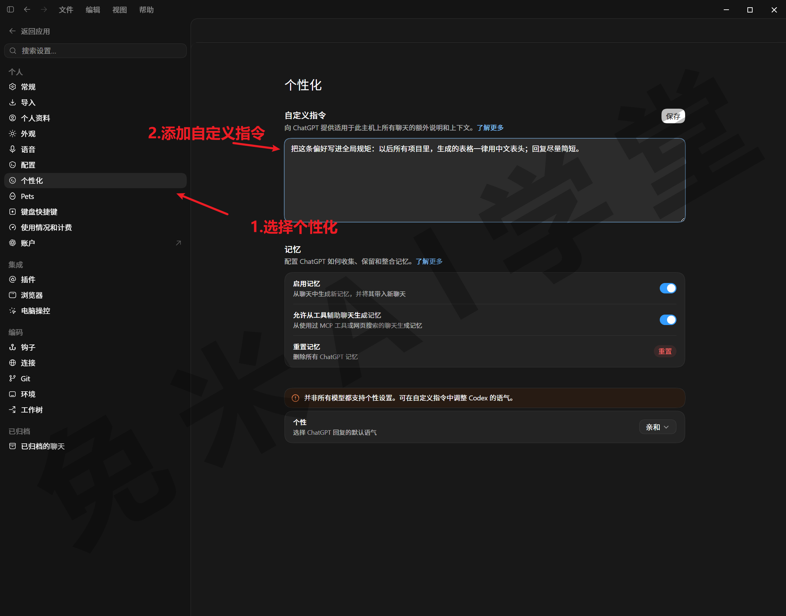

**对话路**：在任意项目对话里发送下面这条，让它写进全局规矩。

```
把这条偏好写进全局规矩：以后所有项目里，生成的表格一律用中文表头；回复尽量简短。
```

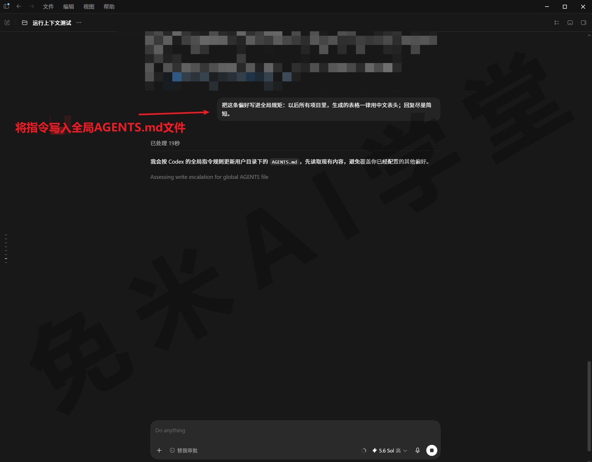

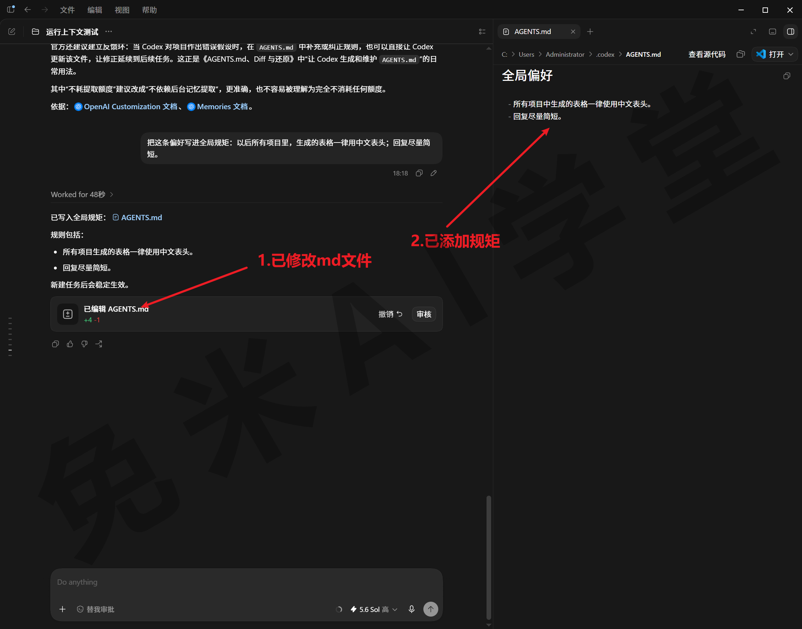

对话路发出后，能看到它定位到用户目录下的全局规矩文件、把偏好整理成一两条规则写进去，回复里通常会带上写入的位置和内容（具体执行路径以实机为准）。图形路则是保存即生效，没有中间过程可看。两条路殊途同归，都落到同一层全局规矩上，挑顺手的用。

然后验证。新建一个对话——因为指令链在对话启动时构建一次（14.3 说过），旧对话里不一定立刻生效；最好再换一个项目——排除项目 AGENTS.md 恰好写过同类规矩的干扰，这样验证到的才是全局层。发送：

```
做一张三行的演示表格，主题随意。
```

观察两点：表头是不是中文，回复是不是明显收短了。两点都符合，说明偏好已经跨对话、跨项目生效——以后再也不用每个新对话重复交代。若没生效，按顺序检查三处：偏好是否真的写进了全局文件（打开 14.3 给的路径看一眼）；验证用的是不是新对话；项目 AGENTS.md 里有没有冲突的规矩把它盖住了。

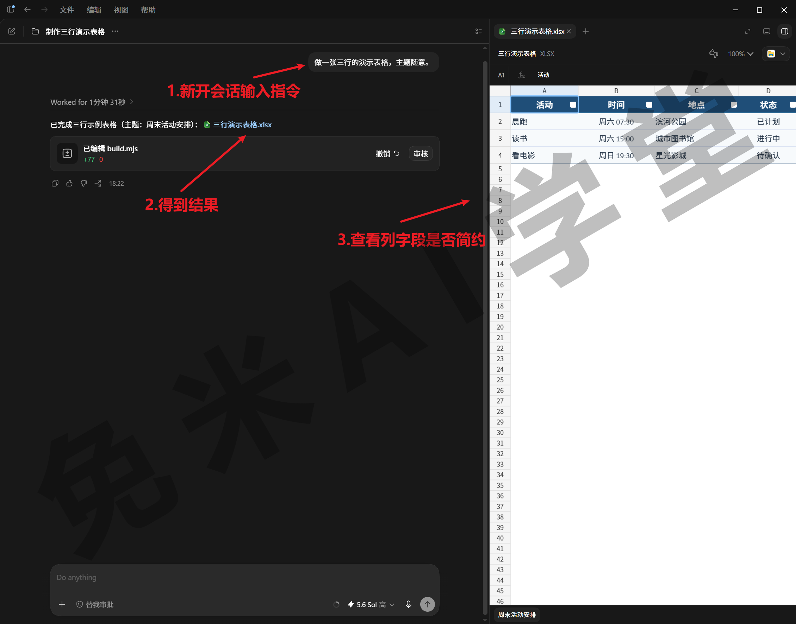

**演示二：处理一次逼近上限的长对话**

找一个聊得很久、用量小圆圈快满的对话（前面几篇攒下的长对话正好能用），按下面的顺序走一遍。

第一步，固化结论。发送：

```
把这个对话里已经确认过的结论和要求，整理成“阶段结论.md”保存到项目里。
```

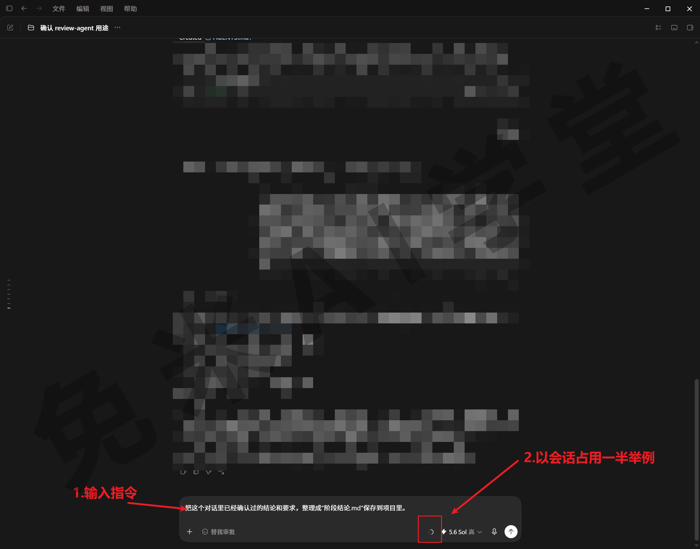

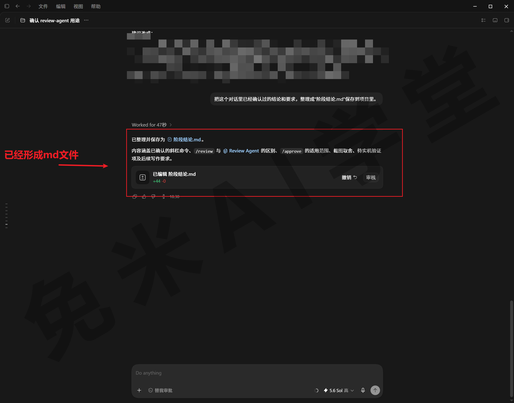

第二步，执行压缩。通过斜杠菜单运行“压缩”。执行要花一点时间，完成后对话里通常能看到早期内容被收成一段摘要（或出现一条压缩完成的事件提示，形态以实机为准），用量小圆圈明显回落。回落幅度取决于对话里有多少内容可合并，刚压过再压收效甚微——14.2 说过的脾气。

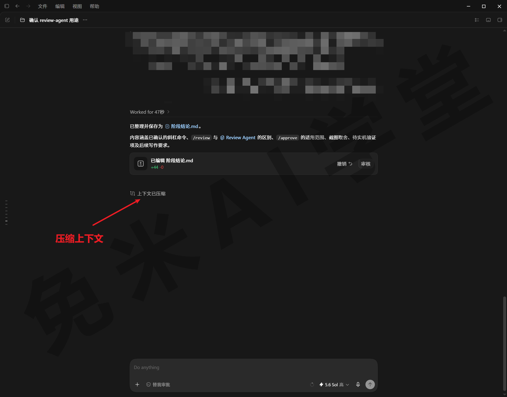

第三步，抽查。发送：

```
回顾一下：这个对话最早确认的三条要求分别是什么？
```

答得上，说明摘要保住了关键信息；答不全，把 `阶段结论.md` 发给它读一遍再继续。这一套“固化、压缩、抽查”的流程，以后所有长任务都用得上。

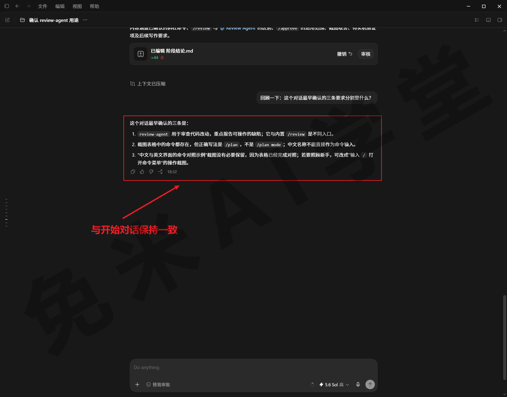

### 14.6 三个练习任务

下面三个任务把本篇内容实际操作一遍。方括号里的内容换成你自己的；提示词可以直接复制。

**任务一：查看用量并完成一次压缩**

先确认设置里已打开“显示上下文窗口使用情况”。找一个聊得比较久的旧对话，看小圆圈的当前状态，然后按 14.5 演示二的三步走一遍：固化结论、执行压缩、抽查。

完成标准：压缩后用量明显回落，抽查时关键要求没有丢。

**任务二：设置一条全局偏好并验证**

挑一条你自己的真实偏好写进全局规矩，发送：

```
把这条偏好写进全局规矩：给我的所有回复，结尾用一行“下一步建议”收尾。
```

新建对话随便问一个问题，确认回复结尾出现了“下一步建议”。

完成标准：新对话中偏好自动生效，不需要重复交代。

**任务三：整理自己的偏好清单**

列出至少五条你在使用中反复交代过的要求，然后按 14.4 的决策清单分类。可以让 Codex 帮你把关，发送：

```
这是我的偏好清单：[粘贴你的偏好清单]。
帮我分类：哪些适合写进全局规矩，哪些写进项目 AGENTS.md，哪些交给自动记忆，并说明理由。
```

完成标准：每条偏好都有归属，该写成文件的已经写入。

### 14.7 本篇小结与自检

这一篇讲清了上下文和记忆两套机制。最需要记住的是：**长期偏好交给记忆和规矩文件，当前对话只装相关信息；对话变乱时，先压缩或开新窗口。**

可以对照下面的清单检查学习结果：

- [ ] 会看上下文用量，完成过一次压缩
- [ ] 能说出对话越聊越乱的原因
- [ ] 设置过一条全局偏好并验证生效
- [ ] 能说出三级记忆各记什么
- [ ] 知道自动记忆的代价和开关位置

完成这些内容后，AI 已经开始越用越懂你。下一篇《自动化、Git 与远程操控》是第一部分收官。

### 14.8 新手常见问题

**Q1：压缩会丢失重要信息吗？**

可能会。压缩的产物只是一份摘要：要点通常保得住，细节会被合并简化。两个习惯可以把风险降到很低：压缩前先把重要结论固化成文件（14.5 演示二的第一步）；压缩后用一两个关键问题抽查，发现丢了就把文件补给它。另外，真正需要长期有效的规矩，应该写进 AGENTS.md 或全局指令，本来就不该依赖某一个对话的记忆。

**Q2：记忆和 AGENTS.md 有什么区别？**

AGENTS.md 和全局指令是你亲手写的明文规矩：内容看得见，生效确定，不需要系统猜；自动记忆是系统从使用中提取的隐性偏好：你不用动手，但内容不由你逐条控制，提取还有额度代价。判断标准是 14.4 的一句话原则：能写清楚的自己写，写不清楚的交给记忆。两者互补，不冲突。

**Q3：为什么自动记忆默认是关的？**

因为它有代价：提取记忆和使用记忆都会消耗额度，默认关闭是把选择权留给你。轻度使用、偏好也简单的话，全局指令加项目 AGENTS.md 已经够用，可以不开；使用频繁、又不想手动整理偏好，再打开它，并留意额度消耗的变化。开关状态与位置以实际界面为准。

**Q4：换一台电脑，记忆还在吗？**

分情况。项目 AGENTS.md 随项目文件夹走，把项目复制到新电脑就带走了；全局规矩也是普通文件，可以复制到新电脑用户目录下的对应位置。自动记忆目前是本地存储，是否跟随账号云同步到新设备，以当前版本的实际表现为准（需实机验证）。稳妥的做法：换电脑前把重要偏好都落成文件，文件在，规矩就在，不依赖设备。

