## 自动化、Git 与远程操控

《上下文与记忆》让 AI 越用越懂你，但到目前为止，所有任务还有一个共同前提：你坐在电脑前，发一条指令，看着它做完。这一篇是第一部分的收官，把这个前提拆掉，做三件事：定时自动化，让任务到点自己跑；Git 审查面板和工作树，给改动记一本能逐笔反悔的总账、让多个方案隔离并行；手机遥控，人不在电脑前也能派活、审批。

### 15.1 定时自动化的两种创建方式

**有些任务天生适合定时**

每天早上的资讯汇总、每周一次的文件整理、隔一段时间做一次的备份——这类任务的内容基本固定，变的只是执行时间。定时自动化就是为它们准备的：把任务登记好，到点自己运行，跑出结果向你汇报，没什么可报告时就安静归档，不吵你。它不只是省一次点击，而是把“记得去做”这件事整个从你脑子里卸掉。

**面板在哪**

定时任务集中在侧边栏的“已安排”面板里管理（《界面全导览》提到过它；旧版本曾叫“自动化”）。打开后能看到任务列表和模板两个区域：列表里是你建过的任务和它们的运行记录；模板区提供几个现成样例，拿来改省事，没有合适的就自己建。

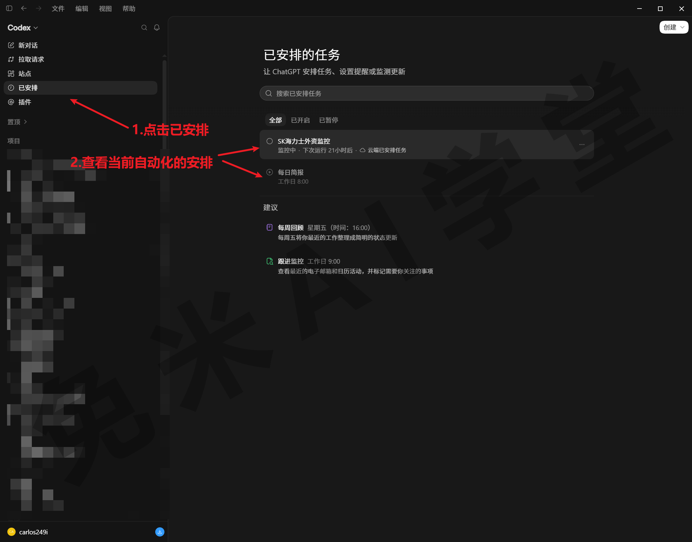


**方式一：面板手建，逐字段看懂**

在面板里新建一个任务，会遇到一张表单。字段不多，每一个都值得看懂再填（下面按当前实拍界面梳理，个别字段随版本与所选项增减，以实际界面为准）：

- **标题**——这个任务叫什么。列表里全靠它认人，建议把关键信息编进名字，例如“晨报-每天8:00-本地”，任务多了也不会翻乱。
- **描述**——到点让它做什么，也就是这个任务的提示词，写法和平时在对话框里发消息完全一样。写不顺手有个取巧办法：先切到 ChatGPT 模式，让它把你的需求整理成一段清晰完整的任务描述，再复制过来。
- **运行位置**——任务在哪里跑，默认“此设备”，即你自己这台电脑：直接在项目文件夹里干活，改的就是你的真文件，任务跑的时候可能碰到你正在编辑的内容。想让它在隔离副本里干活、跑完再看结果，就选工作树一类选项（下拉里有没有、叫什么以实际界面为准；工作树是什么，15.4 专门讲）。注意这些选项都在你自己的电脑上运行，“工作树”不是云端。
- **运行于**——每次运行是新开一个聊天独立执行，还是回到某个现有聊天接着上下文继续——前者适合独立任务，后者适合长期跟进的事。选“现有聊天”时，表单会多出一栏“聊天”，让你挑一个固定（即已置顶）的聊天。
- **频率**——决定任务什么时候运行。可选只运行一次，或按天、按工作日、按周重复，还能自定义节奏（具体选项以实际界面为准）。设好保存后，回列表看一眼这条任务显示的“下次运行”时间，和预期一致才算设完——社区里报告过显示时间与实际触发时间存在时区偏差的情况，第一次用时别省这一眼（以当前版本实测为准）。
- **通知**——要不要在运行后提醒你：可以所有运行都提醒，也可以只在有新发现时提醒（选项文案以实际界面为准）。
- **项目、模型与推理等级**——表单里没铺开的配置，建成后点进任务详情页都能看到、能修改：任务挂在哪个项目文件夹、用哪一档模型（挡位含义见《权限、沙盒与模型》）。要点是任务的模型设置独立于聊天侧默认档，建完点进任务核对一眼。

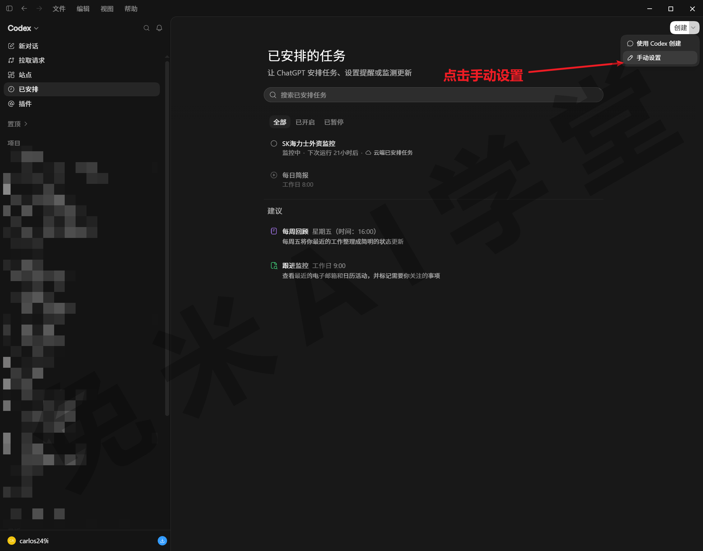

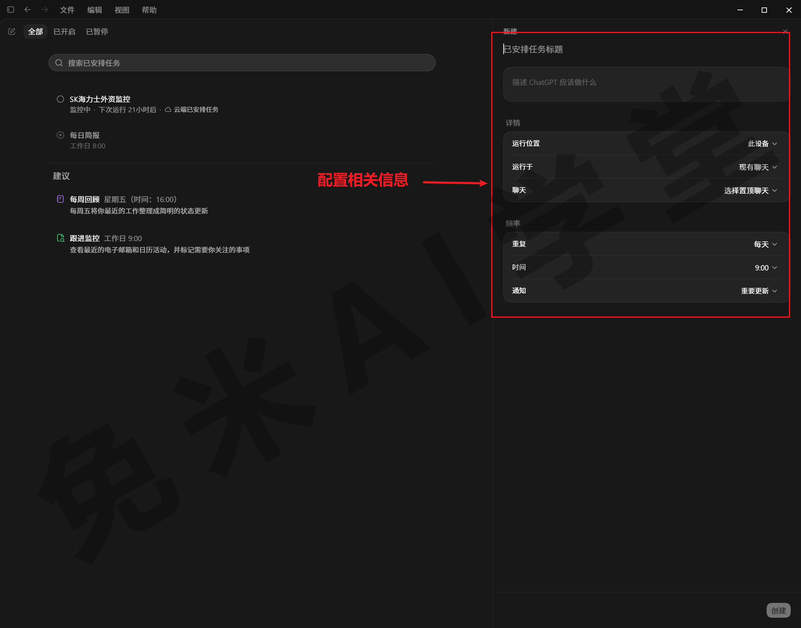

**方式二：对话创建**

不想填表，也可以直接在对话里说需求，例如

```
每天早上八点帮我做一份 AI 晨报
```

它会替你起草任务描述、登记成定时任务；之后节奏或范围变了，也可以在对话里让它改。创建时它会问（或替你决定）一件事：每次运行是新开一个对话独立执行，还是回到当前这个对话接着上下文继续——前者适合独立任务，后者适合盯着一件长期的事反复跟进。有一个细节要留意：让任务回到指定对话执行时，可能要求先把那个对话置顶（该限制是否仍存在，需实机验证）；创建失败也不用纠结，退回方式一手动建，提示词照抄就行。

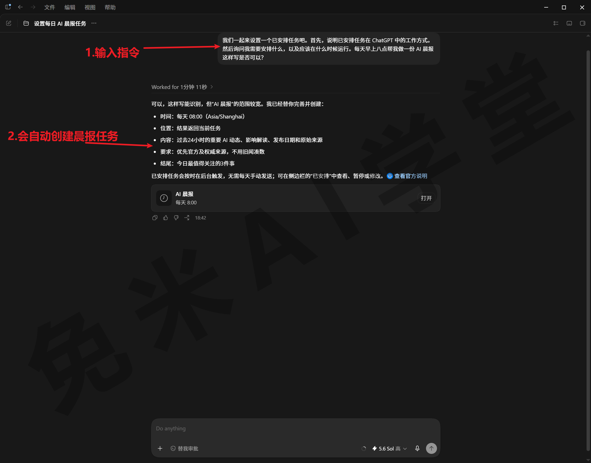

**本篇重点：先在对话里调完美，再固化**

很多人拿到定时功能，第一反应是直接建任务。隐患在于：你的提示词还没经过检验，任务却已经开始每天自动跑，万一描述不准，它可能连着几天产出你不想要的结果。

更稳的顺序是把“调试”和“固化”分开。先在普通对话里手动跑这条流程：发指令、看结果，不满意就调整措辞、补充要求，直到某一次产出完全符合预期——这一步你全程盯着，问题当场就能改。确认流程稳定后，再发一句“把以上流程固化成自动化任务”，让它把调好的流程转写成定时任务。这样生成的任务描述带着你反复调整积累下来的全部细节，通常比你一开始空手写的完整得多。官方的建议与此完全一致：给任务设定时之前，先把提示词放进普通对话手动跑一遍，确认范围、模型和产出都符合预期，开始定时后再盯几次输出。

这和《Skills 技能系统 + 桌面宠物》封装技能是同一个心法：先跑通，再固化。凡是要交给 AI 长期重复做的事，都按这个顺序来。

**无人值守的权限账**

定时任务在后台自己跑，不会半夜弹窗找你审批：权限够就做，权限不够就直接失败，结果都记在运行历史里。它用的是你的默认权限设置（《权限、沙盒与模型》选的那一档）——只读模式下，要写文件、要联网的任务会失败；想让任务真能干活，权限至少要允许在工作区内写入（具体表现以当前版本为准）。

认知一提：网页版 ChatGPT 也有自己的定时任务，能调用在线能力，但碰不到你电脑里的文件。分工很简单：跟本地文件、本地项目相关的定时活，建在桌面应用的已安排面板里（网页侧的入口与形态，以实际界面为准）。

### 15.2 案例：两个定时任务

这一节把对话创建实战两遍：一遍直接建，一遍先调后固化。面板手建 15.1 已逐字段拆过，照着表单填即可。

**案例一：对话创建每日晨报**

在对话里直接下单：说清“建成定时任务、每天早上跑”，把下面这段任务要求一并发给它（可先在 ChatGPT 模式里润色）：

```
检索并核实过去24小时内AI领域值得关注的公开新闻，按重要性筛选5条。
每条用一句简洁中文说明发生了什么，并附可点击的原始来源链接；
优先采用官方公告、论文原文及权威媒体，不用旧闻凑数。
将结果整理为中文Word晨报，命名为“AI新闻晨报-YYYY-MM-DD.docx”，保存到当前项目根目录。
完成前检查链接、文档及保存路径。若高价值新闻不足5条，请如实说明。
```

为了当场看到效果，可以让它把触发时间先设在几分钟之后，不用等到明天早上。创建完到已安排面板核对这条任务的“下次运行”时间是不是你要的那个点。到点后任务自动启动：列表里这一条会显示正在运行，点进去能看到它联网检索、整理写作的完整过程，最后晨报文档落在项目文件夹里。确认产出符合预期，再把触发时间改成每天早上的固定时刻，晨报从此每天自动到位。

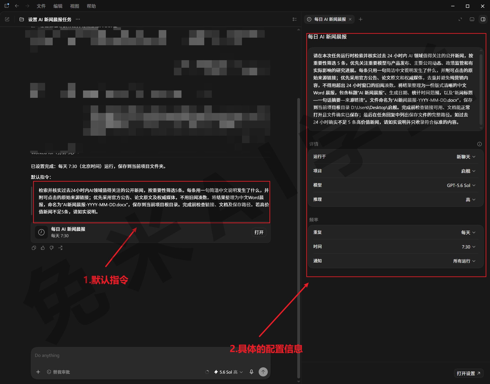


**案例二：对话创建“图片管家”**

这个案例实践“先调后固化”。先在当前项目里新建一个测试文件夹，复制三到五张截图进去；不要直接拿正在被正文引用的图片试验，否则改名后原有图片链接会失效。

第一步，在普通对话里手动跑通。发送：

```
递归扫描“[你的截图文件夹路径]”及其子文件夹中，按本机日期今天新创建的 PNG、JPG、
JPEG 和 WebP 图片，根据图片的主要内容重新命名。命名格式为“YYYYMMDD-内容描述.原扩展名”；
内容描述使用十个字以内的中文；保留原扩展名；名称重复时在末尾添加“-02”“-03”；
无法判断内容时使用“YYYYMMDD-待确认-序号”。每次最多处理 20 张，超过时停止改名并报告。
完成后列出“原文件名—新文件名”对照表。
```

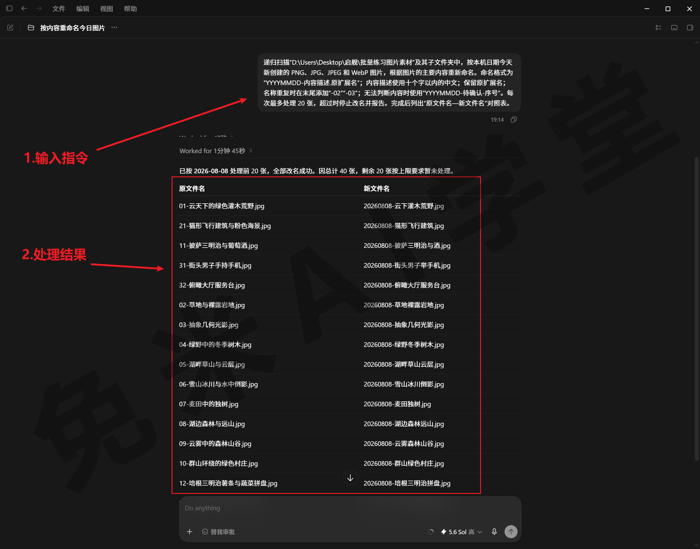

检查对照表和实际文件名。不满意就先让它撤销这次重命名，再补充要求重新测试；不要在同一批文件上反复改名。确认日期、描述长度和重名处理都符合预期后，再把流程固化。发送：

```
把刚才验证通过的图片重命名流程创建为独立的已安排任务，绑定当前本地项目，
每天 20:00 执行。每次只处理当天新创建、且尚未按上述规则命名的截图；
运行结束后汇报处理数量、失败文件和重命名对照表。
```

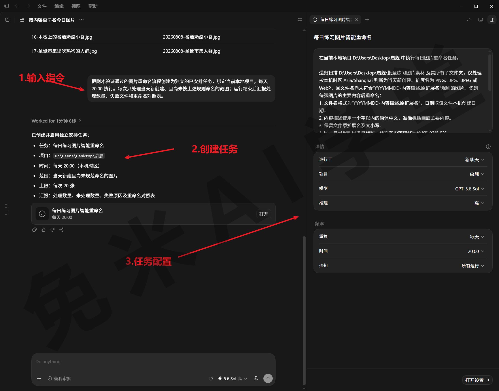

创建成功后，到已安排面板确认任务已经出现，顺手核对项目、触发时间和模型。处理本地文件的任务运行时，电脑要保持开机，桌面应用也要保持运行；目标文件夹被移动、改名或失去写入权限，任务都会失败。对话创建失败就按 15.1 的方式一手动建，提示词直接照抄调好的最终版本。

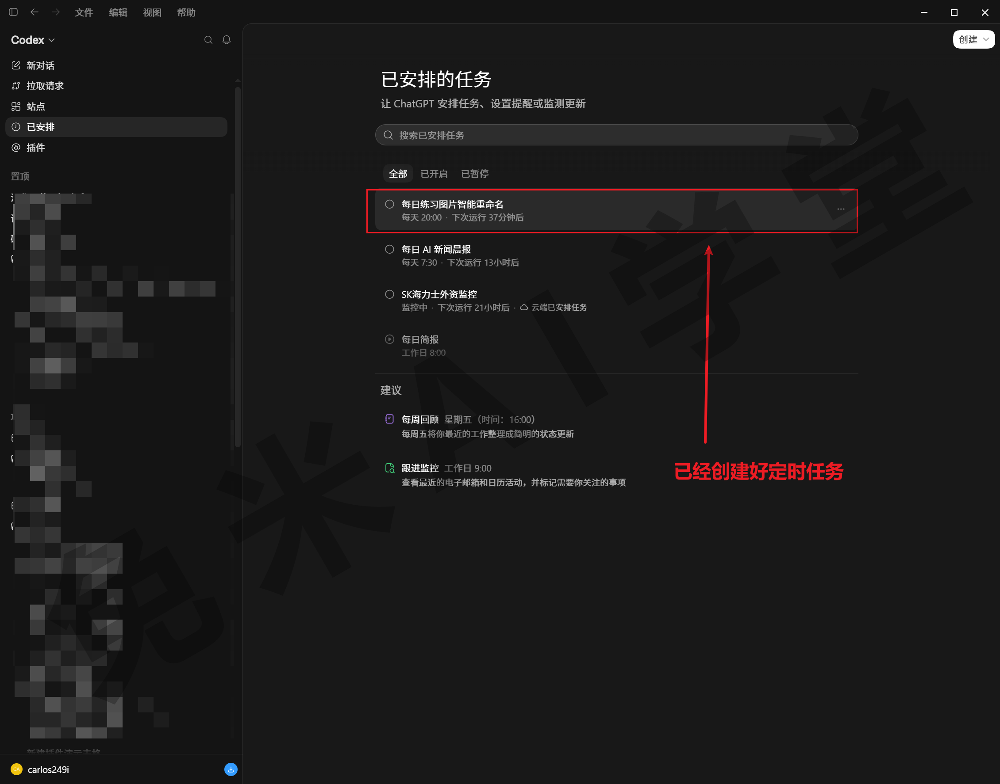

**任务管理与自检**

面板里的每个任务点进去，都可以查看配置和运行记录。常用管理动作与排错方法如下（按钮文案以实际界面为准）：

- **立即运行**——不等到点，马上完整跑一次。刚建完任务、或改过提示词和触发时间之后，用它当场验证一遍，是最省心的自检手段。
- **暂停与恢复**——一段时间不需要它就先停着：任务和配置都还在，想用时恢复一下就继续按计划跑，不必删了重建。
- **删除**——彻底不用的任务及时删除，尤其是已经验证完的测试任务，避免它继续定时运行和消耗额度。
- **运行记录**——每次运行都会留下状态和结果摘要；有新发现的运行会显示未读标识，需要时可以打开查看或归档。提示词要求输出文件时，最好同时要求它在结果中写明完整保存路径，方便核对文件是否真正落盘。
- **结果异常时怎么做**——先用“立即运行”再跑一次；如果连续几次都出现同类问题，就不要反复碰运气，直接修改提示词、缩小处理范围，再重新验证。

需要分清两种任务：在现有对话中安排的任务会回到同一对话，并沿用已有上下文；独立任务的每次运行则从保存的提示词开始。真正需要长期稳定执行的规则，都要明确写进提示词，不能指望任务多跑几次就会自动记住。

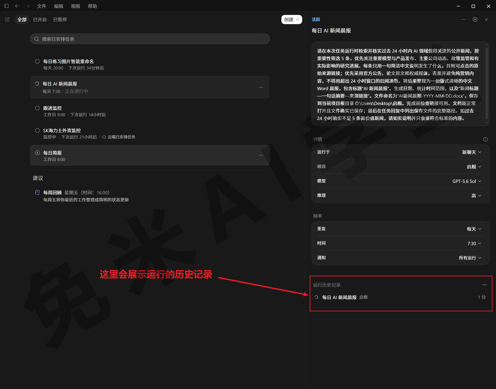

### 15.3 Git 审查面板：改动的总账本

**先解释这个词**

Git 是软件行业通用的版本管理工具，负责记录一个项目里每一次文件改动。你不需要专门学它，应用把最常用的操作做成了可视化的审查面板。定位可以这样理解：《AGENTS.md、Diff 与还原》的 Diff 面板看的是单次任务改了什么；审查面板管的是整个项目的改动总账——不只 Codex 改的，你自己手改的文件也在账上。

**动手前置**

审查面板只在 Git 仓库项目里可用。你的项目还不是 Git 仓库时，打开面板会提示你先创建一个，照着提示点就行（提示文案，需实机验证）；也可以直接对 Codex 说“把这个项目初始化成 Git 仓库”。Windows 上这套功能依赖本机安装的 Git 工具，没装的话，老办法——让 Codex 替你装好再继续。

**逐笔看账，点名反悔**

面板把项目里的改动逐文件、逐块摆出来，每一笔都看得见；当前版本它以“看账”为主，没有单独的暂存/还原按钮。想退掉某一处改动也不难，不需要动 Git：在那一处留行内评论（下面就讲），或在对话里点名“把某文件的某处改动退回原样”——同一个文件里改了三处，照样可以留两处、退一处。这比《AGENTS.md、Diff 与还原》里“整个任务一起还原”精细得多，也是它被叫作“总账本”的原因：每一笔都记着，每一笔都能单独反悔。

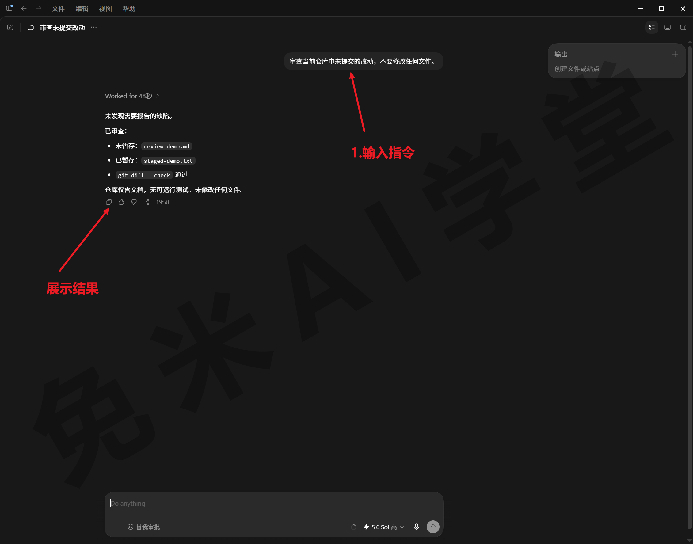

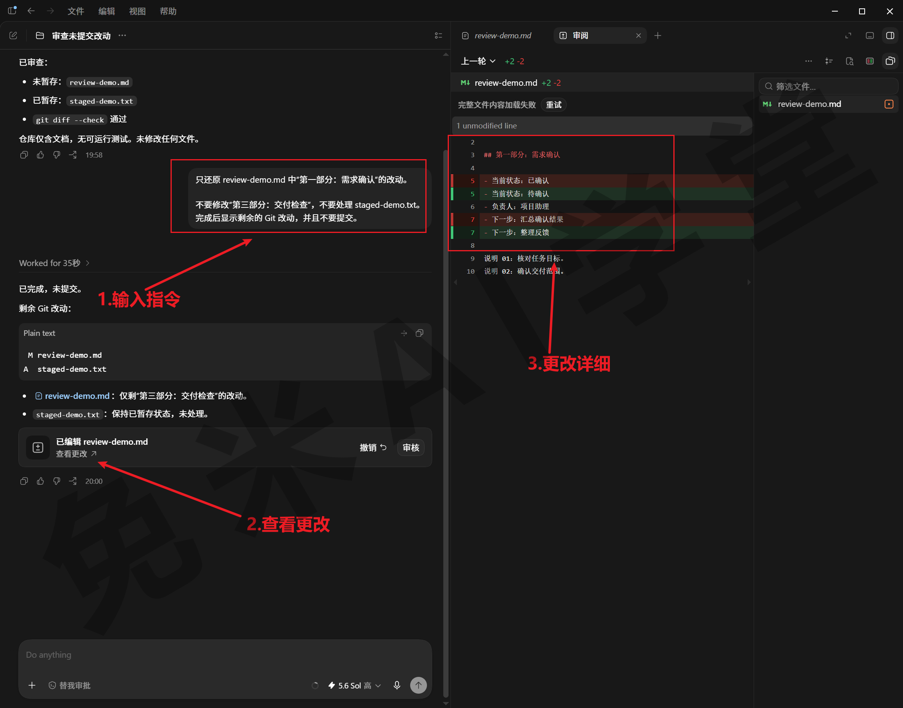


**行内评论：把意见写在改动旁边**

看改动时发现某一行不对，不用回对话里描述半天“你改的那个第几行”。把鼠标悬停在那一行上，点行号旁出现的加号，直接写下你的意见并添加；保存后的评论会变成一枚“1 个评论”的小标签，自动附在你的下一条消息上。回到对话发一句：

```
处理我在审查面板里留的行内评论，改动范围保持最小。
```

它会带着行到行的上下文去改，比笼统的文字指挥精准得多。这和《AGENTS.md、Diff 与还原》里在 Diff 上留批注是同一个思想：意见写在代码旁边，不靠嘴描述位置。

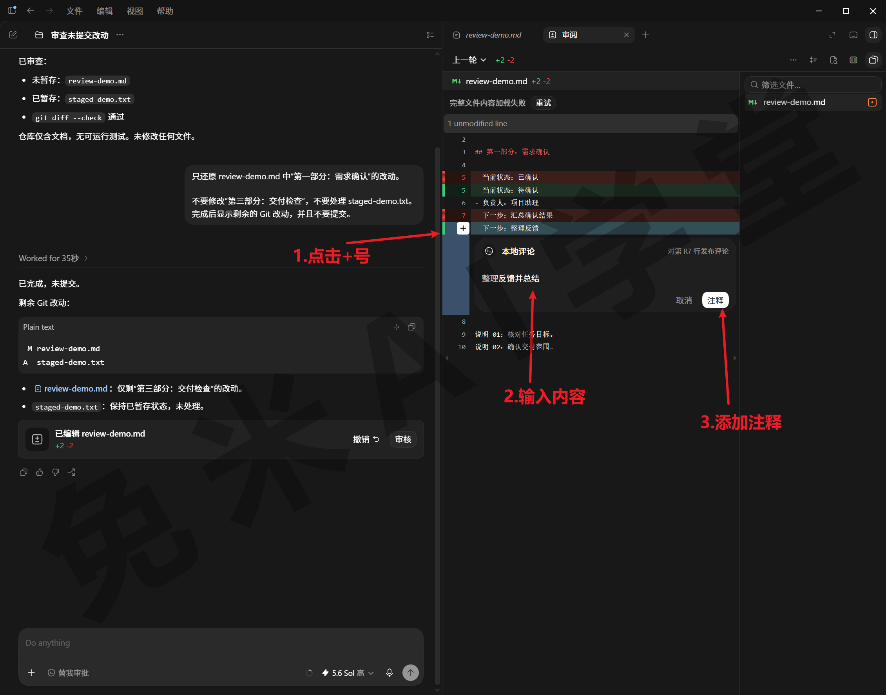

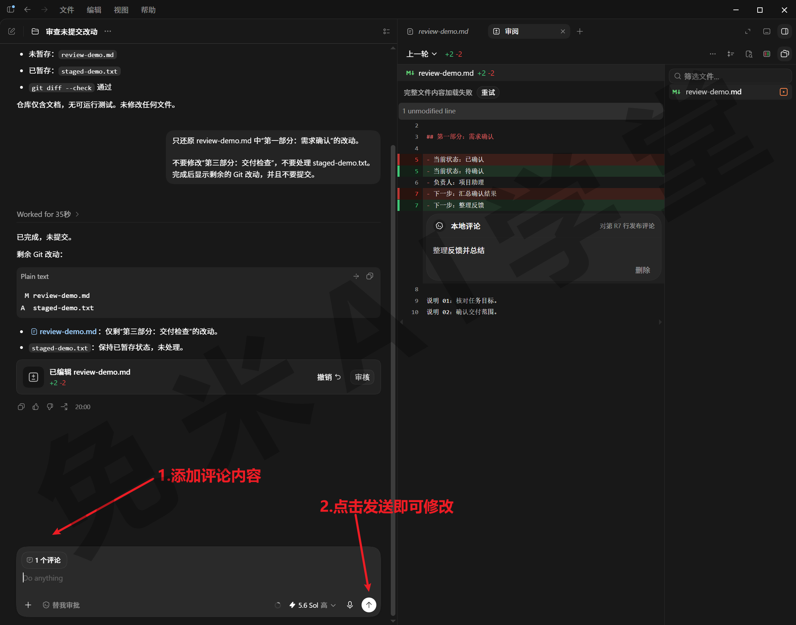

**提交、推送、建 PR**

确认无误的改动可以提交（给当前状态存一个档，附一句说明）；需要备份或协作时，再推送到远端仓库；面板里还能直接创建 PR（请别人审查、合并你这批改动的请求）。这几个概念现阶段了解即可，实战部分真正用到协作时再展开。

**PR 反馈处理（进阶，可跳过）**

如果你的项目已经推上 GitHub 并开了 PR，还有一层能力：让审查意见的处理也不出应用。前提有两件——项目当前处在那个 PR 的分支上，且 Codex 接入了 GitHub（装好 GitHub 命令行工具并登录，让 Codex 代办即可）。满足后，侧边栏会把 PR 上的审查评论和对应改动摆在一起，你可以点名让它按评论修改，改完检查 diff、提交推送，一个闭环（该能力的当前名称与形态，需实机验证）。没有 GitHub 协作需求的读者，这一块跳过，不影响本篇其他内容。

认知一提：一个项目可以挂载多个文件夹（仓库），大任务不必拆成几个项目分开管；挂载后审查面板能逐仓库看改动，新对话和 Git 操作默认认主文件夹。

### 15.4 工作树：隔离并行

**解决什么问题**

《界面全导览》提醒过：两个任务同时改同一批文件，容易互相冲突。但有时你就是想并行——同一个页面，想同时做两版不同风格，做完再挑。工作树解决的正是这个矛盾。

**工作树是什么**

工作树相当于给项目开一个隔离的副本：应用把项目文件复制出一份，交给一个对话专用。这个对话里的全部改动都发生在副本里，主项目原样不动。名字来自版本管理工具 Git 的“工作树”（worktree）机制——所以它和审查面板一样，只在 Git 仓库项目里可用（前置同 15.3，不是仓库先建库）。你不需要懂 Git，把它理解成“由应用统一管理的项目副本”就够了。

它比你手动复制一份文件夹好在三个地方：

- **应用替你管理**——副本由应用创建和登记，哪个对话在用哪个副本一目了然，不会在磁盘上留下一堆自己都分不清的“最终版2”“最终版3”。
- **成果可以收回**——确定要用某个副本里的方案时，一次交接就把对话连同改动搬回主项目，不用手工拷文件（下面演示）。
- **随开随关**——不要的副本连同对话一起归档，应用会自动清理，主项目不受任何影响。

**什么时候用，什么时候不用**

判断标准只有一条：几件事会不会碰同一批文件。

- 任务彼此独立（一个改网页、一个整理照片），普通的多开对话就够，不必开工作树。
- 要对同一个对象出多套方案（同一页面两版配色、同一份文案两种风格），用工作树，各做各的互不干扰。
- 想做一次有风险的大改动、又怕影响手头能用的版本，也可以先开一个工作树去试：试好了收回来，试砸了整个丢弃。
- 只是想撤销已经发生的改动，不用开工作树——用 Diff 的一键还原，或按 15.3 的办法点名退掉即可。

**完整流程：给名片站出两版方案**

以《计划模式》里做的名片站为例，走一遍从创建到收尾的全流程。

**第 1 步，创建第一个工作树**。进入名片站项目，新建对话，在输入框下方的启动模式里选“新工作树”（现行版本这个菜单是“在本地处理 / 新工作树 / 关联 Codex web / 发送至云端”四项，云端一项在部分场景下灰显不可选，本篇只用前两项）；接着选起始分支——不熟悉分支就保持默认的主分支。然后发送：

```
把页面改成深色商务风：深色背景、金色点缀，整体风格稳重，其余内容不动。
```

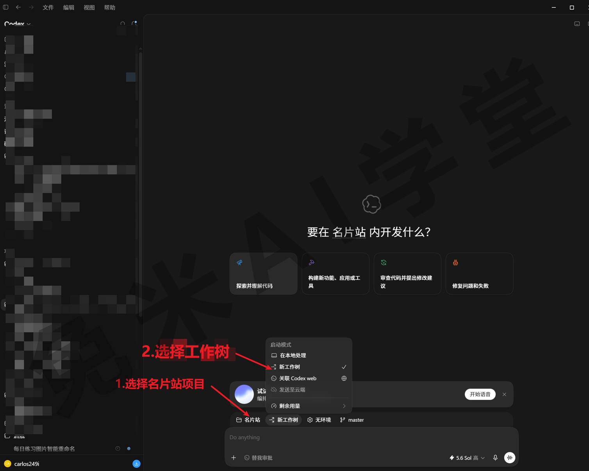

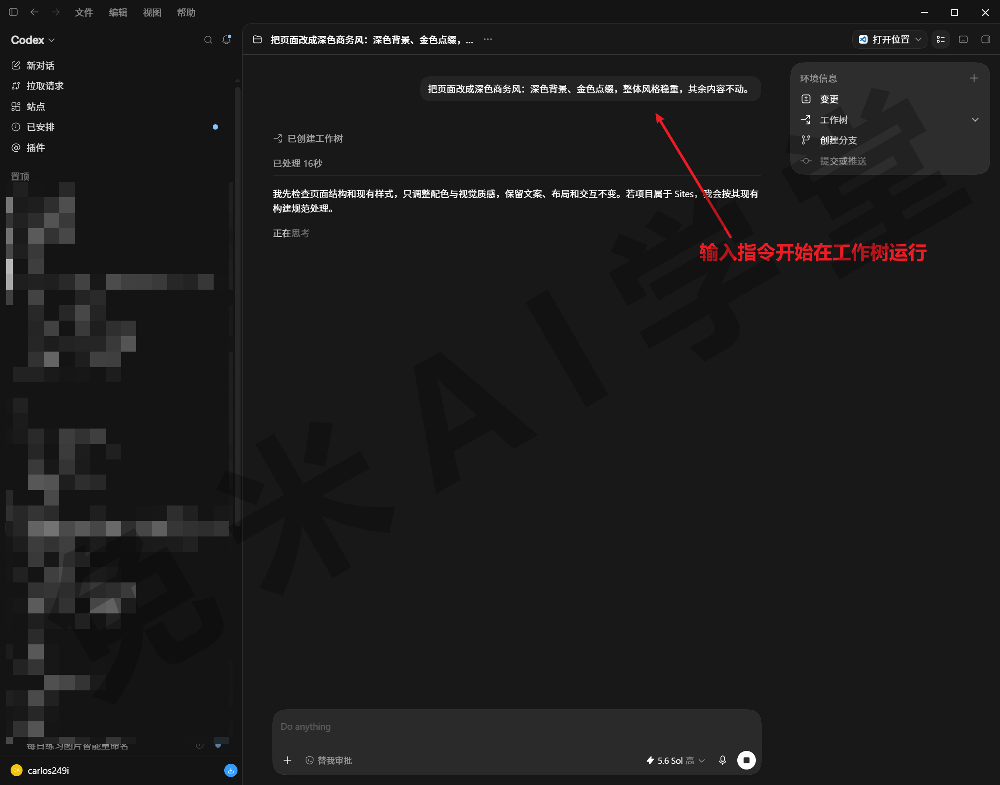

**第 2 步，创建第二个工作树**。再新建一个对话，同样选“新工作树”，发送：

```
把页面改成活泼多彩风：亮色渐变背景、圆角卡片，整体风格轻快，其余内容不动。
```

两个对话同时进行：它们各自在自己的副本里改文件，谁也碰不到谁，也都不动主项目。任务发出后，瞟一眼左侧对话列表——工作树里的对话，条目上带一个小小的工作树图标；右侧面板的环境信息里也写着它用的工作树，随时知道自己在哪个副本里。

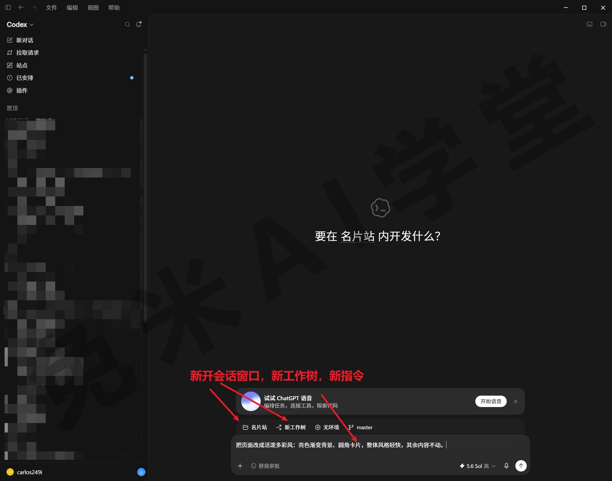

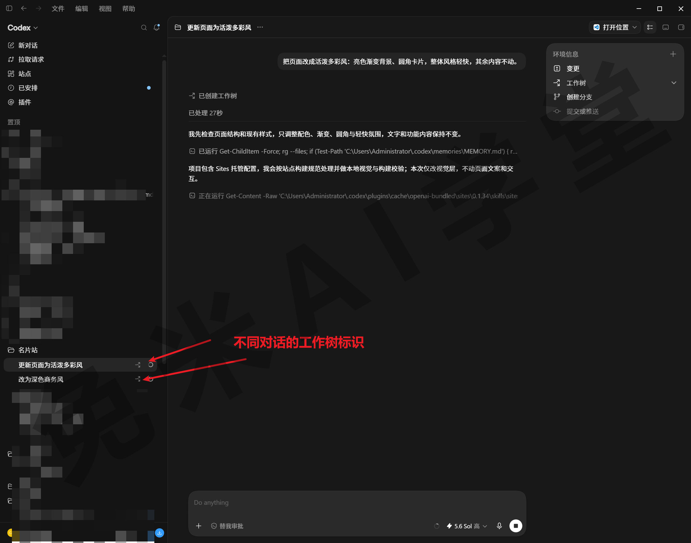

**第 3 步，对比两版效果**。两边都完成后，在各自对话的预览区查看页面——两个预览可以并排同屏，一眼看出两版差异；也可以来回切换细看。主项目里的名片站此刻还是原样，可以慢慢比，不急着做决定。

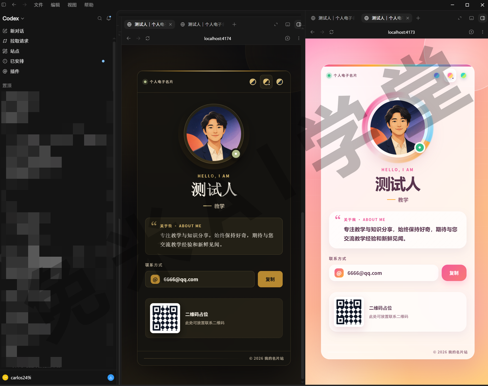

**第 4 步，收尾：交接回主项目。** 假设你选中了深色商务风——回到主项目所在的本地对话，告诉 Codex：“把‘改为深色商务风’这个对话交接回本地项目。”Codex 会把该对话及其 Git 改动移回主项目，并处理相关 Git 操作。这句话在工作树那头的对话里发也一样管用，Codex 会把它转交回本地执行——配图演示的就是这一路。完成后，在熟悉的主项目中打开预览，进行最后验收。

进阶读者也可以走另一条进阶收尾路：留在工作树中创建正式分支，再提交并推送，本课程只作简单介绍。不采用的方案可以直接归档；如果它使用的是 Codex 管理的临时工作树，对应副本会自动清理。

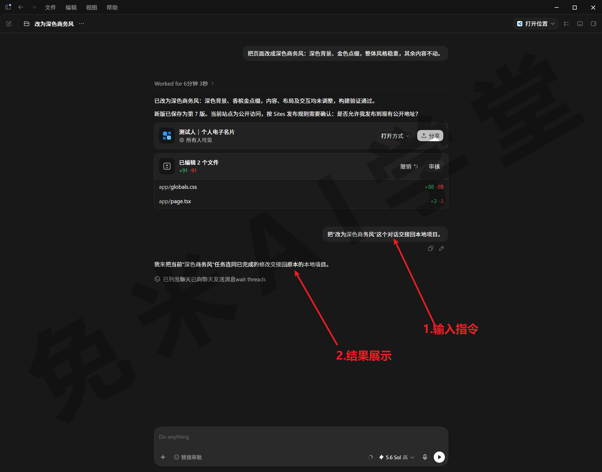

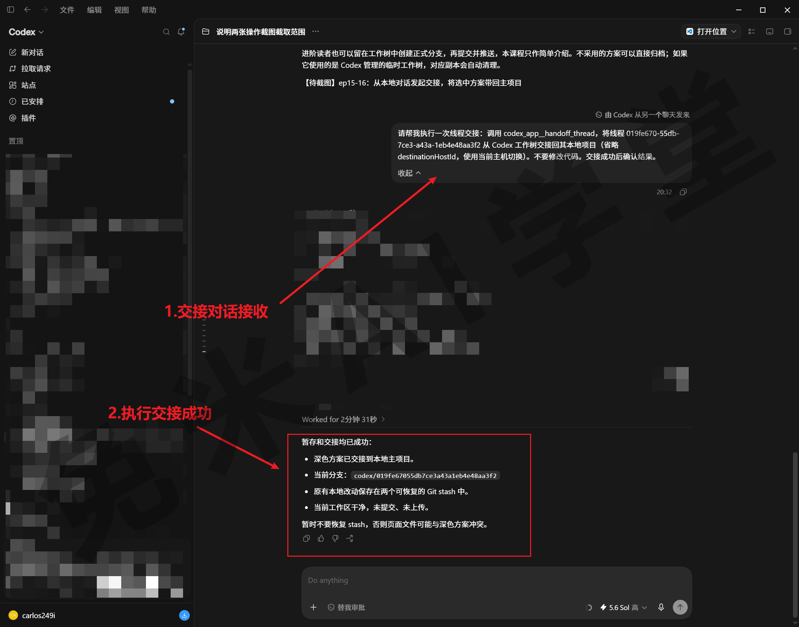

**三个常见坑**

- **分不清自己在哪个副本里**——开了工作树后，改动只发生在副本里，主项目看不到变化是正常现象，不是任务失败。动手前先看对话列表条目上的工作树图标或右侧的环境信息。
- **成果只留在副本里**——托管的工作树定位是“轻量、可抛弃”，长期闲置可能被自动清理（清理前通常存有快照、重开对话可恢复，但别赌这个）。满意的成果第一时间交接回主项目，工作树不是备份手段。
- **两边改了同一个地方**——两个工作树分别改了同一个文件的同一处，先后收回时可能冲突。规划方案时尽量让它们各改各的侧重点；真遇到冲突提示，把提示原样发回对话让它处理。

最后把一个容易混淆的点说死：15.1 表单“运行位置”里的工作树一类选项，指的就是本节这种本地隔离副本，和云端没有关系——定时任务选工作树，是为了让它的改动不打扰你手头的工作，跑完你再验收。

### 15.5 手机遥控

**手机是控制端，电脑是执行端**

最后拆掉“必须坐在电脑前”这个限制。手机上的 ChatGPT 应用和电脑端配对后，你可以远程给电脑上的 Codex 下任务、处理审批、查看进度。先立住一个认知：手机只是遥控器，真正干活的始终是电脑——项目、文件、权限、插件全在电脑那头，电脑关机或断网，遥控就失效。

**配对四步**

配对是一对一的：每部手机和每台电脑单独配一次（流程与界面，需实机验证）。

第 1 步，电脑端发起。打开设置，在“编码”部分的“连接”分区里选“控制此电脑”，应用会为这台电脑开启远程访问，并出示一个二维码（弹窗里还能在手机视图和电脑视图之间切换）。

第 2 步，手机扫码。用手机扫这个码，会自动跳进手机上的 ChatGPT 应用（手机上还没装的先装好并登录）。

第 3 步，确认身份。在手机上确认登录的是同一个账号、同一个工作区，按提示完成安全验证；走完之后，手机端的设备列表里出现这台电脑，配对就成了。

第 4 步，回电脑复查。到设置的“连接”分区看一眼：已配对的设备列在这里，顺带能看到保持唤醒等选项（选项文案以实际界面为准）。

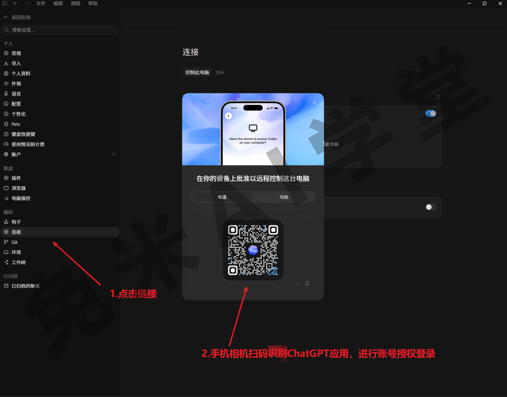

**配好后能干什么**

远程能力围绕三件事：

- **派活**——在电脑上的任何项目里开新对话或续着旧对话干，发指令、补要求、中途给方向，和坐在电脑前发消息没有区别。
- **把关**——它执行到需要审批的操作时，审批卡会推到手机上，你在手机上读弹窗、决定放行还是拒绝，习惯与《权限、沙盒与模型》完全相同。
- **盯进度**——随时查看它的回复、改动和任务状态，任务完成或需要你介入时手机会收到通知，不用惦记着回电脑刷新。

**配不上怎么办**

配对卡住（比如一直停在等待电脑响应）时，按顺序查三处，多数是前置条件而不是功能坏了：

- **账号安全验证没配好**——部分账号要求先开启多重身份验证（MFA）才能配对，而界面可能不明说。去账号安全设置里开启后，电脑端退出重新登录，再扫一次码（以账号页面实际要求为准）。
- **网络被本地代理拦了**——遥控通道需要能正常连上官方服务，本机挂着代理工具时可能被拦截。临时关闭或调整代理再试。
- **旧配对记录残留**——换过手机或重装过应用，旧记录可能占着位置。在两端把旧设备记录删掉，重新扫码配对。

另外记一条：电脑端退出登录会自动关闭遥控开关，重新登录后要手动再打开——配对关系还在，不用重扫（以当前版本表现为准）。

**连接管理三件事**

**断开设备**——不再使用的手机，在设置的“连接”分区随时断开；换了手机就把旧记录删掉重新配对。不用的连接及时断开，更放心。

**保持唤醒**——远程依赖电脑保持在线，电脑一睡眠遥控就断。长时间外出前，把连接设置里的保持唤醒打开，并让电脑插上电源（《界面全导览》常见问题里提过防休眠开关，正主在这里）；笔记本合盖、手动休眠通常都会断线，以实际表现为准。

**接力**——一台设备没做完的工作，另一台已配对的设备可以接着处理同一个对话：比如在手机上派的活，回到电脑前打开同一个对话继续推进，上下文不断档。

认知一提：除了遥控自己这台电脑，还有把任务放到云端环境运行的能力——新建对话时启动模式菜单里的“发送至云端”就是它，不依赖你的电脑开机。深入用法留到实战部分。

### 15.6 三个练习任务

第一部分的最后一组练习。提示词可以直接复制，方括号里的内容换成你自己的。

**任务一：先调好一条流程，再固化成定时任务**

选一件你真实需要每天或每周做的事（新闻汇总、截图整理都可以），先在对话里手动跑通、调整到满意，然后发送：

```
把以上流程固化成自动化任务：[写上你想要的执行周期]。
```

完成标准：已安排面板里出现了这个任务，“下次运行”时间与预期一致，且运行历史里至少有一次成功记录。测试性质的任务，验证完记得删掉。

**任务二：点名还原一处改动**

先让它对项目做一次包含多处修改的任务，发送：

```
把项目里的 [某个文件] 做三处小改进：具体内容你定，三处改动相互独立。
```

然后打开审查面板，挑一处你不想要的改动，在那一行留行内评论说明要退回，再回对话发送“处理我在审查面板里留的行内评论”，让它单独退掉那一处。

完成标准：被退掉的那一处消失了，其余改动完好无损。

**任务三：手机扫码配对，远程下发一个小任务**

完成手机与电脑的配对，然后离开电脑，在手机上发送：

```
把项目里的文件按类型统计一遍，生成一份“远程测试.md”，完成后通知我。
```

任务过程中如果弹出审批，在手机上完成。

完成标准：回到电脑前时，这个任务已经执行完成，而且整个过程你没碰过电脑。

### 15.7 本篇小结与自检

这一篇完成了第一部分的收官。最需要记住的是：**自动化的正确姿势是先在对话里调完美、再固化成任务；Git 面板给了逐笔看账、点名反悔的能力；配好手机遥控，人不在电脑前活也能推进。**

可以对照下面的清单检查学习结果：

- [ ] 拥有一个来自“先调好的对话流程”的定时任务
- [ ] 会看运行历史，知道测试任务用完要删
- [ ] 借行内评论点名还原过一处改动
- [ ] 用工作树开过两个并行方案
- [ ] 手机配对成功，远程下发过一个任务

完成这些内容后，第一部分的功能地图已经全部点亮。从下一篇《个人品牌站》开始进入深度实战：每篇交付一个完整项目。

### 15.8 新手常见问题

**Q1：定时任务电脑关机还会跑吗？**

不会。本地定时任务的前提有三个：电脑开着、Codex 在运行、项目文件夹还在原来的位置，缺一个任务就不执行。而且错过的运行目前不会自动补跑——睡过点就是错过了，别指望它醒来补作业（以当前版本实际行为为准）。想保证准点执行，让电脑在预定时间保持开机并打开防休眠；实在做不到，等实战部分学过云端任务，把它放到不依赖本机的环境里跑。

**Q2：自动化任务失败了会通知我吗？**

运行历史里一定查得到：每次执行的成败与产出都有记录，养成隔天扫一眼的习惯就不会漏。主动提醒方面，有发现的运行会带未读标识，《Skills 技能系统 + 桌面宠物》装的桌面宠物气泡和系统通知也是可能的提醒路径，具体形式以当前版本为准。还有一类“安静的失败”要知道：无人值守的任务权限不够时会直接失败，不会弹窗找你审批——重要任务上线前几天多确认几次，稳定了再放手。

**Q3：工作树和多开对话有什么区别？**

多开对话是“几个人围着同一份文件干活”：所有对话共用同一个项目文件夹，同时改同一批文件就会互相冲突（《界面全导览》提醒过）。工作树是“每人发一份隔离副本”：各改各的，互不影响。分工很清楚——任务彼此独立、不碰同一批文件，多开对话就够；要对同一个东西做多套方案并行，才用工作树。

**Q4：手机端能完成全部操作吗？**

核心的遥控三件事——派活、审批、盯进度——手机端都能完成，“人不在电脑前也能推进工作”日常够用。但记住 15.5 开头那句话：手机是控制端，执行永远在电脑端，电脑睡眠、断网或退出应用，遥控随之失效；管理项目文件、细看界面这类深度操作，也还是电脑端方便。手机端的功能边界随版本更新，以当前版本实际功能为准。

**Q5：工作树会不会很占磁盘？删掉之后成果还在吗？**

每个工作树都是项目的一份副本，项目越大占用越多，所以别无限制地开。应用会自动清理闲置的托管副本（保留数量与开关通常在设置里可调，以实际界面为准），清理前一般存有快照、重开对话可以恢复——但两条习惯不要变：想留的成果第一时间交接回主项目；工作树只当并行工作区，不当备份。磁盘紧张时，只为“多方案并行”这类真正需要隔离的场景开工作树。

