## 个人品牌站

从这一篇开始进入深度实战：每篇交付一个完整项目，不再一节讲一个功能。第一个项目，把《计划模式》里做的迷你名片站升级成正式的个人品牌站：多页内容、作品集、AI 生图素材，重新部署上线，并且完整经历两轮需求变更。做完这一篇，你手里就有第一个可以对外展示的正式作品。

### 16.1 项目定位：从名片到品牌站

**这次要交付什么**

先看终点。这个项目做完，你会得到四样东西：一个上线可访问的个人品牌站，含首页、作品集、关于与联系三页，页面之间有统一的导航；一批 AI 生成的站点素材——横幅主图，需要的话再加一张新头像；一个发给任何人都能打开的正式链接；一张扫码直达网站的二维码物料图。还有一样交付物不体现在页面上：完整扛过两轮需求变更的项目经验，往后每个项目都用得上。

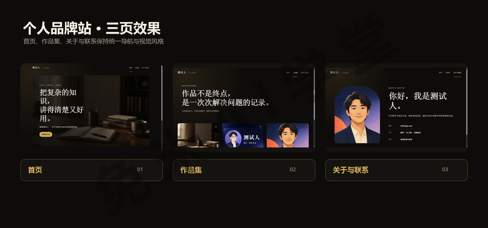

**和名片站差在哪**

《计划模式》的名片站回答了三个问题：你是谁、做什么、怎么联系你。品牌站要多回答一个：凭什么信你。回答它的就是作品集页：把你做过的东西摆出来，访客自己会判断。形态上，则是从单页展示变成多页内容，随之带来三个单页站不会遇到的新问题：页与页要能互相跳转、导航栏页脚这些公共部分要各页一致、验收要一页一页过。这一篇会逐个处理。

多页这件事，《计划模式》当时是刻意避开的：多页站生成量大，额度消耗也成倍涨，练习阶段不划算。这个成本账今天依然成立，变的是这笔钱值不值得花：正式作品需要作品集，这笔额度花得值。控制成本的办法这一篇也会给：立项时把页面清单锁死，三页就是三页，不让它自由发挥往上堆。

**实战篇怎么学**

本篇几乎不出现新功能。计划模式立项是《计划模式》的，立规矩和还原改动是《AGENTS.md、Diff 与还原》的，部署上线是《插件与部署上线》的，批注改版是《内置浏览器全解》的，生图补素材是《Skills 技能系统 + 桌面宠物》的。这一篇看的是它们怎么组合成一次完整交付：什么阶段该请出哪个能力、能力之间怎么衔接。行文里用到哪个点名哪个，细节记不清，回对应那一篇补课即可，这里不重复展开。

**这一篇怎么跟**

节奏上给两条建议。一条是先通读一遍再动手：功能篇可以随用随查，项目篇环环相扣，后面的翻车处理靠前面立的规矩兜底，部署环节的从容来自本地验收做扎实。先看完全程，心里有一张地图，做起来不慌。

另一条是不必一口气做完。文件和进度都在项目文件夹里，规矩写在 AGENTS.md 里，今天立项、明天生成，中间关掉应用什么都不会丢。额度紧张的读者更建议拆成两三次：生图和多页生成放在不同的日子，每一步验收踏实了再往前走，比一晚上赶完更省额度也更省心。

**动手前提**

找出名片站的项目文件夹：《计划模式》里提醒过保留它，《插件与部署上线》给它上过线，《内置浏览器全解》用批注改过版。项目还在，双击页面文件确认能打开，就绪。如果文件夹删了或找不到了，也不用回头补课：按《计划模式》名片站案例的做法，花十几分钟重建一个最小版名片站（信息用你的真实信息），再回来跟这一篇，进度完全接得上。

### 16.2 需求梳理与素材准备

**先想清楚，再开工**

实战项目和练习最大的区别：练习做错了重来就是，项目返工是要真金白银烧额度的。所以第一步先把需求想清楚，再谈发指令。《计划模式》的需求三要素——样例、规则、范围——落到这个项目上就是三份准备：

- **给样例**——找一两个你喜欢的个人网站或作品集站，存下链接或截图。说不清“想要什么感觉”没关系，给它看一眼参照，比堆一串形容词管用；喜欢参照站的哪一点（排版疏朗、配色克制），顺手记一句。
- **给规则**——把页面清单锁死：首页、作品集、关于与联系，共三页，不在清单里的页面不许建。风格基调也在这里定下来：延续名片站的气质，还是趁升级换一套，一句话写明。
- **给范围**——第一版做什么、不做什么，边界划清。建议的“不做”清单：真能提交的表单不做（页面是纯展示的，背后没有接收数据的服务，表单提交了也没人收）、博客不做、英文版不做。范围收得越紧，第一版越快能上线，想加的以后随时加。

不知道上哪儿找参照，给两个现成的网站，打开就能直接浏览，不用登录：

- [land-book.com](https://land-book.com)
- [recent.design](https://recent.design)

land-book.com 按类型收录成套的真实网站首页截图，翻起来最快；recent.design 的 Websites 版块里点 Portfolio 分类，就是一整页的个人作品集站参照（版块与分类名以实际界面为准）。挑一两个顺眼的存下链接或截图就够用：参照的用途是对齐感觉，不必照抄。

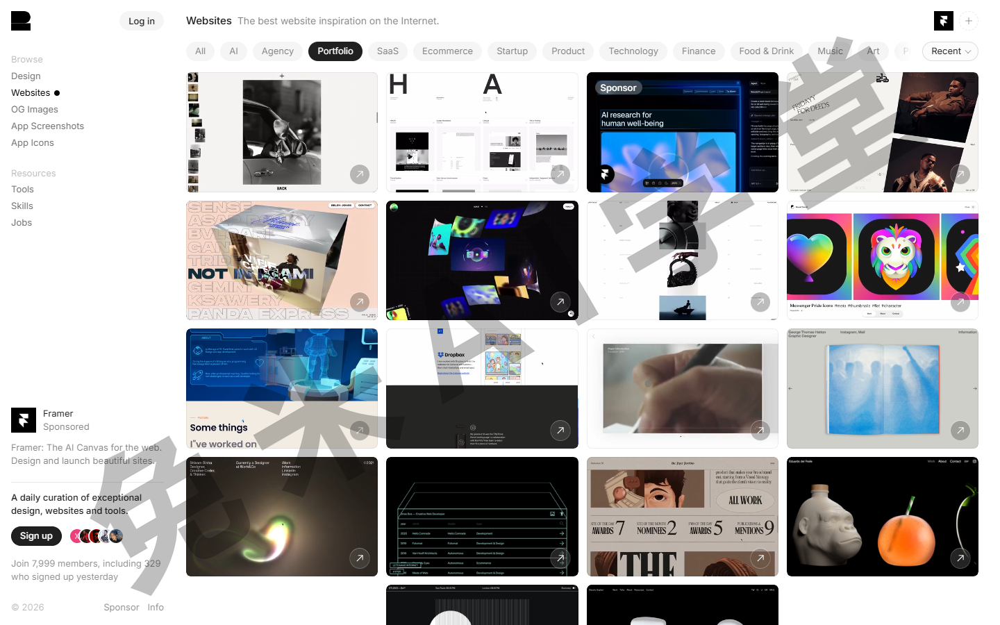

**盘一盘素材**

品牌站是内容撑起来的，开工前把素材备齐：头像一张（名片站的 AI 卡通头像可以沿用，想换新的下面用生图解决）；作品每件一张配图加两三句说明——做过什么、解决了什么、结果如何；个人简介一段，几十字即可；联系方式想清楚放到什么颗粒度——邮箱、微信号还是只留二维码，站点上线后是公开的，颗粒度自己拿捏。

整理方式：在项目文件夹里新建一个 images 文件夹，头像、作品图放进去，文件名用小写英文；作品说明和个人简介写进一个 sucai.md 文件放在项目根目录。后面的提示词会直接点名这些文件，AI 拿素材不用猜。

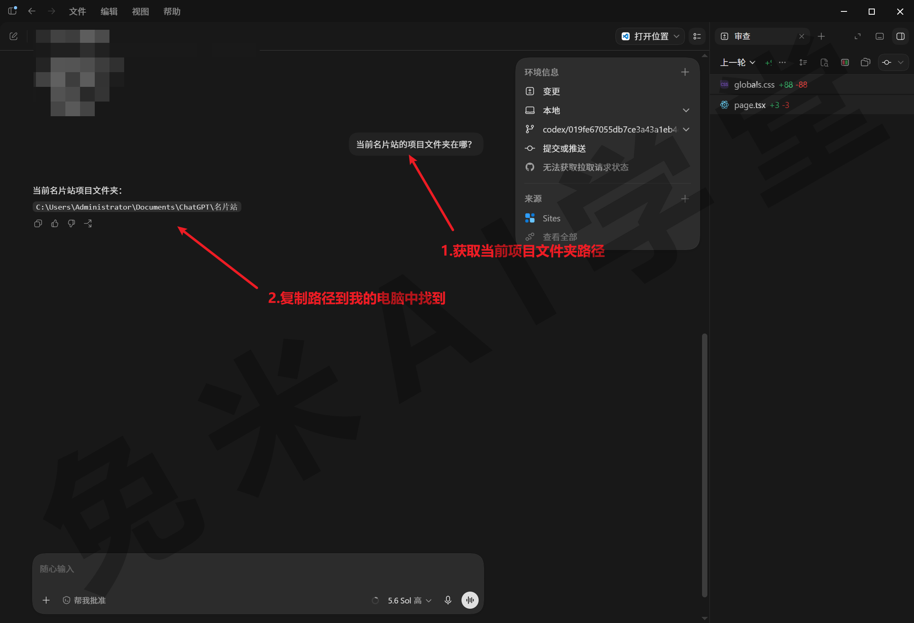

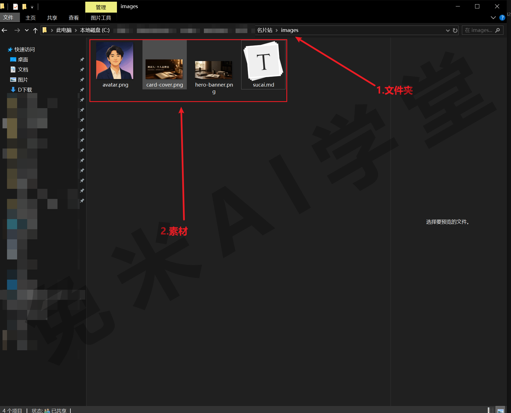

**素材缺口，生图补**

没有横幅主图、作品缺配图、头像想换风格，这类缺口用《Skills 技能系统 + 桌面宠物》学过的生图（imagegen）技能补。下面这条提示词可以直接复制，方括号里的内容换成你自己的，全篇提示词都按这个约定。输入 `$` 选中生图技能后发送：

```
给我的个人品牌站生成一张横幅主图：[画面内容与风格描述，例如“清晨的书桌一角，暖色调，
干净现代”]，横版宽幅，画面里不要出现文字，保存到项目的 images 文件夹。先出一张我看效果。
```

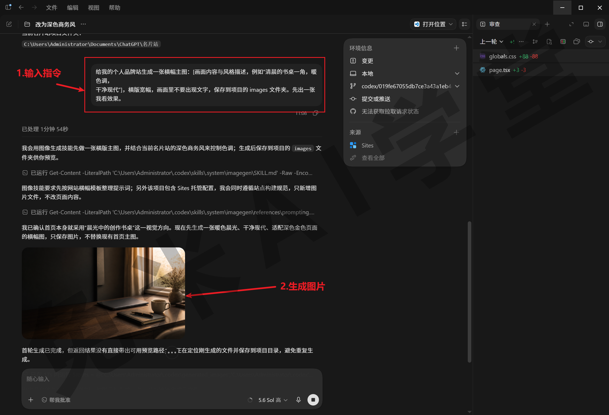

生图的两条老规矩，在这里尤其要守：

- **先样张后放量**——先出一两张定下风格，满意了再照着样张补齐整套；生图耗额度，成批返工浪费也成批。
- **图要落在项目里**——提示词里写明保存位置，生成的图就会落进项目文件夹；万一发现图“不见了”，发一句“把刚生成的图移进项目的 images 文件夹并更新引用”即可（以实际表现为准）。

手头实在没作品可摆的，先别卡在这一步，文末常见问题有专门的答案。


### 16.3 计划模式立项与 AGENTS.md 定规矩

**一句话开工，逐题对齐**

素材就绪，开计划模式立项。进入名片站项目，开启计划模式，发送：

```
把当前项目从单页名片站升级成个人品牌站，先出计划和我确认，确认之前不要动手。要求：
- 共三页：首页、作品集、关于与联系，页面之间用统一的导航栏和页脚互相跳转，
不要再增加其他页面
- 首页用 images 文件夹里的 [横幅图文件名] 做横幅，放姓名、职业和一句话简介
- 作品集页展示 [作品数量] 件作品，图片在 images 文件夹，说明文字在 sucai.md 里
- 关于与联系页放个人介绍和联系方式，沿用名片站现有的二维码占位区
- 风格参考：[参考站链接或一句话风格描述]，配色在计划里给出方案
- 手机和电脑打开都要显示正常
- 本次不做：能真实提交的表单、博客、多语言
```

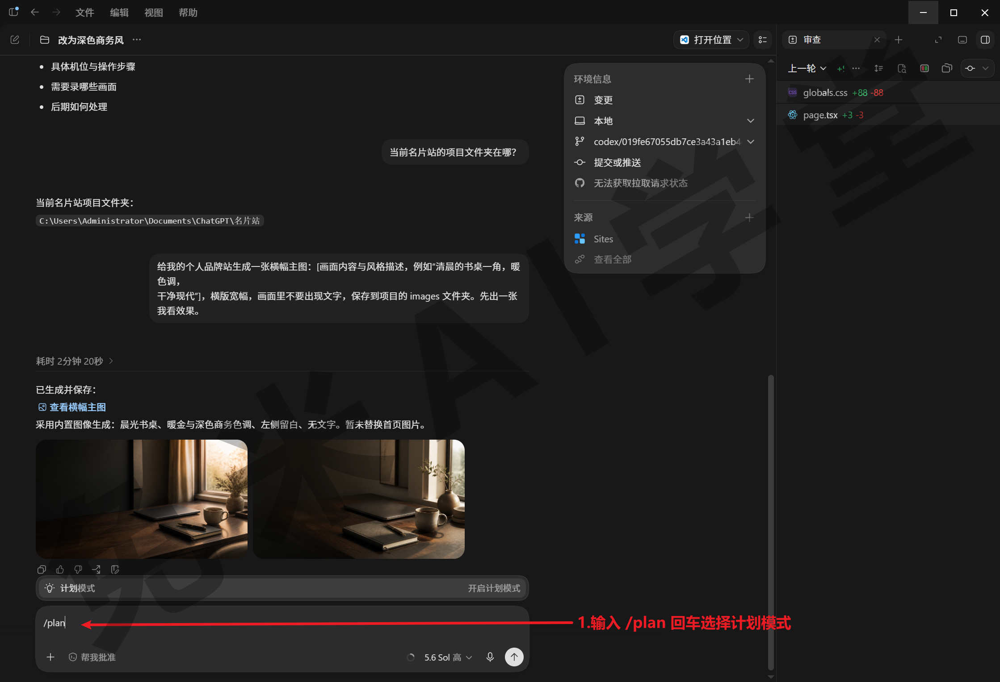

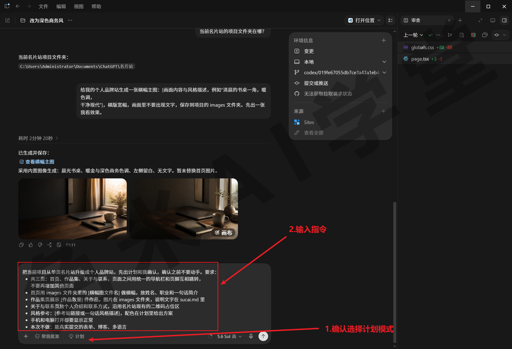

接下来是《计划模式》走熟的流程：逐题追问按真实情况回答，拿不准的选推荐项；计划文档出来后按四类要点过一遍——目标对不对、范围有没有超、步骤合不合理、有没有碰不想动的东西。

**在计划层面改稿**

计划多半会有要改的地方，这也是先出计划的好处：在计划里改，几句话就调整过来；等成品做出来再改，就要再烧一轮额度。假设计划里给每件作品都安排了单独的详情页，页面数一下就超出了三页的清单，范围超了就要在这一步改回来。发送：

```
计划改两处：作品不做单独详情页，全部在作品集页内展示；页面总数保持三页不变。
改完给我看更新后的计划。
```

确认计划文档改过来了再谈实施。这个“先改计划再动手”的动作，本篇后面还会用第二次。顺带说清砍详情页的底气在哪：第一版把范围收紧不是抠门，而是因为上线后的站点随时可以迭代更新（部署环节会看到，新版本走的是同一个地址）。先让三页站立住、上线，详情页和博客这类想法排进以后的迭代清单，比第一版什么都要、结果迟迟上不了线划算得多。

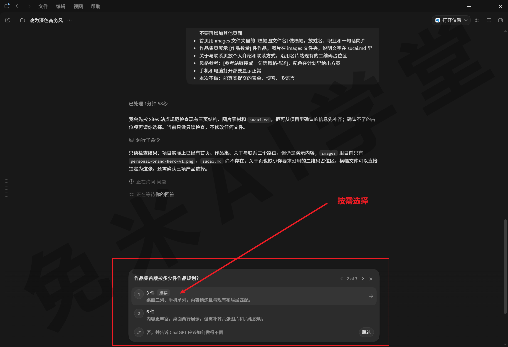

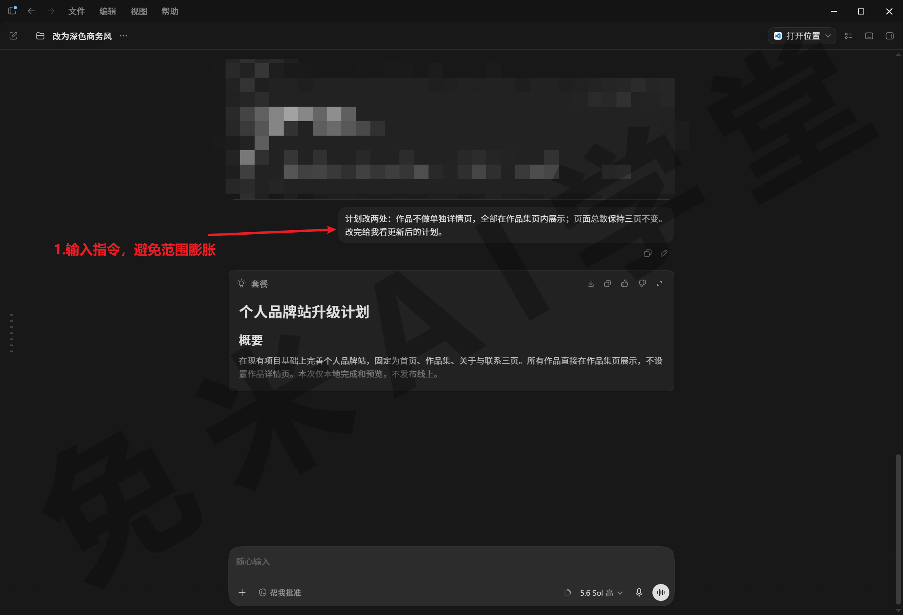

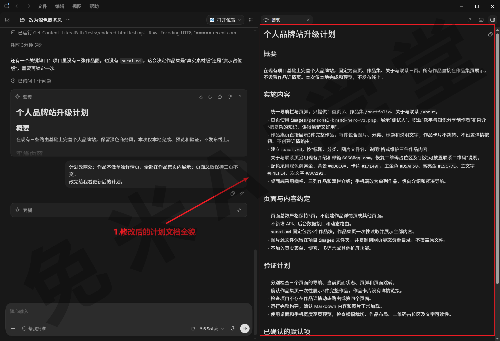


**规矩跟着项目升级**

动手前还有一件事。名片站这个项目，在《AGENTS.md、Diff 与还原》里定过规矩，其中一条禁区是“配色方案不许修改”。它拦 AI 自作主张拦了好几篇，但这次升级本身就要换配色，老规矩不更新，新配色一落地就和规矩打架。实战里要记住这一条：大改版之前，先检查规矩文件要不要跟着改。发送：

```
打开项目的 AGENTS.md，按品牌站的情况更新：
- 约定保留：页面文案统一用简体中文；新增图片放进 images 文件夹，文件名用小写英文
- 禁区更新为：本次计划敲定的新配色方案，实施后不许再修改；
sucai.md 里的个人介绍和联系方式文案是定稿，页面上不许改动措辞
改完把更新后的全文发我确认。
```

逐条读一遍它更新后的内容，确认禁区是你真正在意的。这一步必须放在实施之前：多页生成是本项目动静最大的一轮，成片的新内容都会在这一轮落地，规矩先立住，新页面从生成的第一行起就受它约束；先生成再补规矩，等于让这一轮生成完全没有约束，回头返工的面最大。规矩生效后，后面每一轮改版它都会自觉绕开这些红线，多轮迭代不跑偏，靠的就是这份文件。都确认了，回到计划，发一句“按计划实施”。

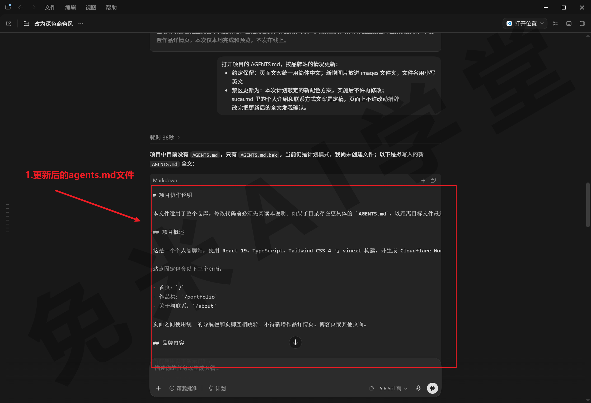

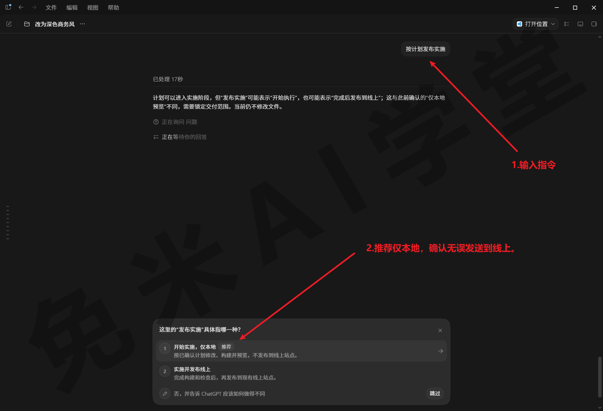

### 16.4 第一版生成与本地预览

**围观它干活**

实施开始后值得旁观一阵。任务区能看到它逐页建文件、写内容：首页、作品集、关于与联系挨个成形，横幅图被搬上首页，作品说明从 sucai.md 里取出来填进卡位。旁观时对着计划文档核一件事：它实际做的步骤和计划是不是一一对应，明显跑偏就出声；怎么出声，下一节第一轮变更就会演示。页面写完后，它通常会自己打开内置浏览器过一遍效果，发现问题自行修正，这个自测习惯《计划模式》里见过，《内置浏览器全解》讲过它的底细。多页生成量大、耗时也长，不必全程盯守：开头几分钟看它起手顺不顺，中途回来看两眼进度，结尾看它自测就够了。

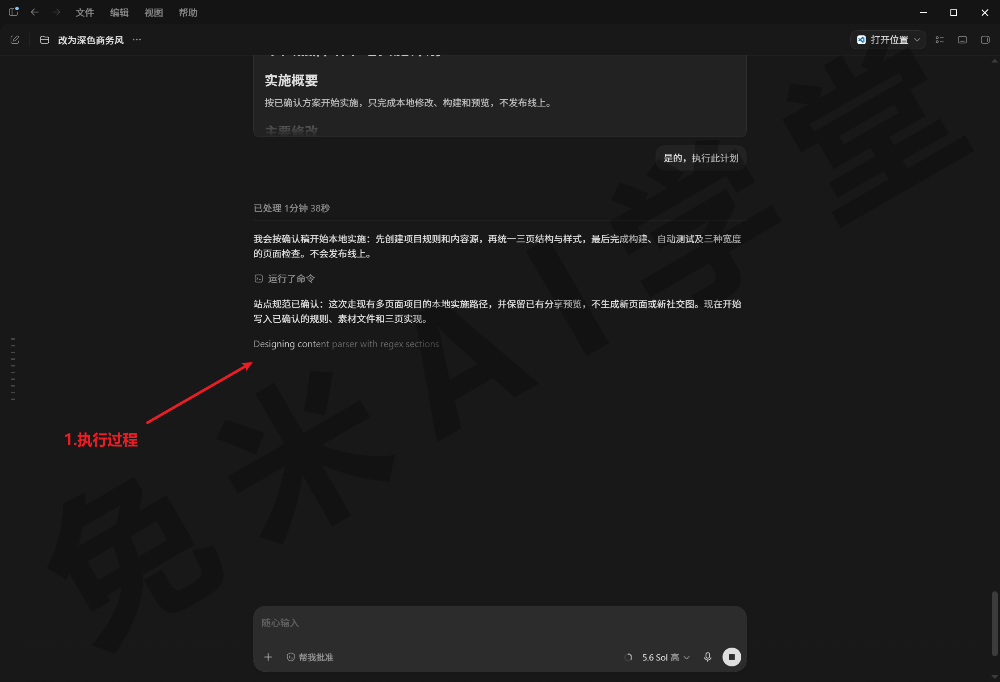

**逐页验收，别只看首页**

任务结束，进入多页站的第一次完整验收。单页站扫一眼就算验过，多页站得按清单来。让它起一个本地预览（或直接双击打开页面文件），按下面的顺序过，一页都别跳：

- **三页逐个打开**——内容显示完整，素材图都在位，没有占位符残留；作品说明和 sucai.md 里写的一字不差。
- **导航互通**——从任何一页出发，点导航能到另外两页，再点能回来；页脚的链接也逐个点一遍，断链在本地发现，改起来最省事。
- **公共部分一致**——导航栏、页脚在三页上长得一样；这是多页站最容易露馅的地方，公共部分各页各一套，观感立刻掉档。
- **手机宽度**——在浏览器里按 F12 打开开发者工具，点设备模拟图标把宽度切到手机档（选一个手机机型即可），三页再各过一遍，看布局有没有挤成一团。你发出去的链接，大多数人是用手机点开的，手机上的效果必须当回事；这一步在本地就要做，别等上线后才发现小屏排版乱掉。


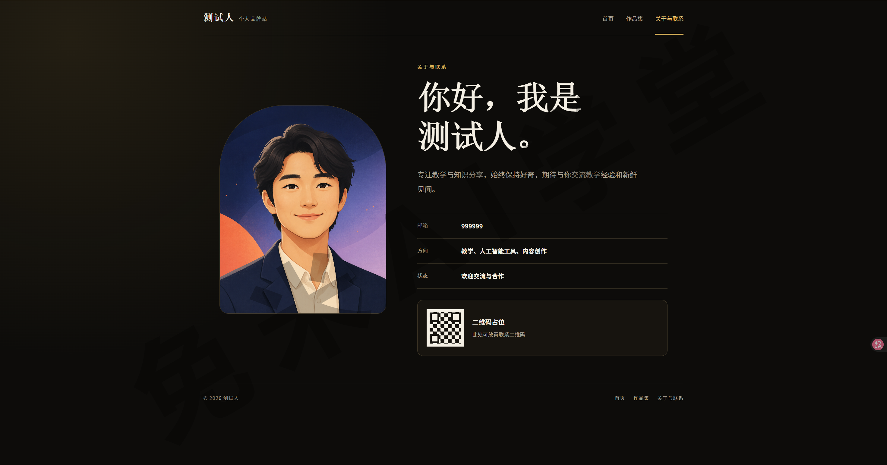

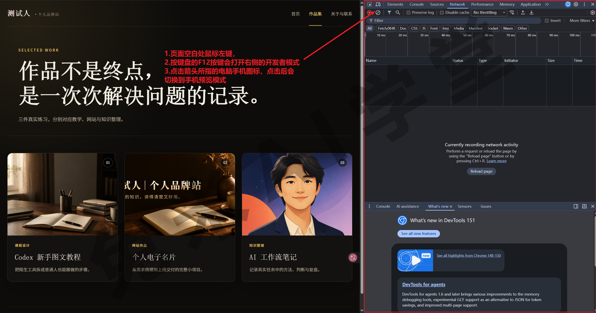

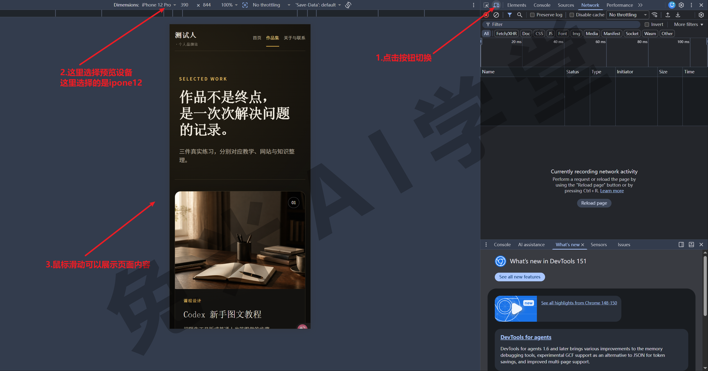

**Diff 面板对一遍账**

预览和 Diff 面板验的不是同一件事：预览看页面效果对不对，Diff 看改动范围对不对，两道都过才算验收。打开《AGENTS.md、Diff 与还原》用熟的 Diff 面板，扫一眼改动列表：动的文件是不是都在预期内，有没有出现不该碰的名字，比如 AGENTS.md 本身、sucai.md 定稿。首版生成动的文件多，列表长是正常的，重点放在扫出“不该出现的”，不必逐行细读。有异常先追问，没异常这一版就算落地。

**对第一版的合理预期**

第一版的标准状态是：能看，但有硬伤。横幅可能空得慌，作品集排得单薄，某处文案不是你的语气，都正常。实战项目不指望一次做对，第一版先把骨架立起来，效果靠后面几轮迭代磨出来。憋着的修改意见先分个类：“横幅太空”这种当下就想补的小方向是一类，“作品集要换布局”这种动结构的想法是另一类，两类的处理通道不一样，下面两节按轻重分流。

### 16.5 两轮真实需求变更

需求变更是项目的常态，不算事故；实战篇把它当正式环节，两轮都如实记录，包括中间翻的一次车。两轮的分量不同，处理方式也不同，本节要练的就是这个判断。

**第一轮：方向级偏差，用引导，不停车**

场景：第一版还在生成，你盯着半成型的首页，发现横幅区光有图太空，缺一句让人记住你的话。这是方向级的小调整，任务没必要停。《计划模式》讲过执行中递话的两条通道，排队和引导，这里要的是立刻生效，走引导：

```
补充一个要求：首页横幅图下方加一行个人标语，就用简介里那句话，字号比正文大一档。
继续当前任务，不要从头重来。
```

消息如果显示在排队，把它切成引导注入。之后看两个结果：任务没有中断重来，前面生成的页面原样保留；标语出现在了横幅下方。一条消息的事，零返工。名片站当年往联系方式区补二维码占位，用的就是这一招。

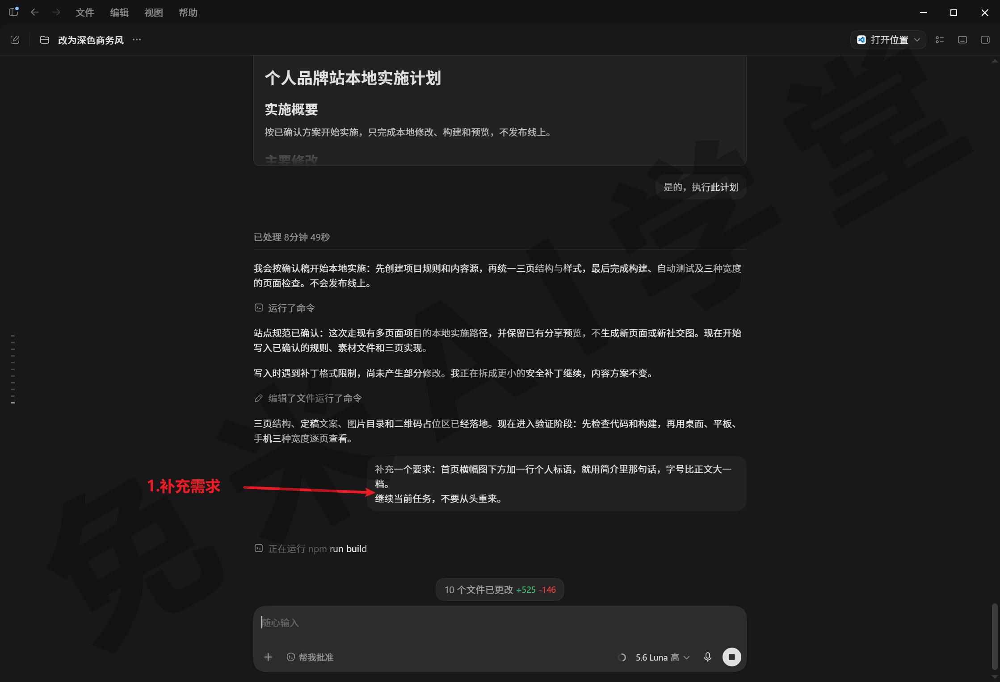

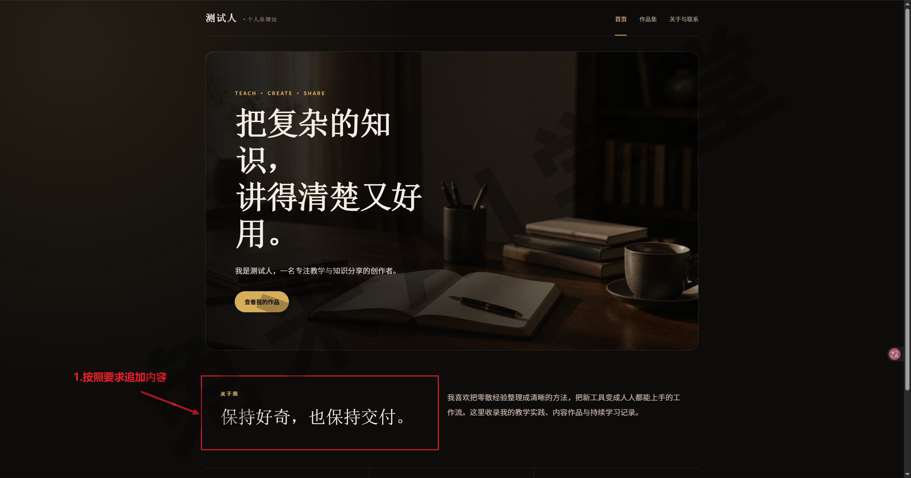

**第二轮：结构级调整，回计划层面**

场景：第一版验收完，作品集页平铺的长列表越看越单薄，你想改成卡片式：每件作品一张卡片，封面图、作品名、一句话说明，点开看大图。这次不是挪个元素的小调整：页面结构要变，布局、样式和交互都跟着动。这种量级再用引导塞进去，改动只会越积越乱；正确做法是回到计划层面，新起一轮：

```
作品集页要做一次结构调整：从平铺列表改成卡片布局，每件作品一张卡片，含封面小图、
作品名和一句话说明，点击卡片查看大图。先更新计划文档给我确认，确认之前不要改页面。
```

计划更新，确认，实施，和立项走的是同一套流程，只是这次范围小得多。


**这轮没翻车，但别指望每轮都走运**

这轮实施完，逐页验收走下来：卡片改好了，另外两页没被殃及。这次运气不错，但风险本身还在：卡片改版动的是公共样式，公共样式牵一发动全身，别的页面早晚可能被殃及。所以逐页验收这道工序一轮都不能省，尤其盯紧导航栏、页脚这些公共部分：上一轮还好好的，这一轮就可能被顺手改乱。

真殃及了怎么办？分两步，都是《AGENTS.md、Diff 与还原》的老手艺。第一步定位：打开 Diff 面板，找到被殃及的是哪个文件里哪一块改动。第二步退回：当前版本的审查面板以看账为主，没有“单独还原某一块”的按钮，退指定改动的办法是回对话点名——说清退哪处、别的不动。假如页脚被改乱了，回对话这样发：

```
把公共样式里页脚那处的改动退回，恢复原来的间距和链接颜色，
卡片相关的改动一概不要动。
```

它退得又快又准，别的改动一点不受影响。有了这手“指哪退哪”，翻车就不算大事，不用动辄整体重来。

**两类变更怎么分**

方向级的小偏差用引导，不用停车；结构级的变化改计划，先对齐再动手。分不清的时候问自己这个改动牵动几处：只动一处的用引导，成片牵动的回计划。另一条纪律同样重要：一轮只做一件事，改卡片的那一轮别顺手塞进“再换个字体”，新想法先记在清单里，下一轮再说。变更一轮一轮排着来不怕，全挤在一轮里才容易乱。

### 16.6 批注法多轮改版

**结构定了，进入精修**

两轮变更后骨架稳定，剩下的是视觉细节：这里间距大一点、那个标题字号压一压、卡片阴影轻一些。这类“位置难描述、效果凭感觉”的修改，最合适的做法是《内置浏览器全解》的批注法：在页面上圈哪改哪，不用费劲描述“中间那块下面的第二个按钮”。

**多页站的批注纪律**

老规矩不变：一个批注只管一处，写清问题加期望；攒两三条一次提交，省掉逐条往返的开销。批注怎么写才算合格，给两个示例：圈住卡片写“阴影太重，改成若有若无的浅阴影”；圈住标题写“字号大一档，颜色用规矩里锁定的主色”。都是一处一条、问题加期望，它照着改，不用猜。多页站再加一条新纪律：**一页圈完统一发出，验收完这一页，再换下一页**。跨页批注混在同一轮里，它定位出错的概率会上升，改完你核对起来也乱（跨页批注的实际表现，以实机为准）。在本地预览里打开要改的页面（这轮先改的是关于与联系页），右键页面、菜单里选“评论”进入批注模式，圈几处写清要求，回对话发送：

```
按我在关于与联系页留的批注逐条修改，告诉我每处分别改了什么。
```

改完刷新核对：圈过的落实了，没圈的没被动。然后首页、作品集页，同样各来一轮。另外，拿不准“深一点还是浅一点”这类视觉参数时，批注输入框旁如果提供调整面板，可以直接在面板里拖字号、试颜色，页面实时预览，调到满意再作为明确要求发出去（《内置浏览器全解》介绍过，入口与可调项以实机为准）。

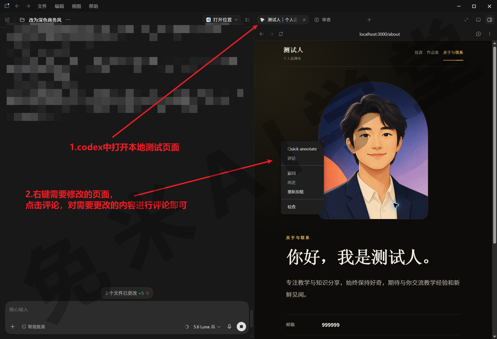

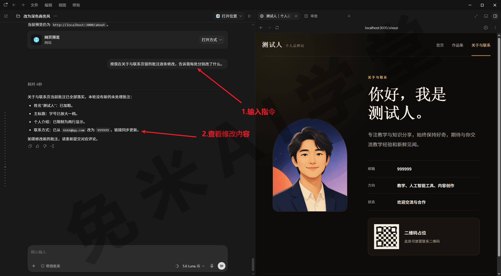

**更小的改动，源文件里手改**

批注也有杀鸡用牛刀的时候。一个错别字、一个颜色值这种一眼定位的微调，用《AGENTS.md、Diff 与还原》教过的手艺最快：审查面板本身不能直接改文本，点击 Diff 里的文件名，会用“打开位置”指定的编辑器打开源文件（比如装了 VS Code 就会用它打开，以实机为准），改完保存即可。不想自己动手，就回对话一句话点名：“把关于页介绍里的‘新鲜见闻’改成‘新鲜想法’，其他不动。”

**图片也能圈了**

改版途中横幅图或头像看着不顺眼，不必回炉重生成。页面预览里直接在图片上点右键，菜单里选“评论”，就能像圈页面一样在图上圈出不满意的地方、写清定向修改要求再发送。“圈哪改哪”从页面通到了图片，和《内置浏览器全解》里圈页面是同一个用法。精修产出的通常是新文件、不覆盖原图，选定版本后让它替换页面引用即可（以实际表现为准）。额度纪律照旧：老图满意就别连带重生成，只修不满意的那一张。


**每轮改完，过一遍禁区**

多轮改版最后一道工序：对照 AGENTS.md 的禁区扫一眼。配色还是敲定那套吗？定稿文案的措辞被动过吗？拿不准就新开对话问一句“你当前遵守的项目规矩有哪些”，回答和文件对得上才算数。发现越界，Diff 里定位还原，再把批注要求写得更明确重来一轮。规矩每轮验一次才真正起作用，验过心里有底，多轮迭代才敢放开手改。

### 16.7 部署上线与二维码交付

**更新已上线的站点**

名片站在《插件与部署上线》已经上过线，这次不是从零部署，是给已上线的站点发新版。两条路线也还是那两条：官方 Sites 零配置省心，公测开放范围看账号（套餐与地区的开放进度，以实际界面为准）；Netlify 插件谁都能用，控制台里部署记录和日志齐全。当时用哪条，这次接着用哪条即可；账号一直没有 Sites 入口的，可以到插件目录里找找 Sites 手动添加，装完开个新对话再试（入口与可行性，需实机验证），还是没有就安心走 Netlify。

更新的好处是地址不换：改完重新部署，同一个链接原地换新内容，之前发给别人的链接、生成过的二维码全都继续有效。发送：

```
把当前项目重新部署上线，沿用之前的部署方式和地址原地更新。
完成后把正式访问链接发我，我要自己逐页检查。
```

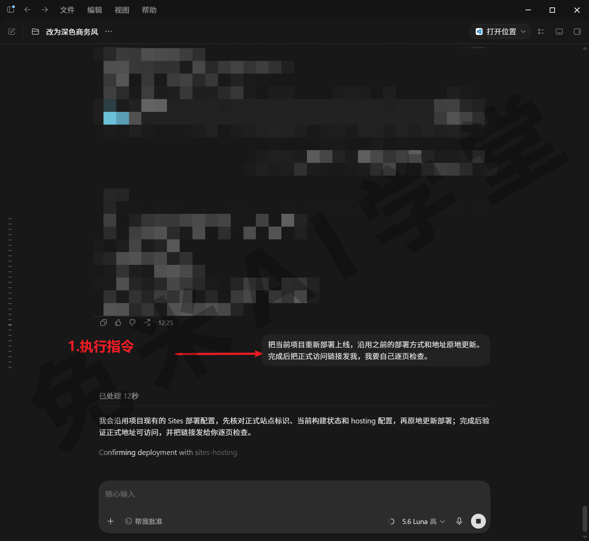

**上线验收：多页站的新变体**

《插件与部署上线》定过规矩：部署显示成功不等于页面正常，第一时间自己点开看。多页站要加码执行：首页正常不算完，**每一页都点到、导航逐个跳一遍**。多页站的经典翻车是首页好好的、子页打开 404 或导航点不动，发布目录、相对路径、文件名大小写都可能是元凶（具体归因以实际排查为准）。遇上了不慌，用熟悉的老办法：截图丢回对话，让它读部署日志归因、修复、重新部署。

再用手机过一遍：换用手机流量（不连 Wi-Fi）打开正式链接，三页走一圈。部分网络环境下托管域名可能打开缓慢或不稳定（以实际网络表现为准），分享出去之前自己先用手机流量试一遍，心里有底。

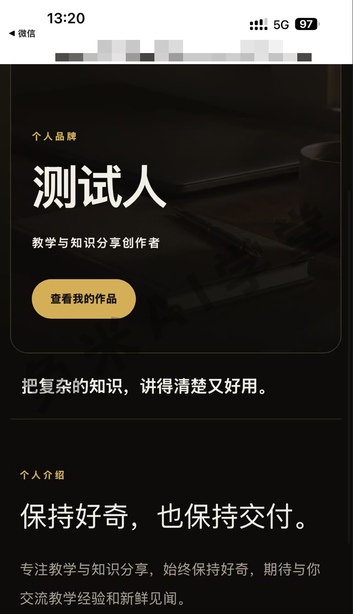

**交付物料：做一张带二维码的名片图**

链接没变，《插件与部署上线》生成的那张二维码还能用；没做过或想升级观感，这次做一张正经物料。先让它生成正式链接的二维码（码必须用工具生成：生图技能画出来的只是“长得像二维码的装饰图”，扫不出），再和生图素材合成：

```
用项目里的二维码图片和横幅图合成一张竖版名片图：上半部分放横幅和我的姓名、职业，
下半部分放二维码和“扫码查看我的作品”一行字。
二维码保持原图清晰度，不缩放不加滤镜，用代码拼图，不要重新生成二维码。
```

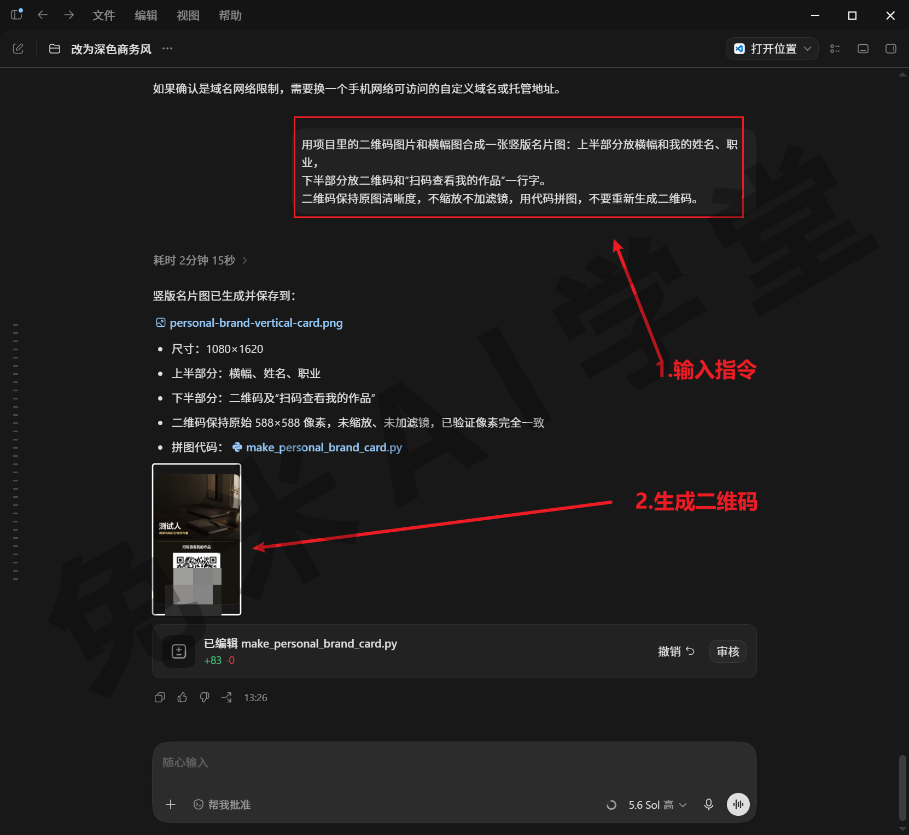

合成完，交付前的固定动作：自己掏出手机实扫一次，扫得出、跳得对，物料才算合格。


**发出去之前的最后两件事**

把链接发出去之前，交代一下访问统计：不少托管平台自带访客量统计，但本次实测的 Sites 版本没有找到现成的统计入口——问它“访问统计在哪看”，回答是站点未装统计、只能看近期访问日志（以实际界面与账号版本为准）。真想要数据也不难：让它给站点加访问统计，数据从启用当天开始记；个人品牌站没有它也不耽误交付，要不要加由你定。域名方面，默认二级域名对个人品牌站完全够用；想绑自己买的域名，文末常见问题有交代。

### 16.8 验收清单

项目交付要过清单，不能凭感觉。基础篇的练习任务是课程出题、你来完成，从这一篇起换你自己当验收方：下面五项对着你自己的项目逐项验，每项都给了判定标准，能过就勾，过不了就回对应的节返工；全部勾完，这个项目才算交付。验的时候真动手点、真拿手机扫，别在脑子里过一遍就当过了。它和“本篇小结与自检”分工不同：那边验的是你学没学会，这边验的是项目合不合格。

- **品牌站已上线，链接他人可访问**——判定标准：用手机流量（不连自家 Wi-Fi）打开正式链接，首页、作品集、关于与联系三页都能打开，导航来回跳不断链；再把链接发给一位朋友，请对方在他的设备上点一遍，回一句“能看”。只在自己电脑浏览器里验过的不算数：你自己的浏览器有缓存、连着熟悉的网络，和别人打开时的环境不一样。
- **完整走过“批注意见 → 修改 → 上线”闭环**——判定标准：能在线上页面指出至少一处修改，说清它来自哪条批注、当时圈在哪一页哪个位置；且这处修改是重新部署后在线上可见的，不是只停留在本地预览里。闭环的三段（圈、改、上线）缺任何一段都不算走通。
- **两轮需求变更分别用对了“引导”和“改计划”**——判定标准：能复述两轮各自的场景和选择理由，哪一轮为什么不停车、哪一轮为什么先改计划；引导那一轮任务没有中断重来，改计划那一轮计划文档先于页面更新。两轮的具体内容和本篇不同没关系，判断的理由站得住就算过；说不出理由的，回两轮变更那一节把判断口径再过一遍。
- **AGENTS.md 禁区经受住了多轮改版**——判定标准：翻开 AGENTS.md，对照线上页面逐条核，配色是计划敲定的那套没被漂移，定稿文案措辞和 sucai.md 一字不差；或新开对话问“你当前遵守的项目规矩有哪些”，回答与文件一致。任何一条对不上，说明某轮改版越了界还没被发现，回去用 Diff 定位处理。
- **二维码物料手机实扫通过**——判定标准：手机相机实扫合成物料上的码，直达正式链接打开的就是品牌站；码区清晰无变形。扫不出的，检查合成时码是否被缩放或加了效果，退回用原码重拼。打算把物料发进聊天群或打印出来的，再用转发压缩过的那张图补扫一次，压过的码更容易糊。

五项全过，恭喜：你交付了自己的第一个正式作品。这份清单本身也值得留着复用：往后凡是要交出去的东西，动手前先照这个思路列一份验收清单，换掉验收项、改改判定标准，骨架直接用。验收标准在开工前就定好，做的过程心里有数，这也是实战篇接下来几个项目的固定动作。

### 16.9 本篇小结与自检

这一篇完成了课程的第一个完整项目：把《计划模式》的迷你名片站升级成正式的个人品牌站，并重新部署上线。最需要记住的是：**实战项目不追求“一次做对”，主线是“立好规矩、小步迭代、随时可退”，需求变更和翻车都是流程的一部分。**

可以对照下面的清单检查学习结果：

- [ ] 品牌站已上线，拿到可以发给任何人的正式链接
- [ ] 用计划模式完成过立项，并在计划层面改过一次稿
- [ ] AGENTS.md 里写入了本项目的配色和文案禁区
- [ ] 完整走过一次“批注意见 → 修改 → 上线”闭环
- [ ] 经历过需求变更，能说出什么时候用引导、什么时候改计划

完成这些内容后，你已经有了第一个可以对外展示的正式作品。下一篇《报表自动化流水线》把每周重复的报表工作，变成无人值守的流水线。

### 16.10 新手常见问题

**Q1：没有作品和素材，品牌站放什么？**

学习记录就是作品。跟着这门课，你已经做过名片站、整理过文件、出过带图表的表格和汇报页，挑两三件截图配说明，就是第一批作品条目。先上最小版：简介加两三件学习成果加联系方式，以后做出新东西随时补一张卡片。配图缺口用生图补，但经历别编造：品牌站的底线是真实，页面可以简单，内容不能虚。

**Q2：改版轮次多了，对话越来越乱怎么办？**

三个习惯治它。一轮只做一件事，改完验收再开下一轮，别把五个想法揉进一条消息；大的阶段切换（比如精修全部结束、准备部署）可以直接开个新对话，规矩都在 AGENTS.md 文件里，不在聊天记录里，新对话照样守规矩，这也是把规矩写进文件的好处；单个对话确实太长了，先压缩再继续，《上下文与记忆》讲过手法。

**Q3：上线后继续改，会不会改坏线上版本？**

不会即时影响。线上版本和本地文件是分开的：本地怎么改、怎么翻车，线上都纹丝不动，只有你重新部署那一刻，新版本才会覆盖上去。所以节奏是：本地改好、逐页验收通过，再部署。真把有问题的版本部署上去了也有退路：部署平台保留历史版本记录，可以回到上一个能用的版本重新发布（入口与形态以实际平台界面为准）。

**Q4：可以绑自己买的域名吗？**

可以，两条路线都支持。大流程一致：在平台的站点设置里添加你的域名，按提示到域名注册商那边修改解析记录，等待生效（几分钟到几小时不等，以实际界面提示为准）。两个前提：域名要你自己花钱购买、按年续费，托管平台不代卖；你得有权限改这个域名的解析设置。要说建议：默认二级域名对个人品牌站完全够用，先上线、先把内容做好，域名这种正式感加分项，随时可以补。

