## 报表自动化流水线

上一篇《个人品牌站》做出了第一个对外作品，这一篇的项目对准另一类目标：不是做出一个东西，而是甩掉一件重复的事。目标很具体：每周的报表工作，从“乱数据进”到“带图表的 Excel 加一页汇报 PPT 出”，整条流程每周定时自动跑，你只负责验收。主线是三级进化：先在对话里把流程调到每次都对，再把调好的方法封装成自己的技能，最后固化成每周执行的定时任务。这一篇几乎不引入新功能，用的都是前面学过的能力，增量在把散落在各篇的本事串起来，组装成一条可以验收的流水线。

### 17.1 项目定位：三级进化路线

**从每周重复的那几个小时说起**

很多人每周都有这么一段：同样来源的数据，同样格式的表，同样版式的汇报页。做法也固定：把上周的文件复制一份，替换数据，检查公式，调整版式；数据要是乱一点，还得先手工清一遍再开始。内容基本不变，变的只是数据本身，这正是最适合交给 Codex 的一类工作：规则说得清，产出验得了。

**三级进化：本篇的主线**

这一篇不满足于“让它帮你做一次报表”，而是分三级把这件事彻底移交出去：

- **第一级，对话里跑通**：把“乱数据到报表”的整条流程放进一个对话，边跑边调，直到每次都对。这一级的价值是试错成本最低，哪一步不对，当场改当场重跑。
- **第二级，封装成技能**：把调好的方法写进技能文件，从此一句话复用，方法不再散落在聊天记录里；规则要改，也只改这一处。
- **第三级，固化成定时任务**：给技能挂上每周的时间表，无人值守自动跑。从此这件事不再占用你的日程，你只在验收时出场。

三级的顺序不能颠倒：技能封装的是“已经调好”的方法，定时任务重复的是“已经封装”的流程。第一级偷了懒，后面两级就是在自动化地重复错误。

**用到的都是学过的能力**

盘点一下这条流水线的零件：清洗数据、读写文件是《文件能力一集讲全》的本事；产出带图表的 Excel 和一页 PPT，是《办公能力一集讲全》的两个案例换了素材；封装技能用《Skills 技能系统 + 桌面宠物》的技能创建器；定时执行靠《自动化、Git 与远程操控》的“已安排”面板。每个零件你都单独用过，本篇把它们第一次组装成整机。

**动手前置：三件事**

- **建一个专用项目**：新建一个文件夹（比如叫“周报流水线”）设为项目，素材和产物都放在它里面。别小看这个安排，它在 17.6 的权限环节有直接回报。
- **数据源用本地文件**：本篇的流水线从项目里的文件取数，全程不联网。要先上网抓数据再出报告的自动化，是《调研情报系统》的内容，不在这条流水线里混讲。
- **做一次冒烟测试**：正式开工前，先花一分钟确认产报表的插件在你机器上能正常出文件（插件的安装与调用在《办公能力一集讲全》讲过）。输入 @，选中表格（Spreadsheets）插件，发送：

```
新建一个测试表格：两列，列名“事项”和“状态”，随意填两行示例数据；
保存为“冒烟测试.xlsx”，放进项目文件夹。
```

任务跑完，项目文件夹里出现“冒烟测试.xlsx”，打开是一份正常的表格，测试就通过了，让它把文件删掉即可。如果这一步就报错（比如提示缺少运行组件），先把应用更新到最新版再重试（报错形态以实际表现为准）。在流水线上线前发现环境问题，比它半夜自动运行时才失败要划算得多。

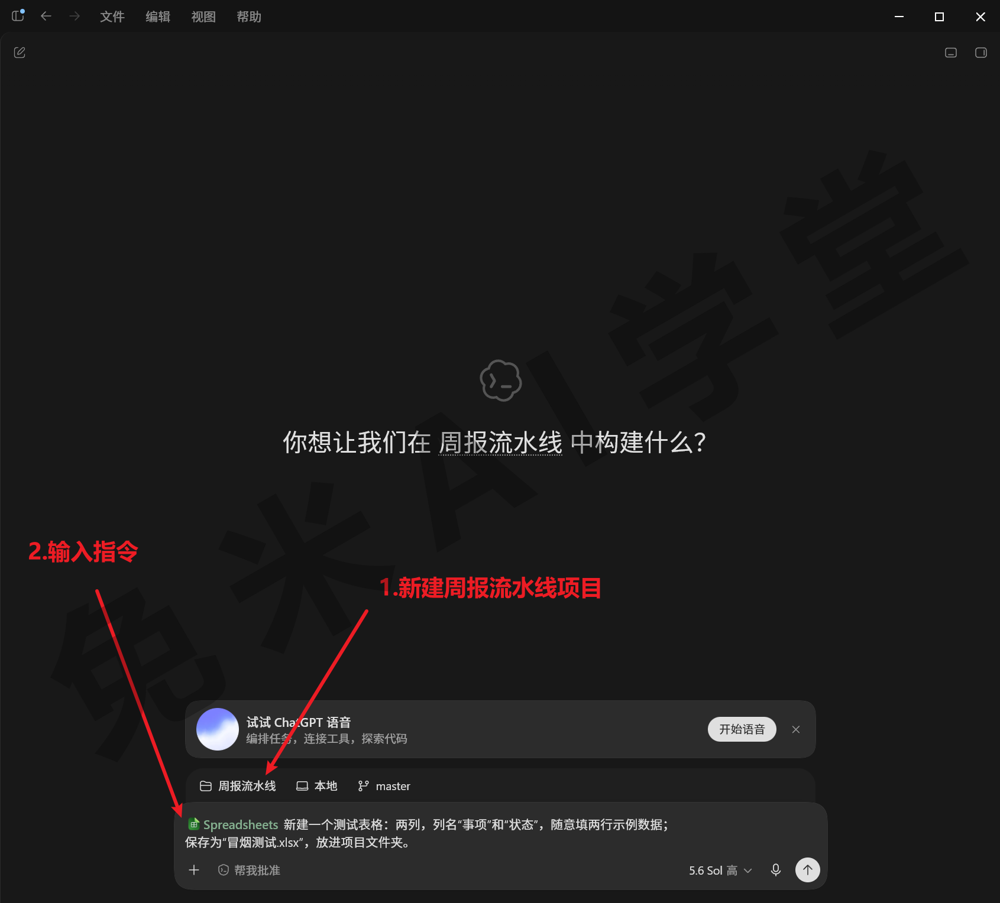

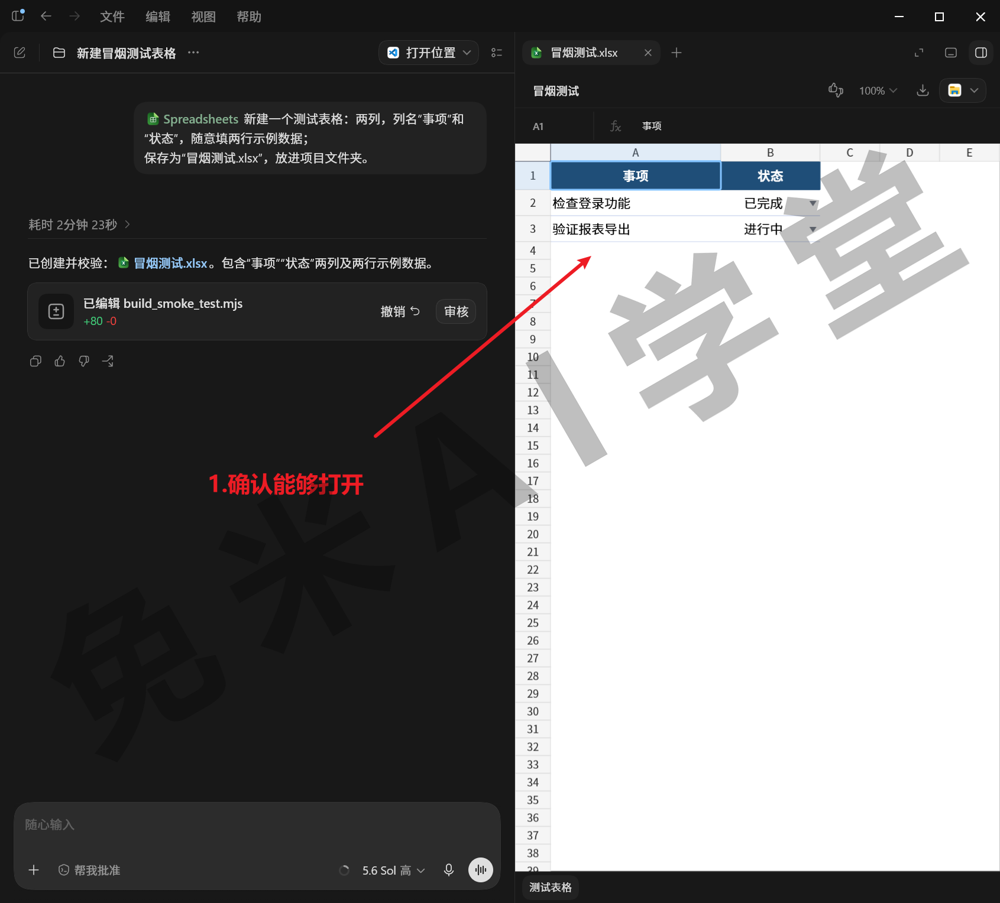

### 17.2 数据与清洗规则设计

**素材：准备一份够乱的流水**

最好的素材是你自己的真实数据：销售流水、记账明细、值班台账都行，越“乱”越能练出本事。手头没有合适的，就让它造一份演示素材，发送：

```
在项目里造一份演示用的乱数据：生成“流水-1月.csv”“流水-2月.csv”“流水-3月.csv”三个文件，
每个三十行左右，列是日期、客户、品名、数量、金额。
故意把它做乱：三个文件的列名写法不完全一致（比如“金额”和“金额(元)”），
混进几行完全相同的重复记录，留几处空着的数量或金额，日期格式两三种混用。
做完给我一张“埋了哪些坑”的清单。
```

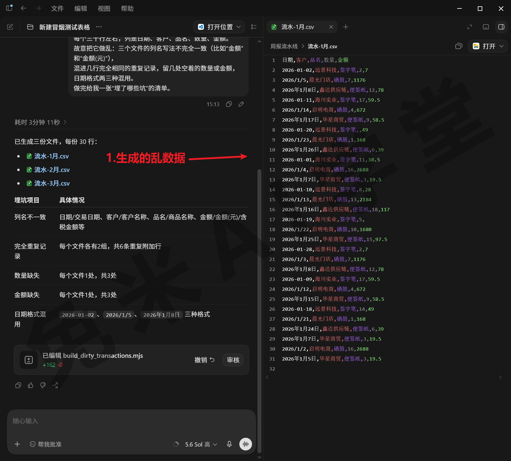

拿到手先扫一眼这张“坑清单”。这几类坑不是刁难：列名不统一、重复记录、数值缺失、格式混用，正是真实业务数据最常见的四类病灶，接下来的清洗规则就冲着它们去。

**清洗规则由你定，写成明文**

先说清本节最重要的一点：对 AI 说“帮我把数据清一下”，等于让它自由发挥：今天它这样理解“干净”，下周换个理解，产出就不稳定。什么算脏数据、怎么处置，必须由你一条条写成明文。规则无非三类：

- **格式统一**：列名叫什么、日期用哪种写法、单位怎么算，各给一个标准答案，五花八门的写法全部归一。
- **重复处置**：什么样的行算“完全相同”，重复了留哪条；删掉了哪些行，要列出来给你过目，不许悄悄删。
- **缺失处置**：数量、金额空着的行怎么办。本篇的口径是既不删也不补，挑出来放进“待补记录”，由你决定去留。

再加两条铁律，写规则时永远带上：清洗不许改动原始文件，结果一律另存；缺失的数字不许编造。这两条护的是 AI 处理数据的两条底线：源数据不可污染，数字不可无中生有。

**先小批量试跑**

规则写好了，别急着全量上。先拿一个月试跑，发送：

```
先只处理“流水-1月.csv”，按下面的规则清洗，先不要汇总：
1. 列名统一成：日期、客户、品名、数量、金额；
2. 日期统一成 8 位数字，例如 20260107；
3. 完全相同的重复行只保留一条，删掉了哪些行要列出来；
4. 数量或金额空着的行，不要删也不要编数字，单独放进“待补记录”表；
5. 不许改动原始文件，清洗结果另存为“清洗-1月.xlsx”。
做完汇报：清洗前后各有多少行，每条规则各命中了几行。
```

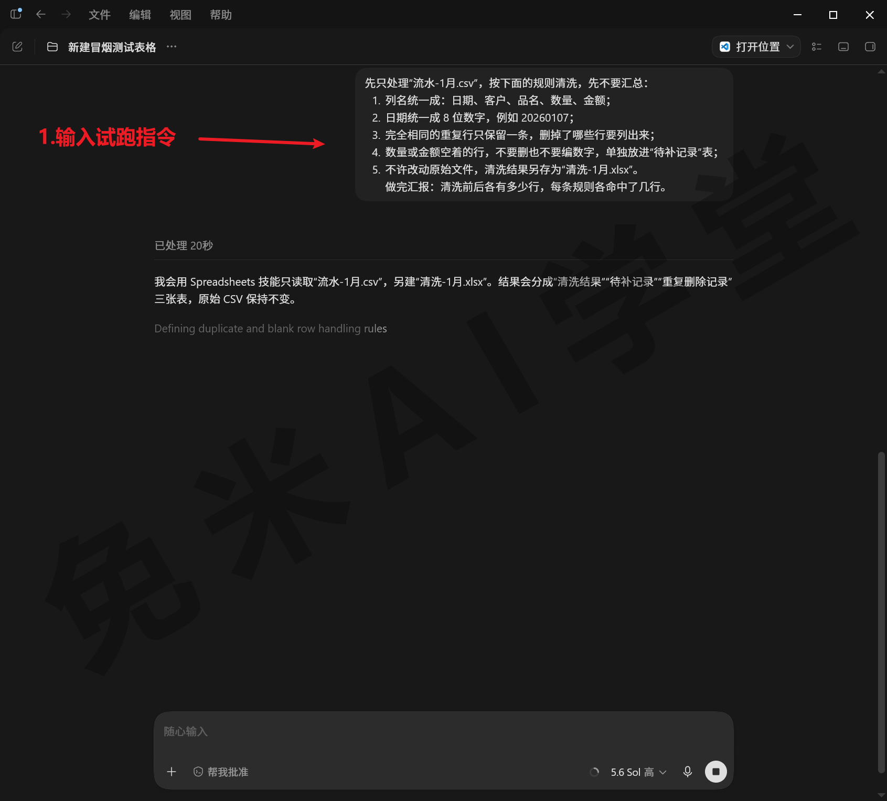

发送后它逐条执行，最后交回一本“行数账”：清洗前多少行、清洗后多少行、去重删了几行、几条进了待补记录。这本账就是你和它对规则理解是否一致的对账单：重复删得对不对，抽一条看看；待补记录里是不是恰好那几行空值，数一数。

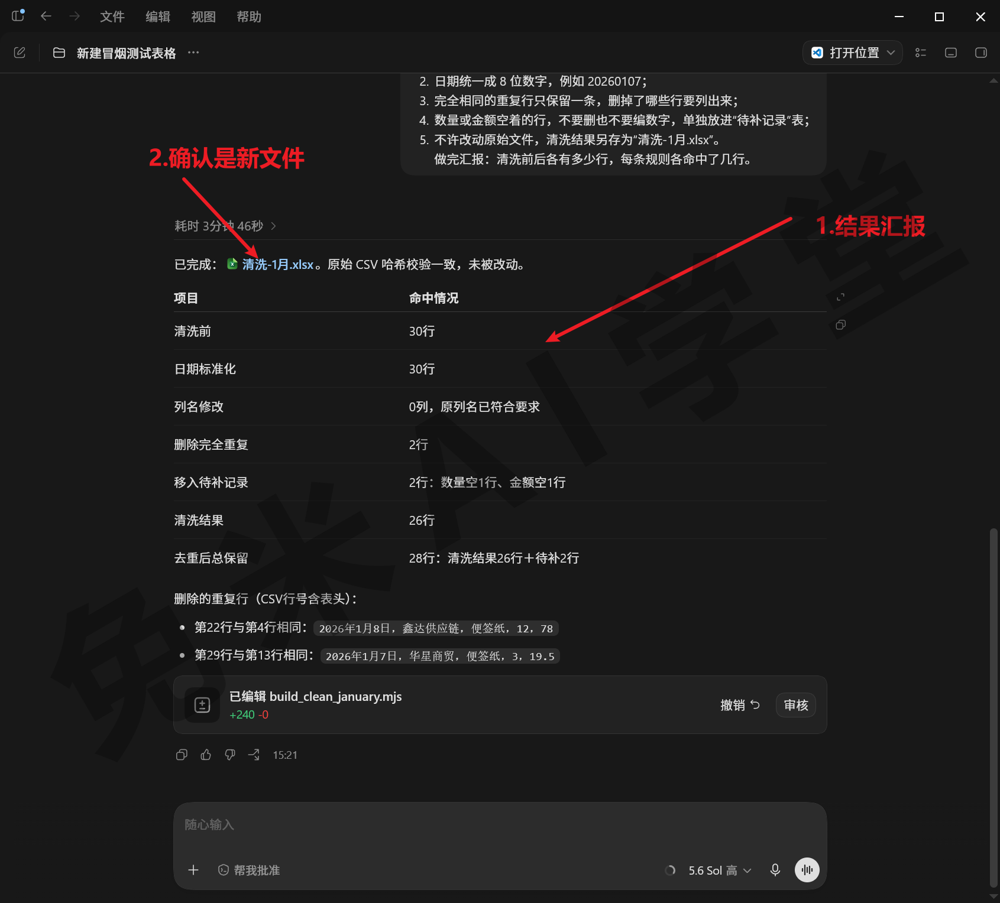

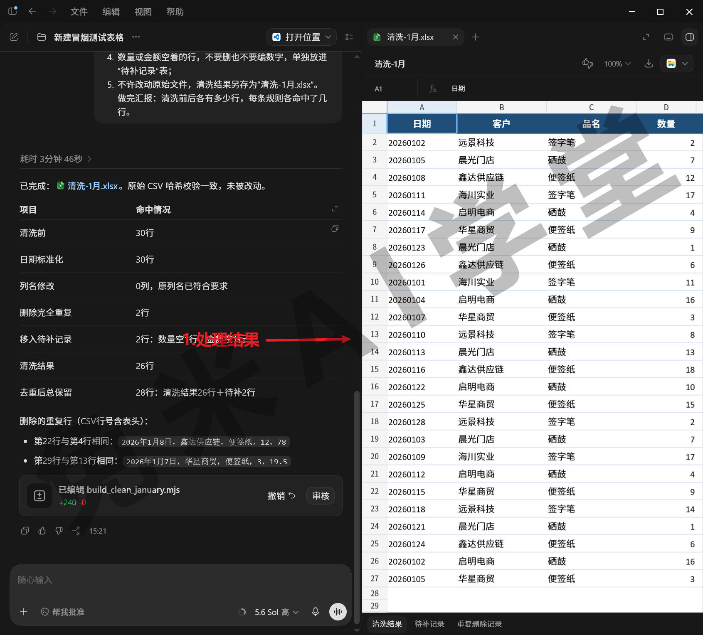

为什么先小批量：规则被理解偏了，三十行数据当场就能看出来，改一句话重跑就是；全量跑完才发现，返工成本翻几倍。先小范围验证、再放开全量，这个习惯从《文件能力一集讲全》一路沿用到现在。对账无误，规则就算和它“签字确认”了，下一节放全量。

### 17.3 第一级：对话里跑通全流程

**一条指令走完整条流程**

规则确认过，现在把三个月的数据一口气走完“清洗、合并、统计、汇报”四步。产出要什么样，也在指令里说清楚：要哪些 Sheet、哪些列、什么图表、汇报页放什么，说得越具体，产物越接近你想要的。发送：

```
把项目里三个月的流水文件按已确认的清洗规则全部清洗、合并，然后：
1. 生成“月度报表.xlsx”：一个 Sheet 放合并后的明细，一个 Sheet 按品名分类统计数量与金额、
按金额从大到小排序，配一张分类金额柱状图和一张按月汇总的折线图；
2. 基于统计结果生成一页“周报.pptx”：标题带上月份，放最能说明问题的一张图表，
配三条要点结论；
3. 最后汇报：产物存在哪里、清洗与合并的行数账、你对数字做过哪些核对、有没有拿不准的地方。
```

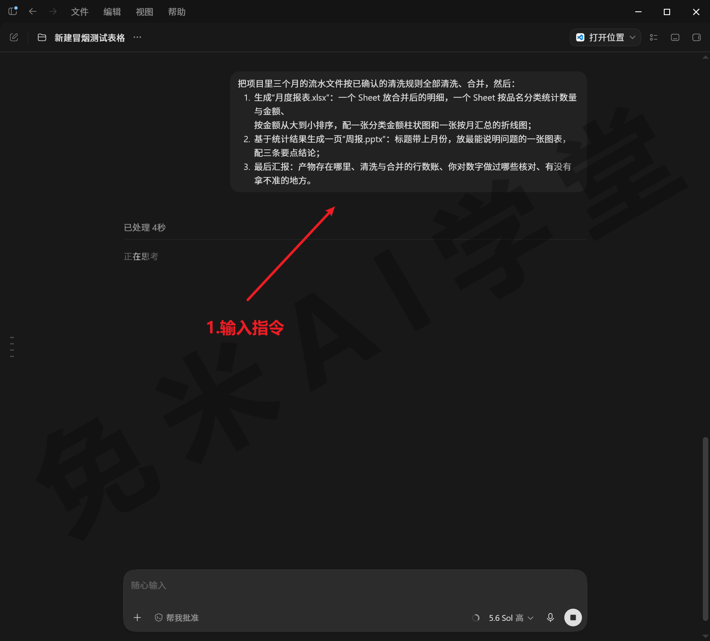

**执行过程看三段接力**

任务跑起来后，执行日志里能看到三段接力：先按规则清洗合并（第一段是 17.2 的放大版），再由表格插件写出带统计和图表的 Excel，最后由演示插件基于统计结果排出一页 PPT。中途它可能请求安装依赖工具，按《权限、沙盒与模型》的习惯看清楚再放行。

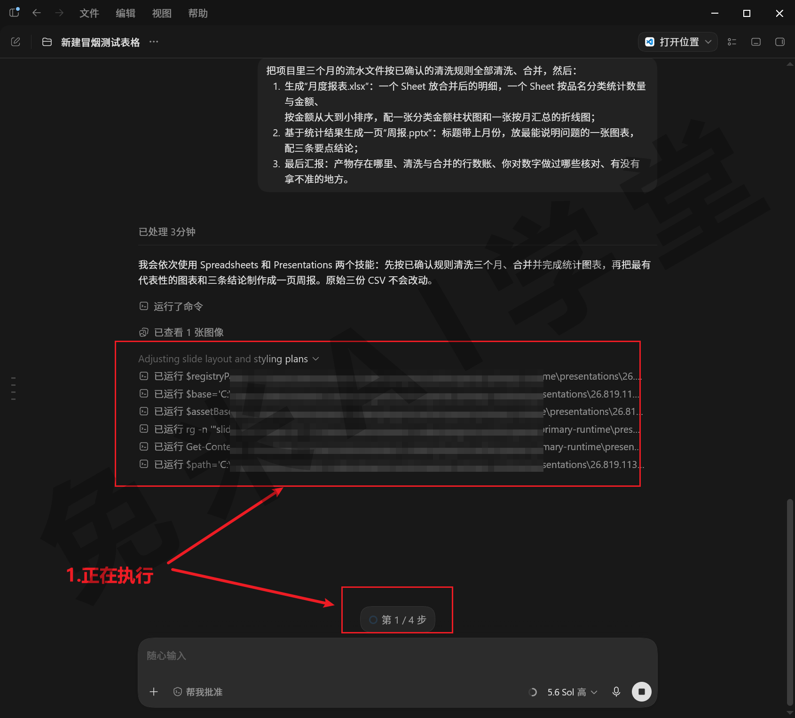

**先看两件产物**

“月度报表.xlsx”打开看两个 Sheet：明细页是合并后的全量数据，统计页有分类、合计、排序和两张图表（图表类型是否都支持，以实际表现为准；配错了类型，一句话让它换，占比数据换饼图即可）。和《办公能力一集讲全》确认过的口径一样，这是一份真正的 xlsx——公式、样式、图表都可以继续编辑，不是一张截图。“周报.pptx”在侧边预览区整页查看：标题、图表、三条结论是否都落在版式里。一个已知的小毛病：生成的 pptx 偶尔在 PowerPoint 里打开会弹“修复”提示，重新生成一次通常可解；反复出现，就让它把图表以图片形式嵌入（以实际表现为准）。

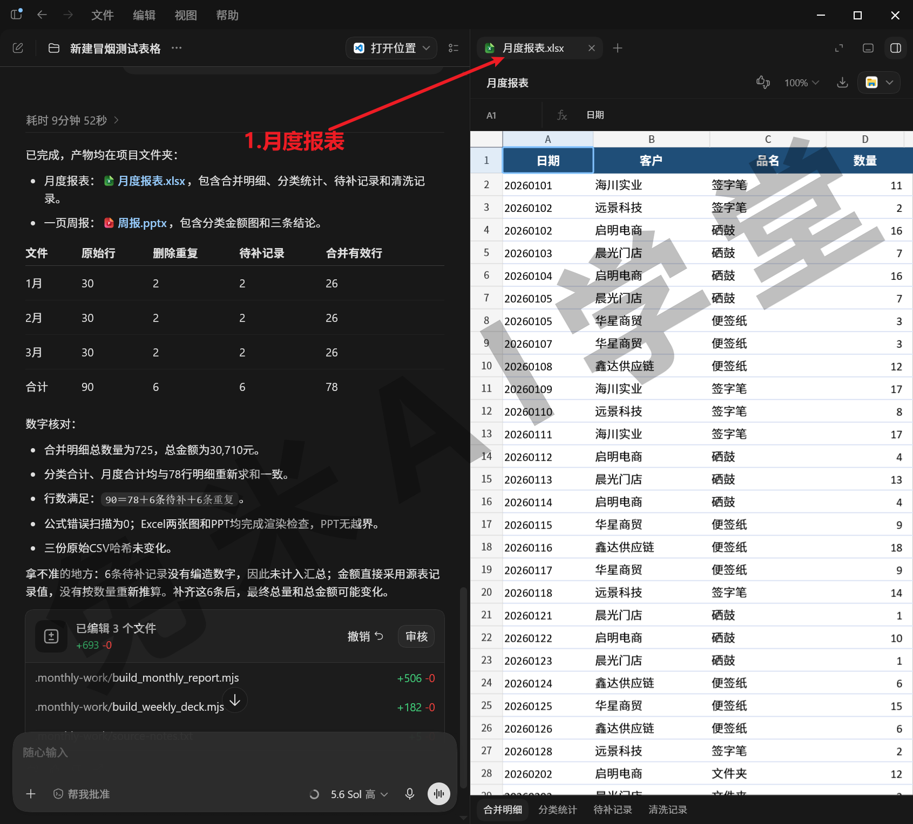

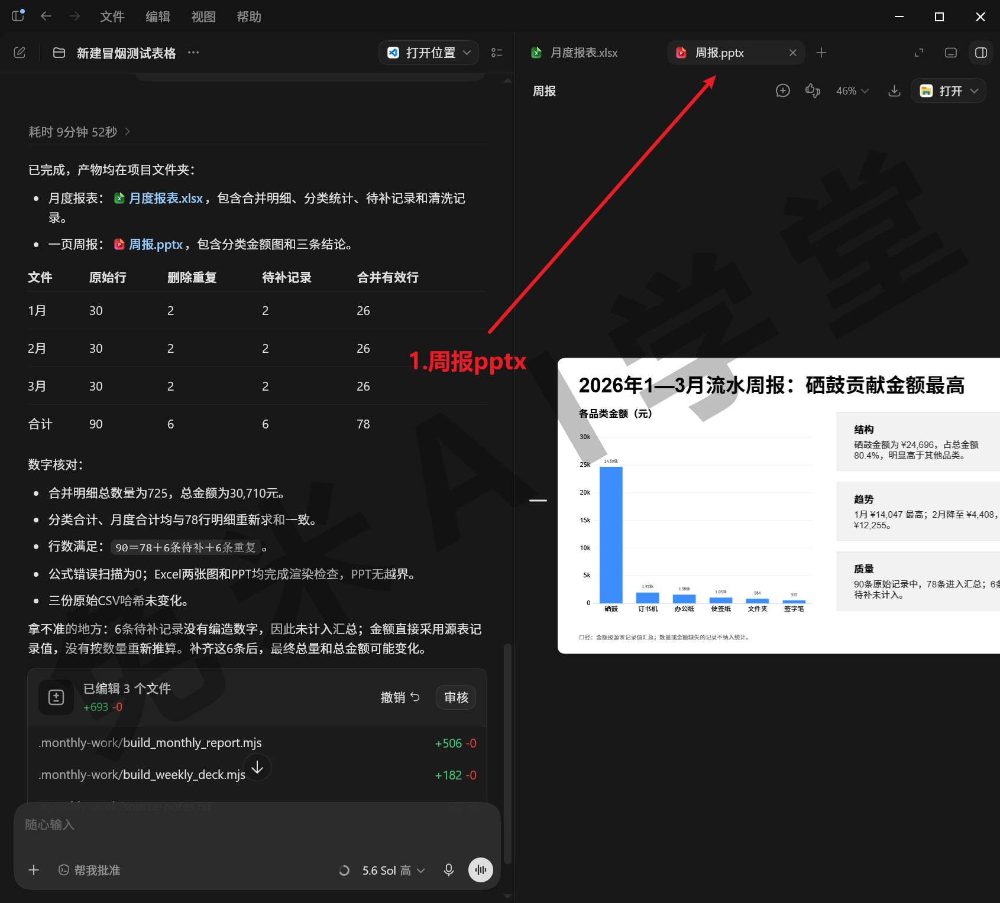

**统计口径核对，别跳过**

产物到手，先别急着交差——带数字的产物必须过核对这一关，这是从《办公能力一集讲全》定下的底线原则，本篇把它升级成流水线的固定工序。核对记两本账：

- **总数账（口径核对）**：让它自己交代每个统计值是怎么算出来的，发送：

```
说明“月度报表.xlsx”里每个统计值的计算口径：分类怎么分、合计怎么算、
“待补记录”有没有算进去；再把统计页的分类合计与明细页逐项核一遍，报告对不对得上。
```

- **个体账（抽样核对）**：从统计页任抽两三个数，回明细页里筛选、数一遍，两边对上才算过关；周报页上的数字也照此和 Excel 对一遍——PPT 是二次转录，恰恰是数字最容易“悄悄变样”的环节。

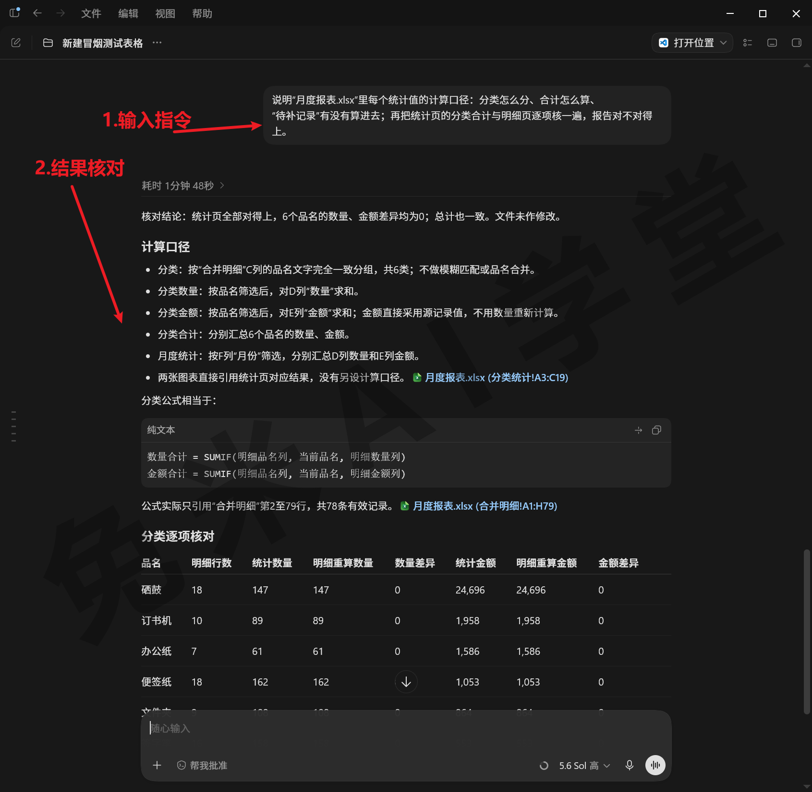

它的自查报告写得再完整，也只是第一道防线；你的抽查是第二道，生成者不能自己当裁判。真遇到数字对不上，多数情况不是算错，而是口径没对齐：比如你想按客户分类，它按品名分了。拿着它的口径说明和你的预期逐条对，改指令重跑即可。

### 17.4 调优：把流程调到每次都对

**第一次跑通，不等于每次都对**

到上一节为止，流程对“这三个月的数据”是对的。但乱数据的花样永远比规则多：下个月的文件里，品名多了个空格，单位混进了数量列，新同事把日期写成了第四种格式。规则没覆盖的情况一冒头，产出就开始偏。调优做的就是这件事：拿新数据喂流程，把每一个漏网的情况补进规则。

**调优循环：补规则、改口径、处理边角**

发现问题就把修正写成新规则，让它带着全部规则重跑。比如这样：

```
补两条清洗规则，然后把三个月的流水按全部规则重新跑一遍月度报表流程：
1. 品名先去掉全角空格和多余空格再归类，“U盘”和“U 盘”算同一个品名；
2. “待补记录”不计入统计，但周报里要注明这次还有几条待补。
```

重跑之后对照看：周报多了一行待补说明；品名空格那条这一轮命中 0 条——这批素材里恰好没有这种写法，规则没派上用场。命中 0 不等于白补：规则进了流程，就是给下一批数据上的保险，后面 17.5 换一批新数据验证复用时，这条规则一次就拦下了 18 处空格品名。每补一条规则，都等于把一次“人工修正”永久变成了流程的一部分，下次不再需要你出手。改口径（比如统计从按品名换成按客户）、处理边角数据，都走同一个循环：说清楚、重跑、核对。

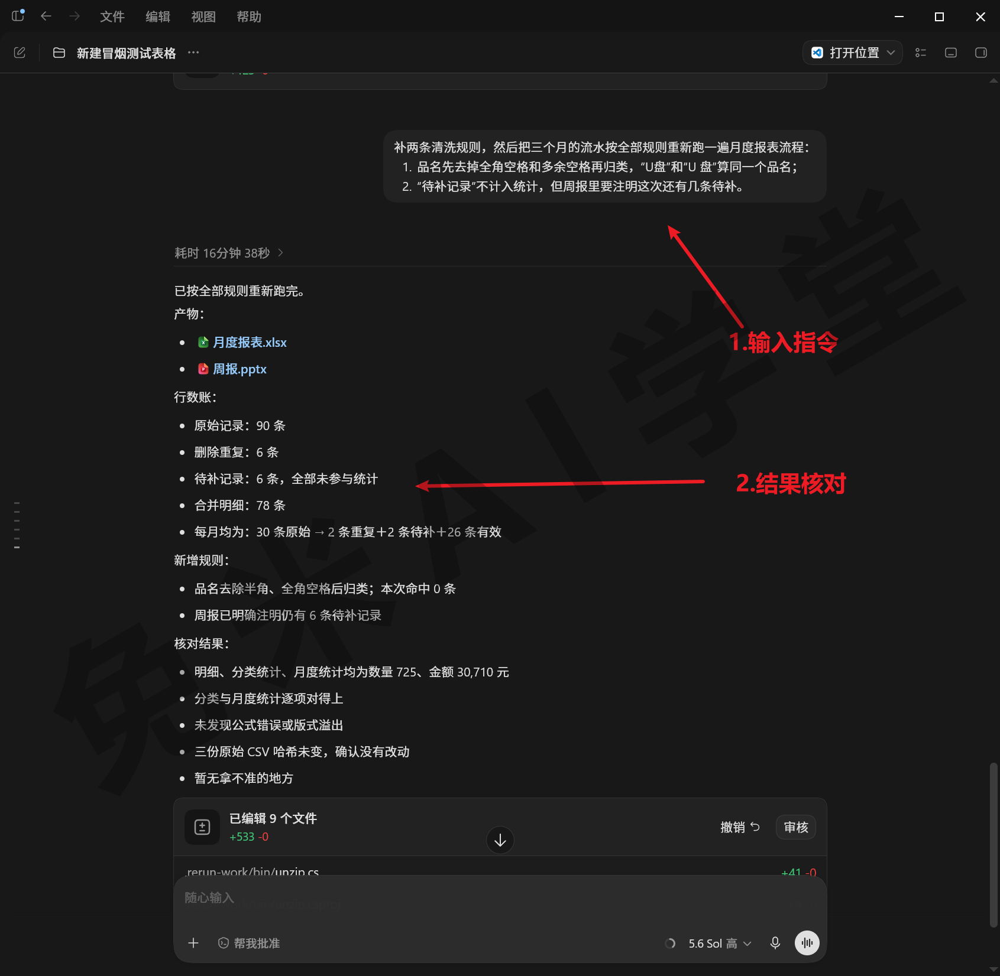

**边角数据：规则之外的灰色地带**

补规则治的是“写法不统一”，还有一类要你单独拿主意：边角数据。比如金额为负的冲销行，算退货还是整行剔除；跨月补录的记录，算进业务发生的那个月还是补录的这个月；同一天同客户同品名的两笔，是重复录入还是真买了两次。这类问题没有标准答案，答案在你的业务里。处理原则和缺失值一致：拿不准的先让它单独列出来，你定了口径再写进规则；最忌讳的是不置可否，让它每次自行发挥。

另外养成一个小习惯：每补一轮规则，就让它把当前生效的全部规则汇总成一份最新清单。这份清单是 17.5 封装技能的底稿，调优期记得越全，封装时越省事。

**“调完美”的判定：换数据零修正**

“调好了”不能凭感觉，要有判定标准：换一批同构的新数据（用另两个月的文件，或让它照 17.2 的方式再造一批），完整跑一遍流程，产物不需要你再手工改任何一处，才算过关；稳妥起见，连续两批都零修正，才叫“调完美”。判定用的新数据本身也要过一眼：要是新造的数据恰好没埋某类坑，那一类规则就等于没被考到，可以点名让它把四类病灶都埋进去。判定不过，就回到上面的循环继续补规则，别带病进入下一级。

**这一步偷懒不得**

多花在这一级的每一分钟，后面都会加倍还给你：第二级封装进技能的，是这里沉淀的全部规则；第三级每周自动重复的，是这里跑顺的整条流程。地基没打牢就急着自动化，结果是每周定时产出一份错误报表。“先调完美，再固化”，这个顺序是本篇方法论的核心，和《自动化、Git 与远程操控》里定时任务的原则一脉相承。

### 17.5 第二级：封装成自己的技能

**方法不该只活在聊天记录里**

现在整套方法都躺在那个调试对话里：清洗规则五六条、统计口径两三处、产物规格一大串。想在新对话里再出一份报表，就得把这些重新说一遍；哪天规则微调，聊天记录里翻旧账更是折磨。《Skills 技能系统 + 桌面宠物》讲过解法：把跑通的流程封装成技能，方法从“聊天记录”搬进“技能文件”。“先跑通，再固化”这条原则在这里第二次生效：17.4 的调优就是“跑通”，现在动手“固化”。

**封装：把调好的规则一次交给技能创建器**

输入 `$`，选中技能创建器（列表里的显示名是 Skill Creator），把调好的全部规则和产物规格一次交代清楚，发送：

```
把下面这条流程封装成技能，名字叫“周报流水线”：输入是项目里的流水 CSV 文件。
第一步按规则清洗合并：列名统一成日期、客户、品名、数量、金额；日期统一成 8 位数字；
品名去掉全角和多余空格再归类；完全相同的重复行只留一条并列出删了哪些；
数量或金额缺失的行进“待补记录”，不许编造数字，也不许改动原始文件。
第二步生成“月度报表.xlsx”：明细一个 Sheet，按品名分类统计数量与金额、
按金额降序一个 Sheet，配分类柱状图和按月折线图，“待补记录”不计入统计。
第三步生成一页“周报.pptx”：标题带月份，放最关键的一张图表，配三条要点结论，
注明待补记录条数。最后汇报产物位置和行数账。
触发时机：我让你做周报、月报或者处理流水数据的时候。
```

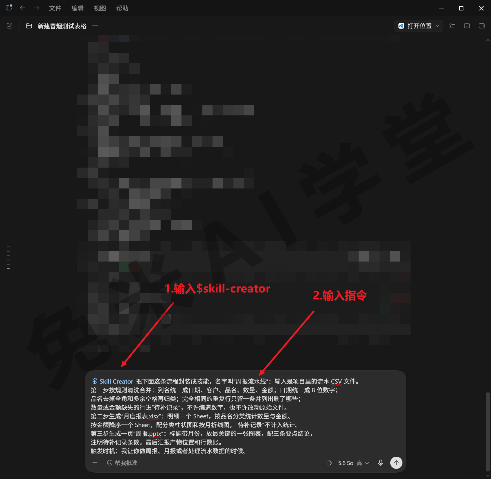

它会像《Skills 技能系统 + 桌面宠物》里那样和你确认几个问题——这个技能做什么、什么时候触发、要不要带脚本，按那一篇的口径逐一回答，默认纯说明文件就好。

**看看它造了什么**

完工后打开生成的技能文件夹：核心是 SKILL.md，你的清洗规则、产物规格、汇报要求全部规范化在案；旁边还可能有它自拟的配套文件——这次生成的就带了一个只读清洗脚本和一份产物规格说明（具体结构以它实际生成的为准）。这份文件就是流水线的作业指导书。从此规则的正本存在文件里，不在你脑子里，也不在某个越翻越长的对话里。

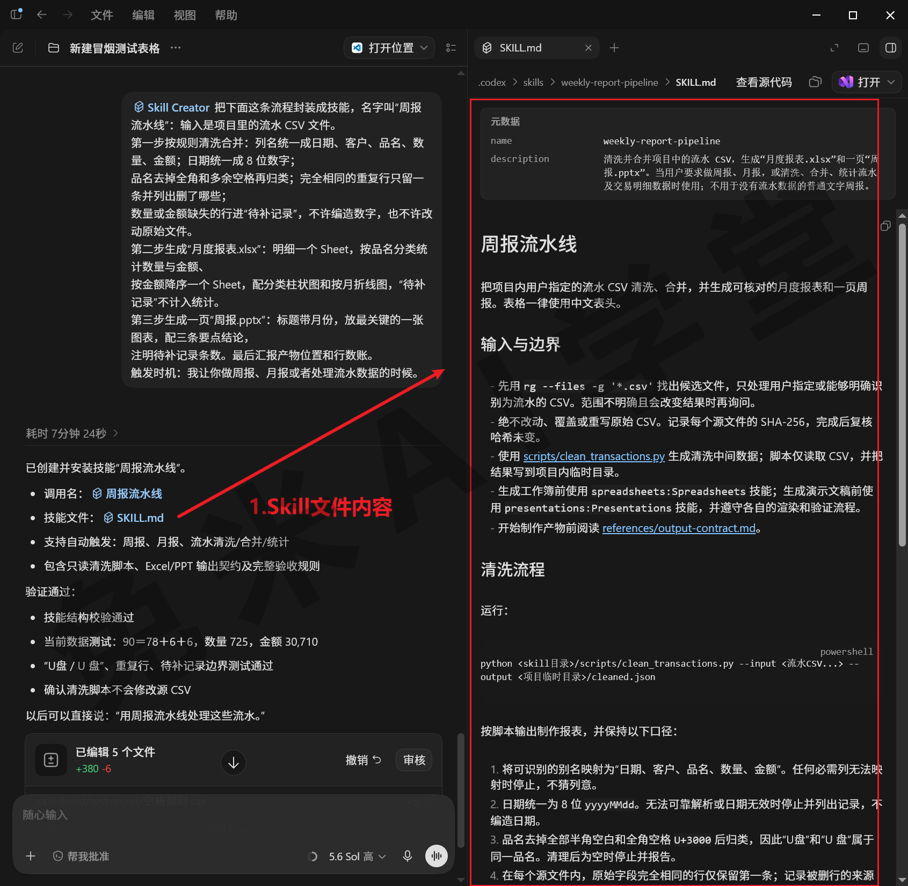

**一键复用验证**

封装是否成功，用《Skills 技能系统 + 桌面宠物》的老办法验证：新开一个对话，往项目里放一批新的流水文件，输入 `$` 选中“周报流水线”，只发一句：

```
用“周报流水线”处理项目里新文件夹的流水文件。
```

不再提任何规则，等它跑完对照检查：文件名、Sheet 结构、图表、行数账，产物规格和 17.4 调好的版本一样不缺，封装就成了。以后规则再要改，拿着最新要求让技能创建器重建同名技能：重名即更新，《Skills 技能系统 + 桌面宠物》讲过；技能改动一般会自动生效，没生效就重启一次应用（生效时机，需实机验证）。要是发现不点名时它不主动用这个技能，多半是“触发时机”当初说得太宽，重建时说具体些即可，急用时 `$` 点名永远管用。

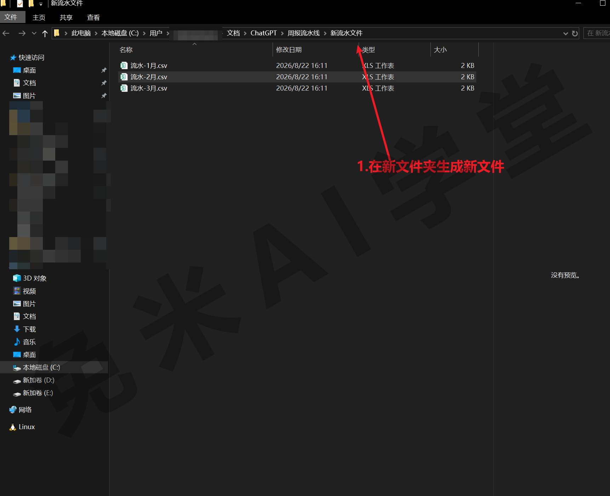

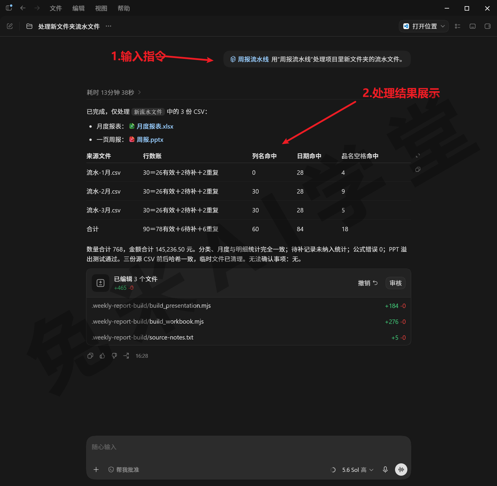

到这里，方法有了文件形态：可复用、可迭代、可以分享给同事。整条流水线还差最后一件事——到点自动跑。

### 17.6 第三级：固化成每周定时任务

**动手前先算权限账**

《自动化、Git 与远程操控》讲过定时任务的脾气：无人值守，到点自己跑，不会半夜弹窗找你审批——权限够就做，权限不够就直接失败。所以挂定时之前，先做两个检查：

- **看权限档位**：点开输入框旁的权限控件（《权限、沙盒与模型》的老朋友），确认当前默认档位。当前版本给了三档：“请求批准”是每步都要确认的那一档，“帮我批准”只在检测到风险操作时才询问（默认档），“完全访问权限”完全放开（慎用）。收得太紧的“请求批准”档下，无人值守时写 Excel、写 PPT 的步骤会因等不到审批而全部失败；这条流水线在默认的“帮我批准”档就能全程跑完——项目文件夹内的读写不算风险操作，不会夜里卡在审批上。
- **产物留在项目内**：“工作区内可写”的边界就是项目文件夹。17.1 让你把素材和产物都放进项目，这个安排在这里兑现：报表落在项目内，权限刚好够用；想让它把周报写到桌面或共享盘上，夜里会静默失败，新手阶段别碰这个需求。

顺带一句：本篇流水线全程读写本地文件、不联网，这不是凑巧：无人值守模式下默认连网络也受限（以当前版本的沙盒策略为准），要联网取数的自动化，留给《调研情报系统》专门讲。

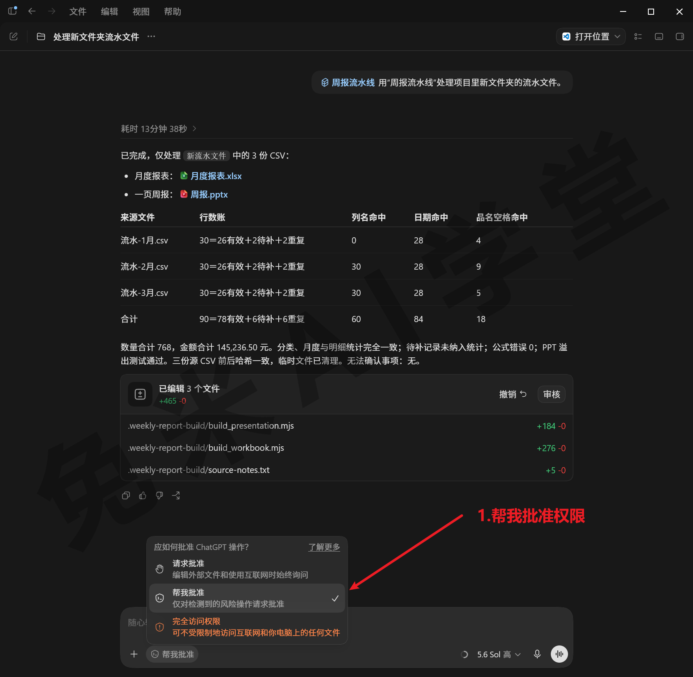

**固化：在调好的对话里说一句**

回到 17.4 那个调好流程的对话（或 17.5 验证复用的对话），发送：

```
把以上流程固化成自动化任务：每周一早上 8 点执行，
用“周报流水线”技能处理项目里最新的流水文件，产出月度报表和周报；
哪一周没有新增数据、或者文件读不到，就在汇报里如实说明，不许当成零、也不许编造产物。
```

它会替你起草任务描述并登记成定时任务。留意看这份描述：跳过已处理的数据、失败时如何汇报这类细节，通常写得比你手写的版本完整——本次生成的描述就自带了“用状态文件记录已处理批次、只在有新增或变化时才重跑”“无新增时如实汇报，不许补零编造”这些条款。这正是“在调好的对话里固化”的红利，你们反复调整的细节它都记着。

指令里点名“周报流水线”技能，是官方推荐的组合方式：技能定方法，任务定时间表。任务提示词短到一句话，方法全部沉在技能文件里——生成的任务描述开头就是一句“必须使用‘周报流水线’技能，并严格遵守该技能的清洗、制表、演示文稿和验收流程”，把方法整个引了过去。这个分工的好处在维护：下周规则变了，你只更新技能，用到它的任务下一轮自动用上新版——改一处，处处生效。

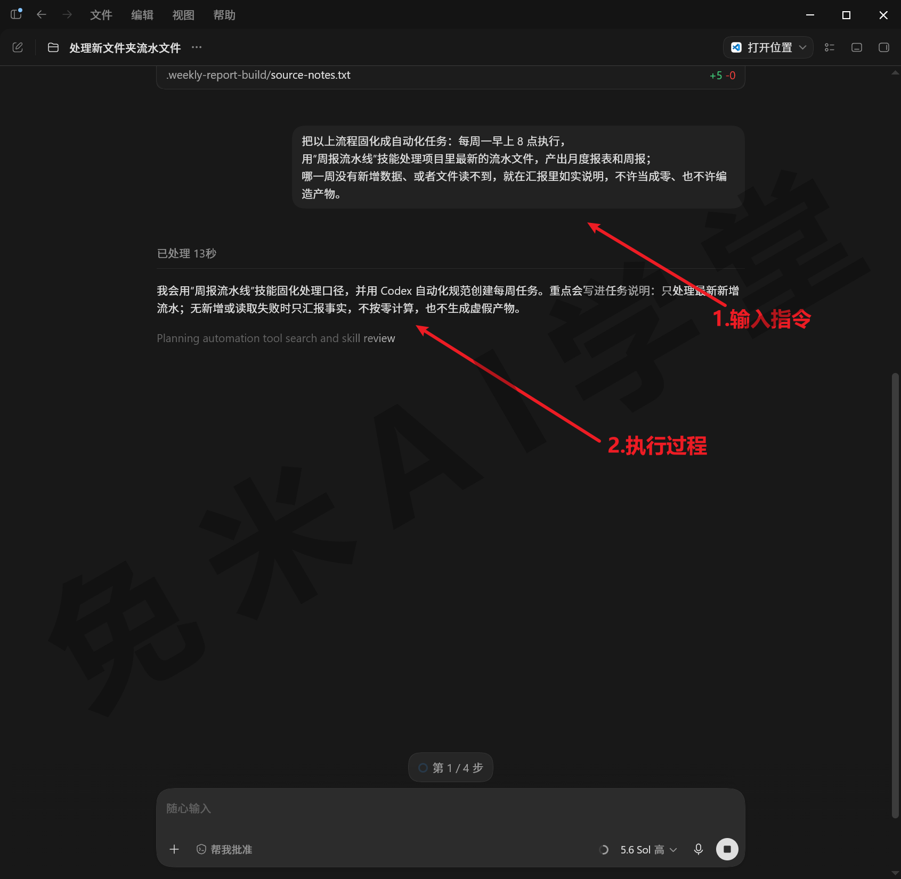

**到面板核对四个字段**

打开侧边栏的“已安排”面板（《自动化、Git 与远程操控》里逐字段认识过它），找到新任务，照 15.1 的讲解核对四处：频率是不是每周一早上 8 点，保存后列表里显示的“下次运行”时间和预期一致才算设完（以当前版本实测为准）；运行位置保持默认“此设备”（流水线要处理你电脑上项目里的真实文件）；点进任务详情核对两项——项目是不是“周报流水线”，“运行于”是不是“新聊天”（到点新开一个对话独立执行，15.1 讲过这个字段，无人值守任务用它最干净）；模型挡位按任务复杂度定，清洗加双产物属于中等复杂度，中挡起步，不够再上调。

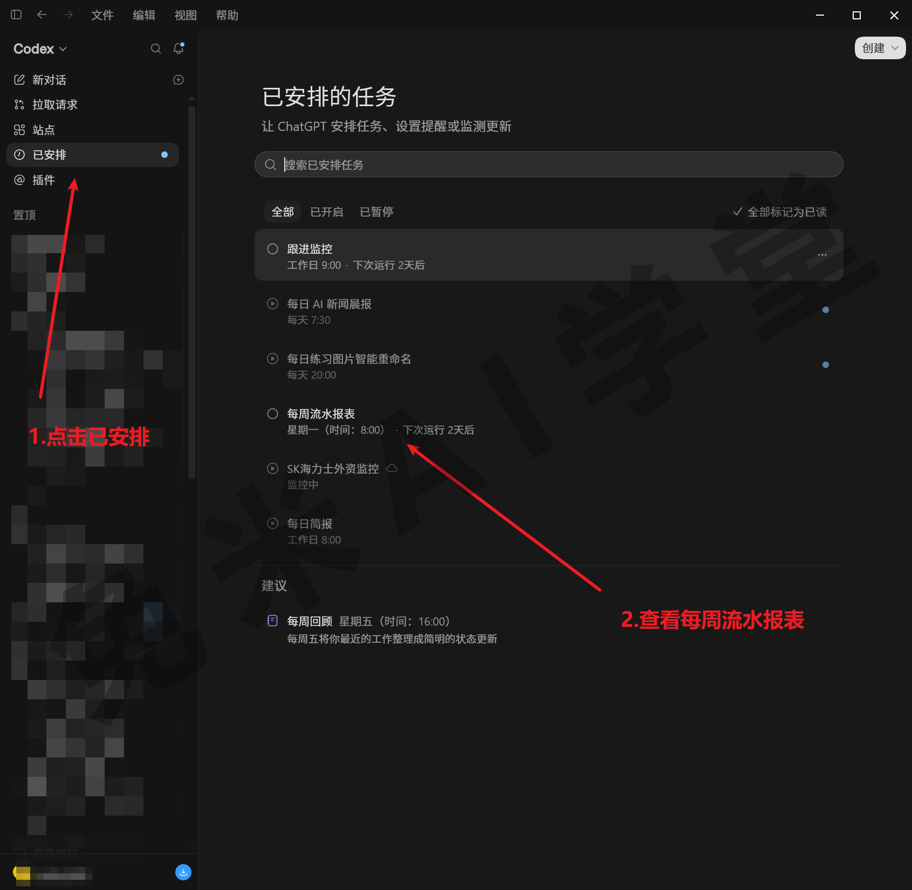

**先手测一轮，再交给时间表**

别建完就走。用面板里的“立即运行”当场完整跑一次：产物和手动跑的一致，这个任务才算验证过；开始定时之后，头几轮的产出也要盯一盯，这是下一节的事。

**改需求的正确做法**

之后需求变了（多一列统计、换个图表、改汇报口径），正确路径是：回对话里继续调，调好后更新技能（重建同名技能），需要时固化新任务、删掉旧任务。别图省事直接在任务提示词里改规则：那会让任务和技能各存一套口径，哪套生效说不清，排查起来最费时间。

**三级进化，各解决一个真问题**

回头看这三级：第一级解决“能不能做对”，第二级解决“要不要每次重新教”，第三级解决“要不要我记得去做”。真正的生产力升级不是让 AI 帮你完成一次任务，而是把一件事连同“记得做它”的负担，整个从你的日程里移走。

### 17.7 运行历史与产物核对

**回看入口：任务的账本**

自动化不等于放养。“已安排”面板里点进任务，运行历史记着每一次执行：哪次成功、哪次失败、产出了什么文件（《自动化、Git 与远程操控》介绍过这五个管理动作）。有发现的运行会带未读标识，看完标已读，别让未读越攒越多。养成隔天扫一眼的习惯，它昨晚干得怎么样，一眼就有数。

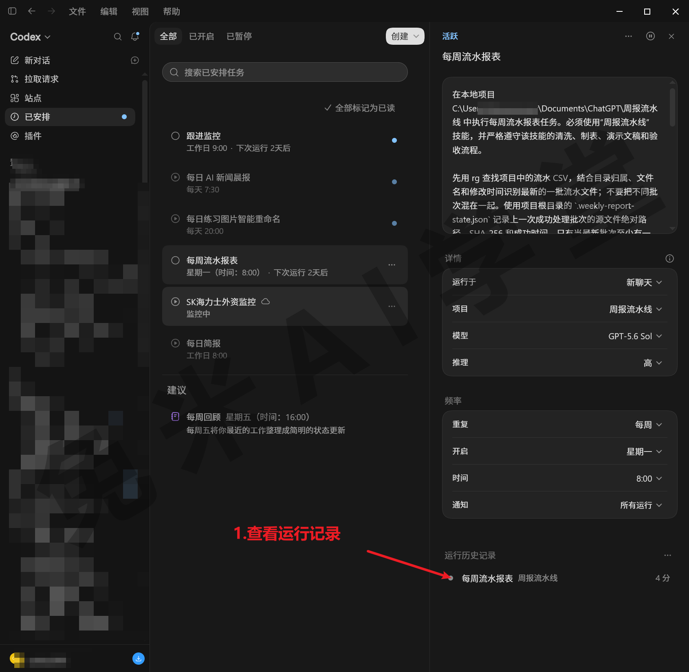

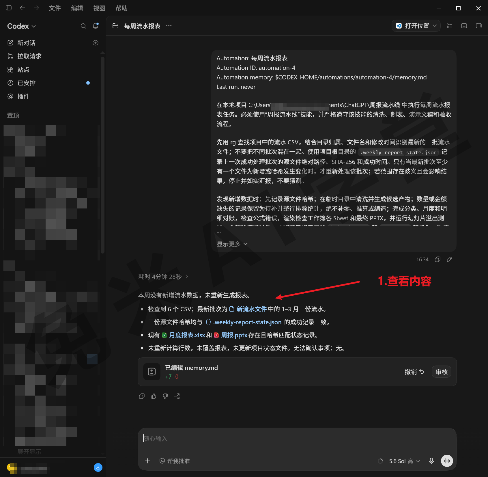

**头几轮盯三件事**

定时任务上线的头几轮，官方和本课的建议一致：盯着点，确认没问题再放手。看三件事就够：

- **跑没跑**：到点没动静，按 17.10 的 Q3 排查，多数是运行前提没满足。
- **产物齐不齐**：两件产物在不在项目文件夹里，汇报里的行数账有没有异常。比如待补记录突然暴涨，多半是源数据出了新花样，正好回 17.4 补规则。
- **数字对不对**：抽样核对不因自动化而豁免。每周的产物抽两个数回明细对一遍，一分钟的事；头几轮全对之后可以降频抽查，但这道工序永远保留——它是流水线的质检岗。

**失败了，到执行记录里归因**

失败的运行点进执行记录找原因，常见就三类，各有各的解法：权限不够（写文件失败，回 17.6 查档位）；文件不在（源文件被移走、改名，或项目换了路径）；数据出了规则没覆盖的新花样（回 17.4 的调优循环，补规则、更新技能）。

**重跑自救与升级路径**

单次失败或产物不对，第一反应是用“立即运行”重跑一遍：模型输出偶有波动，重跑是成本最低的自救，这是《自动化、Git 与远程操控》定下的老规矩。重跑还不对，就分层升级：产物规格走样，多半是技能规则的问题，回 17.5 重建同名技能；执行本身报错，按上面三类归因处理；连续几周都栽在同一处，别再靠手工救场，把修正写进规则、更新技能、重新固化，让流水线自己长本事。

**多说一句：任务会长记性**

每个定时任务还维护着自己的运行记忆，上次的结论和教训会带进下次运行（《自动化、Git 与远程操控》提过一句）。像“数据缺失要如实报告、不许编造”这类要求，跑上几次就会沉淀成它的习惯，这也是把规矩写进技能和任务描述的另一重回报（实测每个任务名下维护着一份 memory.md，首轮运行就记了第一笔）。

**测试任务，用完就删**

验证过程中建的临时任务，确认完就删，别让它每周空跑白烧额度——“忘了删的测试任务”是最常见的额度漏洞。正式流水线留一个任务就够；删除前扫一眼它的运行历史里有没有要留档的记录（删除后是否保留历史，以实际界面为准）。到这里，验收需要的证据链也齐了：运行历史证明“它自动跑了”，产物核对证明“它跑对了”。

### 17.8 验收清单

**为什么要走一遍正式验收**

自动化的省心有个前提：错也会自动重复。手工做报表，错一次你当场就能看见；流水线做报表，一处没验出的毛病会每周准时复制一遍，直到某天被老板发现。所以项目收尾不能停在“看起来能跑”，要按清单逐条验收。验收用的数据就用 17.4 做判定时的那批新数据，别再用调试期已经跑熟的那三个月。下面四条按顺序过，每条都给了判定标准，过不了就回对应小节返工，四条全过才算竣工：

1. **流水线定时跑通一次，产物齐全**——判定标准：“已安排”面板的运行历史里，有一次成功执行的记录（时间表触发或“立即运行”均可）；产物两件都躺在项目文件夹里，带明细页、统计页和图表的“月度报表.xlsx”，加一页“周报.pptx”。验收时点进那次运行，把它汇报的行数账也扫一眼。缺件或失败，按 17.7 的三类归因排查后重跑。
2. **产物统计数字抽样核对无误**——判定标准：从统计页任意抽两三个数（至少含一个分类数和一个合计数），回明细页数一遍能对上；周报页上引用的数字与 Excel 一致。抽数用 17.3 的两本账手法，总数账、个体账各占一半。对不上，先让它交代口径，再按 17.4 的循环补规则。
3. **技能可复用，换数据不走样**——判定标准：换一批同构的新数据，不重复任何规则，一句话点名“周报流水线”技能，产物的文件名、Sheet 结构、图表和汇报规格与调好的版本完全一致。验证时管住手：中途补了哪怕一句规则，都说明有东西留在对话里没进技能，回 17.5 重建同名技能。
4. **会在运行历史里定位一次执行**——判定标准：能在面板里准确找到指定的那次运行，说出它成败如何、产出了什么、失败属于哪类原因。找不到入口或说不出所以然，回 17.7 把回看流程再走一遍。

**验收之后的维护节奏**

四条全过，这条流水线就正式属于你了：每周一早上，报表自己出现在项目文件夹里，你的日常只剩一分钟的抽查。之后的维护动作也只有两个：数字抽查保持每周一次，连续全对之后可以放宽频率，但不取消；需求变化按 17.6 的做法（回对话调、更新技能、重建任务），永远不在任务提示词里直接改规则。哪天数据源换了格式也不必推倒重来，那只是回到 17.4 再做一轮调优——流水线的生命力，就在这条“发现、补规则、再固化”的循环里。这套验收思路也不只属于本篇：以后你把任何流程交给定时任务，都值得照这四条改一版自己的清单。能定时跑、产物可核、方法可复用、结果可回溯，四个问题都答得上来，才算真正把一件事交了出去。

### 17.9 本篇小结与自检

这一篇搭起了一条“乱数据进、报表出”的流水线，并让它每周自动运行。最需要记住的是：**Codex 的生产力用法是三级进化——先在对话里把流程调完美，再封装成技能，最后固化成定时任务；带数字的产物必须抽样核对之后才算交付。**

可以对照下面的清单检查学习结果：

- [ ] 在对话里完整跑通过一次“乱数据 → Excel → PPT”
- [ ] 把调好的流程封装成了自己的技能，换一批数据复用成功
- [ ] 流水线已固化成每周定时任务，并完整跑通一次
- [ ] 抽样核对过产物里的统计数字
- [ ] 会在运行历史里检查执行结果，知道失败了怎么排查

完成这些内容后，你已经把一件每周重复的工作彻底交给了 Codex。下一篇《报价计算器小应用》挑战一个“要算得对”的项目：报价计算器和预订表单。

### 17.10 新手常见问题

**Q1：我的数据很乱，第一次就全部丢给它吗？**

不要。先按 17.2 的顺序来：挑一小批（一个月、或几十行）试跑，核对它的行数账和处置结果，确认规则理解一致，再放全量。原因很实际：规则被理解偏时，小批量当场就能看出来、一句话就能纠正；全量跑完才发现，清洗、统计、汇报全部要返工。另外记住两条铁律（不许改动原始文件、缺失数字不许编造）：第一条保证试错永远有退路，第二条保证错不会藏进产物里。

**Q2：统计数字怎么核对才算可靠？**

记两本账。总数账：让它交代每个统计值的口径（分类怎么分、合计怎么算、待补记录算不算），再让它把统计页与明细页逐项核一遍；个体账：你自己从统计表抽两三个数，回原始明细里数一遍，两边一致才算数。它的自查是第一道防线，你的抽查是第二道：自查报告写得再漂亮，生成者也不能自己当裁判，这是《办公能力一集讲全》定下、本篇沿用的底线原则。连续两批数据核对全对，这条流水线的数字才算稳了。

**Q3：定时任务到点没跑，先查什么？**

按从快到慢的顺序过一遍：先看运行前提三件事：电脑开着没有、应用在不在运行、项目文件夹还在不在原路径，三者缺一任务就不会跑，而且错过的时间点不会补跑；再回面板核对“下次运行”显示的时间和你的预期是否一致（时区偏差的老问题，以当前版本实测为准）；然后查权限档位：档位收得太紧，无人值守时所有写文件的步骤都会因等不到审批而失败（17.6 的权限账）。都没问题就用“立即运行”手动跑一次看报错；还不行，删掉任务按 17.6 重建一遍，提示词照抄即可。

**Q4：数据涉及业务隐私，交给它处理安全吗？**

分层看待。这条流水线读写的都是你项目文件夹里的本地文件，产物也落在本地；但要清楚，任务过程中它读到的数据内容会进入任务上下文和运行记录（数据存储细节，以官方说明为准）。给自己立三条规矩：练手和演示一律用造的假数据，就像本篇这样；处理真实业务数据前，把敏感字段先脱敏：客户名换成代号，效果一样练得出流程；公司数据先确认单位的规矩，拿不准就不进流水线。《Chrome 扩展与 Computer Use》定下的纪律同样适用：高敏感数据不要交给自动化流程处理。

