## 报价计算器小应用

前两个项目里，《个人品牌站》重展示，《报表自动化流水线》重流程。这一篇做的东西第一次有了对错：一个选规格自动算价的报价计算器，配一个预订表单。页面好不好看仍然重要，但从这一篇起，验收标准升级为“算得对”。

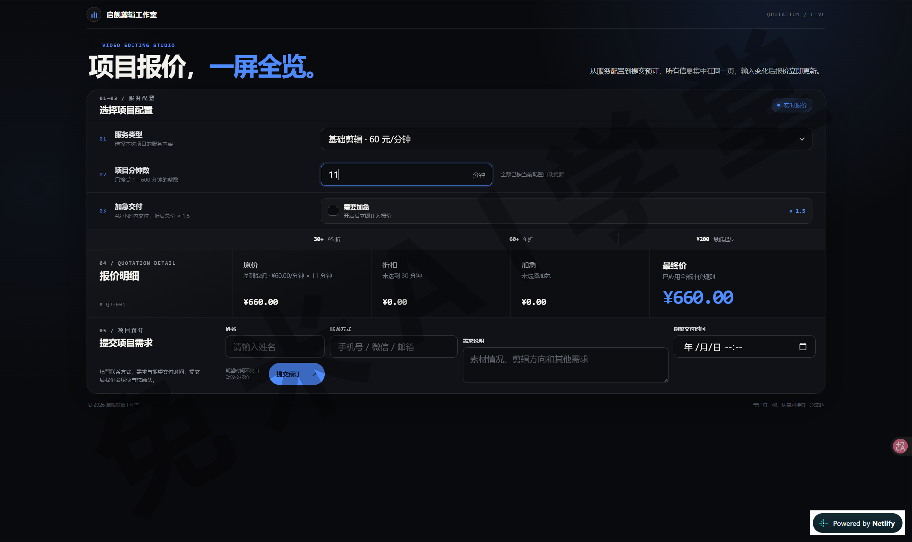

### 18.1 项目定位：这次要算得对

**展示页与业务应用差在哪**

《个人品牌站》交付的是展示页：内容你说了算，效果好坏由你评判，改错了顶多不好看，不会造成实际损失。业务应用不一样，页面背后带着业务规则，报价、折扣、预订这些数字有客观对错——算错一笔价发给客户，就是实际损失；表单提交丢了，就是丢了一单生意。所以两类项目的验收标准完全不同：

- **展示页**：看效果。排版是否舒服、文案是否准确、各设备上是否正常显示。
- **业务应用**：先看对错，再看效果。规则算得对不对、边界情况处理得稳不稳、数据收得到收不到，这些全部达标之后，才轮到好看。

难点也随之换了位置。做展示页，效果好坏你一眼就能评判；做业务应用，页面上永远会显示一个看起来很正规的数字，它对不对，AI 不会主动告诉你，访客更不会替你验算。同一笔单子显示 1710 元还是 1800 元，看上去都像正确答案，差别只有对着规则验算才能发现。发现算错的责任完全落在你身上：这就是本篇反复出现“清单”“验收”“复跑”这些词的原因。

**这次做什么**

成果是一个单页报价计算器：访客选服务类型、填数量，页面按你定的规则自动算出报价，折扣、加急、起步价一并算清；算完满意，填一张预订表单提交登记。本篇的示例业务用视频剪辑接单，你可以整套换成自己的业务：打印装订、摄影约拍、烘焙定制都适用，只要规则能写成一张表，做法完全一样，把规则表换成你的就行。

**用到哪些学过的能力**

这一篇不学新功能，重点是把学过的能力放进真实项目里配合使用：

- 立项与分步实现，用《计划模式》的先计划后动手；
- 业务规则当项目事实写进 AGENTS.md，靠《AGENTS.md、Diff 与还原》；
- 两版界面并行开发，靠《自动化、Git 与远程操控》。

用到的地方会点名引用对应篇目，功能本身不再重讲。

**这一篇交付的不只是网页**

做完本篇，你手里应该有四样东西：上线可用的计算器页面、一张能当验收依据的算价规则表、一份逐项打勾的边界值试算清单、一段两版界面的对比结论。后三样看起来不起眼，它们才是这个项目“算得对”的证据，也是 18.7 验收时逐项核对的对象。

**本篇路线**

五步走完：梳理规则、计划实现、双方案择优、边界值验收、上线复核。五步各有一个可检查的产出，前一步的产出没拿到，不要急着进下一步。顺序也不能乱：规则没落成表，计划就没有依据；边界值没验完，上线复核就是走过场。全程不需要你写一行代码，但业务规则怎么定、验收怎么判，必须由你负责——这正是业务应用与展示页拉开差距的地方，也是本篇要练的核心能力。


### 18.2 业务规则梳理

**别让 AI 替你发明规则**

直接对它说“做个报价计算器，要有折扣”会发生什么？它替你把规则编全：第一版可能是满 100 打 95 折，改一轮界面之后又变成满 200 减 20。不是它不听话，而是你从没把规则说死，它每次都只能现编。业务应用的第一步不是写代码，是把规则落成一张不会被误解的表：业务规则你来定，AI 负责照表实现，谁也不越界。

**一张能当验收依据的规则表**

表里要写全五类内容：服务类型与单价、批量折扣、加急系数、起步价，以及它们的计算顺序。下面是示例业务的完整规则表，作为一条消息发给 Codex——这是本篇最重要的提示词，方括号里的内容换成你自己的：

```
这是[示例剪辑工作室]的算价规则表，后面做报价计算器以它为准，不要自行增删或改动任何规则：

一、服务类型与单价（按分钟计价）
- 基础剪辑：60 元/分钟
- 精剪：100 元/分钟
- 字幕制作：20 元/分钟

二、批量折扣（按单笔分钟数；两档只取一档，取优惠大的，不与其他优惠叠加）
- 满 30 分钟：总价 95 折
- 满 60 分钟：总价 9 折

三、加急（48 小时内交付）
- 在折后总价上乘 1.5

四、起步价
- 单笔最终价不足 200 元的，按 200 元收

五、计算顺序
- 单价 × 分钟数，先算批量折扣，再乘加急系数，最后用起步价保底

六、输入边界
- 分钟数只接受 1 到 600 的整数；0、负数、小数、非数字都要提示重新输入
- 超过 600 分钟不直接报价，提示联系人工
```

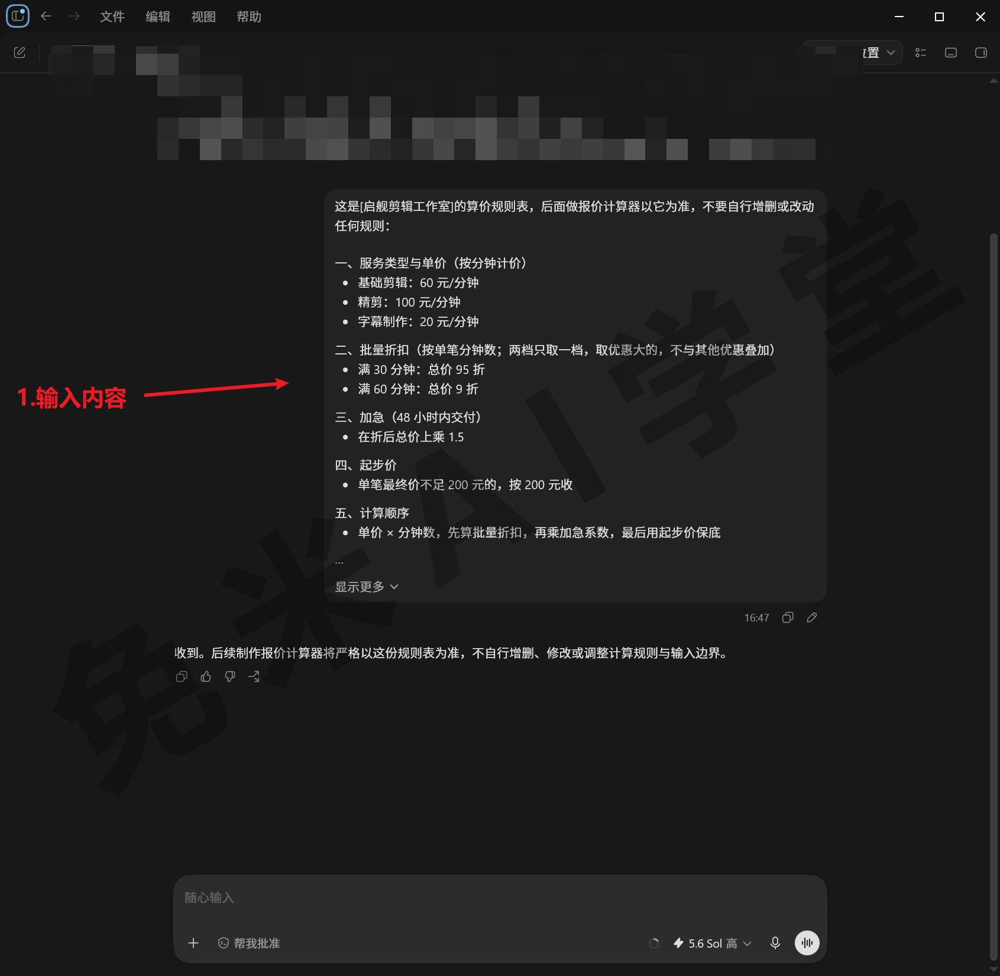

**边界情况提前想，才轮得到后面验收**

这张表最值钱的不是单价，是“二”到“六”那些边界口径：数量为 0 怎么办、上限是多少、两档折扣同时满足取哪条、先打折还是先乘加急。举一个顺序的例子就明白：同样是 2 分钟加急，按“先加急再保底”收 200 元，按“先保底再加急”要收 300 元，差出一半。规则表不把顺序写死，AI 只能替你猜一个，猜哪边你都没法说它错。现在多写一行，后面 18.5 的验收清单就直接从这张表逐行派生。

**写进 AGENTS.md，当项目事实**

规则表除了发进对话，还要写进项目的 AGENTS.md。《AGENTS.md、Diff 与还原》讲过，写在那里的内容每轮任务都会被读到，不会随对话变长而被淡忘。接着发送：

```
把上面这张算价规则表原样写进本项目的 AGENTS.md，作为项目事实：
今后所有涉及价格计算的任务都必须以它为准；要改规则，必须先改这张表，再同步实现。
```

以后改规则的流程就固定了：先改表，再让它按新表同步代码。这和《个人品牌站》里“先改需求文档、再改页面”是同一套变更纪律，业务应用里它更重要：规则只有一个出处，才谈得上对错。

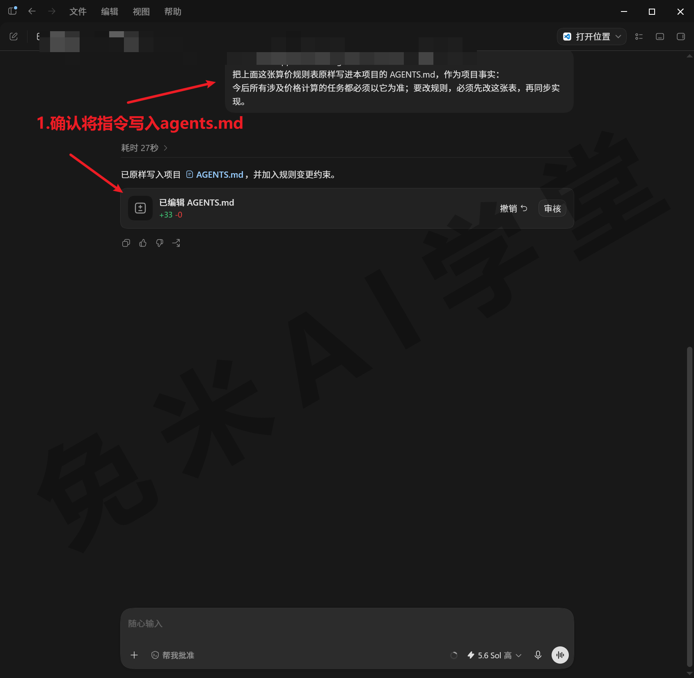

### 18.3 计划模式分步实现

**技术方案先拍板：纯静态就够**

动手前先定技术路线。这个项目用纯静态的网页技术（HTML、CSS 和 JavaScript）就能做完：算价只是乘法加几个条件判断，浏览器里就能算，不需要框架，更不需要后台。纯静态在本篇有三个实际好处：

- 项目就是几个文件，每轮任务要读的内容少，改得快、消耗低，《个人品牌站》里“多页站生成量大，额度消耗也成倍涨”的成本账这里同样适用；
- 18.4 开工作树副本时不用装任何依赖，副本开出来就能直接跑；
- 预订表单接部署平台的收集能力最顺，本节表单口径一段细说。

想用带框架的技术栈也可以，流程完全一致，只是表单接线要按平台对框架页面的专门口径多做一步（见下）。

**立项：一条消息说全，先计划后动手**

打开计划模式（加号菜单的开关或 /plan 命令，《计划模式》讲过；一时找不到，就在需求末尾加一句“先出计划和我确认，再动手”），发送：

```
做一个单页的报价计算器网站，业务规则以 AGENTS.md 里的算价规则表为准，一条都不要改。
分两步实施，每步做完停下来等我验收：
第一步：页面上方做算价区，选服务类型、填分钟数、可勾选加急，自动显示报价明细（原价、
折扣、加急、最终价四行）；
第二步：页面下方加预订表单，字段为姓名、联系方式、需求说明、期望交付时间。
技术用纯静态的 HTML、CSS 和 JavaScript，不引入框架，不做后台，不做在线支付。
```

分两步不是形式：第一步的算价逻辑是全篇的地基，单独验收过了再做表单，错误才不会被后一步的改动盖住。

**读计划：规则复述必须一字不差**

计划文档里通常会有一段它对算价规则的复述，这一段要逐字对照你的规则表核对。“满 30 分钟”被写成“超过 30 分钟”，一字之差，恰好 30 分钟的单子就从 95 折变回原价——规则错在计划里，实现只会错得更彻底，这次核对比后面看任何代码都有用。发现出入不要直接确认，在计划层面改稿（《计划模式》讲过怎么改），改到复述与规则表完全一致，再点实施。

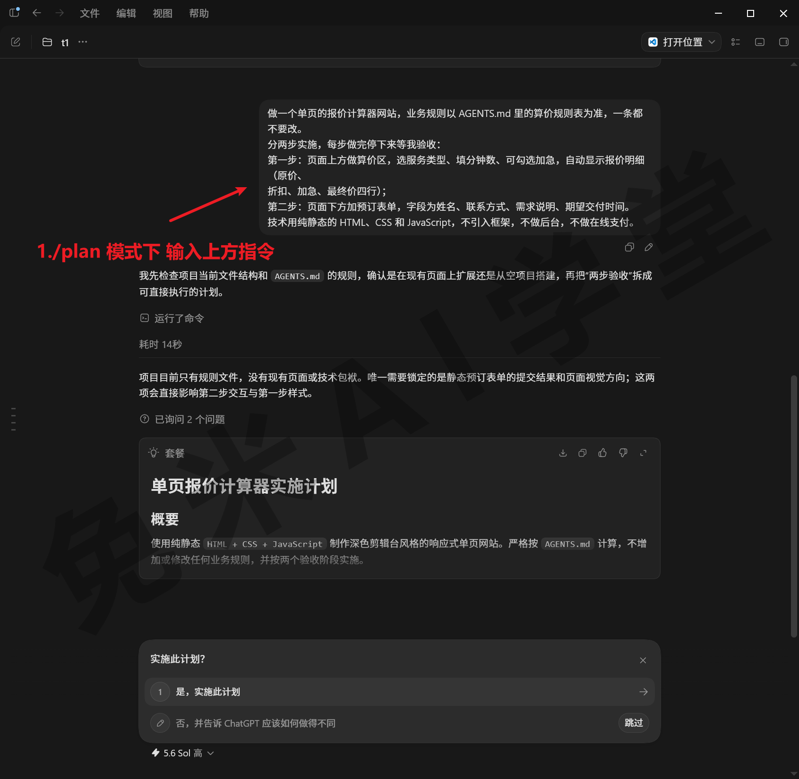

**第一步验收：先算三笔**

算价区做好后别急着进第二步，手工试三笔，期望值自己先按规则表算好：一笔常规的（基础剪辑 10 分钟，应得 600 元）、一笔带折扣的（基础剪辑 40 分钟，2280 元）、一笔踩起步价的（基础剪辑 2 分钟，保底 200 元）。三笔全对再继续；有错就按 18.5 的报错方法处理。这只是快速抽查，完整的边界值验收在 18.5。

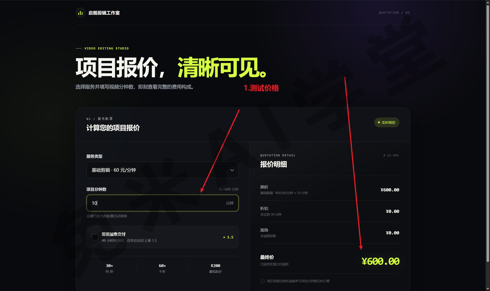

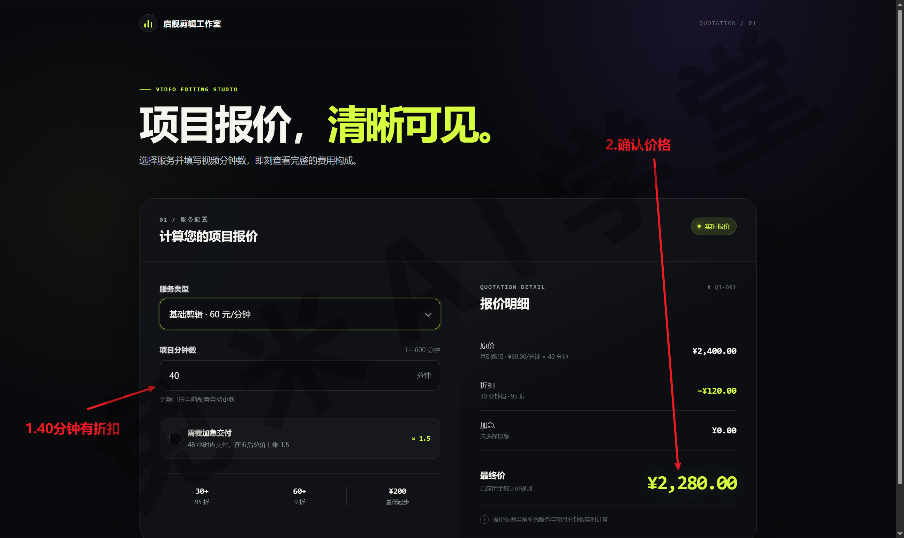

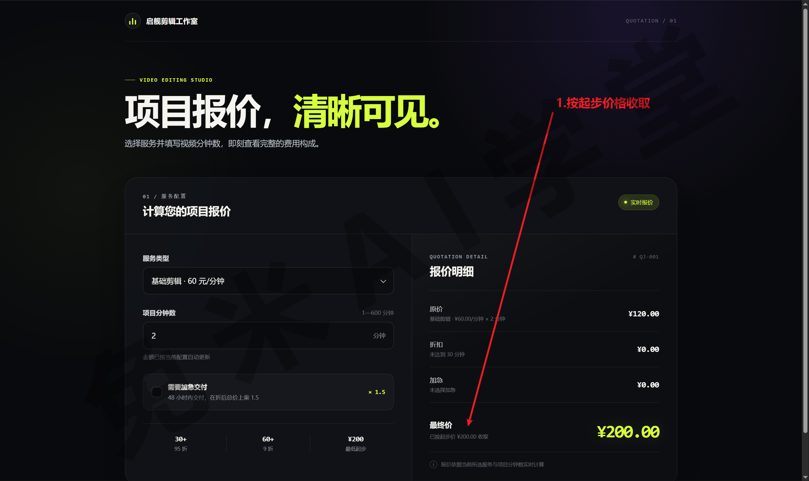

**表单口径：不引入自建后台**

预订表单只做一件事：把访客填的信息送到你手里。它不需要账号系统，不需要数据库，更不碰在线支付——部署平台明确禁止在这类站点上处理支付和银行卡信息，预订等于登记，收款线下另谈。“收到提交”这件事交给部署平台现成的表单收集能力，两条路线：

- **主线（Netlify 路线）**：给表单标签加上 netlify 属性并起好名字，部署后平台会在构建时自动识别，访客提交的内容进站点后台的表单面板，还能配邮件通知（后台需先开启表单检测，开关入口与现行文案，需实机验证）。两个注意点：平台只认构建出来的静态页面，框架栈的页面要按官方对 JavaScript 渲染表单的口径先预渲染一份，纯静态栈没有这个问题；默认的提交成功页是平台的英文通用页，新手容易当成报错，让它顺手做一个中文的自建成功页。
- **备选（Sites 路线）**：应用内建站路线目前没有独立的表单收集功能（开放能力以实际界面为准），退一步用预订摘要：提交时页面生成一段格式化的预订信息，访客一键复制后发给你。同样零后端，闭环稍弱，登记职能完全够用。

为什么不自建后台？后台意味着数据库、账号和持续运维，超出了纯前端项目的安全边界：出了问题你既看不懂也修不了，18.6 专门讲这条线。确定走主线后，发第二步的提示词（走备选路线就把表单要求换成生成预订摘要）：

```
按计划实施第二步：加预订表单，字段为姓名、联系方式、需求说明、期望交付时间。
表单按 Netlify Forms 的要求接线：form 标签加 netlify 属性并命名；
提交后跳转到自建的成功提示页 success.html，成功页用中文写明已收到预订、会尽快联系。
```

表单要部署上线后才能真正收到提交（平台在构建时才识别表单），本地先把结构和成功页验收好，收提交的闭环留到 18.6 上线后补完。

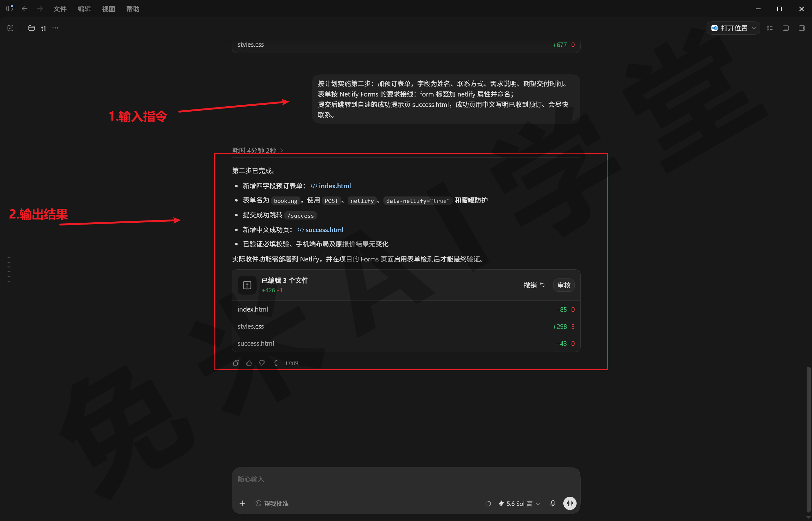

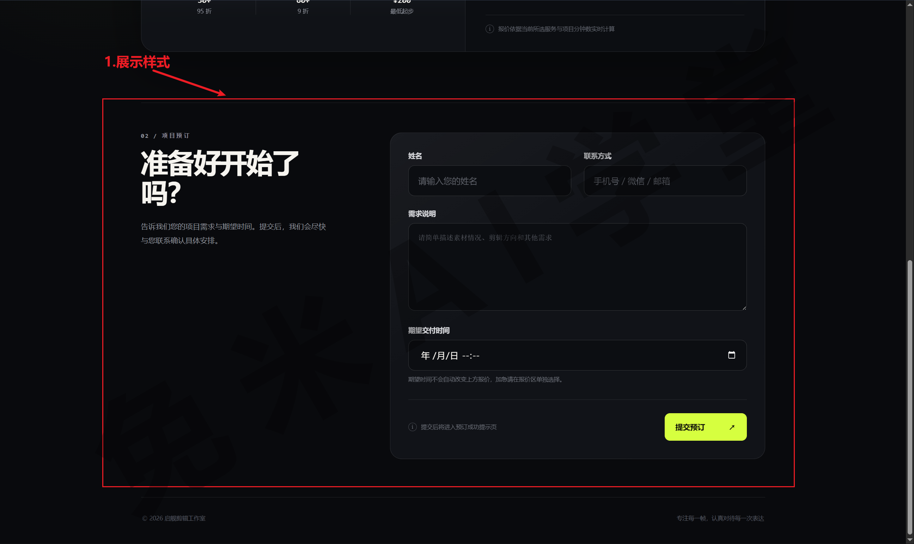

### 18.4 工作树并行：两个界面方案

**一个页面，两个方向**

计算器能用了，界面值得再打磨一轮。两个方向各有道理：

- **分步式**：像问卷一样一步一屏，先选服务，再填数量，最后出报价和表单。移动端友好，新客不容易漏填。
- **全览式**：选项、报价明细、表单同屏排开，改一个数立刻见新价。老客询价快，一屏看全。

纠结不如都做出来比一比。两版要改的是同一批页面文件，普通的多开对话会互相干扰——《界面全导览》里“两个任务改同一批文件要依次执行”的提醒，在这里有了正解：《自动化、Git 与远程操控》的工作树。每个对话拿一个隔离副本，各改各的，主项目原样不动。

**开两个工作树，各做一版**

进入项目，新建对话，在输入框下方的启动模式里选“新工作树”，起始分支保持默认（菜单选项沿《自动化、Git 与远程操控》登记的四项口径）。有一个实测踩过的前置：项目从没做过任何提交的话，工作树开不起来——先让它做一次初始提交（对话里说一句“先做初始提交，用来开工作树”即可），再新建对话。第一个对话发送：

```
把页面改成分步式：第一屏选服务类型，第二屏填分钟数和是否加急，
第三屏显示报价明细并填预订表单。界面怎么改都行，但算价逻辑和业务规则一律不动。
```

再新建一个对话、同样选“新工作树”，发送：

```
把页面改成单页全览式：服务类型、分钟数、加急、报价明细、预订表单从上到下一屏排开，
任何输入变化立即刷新报价。界面怎么改都行，但算价逻辑和业务规则一律不动。
```

两条提示词的最后一句是同一句，这不是巧合：**界面归界面，算价逻辑不许动。**两个副本要是都顺手“优化”了算价函数，择优收回时就会在同一处冲突；真遇到冲突提示，把提示原样发回对话让它处理（《自动化、Git 与远程操控》讲过）。任务发出后看一眼对话列表条目上的工作树图标或右侧的环境信息，确认自己在哪个副本里，再继续动手。

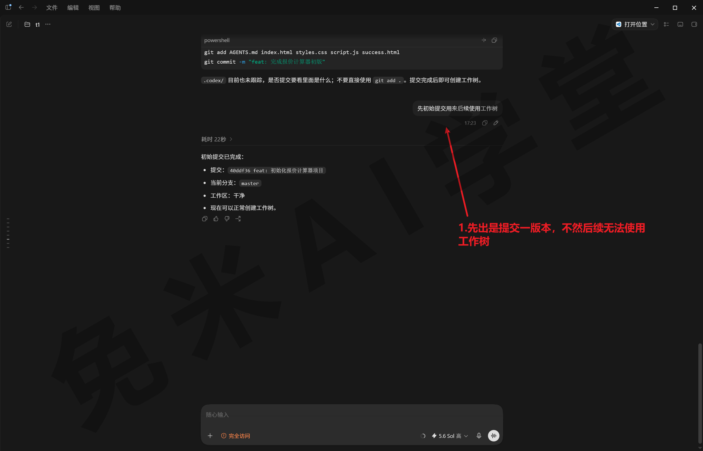

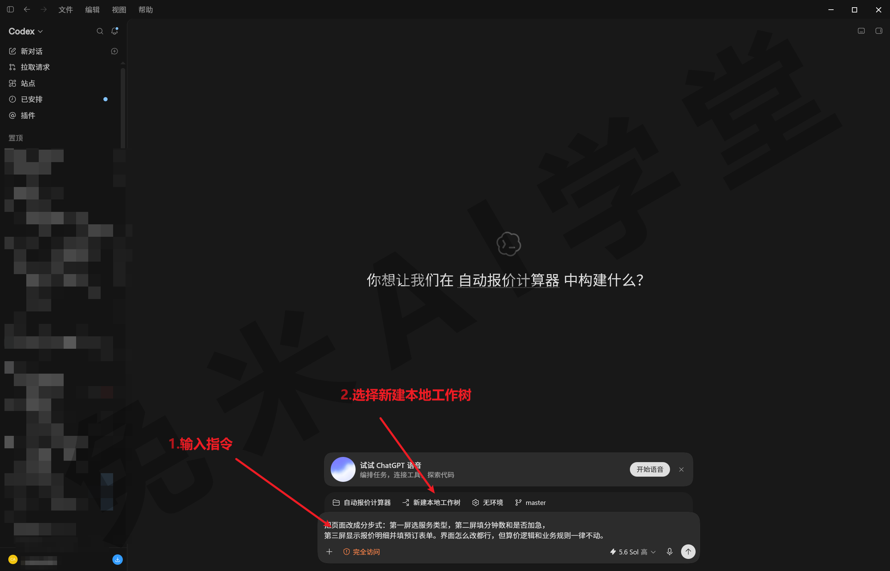

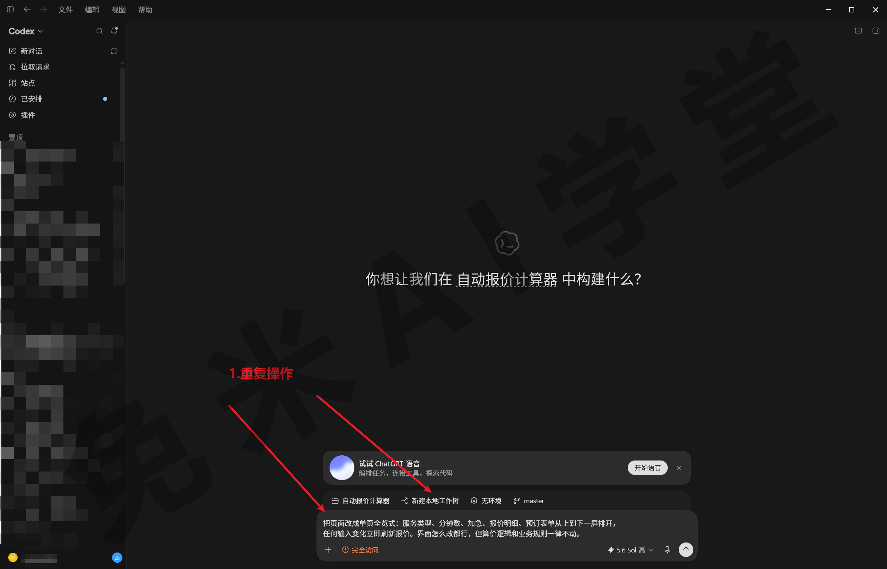

**对比择优：定了标准，结论才算数**

两版都完成后，分别在各自对话的预览里试用，按三个标准打分：

- **操作步数**：从进入页面到看到最终报价，要点几次、填几项？分步式天然多一两步，数出来才知道差多少。
- **出错率**：故意填 0、填字母、漏选服务类型，两版谁的提示更清楚、谁更容易让人填错？
- **移动端表现**：用预览的设备宽度切到手机档看排版（切换入口以实际界面为准）。分步式通常占优，全览式容易挤成一列长表。

比完给出结论并说出理由——本篇示例最终采用了全览式：改一个数立刻见新价、桌面端一屏看全，更合报价询价的用法；分步式手机端更稳，按下一段的办法以分支形式保留备用。说得出理由，这次对比才算完成；说不出，就再多试几笔。

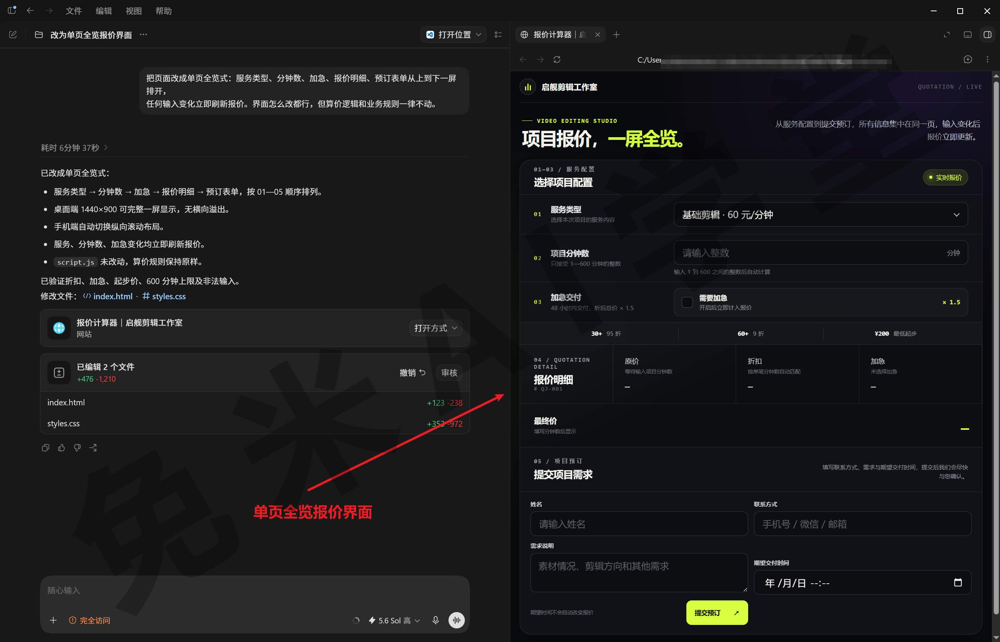

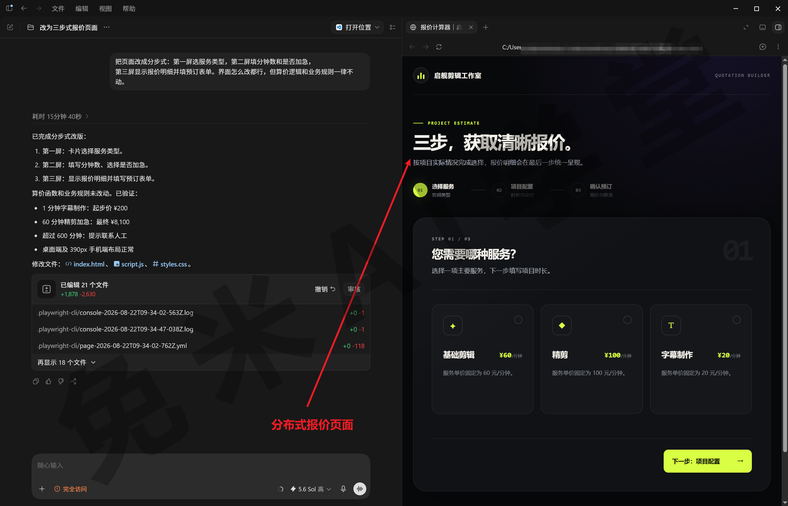

**没选中的方案不删，落一个明确的保留动作**

工作树副本的定位是轻量、可抛弃：归档对话，副本就被清理；长期闲置也可能被自动清走（清理前通常存有快照，以实际表现为准）。所以“留作素材”不能只是“先放着”，要落成一个明确的动作，三选一：

- **最稳**：对比结论和两版界面的截图先存进你的项目记录：截图到手，素材就丢不了，这也是本节两张对比图的由来。
- **代码级保留**：在未采用方案的工作树对话里说一句“保留此分支的内容”，它会创建一条正式分支并提交（实测分支名形如 codex/step-by-step-quote）；也可以把该工作树转为项目的永久工作树（入口与中文名，以实际界面为准）。分支进了版本库，副本被清理代码也还在——这就是《自动化、Git 与远程操控》提过的进阶收尾办法，在这里第一次用上。
- **轻量**：不归档该对话并把它置顶，副本暂时不会被清理，但这只是临时挡一挡，不是长期保险。

选中的方案则第一时间交接（Hand off）回主项目，流程沿《自动化、Git 与远程操控》的演示。工作树不是备份手段，满意的成果不要一直留在副本里。

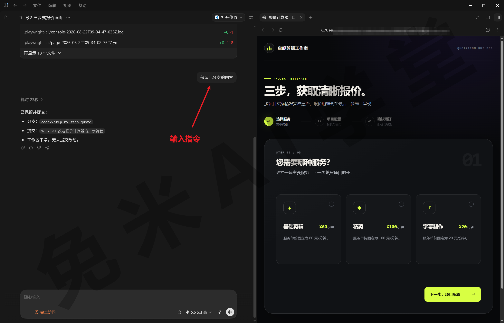

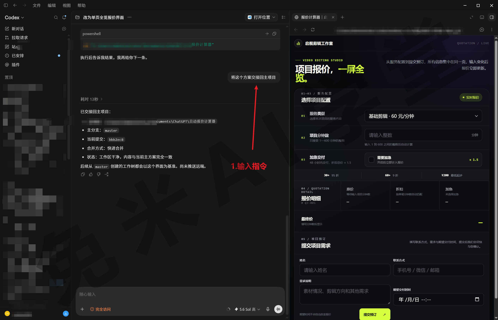

### 18.5 边界值试算

**验收方法要配得上业务应用**

页面上随手算一笔、对一笔，只能叫试过，不能叫验收。业务逻辑的验收有成熟的方法：按规则表把容易出错的输入列成清单，逐项试算。程序最容易出错的位置不是常规值，而是边界——“满 30 分钟”到底含不含 30，实现时最容易在这种判断上多写或少写一个等号，你的清单就要专门盯这些位置。

**从规则表派生清单**

派生口诀两句：**每个数字条件，取它两边和它自己；每条折扣规则，单独试一次、叠着试一次。**先按口诀试数字边界，以基础剪辑 60 元/分钟为例，期望值全部先按规则表人工算好：

- 29 分钟应得 1740 元：差一分钟不满 30，一分不折，验证折扣不会提前生效；
- 30 分钟应得 1710 元：95 折恰好生效，比 29 分钟还便宜是正常的边界现象；若显示 1800 元，说明“满”被实现成了“超过”；
- 60 分钟应得 3240 元：9 折生效且只取这一档，验证两档折扣不叠加；61 分钟应得 3294 元，验证 9 折往后持续有效。

以上试的是折扣档的边界，下面三条试起步价和多条规则的组合：

- 2 分钟应得 200 元：120 元被起步价保底，验证保底真的在兜底；
- 3 分钟加急应得 270 元：180 乘 1.5 已过起步线，不再保底；2 分钟加急仍应得 200 元：180 元不足 200，这一对搭配起来，能把计算顺序彻底验清楚；
- 60 分钟加急应得 4860 元：折扣与加急并用，验证两类规则互不干扰。

数字边界之外，还有一组非法输入要专门试：0、负数、3.5 这样的小数、随手敲进去的字母，每一个都应得到“请重新输入”一类的提示，而不是报出一个莫名其妙的价；601 分钟则应提示联系人工，而不是继续算。逐项在页面上试，期望与实际不符就记下来。这份清单同时是 18.7 验收的第一项依据，留好。

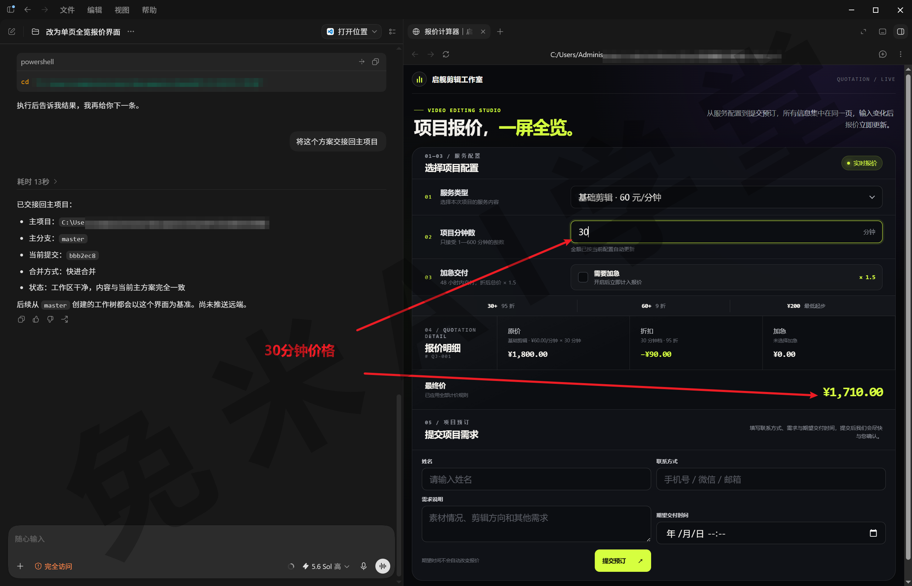

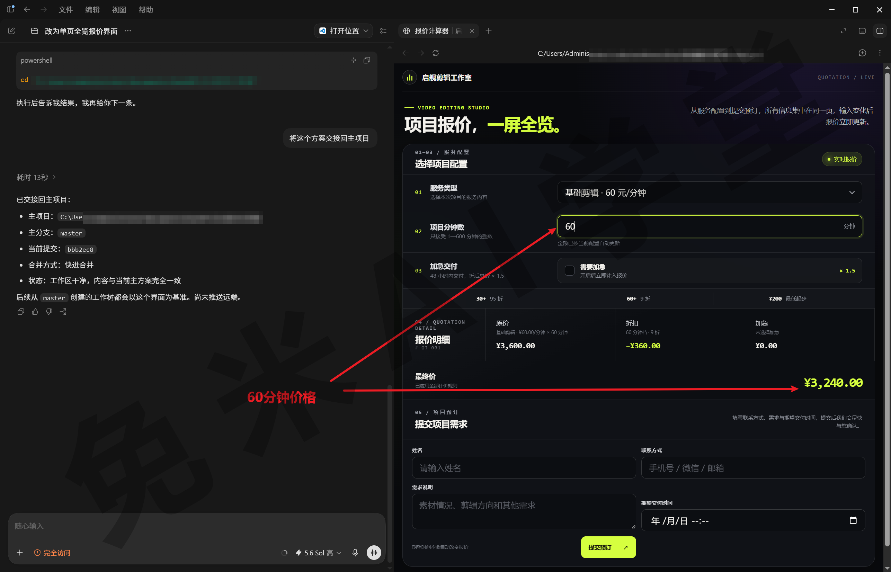

**发现算错：三件事一次说清**

报错的质量决定修复的速度。纪律是一次只报一个错，每个错把三件事说全，即输入什么、期望什么（附规则表依据）、实际什么：

```
算价有错：输入基础剪辑 60 分钟、不加急，期望 3240 元（规则表满 60 分钟应打 9 折），
实际显示 3420 元。
请对照 AGENTS.md 的规则表检查满 60 分钟这一档的折扣判断，只修这一处，其他规则不要动。
```

只说“折扣好像不对”，它得把整个算价逻辑翻一遍去猜；三件事说清，它直奔那一行判断。修完不要只验这一档，整份清单重跑，防止修好一处、带坏另一处。

**让它自己也出一组用例**

你的清单来自业务预期，AI 擅长穷举组合，两份互补：

```
根据 AGENTS.md 里的算价规则表，自己设计一组试算用例，覆盖边界值、
非法输入和折扣加急的组合，在页面上逐条执行，输出四列结果：输入、期望、实际、是否一致。
```

一条硬纪律：**它给出的期望值必须对照你的规则表人工核过才算数。**出题和判卷不能都交给它：预期值错了，整份结果表就是错上加错。核完还想加一道保险，可以用《AGENTS.md、Diff 与还原》里的 /review 让它以审稿人身份把当前改动整体过一遍，两边互为补充。

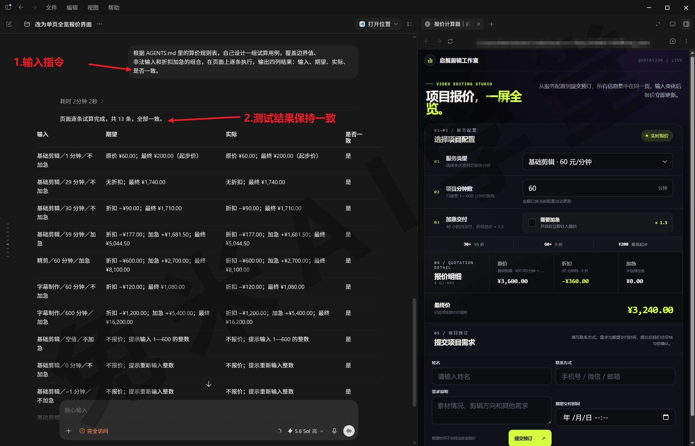

### 18.6 部署更新与能力边界

**更新已上线的站点，再到线上复核**

首次上线走《插件与部署上线》的既有路线，流程不重讲。这一篇的增量是上线之后的两个动作：

- **部署更新**：本地验收全部通过后重新部署，平台会记住这个站点，重复部署覆盖的是同一个网址，不会长出第二个站（部署生效通常要等构建完成，以实际表现为准）。表单收集也从这次部署起才真正开始工作：平台在构建时识别表单，本地预览里的提交不算数。之后的日常维护就是一个循环：改规则表、同步实现、复跑清单、再部署，四步缺一不可。
- **线上复核**：正式链接要当成一个新环境重新验一遍。挑清单里最关键的几档复跑：30 与 60 分钟边界、起步价、非法输入；再真实提交一条预订，确认后台表单面板收到、邮件通知送达（通知需在后台配置，入口与文案，需实机验证）。页面看着没更新先别下结论，强制刷新或开无痕窗口再看，《插件与部署上线》里的缓存老坑在这里同样适用。

本篇示例项目一直在本地验收，到这一步才首次上线，首次部署就一句话——说清“新建独立站点、别覆盖你已上线的名片站”：

```
把当前版本首次部署到 Netlify，新建一个独立的生产站点，
不要覆盖现有电子名片站点；部署完成后验证页面和报价功能，
并列出本次上线包含的改动及公开访问网址。
```

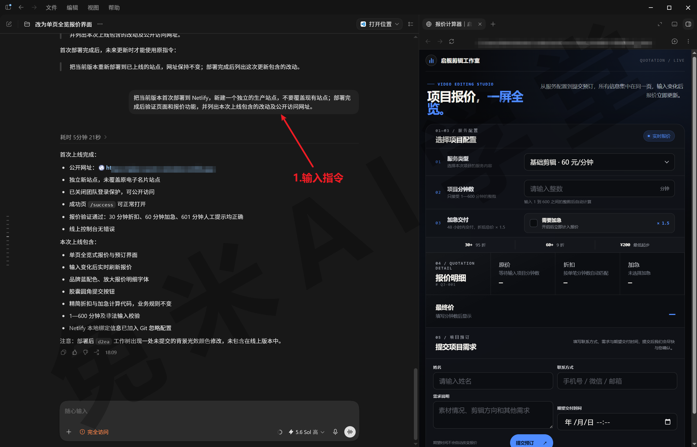

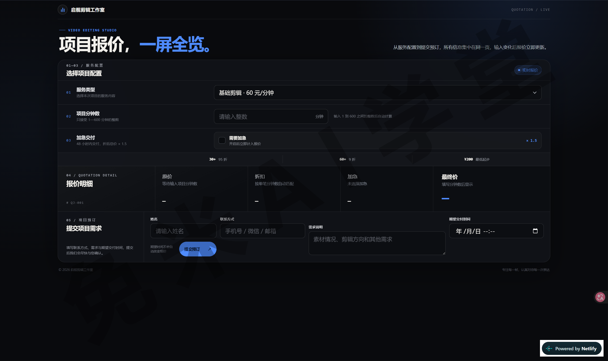

**诚实的能力边界**

做完这个项目，很自然会想：是不是能接着做带会员、带订单库的完整系统了？这里把边界诚实讲清楚：静态网站、纯前端逻辑、工具类小应用，AI 都能胜任，本篇就是证明；但动态页面、带数据库、带后台的大项目，新手要慎重。机制上的原因《上下文与记忆》讲过：项目一大，对话累积到几百轮，上下文再怎么压缩也会丢信息；你不懂代码，给不出确切归因，它只能凭猜测修改，越改越乱。报价计算器之所以安全，恰恰因为它小：规则是你定的，错误你能用清单定位，改坏了能逐块退回。

**三问判断标准**

判断一个想法该不该做，比“能不能做”更有用的是下面三问：

- **出了错，你能给出确切归因吗？**纯前端算错价，边界值清单能把错误定位到具体某条规则；数据坏在数据库里，新手连从哪里问起都不知道。
- **改坏了，能退回去吗？**前端文件的改动，还原与逐块还原全覆盖；数据库里的数据坏了，文件还原救不回来，《AGENTS.md、Diff 与还原》讲“还原救不了什么”时提过这一类。
- **项目会不会长到上下文装不下？**单页计算器几十轮对话就收工；多人使用、持续迭代的业务系统会一直长下去。

三问里有一问答不上，就该换路线：请开发者收尾、用平台托管的现成能力做持久化、或者把范围缩回你能掌控的大小。工具的边界不丢人——把边界之内的事做到“算得对”，你交付的东西已经超过大多数人。

### 18.7 验收清单

整篇的动手成果按下面三项逐一验收。每项都给了判定标准，拿你自己的项目对照，判定不过就回到对应小节修完再来，三项全部达标才算交付：

- **算价逻辑边界值全对**。判定标准：按 18.5 从你的规则表派生的清单逐项试算，每一档的实际结果与人工算好的期望一致；覆盖面至少包括每个阈值的两边和它自己、每条折扣的单独与叠加、起步价保底、全部非法输入（0、负数、小数、非数字、超上限）。任何一档不符，按三件套报错修复，然后整份清单重跑，直到一次全绿。
- **两方案对比有结论**。判定标准：两个工作树方案都完整可用；按操作步数、出错率、移动端表现三个标准实际比过；能对外说出采用哪一版和至少两条理由；未采用的方案完成了明确的保留动作（截图进记录、建分支或转永久、置顶保护，三选一）。只做出一版、或说不出理由的，回 18.4。
- **上线版本可用，表单按既定口径工作**。判定标准：正式链接上关键边界档复核通过；走主线口径的，后台表单面板能看到你的测试提交且邮件通知送达；走备选口径的，预订摘要能生成、能复制。部署后页面未更新的，先强制刷新或换无痕窗口排除缓存，再下判定。

三项全过，这个项目就从“做出来了”变成了“敢交出去”。

### 18.8 本篇小结与自检

这一篇做出了第一个带业务逻辑的应用。最需要记住的是：**业务规则要先由你自己梳理成清单，AI 负责实现；上线前按边界值清单逐项试算，全部通过才算交付。**

可以对照下面的清单检查学习结果：

- [ ] 报价计算器上线可用，选规格能自动算价
- [ ] 自己动手整理过一份含边界情况的算价规则表
- [ ] 用工作树并行做过两个方案，并能说出择优结论
- [ ] 按边界值清单逐项试算，全部通过

完成这些内容后，你交付的作品已经从“页面好看”升级到“逻辑正确”。下一篇《调研情报系统》让 Codex 替你盯信息：从多源调研到每天送达的晨报。

### 18.9 新手常见问题

**Q1：不懂代码，业务规则要写到多细？**

写到“任何人拿这张表人工算，结果都一样”的程度：每类服务的单价、每条折扣的适用条件、多条规则同时满足取哪条、计算顺序、非法输入怎么处理，全部落成文字。检验方法很直接：把表交给一位朋友算三笔，他一次都不用问你，说明够细了；他开口问的每个问题，都是表里缺的那一行。

**Q2：两个方案都不满意怎么办？**

不要回主项目上直接改。可以再开第三个工作树，把两版各自的优点说给它（比如要分步式的流程、配全览式的即时刷新），让它做混合版；也可以在相对较好的那一版工作树里继续迭代，满意了再交接。主项目始终停在最后一个验收通过的版本上，这正是工作树给你的底气。

**Q3：为什么不建议新手做带后台数据库的应用？**

用 18.6 的三问自测一遍就明白：数据坏在库里，你给不出确切归因；文件还原救不了库里的数据；这类项目的对话会长到上下文装不下。三条都答不上，出了问题就无从下手。真有保存数据的需求，用平台托管的现成能力，或请开发者搭好骨架，你继续负责规则和验收。

**Q4：边界值试算发现算错，怎么描述它才能修对？**

一次只报一个错，三件事说全：输入什么、期望什么（附上规则表里对应的那一条）、实际什么；再加一句范围约束“只修这一处，其他规则不要动”。修完不要只验这一档，整份清单重跑一遍，确认没有修好一处、带坏另一处。

