## 认识与装好

这一篇先完成两件事：认识 Cursor 这个工具，并在你的电脑上把它装好、登录、切成中文界面。装好之后，本篇会带你跑一组“装完就能用的三连任务”——让它解释一个文件夹、做一处小改动、再把改动还原——直观感受它和普通聊天工具的区别。

全篇不需要编程基础。本课的演示环境是 Windows 桌面端的 Cursor 3.x（以 3.7.42 版为例）。这个产品更新很快，个别界面细节可能与你看到的略有差异，一切以你装好的最新版本为准。

### 1.1 Cursor 是什么

你可以把 Cursor 理解成一个能替你操作电脑的 AI 助手：它不只回答问题，还能在你允许的范围内读文件、改文件、运行命令、打开网页，把一个想法一步步做成能用的东西——一个网页、一份表格、一个小工具。

这类能够调用工具、独立完成任务的 AI，通常称为“智能体”（Agent）。现阶段不必专门记住这个术语，本课后面说“智能体”和“它”，指的都是同一个东西。先记住一件事就够了：**普通聊天工具主要给你答案，Cursor 还能替你把事情做完。**

体会一下这句话的差别。你对聊天工具说“帮我整理一下下载文件夹”，它只能给你一份整理思路，因为它看不到你的电脑；同样一句话交给 Cursor，它会真的读取那个文件夹（前提是你把文件夹交给了它），列出里面有什么、动手分类改名，最后把整理结果列出来给你看。它干活的方式也和人接近：接到任务先看情况、再动手、再检查，每一步都在界面上留下记录，你随时能看到它进行到哪、改了什么——这份工作记录怎么读，下一篇《两套界面全导览》会专门讲。

当然它不是全能的：你没授权的内容它拿不到，超出模型能力的任务会做错，长时间没人验收也可能越做越偏。这些边界怎么划、出了偏差怎么兜底，是《权限、沙盒与模型》和后续各篇的主题，这里先给你一个准确的预期。

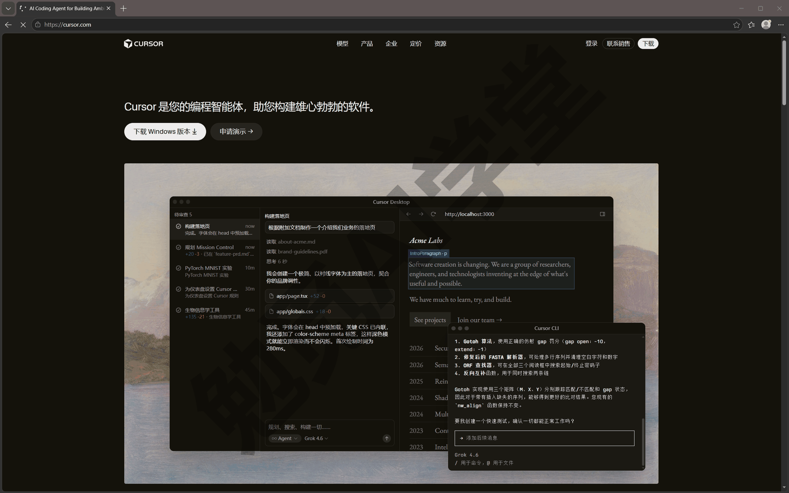

为了不带着误解开始学习，再说清楚三个“不是”。

**它不是一个聊天机器人。** 聊天只是你和它打交道的方式，它真正要做的是干活：你说清楚目标，它去读你的文件夹、写文件、跑命令，最后把成果交回来给你验收。也因为它会真的动你的文件，本课会反复强调权限和验收的习惯——这是用聊天工具时不需要操心、用它时必须建立的意识。

**它不是只给程序员用的。** 写代码确实是它最强的能力，但这恰恰是不会编程的人的机会：想要一个记账小工具，“写”这一步可以整个交给它，你负责提要求、看结果。本课从头到尾都按零基础用户设计，不要求你看懂任何一行代码。

**它不是 VS Code 的插件。** 如果你听说过 VS Code（一款流行的免费代码编辑器），需要知道 Cursor 是在它基础上深度改造出来的一款独立应用，要单独下载安装；两者可以同时装在一台电脑上，互不影响。没听说过 VS Code 也完全不影响学习，课程里用到相关概念时会随时解释。

**厂商与版本号在哪看。** Cursor 由 Anysphere 公司开发，在扩展面板这些地方你会看到这个公司名。想确认自己装的是哪个版本，可以在编辑器菜单里打开“帮助 → 关于”查看。花几秒记住这个入口是值得的：这个产品几乎每周都在更新，遇到界面和教程对不上、功能不正常，第一件事就是看版本、更新到最新（更新方法见 1.9）；将来排错或向别人求助时，报上版本号也能让对方更快帮到你。

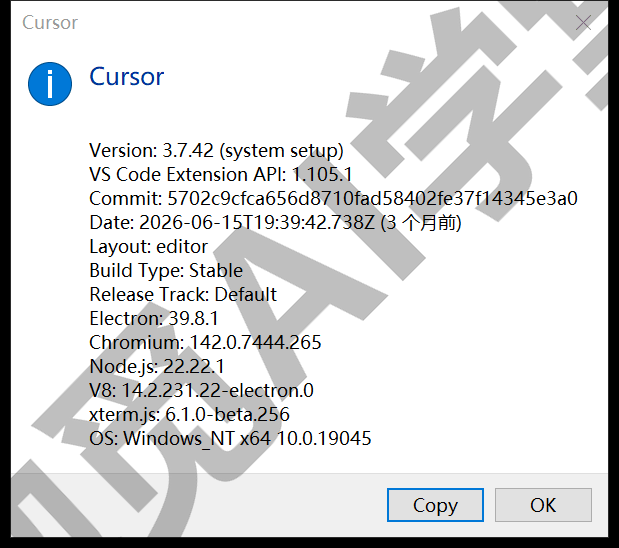

### 1.2 它能帮你做什么

先不急着安装，看五件它最常帮普通人做的事，你可以边看边对照自己的需求。

**第一件：读懂并整理你的文件夹。** 电脑里那种堆了几百个文件、自己都不敢乱动的文件夹，可以直接交给它：让它先读一遍，告诉你里面都有什么；再让它按类型或内容分组、批量改名、找出重复文件。它是真的把文件内容读了再动手，不是凭文件名猜。《文件与办公能力一篇讲全》会用一整篇讲这类任务。

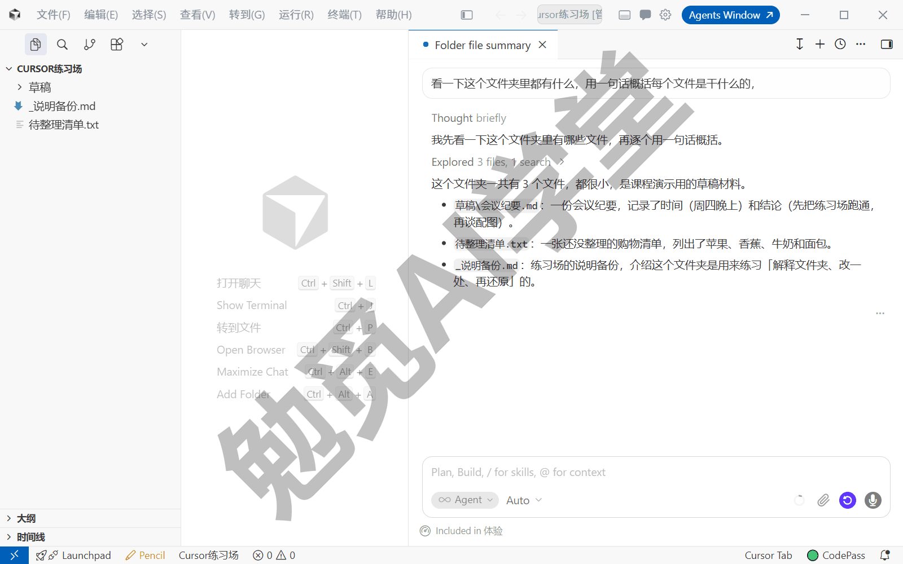

**第二件：写出能跑的网页和小工具。** 一张个人介绍页、一个报名表、一个预算计算器，这类小东西过去只有会写代码的人能做，现在变成“说得清楚就能做”。你描述想要的样子，它把代码写出来、在本地跑起来给你看；哪里不满意接着说，它接着改。课程后半段的实战篇会完整做出《实战一：小店官网》和《实战三：装修预算估算器》这样的成品。

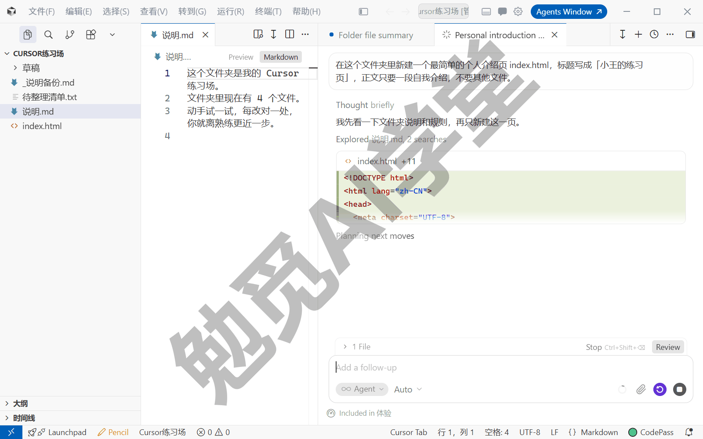

**第三件：自己打开浏览器验证结果。** Cursor 内置了一个浏览器。做完网页它可以自己打开看、自己截图检查，发现排版挤了、按钮歪了，会接着改，而不是把没验证过的东西直接交给你。这个能力在《内置浏览器与设计模式》细讲。

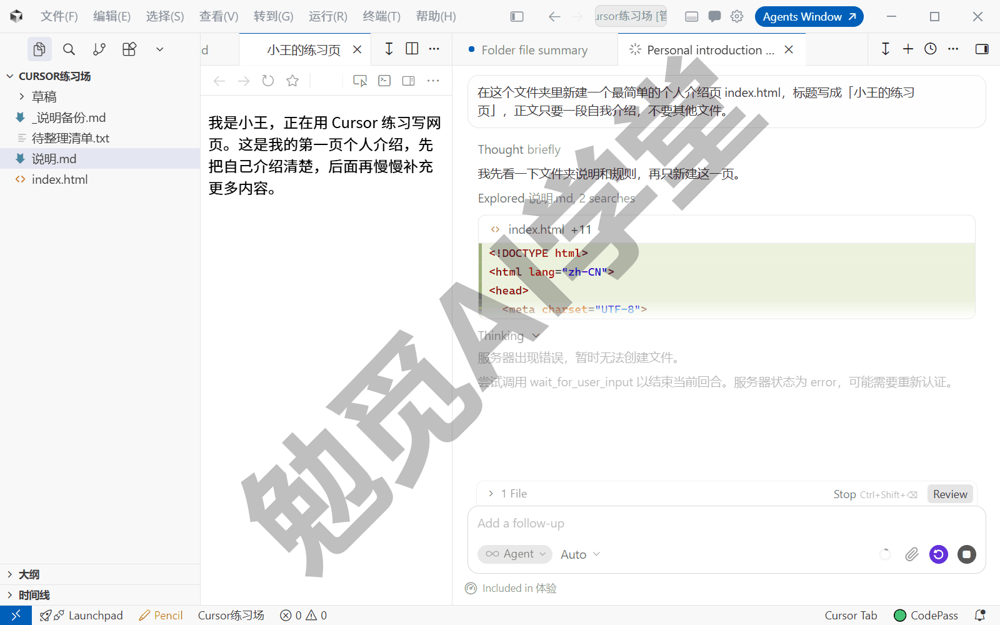

**第四件：记住你的规矩。** 你可以给它写下长期有效的要求，不用每次重复交代。这里先认识两个词，后面各有一整篇展开：

- **规则**：你写给它的长期要求，每次对话自动生效，比如“回复永远用简体中文”。《规则与 AGENTS.md》细讲。
- **技能**：一份教它怎么做某类事的说明书，用的时候它整套照做，比如“我的周报格式”。《技能与自定义模式》细讲。

**第五件：关掉电脑也在云端干活。** 耗时长的任务可以交给云端智能体（Cloud Agents，早期叫 Background Agents）：任务在 Cursor 的云端机器上运行，你合上笔记本它也不停，回头在电脑或手机上看结果。这是付费功能，《云端智能体与手机端》细讲。

**它适合谁、不适合谁。** 如果你经常有重复性的电脑操作、想把一些点子做成小工具、并且愿意在关键步骤自己确认一下，它非常合适。反过来，如果你期望完全撒手不管、一句话就得到完美结果，或者打算把高度敏感的资料交给它而不想了解任何权限设置，那么先降低预期——它需要你学会“提要求、给边界、做验收”这三件事，这也是本课要教的。市面上还有 Codex、Claude Code、WorkBuddy 这类同类智能体工具，核心思路相近，你手里在用哪个就先把哪个用熟；它们和 Cursor 怎么分工选用，《毕业项目：个人数字工作台 + 课程总结》会专门讨论。

### 1.3 一个产品、四个入口

搜索 Cursor 时你会看到桌面应用、网页版、手机 App、命令行等不同说法。它们不是四个让你挑一个的并列产品，而是同一个账号下、按场景分工的四个入口。用一天的使用场景把它们串起来，你就明白各自站在什么位置。

**坐在电脑前干正事：桌面应用。** 这是绝对主力，也是本课的主角。桌面应用里有两套界面：一套叫“代理窗口”（Agents Window），是围绕智能体设计的新界面，负责下任务、看进展、审查改动；另一套叫“编辑器”，是经典的开发环境界面，负责看文件、装扩展、做精细修改。两套界面随时互相切换、也能同时开，下一篇《两套界面全导览》会把它们逐个区域讲透。


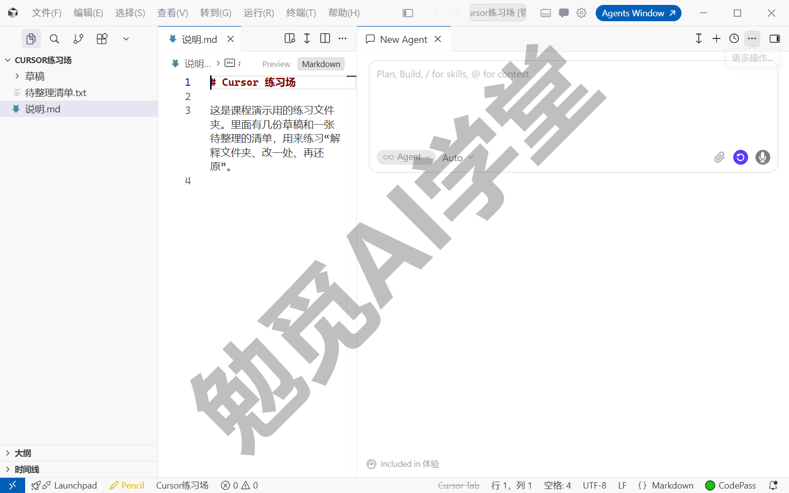

**任务太长、人要走开：交给云端，用网页版盯着。** 把任务交给云端智能体之后，任何一台电脑打开浏览器访问 cursor.com/agents 就能查看和指挥它们，不需要安装任何东西。网页版和桌面端看到的是同一份智能体列表，两边进度同步；免费账号也能登录进去看界面，但发起云端任务需要付费套餐。网页版是云端任务的总控台，本课到《云端智能体与手机端》再展开。

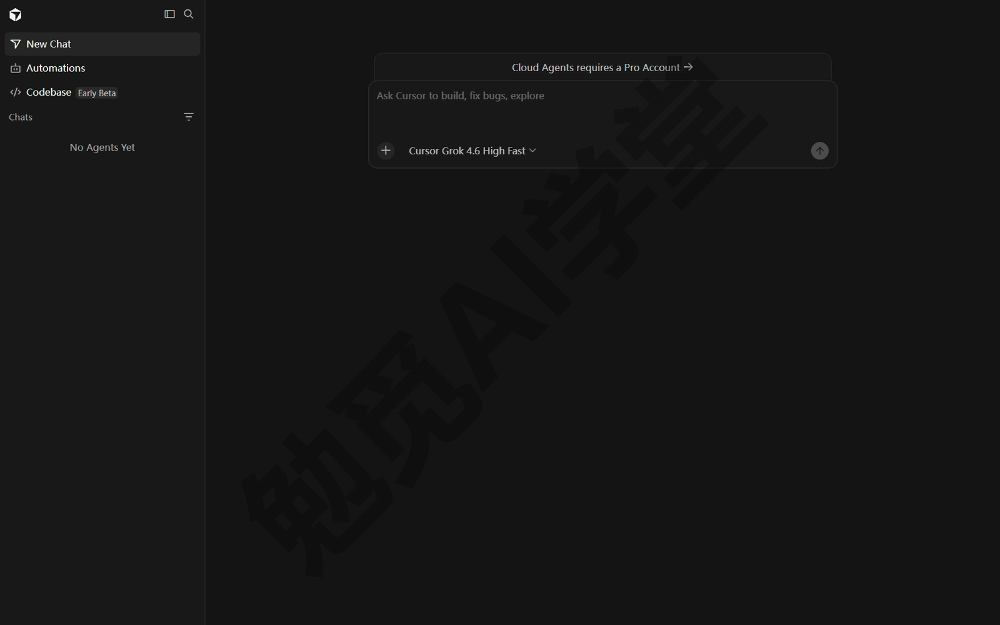

**人在路上：手机 App 是口袋里的遥控器。** iPhone 和 iPad 有专门的 App，可以发起云端任务、看进展、审查与合并成果；目前中国大陆的 App Store 没有上架，界面暂时只有英文（以商店与应用实际为准）。Android 没有专门的 App，和装不了 App 的用户一样，用手机浏览器打开网页版即可，也可以把网页“安装”到主屏幕当 App 用（这种方式叫 PWA）。要注意手机端定位是“指挥与验收”：看差异、审批任务可以，直接在手机上改文件不行。iPad 屏幕大，布局更宽松：对话列表在侧栏，审查页可以和对话并排，还能用 Apple Pencil 在截图上圈画（以应用实际为准）。手机端发起任务同样需要付费套餐。

**电脑没有图形界面：命令行 CLI。** 在远程服务器上、或想把 Cursor 写进自动化脚本时，用命令行版本，在终端（命令行窗口）里对话、下任务。它和桌面端共用同一个账号与用量，既能像聊天一样一句一句地用，也能一条命令跑完就走；桌面端的那些模式它也基本都有。零基础读者现在只需要知道有这个入口，《自动化、钩子与命令行》会讲安装和使用。

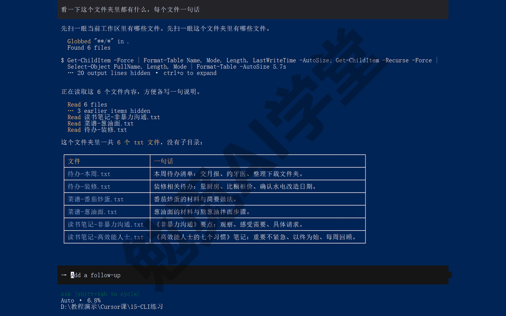

串完一遍可以看出关系：桌面应用是干活主力，网页版和手机 App 围着云端任务转，CLI 面向服务器和自动化场景。四个入口共用同一个账号和同一份套餐用量，在手机上发起的云端任务，回到电脑能接着看，进度不丢。本课的绝大部分时间都在桌面应用的代理窗口里度过。

另外，你在官网可能还会看到一款叫 Grok Bot 的产品，那是 Cursor 公司推出的另一个应用（一个自带云端电脑的 AI 同事），和本课要学的 Cursor 不是一回事，本课不展开，它的定位与套餐归属以官网说明为准。

### 1.4 账号与套餐机制

安装之前，先把账号和费用的机制说清楚。这里只讲机制、不写任何价格和额度数字——这类数字变得很快，一切以官网套餐页和你的账号页面显示为准。

**免费的 Hobby 套餐能做什么。** 注册就有，装好就能用核心功能：智能体对话、Tab 补全（打字时的自动补全，《编辑器三件套：Tab、内联编辑与扩展》细讲）都能用，模型用默认的 Auto 档。限制在用量上：免费额度有限，官方不公布具体数值，用完会收到提示。学习本课的前几篇，免费套餐完全够用。

**付费套餐多出什么。** 个人付费套餐从 Pro 起步，往上还有 Pro+ 和 Ultra。机制上，付费多出两类东西：

- **更充足的用量**：付费套餐包含两个按月重置的用量池——“Cursor 自家模型池”（Cursor 自研与联合训练的模型，包含的用量明显更多）和“第三方模型池”（外部前沿模型，按各家模型的价格从池里扣）。无论你自己指定模型还是交给 Auto，一次请求被分配给哪类模型，就从对应的池子里扣；选什么模型，决定池子消耗多快。
- **云端能力**：云端智能体、自动化、代码审查机器人 Bugbot、Origin 代码托管（把代码存放在网上的服务）这些“不在你电脑上跑”的功能，都从 Pro 起开放（具体归属以官网套餐页为准）。

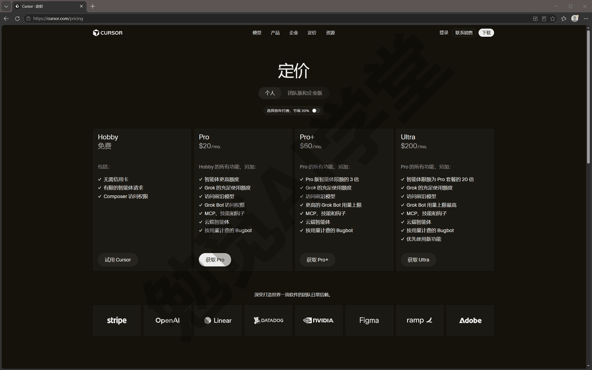

**Auto 是什么。** Auto 是模型选择器里的默认选项，意思是让 Cursor 替你挑一个合适的模型，而不是你自己指定。官方已把旧的 Auto 拆成 Cost、Balance、Intelligence 三档（分别偏向省用量、均衡、最强能力），先在团队版启用，个人套餐要晚一些才会有。你的选择器里见到的是旧样子还是三档，以你看到的为准。这套自动分配的机制、什么时候该自己指定模型，放在《权限、沙盒与模型》细讲，现在保持默认即可。

**用量在哪看、用完了怎么办。** 登录 cursor.com/dashboard 可以看到套餐、按需费用、重置日期和用量明细（分在支出页、总览页和用量页，中文文案以实际页面为准）；在应用内的设置页里，Plan & Usage 一栏也能看到当前套餐和两个用量池（页面上一般显示为 Cursor Models 与 Other Models，以你页面上的分区名为准），下图就是这一栏。包含用量按月随账单周期重置，没用完的不会累加到下个月。用完后有两个选择：开启按需付费继续用（按同样的费率单独计费，请求的质量和速度不会因此变差），或者升级套餐拿更多包含用量。升级通常立即生效，降级通常到本周期结束才生效（以页面提示为准）。要不要升级不用提前纠结：等你真的频繁碰到用量提醒，再对着用量页看看钱花在了哪类任务上，那时的判断才有依据。

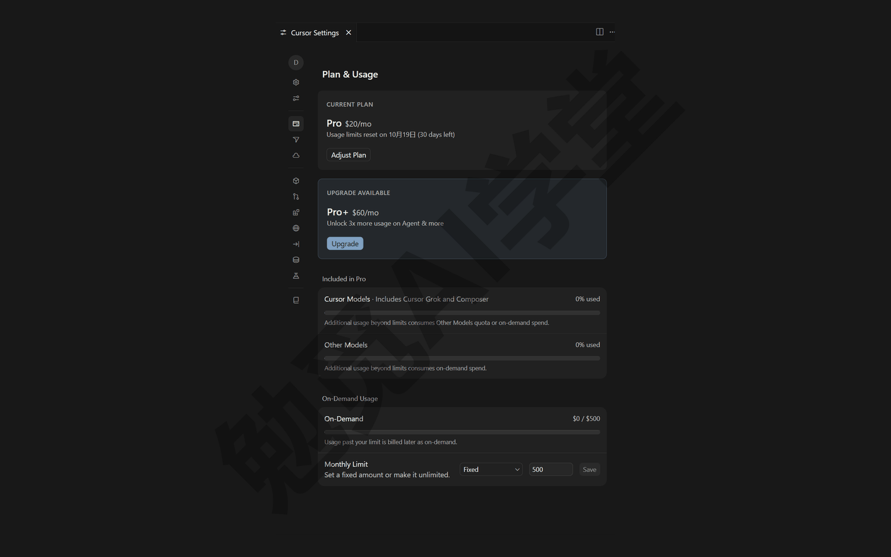

**学生优惠。** 旧版的学生优惠已不再接受新申请，已经领到的用户按原条件用到套餐到期。现在换成了两种办法：本科生主要通过官方的校园活动拿到优惠和额度，研究生、博士生和教研人员可以通过官方表单申请，入口和条件以官网页面为准。

**给零基础读者的建议。** 先用免费套餐把课程学起来，等确认自己会频繁用到云端、自动化这类能力，再考虑付费。是否订阅不影响理解课程内容——涉及付费功能的文章都会先说明要不要付费。

### 1.5 下载与安装

正常情况下，从下载到装好大约需要 5～10 分钟。下载与安装是全课少数“只做一次”的操作，却也是新手最容易卡住的一段，所以这一节把每一步会看到什么都交代清楚，照着走就行。以下按 Windows 演示，macOS 用户从同一个下载页下载安装包后拖进“应用程序”文件夹即可，Linux 用户可用官方软件源或 AppImage 安装，本课不展开。

**第 1 步：下载安装包。** 打开官网下载页（cursor.com/download），网站通常会自动识别你的操作系统，页面上出现为 Windows 准备的下载按钮；万一识别得不对，页面上一般也能找到其他系统的下载入口（以页面实际为准）。点击后浏览器开始下载一个 .exe 安装文件，默认保存在“下载”文件夹。还有两件事要先确认：系统需要 Windows 10 及以上版本；下载、安装和登录全程要保持联网。还没注册账号的话，也可以顺手在官网完成注册（注册入口以页面为准），先注册还是装好再注册都行，1.6 登录时用得上。

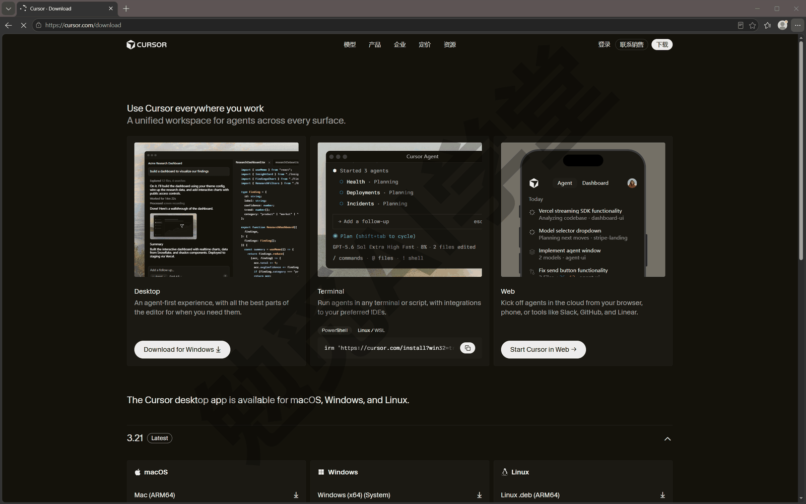

**第 2 步：运行安装程序。** 双击下载好的安装文件。Windows 可能先弹出用户账户控制的确认框，问是否允许这个应用更改你的设备，点“是”继续。接下来是一套中文安装向导。不同版本的页面顺序可能略有差异，以你看到的为准；下面以 2026 年 9 月的安装包为例。

先到许可协议页：改选“我同意此协议”，再点下一步。停在“我不同意”时，下一步是灰的，点不下去。

下一页是选择目标位置。默认一般在用户目录下的 `AppData\Local\Programs\cursor`。也可以改到别的盘，演示里装到了 `E:\cursor`。路径里不要用中文。

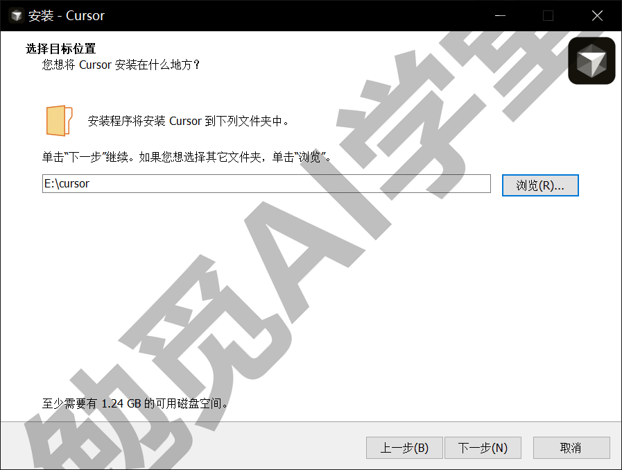

再下一页是选择开始菜单文件夹，保持默认的 Cursor 即可。

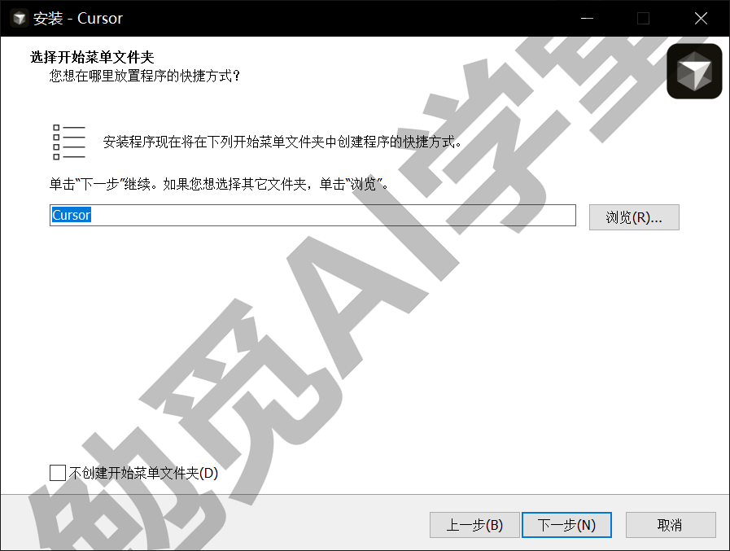

然后是附加任务：要不要创建桌面快捷方式、要不要加到 PATH（系统找命令用的路径清单，勾上以后能在命令行里直接输入 cursor 启动它）、要不要把 Cursor 注册成支持的文件类型，按自己习惯勾。演示里没有勾桌面快捷方式，勾了后两项。拿不准就保持页面上的默认勾选。

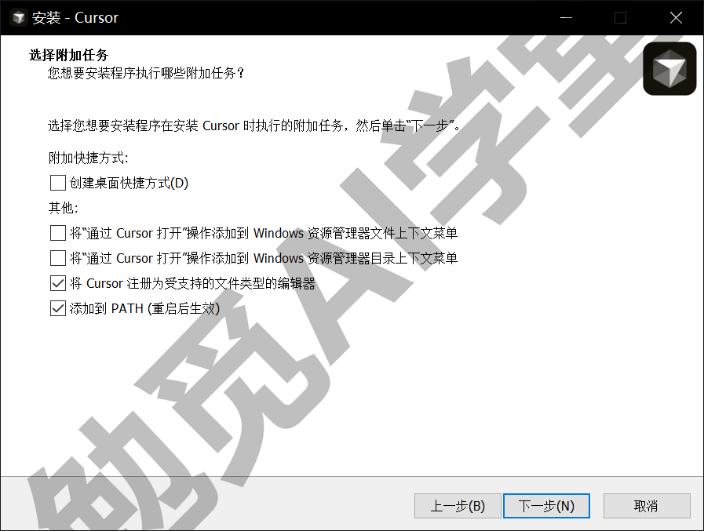

点下一步会看到准备安装页，核对路径和选项，再点“安装”。

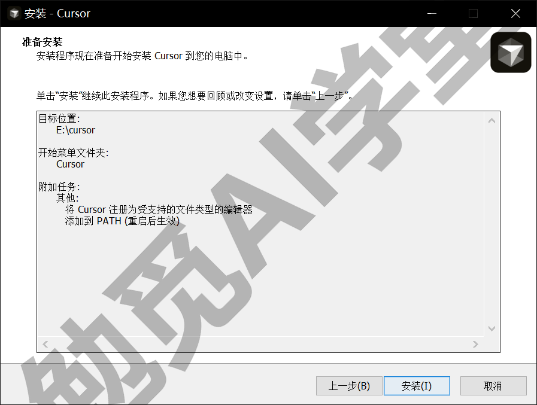

进度走完后是安装完成页，可以勾选“运行 Cursor”，点“完成”。安装一般一两分钟。装完后开始菜单里会出现 Cursor 图标，多数情况下应用还会自动启动一次。有杀毒软件拦截时：确认安装包来自官网再放行；拿不准就先停下，回官网重新下载再装。

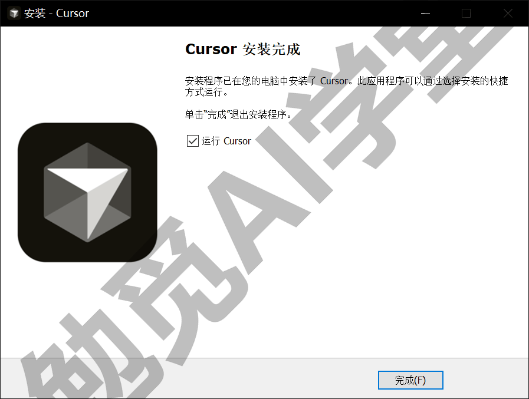

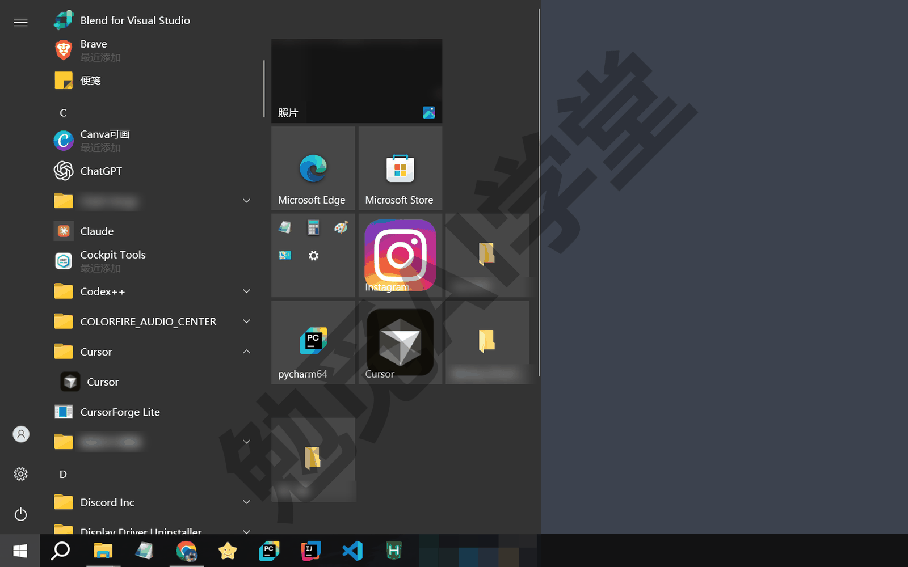

**第 3 步：完成首次启动引导。** 第一次启动、而且本机没有旧配置时，应用可能会引导你做几项初始设置，例如键盘方案、界面主题、界面语言，以及是否从 VS Code 导入配置。如果你的电脑上装过 Cursor、旧配置还在，启动后可能直接进入登录页、跳过这几页，属于正常现象。引导页通常是几屏简单的选择：一屏选界面主题（深色或浅色）和界面语言，另一屏问要不要从 VS Code 导入扩展、快捷键与设置，给 Import（导入）和 Skip（跳过）两个按钮，没用过 VS Code 的直接选 Skip。具体有几屏、先后顺序以你实际看到的为准。这些选择都不是一次性决定，之后在设置里全部能改，所以拿不准的一律保持默认。下面给三条具体建议：

- 键盘方案影响的是快捷键习惯，保持默认就与本课和多数教程一致。
- 主题只影响配色，选你看着舒服的即可。本篇的截图多数用的是浅色主题、少数是深色，后面各篇的截图都是深色主题，对照界面时不必在意深浅。
- 用过 VS Code 的读者，导入功能可以一键把扩展、主题、设置和快捷键搬过来，导入后两边仍是独立应用、互不影响，值得用；没用过就跳过。

引导里如果出现登录页，可以当场登录，流程与下一节相同；想先看明白再操作也不迟。

**装好先确认一眼。** 引导走完会进入主界面，这时界面还是英文的，这很正常，登录和切换中文界面，接下来两节会分别讲。可以顺手用 1.1 讲过的“关于”入口核对一下版本；如果安装失败或首次启动一直没反应，多数是下载不完整或网络问题，处理顺序在 1.9 里。

装完先不急着到处点，下一节先把登录做完。

### 1.6 登录

首次启动后，应用会提示你登录。这一步绕不开，原因是：你发给 AI 的每一条消息都要经过 Cursor 的服务器处理，套餐、用量、云端功能都挂在账号上，不登录就用不了 AI 能力。使用 Cursor 需要一个账号，没有的话在登录页或官网免费注册即可（以页面指引为准）。

**登录方式。** 登录页通常提供三种方式：Google 账号、GitHub 账号、邮箱（按钮文案以实际界面为准）。三种方式登录后的功能没有任何区别，按自己的情况对号入座：

- **Google**：平时就在用谷歌服务的选它，点一下、授权一次就完成，最快。
- **GitHub**：打算跟着本课一路走到连接代码托管、把作品上线的，优先用它——《Git、GitHub 与代码审查》会再次用到这个账号，一个账号两处用。
- **邮箱**：前两个都没有时的兜底。输入邮箱后按页面提示完成验证（可能是验证码或确认邮件，以页面为准），设置好密码就行。

选定之后还有一件事：第一次用哪种方式注册，以后就固定用哪种登录。同一个邮箱走不同方式登录，可能会被建成两个不同的账号（实际关联规则以账号页面显示为准），套餐买在这个号上、登录的却是另一个号，就会出现“明明付了费却像免费版”的错觉。

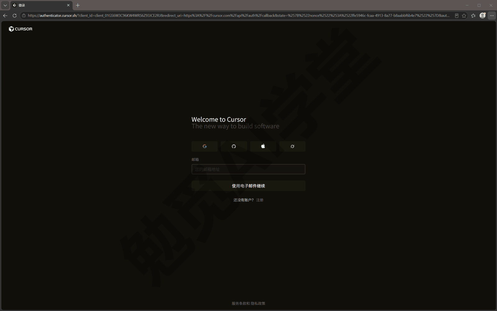

**登录流程。** 点选一种登录方式后，应用通常会跳转到系统浏览器完成授权：浏览器里会出现确认页面，写明你正在授权登录 Cursor，确认后页面提示成功、可以返回应用。多数时候应用会自动完成登录，回到应用就能看到已登录的首屏，接下来打开一个文件夹就可以开始；如果浏览器显示已成功但应用没反应，手动切回应用看一眼，通常已经登录完成，仍未登录就在应用里再点一次登录重试。是否登录成功，最直接的信号是应用里出现你的账号信息（常见在设置页，位置以实际界面为准）；拿不准就随手发一句问候，能收到回复，说明登录和网络都通了。

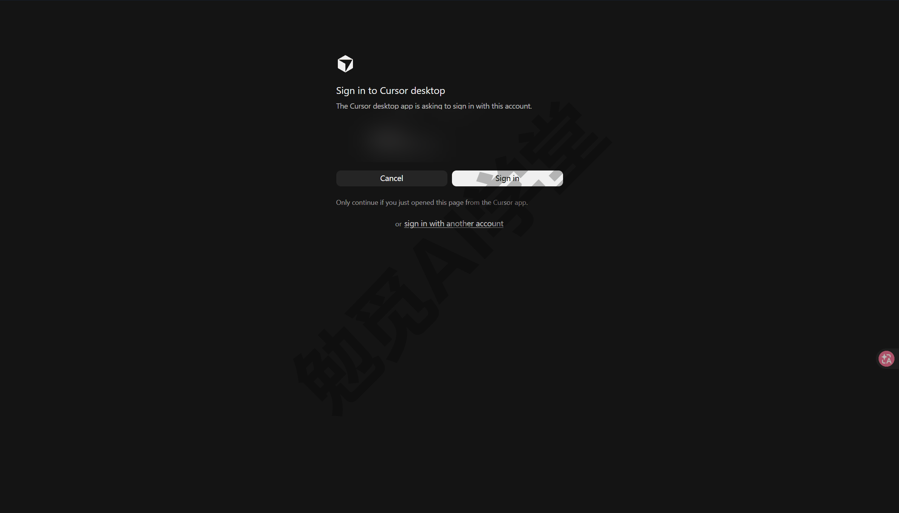

**登录后确认一下。** 打开设置页能看到当前登录的账号和套餐信息（位置以实际界面为准），核对一眼邮箱是不是你刚才用的那个——家里和公司都装了 Cursor 的话，容易登错账号。同一个账号可以在多台设备上登录使用，套餐和用量算同一份；所以不建议和别人共用账号，用量会互相挤占。对话记录是否跨设备同步，以实际表现为准。退出登录和更换账号的入口，一般也在设置的账号分区里（以实际界面为准）；套餐跟着账号走，换到免费账号，付费功能自然就不可用了。

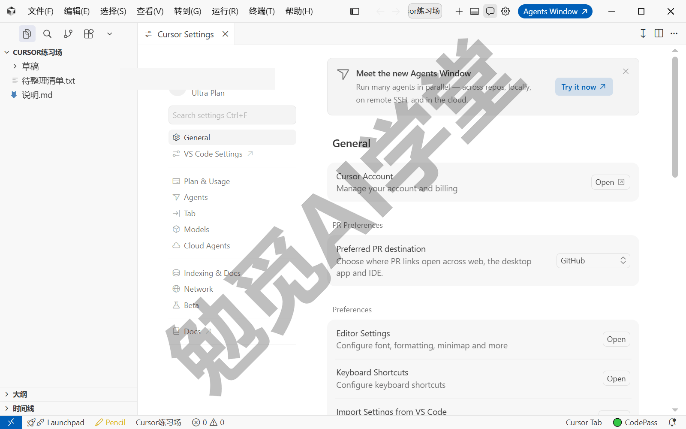

**换电脑、重装系统要不要重新登录。** 要。登录状态保存在本机，每台新电脑（或重装系统后）第一次使用都要登录一次；登上以后通常长期保持，不需要每次开机重新登录（以实际表现为准）。反过来也要记得：在公用电脑上用完，从设置的账号分区退出登录，别把账号留在公用设备上。

**遇到“可疑活动”提示怎么办。** 个别网络环境下，登录或使用时可能出现请求被安全机制拦截的提示，VPN 是最常见的起因。按这个顺序处理，每一步都有各自的道理：先关闭 VPN 重试（VPN 用的网络地址被安全系统标记，是最常见的原因）；再新开一个对话，换一个新的对话环境重试；仍不行就等几分钟，给拦截解除留时间；最后换 Google 或 GitHub 登录，换一种验证方式。反复出现的话，带着提示截图去官方论坛或课程社群反馈。

> 账号注册与网络环境的详细配置本篇不展开，遇到问题按 1.9 的顺序排查。

### 1.7 把界面切成中文

Cursor 默认是英文界面，这几乎是零基础读者遇到的第一道门槛。好在解决办法很成熟：装一个中文语言包。它是 VS Code 通用的官方中文语言包，Cursor 沿用同一套扩展机制，所以直接可用；装它相当于给编辑器界面加一层翻译，只改显示文字、不改任何功能。切不切中文界面不影响使用，但影响学习速度——后面各篇会频繁指路“设置里的某分区、菜单里的某项”，中文界面能让你少翻译一层。流程走一遍大约两分钟。

**第 1 步：打开扩展面板，装上语言包。** 按 Ctrl+Shift+X 打开编辑器的扩展面板——扩展是给编辑器添加能力的小组件，语言包就是其中一种，《编辑器三件套：Tab、内联编辑与扩展》会系统讲它。在面板顶部的搜索框输入 Chinese，结果里会出现好几个语言包，认准 Chinese (Simplified) Language Pack，也就是中文（简体）语言包（发布者一般显示为 MS-CEINTL，以列表实际显示为准），注意别装成 Traditional（繁体）那一个；列表会显示各扩展的安装量，官方语言包通常排在最前面，认发布者最稳妥。点它旁边的 Install（安装），装得很快，装好后按钮会变成管理图标一类的状态（以实际界面为准）。

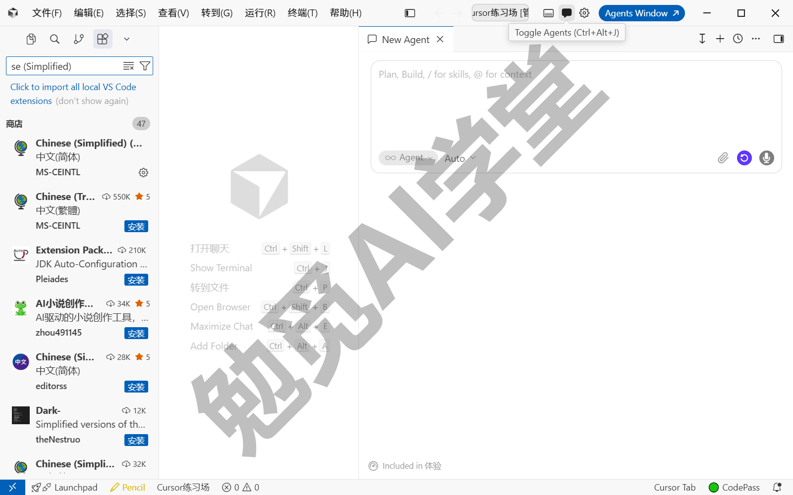

**第 2 步：切换显示语言。** 安装完成后，右下角通常会弹出提示，大意是询问要不要改用中文并重启，点确认即可，应用会自己重启并换好语言。如果没有弹出提示也不要紧，按 Ctrl+Shift+P 打开命令面板，输入并执行：

```
Configure Display Language
```

列表里会出现可用的显示语言，选择中文（简体），应用会要求重启，确认它。弹窗和命令两种方式改的都是同一个语言设置，结果一样。

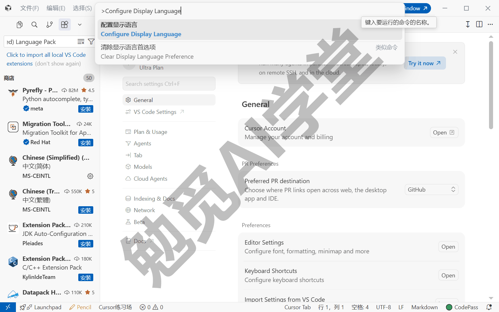

**第 3 步：重启后确认。** 重启完成后抽查三处：菜单栏（出现“文件”“编辑”一类的中文菜单）、设置页、右键菜单，都变成中文就说明生效了。从这里往后，本课提到界面文案，以你界面上显示的中文为准。个别地方仍是英文（比如刚上线的新功能），是官方翻译尚未跟上的正常现象，等语言包更新即可。


**语言包只管编辑器界面，管不到 AI 的回复语言。**

- 语言包主要管的是编辑器界面；代理窗口的菜单、设置等翻译成中文的程度以你看到的为准，个别地方保留英文不影响任何功能，本课涉及界面文案时会尽量中英对照。
- 界面语言和 AI 回复语言是两回事：界面切换成中文后，AI 回复仍可能用英文。让它“始终用简体中文回复”要用规则来做——规则是你写给它的长期要求（1.2 提过），《规则与 AGENTS.md》第一条示范写的就是它，这里先不用管。

**没生效怎么办。** 三个常见原因从上往下排查：装完没重启，重启一次就好；装错了包，回扩展面板确认装的是 Simplified 而不是 Traditional；执行 Configure Display Language 时列表里没有中文，说明语言包没装成功，回第 1 步重装。想换回英文也简单：同一条命令选 English，重启即可——练习任务二会让你来回切一遍。

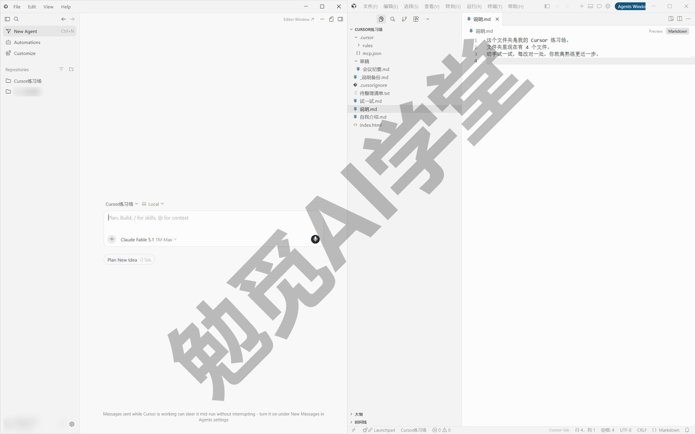

### 1.8 装完就能用的三连任务

现在跑一组“三连任务”：让它解释一个文件夹、做一处小改动并看差异、再用检查点把改动还原。这三步连着做，是本篇的练习主线，做完你会对“它和聊天工具有什么不同”有直接的感受。

**准备一个练习文件夹。** 在桌面新建一个文件夹，命名为“Cursor练习场”，往里放两三个不重要的测试文件，比如几张截图的副本、一份文档的副本。不要一上来就打开整个磁盘或装满重要资料的目录——Cursor 打开哪个文件夹，就在哪个文件夹里干活，这个范围概念叫“工作区”，下一篇《两套界面全导览》会讲透，现在先记住“打开哪个文件夹，它就管哪个文件夹”。

**打开这个文件夹。** 在代理窗口新建智能体时选择这个文件夹；或者在编辑器里用菜单“文件 → 打开文件夹”（中文语言包生效后的菜单名，以实际界面为准）选中它。

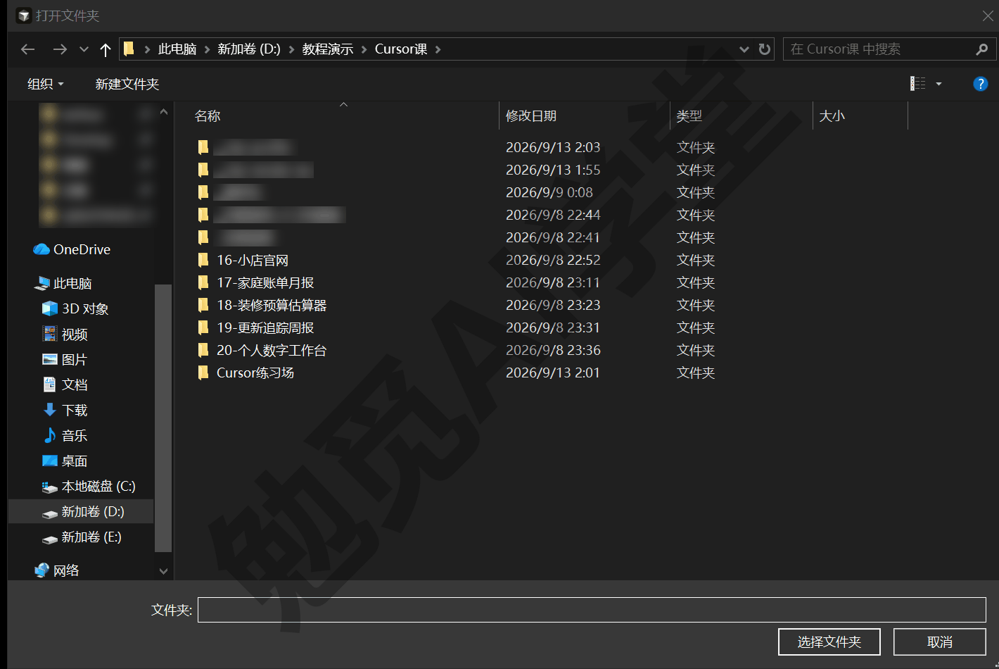

**第 1 步：让它解释这个文件夹。** 在输入框发送：

```
看一下这个文件夹里都有什么，用一句话概括每个文件是干什么的，
最后告诉我：如果要整理这个文件夹，你建议从哪里入手。
```

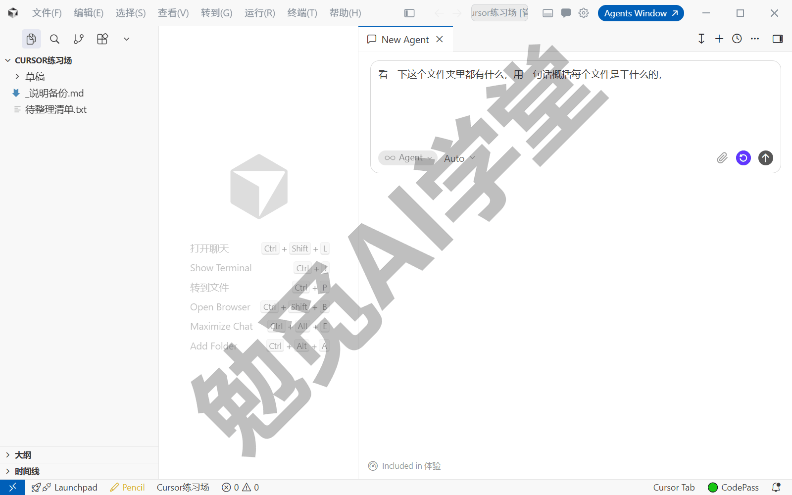

发送后注意看对话区：它会先列出读取目录、读取文件的过程，然后给出每个文件的说明和整理建议。普通聊天工具只能根据你的描述给建议，它是真的把文件读了。

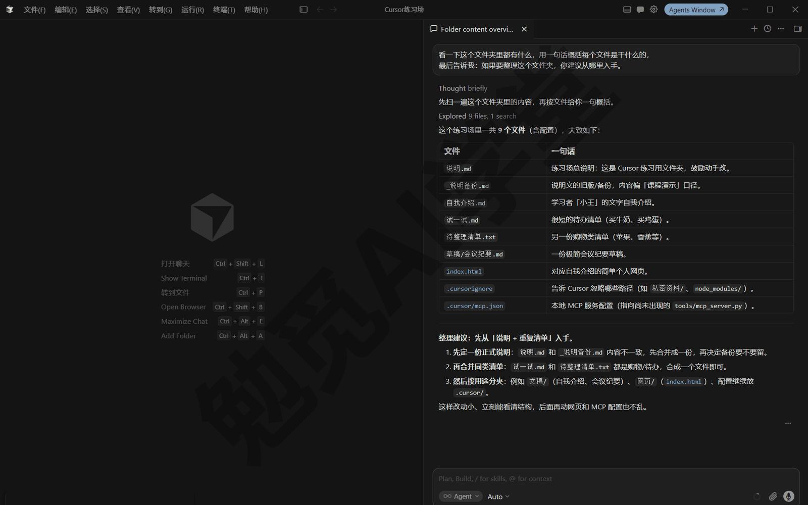

过程中还可能出现两种情况。它有时会反问你一句（比如问某个文件要不要展开细讲），直接在输入框回答就行，等待回答期间它通常会继续读文件，不会干等。另外，这组任务都发生在文件夹之内，一般不会弹出审批请求；万一弹出，先看清它想做什么再决定允许——审批机制在《权限、沙盒与模型》专门讲。

**第 2 步：做一处小改动，看差异。** 先让它新建一个文件：

```
在这个文件夹里新建一个名叫“说明.md”的文件，写三行内容：
第一行介绍这个文件夹是我的 Cursor 练习场；
第二行列出文件夹里现在有几个文件；
第三行写一句鼓励初学者的话。
```

完成后，界面会显示这次改动的差异：新增的内容通常用绿色标出来。到资源管理器里看一眼，“说明.md”真实出现在了文件夹里。

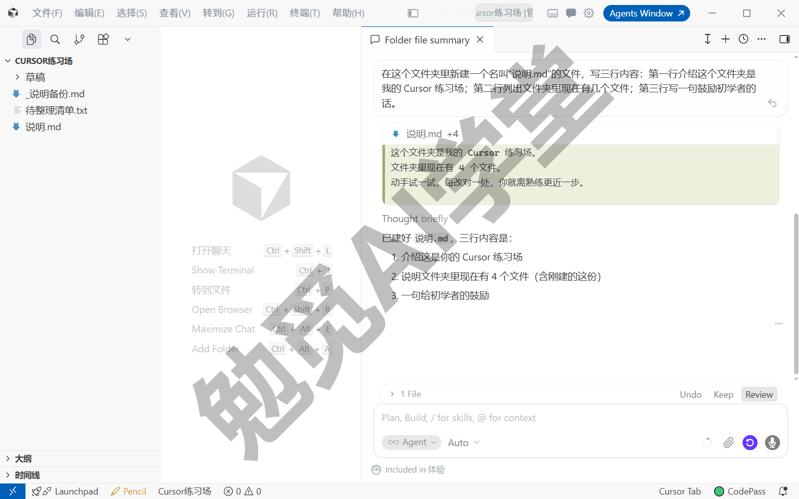

再让它改一处：

```
把“说明.md”第三行那句话改得更正式一些，其他内容不要动。
```

这次差异视图会同时出现红色和绿色：红色是删掉的旧句子，绿色是新句子。红删绿增，这个读法后面每天都用。

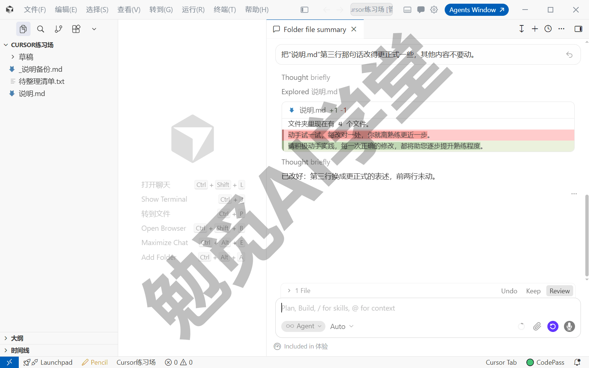

**第 3 步：用检查点还原。** Cursor 在改动前会自动保存快照，这个机制叫检查点，相当于每次改动前给文件拍了照。假设你更喜欢改动前的那句话，把鼠标悬停到上一条消息附近，找到还原入口（悬停消息时出现的还原按钮，中文文案以实际界面为准），确认还原。

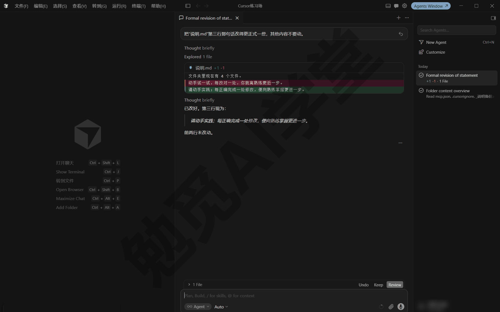

还原后再看“说明.md”：第三行回到了修改前的句子。有两个要点：

- 检查点只还原文件，不删除对话记录，你随时能看到刚才做过什么。
- 检查点是临时后悔药，适合撤销智能体的改动；长期的版本管理靠 Git，这个分工在《权限、沙盒与模型》和《Git、GitHub 与代码审查》分别展开。

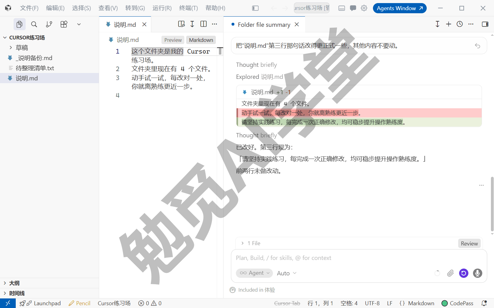

三连做完，对比就清楚了：聊天工具给答案，Cursor 读了你的文件、改了内容、还能一键退回。剩下要学的，是怎么让它做得又快又稳——这正是后面各篇的内容。

### 1.9 打不开、登不上怎么排查

遇到问题按下面的顺序从上往下查，一环解决就停，不用全部做完；三类症状按常见程度排列，多数问题停在前两环。这一节现在可以粗读，出问题时回来对着做。

**症状一：应用打不开，或启动后一片空白。** 先做最简单的一件事：完全退出再启动。注意完全退出不是点窗口右上角的关闭按钮（那样后台进程可能还在），而是在任务栏托盘图标上右键选择退出，等几秒再重新打开，多数莫名其妙的启动问题到这里就好了。仍然白屏的话，右键 Cursor 图标选择“以管理员身份运行”再试一次。能进界面但显示混乱、像是残留着上次的错误状态时，按 Ctrl+Shift+P 打开命令面板执行 Clear Editor History，清掉缓存的界面状态，应用会回到干净的初始布局。

**症状二：登录不上，或 AI 功能一直转圈。** 先让官方诊断告诉你问题出在哪一段：打开设置，进入网络分区，点“运行诊断”（英文界面为 Cursor Settings → Network → Run Diagnostics，中文文案以实际界面为准）。它会依次测试到 Cursor 各项服务的连接，并给出每一项的结果，看结果就能分清是本机网络、网络代理还是 Cursor 服务器那边的问题。

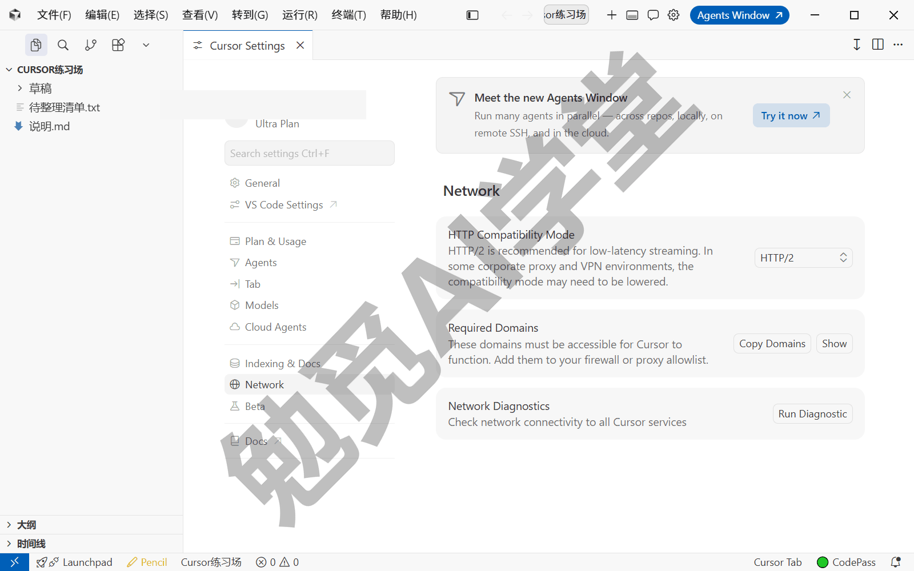

公司网络的问题最常见。Cursor 的 AI 回复使用 HTTP/2（一种较新的网页传输方式）传输，部分企业代理会拦掉这种流量，典型表现是能登录、但 AI 回复迟迟不出。处理办法按力度递进：先在网络分区把“HTTP 兼容模式”切换为 HTTP/1.1，重启 Cursor 再试；仍不通，把同一分区的“代理支持”改为 on 或 fallback（选项中文文案以实际界面为准）；还不行，多半是防火墙直接封了域名，请网络管理员放行 `*.cursor.sh`、`*.cursor-cdn.com`、`*.cursorapi.com` 等域名，完整清单见官方帮助中心的网络配置页。

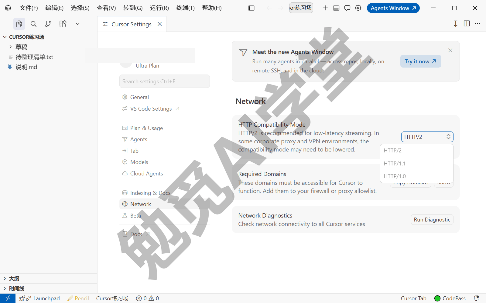

家用网络里最常见的原因是 VPN。断开 VPN 之后仍然报网络或 DNS（域名解析）错误，多半是应用还带着 VPN 残留的网络设置，完全退出 Cursor 再启动就能清掉；登录或对话时出现“可疑活动”提示，按 1.6 的顺序处理（关 VPN、新开对话、等几分钟、换登录方式）。另有一种情况根本不是网络问题：诊断全部通过、回复却提示用量受限，说明包含用量见底了，去 1.4 讲过的用量页确认，再决定等重置、开按需付费还是升级。

**症状三：怀疑版本太旧或更新失败。** 界面和教程对不上、别人有的功能你没有，先手动更新一次：按 Ctrl+Shift+P 打开命令面板执行 Cursor: Attempt Update，有新版本时会下载并提示重启，重启后用 1.1 的“关于”入口核对版本号变了没有。更新渠道也会影响你拿到的版本：设置里可以在 Stable（稳定版，默认）和 Early Access（尝鲜版，功能新但可能不稳）之间切换，零基础读者建议留在 Stable；在尝鲜版上遇到怪问题，切回稳定版观察也是常用做法。

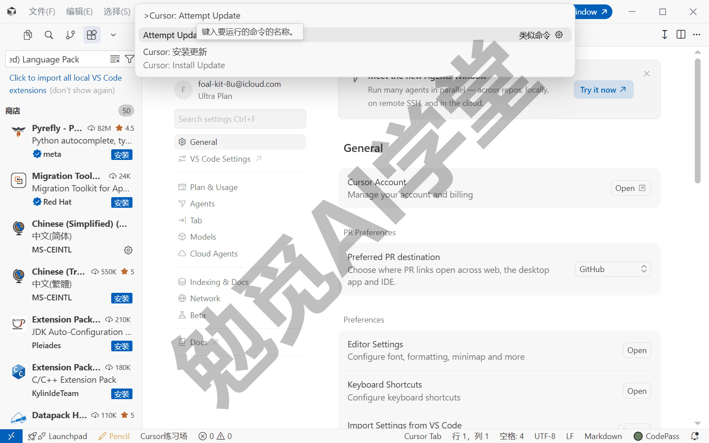

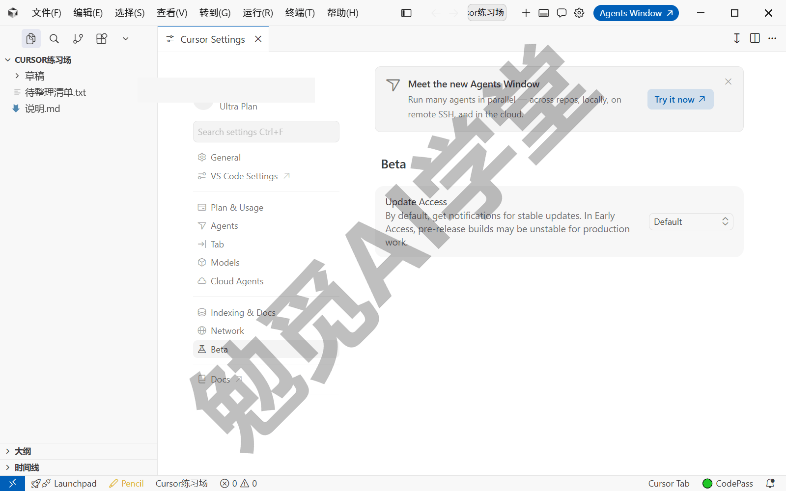

**都不行的兜底。** 从官网重新下载安装包覆盖安装（账号与配置一般会保留，以实际表现为准）；仍然卡住就带着报错截图去官方论坛或课程社群提问，报错原文和截图比“装不上”三个字有用得多。

### 1.10 三个练习任务

下面三个任务把本篇内容各练一遍。提示词可以直接复制发送。

**任务一：把三连任务在新文件夹里重走一遍**

再新建一个练习文件夹，放几个测试文件，打开后先让它解释文件夹，然后发送：

```
在这个文件夹里新建一个名叫“清单.md”的文件，
把每个文件的名字和类型整理成一张清单写进去，
最后加一行：这是我用 Cursor 完成的第一个练习。
```

完成标准：在差异视图里看到了绿色新增内容；用检查点成功还原了这次改动；能说出“检查点只还原文件、不删对话”。

**任务二：把界面切成英文再切回中文**

在编辑器按 Ctrl+Shift+P 打开命令面板，执行：

```
Configure Display Language
```

先切到 English 并重启，再用同样的方法切回中文（简体）。完成标准：两个方向都切换成功；知道这个设置只管界面语言，不管 AI 回复语言；知道代理窗口可能有部分界面仍是英文，属于正常现象。

**任务三：找到自己的套餐与用量页**

在浏览器打开：

```
cursor.com/dashboard
```

登录后浏览页面。完成标准：能说出自己当前的套餐名；找到了显示用量的页面；记住额度、价格一律以账号页面显示为准。

### 1.98 本篇小结与自检

这一篇认识了 Cursor 的定位（能替你操作电脑的智能体应用）、四个入口的场景分工和套餐机制，完成了安装、登录、切换中文界面，并用三连任务体验了“解释、改动、还原”一个完整来回。

可以对照下面的清单检查学习结果：

- [ ] 已经从官网装好 Cursor 并登录成功
- [ ] 界面已切成中文，并且知道代理窗口可能有部分界面仍是英文，属于正常现象
- [ ] 能说出四个入口（桌面、网页、手机、CLI）各自适合的场景
- [ ] 能讲清免费与付费套餐在机制上的差别，知道额度以账号页面为准
- [ ] 三连任务完整做过至少一遍，用检查点还原过一次改动
- [ ] 遇到打不开、登不上的问题，知道先完全退出重启、再跑网络诊断

完成这些内容后，你的 Cursor 已经处于可用状态。下一篇《两套界面全导览》会把代理窗口和编辑器的每个区域、每个按钮过一遍，让你在任何画面里都知道自己在哪、下一步去哪点。

### 1.99 新手常见问题

**Q1：要花钱吗？免费版够不够用？**

装应用和注册账号免费。免费的 Hobby 套餐能用智能体对话和 Tab 补全，但用量有限；学习本课前几篇完全够。云端智能体、自动化、Bugbot 这类云端能力需要付费套餐。具体额度和价格变化快，一律以官网和账号页面为准。

**Q2：完全不会编程，能学会吗？**

能。本课按零基础设计，遇到术语当场解释。你不需要看懂它写的代码，需要学会的是三件事：把需求说清楚、给它合适的权限边界、对结果做验收——这三件事贯穿全课。

**Q3：Cursor 和 VS Code 是什么关系？**

Cursor 是在 VS Code 基础上深度改造的独立应用，不是插件。两者可以同时装在一台电脑上，同一个文件夹可以分别用两边打开。用过 VS Code 的话，设置、扩展、快捷键可以一键导入（第一次启动时的引导页或设置里都有入口）。

**Q4：和 Codex、Claude Code 这类工具怎么选？**

它们都是“能替你干活的智能体”，核心概念（工作区、权限、检查点）大多相通。建议手里在用哪个就先学哪个，不必都装。Cursor 的特点是桌面端有两套界面，云端功能也比较完整；详细的分工建议放在《毕业项目：个人数字工作台 + 课程总结》。

**Q5：装了中文语言包，代理窗口还是英文的，正常吗？**

正常。语言包主要覆盖编辑器界面，代理窗口可能有部分界面仍是英文，范围随版本继续变化。英文界面不影响任何功能，本课讲到相关界面时会给中英对照，照着位置找即可。
