## 两套界面全导览

上一篇《认识与装好》已经装好应用、登录、切换到了中文界面，还完成了“解释文件夹、小改动看差异、检查点还原”的三连任务。这一篇暂时不学新功能，专心把桌面应用的两套界面逐个区域认全：每个按钮在哪、是干什么的、什么时候会用到。

不需要现在就记住所有位置。先建立整体印象，后面每一篇都会反复回到这些界面，用着用着就熟了。本篇截图都来自 Windows 桌面端 Cursor 3.x，界面细节以你的版本为准。

### 2.1 两套界面是什么关系

在网上搜 Cursor 教程，你会看到两种看起来完全不一样的界面，新手常常怀疑自己装错了软件。先把这件事说透，后面所有内容都建立在它上面。

**两套界面，一个应用。** Cursor 桌面应用里有两套界面：

- **代理窗口**（Agents Window）：围绕智能体从头设计的界面。它的用法是“你指挥、它干活”：同时管理多个智能体、跨多个工作区干活、把任务在本机和云端之间移交、用整合的差异视图审查改动，都在这里完成。
- **编辑器**：经典的开发环境界面（外观接近 VS Code）。它的特点是“你直接面对文件”：看很多文件、分屏对照、装扩展、改主题，这些事在编辑器里做最方便。

你可以把两套界面理解成同一间工作室里的两张桌子：代理窗口这张桌子对着智能体，编辑器那张桌子对着文件本身。要做的事是同一批，站在哪张桌子前取决于你此刻要做什么。

**怎么切换。** 两套界面随时互相切换，用命令面板就行：

- 在编辑器里，按 Ctrl+Shift+P 打开命令面板，输入 Agents Window，执行列出来的 View: Switch to Agents Window（中文界面显示为“查看: Switch to Agents Window”），代理窗口就会打开。编辑器右上角也有一个蓝色的 Agents Window 按钮，点它效果相同。
- 在代理窗口里，同样按 Ctrl+Shift+P 打开命令面板（这里的面板叫 Actions），输入并执行 Open Editor Window，当前工作区会在编辑器里打开。这条命令自带快捷键 Ctrl+Shift+N；代理窗口右上角还有一个 Editor Window 按钮，点它效果相同。

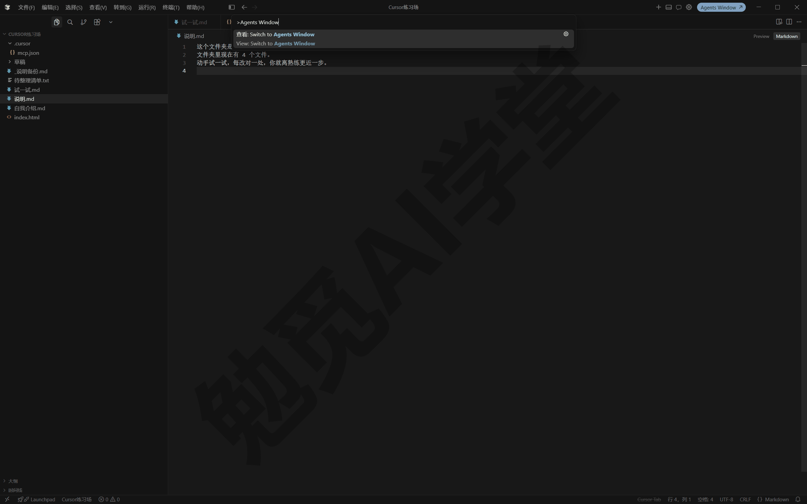

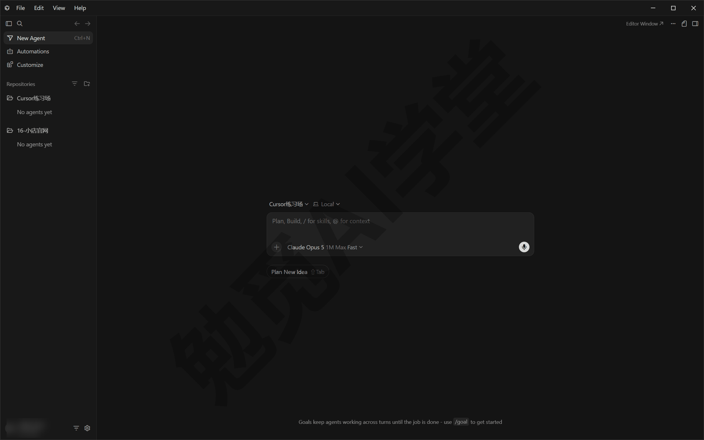

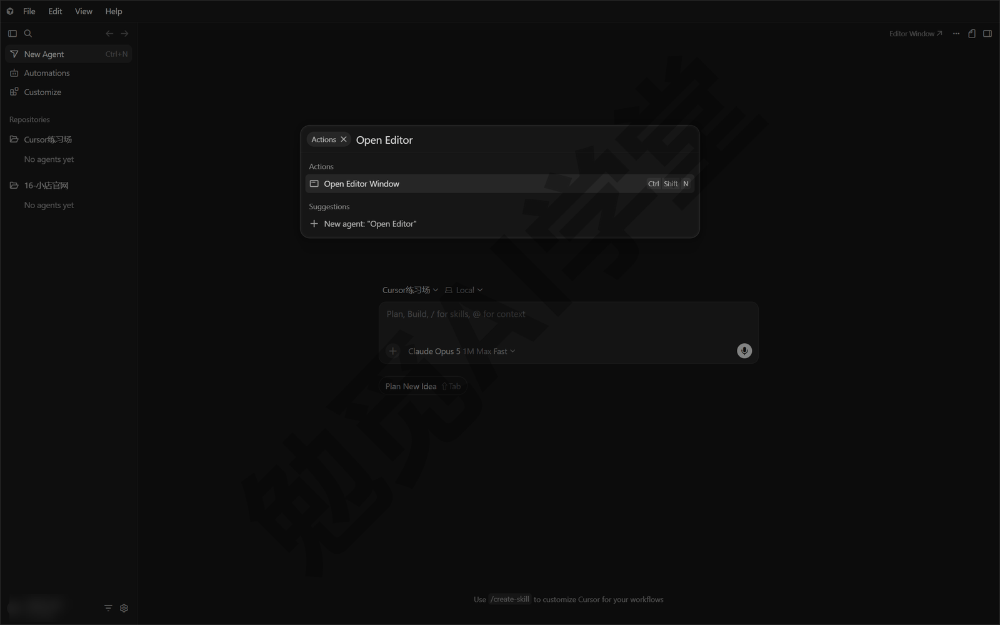

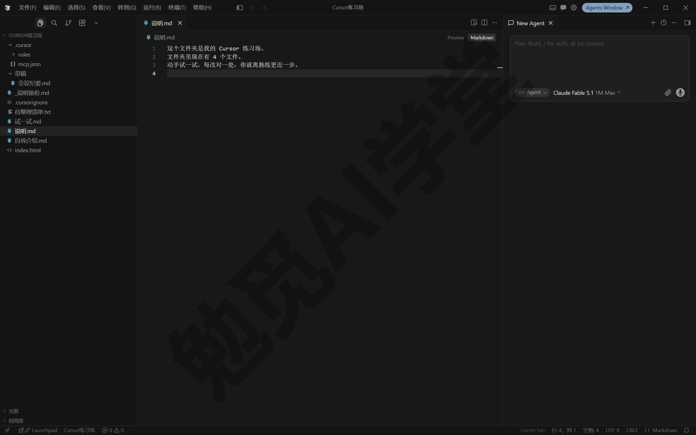

**可以同时开着。** 两套界面不是二选一，可以同时打开：左边代理窗口看智能体干活，右边编辑器看文件细节。它们背后是同一个应用、同一个账号，对话记录和设置完全相通，不存在“数据在哪套界面里”的问题。

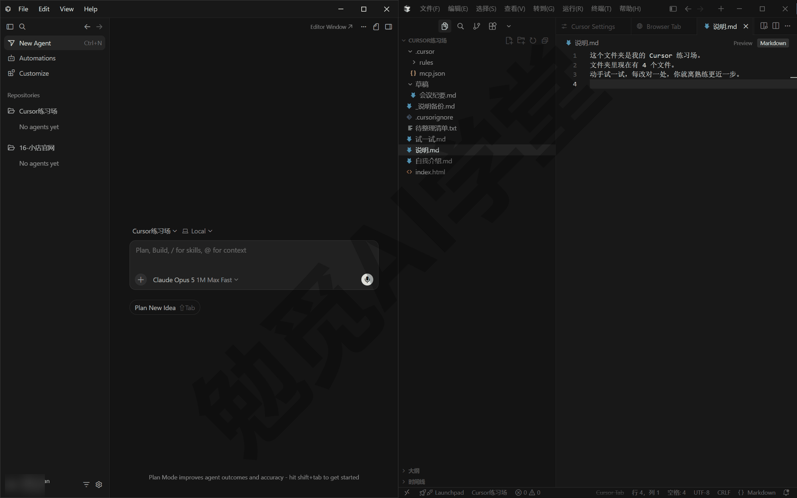

**默认打开哪个。** 安装后首次启动进入哪套界面，以你看到的为准；无论进了哪套，用上面两条命令都能到达另一套。

**什么时候用哪套，给一个简单判断。** 让它做东西、看它做得对不对，待在代理窗口；要自己动手看文件、逐字修改、装扩展、改外观，切到编辑器。举两个例子：让它把网页配色调暖一点，从下指令到看结果全程在代理窗口就够；想把两版文案并排逐行对照挑措辞，编辑器的分屏更合适。拿不准就先待在代理窗口，需要时一条命令切过去，选错了也没有任何成本。

**本课的主线。** 本课以代理窗口为主线——对不写代码的人来说，“指挥智能体”比“面对文件”更贴近日常用法，而且设计模式、工作树、远程控制等新能力也集中在代理窗口。需要装扩展、切主题、细看文件时，再切到编辑器。习惯 VS Code 的读者也可以反过来：编辑器照旧当主力，把代理窗口当成新增的智能体总控台——两种用法不冲突，跟着本课学时能对上截图就行。另外，如果你搜到的旧教程还在讲“Composer 面板”“Ctrl+Shift+A”，那是 Cursor 3 之前的旧说法，跟着点不到是正常的，以本课和你的界面为准。

### 2.2 代理窗口侧栏

打开代理窗口，左侧一栏就是智能体的“调度中心”。这一节把侧栏从上到下过一遍。

**智能体列表。** 侧栏主体是一列智能体，每一行代表一个智能体，也就是一个任务对话。不管是在本机跑的、在云端跑的，还是你在手机上发起的，都会汇总到这个列表里，各自显示名称、所在工作区和运行状态（展示样式以实际界面为准）。想回看或接着指挥哪个任务，点对应那一行就进去了。

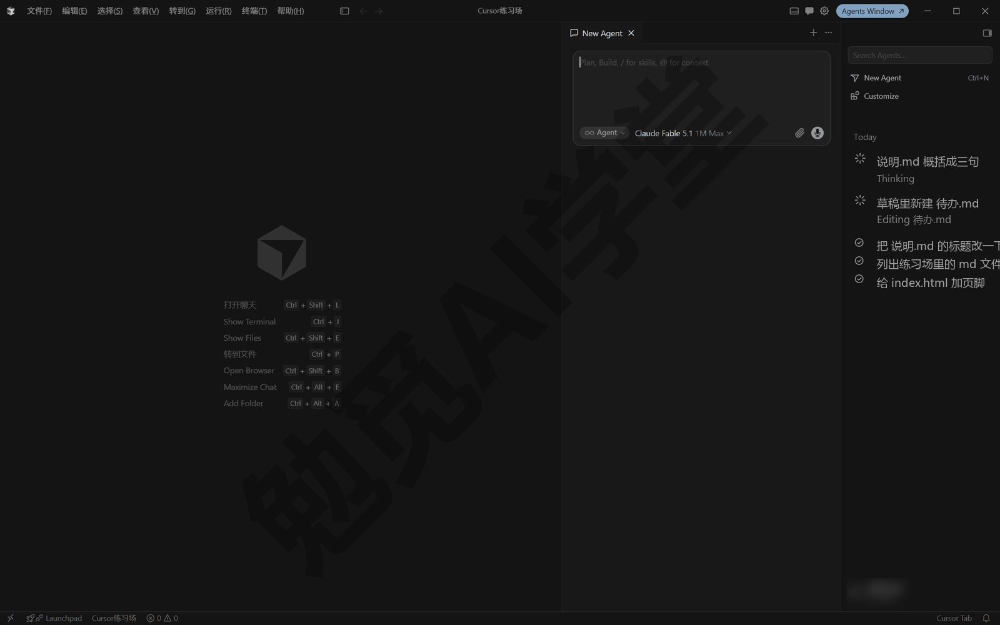

**新建智能体。** 侧栏里有新建入口（按钮样式以实际界面为准）。新建时要做两个选择：在哪个工作区干活（也就是选文件夹，2.6 里会细讲），以及在什么运行环境里跑。建好之后通常直接进入一个空白对话，光标落在输入框，开口说话就能开工。一个工作区可以同时开多个智能体，各干各的、在列表里各占一行——比如一个正在整理文件，你另开一个问问题，互不耽误。

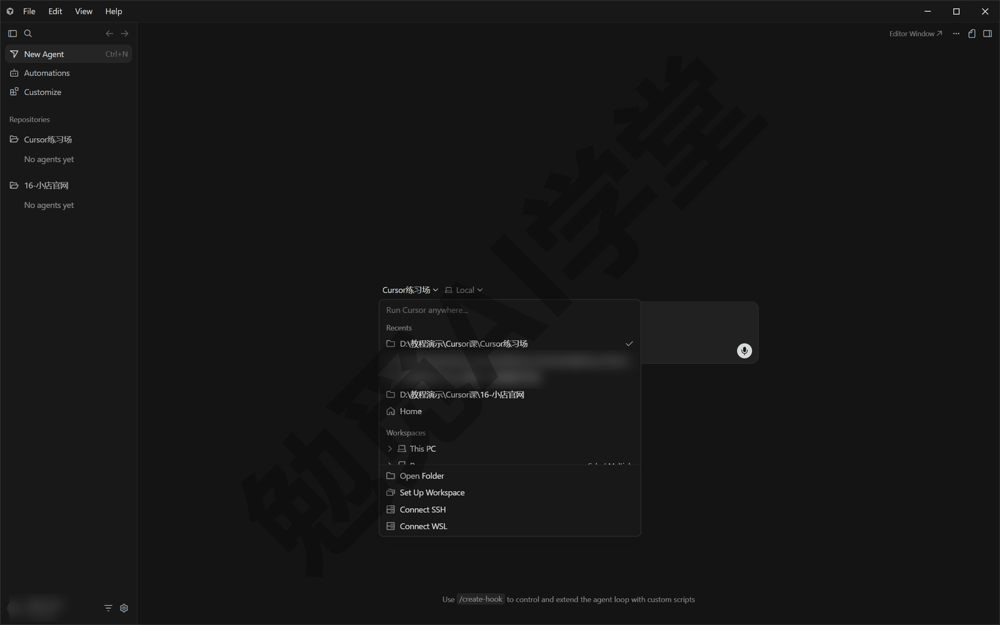

**运行环境下拉。** 新建或运行智能体时，可以在一个下拉里选它跑在哪里。以 3.7.42 版为例，打开后里面只有两项（你的版本可能更多，见下文）：

- **This PC（本机）**：默认选项，就在你这台电脑、你选的工作区文件夹里干活，前面打着勾的就是它。本课前半段一直用它。
- **New Worktree（新建工作树）**：给这个任务开一个隔离副本再干活。工作树是同一个工作区的另一份文件副本，任务在副本里改，不打扰你正在看的主线版本，适合并行试方案。《子智能体、并行与工作树》细讲。

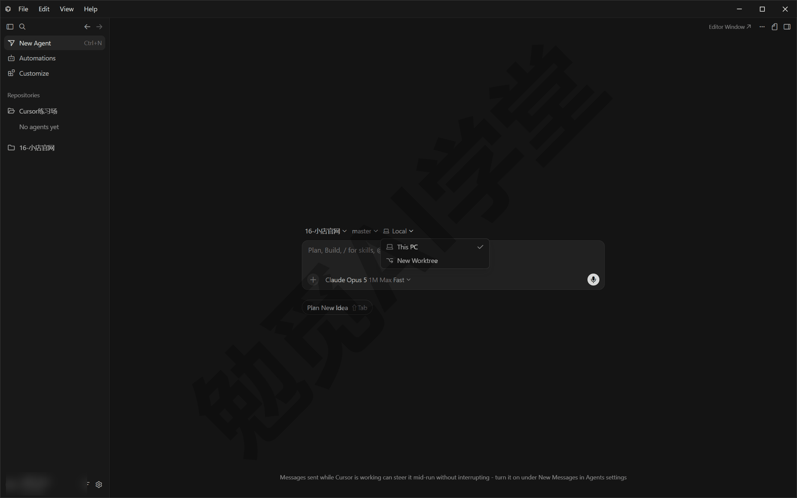

**你的下拉里可能不止两项。** 这个列表随账号套餐、项目有没有连上代码托管服务而变，在 3.7.42 版上，即使工作区已经接入 Git、选好了分支，列出来的也还是这两项。官方文档里另外提到几类：云端（任务放到 Cursor 的云端机器上跑，关电脑也继续，需要付费套餐并连接代码托管）、面向团队版的共享运行资源、远程控制（把本机的智能体接到云端、改成用手机来指挥，要先在设置里开启对应开关）。云端与远程控制到《云端智能体与手机端》才第一次动手，那一篇的界面同样以你自己看到的为准。现在记一个粗略的分法就够了——要动你电脑上文件的任务留在本地，长时间、不依赖本机文件的任务适合云端，具体的判断标准到那一篇再展开。

**管理智能体。** 在列表条目上可以做整理操作：置顶常用的、重命名说不清的、归档做完的、删除不要了的。入口在条目的右键菜单里；以 3.7.42 版为例，菜单项是 Pin（置顶）、Rename（重命名）、Delete（删除），归档叫 Archive Prior Chats，作用是把这条之前的旧对话一次收起，没有只归档这一条的选项，以你的菜单为准。归档和删除的区别值得记住：归档只是收起来、以后还能找回（找回入口在列表的筛选或已归档视图里，以实际界面为准），删除就没了；拿不准就归档。重命名时建议直接写任务内容，比如“整理照片文件夹”，比自动起的名字好认得多。保持侧栏清爽有个简单办法：做完一个归档一个，列表里只留正在做的任务。

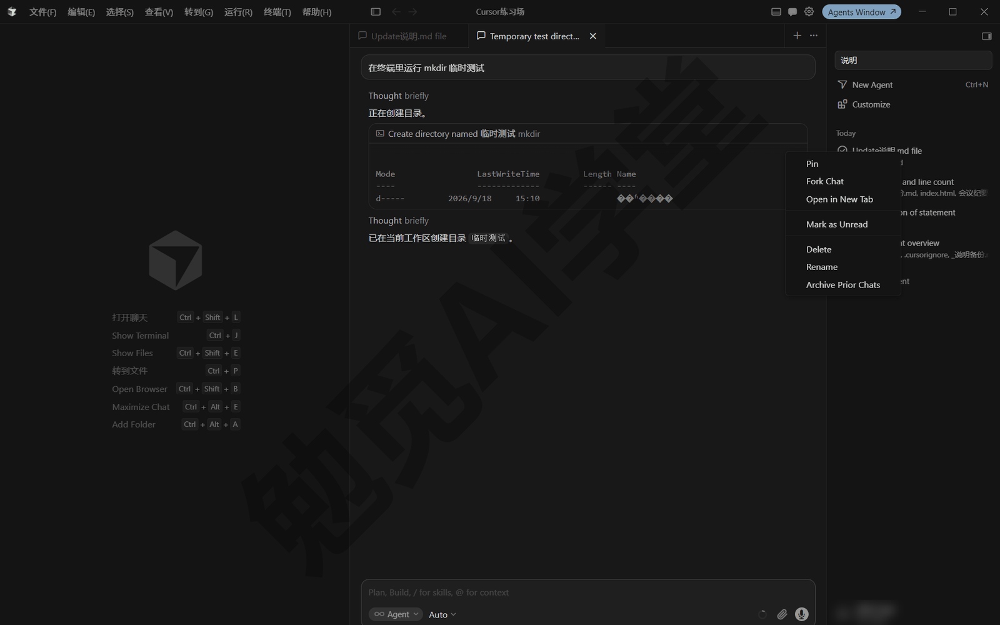

### 2.3 输入框逐项认识

输入框是你和智能体打交道最多的地方，四周围着一圈按钮和选项。这一节逐个认识，每一个都记住“它是干什么的、什么时候用”即可，深入的用法后面各有一篇专门讲。

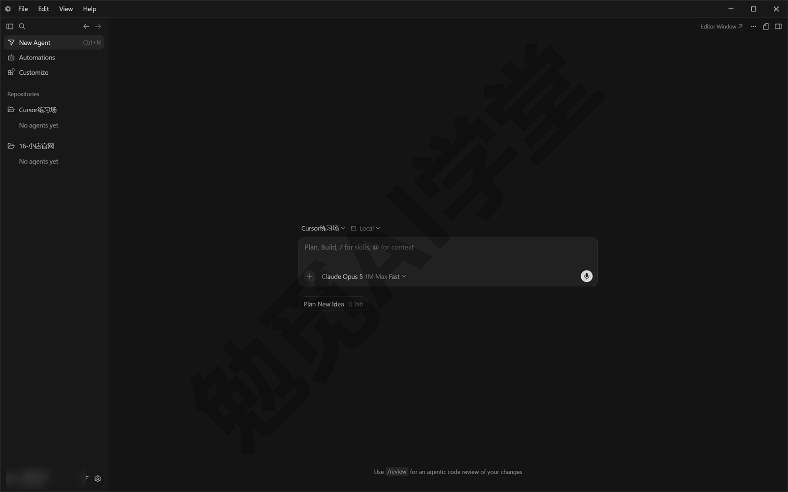

**模式选择器。** 模式选择器决定智能体用什么方式干活。以 3.7.42 版为例，菜单里共五项：四个模式加一个 Multitask（多任务），名称以实际菜单为准。四个模式是 Agent（智能体，默认，正常干活模式）、Ask（提问，只读不改，适合先弄明白再动手）、Plan（计划，先出方案等你确认再动工）、Debug（调试，按证据一步步修问题）。不选就是 Agent，本课前几篇一直用它，四个模式各管什么、什么时候切换，放在《计划、提问与调试三模式》。第五项 Multitask（多任务模式），排在 Debug 和 Ask 之间，选中后输入框上的模式标签就从 Agent 变成 Multitask。它能把几件独立的事同时分派出去，先认识样子，《子智能体、并行与工作树》细讲。

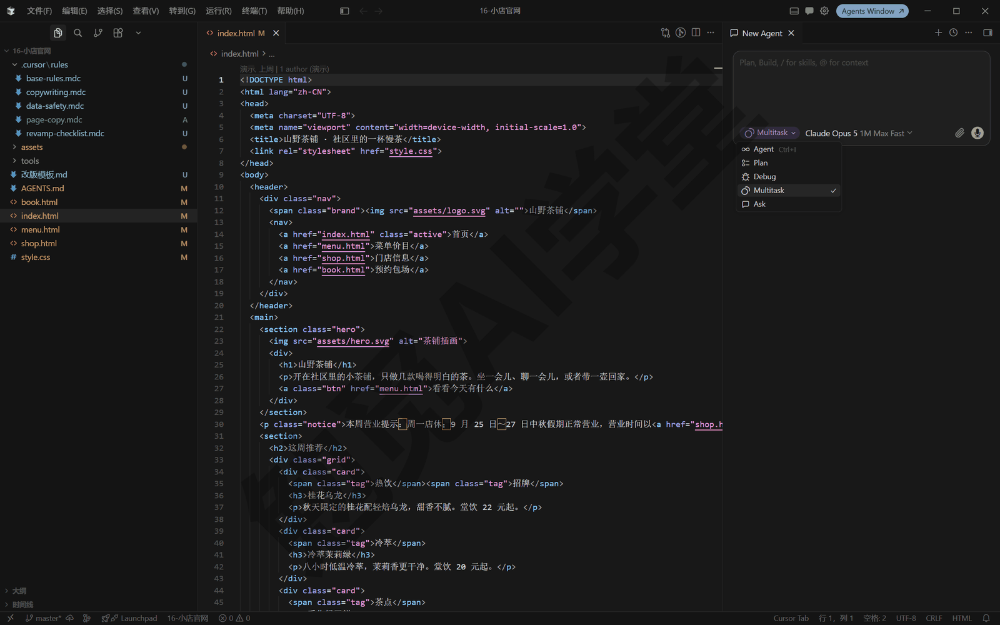

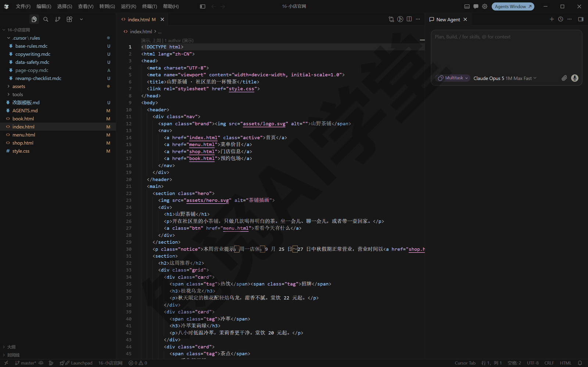

**模型选择器。** 在输入框上方的下拉里选这条对话用什么模型。默认是 Auto（让 Cursor 替你挑），也可以指定具体模型；按 Ctrl+/ 可以在模型之间轮换。默认模型可以在设置的模型分区里改。哪类任务配哪类模型、怎么用得省，放在《权限、沙盒与模型》，现在保持 Auto 就好。

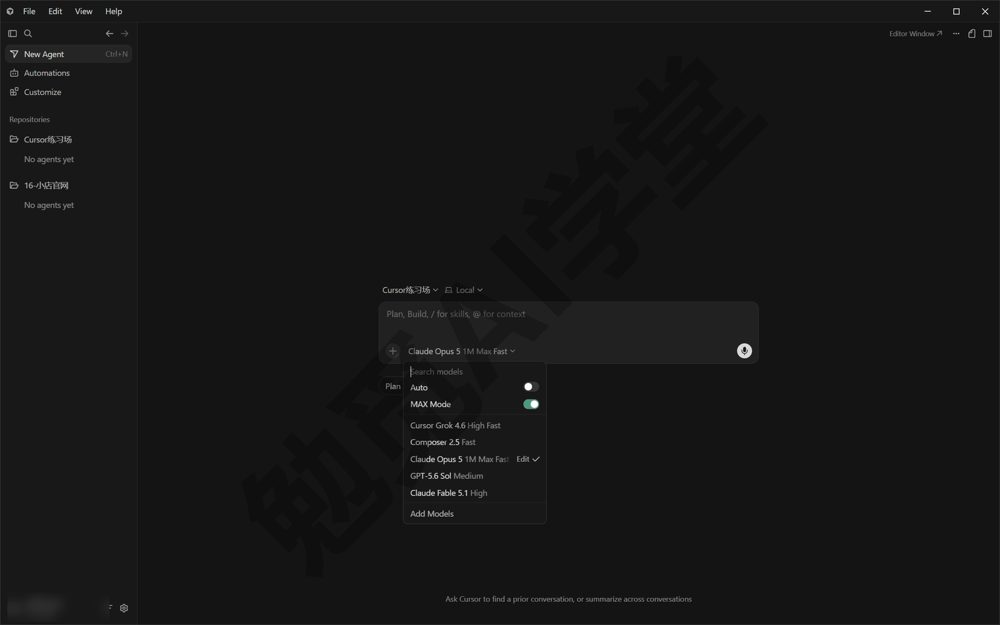

上面两个选择器决定的是谁来干、用什么方式干。接下来几个入口管另一件事：把材料和要求准确地送进对话。

**@ 上下文。** 在输入框里敲 @，会弹出一个菜单，让你把具体材料交给它。最常用的是文件与文件夹：@ 后直接输名字选中，选中文件夹后再输 / 还能往里层继续选。除此之外还有几类来源：@Terminals 把终端里的输出带进对话，报错时特别有用；@Chats 引用以前某个对话的内容；@Commit 和 @Branch 把 Git 记录的改动带进去（没接触过 Git 可以先跳过，《Git、GitHub 与代码审查》会讲）；@Browser 把内置浏览器当前页面的状态带进去。使用原则用一句话说：明确知道哪个文件相关就 @ 它，不确定就别 @，让它自己搜——它有自己的搜索能力。完整用法在《对话与上下文管理》。

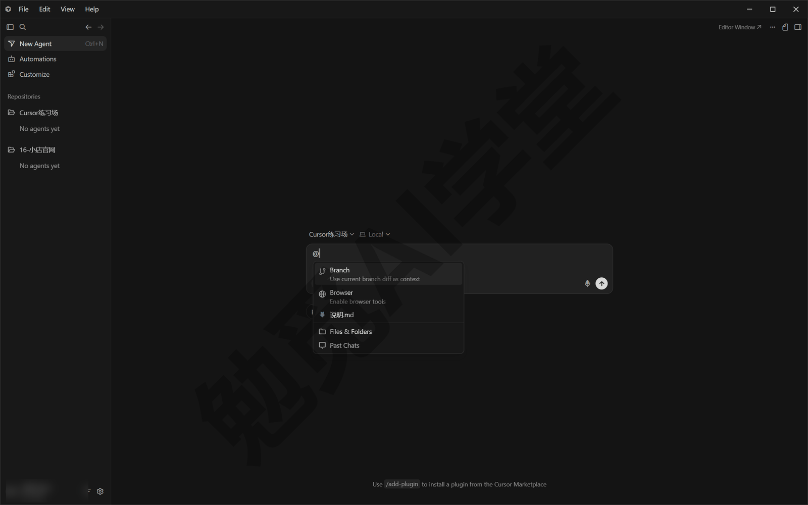

**/ 技能菜单。** 敲 / 会弹出技能列表。技能在《认识与装好》里提过：教它一套做法的说明书。选中一个技能按回车，这条消息就带着这套做法发出去；如果想让它整段对话都按这套做法干，选中后按 Alt+Enter，把技能设成“自定义模式”，它就会在整段对话里一直生效。内置有哪些技能、怎么自己做一个，放在《技能与自定义模式》。

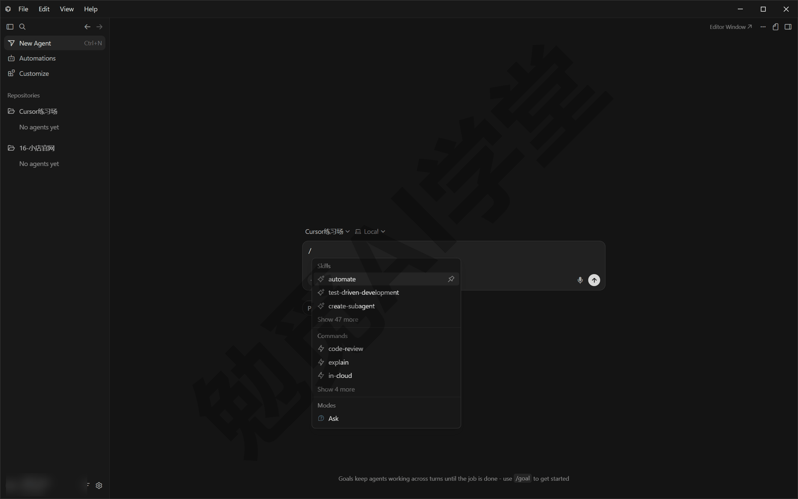

**附件与图片。** 把文件拖进输入框，或者截图后按 Ctrl+V 直接粘贴，都能作为附件发给它。最常用的有两个场景：把报错截图发回去让它自己看，以及发一张设计参考图让它照着做。界面上如果还有附件按钮，以你看到的为准。

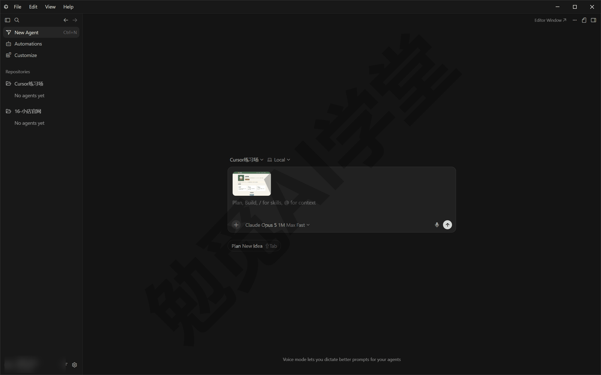

**麦克风。** 点输入框里的麦克风图标可以口述需求，说完会出现转成的文字，检查一遍没问题再发送。手边不方便打字、或需求太长不想打字时，用它可以少打很多字。麦克风打开时输入框会显示正在录音的提示，转出来的文字直接落在输入框里，可以像普通文字一样修改（提示样式以实际界面为准）。

**发送与队列。** 没有任务在跑时，Enter 就是发送。智能体干活的过程中你还想说话，有三种发送方式：

- **排队**：直接按 Enter，消息排进队列，等它做完手头的事再按顺序处理；队列里的消息可以拖动调整先后。
- **立即发送**：按 Ctrl+Enter，消息不排队、马上插进当前任务。
- **不打断地引导**：界面上如果出现 Send now 一类的选项，消息会在它下一次调用工具的间隙送到，既改变方向又不打断手上的动作。这个能力在逐步开放中，以实际表现为准。

现在记住最常用的一条就行：它干活途中你想补充要求，按 Enter 排队最稳妥。细节在《对话与上下文管理》。


**上下文用量环。** 输入框旁边有个小圆环，显示这条对话的“记忆窗口”用了多少。每条对话能装的内容有上限，文件、工具结果、你们的往来消息都占空间；快满时 Cursor 会自动把早期内容压缩成摘要。点圆环可以展开明细，按类别列出占用：系统提示、工具、规则、技能、MCP、子智能体、摘要后的对话、当前对话。这里出现了两个新词，先各记一句话：MCP 是让智能体连接外部工具和数据的标准方式（《插件、市场与 MCP》细讲）；子智能体是主智能体临时派出去独立干一件事的助手（《子智能体、并行与工作树》细讲）。圆环怎么读、满了怎么办，放在《对话与上下文管理》。

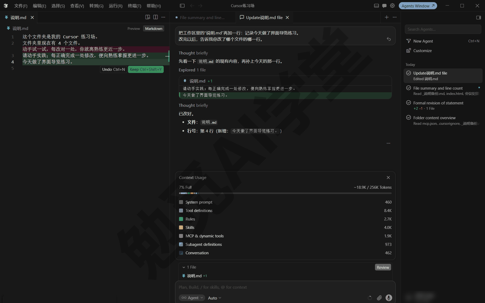

### 2.4 看它怎么干活

这一节动手跑一个小任务，专门练“看懂它的工作过程”。继续用《认识与装好》里建的“Cursor练习场”工作区；如果你没跟着做过，先让它新建一个“说明.md”文件再继续。发送：

```
把工作区里的“说明.md”再加一行：记录今天做了界面导览练习。
改完以后，告诉我你改了哪个文件的哪一行。
```

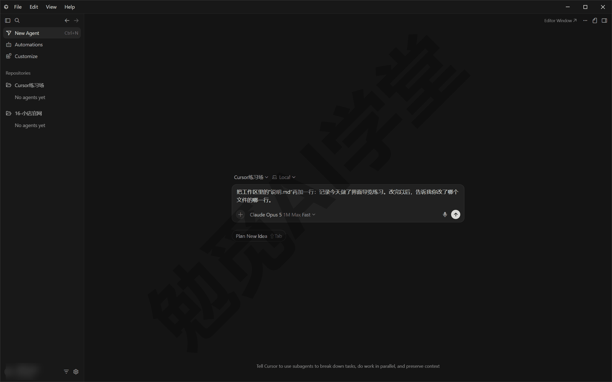

**工具卡片。** 发送后，对话流里会一张接一张出现它的动作记录：读了哪个文件、搜了什么、改了哪里、跑了什么命令，每个动作一张卡片，多数能点开看详情（展开方式以实际界面为准）。常见的卡片就几类，见几次就熟：读取类显示它看了哪个文件；搜索类显示搜了什么词、找到了哪几处；编辑类给出改动的文件，点开能看具体内容；命令类显示它执行的命令和输出。读卡片的方法很简单：先看它“做了什么”，再看“结果是什么”。对这次的小任务，你大概会看到“读取说明.md”和“编辑说明.md”前后两张卡片，动作不多，正适合用来熟悉卡片的读法。刚开始建议保留完整过程慢慢看，熟了以后一眼就能看出它在哪一步。

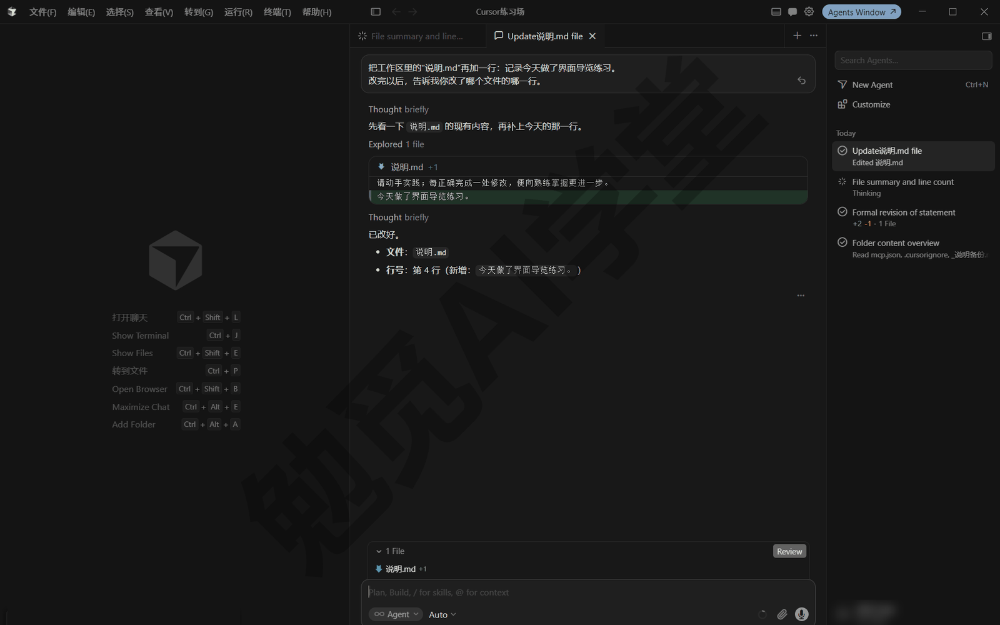

**差异视图。** 改动完成后，可以打开差异视图逐文件审查：红色是删掉的、绿色是新加的，这个读法在《认识与装好》的三连任务里用过。代理窗口的差异视图支持逐个文件确认，对没问题的接受、有问题的拒绝（按钮文案以实际界面为准）。这次改动只是加一行，新增的就是最下面那条绿色；如果《认识与装好》里那次修改还没点过确认，它的一红一绿也会一起列在这里，读法不变。养成“先看差异、再接受改动”的习惯，后面才不容易出事。

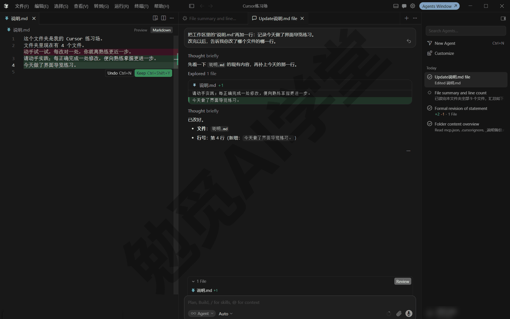

**检查点。** 检查点是每次改动前自动拍的快照。把鼠标悬停到某条消息附近能找到还原入口，点进去可以先预览再还原；还原只回退文件、不删对话（《认识与装好》三连任务的第三步就是它）。预览和还原是两个动作：预览只是把当时的文件状态给你看一眼，不动现在的文件；确认还原才会真正写回去。

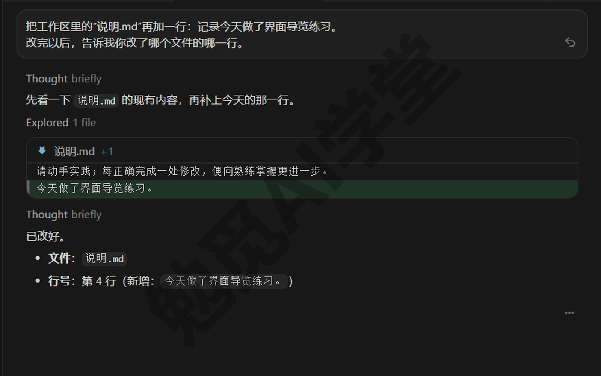

**审批。** 有些动作它不能直接做，会弹出审批请求等你确认：典型的有运行终端命令、联网取内容、删除文件、改工作区外的文件。审批卡片上写着它想做什么，配允许和拒绝按钮（文案以实际界面为准）。这次的小改动发生在工作区内，一般不会触发审批；后面装工具、跑命令时你就会见到它。哪些动作要审批、审批的范围怎么放宽或收紧，是《权限、沙盒与模型》的主题。

> 弹出审批时先看一眼它要做什么，再决定允许——这个习惯从第一天养成。

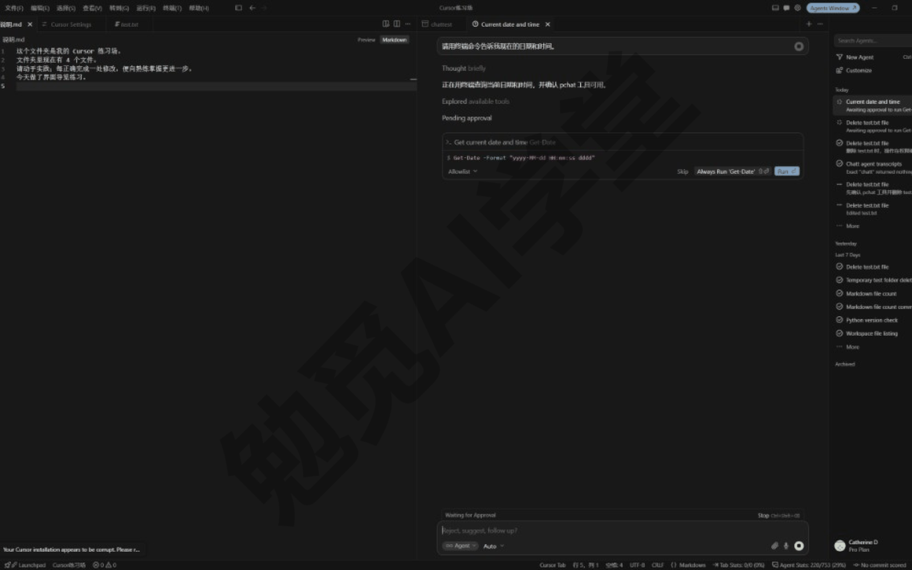

**停止按钮（Stop）。** 它跑偏了、或你突然想改主意，用停止按钮让它停下来。已经做出的改动不会自动消失，需要的话用检查点退回去。和 2.3 讲过的排队、立即发送连起来看，处理“不对劲”的顺序是：只想补充或纠正方向，先排队或立即发送；方向完全错了再停止；停完看差异，需要就用检查点回退，然后把要求说得更明确重新发。

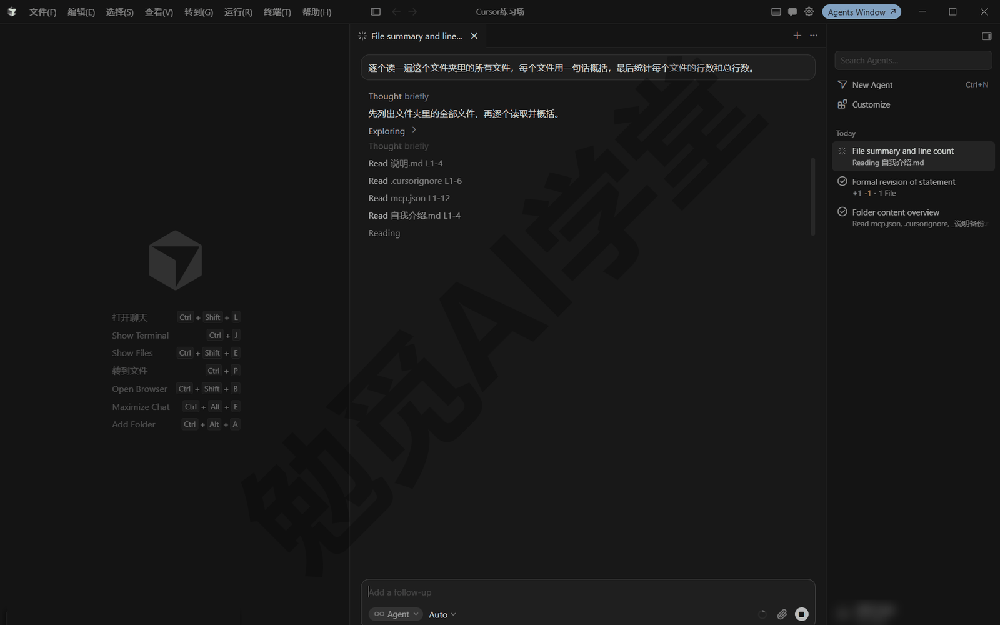

### 2.5 不离开代理窗口看文件

代理窗口的定位虽然是“指挥”，但验收离不开看文件：它说改了三个文件，你想抽查其中一个；它报告清单写好了，你想亲眼确认内容。这类“看一眼”的需求不必切去编辑器，代理窗口里有三件方便的工具，配上两个任务相关的标签页，日常验收基本够用。

**按名字找文件：Ctrl+P。** 按下后出现一个搜索框，输入文件名的任意片段，列表边输边过滤，回车打开排在最前的那一个。比如输“说明”，“说明.md”就会出现在列表里；名字相近的文件会带着所在路径一起列出，方便区分。有两个小技巧：不必输全名，输开头两三个字就够；文件一多，它比在文件树里一层层找快得多。它还能当最近文件的快速切换器用：刚看过的文件通常排在列表前面，按一下 Ctrl+P 直接回车，多半就回到上一个文件（排序以实际表现为准）。


**按内容全局搜索：Ctrl+Shift+F。** 记不住文件名、只记得内容里有什么时用它。输入关键词后，结果按文件分组列出，每条结果带着那一行前后的文字，点击一条直接跳到那个位置。比如搜“练习场”，所有写过这个词的文件都会列出来。它和 Ctrl+P 是一对分工：一个按名字找文件，一个按内容找位置；“它到底把那句话写进哪个文件了”这类问题，用内容搜索一查就知道。两个搜索的范围都是当前工作区，工作区之外的文件搜不到是正常现象——这正是 2.6 要展开的边界。

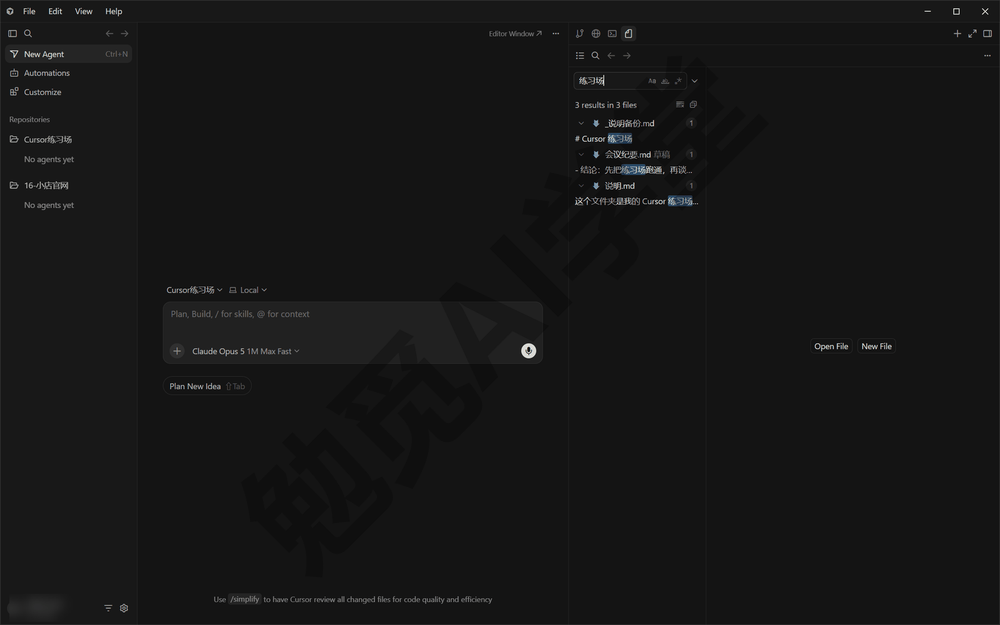

**文件查看。** 从上面两个入口打开的文件可以直接阅读，说明文档、代码文件都能看。把“能做什么、不能做什么”说清楚：读内容、复制文字、当参考材料，都没问题；代码文件里的“跳转到定义”是点着名称找出处的阅读辅助，零基础用不上也不影响；能否在这里直接编辑以实际界面为准，但即使能编辑，也不建议把它当写作区用——成段的手动修改、格式调整不是它的主场。图片这类不是文字的文件能不能看，也以实际界面为准，看不了就到 2.6 讲的编辑器资源管理器里定位到磁盘位置、用系统自带的方式打开。另外，代理窗口里还有一个好习惯：看出问题不必自己动手改，直接在输入框告诉它“说明.md 第二行的数字不对，应该是 5”，让它改、你再看差异——指挥和验收都留在同一个界面里。

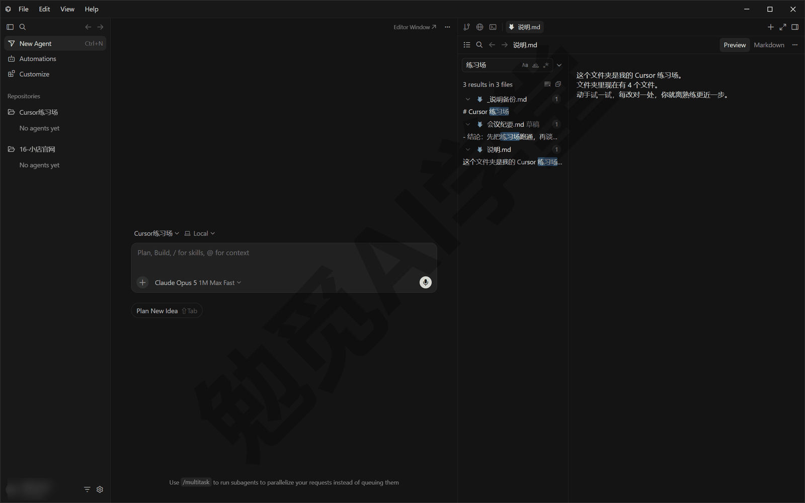

**浏览器标签与画布标签。** 智能体使用内置浏览器时，界面上会出现浏览器标签页，你能看到它正在访问的页面和它截的图；做网页的任务里，这个标签就是你验收外观的地方。画布则是一种可交互的报告视图：让它把一份表格数据做成能点、能筛的看板，成品就会出现在一个画布标签里。这两个标签现在认识样子即可（出现位置以实际界面为准），分别在《内置浏览器与设计模式》和《技能与自定义模式》细讲。

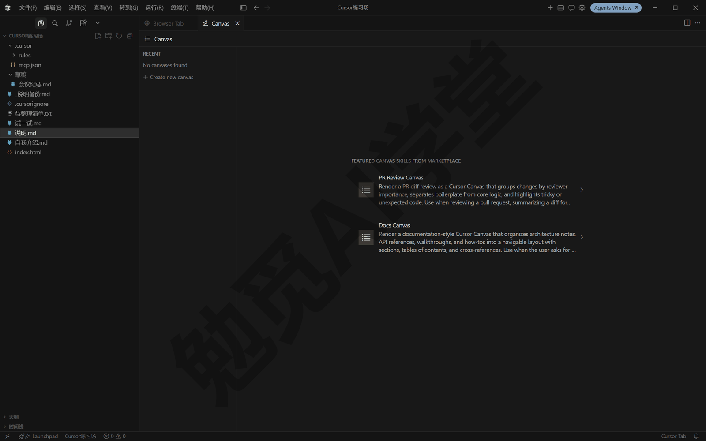

**就地看还是切到编辑器，怎么选。** 一两个文件、只是想确认内容，就地看，不打断指挥的节奏；要并排对比两个文件、连续翻很多文件，或者确实要自己动手编辑、调格式，就切到编辑器（命令面板执行 Open Editor Window，分区在 2.6 认全）。给一个好记的默认分工：验收在代理窗口，动手在编辑器；发现自己在代理窗口里反复想“要是能改就好了”，那就是该切过去的信号。

看文件的三件工具（搜名字、搜内容、直接读）加上这两个标签，代理窗口里的日常验收就齐了。

### 2.6 编辑器界面与“工作区＝文件夹”

什么时候切到编辑器：想同时看很多文件、要分屏对照、装扩展、改主题的时候。在代理窗口的命令面板执行 Open Editor Window（或直接按 Ctrl+Shift+N）就到了。这一节先认全编辑器的分区，再把全课最重要的一个概念讲透。

**编辑器的分区。** 打开编辑器，画面大致分四块：

- **左侧**：一条竖着的活动栏，排着几个图标，点击切换左侧面板显示的内容——资源管理器、搜索、源代码管理、扩展等。
- **中间**：编辑区，看文件、改文件的主区域，支持多标签和分屏。
- **右侧**：智能体侧栏，按 Ctrl+I 打开或收起。
- **底部**：终端等面板。

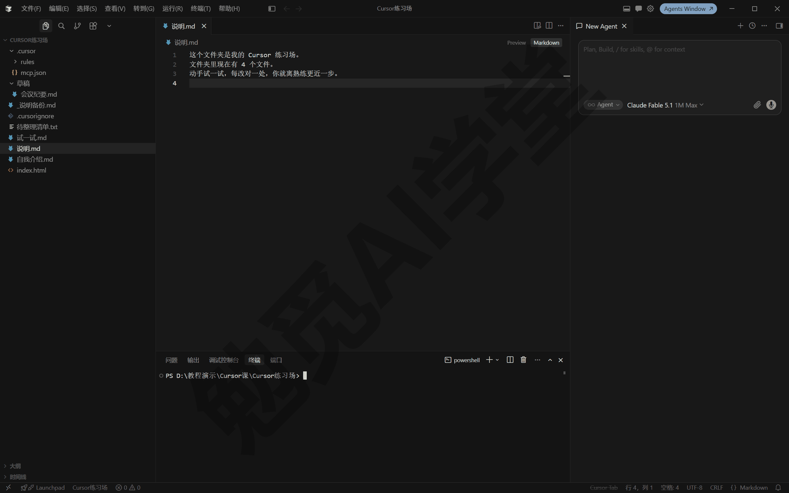

**资源管理器。** 活动栏第一个图标，显示当前工作区的文件树。这棵树就是你磁盘上那个文件夹的真实内容，不是复制品：在这里新建、删除、重命名，磁盘上立刻同步变化。

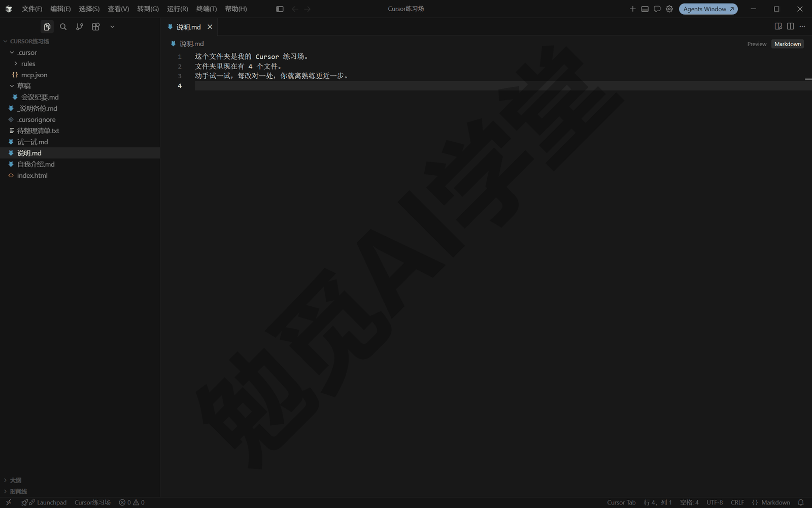

**智能体侧栏。** 按 Ctrl+I 唤出。这里的对话和代理窗口里的是同一批——你在代理窗口发起的任务，在编辑器侧栏里能接着聊，反过来也一样。适合一边看文件一边指挥的场景。


**终端。** 终端是底部的命令行面板，从菜单里的终端项可以新建（菜单名以实际界面为准）。智能体跑命令时你能在对话卡片里看到输出；你自己想手动敲命令也在这里。零基础读者暂时不需要主动用它，认得出来就行。


**源代码管理。** 活动栏上的分支形图标，是 Git 版本管理的面板。现在只需要知道它管的是永久后悔药，《Git、GitHub 与代码审查》整篇讲它。

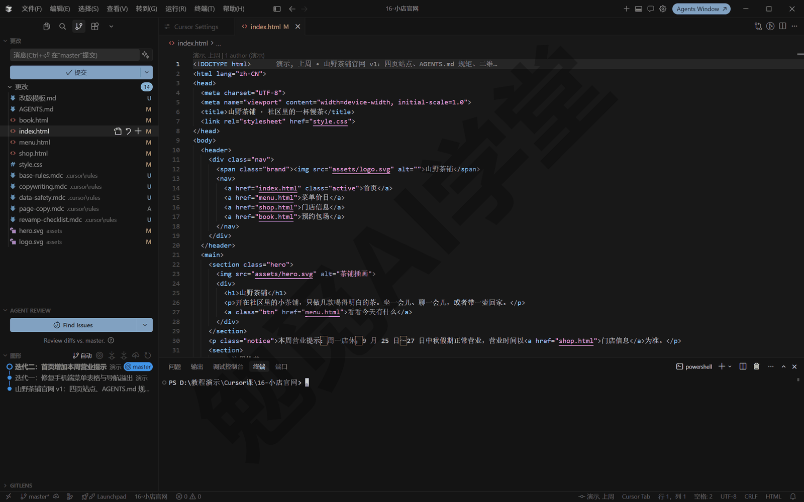

**扩展面板。** 按 Ctrl+Shift+X 打开，《认识与装好》里装中文语言包用的就是它。主题、语言包和各种给编辑器加功能的扩展都从这里装，《编辑器三件套：Tab、内联编辑与扩展》细讲。

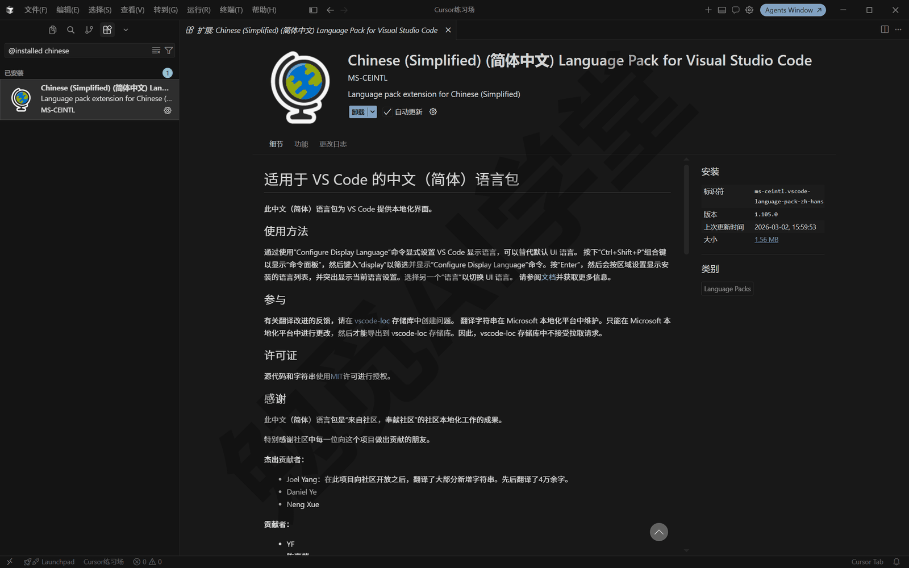

**命令面板。** 按 Ctrl+Shift+P 打开，它是编辑器和代理窗口通用的万能入口：切界面、改语言、更新版本，前两篇用过的命令都从这里执行。记不住某个功能在哪时，先开命令面板搜关键词，多数时候能搜到。

**工作区就是文件夹。** 本课说的“工作区”，就是你打开的那个文件夹，两者是同一个东西的两种叫法。它重要在三点：

- **决定它的工作范围**：智能体读什么、改什么，默认都在工作区之内；改工作区外的文件默认有保护开关拦着（2.8 里会看到这个开关）。
- **决定文件落在哪**：让它生成的文件默认保存在工作区里，不会散落到别处。
- **决定对话的背景**：同一个工作区里的对话，围绕同一批文件展开，互相不串。

验证一下这层关系：在左侧资源管理器的某个文件上右键，选择“在文件资源管理器中显示”一类的菜单项（菜单文案以实际界面为准），Windows 的文件夹窗口会打开并定位到同一个文件。应用里的工作区和磁盘上的文件夹，是同一个位置的两种显示方式。

使用上有三条建议：

- **一件事一个文件夹**：整理照片、做网页、算预算，各建各的文件夹，文件不混、对话也不混。
- **别打开过大的范围**：整个磁盘、装满重要资料的目录，暂时都不要直接设为工作区；边界与权限的完整讲法在《权限、沙盒与模型》。
- **临时材料不用扩大工作区**：想让它看一个工作区外的文件，用 @ 或拖拽交给它（2.3 讲过）就行，不必换工作区。

这里统一一个说法：别处教程常说的“项目”，多数时候指的就是这里的工作区；本课统一叫工作区，含义就是文件夹。还有一个新手常见的情况：没打开任何文件夹就开始对话，它生成的文件会没有明确的存放位置，发现自己“找不到它做的东西”时，先检查是不是没选工作区。

### 2.7 对话管理：搜索、侧聊与分叉

对话攒多了之后，这一节的四件工具决定你找回旧内容的效率。对话记录不会自动消失，做完的任务、归档的智能体都还在，缺的只是找回来的手段——下面四件按从粗到细排列。

**搜历史对话。** 在代理窗口侧栏顶部的搜索框（Search Agents）里输入关键词，就能在以前所有的对话记录里搜索；官方文档还给了快捷键 Ctrl+K，在 3.7.42 版上按它没有反应，以你的版本上的实际表现为准。搜索用的是本地建立的索引（一份便于快速查找的目录），对话攒到上千条也能很快搜到；点中结果就进入那条对话，接着聊也可以。典型的场景有：上周让它改过什么、当时它怎么答的、做过某件事的那条对话叫什么名字——用关键词找，比一条条翻快得多。搜索到底搜哪些地方（标题、正文），以实际表现为准，用内容里出现过的词去搜最稳；归档过的对话能不能搜到也以实际表现为准，搜不到就去侧栏的已归档入口翻（2.2 提过归档的找回位置）。

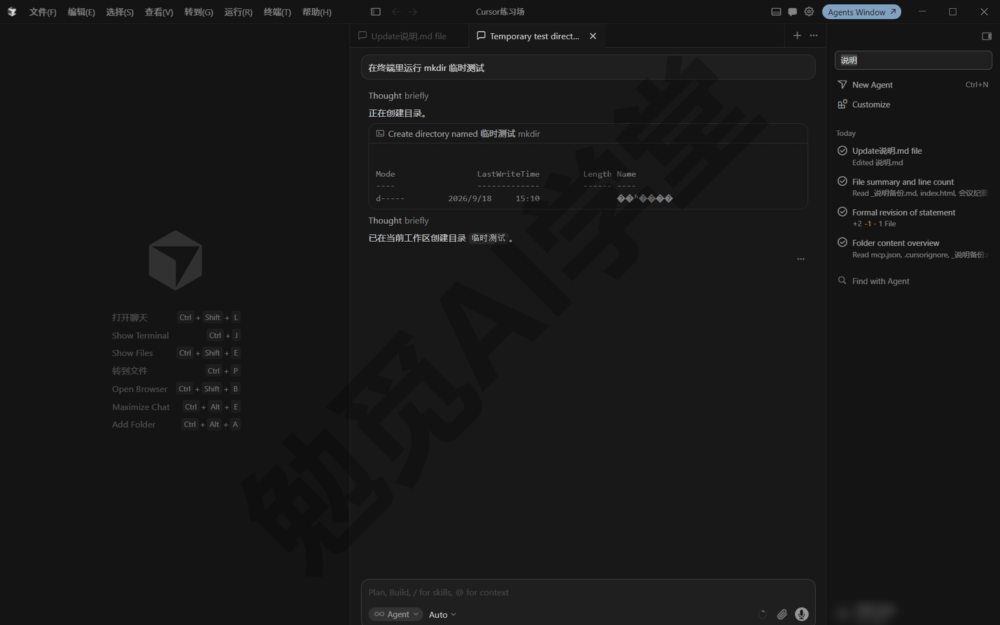

**搜当前对话。** 打开某个对话后按 Ctrl+F，输入关键词，可以在这条长对话里一处一处跳到搜到的地方，界面会显示搜到了几处。长任务的记录常常有几百条，找它当时报过的某个文件名、某个数字，全靠它定位。它和上面的历史搜索是两层：侧栏搜索找“哪条对话”，Ctrl+F 找“这条对话里的哪一处”。

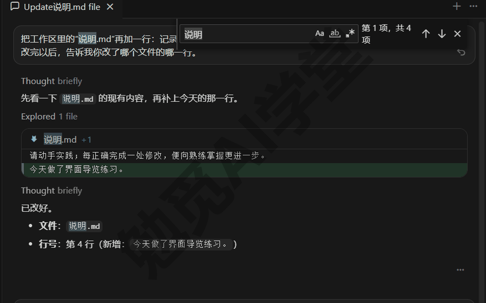

**侧聊。** 3.7.42 版还没有 `/side` 这个命令，输入框里打出来没有反应；下面按官方文档介绍，你的版本有没有以实际界面为准。主线智能体正干着活，你突然想问个概念、查个旁支问题，在输入框敲 /side 就能在旁边开一个小对话；在 /side 后面直接带上问题，会开侧聊并立刻发送。它了解主线的来龙去脉——主线的对话历史会作为背景提供给它——但问答不会混进主线记录，主线也不被打断；侧聊默认以读和答为主，不会主动改文件。比如它正在批量改名，你想问“md 文件是什么”，开个侧聊问，主线完全不受影响。问出有用的结论后，在主线里 @ 这个侧聊，就能把内容拉回主线接着用。还有三条边界：关掉侧聊等于归档而不是删除，回头还能找到；侧聊属于它所在的那个主对话，你切去别的对话，它留在原处；侧聊里不能再开侧聊。细讲在《对话与上下文管理》。

**分叉。** 分叉是把当前对话复制一份、从某个点开始走另一条路。整体分叉从标签菜单、侧栏或命令面板发起，复制全部消息；从某条消息分叉则只复制到那条为止，之后的内容都不带。分叉出来的新对话和原对话从此各走各的，改哪边都不影响另一边。它和侧聊的区别用一句话说：侧聊是挂在主线旁边的并行小线、不复制记录；分叉是复制一份另起炉灶。想试“如果当时换个说法会怎样”，或者想在保住现有进展的前提下试一条大胆的路线，用分叉最合适；注意，从中间某条消息分叉时，那条之后的成果不会带过去，先确认要保的内容在分叉点之前。

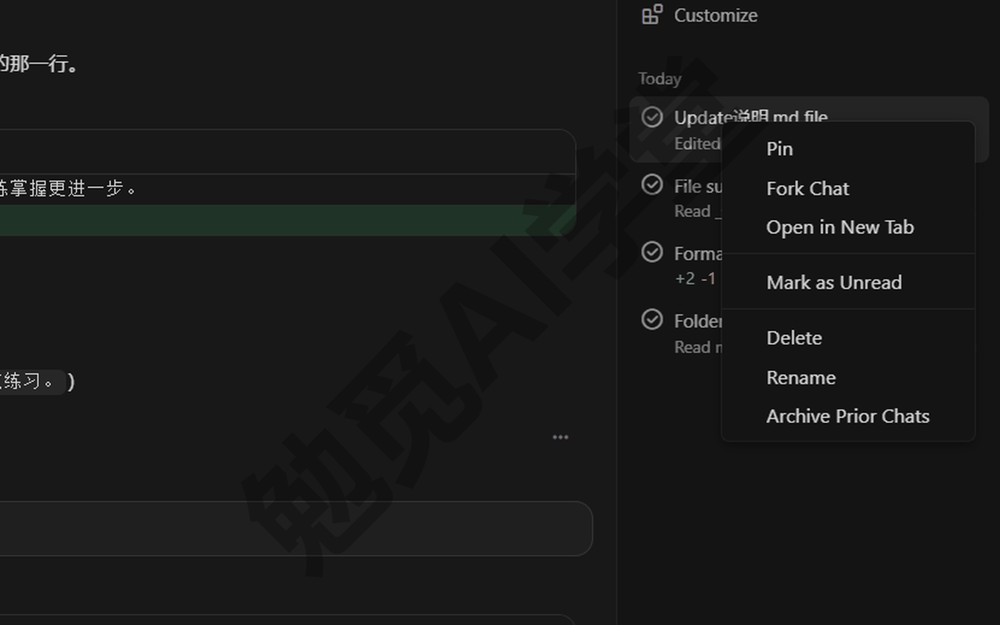

**共享转录。** 共享转录是把一条对话的完整记录生成可分享的链接给同事查看；这是团队版的功能，个人用户知道有这回事即可（形态与权限以实际界面为准）。

### 2.8 设置页分区导览

按 Ctrl+Shift+J 打开设置页（命令面板搜设置相关命令也行）。这一节把每个分区认一遍：知道每个开关管什么、哪一篇会细讲；除了明确说明的，现在都不需要改。中文界面下的分区名以你看到的为准，下面尽量中英对照。

**常规（General）。** 账号信息在这里，用过 VS Code 的还能找到一键导入入口（把扩展、主题、设置、快捷键搬过来）。更新渠道也在这里切换——《认识与装好》排查登录与网络问题时用过：稳定版和尝鲜版二选一，建议留在稳定版。还有一个隐私模式开关，控制你的代码数据是否会被存储和用于改进模型，它和云端功能的关系放在《权限、沙盒与模型》细讲，动它之前先读那一篇。

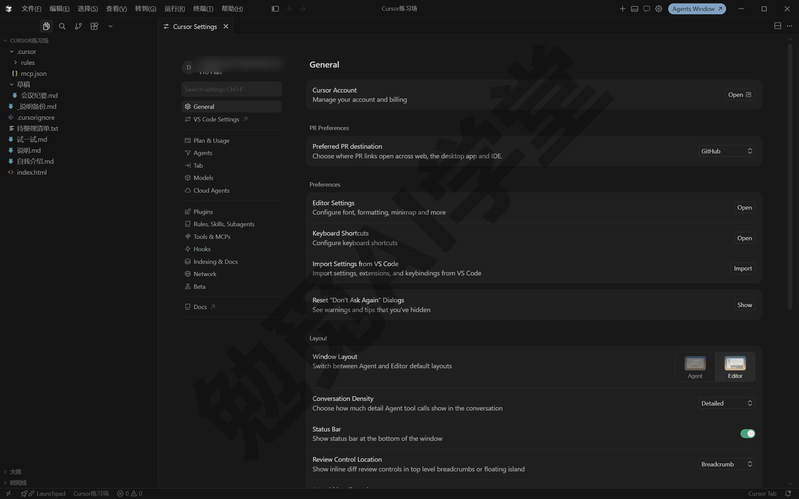

**Agents（智能体）。** 本课用得最多的分区，管智能体哪些事能自己做、哪些要先问你：

- **审批与执行**：运行模式三档——自动审查、白名单、全部运行（中文文案以实际界面为准）。三档分别是“它自动把关，可疑的动作先问你”“只放行你列过的动作”“全都直接跑”。现在保持默认，三档的取舍与实际对比是《权限、沙盒与模型》的重头戏。
- **三道保护**：浏览器保护、文件删除保护、工作区外文件保护，三个独立开关，分别拦住自动用浏览器、自动删文件、自动动工作区外的文件。建议都留着，尤其是 Windows 用户——Windows 上没有文件系统沙盒这一层隔离，这几道保护加上审批就是你的主要安全网，来龙去脉见《权限、沙盒与模型》。
- **其他开关**：同步技能到云端（让云端智能体也能用你的技能）、远程控制（手机接管本机智能体的总开关）、保持唤醒（长任务时防电脑休眠，具体名称以实际界面为准）等，各自等讲到它的那一篇用到时再开。


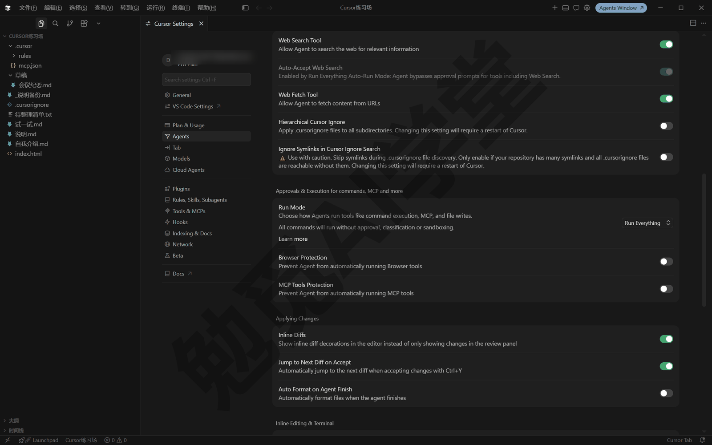

**Tab（补全）。** 管打字时的自动补全：开关、按文件类型关闭等。你还没用到 Tab 补全，先跳过，《编辑器三件套：Tab、内联编辑与扩展》细讲。

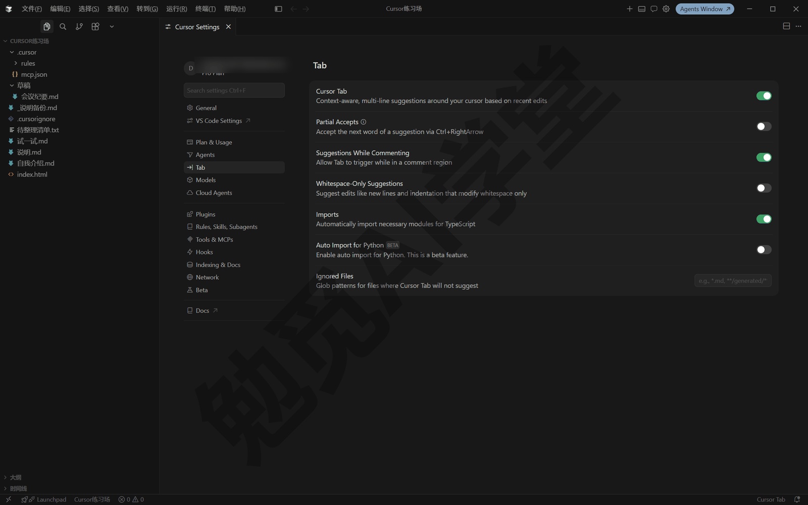

**模型（Models）。** 设置默认模型、决定模型列表里显示哪些模型。2.3 的模型选择器改的是“这条对话用什么”，这里改的是“以后默认用什么”。

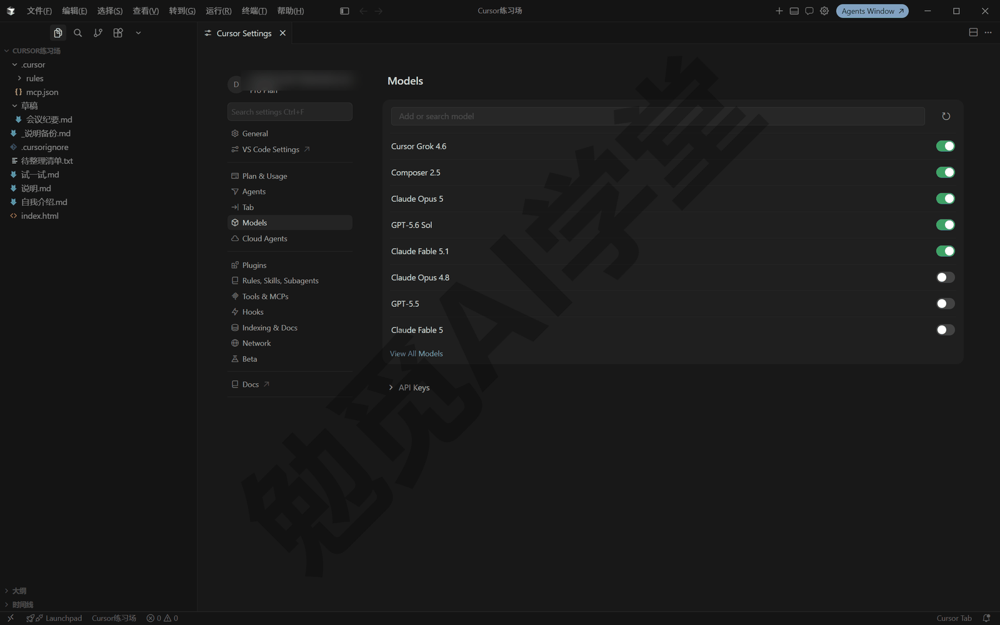

**网络（Network）。** 《认识与装好》排查打不开、登不上的问题时，主要用的就是这个分区：登录不上先来这里点运行诊断，公司代理环境把 HTTP 兼容模式切成 HTTP/1.1。平时不用动。

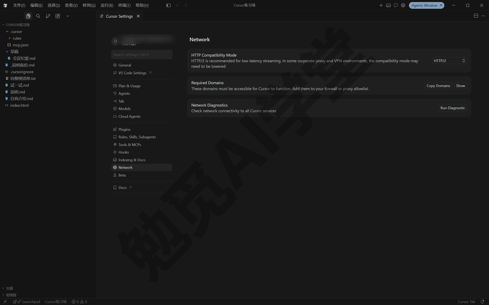

**云端智能体（Cloud Agents）。** 云端任务的设置集中在这一页：Manage Settings 进去连接 GitHub／GitLab（两种代码托管网站）、管理账号与团队设置、配置云端运行环境；Connect Slack 把云端智能体接进 Slack（一款团队聊天软件）用。Git 相关的设置在 3.7.42 版里还没有自己的分区：PR（拉取请求，一种把改动交给别人审查后再合并的申请，《Git、GitHub 与代码审查》细讲）的偏好设置在 General 里的 PR Preferences，GitHub 连接就在本页；3.11 版起它们才收进一个叫 Git & PRs 的分区（分区内容以实际界面为准）。零基础读者到《云端智能体与手机端》再回来看。

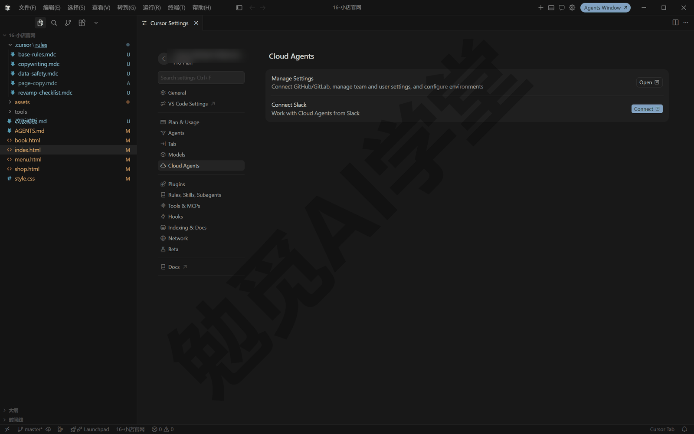

**扩展能力分在两个地方。** 给智能体扩展能力的那些组件，分在两个地方：**装上的** 归设置页，这一页下半段的 Plugins、Rules, Skills, Subagents、Tools & MCPs、Hooks 四个分区分别管着它们；**要找新的** 去市场，代理窗口右侧栏点 Customize 就打开一个叫 Marketplace 的页面。这里第一次集中出现几个新词，各记一句话就好：

- **插件**：把规则、技能、子智能体、MCP、钩子打包成一个组合包，从官方市场一键装。
- **命令**：用 / 调用的可复用提示词，比技能更简单。
- **钩子**：在智能体干活到某些固定步骤时自动运行的脚本，零基础只需知道有这一层。

规则、技能、MCP、子智能体在前面都给过一句话定位。这些组件怎么装、怎么管，统一放在《插件、市场与 MCP》。

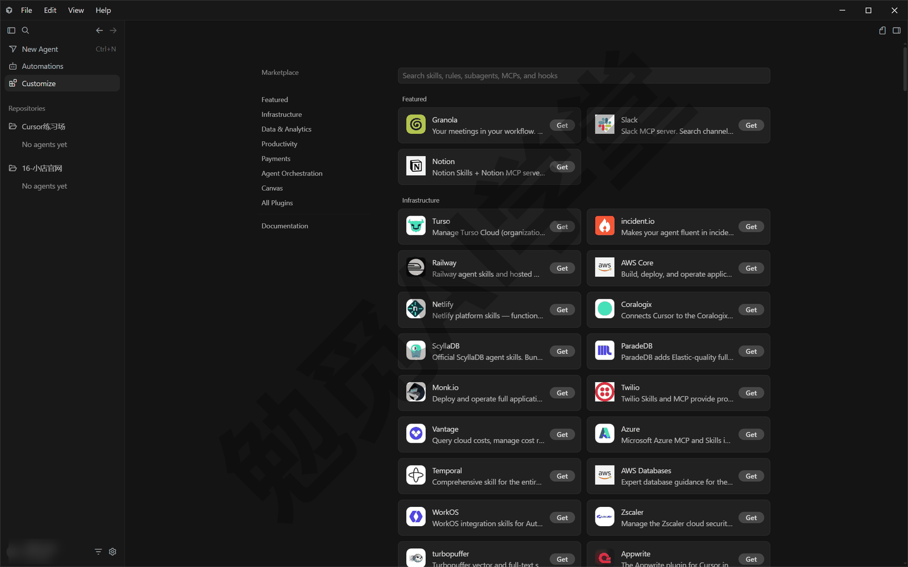

### 2.9 快捷键速查与自定义

开侧栏、切模式、换模型是一天里做得最多的动作，每个都藏在要点一两下的菜单后面，快捷键把它们变成按一下就到，这就是要记快捷键的原因。不用背，跟着本课用到哪个记哪个，一两天就记住了。官方文档列出的核心键如下（Windows）：

| 快捷键 | 作用 |
|---|---|
| Ctrl+I（或 Ctrl+L） | 打开或收起智能体侧栏 |
| Ctrl+K | 内联编辑（编辑器中选中内容原地改） |
| Ctrl+. | 打开模式菜单 |
| Shift+Tab | 在模式之间轮换 |
| Ctrl+/ | 在模型之间轮换 |
| Tab | 接受 Tab 补全建议 |

表里有四行需要补充说明：

- **Ctrl+I 和 Ctrl+L**：两个键效果相同，官方文档把两个都列为开关侧栏的键（以实际表现为准），任选一个用就可以。
- **Shift+Tab 和 Ctrl+.**：都和模式有关，分工不同。Shift+Tab 按一下就切到下一个模式，适合在几个模式间快速轮换；Ctrl+. 弹出完整的模式菜单，适合看着名字选。刚开始建议用 Ctrl+.，每次都能看清自己切到了哪个模式。
- **Tab**：这一行现在还用不上。它是编辑器里的补全功能，《编辑器三件套：Tab、内联编辑与扩展》会正式讲到。
- **Ctrl+K**：最容易混淆的一个。在编辑器里它是内联编辑（《编辑器三件套：Tab、内联编辑与扩展》细讲）；官方文档里代理窗口的历史对话搜索也用它，在 3.7.42 版上没有按出来，2.7 里用的是侧栏搜索框。同一组键在两套界面里可能干不同的事，记住自己当前在哪套界面里，就知道按下去会发生什么。

本篇用过的其他快捷键一并汇总如下（括号里是讲到它的小节）：

- **Ctrl+Shift+P**（2.1）：打开命令面板，编辑器和代理窗口都能用；切换界面、改语言、更新版本这些命令都从这里执行。
- **Ctrl+P**（2.5）：按名字找文件，输入文件名的任意片段，列表边输边过滤，回车打开排在最前的那一个。
- **Ctrl+Shift+F**（2.5）：按内容在整个工作区里搜索，结果按文件分组列出，点一条就跳到那个位置。
- **Ctrl+F**（2.7）：搜当前对话，打开某条对话后按它，可以在这条对话里一处一处跳到搜到的地方，界面会显示搜到了几处。
- **Ctrl+Shift+J**（2.8）：打开设置页，常规、Agents、模型、网络这些分区都在这一页里；除了明确说过要改的，现在都不需要动。
- **Ctrl+Shift+X**（2.6）：打开扩展面板，主题、语言包和各种扩展都从这里装。

这些键要么两套界面通用，要么只在明确的场景里用，很少冲突；真正常冲突的是下面两件事：自己改快捷键，和中文输入法占用了同一组键。

**改快捷键。** 先按 Ctrl+M、再按 Ctrl+S 可以打开快捷键设置（官方文档以前写的是 Ctrl+R、Ctrl+S，3.7.42 版里 Ctrl+R 打开的是最近项目列表，如果按下去是这样，就换用前一组；也可以在命令面板搜索“打开键盘快捷方式”，选“首选项: 打开键盘快捷方式”打开）。打开后是一张全部命令的清单，每行显示命令名和当前键位，顶部有搜索框：搜到想改的命令，点旁边的铅笔图标，按下你想要的新组合，回车保存。如果新键位已被别的命令占用，界面通常会提示冲突（以实际表现为准），换一组再试。改快捷键建议少改：优先只改和输入法冲突的那一两个，其余保持默认；改多了，以后跟教程、跟别人的演示都对不上。

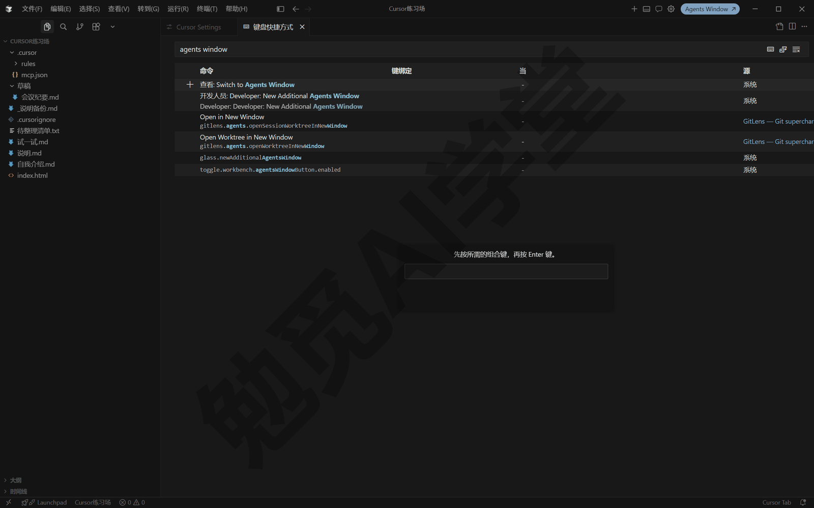

**中文输入法冲突提醒。** 不少中文输入法默认占用了 Ctrl+. 和 Ctrl+/ 一类组合键，最常见的是把 Ctrl+. 用作中英文标点切换，和模式菜单正面冲突——这也是很多读者“第一次按 Ctrl+. 没反应”的原因。症状是你在 Cursor 里按了没反应，或输入法弹出了自己的提示。三种办法任选：在输入法设置里改掉对应热键（各输入法的设置路径不同，以各自的设置页为准）；用上面的方法在 Cursor 里给命令换一组键；或者干脆用鼠标点模式选择器和模型选择器，不用快捷键也完全够用。

### 2.10 三个练习任务

下面三个任务把本篇的关键动作各练一遍。提示词可以直接复制发送。

**任务一：在两套界面之间来回切换**

在编辑器的命令面板（Ctrl+Shift+P）执行：

```
Switch to Agents Window
```

再从代理窗口的命令面板执行：

```
Open Editor Window
```

来回切换三次，最后让两个窗口同时开着。完成标准：切换动作不需要看教程也能完成；能各用一句话说出两套界面分别适合什么；确认两边看到的是同一批对话。

**任务二：把一个现有文件夹添加为工作区并让它写说明**

选一个不含重要资料的现有文件夹（或复制一份出来），把它添加为工作区，然后发送：

```
在当前工作区新建一个名叫“工作区说明.md”的文件，分三行写：
这个文件夹是做什么用的；
里面主要有哪些类型的文件；
最后一行写：本文件由 Cursor 在界面导览练习中创建。
```

完成标准：文件真实出现在磁盘的文件夹里（用资源管理器右键的“在系统资源管理器中显示”验证过）；在差异视图里看过这次新增；能说出“工作区就是这个文件夹”的含义。

**任务三：找到审批与执行**

打开设置页（Ctrl+Shift+J），在顶部搜索框输入：

```
Approvals
```

中文界面下也可以尝试搜索“审批”。完成标准：找到了 Agents 分区里的审批与执行；能说出当前是哪一个档位；确认三道保护开关的位置；全程没有改动任何设置。

### 2.98 本篇小结与自检

这一篇认全了两套界面：代理窗口的侧栏、输入框、工作过程、文件查看，编辑器的分区，以及两边共用的对话管理、设置页和快捷键。最需要带走的一句话是：**工作区就是文件夹，打开哪个文件夹，它就在哪里干活、生成的文件就落在哪里。**

可以对照下面的清单检查学习结果：

- [ ] 能用命令面板在代理窗口和编辑器之间来回切换，也知道可以同开
- [ ] 能指着输入框说出模式选择器、模型选择器、@、/、附件、麦克风、队列、用量环各是干什么的
- [ ] 看得懂工具卡片和差异视图，找得到检查点还原入口和停止按钮
- [ ] 会用 Ctrl+P 和 Ctrl+Shift+F 在代理窗口里找文件
- [ ] 理解“工作区＝文件夹”，验证过应用里的工作区和磁盘文件夹是同一个位置
- [ ] 在设置页找到过审批与执行、三道保护，也点开过侧栏的 Customize 看到插件市场
- [ ] 快捷键表里至少四个已经上手，知道输入法冲突怎么处理

完成这些内容后，你在任何画面里都能说出自己在哪、每个按钮是干什么的。下一篇《权限、沙盒与模型》解决“它到底能动我电脑的什么”这个关键问题：运行模式三档怎么选、Windows 上的安全网由什么组成、模型和用量怎么安排，学完你就能放心地把权限调到弹窗少、又安全的档位。

### 2.99 新手常见问题

**Q1：启动后默认打开的是哪个界面？**

不同版本默认打开哪个界面可能不同，以你看到的为准。无论进了哪套界面，命令面板里的 Switch to Agents Window 和 Open Editor Window 两条命令都能带你去另一套；本课主线用代理窗口。

**Q2：两套界面的数据通用吗？**

通用。它们是同一个应用的两张操作台，账号、对话记录、工作区、设置全部共享：代理窗口里发起的任务，编辑器的智能体侧栏里能接着聊，反过来也一样。不存在“换界面丢记录”的问题。

**Q3：对话记录存在哪里？删对话会删文件吗？**

对话记录由应用管理（历史搜索用的是本地索引），它和工作区文件是两回事：删除对话不会删掉磁盘上的文件，删除文件也不会抹掉对话记录。涉及数据和隐私的细节在《权限、沙盒与模型》。

**Q4：快捷键按了没反应，是不是和输入法冲突了？**

很可能是。中文输入法常占用 Ctrl+. 和 Ctrl+/ 这类组合键，表现就是在 Cursor 里按了没动静。处理办法见 2.9：改输入法热键、在 Cursor 里换键位、或改用鼠标点选，三选一即可。

**Q5：别的教程说的“项目”，和本课说的“工作区”是一回事吗？**

多数时候是一回事，都指你让 Cursor 打开的那个文件夹。本课统一用“工作区”这个叫法，并且始终按“工作区＝文件夹”来理解：打开哪个文件夹，它就在哪里读写文件，做出来的东西也保存在那里。
