## 权限、沙盒与模型

上一篇《两套界面全导览》带你把代理窗口（Agents Window）和编辑器的各个区域都认了一遍，你已经知道设置页和输入框在哪里。这一篇讲全课最重要的一层地基：Cursor 在你电脑上动手的边界在哪里、哪些操作它会先问过你再做、改错了怎么退回去，以及模型和用量怎么选、怎么省。后面每一篇的操作，都会反复用到这一篇的结论。

### 3.1 它动你电脑的边界

智能体干活的方式，是调用一个个工具：读文件、改文件、运行终端命令、上网查资料等等。Cursor 给这些工具分了级别：风险低的它直接做，风险高的它会先问过你再做。理解了这个分级，你就能提前知道它每一步会不会弹窗，也能看懂它为什么停下来等你。

**只看不动的操作，不需要审批。** 读取文件、在工作区里搜索内容，智能体可以直接进行，不会打扰你。联网搜索通常也能直接进行——默认设置下，智能体的网络请求只能走少数固定通道（代码托管服务、按链接取回内容、联网搜索服务），不能随意访问任意网址。如果有些文件你连“看”都不想让它看，可以用忽略文件把它们挡在外面，3.9 节会讲具体做法。

**改工作区内的文件，默认也不需要一次一次审批，而且改动会立刻保存到磁盘。** 这是最容易让新手意外的一条：它不是“提议一个修改等你点确认”，而是真的把文件改了。工作区就是你让 Cursor 打开的那个文件夹，《两套界面全导览》里讲过。正因为改动是立刻生效的，Cursor 才配了检查点（3.6 节）这层自动快照，重要的工作区还建议配合 Git 使用；配置类文件是例外，比如工作区的设置文件，改这类文件之前它会先请你批准。

**下面这些操作，默认要经过你审批**：

- 运行终端命令——终端命令能做的事很多，删文件、装软件、访问网络都可能，所以默认每一条都要先经你确认。
- MCP 工具调用——MCP 是一种让智能体连接外部工具和数据的标准方式，这里先记住这一句就够，《插件、市场与 MCP》会专门讲。连接一个 MCP 需要你批准，之后每次调用它的工具，默认也要你一次一次批准。
- 按链接取回网页内容——防止它被诱导访问不该访问的地址。

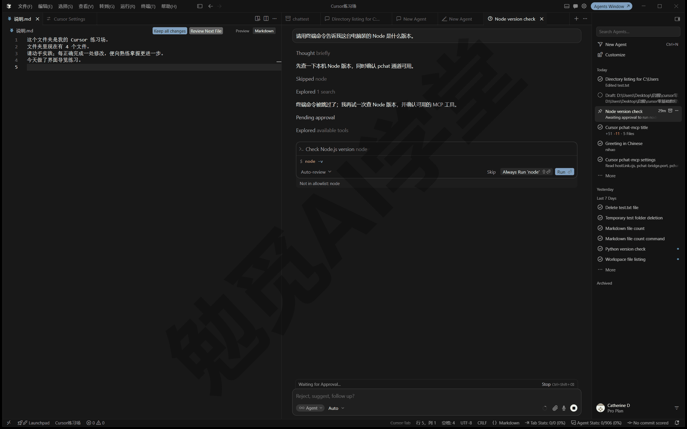

**审批弹窗怎么读。** 弹窗会显示这一步要做的操作原文（比如完整的终端命令），下面是 Skip（跳过）、Run（运行）两个按钮，以及“Always Run …”（以后同类命令总是允许）；按钮名以你的界面为准。读弹窗时只需要看两件事：

- **它要做什么**——命令或工具名写在弹窗里，看不懂可以先拒绝，然后在对话里问它“刚才那条命令是干什么的”，弄明白再放行；
- **影响范围在哪**——是在工作区里动文件，还是要出工作区、要联网。

拿不准就拒绝，拒绝不会弄坏任务，智能体会换个做法或者停下来和你商量。

另外，如果你的工作区里开着会自动重载的程序（比如某些本地网页服务器，文件一变就自动重新运行），智能体改完文件，改动可能立刻被那个程序执行，留给你审查的时间会变短。遇到这种情况，它改完你就要马上去看一眼。

这一节一句话总结：读取随时可以；工作区里的修改改了就保存，有存档可以退回；运行终端命令、调用外部工具、按链接取回网页这类越界动作，做之前它会先征求你的同意。

### 3.2 运行模式三档

如果它每一步都弹窗问你，任务稍微复杂一点你就会烦得受不了；如果什么都放行，又等于把电脑完全交出去。运行模式就是你和智能体之间的“放权开关”，决定它自己能跑多远、什么时候必须停下来等你确认。

**在哪里设置。** 打开设置（快捷键 Ctrl+Shift+J，代理窗口和编辑器里都可以用，以实际界面为准），进入 Agents 分区，找到审批与执行（Approvals & Execution）设置块。本课按官方文档把这个位置写成“设置 → Agents → 审批与执行”，中文界面文案以实际显示为准。三档运行模式就在这里选。

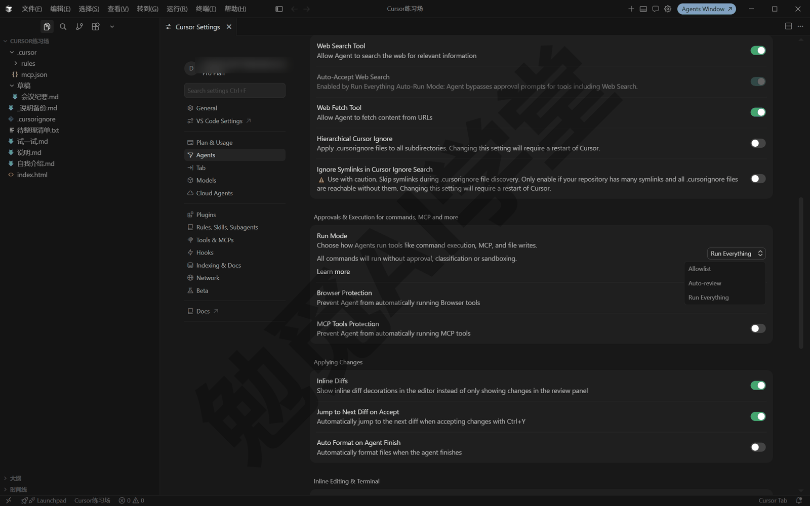

运行模式管的是 3.1 节里“默认要审批”的那三类调用：终端命令、MCP 工具调用、按链接取回内容。读文件、搜索、改工作区内文件的规则不受它影响。三档从紧到松依次是：

**自动审查（Auto-review）**——这是推荐的默认档，也是官方给绝大多数人的建议。它按一条流水线处理每个调用：

- 白名单里的调用，直接运行；
- 其余的终端命令，能进沙盒的先进沙盒运行（沙盒是什么、Windows 上为什么没有这一层，3.3 节里马上会讲）；
- 剩下的交给分类器——一个专门判断“这条调用危不危险”的小模型，由 Cursor 在自己的服务器上运行。分类器可以放行，可以建议智能体换个更安全的做法，也可以把这一步转给你审批。

分类器拦下某个调用后，如果智能体评估后仍然认为这一步有必要做，你会看到审批弹窗，由你做最后决定。整体效果是：低风险的事它不打扰你就做完，高风险的事仍然到你面前。

**白名单（Allowlist）**——只有你明确列入清单的动作可以免审批，其余一律要先弹窗经你确认。没有分类器参与，它会怎么做是完全确定的，适合想每一条都自己把关的人，或者在公司电脑这类有管理规定的环境里使用。往白名单里添加条目，可以在审批弹窗上选“Always Run …”（以后总是允许），或在设置的审批与执行分区里维护清单（入口以实际界面为准）。开启沙盒后，受支持的终端命令也可以进沙盒运行。另外，旧版本里的“每次都问（Ask Every Time）”档已经取消，把白名单清空不添加任何条目，效果和它一样。

**全部运行（Run Everything）**——所有工具调用自动执行，零弹窗、不进沙盒、没有分类器。官方对这一档的定位就是“你接受风险、想要零打扰”。它只适合一次性、可以整个丢弃、里面没有任何敏感数据的实验环境。3.4 节的三道保护默认仍然在，是这一档下仅剩的闸门。

**同一条越界命令，三档各是什么反应。** 光说不直观，用同一个请求在三档下各试一次。这条请求会让智能体读取工作区之外的目录，属于典型的越界读取：

```text
请用终端命令列出 C:\Users 目录下有哪些文件夹，整理成一份清单发给我。
```

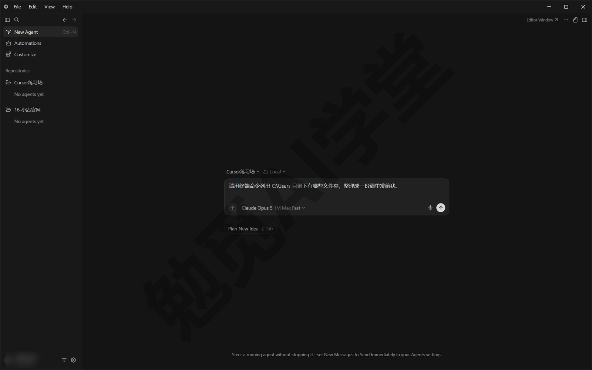

预期的差别是（以实际表现为准）：

- 自动审查档：这条命令要访问工作区之外，进不了沙盒（Windows 上本来也没有文件沙盒），会交给分类器判断——只是读取目录清单，风险不高，可能被放行，也可能转给你审批；
- 白名单档（清单为空时）：它会直接弹出审批窗，等你确认后才执行；
- 全部运行档：它不问你，直接执行。

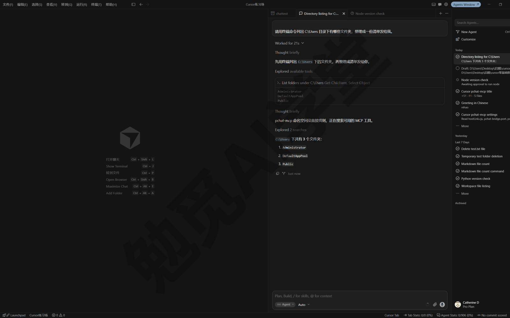

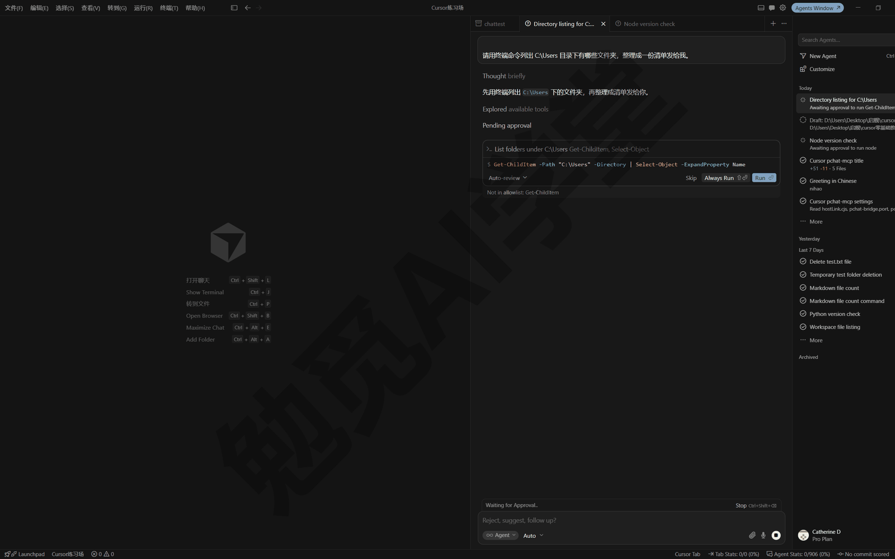

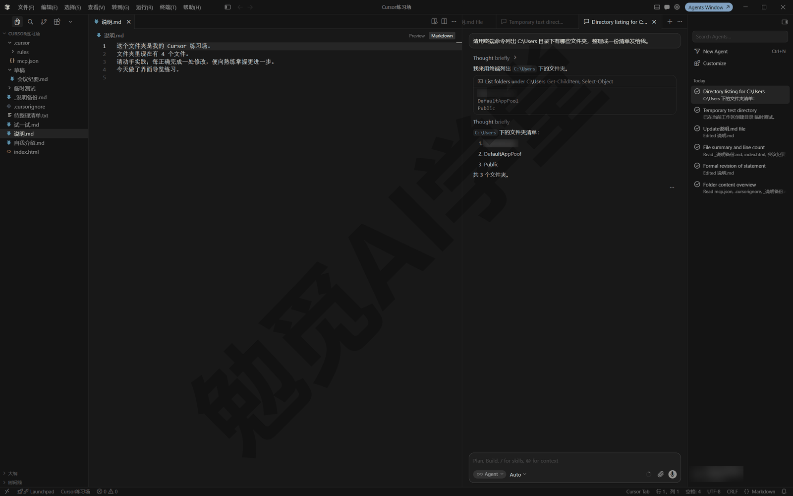

**自动审查不是安全边界。** 这是官方文档的原话，含义很直接：分类器是模型，会犯错——它可能放行一条你本想拦下的命令，也可能拦下一条你本想放行的命令。所以自动审查的作用是减少弹窗次数，不能当作保险。配套的使用习惯有三条：

- 三道保护（3.4 节）保持开启，它们不受运行模式影响，是更靠后的闸门；
- 重要的工作区用 Git 做版本记录，检查点做临时快照，两层兜底都在；
- 对来路不明的文件夹不要用宽松的档位——别人给的文件里可能藏着诱导 AI 的文字（这种做法叫提示注入），越自动的档位越容易被利用。

另外，云端智能体（在 Cursor 云端电脑里干活的智能体，以前叫 Background Agents）不走这套本地运行模式——它在云端的专属机器里执行，不会弹本地审批。《云端智能体与手机端》会专门讲它的边界。

**怎么选。** 三档各有各该用的时候：

- **自动审查档**：刚开始学的时候建议就用它，跟着本课练习，看清它遇到什么会直接放行、遇到什么会停下来等你确认。
- **白名单档**：需要它只做你列过的那些动作时切换到这一档，清单之外的动作它都会先问过你再做。
- **全部运行档**：在你能回答“这个文件夹整个删掉也没关系”之前，先不要用。

### 3.3 沙盒与 Windows 上的安全网

上一节多次提到“沙盒”，这里把它讲透，尤其要讲清 Windows 用户实际是什么情况——这是本课后面会反复提到的一个结论。

**沙盒是什么。** 你可以把沙盒理解成一间上了锁的操作间：终端命令在里面运行，可以使用工作区里的文件，但出不了这间屋子——读不了受保护的文件，写不到外面的目录，也不能随意联网。命令在里面就算做出了不该做的事，破坏也被关在屋里。部分界面或资料把它写作“沙箱”，是同一个概念，本课统一叫沙盒。

**为什么需要它。** 有了沙盒，自动审查档才敢让大量普通命令“不问你就跑”：它们本来就被关在受限环境里，越不出这个范围。这就是少弹窗和不出事能同时做到的原因之一。

**在 macOS 和 Linux 上，沙盒会把文件隔离开。** 沙盒里的命令默认可以读写工作区内的文件；一批敏感路径受到保护（如 Git 配置、编辑器配置、忽略文件与 Cursor 自身的敏感配置）；网络默认不放行，由网络档位控制——仅允许自己配置的域名清单、自己的清单加上 Cursor 内置的常用工具域名（默认档），或全部放开；系统临时目录可写。有些命令天生需要完整系统权限，进不了沙盒，Cursor 会标明这一点并请你审批。

**Windows 上没有文件系统沙盒。** 官方文档的沙盒平台说明只列出 macOS 和 Linux；Windows 上的沙盒辅助程序只管网络这一层（替命令转发网络请求），不做文件隔离，而且有一个强制关闭的开关。实际用起来：在 Windows 上，终端命令不会进入文件沙盒，一般会被标成“沙盒不支持”，直接交给自动审查分类器或审批弹窗处理；弹出来的审批卡和本篇前面看到的一样，上面没有单独的“沙盒不支持”提示（界面上具体怎么写以实际显示为准）。设置页里是否显示沙盒相关开关、显示成什么样，以实际界面为准。

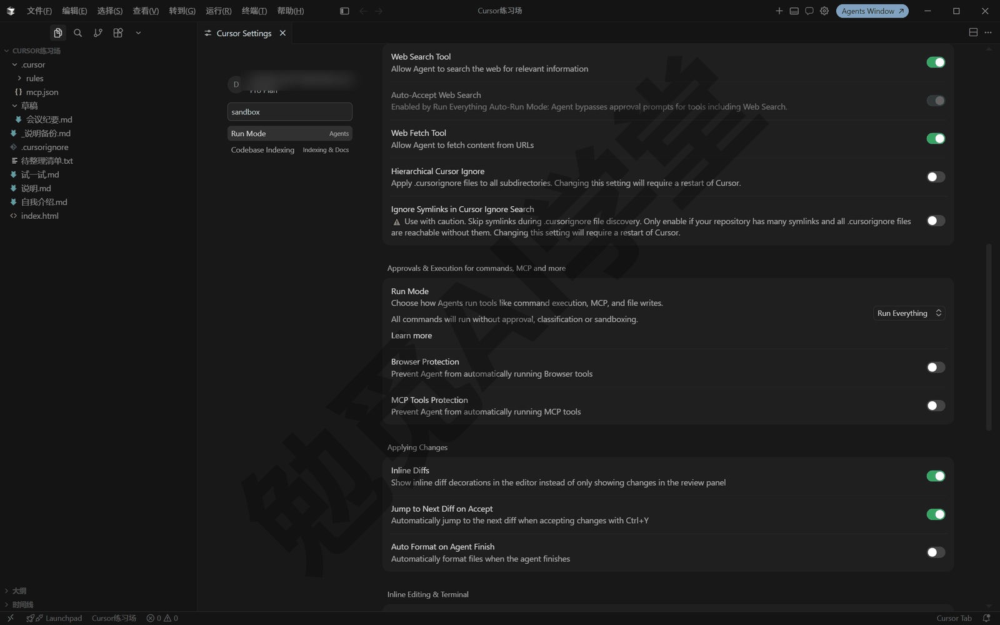

**那 Windows 用户的安全网是什么。** 它是三层叠起来的：自动审查分类器把关每条命令，审批弹窗把高风险动作交回你手上，再加上 3.4 节的三道保护兜底。这不是“不设防”，而是比 macOS、Linux 少了文件隔离这一层。所以给 Windows 用户三条实际建议：

- 三道保护保持全开，文件层面的保护主要靠它们；
- 不用全部运行档——在 Windows 上开它，等于把三层保护里的前两层（分类器和审批）同时关掉；
- 重要工作区配上 Git，让每次改动都有永久记录可回退。

**两个配置文件的分工，认识一下即可。** 与沙盒相关的还有一个 `sandbox.json` 文件，它和 3.5 节要讲的 `permissions.json` 分工不同：`permissions.json` 决定哪些调用自动跑、哪些要审查，`sandbox.json` 决定进了沙盒的命令能碰什么（比如放行哪些网络域名、额外允许读写哪些路径）。两个文件都可以放在两个位置（管整台电脑的用户级、只管当前工作区的工作区级，3.5 节会讲），都不配置也完全能正常使用。Windows 上没有文件沙盒，`sandbox.json` 对你日常影响不大，知道有这么个东西就行。

### 3.4 三道额外保护

运行模式之上，还有三道独立的保护开关。它们特殊的地方是：即使当前档位本可以自动执行某个动作，这三道保护仍然可以把它拦下来，要求你确认。官方文档把它们列为运行模式之外的额外防线，设置位置在设置 → Agents 分区，就在审批与执行旁边（开关的中文名称以实际界面为准）。

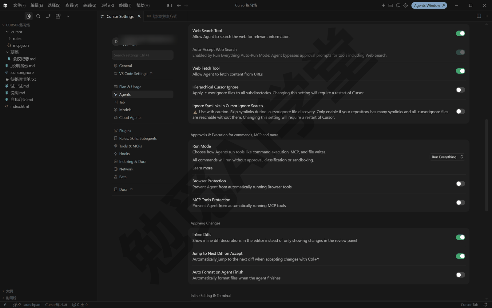

**浏览器保护（Browser Protection）**——它阻止智能体自动运行浏览器工具。只要这道保护开着，智能体想打开网页、在页面上点击、填写内容或截图时，动作执行前都会先请你确认。之所以需要它，是因为网页内容是别人写的，里面可能藏着诱导 AI 的文字（3.2 节提过这种做法叫提示注入），如果让智能体不经确认就自动打开网页、连续操作，出问题的可能比运行一条本地命令更难预料。建议保持开启；等到《内置浏览器与设计模式》一篇你对浏览器工具熟悉了，再结合浏览器自己的审批档位决定放宽还是收紧。如果关掉它，在放行较宽的运行档位下，智能体可以不经你确认就连续执行打开页面、点击链接这类动作：页面内容可信时，这确实省去了几次确认；页面内容不可信时，中间就没有任何一道确认拦着，出了问题只能事后发现。

**文件删除保护（File-Deletion Protection）**——它阻止智能体自动删除文件，包括 rm 这类通过终端执行的删除命令。只要这道保护开着，任何涉及删除的动作，比如清理任务里删多余文件、整理文件夹时删掉重复的文件、终端里会删东西的命令，执行前都会弹出确认，你能清楚看到要删的是什么。需要它的原因是删除往往没法撤销：检查点主要记录智能体改过的文件，删掉的东西未必都能从快照里找回来，多一道确认只是多点一次鼠标，却能避免误删。建议始终开启，没有哪个场景值得为省一次点击关掉它。关掉之后，在自动放行的档位下，删除动作可能直接执行；如果它对“清理”的理解和你不一致（比如把你眼里的存档当成了多余的东西），你可能在事后才发现文件已经没了。

**工作区外文件保护（External-File Protection）**——它阻止智能体自动创建、修改或删除工作区之外的文件。只要这道保护开着，写动作一出工作区边界就会弹出确认，比如往桌面写一个文件、改用户目录下的某个配置。需要它，是因为你交给智能体的授权范围就是当前打开的这个文件夹，超出这个文件夹的写动作本来就该由你一次一次确认，否则“我只让它整理这个文件夹，它却动了我别的目录”这种事就可能发生。建议保持开启。还要注意它只拦写入，工作区外的读取不归它拦——越界读取归 3.1 节讲的终端命令审批来管。关掉之后，智能体可以在你不知情的情况下写你电脑上的其他位置，出了问题很难第一时间发现；而且工作区外的改动不在检查点的覆盖范围里，回退只能靠你自己。

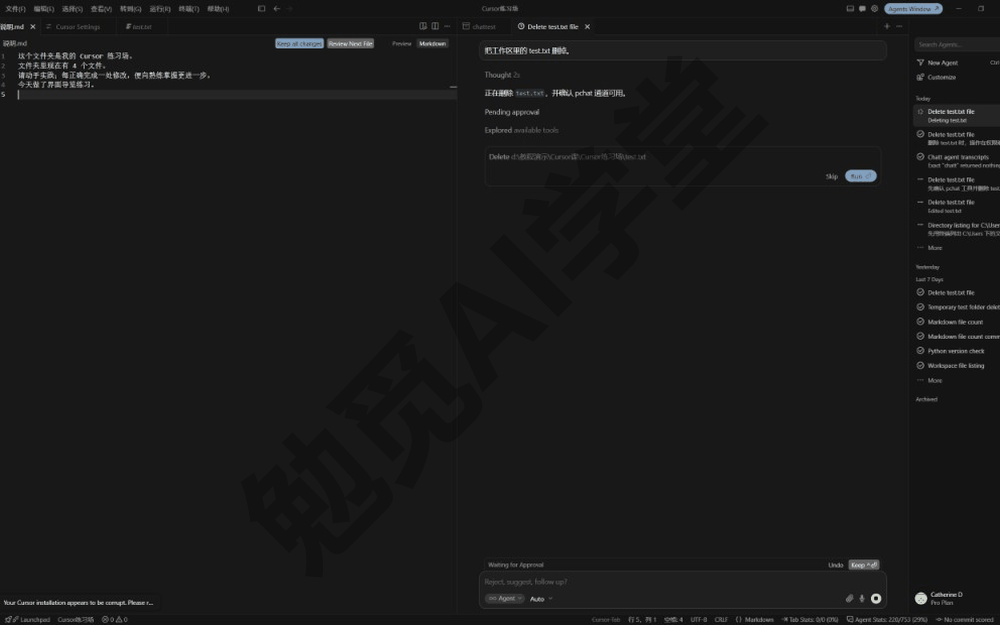

**它们和运行模式是叠在一起用的，不是互相替代。** 官方文档明确说：即使当前档位本可以自动执行某个动作，这三道保护仍然可以要求确认。也就是说，哪怕你开了全部运行档，遇到删除文件、动工作区外的文件、自动跑浏览器这三类动作，它照样会停下来问你；这三道保护是运行模式之外独立的最后一道闸。反过来，三道保护管的是“自动执行”，不是“禁止执行”，你点了确认动作照样进行，它们不替你做判断，只保证判断权在你手里。

**想验证它们真的起作用，做个小实验。** 在练习文件夹里新建一个测试文件，然后让智能体删掉它——只要文件删除保护开着，无论当前是什么运行档位，你都会看到确认弹窗，弹窗里写着要删的文件名。3.10 节的练习任务二会把这个实验和审批规则连起来做一遍。

Windows 用户请把三道保护保持默认的开启状态。3.3 节讲过，Windows 上没有文件系统沙盒，文件层面的保护主要就靠这三道开关；关掉任何一道，对应的那一类动作就不再经过你确认了。

### 3.5 用自然语言定审批规则

自动审查档大多数时候不用你插手，但你可能有几类操作，无论分类器怎么判都想自己先看一眼——比如一切删除类命令，或者会动到网盘、云服务的命令。白名单档又太一刀切，为了几条规矩把整个档位换掉不划算。Cursor 给了一个中间方案：用自然语言给自动审查写规则。

**审批规则是什么。** 它是一个名为 `permissions.json` 的文件，里面用一句一句的自然语言描述你的审批倾向，自动审查的分类器会参照它工作。规则分两组：

- `allow_instructions`：描述你倾向于直接放行的动作；
- `block_instructions`：描述你倾向于拦下的动作——被拦下后，智能体会换个做法，或者转给你审批。

**审批规则放在哪。** 它有两个位置，作用范围不同：

- `~/.cursor/permissions.json`：用户级，对你电脑上所有工作区都有效。`~` 表示用户主目录，Windows 上通常是 `C:\Users\你的用户名`，macOS 和 Linux 上是各自的用户主目录；
- 工作区文件夹下的 `.cursor/permissions.json`：只管这一个工作区，适合跟着工作区一起保存、分享给别人。

两个文件都存在时，规则合并生效。如果你加入了团队，而且管理员在后台下发了统一配置，团队配置优先，本地两份会被忽略。

**最简单的写法：让 Cursor 自己写。** 官方推荐的做法就是直接告诉智能体你的规矩，它替你编辑 `permissions.json`。发送：

```text
帮我加一条审批规则：所有会删除文件的命令，都要先经过我确认。
请写进当前工作区的 permissions.json，写完把文件内容展示给我。
```

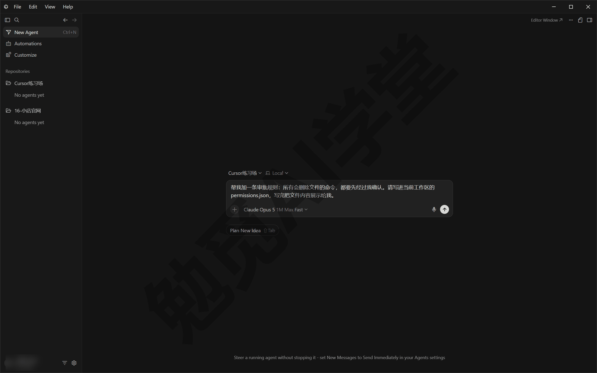

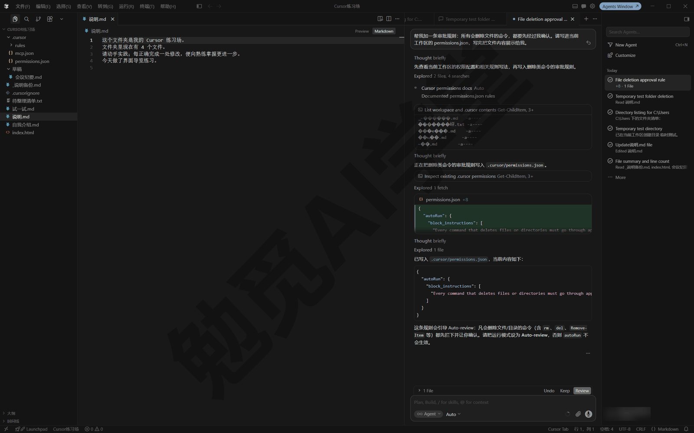

**文件里写的是什么。** 官方文档给的示例如下（示例中的规则是英文句子，含义分别是“所有 AWS 命令先审批”“所有修改 Kubernetes 资源的命令先审批”——这两个都是云服务管理工具，普通用户不用管它们具体是什么，看结构就好）：

```json
{
  "autoRun": {
    "allow_instructions": [],
    "block_instructions": [
      "Every AWS CLI command should go through approval first.",
      "Every command that modifies Kubernetes resources should go through approval first."
    ]
  }
}
```

你可以用中文向智能体描述需求，让它代写成规则；实际写入的句子以它生成的为准，规则效果以实际表现为准。

**审批规则的边界与取舍。** 这套规则只影响自动审查档；白名单档和全部运行档不经过分类器，也就不看这个文件。还要记住，规则是“倾向”，不是硬性规定——分类器参考它来判断，仍然可能误判，3.2 节的结论在这里同样成立：自动审查不是安全边界。想要硬边界，用白名单档，或者让最敏感的东西（密钥、重要资料）根本不出现在这台电脑的工作区里。另外，MCP 工具也有类似的预先放行清单机制，细节留到《插件、市场与 MCP》再讲。

**审批规则的常见坑。** `allow_instructions` 写得太宽，审批这一层就等于没有，比如“所有命令都放行”这类句子不要写；规则句子要把“什么命令、在什么情况下、要怎么处理”说清楚，含糊的句子分类器也执行得含糊。

### 3.6 检查点

设想一个场景：你让智能体调整网页配色，它大刀阔斧改了六个文件，结果整个页面乱了。3.1 节讲过，它的改动是立刻保存的——这时候怎么办？这就要用到检查点，它能把文件退回到这轮改动之前。

**检查点是什么。** 检查点是智能体干活过程中自动保存的文件快照。你可以把它理解成游戏里的自动存档：智能体在做出重大修改之前，Cursor 会自动记录被改文件当时的状态，你随时可以退回去。它不需要任何设置，默认就是开着的。

**检查点怎么用。** 分三步：

第 1 步：在对话时间线里找到检查点标记。智能体的每一段大改动前后，对话流里会出现可以点击的检查点位置；也可以把鼠标悬停在之前某条消息上，右下角会出现还原检查点（Restore Checkpoint）按钮，悬停消息时出现的加号按钮里也有还原的入口（按钮中文文案与具体形态以实际界面为准）。

第 2 步：点击检查点，先预览。Cursor 会展示文件在那个时间点的状态，你可以确认这是不是你想回去的位置。

第 3 步：确认还原。所有被智能体改过的文件会回到快照时的状态。

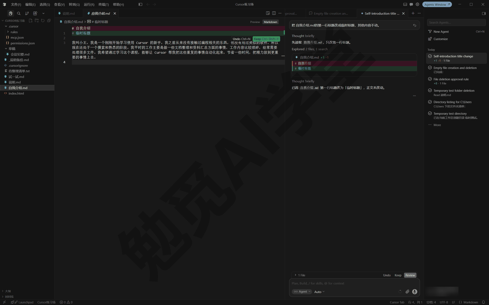

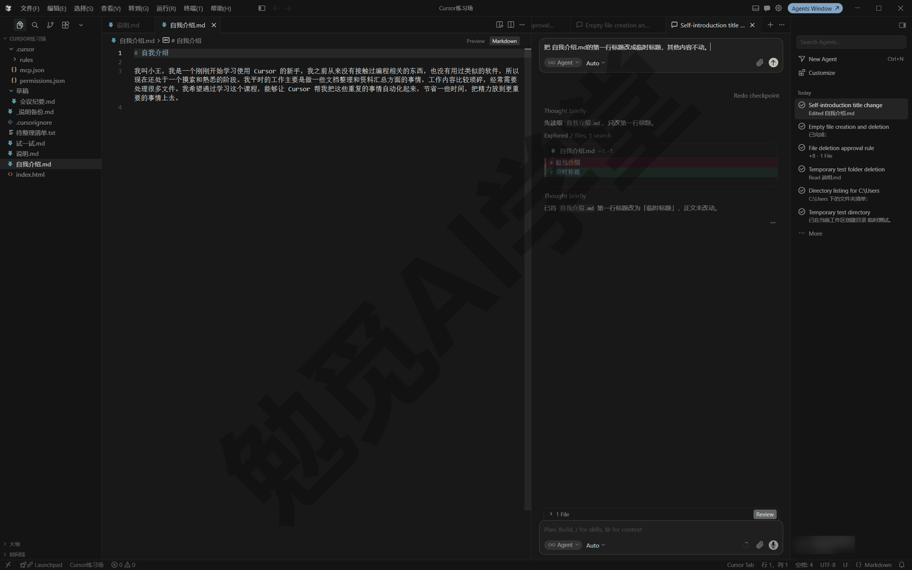

**要记住一点：它只还原文件，不删消息。** 还原检查点之后，对话记录一条不少地留着。好处是上下文还在，你可以接着指挥；但要注意，智能体并不自动知道你做了还原，它可能还按文件被改过的状态继续往下做。所以还原之后，建议先补一句“我已经还原到检查点，文件回到了改动之前”，再下新指令。

**检查点适合什么场景。** 官方给了三类典型场景：探索性的尝试（拿不准方案，先让它做一版看看效果）、复杂的多文件改动（一次牵动很多文件，出错概率高）、一小步一小步地反复改（一轮一轮试，随时可能想退回上一轮）。三类场景的共同点是“很可能要反悔”。反过来，如果你要的是“这一版定稿，永久存档”，那就不是检查点该做的事了，应该让它提交一次 Git。

**只想让文件回去，还是想让对话也回去？** 检查点只还原文件。如果你连对话都想回到早一点的状态（比如后半段跑偏了，想从中间某条消息重新开始），可以从那条消息分叉出一个新对话：对话记录会复制到分叉点为止，后面的内容不带走（《两套界面全导览》介绍过分叉的入口）。文件用检查点退，对话用分叉退，两个工具合起来才是完整的“回到过去”。

**检查点与 Git 的分工。** 两者都能“回到过去”，定位完全不同：

- **检查点**：自动创建、不用配置、保存在本地、只覆盖智能体改动涉及的文件，属于会话期间的临时后悔药；
- **Git**：需要你（或智能体替你）主动提交一次，形成永久的版本记录，可以回到任意历史节点，跨会话、跨设备有效，适合里程碑和长期保存。

官方的说法也是这么分的：检查点只用于撤销智能体的改动，永久的版本管理请用 Git。Git 是一套给文件做版本存档的工具，现在不必展开，《Git、GitHub 与代码审查》会从零讲起。

**检查点的边界与坑。** 三条都值得记住：

- 还原只对文件有效，不能撤销终端命令产生的副作用——已经装上的软件、已经发出去的网络请求，收不回来；
- 检查点保存在本地、只在这次对话期间有用，通常不会长期保存，别把它当备份用；
- 它记录的是智能体改动涉及的文件状态，不是整个磁盘的完整备份，你自己手动改的其他东西不归它管。

### 3.7 模型怎么选

打开模型选择器，你会看到 Auto 和一串具体模型名，新手常在这里犯难。先给结论：保持 Auto 就好。这一节讲机制，让你知道 Auto 背后发生了什么、什么时候值得手动换模型。本课不列模型清单、不谈价格数字——型号和价格更新得很快，一切以你界面和账号页面当天显示为准。

**Auto 是什么。** 选 Auto 时，Cursor 的路由系统（Cursor Router）会按每条请求的任务类型和复杂度自动挑模型：简单请求交给快而省的模型，复杂工作交给能力最强的。你不能指定它把请求分配给哪个模型，可选的模型也会随版本更新变化——你能控制的是优化方向。

**Auto 的三档优化方向。** 在模型选择器里选中 Auto 后，可以在优化目标（Optimize For）下选三档之一：

- **Cost**：沿用旧版 Auto 的分配方式，优先省用量——旧版的 Auto 大致相当于现在的 Cost 档；
- **Balance**：在智能、速度、成本三者之间取平衡；
- **Intelligence**：难任务尽量交给最强的模型，比你一直手选某个旗舰模型更省。

Balance 和 Intelligence 消耗用量比 Cost 快，三档随时可以切换。这套三档目前先在团队版开放，个人账号是否已经能看到，以你的界面为准；看不到时，你的 Auto 相当于原有的自动分配方式。

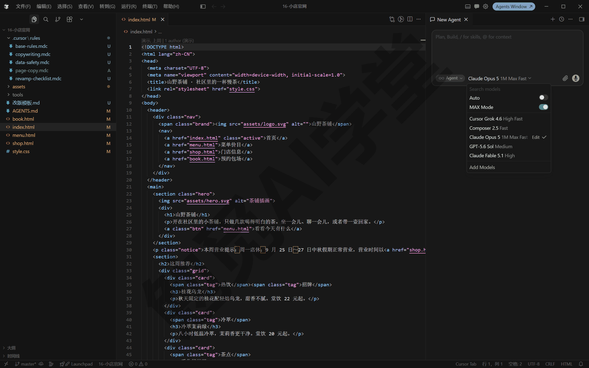

**自家模型池与第三方模型池的分工。** 付费套餐的用量分成两个池子。Cursor 自家训练或联合训练的模型走自家池，套餐里给的额度明显更充裕——比如 Composer 2.5，快、消耗低，应付日常修改和界面调整类任务足够用；Grok 4.6 是自家池里更强的一档。第三方前沿模型（各大模型厂商的旗舰）按各家的价格从另一个池子扣。所以有一个简单的分工：日常小任务用自家的快模型，复杂推理、跨很多文件的大改动再换更强的模型。具体某天有哪些型号可选，以模型选择器当天显示为准。

**怎么切换。** 有三个入口：

- 输入框顶部的模型选择器下拉，直接点选；
- 快捷键 Ctrl+/，在模型间轮换；
- 设置 → Models 里设定默认模型（分区中文文案以实际界面为准），以后新对话都从它开始。

对话中途切换模型，只影响之后的回答，前面的内容都还在。一个实用的节奏是：让快模型做完探索和小改，需要深度推理时切到强模型接着干。想直观感受差别，可以用同一个请求分别在快、强两个模型下各跑一次：

```text
先不要修改任何文件。通读这个工作区，用 200 字以内说明
每个文件的用途，并指出你认为最需要整理的一处。
```

观察两次回答在速度和分析深度上的差别，你对“什么任务配什么模型”就有了自己的判断。

**选模型的常见坑。** 频繁换模型解决不了需求没说清的问题——先把要求写明白（下一篇《对话与上下文管理》第一节就讲这个）；另外，切换模型不清空对话上下文，但不同模型的能力和风格不同，回答的详细程度和重点会有变化，是正常现象。

### 3.8 用量怎么花得值

用量的基本规则一句话就能说完：两个用量池，每月随你的账单周期重置，用不完不会累加到下个月。但“怎么花得值”有讲究，这一节讲机制和习惯，不涉及任何具体数字——数字一律以你的账号页面为准。

**在哪里看。** 日常在设置页的 Plan & Usage 分区就能看到两个用量池的消耗情况。想看明细，打开账号后台（dashboard）：套餐、按需费用和下次重置日期在支出页（Spending，中文文案以实际页面为准）；用量概况在总览页（Overview），按日的用量明细则在用量页（Usage）。建议养成每周看一眼支出页的习惯——用量问题都是慢慢攒出来的，早发现早调整。

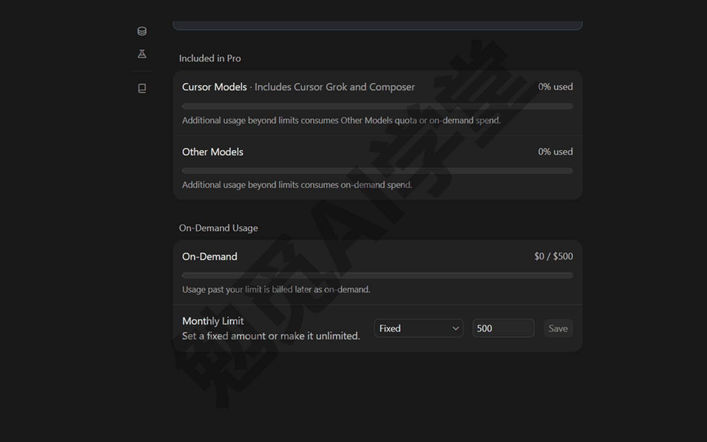

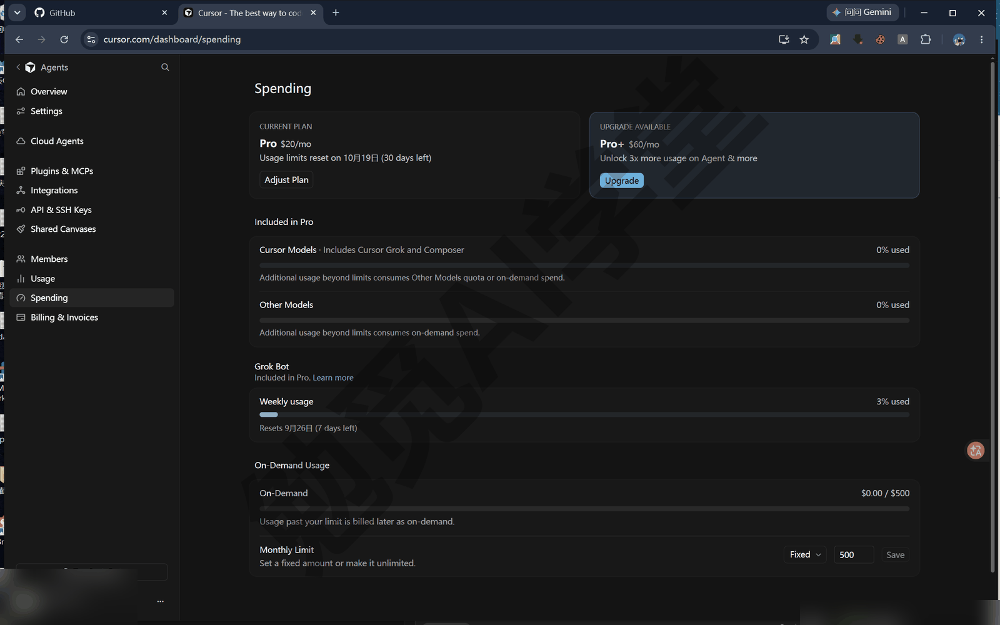

**什么任务消耗用量快。** 官方的说法是：你选什么模型，直接决定套餐里的用量消耗多快。在这个基础上，任务的形态也有很大影响。最典型的是很长的对话：模型每一轮回复都要把前面的上下文重新处理一遍，对话越长、每一轮就越贵——这也是下一篇《对话与上下文管理》反复强调一事一对话的原因之一。

其次是要调很多次工具的任务：大量搜索、反复跑命令、读很多文件，这些动作读到和写出来的内容都算进消耗，同样一个问题，“通读全部文件再回答”就比“直接回答”贵得多。

再往后是两类进阶用法：云端任务按模型价格计费，《云端智能体与手机端》会讲它怎么计费；多模型对比是同一个任务让几个模型各做一版再挑最好的（《子智能体、并行与工作树》会讲这种用法），相当于花几份的钱换一个挑最好的机会。这四类都不是不能用，而是用之前要清楚它们消耗得快。

**省用量的第一个习惯：换任务就开新对话。** 老对话攒下的长上下文每一轮都在重复消耗，任务已经换了、旧背景还挂在窗口里，用量花了还干扰新任务的判断。一个相对独立的任务用一个对话，做完就结束这个对话，这是不花钱的省用量办法，也是全课反复出现的习惯。

**第二个习惯：日常任务用自家模型池。** 3.7 节讲过，自家池的额度明显更充裕，Composer 2.5 这类快模型应付日常修改、整理和问答绰绰有余；把第三方旗舰模型留给真正需要深度推理的场合。两个池子各花各的，主力放在充裕的那个池，包含额度自然撑得更久。

**第三个习惯：大任务先想清楚再动手。** 最费用量的往往不是任务本身，而是方向错了反复返工——每一次“不对，重来”都是实打实的消耗。复杂任务先用计划模式把方案讨论定了再执行（《计划、提问与调试三模式》会讲：先出计划、你确认后再动手），一次做对，比三次返工便宜得多。

**用完了怎么办。** 达到套餐内额度时，编辑器里会收到提示，之后有两个选择：开启按需用量，按同样的费率继续用，官方明确说，请求不会变慢、回答也不会变差；或者升级套餐拿更多的包含额度。哪个划算取决于你的用法——偶尔超一点，按需更灵活；月月都超，直接升级更合适。具体价格与额度一律以账号页面显示为准。

### 3.9 隐私模式与忽略文件

安全讲完了“它能动什么”，最后讲“你的数据去哪了”。要用到两件工具：隐私模式决定代码会不会被拿去训练，忽略文件决定哪些文件根本不给 AI 看。

**隐私模式是什么。** 开启后，你的代码不会被 Cursor 或任何提供模型的公司拿去训练模型。要区分两件事：使用 AI 功能时，你的提示词和相关文件内容仍然会发送给提供模型的公司处理——不传这些，功能就没法工作；隐私模式保证的是这些数据“不被用于训练”。

**怎么确认它开着。** 分三步：

第 1 步：按 Ctrl+Shift+J 打开设置。

第 2 步：在侧栏选择 General（常规）分区。

第 3 步：确认 Privacy Mode（隐私模式）开关处于开启状态；没开的话点开它（开关中文文案以实际界面为准）。

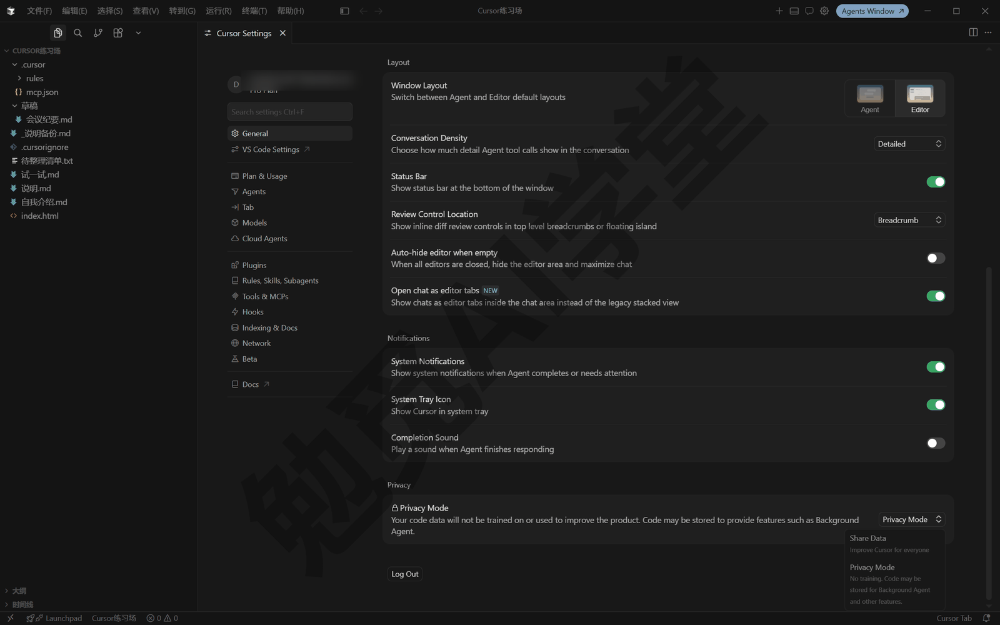

**Legacy 隐私模式：切过去就切不回来。** 有些较早的账号用的是一种叫隐私模式（Legacy）的旧版本：同样保证不用于训练，但它不允许 Cursor 在云端临时存储你的代码，因此云端智能体、手机端发起任务这类依赖云端存储的功能都用不了。官方明确说明，从 Legacy 切换到现在的隐私模式之后不能再切回去，没有反悔的余地。什么时候需要切？想用云端功能的时候，Cursor 会提示你切换。切之前要想清楚的是：你是否接受“运行任务期间代码临时存放在 Cursor 云端”这一层。你的账号当前是哪种隐私模式，以设置页显示为准。

**忽略文件 .cursorignore。** 有些文件你不想让 AI 看到——存密码的配置、账单、合同扫描件。做法是在工作区根目录新建一个名为 `.cursorignore` 的文件，一行写一个匹配模式。官方示例：

```text
node_modules/
dist/
*.min.js
.env*
```

看不懂这些模式没关系，规律很简单：写文件夹名加斜杠表示整个文件夹，`*` 是通配符，`*.min.js` 表示所有以 .min.js 结尾的文件。你也可以直接让智能体替你写：“帮我在工作区根目录建一个 .cursorignore，把‘私密资料’文件夹排除掉”。写好之后，被匹配的文件就不再进入 AI 的上下文，智能体读不到它们；你自己打开、编辑完全不受影响。

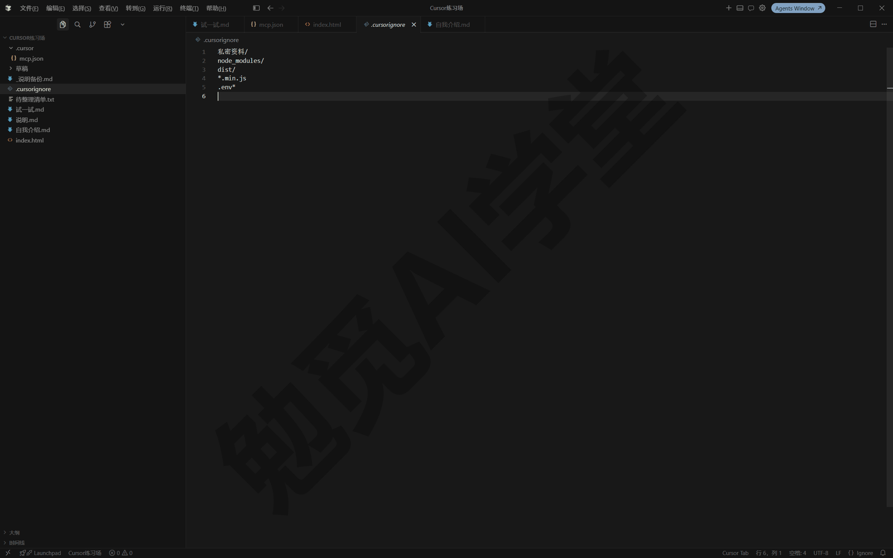

有三件事默认就做好了，不用你动手：

- **内置忽略**：Cursor 默认已经忽略 `.env` 文件（程序员常用来存密钥的文件）、`.git/` 文件夹和一些程序自动生成的记录文件。
- **沿用 Git 的忽略清单**：`.gitignore` 里写的内容对 Cursor 同样生效，不用再抄一遍。
- **其余的写进 `.cursorignore`**：前两条没管到的需求，由它补充。

**终端命令和 MCP 工具可能绕过它。** 官方文档明确提醒：Cursor 对文件读取的这套限制管不到终端命令和 MCP 工具，它们可能仍然读得到被忽略的文件。所以 `.cursorignore` 只能让它少读到这些文件，不能保证一定读不到——真正敏感的资料，最好根本不放进工作区，或者在需要时临时移出去。

### 3.10 三个练习任务

下面三个任务把本篇的关键机制各练一遍。方括号里的内容换成你自己的。

**任务一：触发一次分类器审批**

先到设置 → Agents → 审批与执行确认当前是自动审查档，然后发送：

```text
请用终端命令统计 [工作区之外的某个文件夹路径] 里有多少个文件，
把结果告诉我。
```

完成标准：看到这条命令被交给你审批（或被分类器处理）的过程；能用自己的话说出它为什么不能直接跑——因为要访问工作区之外的内容。

**任务二：写一条自然语言审批规则**

发送：

```text
帮我加一条审批规则：所有会删除文件的命令都必须先经过我确认。
写进当前工作区的 permissions.json，写完展示文件内容。
```

完成标准：工作区的 `.cursor` 文件夹里出现 `permissions.json`，内容包含这条规则；之后让它试删一个测试文件时，审批弹窗照样弹出（同时留意 3.4 节的文件删除保护也会起作用）。

**任务三：用检查点还原一次误改**

发送：

```text
把 [你的演示文件名] 的第一行标题改成“临时标题”，其他内容不动。
```

改完后，假装这是一次误改：悬停到改动前的消息上，用还原检查点把文件退回去，再打开文件确认标题恢复原样。

完成标准：文件内容回到修改前；对话消息一条没少；你补发了一句“已还原到检查点”告知智能体。

### 3.98 本篇小结与自检

这一篇建立了全课的安全地基：智能体看文件随便看、改工作区文件会立刻保存、越界动作要审批；运行模式三档决定放权程度，自动审查是推荐默认但不是安全边界；Windows 上没有文件系统沙盒，安全网是分类器加审批加三道保护；检查点是会话内的自动存档，永久记录靠 Git；模型上保持 Auto、分清两个用量池，就能兼顾效果和成本。

可以对照下面的清单检查学习结果：

- [ ] 能说出哪些操作免审批、哪些操作默认要审批
- [ ] 找到了设置 → Agents → 审批与执行，能说出三档运行模式的区别
- [ ] 能用一句话解释为什么“自动审查不是安全边界”
- [ ] 知道 Windows 上没有文件系统沙盒，能说出 Windows 用户的三层安全网
- [ ] 三道保护处于开启状态，并且知道它们各拦什么
- [ ] 成功让 Cursor 写过一条 permissions.json 审批规则
- [ ] 用检查点完成过一次还原，并知道它与 Git 的分工
- [ ] 知道模型选择器和 Ctrl+/ 在哪，能说出两个用量池的区别
- [ ] 确认过自己的隐私模式状态，知道 Legacy 切了就切不回去

完成这些内容后，你已经能放心地把任务交给智能体，也知道出了问题怎么收场。下一篇《对话与上下文管理》解决另一半问题：怎么把需求说明白、把材料附对，让它第一次就做对——地基打好了，接下来学怎么高效地对话。

### 3.99 新手常见问题

**Q1：自动审查会不会放行危险命令？**

有这个可能。分类器是一个小模型，两个方向的错都可能犯：放行你本想拦的，拦下你本想放的。所以官方明确说它不是安全边界。实际上有几层机制一起把风险压低了：三道保护独立兜底、删除和出工作区的写动作仍会确认、检查点和 Git 能回退文件改动。你要做的是保持三道保护开启，重要资料备份，对陌生来源的文件夹保持谨慎。

**Q2：Windows 没有沙盒，是不是比 macOS 更不安全？**

差别是真实存在的，但没有听起来那么大。macOS 和 Linux 上，一部分命令可以在沙盒里安全地运行，Cursor 不需要再向你确认；Windows 上这些命令会更多地交给分类器判断，或者弹出审批窗请你确认，也就是弹窗可能更频繁，而不是防线消失。文件层面的保护由三道开关负责。保持默认档位、三道保护全开、配合 Git，日常使用的安全性是足够的；不放心的操作，多看一眼审批弹窗再放行。

**Q3：全部运行档什么时候能用？**

它适合的场景很窄：一次性的实验文件夹、可以整个删掉重来的环境、里面没有任何敏感数据。比如你专门建了一个练习文件夹尝试各种功能，用它可以省掉全部弹窗。日常工作区、存着真实资料的文件夹，不建议用这一档——尤其在 Windows 上，3.3 节讲过，开它等于把三层保护里的两层（分类器和审批）都关掉。

**Q4：Auto 到底帮我选了哪个模型？**

路由系统按任务复杂度自动挑，界面上通常不逐条标注实际用了哪个模型（团队版有显示选项，个人账号以实际界面为准）。官方的设计意图是让你按结果评价回答，而不是按模型名。如果某个任务你明确想用某个模型，直接在模型选择器里手选它就是了，这比猜 Auto 会选什么更直接。

**Q5：用量用完了怎么办？**

编辑器会提示你达到了套餐内额度。有两个选择：开启按需用量，按同样费率继续用，速度和质量都不变；或者升级套餐。在那之前，先检查自己的习惯——是不是一个对话聊了太久、是不是所有任务都在用最强的模型。按 3.8 节的三个习惯调整，多数人的额度会比想象中耐用。具体数字以账号页面为准。
