## 对话与上下文管理

上一篇《权限、沙盒与模型》定下了安全边界：哪些动作智能体可以直接做、哪些要经你审批、出错怎么回退。这一篇解决效率问题：怎么把需求说明白、把材料附对、在它干活时正确地插话，以及看懂它的“记忆”是怎么被占用和压缩的。学完这一篇，你和智能体沟通起来会顺畅很多。

### 4.1 需求怎么说

很多新手的第一句话是“帮我把这个页面弄好看一点”，然后对结果失望。问题不在智能体，在于这句话里没有它能照着做的信息：什么算好看？能动哪里？做到什么程度算完？

**一条好需求的三要素。** 把每个请求分成三部分来写：

- **目标**：要做成什么，说到具体的东西上——改哪个文件、哪个部分、变成什么样；
- **约束**：范围和禁区——只动什么、不许动什么、有什么偏好；
- **验收**：做完后怎么检验——你会看什么、什么状态算合格。

对照一下。下面是一条含糊的说法：

```text
帮我把这个页面弄好看一点。
```

换成三要素齐全的说法：

```text
目标：把 index.html 顶部导航栏改成深绿色底、白色文字。
约束：只改样式，不改页面结构和文字内容；其他文件不动。
验收：刷新后导航是深绿底白字，窗口缩窄到手机宽度时不换行错位。
```

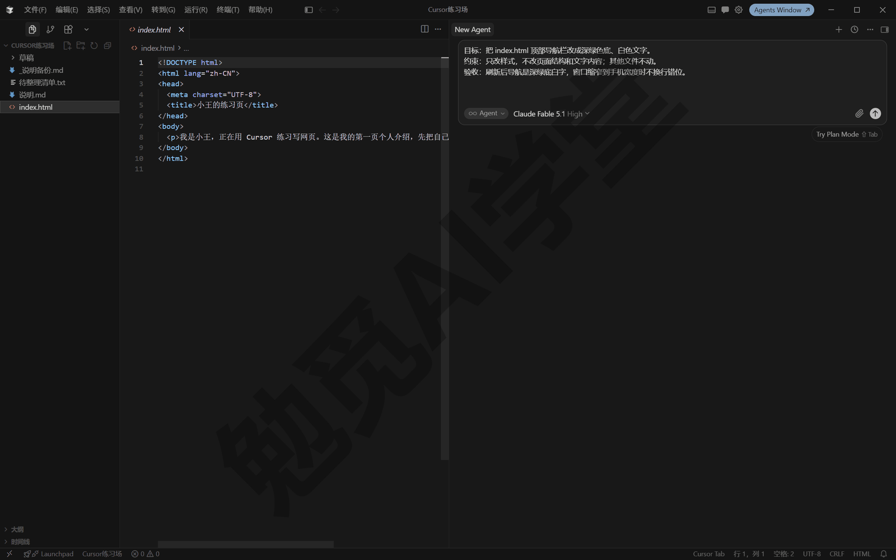

后一种写法并不是让你像程序员那样写代码，只是把你脑子里的期待写完整。三要素不必每次都用“目标／约束／验收”三个词打头，写熟了自然融进句子里；但刚开始建议照着这个格式写，缺哪块补哪块。

**再看一组办公场景的对照。** 含糊的说法是这样的：

```text
帮我整理一下这个文件夹。
```

三要素齐全的说法则是：

```text
目标：把“下载”文件夹里的文件按类型分进四个子文件夹：
文档、图片、安装包、其他。
约束：只移动，不重命名、不删除；子文件夹不存在就新建；
快捷方式不用动。
验收：整理完后“下载”根目录不再有零散文件，
发我一份各子文件夹的文件数量清单。
```

同一件事，第二种写法让它第一次就知道“快捷方式不动”“不许删”，省掉一来一回的纠错；最后那份数量清单，就是你花十秒钟核对结果的依据。

**验收怎么写才有用。** 写你真的会去检查的动作，而不是形容词。“页面美观大方”没法验收，“手机宽度下导航不换行、配色和标志一致”可以验收；“整理得干净”没法验收，“根目录不再有零散文件”可以验收。验收写得具体，它自检的方向就对，你检查起来也快——这个习惯会一直用到实战篇。

**先让它读，再让它改。** 面对一个智能体不熟悉的工作区，直接下修改指令，它可能改错地方。更稳的做法是第一步只让它看、不让它改：

```text
先不要改任何东西。读一遍这个工作区，说说它的结构，
以及如果要加一个“联系我们”页面，你打算怎么做。
```

等它讲完思路，你确认或纠正之后再让它动手。这个“先读后改”的习惯，其实是把大改动拆成“理解、确认、执行”三步，《计划、提问与调试三模式》里的计划模式会把这套思路做成正式功能，现在先用一句话版本。

**说需求的常见坑。** 一次塞太多件事——“改导航、加页面、顺便优化图片”混在一条消息里，出错了都不知道是哪步错的；建议一条消息一件事，多件事排队发（4.4 节会讲队列）。另一个坑是没把不许动的东西写全——你没说不能动的，它就可能动；重要禁区明确写进约束里。

### 4.2 @ 上下文全家

智能体自己会搜索工作区找相关文件，多数时候你什么都不用指定。但当你明确知道这个任务和哪几个文件有关时，直接点名比让它自己找更快、更准，也更省用量。点名的工具就是 @。

在输入框输入 `@`，会弹出一个菜单，继续打字可以缩小范围。菜单里能引用的内容不止文件，官方文档把它们分成五类，下面逐个介绍。

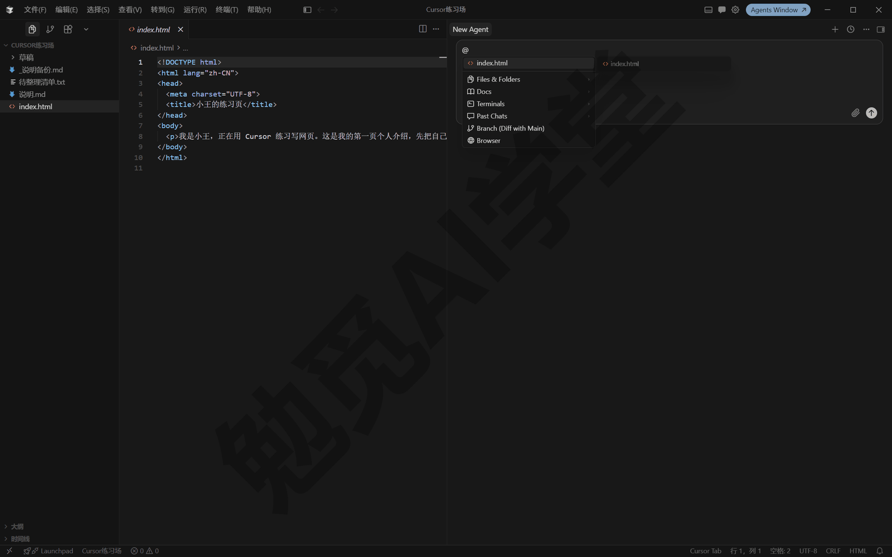

**文件与文件夹。** 最常用的一类。输入 `@` 后打文件名的一部分，从列表里选中即可把这个文件附进对话；选文件夹则是把整个文件夹都交给它参考。有一个进阶技巧：选中一个文件夹后紧接着输入 `/`，列表会进入这个文件夹的下一级，可以一层一层往下找到深处的文件，不用记完整路径。一条消息里可以多次 `@`，把要对照的几个文件一起点名。

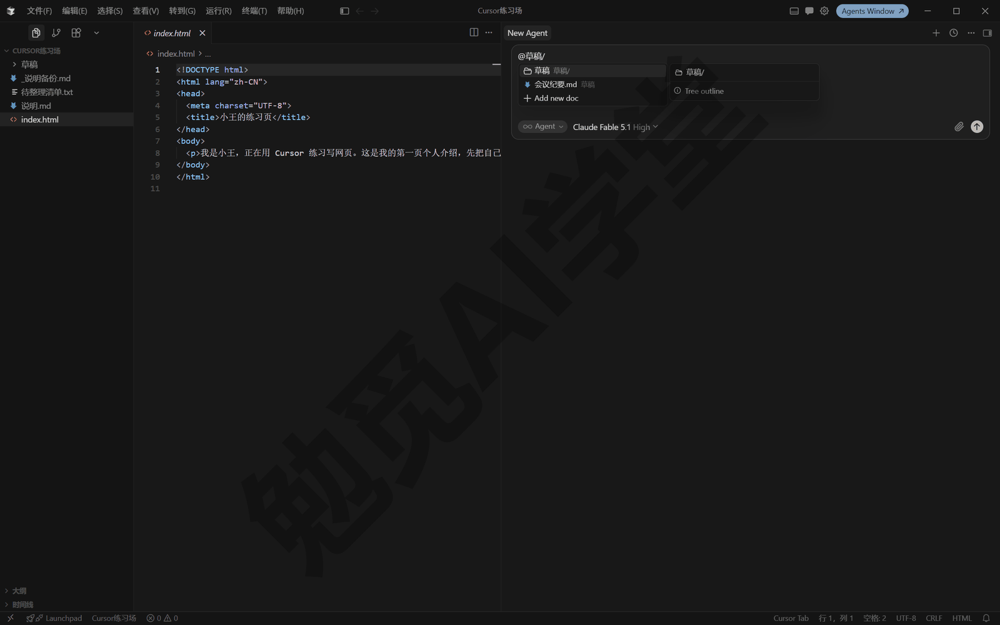

**@Terminals。** 把终端的输出内容附进对话。典型的场景是：你在终端里跑了个命令报了错，不用手动复制那一大段红字，`@Terminals` 一下，报错原文就进了上下文，让它直接分析。

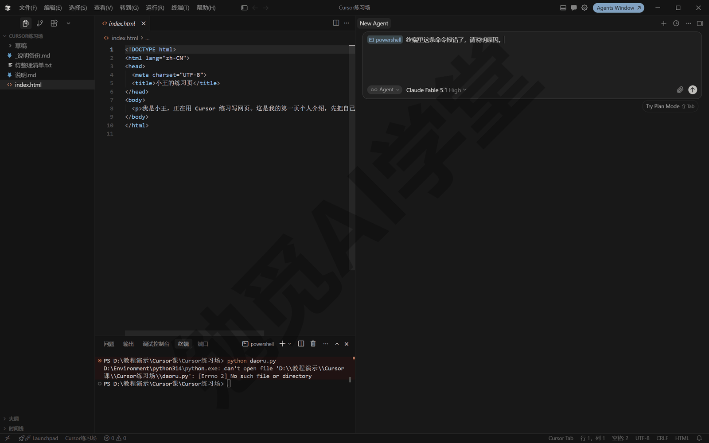

**@Chats。** 引用过去某个对话的上下文。比如上周你和它讨论过一版方案，今天开了新对话想接着用，`@Chats` 选中那个对话，结论就带过来了，不用重新解释一遍背景。

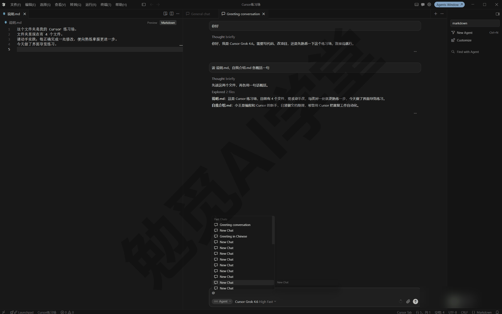

**@Commit 与 @Branch。** 这两个和 Git 有关，不用 Git 的读者只需要知道：Git 会记录你的文件改动，“差异”就是一份“改了哪些行”的清单。@Commit（Diff of Working State）附上的是当前还没提交的改动差异，@Branch（Diff with Main）附上的是当前分支相对主分支的全部差异。分支、提交这些概念《Git、GitHub 与代码审查》会从零讲，现在只需要记两句：想让它“检查我刚才改的东西”，用 @Commit；想让它“总结我这一阶段全部的改动”，用 @Branch。不用 Git 的工作区，这两项用不上，跳过即可。

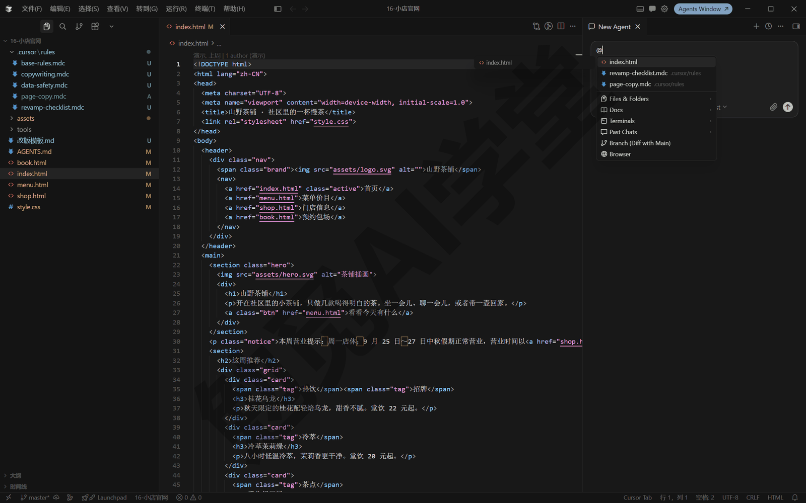

**@Browser。** 把内置浏览器当前的页面状态附进对话。智能体自带一个能打开网页的浏览器（《内置浏览器与设计模式》会专门讲它），当它开着某个页面时，`@Browser` 可以让对话直接引用页面内容，典型用法是“看看现在页面这个样子，把布局问题修了”。

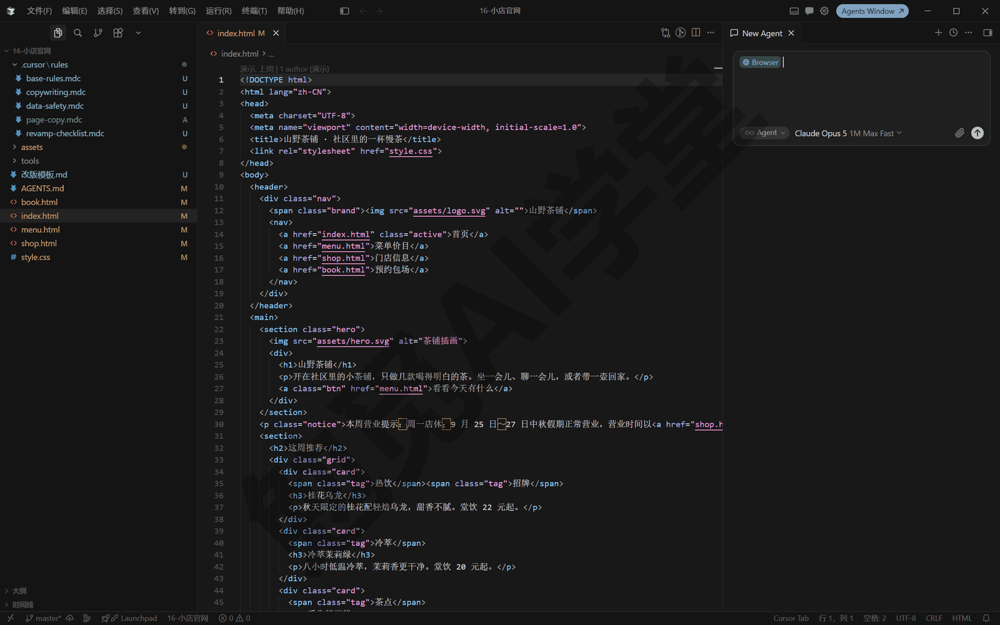

**什么时候不用 @。** 官方的建议很直接：不确定哪些文件相关，就别 @，让智能体用自己的搜索去找。乱点名有两个代价，点错了会把它带偏，附上大文件夹会立刻占掉一大截上下文空间（4.5 节你会亲眼看到这个占用）。总结成一条：知道相关的是哪几个文件就点名，不知道就交给它自己搜。

### 4.3 图片与语音

除了打字，输入还有两种方式：图片和语音。别小看它们——报错排查和长需求描述这两个最常见的场景，恰好各有一种最合适的方式。

**图片进对话的三种方式。** 各有各的用处：

- 拖拽：把图片文件直接拖进输入框。适合已经存在电脑里的图——设计稿、产品照片、别人发来的示意图，工作区内外的文件都可以拖；
- 粘贴：截图后回到输入框按 Ctrl+V。适合“现在屏幕上这个样子”——报错弹窗、显示异常，配合系统截图快捷键 Win+Shift+S 框选，截完直接粘贴进来，是三种方式里最快的；
- 点名工作区里的图：图片本来就在工作区里时，直接在消息里 @ 它，或者说“看一下 assets 文件夹里那张头图”——这一种靠的是它读文件的能力，图片文件同样读得懂。

三种方式的结果一样：图片作为上下文附在消息里，能看图的模型直接看懂内容。一条消息可以附多张图，数量上限以实际界面为准。

**把一次报错发给它，完整走一遍。** 以最常见的“运行时弹出一条报错”为例：

第 1 步：按 Win+Shift+S，框选报错区域截图。只框报错部分，不要截整个屏幕——画面越集中在报错上，它读得越准。

第 2 步：点击 Cursor 的输入框，按 Ctrl+V 粘贴。输入框上方出现缩略图，说明图片已经附在这条消息里了。

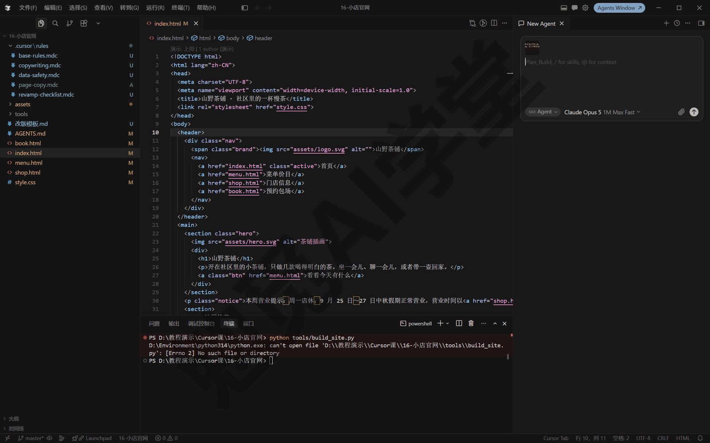

第 3 步：配一句话说明，再发送。只发图不说话，它要猜你的意图；一句话把目标说清：

```text
这是刚才运行时弹出的报错截图。请说明错误原因，
并直接修复对应的文件。
```

第 4 步：看它的回复。它一般会先复述从图里读到的错误内容，再定位到出错的文件动手修。如果它复述的错误信息和你截图里的一致，说明图读对了；对不上，就把报错文字放大重截一张再发。

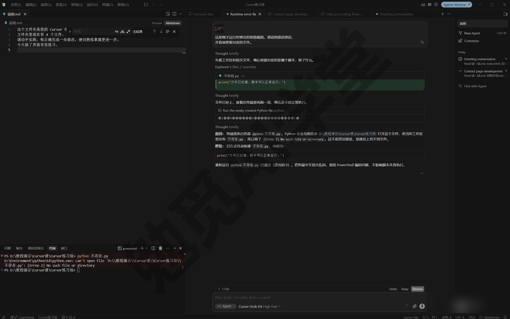

除了报错，图片还有两类很有用的用法：

- 把参考设计图贴给它照着做——“做成这张图的布局”比三段文字描述都准；
- 把显示异常的界面截图发给它对照修改，配一句“红框圈出的地方间距不对”。

**语音：什么时候比打字强。** 输入框里有麦克风图标，点击后直接说话，Cursor 会把语音转成文字。它适合三类场景：需求很长、想到哪说到哪的口述——说三分钟比打十分钟字快；手不在键盘上的时候——站着讨论、边看资料边交代；以及把口头讨论的结论顺手转成任务，不用回头再整理。官方的建议是自然地说，把文件名、功能名这类关键信息说清楚，发送前检查一遍转成的文字。这些文字落在输入框里，和手打的一样可以修改。

**识别不准怎么办。** 转成的文字发送前可以修改，所以“识别不准”本身不是大问题，重点是发之前先核对一遍。有几个实用做法：发送前重点核对文件名、数字和中英混杂的词，错得最多的就是这三类，改两个字再发；专有名词密集的需求，先口述大意，再手动补上关键名词，比逐字纠正快；一口气说太长容易越转越偏，超过一分钟的内容拆成两段说；实在不放心，发送后补一句“先复述一下你理解的需求，确认后再动手”，在它动手之前把理解上的偏差纠正过来。对中文口述的识别效果以实际表现为准。

**截图和语音都会把内容原样送进上下文。** 截图里如果带着账号、邮箱等个人信息，先裁掉或打码再发；语音口述时，也不要把密码这类内容念出来。

### 4.4 它干活时怎么插话

任务跑起来之后，你常会想补一句——“对了，按钮文字统一用这个”“方向错了，停”。什么时候插话、用哪种方式插，直接影响任务质量。Cursor 给了三种插话方式加一个停止按钮，各有各的时机。

**方式一：排队（Enter）。** 智能体工作时，你照常输入下一条消息，按 Enter，消息不会打断它，而是进入队列，显示在当前任务下方；当前任务做完后，队列里的消息按顺序依次处理。队列里的消息可以拖动调整先后。适合不着急的补充：新想到的下一步、做完再改的细节。

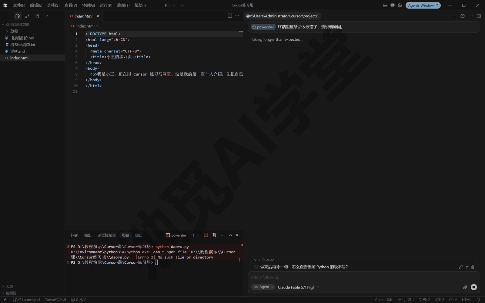

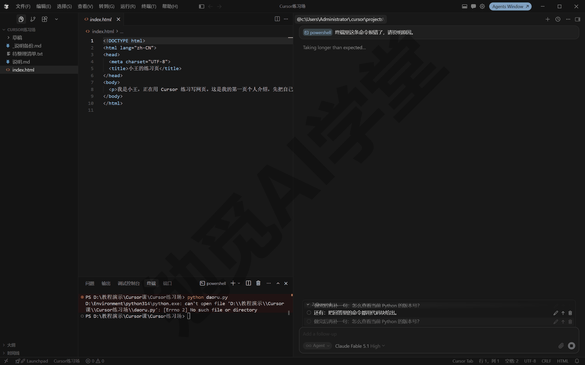

**排队的进阶用法：把一串小事排成小流水线。** 4.1 节讲过一条消息一件事，复杂任务与其塞成一大条，不如拆成几条排队消息：第一条“先把页面结构搭出来”，第二条“配色换成深绿色系”，第三条“最后检查手机宽度下的显示”。它做完一件领一件，每一步的结果你都看得到，中途发现不对，还可以调整队列里后面的消息。临时来了急事，把那条消息拖到队列最前面就行。

**方式二：立即发送（Ctrl+Enter）。** 输入消息后按 Ctrl+Enter，跳过队列马上生效——你的补充会并入最近一条消息立即处理，当前这轮直接把你的话算进去。适合急事：发现它理解偏了、需求本身要改。

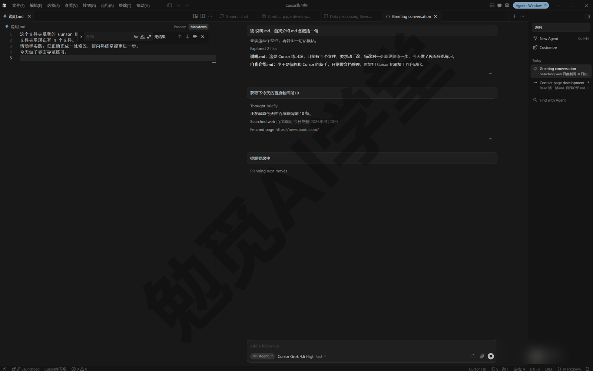

**方式三：不打断地引导（Send now）。** 这种方式在前两种之间：消息在智能体下一次调用工具的间隙送到——不像排队那样要等全部做完，也不像立即发送那样会打断它，进行中的动作会完整收尾，你的引导在下一步自然生效。操作上是输入后点 Send now 按钮，或连按两次 Enter；按 Tab 则改为转入队列。这个能力目前在网页版已可用，代理窗口正在分批开放，你的界面上是否可用、按钮是什么样子，以实际表现为准。另外，这项功能的两个发送选项的文字是 Send After Current Message 与 Send Right Away（分别对应排队和立即发送），实际菜单以界面显示为准。

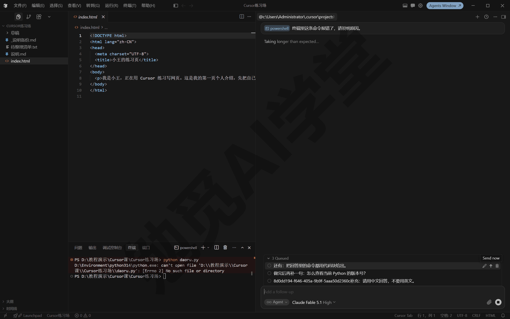

**停止：Stop。** 方向完全错了就别引导了，点 Stop 按钮停掉当前任务。要注意，停止不会撤销已经做出的改动，所以按下 Stop 之后的标准动作有三步：先在差异视图里确认它已经改了哪些文件；需要回退就用检查点还原（《权限、沙盒与模型》讲过它的用法：还原文件、不删消息）；最后把需求整理清楚重新发。Stop 的定位是“停下来重新指挥”，不是“撤销一切”，这一点要先想清楚。

**怎么选。** 小补充用排队；纠正方向用立即发送或 Send now；推倒重来用 Stop。一个反面习惯是每隔十几秒就插一句——频繁打断会把任务打得零零碎碎，攒一攒、一次说清，比零敲碎打有效。还有一个容易忽略的事实：每条排队消息、每次引导本身也都会进入上下文窗口（4.5 节里马上会讲它的容量限制），所以“攒一攒再说”既是节奏建议，也是用量建议。

试一次就清楚了。趁它跑着一个任务时输入：

```text
补充：所有按钮文字统一用“立即预约”，不要用“马上预约”。
```

分别用 Enter 和 Ctrl+Enter 发送，观察消息一个进了队列、一个立刻生效的差别。

### 4.5 上下文窗口与用量环

用得久了你一定会遇到这个现象：聊着聊着，它把前面说好的要求忘了。这不是故障，是上下文窗口的硬性限制。这一节讲清楚这个限制怎么运作、怎么看、怎么管。

**上下文窗口是什么。** 你可以把上下文窗口理解成模型的短期记忆容量：每个对话有一块固定大小的空间，你发的消息、它的回复、读过的文件、工具运行的结果，全都要装进去模型才看得到。空间按 token 计——token 是模型处理文字的计量单位，你只需要知道内容越多占得越多。装满了怎么办？Cursor 会把较早的对话内容压缩成摘要，腾出地方装新内容。压缩意味着细节丢失——“忘了前面说的”多半就是发生了压缩，或者窗口已经装满。

**用量环：一眼看用了多少。** 输入框旁边有一个小圆环，显示当前上下文窗口用了多少。平时看一眼就行：环快满时，就该考虑收尾或开新对话了。

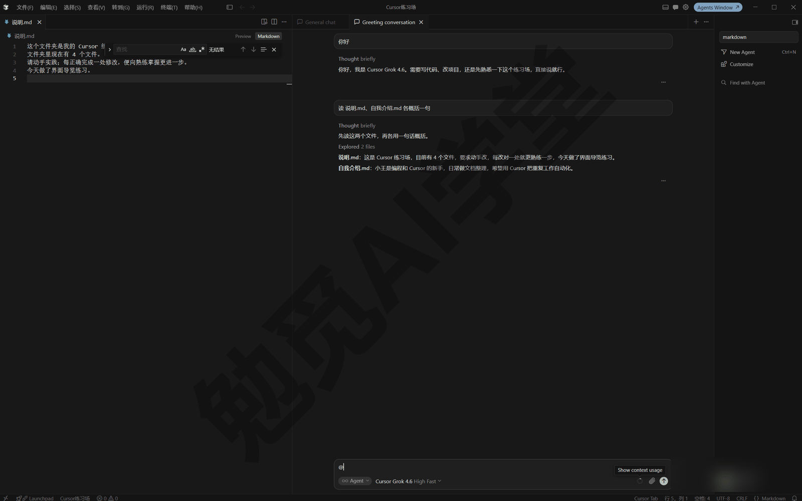

**分解托盘：看清都被谁占了。** 点击圆环会展开分解托盘，把总占用按八个类别拆开，鼠标悬停在色段或列表行上会高亮对应类别（类别的中文文案以实际界面为准）。八个类别可以分成三组来理解。

第一组是出厂自带的部分，你管不了也不用管：

- **系统提示**：Cursor 给模型的内置说明书，交代模型的身份和做事方式，每个对话都自带。
- **工具**：智能体可用的每个工具的定义说明，也就是告诉模型每个工具叫什么、能做什么；可用的工具越多，这一块占得越大。

第二组是你配置出来的部分，它们的大小直接由你的取舍决定：

- **规则**：每次对话开头自动附上的固定要求，比如“始终用中文回复”（《规则与 AGENTS.md》会专门讲）。
- **技能**：可复用的“做法说明书”的简介，装的技能越多，这一块越大（《技能与自定义模式》会专门讲）。
- **MCP**：外接工具的说明与目录。MCP 是让智能体连接外部工具和数据的标准方式，上一篇《权限、沙盒与模型》讲审批时提过它（《插件、市场与 MCP》会专门讲）。
- **子智能体**：可以派出去的帮手的说明文档。子智能体是主对话派出去独立干活的 AI（《子智能体、并行与工作树》会专门讲）。

这一组每启用一项，都要固定花掉一块空间，这就是“不用的东西别一股脑全装上”的原因。

第三组是对话本身：

- **对话**：你和它来回的消息本身，加上工具运行的结果（读到的文件内容、命令输出都算在内），通常是占用的大头。
- **摘要**：被压缩的早期对话。看到这一块出现并且变大，说明压缩已经发生过了。

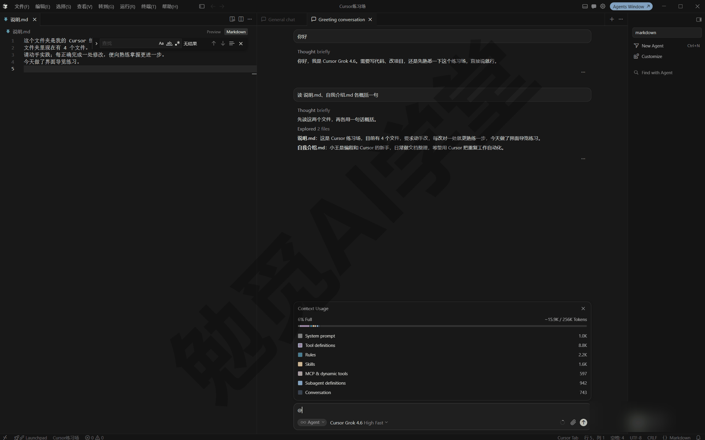

看一次托盘就能发现：新对话不是从零开始的——前两组先占掉一块，剩下的才是给对话用的空间。所以规则要少而精、MCP 不要装一堆不用的：它们都在持续占地方。

**自动压缩。** 窗口接近满时，Cursor 自动把较早的对话压缩成摘要，过程不需要你操作。压缩后早期细节不再完整——如果某个要求很重要，压缩后感觉它开始跑偏，就把要求再说一遍；反复要用的要求，写进规则一劳永逸（见《规则与 AGENTS.md》）。压缩发生后，最可靠的判断办法是看用量环明细里有没有出现“摘要”一项（本节前面讲过）；界面上另有什么提示，以实际看到的为准。

**三个管理习惯。** 比起在压缩机制上花心思，更有效的是养成习惯：

- 一事一对话：一个相对独立的任务用一个对话，做完就结束这个对话；
- 换任务开新对话：别在一个对话里从改网页聊到理账单——旧上下文既占空间又干扰新任务，还费用量（《权限、沙盒与模型》讲省用量的三个习惯时讲过，长对话每轮都在重复消耗）；
- 切模式等于换新窗口：Agent、Ask、Plan、Debug 各模式的上下文是独立的，切换模式会开一个新的上下文窗口，之前模式里聊的内容不会自动跟过来。别指望切个模式还能接着上文聊，重要背景带过去重说；四种模式本身《计划、提问与调试三模式》会专门讲。

### 4.6 侧聊与历史对话

**侧聊：旁边问一句，不打断主线。** 3.7.42 版还没有 `/side`，输入框里打出来不会开侧聊，Ask in Side Chat 与 Shift+Ctrl+S 也找不到；下面按官方文档介绍，你的版本有没有以实际界面为准。主线任务跑得好好的，你突然想问个概念——“检查点到底和 Git 什么区别？”直接在主对话里问，一来打断节奏，二来这段问答会永久占着主线的上下文。侧聊就是为这种时刻准备的：一个挂在主对话旁边的子对话，主线的对话历史会悄悄给它当参考背景（不会显示在侧聊记录里），所以它知道你们聊到哪了；但侧聊里的问答不进主线记录，主线智能体继续干活不受影响。默认情况下，侧聊偏向读取、搜索和回答，不去动文件。

**三类典型用法**，你可以对号入座：

- **问概念**——任务里冒出一个不懂的词，开侧聊问清楚，主线不停；
- **审内容**——选中它刚写的一段文字或一处差异，直接在侧聊里让它解释“这段改动做了什么、有没有问题”，对还看不太懂改动的新手特别有用；
- **评估另一个方案**——主线在做方案 A，你想顺便评估方案 B 可不可行，在侧聊里聊透了，再决定要不要把结论带回主线。

三类的共同点是：问答有价值，但不值得让主线为它停下来。

它有三种打开方式：

- 在输入框输入 `/side`，直接回车打开一个空侧聊；也可以在 `/side` 后面直接接问题，一步到位：

```text
/side 用大白话解释一下“上下文窗口”，两三句话就够。
```

- 在对话里选中一段文字或差异内容，从选择菜单里点 Ask in Side Chat（在侧聊中提问，中文文案以实际界面为准），带着选中内容开侧聊；
- 快捷键 Shift+Ctrl+S，把当前选中的内容带进新侧聊。

**把侧聊的结论拉回主线。** 侧聊里问明白了，主线想用这个结论？在主对话里 `@` 这个侧聊，Cursor 会把侧聊的上下文拉进主线，接着往下推进。

**侧聊的几条边界。** 下面几条都来自官方说明：

| 边界 | 说明 |
|---|---|
| 可以连续追问 | 侧聊是一个完整的、会一直保留的对话，问完一个还能接着问，不用每次重开 |
| 关闭等于归档 | 点侧聊上的关闭按钮是归档而不是删除，之后还能找回来接着看 |
| 不能嵌套 | 侧聊里不能再开自己的侧聊 |
| 和分叉不是一回事 | 分叉是把主线记录复制出一份新对话，两边从此各走各的；侧聊只把主线当隐藏参考，不复制记录 |
| 只在本地对话可用 | 目前云端智能体暂不支持侧聊，以实际界面为准 |

**历史对话：用搜索找，别逐个翻。** 对话攒多了，想找“上个月那个方案聊在哪”，逐个点开翻效率太低。有两个搜索入口：

- 跨对话搜：在代理窗口侧栏顶部的搜索框（Search Agents）里输入关键词，直接搜过去的对话记录（官方文档给的快捷键 Ctrl+K 在 3.7.42 版上没有反应）。搜索是在你自己的电脑上完成的，官方说可以支撑到几千条对话的规模；
- 对话内搜：打开某个对话后按 Ctrl+F，输入关键词，就能在长记录里一处一处跳到搜到的位置。

搜索关键词有个小技巧：用当时对话里出现过的具体词——文件名、功能名、报错里的关键字——比“上次那个改网页的”这类模糊描述更容易搜到。

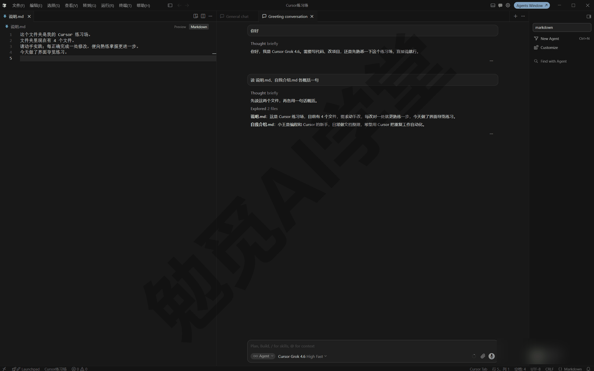

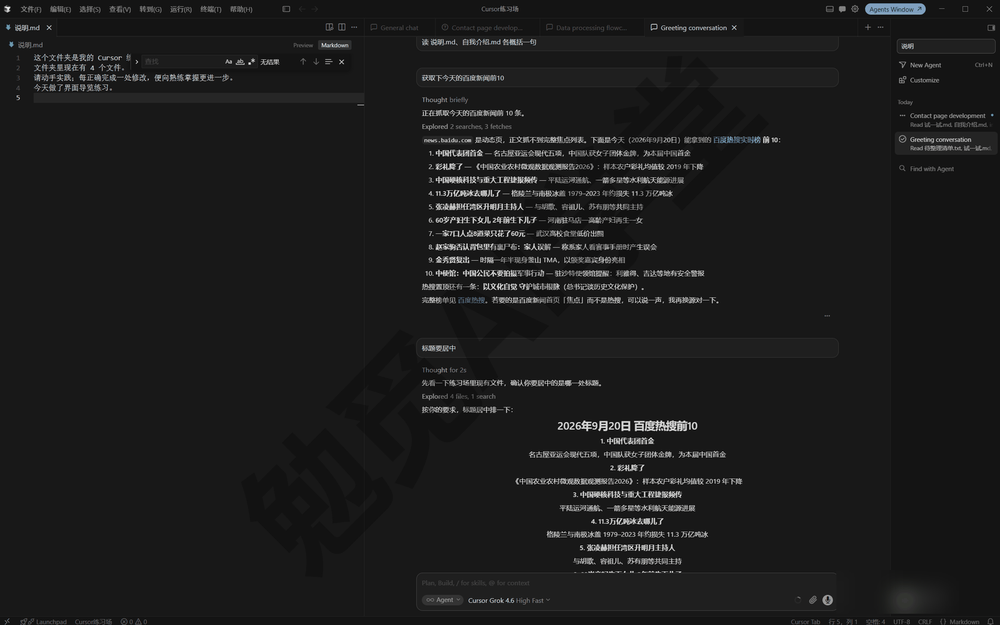

另外，智能体自己也能搜历史对话：对话搜索同时是它的一个工具，需要过去聊过的背景时，它可以自己去查，你不必记得那是哪个对话。配合 4.2 节的 @Chats（你主动指定引用哪个对话），你主动点名和它自己去搜，两种方式都可以。

### 4.7 长目标 /goal

对智能体来说，普通消息是“一份新差事”：做完这条消息交代的事，任务就结束了。但有些事不是一条消息能收尾的——“把工作区里所有文档的错别字清完”这种任务，做完一批还有一批。/goal 就是给这类事用的：给智能体一个长期目标，它会持续朝着目标干，直到确认全部完成。

**/goal 怎么用。** 在输入框输入 `/goal`，后面接目标描述：

```text
/goal 把这个工作区里所有 md 文件的错别字改完，
直到每个文件都检查过、没有遗漏为止。
```

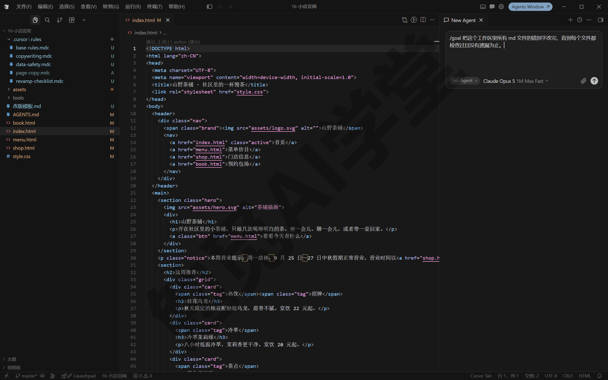

**和普通消息的区别** 就一条：普通消息做完就结束，/goal 会让它自己检查“目标到了没有”，没到就继续。所以写目标时要说清什么样算完成——“每个文件都检查过、没有遗漏”就说得清；“把文档弄得更好”就说不清，它会不知道什么时候该停。

**什么样的事适合交给 /goal。** 判断标准有两条：

- **工作量天然分批**：批量清错别字、给一批文件逐个补说明、把所有页面的旧标志换成新版，这类“做完一批还有一批”的事，用普通消息要你盯着发好几轮，/goal 让它自己一批一批往下做。
- **做完没做完看得出来**：检查过没有、还剩几个、清单是否清空。

两条都满足，就值得用。反过来，一次性的小修改用普通消息更直接；“持续保持文档整洁”这类没有终点的要求，写成规则更合适——规则是每次对话自动生效的固定要求（《规则与 AGENTS.md》会专门讲），目标是有完成时刻的任务，两者别混用。

**写好目标的三个要点。** 三点都要写进目标里：

- **范围要说准**：写明在哪个文件夹、哪类文件里做，别让它自己猜边界。
- **完成条件要说得清**：写成“直到……为止”的形式，让它做完能拿着这句话自查。
- **边界要给足**：写明不许动什么、遇到拿不准的怎么办，比如加一句“拿不准的改动先列出来问我”。

目标写得越像一张验收单，它跑偏的空间就越小。

**/goal 有两个搭配**，官方文档专门提到：和内置技能 /loop 搭配——/loop 会让智能体每隔一段时间回头检查一件事，适合“边推进边定期核对”的目标；和自定义模式搭配——让它在追目标的全程保持某套固定的工作方法。技能和自定义模式都是《技能与自定义模式》的内容，这里知道有这两个搭配就够。另外，命令行版的 Cursor 里可以用 Ctrl+C 暂停正在推进的目标，命令行的用法《自动化、钩子与命令行》再讲。

**/goal 的边界与提醒。** /goal 正在分批开放：如果 / 菜单里看不到它，可能还没轮到你的账号，可以在新对话里再试一次，或等版本更新，以实际界面为准。另外，长目标意味着长时间的连续工作，用量消耗会比单条消息大得多（《权限、沙盒与模型》讲过什么任务消耗快：连续工作、工具调用密集的任务是消耗大户），第一次用建议给个小目标试水。中途想停，用 Stop 中止当前运行；目标本身的取消方式以实际界面为准。

### 4.8 它问你、它画图

最后讲两个输入框之外的互动：它主动问你，和它替你画图。

**提问工具：它中途问你时，怎么答。** 任务进行中，智能体遇到拿不准的选择——“预约表单要不要带电话字段？”——它可以主动向你提问。这个机制有个好处：等你回答的同时，它不会停下，会继续读文件、改代码、跑命令，把不依赖这个答案的部分先推进；你的回答一到，马上就用到任务里。提问会变成一张问题卡片出现在对话里，直接在输入框里回复就行（形态以实际界面为准）。

回答的技巧只有一条：给决定，带一句理由。“要电话字段，方便店主回访”比单说“要”更好——理由能帮它把相关细节也一起考虑到。长时间不回答时，它可能带着合理假设先往下走，回来看到问题尽早补答，以实际表现为准。

**提问的频率，你可以自己调。** 这个机制的用处是把关键决定留在你手里：表单收不收电话、配色跟哪个页面走，这类决定猜错了就是返工。如果你希望它多问，就在需求里写一句“拿不准的地方先问我，不要自行假设”；反过来，觉得它问得太多，多半说明约束给得少——把 4.1 节三要素里的约束写全，问题自然就少了。

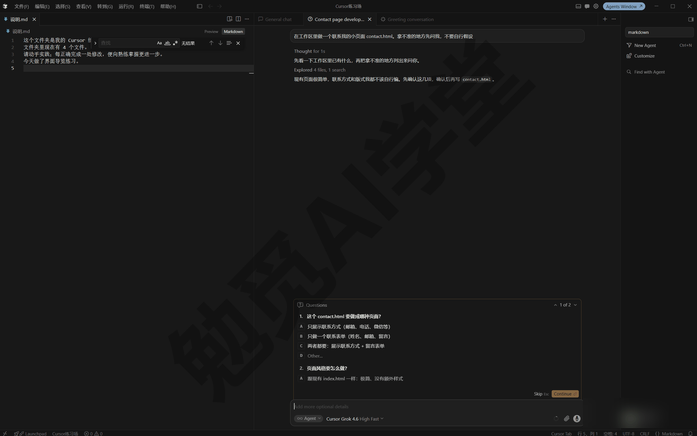

**图像生成：让它画示意图。** 智能体可以根据文字描述或参考图直接生成图片，生成的图默认保存在工作区的 assets 文件夹里，并且直接显示在对话里。适合三类用途：界面草图（先看个样子再动手做）、示意图（讲流程、讲结构）、素材图（给网页配个头图）。试一次：

```text
帮我生成一张流程示意图：从“导出账单”到“清洗数据”再到
“生成月报”，三个步骤用箭头相连，风格简洁干净。
```

发送后你会在对话里看到生成的图片，工作区里多出一个 assets 文件夹（如果之前没有的话），图片文件就在里面。

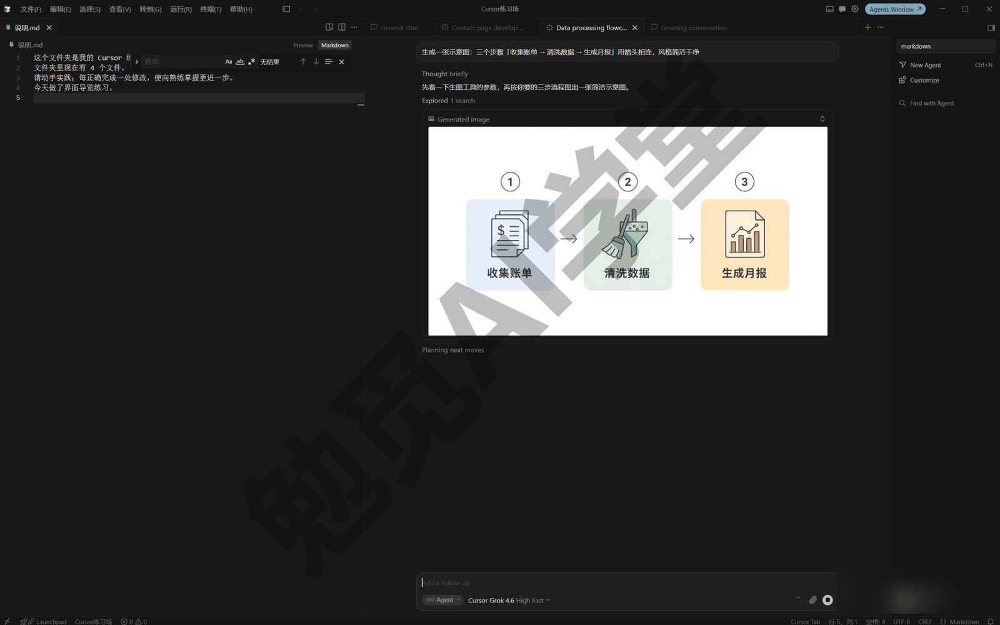

**生成之后还能接着调。** 一次不满意可以直接再要一版——同一个对话里它记得你之前的描述，只说改动点就行，比如“基于刚才那张，把箭头改成从左到右”；它也支持拿参考图生成，把你手里的图和文字描述一起给它，新图会尽量沿用参考图的构图和风格，效果以实际表现为准。另外，生成的图就是工作区里的普通文件，你可以在资源管理器里查看、复制，也可以让它把图挪到别的文件夹或改名。如果你在做网页，assets 文件夹里的图还能直接被页面引用：接一句“把刚生成的这张图放进首页顶部”，它会修改首页文件，在顶部加上引用这张图的代码，路径指向 assets 文件夹里的那个文件；刷新页面，图就出现在页面顶部了。也就是说，从生成一张图到把它用进页面，都在同一个对话里完成，中间不需要你自己复制文件或改路径。

**生成图的边界。** 生成图适合示意和素材：画面里需要出现精确文字时，效果通常不稳定，重要的文字建议生成后用图片工具补加；需要精确数据图表（比如按真实数据画柱状图）时，更可靠的做法是让它写代码出图，这属于《文件与办公能力一篇讲全》的内容。

### 4.9 三个练习任务

下面三个任务把本篇的核心做法各练一遍。方括号里的内容换成你自己的。

**任务一：用 @ 点名两个文件对照修改**

准备两个内容相关的文件（比如一个网页和一份价目表），发送：

```text
@[文件A] @[文件B] 对照这两个文件，找出内容不一致的地方，
以 [文件A] 为准修改 [文件B]，改完列出你改了哪几处。
```

完成标准：两个文件都被正确附进了对话（输入框上方能看到两个引用标记）；它列出的不一致处与你自己核对的一致；修改只发生在 [文件B]。

**任务二：截一张报错图让它修**

制造或找一个报错场景（比如让它运行一个会出错的命令），把报错画面截图，Ctrl+V 粘贴进输入框，发送：

```text
这是我遇到的报错截图。请解释出错原因，修复对应的文件，
改完告诉我你改了哪里。
```

完成标准：它准确读出了截图里的错误信息；给出的解释你能听懂；修复后重试不再报同样的错。

**任务三：开一个侧聊问概念，再拉回主线**

在一个正在推进任务的对话里发送：

```text
/side 用大白话解释一下“检查点”和 Git 的区别，
各在什么时候用。
```

在侧聊里追问一句你没听懂的地方，然后回到主线，用 @ 引用这个侧聊，让主线“按侧聊里的结论，在 README（项目根目录那份说明文件）里补一段说明”。

完成标准：主线任务没有被打断；侧聊里完成了至少一轮追问；主线成功引用了侧聊内容并完成后续动作。（你的版本里打 `/side` 没有反应，就跳过这一题——4.6 里说过 3.7.42 版还没有这个命令。）

### 4.98 本篇小结与自检

这一篇解决了“怎么说、怎么提供材料、怎么管记忆”：需求按目标、约束、验收三要素说；材料能点名就用 @ 点名，不确定就放手让它搜；插话分排队、立即发送、不打断引导三种；上下文窗口有限，用量环和分解托盘随时可看，一事一对话是最简单的管理法；旁支问题走侧聊，找旧对话用搜索，长期任务交给 /goal。

可以对照下面的清单检查学习结果：

- [ ] 能按目标、约束、验收三要素写出一条完整需求
- [ ] 会用 @ 附文件和文件夹，并会用 / 深入文件夹下级
- [ ] 能说出 @Terminals、@Chats、@Commit、@Branch、@Browser 各引用什么
- [ ] 成功让它读懂过一张截图；试过语音输入
- [ ] 知道 Enter 排队和 Ctrl+Enter 立即发送的区别，能说出 Send now 的定位
- [ ] 点开过上下文用量环的分解托盘，能说出八类占用里的至少五类
- [ ] 开过一个侧聊并把结论拉回主线；会用侧栏搜索框搜历史对话
- [ ] 知道 /goal 和普通消息的区别，以及目标要写清什么样算完成
- [ ] 让它生成过一张图，知道图默认存在 assets 文件夹

完成这些内容后，你已经掌握了和智能体协作的主要沟通手段。下一篇《文件与办公能力一篇讲全》开始真正大量做出成果：读文件、整理文件夹、转格式、做表格做文档，把这两篇打下的对话功夫用在实际工作上。

### 4.99 新手常见问题

**Q1：为什么它忘了我前面说过的要求？**

多数情况是上下文窗口满了，早期内容被压缩成摘要，细节丢了；也可能是你切换了模式（各模式上下文独立）或开了新对话。对策分三层：重要要求在跑偏时再说一遍；反复要用的要求写进规则，每次对话自动生效（《规则与 AGENTS.md》会讲）；平时保持一事一对话，别让单个对话无限膨胀。

**Q2：截图它真的看得懂吗？**

看得懂。能看图的模型可以直接读取图片内容，报错信息、界面布局、设计稿都能识别。两个提高成功率的做法：截图截清楚，别缩得太小；一张图配一句话说明你想让它看什么。注意截图里的账号、邮箱等个人信息先处理掉再发。

**Q3：任务跑到一半，我能改需求吗？**

能，而且有三档力度可选。小补充按 Enter 排队，等它做完手头的任务再处理；急着纠正方向按 Ctrl+Enter 立即发送，当前这轮直接生效；方向整个错了点 Stop 停掉重来。判断标准是“现在做的事还有没有价值”——有价值就排队，没价值就立即插话或中止。

**Q4：上下文用量环快满了，我该怎么办？**

不用慌，满了 Cursor 会自动压缩，任务不会中断。但更好的做法是主动收尾：让它把当前进展总结一下，然后开一个新对话，用 @Chats 引用旧对话或把总结贴过去接着干。新对话轻装上阵，回答质量会更好，用量也更省。

**Q5：/goal、Send now 这些功能我在界面上找不到，是版本问题吗？**

不一定是版本问题。这两个功能都还在分批开放，同一版本下不同账号见到的时间可能不同。可以先更新到最新版，再在新对话里试一次；仍然没有就先用别的办法代替——/goal 可以拆成多条排队消息，Send now 可以先用 Enter 排队代替。功能是否可见，以你的实际界面为准。
