## 文件与办公能力一篇讲全

前面几篇装好了应用、认识了两套界面、弄清了权限边界，这一篇开始让它真正替你干活。内容按“读与识、整理、转与做、自装工具”四步展开：读文本、表格、PDF，看懂图片，批量重命名与归类查重，磁盘分析与清理，格式转换，把图片合成视频，写脚本生成表格和文档，工具不够它自己装。每个能力都给出可以直接复制的完整提示词，全程不需要编程基础。

### 5.1 “打开文件夹”就是把任务交给它

**工作区就是它能动的范围**

《两套界面全导览》定下的规则，在这一篇正式派上用场：Cursor 里的工作区就是你打开的那个文件夹。打开哪个文件夹，智能体就在哪个文件夹里干活，生成的文件默认也落在那里。想让它处理你的文件，第一步不是发指令，而是把文件放进它能动的范围。

反过来说，工作区之外的文件它默认不会去改。这既是限制也是保护：你打开的是“照片整理”文件夹，它也就动不到别处的资料。

**建一个练习工作区**

建议先建一个专门的练习文件夹，例如 `D:\AI办公练习`，本篇的操作都在这里完成。本课演示环境是 Windows，示例路径都按 Windows 写法给出；macOS 用户在自己的用户目录下新建同名文件夹即可，后面不再重复说明。

在练习文件夹里放三类素材，全部用真实文件的副本，不要拿唯一一份重要资料直接练习：

- **照片包**：二三十张手机照片的副本，最好混几张苹果手机拍的 HEIC 格式和网页保存的 webp 格式的，再放一段 mp3 音乐（5.4 合成视频时配乐会用到）。
- **文档包**：几份 PDF（发票、说明书、报告都行），加上一两份 Word、txt 或 md 文件。
- **下载区副本**：从你的下载文件夹复制一批各种类型都有的文件，当作一个乱文件夹来练。

你的真实素材如果分散在电脑各处，先把要处理的那部分复制进练习工作区再开工：工作区内的操作它做起来最顺利，生成的文件也集中好找。

素材就位后，把 `D:\AI办公练习` 设为工作区。用代理窗口（Agents Window）的话，点输入框上方那个显示当前文件夹名的工作区选择器，弹出的列表里有最近打开过的文件夹、This PC 和 Repos 两栏，以及 Open Folder；这个文件夹第一次用，选 Open Folder 去找到它，以后它就会留在最近列表里；用编辑器的话，通过菜单“文件 → 打开文件夹...”打开它，在弹出的对话框里定位到这个文件夹、点“选择文件夹”。

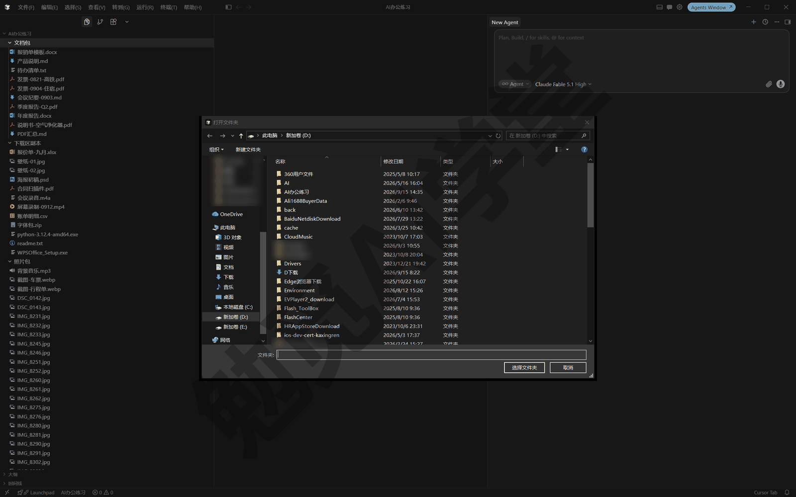

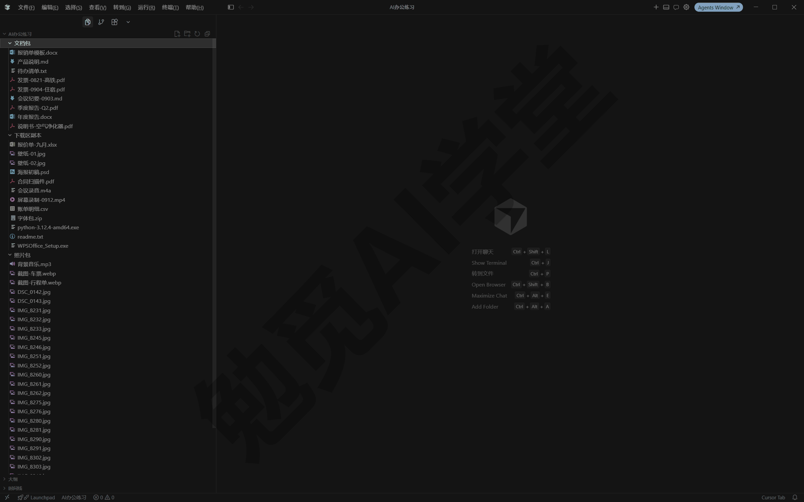

**动手前的两个习惯**

- **先备份**：重要资料先复制一份副本再交给它处理。《权限、沙盒与模型》讲过检查点机制：它改动文件前会自动留快照，出问题可以把文件还原回去；但检查点只是这一次对话里的临时保险，长期的版本记录要靠 Git，练习阶段用“副本”这个最朴素的办法就够。
- **先报告再动手**：《对话与上下文管理》提出过“先让它读、再让它改”的沟通习惯。本篇涉及改名、移动、删除的提示词，都会带上一句“先把方案发给我确认，确认后再动手”，建议你也保持这个写法。

另外，《权限、沙盒与模型》讲过，Windows 上没有文件系统沙盒，智能体要运行的命令走的是自动审查分类器加审批弹窗这层安全网。所以本篇练习中你会不时看到审批请求，这是正常现象而不是故障，是它在运行命令前先征得你的同意。怎么读审批弹窗，见 5.5。

### 5.2 读与识：文本、表格、PDF 和图片

拿到一批文件却不知道里面是什么，是最常见的起点：一个文件夹的会议记录、一堆报销发票、几百张没名字的照片。逐个打开看太慢，这一节让它替你读。

本篇所有提示词中，方括号里的内容换成你自己的文件或文件夹名；文件在工作区内时直接写名字即可，不必写完整路径。

**读文本：把一个文件夹读成一张清单**

txt、md、Word 这类文字型文件，它可以直接读内容并汇总。发送：

```
只读不改：把[文档包]里的 txt、md 和 Word 文件都读一遍，
按“文件名、主要内容、值得注意的信息”整理成一张清单发在对话里，
暂时不要新建任何文件。
```

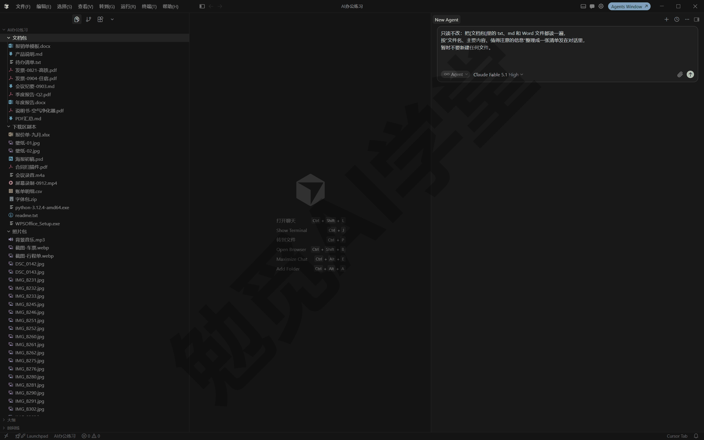

发送后你会看到它逐个读取文件的过程，最后在对话里给出一张汇总清单。开头的“只读不改”明确了这次任务不动文件，这个写法建议以后都保留。

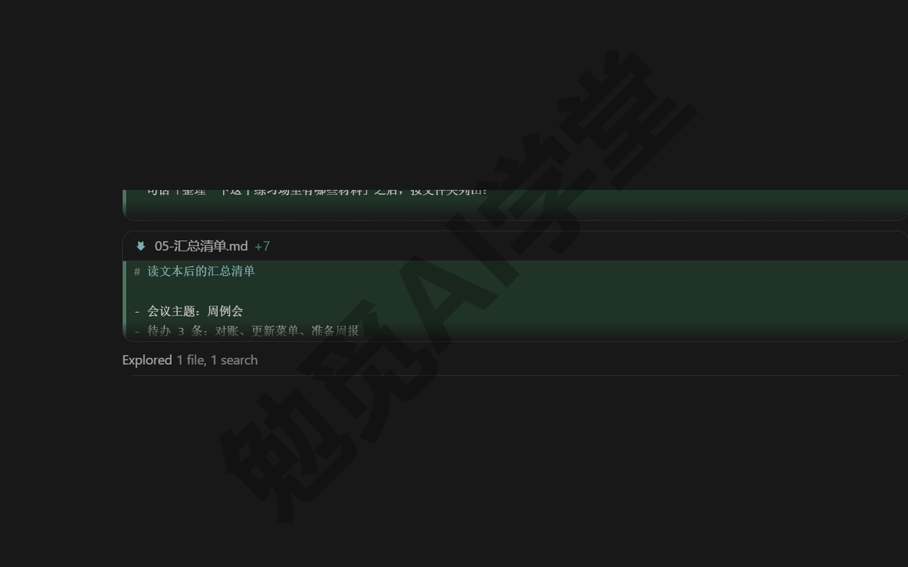

**读表格：行数、列名和分类汇总**

CSV（逗号分隔的纯文本表格，很多软件都能导出）和 Excel 表格同样能读。Excel 文件不是纯文字格式，它一般会借助脚本或工具去读，过程不用你操心。发送：

```
读一下[开销记录.xlsx]，告诉我一共多少行、有哪些列，
再按[类别]列做分类汇总，算出每类的总金额和占比，
结果先发在对话里，不要改原文件。
```

完成后你会得到行数、列名和一张分类汇总表。如果它说读取失败，多半是缺工具，让它自己装即可（见 5.5）。

**读 PDF：批量提取关键信息**

一堆 PDF 发票逐张录入最耗时，交给它批量提取。发送：

```
把[文档包]里的 PDF 逐个读一遍，
提取“文件名、日期、来源单位、金额或主题”，
汇总成一张表格，保存为“PDF汇总.md”放在同一个文件夹里。
```

这一次允许它新建文件，完成后工作区里会多出一份汇总表。要注意：扫描件 PDF 本质是图片，提取质量取决于扫描清晰度，关键数字一定要抽查几条；加密的 PDF 需要你先提供密码。

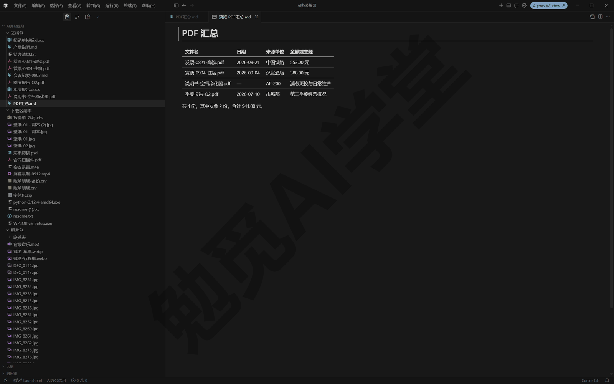

**看图识别内容**

它可以直接查看常见格式的图片（png、jpg、gif、webp 等）并描述内容，这是后面按内容重命名、归类的基础。发送：

```
看一下[照片包]里前 10 张图片，
按“文件名：一句话内容描述”的格式发给我，不要改动文件。
```

你会看到它逐张读取图片，然后给出每张的内容描述。先看 10 张是为了确认它认得准不准，没问题再让它看全部。

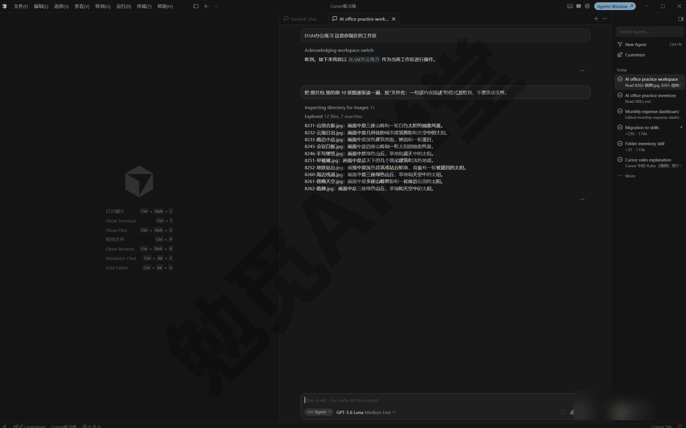

**汇总整个文件夹：联系表大图法**

图片一多，逐张读又慢又消耗用量。一个实用做法是让它先把图片拼成几张带编号的“联系表”大图（一张大图里排着很多张缩略图，像照相馆洗照片前给你看的那张小样），它一次读一张大图就能看到一批照片。要点是每格不能太小：格子太小它看不清内容，就容易靠猜，反而误判。发送：

```
把[照片包]里的图片拼成几张带编号的联系表大图，
每张最多排 9 张、每格保持清晰可辨，存到“联系表”子文件夹；
然后对照联系表，输出“编号、原文件名、内容描述”的完整清单。
```

完成后你会得到几张联系表和一份对照清单，一批照片的内容一目了然。这个办法在处理上百张图时尤其划算。

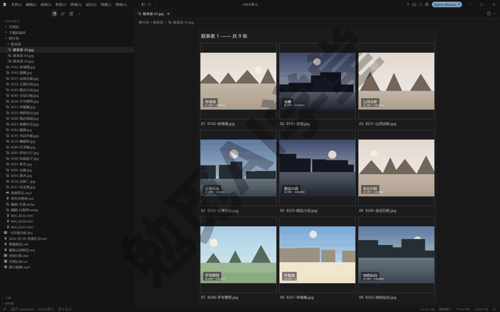

### 5.3 整理：重命名、归类、查重与磁盘清理

读懂只是第一步，这一节开始动文件。所有会改动文件的操作，都按 5.1 说的“先报告再动手”来做。

**批量重命名：改成中文名，保留编号前缀**

相机和手机拍的照片名字都是 IMG_8231.jpg 这类，看名字完全不知道内容。让它按内容改成中文名，同时保留原文件名里的数字编号：编号记录了拍摄顺序，全改掉顺序就乱了，以后想找回对应的原图也没了线索。发送：

```
把[照片包]里的图片按内容重命名为中文名，
保留原文件名中的数字编号作前缀（如 IMG_8231 里的 8231），
新名字格式：编号-内容描述.jpg。
先把“原名 → 新名”对照表发给我，我确认后你再改名。
```

它会先读图、给出对照表；你回复确认后才真正改名。完成后文件列表会变成“8231-山顶合影.jpg”这样既按顺序排、又一眼看得出内容的名字。

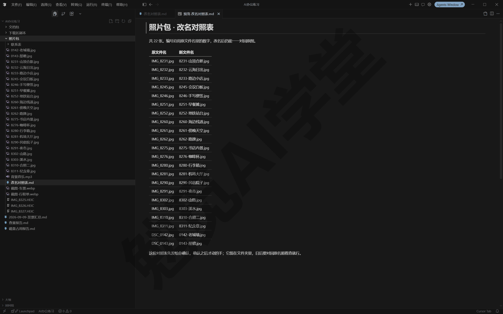

**按内容归类**

乱文件夹的第二步是分门别类。发送：

```
把[下载区副本]里的文件归类：
图片放“图片”子文件夹，文档按主题分子文件夹，
安装包放“安装包”，拿不准的放“待定”。
先把归类方案发给我，我确认后你再移动文件。
```

确认后它会新建子文件夹并移动文件。“待定”这一类建议留着：与其让它硬猜，不如把拿不准的留给你自己看一遍。

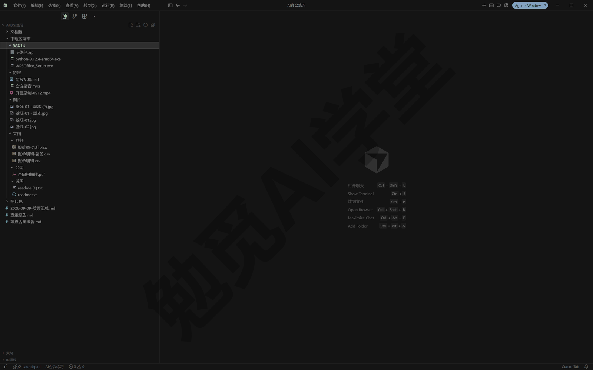

**查重：按内容找重复，先报告不删除**

同一份文件常常被存了好几次，文件名还各不相同。查重要按内容判断而不是按文件名。发送：

```
检查[下载区副本]里有没有内容重复的文件（按内容判断，不看文件名），
把重复组列出来，每组说明建议保留哪个、理由是什么。
只出报告，不要删除任何文件。
```

你会得到一份重复文件报告。要不要删、删哪个，由你看过报告后另发指令，这一步不要合并进查重指令里。

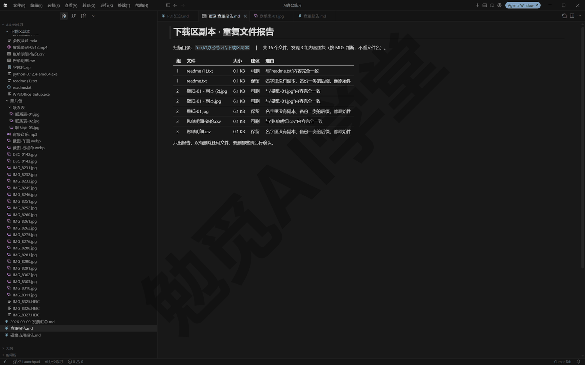

**磁盘占用分析与确认后清理（只讲流程，不实际删除）**

磁盘快满了想清理，但不知道空间被什么占了，也不敢乱删，就把“分析”和“清理”拆成两步。要分析的文件夹如果不在当前工作区，最稳妥的做法是把那个文件夹直接打开为工作区再操作。先分析：

```
分析[要检查的文件夹]的磁盘占用：
哪些子文件夹最大、有哪些超过 100MB 的大文件、
有没有明显的缓存或临时文件，输出一份占用报告，先不要清理。
```

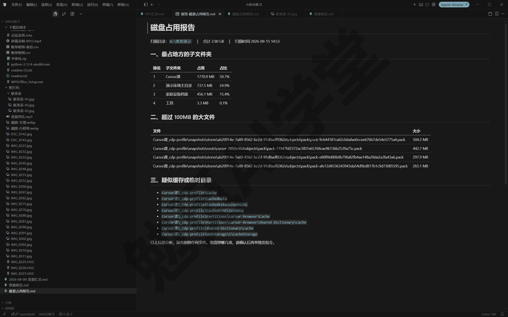

拿到报告后，先由你人工确认哪些可以删。这次练习不真的执行删除，免得误删素材；真正清理时，再单独发第二条：

```
按刚才的报告，清理我确认过的这几项：[列出你确认的项]。
删除前把每一项的名称和大小再列一遍让我最后确认，
能进回收站的先进回收站，不要直接永久删除。
```

《权限、沙盒与模型》讲过的文件删除保护在这里也会兜底：默认设置下，智能体要自动删除文件时会被拦下来，等你确认后才执行（保护开关状态以实际设置为准）。就算有这层保护，“先报告、我确认、进回收站”这三步把关的习惯还是不要省。

### 5.4 转与做：格式转换、合成视频、生成表格文档

这一节从“处理已有文件”进到“做出新东西”。它的做法通常是写一小段脚本（一段让电脑自动执行的小程序）来完成任务，你不需要看懂脚本，只需要说清楚要做什么，做完检查一下结果。

**格式转换：HEIC、webp 转 jpg**

苹果手机拍的 HEIC 和网页保存的 webp，很多软件打不开，统一转成 jpg 最不容易出问题。发送：

```
把[照片包]里的 HEIC 和 webp 图片都转成 jpg，
转换后的文件放进“jpg版”子文件夹，原图保持不动。
缺什么工具你自己装，装之前先告诉我要装什么。
```

执行时你可能会看到它运行转换命令、弹出审批请求，按 5.5 的方法看一眼再放行。完成后“jpg版”子文件夹里就是全部转好的图。

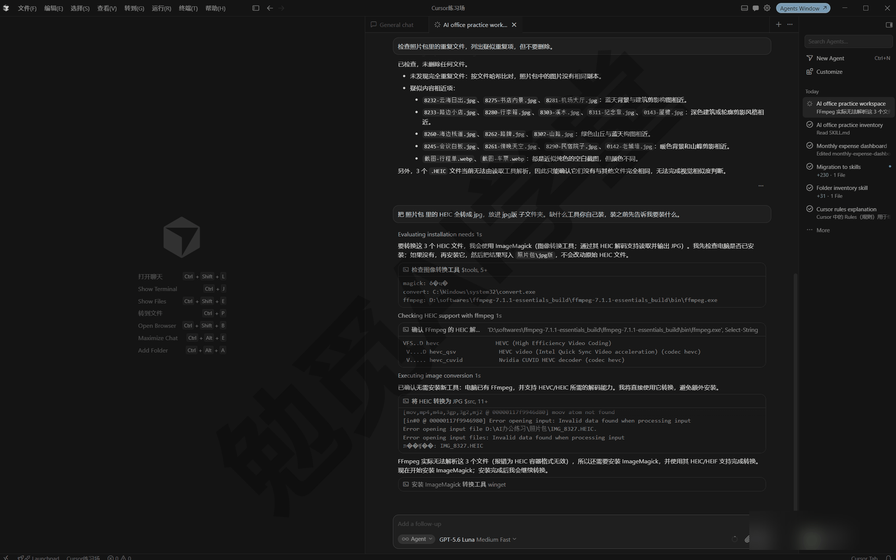

**文档转换：md 转 Word、PDF**

自己写的 md 笔记要交给别人看，转成 Word 或 PDF 更通用。发送：

```
把[月度总结.md]转成 Word 版和 PDF 版，
尽量保持标题、列表和表格的格式，
生成“月度总结.docx”和“月度总结.pdf”放在同一文件夹。
```

转换完打开抽查一遍：跨格式转换难免有版式和字体上的差异，重点看标题层级对不对、表格有没有丢。

**图片合成视频并配乐**

一批旅行照片可以直接做成带背景音乐的相册视频。发送：

```
把[照片包]里的 jpg 图片按文件名顺序合成一个视频：
每张停留 3 秒、加淡入淡出转场，
用[背景音乐.mp3]做背景音，输出“旅行相册.mp4”。
需要 ffmpeg 的话你自己装，装之前先告诉我。
```

ffmpeg 是处理音视频最常用的免费工具，怎么装见 5.5。完成后用播放器打开 mp4 检查：顺序、时长、音乐是否都符合要求；不满意就接着说，例如“每张改成 2 秒”“音乐声音小一点”。

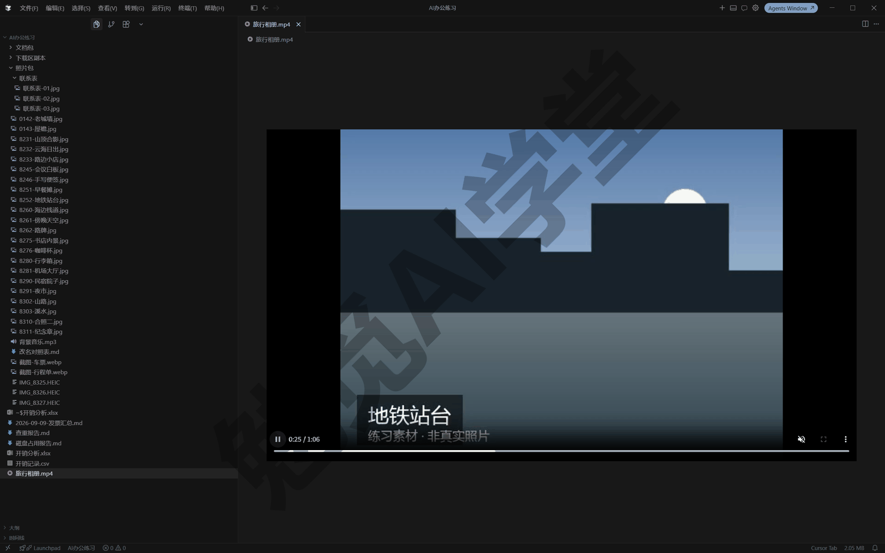

**生成表格与文档：让它写脚本跑出来**

很多人以为出 Excel、PPT 必须装 Office，其实不用：让它写脚本直接生成文件即可，电脑上没有 Office 也能做出 xlsx 和 pptx。发送：

```
根据[开销记录.csv]生成一份带图表的 Excel：
第一张工作表放明细，第二张放按类别的汇总，配一张饼图；
用脚本生成，不要依赖 Office，输出“开销分析.xlsx”。
```

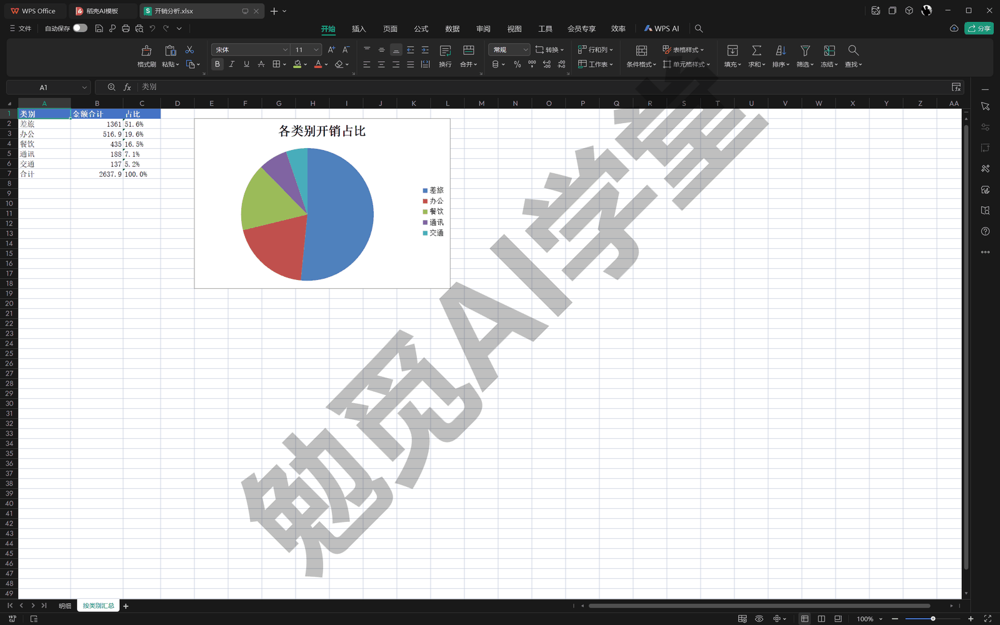

PPT 也一样：

```
把[产品介绍.md]做成一份 10 页以内的 PPT：
封面一页、要点分页、结尾一页，配色简洁，
用脚本生成“产品介绍.pptx”，不要依赖 Office。
```

这套“写脚本出文档”的做法，在后面的《实战二：家庭账单月报流水线》里会完整用上：三种来源的乱账单放进去，一句话让它整理、汇总，直接做出带图表的 Excel 和一页汇报 PPT，全程不依赖 Office。这一篇先把做法练熟，到实战篇你就能直接上手。

### 5.5 让它自己装工具

**为什么要它装工具**

前面的转格式、合成视频、出 Excel，背后靠的都是 Python、ffmpeg 这类通用工具。以前的做法是你自己搜官网、下载安装包、再一步步设置，每一步都可能把新手卡住。现在换成一句话：让它自己装，装完自己验证。

本篇反复出现的几个工具，先认识一下名字：Python 是一门通用脚本语言，出表格、批量处理文件多半靠它；Node.js 是运行网页类工具的环境；ffmpeg 专门负责音视频的转换与合成。这些都不需要你会用，认得名字、审批时能对上号就行。很多时候你甚至不用主动装：任务需要什么，它会自己提出“需要安装某某”，你确认即可。

**一句话安装，装完自己验证**

装 Python：

```
帮我装 Python，装完运行一条命令输出版本号，
把版本号发给我确认安装成功。
```

装 Node.js 或 ffmpeg 也一样，把名字换掉即可：

```
帮我装 ffmpeg，装完用它输出版本信息确认能用，
并告诉我它装到了哪里、以后在别的文件夹里能不能直接用。
```

“装完自己验证”这半句很重要：工具装没装成，要看版本号能不能正常输出，不能只听它说“装好了”。安装命令通常要经过审批：运行前会弹出和《权限、沙盒与模型》里一样的审批卡，你放行后它才真正执行（是否弹出以你的运行模式设置为准）。然后你会看到它运行安装命令、再运行一条版本检查命令，最后把版本号贴给你。

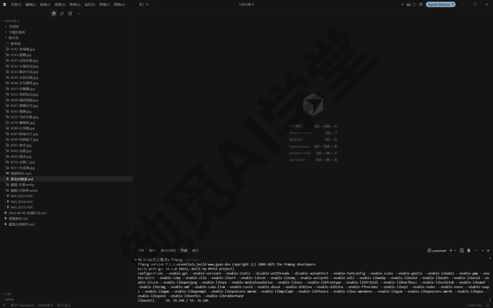

**审批弹窗怎么读**

安装工具基本都会触发审批。弹窗上通常能看到它要运行的命令原文，以及 Run（运行）、Skip（跳过）一类的按钮（按钮名以你的界面为准）。看不懂命令不要紧，按三个问题过一遍：

- **它要做什么**：命令里一般带着工具名（python、ffmpeg），和你的要求对得上就合理。
- **来源可靠吗**：从官方网站或系统自带的软件安装工具装，是最常见的情况；如果你不确定，先回一句“解释一下这条命令是干什么的、从哪里下载”，它会用通俗的话解释，你再决定放不放行。
- **影响范围多大**：装工具影响的是系统环境而不只是工作区，所以要比普通命令多看一眼。

**装到哪里、别处能不能用**

工具可能装在两种地方，装在哪决定了“别处能不能用”：

- **装进系统环境**：加入系统的可执行路径（也就是 PATH，系统查找命令的地址簿），任何工作区、任何终端都能用。Python、ffmpeg 这类通用工具适合这样装。
- **只装进当前工作区**：有些配套的程序包会被装进只属于这个工作区的独立环境（叫虚拟环境），只在这个文件夹里有效，换个工作区就找不到了。

想要全局可用，就在指令里说清楚：“装成全局可用，并在一个新终端里验证”。另外，刚装完的工具在已经开着的旧终端里可能找不到，这不是装失败，重开终端或重启应用后一般就能找到了。

安装也可能失败，最常见的是网络原因。处理办法和 5.7 讲的一样：把安装报错原文发回对话，它通常会换渠道或换方法重试；多次失败时，让它给出手动下载的官方地址，你下载安装后再让它继续验证和配置。

### 5.6 结果去哪找

**生成的文件默认落在工作区**

它做出来的东西默认保存在当前工作区里，对话里通常也会报出文件名和位置。一个有用的习惯是在任务提示词末尾加一句“完成后列出所有新建或修改的文件及路径”，让每次任务都以一份文件清单收尾，以后要找文件时照着清单找就行。

如果生成的文件多、任务杂，还可以要求它给文件名加日期前缀，例如“2026-09-09-发票汇总.md”：文件一多，按名字一排就能对上是哪天哪次任务做出来的。这个要求同样直接写进提示词即可。

**三个查看入口**

- **代理窗口内直接搜**：按 Ctrl+P 输入文件名搜索定位，按 Ctrl+Shift+F 可以在所有文件内容里搜关键词，不用离开代理窗口。
- **在资源管理器里打开**：想用系统自带方式查看，可以在文件或文件夹上点右键，选“在文件资源管理器中显示”（名称以实际界面为准）；最直接的兜底是自己开资源管理器，按它报的路径找过去。
- **让它自己汇报**：发一句“把这次生成的所有文件列个清单，带完整路径”，适合一次任务生成多个文件的情况。

生成的文件想换个地方存也不用你动手：一句“把这次生成的文件统一移动到‘产出’子文件夹”就够，挪文件这件事它自己就能做。

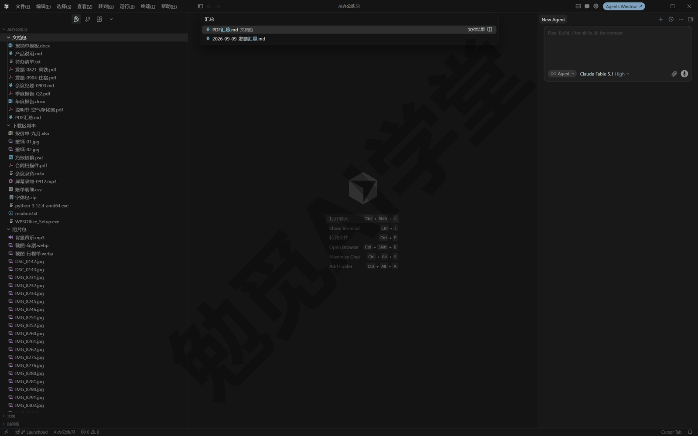

**说好的文件找不到？先分三种情况**

- **存到了别的位置**：直接问一句“把这次生成的文件的完整路径贴出来”，按路径找过去。
- **任务其实没做完**：翻到对话末尾看看，它可能停在一个提问或报错上等你回应，回它一句就能继续。
- **被杀毒软件拦了**：文件刚生成就消失，多半是这种情况，处理办法见 5.7 的杀毒一节。

**二进制文件在差异视图里看不了怎么办**

《两套界面全导览》介绍过差异视图：逐文件查看它改了什么、可以接受或拒绝。文字型文件在差异视图里核对最方便，md、csv 这类文件新增了哪些行一目了然，发现汇总表少了一列，直接在对话里说“补上某某列”就行。但差异视图只适合文字型文件；xlsx、pptx、mp4、jpg 这类二进制文件（内容不是纯文字、直接打开是乱码的格式）在差异视图里一般看不到具体改动内容，可能只显示为新增或修改了一个文件（具体提示形态以实际界面为准）。

这不是出错。验收二进制文件的正确方式是打开文件本身：Excel 用表格软件或 WPS 打开看数字和图表，视频用播放器拉着进度条看首尾，Word 翻一遍版式。不方便打开时，让它把内容贴出来：“把这个 xlsx 每张工作表的前 5 行贴出来给我看”，用可读的方式核对内容。差异视图只能告诉你它改了哪里，文件能不能用，最终要靠你打开文件看一眼。

### 5.7 边界与坑

这一节集中讲文件任务最常见的四个坑，都配了兜底做法。

**大批量任务分批做**

几百个文件一次交给它，中途出错很难收拾，也不好核对。稳妥的节奏是：

1. 先拿 5 到 10 个文件试一遍，检查结果是否符合预期。
2. 确认没问题，再让它处理剩余部分；数量很大时分成几批，每批完成后抽查几个。
3. 涉及改名、移动的批量操作，每批都保留“先报告再动手”。

批量任务文件越多，花的时间和用量也越多，先小批试再放开，也是控制用量的办法。更稳的做法是开工前后各看一眼用量页（《权限、沙盒与模型》介绍过在设置与账号页面查看用量），一批下来消耗了多少一看就知道，下次同类任务就能提前估算。

**中文路径与空格**

日常使用中文文件名一般没有问题，但少数较旧的工具处理不好中文或带空格的路径，典型症状是明明文件在那里却报“找不到文件”，或者输出的文件名变成乱码。路径里带空格是同类问题的另一种形态，它一般会自己加引号处理，多数时候你察觉不到。遇到反复失败的情况也不用自己反复试：把报错发回给它，它通常会自己换一种写法重试；实在不行，让它把涉及的文件复制一份改成临时英文名处理，完成后再改回中文名。

**杀毒软件拦截**

它写的脚本、刚装的工具，偶尔会被杀毒软件误判拦截，典型症状是文件刚生成就消失、或者命令突然无法运行。处理思路是：先到杀毒软件的隔离区确认是不是被隔离了，是误报就恢复文件，并把练习文件夹加入信任名单（具体怎么操作，看你用的杀毒软件的说明）。这种情况大多是误报，不代表它真做了危险的事，但如果你有疑虑，可以让它解释被拦的文件是干什么的，再决定要不要恢复。另外，新装的工具第一次运行时被拦的概率最高，所以 5.5 里强调装完立刻自己验证：能把误报早点暴露出来，总好过合成视频跑到一半才失败。

**失败了，把报错发回去让它自己修**

任务失败时最有效的办法是：把报错原文完整复制，贴回对话，一个字都不用改；界面上的错误弹窗也可以直接截图发回去（《对话与上下文管理》讲过，截图它看得懂）。对它来说，报错信息是精确的线索，多数问题它读完就能自己改好再重跑。最没用的反而是只说一句“出错了”“不行”，那等于不给它任何可用的线索。

发回报错时带上三样东西，效果最好：

- **报错原文**：完整复制，不要删减，越长越有用。
- **你当时让它做什么**：一句话即可，例如“转换第二批 HEIC 时报的错”。
- **你期望的结果**：一句话即可，例如“期望全部转成 jpg 放进 jpg版 文件夹”。

这四个坑有一个共同点：都不需要你自己会修。你的任务是识别症状（结果不对、文件消失、报错），然后把你看到的情况原样发回给它；修的事，交给它来。发回去之后，它一般会先说明自己对报错的理解，改一处再重跑一遍，成功后把结果贴给你。

### 5.8 三个练习任务

下面三个任务把本篇能力串起来练一遍。方括号里的内容换成你自己的；素材就用 5.1 里建好的练习工作区。

**任务一：给 20 张照片按内容起中文名，保留编号**

```
把[照片包]里的 20 张图片按内容重命名为中文名，
保留原文件名中的数字编号作前缀，
新名字格式：编号-内容描述.jpg。
先发“原名 → 新名”对照表给我确认，确认后再改名。
```

完成标准：改名后的文件都是“编号-中文描述”格式；编号与原文件一一对应；抽查 5 张，描述与图片内容相符。

**任务二：把一个文件夹的 PDF 汇总成一张表**

```
把[文档包]里的 PDF 逐个读一遍，
提取“文件名、日期、来源单位、金额或主题”，
汇总成表格保存为“PDF汇总.md”，放在同一文件夹里。
```

完成标准：工作区里出现“PDF汇总.md”；表格行数与 PDF 份数一致；抽查两行，关键信息与原件相符。

**任务三：装 ffmpeg 并把照片合成视频**

```
先帮我装 ffmpeg，装完输出版本信息确认能用；
然后把[照片包]里的 jpg 按文件名顺序合成视频，
每张 3 秒、配上[背景音乐.mp3]，输出“旅行相册.mp4”。
```

完成标准：对话里出现 ffmpeg 版本信息；工作区里出现 mp4 文件；播放正常、有背景音乐、照片顺序正确。

### 5.98 本篇小结与自检

这一篇把文件与办公能力过了一遍：读与识（文本、表格、PDF、图片、联系表汇总）、整理（重命名、归类、查重、磁盘清理）、转与做（格式转换、合成视频、脚本生成表格文档）、自装工具（一句话安装加自己验证），最后是到哪里找它生成的文件，以及四个常见坑。最需要养成的习惯是两个：会改动文件的任务先报告再动手；失败了把报错原文发回去。

可以对照下面的清单检查学习结果：

- [ ] 建好了练习工作区，能说出“工作区就是它能动的范围”
- [ ] 让它读过文本、表格、PDF 和图片各至少一次
- [ ] 完成过一次批量重命名，编号前缀保留完好
- [ ] 磁盘分析走过“先报告、确认后清理”的完整两步
- [ ] 让它装过至少一个工具，并看到它自己输出版本号做验证
- [ ] 遇到过（或模拟过）一次报错，把报错原文发回让它自己修好

完成这些内容后，你已经能把日常的文件与办公任务交给它了。不过到目前为止，所有任务都是“一句话直接干”；任务一大，直接干就容易走偏。下一篇《计划、提问与调试三模式》介绍先想清楚再动手的计划模式、只看不改的提问模式和按证据修问题的调试模式，让复杂任务也能稳稳做成。

### 5.99 新手常见问题

**Q1：它会删我的文件吗？**

不会随意删。删除这类操作默认有文件删除保护管着，自动删除会被拦下来等你确认（《权限、沙盒与模型》有完整说明，保护开关以实际设置为准）。你自己这边的保险是：清理任务永远拆成“先报告、我确认、进回收站”三步，重要资料只用副本练习。

**Q2：能处理不在工作区里的文件吗？**

读没有问题：把文件拖进对话，或给出完整路径让它去读。要改动的话，默认有工作区外文件保护管着，会要求你确认（以实际设置为准）。最简单的做法是把要处理的文件复制进工作区再开工，生成的文件也好找。

**Q3：处理 100 张图要多久、要花多少用量？**

取决于做法。逐张读图最慢也最消耗用量；联系表大图法一次看一批，省用量得多；批量转格式、改名这类不需要理解内容的操作走脚本，既快，用量也少。具体耗时和用量以实际运行情况为准，稳妥节奏是先拿 10 张试，看看用量页的变化再决定剩下的怎么处理。

**Q4：为什么它装的工具，我在别的地方用不了？**

最常见的原因是工具被装进了当前工作区的虚拟环境，只在这个文件夹里有效，换个地方自然找不到；想全局可用，安装时明确要求“装成全局可用”。另一个常见原因是装完后系统路径没刷新，旧终端里找不到新命令，重开终端或重启应用即可。拿不准是哪种，就把“在别处运行失败的报错”发回对话，让它判断是哪一种。
