## 计划、提问与调试三模式

到目前为止，你的所有任务都在默认的 Agent 模式里完成：一句话发出去，它直接动手。这一篇把输入框里的另外三种模式讲全：只看不改的提问模式、先想清楚再动手的计划模式、按运行证据修问题的调试模式，以及四种模式怎么切换、怎么搭配。学完这一篇，遇到什么任务该用哪种模式，你会有一套清楚的判断。本篇继续使用《文件与办公能力一篇讲全》建好的练习工作区。

### 6.1 四种模式与怎么切换

**先认识四种模式**

Cursor 的对话有四种工作方式，界面里的名字保留英文：Agent（智能体）、Ask（提问）、Plan（计划）、Debug（调试），菜单文案以实际界面为准。区别可以用一张表看清：

| 模式 | 它做什么 | 会不会改文件 |
| --- | --- | --- |
| Agent | 直接动手：读文件、改文件、运行命令 | 会 |
| Ask | 只读只答：看懂文件夹、解释代码和改动 | 不会（只读） |
| Plan | 先出一份可以审阅和修改的计划，你确认后再动手 | 构建阶段会 |
| Debug | 先查明问题的根本原因，再做小修复 | 会 |

日常小任务用 Agent 就够；另外三种各有各该用的时候，后面一节一节讲。四种模式共用同一个输入框，@ 提及、拖图片、语音这些《对话与上下文管理》讲过的用法在哪个模式里都能照常使用，变的只是它的工作方式。

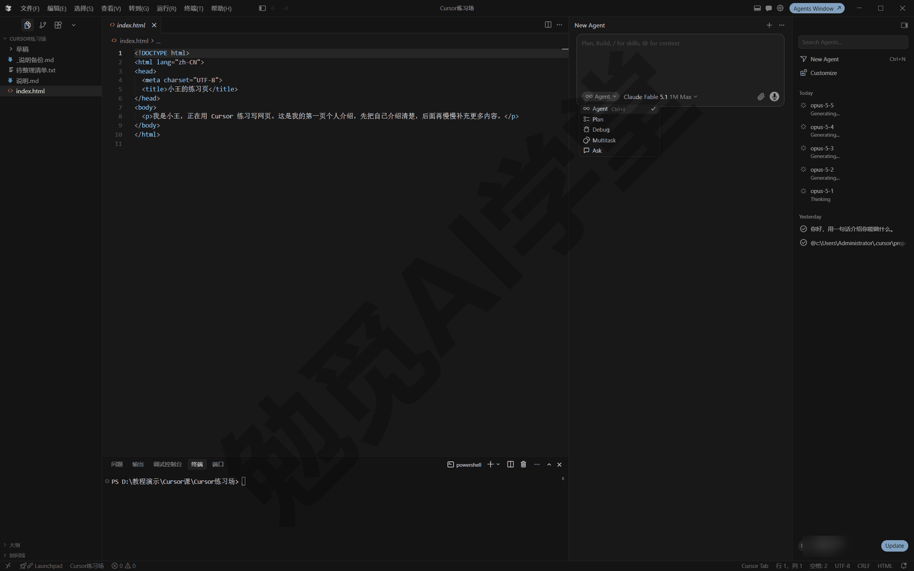

**切换模式的三种方法**

- **模式选择器**：输入框区域有一个模式选择器（《两套界面全导览》介绍过输入框的各个部件；选择器具体位置以实际界面为准），点开下拉列表直接选。适合还不熟悉时看着选。
- **Shift+Tab 轮换**：光标在输入框时按 Shift+Tab，在几种模式之间依次轮换，输入框上的模式标签会跟着变。这是最快的切换方法，熟练后基本只用它。
- **Ctrl+. 打开模式菜单**：按 Ctrl+. 直接呼出模式菜单再选择，效果与点开选择器相同。

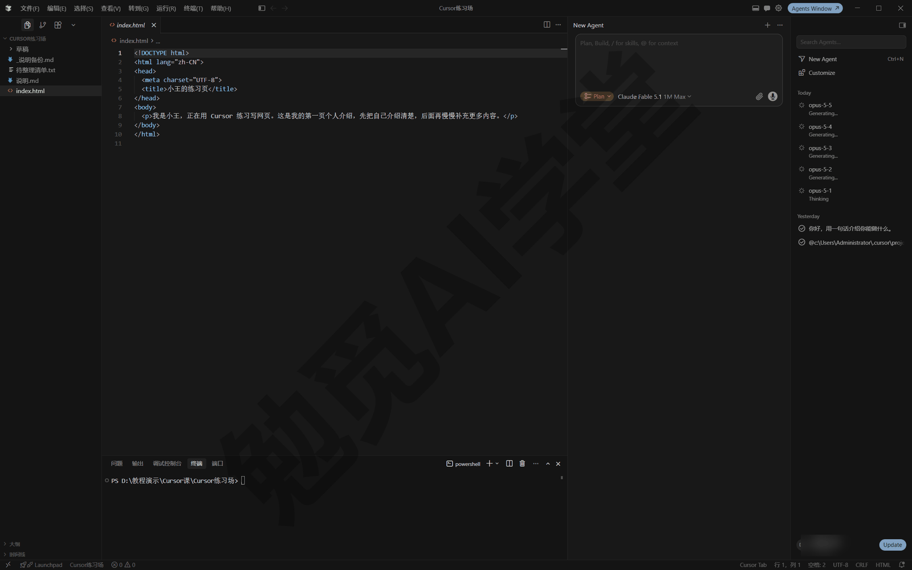

**发消息前看一眼当前模式**

输入框上会标出当前处于哪种模式（样式以实际界面为准），养成发送前看一眼的习惯。最常见的小事故有两种：在 Ask 里发了要动手的指令，等了半天它也没有动手；在 Agent 里发了只想问问的问题，它却直接改了文件。看一眼标签只要一秒，能省下不少返工。

另外认识一个名字：模式相关的入口附近，你可能还会看到“多任务（Multitask）”（是否出现以实际界面为准）。它不是本篇的四种模式之一，作用是把多条请求同时开工而不是排队，细节留到《子智能体、并行与工作树》再讲，现在见过、认得就行。

**切模式等于开新上下文**

有一个容易让人吃亏的机制：每种模式使用各自独立的上下文，切换模式相当于开一个新的上下文窗口，之前聊的内容不会自动带过去。所以：

- 需要衔接时，在新模式的第一条消息里把关键结论复述一遍，或者先让它把结论写进一个 md 文件，切过去再让它读。
- 《对话与上下文管理》提出过“一事一对话”的习惯：换一件事就开新对话。切模式的场景也一样，把每段上下文当成独立的一段来对待。

另外，后面《规则与 AGENTS.md》会讲的“规则”（让它每次对话都自动记住你的规矩的机制）在四种模式里都生效，不用担心换了模式规矩就失效。

### 6.2 提问模式（Ask）：只看不改

**是什么、什么时候用**

提问模式是只读模式：它可以读文件、搜内容、回答问题，但不做任何改动。有两个典型场景：

- **想先看懂再决定**：接手一个别人给的文件夹、想弄明白某个东西是怎么做的，先问清楚再说。
- **怕误改**：只想咨询，不想让它动文件。提问模式本身就不会改文件，“只看不改”比在指令里写“不要改”更保险。

只读还有一层好处：随便问也没有代价。你可以放心让它把工作区翻个遍、连着追问十个为什么，全程不会产生任何需要你检查的改动，也就不用审批、不用回退。另外，“什么是虚拟环境”这类一般性的知识问题，普通聊天工具也能答；提问模式的好处是结合你的文件回答你的情况。

**提问模式怎么用**

切到 Ask，像平时一样提问即可。本篇提示词中方括号里的内容换成你自己的。拿练习工作区试一次：

```
这个工作区里现在都有什么？
每个子文件夹是干什么的，里面的脚本分别做了什么事，
用一份简短清单讲给我。
```

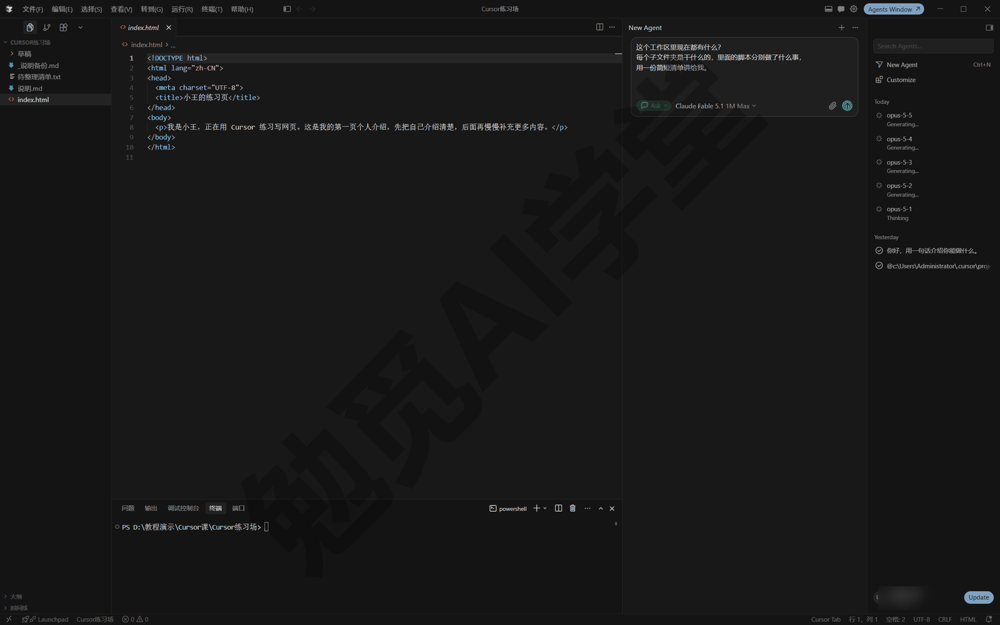

发送后它会读取文件、给出讲解，回答里通常会引用具体的文件名和位置（形态以实际界面为准），方便你按名字找过去核对；差异视图里则不会出现任何改动。讲解里出现不认识的词，直接追问“用更通俗的话再讲一遍某某是什么”，在这里追问多少次都不会产生风险。官方给出的典型问法还有“这个功能是怎么实现的”“这两个文件是什么关系”，都属于“求理解、不求改动”的问题。

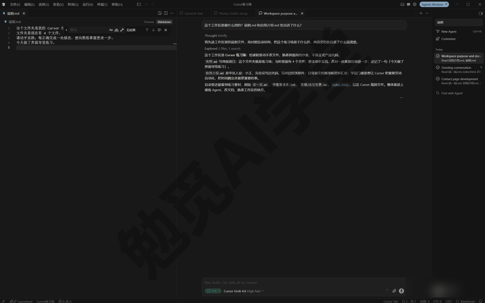

**让它讲解一个具体文件**

另一个常见用法是复盘：Agent 干完一轮，你想弄明白它做出来的东西到底是什么样子、以后哪里能自己动。切到 Ask 发送：

```
读一下[index.html]，讲讲它现在的结构：
每个部分是干什么的，
哪些地方以后我自己改文字是安全的。
```

注意一个细节：切模式是新上下文，它看不到你和 Agent 的那段对话，所以问题要围着文件问，点名让它读哪一个，而不是问“你刚才改了什么”。想连着刚才的上下文顺口问，用侧聊更合适（下面就讲区别）。

**边界与坑**

- 问出来的结论要变成实际改动时，切回 Agent 再下指令。在提问模式里让它“帮我改”，它不会真正动手改，一般只会给出修改建议（具体表现以实际界面为准）。
- 切回 Agent 是新上下文，别指望它记得刚才的问答；把结论带进第一条指令里，例如“刚才确认了报错出在配置文件的路径写错，请修正它”。
- 提问模式和《对话与上下文管理》讲过的侧聊不是一回事：侧聊是在主线对话旁边开个小窗顺口问一句、不打断主线；提问模式是把整段对话设为只读。想边干活边问用侧聊，想安全地摸清情况用提问模式。

### 6.3 计划模式（Plan）：先想清楚再动手

**为什么需要它**

任务一大，直接让 Agent 动手常常做偏：它对需求的理解和你脑子里想的有偏差，一路做下去，返工比重做还费劲。计划模式把顺序倒过来：先不写一行代码，生成一份用平实语言写成的计划给你审，你改到满意再放行。在计划上花的几分钟，通常远少于做偏一次的返工时间。

**什么时候开计划模式**

这几类任务最适合用它：

- **方案不止一种**：比如相册页是做成一个长页面还是分组折叠，先在计划里定。
- **要动很多文件**：涉及多个文件、多个步骤的改动。
- **需求还没想清楚**：让它先研究现状、把问题问出来，帮你把需求聊明白。
- **想先审方案**：动手前想看看它打算怎么做。

反过来，小改动和做熟了的任务直接用 Agent，不必事事先出计划。

**全程走一遍**

用一个任务把全程走一遍：把练习工作区的照片包做成一个相册页。

第 1 步：切到 Plan 模式。光标放在输入框按 Shift+Tab 轮换到 Plan。另外，当你输入的内容像一个复杂任务时，它也可能主动建议你切到计划模式（以实际表现为准）。

第 2 步：发出需求。

```
把[照片包]做成一个能在浏览器里看的相册页：
生成缩略图、按内容主题分组、每组一个区块，
组内按文件名编号排序，输出 index.html 放在工作区根目录。
```

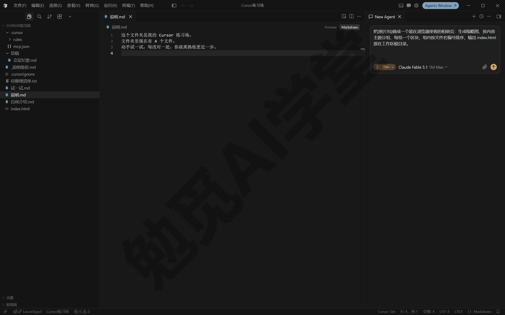

第 3 步：回答澄清问题。它可能先问你几个问题把需求确认清楚，例如主题怎么分、缩略图要多大、要不要点击放大（问什么要看具体任务）。直接在对话里回答：

```
主题分四组：风景、人物、食物、其他；
缩略图统一 400 像素宽；配色浅色简洁；
不需要点击放大，能看清就行。
```

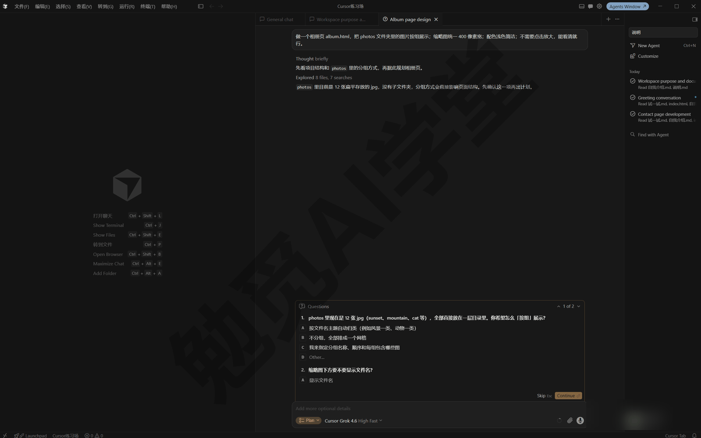

第 4 步：等它研究。它会读取工作区里的相关文件、摸清现状，你会在对话流里看到读取和搜索的工具卡片。这一步不需要你操作。

第 5 步：审阅计划文档。研究完成后它会生成一份计划，做成一个可以打开阅读的文档显示出来（此时还是“虚拟文件”，也就是尚未保存进你工作区的临时文档页）。计划通常包含目标、要动的文件、分步骤的安排等，具体结构以实际生成的内容为准。逐段读一遍，重点核对它对需求的理解和你想的是否一致。

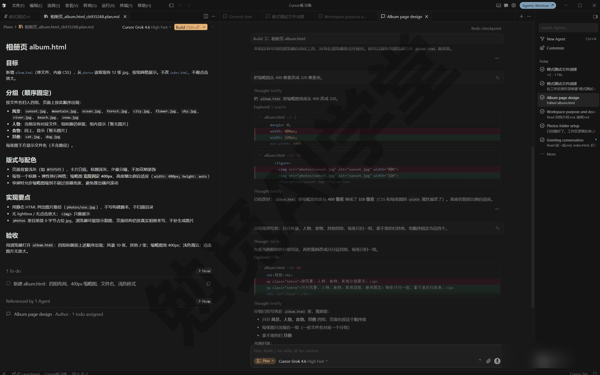

第 6 步：改计划。两种方式都行：在对话里用自然语言说“把第 2 步改成……”，或者直接在计划文档里动手改字。改完确认文档写的就是你最终想要的。

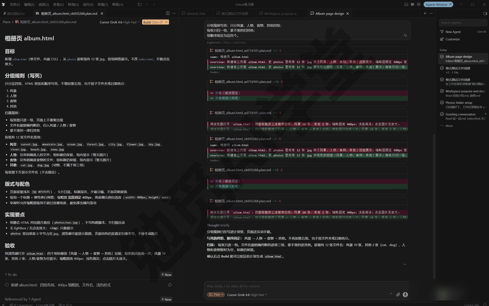

第 7 步：点构建。确认计划没问题后，点击 Build（构建）一类的按钮开始执行（按钮中文文案以实际界面为准）。接下来它就像平常的 Agent 一样动手改文件，只是这次每一步都有计划可对照。

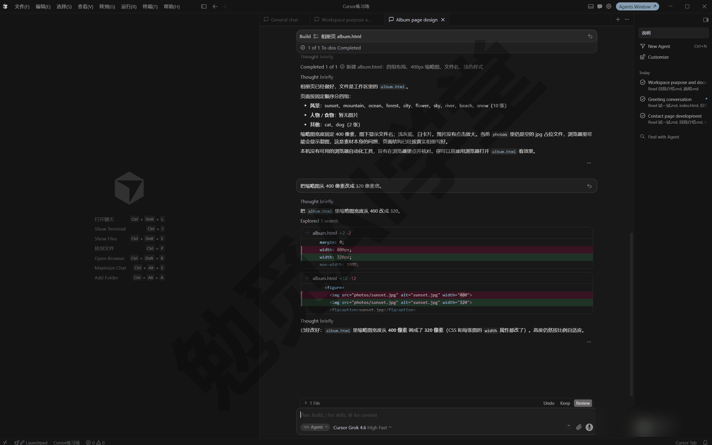

**计划存在哪、怎么留档**

计划默认保存在你的用户主目录（Windows 上在 C:\Users\你的用户名 这个文件夹下，macOS 上对应你的个人文件夹，具体位置以实际界面为准），不在当前工作区里。点“保存到工作区（Save to workspace，中文文案以实际界面为准）”可以把它挪进当前工作区，方便日后翻看、给别人参考。建议凡是值得留档的计划都保存到工作区：它就是一份现成的“这件事当时是怎么定的”说明书。

### 6.4 构建选项

构建方式回答的是“计划由谁来执行、在哪里执行”。计划本身只是一份文档，执行它的可以是你眼前这个对话，也可以是云端的一台机器，还可以是同时开工的多个执行者。把“想清楚”与“动手做”分开之后，执行方式就成了一个可以按任务挑选的选项。计划写好后，以 3.7.42 版为例，下拉菜单里是 Build Locally 与 Build in Parallel 两项，没有云端构建；你的界面以实际显示为准。

**本地构建**

本地构建是默认方式：就在你这台电脑上、当前这个对话里执行。它被设为默认，是因为过程全程可见、出问题随时能停，也不依赖账号和网络条件。点下构建后，你会看到它像平常的 Agent 一样一步一步地动手，差异视图里的改动逐渐累积，直到计划各步骤完成。第一次用计划模式，建议就用它把全程完整看一遍。

**云端构建**

云端构建是把计划交给云端智能体执行。云端智能体是在 Cursor 云端电脑里干活的智能体，任务转到云端之后，你这边关掉电脑，它也照样继续执行。它适合一执行就要很久、你不想守在电脑前的计划。要用它，得有付费套餐这类条件（以实际界面为准）。细节见《云端智能体与手机端》，那一篇会把云端任务的全程讲完整。

**并行构建（Build in Parallel）**

并行构建是把计划里互不依赖的步骤同时开工，彼此有先后关系的步骤仍按顺序执行，官方文档明确这么说。它适合步骤多、彼此独立的大计划，比如四个互不相关的页面各做各的。要注意两点：

- 并行不会让有依赖的步骤提速，该排队的还是排队，别指望它把一切都变快。
- 多个执行者同时开工，用量也会跟着增加；用量紧张时，别为省几分钟开并行。

启用后你会看到多条子任务同时推进（形态以实际界面为准）。细节见《子智能体、并行与工作树》，并行背后靠的就是那一篇要讲的多任务与子智能体。

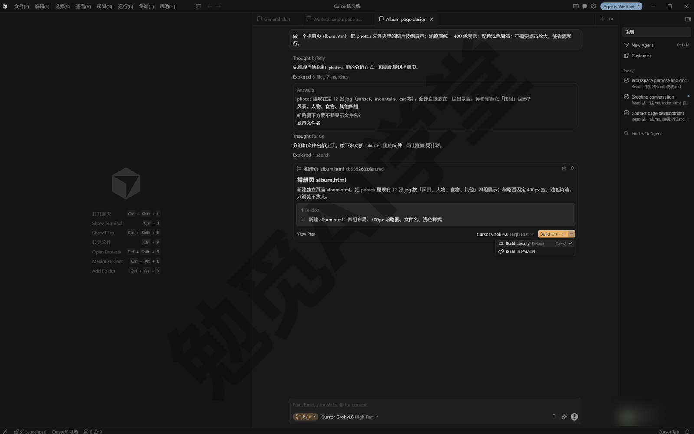

**怎么选**

第一次用，以及日常大多数时候，选本地构建；等这套流程已经用熟、任务又明显很长，再考虑云端；并行只留给步骤多、而且确实彼此独立的计划。用量方面，本地构建就是当前对话的正常消耗，云端与并行怎么计费，《云端智能体与手机端》和《子智能体、并行与工作树》里会说明，以账号页面显示为准。无论选哪种，计划文档都是同一份，执行方式变了，验收方式不变：按计划逐条对照做出来的结果。

构建启动后你也不必干等：《对话与上下文管理》讲过的排队与插话在构建过程中同样适用，想到新要求就发进队列，它做完当前步骤会接着处理；发现方向不对，随时停下，回到 6.5 的“从计划重来”。如果你的界面上暂时只看到本地构建一种，不影响本篇其余内容，等学完《子智能体、并行与工作树》和《云端智能体与手机端》，回头再用后两种也不难。

### 6.5 从计划重来：做偏了不追问

**为什么“回计划”比“现场修补”好**

构建完一看，东西做出来了但不是你想要的，多数人的本能是在对话里继续追问：“不对，这里改一下”“还是不对……”。追问式修补的问题在于，它是在一个已经做歪的结果上继续改，越改越乱的概率不小。官方给的做法是反过来：回到计划层面重来。把改动回退掉，把计划改得更具体，再跑一次。这通常比现场修补更快，结果也更干净。

**三步操作**

第 1 步：回退。在之前某条消息的右下角找到回退（Revert）按钮，点击后确认，文件就会回到那个时候的状态（按钮中文文案以实际界面为准）。回退只还原文件，不删除对话消息。它背后是《权限、沙盒与模型》讲过的检查点机制：智能体每次改动前自动留的快照，可以整体还原文件。

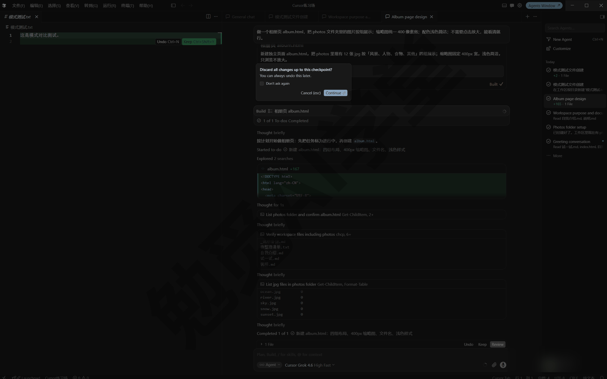

第 2 步：把计划改具体。这一步是关键：把“做出来不对”的感觉，翻译成计划里白纸黑字的规则。以相册页为例，构建后发现分组太碎、组名五花八门，与其追问“分组改好看点”，不如把计划里的分组规则改成：

```
分组规则改为：只分“风景、人物、食物、其他”四组，
每张照片只归入一组，拿不准的归“其他”；
组的排列顺序固定为以上四组的顺序。
```

第 3 步：再跑。用改过的计划重新构建。因为规则已经明明白白写在计划里，第二次的结果通常一次到位。

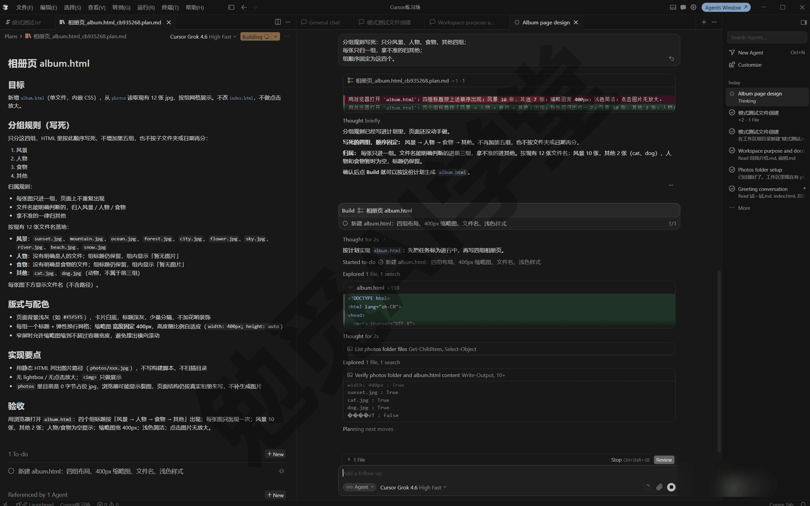

**小偏差就追问，方向性的偏差就回计划**

不是所有不满意都要回计划。文案有错字、某个颜色不喜欢、一处间距想调，这类局部小偏差直接在对话里说，改起来快，也不会牵动整体。要回计划的是方向性偏差：结构不对、需求被理解错、做出来的东西整个形态不合预期。判断时问自己一句话：这个问题是“某一处没做好”，还是“计划里根本没说清”？是某一处没做好，就在对话里追问着改；是计划里没说清，就回到计划层改计划。

**“改具体”的三个常用做法**

- **限定范围**：把“整理照片”这类宽泛说法，改成“只处理 jpg，不碰原图，处理好的图放进新子文件夹”。
- **给例子**：在计划里贴上你想要的样例，组名给一个、命名格式给一个，它照着样例做最不容易跑偏。
- **固定顺序与数量**：能写成数字的都写成数字：分几组、组内按什么排序、页面按什么顺序，逐条写明。

这三个做法的共同点，是把你的主观感受翻译成可执行的规则；规则进了计划，第二次构建就不再靠它猜。

**这套方法的核心**

官方文档把这一点说得很直接：难的往往不是“怎么做”，而是“想清楚要做什么”。改动越大，越值得把时间花在把计划写准上；计划足够具体后，执行交给它就好。以后凡是“做出来不对”，先别急着追问，回头看一眼计划：那条没写清的规则，多半就是问题所在。

### 6.6 调试模式（Debug）：按证据修问题

**是什么、跟直接修有什么区别**

调试模式处理的是 bug，也就是程序不按预期工作的问题。它的特点是不上来就改代码：先提出几种可能原因的假设，往程序里临时加记录语句，请你把问题复现一遍抓到真实的运行数据，凭数据锁定根本原因，再做小而准的修复。一句话总结：它先查实问题出在哪，再动手改。

用它之前先记住两个前提：

- **只对能复现的问题有效**：你得能按固定步骤让问题再次出现。复现不了，日志（程序运行时留下的记录）就抓不到现场。
- **要你自己动手复现**：复现这一步它替代不了你，抓的就是你操作时的真实数据。

**调试模式什么时候用**

这几类问题最适合用它：

- **能复现但看不出原因**：明知道哪里不对，盯着文件却找不到毛病。
- **时机类问题**：跟操作快慢、先后顺序有关，时灵时不灵。
- **越用越慢、越用越卡**：需要运行数据才能定位的性能问题。
- **以前好好的，后来坏了**：需要追查是哪一次改动带来的问题。

反过来，如果只是一条明确的报错，不一定要动用调试模式：《文件与办公能力一篇讲全》讲过把报错原文发回对话让它自己修，多数报错那样就能解决。调试模式针对的是“不报错但表现不对”或“有报错也看不出原因”的问题。

**准备一个带问题的小程序**

为了把流程安全走一遍，先故意做一个有问题的小页面。在 Agent 模式发送下面整段（连代码一起复制）：

```
在工作区新建文件“报名统计.html”，把下面的代码原样写入，
一个字都不要改。这是调试练习素材，里面的问题是故意留的；
如果你发现了问题，也先不要修，原样保存即可。

<!DOCTYPE html>
<html lang="zh">
<head>
<meta charset="utf-8">
<title>报名统计</title>
</head>
<body>
<h3>活动报名</h3>
<input id="name" placeholder="输入姓名">
<button onclick="add()">添加</button>
<p id="tip"></p>
<ul id="list"></ul>
<script>
var names = [];
function add() {
  var box = document.getElementById("name");
  var raw = box.value;
  if (raw.trim() === "") { return; }
  if (names.indexOf(raw) !== -1) {
    document.getElementById("tip").innerText = "已存在，不重复添加";
    return;
  }
  names.push(raw);
  var li = document.createElement("li");
  li.innerText = raw.trim();
  document.getElementById("list").appendChild(li);
  document.getElementById("tip").innerText = "";
  box.value = "";
}
</script>
</body>
</html>
```

文件建好后先亲眼看一次问题：在资源管理器里双击“报名统计.html”用浏览器打开，输入“张三”点添加；再输入“张三 ”（后面多敲一个空格）点添加。预期应该提示“已存在，不重复添加”，实际却没有任何提示，名单里出现了两个一模一样的“张三”。这就是接下来要修的 bug。


**把问题描述发给调试模式**

切到 Debug 模式（切换是新上下文，所以下面这条消息把信息给全，这正好也是一份标准的 bug 描述模板，包括文件、复现步骤、期望、实际四项）：

```
“报名统计.html”有一个 bug。
复现步骤：用浏览器打开页面，输入“张三”点添加；
再输入“张三 ”（末尾多一个空格）点添加。
期望结果：提示“已存在，不重复添加”，名单不新增；
实际结果：没有提示，名单里出现两个“张三”。
请先定位根本原因，再做修复。
```

**六步走完全程**

发送后，调试模式会按六步推进（各步的界面形态以实际表现为准）：

第 1 步：探索假设。它读取相关文件、建立上下文，列出几种关于根本原因的假设，比如“比较时没有统一处理空格”“名单数据重复存储”。这一步你只需要看。

第 2 步：埋日志。“埋日志”就是在程序里临时插入几行记录语句，运行时把关键数据记下来。这些日志不是给你看的：它们会发到 Cursor 内部一个专门收日志的小程序里，它自己去读。你会在差异视图里看到它往文件里加了记录语句。

第 3 步：你来复现。它会给出具体的复现步骤，请你亲自照做。严格按它给的步骤操作，不要多点也不要少点；如果问题时灵时不灵，多复现几遍，数据越多越好定位。

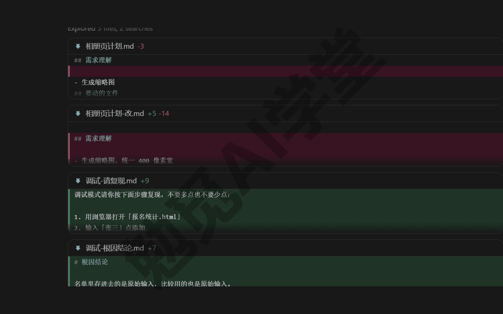

第 4 步：分析日志。复现完成后按它的指引确认，它读取收集到的日志，给出根本原因的结论。以这个例子来说，结论大致是：名单里存进去的是原始输入，比较用的也是原始输入，带空格的“张三 ”和“张三”被判成了两个人，而页面显示时又把空格去掉了，所以肉眼看是两个一样的名字。

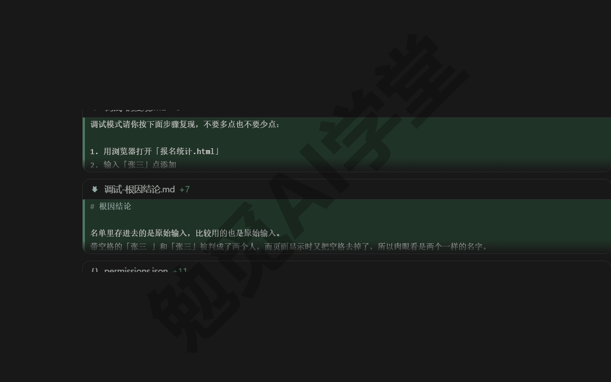

第 5 步：定点修。它做一个针对根本原因的小修复，往往只有几行改动。你可以在差异视图里确认改动范围确实很小、没有顺带动别的地方。

第 6 步：验证清理。你再按同样步骤复现一遍：这次输入“张三 ”会得到“已存在，不重复添加”的提示。确认修好后，它会把第 2 步加的日志语句全部撤掉，代码恢复干净。


**把调试模式用好的四个要点**

- **上下文给足**：报错原文、页面上那串英文定位信息（术语叫堆栈信息）、复现步骤，有什么给什么，描述越细它加的记录语句越准。
- **期望与实际分开写**：“应该发生什么”和“实际发生了什么”各写一句，别混在一起。
- **严格照它的步骤复现**：日志抓的是你操作那一刻的数据，步骤走样，数据就不是问题现场的。
- **难复现的多试几遍**：时机类问题一次抓不全，多复现几次能帮它看出规律。

这个演示 bug 本身不难，选它是为了把六步安全地走一遍。调试模式真正派上用场的，是那些“盯着文件看不出来”的问题。

### 6.7 三种模式怎么搭配

前面几节把三种模式各自的全程讲完了，这一节回答最后一个问题：日常怎么搭配着用。四种模式是一套分工，不需要纠结“选哪个才对”，看任务是哪一类、做到了哪一步来挑，选错了再切到别的模式就是（记得切换会开新上下文，这是要付的代价）。判断标准先整理成一张速查表：

| 情形 | 用哪种 |
| --- | --- |
| 一句话能说清的小事，做错也好回退 | Agent |
| 想先看懂再决定，不想动文件 | Ask |
| 要动很多文件、方案不止一种、需求还模糊 | Plan |
| 表现不对、能复现、盯着文件看不出原因 | Debug |

**亲手感受一次模式差异**

速查表里“会不会动文件”这条分界，值得亲手试一次。把同一句话分别在两种模式下发出，对比结果。先切到 Ask 模式，发送：

```
在工作区根目录新建“模式测试.txt”，内容写一句：这是模式对比测试。
```

提问模式是只读的，这个文件不会被建出来，差异视图保持空白，它一般会用一段说明或建议来回应（具体回应形态以实际表现为准，6.2 里提过）。然后按 Shift+Tab 切到 Agent，把同一句话原样再发一遍：这次差异视图里会出现新建的“模式测试.txt”。同一句话、两种结果，差别就在于模式决定了它的工作方式。试完让它把测试文件删掉即可。

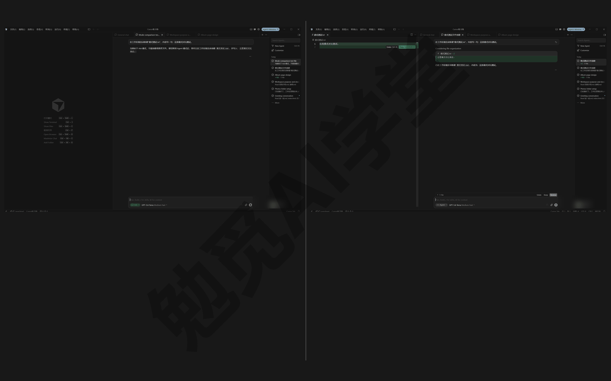

**改一份简历：从 Ask 到 Agent 再到 Debug**

朋友转来一个简历模板文件夹，你想改成自己的。打开工作区先切到 Ask 问清楚：哪个文件是正文、样式定义在哪、只改文字会不会弄坏排版。问明白了切回 Agent，让它替换姓名和经历、把配色换成深蓝，一句一句地改。最后让它把简历导出成 PDF，发现每次导出第二页的表格都被截断：现象固定、能复现、盯着文件看不出毛病，切到 Debug，把复现步骤、期望与实际写全交给它按证据修。一件事用了三种模式，每次切换都记得那条规矩：切过去是新上下文，信息要自己带过去。

**做一个菜谱站：Plan 当主线**

想给家里做个菜谱站，需求还没想清楚。这种规模的任务直接交给 Agent 多半做偏；你刚把需求敲进输入框，它也可能主动建议切到计划模式（6.3 里提过），顺势切过去，让它边问边研究，把计划审到满意再构建。中途看不懂它写的某段东西，开一个 Ask 对话（或者用侧聊）问明白；构建完的零碎调整，回 Agent 一句话一句话地改。反过来也要记住：一句话能说清的小事不必先出计划，任务越大，计划模式越有用；事事都先计划一遍，反而是绕远路。

**整理一批发票：报错不等于要切到调试模式**

让它把一批发票整理成台账，这是 Agent 一句话就能办到的事。中途报了一条错，先别急着切调试模式：按《文件与办公能力一篇讲全》的做法把报错原文发回去，多数报错它自己就能修好。台账出来后有几笔分类看着不对，切到 Ask 点名台账文件，问它按什么规则归的类；确认规则要改，就回 Agent 让它改。真正需要调试模式的是这种情况：某个汇总数字每次都算错、位置固定、能复现，你和它盯着文件都看不出原因。至于偶发、没有规律的问题，调试模式也帮不上忙，先记录它发生时的条件（做了什么、开了什么、大概几点），把它变成能复现的问题再说。

判断用哪种模式，花的是一两秒；用错模式做下去再返工，花的是十几分钟。养成发消息前想一下用哪种模式、再看一眼模式标签的习惯，这一篇的内容就真正用起来了。

### 6.8 三个练习任务

方括号里的内容换成你自己的。前两个任务建议在练习工作区完成，第三个任务用 6.6 里建好的“报名统计.html”。

**任务一：用提问模式看懂一个现成文件夹**

```
这个工作区里都有什么？
每个子文件夹的用途、每个脚本做了什么、
上次生成的文件都在哪里，用一份清单讲给我。
```

完成标准：你能不看文件夹答出“有什么、脚本干什么、结果放在哪”三个问题；全程差异视图零改动。

**任务二：用计划模式做一个三步以上的改动，并改一次计划**

```
给这个工作区做一个“素材索引页”：
读取各子文件夹，统计每类文件的数量，
生成一个带目录和统计表的 index.html 放在根目录。
```

要求：在点构建之前，至少修改一处计划（在对话里说或直接改计划文档都行），并把计划保存到工作区。

完成标准：工作区里有保存下来的计划文档；你能指出自己改了计划的哪一处；构建出来的结果与计划一致。

**任务三：对预埋 bug 走完调试六步**

用 6.6 的“报名统计.html”（或让它照 6.6 的方式再建一份），切到 Debug 模式，把复现步骤、期望与实际写全后发送，跟着走完六步。

完成标准：你亲手复现过 bug；它给出的根本原因解释你能看懂并复述；修复后再复现能看到“已存在”的提示；结束时代码里没有残留的日志语句。

### 6.98 本篇小结与自检

这一篇讲了四种模式的分工与切换：Agent 直接动手，Ask 只看不改，Plan 先计划后构建，Debug 按证据修问题；切换用模式选择器、Shift+Tab 或 Ctrl+.，切模式等于开新上下文。计划模式的全程是“澄清、研究、计划文档、改计划、构建”，构建有本地、并行两种方式（部分版本还有云端）；做偏了回计划改具体再跑，比现场追问更快更干净。调试模式只对能复现的问题有效，六步走完记得让它清理日志。

可以对照下面的清单检查学习结果：

- [ ] 能说出四种模式各自什么时候用
- [ ] 会用至少两种方法切换模式，并知道切模式会开新上下文
- [ ] 用提问模式完整问明白过一个文件夹，全程零改动
- [ ] 用计划模式走完过“澄清、研究、计划、改计划、构建”全程
- [ ] 知道计划默认存在用户主目录，会用“保存到工作区”留档
- [ ] 演练过一次“回退、把计划改具体、再跑”
- [ ] 对一个能复现的 bug 走完过调试六步，并确认日志已清理

完成这些内容后，你手里已经有了应对简单与复杂任务的完整办法。下一篇《内置浏览器与设计模式》会让它自己打开网页验证做出来的东西，并且教你在页面上点选、画圈、口述改版；这一篇计划模式做出的相册页，正好可以拿过去让它自己“看一眼”。

### 6.99 新手常见问题

**Q1：计划模式是不是更费用量？**

计划阶段多了研究和生成文档的环节，单看这一段确实多花一些用量。但换一种算账方式：大任务直接干，做偏一次的返工消耗通常远超一份计划的消耗。小任务不出计划、大任务先出计划，总体反而省用量。具体消耗以你账号的用量页显示为准。

**Q2：计划能改完再执行吗？改到一半想再改行不行？**

能，这正是计划模式的设计意图。构建之前，计划随你改：对话里说、直接改文档都行，改多少轮都可以。构建之后发现方向不对，按 6.5 的做法回退、改计划、再跑。真正要避免的只有一种情况：明知计划有疑问还照样点构建。

**Q3：调试模式为什么非要我自己操作复现？**

因为它要的是运行时的真实数据。日志语句埋好后，只有你把问题真实地操作出来一遍，日志里记录的才是问题现场；它自己模拟不了你的操作步骤。这一步同时也让你亲眼确认了 bug 的存在和修复后的效果，修没修好不用听它说，你自己看得见。

**Q4：切了模式它就忘了之前说的，怎么办？**

这是设计上的有意安排，各模式上下文独立，切换等于开新窗口。应对办法有两个：

- 把要带过去的信息写进新模式的第一条消息，像 6.6 的 bug 描述模板那样一次给全；
- 让它先把结论写进工作区的 md 文件，切过去后让它读这个文件。

大任务优先把信息写进计划文档，它本来就是用来在阶段之间保住信息的。
