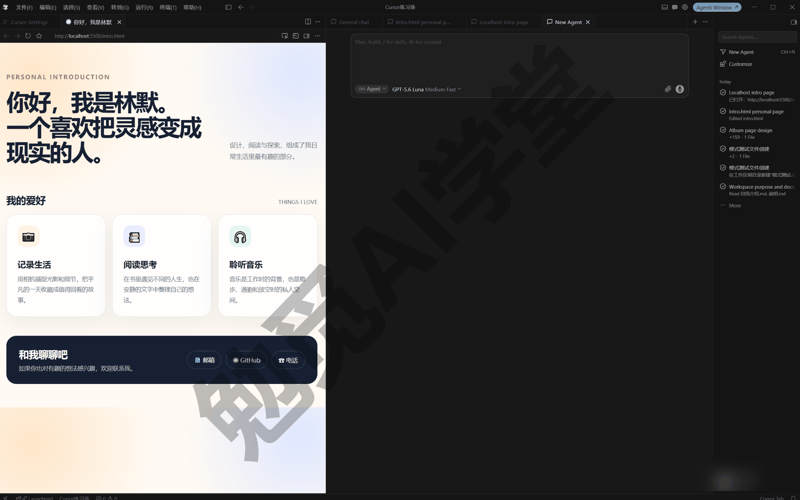
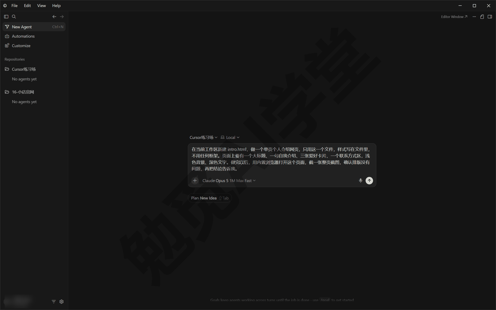
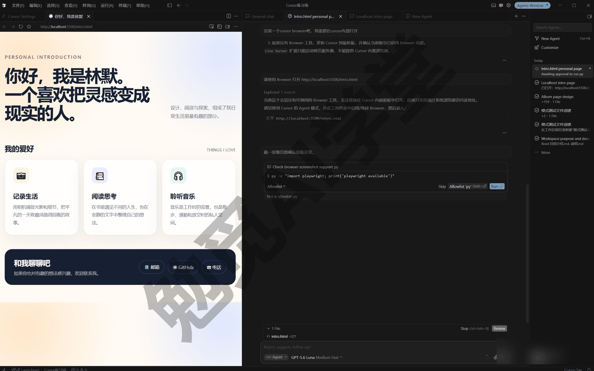
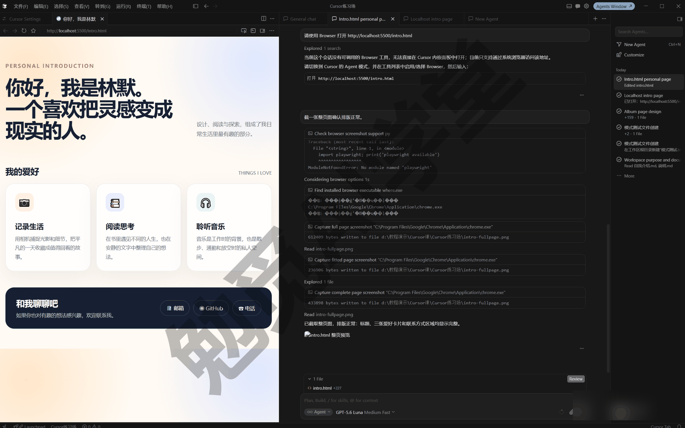
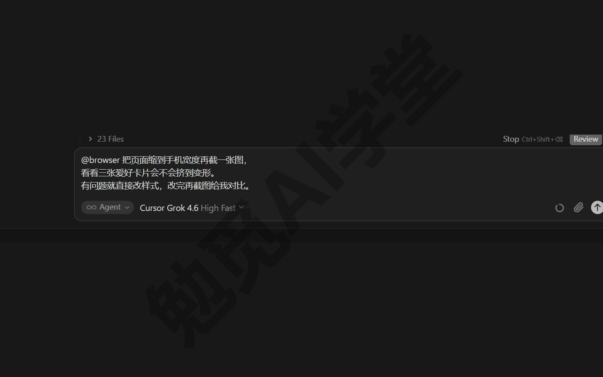
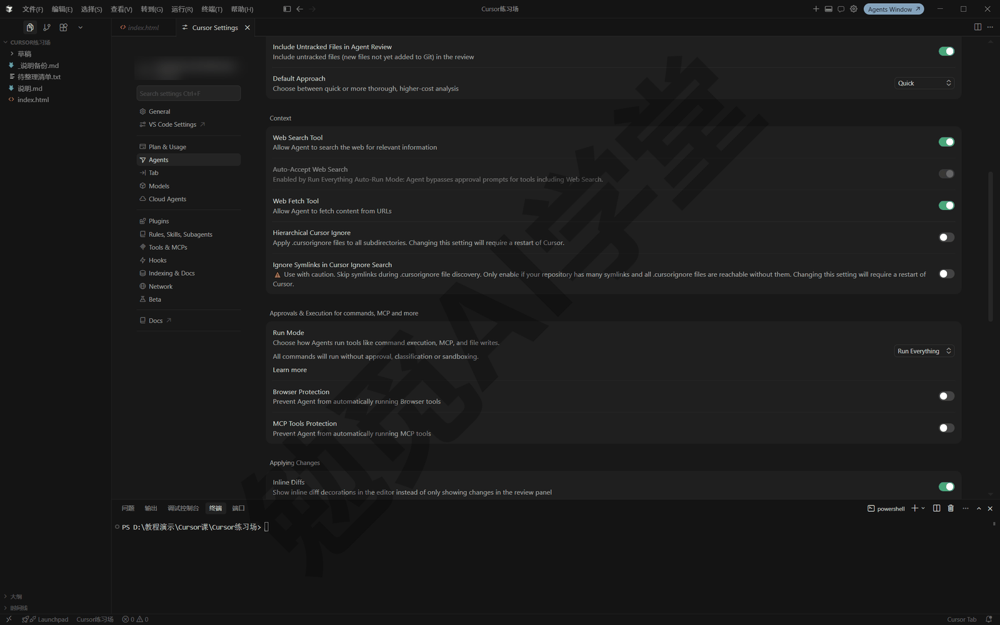
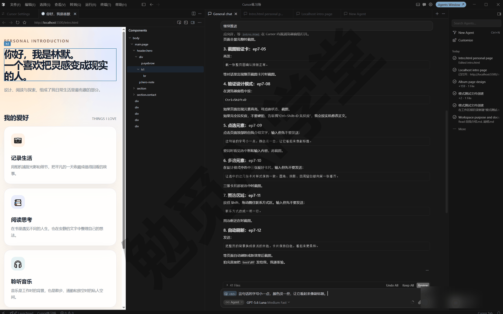
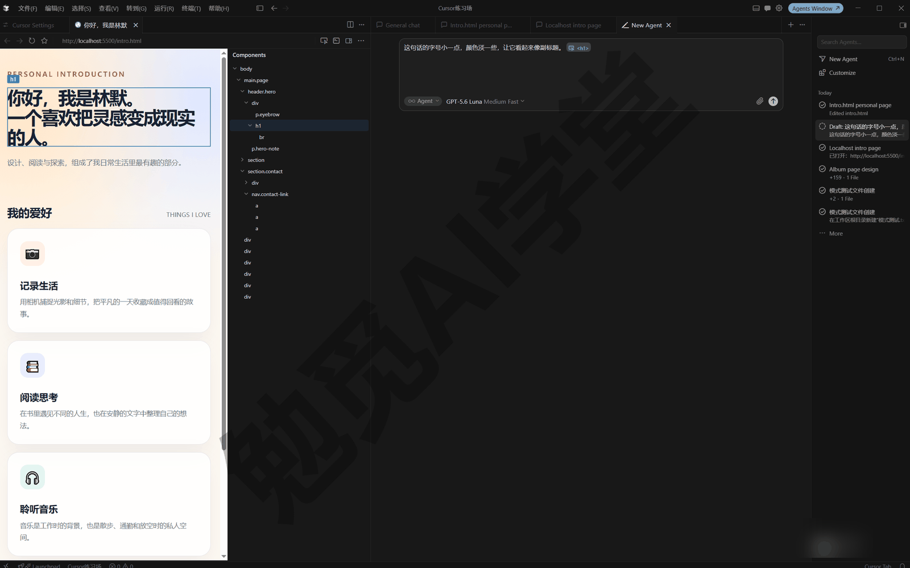
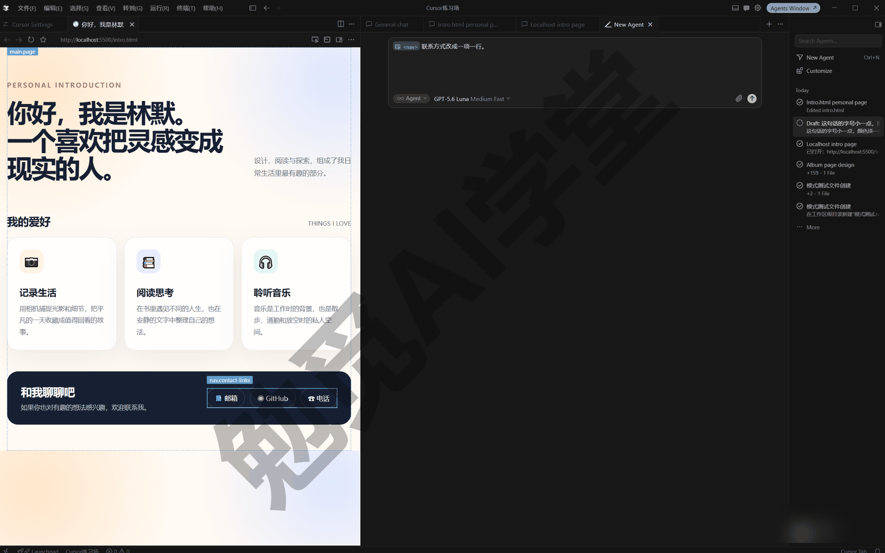
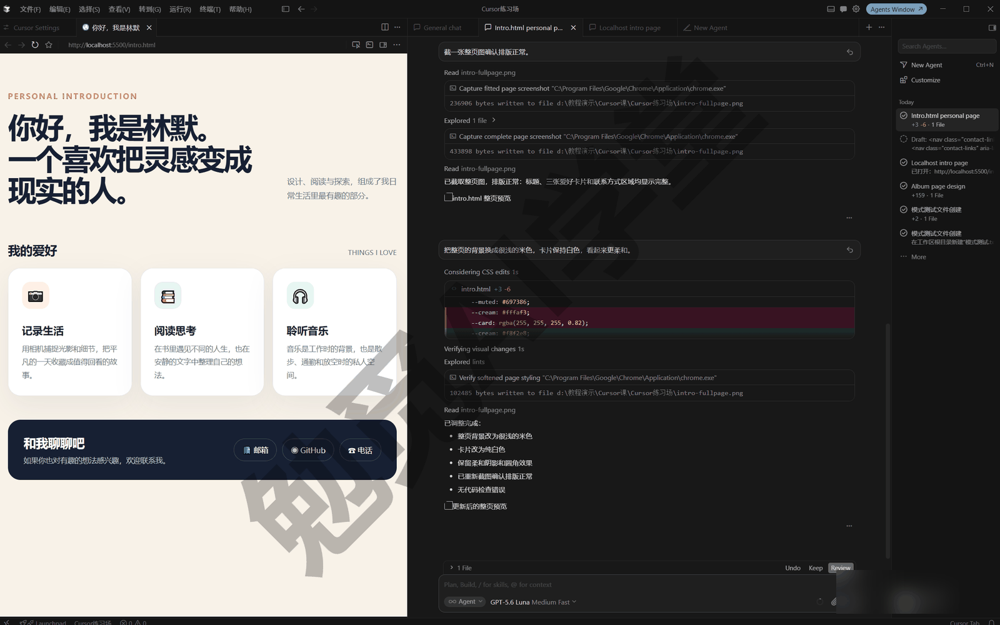

## 内置浏览器与设计模式

到上一篇《计划、提问与调试三模式》为止，你已经能让 Cursor 先想清楚再动手。这一篇做两件事：认识内置浏览器，让它把自己做的网页打开、截图、亲自验证；再学设计模式，在页面上点选、画圈、口述改版。学完这一篇，你会得到第一个看得见、验证过、改到满意的网页作品。

### 7.1 内置浏览器是什么

先说一个你很快会遇到的场景。你让智能体做一个网页，它回复说做完了，但你无法确认：页面到底是什么样子？排版有没有乱？按钮能不能点？如果每次都要自己找到文件、打开浏览器、逐项检查，验证这一步就全压在你身上。

这一步由内置浏览器来做。它是 Cursor 自带的一个浏览器，智能体可以直接操控它：打开网页、点按钮、填表单、翻页面、截图，还能读取网页运行时的报错信息和网络来往记录。它开箱即用，你不需要安装或配置任何外部工具。



**它能做的七件事。** 按官方文档，智能体在内置浏览器里有七种能力。你不必记住每一条，后面用到时知道是哪一件即可。按用途分三组来看：前两件用来到达页面，中间两件用来在页面上操作，最后三件用来核对与排查。

**导航** 是一切的起点：访问任意网址、顺着页面上的链接走、前进后退、刷新，都算导航。它执行导航时，浏览器窗格会打开对应页面，对话流里同步出现一条动作记录，你能看到它去了哪里。

**滚动** 配合导航使用：页面太长时，它把页面往下翻，找出藏在下面的内容，长文档也能一路看完。你会看到窗格里的页面随它的操作滚动，找到目标区域后它通常会停下来，接着截图或继续别的动作。

接下来两件是往页面里“动手”的能力，也是审批时管得最严的两件，7.3 节里会专门讲。

**点击** 让它能与页面互动：识别按钮、链接和表单元素，单击、双击、右键都行，也能把鼠标悬停在某个元素上看反应。你会看到页面随它的动作跳转、展开、弹出内容，对话流里每一次点击都有记录可查。

**输入** 负责填写：往输入框和表单里填文字、提交内容，搜索框、留言框这类都能操作。它填了什么，浏览器窗格的输入框里看得见，对话流的动作记录里也有一份，两处可以对着核对。

最后三件是它核对与排查的手段，也是内置浏览器最有用的部分：它说做完了不算完，还要确认确实做对了。

**截图** 是最直观的核对方式：把页面当前的样子拍下来，用来理解版式、核对视觉效果。你会在对话流里看到同一张截图，作为它确实做了这一步、页面确实是这个样子的证据。

**控制台** 读的是页面的内部消息。控制台是网页开发里的术语，你可以把它理解成网页运行时的日志本：页面里的程序出了错、输出了调试信息，都会写在这里。平时你看不到它，但智能体能读，所以“页面白屏了”“按钮点了没反应”这类问题，它可以自己去控制台找原因，不用你描述问题。它读控制台时，对话流里会出现相应的动作记录，常常还引用几行关键报错。

**网络请求** 盯着页面和外界之间的数据来往：页面加载图片、向服务器要数据，每一笔都有去有回，它能检查哪一笔没回来、返回的内容对不对。这一能力的展示位置以实际界面为准。控制台和网络请求这两条，零基础读者不需要主动使用，知道它排查问题时多了这两条线索来源就够了。

**你能看到它做的每一步。** 智能体使用浏览器时，动作和截图会显示在对话流里，浏览器本身则出现在窗格或独立窗口中（具体呈现以实际界面为准）。也就是说，它不是在暗处操作：它去了哪个页面、点了什么、截了什么图，你全程可见。

**除了验证自己的页面，它还能做什么。** 本课主要用它做两件事：验证自己做的网页（本篇），以及抓取补充资料（《实战四：关注清单更新追踪》会用到）。官方文档还列了几类用法，先知道有就行：

- 给网页做无障碍检查，比如核对颜色对比度够不够、键盘能不能操作。
- 执行自动化测试：用测试数据填表单、把流程点一遍、盯着控制台有没有报错。
- 把设计图转成网页代码，从图里提取颜色和字体。
- 拿着设计截图校准现有页面，把间距、颜色、排版改得和设计稿一致。

以后遇到这类需求，把想法直接说给它即可。

**浏览器状态按工作区分开保存，登录状态会保留。** 工作区就是你打开的那个文件夹（《两套界面全导览》定下的规则：工作区＝文件夹）。内置浏览器的状态按工作区各自保存：cookie（网站用来记住你登录状态的小数据）、网页存在本地的数据，在两次使用之间都会保留。这带来两个直接的好处：

- 你在内置浏览器里登录过的网站，下次在同一个工作区里接着用，不需要重新登录。
- 不同工作区之间互不相通。给客户 A 做的项目和给客户 B 做的项目，各自的浏览器状态是分开的，不会混在一起。

**它和你自己的 Chrome 是两回事。** 内置浏览器与你电脑上日常用的 Chrome、Edge 相互独立：书签、密码、登录状态都不共用。好处是它在里面怎么点，都不会碰到你自己浏览器里的账号和标签页；相应的代价是，需要登录的网站，它默认处于未登录状态，怎么处理见 7.6 节。

### 7.2 最小演示：让它做一个网页并自己验证

概念先讲到这里，动手走一遍最直观。这个演示做三件事：一句话生成一个静态网页（不需要服务器、双击就能打开的网页文件），让它自己打开并截图验证，最后用 @Browser 把页面状态交回对话继续改。操作按四步走，整个过程不需要编程基础。

**动手前的准备。** 新建一个空文件夹作为工作区，名字可以叫“第一个网页”，在代理窗口（Agents Window，Cursor 的智能体优先界面，《两套界面全导览》介绍过）里打开它。本节和 7.4 节的操作都在代理窗口里进行。

**第 1 步：发出生成指令。** 在输入框里发送下面这段话：

```
在当前工作区新建 intro.html，做一个单页个人介绍网页，
只用这一个文件，样式写在文件里，不用任何框架。
页面上要有一个大标题、一句自我介绍、三张爱好卡片、
一个联系方式区，浅色背景、深色文字。
做完以后，用内置浏览器打开这个页面，截一张整页截图，
确认排版没有问题，再把结论告诉我。
```



发送后，你会先看到它创建 intro.html 文件的过程，改动内容可以在差异视图里查看。

**第 2 步：批准浏览器动作。** 它第一次要使用浏览器时，默认会弹出审批提示，请求你的许可。这是浏览器动作的默认保护，看清楚它要打开的是哪个页面，批准即可。为什么默认要审批、什么情况可以放宽，是 7.3 节的主题。



**第 3 步：看它打开页面并截图。** 批准后，浏览器窗格里会出现你的个人介绍页；接着它会截一张整页截图，截图会变成一张卡片出现在对话流里。这里有一个细节：它不是靠文字转述来“想象”页面，而是真的把截图当成图像来看，所以排版挤了、颜色不对，它能自己看出来。最后它会汇报验证结论，比如排版正常，或者发现了某个问题并顺手修掉。



**第 4 步：用 @Browser 继续追问。** 《对话与上下文管理》讲过 @ 的作用：把指定的上下文附给对话。@Browser 附的就是当前浏览器页面的状态。输入 @ 后在列表里选中 Browser 一项，或者直接输入 @browser，然后发送：

```
@browser 把页面缩到手机宽度再截一张图，
看看三张爱好卡片会不会挤到变形。
有问题就直接改样式，改完再截图给我对比。
```



它会调整浏览器宽度、重新截图，发现卡片挤压就去改样式文件，改完再截一张给你对比。一条指令，检查、修改、复验三件事都做完了。

**现在你有了什么。** 你有了一个真实存在的网页文件：intro.html 就在你的工作区文件夹里，你自己双击它，也能在系统默认浏览器里打开。而且这个页面不是“它说做好了”，而是它打开过、截图过、你亲眼核对过的。这个页面别删，7.4 节的设计模式还要接着用它。

一句话总结：内置浏览器把“做完”和“确认做对了”连成了一步。接下来讲这套能力的安全边界。

### 7.3 浏览器审批三档

浏览器能点、能填、能提交，这既是能力也是风险：点错按钮、填错表单，或者被网页内容误导，后果都发生在真实的网络上。所以 Cursor 给浏览器动作设置了审批机制，默认每一步它都会先问过你再做。

**三档是什么。** 浏览器动作的审批有三档可选（名称按官方文档翻译，中文界面文案以实际界面为准）：

- **手动审批（Manual approval）**：每个浏览器动作都单独请求你的批准，看清楚再放行。这是官方推荐的默认档，也是本课建议你保持的档位。
- **白名单动作（Allow-listed actions）**：列在你白名单里的动作自动执行，其余照常请求批准。这一档适合已经用熟、反复出现的固定动作。
- **自动运行（Auto-run）**：所有浏览器动作不经确认直接执行。官方明确提醒要谨慎使用，它只适合完全可控的场景。

**在哪里调整。** 打开 Cursor 设置（快捷键 Ctrl+Shift+J），进入 Agents 分区，找到《权限、沙盒与模型》讲过的运行模式与审批那一块（官方文档旧称 Auto-Run；3.7.42 版里浏览器动作对应的是运行模式加 Browser Protection（浏览器保护）开关，中文界面的分区名与选项文案以实际显示为准）。白名单和黑名单也在这里配置：白名单里的动作跳过审批，黑名单里的动作一律会被拦下。



**白名单不是保险箱。** 官方文档说得直接：白名单和黑名单提供的只是尽力而为的保护。原因在于 AI 会做什么不是完全能预料的，其中一类典型风险叫提示注入：网页内容里可能藏着写给 AI 看的恶意指令，诱导它做出格的事。所以即使配了白名单，也建议定期回看哪些动作被自动放行了，发现不对劲就收紧。

**审批之外还有几层自带的防护。** 按官方文档，内置浏览器在一个独立、受保护的网页环境里运行，本身带了几层你看不见的保护：每次浏览器会话开始前都会生成随机的认证令牌（一串用来证明身份的临时口令），而且每个新会话都重新生成；每个浏览器标签页有独立的随机编号，防止标签页之间互相干扰；这套浏览器功能还经过了多家外部安全机构的审计。这些机制不需要你配置，你只需要知道：审批弹窗是你亲手把的一道关，弹窗背后还有产品层面的多道防线，两层合起来才是完整的安全网。

**陌生网站绝不自动运行。** 这是本节最需要记住的一条，官方文档也明确警告过：不要对不可信的代码或不熟悉的网站使用自动运行模式，否则智能体可能在你不知情的情况下执行恶意脚本、提交敏感数据。具体怎么做：

- 自己工作区里的本地页面，比如 7.2 节那个 intro.html，风险低，用熟之后可以把常用动作加进白名单。
- 公开互联网上的陌生网站，保持手动审批，让每一步都过你的眼。

另外，Windows 用户要注意：《权限、沙盒与模型》说明过，Windows 上没有文件系统沙盒，安全网主要是自动审查和审批弹窗，所以浏览器审批这道关更值得留着；那一篇介绍过的三道独立保护里，也有一道专门针对浏览器的保护开关，建议保持开启（开关名称与位置以实际界面为准）。团队版还能由管理员统一规定智能体可以自动访问哪些网站，个人用户不用管这一层。

### 7.4 设计模式：在页面上点选、画圈、口述改版

页面做出来了，接下来是改。改版的麻烦在于表达：你想说“右上角那个按钮往下挪一点”，但用文字描述位置、大小、颜色，说三句还不一定说准。界面上的修改本来就和位置有关，指着改比用文字描述快得多，也准得多。

设计模式（Design Mode）是“指着改”的工具：在内置浏览器里指定页面上的元素，再口述改法，让智能体去改。

**怎么进入设计模式。** 先让 7.2 节的页面在内置浏览器里打开。官方给的快捷键是 Ctrl+Shift+D（Mac 为 Cmd+Shift+D）；3.7.42 版上这个快捷键没有反应，可以改用浏览器窗格左侧的 Components（组件）面板：点面板里的某一项，页面上对应的元素就被选中，进入可点选状态（面板名以实际界面为准）。



下面用四种常见改法说明设计模式，例子都用 7.2 节的个人介绍页。

**改法一：点选一个元素。** 这是最基本的用法。单击页面上的自我介绍那行字，它就成了这次指令的目标，然后在输入框里发送：

```
这句话的字号小一点，颜色淡一些，让它看起来像副标题。
```

智能体拿到的不只是你这句话，还有被选中元素本身和它背后的代码，所以“这句话”指的是哪句，它不会认错。发送后它开始改代码，完成时页面自动刷新出新效果。这个“自动刷新出新效果”官方称为热更新：改动一生效页面就自动更新，不用你手动重新打开页面；本课后面一律说“自动刷新”。



**改法二：多选，让几个元素样式一致。** 有些改动的关键在元素之间的关系：第二张卡片要像第一张、两处重复的内容要删一处、一组元素要一起调。这时先点选第一个元素，再把其余元素也选上（3.7.42 版里没有找到多选入口，这一改法先了解即可，多选手势以实际界面为准），然后发送：

```
让选中的这几张卡片样式保持一致：
圆角、阴影、四周留白都向第一张看齐。
```

**改法三：画圈，把范围圈给它。** 有的问题说不清是哪个元素，只觉得“这一块不对”。按住 Shift 拖动，框选联系方式区，然后发送：

```
圈里这一块太挤了：上下留白加大，行距放大一点，
联系方式改成一项一行。
```

画圈还有一个特别的用处：你圈选时页面画面会被定格，智能体看到的就是你圈那一刻的页面状态。对有动画、轮播的页面，这一点很关键，它不会因为页面又动了而理解错你圈的内容。



**改法四：语音口述。** 改版时手在鼠标上，打字反而慢。设计模式支持语音输入，而且麦克风在智能体执行任务期间仍然可用，你可以边看结果边口述下一个改动。比如圈住页面背景后口述：

```
把整页的背景换成很浅的米色，卡片保持白色，看起来更柔和。
```

**连着改，不用等。** 设计模式的节奏适合连续改版：你不必等上一个改动完成，看到下一处不满意的地方就直接点选、发送。多个改动会并行处理（背后的并行机制在《子智能体、并行与工作树》再展开），各自完成时页面各自自动刷新。改坏了也有退路：《权限、沙盒与模型》介绍过检查点，每轮改动前有自动快照，文件可以一键还原。



**快捷键速查。**

| 动作 | 键位（Windows 写法） |
|---|---|
| 开关设计模式 | Ctrl+Shift+D |
| 框选一块区域 | Shift+拖动 |
| 把选中元素加进对话 | Ctrl+L |
| 把选中元素加进输入框 | Alt+单击 |

官方文档目前只给出 Mac 键位（Cmd+Shift+D、Shift+拖动、Cmd+L、Option+单击），表里的 Windows 键位按惯例换算；3.7.42 版上 Ctrl+Shift+D 没有反应，以你的版本上的实际表现为准。

一句话总结：单个元素用点选，元素之间的关系用多选，一块区域用画圈，腾不出手就用语音。四种改法解决的是同一件事：不再用文字描述位置，而是把位置直接指给它看。

### 7.5 设计模式背后的原理

知道原理不是为了炫技，而是为了用得准：明白它拿到了什么信息，你就知道什么时候该点选、什么时候该画圈、出了偏差是哪路信息没对上。

你点选一个元素时，智能体同时收到两路信号。

**第一路：元素身份。** 元素身份包括这个元素在页面结构里的地址（术语叫 xpath，相当于从页面顶层一路找下来的路径）、对应的组件名、元素的属性，以及当前实际生效的样式；如果页面是用某种网页框架（一套现成的搭页面工具）做的，还会带上这个组件在框架里的相关信息。这一路信号解决两个问题：一个是定位，它能顺着地址找到源代码里对应的那一段，改动落在正确的文件、正确的位置上；另一个是现状，它知道你点的这个标题现在字号是多少、颜色是什么值，你说“加大一档”，它有参照，不用凭感觉猜一个数。

**第二路：一张截图。** 这张截图记录页面版式、周围元素和页面当时的状态。这一路补上元素身份给不了的东西：空间关系。“卡片之间太挤”“标题和正文没对齐”这类问题，光看代码不容易看出来，看图一目了然。截图还锁定了你回应的是哪个状态：页面后来又变了也不要紧，它知道你说的是刚才那一幕。

两路缺一不可。只有截图，它知道你指的是哪一块，却可能找不准代码，改错位置；只有元素身份，它知道代码在哪，却看不出你嫌的是间距还是颜色。两路合在一起，你的一句“这里太挤”才能变成一次准确的修改。

**和“把截图放进对话”有什么区别。** 《对话与上下文管理》讲过，可以把截图拖进对话让它照着改。那个办法也能用，但只有截图这一种信号：你指的是哪个元素、对应哪段代码，全要它从图里猜，页面结构一复杂就容易猜错地方；截图还得你自己截、自己传。设计模式把这两步都省了：圈选的同时就完成了定位，元素身份随着你的选择一起交给了它，猜的环节被拿掉了。所以日常改自己的页面，优先用设计模式；只有在改不了代码的时候，比如给别人的页面提修改意见，才退回发截图的方式。

**为什么推荐快模型。** 设计模式的节奏是连发小改动：一处点选、一句改法，改动小而明确，不需要多深的推理，需要的是快去快回。一个改动等太久，你的注意力就断了，“看到哪改到哪”的连续性也就没了。官方推荐在设计模式下使用 Composer 2.5 这类速度快、擅长界面工作的模型（可用模型以实际界面为准）；切换位置在输入框的模型选择器，《权限、沙盒与模型》讲过模型选择器和 Ctrl+/ 快捷切换的用法。反过来，整页重做、交互方案设计这类需要想清楚再动手的任务，就换回能力更强的模型，宁可慢一点也要改得准。

这套原理实际怎么用，可以拿一条具体的改法体会一下。在设计模式里点选大标题后发送：

```
选中的这个标题和它下面那句介绍靠得太近了，
中间留出大约一行文字的空隙，两者都在页面里水平居中。
```

“选中的这个标题”靠元素身份对应到具体代码，“靠得太近”靠截图看出空间关系。一句话里两路信号各管一半，这就是设计模式比纯文字描述更快、更准的原因。

### 7.6 边界与常见坑

这一节把内置浏览器和设计模式的典型问题集中过一遍，每个问题先说你会看到什么，再说为什么会这样，最后说怎么处理，遇到时回来查。

**页面不稳定，点选点不准。** 在有轮播图、动画的页面上点选，改动会落在别的元素上，或者它复述的内容和你看到的对不上。这是因为这类页面的元素位置随时间变化，你点下去的那一瞬间，目标可能已经移走了。遇到这种页面，优先用画圈：画圈是在定格的画面上做的，你圈出的范围就是它看到的范围；必要时先让它把动画暂停，改完再恢复。

**验证码过不去。** 它停在验证码或人机校验页面，反复尝试也没有进展。这类校验的目的就是拦住自动化操作，智能体不应该、通常也无法替你通过。这时你在浏览器窗格里手动完成验证，通过之后再让它接着做后面的步骤。

**需要登录的页面。** 它打开的页面是未登录状态，看不到你账号里的内容。原因是内置浏览器与你日常用的浏览器相互独立，不共用登录状态（7.1 节里讲过）。有两种处理办法：

- 按官方文档，可以直接在对话里告诉它登录方式，让它自己完成登录。
- 你在内置浏览器窗格里手动登录一次。cookie 按工作区保留，下次还在。

网银、支付这类敏感账号，暂时不要放进任何自动化工具里，包括内置浏览器。

**本地开发服务器与端口。** 以后做带交互的项目时（《实战一：小店官网》就会遇到），页面可能突然打不开，或者打开的还是旧内容。这类页面通常要靠本地开发服务器才能打开：开发服务器可以理解成一个小程序，它让浏览器能打开你项目里的网页，端口则是同一台电脑上区分不同服务的门牌号；服务器没在运行，或者端口对不上，页面自然出不来。把情况告诉它就行。官方在这一点上改进过，智能体会先检查已经在运行的开发服务器、使用正确的端口，而不是再启动一个重复的服务器；最常见的原因是你自己手动关掉了服务器又忘了这回事，让它检查并重新启动即可。

**改了但页面没变化。** 它汇报改完了，页面看上去还是老样子。这是自动刷新偶尔不生效造成的，尤其是没有开发服务器的静态页面：改动已经写进了文件，页面却没有重新加载（具体表现以实际界面为准）。处理办法是先手动刷新浏览器窗格；还不行，就发一条指令让它自己核实：

```
重新用内置浏览器打开 intro.html，刷新后截一张整页截图，
和上一次的截图对比，告诉我这次的改动有没有生效。
```

页面上显示的和文件里写的对上了，才算真的改完。

**截图看不清。** 整页截图里文字太小、细节糊成一团，你和它都看不清。原因是页面内容太长，整页截图会把所有内容压进一张图，每一处的细节就都变小了。解决办法是让它滚动到目标区域再截一张，或者放大后只截局部；你自己也可以直接看浏览器窗格，不必全靠截图。

**设计模式点不中想改的东西。** 点选没反应，或者选中的总不是你想要的那个元素。这是因为在个别页面结构下，点选的定位不稳定（在本地静态页面上的表现以实际情况为准）。处理办法分两步，一步不行再退一步：先换画圈，把范围圈给它；画圈也不行，就退回对话改版，用文字把要改的位置和改法描述给它。这条退路一直可用，《实战一：小店官网》的改版环节也备着同一条兜底。

### 7.7 练习任务

下面三个任务把本篇的能力串起来，方括号里的内容换成你自己的。

**任务一：生成个人介绍页并让它自己验证**

```
在当前工作区新建 about-me.html，做一个单页自我介绍网页：
大标题写“你好，我是[你的名字]”，配一句自我介绍、
三张爱好卡片和一个联系方式区，浅色背景。
做完用内置浏览器打开页面，先截一张整页截图确认排版，
再缩到手机宽度截一张，两张截图都发到对话里。
```

完成标准：对话流里能看到桌面宽度和手机宽度各一张截图；如果排版有问题，它主动指出并修正了；如果没有问题，它明确说出了这个结论。

**任务二：用设计模式改配色和间距各一次**

在内置浏览器里打开 about-me.html，开启设计模式。先点选大标题，发送：

```
这行标题的颜色换成深绿色，和页面其他文字拉开层次。
```

再点选任意一张爱好卡片，发送：

```
三张爱好卡片之间的间距拉大一点，
让每张卡片四周的留白更均匀。
```

完成标准：两处改动都在页面上生效；你能说出这两次它分别拿到了哪两路信号（元素身份和截图）。

**任务三：用画圈改一块拥挤区域**

在设计模式下按住 Shift 拖动，圈住页面上你觉得最挤的一块（联系方式区通常是首选），发送：

```
圈里的内容太挤：加大上下留白，行距放大，
每项信息单独一行。
```

完成标准：圈选区域的版式明显松开；改动前后各留一张截图，能对比出差别。

### 7.98 本篇小结与自检

这一篇带你认识了内置浏览器的七种能力和审批三档，用最小演示走完了“生成、打开、截图、验证”的完整流程，又用设计模式的四种改法把页面改到满意。

可以对照下面的清单检查学习结果：

- [ ] 能说出内置浏览器的七种能力，知道它与你自己的 Chrome 相互独立
- [ ] 完成了最小演示：一句话生成网页，看它自己打开、截图、给出验证结论
- [ ] 会用 @Browser 把当前页面状态附给对话继续追问
- [ ] 知道浏览器审批三档的区别，能说出为什么陌生网站不开自动运行
- [ ] 会开关设计模式，点选、多选、画圈、语音四种改法至少用过两种
- [ ] 改坏或改不动时知道退路：手动刷新、重新截图、检查点还原、退回对话改版

完成这些内容后，你已经有了第一个自己做出来、亲眼验证过的网页作品，也体验了在页面上指着改的工作方式。下一篇《编辑器三件套：Tab、内联编辑与扩展》会把场景切回编辑器，讲清 Tab 补全怎么用、怎么关、Ctrl+K 怎么原地改内容，以及扩展和主题怎么装。

### 7.99 新手常见问题

**Q1：能让它帮我逛网站、下单买东西吗？**

技术上它能导航、点击、填表，本地页面和公开网站都能访问。但涉及账号和支付的操作不建议交给它自动完成：保持手动审批，让每一步过你的眼，支付环节自己来。它更合适的角色是帮你查资料、测试页面、核对信息。

**Q2：能用我已登录的账号吗？**

内置浏览器与你日常的浏览器相互独立，默认没有你的登录状态。可以在内置浏览器里登录一次，登录状态按工作区保留，下次接着用；也可以在对话里告诉它登录方式。敏感账号（网银、支付类）建议不要放进来。

**Q3：设计模式只能改自己的网页吗？**

是的，这由它的原理决定：点选元素后，它要去改你工作区里对应的源代码。别人的网站你没有源代码，它无处下手。对别人的网站，你可以用内置浏览器查看、截图、分析，但改版只对自己工作区里的页面有效。

**Q4：设计模式快捷键按了没反应怎么办？**

依次检查三件事：焦点（也就是你最后点过、正在接收键盘输入的位置）是否在内置浏览器窗格上，而不是输入框或别的面板；这组键位是否被其他软件或输入法占用，可以把输入法切到英文状态再试；键盘快捷方式设置里搜索设计模式相关命令，确认键位设置（命令确切名称以实际界面为准）。本课给出的 Windows 键位是按惯例换算的，与实际不符时以你的界面为准。

**Q5：每个浏览器动作都要批准，太麻烦了，能省吗？**

可以按场景放宽，但别一步到位全放开。自己工作区里的本地页面用熟之后，把反复出现的动作加进白名单，其余保持审批；自动运行只留给完全可控的环境。陌生网站永远手动审批，这一条不放宽。
