## 编辑器三件套：Tab、内联编辑与扩展

前面几篇的操作基本都在代理窗口里完成，这一篇把场景切回编辑器，讲编辑器里的三件工具：Tab 补全、内联编辑 Ctrl+K、扩展，再加上主题字体和从 VS Code 搬家。不写代码的读者也建议读完：至少要知道 Tab 建议在哪里关，免得写笔记时被它打扰。

### 8.1 什么时候需要切到编辑器

《两套界面全导览》讲过 Cursor 的两套界面：代理窗口（Agents Window）以智能体为中心，编辑器则是经典的 IDE 形态（IDE 就是集成开发环境，你可以把它理解成一个功能齐全的文件编辑工作台）。两套界面随时互相切换、可以同时开着，切换的方法那一篇也讲过：在命令面板里执行 Switch to Agents Window 或 Open Editor Window 这两条命令。

日常对话、跑任务，代理窗口就够了。但有几类事，编辑器明显更合适：

- **同时看很多文件**：编辑器支持分屏，把两个文件并排对照着看、一边看一边改，这是它的传统强项。
- **装扩展**：扩展面板属于编辑器，官方文档明确写了这一点，在代理窗口里是找不到的，见 8.4 节。
- **改主题、调字体**：外观设置的入口也在编辑器里，见 8.5 节。
- **原地小修改**：本篇的两个主角 Tab 补全和内联编辑 Ctrl+K，主要用在编辑器的文件编辑里，见 8.2 和 8.3 节。

**怎么切过去。** 按 Ctrl+Shift+P 打开命令面板，输入 Open Editor Window 并回车，当前工作区就会在编辑器里打开；这条命令自带快捷键 Ctrl+Shift+N，代理窗口右上角的 Editor Window 按钮也是同一个入口。切过去后看到的就是《两套界面全导览》介绍过的编辑器布局：左侧资源管理器、中间编辑区、底部终端。想回代理窗口，同样在命令面板里执行 Switch to Agents Window，或者点编辑器右上角的 Agents Window 按钮。两边打开的是同一个文件夹，在哪边改都是改同一份文件，不会有两套。


**一个简单的判断标准。** 官方对两套界面的分工给过一个思路：主要由智能体替你完成工作、你负责提需求和验收时，代理窗口更合适，它让你站在任务这一层看全局；要自己动手精细地修改文件、并排比对很多内容、要用各种扩展时，编辑器这套经典形态更合适。具体到本课的场景：整理文件、做网页、跑流程，都以代理窗口为主；像本篇这样调补全、改外观、装扩展，切到编辑器，做完再切回去。拿不准就先留在代理窗口，遇到本篇这些操作再切到编辑器也不迟。

**只想看一眼文件，不必切换。** 《两套界面全导览》介绍过，代理窗口里按 Ctrl+P 可以搜索并查看文件，Ctrl+Shift+F 做全局搜索。所以只是看文件，不需要切换；要自己动手改文件、分屏对照，或者要打开扩展面板的时候，再切到编辑器。

**两套界面可以同时开。** 两套界面不是只能二选一。你可以让代理窗口继续跑任务，另开编辑器翻文件、调设置，屏幕够宽就左右各开一个：左边盯任务进度，右边做本篇的各项操作，互不耽误。

另外，编辑器里不是没有 AI。按 Ctrl+I 可以打开智能体侧栏，对话照常进行；本篇讲的三件套是对话之外的简便小工具，解决“不值得开一轮对话”的小事。

### 8.2 Tab 补全：会用，也要会关

**它是什么。** 在编辑器里打字时，Cursor 会根据你最近的编辑、光标周围的内容，以及自动检查工具发现的错误，预测你接下来要输入什么，并用灰色文字显示在光标前方。这就是 Tab 补全：按一下 Tab 键，灰字变成正式内容；不想要，不理它继续打字即可。

**为什么需要它。** 写代码时，大量输入是有规律的重复：改了这里，下面三行大概率要跟着改。Tab 补全把这类“下一步”提前显示出来，你只管确认。对不写代码的读者，情况正好反过来：它在 .md、.txt 这类文本文件里也会出现，你需要知道它是什么、怎么控制它，不然写笔记时灰字反复弹出，会打扰你写东西。

**先看它一眼。** 在编辑器里新建一个文件（名字随意，比如 试一试.md），随手写半句话，停顿一下，光标前方多半会出现灰色的续写建议。这个建议只是预览，不接受就不会进入文件。拿写笔记举例：你在待办清单里连写了两行“买牛奶”“买鸡蛋”，第三行刚敲出一个“买”字，灰字可能已经把这一行剩下的部分补出来了，它对这类有规律的内容最敏感。

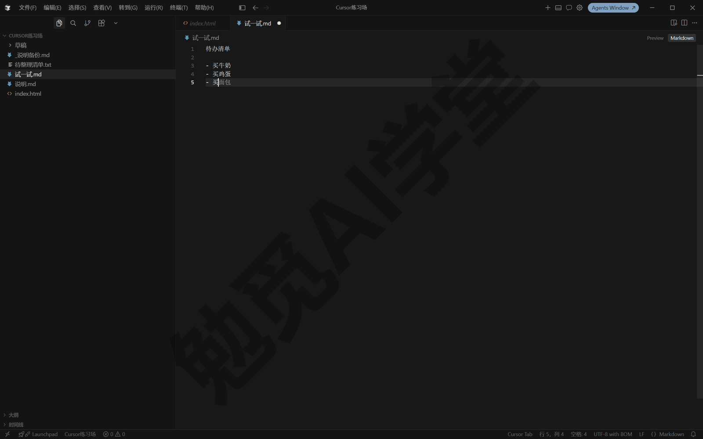

**接受与拒绝的三种操作。**

- **接受整条建议**：按 Tab，灰字整段变成正式内容，光标移到建议末尾。
- **拒绝**：按 Esc，建议消失；或者不去理会、继续输入自己的内容，建议同样会消失。
- **按词接受**：按住 Ctrl 再按右方向键（Ctrl+→），一次只接受建议里的下一个词。建议一半对一半不对时，用它把对的部分收下来，剩下的自己写。

这三种操作只对眼前这一条建议有效，接受或拒绝之后，下一条建议照常出现。

**接受之后再按一次 Tab：跳到下一处。** 这是很多人不知道的用法，官方叫 jump-in-file。你接受一条建议后再按 Tab，它会预测你下一个要编辑的位置并把光标直接跳过去，省掉自己滚动查找的时间。连续的小修改可以一路 Tab 下去，改完一处跳一处。

**它不止补一行。** Tab 补全能一次修改多行、补上缺失的引用语句（写代码时把用到的外部组件声明进来的那类固定写法）。官方文档还提到它能给出跨文件的建议：一个文件里的改动需要另一个文件跟着变时，编辑器底部会出现一个小窗，预览另一个文件里要改的位置，按提示操作就能跳过去处理。3.7.42 版上没有出现这个画面；你的版本有没有这一项，以实际界面为准。

**状态栏指示器：暂停与关闭都在这里。** 编辑器右下角状态栏有一个 Tab 指示器，这就是控制开关的入口；不知道它的存在，被建议打扰时就只能忍着。点开它有三个选项（选项文案以实际界面为准）：

- **暂停（Snooze）**：临时停用一段时间，时长可选。它适合接下来一小时要专心写文档的场景，到点自动恢复。
- **全局关闭**：所有文件都不再出建议，需要时再回来打开。
- **按文件类型关闭**：只对指定类型关闭，比如 markdown（笔记常用的纯文本格式）、JSON（程序配置常用的文本格式）。写笔记的人把 markdown 关掉，代码文件里照常享受补全，两不耽误。

做完任意一种设置，当前文件里的灰字建议立即消失或恢复，状态栏的指示器也会反映当前状态。更细的开关在 Cursor 设置（Ctrl+Shift+J）的 Tab 分区里，开关名称以实际界面为准。

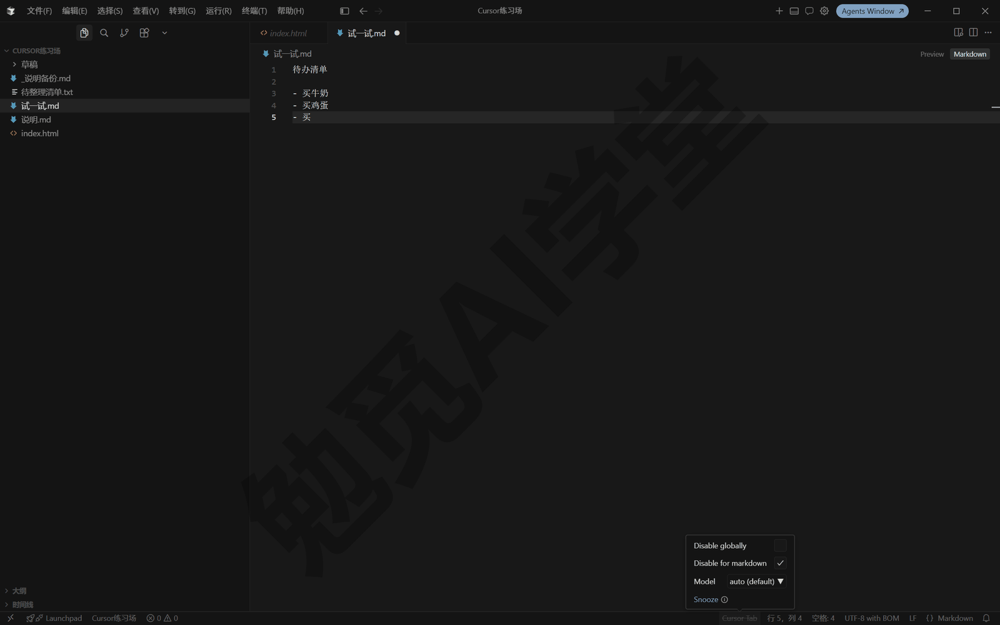

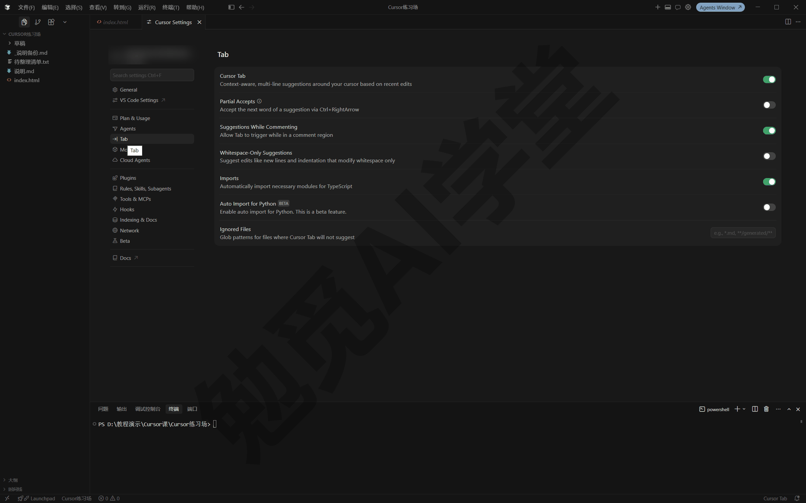

**改接受键。** 如果 Tab 键与你的输入习惯冲突，可以换一个键：在键盘快捷方式设置里搜索 Accept Cursor Tab Suggestion，重新设置键位（打开键盘快捷方式的办法见 8.5 节）。

**边界与提醒。** Tab 补全是它来猜你要写什么，只会顺着你正在写的东西往下预测，不接受指挥；想指挥它按你的话改，用 8.3 节的内联编辑。另外还有两条提醒：

- 建议终究是猜测，接受前扫一眼，数字、人名、金额这类内容尤其要核对，别让随手一按的 Tab 把错的内容带进文件。
- 免费套餐的 Tab 补全用量有限制，用完后的表现以账号页面显示为准；额度与用量在哪里查看，《权限、沙盒与模型》介绍过。

### 8.3 内联编辑 Ctrl+K：选中一段，原地改

**它解决什么问题。** 你只想改一句话、一个函数、一小段样式，为这点事打开对话面板、描述背景、等它跑完，步骤太多了。内联编辑（Inline Edit）的思路是：选中哪里就改哪里，指令只要一句话，结果就在原地出现。

**基本用法四步。**

**第 1 步：选中要改的内容。** 用鼠标或键盘选中一段文字或代码。养成先选中的习惯，改动范围就是你选的这一段，不会改到别的地方。

**第 2 步：按 Ctrl+K。** 选区附近弹出一个小输入条，这就是内联编辑的指令入口。

**第 3 步：描述改法，回车。** 例如选中一段啰嗦的文字后输入：

```
把这一段改写得更简洁，保留全部要点，语气正式一点。
```

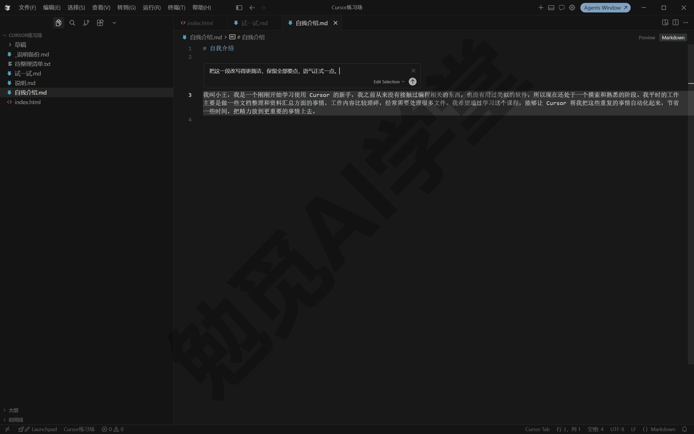

**第 4 步：看结果。** 它把修改应用到你选中的内容上，通常会把改前和改后对照着显示出来，可以接受或拒绝（呈现形态与按钮以实际界面为准）。接受后改动写进文件；不满意可以拒绝，或按 Ctrl+Z 撤销。

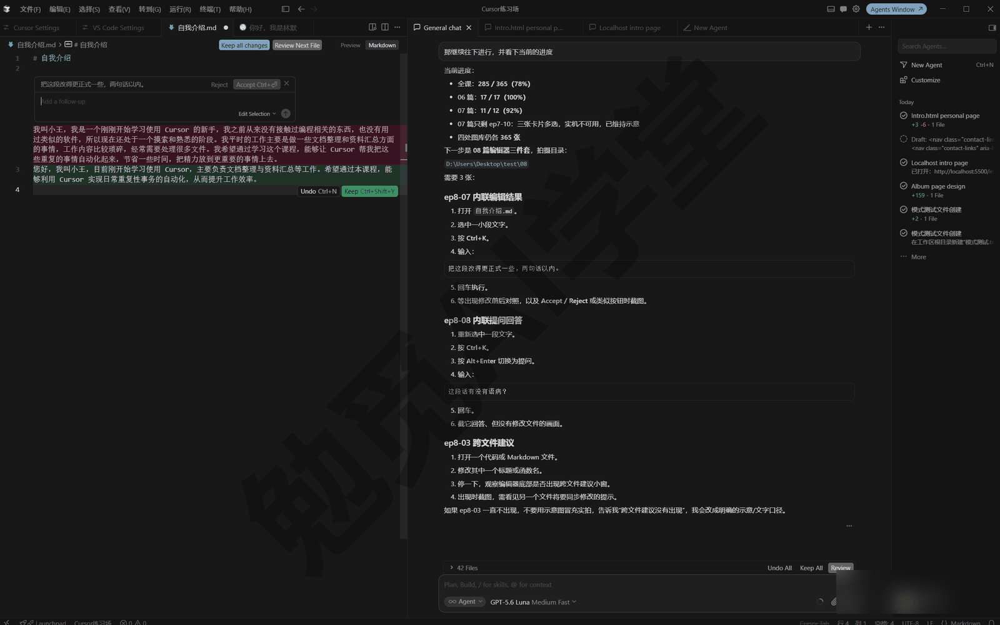

**不满意就追加，不用重来。** 结果不理想时，直接在输入条里补一句追加指令，比如“再短一点，两句话以内”，回车，它在刚才的基础上继续改。可以一直这样追加下去，直到满意。

**只问不改：Alt+Enter 切换成提问。** 有时你不想改，只想问：这段代码在做什么？这段话有没有语病？选中内容按 Ctrl+K 后，再按 Alt+Enter 切换到提问状态，输入问题回车，它只回答、不动文件。看完回答想按它说的改，按官方文档，输入 do it 并回车，它就会照建议改。《计划、提问与调试三模式》里的 Ask 模式是整轮对话层面的只读模式，这里的提问是针对选中内容的快问快答，范围不一样，道理是一样的：都是只回答、不动手。

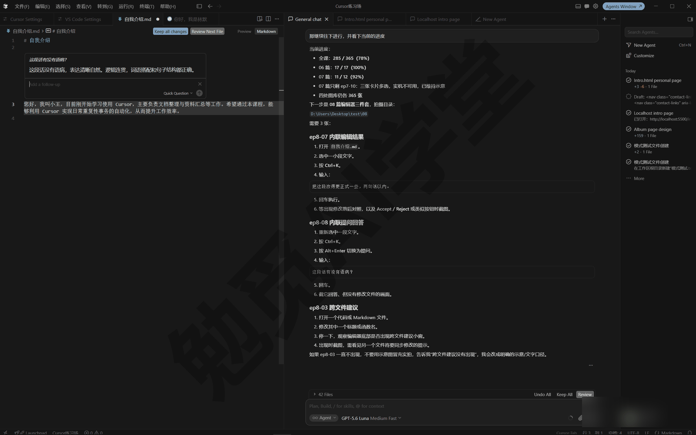

**改动变大了：Ctrl+L 升级到智能体。** 改着改着发现这不是一段话的事，牵扯好几个文件，或者需要跑命令验证，就该换工具了。选中相关内容按 Ctrl+L，选中内容会作为上下文带进智能体对话，接着在对话里把完整需求说明白。《两套界面全导览》提过 Ctrl+I 和 Ctrl+L 都能打开智能体侧栏，区别在于带不带选中内容作为上下文。

**三件工具怎么分工。** 三件工具都认识了，放在一起比较一下：

- **Tab 补全**：它主动猜，你只管接受或忽略，适合顺着你正在写的内容往下补。
- **内联编辑 Ctrl+K**：你主动说，它按你的话改选中的那一段，适合目标明确的局部修改。
- **智能体对话**：能读写多个文件、跑命令、自己验证，适合规模大一些的完整任务。

**不写代码也用得上。** 内联编辑对普通文本同样有效：选中一段中文让它润色、改语气、压缩篇幅，都是一句话的事。写周报、改邮件草稿时，它比来回复制到聊天工具里方便得多。

### 8.4 扩展：从哪来、怎么装、怎么关

**扩展是什么。** 扩展是给编辑器加功能的安装包：主题、语言包、各类小工具都是当作扩展来提供的。你其实已经装过一个：《认识与装好》里把界面切成中文时装的 Chinese (Simplified) Language Pack 语言包，就是一个扩展。

**为什么需要扩展。** 编辑器的默认功能面向多数人，个性化的部分留给扩展按需补充。对本课读者，最常用的就是两类：换主题的、补语言支持的。写代码的读者以后还会用到格式化、预览类的工具扩展。

**扩展从哪里来、怎么保证安全。** Cursor 的扩展来自 Open VSX，这是一个开放的扩展仓库，不同于微软 VS Code 商店。在你和 Open VSX 之间，Cursor 自己还加了一层中转：扩展的搜索和下载都经它转发。一个扩展在能被搜到、下载之前，会先经过自动化的恶意软件与供应链分析（供应链分析指的是不光查扩展本身，也查它携带和依赖的组件有没有被植入恶意代码），没通过审查的会被直接拦下。因为有这套机制，下面三点你要知道：

- **多数热门扩展都有**：常用的 VS Code 扩展大部分也在 Open VSX 上架，日常要用的基本都能找到。
- **但不是全部**：只在微软商店上架的扩展装不到；其中一些使用广泛的，Cursor 官方用 Anysphere 这个发布者名字，重新发了一版检查过的替代版。
- **同名不等于同一个作者**：同一个扩展名字在不同商店里，发布者可能不是同一个。装之前看一眼发布者名字，选你听说过或带验证标记的，就像收快递前先看寄件人。

部分发布者的名字旁会带验证标记，表示通过了额外的身份确认和安全审查（标记样式以实际界面为准）。它不是万能保证，但在两个同类扩展之间犹豫时，优先选带标记、下载量大的那个，是最简单的判断办法。

**装一个试试。** 以装主题为例：

**第 1 步：确认自己在编辑器里。** 扩展面板属于编辑器；如果你在代理窗口，先按 8.1 节的方法执行 Open Editor Window 切回来，这是官方文档明确写的前提。

**第 2 步：打开扩展面板。** 按 Ctrl+Shift+X，左侧出现扩展面板，上方是搜索框。

**第 3 步：搜索。** 输入 theme，结果里会列出各类主题扩展；也可以直接搜具体名字。列表内容以实际界面为准。

**第 4 步：安装。** 挑一个下载量和评价都不错的，点它的 Install（安装）按钮。扩展装完立即生效，主题类扩展装好后就会出现在主题列表里（切换方法见 8.5 节）。

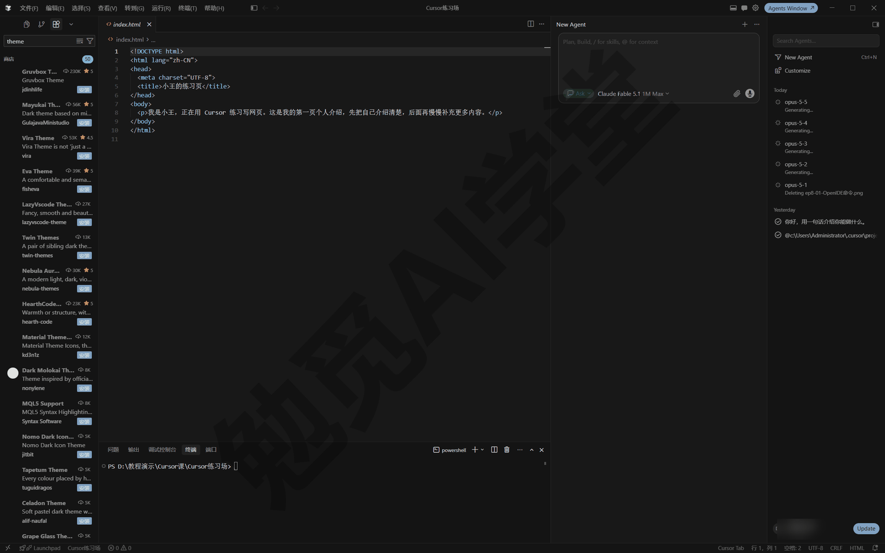

**禁用、卸载与冲突排查。** 在扩展面板里找到已装的扩展，点 Disable（禁用），禁用分全局禁用和只在当前工作区禁用两种范围；不再需要的扩展也能在同一处卸载（按钮文案以实际界面为准）。排查问题时它很有用：编辑器变卡、某个功能异常、AI 功能表现不对，官方建议先禁用可疑扩展看问题是否消失。稳妥的做法是从最近安装的开始逐个禁用，每禁用一个观察一次，定位到出问题的扩展后卸载或换替代品。

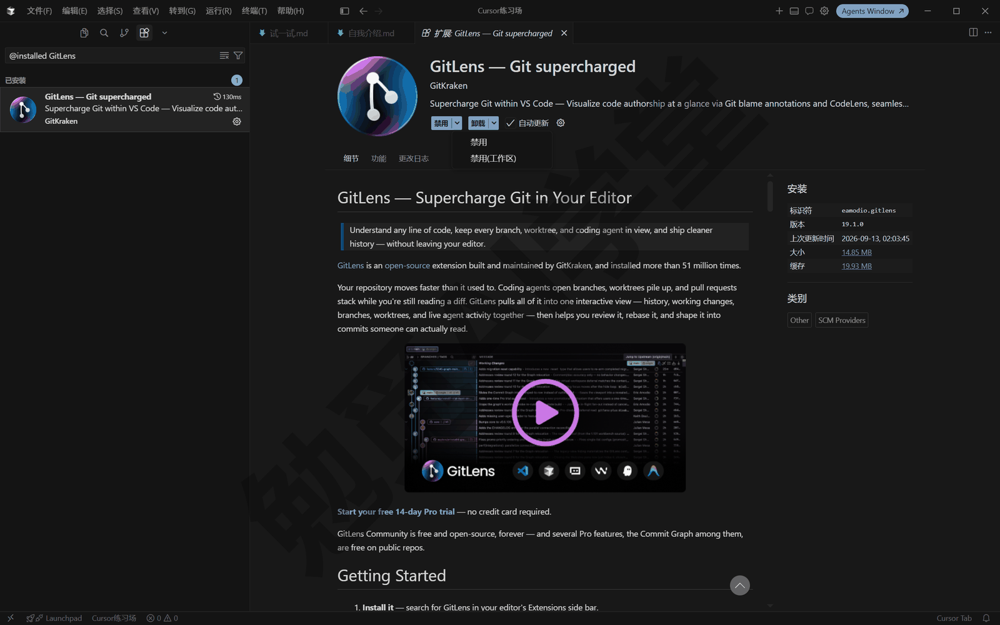

**两条安全习惯。**

- 只从扩展面板安装，来路不明的扩展安装文件不要手动装。
- 用不到的扩展及时禁用或卸载，装得越少，出问题时越好排查。

公司团队版还能统一限定允许安装的扩展清单，个人用户不用管这一层。

### 8.5 外观与快捷键

**先分清两个设置入口。** Cursor 有两处设置，别找错地方：

- **编辑器设置**：快捷键 Ctrl+,（Ctrl 加逗号），管外观、字体、编辑行为这类传统编辑器选项，顶部有搜索框。
- **Cursor 设置**：快捷键 Ctrl+Shift+J，管 AI 相关的功能，比如 Tab 分区、Agents 分区。

本节的操作大多在编辑器设置里；前几篇调审批、调模型时去的是 Cursor 设置。分不清该去哪边时，先想你要改的是“编辑器是什么样子、怎么编辑”，还是“AI 功能怎么运行”：改外观和编辑行为去编辑器设置，改 AI 功能去 Cursor 设置。

**换主题。** 按 Ctrl+Shift+P 打开命令面板，输入 Preferences: Color Theme 并回车，出现主题列表；用上下方向键逐个预览，界面颜色马上跟着变，回车确定。主题只改界面外观，不影响任何功能和文件内容，可以放心逐个试。想要浅色就选 Default Light Modern 这类带 Light 的主题，想要深色可选 Default Dark Modern 或 Cursor Dark（列表内容以你实际安装的主题为准）。在 8.4 节装的主题扩展也会出现在这个列表里。

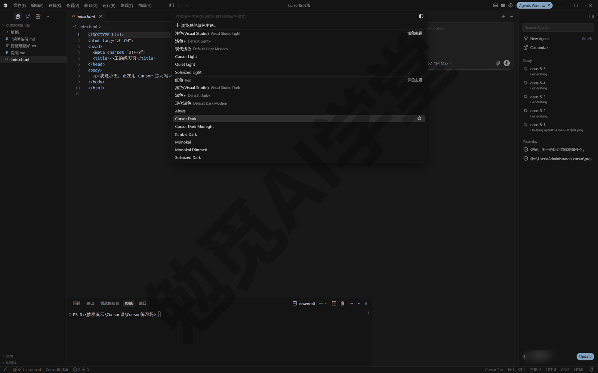

**跟随系统深浅色。** 想让 Cursor 跟着系统的深色模式自动切换：打开编辑器设置（Ctrl+,），搜索 Auto Detect Color Scheme，勾选开启。之后系统切换深浅色，Cursor 自动跟随；习惯让系统白天浅色、夜间深色自动轮换的读者，开这一项以后就不用每天手动换两次主题。

**调字体字号。** 在编辑器设置里搜索 Font Size，可以分别调整编辑区字号和终端字号，数值一改，对应区域的文字随即变大变小；两处是独立的设置项，想两处的字都够大就分别调一次。搜索 Font Family 可以更换字体，填入你电脑上已安装的字体名称即可。想要连字效果（把某些字符组合显示成连贯符号）就搜索 Font Ligatures 打开，不需要可以不管。屏幕分辨率高、觉得字小看着累的读者，先调字号再考虑换字体，见效最快。

**改快捷键。** 打开键盘快捷方式页面是两步连按：先按 Ctrl+M，再按 Ctrl+S。官方文档早前写的是 Ctrl+R、Ctrl+S，3.7.42 版里 Ctrl+R 打开的是最近项目列表，如果你按下去也是这个结果，就换用前一组。拿不准就走命令面板：按 Ctrl+Shift+P，输入“打开键盘快捷方式”，选“首选项: 打开键盘快捷方式”回车。

打开后，搜索要改的命令，点它旁边的铅笔图标（或双击这一行），按下你想用的新组合，回车保存。如果新组合已经被别的命令占用，页面会在输入框下方提示已有几条命令使用同一组合，看到提示就换一组，别让两个功能共用同一个键。

8.2 节里提到的 Tab 接受键，就在这里搜 Accept Cursor Tab Suggestion 来改。本篇用到的几组默认键位也在这一页里一并对一遍（括号里是讲到它的小节）：

- **Ctrl+K**（8.3）：内联编辑，选中一段内容后按它，在原地按你的指令改写。
- **Ctrl+I 和 Ctrl+L**（8.1、8.3）：都打开智能体侧栏，区别是 Ctrl+L 会把当前选中的内容一起带进对话当上下文。
- **Tab**（8.2）：接受当前的补全建议，灰字变成正式内容。

完整速查表和中文输入法冲突的处理，《两套界面全导览》整理过，这里不重复。

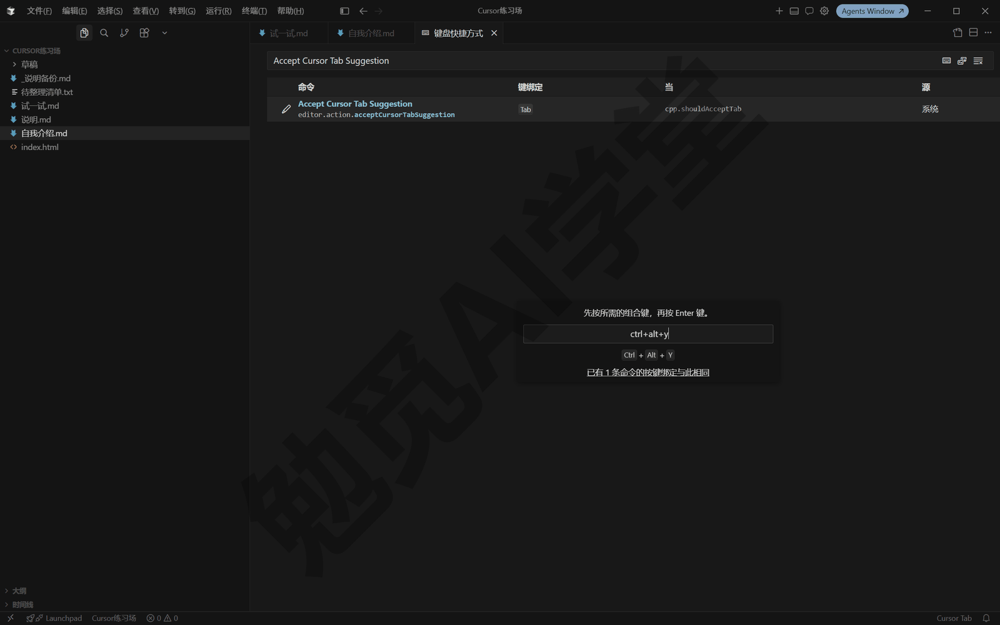

### 8.6 从 VS Code 搬家

如果你从来没用过 VS Code，这一节快速读过即可；如果你是 VS Code 老用户，这一节能帮你把原来的配置一次性搬过来。《认识与装好》提到过，首次启动引导里就有导入 VS Code 设置的一步；当时跳过了的，现在在设置里补做，效果一样。

**导入会带过来扩展、主题、设置和键位四样。** 一键导入会把这四样都带过来：

- **扩展**：按你在 VS Code 里的安装清单，从 Open VSX 装上对应的扩展（个别装不到，见下文）。
- **主题**：主题其实也是扩展，会随清单一起过来；导入完成后，界面外观可能直接变成你在 VS Code 里用的那一套。
- **设置**：编辑器偏好，字号、字体、自动保存这类选项都会照搬过来。
- **键位**：你在 VS Code 里自定义过的快捷键。Cursor 的默认快捷键本来就与 VS Code 相同，再加上自定义的键位也跟着导过来，搬家后按键习惯基本不用改。

**操作步骤。**

**第 1 步：打开 Cursor 设置。** 按 Ctrl+Shift+J。

**第 2 步：进入 General（常规）分区。** 左侧选 General（常规），页面里 Cursor Account（账号）一块的下方就是 Import Settings from VS Code 一项（中文界面文案以实际显示为准）。

**第 3 步：执行导入。** 在 Import Settings from VS Code 一项右侧点 Import（导入）按钮，等待完成。

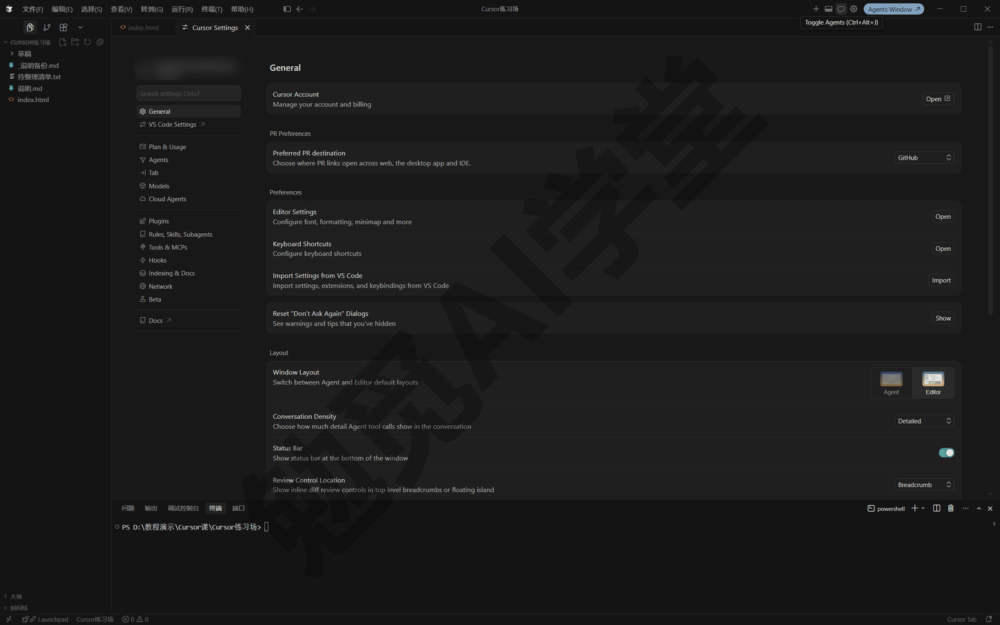

做完后，扩展列表、主题、键位会陆续就位。需要更精细控制的人，还可以走进阶路线：在 VS Code 里导出配置文件（profile），再手动导入 Cursor，只搬想搬的部分，官方另有分步指南。

**AI 配置、项目文件和部分扩展导入不了。** 这三样不在搬家范围里，导入完不要等着它们自己出现：

- **AI 相关的配置**：运行模式、模型选择、Tab 分区这些是 Cursor 独有的设置，VS Code 里没有这些，导入前后都要你自己调（《权限、沙盒与模型》和本篇 8.2 节分别讲过在哪调）。
- **你的项目文件**：导入搬的是配置，不是文件夹和代码。项目照旧用打开文件夹的方式进入，想让哪个文件夹成为工作区就打开哪个。
- **Open VSX 上没有的扩展**：8.4 节讲过扩展来源，只在微软商店上架的装不进来，导入后清单里少几个是正常的（以实际表现为准）。

**导入后建议重看三处。** 花两分钟检查，能省掉后面莫名其妙的麻烦：

- **快捷键**：你从 VS Code 带来的自定义键位，可能和 Cursor 的 AI 键位（Ctrl+K、Ctrl+I、Ctrl+L、Ctrl+/ 这些）冲突，你会发现某个 AI 功能按了没反应。到 8.5 节讲过的键盘快捷方式页面里搜一搜，冲突的就重新设置其中一个。
- **主题与字号**：界面外观如果整体变成了 VS Code 的那套，想回 Cursor 的默认深色，按 8.5 节的方法切回 Cursor Dark；字号也顺手确认一遍。
- **扩展清单**：过一遍装上的扩展，没装上的看有没有 Anysphere 替代版（8.4 节讲过），确实用不上的禁用或卸载，装得少一点，日后排查问题也容易。

最后还有一条边界：Cursor 和 VS Code 是两个独立应用，可以共存，同一个项目两边都能打开、互不影响，你完全可以边试 Cursor 边保留 VS Code。

### 8.7 练习任务

下面三个任务把三件套各练一遍，方括号里的内容换成你自己的。

**任务一：体验 Tab 补全，再把 markdown 的建议关掉**

先让智能体准备素材：

```
在当前工作区新建“练习笔记.md”，里面写三行没写完的句子，
主题围绕[你最近在忙的一件事]，每行只写前半句。
```

然后在编辑器里打开这个文件，把光标放到每行末尾补写，观察灰字建议：接受一次（Tab）、拒绝一次（Esc）、按词接受一次（Ctrl+→）。最后点右下角状态栏的 Tab 指示器，按文件类型关闭 markdown 的建议，回到文件里确认灰字不再出现。

完成标准：三种操作各成功一次；关闭 markdown 类型后，.md 文件里不再出现灰字建议，而其他类型文件不受影响。

**任务二：用 Ctrl+K 改写一段话，再切提问模式问一句**

在“练习笔记.md”里选中一段文字，按 Ctrl+K 输入：

```
把这一段改写得更正式，控制在两句话以内。
```

回车看结果；不满意就追加一句指令再回车。然后再次选中这段文字，按 Ctrl+K 后按 Alt+Enter 切到提问，输入：

```
这段话有没有错别字或不通顺的地方？
```

完成标准：第一次改动原地生效，而且可以撤销；第二次只得到回答、文件内容没有变化；你能说出两次操作的区别。

**任务三：装一个主题扩展并切回原主题**

在编辑器里按 Ctrl+Shift+X 打开扩展面板，搜索 theme，挑一个下载量高的主题扩展安装。装好后打开命令面板（Ctrl+Shift+P），输入：

```
Preferences: Color Theme
```

回车，在列表里用方向键预览、选中新装的主题；用一会儿后再回到这个列表，切回原来的主题。最后回到扩展面板，把这个主题扩展禁用或卸载。

完成标准：完成一次“安装、启用、切回、禁用”的完整循环；能说出扩展面板和主题列表分别在哪里打开。

### 8.98 本篇小结与自检

这一篇把编辑器里的三件套讲全了：Tab 补全的接受、拒绝、跳转和关闭，内联编辑 Ctrl+K 的原地改、追问和升级，扩展的来源、安装与排查，外加主题字体与 VS Code 一键搬家。

可以对照下面的清单检查学习结果：

- [ ] 会在代理窗口与编辑器之间来回切换，说得出哪几类事要回编辑器做
- [ ] 会接受、拒绝、按词接受 Tab 建议，用过“接受后再按 Tab 跳下一处”
- [ ] 会从状态栏暂停 Tab、全局关闭或按文件类型关闭，亲手关过 markdown 一次
- [ ] 会用 Ctrl+K 原地改一段内容、追加指令，会用 Alt+Enter 切成只问不改
- [ ] 知道扩展来自 Open VSX 并经过 Cursor 的安全审查，会安装、禁用一个扩展
- [ ] 会切主题、调字号，知道键盘快捷方式在哪里改
- [ ] 用过 VS Code 的话，完成了一键导入；没用过的，知道有这个入口即可

完成这些内容后，编辑器这边的日常工具你已经全部上手。下一篇《规则与 AGENTS.md》解决另一个层面的问题：让它记住你的规矩，比如永远用中文回复、遵守你项目里的约定，不必每轮对话都重新交代一遍。

### 8.99 新手常见问题

**Q1：我不写代码，Tab 补全对我有什么用？**

它在普通文本里也能续写，偶尔能帮你补全重复性的内容，但对不写代码的人用处有限。更实际的收获是本篇教的控制方法：知道它是什么、在哪暂停、怎么按文件类型关闭，让它别打扰你写东西。真要 AI 帮忙改文字，内联编辑 Ctrl+K 更合适。

**Q2：Tab 建议一直弹，很烦，怎么彻底关掉？**

点编辑器右下角状态栏的 Tab 指示器，选全局关闭；只是写笔记时嫌烦的话，建议改用按文件类型关闭，只关 markdown，代码文件里保留。Cursor 设置（Ctrl+Shift+J）的 Tab 分区里还有更细的开关，以实际界面为准。

**Q3：想装的 VS Code 扩展在 Cursor 里搜不到，怎么办？**

多半是它没有在 Open VSX 上架。先搜搜有没有官方 Anysphere 版或同类替代扩展；确实没有替代就只能等待上架。不建议从网上下载扩展安装文件手动安装，绕过审查机制装进来的东西，出了问题没人替你把关。

**Q4：装了中文语言包，部分界面还是英文，正常吗？**

正常，不是安装失败。语言包主要覆盖编辑器这套经典界面；代理窗口等较新界面的中文化范围随版本变化，以实际界面为准。《认识与装好》装语言包时说明过这一点，后续版本更新可能逐步补齐。

**Q5：在 Cursor 里装扩展、改主题，会影响我电脑上的 VS Code 吗？**

不会。两者是独立应用，配置各自保存，Cursor 里的任何改动都不会写回 VS Code。8.6 节的导入是单向复制：把 VS Code 的配置抄一份过来，原处不动。
