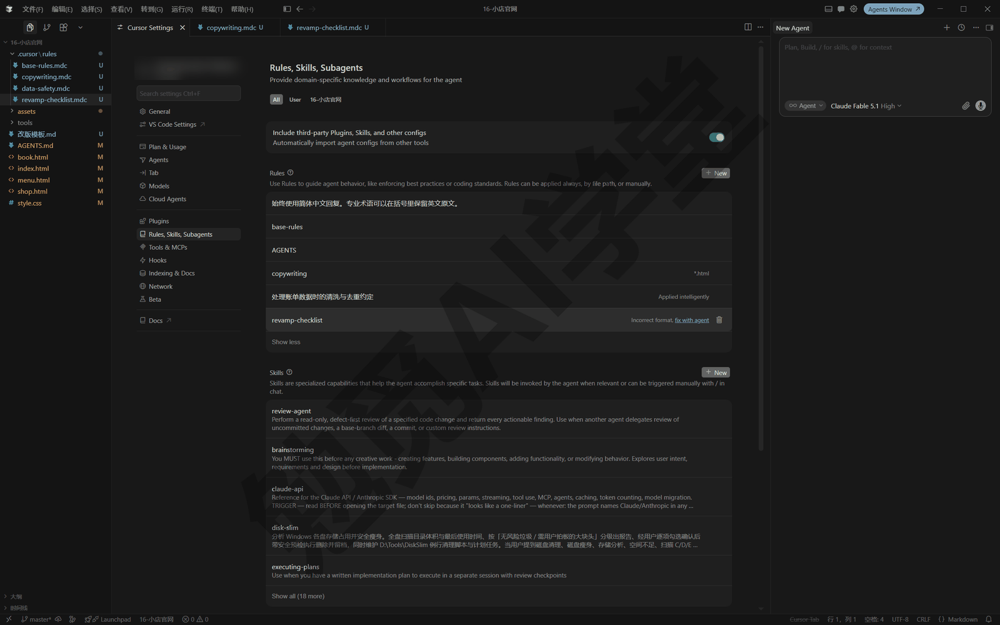
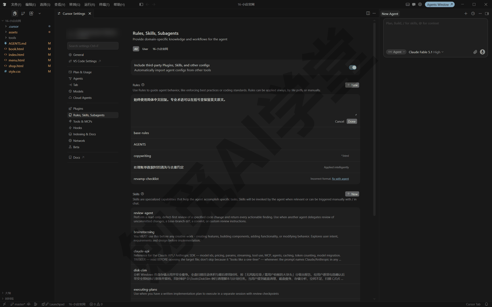
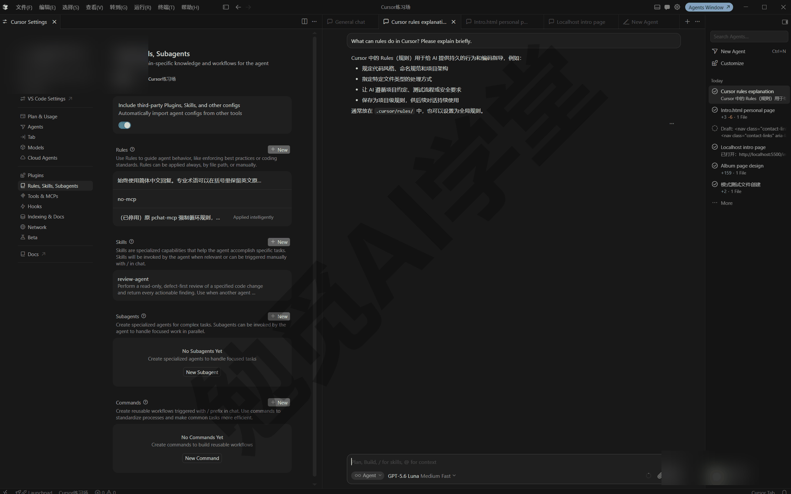
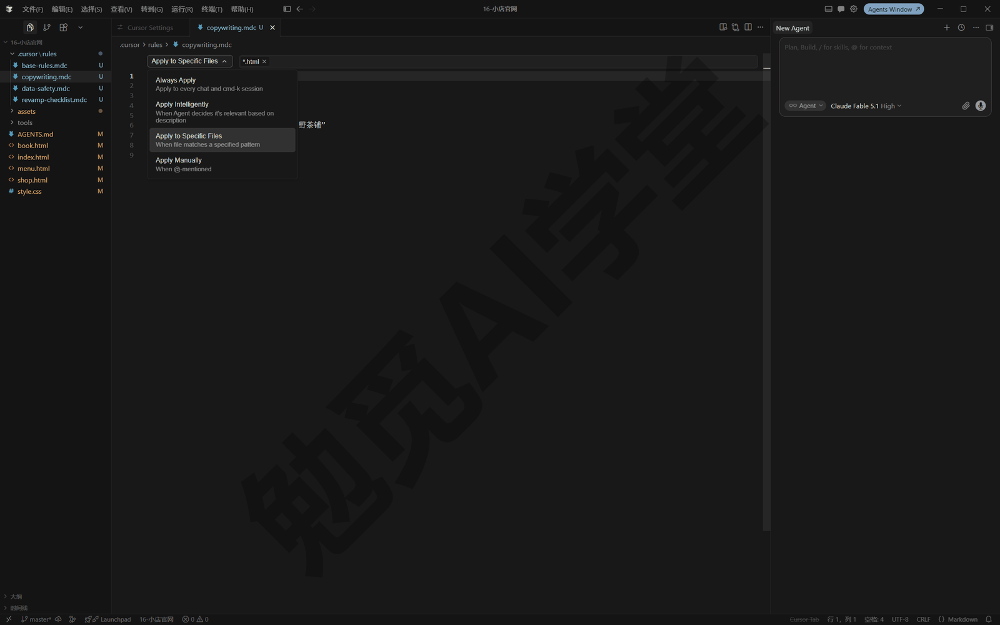
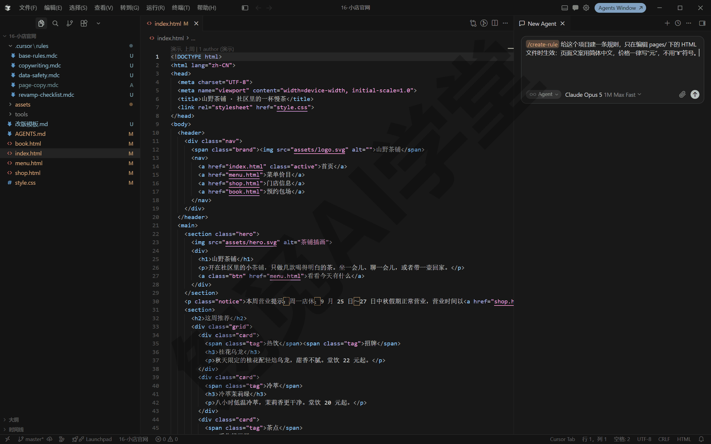
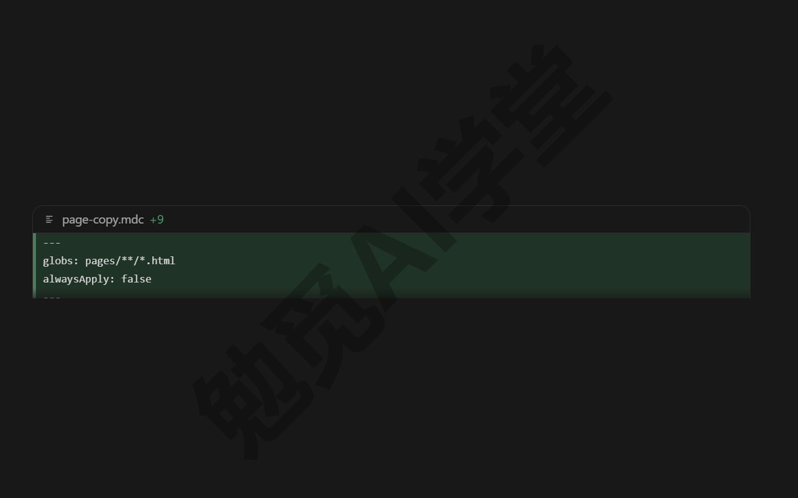
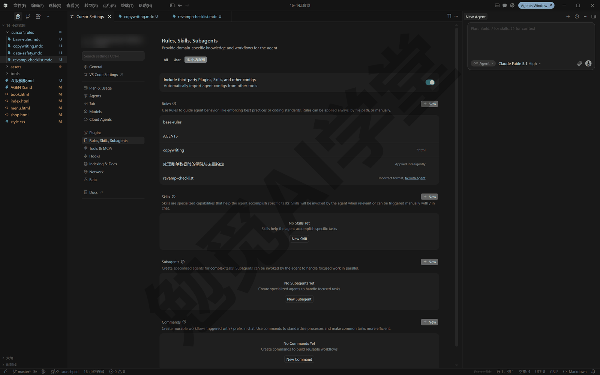
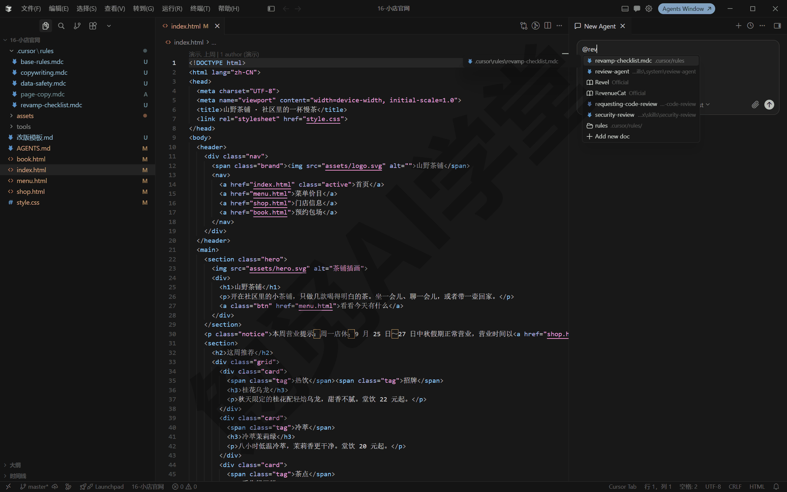
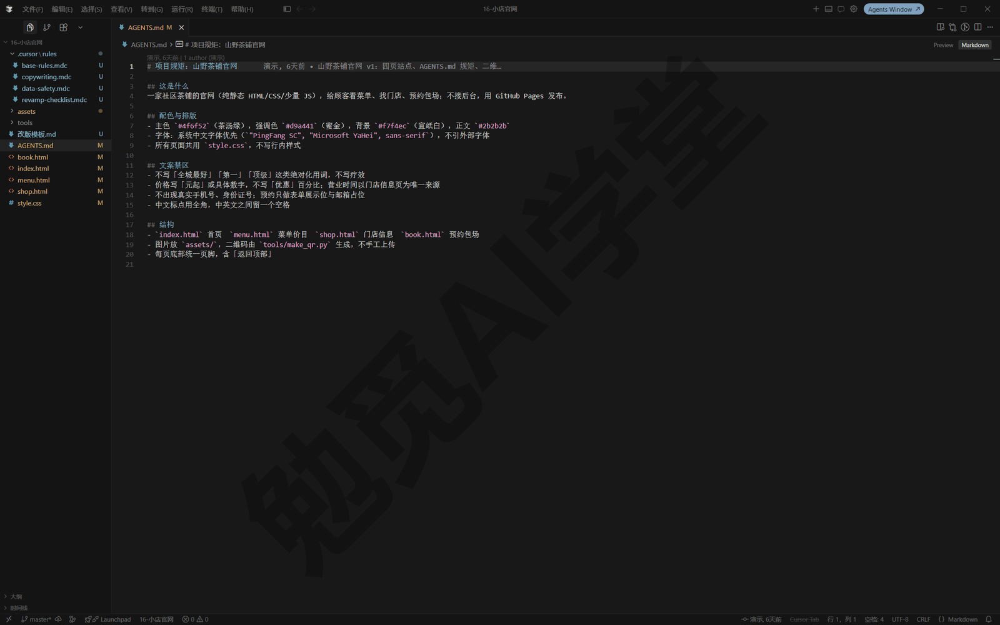
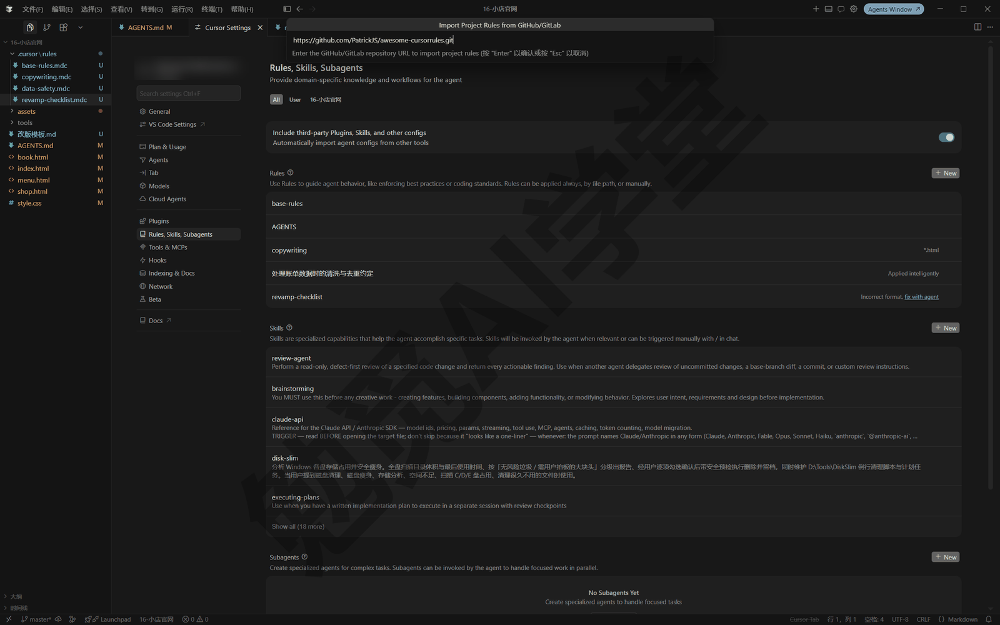

## 规则与 AGENTS.md

上一篇《编辑器三件套：Tab、内联编辑与扩展》把编辑器里的日常工具备齐了。这一篇解决另一个常见的烦恼：每次开新对话，都得把同样的要求重新交代一遍。你会认识 Cursor 的四类规则，先动手写第一条用户规则“始终使用简体中文回复”，再学项目规则的四种触发方式、AGENTS.md 的简单写法，最后讲写好规则的原则，以及怎么导入和共享规则。

### 9.1 为什么需要规则

用了一段时间 Cursor，你多半遇到过这样的情况：上一个对话里你交代过“回复用中文”“改动前先说思路”，它照做得很好；新开一个对话，这些交代全部失效，它又用英文回你，或者不先说一声就动手改文件。你只能把同样的话再打一遍，项目多了、对话多了，这件事会越来越麻烦。

这不是它记性差，而是它的工作方式就是这样。大语言模型在两次对话之间不会自动保留记忆。《对话与上下文管理》讲过：一次对话的上下文是临时的，对话结束就清空，新对话从零开始。你在对话里说的要求属于那一次对话，不会自动带进下一次。

规则（Rules）就是为此准备的机制。你可以把规则理解成一份长期有效的交代清单：把要求写成文字存起来，Cursor 在每次对话开始时，自动把生效的规则内容放进模型上下文的最前面。对模型来说，效果就跟你每次开场都先把这些话说了一遍一样，只是不再需要你动手。规则负责的是“要求与约束”，也就是一句话就能说明白的要求，比如回复尽量简短；多步骤的“做法”交给技能，下一篇《技能与自定义模式》专门讲，两者的分工到时会给一张对照表。

直观感受一下前后差别。没有规则时，你的每个新对话都要从同一句开场白开始：“用中文回，改动前先说思路，别动 backup 文件夹”——这句话你可能已经打过十几遍。写成规则之后，新对话直接说正事：“把首页的价格表更新一下”，那些要求它已经知道了。

按存放位置和作用范围，Cursor 支持四类规则。先认识一遍，后面逐一展开：

- **用户规则**：写在 Cursor 的设置里，跟着“你这个人”走，所有项目都生效，适合放语言、语气这类个人偏好。9.2 节里动手。
- **项目规则**：放在项目文件夹 `.cursor/rules/` 里的 `.mdc` 文件，跟着项目走，可以随项目共享给别人，支持按条件触发。9.3 节展开。
- **AGENTS.md**：项目根目录（或子目录）下的一个普通 Markdown 文件，是项目规则的简化写法。9.4 节展开。
- **团队规则**：团队版和企业版从管理后台统一下发，个人用户知道有这一层即可。9.6 节里会简单提一下。

这四类不用背，问自己一个问题就能分清：这条规矩跟人走，还是跟项目走？跟人走的写成用户规则；跟项目走的，简单场景用 AGENTS.md，要按条件触发就用项目规则；至于团队规则，它跟组织走，轮不到个人操心。

前三类都能在 Cursor 设置里看到。按 Ctrl+Shift+J 打开设置，左侧导航选 Rules, Skills, Subagents 这一页，规则、技能、子智能体、命令四个分区都在这一页上，《插件、市场与 MCP》会把它连同插件、MCP 一起讲全；本篇只用到最上面的 Rules 分区（界面文案以实际界面为准）。



动手之前，先记住一条官方明确的边界：**规则只对智能体对话有效**，也就是你在输入框里和智能体（Agent）一来一往的对话流。《编辑器三件套：Tab、内联编辑与扩展》讲过的 Tab 补全（打字时的灰字续写建议）不读规则；用户规则对 Ctrl+K 内联编辑（选中内容原地改写）也不起作用。所以“让 Tab 的建议也用中文注释”这类期待，规则帮不上忙——这是机制边界，不是你的规则写错了。

### 9.2 用户规则：第一条就写“始终使用简体中文回复”

**它是什么、为什么先学它**。用户规则是全局偏好：写一次，所有项目、所有新对话都自动带上，最适合放那些“走到哪都一样”的要求。对中文用户来说，第一条该写的就是回复语言。《认识与装好》里装的中文语言包只管界面菜单的语言，AI 用什么语言回复由模型自己决定，处理英文材料时它很容易跟着切回英文。写一条用户规则，可以把回复语言稳定下来。

**动手：三步写下第一条规则**。

第 1 步：按 Ctrl+Shift+J 打开 Cursor 设置，左侧导航选 Rules, Skills, Subagents，找到页面最上面的 Rules 分区。

第 2 步：找到 User Rules（用户规则）区域，在这里添加规则文字（输入框的样子见下图，写好后点右下角的 Done 保存）。把下面这段原样写进去：

```
始终使用简体中文回复。专业术语可以在括号里保留英文原文。
```



第 3 步：写好后新开一个对话验证。故意用英文提问，比如发送：

```
What can rules do in Cursor? Please explain briefly.
```

如果它用简体中文回答，说明规则已经生效。以后每个新对话都会自动带上这条要求，不用再交代。



用户规则存在哪里也说清楚：它不是项目里的一个文件，你在资源管理器里找不到对应文件，这不是丢了——想查看或修改，回设置里 Rules, Skills, Subagents 页的 Rules 分区即可。它不落在文件系统里，所以后面讲到的各种“规则转技能”“规则进版本库”都不含用户规则。

**用户规则适合写什么**。判断标准是“换个项目还成立吗”：成立的放用户规则，不成立的放项目规则。适合的内容包括回复语言与风格（官方文档举的例子就是“回复保持简洁、避免重复和凑字数的废话”）、称呼习惯、通用的工作偏好（比如“改动前先用一两句话说明思路”）。再给两条可以直接抄的：“代码和命令一律放进代码块”“不确定的事直接说不确定，不要编造”。不适合的内容比如“页面配色用茶汤绿”这类项目专属规矩——写进全局，换个项目它还照做，就帮了倒忙。

**用户规则的边界**。用户规则保存在你的 Cursor 环境里，不在任何项目文件夹中，所以它不会随项目分享给别人。另外 9.1 那条边界对它同样适用：只对智能体对话有效，Ctrl+K 内联编辑不读它。

**两个好习惯**：

- 别把用户规则写成长文。它每个对话都要进上下文，写三五条最常用的偏好就够了，不常用的要求留给项目规则或现场交代。
- 写完在两个不同的项目里各验证一次，确认它确实全局生效，也没有在某类项目里帮倒忙。

**和项目规则冲突了怎么办**。同一个话题上，两层规则可能各说各话：你的全局偏好写着“回复尽量简短”，某个项目的规则却要求“每次改动都给出详细说明”。这种情况不用你自己去改哪一边：官方定了合并顺序，项目规则排在用户规则前面，说法冲突时以项目规则为准（完整的三层顺序见 9.6）。这个设计对你有利——全局写通用偏好，个别项目有不一样的要求就写进项目规则，不必为它来回改全局设置。

**怎么改、怎么删**。用户规则随时可以回设置里的 Rules 分区修改或删除，删掉后新对话就不再带这条要求。改动对已经开着的旧对话是否立刻生效，以实际表现为准；验证效果时认准新对话，最稳妥。

### 9.3 项目规则：.cursor/rules 里的 .mdc 文件

**为什么需要项目规则**。项目各有各的规矩：茶铺官网要求“价格写元、不用 ¥ 符号”，账单流水线要求“不许动 data/raw 里的原始文件”。这些要求写进用户规则会干扰别的项目，写在对话里又只对那一个对话有效。项目规则解决的就是“规矩跟着项目走”：规则文件放在项目里，谁拿到这个项目，谁的 Cursor 就守这些规矩。

**文件形态**。项目规则放在项目根目录的 `.cursor/rules/` 文件夹里，一条规则一个文件，文件名随意，扩展名必须是 `.mdc`。规则多了可以建子文件夹分类。要特别记住一条：**这个文件夹只认 .mdc、不认 .md**。普通 `.md` 文件没有规则系统需要的元数据（写在文件开头、说明这条规则怎么用的几行信息），会被直接忽略——想用纯 Markdown 写规矩，用 9.4 节的 AGENTS.md。

```
.cursor/rules/
  copywriting.mdc      # 是 .mdc，会被当作项目规则
  api-notes.md         # 是 .md，会被忽略
  frontend/
    components.mdc     # 子文件夹里的规则同样生效
```

**.mdc 文件里写的是什么**。一个 `.mdc` 文件分两部分：开头两行 `---` 夹起来的元数据区（这块区域叫 frontmatter），和下面的正文。正文就是规矩本身，用平常的中文写即可。frontmatter 里有三个字段，共同决定这条规则“什么时候被用上”：

- `alwaysApply`：是否每次对话都带上，填 true 或 false。
- `description`：一句话描述这条规则管什么、什么时候该用。它是写给智能体看的“使用说明”，智能体靠它判断要不要用上这条规则。
- `globs`：文件路径的匹配模式（一种通配写法，下面有速查表）。对话涉及匹配文件时，规则自动附上。

**四种触发方式**。三个字段的不同组合，构成四种触发方式。在 Cursor 里编辑规则时，可以通过顶部的“类型”下拉菜单在四种方式之间直接切换（在编辑器里打开 .mdc 文件，顶部就是这条规则编辑条，见下图），切换的本质就是改这三个字段：

| 类型（界面英文） | 含义 | 什么时候被用上 |
|---|---|---|
| Always Apply | 始终应用 | 每次对话都自动附上 |
| Apply Intelligently | 智能判断 | 智能体读 description 认为相关时附上 |
| Apply to Specific Files | 按文件模式 | 对话涉及匹配 globs 的文件时附上 |
| Apply Manually | 手动 | 你在对话里 @ 这条规则时才附上 |



三个字段怎么填、规则什么时候被用上，官方文档给了一张四行的表来对照，照录如下（“—”表示留空）：

| alwaysApply | description | globs | 效果 |
|---|---|---|---|
| true | — | — | 始终附上，另外两个字段被忽略 |
| false | — | 已填 | 上下文里出现匹配文件时自动附上 |
| false | 已填 | — | 智能体读描述、判断相关时附上 |
| false | — | — | 只有在对话里 @ 它时才附上 |

**四种方式各看一个例子**。规则正文用中文完全没问题，下面四个例子都可以直接改造成你自己的规则。

始终应用，适合全项目任何时候都要守的硬规矩：

```
---
alwaysApply: true
---

- 所有页面文案使用简体中文
- 不要修改 assets/ 文件夹里的图片文件
- 拿不准实现方式时，先读相关文件再动手
```

按文件模式，适合只在动到某类文件时才需要的规矩，用 `globs` 圈范围：

```
---
globs: pages/**/*.html
alwaysApply: false
---

- 每个页面都要有标题，格式为“页面名 - 山野茶铺”
- 图片一律写 alt 说明文字
- 样式改动写进 styles/common.css，不写行内样式
```

智能判断，适合说不清具体文件、但能说清“什么时候相关”的规矩，靠 `description` 让它自己判断：

```
---
description: 处理账单数据时的清洗与去重约定
alwaysApply: false
---

- 原始账单只读，清洗结果另存到 data/clean/
- 同一笔支出在微信和银行卡里都出现时，只保留微信那一笔
- 要改动清洗规则，先向我确认
```

手动 @，适合平时不启用、点名才用的检查单或模板：

```
---
alwaysApply: false
---

- 改版前先列出要动的文件清单，等我确认再动手
- 每处改动附一句“为什么这样改”
- 版式参照下面这份模板

@改版模板.md
```

最后一行的 `@改版模板.md` 用到了规则的一个实用功能：规则内容里可以用 @ 引用项目中的文件，规则被用上时，被引用的文件会一起带进上下文。模板、样例放在单独的文件里，规则里只留一个 @ 引用，两边都保持干净。

**四种触发怎么选**。全项目任何时候都要守的硬规矩选始终应用，但别写太多，它每次对话都占上下文；和文件类型紧密相关的选按文件模式，让规则只对相关文件生效；说不清具体文件、说得清使用场景的选智能判断，把场景写进 description；检查单、模板这类点名才用的选手动。拿不准的，从智能判断起步，观察几次触发情况再调整。

**globs 怎么写**。globs 用的是通配写法：`*` 匹配一段名字，`**` 匹配任意多层目录。常用写法速查（多个模式用逗号分隔）：

| 写法 | 匹配范围 |
|---|---|
| `*.md` | 根目录下所有 .md 文件 |
| `**/*.md` | 任意目录下所有 .md 文件 |
| `pages/**` | pages/ 下的一切文件 |
| `pages/**/*.html` | pages/ 下任意层级的 .html 文件 |
| `docs/**/*.md, docs/**/*.mdx` | 逗号分隔，两类都匹配 |
| `tailwind.config.*` | 指定文件名、任意扩展名 |

**创建规则的两种方式**。第一种最适合新手，就是在对话里用 `/create-rule`，把想要的规矩用日常语言描述给它，它自己生成一条 frontmatter 格式正确的 `.mdc` 并存进 `.cursor/rules/`。比如发送：

```
/create-rule
给这个项目建一条规则，只在编辑 pages/ 下的 HTML 文件时生效：
页面文案用简体中文，价格一律写“元”，不用“¥”符号。
```



发送后它会创建规则文件并说明自己的理解，新文件会出现在差异视图里（以实际表现为准）。生成的规则值得读一遍再收下：它按你的描述推断触发方式，比如上面这条应该是按文件模式、`globs` 指向 HTML（网页）文件——推断错了就手动改字段。另外，不用斜杠、直接说“帮我建一条规则……”它也能办，`/create-rule` 的好处是明确走建规则的流程，生成的规则文件也更整齐。



第二种是手动新建，打开设置里的 Rules 分区，点分区标题右侧的 + New（新建）。菜单里给出三项：User Rule（用户规则）、Project Rule（项目规则）、Import from GitHub/GitLab（从远程仓库导入）。建项目规则选第二项，它会在 `.cursor/rules/` 里新建一个规则文件，内容自己填。无论哪种方式建的规则，Rules 分区的列表里都能看到，哪条始终应用、哪条按条件触发一目了然（能否在列表里直接启用或停用以实际界面为准）。



**手动 @ 一条规则**。四种触发里的“手动”，用法是在输入框键入 `@`，在列表里选中规则名（比如 `@改版检查`），这条规则就附在当前消息上。不止手动型规则可以这样：其他三种类型的规则也随时可以用 @ 点名，适合“这条规则本来不该触发、但这次我想让它管”的场景。



**规则文件就是普通文本文件**。`.cursor/rules/` 里的 `.mdc` 可以在 Cursor 里直接点开修改，也可以在资源管理器里复制、发给别人。改完规则，新开一个对话按最新内容验证（旧对话会不会马上跟着变，以实际表现为准）。文件名建议起得一眼能懂，比如 copywriting 管文案、data-safety 管数据安全；一条规则只管一类事，不相干的规矩别塞进同一条，规则多了再建子文件夹分类。

**项目规则的常见坑**。下面是新手最常踩的四个坑，出问题先对照：

- 文件放对了、扩展名却是 `.md`：不生效，改成 `.mdc`。
- 文件放错了位置，比如直接放在项目根目录或 `.cursor/` 下：规则系统只认 `.cursor/rules/` 这个文件夹，挪进去才算数。
- 选了智能判断却没写 `description`：智能体没有判断依据，等于永远不触发。
- 按文件模式的 `globs` 写得太窄或路径不对：对话里没动到匹配文件就不会附上，用上面的速查表核对写法。

### 9.4 AGENTS.md：不带元数据的简单写法

**AGENTS.md 是什么**。AGENTS.md 是放在项目根目录的一个普通 Markdown 文件，专门写给智能体看的项目说明。它没有 frontmatter、没有触发条件，写法就是普通文档。这个文件名是多家 AI 工具共同采用的约定，不是 Cursor 独有；各家支持的细节以各自文档为准。

**为什么需要它**。上一节的 `.mdc` 规则功能全，但对很多小项目来说太繁琐：总共三五条规矩，还要研究触发方式和字段。AGENTS.md 把门槛降到最低——新建一个文本文件、写上规矩、保存，就完成了。官方文档也明确说，它就是 `.cursor/rules` 的简单替代品，适合直截了当的场景。

**AGENTS.md 怎么写**。在项目根目录新建名为 `AGENTS.md` 的文件，用标题和列表把规矩组织清楚即可：

```
# 项目说明

## 文案
- 所有页面文案用简体中文
- 价格一律写“元”，不用“¥”符号

## 改动习惯
- 改动前先用一两句话说明思路
- 不要修改 backup/ 文件夹里的任何文件
```

保存后，在这个项目里的智能体对话就会参考这份说明，不需要任何额外设置。《实战一：小店官网》会用一份真实的 AGENTS.md 给茶铺官网定规矩（配色、文案禁区、营业时间以门店信息页为唯一来源），到时你可以对照本节的写法看实际效果。

不想自己归纳，也可以让它代写。发送：

```
读一遍这个项目的文件与结构，把你观察到的约定整理成
AGENTS.md 草稿：文案语言、各目录的用途、哪些文件夹不该动。
先把草稿发给我看，我确认后你再保存到项目根目录。
```

它会读项目、给出草稿，你删改确认后再让它保存。“先给我看再保存”这半句值得保留成习惯：项目说明一旦写偏，后面每个对话都会被带偏，第一版多花一分钟把关很值得。



**嵌套：子目录各自生效、就近优先**。AGENTS.md 不止能放根目录，项目的任何子目录里都可以再放一份，管这个子目录和它下面的所有目录：

```
项目/
  AGENTS.md            # 全项目通用说明
  frontend/
    AGENTS.md          # 只管前端部分
    components/
      AGENTS.md        # 只管组件部分
  backend/
    AGENTS.md          # 只管后端部分
```

处理某个文件时，它所在目录一路向上的几份 AGENTS.md 会合并生效；说法冲突时，离文件更近、更具体的那份优先。对普通用户来说，这个机制的用处是：大项目可以分区定规矩。比如素材文件夹里放一份写着“这里的文件只读”的 AGENTS.md，不用把这句塞进全局说明。反过来排查时也记得这一层：发现它在某个子目录里不按全局说明办事，先看看是不是被就近的一份盖过了。

**与 .cursor/rules 怎么选**。两者可以同时存在，选择标准是有没有“按条件触发”的需求：

- 规矩简单、希望全项目一直生效：用 AGENTS.md，可读性最好。
- 需要按文件类型触发、按场景智能判断、或手动点名：用 `.mdc` 项目规则。
- 拿不准就先用 AGENTS.md 起步，规矩多了，再把需要条件触发的部分拆成 `.mdc`。

最后还有一条边界：AGENTS.md 的内容同样计入对话上下文，下一节“少而精”的原则对它一样适用，别把它写成项目百科全书。

**旧写法已经过时**。更早版本的 Cursor 用项目根目录下一个叫 `.cursorrules` 的文件做同样的事，现在已经过时了。新项目不要再用；在老项目或旧教程里见到它，知道对应的就是今天的规则体系即可。

### 9.5 写好规则的原则与“四不要”

规则写得不好有两种代价。一种是占上下文，生效的规则每次对话都要带上，写得越冗长，留给正事的空间越小；另一种是带偏方向，含糊或过时的规则会让它按错误的假设干活。官方给的建议总结起来是一句话：好规则只管一类事、可执行、范围明确。

**该怎么写**：

- **少而精**：单条规则控制在 500 行以内；内容多就拆成几条各管一类事的规则，让触发条件替你分工。
- **给具体例子**：抽象的要求配一个具体例子，比一句空话好执行得多。对照感受一下：

```
含糊：注意文档质量。
可执行：标题不用感叹号；中文与英文、数字之间空一格；
文档末尾附“最后更新”一行。
```

- **引用文件而不是复制内容**：规则里可以用 `@文件名` 的写法指向项目里的文件（写法见 9.3 手动示例里的 `@改版模板.md`），智能体会把它带进上下文。引用让规则保持精短，文件更新后规则也不会跟着过期。
- **像写内部说明一样写**：明确、可执行；“注意代码质量”“遵循最佳实践”这类空话删掉，模型没法执行。
- **重复出现才写成规则**：同一句提醒你在对话里粘贴到第二三次，就是把它收进规则的信号；反过来，还没吃过亏的事不必提前写成规则。官方的建议就是从简单开始，别在摸清自己的使用习惯之前把规则写得太多太细。

**官方点名的“四不要”**：

- **不要抄整份风格指南**。格式与风格问题交给格式化工具和检查工具去管，模型本来就了解常见规范；把整套排版规范原文贴进规则只会白占上下文，你真正在意的往往就两三条，只写那两三条。
- **不要罗列所有命令**。npm、git、pytest 这类常用工具它本来就会用，“怎么装依赖、怎么启动服务”这些通用操作不写它也会。值得写的是你项目里特殊的那一两条。
- **不要写很少遇到的特殊情况**。一年遇不上一次的情形（比如年度归档流程），发生时现场交代就行，写成规则只会常年占着位置用不上；规则应该只写你经常用到的做法。
- **不要重复代码库里已有的内容**。项目里已经有一份写得好的示范文件时，写“参照 @某文件 的结构”，别把代码复制进规则——复制的那份不会跟着代码更新，早晚变成误导。

**长期怎么维护**。项目规则建议随项目提交进 Git 版本库，协作者拿到项目就共用一套规矩（版本库是什么、怎么提交，《Git、GitHub 与代码审查》专门讲，这里先理解为“随项目文件夹一起保存和分享”）。日常维护的节奏是：看到它重复犯同一个错，就回头改对应的规则。官方还提供了一个进阶用法：在 GitHub 的 issue（问题讨论帖）或 PR（把一批改动打包送审的申请）里 @cursor，让它替你把规则更新好，这需要先完成 GitHub 连接，同样放到那一篇细讲。

### 9.6 导入与共享

**从 GitHub 导入远程规则**。别人整理好的规则包、你自己另一个项目里攒的规则，都可以直接导入，不用手动复制文件。前提是它们放在一个你有权限访问的 GitHub 仓库里，公开或私有都可以。

第 1 步：按 Ctrl+Shift+J 打开设置，选 Rules, Skills, Subagents 页，找到 Rules 分区。

第 2 步：点分区标题右侧的 + New。

第 3 步：在菜单里选 Import from GitHub/GitLab（从远程仓库导入，界面文案以实际界面为准）。

第 4 步：粘贴目标仓库的网址，Cursor 会扫描仓库里所有 `.mdc` 文件。

第 5 步：确认后它把规则下载下来放进当前项目。



导入的规则统一放在 `.cursor/rules/imported/仓库名/` 之下，并保留在原仓库里的相对路径：原来在 `dir/rule.mdc` 的，导入后就是 `.cursor/rules/imported/仓库名/dir/rule.mdc`。

**导入之后的管理**。导入的规则和你自己写的用起来没有区别：Rules 分区的列表里能看到，触发方式由各自的 frontmatter 决定，也可以照常编辑。不想要某个规则包了，删除 `.cursor/rules/imported/` 下对应的仓库文件夹即可。改动过导入的规则之后再次导入同一仓库，是覆盖还是保留以实际表现为准，重要的本地修改先备份一份再操作。

导入的规则会进入你每次对话的上下文，等于让别人替你给 AI 写交代。导入前把内容大致读一遍，来路不明的规则包不要装。

**一个实用的用法：自建规则仓库**。如果你在多台电脑、多个项目里反复用同一套规矩，可以把常用的 `.mdc` 收进一个自己的 GitHub 仓库（把仓库设置成私有也可以），新项目开工时导入一次就位。相比在项目之间手动复制文件，这样做的好处是有同一个源头：规则在仓库里改一处，之后导入的项目都从新版起步（已导入的项目会不会自动跟进更新，以实际表现为准）。

**团队规则，了解即可**。团队版和企业版可以在 Cursor 的管理后台统一创建规则、下发给全团队。管理员建规则时有两个开关：一个决定规则立即启用还是先存成草稿，启用后才对成员生效；另一个决定是否强制——强制的规则成员无法在设置里关闭，非强制的可以在 Rules 分区的 Team Rules 一栏自己开关（这一栏只在团队版账号上出现）。形态上，团队规则就是一段普通文字，不使用项目规则那套文件夹结构，但同样支持用 glob 模式限定文件范围：设置了模式的规则只在对话涉及匹配文件时生效，没有设置的对每次对话都生效，对这个团队的所有仓库和项目都有效。

个人用户记住优先级顺序就够：**团队规则 → 项目规则 → 用户规则**。三层都会合并生效，说法冲突时排在前面的优先。将来你加入用团队版的组织，发现自己的用户规则在个别问题上失效了，多半就是这个优先级顺序造成的。官方文档还补了一句提醒：有的团队把强制规则当作内部合规流程的一部分，这可以，但不能只靠 AI 层面的规则来把关安全。

### 9.7 三个练习任务

下面三个任务把三类规则各练一遍，建议按顺序做：任务一练全局的用户规则，任务二练带触发条件的项目规则，任务三练 AGENTS.md，正好把三个层级各走一遍。方括号里的内容换成你自己的。

**任务一：写第一条用户规则并验证**

按 Ctrl+Shift+J 打开设置，进 Rules, Skills, Subagents 页的 Rules 分区，在 User Rules 里写入：

```
始终使用简体中文回复。专业术语可以在括号里保留英文原文。
```

然后新开一个对话，发送：

```
Summarize what project rules are in Cursor, in three sentences.
```

完成标准：它用简体中文回答；换一个项目再问一次仍是中文（用户规则全局生效）；你能说出这条规则为什么不放进项目规则。

**任务二：用 /create-rule 建一条按文件模式触发的规则**

在一个练习项目里发送：

```
/create-rule
建一条只在编辑 Markdown 文件时生效的规则：
中文与英文、数字之间保留一个半角空格；
标题不使用感叹号；
文档末尾保留“最后更新”一行。
```

完成标准：`.cursor/rules/` 里出现新的 `.mdc` 文件；frontmatter 里 `globs` 指向 Markdown 文件（如 `**/*.md`）、`alwaysApply` 为 false，对照 9.3 那张四行的表能说出它属于哪一行；让它改写项目里任意一个 .md 文件，改出来的内容遵守上面三条。

**任务三：把常用交代转成 AGENTS.md**

回想你最近几次对话里重复交代过的话，整理成一份 AGENTS.md。可以直接让它代劳：

```
在项目根目录创建 AGENTS.md，写入三条规矩：
1. 回复和文件里的注释都用简体中文；
2. 每次改动前，先用一两句话说明打算怎么改；
3. 不要修改 [你想保护的文件夹名]/ 里的任何文件。
```

完成标准：项目根目录出现 AGENTS.md，而且三条齐全；新开对话让它做一个小改动，它先说明思路再动手；让它去动受保护文件夹里的文件，它会提醒或拒绝。

### 9.98 本篇小结与自检

这一篇讲了让 Cursor 记住规矩的四类规则：用户规则管个人全局偏好，项目规则用 `.mdc` 文件按四种方式触发，AGENTS.md 是不带元数据的简单写法，团队规则是团队版的功能，了解即可。上手顺序也照这个来：先写一条用户规则见效，再给常用项目配 AGENTS.md，需要条件触发时升级成 `.mdc`。最要紧的一条边界：规则只对智能体对话有效，Tab 补全与 Ctrl+K 内联编辑不读规则。

- [ ] 已在 User Rules 写入“始终使用简体中文回复”并验证生效
- [ ] 知道用户规则不落在文件系统里，查看和修改都回设置里的 Rules 分区
- [ ] 能说出项目规则的四种触发方式，知道各自对应三个 frontmatter 字段的哪种填法
- [ ] 记住 `.cursor/rules/` 只认 `.mdc`、不认 `.md`
- [ ] 用 `/create-rule` 生成过一条规则，并检查过它的 frontmatter
- [ ] 给一个项目写过 AGENTS.md，理解嵌套时就近优先
- [ ] 能复述“四不要”：不抄风格指南、不罗列所有命令、不写很少遇到的特殊情况、不重复代码库已有内容
- [ ] 知道从 GitHub 导入的规则落在 `.cursor/rules/imported/` 之下

完成这些内容后，Cursor 已经能记住你的“要求”。但有些事光有要求不够：出月报、盘点文件夹这类任务是一串步骤，需要一份完整的做法说明书，还得能一句话调用。下一篇《技能与自定义模式》就讲怎么把做法整理成技能、怎么让一个技能在整段对话里一直生效。

### 9.99 新手常见问题

**Q1：规则写了但好像没生效，怎么查？**

按触发方式对号入座地查：智能判断型必须写 `description`，否则它没有判断依据；按文件模式型检查 `globs` 是否真的匹配到对话涉及的文件；手动型要 @ 了才生效。再核对两个最基本的地方：文件在 `.cursor/rules/` 里，而且扩展名是 `.mdc`；改完规则后新开一个对话再验证（生效时机以实际表现为准）。设置里 Rules 分区的列表能看到每条规则的类型与状态，适合先去那里核对一眼。如果这些都查过还是不生效，把规则文件内容贴进对话，直接问它“这条规则为什么没被用上”，让它自查也常能定位问题。

**Q2：有了规则，它就能永远用中文了吗？**

在智能体对话里基本可以：用户规则每次对话都带上，语言要求相当稳定。有两个例外要知道：

- Tab 补全和 Ctrl+K 不读规则，这两处的输出不受规则管。
- 长对话里模型偶尔仍可能夹带英文，遇到提醒一句即可。

另外，界面菜单的语言是另一回事，它由《认识与装好》里装的中文语言包决定，与规则无关。

**Q3：AGENTS.md 和 Codex 用的是同一个东西吗？**

是同一个文件名约定。AGENTS.md 是多家智能体工具共同认的项目说明文件，Cursor 和 Codex 都会读它，所以同一个项目交给两个工具协作时，可以共用一份规矩。各家支持的细节有差别，比如 Cursor 支持子目录嵌套、就近优先，以各工具当前文档为准。

**Q4：规则会占多少上下文？**

生效的规则每次对话都计入上下文。想看确切占比，点开输入框旁的上下文用量环（《对话与上下文管理》介绍过的那个小圆环），分类明细里有规则单独一项。控制办法就是 9.5 的原则：少而精，能按条件触发的就不要设置成始终应用，不相关的对话就不用白占这份上下文。

**Q5：旧教程里的 .cursorrules 还能用吗？**

那是更早版本的单文件写法，如今已经过时。见到旧教程或老项目里的 `.cursorrules`，知道它对应的就是今天的规则体系即可；自己动手时不要再新建这种文件。老项目里已有的内容，可以直接让智能体代劳搬家：让它读一遍 `.cursorrules`，按 9.4 的选择标准把内容分拆进 AGENTS.md 或 `.mdc` 项目规则，搬完确认无误再删旧文件。
