## 技能与自定义模式

上一篇《规则与 AGENTS.md》让 Cursor 记住了你的要求。这一篇解决要求之外的问题：一串步骤组成的“做法”怎么保存下来、怎么一句话复用。你会认识技能这份“做法说明书”，把内置技能全集过一遍，掌握四种调用方式和让技能在整段对话里一直生效的自定义模式，再用 `/create-skill` 自制一个技能，最后认识画布。

### 10.1 技能是什么：可复用的“做法说明书”

以每月一次的账单月报为例：确认三种账单文件齐不齐、跑一遍清洗程序、核对三项合计、把结论讲成三句话。这类任务的难点不在某一步，而在“步骤全、顺序对、标准稳定”。写进规则不合适——《规则与 AGENTS.md》讲过，规则适合简短的要求与约束，几百字的流程塞进去，每次对话都背着，多数时候又用不上。

技能（Skills）就是装“做法”的容器。一个技能是一个文件夹，核心是一份 `SKILL.md` 说明书，还可以带上脚本、参考资料和素材。你可以把技能理解成写给智能体看的一份操作手册：什么时候用、按什么步骤做、注意什么，全写在里面；要用的时候，它把整份手册取出来照着办。

**与规则的分工**。官方给了一张对照表，改写成本课的例子如下：

| | 规则 | 技能 |
|---|---|---|
| 定位 | 简短的要求与约束 | 多步骤的流程与做法 |
| 篇幅 | 几行到几百行 | 通常更长，含分步说明 |
| 生效方式 | 按触发条件进入对话上下文 | 按需调用（/ 或 @），也可按描述自动应用 |
| 例子 | “回复一律用简体中文” | “出账单月报：确认文件、清洗、核对、汇报” |

一句话的判断标准：一句话说得清的用规则；要一套动作才说得清的用技能。

**开放标准，跨工具通用**。技能不是 Cursor 的私有格式。Agent Skills 是一个开放标准（官网 agentskills.io），凡是支持这套标准的 AI 工具都能读同一份技能文件。Cursor 还做了兼容：除了自己的目录，它也会加载 `.codex/` 和 `.claude/` 里的技能目录——你之前在 Codex 或 Claude Code 里攒下的技能，原地不动就能被 Cursor 发现。花在写技能上的功夫，不会被某一个工具绑住。

按官方文档，技能有四个值得记住的特点：

- **可移植**：标准通用，跨工具、跨电脑搬家就是复制文件夹。
- **可版本管理**：技能就是普通文件，能随项目进版本库，也能从 GitHub 仓库安装。
- **可执行**：不止文字说明，还能带脚本，让智能体用工具把事情真正做完。
- **按需加载**：平时智能体只看到技能的名字和描述，正文与参考资料在用到时才读取，不会白占上下文。

**先看一份真实的技能**。下面是本课《实战二：家庭账单月报流水线》里真实使用的技能，节选它的 frontmatter 与步骤（为排版折了行；完整文件还有“什么时候用”“注意”两节，实战效果在那一篇细讲）：

```
---
name: monthly-bill-report
description: 把 data/raw 里微信、支付宝、银行卡三种导出账单
  清洗归类后生成家庭账单月报（带图表的 Excel、一页 PPT、
  摘要）。用户提到「跑月报」「家庭账单」「这个月花了多少」
  或往 data/raw 放了新账单时使用。
---

# 家庭账单月报流水线

## 步骤
1. 确认 data/raw/ 里三种账单文件齐全，缺哪种就告诉用户
2. 运行 python pipeline.py，读输出里的清洗统计
3. 运行 python tools/verify.py，确认支出、收入、类别分项
   之和三项都一致；不一致不要交付，先报告差异
4. 把 output/月报摘要.md 用三句话讲给用户
```

对照着认两个必填字段：`name` 是技能的名字，只能用小写字母、数字和连字符（短横线 -），而且必须与所在文件夹同名；`description` 写“做什么＋什么时候用”，它是自动触发的判断依据（10.3 展开）。正文部分没有格式要求，把步骤和注意写清楚就行——这份技能连“三项合计不一致就不要交付”这种验收标准都写了进去，智能体照着执行，比每次口头交代稳得多。

把这样一个文件夹放进技能目录（位置见 10.5），Cursor 启动时会自动发现它：/ 菜单里能搜到，Cursor 设置里也能看到。看设置的路径是按 Ctrl+Shift+J 打开设置，左侧选 Rules, Skills, Subagents 这一页，往下滚就是 Skills 分区；《规则与 AGENTS.md》里写用户规则用的是同一页最上面的 Rules 分区（界面文案以实际界面为准）。

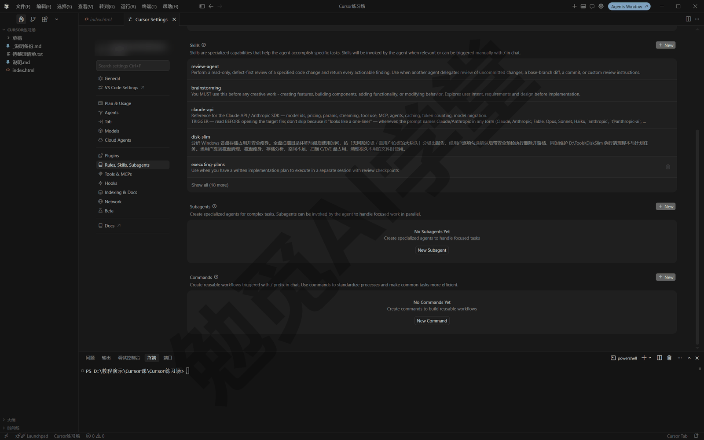

### 10.2 内置技能全集：/ 菜单逐条认识

除了自己写，Cursor 自带一批内置技能，由官方维护，与你自装的技能并列出现在同一个菜单里。在输入框键入 `/` 即可打开技能菜单，继续输入可以按名字搜索；选中某一项能看到它的说明。

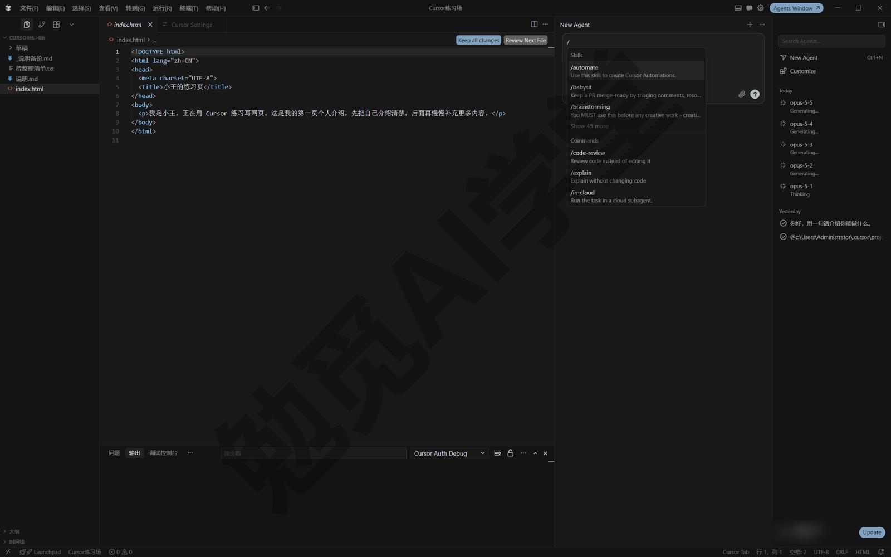

下表按官方技能文档整理。产品更新快，**以你的 / 菜单为准**：你的菜单里可能比这张表多一些条目，个别名字也可能有出入，会去哪找比背清单重要。

| 技能 | 它做什么 | 本课去处 |
|---|---|---|
| `/automate` | 创建定时或事件触发的云端自动化 | 《自动化、钩子与命令行》 |
| `/autopilot` | 盯住一个 PR，处理反馈、冲突与失败的检查 | 《Git、GitHub 与代码审查》 |
| `/canvas` | 生成渲染在对话旁的可交互画布 | 本篇 10.7 |
| `/create-hook` | 创建钩子并更新 hooks.json | 《自动化、钩子与命令行》 |
| `/create-rule` | 创建一条范围合适的规则 | 《规则与 AGENTS.md》 |
| `/create-skill` | 创建技能，含目录结构与 SKILL.md | 本篇 10.5 |
| `/create-subagent` | 创建带分工说明的自定义子智能体 | 《子智能体、并行与工作树》 |
| `/cursor-blame` | 追查某处改动出自哪次 AI 对话、哪条提示词 | 了解即可 |
| `/loop` | 按设定间隔反复运行一段提示词或技能 | 《自动化、钩子与命令行》 |
| `/migrate-to-skills` | 把符合条件的旧规则与斜杠命令转成技能 | 本篇 10.6 |
| `/review` | 自动选择并运行合适的代码审查 | 《Git、GitHub 与代码审查》 |
| `/review-bugbot` | 用 Bugbot 审查可能的缺陷和改坏的旧功能 | 《Git、GitHub 与代码审查》 |
| `/review-security` | 做安全漏洞方向的审查 | 《Git、GitHub 与代码审查》 |
| `/sdk` | 辅助用 Cursor SDK 开发应用、对接其他系统（给开发者用的） | 了解即可 |
| `/shell` | 把后面的文字当作一条终端命令原样执行 | 本节小试 |
| `/split-to-prs` | 把一大批改动拆成多个小 PR | 《Git、GitHub 与代码审查》 |
| `/statusline` | 配置命令行版 Cursor 的状态栏 | 《自动化、钩子与命令行》 |
| `/update-cli-config` | 更新命令行版 Cursor 的配置文件 | 《自动化、钩子与命令行》 |
| `/update-cursor-settings` | 找到并修改对应的 Cursor 设置项 | 了解即可 |

分组看会更容易记。表里将近一半与 Git、PR、代码审查有关（/autopilot、/review 这一组、/split-to-prs），零基础读者现在不用管，《Git、GitHub 与代码审查》会把它们放回完整场景里讲。四个 create 开头的是“创造自定义能力”的一组：`/create-rule` 在《规则与 AGENTS.md》里刚用过；`/create-skill` 本篇 10.5 里会动手；`/create-subagent` 里的“子智能体”是主对话派出去独立干活、上下文互不干扰的分身，《子智能体、并行与工作树》细讲；`/create-hook` 里的“钩子”是在智能体工作流程的固定节点自动运行的脚本，与命令行相关的 `/statusline`、`/update-cli-config` 一起放在《自动化、钩子与命令行》。

现在就用得上的，除了本篇要展开的 `/canvas` 和 `/migrate-to-skills`，还有两个小工具：`/update-cursor-settings` 适合“知道有某个设置但找不到在哪”的时刻，直接说“帮我关掉某某功能”，它去定位并修改对应设置项。`/shell` 则是把你写的文字当终端命令原样执行，试一下（输入 / 选中 /shell，接着在后面打命令，见下图）：

```
/shell dir
```

它会把 `dir` 当命令跑一遍，列出当前文件夹的内容（macOS／Linux 用户把命令换成 `ls`）。注意“原样执行”这四个字：你写什么它跑什么，不会帮你纠错，命令拿不准就别用它。执行命令与平时一样，要过《权限、沙盒与模型》里那套运行模式与审批那道关，不会因为走了技能就绕过把关。

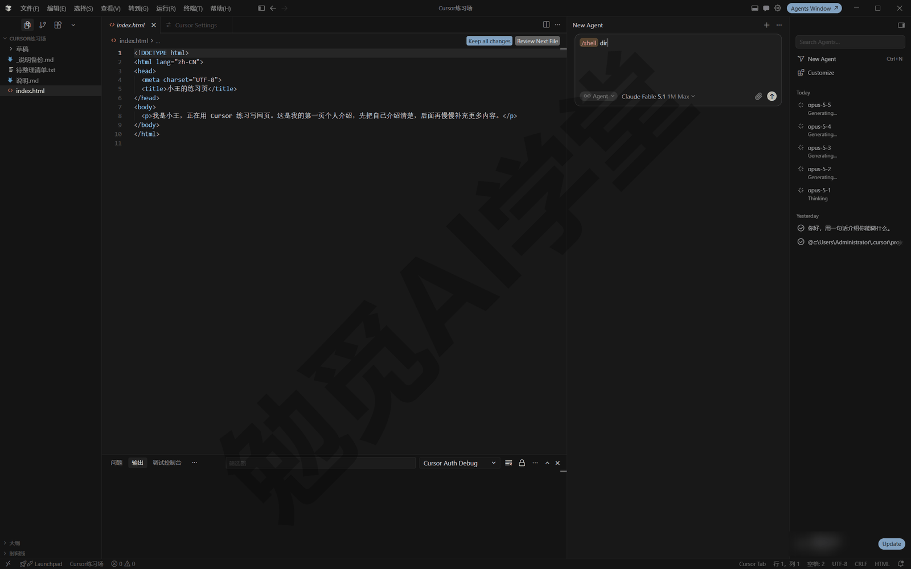

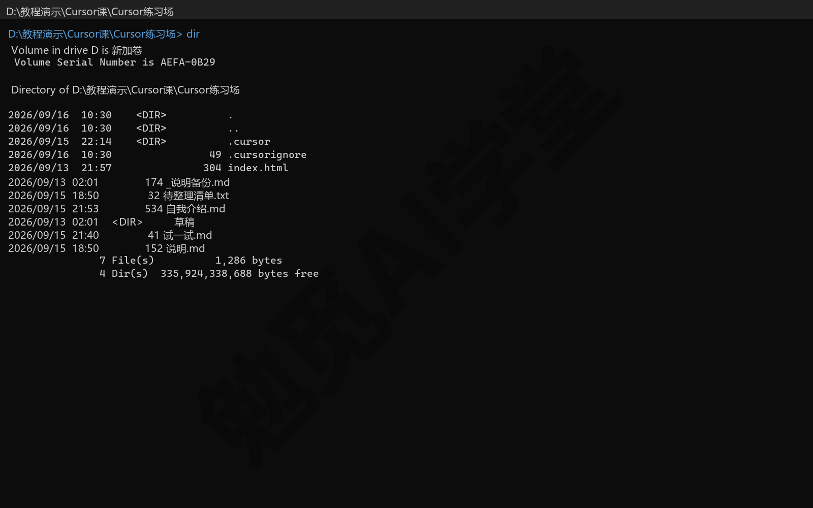

### 10.3 技能的四种调用方式

技能进了目录只是就位，什么时候被用上，有四种方式。

**方式一：/ 点名，一次性生效**。输入 `/` 选中技能名、回车发送，技能就附在这一条消息上；随着对话推进，它的作用会慢慢消失，后续消息不再自动跟随。它适合“这一步照这个做法来”的场景。发送后你会看到它按技能说明做事（消息上的技能标记形态以实际界面为准）。

**方式二：自动触发，靠 description**。Cursor 启动时扫描技能目录，把每个技能的名字和描述提供给智能体；你的话与某个技能的描述对上了，它就会自动用上。10.1 那份账单技能的描述写着“用户提到‘跑月报’‘家庭账单’……时使用”，所以你只要说“跑一下这个月的账单”，不用输入任何斜杠，它自己会找到技能。这就要求 **description 写得具体**：把“做什么”和“什么时候用”都写进去，含糊的描述要么触发不了、要么乱触发。

这套自动机制对内置技能同样适用：官方文档写明，当你的请求与某个内置技能的用途明显吻合时，智能体也可能自动用上它。比如你说“把这批改动拆成几个小一点的 PR”，即使没输入斜杠，它也可能自己用上 /split-to-prs。

**方式三：关掉自动，只许手动**。在 frontmatter 里加一行 `disable-model-invocation: true`：

```
---
name: clean-downloads
description: 清理下载文件夹的流程，先列清单确认再动手。
disable-model-invocation: true
---
```

这个技能就只在你输入 `/clean-downloads` 时生效，智能体不会按描述自动应用它。这种写法适合带删除、部署这类副作用大的流程：宁可每次手动点名，也不给误触发留机会。

**方式四：@ 附上，当参考资料**。输入 `@` 也能选中技能，把技能文件作为上下文资料附给当前消息。它与 / 的差别在意图：/ 是“照这份说明书办事”，@ 更像“给你看一份材料”。比如你想让它参考某个技能的写法再写一个新技能，用 @ 就比 / 合适。

**候选范围还受 paths 影响**。设置了 `paths` 的技能（写法见 10.5），只有当前工作涉及匹配文件时才会进入候选。所以遇到“明明有技能却没触发”，除了检查 description 写得够不够具体，还要看 `paths` 是不是把当前文件挡在了外面；两处都没问题，再考虑换个说法重试，或者直接 / 点名。

**怎么确认它真的用了技能**。看两处：对话过程里，它是否按技能写的步骤逐条执行；结果上，是否符合技能里的约定，比如 10.1 那份账单技能要求“三项合计不一致就不要交付”。拿不准就直接问一句“你刚才有没有用某某技能”，让它自己说明（回答的准确性以实际表现为准）。

日常用得最多的是方式二：把 description 写好之后，你只管用平常的话提需求，让它自己对号入座；方式一和方式四是要精确控制时用的，方式三是给高风险流程加的保险。四种方式覆盖了从“临时用一下”到“全自动”的各种场景，只剩一种需求它们都不管：整段对话从头到尾都遵守同一份技能——这就是下一节的自定义模式。

### 10.4 自定义模式：让技能在整段对话里一直生效

**为什么需要自定义模式**。/ 调用只管一条消息，可有些技能描述的不是一次性任务，而是一种工作方式：一份审查清单，你要用它连看七八个文件；一套“先定验收标准再动手”的工作法，要贯穿整个功能的开发。每条消息都重新 / 一遍，既麻烦又容易漏。

**自定义模式是什么**。自定义模式（Custom Modes）把一个技能固定在整段对话上，让它成为这段对话里一直生效的工作模式。模式开着，技能就在每一轮的上下文里，哪怕这场对话连续干上几个小时也不会失效，直到你退出模式。任何 frontmatter 格式正确的技能都能这样用。

**别和模式选择器混淆**。《计划、提问与调试三模式》讲过输入框上的模式选择器，那里的 Agent／Ask／Plan／Debug 是 Cursor 内置的四种工作形态，切换的是“它以什么方式干活”；自定义模式则是把你的某个技能固定在这段对话里，改变的是“它按哪份说明书干活”。两者名字相近、机制不同，日后遇到“模式表现得不对”的问题时，先分清自己说的是哪一个。

**自定义模式怎么进入**。自定义模式是官方文档里较新的功能，3.7.42 版上输入 / 选中技能后按 Alt+Enter 没有进入模式、也没有徽章出现；下面按官方文档介绍，你的版本有没有以实际界面为准。第 1 步：输入 `/` 打开技能菜单，选中目标技能。第 2 步：不按回车，改按 Alt+Enter（Windows；macOS 是 Option+Enter）。也可以在技能条目上选择 Use as Mode（作为模式使用）。

**进入模式后会看到什么**。输入框上出现这个技能的徽章，提示当前对话正处在这个模式里。徽章默认是闪电图标；技能作者可以在 frontmatter 里用 `icon` 和 `color` 两个字段定制它，比如：

```
---
name: tdd
description: 本项目的测试先行工作法。
icon: beaker
color: green
---
```

图标名来自 Cursor 的图标集，如 code、terminal、bug、git-branch、book-open、beaker、shield、rocket；颜色可选 default、green、cyan、blue、purple、magenta、orange、yellow、red、brand。写了它不认识的名字，就退回默认的闪电徽章。

**自定义模式怎么退出**。不再需要时退出模式，对话回到普通状态；退出入口在徽章上（退出按钮的样子以实际界面为准）。

徽章还有一个附带用处：提醒你模式还开着。长对话里容易忘了自己还开着模式，收尾前看一眼输入框，有徽章就说明它仍在按那份说明书做事；这件事结束后及时退出，免得下一件事也被同一套工作法管着。

**自定义模式什么时候用**。判断标准是技能内容“描述怎么工作”还是“描述一件事”。“描述怎么工作”的适合当模式：审查清单、写作规范、测试先行的流程，这类技能设成模式之后，智能体在整段对话里都按同一套方法做事。“描述一件事”的用 / 一次性调用就够：出一次月报、盘点一次文件夹，用完即走。

**自定义模式的可用范围**。自定义模式在代理窗口（Agents Window，智能体优先的那套界面）和命令行 CLI 里可用（CLI 是命令行形态的 Cursor，《自动化、钩子与命令行》细讲）；在编辑器里是否可用，以实际界面为准。

### 10.5 用 /create-skill 自制一个技能

内置技能是官方的做法，你自己的做法要自己整理成技能。不用担心格式记不住——`/create-skill` 本身就是一个会引导你的技能，格式的事交给它。

**自制技能的案例**。用一个常见需求做主线：你经常要把一个文件夹里的资料盘点成表格，哪类文件、多少个、多大、最后什么时候改过。第一次做完之后，把做法保存下来，以后一句话复用。

**第 1 步：把做法说给它**。在对话里发送：

```
/create-skill
把“盘点资料文件夹”的做法做成技能：
1. 读取我指定的文件夹里的全部文件；
2. 按文件类型分组，统计每组的数量与总大小；
3. 生成“资料清单.md”，表格列出文件名、类型、大小、
   最后修改时间；按类型分节，节内按文件名排序；
4. 全程只读，不移动、不修改、不删除任何文件。
在我说“盘点文件夹”“出资料清单”时使用。
```

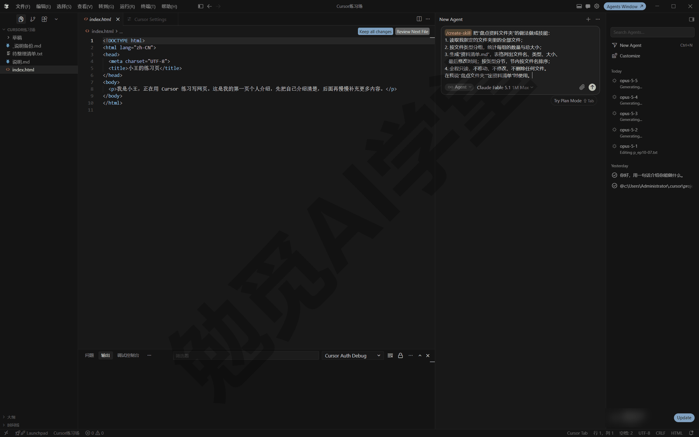

它会按内置引导完成命名、结构、保存几步，过程中可能向你确认细节，比如技能名和存放位置，照实回答即可（引导的具体问法以实际表现为准）。

**第 2 步：检查生成的文件**。完成后到 `.cursor/skills/` 里看，会多出一个技能文件夹。生成内容每次不完全相同，大致是下面这样（以实际生成的内容为准）：

```
---
name: folder-inventory
description: 盘点指定文件夹的资料并生成“资料清单.md”。
  用户说“盘点文件夹”“出资料清单”时使用。
---

# 盘点资料文件夹

1. 读取用户指定文件夹的全部文件
2. 按类型分组统计数量与总大小
3. 生成按类型分节的“资料清单.md”
4. 全程只读，不改动任何文件
```

生成的 SKILL.md 值得通读一遍：description 有没有把“什么时候用”写清；步骤里“全程只读”这类安全约束有没有留住。技能是要长期用的，第一次把好关，以后就不用再反复检查。

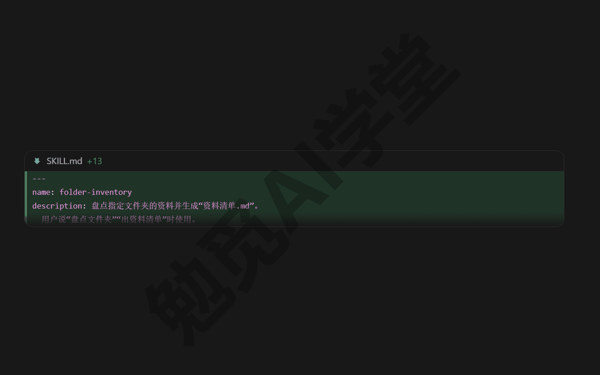

**第 3 步：一句话复用**。新开一个对话，发送（方括号换成你自己的路径）：

```
盘点一下 [你的文件夹路径]，出一份资料清单
```

“盘点”对上了技能描述，它会自动应用这个技能，按四步生成资料清单。如果没触发，就用 / 点名：`/folder-inventory`。从此这套做法固定下来了，你交代的成本从一整段话降到一句话。

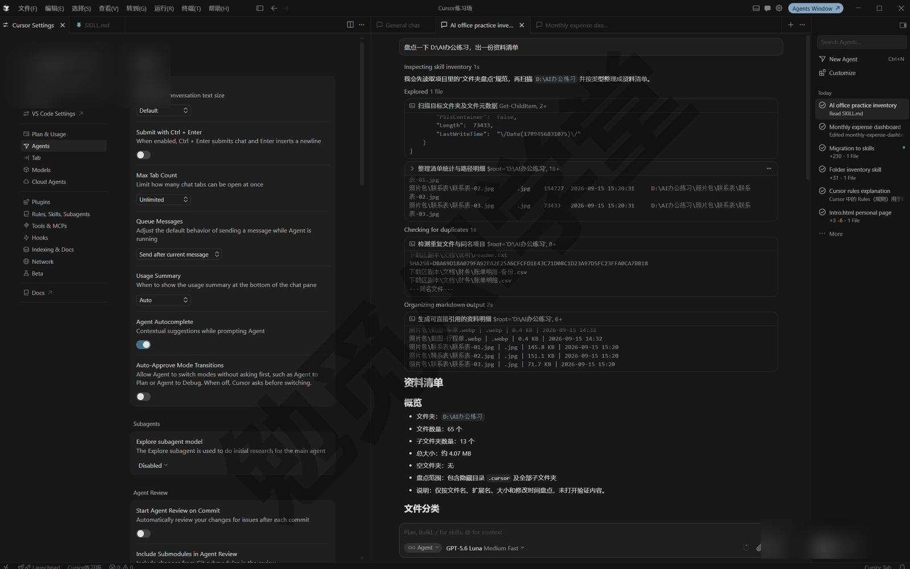

**技能放在哪：四个目录**。技能目录有四个标准位置，Cursor 启动时都会自动加载：

| 位置 | 级别 | 适合放什么 |
|---|---|---|
| 项目里的 `.cursor/skills/` | 项目级 | 跟项目走的做法，随项目共享 |
| 项目里的 `.agents/skills/` | 项目级 | 同上，开放标准的通用目录名 |
| `~/.cursor/skills/` | 用户级 | 个人通用做法，全项目可用，可同步到云端 |
| `~/.agents/skills/` | 用户级 | 个人通用做法，只在本机 |

路径里的 `~` 代表用户主目录：Windows 上是 `C:\Users\你的用户名\`，macOS 和 Linux 上是各自的用户目录。也就是说，Windows 的用户级技能实际放在 `C:\Users\你的用户名\.cursor\skills\`。兼容目录（`.claude/skills/`、`.codex/skills/` 以及它们的用户级同名目录）也会一起被加载。

项目级还是用户级，选择标准和规则一样：跟项目走的做法（比如账单月报）放项目级，进版本库、随项目分享给别人；走到哪都用的个人工作法（比如周报格式）放用户级。生成技能时留意它把文件建在了哪个目录，不合适就把整个技能文件夹移过去——技能就是文件夹，移动后让 Cursor 重新发现即可（必要时重启，发现时机以实际表现为准）。

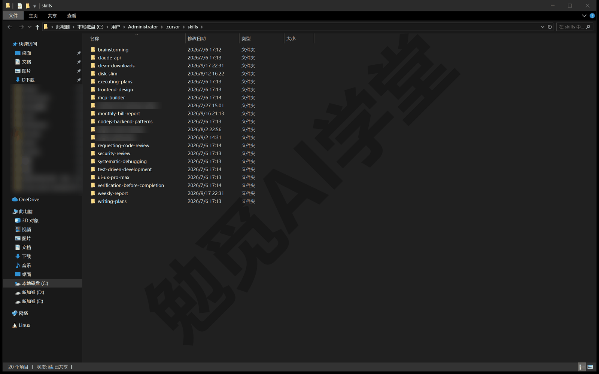

**分类子文件夹与多项目仓库（monorepo）嵌套**。技能多了可以在技能根目录下建分类文件夹，比如 `.cursor/skills/办公/` 下放几个相关技能。Cursor 会逐层扫描整个技能目录，哪一层算一个技能、叫什么名字，看的是直接装着 SKILL.md 的那层文件夹，分类层只是整理用。另外，仓库任何子目录里的 `.cursor/skills/`（或 `.agents/skills/`）也会被发现，而且只在处理那个子目录里的文件时才出现。一个仓库里装多个子项目的组织方式叫 monorepo，在这种仓库里，每个子项目可以带自己的技能、互不打扰，不需要手动设置文件范围。

**scripts、references、assets：三个可选目录**。技能文件夹里还可以带三类资源：

| 目录 | 放什么 |
|---|---|
| `scripts/` | 可执行脚本，智能体照说明书运行它们 |
| `references/` | 补充文档，用到时才读取 |
| `assets/` | 模板、图片、数据文件等静态素材 |

整理的原则是让 SKILL.md 保持精炼：主文件写清步骤与时机，大段参考材料挪进 `references/`，智能体用到时再读，不浪费上下文。脚本在 SKILL.md 里用相对路径引用，比如“运行 `scripts/tidy.py`”，智能体读到这句就会去执行对应脚本。脚本执行与平时跑命令一样，要过运行模式与审批那道关——《权限、沙盒与模型》讲过，Windows 上没有文件系统沙盒，把关靠自动审查与审批弹窗，所以来路不明的技能脚本更要先读后用，安装时的安全问题 10.6 再展开。

**frontmatter 字段速查**。除了两个必填字段，完整可用的字段如下：

| 字段 | 必填 | 作用 |
|---|---|---|
| `name` | 是 | 技能的名字；小写字母、数字、连字符，必须与文件夹同名 |
| `description` | 是 | 做什么、什么时候用；自动触发的判断依据 |
| `paths` | 否 | 通配模式，限定只在涉及匹配文件时出现 |
| `disable-model-invocation` | 否 | 为 true 时只能手动 / 调用 |
| `icon` | 否 | 自定义模式徽章的图标 |
| `color` | 否 | 自定义模式徽章的颜色 |
| `metadata` | 否 | 备注用的自定义信息 |

`paths` 的写法与规则的 globs 是同一类通配写法，可以写列表，也可以用逗号分隔写在一行里：

```
---
name: python-style
description: Python 文件的书写约定。
paths: "**/*.py, scripts/**/*.py"
---
```

不写 `paths` 的技能不限文件范围。旧技能里的 `globs` 字段现在也还认，但新技能应该用 `paths`。

写完的技能都能在设置里 Rules, Skills, Subagents 页的 Skills 分区看到；来自插件和项目的技能会与规则一起列在 Agent Decides（由智能体决定）一组里（英文分组名，以实际界面为准）。

### 10.6 安装、同步与迁移

**从 GitHub 安装技能**。别人分享的技能仓库可以直接装，入口与《规则与 AGENTS.md》里导入远程规则是同一个：设置里 Rules 分区右侧的 + New、选 Import from GitHub/GitLab、粘贴仓库网址。这个入口放在 Rules 分区下，装技能也从这里走，别因为它不在 Skills 分区就以为没有这个功能（以实际界面为准）。装好后往下滚到同一页的 Skills 分区确认技能出现。

技能是“说明书＋可能的脚本”，安全上要先过一遍：装之前打开它的 SKILL.md 和 `scripts/` 大致读一遍，确认它要做的事在你预期之内；不明来源的不装。运行时的审批弹窗是最后一道关，别习惯性放行。

**同步到云端智能体**。云端智能体（Cloud Agents，早期叫 Background Agents）是在 Cursor 云端环境里干活的智能体，关掉电脑也能继续跑，《云端智能体与手机端》细讲。用户级技能默认只在你本机，云端那边看不到。要让云端任务也用上你的个人技能，开同步：

第 1 步：打开设置的 Agents 分区，在 Context and Tools（上下文与工具）一组里找到 Sync Skills for Cloud Agents（为云端智能体同步技能）。3.7.42 版的 Agents 分区里还没有这个开关，下面按官方文档介绍，你的版本有没有以实际界面为准。

第 2 步：打开开关并确认。Cursor 会把 `~/.cursor/skills/` 的内容复制到云端可用的位置。也可以在 Skills 分区里点同步。

三点边界记一下：

- 只有 `~/.cursor/skills/` 会同步；项目技能本来就随仓库走，`~/.agents/skills/` 不会同步。
- 同步的技能只对你自己可见，不会因此分享给团队。
- 关掉开关后，已同步的技能会移回你本机。团队版的管理员可以整体禁用同步功能，个人用户知道有这回事即可。

**发布给团队，了解即可**。同步是给自己的云端用，想分享给同事要走“发布”：在设置的 Skills 分区打开一个个人技能，选择 Publish（发布），它会进入团队的插件市场供同事安装。插件是把规则、技能、子智能体这类自定义能力打包起来分享出去的形态，《插件、市场与 MCP》细讲。先记住一句话：同步是私有的，发布是给团队的。

**/migrate-to-skills：把旧规则和旧命令搬进技能体系**。技能是较新的机制，早期用户手里往往攒着两类旧东西：靠描述触发的“智能判断型”规则（干的其实就是技能的事），以及旧版的斜杠命令（旧 Commands 机制，已经过时）。`/migrate-to-skills` 是官方提供的搬家工具：

第 1 步：在对话里发送 `/migrate-to-skills`。

第 2 步：它会找出能搬的旧规则和旧命令，逐个转换。智能判断型规则（`alwaysApply` 为 false、又没有 `globs` 的）转成标准技能；斜杠命令转成带 `disable-model-invocation: true` 的技能，保持“只手动触发”的老习惯。

第 3 步：到 `.cursor/skills/` 检查生成的技能，确认没问题后再删旧文件。

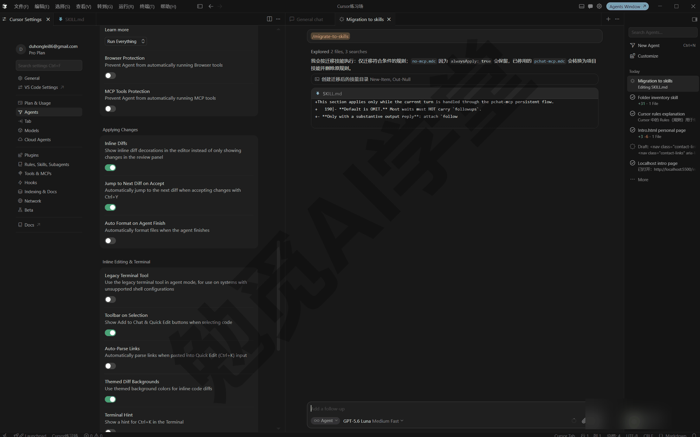

三类东西不会被迁移：始终应用的规则、带 `globs` 的规则（它们的触发条件明确，留在规则体系里更合适），以及用户规则（它不存在于文件系统里）。换句话说，迁移之后规则体系并不清空——要求类的规矩继续当规则，做法类的流程搬进技能，两边各归各位。

### 10.7 画布 Canvas：让报告变成可交互视图

**画布是什么**。画布（Canvas）是渲染在对话旁边的一块可交互内容：分区、统计卡、表格排成一个独立视图，代替聊天里那种要滚半天的长篇文字表格。它背后是一段网页代码，所以能像网页一样交互；你不需要看懂代码，会提要求就行。

**先看一个例子**。拿一份手头的数据直接试，发送（方括号换成你自己的文件）：

```
/canvas
用 [你的数据文件，如 支出明细.csv] 做一个本月支出看板：
顶部放总支出、总收入、净支出三张统计卡，
中间放按类别汇总的表格，按金额从大到小排，
底部放每日支出趋势。金额保留两位小数。
```


发送后，回答末尾会出现一张画布卡片，点开后看板在对话旁边渲染出来：三张统计卡在顶部一字排开，中间的类别表格按金额排好了序，底部的趋势区画出每天的起伏。同样的数据，从一长段需要自己在脑子里排版的文字，变成一眼能看清的页面，这就是画布与普通回答的差别。

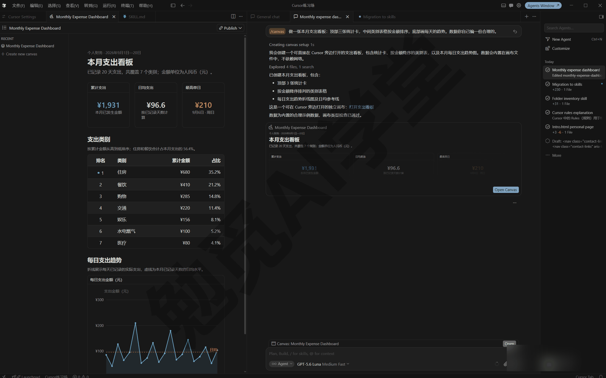

**它是怎么来的**。打开画布有两种方式：一种是你直接要，像上面那样用 `/canvas` 点名，或者在话里说清“做成看板”；另一种是它自己判断——当你要的是分析、核对、报表这类结果、它认为可视化更合适时，会主动开一个（以实际表现为准）。生成过程按官方文档分四步：先判断这个任务适不适合可视化视图；然后把画布做出来，并在对话里插一张引用卡片；接着由你审阅渲染结果，切到它背后的代码里微调或直接让它改；最后它把画布保存下来，之后可以重开，还能带着新数据重跑。

保存下来的画布不会丢。每个工作区（也就是你打开的那个文件夹）有自己的画布列表，回看时不必翻聊天记录：对话里点当时的卡片能打开；命令面板里运行 Open Canvas（在 View 这一类下）也能打开；在代理窗口，还可以从新标签菜单直接开一个画布标签。三个入口通向同一批画布，任选一个即可。

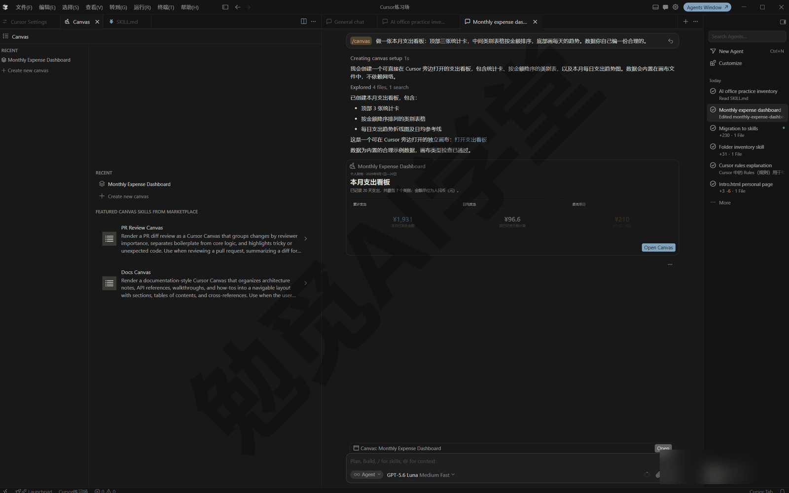

**你能对它做什么**。最常用的是接着对话改：版式不对就直接说“把统计卡挪到顶部”“表格加一列占比”，不必自己碰代码；数字看着可疑或过期，就让它重新取一遍数据，或把计算过程展示出来核一遍。要大改时，官方的建议是回退这一版、带着更完整的要求重新生成，通常比一句一句追问来得快；只是小修小补的话，也可以切到代码里手动改，能看懂多少改多少，不强求。画布还能分享：工具栏的 Publish 可以把它发布成链接，团队成员在浏览器里直接打开，不用重跑智能体。分享功能只在付费套餐、而且是团队场景下才有，并且要求隐私模式允许云端存储；个人自用不用管它，以实际界面为准。

**怎么打包进技能**。一个画布改到满意之后，值得把这套做法固定下来，让“每月支出看板”每次都保持同一个版式——这正是 10.5 自制技能的思路在画布上的应用。官方建议一份画布技能写清四样东西：

- 触发描述：写明什么话该触发它（比如“月度支出看板”），它就是 SKILL.md 的 description，决定自动触发准不准；
- 版式说明：把分区、统计卡、表格的布局固定下来，避免每次生成的样子不一样；
- 数据来源：指明该读哪个文件、跑哪条查询或命令，保证每次取数的标准一致；
- 格式规则：单位、日期范围、排序方式这些细节一次定好，次次一致。

技能就位后，一句短提示就能得到版式一致、数据是最新的看板，团队里谁调用，做出来的版式都一样。《实战二：家庭账单月报流水线》那条流水线目前生成 Excel 和 PPT，想加一个网页版月报，照这个思路补一个画布技能就行。

### 10.8 三个练习任务

方括号里的内容换成你自己的。

**任务一：做一个“周报格式”技能并设成自定义模式**

```
/create-skill
做一个“写周报”的技能：
周报固定五段：本周完成、进行中、下周计划、
风险与求助、一句话总结；
每段用无序列表，每条不超过一行；
语气平实，不用感叹号。
在我说“写周报”“整理周报”时使用。
```

生成后，输入 / 选中这个技能，按 Alt+Enter 进入自定义模式，然后把本周的流水账粘给它整理。

完成标准：`.cursor/skills/`（或用户级目录）出现技能文件夹；输入框出现模式徽章（版本不支持自定义模式的话，改为每轮用 / 点名这个技能）；连续两轮补充素材，它都保持五段格式不散。

**任务二：用 /canvas 把表格数据做成看板**

```
/canvas
用 [你的表格文件] 做一个数据看板：
你先读一遍数据，决定放哪三个关键指标做统计卡，
再放一张明细表格；配色朴素一点。
```

完成标准：回答末尾出现画布卡片，而且能打开；关掉后能从画布列表重开；追加一句“把表格改成按 [某一列] 排序”，它在原画布上完成修改。

**任务三：从 GitHub 装一个公开技能并调用**

找一个公开的技能仓库（同事分享的，或官方与社区整理的示例仓库都行），先在网页上读它的 SKILL.md 确认用途，然后在设置里 Rules 分区走 + New、Import from GitHub/GitLab，粘贴仓库网址导入。装好后发送：

```
用刚装的 [技能名] 技能处理一下 [你的目标文件或文件夹]，
先告诉我它的步骤，再执行。
```

完成标准：技能出现在设置的 Skills 分区；/ 菜单能搜到它；调用后它做的事与 SKILL.md 的描述一致；你能说出它有没有带脚本、脚本大概做什么。

### 10.98 本篇小结与自检

这一篇把“做法”这条线讲完了：技能是以 SKILL.md 为核心的做法说明书，开放标准、跨工具通用；调用有 / 一次性、自动触发、只手动、@ 附上四种方式；自定义模式用 Alt+Enter 让技能在整段对话里一直生效；`/create-skill` 负责把你的做法整理成文件；画布把报告变成可交互视图，还能打包进技能。

- [ ] 能说出技能与规则的分工，记得那句判断标准
- [ ] 认得 SKILL.md 的两个必填字段，知道 description 决定自动触发
- [ ] 在 / 菜单里认过内置技能，知道不认识的条目怎么查
- [ ] 能说出四种调用方式各自适合的场景
- [ ] 版本支持的话，用 Alt+Enter 把技能设成过自定义模式，见过徽章、退出过模式
- [ ] 用 /create-skill 做过一个自己的技能，并在新对话里一句话复用成功
- [ ] 知道技能目录的四个位置，说得清项目级和用户级怎么选
- [ ] 用 /canvas 生成过一个画布，并至少改过一次版式或数据

完成这些内容后，你手里已经有了规则管要求、技能管做法的一套自定义体系。下一步是给 Cursor 接上外面的能力：插件把现成能力打包一键装，MCP 让它连上外部工具与数据。下一篇《插件、市场与 MCP》把设置里剩下的几页一次讲全。

### 10.99 新手常见问题

**Q1：技能和规则先学哪个？**

先规则后技能，也就是本课的顺序。规则门槛低、见效快，一条“始终使用简体中文回复”写完马上就有效果；技能面向多步骤流程，等你手里真的攒出一套重复做法再整理成技能不迟。两者不是二选一：日常配合使用，规则守住要求，技能提供流程，本篇 10.1 那句分工判断（一句话说得清用规则，一套动作才说得清用技能）随时可以拿来对照。

**Q2：技能会自己乱触发吗？**

默认它靠 description 判断你的话跟哪个技能对得上，描述写得含糊确实可能误触发。控制手段有三层：把 description 写具体，“做什么＋什么时候用”都写清；用 `paths` 限定文件范围，不相关的文件不出现；副作用大的技能加 `disable-model-invocation: true`，只许手动点名。另外技能是按需加载的，平时只有名字和描述占一点上下文，不会因为技能装多了就把上下文挤满。

**Q3：别人分享的技能安全吗？**

技能本身是文本说明，风险主要在两处：说明书可能让智能体做你不想要的事，`scripts/` 里可能带可执行脚本。所以装前先读 SKILL.md 和脚本内容，来路不明的不装。运行层面还有一道保险：脚本执行走的是和平时一样的运行模式与审批（Windows 用户的把关机制 10.5 末尾刚提过），看到审批弹窗别习惯性放行，看清它要执行什么。

**Q4：技能能带脚本自动执行吗？**

能。脚本放在技能的 `scripts/` 目录里：SKILL.md 里写“运行 `scripts/某脚本`”，智能体调用技能时会照做，脚本用什么语言写都行。但“自动”不等于“不受管”：每次执行仍要过你当前运行模式那道关，处在自动审查档时，越界的命令会先弹出审批窗，经你确认后才会执行。把有破坏性的动作（删除、覆盖、上传）留在需要审批的范围里，是写技能脚本时应该保持的习惯。

**Q5：/ 菜单里的条目和这篇讲的对不上怎么办？**

这是正常现象：产品几乎每周都在更新，内置技能会增加、删除、改名，本篇的表按 2026 年 9 月的官方文档整理。对不上时，以你自己的 / 菜单为准，选中不认识的条目看它的描述；描述看不明白就直接问智能体“这个技能是干什么的”。判断的办法不会变：只要认得出它是“做法说明书”、知道四种调用方式，新条目也能很快归类。
