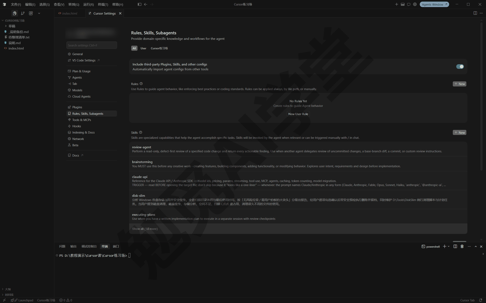
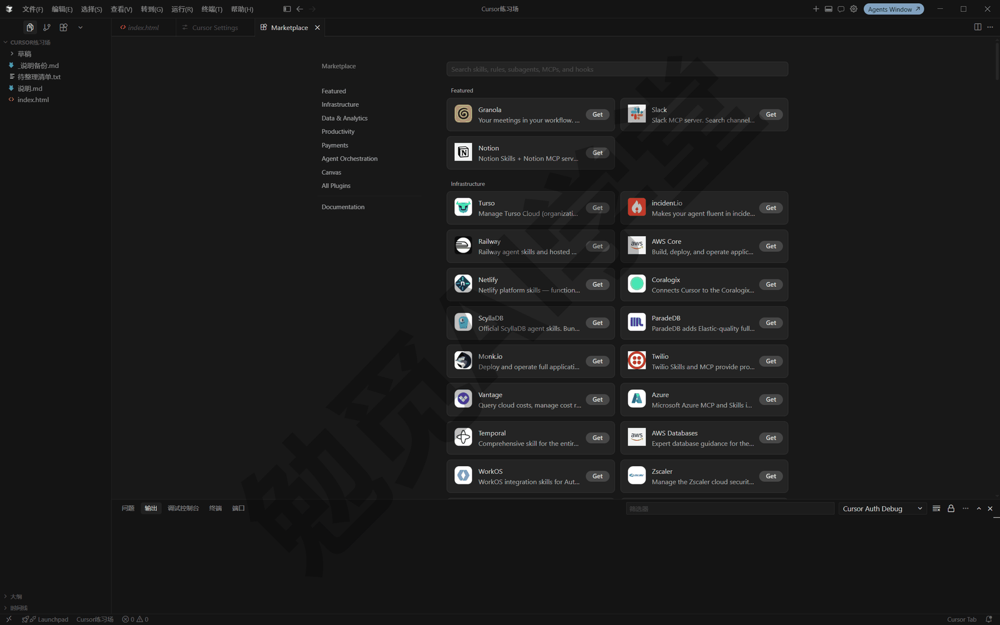
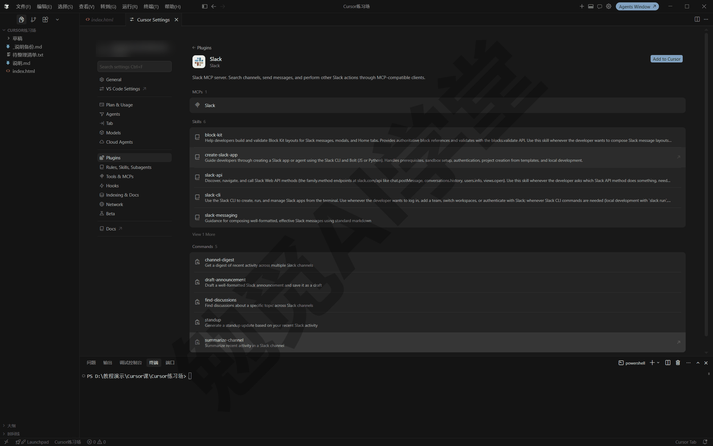
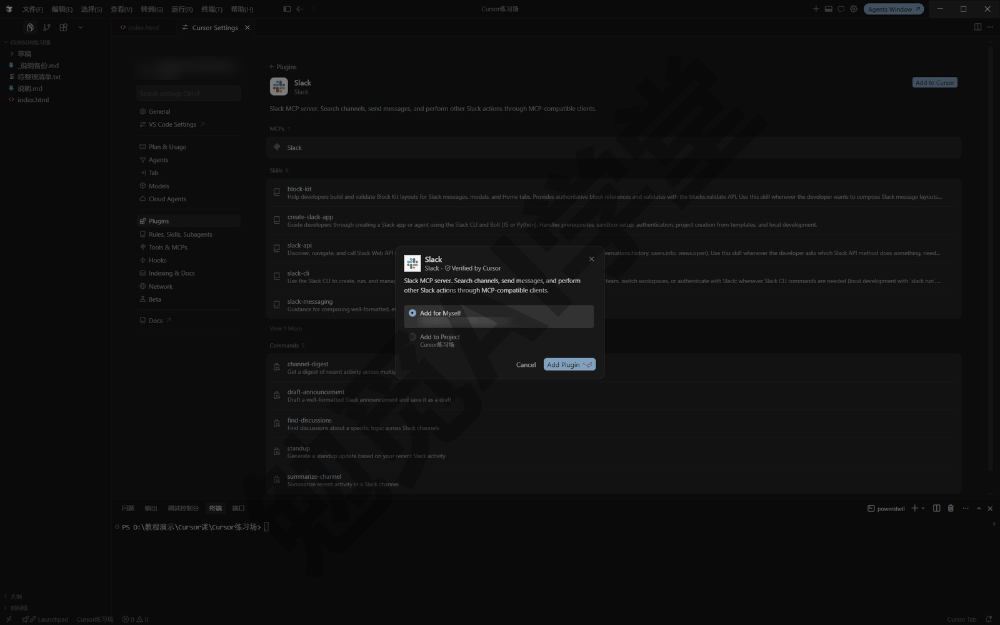
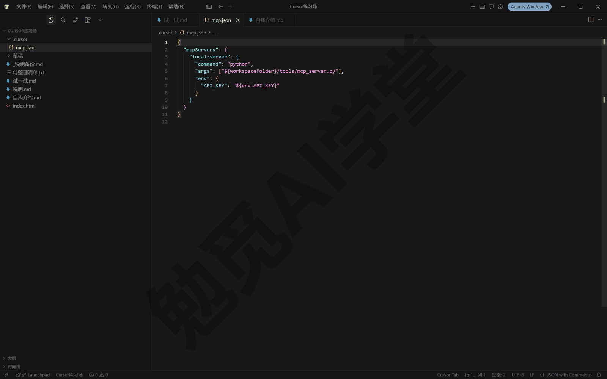
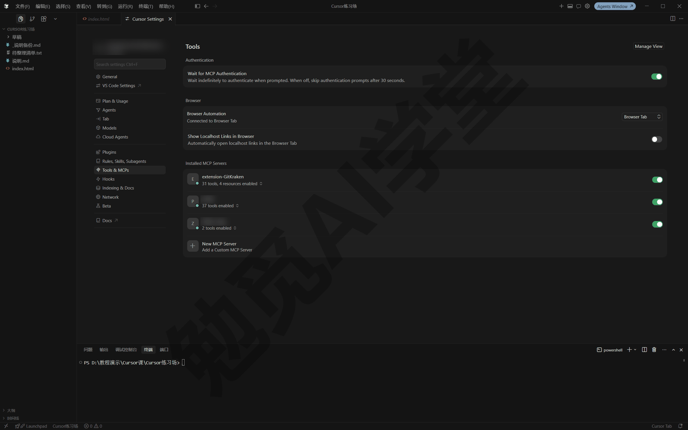
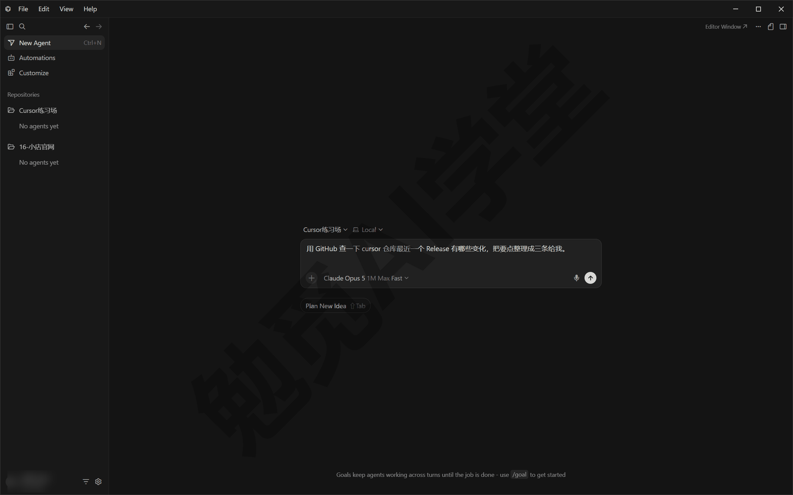
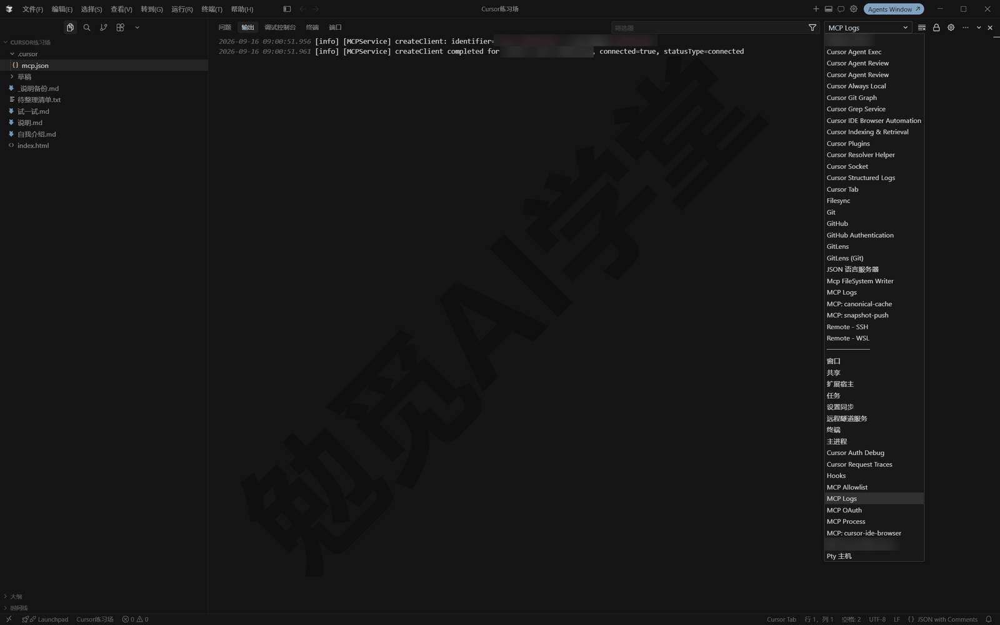
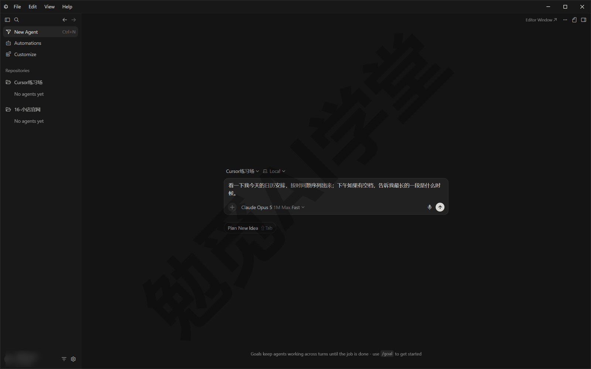

## 插件、市场与 MCP

上一篇《技能与自定义模式》把你自己的做法整理成了技能，这一篇解决“外面的能力怎么接进来”。你会先把设置里管自定义能力的那几页认全，然后认识插件与官方市场的一键安装，接着用较大的篇幅讲 MCP（让智能体连接外部工具与数据的那层接口），包括概念、两种安装方法、审批与日志排错，再真实接通一个办公类插件，最后总结出一套装外部能力的安全习惯。

### 11.1 自定义能力管在哪

**自定义能力多了，得知道去哪里看。** 学到这里，你手里的自定义能力已经不少：规则是让智能体每次对话都记住的要求（《规则与 AGENTS.md》讲过），技能是多步骤做法的说明书（《技能与自定义模式》讲过），本篇还要加上插件和 MCP，《子智能体、并行与工作树》还要加上子智能体。装了什么、哪个在生效、想关掉哪个，总得知道去哪里看。

**自定义能力在哪里。** 这些东西都归在 Cursor 设置里：按 Ctrl+Shift+J 打开设置（代理窗口和编辑器里都能开）。左侧那一列菜单的下半段有四页专管它们：Plugins（插件）、Rules, Skills, Subagents（规则、技能、子智能体，命令也在这一页）、Tools & MCPs（工具与 MCP）、Hooks（钩子）。《规则与 AGENTS.md》里写用户规则用的是第二页最上面的 Rules 分区，《技能与自定义模式》用的是同一页的 Skills 分区，这一篇把四页认全（界面文案以实际界面为准）。



**四页管着七类东西。** 每类给一句话分工、它归哪一页，以及本课在哪一篇讲它：

| 组件 | 一句话分工 | 归哪一页 | 在本课哪里讲 |
|---|---|---|---|
| 插件（Plugins） | 打包：把下面这些零件成套打包、一键安装 | Plugins | 本篇 11.2 |
| 规则（Rules） | 管要求：每次对话自动附上的规矩 | Rules, Skills, Subagents | 《规则与 AGENTS.md》 |
| 技能（Skills） | 管做法：多步骤流程的说明书，可带脚本 | 同上 | 《技能与自定义模式》 |
| 子智能体（Subagents） | 管分工：主对话派出去独立干活的分身 | 同上 | 《子智能体、并行与工作树》 |
| 命令（Commands） | 快捷提示词：用 / 调用的可复用提示词文件 | 同上 | 本节下一段讲清 |
| 钩子（Hooks） | 自动脚本：智能体干活到某些固定步骤时自动运行 | Hooks | 《自动化、钩子与命令行》 |
| MCP | 管连接：让智能体连外部工具与数据的统一接口 | Tools & MCPs | 本篇 11.3～11.5 |

表里只有“命令”是本课还没专门讲过的：它是一份用 `/` 调用的可复用提示词文件，作用类似一条固定短语。个人自建的这类命令现在已经改由技能来做（《技能与自定义模式》讲过用 `/migrate-to-skills` 把旧命令迁成技能），所以今天你主要会在插件带来的组件里见到它，知道有这么个东西就行。

**按范围筛选。** Rules, Skills, Subagents 这一页的顶部有一排范围按钮：All（全部）、User（用户），以及当前工作区的名字，点哪个就只看哪一层的内容（这排按钮的具体形态以实际界面为准）。两层范围的分工是：

- **用户**：装给你这台电脑上的所有项目，比如个人通用的技能、全局的 MCP；
- **工作区**：装进当前工作区（工作区就是你在 Cursor 里打开的那个文件夹），落在项目的 `.cursor` 目录里，跟着项目走。

团队版账号还会多出团队这一层，由管理员统一发给成员，个人用户一般见不到。

为什么需要这个筛选：同一样东西可能装在不同范围（比如全局装了一路 MCP（一路就是一个连接），某个项目里又装了一路同名的），出问题时你得知道现在生效的是哪一份；反过来，装新东西时也要想清楚装到哪一层——判断标准与规则、技能一致，跟项目走的放工作区，个人通用的放用户级。

**找新东西，去市场。** 上面四页管的都是已经装上的东西，想找现成的能力装进来，去的是另一个地方——Marketplace（插件市场）。它有三个入口：代理窗口右侧栏点 Customize、设置 Plugins 页里的 Browse Marketplace 按钮、网页版 cursor.com/marketplace，通向同一个市场。

页面顶部有一个搜索框，插件、技能、子智能体、MCP 与钩子都能搜；左侧可以按 Featured（精选）、Infrastructure（基础设施）、Data & Analytics（数据分析）、Productivity（效率）这些分类浏览，每张卡片右侧有一个 Get 按钮，点它就能装。

对新手来说，这比搜索引擎更可靠：能收进市场的，至少有人替你审过一道。不过“市场里有”不等于“你需要装”，选择的原则放在 11.7 一起讲。



把这四页从头到尾看一遍，你就清楚了“我的 Cursor 现在有哪些外部能力、各自装在哪一层”。后面几节装的每样东西，最后都会回到这几页管理。

### 11.2 插件：把成套能力打包一键装

**为什么需要插件。** 想让智能体对接某个服务或掌握某套工作法，往往不是装一样东西就完事：可能要一条 MCP 连接、再配一条使用规则、外加两个技能。照前几篇的方法一件件手工配置当然可行，但麻烦；更常见的情况是——别人已经把这一整套配好了，你想直接拿来用。

**插件是什么。** 插件（Plugins）是把这些能力打包起来分享出去的形态：一个可以直接安装的包。你可以把插件理解成一只配好的工具箱，规则、技能、子智能体、命令、MCP 连接、钩子这些零件，作者都替你搭配好了，装一次，整套到位。按官方文档，一个插件可以包含下面这些组件里的任意几种：

| 组件 | 在插件里的形态 |
|---|---|
| 规则 | `.mdc` 规则文件，装后按各自触发条件生效 |
| 技能 | SKILL.md 技能包，出现在 / 菜单 |
| 子智能体 | 预先配好的分身角色（《子智能体、并行与工作树》细讲这是什么） |
| 命令 | 用 / 调用的提示词文件 |
| MCP 服务器 | 外部工具连接，可能需要授权 |
| 钩子 | 在固定步骤自动运行的脚本 |

**官方市场。** 插件的主要来源是 Cursor Marketplace（官方插件市场），入口在 11.1 认过：网页版在 cursor.com/marketplace，应用内从代理窗口右侧栏的 Customize 或设置 Plugins 页的 Browse Marketplace 进去，在顶部搜索框按关键词搜。它有三个值得记住的特点：

- **人工审核**：每个插件上架前由官方人工审核，之后的每次更新也要再审；
- **必须开源**：所有上架插件的代码公开，任何人都能查看它到底做了什么；
- **都是 Git 仓库**：插件本身是一个代码仓库，由作者提交给 Cursor 团队上架。

**怎么装。** 安装流程分三步（本篇的完整例子放在 11.6，用 Google 日历插件把从安装到调用的每一步写全，这里先看流程）：

**第 1 步：找到插件。** 打开 Marketplace，在搜索框输关键词，或按左侧分类浏览，点开一个插件看它的详情页——组件清单、权限说明、作者信息都在这里。



**第 2 步：点安装、选范围。** 点详情页右上角的 Add to Cursor（添加到 Cursor）后，会弹出一个小窗让你选装到哪一层：Add for Myself（装给自己，也就是用户范围）或 Add to Project（装进当前项目）——项目范围随这个工作区走、适合项目专属的对接；用户范围全局可用、适合通用能力。选好后点 Add Plugin（添加插件）。



**第 3 步：确认组件就位。** 装好后回设置里看：插件本身列在 Plugins 页，它带来的规则、技能、子智能体、命令分别出现在 Rules, Skills, Subagents 页的对应分区，MCP 连接出现在 Tools & MCPs 页；含 MCP、又需要登录的插件，会引导你完成授权（授权是怎么回事，11.4 细讲）。

**装完怎么用。** 插件没有一个统一的“打开”动作——它带来的每个零件按各自的老规矩生效：规则按触发条件进上下文，技能照旧用 / 点名或自动触发，MCP 工具出现在对话的可用工具里。换句话说，前几篇学的用法在这里全都照样能用，插件只是把“装”这一步变成了一次点击。

**社区库 cursor.directory。** 官方市场之外，还有一个社区维护的目录站 cursor.directory，收集社区制作的插件与 MCP 服务器，数量更多、更新更快。它和官方市场的关键区别是：不在官方人工审核的范围内，质量与安全靠你自己把关——从这里装东西之前，先把 11.7 的安全五条过一遍。

**开放标准，了解即可。** 和技能一样，插件也在走开放标准的路线：Agent Plugins 是打包插件的开放标准（《技能与自定义模式》讲过技能的 Agent Skills 标准可以跨工具通用，两者是同一思路），Cursor 同时支持标准格式与自家格式，安装流程完全一样，你不需要区分。想自己做插件分享给别人，官方提供了模板仓库，本地开发可以放在 `~/.cursor/plugins/local` 目录测试，属于进阶内容，知道有这个办法即可。

**团队市场与插件画布，了解即可。** 团队与企业套餐可以开设团队市场，管理员可以用三种方式把插件发给成员：默认关闭（成员自选装）、默认开启（自动装、可退出）、必装（不可卸载）。《技能与自定义模式》讲过个人技能可以发布（Publish）给团队，它进的就是团队市场。另外，部分插件带“画布”模板——《技能与自定义模式》讲过画布是渲染在对话旁的可交互视图，插件画布就是作者预先做好的画布模板，装好后从设置的 Plugins 页里打开，省去从零搭建（以实际界面为准）。个人用户现在用不到这两样；知道有团队市场和插件画布这两个名字，等以后加入团队套餐时再回到这一节看就可以。

### 11.3 MCP 是什么：给智能体接外部工具的统一接口

**从 2024 年的 ChatGPT 说起。** 如果你用过 2024 年的 ChatGPT，应该还有很深的印象：当时的它只能回答训练数据截止日期（2023 年 4 月）之前的问题，对这个时间点之后发生的事一概不知。根本原因在于，当时的 ChatGPT 不会联网，模型只能靠训练时装进去的知识作答。后来的 AI 补上了联网搜索，公开网页上的新消息能查到了，但同样的局限换了个地方：你公司的数据库、团队内部的文档、要登录才能用的在线服务，搜索引擎够不着。要让 AI 用上这些信息、替你操作这些服务，得给它接上对应的外部信息源和程序。说到底都是同一件事：让 AI 和“外部程序”对话。

Cursor 里的智能体也是这样。它自带的工具就那么几类：读写文件、跑命令、开浏览器（《文件与办公能力一篇讲全》和《内置浏览器与设计模式》都用过）。可你的信息未必都在本地文件夹里——邮件、网盘、日历、公司的项目管理系统、数据库，都存放在外部服务里。没有连接时，你只能自己导出、复制、粘贴，把资料一趟趟搬给它：它再能干，搬运这一步还是得你自己做。

**各接各的，接口五花八门。** 给 AI 接外部程序这件事，早就有人在做。上面说的联网搜索就是最早的例子之一：有人写了能联网搜索的程序，接到当时还不能联网的 ChatGPT 上，它的能力就多了一块；后来又接上能爬网页的、能操作设计软件的……问题随之而来：市面上的 AI 有很多家，外部程序数以万计，每一家的对接方式都不一样。就像插座：你家用两孔，他家用三孔，电器厂家就得为每一种插座单独做一款插头；AI 这边也是一样，开发人员每接一个外部程序，就得单独开发一套对接。

**大家坐下来定一个标准。** 电器行业早就这么做了：现实里插座有国家标准，不管哪个厂生产插座都得按这个标准来，任何电器只要插头符合标准就能用电。AI 行业用的是同一个办法，这个“国家标准”就是 MCP（Model Context Protocol，模型上下文协议）：它规定了智能体和外部程序之间怎么对话，给什么样的指令、返回什么样的结果。英文名不用记，记住它的身份就行：MCP 是一个沟通标准，外部程序按标准做好“插头”，Cursor 这样的应用提供标准的“插座”，插上就能用，两边都不用再为每一种组合单独做对接。前几篇提过一句“MCP 是让智能体连接外部工具和数据的标准接口”，说的就是这个意思，本节把它讲全。今天接邮件、明天接数据库，插的都是同一个插座。


**能力是谁的：把数据流向想清楚。** 理解 MCP 最容易走偏的地方在这里：接入一个日历服务后，智能体会查你的日程了，这个本事是 MCP 给的吗？不是。查日程的能力是那个外部程序自己开发的；MCP 只规定了双方怎么沟通。数据流向是：你的要求经过这个标准接口交给外部程序，外部程序干完活，把结果按标准格式返回给智能体。MCP 本身不产生任何能力，它只是那根标准化的连接线。

后面会反复用到两个称呼。提供能力的外部程序，技术资料里叫“MCP 服务器”——后面再说“服务器”，指的就是接进来的那个外部程序，它可以跑在你自己电脑上，也可以是网上的在线服务，用什么语言写的都有，不必联想成机房里的大铁柜。它提供哪些工具、返回什么数据、质量如何，全由这台服务器决定；Cursor 负责的是找到工具、发起调用、把结果交给对话，以及审批把关。所以评价“这个 MCP 好不好用”，问的其实是那台服务器好不好；Cursor 这边的体验，对所有服务器一视同仁。

服务器把自己的能力打包成一个个“工具”——也就是智能体可以调用的具体动作，比如“搜索文档”“查日程”，智能体干活时调用的就是这些工具。有的服务器还带提示模板和可以引用的资料；较新的 MCP Apps 扩展还允许工具在对话里显示出可交互的界面。这些形态见过就行，日常打交道最多的是工具。

**你可能已经在用它。** MCP 听起来像是只有开发者才用得上的东西，其实离你很近：11.2 讲的插件里，不少就带着 MCP 服务器（那一节的组件表里就有这一行）。装过这样的插件，设置 Tools & MCPs 页里就已经列着它带来的服务器，尽管你没有单独配置过。所以不用把它当成高深的东西——你要做的只是把别人做好的“插头”插进来。

**用起来是什么样子。** 概念说得再多，不如先认一眼画面。假设你已经接入了一个日历类的服务（本篇 11.6 里就会真实接通一个；还没装的读者先把流程看一遍认识一下，装好后回来照做），需求用平常说话的方式提就行：

```
查一下我日历上明天有什么安排，
有时间冲突的地方提醒我一声。
```

发送后会看到两样东西。先是一次审批询问——默认设置下，智能体调用外部工具前要先经你同意，这套机制 11.5 细讲；你同意之后，对话里出现一张工具调用卡片，标着这路服务器和工具的名字，点开能看到它发出的参数、拿回的数据（卡片形态以实际界面为准），最后才是根据你真实日历内容给出的回答。整个过程你没有打开任何网页、没有复制粘贴——这就是“连接”和“搬运”的差别，所以接下来两节要多花些篇幅。

**三种连接方式，了解即可。** MCP 服务器与 Cursor 之间的连接方式（官方叫“传输”）有三种：

| 传输方式 | 服务器跑在哪 | 配置里写什么 | 验证方式 |
|---|---|---|---|
| stdio | 你本机，由 Cursor 负责启动 | 一条启动命令 | 手工配密钥 |
| SSE | 本机或远程，要自己搭 | 一个网址 | 一般走 OAuth |
| Streamable HTTP | 本机或远程，要自己搭 | 一个网址 | 一般走 OAuth |

名字不用背，会认两类配置形态即可：配置里写启动命令的，是跑在你本机的 stdio 服务器；写网址的，是远程服务（SSE 或 Streamable HTTP 之一）。这个区分马上就用得上——两类的配置字段不一样。

**四样东西各管什么。** 到这里，规则、技能、MCP、插件四个词各自负责什么就都讲到了：

- **规则**——每次对话自动附上的要求，管的是规矩：智能体本来就会做这些事，规则让它按你的要求去做（《规则与 AGENTS.md》）。
- **技能**——写给智能体的多步骤说明书，管的是做法：能力它本来就有，说明书让它按你的标准发挥（《技能与自定义模式》）。
- **MCP**——接外部程序的标准插座，管的是连接：能力在外部程序那里，MCP 负责让双方说得上话。
- **插件**——把规则、技能、MCP、子智能体这些零件装成一个包，管的是打包：装一次，整套到位。

拿本篇 11.6 要接的日历举例就能分清：把“查日程、排时间的步骤”写成技能，智能体得到的只是一份操作说明，用的仍是它原有的能力，你的日历它照样看不见；接上日历的 MCP，它才真正连上了你的日历。它们经常一起出现：比如某个服务的官方插件，拆开看往往就是“一路 MCP 连接＋一条使用规则＋几个技能”的组合包。一句话总结：规则和技能决定它怎么干，MCP 决定它能碰到什么。

### 11.4 装一个 MCP：从市场一键安装，或手写 mcp.json

装 MCP 有两种方式，对应两类来源：官方市场里有的，一键安装加授权；市场里没有的（服务商文档或社区给了一段配置），手写配置文件接入。先讲官方市场里一键安装这种。

#### 安装方法一：市场一键安装（OAuth 授权）

**第 1 步：找到并安装。** 按 Ctrl+Shift+J 打开设置，进 Plugins 页，点 Browse Marketplace 打开插件市场（或直接打开网页 cursor.com/marketplace），在顶部搜索框搜你要的服务，点开它的条目，点 Add to Cursor（添加到 Cursor）或 Install 一类按钮（文案以实际界面为准）。

**第 2 步：完成 OAuth 授权。** 需要登录的服务会跳转浏览器，打开服务商自己的授权页。OAuth 是一种常见的第三方授权方式：你在服务商的页面上登录并点同意，服务商发给 Cursor 一张可随时撤销的授权凭证——全程你的密码不经过 Cursor。页面上会列出它请求的权限范围，读一遍再点同意。

**第 3 步：回来确认。** 授权完成后回到 Cursor，设置 Tools & MCPs 页的 Installed MCP Servers（已装的 MCP 服务器）一栏里能看到这路服务器已经连接、带来了多少个工具（显示形态以实际界面为准）。到这里就装完了，对话里已经可以用。

#### 安装方法二：手写 mcp.json

手写 mcp.json 一共四步：找到配置文件、写入服务器条目、把密钥换成环境变量引用、保存确认。下面一步一步来。

**第 1 步：找到或新建配置文件。** 手写配置时要改的就是 mcp.json，它有两个标准位置：

| 位置 | 级别 | 适合 |
|---|---|---|
| 项目里的 `.cursor/mcp.json` | 项目级 | 项目专属的工具连接，跟项目走 |
| `~/.cursor/mcp.json` | 用户级 | 个人通用连接，你这台电脑的所有项目可用 |

`~` 代表用户主目录，Windows 上就是 `C:\Users\你的用户名\`——与《技能与自定义模式》里技能目录的规则相同。项目级还是用户级，判断标准也一样：跟项目走的放项目，走到哪都用的放用户级。文件不存在就自己新建一个（让智能体替你建也行）。

**第 2 步：写入服务器条目。** 本地（stdio）和远程两类条目写法不同。先看本地——官方文档给的 Node.js 命令行服务器示例如下，照着抄，把 server-name 换成你自己起的名字、args 里的 mcp-server 换成服务商给的包名（密钥怎么填看第 3 步）：

```json
{
  "mcpServers": {
    "server-name": {
      "command": "npx",
      "args": ["-y", "mcp-server"],
      "env": {
        "API_KEY": "value"
      }
    }
  }
}
```

这段怎么读：`mcpServers` 下面的每一项就是一路服务器，名字（这里的 server-name）由你起，起个一眼能认出是哪个服务器的名字；里面的字段告诉 Cursor 怎么启动它。stdio 本地服务器的可用字段如下：

| 字段 | 必填 | 作用 |
|---|---|---|
| `type` | 是 | 连接类型，本地命令行服务器写 `"stdio"` |
| `command` | 是 | 启动命令，如 `npx`、`node`、`python`、`docker`；必须在系统路径里，否则写完整路径 |
| `args` | 否 | 传给命令的参数，写在方括号里 |
| `env` | 否 | 传给服务器的环境变量，密钥一般走这里 |
| `envFile` | 否 | 从指定文件批量加载环境变量，如 `".env"`；只有 stdio 服务器支持 |

细看会发现，上面的官方示例里没写 `type` 字段——照抄示例通常就能跑起来；按字段表把它补上会更清楚，两种写法官方文档里都有（以实际生效情况为准）。

示例里的 `npx` 是随 Node.js 一起装的工具，很多现成 MCP 服务器以这种方式启动，所以电脑上要装 Node.js 环境。没装的话，《文件与办公能力一篇讲全》讲过让智能体一句话替你装工具，这里同样适用。

远程服务器的条目更简单，只需要网址（必要时再加一段 headers，用来附带密钥之类的信息），官方示例：

```json
{
  "mcpServers": {
    "server-name": {
      "url": "http://localhost:3000/mcp",
      "headers": {
        "API_KEY": "value"
      }
    }
  }
}
```

需要 OAuth 的远程服务，一般保存配置后首次连接会引导你走授权；个别服务商要求固定的授权信息，mcp.json 还支持在条目里写 `auth` 段，属于进阶用法，官方文档有完整字段表，遇到再查。

**第 3 步：把密钥换成环境变量引用。** 上面两个官方示例里的密钥都直接写成了 `"value"`，实际使用不要这样做——mcp.json 是普通文本文件，项目级的那份还可能随项目进版本库、被分享出去，把真密钥写在里面等于把钥匙贴在门上。这一步分两小步：先把密钥存进系统环境变量——Windows 上在“系统属性”的环境变量对话框里添加，不熟就问智能体“帮我把某某密钥设置成环境变量”，让它告诉你步骤，或者直接替你做；然后把文件里直接写着的密钥换成变量引用。Cursor 支持在 `command`、`args`、`env`、`url`、`headers` 这些字段的值里引用变量，可用的写法如下：

| 写法 | 取到什么 |
|---|---|
| `${env:NAME}` | 名为 NAME 的系统环境变量 |
| `${userHome}` | 你的用户主目录 |
| `${workspaceFolder}` | 项目根目录（含 `.cursor/mcp.json` 的那个文件夹） |
| `${workspaceFolderBasename}` | 项目根目录的文件夹名 |
| `${pathSeparator}` | 当前系统的路径分隔符 |

替换后的效果就是官方的组合示例：

```json
{
  "mcpServers": {
    "local-server": {
      "command": "python",
      "args": ["${workspaceFolder}/tools/mcp_server.py"],
      "env": {
        "API_KEY": "${env:API_KEY}"
      }
    }
  }
}
```

这样文件里没有任何真实密钥，换台电脑只要环境变量同名就能直接用；将来在《Git、GitHub 与代码审查》里学会把项目推上远程仓库时，也不用担心把钥匙一起交出去。



**第 4 步：保存并确认生效。** 保存 mcp.json 后，设置 Tools & MCPs 页的 Installed MCP Servers 一栏应该会出现这路服务器（什么时候生效以实际表现为准，没出现就重启一次 Cursor）。状态正常的话，能看到它加载出的工具；一直连不上就去 11.5 的日志排错。

**启用与停用的开关。** Tools & MCPs 页里每路 MCP 服务器右侧都有一个开关：关掉后它不再加载、工具也从对话里消失，配置本身保留，随时可以再开。这个开关比直接删配置稳妥得多。常用的场景有两个：排错时逐个关掉，看是哪个服务器出的问题；暂时用不上某路服务时把它关掉，少几个工具干扰。



### 11.5 用起来：调用、审批、看返回、查日志

**它什么时候用 MCP 工具。** 有两种情况：

- **自动**：MCP 工具会进入智能体的可用工具清单，任务相关时它自己会用，计划模式做调研时也会用；
- **点名**：你直接说用哪个服务、要它做什么。

点名的演示如下（方括号里的内容换成你自己的）：

```
用 [你接入的服务名] 查一下 [一个具体问题]，
把要点整理成三条给我。
```



**审批弹窗怎么读。** 默认设置下，每次调用 MCP 工具前 Cursor 都会弹窗询问。弹窗上点工具名旁边的箭头可以展开参数——也就是它准备发给外部服务的内容。对外部调用来说，参数就是真正要发出去的数据，发出去什么、发给谁，扫一眼再放行是好习惯。

**与运行模式的关系。** 《权限、沙盒与模型》讲过运行模式三档：自动审查、白名单、全部运行（中文文案以实际界面为准）。MCP 工具调用和终端命令用的是同一套档位规则：

- **自动审查档**：白名单里的 MCP 工具直接运行，其余交给分类器判断，拿不准的转给你审批；
- **白名单档**：清单之外的一律要先弹窗经你确认，它什么时候会停下来问你是完全确定的；
- **全部运行档**：一律直接执行——对连着外部服务的 MCP 来说，不建议。

把某个信得过的工具加入白名单，通常可以在审批弹窗上选择“允许并记住”一类选项（选项文案以实际界面为准）；《权限、沙盒与模型》讲过的 permissions.json 自然语言规则对 MCP 工具同样有效——在那份文件里写一句“某某服务的写入操作都先问我”，分类器就会照这句话把关。那一篇提过 MCP 也有类似的预先放行清单机制、细节留到本篇讲，指的就是这里。

**看返回的结果。** 调用结束后，对话里出现这次调用的结果卡片，参数和返回内容都可以展开细看。MCP 服务器还可以返回图片（截图、图表都行），Cursor 会把图片附进对话，当前模型支持看图的话还能直接分析。

**MCP 日志排错。** 连不上、调用失败、表现不对，先看日志。日志在输出面板里：编辑器菜单“查看 → 输出”打开（快捷键 Windows 上通常是 Ctrl+Shift+U，以实际设置为准），在面板右上的下拉列表里选择 MCP Logs（MCP 日志）。里面按时间记录着每路服务器的启动、每次工具调用和报错信息——是启动就失败（命令找不到、环境缺东西），还是身份验证被拒（密钥错、授权过期），日志里一眼能分清。



**故障时会发生什么。** 某路服务器崩溃或超时，Cursor 会在对话里报错、把这次调用标记为失败，其余服务器不受影响，你可以直接让它重试。用 npm（随 Node.js 一起装的安装工具）装的服务器怀疑版本过旧时，官方给的更新办法分三步：从 Tools & MCPs 页移除这路服务器，清理缓存（npm 存在本地的旧安装包），再重新添加。清缓存的命令：

```
npm cache clean --force
```

更完整的“一直连不上”排查步骤，放在本篇常见问题 Q4。

### 11.6 办公类插件：接通 Google 的邮件、云盘与日历

**Google 插件是什么。** 官方市场里有三个 Cursor 自己做的 Google 插件：Gmail（邮件）、Google Drive（云盘）、Google Calendar（日历），官方合称 Google Workspace 插件。三个各装各授权，用到哪个装哪个。装好并授权后，你可以在对话里直接问邮件、找文件、查日程，不用在浏览器和 Cursor 之间来回切换。

**三个插件各能做什么。** 按插件详情页的说明，各对应一类用法（具体能力以详情页说明为准）：

- **Gmail（邮件）**：查询并总结近期邮件，比如“把这两天没读的邮件按重要程度列出来”；
- **Google Drive（云盘）**：搜索云盘里的文件并读取内容，比如“找到上季度的预算表，告诉我总额”；
- **Google Calendar（日历）**：查看日程、结合日程做安排，比如“看看我明天有哪些会，帮我找出能专心写方案的时段”。

**前提，以及国内能不能用。** 需要一个 Google 账号；授权和调用全程要能正常访问 Google 的服务。国内网络环境下能否顺利完成授权与调用，以你自己试的结果为准——如果卡在授权页打不开或调用超时，那是网络能不能连上的问题，不是你操作错了。没有 Google 账号或连不上的读者，本节读一遍了解即可，思路对市场里其他办公协作类插件同样适用。

**怎么装。** 分三步，与 11.2 的通用流程一致：

**第 1 步：搜索并安装。** 按 Ctrl+Shift+J 打开设置，进 Plugins 页，点 Browse Marketplace 打开插件市场（从代理窗口右侧栏的 Customize 进，或直接打开网页 cursor.com/marketplace，到的是同一个市场）；在顶部搜索框输入 Google Calendar，打开它的详情页，点 Add to Cursor（添加到 Cursor），选 Add for Myself（装给自己，也就是用户级——这类个人办公插件一般都这么选），再点 Add Plugin。下面第二个例子还要用邮件，照同样的方法再装一个 Gmail；也可以在对话里直接发送 /add-plugin google-calendar 这类命令安装（以实际界面为准）。

**第 2 步：完成 Google 授权。** 每装一个插件，浏览器都会跳一次 Google 的授权页面，登录你的 Google 账号。授权页会列出这个插件请求的权限范围——读哪些数据、能不能代发邮件，逐项写得明明白白，读完再点同意。

**第 3 步：确认就位。** 回到 Cursor，设置的 Plugins 页能看到你装的几个插件，Tools & MCPs 页多出对应的 MCP 连接（装了几个插件就多出几个）。

**用一次试试。** 授权完成后发送：

```
看一下我今天的日历安排，按时间顺序列出来；
下午如果有空档，告诉我最长的一段是什么时候。
```



做完会看到：按当前运行模式弹审批（或直接放行）、对话里出现日历工具的调用卡片，然后是按你真实日程给出的回答。第一次看到它报出你今天的真实安排，“连接外部数据”是什么意思也就清楚了。

**再举一个完整例子：周一早上的收件箱。** 这个例子要 Gmail 和 Google Calendar 都装好。周一开工，先发：

```
把我最近三天的未读邮件按重要程度分三档列出来，
每封用一句话说清是谁发的、要我做什么；
需要回复的那几封，结合我今天的日历建议各自的回复时段。
```

这一次它会连续调用不止一个工具：先查邮件、再读日历，对话里依次出现几张调用卡片（每次调用照旧按你当前的运行模式审批），最后交回一份综合了两边数据的清单。“接通”的好处就在这里：换作以前，你要自己开邮箱翻三天、开日历对时间，再在脑子里合并两边的信息；现在数据由它取齐，你只看结论、做决定。类似的组合还能把云盘那一项加进来，比如“把上周会议纪要里我认领的事项找出来，对照日历排进本周”。

**边界与提醒。** 邮件、日历、云盘都是很私密的数据，有两条习惯要跟上：授权时只给需要的范围，用不到代发邮件就别给这一项（授权页能细分到什么程度以实际界面为准）；不再使用时，除了在设置的 Plugins 页停用插件，最好到 Google 账号的安全设置里把给 Cursor 的第三方授权也撤销掉（入口以 Google 实际界面为准）。这两条做法对所有连账号的插件通用。

### 11.7 安全五条

本篇装的每一样东西，都在扩大智能体能做的事，能做的事越多，风险也越多：MCP 服务器能访问外部服务，也能在你电脑上执行代码。《权限、沙盒与模型》讲过，Windows 上没有文件系统沙盒，把关靠自动审查分类器和审批弹窗，所以“装什么”这道关，更要在源头把住。五条习惯，每条配一个真实场景，每条都只是一个小动作，合起来就是一道完整的防线。

**第一条：只从可信的来源装。** 官方市场有人工审核加强制开源，新手默认从这里装最稳妥；cursor.directory 和 GitHub 上自装的东西，要自己看作者是谁、仓库像不像正经维护的项目。举个场景：你想找一个处理 PDF 的 MCP，一搜出来七八个名字差不多的仓库——先挑官方市场里有的；市场里没有，再比作者信息是否完整、更新记录是否连续、说明写得像不像回事；那种几个月没动静、说明只有两行的，再方便也跳过。来路说不清的，不装。

**第二条：看清它要什么权限。** 安装和授权时的权限清单不要一路点过去，它要的权限得和它的用途对得上。比如你装一个翻译类插件，授权页却要求“读取并管理你的全部邮件”——翻译用不着邮箱，这就是停下来的信号：要么它设计粗糙，要么另有所图，无论哪种都别装了。11.6 那个逐项写清“读哪些数据”的 Google 授权页，就是这条习惯最常用到的地方。

**第三条：给最小权限的 Key。** 不少服务用 API Key（服务商发给你的访问钥匙）做身份验证。举个场景：你要接一个数据服务查报表，服务商后台创建 Key 时给了一排选项，这时能选“只读”就不给写入，能限定“只访问某一个数据库”就不选全部，能设置 90 天有效期就不选永久。另外还有一个习惯：一个服务一把钥匙，不混用；出了事，撤销这一把就行，不影响其他服务。

**第四条：密钥进环境变量，不直接写在配置里。** 具体做法 11.4 的第 3 步讲过：mcp.json 里用 `${env:NAME}` 引用，真实密钥放系统环境变量。举个场景：你把练习项目打包发给朋友参考，或者学完《Git、GitHub 与代码审查》把项目推上了远程仓库——项目里那份 `.cursor/mcp.json` 会原样跟着走，直接写在里面的 Key 等于当众展示；换成变量引用，文件本身干干净净，别人拿到也只是个空壳。

**第五条：不用就停用。** 举个场景：上个月为整理发票接的那路服务，这个月一次都没用——到 Tools & MCPs 页把开关关掉，工具从对话里消失、不再占上下文；连过账号的（比如 11.6 的 Google），顺手到服务商的安全设置里撤销授权。隔一阵清点一遍装过的东西，只花一分钟，能省掉以后不少麻烦。

关键场景再加一道关：真正要紧的集成（连着钱、连着核心数据的），装之前读一遍代码——官方市场插件必须开源，代码就在那里。自己读不懂，就让智能体替你读，发送（方括号里的内容换成你自己的）：

```
读一遍 [插件或 MCP 服务器] 的源码，告诉我：
它会访问哪些外部地址、执行哪些命令、读写哪些文件，
有没有把数据发往与用途无关的地方，最后给一份风险摘要。
```

它会把代码翻一遍，交回一份按条列出的风险摘要，你再决定装不装。用 AI 审 AI 要用的工具，是这门课里很好用的办法。

最后一道关永远是审批弹窗。《技能与自定义模式》在讲技能脚本时提醒过“别习惯性放行”，对 MCP 工具也一样：弹窗出现时扫一眼它要干什么，这个习惯比任何清单都管用。

### 11.8 三个练习任务

方括号里的内容换成你自己的。

**任务一：从市场装一个插件并用一次**

到 Marketplace 或网页市场挑一个你用得上的插件（文档查询、办公协作类都行），看完详情页的组件清单和权限说明再装。装好后发送：

```
用刚装的 [插件名] 帮我查一下 [一个和它用途相关的问题]，
先告诉我你调用了什么工具，再给结果。
```

完成标准：设置里能看到这个插件与它带来的组件；对话里出现工具调用卡片；你能说出这个插件包含哪几类组件、各自装到了哪个范围。

**任务二：手写 mcp.json 接一路 MCP 并看日志**

从服务商文档或 cursor.directory 找到一路 MCP 的一段配置（本地 stdio 或远程都可以），照 11.4 的字段表写进 `~/.cursor/mcp.json`；密钥一律改成 `${env:你的变量名}` 引用。保存后发送：

```
列出你现在可用的 [服务名] 工具，
挑一个最简单的调用一次给我看。
```

完成标准：设置 Tools & MCPs 页出现这路服务器；输出面板的 MCP Logs 里能看到它启动成功的记录；配置文件里没有任何直接写出来的密钥。

**任务三：停用再启用，观察变化**

在 Tools & MCPs 页把任务二接的服务器停用，新开对话发送：

```
你现在还能用 [服务名] 的工具吗？列出当前可用的外部工具。
```

然后重新启用，再问一次同样的问题。

完成标准：停用后对话里确认这个服务的工具消失，启用后恢复；你能说出停用与删除配置的区别，以及排错时这个开关怎么用。

### 11.98 本篇小结与自检

这一篇把“接外部能力”讲完了：Cursor 设置里的 Plugins、Rules, Skills, Subagents、Tools & MCPs、Hooks 四页分管插件、规则、技能、子智能体、命令、钩子与 MCP，规则那一页还能按用户与工作区两层范围筛选，新东西到 Marketplace 去找；插件把成套能力打包一键装，官方市场人工审核加强制开源，社区库自己把关；MCP 是让智能体连接外部工具与数据的统一接口，能力在服务器那一端，安装方法分从市场一键安装和手写 mcp.json 两种；调用同样归运行模式三档管，排错看输出面板的 MCP Logs；最后是安全五条。

- [ ] 能说出设置里那四页分管哪七类东西，会按范围筛选
- [ ] 从官方市场装过至少一个插件，知道安装时项目与用户范围怎么选
- [ ] 能用一句话分别讲清规则、技能、MCP、插件各管什么
- [ ] 知道 MCP 的能力在服务器那一端，分得清“写命令”与“写网址”两类配置形态
- [ ] 会两种安装方法：从市场一键安装并完成 OAuth 授权，以及手写 mcp.json（密钥用 `${env:NAME}` 引用）
- [ ] 知道 MCP 调用与运行模式三档的关系，审批弹窗会展开看参数
- [ ] 会到输出面板的 MCP Logs 查连接与调用问题
- [ ] 安全五条说得出大概，会在 Tools & MCPs 页停用不用的服务器

完成这些内容后，外部能力就能用起来了。不过到目前为止，一个对话仍然一次只做一件事——任务多的时候，排队等待就成了瓶颈。下一篇《子智能体、并行与工作树》教它同时干几件事：派子智能体分身干活、多任务并行开工、用工作树隔离出安全的试验副本，还有让几个模型各做一版再对比的用法。

### 11.99 新手常见问题

**Q1：插件、技能、MCP 到底怎么区分？**

按各自负责的事来记：

- **技能**：管做法，是写给智能体的多步骤说明书（《技能与自定义模式》讲过）。
- **MCP**：管连接，让智能体能调用外部服务的工具。
- **插件**：管打包，把规则、技能、MCP、子智能体这些零件装成一个包一键安装。

三者不冲突：你装的一个插件里，可能同时带着技能和 MCP。分不清某样东西是什么时，到设置里看它列在哪一页、哪个分区即可。

**Q2：装 MCP 要先装 Node.js 吗？**

看服务器类型。很多本地 stdio 服务器是用 Node.js 写的，用 `npx` 启动，这类需要电脑上有 Node.js 环境；也有用 Python 或其他语言写的，要求各自的运行环境；远程服务器（配置里写网址的）什么都不用装。怎么判断：看那段配置里 `command` 写的是什么。缺环境不用慌，《文件与办公能力一篇讲全》讲过让智能体一句话替你装，装完让它顺手验证一下版本。

**Q3：OAuth 授权安全吗？会不会泄露我的密码？**

OAuth 的设计恰恰是为了不给密码：你在服务商自己的页面登录，Cursor 拿到的只是一张权限受限、可随时撤销的授权凭证，你的密码全程不经过它。要留心的不是密码，而是两件事：授权页列出的权限范围是否超出用途（只需要读日历的，别同意代发邮件），以及凭证发给了谁——认准官方市场与服务商官方的授权页。不再使用时，到服务商账号的安全设置里撤销这份授权即可。

**Q4：MCP 一直连不上，怎么排查？**

按顺序走这几步：第一步看日志（输出面板 → MCP Logs），分清是启动失败还是身份验证失败。启动失败的常见原因：`command` 写的程序没装（比如缺 Node.js）、命令不在系统路径、`args` 拼错；身份验证失败查密钥是否有效、环境变量名是否与 `${env:NAME}` 里写的一致、OAuth 授权是否过期（重新授权一次）。第二步用 Tools & MCPs 页的开关把这路服务器关掉再打开，或重启 Cursor。第三步，远程服务器确认网络能连上它（公司网络、代理设置都可能拦它）。还不行，把日志里的报错原文贴给智能体，让它帮你分析——把报错发回对话这个办法，全课通用。

**Q5：插件和 MCP 装多了，会拖慢 Cursor 或挤占上下文吗？**

会有影响，但不严重：每路 MCP 的工具清单会进入对话的上下文，《对话与上下文管理》讲过上下文环里专门有 MCP 一项，装得越多这块占得越大，工具太多还会降低智能体挑工具的准确度。办法是少装：常用的留着，某个阶段才用的用完就停（开关就在 Tools & MCPs 页），市场上再热门的东西，用不上就不装。技能是按需加载的、平时只占名字和描述，插件本身不会一直占着上下文——占得最多的就是 MCP 工具清单，管住它就好。
