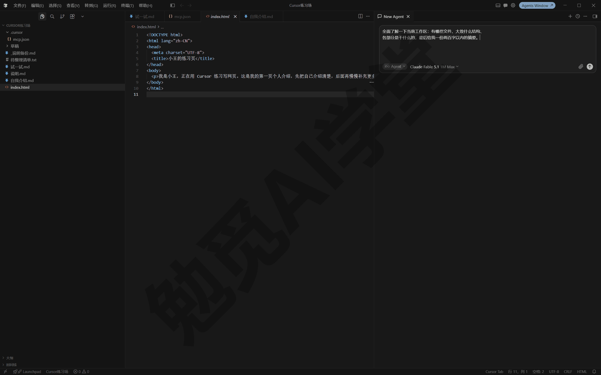
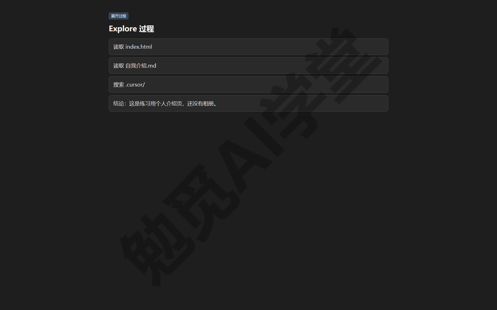
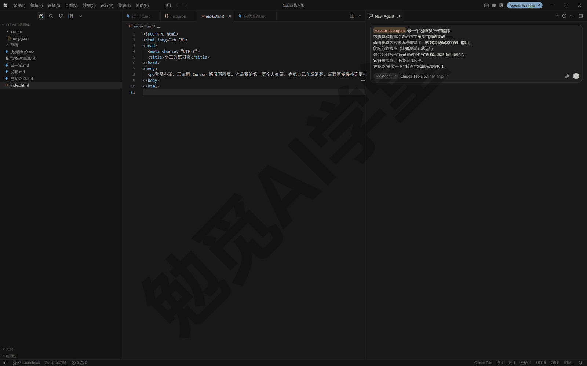
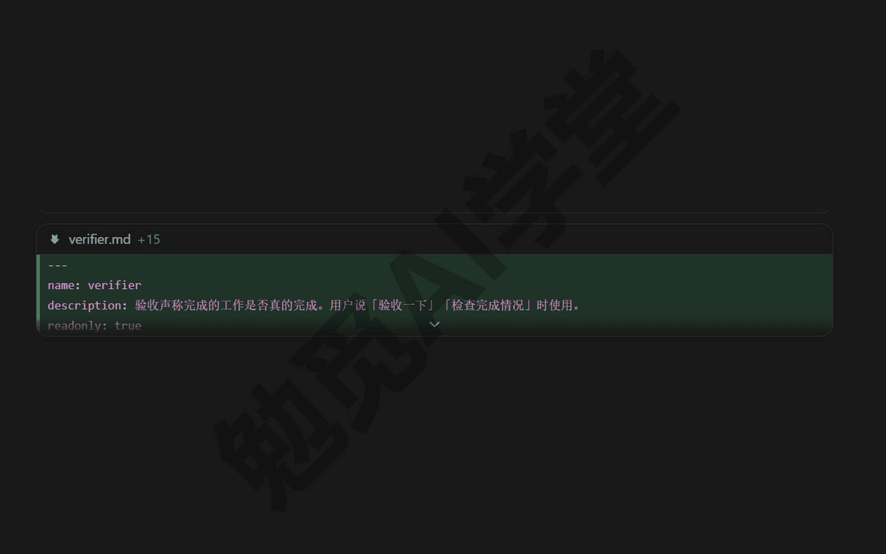
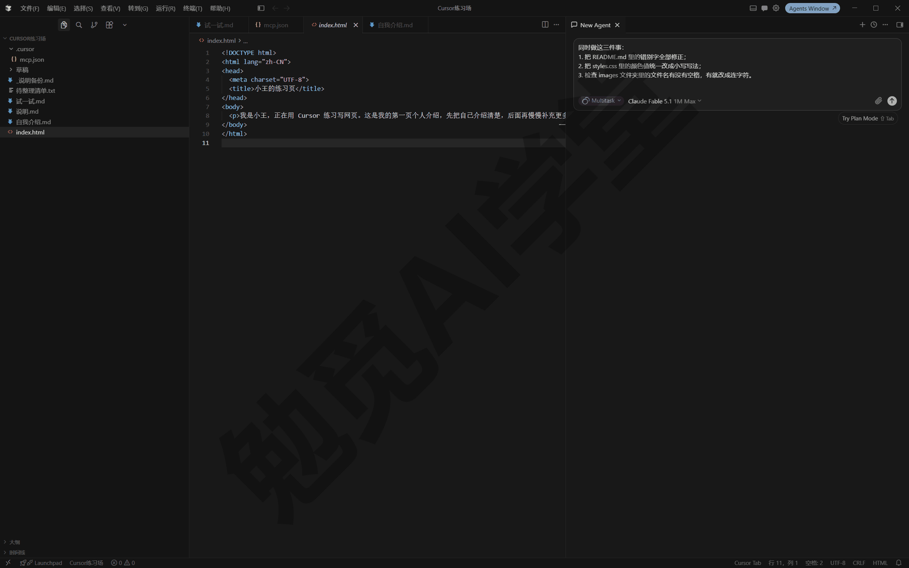
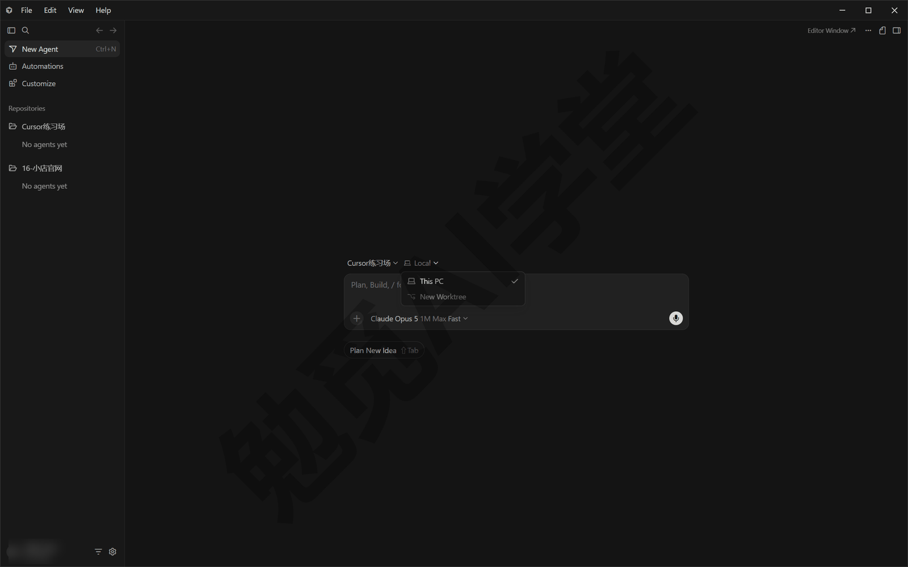
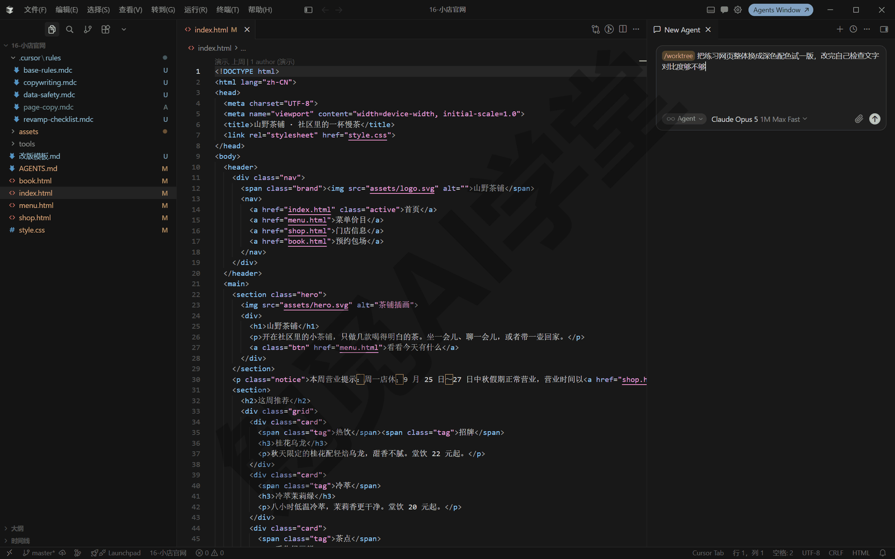
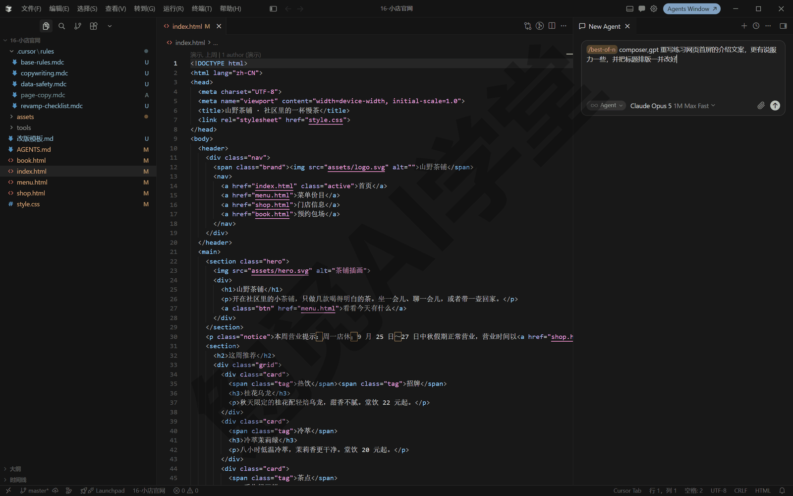

## 子智能体、并行与工作树

上一篇《插件、市场与 MCP》把外部能力接了进来，这一篇解决“同时干几件事”。你会认识三个并行形态各自解决什么问题，看懂 Cursor 内置的三个子智能体，自己做一个“验收员”分身，学会多任务模式和工作树这两样并行工具，再用 /best-of-n 让几个模型各做一版再挑最好的，最后划清什么时候不该并行的边界。

### 12.1 为什么要并行：一个对话一次只做一件事

举一个具体的例子。一个下午，你打开练习网页的项目，手里攒着三件事：README 里有一批错别字要修；首页配色想试深色和浅色两版，比一比再定；另外还想弄清楚 tools 文件夹里那几个脚本各是干什么的。按前几篇养成的习惯，你大概会这样发（先别照做，读完本节再动手）：

```
帮我做三件事：修正 README 里的错别字；
把首页配色分别做一版深色和一版浅色让我对比；
再告诉我 tools 文件夹里每个脚本是干什么的。
```

它会接下这三件事，但过程你未必满意。一个对话里的事只能一件接一件做：智能体（Agent，替你动手改文件、跑命令的 AI）一次专心做一件事，三件事被排成一条线依次执行；你中途再发消息，也是排队等前面的做完——《对话与上下文管理》讲过这套排队机制（Enter 排队、Ctrl+Enter 立即发送）。专注多数时候是优点，意味着不出乱子；但此刻它成了瓶颈，而且细看会发现，三件事各堵在不同的地方。

**第一件堵在“排队”。** 修错别字和另外两件事毫无关系，谁也不依赖谁，它却要在队尾等着。这类互不相干的独立小事，最好是同时开工、各自交结果——这是多任务模式管的事，12.4 里讲。

**第二件堵在“互相覆盖”。** 深色、浅色两版配色，改的是同一个样式文件。就算真有两个人同时动手，在同一份文件上你改你的、我改我的，结果只会互相覆盖。方案试错需要的是文件层面的隔离：一版一个副本，各改各的，最后并排比较——这是工作树管的事，12.5 里讲；12.6 的多模型对比，是在工作树基础上做出来的现成功能。

**第三件堵在“过程太吵”。** 弄清几个脚本是干什么的，它要把文件逐个翻一遍，翻找过程会产生一大堆中间内容，而你要的只是几句结论；这些过程如果全堆进主对话，宝贵的上下文很快被挤占。这类“过程很长、结论很短”的任务，适合交给一个带独立上下文的分身去做，做完只交回结论——这是子智能体管的事，12.2 和 12.3 里讲。

还有一个容易混淆的功能先分清：《对话与上下文管理》讲过的侧聊（/side）解决的是“问个问题不打断主线”，默认专注于读、查、答，不接手改动的任务；本篇的并行解决的是“几件正事同时推进”，两者谁也代替不了谁。你当然也可以在代理窗口手动多开几个智能体各干一件事，那本身就是最朴素的并行——本篇的三个形态，可以理解成把“多开”做得更方便也更安全：多任务替你统一分派与验收，工作树替你隔离文件，子智能体替你隔离上下文。

三个并行形态，各对应一种堵住的地方。它们都在你本机运行；把任务整个搬到云端机器上跑是另一种并行，那是《云端智能体与手机端》的内容。另外，并行也有代价：用量和出错的机会都会跟着成倍增加，什么时候不该用，12.7 里会专门讲。

### 12.2 内置三子智能体：Explore、Bash 与 Browser

**子智能体是什么。** 子智能体（Subagent）是主智能体派出去干活的分身：拿到一份带上下文的任务说明，在自己独立的上下文窗口里自己干活，干完把最终结论交回主对话。前几篇多次预告过它，现在正式讲它。关键在“独立上下文”这五个字——《对话与上下文管理》讲过，每条对话的上下文窗口有限、快满会压缩；分身干活的过程再啰嗦，占的也是它自己的窗口，主对话只收一份干净的结论。

**为什么需要子智能体。** 有些任务过程很长，结论却很短。让智能体摸清一个几百个文件的项目，翻找过程可能产生几万字的中间结果，而你要的只是一页摘要；这几万字如果全进主对话，没几轮上下文就满了。Cursor 的办法是把这类任务自动交给内置分身。官方说得直白：这三个内置子智能体，就是分析了大量“上下文被挤满”的真实对话后定下来的。

**三个内置分身。** 你不需要配置，它们在合适的时机自动启用：

| 子智能体 | 管什么 | 为什么要隔离 |
|---|---|---|
| Explore（探索） | 搜索、翻阅、理解代码库与文件夹 | 翻找会产生大量中间结果，只有结论有用；它默认用更快的模型，能同时开很多个搜索 |
| Bash（命令） | 连续运行一串终端命令 | 命令输出又长又碎，隔离后主对话只看关键结果和决定 |
| Browser（浏览器） | 通过浏览器工具操作网页 | 页面快照与截图特别占上下文，分身过滤后只交回相关内容 |

合起来看，这三类任务有三个共同点——中间过程输出多、很杂，需要各自专门的提示词和工具，特别占上下文。做成分身一次解决四件事：

- 过程被隔离，主对话只看到摘要。
- 模型可以灵活选：Explore 用快模型，同时开十个搜索也不慢。
- 每个分身的提示词和工具都按自己的任务单独调好。
- 成本也更省：快模型便宜，量大的任务交给它划算。

Bash 分身跑命令时，照样归《权限、沙盒与模型》那套运行模式与审批管着，不会因为是分身就绕过把关。

**最简单的演示。** 找一个文件比较多的工作区，发送：

```
全面了解一下当前工作区：有哪些文件、大致什么结构、
各部分是干什么的，最后给我一份两百字以内的摘要。
```



任务够重时，对话流里会出现一张子智能体卡片：标着分身的名字和运行状态，点开能看到它在里面做了什么（卡片的具体形态以实际界面为准）。等它跑完，主对话收到的只有那份两百字摘要——过程留在卡片里，随时可查但不占地方。




**前台与后台。** 分身有两种运行方式：

- **前台**：主对话停下来等它，拿到结果马上接着干——适合下一步就要用它结果的任务；
- **后台**：派出去就不管，主对话继续干别的，它独立工作——适合耗时长、暂时不急着要结果的任务。

后台分身会把工作状态写到 `~/.cursor/subagents/` 目录下的文件里，主智能体能随时读它的进度；跑完之后还能让它“接着上次继续”，上下文不丢（以实际表现为准）。你也可以在派活时直接说清要前台还是后台。

**分身不是越多越好。** 每个分身都要从零熟悉自己的任务，简单小事交给分身反而比主对话直接做更慢，这条边界 12.7 还会展开。另外《内置浏览器与设计模式》里提过设计模式可以连发多个改动、各自自动刷新，背后靠的就是本篇这类“同时开工”的能力。

### 12.3 自定义子智能体：给团队添一个“验收员”

**为什么需要自定义子智能体。** 内置的三个分身管的是通用场景，但有些角色是你自己的：比如一个专门唱反调的“验收员”——每次智能体说“做完了”，让另一双眼睛去核实是不是真做完了。这件事恰好不适合主对话自己干：它刚写完代码，再让它自查，容易“自己批改自己的作业”；独立上下文的分身没有这层立场，核查更可信。

**自定义子智能体放在哪。** 自定义子智能体是一个个 Markdown 文件，放进约定目录即可生效：

| 位置 | 级别 | 说明 |
|---|---|---|
| 项目里的 `.cursor/agents/` | 项目级 | 跟项目走，随项目分享给别人 |
| `~/.cursor/agents/` | 用户级 | 你这台电脑的所有项目可用 |

与技能一样，Cursor 也兼容 `.claude/agents/` 和 `.codex/agents/` 目录（包括各自的用户级同名目录）——《技能与自定义模式》讲过这种跨工具兼容的思路，你在别的工具里写的分身搬过来就能用。同名冲突时项目级优先，`.cursor/` 目录优先于兼容目录。

**文件里写的是什么。** 每个子智能体文件是“frontmatter（《规则与 AGENTS.md》讲过的开头元数据区，这里用 YAML 写法）＋提示词正文”的结构，官方文档的示例如下（示例里 description 那一行因排版折成了两行）：

```
---
name: security-auditor
description: Security specialist. Use when implementing auth,
  payments, or handling sensitive data.
model: inherit
readonly: true
---

You are a security expert auditing code for vulnerabilities.

When invoked:
1. Identify security-sensitive code paths
2. Check for common vulnerabilities (injection, XSS, auth bypass)
3. Verify secrets are not hardcoded
4. Review input validation and sanitization

Report findings by severity:
- Critical (must fix before deploy)
- High (fix soon)
- Medium (address when possible)
```

这是一个安全审查员：frontmatter 定身份和权限，正文就是给这个分身的提示词——它被派活时看到的开工说明。中文写正文完全可以，不用迁就示例的英文。

**把字段逐个认一遍。** frontmatter 的可用字段如下：

| 字段 | 必填 | 默认 | 作用 |
|---|---|---|---|
| `name` | 否 | 取自文件名 | 分身的名字，点名调用时也用它；只能用小写字母和连字符（短横线 -） |
| `description` | 否 | 无 | 写“它管什么、什么时候派它”，主智能体读这句决定要不要派它 |
| `model` | 否 | `inherit` | 分身用什么模型：`inherit` 跟随主对话，或写具体模型的名字 |
| `readonly` | 否 | `false` | 为 `true` 时只读：不能改文件，不能跑会改动东西的命令 |
| `is_background` | 否 | `false` | 为 `true` 时默认后台运行，主对话不用停下来等它 |

这几个字段里，`description` 是分量最重的一个：主智能体派不派它全看这句，写法和技能的 description 同一个道理——“做什么＋什么时候用”都写具体，还可以加“主动使用”这类明确的时机词，让主智能体更愿意派它；写成“通用助手”这种含糊话，主智能体就没法判断该不该派它。`model` 默认跟随主对话，也可以指定一个具体模型（可用的模型名以实际的模型列表为准；名字后还能带方括号参数微调，是进阶用法，了解即可）；指定的模型如果你的套餐不含或被团队限制，会改用一个可用的模型。`readonly` 建议给一切“只看不改”的角色打开：验收员、审查员的职责是报告问题，不是顺手修改——权限收紧了，它会做什么才说得准。

**动手：用 /create-subagent 做验收员。** 和规则、技能一样，格式不用背，让它自己生成。发送：

```
/create-subagent
做一个“验收员”子智能体：
职责是校验声称完成的工作是否真的完成——
弄清哪些内容被声称做完了，核对实现确实存在、能用，
能运行的检查（比如测试）就运行，
最后分开报告“验证通过的”与“声称完成但有问题的”。
它只做检查，不改任何文件。
在我说“验收一下”“检查完成情况”时使用。
```



它会在 `.cursor/agents/` 下生成一个文件，叫 verifier.md（下图）。打开检查三处：description 是否写清了什么时候用它、`readonly` 是否为 `true`、正文有没有保留“不轻信、逐项核实”的要求。



**怎么调用。** 有两种方式：一种是自动派活，任务对上 description 时主智能体自己派给它；另一种是点名，在输入框用斜杠加分身名，或者用自然语言点它的名字。比如让智能体做完一个改动后，发送：

```
/verifier 验收一下刚才的改动是否真的完成了
```

写成“用验收员子智能体核查刚才的工作”效果相同（分身名以生成结果为准）。会看到对话里出现验收员的子智能体卡片，它独立核查后交回一份“通过项／问题项”分开列的报告。


**什么时候该用技能而不是子智能体。** 两者都是“把做法固定下来”，分工按官方对照表记：

| 用子智能体，当…… | 用技能，当…… |
|---|---|
| 任务过程冗长，需要隔离上下文 | 任务单一、一次做完（出清单、改格式） |
| 几件事要并行开工 | 想要快速、可重复的固定动作 |
| 多步骤、需要一个专门角色贯穿 | 发一次就出结果，不需要独立上下文 |
| 需要另一双眼睛独立检查一遍 | 主对话顺手就能做 |

一句话判断：你发现自己在为“生成更新日志”这种一步就能做完的事建分身，改用技能；反过来，某个技能变成了八步流程、每次跑都把上下文塞满，就该改成子智能体。

**几条实践经验。** 官方的建议照着做就好：一个分身一个职责，别造“什么都帮”的通用分身；提示词短而准，两千字的长篇大论只会让它更慢；从两三个分身起步，有明确新场景再加，几十个含糊分身等于没有分身；`.cursor/agents/` 随项目进版本库，让同事共享（版本库是什么，《Git、GitHub 与代码审查》讲 Git 时就明白了）。另外两点要知道：分身能用主对话的全部工具，包括《插件、市场与 MCP》接入的 MCP——你接的外部服务，分身也能用；分身还能再派下一层分身，但只能嵌套一层。云端还有一种跑在独立虚拟机上的云端子智能体，属于《云端智能体与手机端》的内容。

### 12.4 多任务模式：几件事同时开工

**为什么需要多任务模式。** 手里攒了三件独立小事，逐条发就要逐条等。《两套界面全导览》和《计划、提问与调试三模式》都提到过“多任务模式（Multitask Mode）”这个入口，现在正式用上它。

**多任务模式是什么。** 多任务模式把你的多条请求交给几个分身在后台同时跑，而不是排进队列。背后就是 12.2 的子智能体机制：每件事一个分身、各自的上下文，齐头并进。

**多任务模式怎么用。** 点开输入框左下角的模式选择器，选 Multitask（多任务），输入框上的模式标签随即变成 Multitask。3.7.42 版的 / 菜单里没有 `/multitask` 命令，输入它只会提示你新建一个同名技能，所以入口就是模式选择器。切好模式后把几件事一次说清：

```
同时做这三件事：
1. 把 README.md 里的错别字全部修正；
2. 把 styles.css 里的颜色值统一改成小写写法；
3. 检查 images 文件夹里的文件名有没有空格，有就改成连字符。
```



**多任务模式下会看到什么。** 发送后，几件任务各自开工、各自汇报进度，你能分别点开每一件看它做到了哪一步（界面形态以实际界面为准）。全部完成后逐件验收：每件任务的改动照旧走差异视图（《两套界面全导览》介绍过的逐文件确认画面），一件一件看、一件一件收，不会混作一团。哪件不满意，就单独对它追问或返工，不影响其他几件已经收下的成果。

**适合什么。** 三类任务最合适：几分钟一件的独立小修补，错别字、重命名、格式统一这种；分散在不同文件、不同文件夹里的整理任务；同一个项目里互不相干的几处小改动。共同点是“彼此无关、单件都不大”。你可能想到另一个办法——自己开几个对话、各发一件事，效果确实相近，但多任务在同一个对话里统一分派、统一验收，不用在窗口之间来回切换，收结果时也不容易漏掉哪件。

**不适合什么。** 有三种情况不要用多任务：
- **会碰同一批文件的任务**：比如 12.1 里两版配色改同一个样式文件，这种该交给 12.5 的工作树。
- **有先后依赖的任务**：后一件要用前一件的结果，硬要并行只会返工，12.7 里有完整的反例。
- **单件的大任务**：一件事本身就很重时，专心用一个对话做，或者先进计划模式想清楚，多任务的优势发挥不出来。

还要算清成本：多任务建立在子智能体上，几件任务就是几份独立的上下文与用量，把一大把琐事一次派出去之前，先想清楚值不值这份用量；拿不准的时候，翻到 12.7 对照那里的反例再决定。

**计划里的“并行构建”。** 《计划、提问与调试三模式》讲过计划模式构建时的三个选项：本地构建、云端构建、并行构建。其中“并行构建（Build in Parallel）”背后就是本节的多任务——把计划里互不依赖的步骤同时开工，有先后关系的步骤仍按顺序执行，哪一步要等哪一步，计划里都写清了。构建选项出现在计划确认的界面上（入口样式以实际界面为准）；点它之前把计划的步骤清单扫一眼，哪些步骤互相依赖、哪些各自独立，通常一眼能分辨。所以它适合步骤多、彼此独立的大计划；步骤环环相扣的计划，选了并行也快不了多少。

### 12.5 工作树：同一项目的隔离副本

**为什么需要工作树。** 多任务解决了“几件事不排队”，但有个前提：任务之间不碰同一批文件。方案试错恰恰相反——两套配色方案改的都是同一个样式文件，在同一份文件上并行就是互相覆盖。你需要的是文件层面的隔离：一个方案一个副本，各改各的。

**工作树是什么。** 工作树（Worktree）就是同一个项目的隔离副本：每个工作树有自己的一套文件、自己的改动，你原来打开的那份原地不动。它是 Git 的机制——Git 是给文件夹记版本历史的工具，下一篇《Git、GitHub 与代码审查》会专门讲，本节你只需要知道一个前提：项目得先是 Git 仓库才能开工作树。练习项目还不是的话，对智能体说一句“把当前工作区初始化成 Git 仓库”即可，它会代劳。

**代理窗口里怎么用。** 在代理窗口，工作树是运行环境下拉菜单里的一个选项——《两套界面全导览》认过这个下拉菜单（3.7.42 版界面是英文的，在本地项目里显示 This PC（本机）和 New Worktree（新建工作树）两项，以实际界面为准）。

**第 1 步：新建时选“新建工作树”。** 新建智能体时，把运行环境从 This PC（本机）切成 New Worktree（新建工作树），照常下任务。Cursor 会为这个智能体创建一份单独的副本，它接下来的所有改动都发生在副本里。也可以把正在干活的智能体挪进工作树（入口形态以实际界面为准）。



**第 2 步：主工作区不动，随时切回核对。** 任务进行期间，你的主工作区文件一动不动——可以随时切回去核对，两边互不打扰。想并行试几个方案，就开几个智能体、各选“新建工作树”，一人一个副本。

**第 3 步：审查结果，三种选择。** 它干完后，你在代理窗口审查结果，有三种选择：不满意就在副本里继续改；满意可以直接从副本提交或开 PR（提交与 PR 是《Git、GitHub 与代码审查》的主角，先认名字）；也可以把结果带回主工作区合入。

**编辑器里的三个命令。** 编辑器（经典 IDE 界面）没有运行环境下拉菜单，改用三个斜杠命令做同样的事。这三条命令只在项目已经是 Git 仓库时才会出现在 / 菜单里；项目还不是仓库的话，输入 /worktree 只会提示你新建一个同名技能。

`/worktree` ——让这段对话余下的工作都在一个隔离副本里进行。适合实验性改动、有风险的大改，或要装依赖跑测试又不想影响当前目录的任务。举个例子：

```
/worktree 把练习网页整体换成深色配色试一版，
改完自己检查文字对比度够不够
```



`/apply-worktree` ——试验满意后，把副本里的改动带回主工作区，你在熟悉的差异视图里确认。

`/delete-worktree` ——收尾删除这个副本。试验失败时它就是最干脆的退路：整个副本扔掉，主工作区从头到尾没被碰过。

想看当前项目一共开了哪些工作树，让智能体跑一条命令即可：

```
git worktree list
```

**worktrees.json：副本的准备脚本，了解即可。** 新开的副本是一套新复制出来的文件，项目装过的依赖（比如 Node.js 项目的 node_modules）不会自动就位。`.cursor/worktrees.json` 解决的就是这件事：在里面定义每次创建工作树后自动执行的准备命令。官方示例：

```json
{
  "setup-worktree": [
    "npm ci",
    "cp $ROOT_WORKTREE_PATH/.env .env"
  ]
}
```

还支持 `setup-worktree-windows` 和 `setup-worktree-unix` 两个按系统区分的写法（写了它们就优先用它们），后面可以跟一串命令，也可以是脚本文件的路径。准备过程出问题，到输出面板选 Worktrees Setup 看日志。本课的纯网页练习项目没有依赖要装，用不上它；将来项目复杂了，让智能体照官方文档给你生成一份即可。

**自动清理与上限。** 工作树是真实的文件副本，开多了占硬盘。Cursor 会定期自动清理旧工作树：整台电脑能保留的数量有上限（官方文档给的默认值是每台电脑 25 个，以实际设置为准），超过上限就从最旧的删起；用命令手工创建的副本也算在里面、同样可能被清理。对应的两个设置项是 `cursor.worktreeCleanupIntervalHours`（多久检查一次）和 `cursor.worktreeMaxCount`（保留上限），想调整可以用《技能与自定义模式》认过的 `/update-cursor-settings` 让它替你改。所以要养成一个习惯：**副本里的成果不要只留在副本里** ——要么 `/apply-worktree` 带回主工作区，要么从副本提交推送出去；长期放在副本里的东西，可能在某次自动清理时消失。

**子智能体也能各领一个副本。** 12.2 讲过分身默认与主对话共用同一份文件，几个分身同时改文件照样会互相覆盖。把两样东西合起来用，在派活时点明要隔离：

```
派三个子智能体分别处理这三个问题，
每个都在自己的隔离环境里干活，不要互相影响
```

每个分身会拿到自己的副本和草稿线（分支——Git 里“平行草稿”的概念，《Git、GitHub 与代码审查》细讲），改动各自保留，最后由主智能体汇总合并。

**实战里真的用过。** 本课两处实战实际用过工作树：《实战三：装修预算估算器》开两个副本并行做了两套界面方案（单页两栏与向导式）择优合入；《毕业项目：个人数字工作台 + 课程总结》升级到三个副本、三套主题并排挑选。方案对比该怎么截图、怎么下结论，细节都在那两篇。

**两个常见坑。**

- 删副本前，先让资源管理器和终端离开那个文件夹——终端当前所在的目录还停在里面时，删除会失败，还可能引发一连串误操作，《实战三：装修预算估算器》就真的因此翻过一次车，实录在那一篇。
- 大项目开副本要复制不少文件、准备脚本还要装依赖，创建不是瞬间完成，是正常现象。

### 12.6 /best-of-n：让几个模型各做一版再挑最好的

**为什么需要 /best-of-n。** 《权限、沙盒与模型》讲过模型各有分工：有的快、用量少，有的强、用量多，同一个任务不同模型做出来的结果可能差很多。哪个更合适，最终要看成品——那就让它们各交一份。

**/best-of-n 是什么。** `/best-of-n` 把同一个任务同时交给多个模型，每个模型在自己的工作树副本里各做一版，互不干扰，也不碰你的主工作区。它其实就是“子智能体＋工作树”的组合成品：一个模型一个隔离副本，同一个题目各做一版，你来挑。官方把它归在编辑器的工作树这组命令里（代理窗口能否直接用以实际表现为准），前提与工作树相同——项目是 Git 仓库。

**/best-of-n 怎么用。** 在编辑器对话里输入 `/best-of-n`，接“模型清单＋任务”，模型名用逗号分隔。官方文档的示例：

```
/best-of-n sonnet,gpt,composer fix the flaky logout test
```

换成本课的练习场景，模型名沿用官方示例里的简写（实际可用的模型与写法以模型列表为准）：

```
/best-of-n composer,gpt 重写练习网页首屏的介绍文案，
更有说服力一些，并把标题排版一并改好
```



会看到几个候选各自开工、各自完成——每一个都在自己的副本里改（12.5 讲过副本之间互不影响的机制），你的主工作区全程不动。

**结果怎么比。** 候选完成后，每个候选会汇报自己改了什么。比较时看三样：

- **看说明**：先读各版的改动摘要，了解思路差在哪。
- **看实景**：网页类任务最直观的做法是让它把各版分别在浏览器里打开、截图并排——《内置浏览器与设计模式》讲过它能自己开页面验证效果。
- **看范围**：翻一眼各版的差异，有没有夹带你没要求的改动，改得少而准的加分。

不想自己整理，就把这一步也交给它，发送：

```
把各版候选的改动摘要和首屏效果截图并排给我，
指出每一版的优点与问题，最后说说你推荐哪一版、为什么。
```

它的推荐可以听，最后拍板的是你——尤其文案口味这类事，模型的偏好不必当成标准答案。

**只比较，不合并。** `/best-of-n` 负责把几版候选放到你面前，不会自动把哪一版合进主工作区。挑中赢家后，和普通工作树一样处理：用 `/apply-worktree` 把那一版带回来，或直接从它的副本提交推送；落选的用 `/delete-worktree` 清掉。

**用量代价。** 这是全课消耗用量最快的用法之一：几个模型就是几份完整任务的用量，三个模型约等于三倍。《权限、沙盒与模型》讲用量怎么花得值时预告过“多模型对比相当于花几份的钱”，指的就是它。所以不要把它当成日常用法，留给真正需要定方向的时候：一段要用很久的关键文案或核心逻辑、想比较两个模型谁更适合当你的主力——在这样的时候比一次，多花的用量换回一个确定的方向，通常划算。

### 12.7 什么时候不该并行

并行是一种能力，不是默认就该选的选项。三个反例，各对应一种最好串行（一件一件按顺序做）的情况。

**反例一：小改动，为一句话的事开副本。** 你想把网页页脚的年份改成今年，想起本篇学的隔离，顺手来了一句 `/worktree`。接下来，Cursor 复制出一份副本、跑了一遍准备流程，改动本身几秒钟完成，你再 `/apply-worktree` 带回、确认差异、`/delete-worktree` 清理，前后忙了好几分钟，主角却只是一个数字。同样的事在主对话里发一句“把页脚年份改成今年”，十几秒就改完了。这个反例的教训是，每个分身、每个副本都有启动成本：分身要从零熟悉任务，副本要复制文件、装依赖；改一句文案、修一个错别字这种小事，串行就是最快的做法。子智能体和工作树的价值都是隔离，从来不是速度。

**反例二：有先后依赖，硬拆成并行。** 装修估算器的价目表更新了，你图快，发了“并行做两件事：把估算规则换成新价目；按新规则重算示例页的所有数字”。两件事同时开工的结果：负责重算的那一件启动时拿到的还是旧规则，跑完一核对，数字全错，只能返工一遍，比按顺序做还慢。正确的做法是把先后说清楚：

```
先把估算规则换成新价目表，改完以后，
再按新规则重算示例页的所有数字——两步有先后，按顺序做。
```

计划模式的并行构建之所以敢并行，是因为计划里写清了依赖、有先后的步骤仍按顺序做（12.4 讲过）；你自己手动拆任务时没有这层保护，拆之前先问一句：这几件事真的谁也不等谁吗？

**反例三：用量紧张，还让三个模型各做一版。** 月底，用量所剩不多，你想给首页换句口号，顺手来了一次三个模型的 `/best-of-n`——一条指令花出去约三份完整任务的用量，第二天真正要紧的任务反而没了额度。《权限、沙盒与模型》列过什么任务消耗用量快，长对话、工具调用多、多模型对比都在那张清单上；并行是用量的乘法，三件任务并行约三份用量，三个模型各做一版约三倍任务成本。额度紧张的日子，把并行和多模型对比都先放一放，一条线干活最省用量。

拿不准该不该并行时，按这个顺序想：默认一个对话、一条线串行，多数日常任务到此为止；确认是几件互不相干的事，才切换到多任务模式；要在同一批文件上试不同方案，才开工作树；连模型都拿不准、又真值得花几倍用量，才用 `/best-of-n` 让几个模型各做一版对比一次；至于过程吵闹的探索和批量命令，不用你操心，内置分身会自动接管。一句话总结：并行适合“互不相干”和“方向未定”这两种情况；方向明确的一条线任务，串行通常最简单也最省钱。

### 12.8 三个练习任务

方括号里的内容换成你自己的。

**任务一：触发一次 Explore 子智能体并读它的报告**

打开一个文件比较多的工作区（前几篇的练习项目合并起来也行），发送：

```
全面了解一下这个工作区：有哪些文件、什么结构、
各部分是干什么的，给我一份两百字以内的摘要。
```

完成标准：对话过程里找到子智能体卡片并展开看过它的工作过程；主对话收到的是浓缩后的摘要而不是翻找流水账；你能说出这类任务为什么适合交给分身。如果没触发分身，说明任务对它来说还太轻，换个更大的文件夹再试（派不派由智能体自己判断，以实际表现为准）。

**任务二：用工作树跑完“开副本—改—带回—删除”一整圈**

确认练习项目已是 Git 仓库（不是就先让它初始化），在编辑器对话里发送：

```
/worktree 把 [你的练习网页] 的配色整体换成深色方案，
改完列出你改动了哪些文件
```

改动期间切回主工作区确认文件没变；对结果满意后发送 `/apply-worktree` 把改动带回，在差异视图确认；最后 `/delete-worktree` 清理副本。

完成标准：副本干活期间主工作区文件未变；带回后差异出现在主工作区并由你确认；删除后让它跑 `git worktree list`，只剩主工作区一条。

**任务三：用 /best-of-n 让两个模型各做一版**

还是那个练习网页，发送：

```
/best-of-n [模型一],[模型二] 重写首屏的介绍文案，
要求更有吸引力，并把排版一起改好
```

完成标准：两个候选各自完成，你并排比较过两版的文字与效果；能说出选择某一版的两条理由；只把选中的一版带回主工作区，落选副本已清理。

### 12.98 本篇小结与自检

这一篇把“同时干几件事”讲全了：子智能体是带独立上下文的分身，内置的 Explore、Bash、Browser 自动接管吵闹环节，自定义分身用 `.cursor/agents/` 下的 Markdown 文件定义、/create-subagent 代写；多任务模式让独立请求不排队，计划的并行构建是它在计划里的形态；工作树给项目开隔离副本，代理窗口选“新建工作树”、编辑器用 /worktree 三命令；/best-of-n 让几个模型各做一版再挑最好的；以及三种不该并行的情况。

- [ ] 能说出三个并行形态各解决什么问题
- [ ] 见过至少一次内置子智能体卡片，能讲出这三类任务为什么要隔离
- [ ] 分得清前台与后台两种运行方式各适合什么任务
- [ ] 用 /create-subagent 做过一个自定义分身，会点名调用
- [ ] 能对照表说出什么时候用技能、什么时候用子智能体
- [ ] 知道多任务模式的适用前提，以及计划“并行构建”和它的关系
- [ ] 用工作树跑完过“开副本—改—带回—删除”一整圈
- [ ] 知道 /best-of-n 只比较不合并，用量按模型数倍增
- [ ] 记得住不该并行的三种情况：小改动、有先后依赖、用量紧张

完成这些内容后，并行能力就到手了。但并行同时也把新问题推到了眼前：几个副本各有各的改动，谁该留、谁该扔、合并之后出了问题怎么退回去——光靠检查点和差异视图不够用了，需要一套正式的版本记录和审查办法。下一篇《Git、GitHub 与代码审查》讲的就是这套办法：Git 三个词、推送 GitHub、开 PR，再让 AI 替你审代码。

### 12.99 新手常见问题

**Q1：并行会不会互相覆盖、把文件改乱？**

取决于形态选没选对。子智能体和多任务默认共用主对话那份文件，任务之间不碰同一批文件就安全，会碰同一批文件就有互相覆盖的风险——工作树解决的就是这个问题：一人一个副本，根本不会冲突。所以判断起来很简单：不碰同一批文件的任务，多任务随便开；要动同一批文件，先开工作树。真被改乱了也有退路，检查点能还原文件（《权限、沙盒与模型》讲过），《Git、GitHub 与代码审查》的 Git 是更持久的后悔药。

**Q2：工作树占多少硬盘？开多了怎么办？**

一个工作树大致等于把项目的工作文件再复制一份（版本历史那部分是共享的，不会成倍增加），要装依赖的项目再加一份依赖的体积。小型网页项目一个副本通常也就几兆到几十兆，大项目会明显更大。不用太担心积攒：Cursor 会按整台电脑的上限自动清理最旧的副本（默认上限与清理频率见 12.5，可在设置里调）。要紧的是反过来的风险——成果留在副本里没带回，可能被自动清理带走，用完及时用 /apply-worktree 带回或提交。

**Q3：/best-of-n 会花几倍用量？**

大致就是模型个数的倍数：每个模型各跑一份完整任务，两个模型约两份用量，三个约三份，再加上各自开副本的用量。具体消耗以用量页显示为准（《权限、沙盒与模型》讲过在哪看）。省着用有三个办法：候选控制在两三个、任务描述一次写清楚避免返工，并且只在真正需要定方向的时候用它。

**Q4：子智能体干活的过程我能看到吗？**

能。对话流里的子智能体卡片可以展开，看它读了什么、跑了什么（卡片形态以实际界面为准）；后台分身还会把状态写进 `~/.cursor/subagents/` 目录，主智能体能读进度，你也可以直接问一句“那个分身干到哪了”。分身失败也不会悄无声息：主对话会收到失败的提示，可以让它重试或换个方式接着来。

**Q5：子智能体用的模型和主对话一样吗？**

默认跟主对话一样，`model` 字段的默认值是 `inherit`，跟随主对话当前模型。有两种例外：

- 你在 frontmatter 里指定了具体模型，它就用你指定的；
- 指定的模型你的套餐不含或被团队管理员限制时，会改用一个可用的模型（以实际表现为准）。

另外内置的 Explore 分身默认就用更快的模型，这是有意这样设计的——搜索这种量大的任务，快模型又便宜又够用。
