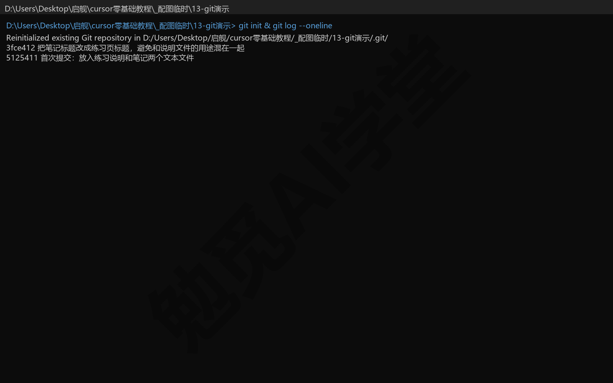
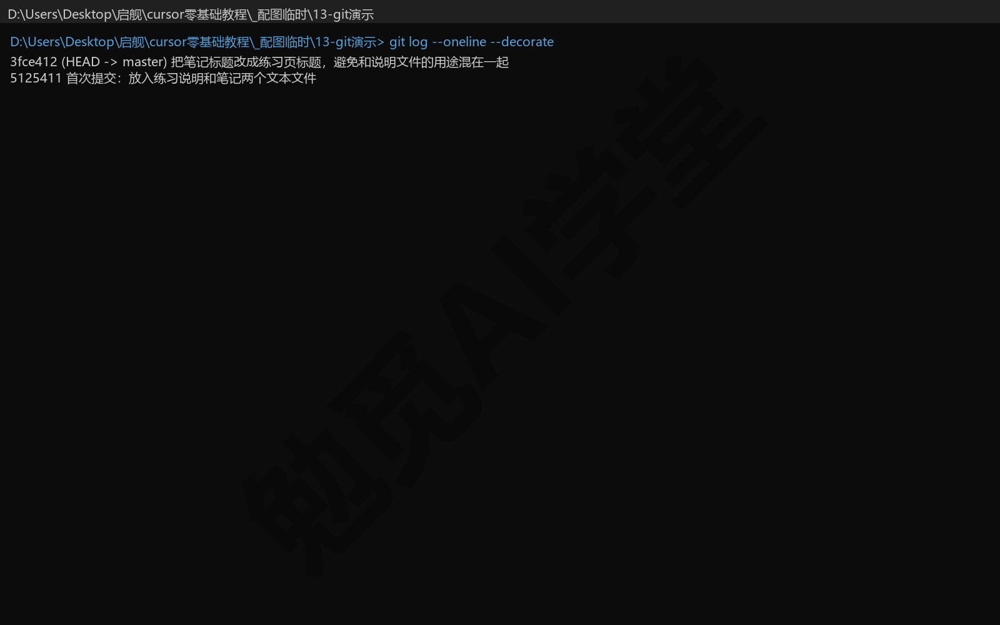
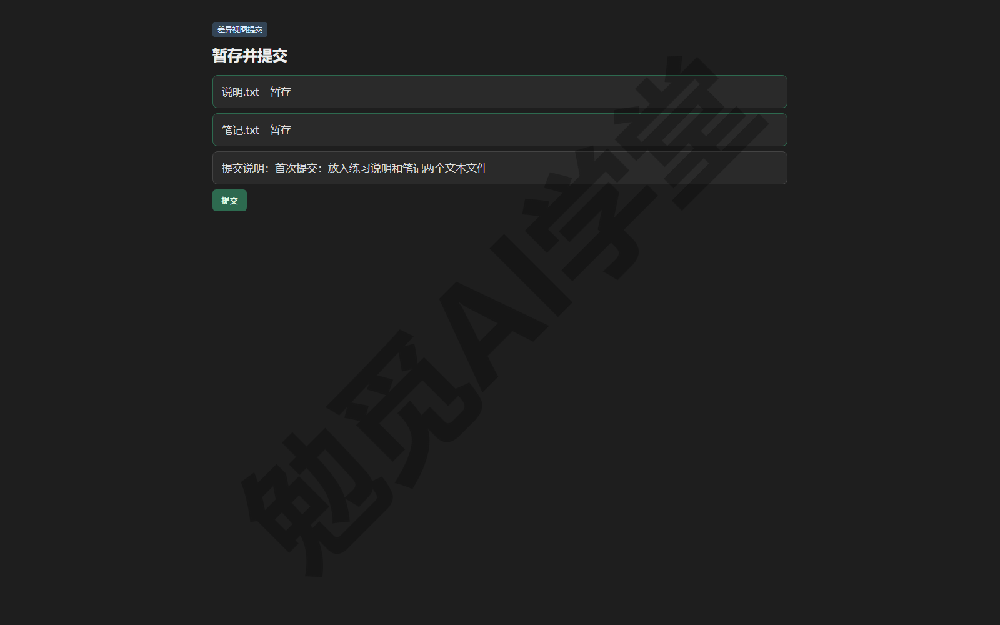
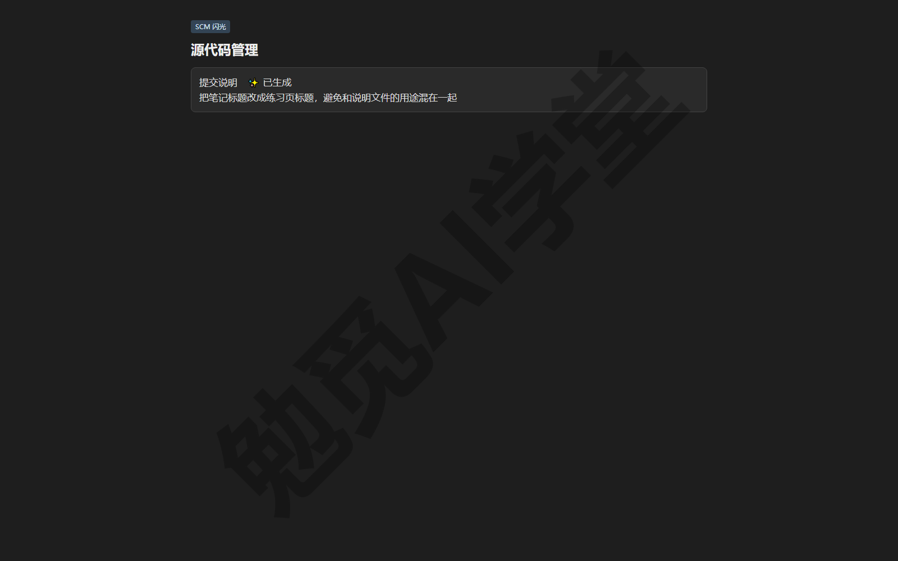
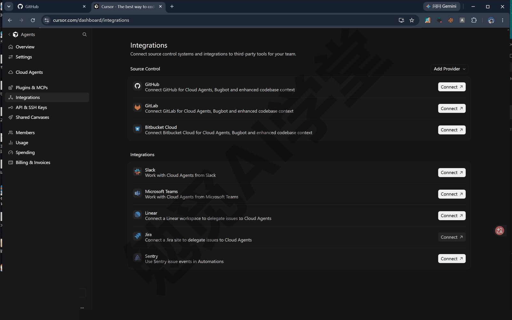
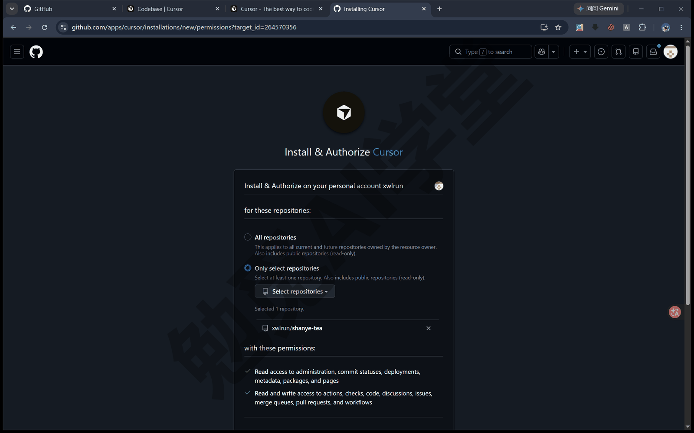
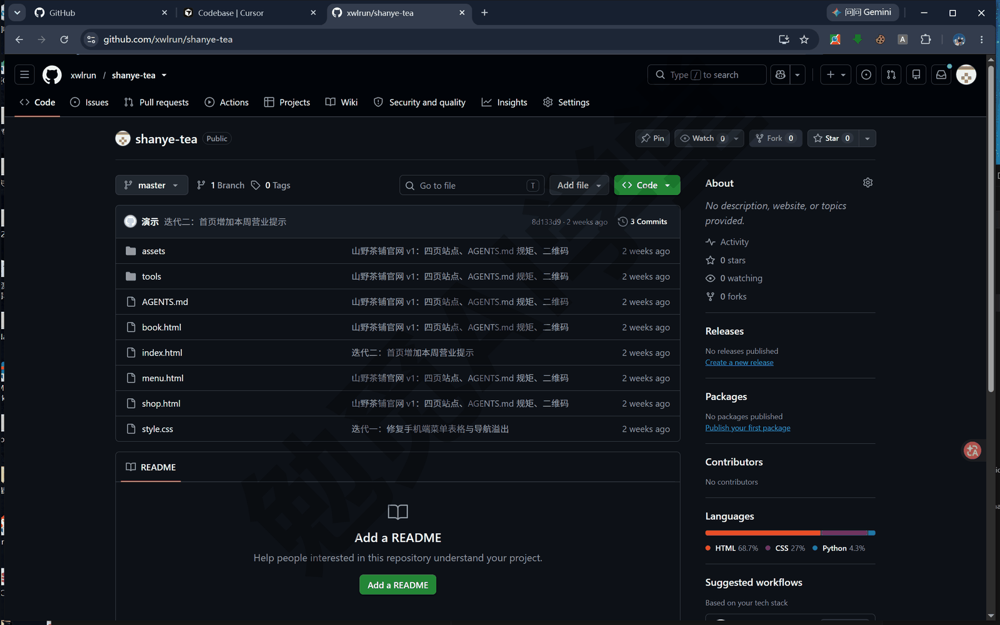
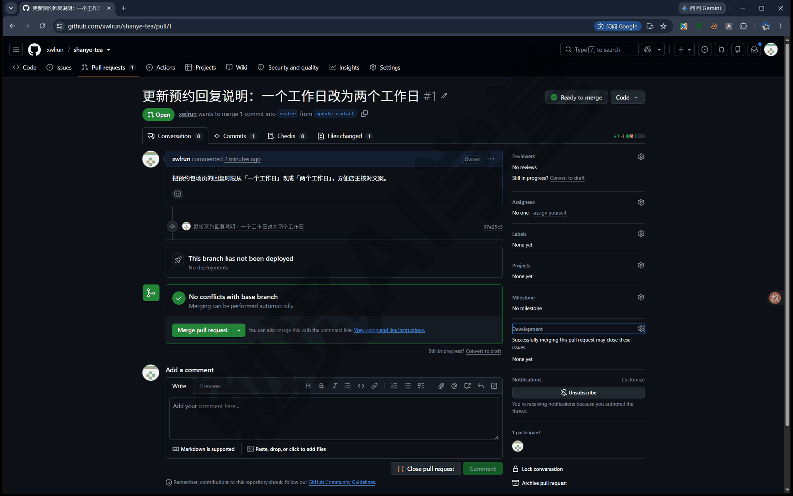
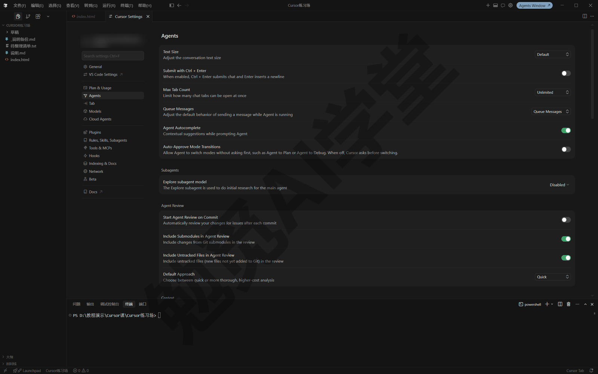

## Git、GitHub 与代码审查

这一篇带你认识 Git 和 GitHub，并把“提交、推送、开 PR（合并申请）、代码审查”这条流程完整走一遍。所有具体操作都由 Cursor 代劳，你不需要背任何命令。学完之后，你的项目会有一份永久的版本记录，也为《云端智能体与手机端》的云端智能体做好了准备。

### 13.1 为什么零基础也要懂一点 Git

你让智能体（Agent，也就是替你动手改文件、跑命令的 AI）给网页改版，前后改了五轮，看完发现第三轮的版本最好。想退回去，却发现只记得“上周某天改完挺好的”，手里没有任何一份当时的存档。

《权限、沙盒与模型》讲过检查点：Cursor 在智能体每次改动前自动拍一份文件快照，点一下就能把文件还原回去。它是很好用的后悔药，但只是临时的、跟着对话走的，适合撤销“刚才这几步”；要长期保存“每个阶段的完整状态”，就需要更正式的工具了。

**Git 是什么。** 你可以把 Git 理解成一个给文件夹记日记的工具：每当你说“记一下”，它就把文件夹里所有文件此刻的状态完整存档一份，永久保留，随时可以翻回任何一篇“日记”。它是软件行业用了几十年的版本管理工具，但它管理的就是普通文件，写文档、做网页同样能用。装了 Git 的项目，相当于有了一颗永久的后悔药。

把两种后悔药放在一起看，分工就清楚了：

- **检查点**：自动产生，不用你操心；跟着对话走，主要用来撤销智能体最近的改动；只还原文件，只是临时的保护。
- **Git 版本记录**：由你（或你让智能体）主动记录；跟着文件夹走，对话删了它也在；每条记录都带说明和时间，能翻回任何历史版本，属于永久档案。

日常两者搭配用：小步试错的时候靠检查点，阶段性的成果靠 Git 保存。

**只需要认识三个词。** Git 的命令很多，但概念上你只需要认识三个词，后面所有操作都围绕它们展开。

- **仓库（repository）**：装上了版本记录能力的文件夹。对普通文件夹做一次“初始化”，它就成了仓库：Git 会在里面建一个隐藏的 `.git` 子文件夹，所有历史档案都存在那里，你平时看到的文件不受影响。没有仓库，后面的事都做不了。
- **提交（commit）**：指“记一笔”这个动作，也指记下来的那份存档。每次提交都包含三样东西：当时全部文件的状态、一句你写的说明（这次改了什么）、时间和作者。提交越勤，能退回去的位置就越多。
- **分支（branch）**：平行的草稿线。仓库默认只有一条主线（通常叫 main），你可以从主线上分出一条新线做实验：实验成功就把它合并回主线，失败就整条丢弃，主线全程干净。现阶段知道“主线之外可以开草稿线”就够了，本篇 13.4 节会用它来开 PR（PR 是什么，到那一节再讲）。

这三个词不用背，接下来每一节都会反复见到它们。

**你不需要学命令行。** 传统教程学 Git 要背几十条命令，这门课不用：初始化、提交、推送这些动作，全部用一句中文让 Cursor 去做；图形界面里也有对应的按钮。你的任务是理解上面三个概念，判断“什么时候该记一笔”，动手的部分交给智能体。

现在就可以做一个只看不改的小实验，体验一下“让智能体替你操作 Git”是怎么回事。随便打开一个工作区发送：

```
看一下当前工作区是不是 Git 仓库：如果是，用一句话概括最近三次提交
分别改了什么；如果不是，列出这里有哪些文件，说说适不适合初始化成仓库。
```

它会替你运行查询命令，再用中文汇报结果。两种回答都有收获：已经是仓库，你就直接读到了“日记”本来的样子；还不是仓库，下一节正好从零开始。

**什么时候值得用 Git。** 一次性的小实验，对话内的检查点就够了；只要项目会做好几天、改好几轮，或者将来要上线、要交给别人看，就建议一开始就初始化成仓库。还要记住一个边界：Git 只保护提交过的内容，改了半天却一次没提交，这些改动丢了照样找不回来，所以下一节的第一个习惯就是勤提交。

### 13.2 让 Cursor 帮你用 Git

这一节把“初始化、提交、再提交”亲手走一遍。找一个练习用的工作区（工作区就是你在 Cursor 里打开的那个文件夹）：可以用前面做过的网页项目，也可以新建一个文件夹放两三个文本文件。你的电脑上不一定装了 Git 工具本身，不确定也没关系：先发任务，智能体发现缺少 Git 会提示你，让它顺手装上即可，《文件与办公能力一篇讲全》讲过它能一句话替你安装缺的工具。

**第 1 步：初始化仓库。** 这是一次性动作，做完这个文件夹就升级成了仓库。在对话里发送：

```
把当前工作区初始化成 Git 仓库，把现在的全部文件做一次首次提交，
提交说明用中文概括这批文件是什么。
```

智能体会运行初始化和提交命令。你会在对话流的工具卡片里看到它执行了 `git init` 等命令；《权限、沙盒与模型》定下的三档运行模式（自动审查／白名单／全部运行，中文文案以实际界面为准）在这里照常生效，这类常规 Git 命令在自动审查档下通常会被直接放行，以实际表现为准。



完成后可以追问一句“现在仓库里有几条提交记录”，它会告诉你已经有了第一条（上图里有两条，第二条是下一步做完才会出现的）。文件夹表面看不出变化，这是正常的：档案都在隐藏的 `.git` 里。

**第 2 步：改一处，再提交一次。** 体验一下“日记”是怎么积累的。随便改一处内容，比如让智能体把某个文件的标题换个说法，然后发送：

```
把刚才的改动提交一次，提交说明按“改了什么、为什么改”两句话写。
```



**提交说明为什么值得认真写。** 提交说明是将来翻记录时唯一的线索：写“修改”等于没写，写“把营业时间改成以门店页为准，避免两处不一致”，三个月后你还能看懂。好消息是这件事也可以交给 AI：智能体提交时会根据实际改动内容起草说明，你只需要看一眼是否属实。

**在代理窗口的差异视图里提交。** 《两套界面全导览》介绍过代理窗口（Agents Window）的差异视图：智能体每次改完，你在那里逐文件查看改动、接受或拒绝。它同时也是 Git 操作台：你可以在差异视图里完成查看改动、提交，以及管理 PR，不用离开 Cursor。常规用法是先逐文件把这次要记录的改动“暂存”（也就是挑进本次提交的清单里），确认无误后填提交说明、点提交；具体按钮的位置与文案以实际界面为准。



“暂存（stage）”这个词第一次见可能不好理解，可以这样想：一次提交前先把要记录的文件放上传送带，没放上去的改动留在工作区里，等下次再说。它的用处是让一次提交只包含一件事。

**在编辑器里提交。** 切到编辑器（经典 IDE 界面）时，左侧的源代码管理面板是同样的操作台：暂存改动后，点击提交说明输入框旁的闪光（sparkle）图标，Cursor 会根据本次差异和仓库历史自动生成一条提交说明，核对无误后提交即可。



**Made with Cursor 标记。** 智能体代你创建提交或 PR 时，Cursor 默认会在提交说明末尾追加一行 “Made with Cursor” 标记，用来区分哪些改动是 AI 做的；不想要可以关，设置项在 Cursor 设置的 Agents 分区里的 Attribution 一项，从 3.11 版起移到 “Git & PRs” 分区（中文界面文案以实际界面为准）。关掉之后，新的提交不再带这行标记。

**常见坑与兜底。** 三件事记住就够：

- 提交前扫一眼差异视图，确认这批改动里没有混进不该记录的东西；发现智能体改多了，先拒绝多余部分再提交。
- 敏感文件不要进仓库。密码、账单这类文件，让智能体帮你写一份 `.gitignore`（一张“哪些文件不进版本记录”的清单），列进去的文件 Git 会当作不存在。
- 提交错了不用慌。版本记录的好处就是几乎什么都能撤销回来，直接告诉智能体“撤销最近一次提交，但保留文件改动”，它会处理好。

### 13.3 GitHub 账号与连接

**GitHub 是什么。** 到目前为止，你的仓库只存在自己电脑上。GitHub 是全球最常用的代码托管平台，你可以把它理解成给 Git 仓库用的云盘加协作社区：把本地仓库“推送”上去，云端就有了一份完整备份；除了备份，还能多人协作、挂各种自动化服务。

**为什么这门课需要它。** 后面有三件事都要先有它：

- **云端智能体**：让任务在 Cursor 的云端电脑上运行的功能（下一篇《云端智能体与手机端》会专门讲），它需要从代码托管平台取到你的代码才能开工。
- **Bugbot**：本篇 13.5 节的自动审查服务，装在你的仓库上，PR 一打开它就自动审查。
- **上线**：《实战一：小店官网》会用 GitHub Pages 把网页免费发布成公开网址，前提也是仓库已经在 GitHub 上。

**注册账号。** GitHub 注册是免费的，准备一个邮箱即可；具体注册步骤和网络环境准备，参考课程配套手册，这里不展开。

**把 GitHub 连接到 Cursor。** 连接是一次性设置，官方的入口在网页端的账号后台：

**第 1 步：打开集成页。** 浏览器访问 cursor.com/dashboard，进入 Integrations（集成）分区，找到 GitHub 一行，点 “Connect”。已经连接过的账号这里会显示 “Manage Connections”。



**第 2 步：选择授权范围。** 页面会跳到 GitHub 的授权界面，让你选择 “All repositories”（全部仓库）或 “Only select repositories”（只选部分仓库）。建议先选 “Only select repositories”，只把练习仓库（本课是 shanye-tea）授权给 Cursor，用熟之后再扩大范围。



**第 3 步：确认连接成功。** 回到 dashboard，GitHub 一行显示已连接就完成了。桌面端应用里，用到 GitHub 的功能时通常也会给出引导连接的入口，以实际界面为准；想解绑时回到集成页点 “Disconnect Account” 即可。

**它拿到了哪些权限。** 授权时可以留意 Cursor 的 GitHub 应用申请了什么：读取仓库内容并创建工作分支、创建 PR 并留下审查评论、读取检查与测试状态、查看自动化流程的运行结果等，官方只申请必需的权限，每一项都对应一个具体功能。你随时可以在 GitHub 的应用设置里查看这份清单、收窄授权的仓库范围，或者把应用整个卸载，卸载后云端相关功能会失效，重新连接即可恢复。

**换别的托管平台行不行。** 行。除了 GitHub，Cursor 同样支持连接 GitLab，Azure DevOps 与 Bitbucket Cloud 则还在公开测试；云端智能体和 Bugbot 在这些平台上都能工作，连接入口同样在 dashboard 的集成分区。本课主线用 GitHub，只是因为它对新手资料最全、后面上线也靠它；你的公司或团队用别家，本篇方法是相通的，对应细节以实际界面为准。

**连接后见不到仓库怎么办。** 最常见的原因是授权范围没包含它：当初选了 “Only select repositories”，之后新建的仓库不会自动进入名单，回到集成页通过 “Manage Connections” 调整授权范围即可。其次检查两处：私有仓库要确认你的 GitHub 账号本身有访问权限；装在组织名下的仓库，可能需要组织管理员在 GitHub 上确认安装。还不行时，可以从 github.com/apps/cursor 重新安装应用，以实际界面为准。

### 13.4 推送与 PR

**推送（push）是什么、为什么需要。** 推送就是把本地仓库里的提交同步到 GitHub 上的远程仓库。不推送，你的版本记录只在这台电脑上，电脑坏了记录就没了，云端智能体和 Bugbot 也访问不到你的项目；推送之后，本地与云端各有一份完整历史。

**第 1 步：把项目推上去。** 在练习项目的对话里发送（方括号里的内容换成你自己的）：

```
把这个仓库推送到我的 GitHub：新建一个名叫 [练习仓库名] 的私有仓库，
推送完成后把仓库网址发给我。
```

第一次推送时可能需要在浏览器里完成一次 GitHub 登录授权，跟着提示走即可，以实际界面为准。完成后打开智能体发来的网址，你能在 GitHub 网页上看到自己的文件和提交记录，这就说明云端备份已经建立。下图里的练习仓库是公开的，因为《实战一：小店官网》要用它免费上线；你按上面的提示词建的是私有仓库，仓库名旁显示的会是 Private。



**PR 是什么。** PR 是 Pull Request 的缩写，直译“拉取请求”。你可以把它理解成一份“请把我这批改动合并进主线”的申请单：改动先放在一条分支上，申请单里能逐行看到每一处差异，人可以来评论，自动检查服务也挂在这里，全部通过后点一下合并，改动才进入主线。

一个人用也有意义。PR 是改动的集中验收处：审查工具在这里给意见，检查结果在这里亮灯，你在这里做最后决定。后面的 Bugbot、云端智能体交付成果，全都要经过 PR，所以现在就要把这个概念弄明白。

**第 2 步：开一个 PR。** 发送：

```
新建一个分支叫 update-contact，把 [任选一个文件] 里的一处文字
换成 [你想要的新内容]，提交并推送这个分支，然后在 GitHub 上
开一个 Pull Request，标题和说明都用中文写。
```

智能体会开分支、改动、提交、推送、开 PR，最后把 PR 链接发给你。在代理窗口里也可以直接管理 PR：差异视图旁边就有创建和管理 PR 的入口，具体按钮位置与文案以实际界面为准。

**第 3 步：看检查、合并。** 打开 PR 页面，改动列表下方会有“检查（checks）”区域：这是挂在 PR 上的一组自动检查项，每项亮绿灯表示通过。开通 Bugbot 之后，这里会多一项名为 “Cursor Bugbot” 的检查。检查都通过、内容确认无误后，点合并（Merge）按钮，这批改动就进入主线，PR 随之关闭。



**合并冲突怎么办。** 两条线改了同一处，合并时 Git 不会替你做主，会标记为冲突等人处理。遇到这种情况不用你自己一处一处地对：冲突界面里有 “Resolve in Chat”（在对话中解决）入口（位置以实际界面为准），点它让智能体分析两边的改动并给出合并方案，你确认即可。

**两个和 PR 有关的进阶技能。** 《技能与自定义模式》讲过输入 / 能唤出技能菜单，菜单里有两个是和 PR 有关的：

- **/split-to-prs**：一批改动里混了好几件事时，把它拆成几个只做一件事的小 PR，每个都容易审查；以实际菜单与表现为准。
- **/autopilot**：把一个 PR 整体交给云端子智能体持续跟进：修失败的检查、回应评论，直到它可以合并。下一篇《云端智能体与手机端》会再遇到它。

现阶段不必使用，知道“改动太杂”和“不想守着 PR”这两种情况各有一个工具即可。

### 13.5 代码审查

AI 写代码快，但“确认改动没问题”的责任仍然在你。零基础读者未必看得懂每一行，更需要让工具替你把关。Cursor 给了三道关卡：改动还在本地时用 Agent Review 自查，准备推送前用 /review 这一组技能按 Bugbot 同一套标准过一遍，PR 开出后由 Bugbot 云端把关。下面逐个讲。

#### Agent Review：本地改动先自查

**Agent Review 是什么、在哪设置。** Agent Review 是 Cursor 内置的本地代码审查：对你工作区里的改动跑一次专门的审查，把疑点列出来。设置入口在 Cursor 设置的 Agents 分区里的 Agent Review 一项；从 3.11 版起，这组设置移到 “Git & PRs → Pull Requests” 分区（中文界面文案以实际界面为准）。你可以让它自动运行，也可以保持手动。

**为什么需要 Agent Review。** 它拦截的是还没离开你电脑的问题：错误在本地被发现，改起来最便宜；等推到 GitHub 上再发现，就要多走一轮提交和审查。

**它有三种启动方式：**

- **自动**：在设置里打开 Start Agent Review on Commit（提交后自动审查）这个开关，之后每次提交完成它就自动审一遍（开关位置见下图）。
- **手动**：在代理窗口输入框输入 `/agent-review` 发送，随时对当前改动来一次审查。
- **源代码管理入口**：从源代码管理面板发起，它会把你本地的全部改动与主分支对比着审，适合在积累了多次修改后整体查一遍，而不只看最近一步。

审查结果会按问题列出所在的文件与行号，点一条就跳到对应位置（呈现形态以实际界面为准）。

**两档深度怎么选。** Agent Review 有 Quick 与 Deep 两档：

- **Quick（快速）**：快、省用量，适合小改动、排版类调整，或需要尽快得到一个初步结论的场景。
- **Deep（深度）**：慢、更费用量，适合复杂逻辑、涉及安全的代码或大规模改动。

默认深度在同一组设置里的 Default Approach（默认方式）一项选（下图）。日常小改动用 Quick 就够，重要改动换 Deep。



**审查完会看到什么、然后做什么。** 审查完成后你会得到一份问题清单，逐条定位到文件和行，并说明为什么可疑。看懂哪条就处理哪条，处理方式也简单：把那条建议发回对话，让智能体照着修，修完再审一次。另外，Agent Review 会读取仓库里的 `BUGBOT.md` 规则文件，和 Bugbot 共用同一套审查规矩，这个文件下面马上会讲到。

#### /review 这一组技能：推送前按 Bugbot 同一套标准过一遍

`/review` 和 `/review-bugbot` 是在对话里触发的审查技能：推送之前，用 Bugbot 同一套标准把你分支上的全部改动（包括还没提交的）与它分出来的那条分支（通常是主线）对比着审一遍。它们从 3.7 版起可用，网页端同样支持。这一道的好处是，结果和 GitHub 上的审查是接在一起的：本地审过的这批改动推上去后，GitHub 上的 Bugbot 凭改动内容的特征识别出它审过，不再重复审，只留一条说明，既省时间也省用量。菜单里还有一个 `/review-security`，专门检查安全问题，认识即可，以实际菜单为准。

#### Bugbot：PR 上的云端审查员

**Bugbot 是什么。** Bugbot 是挂在代码托管平台上的自动审查服务：PR 一创建或更新，它就分析这批差异，在 PR 上对着具体的行留下评论，指出缺陷、安全隐患和质量问题，并附修复建议。

**前提与开通。** 它需要两个前提：仓库已按 13.3 节连接到 Cursor；账号是付费套餐，个人用户从 Pro 档起可用，具体以账号页面显示为准。开通时打开 cursor.com 的 Automations（自动化）页面找到 Bugbot，在仓库列表里对要审查的仓库逐个启用。个人账号下还有一条规则：Bugbot 只审你本人创建的 PR，别人在同一仓库开的 PR 不在你的审查范围内。

**Bugbot 怎么用。** 默认是全自动的：启用后每次 PR 创建或更新都会触发审查，结果会作为一条评论出现在 PR 页面。也可以手动触发，在任意 PR 下评论 `cursor review`（或 `bugbot run`），它就再跑一遍。个人设置里还能改成“只在被点名时运行”或“每个 PR 只审一次”，按需调整。

**结果怎么处理。** Bugbot 的评论里带 “Fix in Cursor” 和 “Fix in Web” 链接，点 “Fix in Cursor” 直接在桌面端 Cursor 里打开这个问题让智能体修，点 “Fix in Web” 在网页端处理。它还会读取 PR 里已有的评论作为上下文，不重复别人已提过的意见。每次审查还会在 PR 的检查区显示一项名为 “Cursor Bugbot” 的状态，方便你在合并前确认它跑过了。

**用 BUGBOT.md 定审查规矩。** 想让审查关注你在意的点，就在仓库里建 `.cursor/BUGBOT.md` 文件，用自然语言写下审查要求。根目录的这份总是生效，子目录里还可以再放更具体的，哪份离文件近就用哪份。例如：

```
本仓库审查重点：
- 涉及金额计算的改动，必须有对应的测试
- 不允许把密钥、账号或个人信息写进代码
- 页面文案改动要检查中英文标点是否统一
```

注意一个分工：《规则与 AGENTS.md》定下的项目规则（`.cursor/rules` 里的 `.mdc` 文件）管的是智能体写代码时怎么做，Bugbot 不读它们；给审查定规矩要写进 `BUGBOT.md`，它只读这一套。

**它没反应时怎么排查。** 在 PR 下评论 `cursor review verbose=true`，Bugbot 会回一份详细日志：加载了哪些规则、有没有被截断（太长没读完），以及一个请求编号（request ID）。自己检查的顺序是三步：确认仓库在 Automations 里已启用、确认集成连接正常、还不行就带着请求编号找官方支持。

#### 三道关卡怎么搭配

- **Agent Review**：改动还在本地、没推送时用，日常频率最高。
- **/review-bugbot**：准备开 PR 前用，按 Bugbot 同一套标准先过一遍，通过后 GitHub 上的 Bugbot 不重复审。
- **Bugbot**：PR 上的最后把关，全自动，兜住你漏看的部分。

日常节奏可以是：小改动提交后用 Quick 档审一遍；要开 PR 的改动先用 `/review-bugbot` 过一遍；PR 上让 Bugbot 收尾。费用方面记住机制就行：审查要调用模型、按用量计费，Deep 比 Quick 消耗多，Bugbot 套餐里含一部分用量，超出后按用量计费，具体额度以账号页面显示为准。

### 13.6 Origin：Cursor 自己的代码托管

**Origin 是什么。** Origin 是 Cursor 自家的 Git 托管服务，目前还在公测。它和 GitHub 是同一类服务：也能建仓库、也能推送和拉取（把云端的版本取回本地）、也能开 PR。对不想再注册一个 GitHub 账号的用户，它多了一个选择：代码托管也留在 Cursor 这一家。

**Origin 能做什么。** 公测阶段已经可以：创建 Origin 仓库（包括让智能体直接创建）、用标准 Git 命令推送和拉取、把 GitHub 仓库同步一份过来（叫镜像）、在网页上浏览和搜索代码、开 PR 和合并 PR，以及连接云端智能体和自动化。

**谁能用。** Pro 及以上付费套餐可用，免费套餐用不了；公测按批次开放，你的账号暂时看不到入口是正常的，以实际界面为准。还有一个门槛：使用旧版（Legacy）隐私模式的账号不能启用 Origin，需要先切换到新隐私模式，下一篇《云端智能体与手机端》的费用与隐私一节会讲这两种模式的差别。

**起步要先认领命名空间。** 使用 Origin 前要先给自己的代码空间起名：第 1 步，打开 cursor.com/codebase；第 2 步，点 “Get Started”，按提示认领一个命名空间。命名空间是仓库网址里的“姓氏”，也就是 cursor.com/codebase/所有者/仓库名 中的所有者一段。公测期间认领后不能改名，起名时想清楚。认领完成后，这个页面就是你的仓库列表：搜索、新建（New）、从 GitHub 同步（Sync from GitHub）都在这里。

**镜像模式以哪边为准。** 从 GitHub 同步过来的仓库，GitHub 仍是正本，Origin 是镜像；直接在 Origin 上建的仓库则以 Origin 为正本。列表里的仓库图标会区分这两种身份。

**Origin 的隐私与团队权限。** Origin 上代码的隐私怎么处理，跟着命名空间所有者的隐私模式走：个人空间看你自己的隐私设置，团队空间看团队的设置。团队使用时的分工也已定好：任何成员都可以完成命名空间的认领，之后由管理员创建仓库、给成员分配访问权限；管理员也可以随时在 dashboard 里为整个团队停用 Origin。个人用户不用管这些分工，认领之后直接用。

**还能连发布平台、装命令行工具。** Origin 仓库的设置页可以连接 Vercel 等第三方服务，把仓库直接对接到发布平台；习惯命令行的用户还可以安装它的专用命令行工具。这些都属于进阶配件，零基础阶段知道有这些就行。公测期功能变化快，遇到问题或有建议，可以发邮件到 hi@cursor.com 反馈给官方。

**Origin 和云端智能体的关系。** 云端智能体启动时有一个 “Start from scratch”（从零开始）的选项：不连接 GitHub，直接让云端智能体从零建项目，代码存进 Origin 仓库，还能接着发布。前提是命名空间已认领、隐私模式允许云端存储，入口与流程以实际界面为准。

**本课主线为什么仍用 GitHub。** 原因有四个：用的人多、配套工具全、GitHub Pages 免费上线、遇到问题资料多。Origin 现在了解即可，等它正式发布、你也用熟了 Git 流程之后，再评估要不要迁过去。

### 13.7 三个练习任务

下面三个任务把本篇主线亲手走一遍。提示词可以直接复制，方括号里的内容换成你自己的。

**任务一：把练习项目做成仓库并提交两次**

```
把当前工作区初始化成 Git 仓库，把现在的全部文件做一次首次提交，
提交说明用中文概括。然后把 [任选一个文件] 里的一处文字做个小修改，
再单独提交一次，提交说明写清楚改了什么、为什么改。
```

完成标准：追问“列出提交记录”时能看到两条记录，而且第二条的说明能让你看懂当时改了什么。

**任务二：推到 GitHub 并开一个 PR**

```
把这个仓库推送到我的 GitHub，新建名叫 [练习仓库名] 的私有仓库。
然后新建分支 update-readme，在 README.md 里补一段项目介绍，
提交并推送，再开一个 Pull Request，标题和说明用中文写。
```

完成标准：GitHub 网页上能看到仓库与文件；PR 页面能看到差异和检查区域；自己完成一次合并。

**任务三：对一次改动跑一遍深度审查**

先在设置里把 Agent Review 的深度调为 Deep（位置见 13.5 节，以实际界面为准），再随便做一处改动，然后发送：

```
/agent-review
```

完成标准：能看到审查结果清单；至少看懂其中一条建议，并让智能体照着修复它。

### 13.98 本篇小结与自检

这一篇认识了 Git 的三个核心概念，把提交、推送、PR 的完整流程交给 Cursor 走了一遍，配齐了三道代码审查关卡，还认识了 Cursor 自家的托管服务 Origin。最需要记住的一句话：**检查点是临时后悔药，Git 是永久后悔药，重要项目尽早初始化成仓库。**

可以对照下面的清单检查学习结果：

- [ ] 能用自己的话说出仓库、提交、分支分别是什么
- [ ] 知道检查点和 Git 版本记录的分工
- [ ] 已经让 Cursor 初始化过一个仓库，并提交了至少两次
- [ ] 已连接 GitHub 并把练习仓库推送了上去
- [ ] 开过一个 PR，看过检查状态并完成过合并
- [ ] 至少跑过一次 Agent Review，知道 Bugbot 在哪里开通
- [ ] 知道 Origin 是什么、起步为什么要先认领命名空间

完成这些内容后，你的项目已经有了永久的版本记录和一份云端备份。下一篇《云端智能体与手机端》会让智能体离开你的电脑：把任务交给 Cursor 云端的隔离虚拟机去做，你合上笔记本它也不停，手机上随时跟进。

### 13.99 新手常见问题

**Q1：不用 GitHub 行不行？**

分两种情况。只想要永久后悔药，完全可以：Git 在本地就能用，13.2 节的初始化和提交不需要任何账号。但云端智能体、Bugbot、免费上线这三件事都依赖代码托管平台，其中前两件也支持 GitLab 等平台，本课主线用 GitHub。另外 Cursor 自家的 Origin（13.6 节）正在公测，将来会是“不用 GitHub”的另一个选项。

**Q2：PR 是什么？我一个人用也要开吗？**

PR 是一份“请把这批改动合并进主线”的申请单，改动、讨论、自动检查都集中在它上面。一个人用不是必须，但很划算：Bugbot 只在 PR 上工作，云端智能体交付成果也是通过 PR，习惯“改动走 PR”之后，这些服务才能替你把关。

**Q3：代码审查要花用量吗？**

要。Agent Review 和 /review 这一组技能调用模型，按用量计；Deep 档比 Quick 档消耗多。Bugbot 是独立的计费机制，通常套餐里含一部分用量，超出后按用量计费。具体额度和余量以账号页面显示为准。省用量的办法也简单：日常用 Quick，攒够一批改动再跑 Deep 或 Bugbot。

**Q4：Bugbot 要团队版吗？**

不需要。个人付费套餐（Pro 起）就能开通，以账号页面显示为准。个人版和团队版的差别主要在管理能力：团队版多了整个组织统一的规则、成员权限和分析报表；个人版规则上有一条要记住——只审你本人创建的 PR。

**Q5：我把不该提交的文件提交并推送了怎么办？**

先冷静评估内容。普通文件：告诉智能体“把某文件从版本记录里删掉并加入忽略清单”，再提交推送一次即可。如果是密码、密钥这类敏感信息，而且仓库是公开的，要按泄露处理：第一时间去对应平台作废这个密钥并更换新的，然后再清理记录。私有仓库风险小一些，但更换密钥仍是最稳妥的做法。
