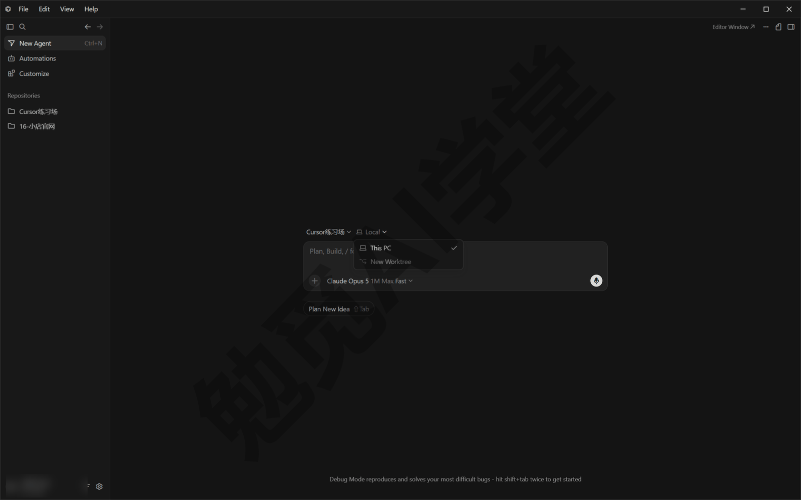
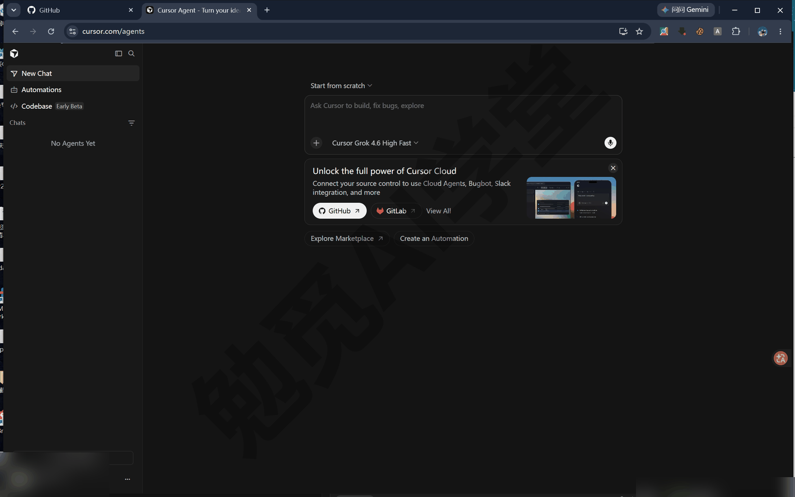
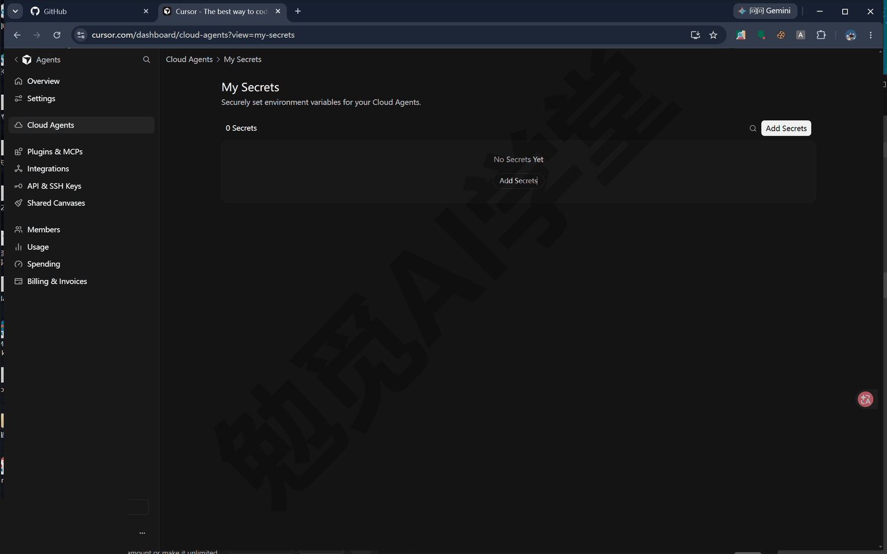

## 云端智能体与手机端

这一篇讲云端智能体：把任务交给 Cursor 在云端替你准备的一台电脑去做，你合上自己的电脑它也不停。本篇会把“启动、跟进、验收、移交”的全程走一遍，再讲手机端和远程控制，最后把费用与隐私说清楚。

### 14.1 云端智能体是什么

先看两个你迟早会遇到的时刻：下班前想起一件不小的任务，交给本地智能体吧，电脑就得开一晚上；或者你手头正让它改一个项目，又想同时开工另外两个任务，一台电脑忙不过来。这两个问题的共同答案，是把任务搬到云端去跑。

**云端智能体是什么。** 云端智能体（Cloud Agents）是在 Cursor 云端的隔离虚拟机里工作的智能体。虚拟机可以理解成云上一台单独为这个任务准备的电脑：里面克隆好了你的仓库（克隆就是把整个仓库完整复制一份下来）、装好了依赖（项目要用到的程序包），有自己的桌面和浏览器，还有网络访问。智能体在那台电脑上写代码、跑命令、开浏览器验证，全程不占用你面前这台机器。它的前身叫 Background Agents（后台智能体），老资料里看到这个名字，指的就是它。

**和本地智能体的三个关键差别。** 和你已经熟悉的本地智能体相比，云端智能体有三点不同：

- **在哪跑**：本地智能体改的是你电脑上的工作区；云端智能体在自己的虚拟机里克隆一份仓库、开一条独立分支工作，最后用 PR 把成果交回来——PR 是《Git、GitHub 与代码审查》讲过的“请把这批改动合并进主线”的申请单。
- **审批方式**：《权限、沙盒与模型》定下的三档运行模式（自动审查／白名单／全部运行，中文文案以实际界面为准）管的是命令在你电脑上执行前的把关；云端智能体不在你电脑上执行任何命令，所以不走这套审批，也不会弹审批弹窗。它在自己的虚拟机里直接执行，那台机器与你的电脑完全隔离。把关的方式随之改变：靠任务描述、环境配置，以及最后在 PR 上的审查。
- **电脑能不能关**：本地任务依赖你的电脑开着；云端任务启动后就与你的设备无关，合盖、断网、出门都不影响，回来看结果即可。

**前提一：付费套餐。** 免费账号不能启动云端智能体，具体哪一档开放以账号页面显示为准。可以先把本篇读完再决定要不要升级，不影响理解后面的内容。

**前提二：已连接代码托管。** 云端智能体要从 GitHub 等平台取你的代码，《Git、GitHub 与代码审查》里连接 GitHub 的那一步在这里正式派上用场；不想连 GitHub 的话，也可以用 “Start from scratch”（从零开始）让它把新项目存到 Cursor 自家的 Origin 托管上，《Git、GitHub 与代码审查》讲过这需要先认领命名空间。不确定自己的练习项目是否准备好了，可以在本地对话里发一句：

```
看一下当前工作区有没有配置远程仓库：有的话告诉我地址和默认分支；
没有的话提醒我先完成《Git、GitHub 与代码审查》里的推送步骤。
```

它会检查并汇报结果。远程仓库准备好了，这个项目就可以交给云端了。

**并行是它的主场。** 你可以同时开任意多个云端智能体，它们各自待在自己的虚拟机里，互不干扰；《子智能体、并行与工作树》讲过本机并行的几种形态，云端是把“隔离”做到最彻底的那一种。还有一种进阶形态：一个任务同时涉及好几个仓库时（比如页面和它背后的程序分别放在两个仓库里），云端环境可以配置成多仓库，让智能体在同一台虚拟机里一起改，知道有这种配置就行。

**什么任务适合云端。** 按任务性质分两类：

- **适合交给云端**：耗时长的任务、可以并行的一批任务、你要离开电脑但进度不能停的任务，以及想在干净环境里从头验证的任务。
- **不适合交给云端**：处理你本机文件的任务（云端访问不到你的硬盘）、需要你每一步把关的敏感改动，以及三两分钟就能完成的小修小补（云端启动环境本身要花时间）。

### 14.2 从哪里启动

云端智能体的入口不止一个，背后却是同一套服务：从任何一处启动的任务都进入同一个任务列表，其他入口随时能看到、能接着指挥。下面五个入口逐个认识，每个交代三件事：在哪里、什么时候用它最合适、发起之后去哪看。

**桌面 Cursor：最方便的一个。** 《两套界面全导览》认识过代理窗口（Agents Window）输入框上方的运行环境下拉，云端一旦在你的账号上可用，就出现在这里：把默认的 This PC（本机）切换为云端那一项（Cloud，中文文案以实际界面为准），再照常把任务发出去，这一条就在云端跑了。最合适的时机，是你本来就在本地工作，中途发现某件事更适合云端，切一下下拉就行，不用换地方重新描述任务。发起后，这个智能体会出现在代理窗口左侧的智能体列表里，和本地会话排在一起，点开随时跟进；同一条任务此刻也已经能在网页端和手机上看到。

**3.7.42 版上这个下拉只有两项**——This PC 与 New Worktree（新建工作树），没有云端，也没有 14.7 要用的远程控制。这个列表随账号套餐、项目是否连上了代码托管而变，你自己的下拉里有几项以你看到的为准；下拉里没有云端时，就走下面的网页版入口——它和这个下拉进的是同一个任务列表。



**网页版 cursor.com/agents：功能最全的控制台。** 任何设备的浏览器打开 cursor.com/agents，登录后就是云端智能体的完整控制台：新建任务、选仓库和分支、上传附件、查看所有任务的进度与结果都在这里，电脑上没装 Cursor 也不影响。最合适的时机有两种：人不在自己电脑旁，临时借一台设备也能开工；或者手头并行着好几个云端任务，想在一个页面里集中查看进度。发起后就地跟进即可；回到桌面端，同一条任务照样出现在列表里。



**手机 App：装在口袋里的入口。** iPhone 与 iPad 用 App Store 里的 Cursor 应用，安卓手机把网页版装成一个图标来用（叫 PWA），怎么装、有哪些细节，本篇 14.6 节会专门讲。最合适的时机是人在路上：通勤时想起一件事直接布置下去，收到推送后追问两句也很方便。手机上发起的任务同样进入统一列表，桌面和网页都能接手；系统还会给它打上来自手机的标记，方便你区分任务是从哪个入口来的，以实际界面为准。

**GitHub 评论：在问题现场发起。** 在 GitHub 的 PR 或 issue 下面评论 `@cursor` 并写上任务描述，云端智能体就会接手处理，Bitbucket 的 PR 上同样支持这种用法。最合适的时机是事情本来就发生在代码托管平台上：Bugbot 报了问题、别人提了 issue，就地指派，比回到 Cursor 里重新交代一遍要少很多步。发起后，它的工作结果会回到这条 PR 或 issue 上，完整的对话过程也能在 cursor.com/agents 里找到，以实际表现为准。

**Slack 与 Linear：团队协作里点名。** 这两个入口位于团队协作工具里：在 Slack 频道或 Linear 事项中 `@Cursor` 指派任务，前提是管理员已经安装了对应集成。最合适的时机是团队讨论中当场把结论变成任务，不用离开聊天工具。个人用户现阶段认识即可，等你真的进入团队协作再回来配置，细节以实际界面为准。

五个入口记住前两个就够日常使用：桌面下拉最方便，网页版最完整；其余三个等对应场景出现时再用。

### 14.3 跑一个云端任务全程

这一节把一个云端任务从头到尾走一遍。用哪个入口都行，下面以网页版 cursor.com/agents 为例，桌面下拉入口的流程相同。

**第 1 步：选仓库和分支。** 打开 cursor.com/agents，输入框上方的下拉就是选仓库的地方（列表来自你已连接的代码托管；还没连接时它显示的是 Start from scratch），先选要工作的仓库，再选一条起点分支，通常选主分支。第一次在某个仓库上启动时，云端要现场准备环境：克隆仓库、装依赖，可能要等几分钟，这是正常现象，后面 14.5 节里会讲怎么让它快起来。界面细节以实际界面为准。

**第 2 步：把任务说完整，发送。** 云端任务和本地对话最大的差别是你不在旁边，所以任务描述要一次给全：目标、限制、验收标准。例如：

```
把仓库里的 README.md 重写得更友好：先用两句话介绍这个项目是干什么的，
再分步骤写清楚怎么运行，最后补一段常见问题。
写完自己检查一遍格式，确认没有失效链接，然后开一个 PR。
```

**第 3 步：看进度，随时插话。** 发送后任务就开始跑了，对话流实时更新：读了哪些文件、跑了什么命令、改了什么。你可以留在页面上看，也可以关掉页面去忙别的；中途想补充要求，直接发消息，它会接着处理。这期间你的电脑可以合盖。

**第 4 步：看工件验收。** 云端智能体会主动留下“工件（artifacts）”：截图、录屏视频和日志，附在对话与 PR 上。它改完网页会自己把网页在那台电脑上跑起来、打开浏览器、点一遍关键流程，把过程录下来给你看。这是云端任务的一大优点：不用把分支拉到本地跑，看录屏就能判断改得对不对。

**第 5 步：需要时亲手上机。** 光看录屏不放心，可以直接接管它那台虚拟机的远程桌面：像操作一台远程电脑一样亲手试用它做的软件，试完把控制权交还，智能体接着工作。入口在任务页面上，以实际界面为准。

**第 6 步：收 PR。** 任务完成后它会开出一个 PR，改动、说明、工件都挂在上面。你在 PR 上走《Git、GitHub 与代码审查》定下的验收流程：看差异、看检查（Bugbot 在这里照常工作）、确认后合并。还有两个额外的能力，知道即可：它开的 PR 如果自动检查失败，会自己尝试修复，目前主要面向团队版，以实际表现为准；它还能“订阅”后续事件，比如有人评论了 PR 或检查出了结果，这些事一发生，它就会自动接着处理，不用你再催。

**常见坑有两个：**

- **环境没配好**：装不上依赖、跑不了测试，它就只能盲改，做出来的东西质量会明显下降，怎么解决见 14.5 节。
- **任务描述太含糊**：本地对话可以边跑边纠正方向，云端每一轮追问都要等它重新理解，所以发送前多花一分钟把话说全，最划算。

### 14.4 本地与云端移交

任务不必从头到尾待在一边，本地和云端可以互相接力。

**Move to Cloud：本地起头，云端接力。** 常见场景是任务在本地越聊越大：方案已经谈定，接下来一两个小时都是照着方案一步步做，这时把它移交给云端最合适。在代理窗口的会话里选择 “Move to Cloud”（移到云端），选定云端工作的分支后完成移交，入口位置与文案以实际界面为准。另外两种情况它可能主动建议你移交：本地任务已经跑了很久，或者检测到你的网络不好，以实际表现为准。

移交前先记住一条：**Move to Cloud 不会带上你本地未提交的改动。** 云端智能体从远程仓库的干净状态出发，带过去的是对话历史和上下文，不是你工作区里没提交的文件。所以移交前先让智能体把当前改动提交并推送（《Git、GitHub 与代码审查》练过这一步），否则云端拿到的代码比你本地旧。

**Move to Local：云端拉回本地细调。** 反过来，云端任务大体完成、剩下一些要盯着屏幕微调的细节时，用 “Move to Local”（移到本地）把会话接回本地继续，改完还可以再移回云端让它自己收尾。入口与文案以实际界面为准。

**/in-cloud：主线不动，分一个云端帮手。** 不想中断当前对话，又想把一件耗时的事交出去，用云端子智能体：《子智能体、并行与工作树》讲过子智能体是带独立上下文的分身，这里的分身开在云端。在代理窗口输入 `/in-cloud` 确认后，接下来发送的那个任务就会作为云端子智能体运行，拥有自己的虚拟机和分支；你的主对话继续正常使用。例如先输入 `/in-cloud`，再发送：

```
检查这个仓库所有页面的文字有没有错别字和失效链接，
把发现的问题整理成一份清单，先不要直接改文件。
```

适合这样交出去的事：修一次失败的检查、排查一个问题、通读一个陌生仓库写摘要。

发送后对话里会多出一张云端子智能体的卡片，它在云端的进度就在卡片里看（形态以实际界面为准）。

**/autopilot：把 PR 交给它一直跟到能合并。** 《Git、GitHub 与代码审查》提过一句的 `/autopilot`，这里把它讲完整：它把一个 PR 整体交给云端子智能体持续跟进，修失败的检查、回应审查意见，直到 PR 可以合并，全程不占你的本地会话。PR 界面上通常也有对应的快捷入口，以实际界面为准。

**移交后用的是哪套配置。** 一件事移到云端后，用的就是云端那套配置：`/in-cloud` 和 `/autopilot` 开出的云端子智能体使用你为这个仓库配置的云端环境（14.5 节讲怎么配），模型与能力规则和普通云端智能体一致。只有一个差别：它调用的 MCP 服务来自网页端为云端配置的那一套，而不是你本地会话里装的——《插件、市场与 MCP》讲过 MCP 是让智能体连接外部工具与数据的统一接口。所以本地对话里常用的外部工具，移交前先确认网页端也配了同样的，否则云端那边会“缺工具”。

### 14.5 环境、Builds 与 Secrets

**为什么环境是头等大事。** 云端那台虚拟机开机时是一台“新电脑”，你的项目要能在上面跑起来，智能体才能自己验证工作成果；环境没配好，它写了代码也没法运行测试、启动服务，只能盲改。官方说，配好环境是提升云端智能体效果最重要的一步。

**环境有三种配置方式。** 环境配置在 cursor.com/dashboard 的 Cloud Agents（云端智能体）分区完成：

- **智能体自动配置（推荐）**：走引导流程，选好仓库后由智能体自己动手装依赖、验证环境，你在页面上的终端窗口里看着它做完并保存。多数项目十分钟内可以完成，以实际表现为准。
- **快照（snapshot）**：把一台已经配好的机器状态存档，之后每次从存档启动。
- **Dockerfile**：用一份配置文件把环境一项项写清楚，属于进阶手段，需要时让智能体帮你写。

配置结果可以存进仓库里的 `.cursor/environment.json` 文件，团队里每个人和每次自动化运行都用同一套环境。同一个仓库可能同时存在几份配置，Cursor 按固定顺序取第一个找到的：仓库里的 `.cursor/environment.json` 最优先，其次是你个人保存的环境，最后才是团队保存的环境。这个顺序有一个实用的用途：想试一套新配置，先存成个人环境验证，确认没问题再提交进仓库，全队跟着受益。

**Builds：提前把环境装好。** Builds（构建）是提前把环境准备好的机制：Cursor 在后台按你的配置把仓库、依赖提前装好，形成一份随时可用的现成环境，新任务直接从它启动，省掉每次现场装依赖的等待。dashboard 上能看到每次 Build 的状态与日志，某次失败也不影响已有环境继续用；现阶段不用专门去配置它，知道有这回事就可以。想知道某次任务实际用的是哪套环境，打开那条任务的页面，把鼠标悬停在顶部的仓库名上就能看到环境详情；dashboard 的环境页还保留历史版本记录，以实际界面为准。

**Secrets：密钥放后台，不进代码。** 项目要连数据库、调用 API 时需要密钥。正确做法是把它们存到 dashboard 云端智能体分区的 Secrets（密钥）页里，云端任务运行时会当作环境变量提供给虚拟机；错误做法是把密钥写进代码或提交进仓库——《Git、GitHub 与代码审查》讲过，密码、密钥这类文件不该进仓库。有两个细节：密钥在任务启动时传入，已经在跑的任务不会拿到新加的密钥，加完后新开任务才生效；只该给某一套环境用的密钥，可以只绑到那一套环境上，不会给其他环境用。

还有一个容易踩的坑：用快照方式配环境时，如果那台机器上当时留着 `.env.local` 这类密钥文件，它们会被一并存进快照带给以后的任务。官方推荐的做法始终是用 Secrets 页统一管理密钥，环境文件里不留敏感内容，两边都干净。



### 14.6 手机端：iPhone、iPad 与安卓

云端智能体的另一半用处在手机上：任务在云上跑，手机就是完整的指挥台。

**iPhone 与 iPad App。** 官方应用在 App Store 上架，名字就叫 Cursor，要求 iOS 26.0 或 iPadOS 26.0 以上，界面目前只有英文。有两个限制：官方说明该应用只在中国大陆以外的 App Store 地区上架，账号地区在大陆的话搜不到，先用下文的网页版方式即可，功能主线一致；免费账号能登录 App，但启动智能体需要付费套餐，以账号页面显示为准。

**装好后四步上手。** 装好后：第 1 步，登录 Cursor 账号；第 2 步，从列表里选仓库和分支（列表来自你在网页端连接的代码托管，见不到仓库就先回 cursor.com 连接，再下拉刷新）；第 3 步，发送任务；第 4 步，跟进它工作。你在桌面、网页启动的任务也会自动出现在手机收件箱里，反过来手机上启动的任务在桌面照样能接手。收件箱就是一份任务列表：每条显示仓库名、任务标题和当前状态，点进去就是完整的对话。

**手机上能做这些事。** 实时跟进对话、随时追问；读完整的差异、提交与检查状态，添加或去掉审查人，然后直接合并 PR；用设计模式说明想要的样子——《内置浏览器与设计模式》讲过的“在页面或图片上点选、画圈说怎么改”在手机上同样可用，还能拍照上传；语音口述任务；智能体每完成一轮，你会收到推送通知，锁屏上还能实时跟踪多个智能体的状态。iPad 屏幕大，布局更宽松：会话在侧栏、审查和聊天并排开、差异全宽显示，还支持 Apple Pencil 在截图上圈画。

**哪些事留在网页端。** App 专注指挥与验收，不是把整个 Cursor 搬进手机。分工是这样的：

| 手机 App 上做 | 留在网页端做 |
|---|---|
| 启动任务、追问、看实时进度 | 编辑器、终端、文件浏览器 |
| 审差异、合并 PR、管审查人 | Secrets 与环境配置 |
| 设计模式改版、语音口述 | MCP 服务器的添加管理 |
| 收推送、锁屏跟踪多个智能体 | 连接 GitHub 等代码托管 |
| 每次运行时挑选要用的 MCP | 自动化、规则与技能的配置 |

账单、用量等管理页面同样只在网页端。想改一行代码？手机上没有编辑器，正确做法是把要求发给智能体让它改，你在差异视图里验收。

**安卓怎么办。** 用 PWA（渐进式网页应用，也就是把网页装成一个近似 App 的图标）：Chrome 打开 cursor.com/agents，登录后在菜单里选择“安装应用”（Install App，文案以实际界面为准），桌面上就多了一个 Cursor 图标，点开就能用。菜单入口在 Chrome 右上角的三个点里，不同版本可能叫“安装应用”或“添加到主屏幕”，都是同一件事。核心功能与 iOS App 一致，推送通知这类要靠手机系统配合的功能以实际表现为准。官方表示专门的安卓版在计划中，暂无时间表。

**手机上觉得慢？** 大概率不是手机的问题：云端任务启动时要准备环境、装依赖，这段等待在网页端一样存在。如果同一任务在网页端明显更快，才需要检查手机网络，下拉收件箱可以强制刷新。

### 14.7 远程控制 Remote Control

**远程控制是什么。** 前面讲的都是“任务在云端的虚拟机里跑”。Remote Control（远程控制）是另一种形态：任务继续在你自己的电脑上跑，你人不在电脑前，用手机指挥它。指挥信息经过云端转发，但每一条命令、每一次文件修改、每一个测试都在你的电脑上执行。

**为什么需要它。** 有些任务离不开你的电脑：要处理的文件在本机硬盘上，依赖也只有本机装了，云端虚拟机替代不了，人一离开电脑这类任务就只能停下，这种时候就要用 Remote Control。还有些代码不适合放到云端，这时它的好处很清楚：仓库、密钥、凭证和各种临时文件全部留在你的机器上，送到云端的只有工具执行结果和模型需要的上下文，对敏感项目比云端智能体合适得多。

**开启前确认四件事。** Remote Control 的前提比云端智能体多几条，动手前逐一过一遍，能省去事后排查的时间。

**第一件：版本与界面。** 电脑上的 Cursor 要在 3.9.8 及以上，老版本的设置里没有这个开关，`/remote-control` 命令也不存在；同时只有代理窗口里有它，编辑器界面没有对应入口。版本号在哪看、怎么更新，《认识与装好》讲过，这里不重复。

**第二件：账号与隐私。** 需要付费套餐，而且账号要能用云端智能体，以账号页面显示为准；隐私设置必须允许云端存储会话数据（下一节讲），关闭云端存储时这个功能整个用不了。团队与企业账号还多一道手续：管理员先在团队后台放开 Remote Control，成员才能启用。

**第三件：工作区类型。** 本地文件夹或远程 SSH（通过网络登录另一台电脑）工作区都支持，而且项目不需要配置 Git 远程仓库——这一点比云端智能体宽松，云端智能体必须连接代码托管。

**第四件：电脑状态。** 电脑要保持开机、在线、不休眠：所有操作都在这台电脑上执行，它一休眠任务就停。出门前把电源和网络都接好。

**第 1 步：打开开关。** 在代理窗口打开设置，进入 Agents 分区，开启 Remote Control；顺手把旁边的 “Keep this computer awake”（保持此电脑唤醒）也打开，插电状态下它会阻止电脑休眠（中文界面文案以实际界面为准）。

**第 2 步：交出会话。** 在要移交的智能体输入框里发送：

```
/remote-control
```

然后照常发送你的下一条消息，Cursor 就会让这个会话可以从其他设备控制。运行环境下拉里通常也有“远程控制”一项可直接选择，以实际界面为准。

**第 3 步：手机接管。** 打开手机上的 Cursor App（或网页版），收件箱里会出现这条来自你电脑的会话，点进去继续发指令、看进度，与指挥云端任务的体验一致，差别只有一点：执行任务的仍是你自己的电脑。

**Remote Control 的边界与提醒。** 只有你本人能控制自己的智能体，会话只对应你的账号和这台机器。最大的限制前面说过：电脑必须醒着、在线，出门前确认电源和网络。这个功能标注为 Beta（测试版），细节可能调整，以实际界面为准。

### 14.8 费用与隐私

**云端怎么计费。** 云端智能体按所选模型的 API 价格计费：模型越强、任务越长，消耗越多。云端还允许你为支持的模型选择上下文窗口大小，窗口越大、一次能装进的材料越多，消耗也随之上涨，普通任务用默认档即可。并行虽好，费用也是一份一份累加的：同时开三个智能体，就是三份模型调用的消耗，开一批任务前先想清楚值不值。

第一次使用时会要求你设置一个支出上限，花费到达上限后就不能继续，避免费用超出预期，以实际表现为准；上限建议先设置一个较小的数值，用熟之后再调整，之后随时可以在 dashboard 的云端智能体分区改动。

花了多少去哪看：《权限、沙盒与模型》介绍过账号后台的用量页，云端智能体的消耗也记在那里，具体单价与余量以账号页面显示为准。省钱的习惯只有两条：任务描述一次给全，减少来回追问；简单的小修小补留在本地做，云端留给真正值得的任务。

**隐私模式的要求。** 云端智能体要在 Cursor 的服务器上克隆代码、保存会话，这要求你的隐私设置允许云端存储。Cursor 的隐私模式（Privacy Mode）承诺代码不用于训练；云端保存的代码只用来运行智能体本身。

想确认自己当前的状态，分两步：第 1 步，打开 Cursor 设置（Windows 下快捷键 Ctrl+Shift+J）；第 2 步，在常规分区找到隐私模式的开关，看它的状态（中文界面文案以实际界面为准）；团队账号默认全员开启隐私模式，管理员还可以在后台强制全员开着。

如果你的账号还在旧版隐私模式（Legacy Privacy Mode，特点是禁止云端存储），使用云端功能前会被提示切换，流程通常是在弹窗里点 “Update”，再确认 “Switch to Privacy Mode”，以实际界面为准。确认后代码依然不用于训练，但**切过去就切不回来了，切到新隐私模式后不能再回 Legacy**。请理解清楚再确认，不确定就先用本地功能，不影响本课其他内容的学习。

**哪些功能受这个开关影响。** 数一下前后两篇出现过的名字，就知道这项设置分量不轻：云端智能体、手机端启动任务、Remote Control，加上《Git、GitHub 与代码审查》的 Origin，全都要求允许云端存储。还停在 Legacy 模式的账号，这几样都用不了；完成切换后一并开放。

**敏感项目怎么选。** 一条简单的判断办法：内容不敏感、想要最大便利，用云端智能体；代码或数据不想离开自己电脑，用本地智能体或上一节的 Remote Control；在两者之间的，用私有仓库加云端，并把密钥全部放进 Secrets 管理——14.5 节讲过，密钥会当作环境变量传给虚拟机，不进代码也不进仓库。账单、证件这类隐私文件再多想一步：不是非用云端不可的话，让它们留在本机最稳妥。

### 14.9 三个练习任务

下面三个任务把本篇主线亲手走一遍。提示词可以直接复制，方括号里的内容换成你自己的。前两个任务需要付费套餐和已连接的代码托管，第三个还需要一部手机。

**任务一：把一个本地任务移交到云端并合盖等结果**

在本地对话里发送下面的任务，等它明确方案后，先让它提交推送当前改动，再用 Move to Cloud 移交，然后合上电脑几分钟：

```
把 README.md 重写得更友好：两句话介绍项目、分步骤的运行说明、
一段常见问题。写完自己检查一遍格式，然后开一个 PR。
```

完成标准：重新打开电脑后，任务已在云端继续推进或已完成；cursor.com/agents 上能看到这条任务和它开出的 PR。

**任务二：在手机上给云端任务发一条追问**

用手机 App（或安卓 PWA）打开任务一那条会话，发送：

```
在刚才的基础上，把常见问题扩充到五条，并告诉我你改了哪些文件。
```

完成标准：手机上能看到智能体继续工作并回复了改动文件列表；回到桌面端，同一条对话里能看到这轮追问的全部过程。

**任务三：用远程控制让手机指挥电脑改一处**

按 14.7 节完成设置后，在电脑上的会话里发送 `/remote-control`，再从手机接管，发送：

```
把工作区里 [某个文件名] 的标题改成 [新标题]，改完告诉我改了哪里。
```

完成标准：手机 App 收件箱里出现这条会话；从手机发出指令后，电脑上的文件真的发生了修改；全程电脑保持开机在线。

### 14.98 本篇小结与自检

这一篇让智能体离开了你的电脑：云端的隔离虚拟机替你跑长任务，工件和 PR 负责交付，手机随时跟进，Remote Control 则让“任务在本机、人在外面”也成立。最需要记住的一句话：**云端智能体不走本机审批，把关靠任务描述、环境配置和 PR 上的审查。**

可以对照下面的清单检查学习结果：

- [ ] 能说出云端智能体和本地智能体的三点差别（在哪跑、怎么把关、电脑能不能关）
- [ ] 知道五个启动入口，至少用过桌面下拉和网页版两个
- [ ] 完整跑过一个云端任务，看过它的工件并在 PR 上完成验收
- [ ] 会用 Move to Cloud 移交任务，并记得移交前先提交推送本地改动
- [ ] 知道环境配置和 Secrets 在 dashboard 的什么位置、为什么重要
- [ ] 手机上能跟进任务：iPhone 用 App，安卓用网页 PWA
- [ ] 知道 Remote Control 的前提：版本、代理窗口、设置开关、电脑保持唤醒
- [ ] 清楚云端按模型 API 价计费、首次要设支出上限，以及 Legacy 隐私模式切了就切不回去

完成这些内容后，你已经能让智能体在云端独立完成任务了。下一篇《自动化、钩子与命令行》更进一步：让云端智能体按时间表或事件自动开工，不再需要你亲自布置每一次任务，同时认识钩子和命令行这两件进阶工具。

### 14.99 新手常见问题

**Q1：云端会看到我全部代码吗？**

它会把你授权的仓库克隆到隔离虚拟机里，这是它能开工的前提。范围由你控制：连接代码托管时可以只授权指定仓库；隐私模式下代码不用于训练，云端保存只是为了运行任务。完全不想让代码放到云端的项目，用本地智能体或 Remote Control，Remote Control 经云端转发的也只有工具结果，仓库留在本机。

**Q2：免费版能用云端智能体吗？**

不能启动。云端智能体、手机 App 启动任务、Remote Control 都需要付费套餐，免费账号只能登录和查看界面。具体哪一档开放哪些能力，以账号页面显示为准。可以先把本课的本地部分学完，确认有长期需求再升级。

**Q3：云端任务跑多久算完？怎么判断它没卡住？**

短则几分钟，长则数小时，取决于任务大小；开头的环境准备（克隆仓库、装依赖）本身就要花几分钟，是正常的。判断的办法是看对话流：工具卡片持续滚动说明它在推进；长时间没动静可以直接发一句“现在进展到哪了”，它会汇报。任务完成的标志通常是它开出 PR 并附上工件。

**Q4：手机上能改代码吗？**

不能直接改。App 里没有编辑器、终端和文件浏览器，这些留在桌面端与网页端。手机上的正确做法是把修改要求发给智能体，然后在差异视图里逐文件验收它的改动，需要的话继续追问，最后在手机上合并 PR。

**Q5：我用安卓手机，体验会差很多吗？**

主线功能不受影响。PWA 方式打开的 cursor.com/agents 与 iOS App 用的是同一套服务：启动任务、追问、看差异、合并 PR 都能做。差别主要在要靠手机系统配合的功能，例如推送通知和锁屏跟踪，以实际表现为准。官方专门的安卓应用在计划中，之后可以关注更新日志。
