## 自动化、钩子与命令行

到这一篇为止，你学过的所有用法都有一个共同点：你发话，它才动。这一篇把功能篇的最后三块能力补上——自动化让云端智能体按日程或外部事件自己开工，钩子在智能体干活的固定节点自动运行检查脚本，命令行 CLI 让没有图形界面的地方也能使用 Cursor。文章最后再用一节讲清楚：产品每周都在变，怎么靠更新日志和文档站自己跟上迭代。

### 15.1 自动化是什么

**先看两个场景。** 每周一早上，你都让 Cursor 把上周的文档改动汇总成一份周报；每天上班第一件事，是让它看看你关注的几个软件有没有发新版本。这类任务的特点是：做法固定、节奏固定、每次发的提示词几乎一字不差。重复到第三次，问题就来了：能不能不用我叫，它到点自己干？这不只是少一步操作的问题——每多一步“记得去叫它”，事情就多一分被忘掉的可能。真正想长期坚持的日常事情，最好连“发起”这一步也交出去。

自动化（Automations）解决的就是这件事。上一篇《云端智能体与手机端》里你用过云端智能体（Cloud Agents，以前叫 Background Agents）——任务跑在 Cursor 的云端电脑里，你合上笔记本它也照样干活。但那时每个任务都要你亲手发起。自动化补上的是“发起”这一步：你可以把它理解成给云端智能体装上的定时器和门铃，定时器到点自动开工；门铃一响也自动开工，比如 GitHub 上有人开了拉取请求（PR，《Git、GitHub 与代码审查》讲过的“把一批改动打包送审的申请”），或者团队聊天工具 Slack 的频道里来了条消息。

动手之前，有三件事要先知道：

- **它跑在云端。** 每次触发都会让云端智能体跑一次，不占你的电脑，你的电脑关机也不影响。
- **它是付费功能。** 每次运行按所选模型的云端用量计费，跑得越勤花得越多；套餐门槛和具体费用以账号页面显示为准。
- **它能做的事和你手动发起的云端任务一样。** 读代码、改文件、开拉取请求、发消息，还可以按需加装工具，15.2 里会逐个讲。

**它和本地的 /loop 怎么分工。** 内置技能里有一条 /loop，作用是在当前对话里每隔一段时间重复运行一条提示词或技能。两者放在一起看最清楚：

- **/loop（本地）** —— 跑在你电脑上的当前对话里，Cursor 和电脑都得开着；用量按本地对话的规则算（以账号页面为准）；适合“今天下午每半小时盯一次下载文件夹”这类临时、短期的重复。
- **自动化（云端）** —— 跑在 Cursor 的云端电脑里，你的电脑关了也照跑；能接外部事件（GitHub 这类代码托管平台、Slack、Webhook、Linear 等，都在 15.2 的触发器一节）；适合“每周一早上出周报”这类长期、固定节奏的重复，也是两者中唯一能由外部事件触发的一种。

**先拿 /loop 试一下。** 想体会“自动重复”是怎么回事，不用花云端的用量，本地一分钟就能试。在对话输入框输入 /（斜杠）唤出技能菜单，选中 /loop，或者直接发送：

```
/loop 每 20 分钟提醒我一次：站起来活动两分钟，顺便报一下当前时间。
```

发出去之后，对话里会出现循环任务开始的确认（具体形态以实际界面为准），之后每到间隔时间它就执行一轮，直到你叫停或者关闭 Cursor。这个小例子开一个下午，你就能直观感受到定时重复的好处和限制：它确实到点就干，但电脑一合上就停；云端自动化解决的就是这个问题。

判断标准只有一句话：临时的重复交给 /loop，长期的、要外部事件触发的交给自动化。拿不准就先用 /loop 跑几天，确认这件事真的值得长期自动跑，再固化成自动化——这个先后顺序本身就是一条原则，15.4 里专门讲。

### 15.2 建一个自动化

**入口有四个，通向同一张表单。**

- **代理窗口（Agents Window）里新建**：左侧栏点 Automations 进入自动化列表页，点列表右上角的 New Automation 按钮就能新建；自动化和智能体在同一套界面里管理，能看到列表、状态和运行记录。
- **网页版**：浏览器打开 cursor.com/automations，看到的和桌面端是同一份列表，手机上也能查看。
- **对话里用 /automate**：在本地对话输入 /automate 加一句话描述，让它替你把整张表单填好——步骤最少，零基础读者建议先用这个办法。
- **市场模板**：《插件、市场与 MCP》介绍过的 Cursor Marketplace 里有现成的自动化模板（自动审查新拉取请求、定期安全扫描、Slack 消息分类处理、每日代码变更摘要等），拿来改改就能用。

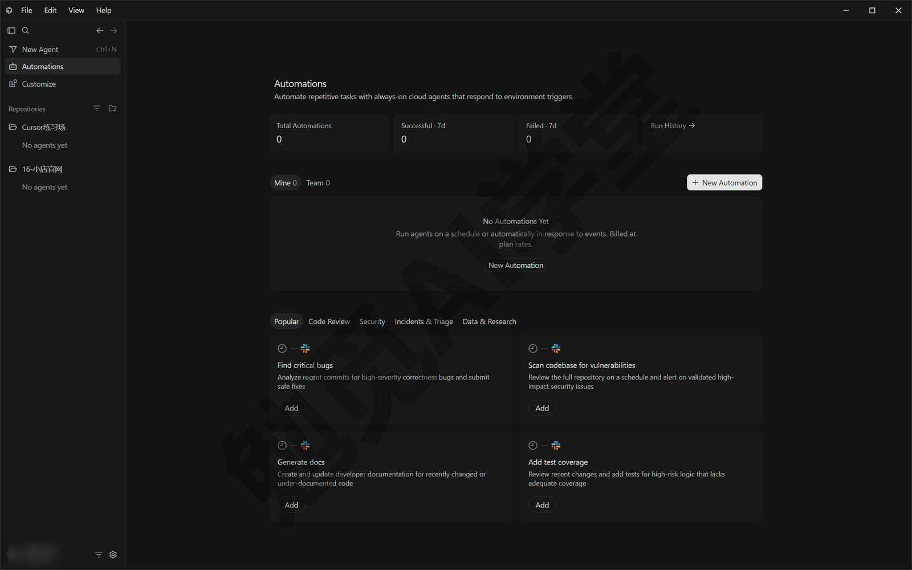

**最简单的办法：/automate 一句话建好。** 它是一条内置技能，你用平常说话的方式描述想要的流程，它负责把触发条件、提示词、工具都配好。比如：

```
/automate 每周一早上 9 点，把这个仓库过去一周的提交整理成一份中文摘要，
按“新功能／修复／其他”分组，写进 docs/weekly/ 目录并开一个拉取请求。
```

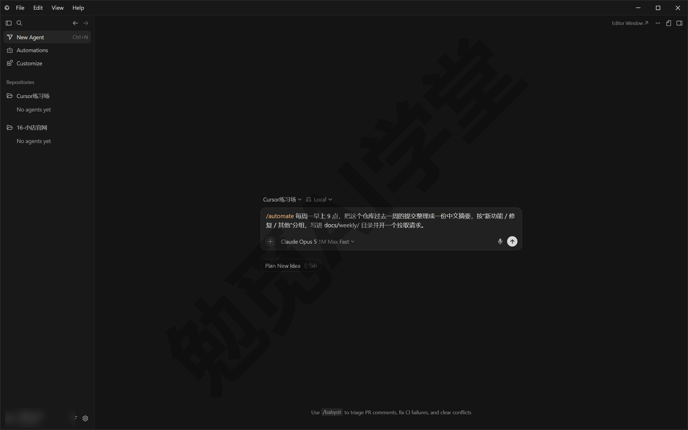

发出去之后，它会生成一份自动化配置草稿：触发条件是每周一 9 点的定时，提示词是整理摘要的要求，工具里开着“创建拉取请求”。你要做的是核对草稿、补细节、保存激活（这张表单在演示机上还是英文界面，下面提到的字段名和按钮名都是英文原文；以后有了中文翻译，以你看到的为准）。

**无论从哪个入口进，一个自动化都由同样的五步组成：**

1. 选触发器——决定什么时候跑：可以是固定日程（每小时、每天、每周），也可以是外部事件（有人开了拉取请求、Slack 来了消息），一个自动化可以同时挂几个触发器。
2. 写提示词——告诉智能体跑起来之后做什么：检查什么、生成什么、什么情况不该动；这是五步里最影响成败的一步，写法有讲究。
3. 挑工具——决定它除了读写代码、跑命令这些基础能力之外还能动用什么：评论拉取请求、发 Slack、连 MCP、记笔记，都在这一步开关。
4. 定仓库——决定它能不能接触代码：完全不碰、只管一个仓库，还是同时管好几个仓库，三种选择对应三类用途。

第五步是保存并激活——激活后列表里这一条的状态变为启用，从此按你定的条件自动运行，每一次运行都会留下记录。下面把每一步展开，保存激活放在最后的收尾设置里一起讲。

#### 触发器：决定什么时候跑

触发器（Trigger）是自动化的开工条件。一个自动化可以挂多个触发器，任何一个满足就跑一次。先看一张总表：

| 触发器 | 什么时候跑 | 典型用途 |
|---|---|---|
| 定时 | 按固定日程，到点就跑 | 周报、每日摘要、定期清理 |
| 代码托管 | 仓库里发生拉取请求、推送等事件 | 自动审查新开的拉取请求 |
| Slack | 关联的公开频道来了新消息等 | 把群里报的问题转成任务 |
| Webhook | 外部系统向专属网址发一个请求 | 和你自己的系统串起来 |
| Linear | 任务管理工具里新建了任务等 | 自动分析新任务 |
| Sentry | 错误监控工具报了新错误 | 自动排查错误原因 |
| PagerDuty | 值班告警系统产生了新告警 | 自动分类处理告警 |

**定时触发器** 最常用，也最适合起步。点 Add Trigger 后选 Scheduled，里面是 Hourly（每小时）、Daily（每天）、Weekly（每周）三个预设加一个 Custom (cron)；要更精确的节奏就选 Custom (cron)，填 cron 表达式——一种用几个字段描述“什么时候跑”的小语法，比如“每周一早上 9 点”写成 `0 9 * * 1`，输入框也接受 `@daily`、`@hourly` 这类简写。

cron 里的小时按 UTC（世界标准时间，比北京时间晚 8 小时）计，填完 `0 9 * * 1` 之后，触发器那一行显示的是 Every week on Monday at 17:00 GMT+8；想要本地早上 9 点，直接在那一行的时间下拉里改成 09:00 更快。不会写也不要紧，用预设就够，或者让 /automate 替你生成。

定时任务可能比设定时间晚一点开始，但不会提前，这是正常的。菜单里还有一项 Microsoft Teams，是和 Slack 同类的团队聊天工具触发器，上面的表里没单列，知道有它即可。

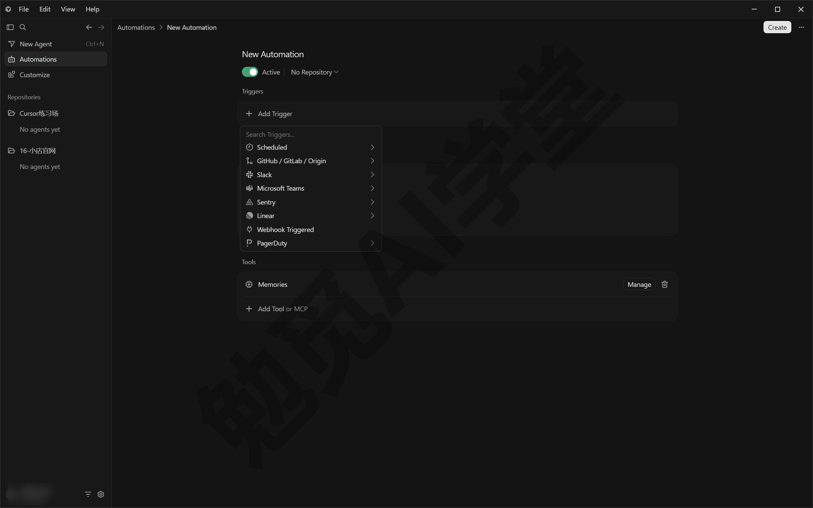

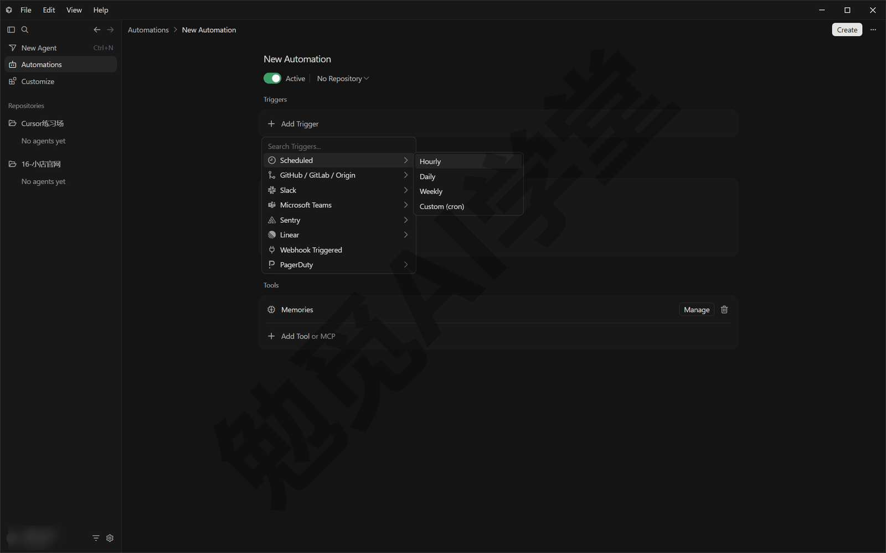

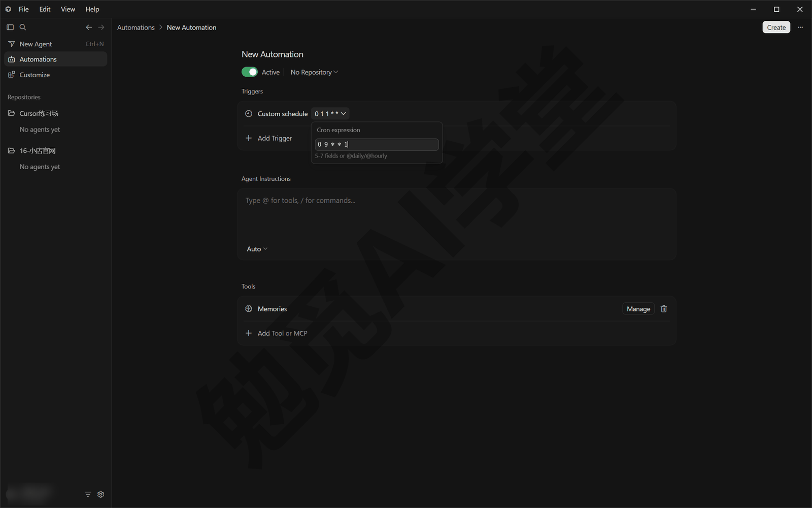

**代码托管触发器** 响应 GitHub、GitLab、Bitbucket Cloud 这类平台的事件。核心事件包括：开了拉取请求、拉取请求有了新提交、拉取请求被合并、某个分支有了新推送、有人留了评论。GitHub 支持的事件最全，还包括标签变化、自动检查（CI）完成、评审意见提交等。用这类触发器必须指定仓库——事件本身就发生在仓库里。

**Slack 触发器** 响应 Slack 里的事件：关联的公开频道来了新消息、有人用特定表情回应了消息、新建了公开频道。目前只对公开频道生效，私聊和私有频道触发不了。

**Webhook 触发器** 会给这个自动化生成一个专属网址，任何系统向这个网址发一个 HTTP POST 请求（一种标准的“通知我一下”的网络请求），它就跑一次。网址和配套的验证密钥要先保存自动化才会生成。

**Linear、Sentry、PagerDuty 触发器** 分别对接任务管理、错误监控、值班告警三类团队工具，事件包括新建任务、状态变化、新错误、新告警等。没用过这些工具可以直接跳过，知道“团队工具里的事件也能当开工条件”即可。

#### 提示词：决定跑起来干什么

触发条件定好，第二步是把“跑起来干什么”写清楚。写法和给云端智能体下任务一样，但因为运行时你不在场，要求更高。官方文档给的建议可以整理成一张对照表：

| 写法建议 | 示例 |
|---|---|
| 说清楚检查什么、改什么、生成什么 | 不要只写“帮我看看” |
| 点名你开了的工具 | “检查完把结论发到 Slack 的 #daily 频道” |
| 分情况给指令 | “如果改动涉及价格数据，先不要动，只留评论提醒我” |
| 划一条“什么都不做”的线 | 条件不满足就直接结束，不硬找活干 |
| 说明输出格式 | 几行以内、按什么分组、放进哪个目录 |

这五条里最容易被忽略的是“什么都不做”那条：没有它，自动化在没活可干的日子也会硬挤出一点东西来，浪费一次用量。

#### 工具：决定它能动用什么

提示词说的是“做什么”，工具决定它“拿什么做”。自动化本来就带着云端智能体的基础能力（读写代码、跑命令、上网），下面这些工具按需开关。表单里对应的是 Tools 一栏：默认已经带着 Memories，点 Add Tool or MCP 弹出的菜单按 Built-in、MCP、Slack、Microsoft Teams、GitHub 分组，下面讲的每一项都能在里面找到。

**创建拉取请求** —— 连着仓库的自动化默认开着它：智能体改完代码后，自动把改动打包成一个拉取请求给你审，而不是直接改主分支。这是自动化交结果最主要的方式。

**评论拉取请求** —— 在目标拉取请求上留评论，支持整体评论和逐行评论。如果你在配置里额外允许“批准”，它还能批准或请求修改；默认只许评论，权力越大越要想清楚再给。

**请求评审人** —— 让它替你把拉取请求分给合适的人审。

**发到 Slack 与读 Slack** —— “发到 Slack”把结果发进频道，可以指定一个固定频道，也可以让它自己挑（自己挑意味着它能读到所有可发消息的公开频道）；“读 Slack”是只读权限，用于回复前多了解上下文。

**MCP 服务器** ——《插件、市场与 MCP》定下的规则在这里同样适用：MCP 是让智能体连外部工具和数据的统一接口。给自动化接上一台 MCP 服务器，等于把那台服务器的全部工具都交给它，只接你信任的服务器。

**记忆（Memories）** —— 让它在多次运行之间记笔记、越跑越熟练，默认开启。机制和风险放在 15.3 里细讲。

**电脑操作** —— 云端智能体可以像人一样操作浏览器、截图、录屏，这个能力默认包含。想让它交结果时带一段演示，在提示词里说一句，比如“改完界面后附一段操作录屏”。

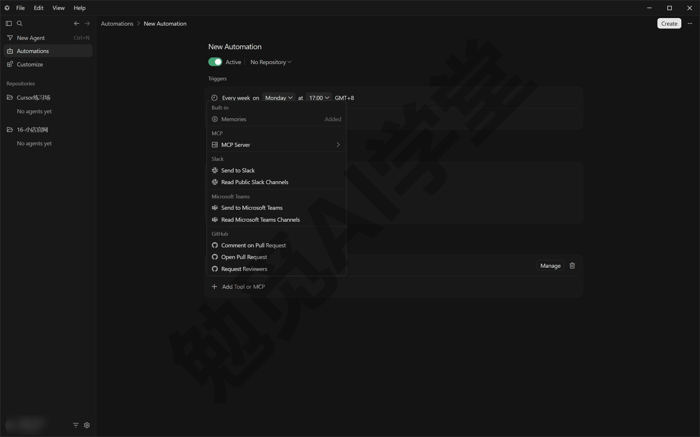

#### 仓库：无仓库、单仓库还是多仓库

工具之后是代码权限。仓库设置决定这个自动化能不能接触你的代码，有三种选择：

- **无仓库** —— 不拉取任何代码，适合只用 Slack、MCP、Webhook、Linear 的流程；改不了代码，也开不了拉取请求。
- **单仓库** —— 在一个仓库的一个分支上干活，读、审、改都行，最常用。
- **多仓库环境** —— 任务横跨几个代码库时用，在环境里选多个仓库。

默认规则有两条：Slack 和定时触发的自动化默认不带仓库，想让它改代码就要主动指定；代码托管触发的自动化必须指定仓库。仓库在表单顶部的 No Repository 下拉里选；账号还没连接 GitHub 时，这个下拉里只有一项 Connect GitHub，连上之后才会列出你的仓库。

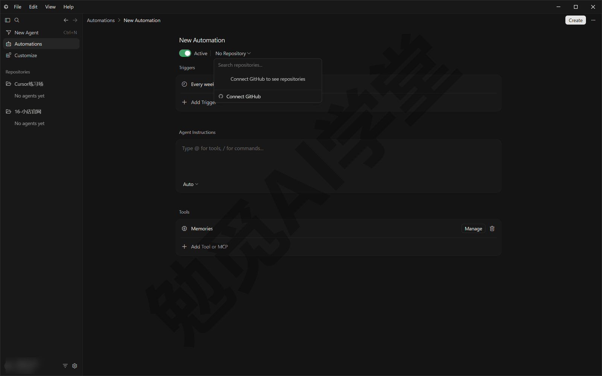

#### 模型、可见范围与保存激活

最后一步是三个收尾设置。模型可以指定，也可以交给默认；自动化跑在云端，上下文窗口自动用所选模型支持的最大档，没有单独的开关。可见范围分私有、团队可见、团队所有三档，决定谁能看到和管理这个自动化、用量算在谁的账上——个人使用保持默认的私有即可，团队里的分工机制等真用到团队版再研究（可见范围这一项在演示机上显示为英文，上面三档的名字是按意思翻译的，以实际界面为准）。

表单右上角的按钮叫 Create，顶部还有一个默认打开的 Active 开关。点 Create 保存并激活后，自动化列表里会多出一条，状态显示为启用（列表里的具体文案以实际界面为准）。从这一刻起，它就按你定的条件自动运行了。

### 15.3 运行记录、暂停删除与记忆

**每次触发都是一次云端运行，每次运行都有记录。** 自动化每跑一次，就产生一次云端智能体运行记录，你可以像回看普通云端任务一样点开它：看它读了什么、改了什么、生成了什么，包括《云端智能体与手机端》讲过的工件——截图、录屏这类给人看的成果。记录的具体入口在自动化的详情页里（位置以实际界面为准）。刚建好的自动化，前几次运行一定要逐条点开看，这是发现提示词毛病最快的方式。看的时候重点盯三样：启动时间是否符合触发条件、动过的文件范围有没有越界、生成的格式是不是和提示词里定的一致。

**暂停与删除。** 只是想暂时停用——比如假期没人看结果——用暂停：配置全部保留，回来再启用；确定不再需要就删除。两个操作一般都在自动化列表或详情页的管理菜单里（位置以实际界面为准）。判断标准很简单：不确定要不要留，先暂停；确定不要，再删除。

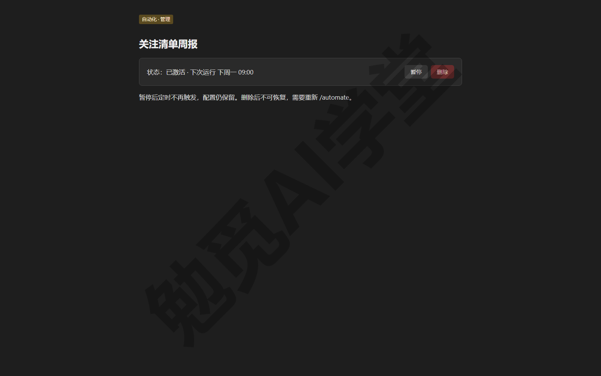

**它用哪个账号署名。** 自动化在外部服务上留下的动作，署名有一套固定规则：在 GitHub 上留评论、批准评审、请求评审人，都用官方的 cursor 账号；开拉取请求则分情况——私有自动化用你自己的 GitHub 账号开，团队所有的自动化用 cursor 账号开；发到 Slack 的消息统一显示为 Cursor 机器人。知道这套规则，看到仓库里出现署名 cursor 的评论就不会觉得奇怪，团队里的人也能分辨哪些动作出自自动化、哪些出自真人。

**记忆（MEMORIES.md）的机制。** 开了记忆工具的自动化，可以在每次运行时读写一份一直保存着的笔记，默认叫 MEMORIES.md，它不放在仓库里——仓库里看不到它，但每次运行都带着。用途是让自动化积累经验：比如每周整理周报的自动化，可以把“上周漏算了哪个目录”记下来，下周自动改进。你可以在工具配置界面查看、编辑、删除记忆条目：表单 Tools 一栏里 Memories 右侧的 Manage 会打开一个 Memory Notes 对话框，从 File 下拉里选记忆文件就能看和改；自动化还没保存时，这里只会提示先保存。智能体自己也会在运行中清理过期的内容。

**记忆的风险：外面进来的内容也会写进笔记。** 记忆在以后每一次运行里都生效，而写进记忆的内容来自每次运行读到的东西。如果你的自动化处理的是不可信的外部输入，比如公开 Slack 频道的消息、对外开放的 Webhook，外面进来的内容就有机会把误导性的“经验”写进笔记，影响以后每一次运行。所以要养成两个习惯：处理外部输入的自动化，尽量别开记忆；开了记忆的，定期翻一眼里面记了什么，不对劲就删。

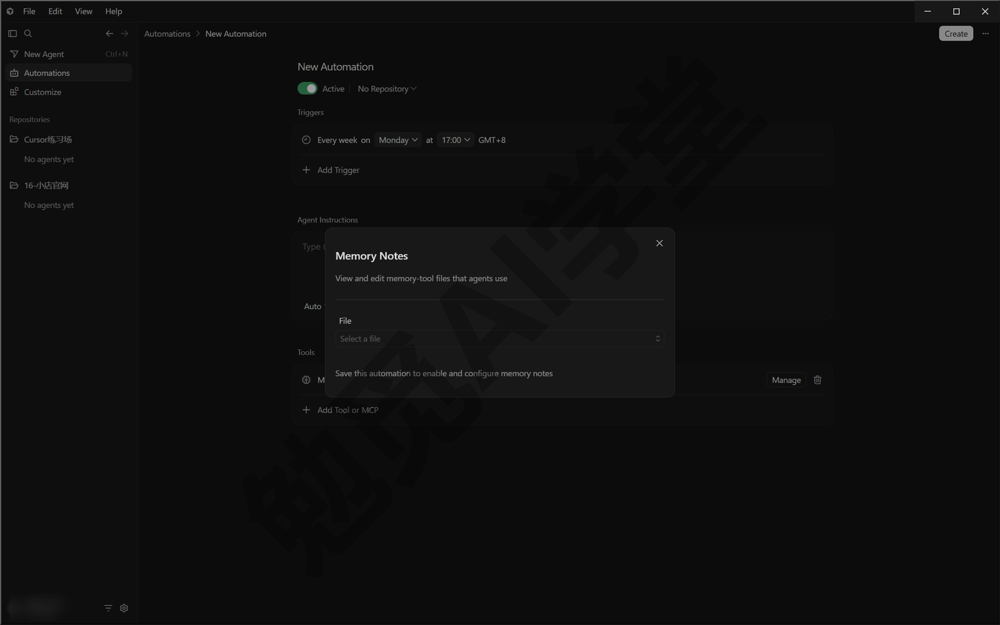

**三个托管智能体，认识就行。** 自动化页面里还有三个 Cursor 官方托管的智能体，不用你写提示词，按需开启即可：

- **Bugbot** ——《Git、GitHub 与代码审查》里见过：盯着拉取请求自动找 bug 和代码质量问题的审查服务；个人付费套餐即可用，前提是连接了仓库，并且只审你本人开的拉取请求（以账号页面与实际界面为准）。
- **安全智能体** —— 审查拉取请求、扫描代码库，专找安全漏洞。
- **拉取请求路由与批准** —— 把拉取请求分给合适的评审人，低风险的改动可以代为批准。

它们相当于官方替你写好、托管好的三条现成自动化。普通用户现在不用开；知道有这三项，等到自己的项目需要代码审查时，再回到这一节按名字找它们就可以。

### 15.4 先在对话里调完美，再固化

这一节没有新按钮，讲的是用自动化的正确顺序——也是这门课最值得记住的原则之一：先在对话里把任务调到完美，再固化成自动化。

**为什么直接固化会翻车。** 你在对话里干活时，结果不对可以当场纠正：补一句话、改个方向、还原重来，损失不过几分钟。自动化没有这张安全网——它在云端独自运行，你不在场，一条没调好的提示词不会只错一次，而是按日程把同一个错误重复下去：每周一早上准时生成一份格式混乱的周报，顺带扣一次用量；等你两周后想起来去看运行记录，同样的错已经原样犯了两遍。还有一点容易被忽略：云端环境和你的对话环境并不完全相同——自动化每次运行都从头开始，没有你在旧对话里补充过的那些上下文，也没有你随手纠正的机会。一条在对话里都没跑通的提示词，到了云端只会表现得更差。所以，**永远不要把一条没跑通的提示词直接做成自动化**。

**第一遍，当普通任务手动跑。** 把打算自动化的任务，先按普通任务在对话里发出去，看结果。第一遍多半不完美：格式不对、范围划得太大、漏了某种少见的情况。这时候要改的是提示词，而不是只把这一次的结果修好——把你口头纠正的每句话都合并回提示词里，比如“摘要不超过五行”“只看 docs 目录，别动其他文件”“没有新内容就直接说没有”。合并之后，新开一个对话，把新版提示词从头再发一遍。注意是新开对话，不是在旧对话里补一句“重来”：自动化每次运行都是全新开始，不带任何旧对话的记忆，只有新对话和它真正运行时的起点一样。

**调到什么程度算“完美”。** 标准不是“跑对过一次”，而是三条同时做到：连续两三次全新对话都给出稳定的结果，全程不需要你中途插话；生成的格式每次一致，拿到手不用再手工修；提示词里写清了“什么情况不该动”，条件不满足时它会直接结束，而不是硬找活干。到这一步，你口头补充过的要求已经全部写进提示词，这条提示词才可以拿去固化。

**固化，然后盯住前几次运行。** 把最终版提示词原样搬进 /automate 或新建表单，配上触发器和工具，保存激活。拿 15.2 那条周报自动化举例，在对话里调完之后，固化指令会变成这样——比初版多了行数上限和“什么都不做”的线，都是试跑时补进来的：

```
/automate 每周一早上 9 点，把这个仓库过去一周的提交整理成一份中文摘要，
不超过十行，按“新功能／修复／其他”分组；一周内没有新提交就什么都不做；
摘要写进 docs/weekly/ 目录并开一个拉取请求。
```

第一次自动运行不要放着不管：到点后打开运行记录逐条看——有没有在预期时间启动、读的是不是预期的仓库和分支、生成的格式和对话里调好的那版是否一致、有没有多做提示词之外的事。前两三次运行都对，这次交接才算完成；发现偏差就回到对话里重新调，调好再把自动化里的提示词更新成新版。自动化不是设置好就永远不用管的东西，它只是把“执行”交了出去，头几轮的“验收”仍然归你。

**哪些任务值得走这套流程。** 判断很朴素：同样的任务重复做过三次以上、判断标准能写成文字、晚几分钟也没关系的，值得固化——周报、日报、定期检查、拉取请求的例行审查都是典型的例子。反过来，一次性的任务、需要你现场拍板的任务、错一次代价很大的任务（动真实账单、对外发消息），留在对话里做，人在场比自动化可靠。

这条原则在《实战二：家庭账单月报流水线》会有完整示范：先在对话里把账单流水线调到每次算出来的数字都对得上，再考虑做成每月自动运行的任务。

### 15.5 钩子：流程节点上的自动脚本

**钩子是什么。** 钩子（Hooks）是挂在智能体工作流程固定节点上的自动脚本：会话开始时、每次要跑命令之前、每次改完文件之后……走到这些节点，Cursor 就自动执行你配置的脚本。脚本可以只旁观记录，也可以拦下操作，或者改变它接下来要做的事。它和自动化的分工是：自动化决定什么时候开工，钩子负责干活过程中每一步的关卡。

**节点分三类，认识即可。** 官方把能挂钩子的位置分成三类。最常用的一类在智能体会话里：会话开始与结束、每次调用工具前后、读写文件前后，都能挂上脚本。第二类跟着 Tab 补全走——《编辑器三件套：Tab、内联编辑与扩展》讲过的打字灰字建议也会读写文件，这类节点就是给它单独设的关卡。第三类在会话之外，比如每次打开工作区时触发一次，常用来做开工前的准备。你不需要背这张分类表，记住一句就够：智能体的关键动作前后，都能加上你的检查。

**它能干什么。** 官方文档给的典型用途里，三类最有代表性：

- 改完文件自动排版——比如每次智能体改过代码，就自动运行一遍格式化工具（把代码整理成统一缩进和风格的工具）。
- 自动扫描敏感内容——检查文件里有没有混进密码、密钥、个人信息这类不该外泄的东西。
- 危险操作先拦截——比如凡是要往数据库写东西的命令，先拦下来要求人工确认。

除这三类之外，钩子还能在会话开始时自动加进固定的背景说明、把智能体每一步动作记录下来供事后分析、控制子智能体（《子智能体、并行与工作树》讲过的分工助手）的调用——这些偏团队和进阶场景，知道有这些就行。

**它配置在哪。** 钩子写在 hooks.json 文件里：项目级放在项目的 .cursor 目录下，跟着项目走；用户级对你的所有项目生效；也可以随插件一起装——《插件、市场与 MCP》讲过，插件、规则、技能这些自定义能力都在 Cursor 设置里分页管理，钩子占的是其中的 Hooks 页。项目里配了钩子的话，云端智能体干活时同样会读取并执行仓库根目录下的 .cursor/hooks.json。从 Claude Code 这类其他工具带过来的钩子配置，Cursor 也能识别并使用（细节以官方文档为准）。

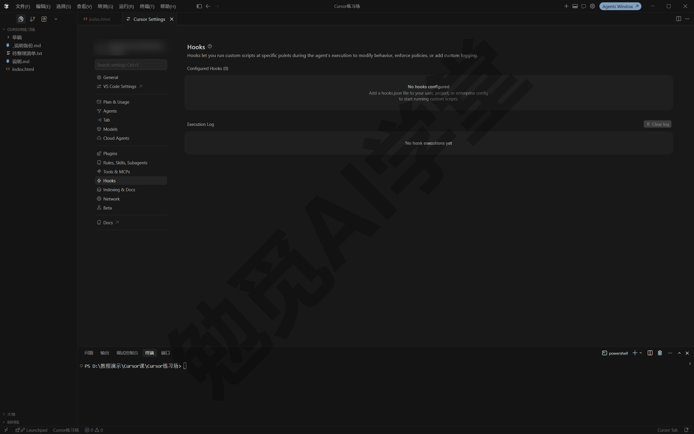

**不想手写，让它自己写。** 内置技能 /create-hook 可以按一句话描述生成钩子并更新 hooks.json，比如：

```
/create-hook 每次智能体修改过 .md 文件之后，自动检查文中有没有手机号或邮箱，
发现就在对话里提醒我。
```

**钩子现阶段不用自己写。** 钩子本身是要在你电脑上运行的脚本，写它需要一点编程基础。现阶段你只需要知道三件事：有这么一层机制存在；它配置在 hooks.json、能在设置的 Hooks 页看到；装别人的插件时如果带钩子，先弄清它在哪个节点跑、跑的是什么——那是一段会自动执行的代码，要多看一眼。等你有了具体需要（比如每次改完文档自动做某项检查），再回来用 /create-hook 也不迟。

### 15.6 命令行 CLI

**是什么、什么时候用。** 命令行版 Cursor（Cursor CLI）是没有图形界面的智能体：跑在终端里，一问一答全是文字。三种场景用得上：

- 远程服务器上没有图形界面，只有终端，装个 CLI 就能用智能体。
- 想在脚本或定时任务里调用智能体，它有专门给脚本用的模式，不需要人在旁边一问一答。
- 你就是偏好全键盘操作。

给零基础读者的定位：桌面端仍是主力。这一节的目标是装得上、开得起来、会用三种模式、会把任务移交云端——知道这条路存在，需要时走得通。

**第 1 步：安装。** 打开 PowerShell（开始菜单搜索 PowerShell 回车），粘贴这一行并回车：

```
irm 'https://cursor.com/install?win32=true' | iex
```

这行命令的意思是从 Cursor 官网下载安装脚本并立即执行（irm、iex 是 PowerShell 自带命令的缩写）。这类“下载完立刻执行”的命令只对你确认过的官方网址使用，别处看到的同类命令不要照抄。macOS、Linux 和 WSL（Windows 里的 Linux 子系统）用户改用官方的另一行命令 `curl https://cursor.com/install -fsS | bash`，效果相同。

装完后**新开一个终端窗口**（让系统刷新命令路径），验证：

```
agent --version
```

能打出版本号就装好了。如果提示找不到 agent 命令，先确认新开过窗口；还不行，按安装输出里的提示把安装目录加进 PATH（系统的命令搜索路径）。

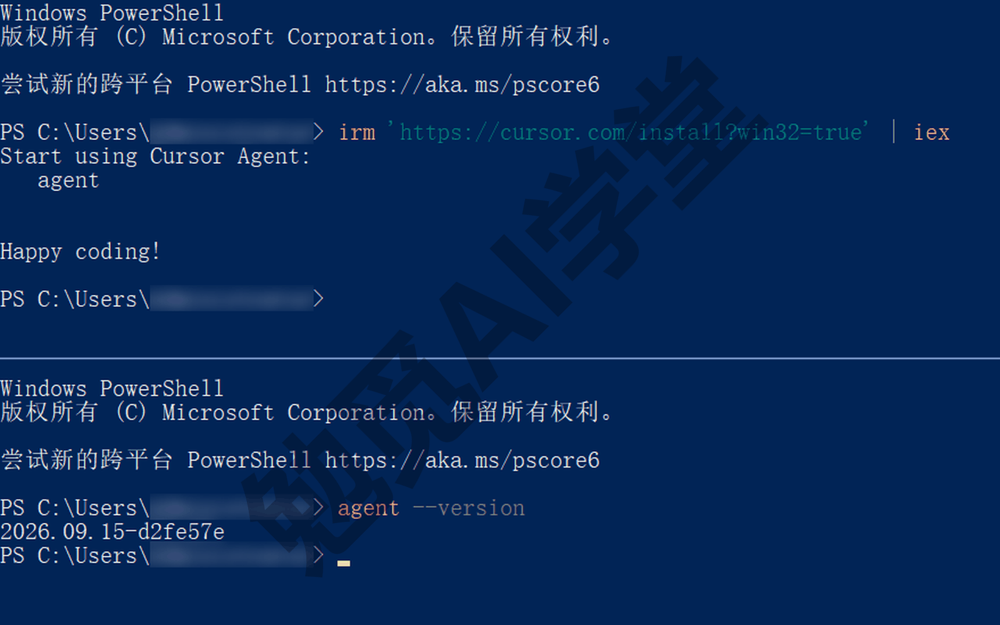

**第 2 步：打开与登录。** 输入 `agent` 回车进入交互界面；首次使用会引导你登录 Cursor 账号，按提示完成即可（登录方式以实际界面为准）。登录回来后，第一次在某个文件夹里打开它时还会多问一步：是否信任这个目录（界面上叫 Workspace Trust Required），按 a 选择信任再继续；同一个文件夹下次再打开就不问了。之后你会看到一个极简的对话界面：下方是输入框，上方是回答和执行过程。

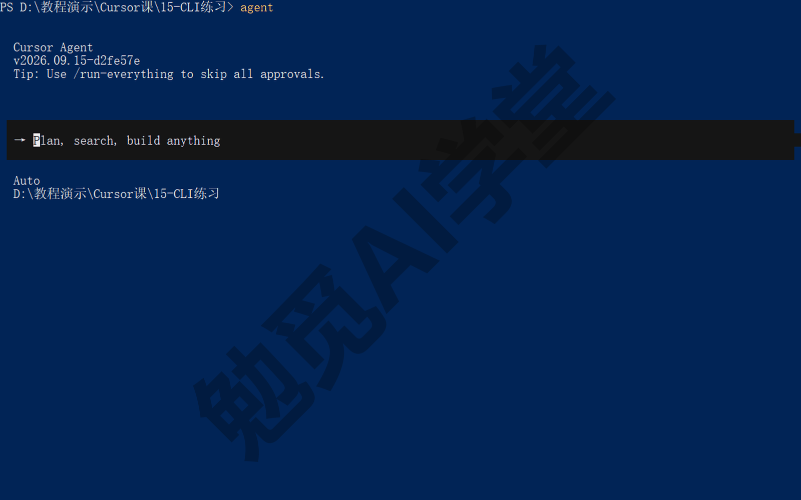

**第 3 步：像在桌面端一样下任务。** 直接输入任务回车，或者启动时就带上：

```
agent "把这个文件夹里的 txt 笔记按主题归进子文件夹，先列计划给我确认"
```

它要跑终端命令时会请求批准，按 y 同意、n 拒绝——这就是 CLI 版的审批（《权限、沙盒与模型》讲过的那套审批规则，换成了文字形式）。输入 @ 可以选文件进上下文；想看它改了什么，按 Ctrl+R 逐文件翻看改动；上下文快满了用 /summarize 压缩。

**三种模式，Shift+Tab 轮换。** CLI 支持和桌面端同一套模式：Agent（动手干活）、Plan（先想清楚再动）、Ask（只读不改）。按 Shift+Tab 在三种模式之间轮换，也可以用 /plan、/ask 直接切换。《计划、提问与调试三模式》定下的用法在这里同样适用：大任务先切到 Plan 把方案聊清楚，看不懂的项目先用 Ask 把情况问清楚。

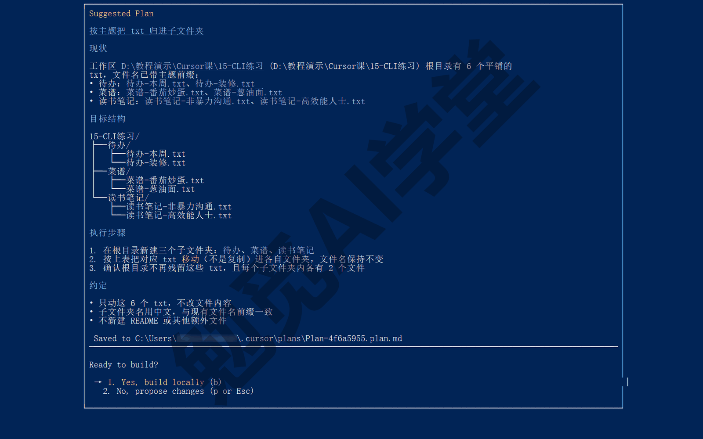

**把任务移交云端：消息前加 &。** 任务太长不想守着终端，在消息最前面加一个 & 发出去，这个任务就交给云端智能体接着跑。你可以关掉终端，回头在 cursor.com/agents 网页或手机 App 里接着看——《云端智能体与手机端》讲过的云端任务列表，CLI 也能直接把任务送过去。

```
& 把 docs 文件夹里的三篇草稿统一排版，改完开一个拉取请求
```

**关掉终端也让它继续：agent persist（了解即可）。** CLI 还提供持久会话：用 `agent persist` 启动的会话，任务运行中可以离开（/detach），会话继续在这台电脑上跑，之后用 `agent persist attach` 接回来（命令与表现以实际版本为准）。它和 & 的区别在跑的位置：persist 还是在你这台电脑上跑，只是不用一直盯着终端窗口；& 是把任务搬到云端电脑上跑。现阶段不用去试它；知道有 persist 这个能力，等以后需要关掉终端也让任务继续跑时，再回来按这条命令用就可以。

**更新与配置互通。** CLI 默认自动保持最新，手动更新用 `agent update`；上次聊到一半的对话，用 `agent resume` 接着聊。它和桌面端用的是同一套配置：mcp.json 里配的 MCP、.cursor/rules 里的规则、项目根目录的 AGENTS.md，CLI 全都读。给命令加 `-w` 还能让改动发生在独立的工作树里（《子智能体、并行与工作树》讲过的隔离副本），实验性改动不影响当前目录。

**CLI 的常见坑。** 最常见的有三个：

- **装完找不到 agent 命令**：新装的命令旧终端认不到，先新开一个终端窗口再试。
- **安装被公司电脑拦下**：安全策略可能拦截“下载完立刻执行”这种安装方式，换一台机器装，或联系管理员放行。
- **界面是英文**：CLI 目前以英文为主（以实际界面为准），看不懂的提示复制给桌面端的 Cursor 问一句就行。

### 15.7 自己跟上迭代

**为什么要自己跟着更新。** 这门课以 3.7.42 版为例，而官方版本号已经推进到 3.20 以上——Cursor 几乎每周都在更新。学完这套课之后，你一定会遇到界面挪了位置、按钮换了名字、冒出新功能的时刻。这一节给你四样东西，到时候不慌。

**更新日志怎么读。** 官方更新日志在 cursor.com/changelog，每个版本一条记录：版本号、发布时间、这一版新增了什么、改了什么、修了什么。建议的读法：

1. 先扫标题和小节名，找和你常用功能相关的条目——本课 20 篇的篇名就是现成的功能分类清单（智能体、规则、技能、云端、自动化……），对着找就行。
2. 看到新名词不要跳过，去官方文档站搜一下，多数新功能都会同步出文档页。
3. 新功能常常分批开放（rolling out）。日志里说有而你界面里没有，等几天或试试新开对话，不必怀疑自己装错了。

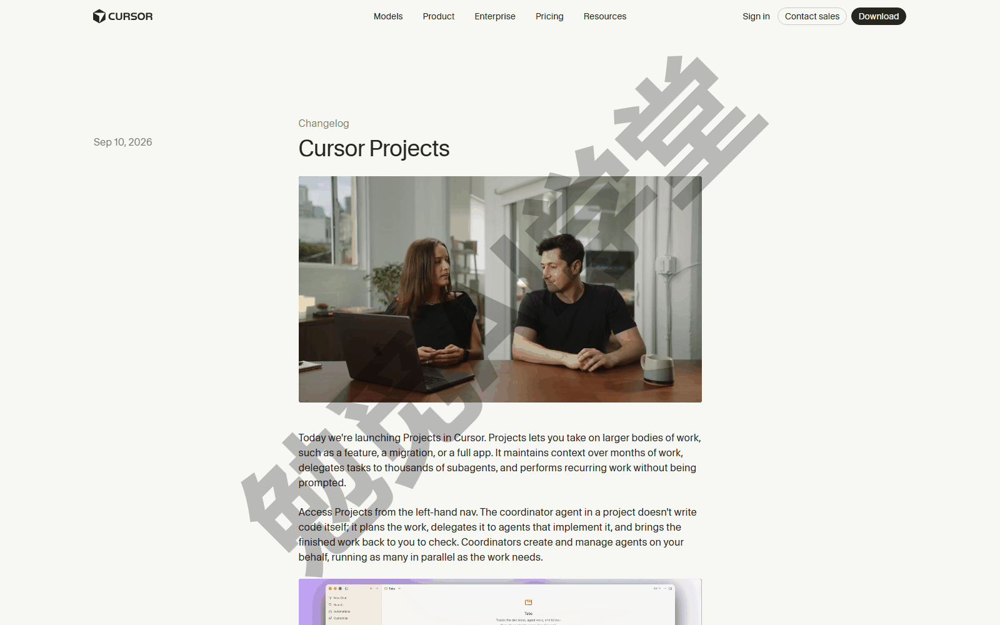

**拿一条真实变化练一次读法。** 举一个最近真实发生过的变化：运行模式的旧选项“每次都问”从 3.5 起取消，3.6 起“自动审查”成为推荐默认，现在是自动审查、白名单、全部运行三档。老教程里的截图和名词从此对不上新界面，就是这类变化造成的。假如你在更新日志里看到“运行模式”相关的条目，处理办法是：先回《权限、沙盒与模型》把规则对一遍——那一篇讲过三档各自会怎么做；再打开设置核对你当前用的档位。名词会变，但“先分类、再审批”这套做法通常还在。读更新日志时看的是机制，比背名词可靠。

**更新渠道与版本号。** 更新渠道有两档：Default（默认，只收稳定版更新，推荐）和 Nightly（尝鲜版，页面说明里叫它 Early Access，新功能先到，但还没正式发布的版本可能不稳）。渠道在 Cursor 设置的 Beta 页里切换，选项名叫 Update Access。

当前版本号在编辑器菜单栏的“帮助 → 关于”里查看；想手动触发更新，按 Ctrl+Shift+P 打开命令面板（《两套界面全导览》介绍过的全局命令搜索框），输入 Cursor: Attempt Update 回车，按提示重启即可。更新下载好之后，帮助菜单里会多出一项“重新启动以更新”，代理窗口左下角也会出现一个 Update 按钮，点哪个都行。

命令行版的版本号则用 `agent --version` 查看，15.6 里装完验证用的就是它；CLI 的更新节奏和桌面端各自独立，默认自动保持最新。

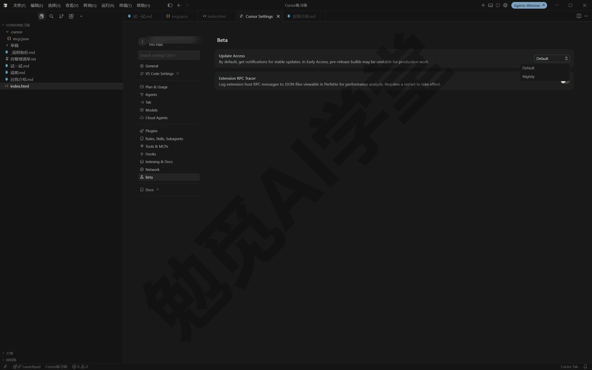

**中文文档站。** 官方文档有中文站：cursor.com/cn，功能文档和帮助问答都有中文版（站内结构以实际页面为准）。读更新日志遇到新名词、想确认某个功能的官方说法，先来这里查。

**界面对不上号怎么办。** 分三步：以你自己看到的为准，教程和文档都可能落后于产品本身；用功能的名字（而不是位置）去命令面板和文档站搜；实在找不到，翻最近两三个版本的更新日志，看它是不是被改名或移动了位置。另外，从最近几个版本的更新节奏看，变化最勤的是三块：运行模式与审批、技能与斜杠菜单、云端与自动化。更新后发现哪里不对劲，优先回这三块功能核对——本课对应《权限、沙盒与模型》《技能与自定义模式》和本篇。

### 15.8 三个练习任务

下面三个任务把本篇的三块能力各练一遍。提示词里方括号的内容换成你自己的。

**任务一：建一个每日摘要自动化**

```
/automate 每天早上 9 点，把 [你的仓库名] 过去 24 小时的提交整理成
不超过五行的中文摘要，存进 notes/ 文件夹并开一个拉取请求。
```

完成标准：自动化列表里出现这一条，而且状态为启用；到点后能在运行记录里点开第一次运行，看到摘要文件和拉取请求；如果账号里找不到自动化入口，先确认套餐（以账号页面为准）。

**任务二：在 CLI 里用计划模式做一次小改动**

装好 CLI 后，在你的练习文件夹里打开终端，运行 agent，按 Shift+Tab 切到 Plan 模式，发送：

```
把这个文件夹里的所有 txt 文件按主题归进子文件夹。先给我计划，等我确认再动手。
```

完成标准：终端里先出现整理计划；你确认后它才动手；过程中每条要跑的命令你都看过审批提示；最后文件确实归了类。

**任务三：把重复了三次的事写成 /loop**

回到桌面端，在对话里发送：

```
/loop 每 30 分钟检查一次 [你的截图文件夹路径]，把新增的图片按内容改成中文名，
并移动到“已归类”子文件夹；没有新增就什么都不做。
```

完成标准：对话里出现循环任务开始的确认；半小时后回来能看到它跑了一轮；关掉 Cursor 或合上电脑后它不再运行——顺便验证了 15.1 讲的 /loop 与云端自动化的分工。

### 15.98 本篇小结与自检

这一篇讲了自动化（定时或事件触发的云端智能体）、钩子（流程节点上的自动脚本）和命令行 CLI，最后给了跟上产品迭代的四样东西：更新日志、更新渠道、版本号入口和中文文档站。

可以对照下面的清单检查学习结果：

- [ ] 能说出自动化和本地 /loop 的分工：一个跑云端、接外部事件，一个跑本地、临时重复
- [ ] 建过一个自动化，知道触发器、提示词、工具、仓库、保存激活五步各是什么
- [ ] 知道去哪看运行记录，会暂停和删除一个自动化
- [ ] 能讲出记忆 MEMORIES.md 的用途，以及处理外部输入时的风险
- [ ] 能复述“先在对话里调完美，再固化”的三步
- [ ] 知道钩子这层机制的存在、配置在 hooks.json、能用 /create-hook 生成
- [ ] 用 PowerShell 一行命令装好了 CLI，会开对话、会切换三种模式、会用 & 移交云端
- [ ] 知道更新日志、更新渠道、版本号、中文文档站分别在哪

完成这些内容后，功能篇就全部结束了——两套界面、四种模式、规则与技能、并行协作、云端与自动化，工具都已经配齐。接下来五篇进入完整项目实战。下一篇《实战一：小店官网》从一家社区茶铺的建站需求开始，把计划模式、AGENTS.md、本地预览、两轮真实迭代和上线发布串成一条完整的流程——那也是你第一次看到这些功能在同一个项目里一起用上的样子。

### 15.99 新手常见问题

**Q1：自动化运行时我的电脑必须开着吗？**

不用。自动化跑在 Cursor 的云端电脑里，你的电脑关机、Cursor 没开都不影响。需要电脑开着的是本地运行的两样：/loop 循环和 agent persist 持久会话都跑在你自己的机器上。

**Q2：自动化会一直扣用量吗？**

按运行次数计：每次触发产生一次云端智能体运行，按所选模型的云端用量计费，没触发就不扣。控制成本有三个办法：把触发频率定得保守一点，先每周再每天；提示词里划清“什么情况不该动”，让不满足条件的运行尽早结束；定期看运行记录，发现它空跑（跑了一次却什么都没做）就收紧触发条件。具体计费规则以账号页面显示为准。

**Q3：我没有代码仓库，能用自动化吗？**

能。仓库设置里选“无仓库”，自动化照样能按日程跑、接 Slack 和 Webhook 事件、调用 MCP 工具——只是不能改代码、开拉取请求。想让它管你的文档项目，也可以把文档文件夹做成一个私有仓库推到 GitHub（《Git、GitHub 与代码审查》讲过做法），就能用上全部能力。

**Q4：钩子我现在需要学吗？**

不需要。钩子本身是脚本，是给有编程基础的人用的。你现在只需要知道它的存在和位置：智能体流程的固定节点上可以挂自动检查，配置在 hooks.json，设置的 Hooks 页能看到。真有需要时，用 /create-hook 让它替你写。

**Q5：CLI 和桌面端功能一样吗？**

核心是一样的：同一个账号、同一套模式（Agent／Plan／Ask）、同一份规则、技能和 MCP 配置，CLI 都认。差别在怎么显示：CLI 没有图形界面的差异视图、内置浏览器和设计模式，看改动要靠终端里的文字。日常主力仍建议用桌面端，CLI 留给服务器和脚本场景。
