## 认识 Git 与装好

这一篇做两件事：先讲清 Git 是什么、它和 GitHub 是什么关系、一个不写代码的人为什么也值得学它；然后把 Git 装到你的 Windows 电脑上，做好几项一次性的配置，学会在终端里敲最少的几条命令，最后亲手完成第一次“存档”。读完这一篇，你的电脑上会有一个已经在被 Git 记录的文件夹，后面每一篇都在它上面继续。

这里顺便说明课程的一个做法：本课程走零成本主线，每篇开头都会交代这篇的实操内容需不需要花钱。这篇文章的实操内容不需要花钱：Git 是免费的开源软件，安装与配置都不收费，本篇也还不需要 GitHub 账号。

**先说学 Git 能得到什么。** 如果你学过前面的 Codex 课或 Cursor 课，已经习惯了让 AI 工具替你改文件：改一份文稿、调一个网页、整理一批笔记，几分钟就能动几十处。这带来一个以前没有过的问题：文件夹里的东西变得太快，快到你自己都记不清哪一处是什么时候改的、为什么改、改之前是什么样子。Git 解决的就是这一件事。它给一个文件夹记下每一次“存档”，每次存档都保留当时全部文件的完整内容和你写的一句说明，之后随时可以翻看、比较、倒回。

**它能给你三样东西。** 第一样是永久的后悔药。AI 工具自带的撤销和检查点只管一次对话，关掉之后往往就用不了了；Git 的记录存在你的电脑上，和用哪个工具无关，只要存过档，一周后、一年后都还能回到那一刻。让 AI 做大改动之前先存一次档，改坏了就倒回去，代价只是一条命令。第二样是看得见的改动。让 AI 改完之后，一条命令就能列出它到底动了哪几个文件、哪几行，你可以先看清再决定要不要留。第三样是一份带历史的备份。把文件夹放到网上一份（怎么放，《GitHub 与远程仓库》会讲），电脑坏了、换电脑了，取回来的是完整的历史，每一版都在；网盘通常只同步文件现在的样子，历史版本要么没有，要么只保留有限的几份。

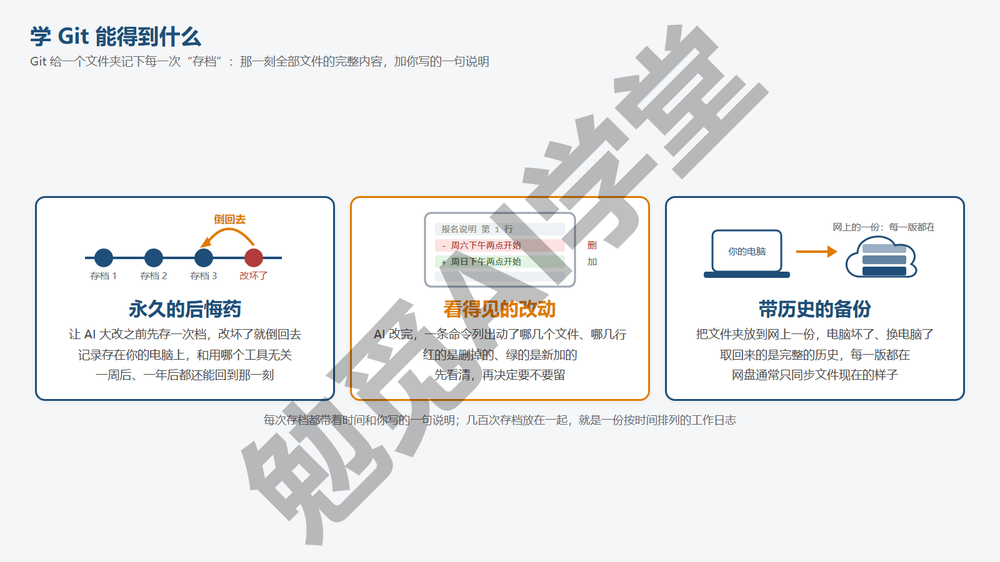

**记录本身也有用。** 每次存档都带着时间和你写的那句说明，几百次存档在一起，就是一份按时间排列的工作日志。想知道上个月改了什么、某一段是哪天删掉的、为什么删，翻这份日志就行，比在文件夹里凭文件名和修改时间猜可靠得多。

**很多工具背后用的都是它。** 你在 Cursor 里看到的源代码管理面板、GitHub 网站、Obsidian 里的 Git 插件，用的都是同一个 Git；本课先教你在终端里亲手敲，学会之后这些工具你都能看懂，出了问题也知道该往哪里查。反过来，只会点某一个工具的按钮，换个工具就要重学，工具出了错也不知道它到底做了什么。全世界做软件的人也是用它一起改同一份东西的，前面的课里装过的社区技能、模板、小工具，多半都放在 GitHub 这类网站上（GitHub 是什么，1.2 节讲）。学会看懂那样的页面、把东西取到自己电脑上、必要时给别人提一处修改，能拿到的资源和能参与的事会多很多。

**学它的代价很小。** 装好之后在本机就能用，不需要联网，也不需要注册任何账号，本课前五篇只用你自己的电脑。日常用到的命令不多，本课会一条一条带你在终端里敲，每一条都先说它做什么、敲完会看到什么；图形界面和 AI 工具也都能替你敲这些命令，《图形界面与 AI 工具里的 Git》会讲怎么让它们代劳。

### 1.1 版本管理是什么

先看一个你大概经历过的场景。一份要交给别人的文档，改了几轮之后，文件夹里躺着“方案.docx”“方案_改.docx”“方案_改2.docx”“方案_最终版.docx”“方案_最终版_真的最终版.docx”。哪一版是真正最新的，只能靠文件名和修改时间猜；如果想知道第三版比第二版到底改了哪几句，只能把两个文件都打开、肉眼对着看；如果发现两周前删掉的一段其实还有用，多半已经找不回来了。

问题出在：文件夹只保存“现在的样子”，不保存“它是怎么变成现在这个样子的”。**版本管理** 要解决的就是这件事。你可以把它理解成给一个文件夹记账：每当你觉得“改到这里是一个可以交代的状态”，就记一笔；账本里存着这一刻文件夹里每个文件的内容，以及你写的一句说明。之后任何时候，你都能翻账本看每一笔改了什么，也能把整个文件夹或某一个文件倒回到任意一笔的样子。

Git 就是目前最通用的一套版本管理软件。它由 Linux 的作者在 2005 年写出来，如今几乎所有的软件项目都用它管理源代码，但它管理的对象其实就是“文件夹里的文件”，并不要求这些文件是代码。一份用 Markdown（一种纯文本的写作格式）写的课程文稿、一个个人网站的网页文件、一个 Obsidian 笔记库，都是文件夹，都可以交给 Git 记账。

这里先认识两个术语，之后会反复出现，现阶段只需要看懂、不必专门去背。被 Git 记账的那个文件夹，叫**仓库**（repository），有时也简称“repo”；记的每一笔账，叫一次**提交**（commit）。这个词既是动作（“提交一次”），也是记录本身（“这次提交改了三个文件”）。你可以把一次提交理解成游戏里的一个存档点：存的时候写一句“打完第三关”，之后随时可以读档回到那一刻。

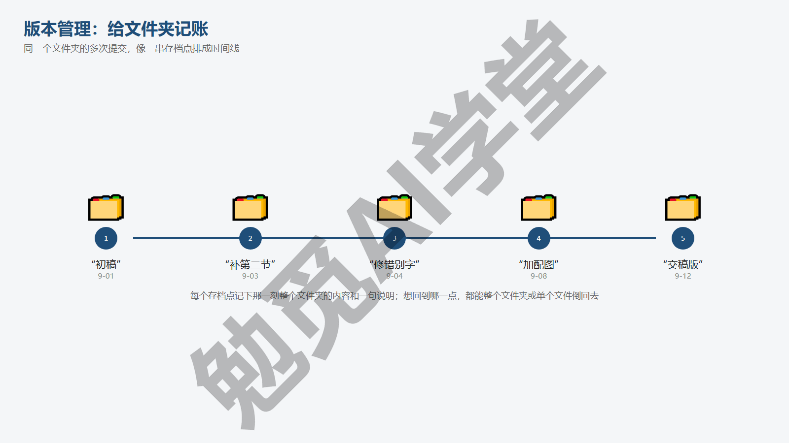

每一次提交里存了四样东西：这一刻文件夹里全部文件的内容、是谁提交的、什么时候提交的、以及你写的那句说明。注意第一样是“全部文件的内容”，也就是一张完整的快照，而不只是“比上一次多改了什么”，所以倒回任意一次提交时，Git 不需要从头一层层推算，直接把那张快照拿出来就行。你可能会担心每次都存全部文件会不会很占空间：不会，Git 对没有变化的文件只保存一份、多次提交共用，一个几百次提交的文稿仓库通常也只有几 MB。

版本管理和“复制一份改名备份”比，多出来的不只是整齐。它能算出任意两次提交之间的差异，所以能回答“这两版之间到底动了哪几行”；它把说明和内容存在一起，所以翻历史时看到的不是一串文件名，而是一段有前因后果的日志；它还能同时保留几条并行的修改线（后面《分支与合并》会讲），这是靠复制文件夹做不到的。

### 1.2 Git 与 GitHub 不是一回事

很多人第一次听到这两个词是一起听到的，容易当成同一样东西。它们的关系是：Git 是装在你自己电脑上的一个软件，GitHub 是一个网站。

**Git 在你的电脑上工作，不需要联网。** 装好之后，记账、翻历史、倒回旧版本，全部在本机完成。没有网、没有账号，Git 照常能用。本课前五篇的所有内容都只用到你自己的电脑。

**GitHub 是放仓库的网站。** 当你想把电脑上的仓库再存一份到云端做备份、想换一台电脑接着改、或者想和别人一起改同一个仓库时，就需要一个所有人都能访问的地方来放它，GitHub 是其中最大的一个。它由微软运营，个人使用基本功能是免费的，具体开放范围以账号页面显示为准。类似的网站还有 GitLab、国内的 Gitee 等，概念完全相同，只是界面和按钮位置不同，本课只讲 GitHub。

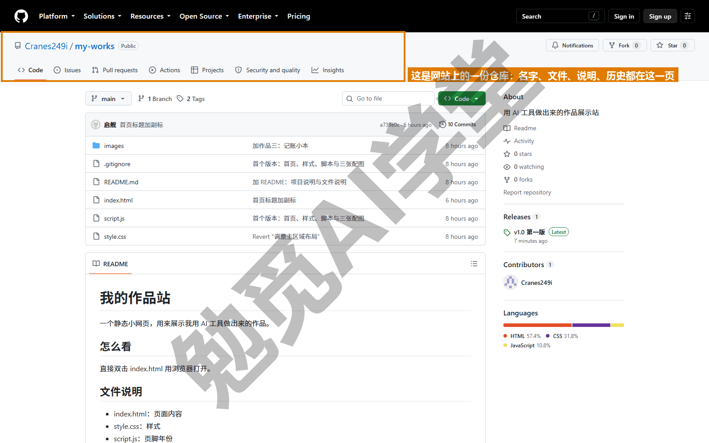

一个常见误解是“不用 GitHub 就没法用 Git”。恰恰相反，本课的顺序是先把 Git 在本机用熟（第 1～5 篇），到《GitHub 与远程仓库》才注册账号、把仓库推送到网上。如果你暂时不想注册任何账号，前五篇完全不受影响。

那什么时候才需要 GitHub？有三种情况：

- 想把仓库存一份到云端，万一电脑坏了或丢了也能找回来，见《GitHub 与远程仓库》；
- 想在两台电脑之间接着改同一个仓库，见《实战二：笔记与文档库的备份同步》；
- 要和别人合作，或者想把网页作品发布到网上、让别人用一个网址就能打开，见《多人协作：PR 与 Issue》与《GitHub 网页端：Pages 上线与发布》。

只在自己一台电脑上用 Git 倒回旧版本、保留历史记录的读者，可以一直不碰 GitHub。

举一个具体的例子把两者的关系串起来。你在家里的电脑上用 Git 管理一份课程文稿，一周里提交了 12 次，这 12 次记录全部存在家里电脑的 `.git` 文件夹里，GitHub 对此一无所知。周五你把仓库推到 GitHub 上，网站上就有了一份一模一样的 12 次记录。周一到了公司，用公司电脑从 GitHub 取回这个仓库，公司电脑上也有了完整的 12 次记录，你接着改、提交 3 次、再推上去；回家之后把这 3 次拉下来，家里电脑就又和 GitHub 上的那份一致了。整个过程里，真正“记账”的是每台电脑上的 Git，GitHub 只负责“把账本放在一个大家都拿得到的地方”。

另一个常见误解是“GitHub 上的仓库才是正本，电脑上的只是下载的副本”。在 Git 的设计里，每一份仓库都是完整的：你电脑上的仓库包含全部历史，GitHub 上那份也包含全部历史，两边地位平等，只是习惯上把网站那份当作大家共同对照的一份。这一点在《GitHub 与远程仓库》里会再讲透。

### 1.3 不写代码，为什么也要会 Git

Git 长期被当作程序员的工具，是因为过去只有程序员在批量修改文本文件。现在这个前提变了：你让 AI 工具帮你改文档、改网页、整理笔记，AI 在几分钟里改动的文件数量和范围，可能比你自己一周改的还多。改得越多、越快，你就越需要一份随时能倒回去的记录。下面四个场景，每一个都对应本课后面的一部分内容。

**场景一：AI 改坏了东西，怎么倒回去。** Codex 有审查面板，能把一次对话里的改动逐块还原；Cursor 有检查点，能把工作区（你正在改的那个文件夹）回退到某一轮对话之前。这两样都很好用，但它们是“临时的后悔药”：只覆盖 AI 在对话里做的改动，对话归档或者工作区关掉重开之后，往往就用不了了，你自己手动做的修改也不在它们的记录范围内。Git 的记录是永久的、和工具无关的：不管是 AI 改的还是你改的，不管用的是哪个工具，只要提交过，几乎随时能倒回去。《撤销、还原与找回》整篇讲这件事。

**场景二：备份与换电脑。** 你可以把仓库推到 GitHub 上，电脑坏了、换新电脑了，把它取回来就是完整的历史，不只是最新一版。这比网盘多出来的部分是“历史”：网盘同步的是文件现在的样子，Git 存的是每一次提交。两者可以配合用，但分工不同，《实战二：笔记与文档库的备份同步》会专门讲怎么配合。

**场景三：和别人改同一份东西。** 两个人同时改一份文档，传统做法是发来发去、人工合并。Git 的做法是各自在自己的电脑上改、各自提交，然后由 Git 把两边的改动合到一起；真的改到了同一行，Git 会明确指出来让你决定。这套流程在 GitHub 上叫 PR（pull request，合并请求），是全世界做软件的人合作时通用的做法，《多人协作：PR 与 Issue》会从零讲起。


**场景四：拿到别人放在 GitHub 上的东西。** 你在 Codex 课和 Cursor 课里装过的社区技能、规则模板、桌面宠物，几乎都放在 GitHub 上；很多教程、模板、小工具也一样。看得懂一个 GitHub 仓库页面（哪里是文件、哪里是说明、哪里是历史），会把它取到自己电脑上，是在 AI 时代找资源的基本功。这部分在《GitHub 与远程仓库》和《GitHub 网页端：Pages 上线与发布》里讲。

还有一层容易被忽略的原因：AI 工具在替你干活时，经常会自己运行 Git 命令，或者建议你运行。它可能说“我先提交一下当前状态”，也可能说“需要强制推送，是否继续”。看不懂这些命令，你就只能凭感觉点“同意”。本课的一个目标，就是让你读得懂 AI 替你跑的每一条 Git 命令，知道哪些可以放心答应、哪些要先问一句为什么。《图形界面与 AI 工具里的 Git》会集中讲这一点。

### 1.4 Git 擅长什么、不擅长什么

Git 最擅长的是**文本文件**：Markdown、纯文本、网页文件（HTML、CSS）、各类代码、配置文件，以及笔记软件的 md 笔记。对这类文件，Git 不仅能存每个版本，还能具体到每一行，告诉你“这一版比上一版多了哪三行、少了哪两行”。后面你会看到，这种逐行对比是红绿两色显示的，一眼就能看出改动。

怎么判断一个文件是不是“文本文件”？用记事本打开它，如果看到的是能读的文字（哪怕是代码或标记），它就是文本文件；如果看到的是一片乱码，它就是二进制文件。按这个标准，.md、.txt、.html、.css、.csv、.json 这些都是文本文件，Obsidian 的笔记、AI 生成的网页、课程文稿都属于这一类。

对 Word、Excel、PPT、图片、音频、视频这类文件，Git 也能存，也能倒回旧版本，但它看不出“改了哪一行”，因为这些文件在磁盘上不是一行一行的文字，而是压缩过的二进制数据。对比两个版本时，Git 只会告诉你“这个文件变了”，不会告诉你变在哪。所以如果你的主要工作对象是 Word 文档，Git 仍然能当备份和存档工具用，只是“看差异”这个优势发挥不出来。

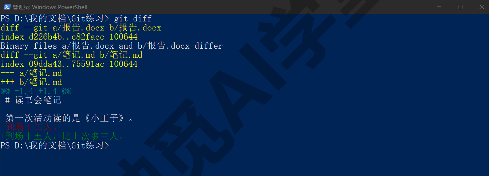

体积也是一个边界。Git 会把每个版本的文件内容都保存下来，几十 KB 的文本存一千个版本也占不了多少地方，但几百 MB 的视频每改一次就多存一份，仓库很快就会大到不好用。视频、安装包、设计软件的大体积原始文件这类东西，一般不放进仓库，具体怎么处理在《GitHub 网页端：Pages 上线与发布》里讲。

拿一个 Obsidian 笔记库当例子，看看这两条边界实际上是什么样子。库里绝大多数是 md 笔记，每篇几 KB，Git 对它们能逐行比对、存一千个版本也占不了多少地方，是最理想的对象；库里的“附件”文件夹放着截图和照片，每张几百 KB 到几 MB，Git 能存但看不出差异，只要不频繁替换，体积也可以接受；如果你往库里放了录音或视频，那就属于“能存但不该存”的一类，更合适的做法是把它们留在网盘、笔记里只放链接。所以同一个文件夹里，Git 对不同类型的文件能帮上的忙不一样：文本文件能存也能比对，小图片能存但看不出差异，大文件最好放在别的地方。《实战二：笔记与文档库的备份同步》会按这三类给出具体的忽略规则，也就是告诉 Git 哪些文件不用记。

还有最后一条边界：**Git 不是网盘，也不会自动同步。** 它只在你明确要它记账的时候记一笔，只在你明确要它推送的时候把仓库送到网上。这一点是优点，因为每一笔都是你确认过的、有说明的状态；但也意味着你要养成主动提交的习惯。Obsidian 课的《同步与备份全解》比较过官方同步、网盘和 Git 三种方案，如果你是从那里来的，可以把本课当作那篇里 Git 方案的详细版。

### 1.5 在 Windows 上安装 Git

Windows 上装 Git 用的是官方的“Git for Windows”安装包。它的安装向导页数比较多，每一页都有默认选项，直接一路点“Next”也能装好；但有两三页的选择会影响你后面的使用体验，所以这一节把每一页都过一遍，告诉你选什么、为什么、选错了以后怎么改。本节所有页面名称与默认选项都以你下载到的版本为准（需实机验证），页面顺序也可能随版本略有调整。

**第 1 步：下载安装包。** 打开 Git 官网 git-scm.com，点页面上的 Install 进入下载页，网站通常会自动识别你的系统，给出 Windows 版本的下载入口（Click here to download）；如果显示的不是 Windows，先点 Windows 标签，再在 Standalone Installer 下面点 Git for Windows/x64 Setup（64 位安装包）。下载下来是一个 exe 文件。

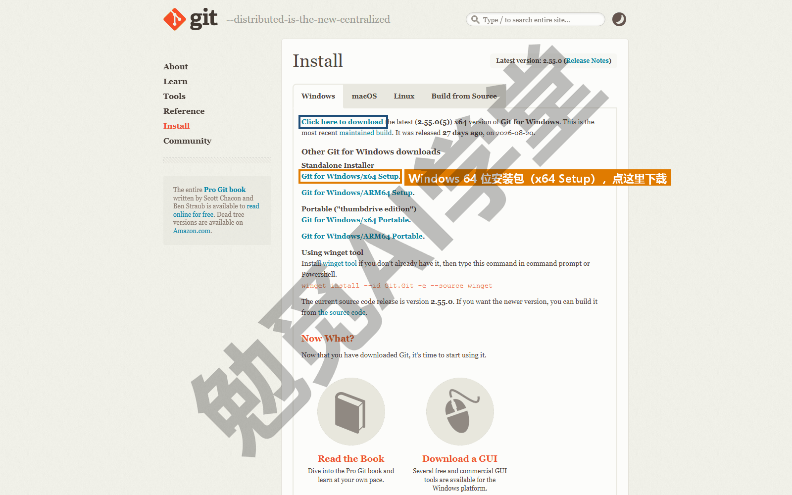

**第 2 步：运行安装包。** 双击 exe，Windows 可能弹出“你要允许此应用对你的设备进行更改吗”的提示，点“是”。接下来是许可协议页，点“Next”。

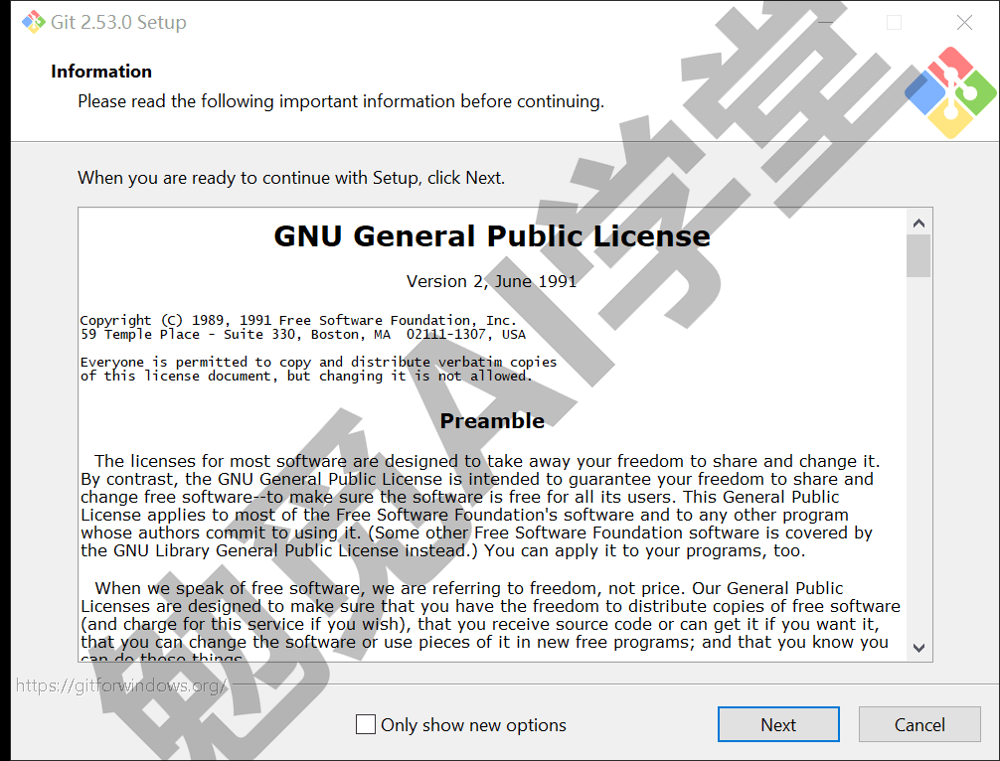

**第 3 步：选择安装位置。** 默认装在 C 盘的 Program Files 下，保持默认即可，点“Next”。

**第 4 步：选择组件。** 这一页是一串复选框，默认勾选的项目保持勾选就好。其中几项说明一下：“Windows Explorer integration”（资源管理器右键菜单集成）会在文件夹右键菜单里加上 Git 的入口；“Git LFS”是处理大文件的扩展，保持勾选就行，《GitHub 网页端：Pages 上线与发布》会提到它；“Add a Git Bash Profile to Windows Terminal”（把 Git 自带的命令行窗口 Git Bash 加进 Windows 终端）勾上也没关系；“Check daily for Git for Windows updates”（每天检查更新）勾不勾都可以。点“Next”。

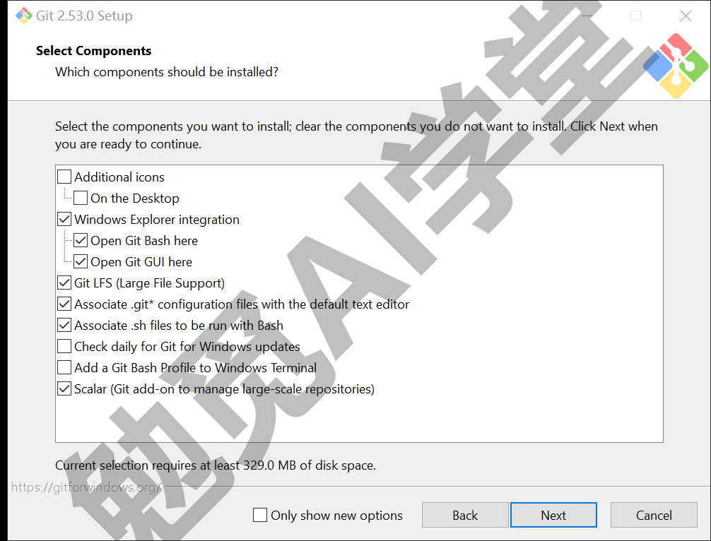

**第 5 步：开始菜单文件夹。** 保持默认，点“Next”。

**第 6 步：选择默认编辑器。** 这一页很重要。Git 在少数情况下需要你写一段文字（比如忘了在命令里带上提交说明时），它会打开这里选的编辑器让你输入。默认是 Vim，一个纯键盘操作、不熟悉的人连怎么退出都找不到的编辑器。建议在下拉框里改选“Use Notepad as Git's default editor”（用记事本）；如果你装了 VS Code，也可以选“Use Visual Studio Code as Git's default editor”。选中一个电脑上没装的编辑器时，下方的说明会变灰、Next 按钮点不了，换一项就行（需实机验证）；列表里没有 Cursor（需实机验证）。选错了以后可以用一条命令改，1.7 节会讲配置怎么改。

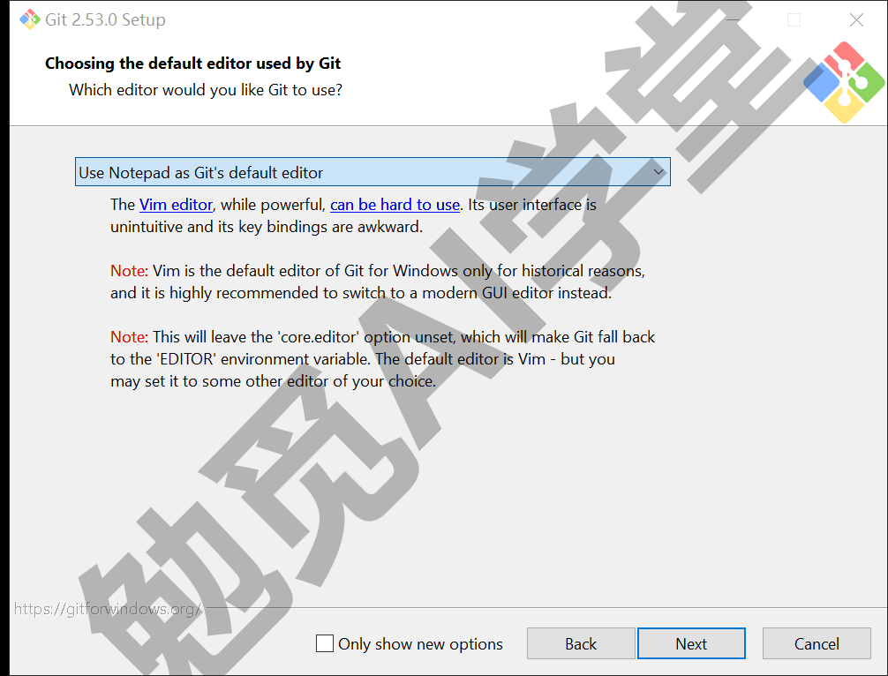

**第 7 步：新仓库的初始分支名。** 这一页问的是：以后你新建仓库时，第一条分支叫什么名字。“分支”是什么到《分支与合并》再讲，这里只需要知道：Git 传统默认叫 master，而 GitHub 和多数新项目现在都用 main，Git 官方也已经宣布会在 3.0 版本把默认名改成 main。为了少一次改名，建议选“Override the default branch name for new repositories”（覆盖默认分支名），框里填 main。如果你装的版本已经默认 main，这一页可能不再出现，或者页面上的文字和这里写的不一样，以实际页面为准。

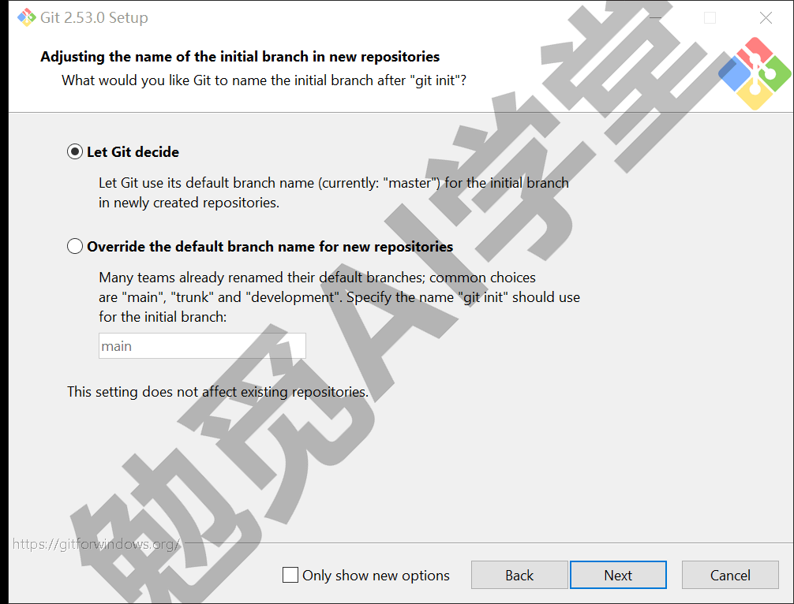

**第 8 步：PATH 环境设置。** 这一页决定你能在哪些地方敲 git 命令。三个选项里选中间那个“Git from the command line and also from 3rd-party software”（在命令行和第三方软件里都能用 Git），这也是默认项。选了第一项的话，只有在 Git Bash 里能用 git，PowerShell 里会提示找不到命令。

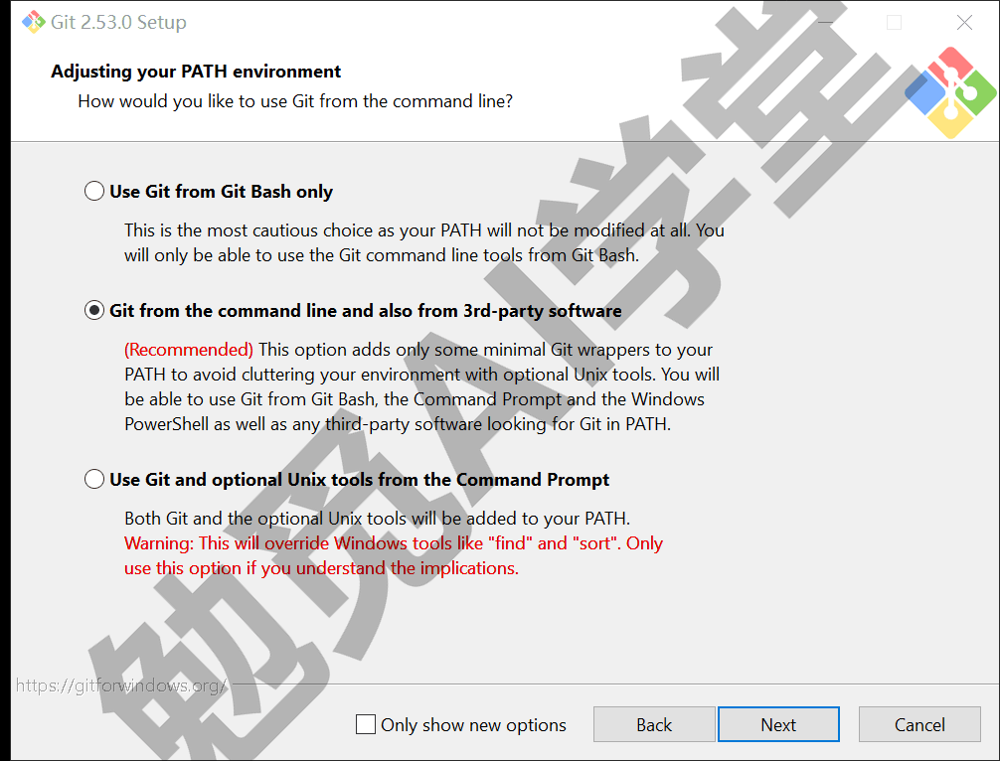

**第 9 步至第 11 步：SSH、HTTPS 传输方式、换行符。** 这三页都保持默认。SSH 页默认用自带的 OpenSSH（Use bundled OpenSSH）；HTTPS 页默认选的是 Windows 自带的安全通道（Use the native Windows Secure Channel library），旧一些的版本默认是另一项 OpenSSL，两项都能正常用；换行符页默认是“Checkout Windows-style, commit Unix-style line endings”（取出文件时转成 Windows 换行、提交时转成 Unix 换行），这一项会在你后面提交时偶尔弹出一条警告，1.7 节会解释那条警告是什么、为什么不用管。

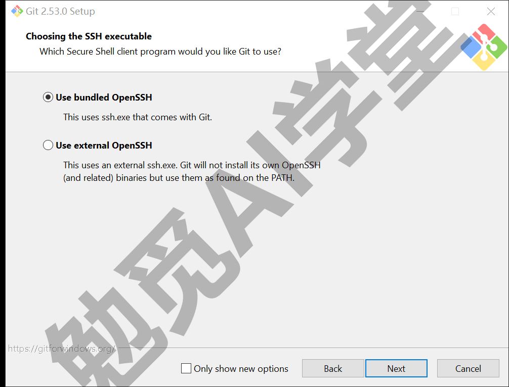

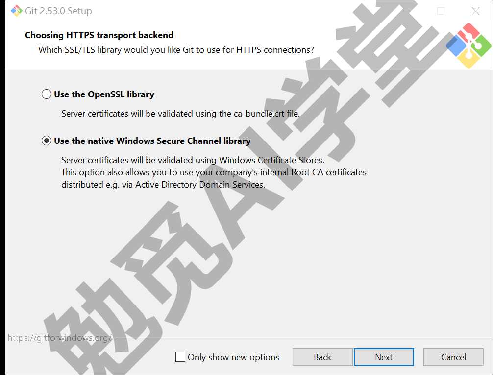

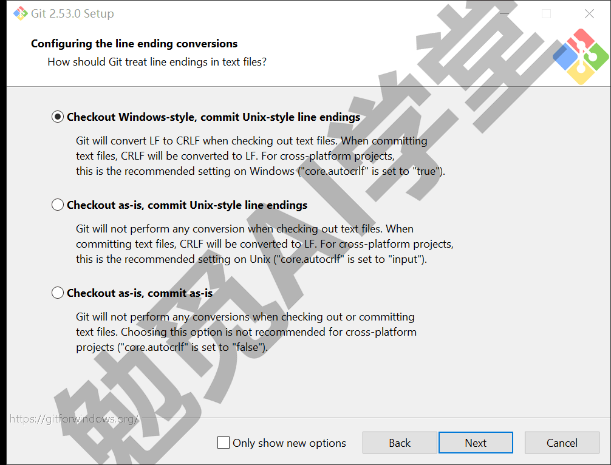

**第 12 步：Git Bash 的终端模拟器。** 保持默认 MinTTY。本课用 Windows 自带的终端，这一页的选择不影响你。

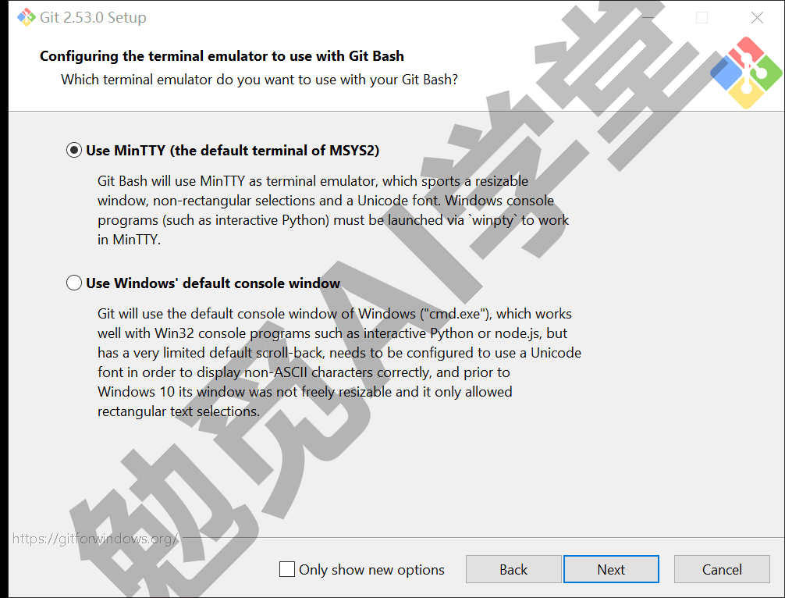

**第 13 步：git pull 的默认行为。** 保持默认的第一项（Fast-forward or merge）。这条命令要到《GitHub 与远程仓库》才用到，那时会解释这个选择意味着什么。

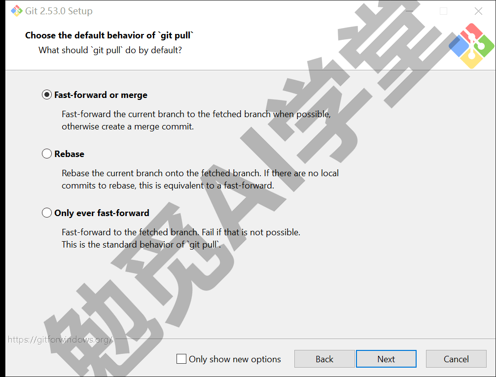

**第 14 步：凭据助手。** 保持默认的“Git Credential Manager”。它负责在你第一次向 GitHub 推送时弹出浏览器让你登录，并把登录状态安全地记住，之后就不用每次都重新登录。选了 None 的话，以后每次推送都要重新登录。（需实机验证）

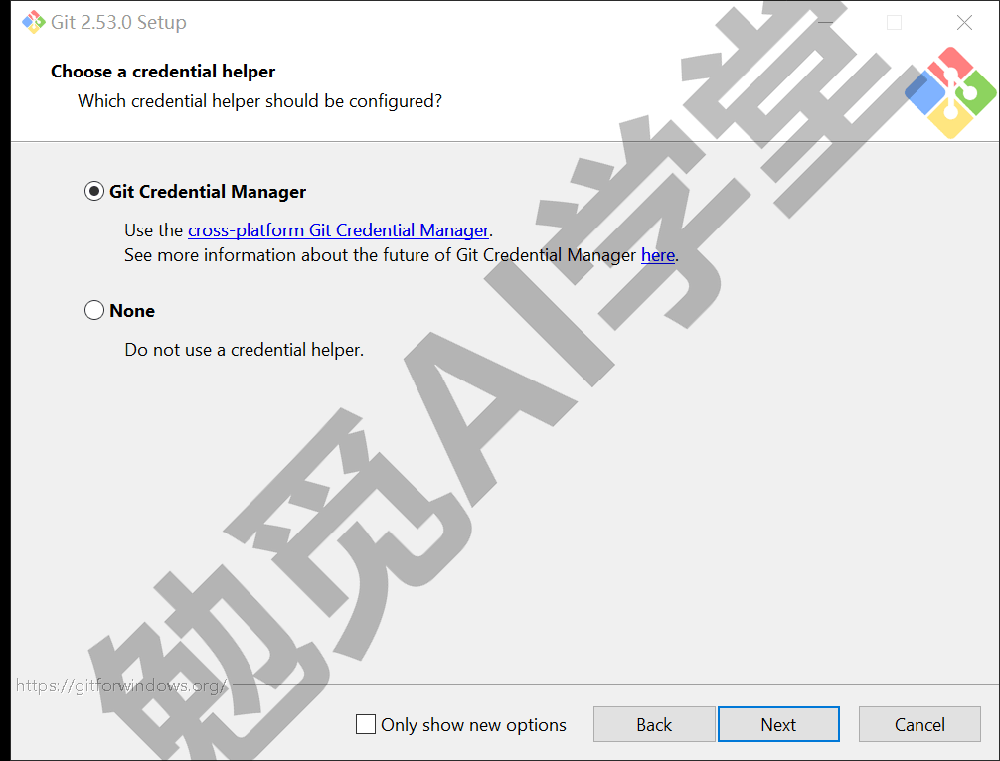

**第 15 步：附加选项与实验选项。** 附加选项页默认勾选了“Enable file system caching”（启用文件系统缓存），保持勾选；实验选项页默认一项都不勾，也不用动。点“Install”开始安装，等进度条走完。（需实机验证）

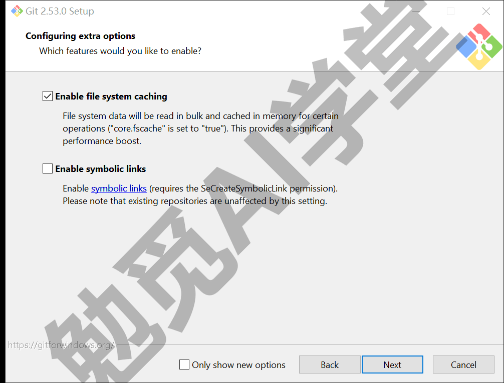

**第 16 步：完成并验证。** 安装完成页可以把“View Release Notes”的勾去掉，点“Finish”。然后打开一个终端窗口（在任意文件夹的空白处点右键选“在终端中打开”，Windows 10 上按住 Shift 再点右键选“在此处打开 PowerShell 窗口”，详细做法见 1.8 节），输入下面这条命令并回车：

```text
git --version
```

你会看到类似下面的输出，数字是你装的版本号，和这里不同是正常的：

```text
git version 2.53.0.windows.1
```

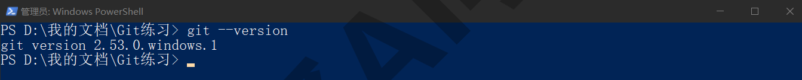

看到版本号，安装就成功了。如果终端提示“git 不是内部或外部命令”或“无法将 git 识别为 cmdlet”，多数是第 8 步选了第一项，或者终端窗口是在安装之前就打开的。先把终端窗口关掉重新开一个再试；还不行就重新运行安装包，在 PATH 那一页选中间项。

### 1.6 macOS 上怎么装

如果你用的是 Mac，Git 通常随系统的命令行开发工具一起提供。打开“终端”应用（在“应用程序 → 实用工具”里，或用聚焦搜索输入“终端”），输入 `git --version` 并回车。如果系统还没有安装命令行工具，会弹出一个对话框询问是否安装，点“安装”，等它下载完成后再敲一次命令，就能看到版本号（需实机验证）。如果你已经装了 Homebrew 这类包管理器（在终端里安装软件的工具），也可以用它安装最新版的 Git（Homebrew 本身怎么装，本课不展开）。

装好后同样用 `git --version` 验证，看到版本号即可。系统自带的这份 Git，版本通常比官网最新版旧一些，对本课的全部内容没有影响；如果你已经装好了 Homebrew，又想装最新版，在终端执行下面这条命令：

```text
brew install git
```

装完关掉终端重开一个，再敲 `git --version`，显示的就是新装那一份的版本号。如果版本号没变，说明终端仍在用系统自带的那份，可以用 `which -a git` 列出电脑上所有的 git 程序及其路径：系统自带的通常在 `/usr/bin/git`，Homebrew 装的在 `/opt/homebrew/bin/git`（Intel 芯片的 Mac 是 `/usr/local/bin/git`），哪一个排在前面就是当前在用的。两份并存不冲突，只是敲命令时用的是排在前面的那一份，以实际输出为准。

Mac 上没有 Windows 那样的安装向导，所以 1.5 节里几项“装的时候一并选好”的设置，在 Mac 上要靠 1.7 节的配置命令来做：默认编辑器（Mac 上默认也是 Vim，建议改成终端里更简单的编辑器 `nano`，或者 VS Code）、初始分支名、署名都用同一套 `git config --global` 命令，写法完全一样。凭据保存这一项，Mac 会使用系统自带的钥匙串，第一次向 GitHub 推送时终端会要用户名和一个访问令牌（GitHub 生成的一串代替密码用的字符），或者另外装上 Git Credential Manager，改用浏览器登录，两种做法《GitHub 与远程仓库》6.3 节都会讲到。

本课后面所有命令在 Mac 上都一样能用，只有路径写法不同：Windows 的用户目录是 `C:\Users\你的用户名\`，Mac 的是 `/Users/你的用户名/`；Windows 路径用反斜杠 `\` 分隔，Mac 用正斜杠 `/`；Windows 桌面是 `C:\Users\你的用户名\Desktop\`，Mac 是 `/Users/你的用户名/Desktop/`。凡是正文里出现 Windows 路径的地方，Mac 读者按这个对应关系替换即可。1.7 节要讲的配置文件位置就是第一个例子。

终端操作方面，1.8 节里的 `cd`、`ls`、Tab 补全、用向上的方向键翻出之前的命令，在 Mac 终端里都一样，只是 Mac 上没有“在终端中打开”的右键菜单，可以在“系统设置”里为访达开启“新建位于文件夹位置的终端窗口”服务，或直接把文件夹拖到终端图标上打开（需实机验证）。

### 1.7 首次配置：署名、默认分支与三条 Windows 专用设置

装好之后有几项一次性的配置要做。它们都用 `git config --global` 这条命令来设置。`config` 的意思是配置，`--global` 表示这项配置对你电脑上所有仓库都生效（不加的话，只对当前所在的仓库生效）。这些配置会写进你用户目录下一个叫 `.gitconfig` 的文本文件里，Windows 上就是 `C:\Users\你的用户名\.gitconfig`，Mac 上是 `/Users/你的用户名/.gitconfig`。

**先看看不配置会怎样。** 如果你跳过这一节直接去提交，Git 会拒绝并给出这样的提示：

```text
Author identity unknown

*** Please tell me who you are.

Run

  git config --global user.email "you@example.com"
  git config --global user.name "Your Name"

to set your account's default identity.
Omit --global to set the identity only in this repository.

fatal: unable to auto-detect email address (got 'Administrator@admin.(none)')
```

它在问“你是谁”。Git 会把提交人的名字和邮箱写进每一次提交里，这样翻历史时才知道每一笔是谁记的。所以第一件事，就是告诉它你是谁。

**署名：user.name 与 user.email。** 在终端里依次输入下面两条命令，引号里换成你自己的名字和邮箱：

```text
git config --global user.name "你的名字"
git config --global user.email "你的邮箱"
```

两条命令执行后没有任何输出，这是正常的：Git 的很多命令成功时不输出任何内容，只有出错才提示。这里的名字和邮箱只是“署名”，不是任何网站的账号密码，也不会有人来验证它；写中文名字完全可以。邮箱会随着提交一起公开（如果你以后把仓库推到 GitHub 公开），介意的话可以用 GitHub 提供的匿名邮箱，《GitHub 与远程仓库》会讲怎么拿到它。

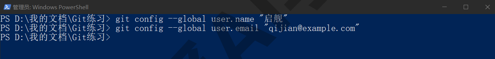

**默认分支名：init.defaultBranch。** 如果你在安装时的第 7 步已经选了 main，这一项就已经设好了；如果没选、或者不确定，补一条命令即可：

```text
git config --global init.defaultBranch main
```

这样以后每个新建的仓库，第一条分支都叫 main。不设的话，当前版本的 Git 会叫它 master，两者只是名字不同，功能完全一样，但和 GitHub 的默认名保持一致能省掉后面一次改名。Git 3.0 起官方默认就会是 main，那时这条配置有没有都一样，以你安装的版本为准。

接下来是三条专门针对 Windows 的配置。它们不是必需的，但不设的话，你在后面几篇里几乎一定会遇到三个让人困惑的现象。

**Windows 配置一：core.quotepath false，让中文文件名正常显示。** 不设它的话，Git 在显示中文文件名时会把每个汉字转成一串反斜杠加数字。下面对比一下设置前后的显示。设置之前，查看仓库状态：

```text
 M "\350\257\264\346\230\216.txt"
```

这个文件其实叫“说明.txt”，但你完全认不出来。执行下面这条配置命令：

```text
git config --global core.quotepath false
```

再查看状态，就变成了：

```text
 M 说明.txt
```

只要你的文件名里会出现中文，这条配置就必须设。

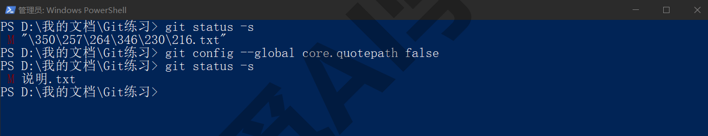

**Windows 配置二：core.autocrlf，看懂换行符警告。** Windows 和 Mac、Linux 表示“换行”用的字符不一样（Windows 用两个字符 CRLF，其他系统用一个字符 LF）。安装时第 11 步保持默认，就等于设置了 `core.autocrlf true`：文件存进仓库时统一转成 LF，取出来时转成 CRLF，这样同一个仓库在 Windows 和 Mac 上打开都正常。副作用是，当你把一个用 LF 换行的文件加进仓库时，Git 会提示一句：

```text
warning: in the working copy of 'lf.txt',
LF will be replaced by CRLF the next time Git touches it
```

终端里这是一行，这里为了排版折成了两行。这只是一条提示，不是错误，文件内容不受影响，命令也已经正常执行了。看到它不用做任何事。如果安装时不小心改了这一页，可以用下面的命令设回来：

```text
git config --global core.autocrlf true
```

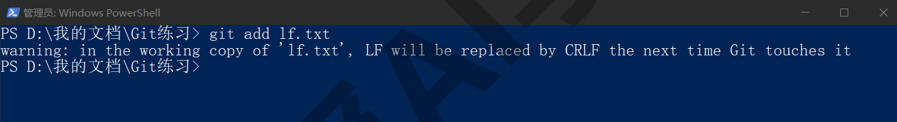

**Windows 配置三：core.longpaths true，避免路径过长报错。** Windows 传统上对文件完整路径有 260 个字符左右的长度限制，仓库放得深一点、文件夹名长一点，就可能碰到 “Filename too long” 的错误。设上这一条，Git 就能处理更长的路径：

```text
git config --global core.longpaths true
```

**核对全部配置。** 输入下面这条命令，可以列出当前所有全局配置：

```text
git config --global --list
```

你会看到类似下面的输出（值是你自己填的）：

```text
user.name=启舰
user.email=qijian@example.com
init.defaultbranch=main
core.quotepath=false
core.autocrlf=true
core.longpaths=true
```

如果想知道某一项配置写在哪个文件里，加上 `--show-origin`：

```text
git config --global --show-origin user.name
```

输出会把 `.gitconfig` 文件的完整路径连同值一起显示出来。你也可以直接在资源管理器里进入自己的用户目录，找到这个 `.gitconfig` 文件用记事本打开，它就是一份普通的文本文件，上面每条命令做的事，就是往里面写一行。

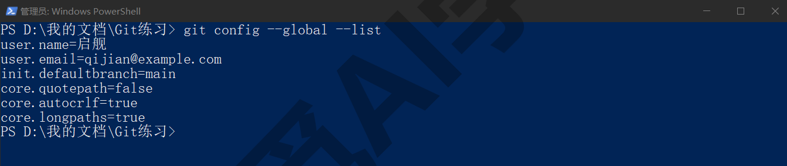

用记事本打开后看到的就是下面这几行，与上面 `--list` 输出的六项一一对应，只是按 `[user]`、`[init]`、`[core]` 分了组，每组下面的行缩进一格：

```text
[user]
	name = 启舰
	email = qijian@example.com
[init]
	defaultBranch = main
[core]
	quotepath = false
	autocrlf = true
	longpaths = true
```

**改错了怎么办。** 任何一项配置，把同一条命令里的值换成新的，再执行一遍，就会覆盖旧值；想彻底删掉一项，用 `git config --global --unset 配置名`。比如安装时把默认编辑器选成了 Vim，现在想改成记事本，可以执行 `git config --global core.editor notepad`（Mac 上把 notepad 换成 nano）。

### 1.8 终端基本操作：不写代码的人只需要会这几样

本课用命令行操作 Git，因为命令是 Git 唯一完整的、在任何工具里都一样的操作方式：AI 工具替你跑的是命令，各类图形界面的按钮背后也是命令。你需要会的终端操作非常少，这一节全部列出来。

**打开终端。** 在 Windows 11 上，进入你要操作的文件夹，在空白处点右键，菜单里选“在终端中打开”，会直接打开一个已经位于这个文件夹的 Windows 终端窗口（需实机验证）。在 Windows 10 上，这个右键项可能不存在，可以按住 Shift 再点右键找“在此处打开 PowerShell 窗口”，或者在资源管理器地址栏里输入 `powershell` 回车（需实机验证）。两种方式打开的窗口都是 PowerShell，本课的命令在里面都能跑。

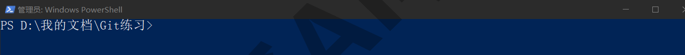

窗口里那一行以 `PS` 开头、后面跟着一个路径、以 `>` 结尾的文字叫**提示符**，它告诉你“你现在站在哪个文件夹里”。Git 的命令都是对“你现在站的这个文件夹”生效的，所以先确认提示符里的路径是不是你想操作的文件夹。

**切换文件夹：cd。** `cd` 后面跟一个路径，就进入那个文件夹。路径里有中文或空格时，用引号包起来：

```text
cd "D:\我的文档\Git练习"
```

`cd ..` 回到上一层。你也可以先输入 `cd `，再把资源管理器里的文件夹直接拖进终端窗口，路径会自动填上。

**看文件夹里有什么：ls。** 输入 `ls` 回车，终端会列出当前文件夹里的内容。加上 `-Force` 可以连隐藏文件一起显示，后面看 `.git` 文件夹会用到。

**三个常用的辅助键。** 输入路径或文件名的前几个字后按 Tab 键，终端会帮你补全；按向上的方向键可以翻出之前输入过的命令，不用重新输入；命令执行到一半想停下，按 Ctrl+C。

**复制与粘贴。** 在终端里选中文字后按右键（或 Ctrl+C）复制；把课程里的命令粘贴进终端，用右键（或 Ctrl+V）。注意 Ctrl+C 有两种用法：选中了文字时是复制，没选中文字时才是停下正在执行的命令。粘贴多行命令时，终端会逐行执行。

**清屏：clear。** 屏幕上输出太多看着乱，输入 `clear` 回车，屏幕就清空了。清掉的只是窗口里显示的文字，文件和 Git 的记录都不受影响。

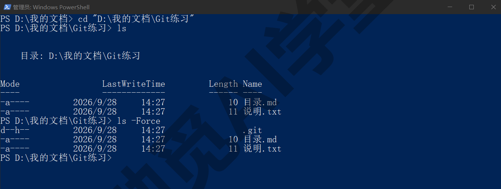

**PowerShell 与 Git Bash。** 安装 Git 时附带了一个叫 Git Bash 的终端，它模拟的是 Mac 和 Linux 上的命令行环境。你在开始菜单能找到它，用它跑 Git 命令也完全可以，输出一样。本课统一用 PowerShell，因为它是 Windows 自带的、Codex 和 Cursor 的内置终端默认也是它；如果你以后看到别的教程在 Git Bash 里演示，Git 命令部分照抄即可，只有 cd、ls 这类系统命令的细节有差别。

**三件不必担心的事。**

- 敲错 Git 命令不会损坏你的电脑，最多是 Git 报一句错，再来一遍就好；真正需要小心的几条危险命令，《撤销、还原与找回》会单独列出。
- Git 的提示是英文的，但它每次都会把“你现在能做什么”写在提示里（比如括号里的 use "git add" to...），看懂关键词就够。
- 任何命令记不清用法，输入 `git help 命令名`（比如 `git help config`），Windows 上会用浏览器打开这条命令的说明页，以实际表现为准。

### 1.9 装完就能用：第一次提交

配置都做好了，现在用三分钟走一遍 Git 最核心的动作。这一节只做不细讲，每一步是什么意思，《第一个仓库：提交与历史》会逐条展开。

**准备一个练习文件夹。** 在你方便找到的地方新建一个文件夹，比如 `D:\我的文档\Git练习`，用 1.8 节的方法在这个文件夹里打开终端。确认提示符里的路径就是它。

**让 Git 开始管这个文件夹。** 输入：

```text
git init
```

你会看到类似下面的输出：

```text
Initialized empty Git repository in D:/我的文档/Git练习/.git/
```

意思是“在这个文件夹里建好了一个空仓库”。此时用 `ls -Force` 看一眼，文件夹里多了一个隐藏的 `.git` 文件夹，Git 的全部记录都存在这里面，你不需要也不应该手动改它里面的东西。

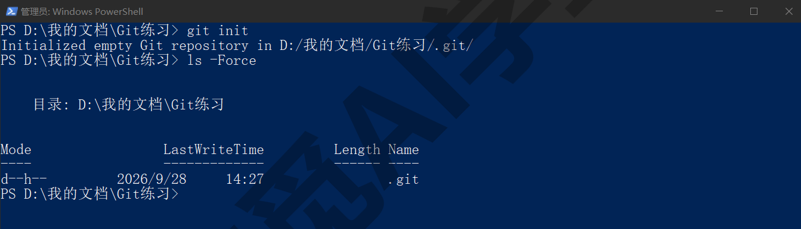

**放一个文件进去，看看 Git 的反应。** 在这个文件夹里新建一个文本文件，比如 `说明.txt`，随意写一行字保存。回到终端输入：

```text
git status
```

`status` 是“状态”，这条命令是你以后最常敲的一条。你会看到类似下面的输出：

```text
On branch main

No commits yet

Untracked files:
  (use "git add <file>..." to include in what will be committed)
	说明.txt

nothing added to commit but untracked files present (use "git add" to track)
```

它在说：当前在 main 分支上，还没有任何提交，有一个“未跟踪”的文件 `说明.txt`，Git 看到了它，但还没开始记它。括号里已经把下一步该做什么告诉你了。

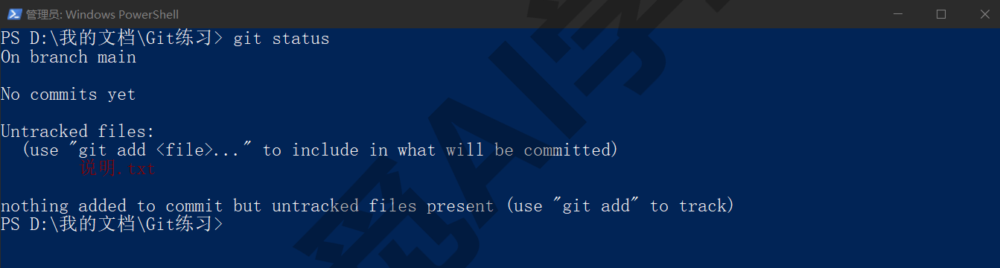

**第一次提交。** 依次输入下面两条命令：

```text
git add .
git commit -m "第一次提交"
```

第一条把当前文件夹里的改动放进“准备提交”的清单（那个点表示“全部”）；第二条正式记一笔账，`-m` 后面引号里的文字就是这笔账的说明。第二条执行后你会看到类似下面的输出：

```text
[main (root-commit) 2c01722] 第一次提交
 1 file changed, 1 insertion(+)
 create mode 100644 说明.txt
```

`2c01722` 是这次提交的编号，你的会不同；“1 file changed, 1 insertion(+)”是说这次提交涉及 1 个文件、新增 1 行。

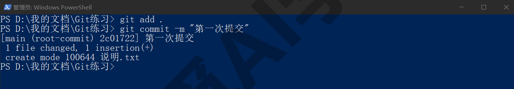

**改一下，看 Git 是否知道。** 用记事本打开 `说明.txt`，再加一行字，保存。回到终端再敲一次 `git status`：

```text
On branch main
Changes not staged for commit:
  (use "git add <file>..." to update what will be committed)
  (use "git restore <file>..." to discard changes in working directory)
	modified:   说明.txt

no changes added to commit (use "git add" and/or "git commit -a")
```

“modified: 说明.txt”，Git 知道你改了它。这就是版本管理最基本的能力：你改了什么，它都看得见；你决定记账的时候，它就记下来。输入 `git log --oneline` 可以看到刚才那笔账已经在历史里了。

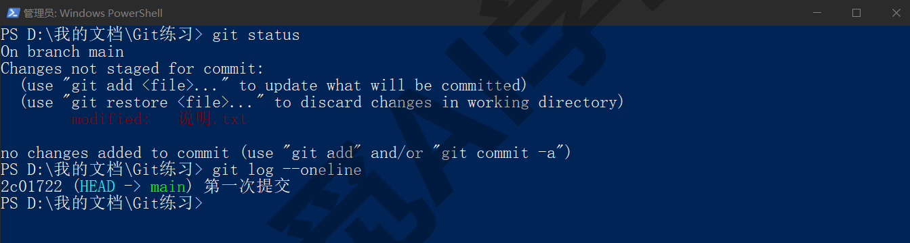

这个练习文件夹请留着，后面几篇都在它上面继续。

**在 AI 工具和图形界面里，这一步是什么样子。** Codex 和 Cursor 都有内置终端，这一篇的全部命令可以直接在它们的终端里敲，效果和 Windows 终端一样；如果你更愿意让 AI 代劳，Codex 课《文件能力一集讲全》和 Cursor 课《文件与办公能力一篇讲全》讲过让 AI 自己安装工具的做法，“帮我安装 Git 并配置好署名”这类要求它们都能完成，但装完请按 1.7 节核对一遍配置。想用图形界面点按钮操作 Git 的读者，本课把 GitHub Desktop 和编辑器里的源代码管理面板放在《图形界面与 AI 工具里的 Git》一篇集中讲，那时你已经知道每个按钮背后是哪条命令，学起来会比现在快得多。

### 1.97 练习任务

方括号里的内容换成你自己的。

**任务一：装好并核对配置。** 完成 1.5 节的安装（Mac 读者按 1.6 节），然后在终端里依次执行下面两条命令，把输出截图保存：

```text
git --version
git config --global --list
```

完成标准：第一条输出版本号；第二条输出里能看到 user.name、user.email、init.defaultbranch、core.quotepath、core.autocrlf、core.longpaths 六项，值与你填的一致。

**任务二：亲眼看一次中文文件名的显示差别。** 在练习文件夹里新建一个中文名的文本文件，先临时把 quotepath 改回默认的 true（恢复成反斜杠加数字的显示）看一次状态，再改回 false 看一次：

```text
git config --global core.quotepath true
git status --short
git config --global core.quotepath false
git status --short
```

完成标准：第一次状态输出里文件名显示为反斜杠加数字，第二次显示为正常中文；最后一条命令执行完之后配置停留在 false。

**任务三：完成第一次提交并找到 `.git`。** 按 1.9 节在 `[你的练习文件夹]` 里完成 init、add、commit，然后：

```text
git log --oneline
ls -Force
```

完成标准：log 输出里有一行你写的提交说明；ls 输出里能看到 `.git` 文件夹；你能用一句话说出 `.git` 文件夹里放的是什么、为什么不能手动改。

### 1.98 本篇小结与自检

这一篇从“最终版_真的最终版”的困扰出发，讲清了版本管理是给文件夹记账、Git 是装在本机的记账软件、GitHub 是放仓库的网站；解释了 AI 时代不写代码也要会 Git 的四个场景，以及 Git 对文本文件擅长、对二进制文件只能存不能比、不是网盘也不自动同步的边界；然后逐页走完了 Windows 安装向导，做了署名、默认分支和三条 Windows 专用配置，学会了打开终端、切换文件夹和几个常用的辅助键，最后完成了第一次提交。

可以对照下面的清单检查学习结果：

- [ ] 能用一句话说清 Git 和 GitHub 各是什么、什么关系
- [ ] 能说出 AI 工具的检查点或审查面板与 Git 提交的区别
- [ ] 知道 Git 对 Word、图片这类文件能做什么、不能做什么
- [ ] 安装向导里的默认编辑器、初始分支名、PATH 三页知道自己选了什么、为什么
- [ ] 终端里 `git --version` 能输出版本号
- [ ] 设好了 user.name 和 user.email，知道它们只是署名
- [ ] 能说出 core.quotepath、core.autocrlf、core.longpaths 三条配置各防什么
- [ ] 会在任意文件夹打开终端，会用 cd、ls、Tab 补全和上箭头
- [ ] 在练习文件夹里完成过一次 init、add、commit，看过 status 的两种输出

完成这些内容后，你的电脑上已经有了一个被 Git 记录的文件夹。下一篇《第一个仓库：提交与历史》会把这一篇最后三分钟里敲过的每一条命令讲透：文件在 Git 里经过哪几个区、status 的每一行怎么读、提交说明怎么写、历史怎么翻、改动怎么看。

### 1.99 新手常见问题

**Q1：我完全不会命令行，能学吗？**

能。本课用到的终端操作只有 1.8 节列出的那几件：打开终端、cd 进文件夹、ls 看内容、Tab 补全、用向上的方向键翻出之前的命令、复制粘贴。Git 本身的命令每条都会在用到时给出完整写法和输出示例，照着敲即可。敲错了，Git 只会报一句错，不会损坏电脑。

**Q2：Git 和 GitHub 要花钱吗？**

Git 是免费开源软件，不收费。GitHub 的个人账号基本功能免费，包括建公开和私有仓库、推送与克隆（把网站上的仓库完整复制一份到自己电脑上）；部分高级功能属于付费方案，具体以 GitHub 账号页面显示为准。本课前五篇不需要 GitHub 账号。

**Q3：我平时主要用 Word 和 PPT，Git 对我有用吗？**

有，但发挥不出全部优势。Git 能把 Word、PPT 文件的每个版本都存下来、随时倒回去，这部分和文本文件一样；做不到的是“看出这一版比上一版改了哪几句”，因为这类文件是二进制格式。如果你愿意把主要写作转到 Markdown 这类纯文本格式，Git 能帮上的忙会多很多；如果不愿意，把它当作一个带历史记录的备份工具用也完全值得。

**Q4：装完了，终端里说“git 不是内部或外部命令”怎么办？**

先把终端窗口关掉重开一个再试，安装前就打开的终端不知道新装的程序在哪。还不行的话，多半是安装向导 PATH 那一页选了第一项，重新运行安装包，在那一页选中间项“Git from the command line and also from 3rd-party software”，其他页保持原选择装完即可，已有配置不会丢。

**Q5：安装向导里选错了，要重装吗？**

大多数不用。默认编辑器、初始分支名、换行符、凭据助手这几项其实都是配置，装完后用 `git config --global` 改一条就行（1.7 节讲了写法）；只有 PATH 那一页的选择需要重新运行安装包来改。重新运行安装包会覆盖安装，之前的配置文件不会被删。
