## 第一个仓库：提交与历史

上一篇《认识 Git 与装好》的最后三分钟，你在练习文件夹里敲了 init、status、add、commit 四条命令，完成了第一次提交。这一篇把那三分钟拆开讲透：文件在 Git 里要经过哪三个区、每条命令把东西从哪个区搬到哪个区、status 的每一行怎么读、提交说明怎么写才有用、历史怎么翻、改动怎么看、哪些文件不该被记录、改名和删除怎么处理、刚提交完发现写错了怎么补。学完这一篇，日常记账用到的全部命令你都会了，而且知道每一条在做什么。

这篇文章的实操内容不需要花钱：全部在本机的 Git 里完成，不需要账号，也不联网。

### 2.1 三区图：全课最重要的一张图

Git 的所有命令都可以在一张图上找到位置。你可以把一个 Git 仓库理解成三个区域排成一排：

- **工作区**：就是你在资源管理器里看到的那个文件夹。你新建、修改、删除文件，都发生在这里。
- **暂存区**：一份“准备打包”的清单。你告诉 Git “这几处改动我下次要记进去”，它们就进了暂存区。清单上的东西还没有正式记账。
- **仓库**：已经封存的记录，也叫本地仓库。每次提交，就是把暂存区清单上的内容封成一个存档点，存进仓库。它在电脑上就是《认识 Git 与装好》里看到的那个 `.git` 隐藏文件夹。


有了这张图，《认识 Git 与装好》末尾敲过的四条命令里，除了 init，另外三条就都有了位置：`git add` 是把工作区里的改动送进暂存区；`git commit` 是把暂存区里的东西封成一次提交存进仓库；`git status` 是看一眼此刻三个区之间有什么差别：哪些文件改了还没进暂存区、哪些进了暂存区还没提交。后面每学一条新命令，都请回到这张图上想一想它把东西从哪搬到哪。

**为什么中间要多一个暂存区。** 直觉上，改完就存进仓库不就行了，为什么要先放进一个清单？原因是“一次提交最好只记一件事”。设想你今天改了五个文件：三个是给文档补了一节内容，另外两个是修了几个错别字。如果只能整个文件夹一起存，这次提交的说明就得写成“补内容并修错别字”，以后翻历史时想单独撤掉错别字那部分就做不到了。有了暂存区，你可以先把三个文件放进清单、提交一次“补充第三节内容”，再把另外两个放进清单、提交一次“修正错别字”。两次提交各记一件事，历史干净，以后单独撤销任何一次都容易。

用命令把这个例子走一遍，感受暂存区的作用。假设改动的五个文件里，`第三节.md`、`第三节配图说明.md`、`目录.md` 属于补内容，`第一节.md`、`第二节.md` 只是修错别字：

```text
git add 第三节.md 第三节配图说明.md 目录.md
git commit -m "补充第三节内容并更新目录"
git add 第一节.md 第二节.md
git commit -m "修正第一、二节错别字"
```

第一次 add 只把三个文件放进清单，commit 只记这三个；第二次 add 再放另外两个，commit 记那两个。中间你随时可以用 status 看清单上有什么、用 diff 看每个文件改了什么。如果没有暂存区这一层，这两次提交就只能混成一次。

暂存区在很多资料里也叫 index 或 stage，看到这两个词知道是同一样东西即可。“把文件放进暂存区”这个动作叫“暂存”，对应的命令是 add。

后面会再加一个区域进这张图：**远程仓库**，也就是放在 GitHub 上的另一份仓库，从《GitHub 与远程仓库》开始出现。本篇先把本机的三个区用熟。

### 2.2 git init：让一个文件夹变成仓库

`git init` 的作用是“在当前文件夹里创建一个空仓库”。它只做一件事：在这个文件夹里新建一个隐藏的 `.git` 文件夹，之后 Git 对这个文件夹的全部记录都存在里面。

**在哪个文件夹敲，就管哪个文件夹。** 这条命令管的就是终端提示符里显示的当前文件夹，所以敲之前先看一眼提示符，确认自己站在想要管理的文件夹里。执行后输出如下（路径是你自己的）：

```text
Initialized empty Git repository in D:/我的文档/Git练习/.git/
```

紧接着敲 `git status`，会看到：

```text
On branch main

No commits yet

nothing to commit (create/copy files and use "git add" to track)
```

这是一个新仓库最干净的状态：在 main 分支上（如果你的显示是 master，是安装时没改默认分支名，不影响使用，《分支与合并》会讲怎么改名），还没有任何提交，工作区里也没有东西可记。

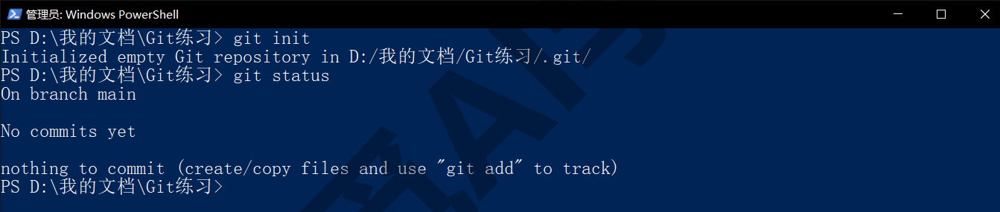

**`.git` 文件夹是什么、为什么别动它。** 它是仓库的全部：历史里每一次提交的内容、说明、时间，还有分支、配置，都在里面。它是隐藏文件夹，资源管理器里要打开“显示隐藏的项目”才看得到（“查看”菜单里的选项，位置以你的系统版本为准）；在终端里也一样，`ls` 列不出它，加上 `-Force` 才会显示。你不需要打开它，更不要手动修改或删除里面的东西，Git 的所有命令都是在替你安全地操作它。只有一条要记住：**把 `.git` 文件夹删掉，等于让这个文件夹忘掉全部历史**，文件夹里现在的文件会保留，但所有提交记录都没了。反过来，把整个文件夹（连 `.git` 一起）复制到别处或另一台电脑，历史就跟着走了。

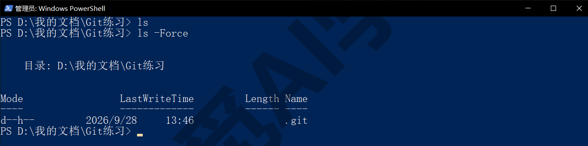

**两个常见的坑。** 第一个是在太大的文件夹里 init。有人为了少建一层文件夹，在桌面、整个用户目录甚至整个 D 盘的根目录（最外面那一层）敲了 `git init`，结果这个仓库把下面所有东西都算进了自己的范围，status 里出现成千上万个未跟踪文件，之后每条命令都明显变慢。解决办法是找到那个多余的 `.git` 文件夹删掉，再到真正想管理的具体文件夹里重新 init。第二个是仓库套仓库：在一个已经是仓库的文件夹里面，又在子文件夹里 init 了一次。Git 会把里面那个当成独立的仓库，外层仓库不再记录它里面的文件变化，表现出来就是“改了文件但外层 status 看不到”。判断方法是用 `ls -Force` 在每一层看看有没有 `.git`；多余的那个删掉即可。

**判断一个文件夹是不是仓库。** 在它里面敲任意 git 命令，如果得到下面这句，说明它不是：

```text
fatal: not a git repository (or any of the parent directories): .git
```

这句报错本身没有危害，只是提醒你要么走错了文件夹，要么这个文件夹还没 init。

### 2.3 git status：每一行都在说什么

`git status` 是你以后敲得最多的命令。它不改任何东西，只是把三个区之间的差别报告出来。养成“不确定就先 status”的习惯，绝大多数疑惑都能当场解开。

**三种状态。** 一个文件在 status 里只可能处于三种状态之一：

- **未跟踪**（Untracked）：文件在工作区里，但 Git 从来没记过它，也还没被放进暂存区。新建的文件都从这里开始。
- **已修改**（Changes not staged for commit）：Git 之前记过这个文件，现在工作区里的版本和上次提交不一样，但改动还没放进暂存区。
- **已暂存**（Changes to be committed）：改动已经进了暂存区，下次 commit 就会记进去。

下面是一份同时包含三种状态的真实输出，逐段看：

```text
On branch main
Changes to be committed:
  (use "git restore --staged <file>..." to unstage)
	renamed:    素材/图2.txt -> 素材/配图2.txt

Changes not staged for commit:
  (use "git add/rm <file>..." to update what will be committed)
  (use "git restore <file>..." to discard changes in working directory)
	deleted:    素材/图3.txt

Untracked files:
  (use "git add <file>..." to include in what will be committed)
	临时.tmp
```

第一行 On branch main 说你在哪条分支上。第一段 Changes to be committed 是已暂存的内容，这里是一次改名。第二段 Changes not staged for commit 是已修改但未暂存的内容，这里是一个被删除的文件。第三段 Untracked files 是未跟踪的新文件。每一段下面括号里的英文是 Git 给你的操作提示：把已暂存的撤回来用 `git restore --staged`，把工作区改动放进暂存区用 `git add`，丢掉工作区改动用 `git restore`。这些命令在下一篇《撤销、还原与找回》里会展开，现在只需要知道提示里写的就是你此刻能做的事。

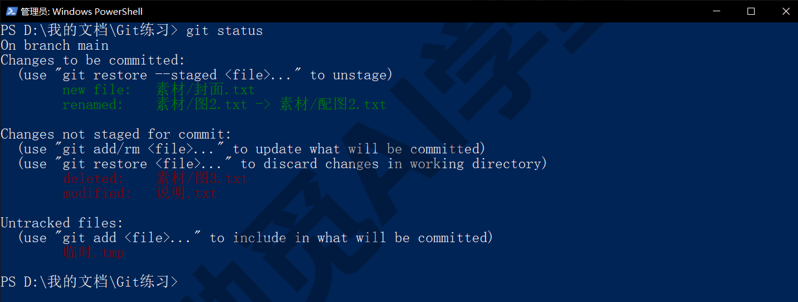

**状态的英文词。** 已修改的文件前面写 modified，新加进暂存区的写 new file，删除的写 deleted，改名的写 renamed。在支持彩色的终端里，已暂存的行显示为绿色、未暂存和未跟踪的显示为红色，一眼就能区分。

**短格式。** 文件多了之后完整输出很长，加上 `-s` 可以换成每个文件一行的短格式：

```text
git status -s
```

输出类似：

```text
A  素材/图1.txt
 M 说明.txt
D  运行.log
R  素材/图2.txt -> 素材/配图2.txt
?? 临时.tmp
```

每行开头的两个字符是状态码：`??` 未跟踪，`A` 新加入暂存区，`M` 已修改，`D` 已删除，`R` 已改名。这两个字符有讲究：第一位说的是暂存区和仓库比有什么变化，第二位说的是工作区和暂存区比有什么变化。所以 ` M`（M 在第二位）表示改了还没暂存，`M `（M 在第一位）表示改动已经暂存；如果同时出现 `MM`，说明暂存之后又改了一次。刚开始用完整格式看得更明白，熟了以后短格式更快。

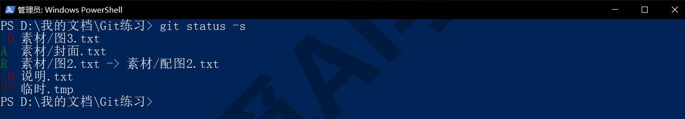

**工作区干净时。** 一切都提交了、没有任何改动，status 会说：

```text
On branch main
nothing to commit, working tree clean
```

看到 working tree clean，就是“工作区干净”，此刻工作区、暂存区、仓库三个区完全一致。

### 2.4 git add：把改动送进暂存区

`git add` 的作用是把工作区里的改动放进暂存区。对未跟踪的新文件，add 让 Git 开始记它；对已经跟踪的文件，add 把它当前的内容放进清单。回到三区图上，add 是从左边第一格搬到第二格的那个箭头。

**四种写法。** 按范围从小到大：

```text
git add 说明.txt
git add 素材
git add *.md
git add .
```

第一条只加一个文件；第二条加一个文件夹里的全部内容；第三条加当前文件夹（含子文件夹）里全部 md 文件（星号是通配符，表示“任意名字”）；第四条的点表示“当前文件夹下的一切”，是最常用的写法。你还会在资料里看到 `git add -A`，它和 `git add .` 在当前文件夹下效果几乎一样，本课后面统一用点。一次也可以加多个文件，用空格隔开：`git add 说明.txt 素材/封面.txt`。另外，add 不只处理“新增和修改”，删除也算改动：你在资源管理器里删掉一个已跟踪的文件后，`git add .` 会把“这个文件被删了”这件事也放进暂存区，2.9 节会看到它的效果。

add 成功时没有任何输出。执行 `git add 说明.txt` 之后再看 status，会看到它从 Untracked files 移到了 Changes to be committed 下面，前面写着 new file：

```text
Changes to be committed:
  (use "git restore --staged <file>..." to unstage)
	new file:   说明.txt
```

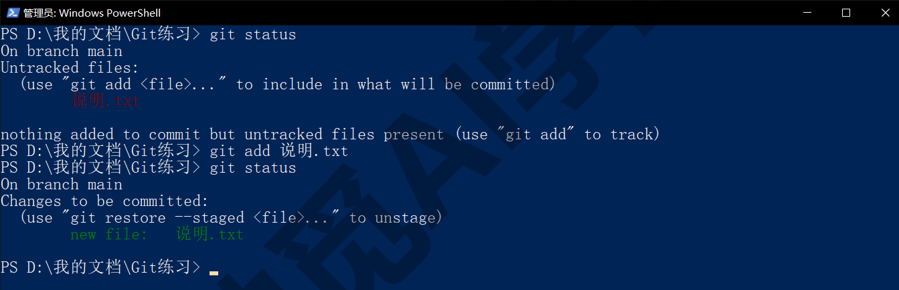

**add 记的是“此刻的内容”。** 这是新手最容易困惑的一点：你 add 了一个文件，然后又改了它一次，再 commit，记进去的是 add 那一刻的内容，后面那次修改还留在工作区。status 里这种情况会同时出现在两段里（已暂存一份、未暂存一份），短格式显示为 `MM`。解决办法很简单：再 add 一次，暂存区里的就变成最新的了。养成“改完、add、马上 commit”的节奏，基本不会碰到这个问题。

**加了又不想记怎么办。** 不小心把一个不该记的文件 add 进去了，用 status 提示里那条 `git restore --staged 文件名` 撤回来，文件本身不会有任何变化，只是从清单上拿掉。这属于下一篇《撤销、还原与找回》的内容，这里先记住有这个办法。

**只想加文件里的一部分改动。** 一个文件里既有该记的改动又有不该记的，可以用 `git add -p 文件名`，Git 会把改动切成一块一块逐个问你要不要暂存。这个一问一答的过程对新手来说有点复杂，本课只介绍到这里，不要求掌握。Codex 审查面板里的“逐块暂存”按钮、Cursor 差异视图里的逐块接受，做的就是这件事，用按钮点比在终端里回答方便得多。

### 2.5 git commit：正式记一笔

`git commit` 把暂存区里的全部内容封成一次提交，存进仓库。它是三区图上从第二格搬到第三格的那个箭头。每次提交都带一句说明，用 `-m` 给出：

```text
git commit -m "说明加第二行；补图3"
```

执行后输出类似：

```text
[main 0d85d20] 说明加第二行；补图3
 2 files changed, 2 insertions(+)
 create mode 100644 素材/图3.txt
```

方括号里是分支名和这次提交的短编号；第二行是统计：涉及 2 个文件、新增 2 行、删除 0 行（有删除会写 deletions(-)）；下面逐个列出新建的文件（create mode）、删除的文件（delete mode）或改名的文件（rename）。commit 只处理暂存区里的内容，工作区里没 add 的改动不会被记进去，仍然留在那里等下次。

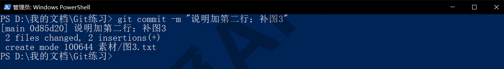

**提交说明怎么写。** 说明是给几个月后的你和你的合作者看的，好的说明让人不用打开内容就知道这次改了什么。原则是一句话讲清“改了什么”，必要时带上“为什么”；中文完全可以，Git 对语言没有要求。对照一下：

- 差的写法：“更新”“修改”“改了一下”“1”，什么信息都没有；
- 好的写法：“补充第三节：安装向导逐页说明”“修正 1.7 节两处错别字”“删除不再使用的旧配图”。

有一个简单的检验办法：把最近十次提交的说明连起来读，能不能看出这个项目这几天发生了什么？读得出来，这些说明就是合格的。

**忘了带 -m 会怎样。** 只敲 `git commit` 不带 `-m`，Git 会打开你在安装时选的默认编辑器，让你在里面写说明。如果选的是记事本：在打开的窗口第一行写说明，保存，关闭窗口，提交就完成了；文件里以 # 开头的行是 Git 的注释，不用管。如果当时保持了默认的 Vim，你会看到一个满屏英文、光标不动的窗口。先按 Esc，再输入英文冒号加 q 加感叹号（`:q!`）回车，就能不保存退出；Git 会提示 Aborting commit due to empty commit message，意思是“说明为空，提交已取消”，你再用 `-m` 的写法提交一次即可。如果不想再碰到这个画面，按《认识 Git 与装好》1.7 节的办法把默认编辑器改成记事本。

记事本里打开的其实是仓库里的 `.git/COMMIT_EDITMSG`，弹出来时是下面这样，**第一行是空的，那就是留给你写说明的地方**：

```text

# Please enter the commit message for your changes. Lines starting
# with '#' will be ignored, and an empty message aborts the commit.
#
# On branch main
# Changes to be committed:
#	new file:   素材/图3.txt
#	modified:   说明.txt
#
```

**提交编号是什么。** 每次提交有一个 40 位的编号，叫哈希，由内容计算得出，全世界唯一。日常只需要它的前 7 位（比如 0d85d20），Git 会自动匹配。后面翻历史、倒回旧版本、看两次提交之间的差别，都用这个短编号来表示是哪一次提交。Git 3.0 起新仓库的编号会变成 64 位，前 7 位照用，以你安装的版本为准。

**一次提交多大合适。** 记住一个标准：一次提交只做一件事，说明能用一句话讲清。补一节内容是一件事，修错别字是另一件事，两件事分两次提交。太大的提交（几十个文件一起“更新”）以后想单独撤某一处做不到；太碎的提交（每改一个字提交一次）翻历史时满眼琐碎。2.11 节会把这个标准展开成节律。

### 2.6 git log：翻历史

提交多了，就需要翻账本。`git log` 按时间倒序列出全部提交，最新的在最上面：

```text
commit 0d85d20126d29a68c0e7b632ff16859da9f17158
Author: 启舰 <qijian@example.com>
Date:   Mon Sep 14 23:09:22 2026 +0800

    说明加第二行；补图3

commit e2290ca6fa214735a66d046be8fe7d47f60d38ff
Author: 启舰 <qijian@example.com>
Date:   Mon Sep 14 23:09:21 2026 +0800

    初始化：加入说明与素材
```

每一条包含完整哈希、提交人（就是你在《认识 Git 与装好》1.7 节配置的署名）、时间和说明。历史一长，这个格式一屏放不下，终端会进入翻页模式：按空格往下翻一页，按上下箭头逐行滚动，**按 q 退出**。刚开始最容易卡在这里，记住 q 是退出键。

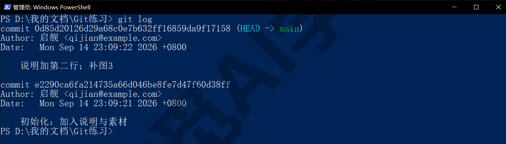

**常用的几种写法。** 日常用得最多的是单行格式：

```text
git log --oneline
```

每次提交只占一行，短哈希加说明：

```text
0d85d20 说明加第二行；补图3
e2290ca 初始化：加入说明与素材
```

想看每次提交动了哪些文件，加 `--stat`；想只看最近几条，加 `-3` 这类数字；想只看某一个文件的历史，在最后加两个减号和文件名：

```text
git log --stat -1
git log --oneline -- 说明.txt
```

`--stat` 的输出会在说明下面列出每个文件的改动行数，例如“说明.txt | 1 +”表示这个文件新增了 1 行。加上 `-p`，会把每次提交的具体改动内容都展开，适合追查“到底哪次改了这句话”。按时间和作者筛选也可以：`--since="2 weeks ago"` 只看最近两周，`--author=启舰` 只看某人的提交。

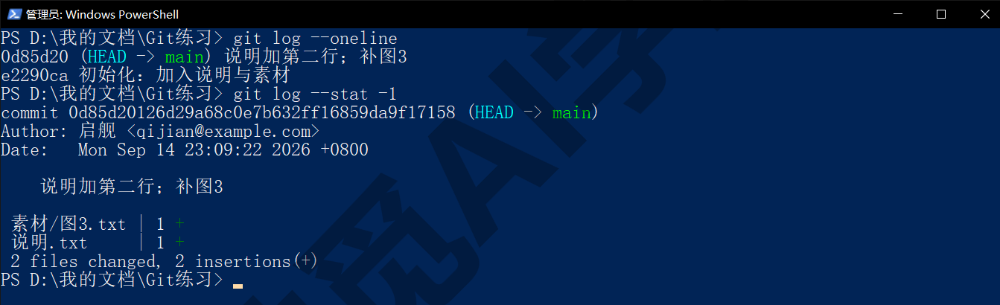

**看某一次提交的详情。** 知道了短哈希，用 show 可以看那一次提交的全部信息和改动：

```text
git show --stat 0d85d20
```

不加 `--stat` 会把改动内容也列出来。`HEAD` 是 Git 用来标记“你此刻站在哪个提交上”的指针，日常就是最新那次提交，所以 `git show HEAD` 等于看最近一次提交；上面 git log 截图里第一条哈希后面的 (HEAD -> main)，就是这个标记。

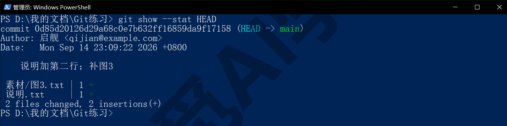

**图形化的历史。** 加上 `--graph` 会在左侧画出提交之间的连线，现在只有一条直线，等《分支与合并》有了分叉之后它才显出用处：

```text
git log --oneline --graph
```

### 2.7 git diff：看改了什么

log 告诉你“哪次提交改了哪些文件”，diff 告诉你“具体改了哪几行”。它比较的是三区图上任意两个位置之间的差别，最常见的三种用法，比的分别是下面这三组。

**工作区和暂存区比（改了还没 add 的部分）。** 直接敲：

```text
git diff
```

输出类似：

```text
diff --git a/说明.txt b/说明.txt
index 61d482c..09726c4 100644
--- a/说明.txt
+++ b/说明.txt
@@ -1,2 +1,2 @@
 第一行
-第二行
+第二行：补一句说明
```

前四行是文件信息，可以略过。`@@ -1,2 +1,2 @@` 说这一段改动涉及旧文件第 1 行起的 2 行、新文件第 1 行起的 2 行。下面每一行开头的符号是关键：没有符号的是没变的行（作为上下文显示），加号开头的是新增的行，减号开头的是删掉的行；在彩色终端里加号行是绿色、减号行是红色。“改了一行”在 diff 里表现为一红一绿：删掉旧的、加上新的。

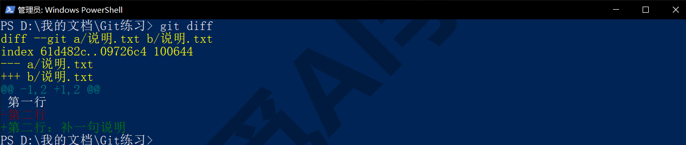

**暂存区和仓库比（add 了还没 commit 的部分）。** add 之后再敲 `git diff`，输出会是空的，因为工作区和暂存区已经一致了。这时要看的是暂存区和上次提交的差别：

```text
git diff --staged
```

它列出的就是你下次 commit 会记进去的全部内容，提交前看一眼这个，是防止把不该记的东西记进去的好习惯。

**两次提交之间。** 给出两个提交编号，可以看它们之间的差别；加上文件名可以只看某个文件：

```text
git diff e2290ca 0d85d20 -- 说明.txt
git diff HEAD~1 HEAD -- 说明.txt
```

`HEAD~1` 表示“最新提交的上一次”，`HEAD~2` 是再上一次，这个写法比查哈希方便。

**中文长段落怎么看得更清楚。** 默认 diff 按行比较，中文段落往往一段就是一行，改了一个词整行都会显示为一红一绿。加上 `--word-diff`，Git 会按词标出差别，删掉的词用 `[-…-]` 包住，新增的词用 `{+…+}` 包住：

```text
git diff --word-diff --word-diff-regex=. HEAD~1 HEAD -- 说明.txt
```

后面那个 `--word-diff-regex=.` 对中文是必须的。Git 判断“一个词”默认是按空格切的，英文句子天然有空格，中文一整句里一个空格都没有，Git 就把整句当成一个词，`[-…-]` 会把整句都包进去，等于白加。`--word-diff-regex=.` 的意思是“一个字符就算一个词”，这样才会只标出真正改掉的那几个字。

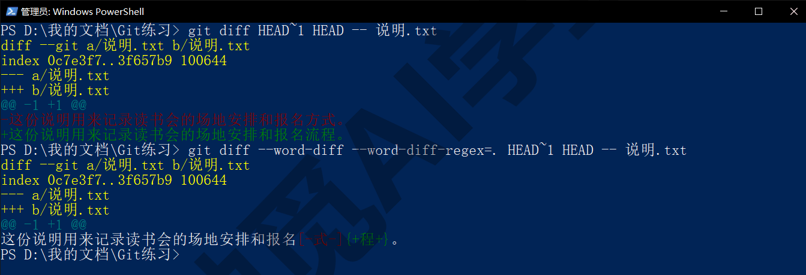

**只看概况。** 改动多的时候，先加 `--stat` 看一眼哪些文件动了、各动了多少行，再决定要不要展开看内容：`git diff --stat` 会输出类似“说明.txt | 1 +”的一行一个文件的统计，最后一行是总计。这个写法对 log、show 同样适用。

**二进制文件。** 对图片、Word 这类文件，diff 只会告诉你：

```text
Binary files a/图.png and b/图.png differ
```

意思是“这两个二进制文件不一样”，不显示内容。这是正常现象，《认识 Git 与装好》1.4 节讲过原因。

### 2.8 .gitignore：哪些文件不该被记录

不是文件夹里的每个文件都值得记进历史。有三类东西应该排除在外：

- **系统和软件自动生成的文件**：Windows 的 `Thumbs.db`、macOS 的 `.DS_Store`、各种软件的缓存和临时文件。它们随时变化、本身没什么内容，记进去只会让每次 status 的输出变得很长。
- **可以重新生成的文件**：程序运行的输出、日志、编译结果、软件包安装目录（比如网页项目里的 node_modules 文件夹，常常有几万个文件）。
- **不能公开的东西**：密码、密钥、含个人信息的配置文件。一旦提交，它们就进了历史，将来推到 GitHub 上会跟着公开，事后也很难删干净。

**写法。** 在仓库根目录新建一个名为 `.gitignore` 的文本文件（注意以点开头、没有后缀名；资源管理器新建时可能不允许这个名字，可以在终端里用 `New-Item .gitignore` 创建，或在编辑器里另存为），每行写一条规则：

```text
*.tmp
*.log
缓存/
Thumbs.db
.DS_Store
!重要.log
```

规则有四种形态：`*.tmp` 用通配符忽略所有 .tmp 文件；`缓存/` 结尾带斜杠表示忽略整个文件夹；`Thumbs.db` 直接写文件名；`!` 开头表示例外，即使前面规则忽略了全部 .log，`重要.log` 仍然要记。以 # 开头的行是注释。

写好之后，被忽略的文件就从 status 里消失了。下面是加规则前后的对比：加规则前 status -s 里有 `?? Thumbs.db`、`?? 临时.tmp`、`?? 缓存/` 三行，写好上面那份 `.gitignore` 之后，这三行都不再出现，只剩 `.gitignore` 自己是未跟踪的新文件。把它 add 并提交，忽略规则就成为仓库的一部分，换电脑也跟着走。

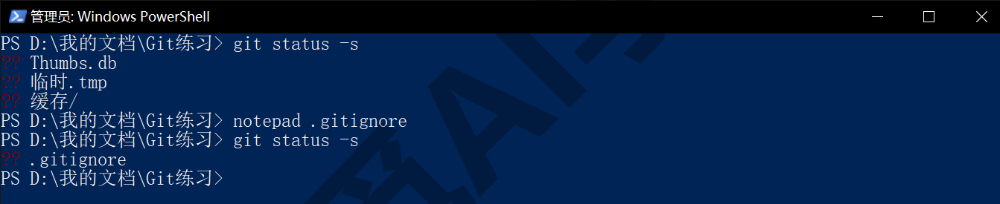

**现成的模板。** GitHub 官方有一套按语言和工具分类的 `.gitignore` 模板，新建仓库时可以直接选用，《GitHub 与远程仓库》会讲到；网上搜“gitignore 模板”也能找到。对课程文档、笔记库这类项目，上面那几行加上你用的软件的缓存目录就够了。

**Obsidian 笔记库的例子。** 库里的 `.obsidian` 文件夹存的是设置和插件，其中 `workspace.json`、`workspace-mobile.json` 记录的是你当前打开了哪些标签页、面板怎么排，每次开关软件都会变，记进历史毫无意义，而且在两台电脑之间同步时几乎一定会冲突。所以笔记库的 `.gitignore` 里通常有这样一行：

```text
.obsidian/workspace*.json
```

而 `.obsidian` 里的其他设置文件（主题、快捷键、插件列表）通常值得保留，这样换电脑时设置也跟着走。Obsidian 课《同步与备份全解》从笔记软件的角度讲过这件事，《实战二：笔记与文档库的备份同步》会完整走一遍。

**已经提交过的文件，再加进 `.gitignore` 不生效。** 这是最常见的坑：一个 log 文件先被提交了，之后你把 `*.log` 写进 `.gitignore`，却发现它一有改动，status 里还是会列出它。原因是 `.gitignore` 的规则只对未跟踪的文件起作用，已经在记录里的文件不受影响。解决办法是把它从记录里拿掉但保留在磁盘上：

```text
git rm --cached 运行.log
```

输出 `rm '运行.log'`。再看 status -s，会显示 `D  运行.log`：对仓库来说它被删除了（大写 D 在第一位，表示这个删除已经在暂存区），但文件本身还好好地在文件夹里。提交这次删除，以后它就真正被忽略了。

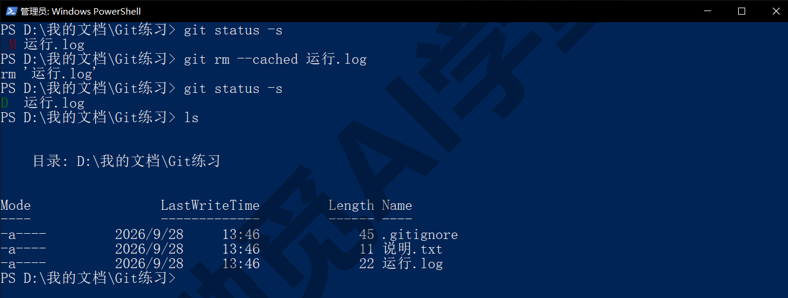

### 2.9 改名、移动与删除

**直接在资源管理器里改名。** 你可以像平时一样右键改名。改完看 status，Git 会显示旧名字被删除、新名字是未跟踪文件：

```text
Changes not staged for commit:
	deleted:    素材/图1.txt

Untracked files:
	素材/封面.txt
```

这时敲 `git add .`（或 `git add -A`）再看 status，Git 会发现这两个文件内容相同，自动识别为改名：

```text
Changes to be committed:
	renamed:    素材/图1.txt -> 素材/封面.txt
```

所以改名和移动文件不需要特殊操作，正常改、正常 add 即可，Git 靠内容识别。只有一种情况它识别不出来：改名的同时又大幅修改了内容，这时它会当成“删了一个、新建一个”，历史上这个文件的连续性就断了。想保持连续，先提交改名、再提交内容修改。

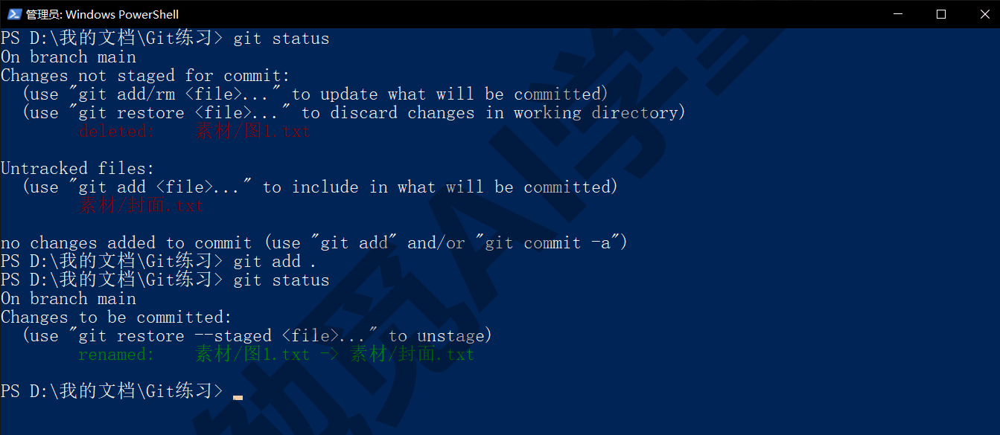

**用 git mv 改名。** 也可以让 Git 直接来做，一步到位、自动进暂存区：

```text
git mv 素材\图2.txt 素材\配图2.txt
```

status -s 里立即显示 `R  素材/图2.txt -> 素材/配图2.txt`。两种方式结果一样，任选一种即可。把文件移动到另一个文件夹也是同一条命令，目标写成新路径即可：`git mv 说明.txt 文档/说明.txt`（目标文件夹要先存在）。

**Windows 上只改大小写的坑。** Windows 的文件系统默认不区分大小写，把 `readme.md` 改名成 `README.md`，资源管理器认为是同一个文件，Git 也可能察觉不到。想让 Git 记下这次大小写变化，用 `git mv` 来改：`git mv readme.md README.md`（个别旧版本会提示 destination exists，加 `-f` 即可）；或者分两步，先改成一个完全不同的临时名再改回目标名。这个坑在把仓库推到 GitHub、与用 Linux 的人合作时会暴露出来，因为 GitHub 和 Linux 都把大小写不同的名字当成两个文件（Mac 默认和 Windows 一样，不区分大小写）。

**删除文件。** 在资源管理器里删掉一个文件后，status 会在未暂存段显示 deleted；`git add .` 之后它进入已暂存段，提交后这个文件就从仓库的最新状态里消失了。注意“消失”只是最新一版没有它，它在历史里仍然存在，随时可以从旧提交里找回来，具体做法见《撤销、还原与找回》。提交删除时的输出会带一行 delete mode：

```text
[main 2263e92] 改名图2，删图3
 2 files changed, 1 deletion(-)
 delete mode 100644 素材/图3.txt
 rename 素材/{图2.txt => 配图2.txt} (100%)
```

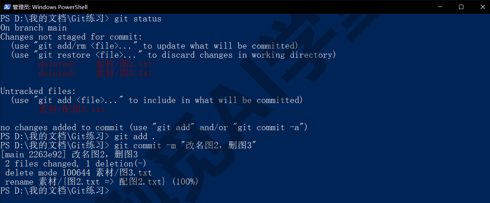

**误删了文件，还没提交这次删除。** 如果一个文件已经提交过、你不小心在工作区把它删了，还没提交这次删除，`git restore 文件名` 就能把它从上次提交里取回来。这是《撤销、还原与找回》要讲的第一个场景。

### 2.10 git commit --amend：修最近一次提交

刚提交完就发现两种小问题很常见：说明写错了字，或者漏了一个文件没 add 进去。这两种都不需要再提交一次“修正上一次”，用 `--amend` 可以直接修改最近那一次提交。

**改说明。** 带上新的 `-m`：

```text
git commit --amend -m "改名图2，删除图3（说明写清楚）"
```

输出和普通提交一样，但注意短哈希变了（比如从 2263e92 变成 dd1fe3b）：amend 实际上是用一次新提交替换掉了旧的那次，所以编号会变。用 `git log --oneline` 看，历史里只有新的这一条，旧的不见了。

**补漏掉的文件。** 先把漏掉的文件 add 进暂存区，再 amend 并保留原说明：

```text
git add 漏掉.txt
git commit --amend --no-edit
```

`--no-edit` 表示说明不改。用 `git show --stat HEAD` 看，最近一次提交的文件列表里已经多了这个文件：

```text
 漏掉.txt                    | 1 +
 素材/图3.txt                | 1 -
 素材/{图2.txt => 配图2.txt} | 0
 3 files changed, 1 insertion(+), 1 deletion(-)
```

原来那次提交只涉及 2 个文件，现在变成了 3 个，说明补进去了。如果 amend 时既不带 `-m` 也不带 `--no-edit`，Git 会打开编辑器让你确认说明，里面预先填好了原说明，直接保存关闭就等于不改。

**AI 工具替你提交之后想补一笔。** Codex 或 Cursor 帮你做了一次提交，你接着又改了一个小地方、觉得应该和刚才那次算同一件事，这时用 amend 正合适：自己 add 之后 `--amend --no-edit` 即可，不必再让 AI 提交一次“补漏”。

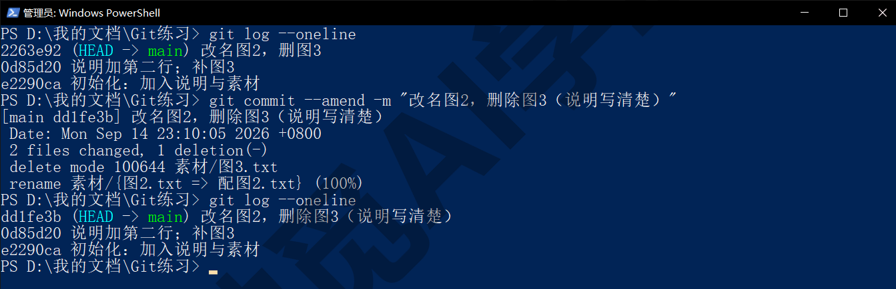

**什么时候不该用 amend。** 如果发现问题的时候已经又提交了新的内容，amend 修的是最新那一次，不是你想改的那一次；这时不要勉强用 amend，直接再提交一次“修正说明”或“补漏文件”即可，历史多一条并没有坏处。另一种常见误用是把 amend 当成“合并多次提交”的工具，连续改一点就 amend 一次，结果一次提交越滚越大、说明越来越对不上内容，违背了一次提交只做一件事的原则。

**amend 有两条限制。** 它只能修最近的一次；更早的提交要改，方法在《撤销、还原与找回》。更重要的一条：**只对还没推到 GitHub 上的提交用 amend**。因为它替换了历史，如果那次提交已经推上去、别人已经拿到了，你再替换会造成两边历史不一致，《GitHub 与远程仓库》会讲这个问题怎么处理。在本机自己用的阶段，放心 amend，不会有风险。

### 2.11 提交节律：多提交、少强推、先 status

学完前面十节，命令都会了，剩下的是怎么把它们用成习惯。这一节讲三句话，本课后面会反复回到它们。

**多提交。** 一次提交只做一件事，做完一件事就提交。判断“一件事”的标准有三条：能用一句话说清楚它改了什么；这些改动都是为了同一个目的；以后想撤销它时能独立撤掉、不牵连别的。按这个标准，写文档时“写完一节”提交一次，整理文件时“整理完一个文件夹”提交一次，一天下来五到十次提交是正常的。提交越勤，可以倒回去的点就越密，《撤销、还原与找回》讲的所有找回办法，都要你先提交过才用得上，没提交过的改动，Git 基本无能为力。

**少强推。** 这一条要到《GitHub 与远程仓库》才用得上，先记住名字：有一类带“强制”“force”字样的命令会覆盖别处的历史，AI 工具偶尔会建议你用，看到时先停下来问一句为什么。

**先 status。** 任何动手之前先敲一次 `git status`，看清楚三个区现在什么状态，再决定 add 什么、提交什么、撤什么。这是最便宜的保险，几乎所有“怎么会这样”的困惑，都是因为动手前没看一眼。

**提交说明的模板。** 如果你想固定一个格式，可以用“动词 + 对象 + 必要的原因”的一行式，比如“补充 2.8 节 gitignore 的 Obsidian 例子”“删除重复的旧配图，已合并到新图”。不必学程序员那套在开头加 fix、feat 这类固定标记的写法，能让三个月后的自己看懂就够。

一天下来，一份节律合适的历史大概是这样的：

```text
02c9731 补充 2.8 节 gitignore 的 Obsidian 例子
c8ab0e1 修正 2.3 节状态码说明的两处笔误
8b496b2 重写 2.1 节暂存区的解释，加五文件两次提交的例子
e7a5178 删除素材文件夹里三张未引用的旧截图
863fabf 开工前存档：昨晚的零散修改
```

每一行都能独立读懂，任何一行以后想单独撤掉都不牵连其他行。对比一下两种不合适的样子：一种是一天只有一条“更新文档”，另一种是二十条“改”“再改”“继续改”。前一种想单独撤掉其中一处改动时做不到，后一种翻历史时满眼都是琐碎记录。

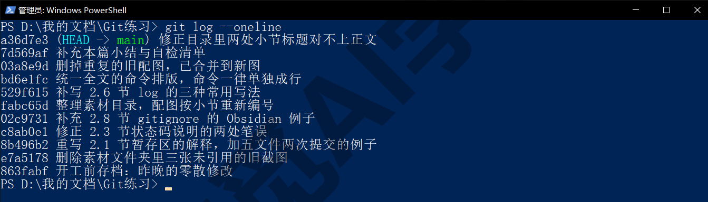

**在 AI 工具和图形界面里，这一步是什么样子。** Codex 的审查面板里，“暂存全部”和“逐块暂存”就是 add，“提交”就是 commit，面板里列出的改动就是 diff，具体位置见 Codex 课《自动化、Git 与远程操控》。Cursor 的差异视图可以逐文件暂存和提交，见 Cursor 课《Git、GitHub 与代码审查》13.2 节。这两个工具会替你生成提交说明，按 2.5 节的标准读一遍再确认；它们做的每一步都对应本篇的一条命令，你现在已经读得懂了。想用 GitHub Desktop 这类图形界面完成本篇全部操作的读者，见《图形界面与 AI 工具里的 Git》9.3 节的 Changes 与 History 面板。

### 2.97 练习任务

方括号里的内容换成你自己的。

**任务一：做五次有意义的提交。** 在 `[你的练习文件夹]` 里继续工作：新建两个文件、修改一个、删除一个、改名一个，每做完一件事就提交一次，说明按 2.5 节的标准写。最后：

```text
git log --oneline
```

完成标准：log 里至少有 5 条提交；只读说明就能看出每次做了什么；没有“更新”“修改”这类空说明。

**任务二：让缓存文件消失，并把一个已提交的文件改成忽略。** 在练习文件夹里新建一个 `缓存` 文件夹（里面随便放一个文件，空文件夹 Git 本来就不会显示）和一个 `test.tmp` 文件，写 `.gitignore` 让它们不出现在 status 里并提交；然后故意提交一个 `运行.log`，再把 `*.log` 加进 `.gitignore`，用 rm --cached 把它从记录里拿掉并提交：

```text
git status -s
git rm --cached 运行.log
git status -s
```

完成标准：第一次 status -s 里看不到缓存文件夹和 .tmp 文件；rm --cached 之后 status -s 显示 `D  运行.log`，而文件仍在文件夹里；最后一次提交后 status 干净。

**任务三：说出每个文件在哪一区。** 同时改三个已提交过的文件，只 add 其中两个，再新建一个文件不 add，然后：

```text
git status
git diff
git diff --staged
```

完成标准：能指着 status 的三段说出每个文件此刻在三区图的哪个位置；能说出 `git diff` 与 `git diff --staged` 各显示了哪几个文件、为什么。

### 2.98 本篇小结与自检

这一篇画出了全课最重要的三区图（工作区、暂存区、仓库），并把日常记账的全部命令放到了图上：init 建仓库，status 看三区差别，add 送进暂存区，commit 封进仓库，log 翻历史，show 看一次提交，diff 看改动，`.gitignore` 排除不该记的文件，改名删除正常操作后 add 即可，amend 修最近一次提交；最后给出了“多提交、少强推、先 status”三句话和一次提交只做一件事的节律。

可以对照下面的清单检查学习结果：

- [ ] 能画出三区图，并把 add、commit、status、diff 放到图上正确的位置
- [ ] 知道 `.git` 文件夹是什么、删掉它会怎样、init 常见的两个坑
- [ ] 能读懂 status 完整格式的三段，以及短格式开头两个字符的含义
- [ ] 会 add 单个文件、文件夹、全部；知道 add 记的是“此刻的内容”
- [ ] 能写出合格的提交说明；知道忘了 -m 掉进编辑器怎么退出
- [ ] 会用 `--oneline`、`--stat`、`-- 文件名` 翻历史，知道按 q 退出翻页
- [ ] 能读懂 diff 的加号减号行，知道 `--staged` 和 `--word-diff` 什么时候用
- [ ] 会写 `.gitignore` 的四种规则；知道已提交的文件要用 rm --cached 才能改成忽略
- [ ] 知道改名、删除正常操作即可，amend 只修最近一次，而且只在未推送前用
- [ ] 能说出“多提交、少强推、先 status”各是什么意思

完成这些内容后，你已经能独立维护一个仓库的日常记录了。下一篇《撤销、还原与找回》讲版本管理最有价值的部分：改坏了、删错了、提交错了，分别怎么倒回去，以及为什么“只要提交过就几乎救得回来”。

### 2.99 新手常见问题

**Q1：我改了文件，为什么 git status 说 working tree clean？**

先确认终端提示符里的路径是不是这个仓库，很多时候是在别的文件夹里敲了命令。其次确认改的文件是否被 `.gitignore` 忽略了，被忽略的文件改动不会显示。最后确认这个文件夹本身是不是仓库（没有 `.git` 文件夹的话，任何 git 命令都会报 not a git repository），以及有没有仓库套仓库。

**Q2：提交说明写中文行不行？**

行。Git 对说明的语言没有任何要求，中文、英文、混写都可以。唯一要注意的是终端的编码：现代的 Windows 终端和 PowerShell 处理中文没有问题；如果你在别的终端里看到说明变成乱码，多半是那个终端的显示编码问题，提交本身没坏。

**Q3：`.git` 文件夹能删吗？删了会怎样？**

能删，但等于让这个文件夹忘掉全部历史：文件夹里现在的文件保留，所有提交记录、分支和这个仓库自己的配置全部消失（`.gitignore` 是普通文件，会留下），而且不可恢复（除非你之前推到过 GitHub 或复制过整个文件夹）。除了“这个文件夹我不想用 Git 管了”之外，没有理由删它。

**Q4：提交那么多次，会不会把硬盘占满？**

不会。Git 对内容相同的文件只存一份，多次提交之间共用；对改动过的文本文件，它在后台还会压缩，并且只保存两个版本之间不同的部分。一个几百次提交的文稿仓库通常只有几 MB。真正会撑大仓库的是反复修改的大体积二进制文件（视频、大图、安装包），这类东西按 2.8 节的原则不放进仓库。

**Q5：一天应该提交几次？**

没有固定数字，标准是“做完一件能一句话说清的事就提交”。写作类项目一天五到十次很正常；整理类项目可能一次整理完一个文件夹就提交一次。宁多勿少：提交多了最坏的情况是历史有点琐碎，提交少了最坏的情况是想倒回去时发现没有存档点。
