## 撤销、还原与找回

上一篇《第一个仓库：提交与历史》把日常记账的命令讲完了，也提出了“多提交、少强推、先 status”三句话。这一篇讲版本管理最有价值的部分：改坏了、删错了、提交错了、找不到了，分别怎么倒回去。Git 里“撤销”不是一条命令，而是一组命令，各管一种情形；新手最大的困惑就是分不清什么时候用哪条。所以这一篇先给你一张表，再按表逐条展开，最后列出真正危险的几个动作和对应的安全习惯。

这篇文章的实操内容不需要花钱：全部在本机的 Git 里完成，不需要账号。

### 3.1 先分情形，再选办法

“我想撤销”这句话在 Git 里至少对应六种不同的情形，每种情形的办法不同，用错了要么没效果，要么把东西弄丢。下面这张表是全篇的总图，之后每一节展开其中一行；遇到问题时先在表里找到自己的情形，再动手。

| 情形 | 你想要的效果 | 用什么 | 见 |
| --- | --- | --- | --- |
| 改了文件，还没 add | 把文件变回上次提交的样子 | `git restore 文件` | 3.2 |
| add 了，还没 commit | 把文件从暂存区拿下来，内容不变 | `git restore --staged 文件` | 3.3 |
| commit 了，还没推到 GitHub | 撤掉最近的提交 | `git reset` 三档 | 3.4 |
| 已经推到 GitHub | 用一次新提交抵消旧提交 | `git revert` | 3.5 |
| 想看看旧版本是什么样子 | 临时回到某次提交，看完回来 | `git switch --detach` | 3.6 |
| 提交或分支“不见了” | 从 Git 的操作日志里找回 | `git reflog` | 3.7 |

表里的前四行按“改动走到了三区图的哪一步”排列：还在工作区、进了暂存区、进了仓库、进了远程仓库，越往后，撤销的办法越不容易丢东西。后两行是另外两种需求：“回头看”（并不撤销任何东西）和“找回”。

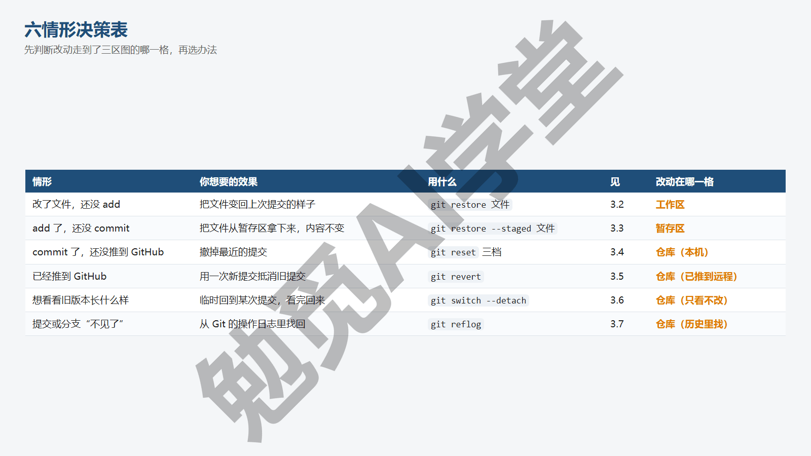

**动手前先做两件事。** 第一，所有撤销操作前先 `git status`，看清此刻三个区的状态，确认自己属于表里哪一行；第二，涉及丢弃工作区改动的操作（3.2、3.4 的第三档、3.9）前先 `git diff` 看一眼要丢的到底是什么。这两步各花五秒，能避免绝大多数撤错的情况。

用两个例子练一下“查表”。例子一：你让 AI 重写一篇文稿的第三节，它把第一节也一并改了，你还没 add。这是第一行，对第一节那个文件用 `git restore`，第三节的改动不受影响。例子二：你把一份含密码的配置文件提交了，还没推到 GitHub。这是第三行，用 reset 退掉那次提交（改动会回到工作区，把密码文件加进 `.gitignore` 再重新提交）；如果已经推上去了，就是第四行，用 revert 把它抵消掉，同时立刻去修改那个密码，因为历史里那份仍然能被看到，《GitHub 与远程仓库》6.6 节会专门讲这种情况。两个例子的区别只在“改动走到了哪一步”，办法就完全不同，所以要先查表。

另有两条不在表里但同样常用的命令放在后面：3.8 的 stash 用在手头做了一半要切走的时候，3.9 的 clean 用来一次删掉一批没跟踪的文件。3.10 节列出全篇真正危险的动作。

### 3.2 改了还没 add：git restore

这是最常见的情形：你在工作区改了一个文件（或者 AI 替你改了），改坏了，想让它变回上次提交时的样子。

**先看要丢的是什么。** 假设 `说明.txt` 上次提交时有三行，现在被改成了一行“改坏了”。`git status -s` 显示 ` M 说明.txt`；`git diff` 显示：

```text
@@ -1,3 +1 @@
-第一行
-第二行
-第三行
+改坏了
```

减号开头的三行是原来的内容，加号开头的一行是改坏后的内容，确认要丢的就是这次改动。

**还原。**

```text
git restore 说明.txt
```

没有任何输出。再看 status，已经干净；打开文件，三行回来了。回到三区图上，restore 做的是“用暂存区里的版本覆盖工作区里的这个文件”；平时你没有 add 过，暂存区和仓库里最新那一版是一样的，所以效果就是退回上次提交时的样子。

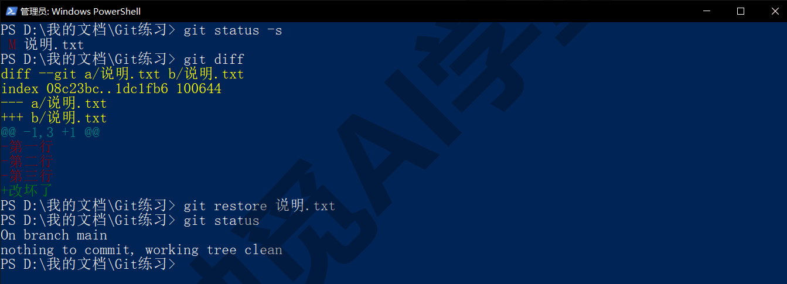

**几种范围。** 还原一个文件夹里的全部改动，写文件夹名；还原整个工作区的全部改动，写一个点：

```text
git restore 素材
git restore .
```

最后那条要格外小心：它会丢掉工作区里所有已跟踪文件的未暂存改动，事先不会征求你的确认，而且不可撤销。用之前一定先 diff。一次还原多个指定文件用空格隔开：`git restore 说明.txt 素材/封面.txt`。

**只还原一部分文件的典型场景。** AI 工具一次改了五个文件，其中三个改得好、两个改坏了，你只想丢掉那两个。做法是先用 `git status -s` 列出五个文件，`git diff 文件名` 逐个确认哪两个要丢，然后只对那两个 restore，其余三个照常 add、commit。这比在 AI 工具里把这一轮的改动整个回退、再让它重做一遍快得多，也是本课反复强调“先 status、先 diff”的原因：看清楚之后再动手，丢掉的就只会是确实不要的那部分。

**误删了已跟踪的文件。** 在资源管理器里删掉一个已经提交过的文件，还没提交这次删除，同样用 `git restore 文件名` 找回。对 Git 来说，“文件被删”只是一种改动，restore 把它从仓库里再取出来即可。这个用法比“从回收站找”更可靠，因为通过终端或 AI 工具删除的文件往往不进回收站。

**它丢掉的东西找不回来。** restore 丢掉的是从没提交过的改动，Git 没有任何地方存着它们；“未提交的改动被丢掉”是全篇唯一一类真的救不回来的情况，所以它排在危险清单的第一位（3.10）。反过来看，这也是要“多提交”的原因：改动一旦提交过，就总有办法救回来。

**旧写法。** 老资料和一些 AI 工具会用 `git checkout -- 文件` 做同一件事，效果相同。checkout 这条命令以前同时管着好几件事，新版 Git 把它拆成了 switch（切分支）和 restore（还原文件）两条更清楚的命令，本课统一用新写法，看到旧写法知道是同一回事即可。

### 3.3 add 了还没 commit：git restore --staged

第二种情形：文件已经 add 进暂存区了，你想把它拿下来，可能是不该记的文件不小心 add 了，也可能是想把这次改动拆成两次提交。注意这里的需求是“从清单上拿掉”，不是丢掉改动。

假设你给 `说明.txt` 加了第四行并 add 了，`git status -s` 显示 `M  说明.txt`（M 在第一位，表示改动在暂存区）。执行：

```text
git restore --staged 说明.txt
```

再看 status -s，变成 ` M 说明.txt`（M 挪到了第二位）：改动从暂存区回到了工作区，文件内容一个字没变，只是不再在下次提交的清单上。这条命令对应 status 提示里那句 (use "git restore --staged <file>..." to unstage)。

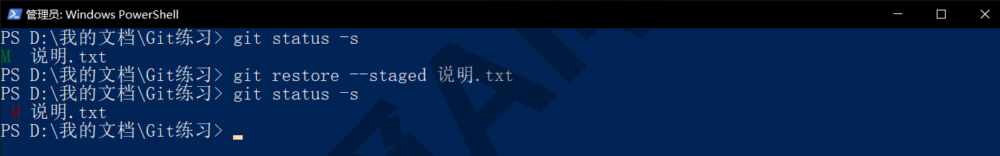

**和 3.2 的区别。** 用下面这张小图记住：`git restore 文件` 是拿暂存区里的版本覆盖工作区（平时暂存区和仓库最新版一致，所以就是退回上次提交），改动被覆盖、真的没了；`git restore --staged 文件` 是拿仓库里的版本覆盖暂存区，只动清单、工作区里的改动一点不动。两条命令都叫 restore，多了 `--staged` 就是只动暂存区。如果两步都想做（既从清单拿掉又丢掉改动），先用 `--staged` 再用普通 restore，或者直接用 3.4 要讲的 `reset --hard`。

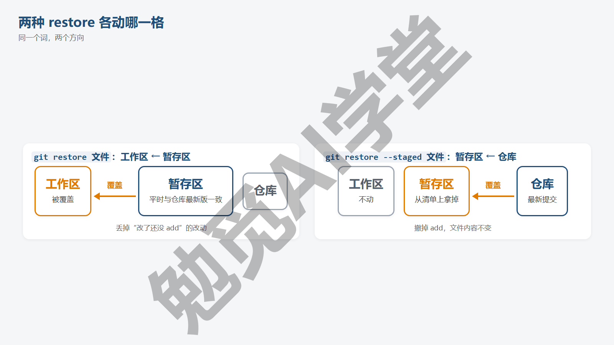

**用它把一次改动拆成两次提交。** 这是 `--staged` 最有用的场景。假设你改了三个文件后习惯性地 `git add .`，然后想起其中一个属于另一件事，应该单独提交：

```text
git restore --staged 第二节.md
git commit -m "补充第三节内容"
git add 第二节.md
git commit -m "修正第二节错别字"
```

第一条把第二节从清单上拿下来，第二条提交剩下两个文件，第三、四条再单独处理第二节。四条命令之后，历史里是两次提交、每次只记一件事，工作区里的内容一个字没变。

**常见坑。** 有人想“撤掉暂存”时敲的是 `git restore 文件`（少了 `--staged`），结果不但没从清单上拿下来，工作区里的改动还被覆盖了，因为普通 restore 用的来源是暂存区里的版本，而暂存区里正是你刚 add 的那份，看起来像“没反应”，其实是把工作区改成了和暂存区一样。记住口诀：动清单加 `--staged`，动文件不加。拿不准时先敲 `git status`，它的提示里会明确写出此刻该用哪一条。

仓库里还没有任何提交时（比如刚 init 完做第一次 add），status 提示里写的是 (use "git rm --cached <file>..." to unstage)，因为这时还没有“上次提交”，`--staged` 也就取不到东西，要用 `git rm --cached 文件` 把它从暂存区拿下来，文件留在磁盘上；《第一个仓库：提交与历史》2.8 节用同一条命令处理过已提交的忽略文件。有了第一次提交之后，提示里写的就都是 `git restore --staged`。

### 3.4 commit 了还没推：git reset 三档

第三种情形：已经提交了，但发现这次提交不该有。说明写错只是小事，用《第一个仓库：提交与历史》讲过的 `git commit --amend` 改一下说明就行；这里说的是整次提交都想撤掉。只要这次提交还没推到 GitHub，`git reset` 就是办法。它有三档，区别在于“撤掉提交之后，那些改动去哪”。

下面用同一个起点演示三档：仓库里有 v1、v2、v3 三次提交，现在要撤掉 v3。`HEAD~1` 表示“当前提交的上一次”，也就是 v2，所以三条命令都是“把当前位置退回到 v2”。

**第一档：--soft，提交撤了，改动留在暂存区。**

```text
git reset --soft HEAD~1
```

没有输出。`git log --oneline` 里 v3 不见了，只剩 v2、v1；`git status -s` 显示 `M  说明.txt`，v3 的改动完整地留在暂存区，随时可以重新提交。适合“提交说明整个想重写”或“想把两次提交合成一次”的场景：用 soft 退一步，再 commit 一次即可。

**第二档：--mixed（默认），提交撤了，改动回到工作区。**

```text
git reset HEAD~1
```

输出：

```text
Unstaged changes after reset:
M	说明.txt
```

log 里 v3 同样不见了；status -s 显示 ` M 说明.txt`，改动回到了工作区，暂存区是空的。不写档位就是这一档。适合“这次提交里混了几件事，想重新分开提交”的场景。

**第三档：--hard，提交撤了，改动也一起丢。**

```text
git reset --hard HEAD~1
```

输出：

```text
HEAD is now at 7c610cf v2 加第二行
```

log 里 v3 不见了，status 干净，打开文件，第三行也没了，工作区被直接改回 v2 的样子。这是三档里唯一会丢内容的一档，也是全篇第二个进危险清单的命令。

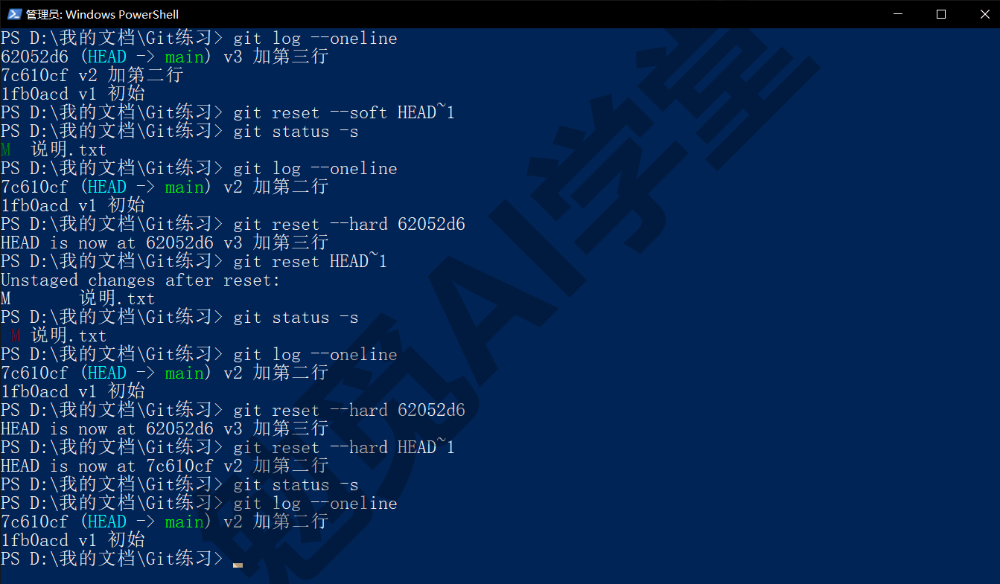

**三档怎么记。** 三区图从右往左数：soft 只动仓库（第三格），mixed 动仓库和暂存区（第二、三格），hard 三格全动。三档的区别只在改动被退回到哪一格，按你还想不想要这份改动来选。

**--hard 丢掉的还能找回吗。** 被 reset 掉的那次提交 v3 其实没有从 `.git` 里消失，只是没有任何分支指向它了，3.7 节会教你用 reflog 把它找回来。但 `--hard` 同时丢掉的“工作区里从没提交过的改动”是找不回来的，和 3.2 的情况相同。所以敲 `--hard` 之前先 status，确认工作区没有你还想要的未提交改动。

**只对没推出去的提交用。** reset 是改写历史：它让某几次提交从历史里消失。如果那几次提交已经推到了 GitHub、别人也拿到了，你本机把它们抹掉，两边历史就对不上了，下次推送会被拒绝。已经推出去的提交要撤，用下一节的 revert。

**更多写法。** `HEAD~2` 退两次；也可以直接写目标提交的短哈希，比如 `git reset --hard 7c610cf`，意思是“回到这一次提交的状态”。

### 3.5 已经推到 GitHub：git revert

第四种情形：提交已经推到 GitHub 上了（《GitHub 与远程仓库》之后你会经常遇到这种情况），发现它有问题想撤。这时不能用 reset 抹掉历史，正确的做法是再提交一次“反向改动”，把那次提交的效果抵消掉。这就是 revert。

```text
git revert HEAD
```

它会打开编辑器让你确认这次反向提交的说明（默认写好了 Revert "原说明"，直接保存关闭即可；不想被编辑器打断可以加 `--no-edit`）。输出：

```text
[main e430888] Revert "v3 加第三行"
 1 file changed, 1 deletion(-)
```

`git log --oneline` 显示：

```text
e430888 Revert "v3 加第三行"
62052d6 v3 加第三行
7c610cf v2 加第二行
1fb0acd v1 初始
```

注意 v3 仍然在历史里，只是上面多了一次“撤销 v3”的提交。打开文件，第三行没了，效果上等于撤掉了 v3，但历史一条没少。这样推到 GitHub 上时，别人拿到的只是“多了一次提交”，不会有任何冲突。

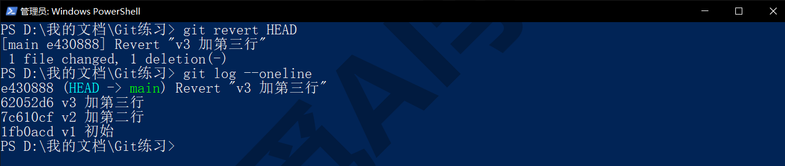

**reset 与 revert 的取舍。** 两者都能“撤掉一次提交”，区别是：

- **reset**：从历史里抹掉，历史变短；只能用在还没推出去的提交上；可以一次退多步。
- **revert**：往历史里添一次反向提交，历史变长；推出去的提交也能安全用；每次只撤一个提交，撤多个就 revert 多次。

判断标准很简单：这次提交只有你自己的电脑上有，用 reset；已经推出去了，用 revert。拿不准的时候，用 revert 更稳妥。

**revert 之后又后悔了。** 因为 revert 本身也是一次普通提交，撤掉它的办法就是再 revert 一次：`git revert HEAD` 会生成一次“Revert "Revert ..."”的提交，效果上把原来的改动又恢复了。历史里三次提交并存，看起来啰嗦，但每一步都留着记录、都查得到，这也是它比 reset 稳妥的地方。

**一次撤多个。** 想把连续几次提交一起抵消又不想生成好几条 Revert 提交，可以加 `--no-commit`：`git revert --no-commit 哈希1 哈希2`，Git 会把反向改动都放进暂存区而不自动提交，你检查无误后自己 commit 一次即可。中途想放弃，`git revert --abort` 回到动手前的状态。

**撤更早的提交。** revert 后面可以写任意提交的短哈希，不一定是 HEAD：`git revert 7c610cf` 会生成一次“抵消 v2 效果”的提交。如果 v2 之后的提交改了同一处内容，Git 可能报冲突，处理办法见《冲突与工作树》。撤掉一次合并提交需要额外参数，日常很少用到，本课不展开。

### 3.6 只想回头看看：git switch --detach

第五种情形不是撤销，而是“想看看上周那一版是什么样子”，看完还要回到现在。这种需求用 switch 加上 `--detach`：

```text
git switch --detach 1fb0acd
```

输出：

```text
HEAD is now at 1fb0acd v1 初始
```

此时打开文件夹，所有文件都变成了 v1 那一刻的样子。不是模拟，是工作区真的被换成了那个版本。你可以随意翻看、复制需要的内容出去。`git status` 显示：

```text
HEAD detached at 1fb0acd
nothing to commit, working tree clean
```

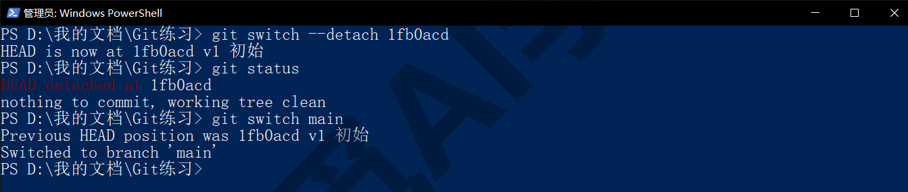

**detached HEAD 是什么，为什么不可怕。** 《第一个仓库：提交与历史》说过 HEAD 是“你此刻站在哪个提交上”的指针，平时它落在分支 main 的最新提交上。现在你让它站到了一个历史提交上，没有落在任何分支上，这个状态就叫 detached HEAD（分离的 HEAD）。用旧写法 `git checkout 哈希` 进入这个状态时，Git 会打印一大段英文解释，不少新手被吓到，其实它只是在告诉你：在这里做的新提交不属于任何分支，切走之后可能找不回来。所以规矩很简单：**在这个状态下只看不改**，看完就回去。

**怎么回来。**

```text
git switch main
```

输出两行：先是 Previous HEAD position was …，告诉你刚离开的是哪个提交；再是 Switched to branch 'main'，工作区立刻变回最新状态。

**不小心在这个状态下提交了怎么办。** 如果你忘了规矩、在 detached HEAD 下做了一次提交，不要直接 `git switch main`，那样这次提交就没有分支指着它了（虽然 3.7 节的 reflog 还能救）。正确做法是先给它建一条分支：`git switch -c 临时分支`，这会以当前位置新建一条分支并切过去，刚才的提交就保住了，之后按《分支与合并》的办法处理这条分支。

**只是想比较，不必切过去。** 很多“回头看”的需求其实是“想知道这一版和那一版差在哪”，这用 diff 就够了，不需要进入 detached HEAD：`git diff 1fb0acd HEAD -- 说明.txt` 直接显示两个版本之间的差别，工作区不受任何影响。只有当你需要在旧版本的完整环境里翻看、复制多个文件时，才真的切过去。

**只想拿回旧版本里的一个文件。** 更常见的需求是：现在的版本挺好，只是想把某个文件恢复成两周前的样子。这不需要整个切过去，用 restore 加 `--source` 指定来源提交即可：

```text
git restore --source=1fb0acd 说明.txt
```

执行后 `说明.txt` 变成 v1 时的内容，其他文件不动，status -s 显示 ` M 说明.txt`，它作为一次普通的工作区改动出现，你可以 diff 看看、满意就提交，不满意就用 `git restore 说明.txt` 回到现状。这是“从历史里取回一个文件”最干净的办法。

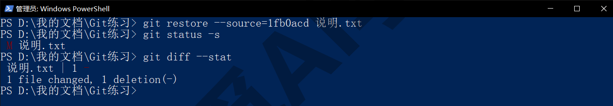

### 3.7 提交或分支“不见了”：git reflog

第六种情形：你 `reset --hard` 退过头了，或者删了一个分支之后发现上面还有没合并的提交，log 里怎么都找不到它们了。这时候用 reflog。

**reflog 是什么。** Git 除了记你的提交，还会记下 HEAD 每一次移动的日志：每次 commit、每次切分支、每次 reset，都是一条。这份日志只存在你本机、默认保留几十天，它就是“找回不见了的东西”的最后一道保障。

```text
git reflog
```

输出类似：

```text
7c610cf HEAD@{0}: reset: moving to HEAD~1
62052d6 HEAD@{1}: commit: v3 加第三行
7c610cf HEAD@{2}: commit: v2 加第二行
1fb0acd HEAD@{3}: commit (initial): v1 初始
```

最新的操作在最上面。第一行说“刚才做了一次 reset 退到 HEAD~1”，第二行就是被退掉的那次提交 v3，它的短哈希 62052d6 还在。如果你跟着前几节做下来，reflog 会比这长得多，前面每一次 reset、切换都在里面，往下找到提交说明是“v3 加第三行”的那一行就行。

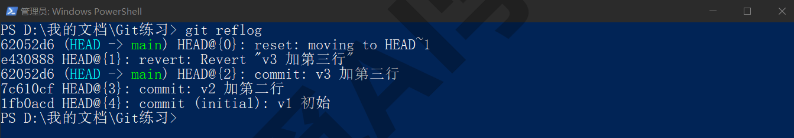

**找回被 reset 掉的提交。** 拿着这个哈希回去即可：

```text
git reset --hard 62052d6
```

输出 HEAD is now at 62052d6 v3 加第三行，log 里 v3 回来了，文件也回来了。

**找回删错的分支。** 分支删掉后，它上面那些独有的提交同样还在 reflog 里。假设你删了“实验”分支：

```text
git branch -D 实验
```

输出 Deleted branch 实验 (was afecebf)。Git 在删除时就把最后一次提交的哈希告诉你了。即使当时没记下来，`git reflog` 里也能找到那条分支上最后一次提交的记录，那一行以 commit: 开头、后面跟着它的提交说明（图里是 `commit: 实验：试一种新写法`）。然后在那个提交上重建分支：

```text
git branch 实验 afecebf
```

分支和它的全部提交就都回来了。

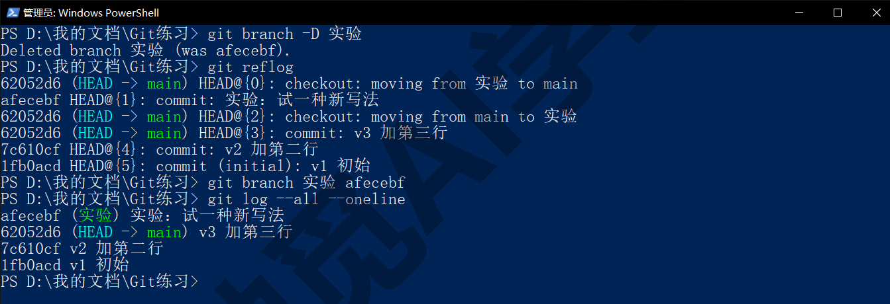

**它的两个限制。** 第一，reflog 只在本机：它记录的是这台电脑上 HEAD 的移动，把仓库推到 GitHub 或克隆到别处，reflog 不会跟着走。第二，它有保留期：默认情况下，还在某条分支历史里的记录保留约 90 天，已经不在任何分支上的记录保留约 30 天，过期后 Git 的清理机制可能真的把它们删掉（这两个期限都可以改，以你自己的设置为准）。所以“不见了”的东西要尽快找回，不要指望几个月后再来翻。想看每条记录的时间，加 `--date=iso`：`git reflog --date=iso`。

**它救不了什么。** reflog 记的是“HEAD 到过哪些提交”，所以只要提交过的东西都能找回；从没提交过的工作区改动（被 `restore` 或 `reset --hard` 丢掉的那部分）不在它的记录里。这也是本课反复强调“多提交”的原因：提交是最可靠的保险；reflog 只是在提交之后再多一层保障。

### 3.8 做了一半要切走：git stash

手头的改动做了一半，还不到提交的程度，但你需要先去处理别的事，比如切到另一个分支处理一件急事（《分支与合并》会讲），或者想先看看没有这些改动时的状态。直接切走会把半成品带过去或者被 Git 拦住，直接提交又不干净。stash 就是给这种场景的：把工作区的改动暂时收起来，工作区变干净，处理完再拿回来。

**收起来。**

```text
git stash
```

输出：

```text
Saved working directory and index state WIP on main: 62052d6 v3 加第三行
```

再看 status，已修改的文件都不见了，工作区回到最近一次提交的样子。WIP 是 work in progress（进行中）的缩写，后面是收起时所在的提交。

**新文件也要收。** 默认 stash 只收已跟踪文件的改动，未跟踪的新文件会留在工作区。要连新文件一起收，加 `-u`：

```text
git stash -u
```

**看有几份、拿回来。**

```text
git stash list
git stash pop
```

list 列出所有收起来的改动，最近的是 stash@{0}；pop 把最近一份拿回工作区并从列表里删掉，输出里会显示恢复了哪些文件，最后一行 Dropped refs/stash@{0} 表示这份已经用掉。想只拿回来但不删记录，用 `git stash apply`；想直接丢掉一份，用 `git stash drop`。

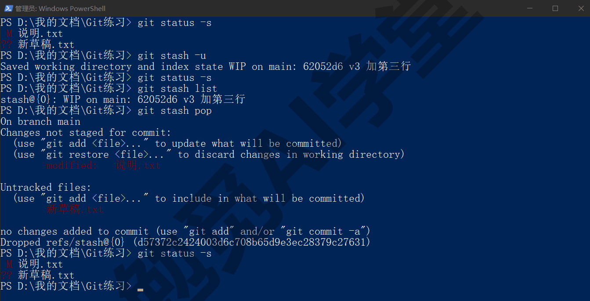

**给它写个说明。** 默认的 WIP on main 说明只告诉你收起时在哪个提交，收了两份就分不清了。写成 `git stash push -m "首页改版做了一半"` 就能带上自己的说明，list 里会显示这句话。想在拿回来之前先看看某一份里有什么，用 `git stash show -p 'stash@{0}'`，它会像 `git diff` 那样列出那份改动（`@{` 在 PowerShell 里有自己的含义，所以要用单引号包住，否则会被拆散报错；不带编号的 `git stash show -p` 默认就是最近一份）。

**一个典型的使用过程。** 你正在改首页文案，改了一半，同事说目录页有个错字要马上修。这时先用 `git stash push -m "首页文案改一半"` 把手头的改动收起来；修好目录页的错字，add、commit；再用 `git stash pop` 拿回首页的半成品继续改。整个过程里，修错字那次提交干干净净只含目录页，首页的半成品也一行没丢。如果 pop 时 Git 提示冲突（说明你在收起之后又改了同一处），按《冲突与工作树》的办法处理即可，收起的那份不会丢。

**什么时候别用 stash。** stash 是临时抽屉，不是存档：里面的东西没有说明、不在历史里、容易忘。收进去超过一天还没拿出来，多半就忘了。所以如果改动已经成型，宁可直接提交一次（说明写“进行中：xxx”也行），以后再用 amend 或新提交完善；stash 只用于“几分钟到几小时之内一定会拿回来”的场景。还有一个坑：在 A 分支 stash、切到 B 分支 pop，改动会落到 B 上，这有时正是你想要的（改错分支了），有时会把改动带错地方，pop 之前看清自己在哪。

### 3.9 清掉没跟踪的文件：git clean

restore 只管已跟踪的文件。工作区里那些从没 add 过的临时文件、构建生成的文件（程序把源文件加工成成品时自动生成的文件，随时能重新生成）、AI 工具留下的杂物，想一次清掉，用 clean。它删的是真实文件，所以设计成默认必须先预览。

**先看会删什么。**

```text
git clean -n
```

输出类似：

```text
Would remove 临时1.tmp
Would remove 临时2.tmp
```

Would remove 是“将会删除”，此时什么都还没删。默认不包含文件夹，加 `-d` 才会列出未跟踪的文件夹：`git clean -nd`。

**确认后真删。**

```text
git clean -fd
```

`-f` 是 force（强制），没有它 Git 会拒绝执行；`-d` 连文件夹一起删。每删掉一个文件，输出里就多一行 Removing 加文件名。被 `.gitignore` 忽略的文件默认不会被 clean 删掉，要连它们一起清用 `-x`，本课不推荐新手用。

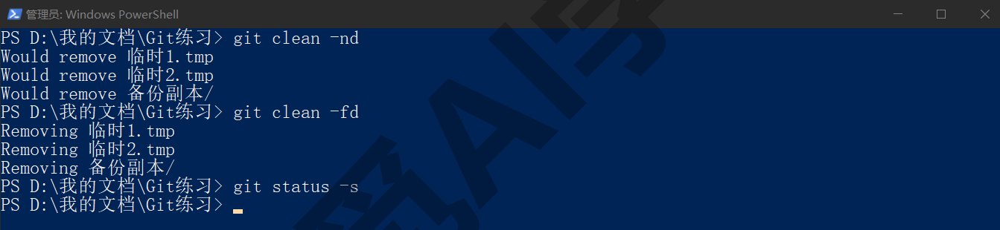

**只清某一个文件夹。** 在命令最后写上路径，clean 就只清理那里：`git clean -fd 构建` 只删“构建”文件夹里的未跟踪内容，其他地方不动。拿不准的时候还可以用交互模式 `git clean -i`，Git 会把要删的文件列出来，逐个问你删不删，适合第一次用这条命令的读者。举个例子：AI 工具做网页时在项目里生成了 `临时预览.html`、`备份副本/` 和几张测试图，都没 add 过；`git clean -nd` 预览列出四项，你发现其中一张测试图其实想留，就先把它 add 进暂存区，再 `git clean -fd`，剩下三项被清掉、那张图完好保留。

**和 restore 的分工。** 想让工作区完全回到最近一次提交的样子：`git restore .` 处理已跟踪文件的改动，`git clean -fd` 处理没跟踪的新文件，两条一起才是“彻底干净”。两条丢掉的东西都找不回来，都先预览再动手。

**什么时候会用到它。** 最典型的场景有两个。一是 AI 工具在工作区里试了几种方案，留下一批你不打算要的新文件和临时文件夹，逐个手动删很麻烦，clean 一次清完。二是从 GitHub 取回别人的项目、跑过一次之后生成了大量构建文件，想回到“刚取回来”的干净状态。两个场景里，你想保留的东西要么已经提交过、要么已经被 `.gitignore` 排除，剩下的才是 clean 的目标。

**常见坑。** 新手最容易犯的错是在 clean 之前忘了 add 一个刚写好的新文件。它是未跟踪状态，会被一并删掉，而且找不回来。所以 clean 之前先看一遍 `-n` 的预览列表，凡是列表里有你认识的、还想要的文件名，先把它 add 或提交，再清。另一个坑是在错误的文件夹里执行：clean 只清理当前文件夹和它下面的子文件夹，站在仓库根目录敲和站在某个子文件夹里敲，范围完全不同，动手前看一眼提示符里的路径。

### 3.10 危险动作清单与安全习惯

全篇讲完，把真正会丢东西的命令集中列一遍。它们可以用，但用之前要多看一眼。

| 命令 | 会丢什么 | 动手前 |
| --- | --- | --- |
| `git restore 文件` / `git restore .` | 工作区里未提交的改动 | 先 `git diff` |
| `git reset --hard` | 未提交的改动；被退掉的提交要靠 reflog 找回 | 先 `git status`，或先 `git stash` |
| `git clean -fd` | 所有未跟踪的文件和文件夹 | 先 `git clean -nd` |
| `git checkout -- .` | 同 `git restore .`，旧写法 | 同上 |
| `git push --force` | 远程仓库上别人的提交 | 见《GitHub 与远程仓库》，几乎总有更稳的办法 |

**三个习惯。** 全篇的安全习惯就三条：

- **动手前先 status**。《第一个仓库：提交与历史》提出的三句话里的最后一句，在这一篇里最有分量：六情形表的每一行都要先知道自己在哪一行。
- **拿不准就先 stash 或先提交**，把现状收起来或存下来，再做危险操作，最坏的情况也能退回到动手前。
- **每天开工前先提交一次**，哪怕说明只写“开工前存档”，这一次提交让你今天所有操作都有一个可以回去的点。

**AI 工具提出危险命令时。** Codex、Cursor 在处理 Git 问题时，偶尔会建议“执行 git reset --hard 清理状态”或“强制推送覆盖远程仓库”。它们的判断多数时候是对的，但它们不知道你工作区里有没有还没提交的重要改动。看到表里这几条命令时，先停下来问一句“这会丢掉什么”，自己 status 看一眼，再决定答不答应。《图形界面与 AI 工具里的 Git》9.9 节会把这条习惯和另外两条一起讲成完整的安全做法。

比如它回复“工作区有几处改动和上一次提交对不上，建议先执行 git reset --hard 恢复到干净状态再继续”。这时先别答应，自己敲一遍 `git status`：

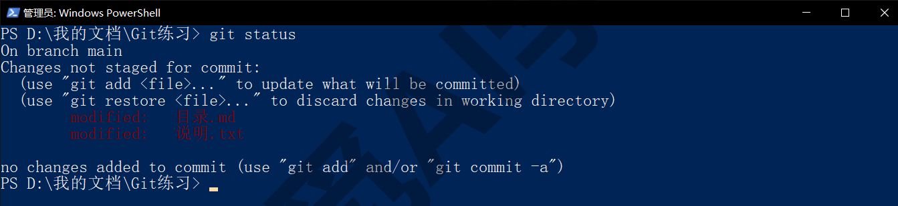

**在 AI 工具和图形界面里，这一步是什么样子。** Cursor 的检查点能把工作区回退到某一轮对话之前，Cursor 课《权限、沙盒与模型》3.6 节讲过它“只还原文件、不删对话消息”。它对应的是本篇 3.2 的场景，但只覆盖 AI 在对话里改过的文件，而且对话归档后就用不了了；本篇的 restore、reset、reflog 覆盖整个仓库的全部历史，两者是互相补充，谁也替代不了谁。Codex 审查面板里的“还原全部”“逐块还原”按钮，做的就是 3.2 的 restore（逐块版本相当于只还原文件里的一部分改动），见 Codex 课《自动化、Git 与远程操控》。GitHub Desktop 里对应的按钮是 Changes 面板的 Discard changes（丢弃改动）与 History 面板右键的 Revert changes in commit（撤销这次提交），见《图形界面与 AI 工具里的 Git》9.3 节。

### 3.97 练习任务

方括号里的内容换成你自己的。

**任务一：同一处改坏，三种办法各救一次。** 在 `[你的练习文件夹]` 里选一个已提交过的文件，重复三轮“改坏 → 救回”：第一轮改坏后不 add，用 restore 救；第二轮改坏并 add，先用 restore --staged 再用 restore 救；第三轮改坏并提交，用 reset --hard HEAD~1 救。每轮救回后：

```text
git status
git log --oneline -3
```

完成标准：三轮结束后文件内容与最初一致、status 干净；能说出三轮各自属于六情形表的哪一行、为什么不能互换。

**任务二：丢一次提交再找回。** 先做一次新提交并记下 log 里它的短哈希，然后用 reset --hard HEAD~1 把它退掉，确认 log 里已经没有它；再：

```text
git reflog
git reset --hard [那次提交的短哈希]
git log --oneline -3
```

完成标准：reflog 里能指出被退掉的那一行；找回后 log 里那次提交重新出现，文件内容也回来了。

**任务三：做一半切走，再拿回来接着做。** 改两个已跟踪文件、新建一个文件，不提交，用 stash -u 收起来，确认 status 干净；任意做一次别的小提交；再 pop 回来：

```text
git stash -u
git status
git stash pop
git status
```

完成标准：收起后 status 干净，而且 stash list 有一条；pop 后三个文件的改动都回来、stash list 为空。

### 3.98 本篇小结与自检

这一篇用一张六情形决策表把“撤销”拆成了六种不同的需求：改了没 add 用 restore，add 了没 commit 用 restore --staged，commit 了没推用 reset 三档（soft 留暂存区、mixed 回工作区、hard 全丢），已经推了用 revert 反向抵消，想回头看用 switch --detach 并只看不改、拿单个旧文件用 restore --source，找不见了用 reflog；另外讲了 stash 收起半成品、clean 清掉未跟踪文件，最后列出五个会丢东西的命令和三个安全习惯。

可以对照下面的清单检查学习结果：

- [ ] 遇到“想撤销”时能先说出自己属于六情形的哪一行
- [ ] 知道 `git restore 文件` 与 `git restore --staged 文件` 各动三区图的哪一格
- [ ] 能说出 reset 三档的区别，知道 `--hard` 是唯一丢内容的一档
- [ ] 知道 reset 与 revert 怎么选：没推出去用 reset，推出去了用 revert
- [ ] 进过 detached HEAD 状态并安全回到 main，知道在那里只看不改
- [ ] 用 restore --source 从旧提交里拿回过一个文件
- [ ] 用 reflog 找回过一次被 reset 掉的提交或删错的分支
- [ ] 用过 stash -u 与 stash pop，知道它不适合长期存放
- [ ] 用 clean 时先 `-n` 预览再 `-fd`
- [ ] 能背出危险清单的五条命令，知道 AI 提出它们时先问什么

完成这些内容后，你已经掌握了“只要提交过，几乎什么都救得回来”这套办法，可以放心地让 AI 大胆改文件了。下一篇《分支与合并》讲怎么在不影响正本的情况下并行试验几种不同的改动，以及试验成功后怎么把它合回来。

### 3.99 新手常见问题

**Q1：restore、reset、revert 三个词太像了，到底怎么选？**

按改动走到了哪一步选。改动还在工作区或暂存区，用 restore（加不加 `--staged` 看它在哪一区）；已经成了提交，看它推没推出去：没推用 reset，推了用 revert。记不住就回 3.1 的表，表里六行就是全部情形。

**Q2：reset --hard 之后真的全没了吗？**

分两部分。被退掉的那些提交没有消失，用 3.7 节的 reflog 能找回；但工作区里从没提交过的改动是真的没了，Git 没有任何地方存着它们。所以 `--hard` 之前先 status，看见有未提交的改动就先 stash 或先提交。

**Q3：改了没提交的文件被我删了或改坏了，能找回吗？**

如果这个文件之前提交过，`git restore 文件名` 能拿回上次提交时的版本，但上次提交之后的改动找不回来。如果这个文件从来没提交过，Git 对它一无所知，只能指望编辑器自身的历史记录或系统回收站。所以本课才反复建议多提交。

**Q4：Cursor 的检查点、Codex 的还原按钮和这一篇讲的有什么不同？**

它们是 AI 工具自己维护的临时快照，只覆盖那个工具在对话里做的改动，方便你在对话进行中快速回退；对话归档、工作区重开之后往往就用不了了，也不覆盖你手动做的修改。Git 的还原覆盖整个仓库的全部历史，永久有效、与工具无关。日常配合用：对话里的小回退用工具按钮，跨对话、跨天的回退靠 Git。

**Q5：stash 收起来之后忘了 pop，会怎样？**

改动不会丢，一直在 `git stash list` 里，哪天想起来 pop 即可。但抽屉里的东西没有说明、不在历史里，时间一长你会忘了它是什么，pop 时还可能和新改动冲突。所以 stash 只做几小时内的临时存放，超过这个时间的半成品直接提交。
