## 分支与合并

上一篇《撤销、还原与找回》解决的是“改坏了怎么回去”。这一篇解决另一个常见需求：想试一种新的改动，又不想动现在这份好好的正本。Git 的答案是分支：在同一个仓库里开出一条平行的提交线，随意试，试好了合回来，试验失败了就整条丢掉。分支也是后面几篇的基础：多人协作靠分支各自干活，AI 工具的“并行跑两个方案”靠分支加工作树（工作树留到下一篇《冲突与工作树》讲）。这一篇先把分支在单机上用熟。

这篇文章的实操内容不需要花钱：全部在本机的 Git 里完成，不需要账号。

### 4.1 分支是什么

到目前为止，你的仓库历史是一条直线：每次提交都接在上一次后面。**分支**（branch）就是从这条线上某一点分出去的另一条提交线。你可以把它理解成“把草稿复印一份，在复印件上改，改好了再抄回正本”。只不过 Git 不真的复印文件，它只是在历史里多记一条线，所以开一条分支只要一瞬间、不占多少空间。

**main 是什么。** 你的仓库从一开始就有一条分支，名字叫 main（《认识 Git 与装好》安装时选了这个名字）。它不比别的分支特殊，只是习惯上把它当作“正本”：一直保持随时能用、随时能交出去的状态，试验都在别的分支上做，做好了再合进 main。

**为什么有的仓库叫 master。** 这是 Git 早年的默认名，现在仍有很多老仓库和资料在用。两者只是名字不同，功能完全一样。如果你的仓库显示在 master 上而你想统一成 main，一条命令改名即可：

```text
git branch -m master main
```

改完 `git branch` 显示 `* main`。Git 官方已经宣布 3.0 起新仓库默认就叫 main，那时这一步就不需要了，以你安装的版本为准。

**HEAD 指着谁。** 《第一个仓库：提交与历史》说过，HEAD 是“你此刻站在哪个提交上”的指针。更准确地说，平时 HEAD 指着某一条分支，分支再指着它的最新提交。你在哪条分支上，新提交就接在哪条分支后面，同时那条分支往前挪一格。`git branch` 命令输出里带星号的那一行，就是 HEAD 现在指着的分支。

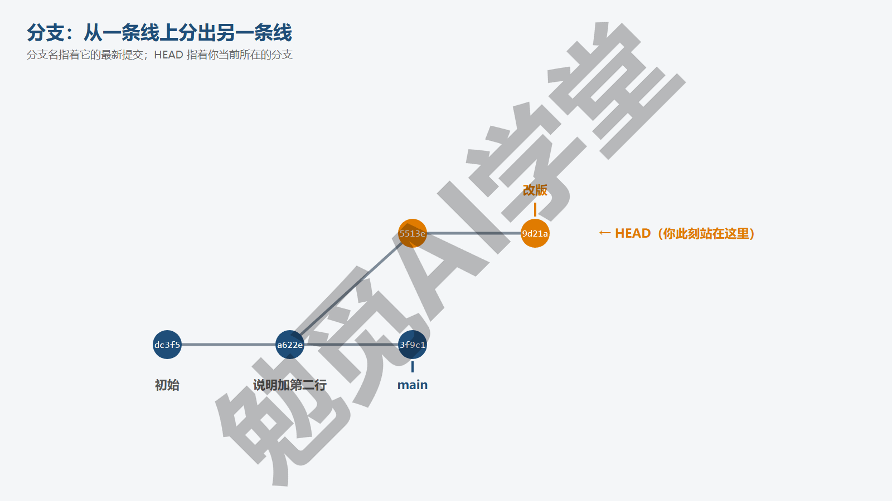

**分支解决什么问题。** 有三个典型场景：

- **试验**：想把文稿的结构大改一遍，不确定效果，在分支上改，改完对比，不满意就删掉分支，main 一点没动。
- **并行**：一件事做到一半，急事插进来，急事在另一条分支上处理并合进 main，原来的半成品在自己的分支上等着。
- **协作**：每个人在自己的分支上干活，做完了通过《多人协作：PR 与 Issue》里的 PR 合进 main，谁也不会覆盖谁。

AI 工具的“开两个方案并排比较”是第一种场景的加强版，《冲突与工作树》会讲。

**分支不复制文件。** 新手常担心“开十条分支是不是文件夹里就有十份文件”。不会。任何时刻文件夹里只有一份文件，就是你当前所在分支最新提交的样子；切到另一条分支，Git 会把文件夹里的文件换成那条分支的样子。所有分支的内容都存在 `.git` 里，共用没变化的部分。4.2 节你会亲眼看到切换时文件夹的变化。所以开分支之前不需要做任何准备：不用复制文件夹、不用另找地方存放，一条命令就开好了。

### 4.2 建、切、看、删、改名

分支的日常操作就五个动作，都很短。

**看有哪些分支。**

```text
git branch
```

输出每行一条分支，星号标出你当前所在的那条：

```text
  main
* 改版
```

加 `-v` 会在每行后面带上该分支最新提交的短哈希和说明，适合一眼看清各条分支进展到哪。

**新建并切过去。**

```text
git switch -c 改版
```

`-c` 是 create（创建）。输出 Switched to a new branch '改版'。新分支从你当前所在的提交分出去，此刻它和 main 指着同一个提交，`git status -s` 是空的。刚开的分支和原分支一模一样，之后你在这里提交，两条线才开始分开。分支名可以用中文，也可以用英文；不能有空格，避免用斜杠以外的特殊符号。

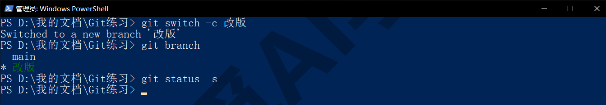

**切回去。**

```text
git switch main
```

输出 Switched to branch 'main'。不带 `-c` 就是切到已存在的分支。老资料里写的 `git checkout 分支名` 是同一件事的旧写法。

**切分支时，文件夹里的文件真的会变。** 这一点要亲眼看一次。在“改版”分支上新建一个 `新页.md`、给 `说明.txt` 加一行，提交。此时用 `ls` 看文件夹，有三个文件：

```text
新页.md
目录.md
说明.txt
```

切回 main，再 `ls`：

```text
目录.md
说明.txt
```

`新页.md` 消失了，`说明.txt` 打开看也少了那一行，因为 main 上没有那次提交。再切回“改版”，它们又回来。文件没有丢，只是 Git 把工作区换成了你所在分支的样子。第一次看到文件“消失”会紧张，理解这一点之后就不会了。

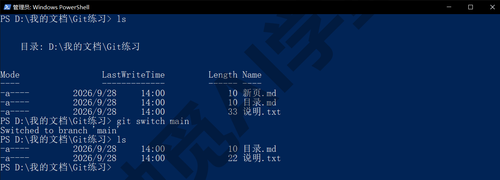

**带着未提交的改动切分支，会怎样。** 分两种情况。如果你改的文件在两条分支上内容相同，Git 会让你带着改动切过去，输出里多一行 `M	目录.md`，提示这个改动跟着你过来了。它不属于任何分支，只是工作区里的改动。如果你改的文件恰好在目标分支上内容不同，Git 会拒绝并给出这段提示：

```text
error: Your local changes to the following files would be overwritten by checkout:
	说明.txt
Please commit your changes or stash them before you switch branches.
Aborting
```

意思是“你对 说明.txt 的改动会被覆盖，请先提交或 stash，再切分支”。按它说的做：要么 `git commit` 记下来，要么用《撤销、还原与找回》3.8 节的 `git stash` 收起来、切过去、需要时再 pop。最稳的习惯是：切分支前先把手头的事提交或收好。

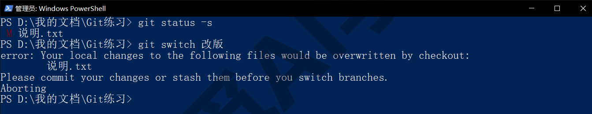

**删分支。** 分支的工作合进 main 之后，它就没用了，删掉保持整洁：

```text
git branch -d 改版
```

输出 Deleted branch 改版 (was dadc6e4)。如果这条分支上还有没合进任何地方的提交，Git 会拒绝（新版 Git 还会多一行 hint，告诉你怎么关掉这条提示，不用管）：

```text
error: the branch '试验' is not fully merged
hint: If you are sure you want to delete it, run 'git branch -D 试验'
```

这是保护：小写 `-d` 只删已经合并过的分支；确定不要了，用大写 `-D` 强删。强删之后那些提交暂时还能用 reflog 找回（《撤销、还原与找回》3.7 节），但那些记录有保留期，别拖太久。

**改名。**

```text
git branch -m 临时 草稿
```

把“临时”改成“草稿”。站在要改的分支上时可以省掉旧名只写新名：`git branch -m 草稿`。本节开头 master 改 main 就是这条命令。

**看哪些分支已经合并了。** `git branch --merged` 列出已经合进当前分支的分支（可以放心删），`git branch --no-merged` 列出还没合进来的（删之前想清楚）。

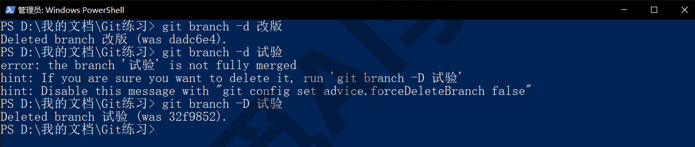

### 4.3 快进合并

分支上的工作做完了，要把它并回 main，这个动作叫**合并**（merge）。合并有两种形态，先看最简单的一种。

**场景。** 你从 main 开了“改版”分支，在上面提交了一次；这期间 main 上什么都没动。此时用 `git log --oneline --graph --all` 看历史：

```text
* dadc6e4 改版：加新页，说明加第三行
* b48c241 说明加第二行
* ba0ece3 初始
```

虽然是两条分支，图上却是一条直线，因为“改版”只是在 main 的最新提交后面多了一步，main 还停在原地。

**合并。** 合并的方向是“把别人合进我这里”，所以先切到接收方 main，再 merge 来源分支：

```text
git switch main
git merge 改版
```

输出：

```text
Updating b48c241..dadc6e4
Fast-forward
 新页.md  | 1 +
 说明.txt | 1 +
 2 files changed, 2 insertions(+)
 create mode 100644 新页.md
```

第二行 Fast-forward 就是**快进**：main 落后于“改版”，而且两者在一条直线上，Git 只需要把 main 的指针往前挪到“改版”所在的位置，不会产生任何新提交。下面几行是这次合并带进来的文件变化统计。

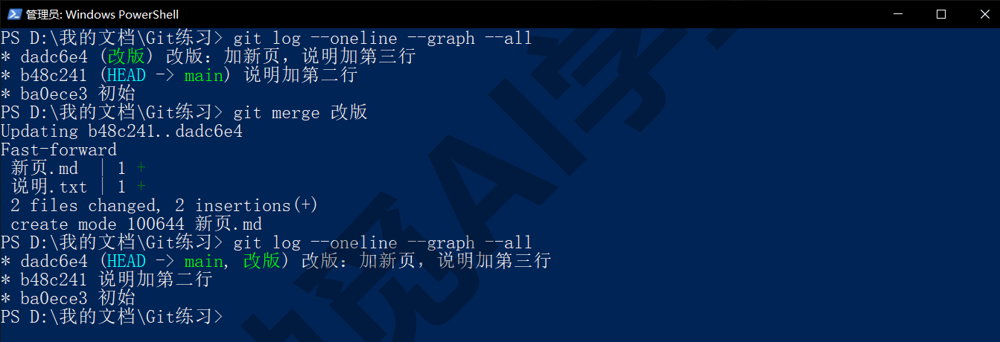

**合并后看图。** 再 `git log --oneline --graph --all`，图上的连线和合并前一模一样，还是那条直线。快进不留任何痕迹，看历史的人不会知道这里曾经有过一条分支。合并后“改版”分支还在，只是和 main 指着同一个提交，可以 `git branch -d 改版` 删掉。

**什么时候会是快进。** 条件只有一个：接收方从分出去之后没有新提交。一个人用 Git、每次只开一条分支做事、做完就合，几乎总是快进。所以单人用分支很轻松：快进合并不会产生冲突。

**不想快进怎么办。** 有人希望历史里能看出“这里合进过一条分支”，可以加 `--no-ff`（no fast-forward），强制生成一个合并提交，效果和 4.4 节一样。本课不要求这样做，知道有这个选项就行：GitHub 网页上合并 PR 时默认就是这种带合并提交的方式，《多人协作：PR 与 Issue》里会看到。

**合并前先看看要合什么。** 想在动手前知道“改版”比 main 多了哪些提交、改了哪些文件，可以用两条命令：`git log main..改版 --oneline` 列出只在“改版”上有的提交；`git diff main 改版 --stat` 列出两条分支之间的文件差别。看完再 merge，就知道这次合并会带进来什么。

### 4.4 带合并提交的合并

第二种形态：分出去之后，两边都有了新提交。

**场景。** 你从 main 开了“配图”分支，在上面提交了一次“配图说明”；与此同时你又切回 main，提交了一次“目录加第一节”。此时两条线真的分开了：

```text
* 2ac7416 配图说明
| * bb59081 目录加第一节
|/
* dadc6e4 改版：加新页，说明加第三行
```

main 不再落后于“配图”，而是各走了一步。这种情况下不可能只挪指针，Git 要把两边的改动放在一起，生成一个新的提交来代表“合并后的状态”。

**合并。**

```text
git switch main
git merge 配图
```

输出：

```text
Merge made by the 'ort' strategy.
 配图说明.md | 1 +
 1 file changed, 1 insertion(+)
 create mode 100644 配图说明.md
```

第一行说这次合并生成了一个合并提交（ort 是 Git 当前默认的合并方式的名字，不用记）。这一步 Git 通常会打开默认编辑器让你确认合并说明，默认说明是 Merge branch '配图'，直接保存关闭即可；如果你没有按《认识 Git 与装好》1.7 节把默认编辑器改成记事本，打开的会是 Vim，退不出来怎么办，见《第一个仓库：提交与历史》2.5 节。想跳过确认，合并时加 `--no-edit`。

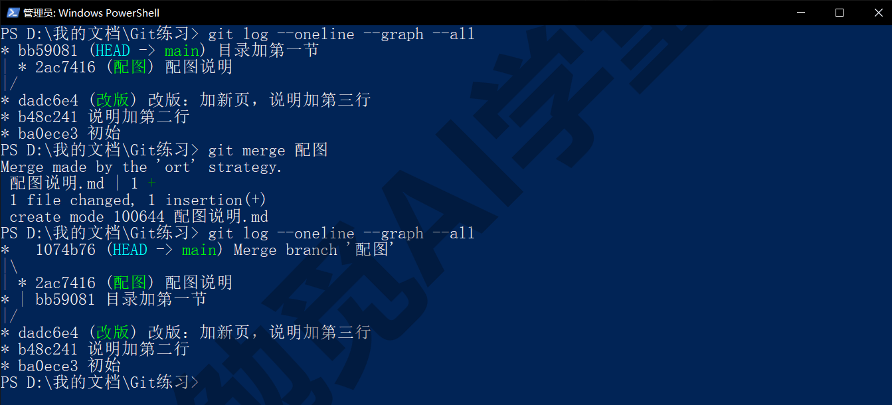

**合并后看图。**

```text
*   1074b76 Merge branch '配图'
|\
| * 2ac7416 配图说明
* | bb59081 目录加第一节
|/
* dadc6e4 改版：加新页，说明加第三行
```

最上面多了一个提交 Merge branch '配图'，它有两个父提交（也就是上一级提交），图上两条线在它这里汇合。这就是**合并提交**，它本身不含新改动，只是把两边的结果放在一起。合并完同样可以 `git branch -d 配图` 删掉分支，图上的分叉会保留下来，以后翻历史时能看出这里曾经并行过。

**两边改了同一处会怎样。** 上面的例子里，“配图”新建了一个文件，main 改了另一个文件，Git 能自动把两边放在一起。如果两边改的是同一个文件的同一行，Git 就没法替你决定要哪一版，会停下来让你处理。这叫冲突，是下一篇《冲突与工作树》的主要内容。现在只需要知道：合并不会丢掉任何一边的改动，要么自动合好，要么明确停下来等你决定。

**合并到一半想放弃。** 无论是冲突还是其他原因，`git merge --abort` 可以回到合并前的状态，工作区和分支都恢复原样。

**两种形态怎么记。** 一句话：对方比我多走了几步而我原地没动，就是快进；两边都走了，就多一个合并提交。你不需要选，Git 自己判断，你只管 `git merge`。

### 4.5 读分支图

有了分叉和汇合，`git log --oneline --graph --all` 这条命令才真正派上用场。它是你以后看任何仓库历史的第一选择，这一节把图上每个符号讲清楚。

```text
git log --oneline --graph --all
```

三个参数各是什么意思：`--oneline` 每个提交一行，`--graph` 在左侧画连线，`--all` 显示所有分支（不加只显示当前分支这一条线上的）。

拿 4.4 节合并后的图逐行读：

```text
* 10bb6b8 未合并提交
*   1074b76 Merge branch '配图'
|\
| * 2ac7416 配图说明
* | bb59081 目录加第一节
|/
* dadc6e4 改版：加新页，说明加第三行
* b48c241 说明加第二行
* ba0ece3 初始
```

先看星号。每个星号是一个提交，右边跟着它的短哈希和说明，最新的在最上面，所以读历史是从上往下、从新到旧。星号所在的列表示它属于哪一条线：全在最左一列时就是一条直线的历史，出现第二列就说明这里有并行的分支。

再看连线。竖线表示“这条线继续向下延伸”，连接的是父子提交。`|\` 这个符号是一处分叉：一条线在这里变成两条。不过因为你是从上往下读、从新到旧看，它实际上是两条分支在这里汇合成一条，也就是一次合并发生的位置。往下几行的 `|/` 则是当初分出去的地方：从这里往上，两条线各走各的。

最后看并排。左右两列各带一个星号的相邻两行（图里的 `| * 2ac7416` 和 `* | bb59081`），表示这两次提交在两条不同的分支上并行发生，谁上谁下只反映时间先后，不代表谁属于谁。而星号后面隔了两个空格再接哈希的那一行（`*   1074b76`），是一个合并提交，它有两个父提交，把上面分开的两条线接到了一起，多出来的空格就是给第二条线留的位置。最上面那条 10bb6b8 是一条尚未合并的分支上的提交，它单独占一个星号但没有分叉符号，因为图里只显示了它这一步。

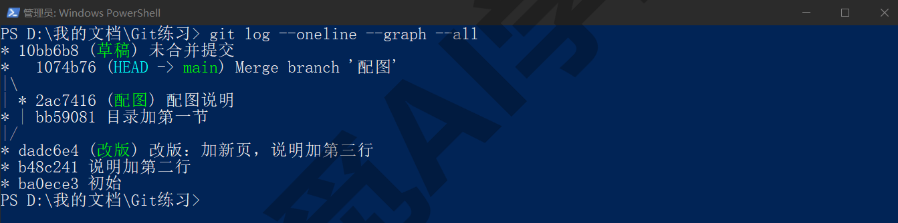

**看清每条分支现在在哪。** 加 `--decorate` 会在提交后面用括号标出分支名和标签；新版 Git 在终端里直接看 log 时默认就带着这些括号，前面几张截图里的 (HEAD -> main) 就是它：

```text
1074b76 (HEAD -> main, tag: v1.0, 草稿) Merge branch '配图'
```

括号里的意思是：HEAD 指着 main，main 在这个提交上；这个提交还打了 v1.0 标签；分支“草稿”也在这里。一眼就能看出谁领先、谁落后、谁和谁在同一位置。

**图太长怎么办。** 历史几百条之后，全图翻起来累。常用两个办法缩小范围：只看最近几条，加数字如 `-15`；只看两条分支之间的差别，用 `git log --oneline --graph main..配图`，两个点表示“在配图上有、在 main 上没有的提交”。

**从图上判断能不能快进。** 如果目标分支的提交在图上接在当前分支最新提交的正后面（一条直线往上），合并就是快进；如果两条线各有星号并排，合并就会生成合并提交。这两条不必背，对着分支图看一眼就能判断。

**图形界面里的历史。** GitHub Desktop 的 History 面板、VS Code 与 Cursor 的“源代码管理”面板里的图形历史，画的就是这张图，只是把字符换成了彩色线条。你现在读得懂字符版，读它们只会更容易，见《图形界面与 AI 工具里的 Git》9.3 节。

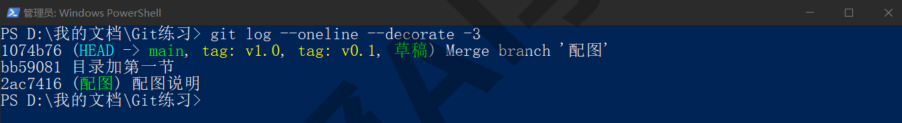

### 4.6 标签：给重要的节点起名

分支是会移动的（每次提交都往前挪），而有些时刻你想给它一个固定的名字：交稿的那一版、上线的那一版、发给客户的那一版。这就是**标签**（tag）：固定在某一次提交上、不会再动的一个名字。

**打标签。** 有两种形态。轻量标签只是一个名字：

```text
git tag v0.1
```

附注标签带说明、记录谁在什么时候打的：

```text
git tag -a v1.0 -m "第一版交稿"
```

`-a` 是 annotated（附注），`-m` 后面是说明。对“交稿”“发布”这类重要节点用附注标签，临时做个记号用轻量标签。两条命令都是给当前所在的提交打标签；想给历史上某次提交打标签，在最后加上它的短哈希：`git tag -a v0.9 -m "初稿" dadc6e4`。

**名字怎么起。** 习惯用 v 加版本号（v1.0、v1.1、v2.0），版本号的规则可以简单：大改动就把第一位数字加一（v1.0→v2.0），小改动把第二位加一（v1.0→v1.1）。对文稿类项目也可以直接用有意义的词，比如“交稿版”“送审版”；名字里不能有空格。

**看标签。**

```text
git tag
git tag -l "v1*"
git show v1.0 --stat
```

第一条列出全部标签；第二条只列出名字以 v1 开头的（星号表示后面随便是什么）；第三条看某个标签的详情，附注标签会先显示标签本身的信息（Tagger、日期、说明），再显示它指着的那次提交。

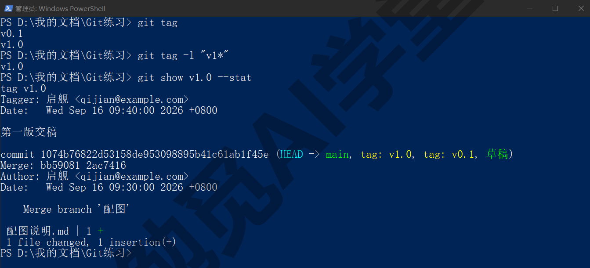

**删标签。**

```text
git tag -d v0.1
```

输出 Deleted tag 'v0.1' (was 1074b76)。删标签不影响提交本身。

**用标签回头看。** 凡是原来要写提交编号（哈希）的地方，都可以换成标签名：`git switch --detach v1.0` 回到交稿那一版看看（《撤销、还原与找回》3.6 节的用法），`git diff v1.0 HEAD --stat` 看交稿之后改了哪些文件，`git restore --source=v1.0 说明.txt` 把某个文件恢复到交稿时的样子。比记哈希好用得多。

**标签不会自动推到 GitHub。** 这是后面会碰到的一个坑：把仓库推到 GitHub 时，默认只推分支不推标签，要额外推一次，《GitHub 与远程仓库》6.3 节会讲。到了 GitHub 网页上，标签可以进一步做成 Releases（正式发布版，可附打包文件），《GitHub 网页端：Pages 上线与发布》8.5 节会讲。

**标签与分支的区别一句话。** 分支是会跟着新提交走的名字，标签是固定在某一次提交上的名字。想继续在某个点上改，用分支；想把某个点固定下来，用标签。

### 4.7 常用的分支做法

学会了命令，最后看看实际怎么安排分支。这一节只需要了解，不要求现在就照做。

| 场景 | 做法 | 本课覆盖 |
| --- | --- | --- |
| 一个人用 | main 保持可用；每次试验或大改开一条临时分支，做完合回、删掉 | 本篇 |
| 一个人多方案并行 | 每个方案一条分支，各自用工作树放到不同文件夹里并排比较，择优合入 | 《冲突与工作树》 |
| 小团队 | main 不直接改；每件事一条分支，做完在 GitHub 上开 PR 审查后合并 | 《多人协作：PR 与 Issue》 |
| 大团队与发布管理 | Git Flow、主干开发等成套流程，规定 develop、release、hotfix 等固定分支 | 只报名字，不展开 |

**单人使用的建议。** 日常小改直接在 main 上提交即可，不必为每个错别字开分支；碰到“不确定效果、可能要推翻”的改动才开分支。分支名写清楚在干什么（“改版-两栏布局”比“test”好），做完尽快合并并删除，不要留着一批半途而废的分支。任何时候 `git branch` 里超过三四条分支，就该清理了。

**和 AI 工具配合的建议。** 让 Codex 或 Cursor 做大改动之前，自己先开一条分支再让它动手，这样它改得再多，main 也完好；结果满意就合并，不满意就 `git switch main` 加 `git branch -D` 整条丢掉，比一处处还原少很多步。你也可以直接告诉它“先开一条分支再改”，它们都懂这句话，做的就是本篇 4.2 节的命令。

**关于 Git Flow 一类的流程。** 网上搜分支策略会看到很多成套的规范，规定了七八种分支各自的用途。它们是为几十人的软件团队设计的，对个人和小团队来说，麻烦远多过好处。本课的建议是：先把“main 加临时分支”用熟，需要协作时加上 PR，这两层够用很久。

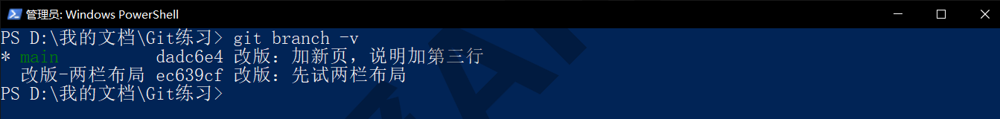

**在 AI 工具和图形界面里，这一步是什么样子。** 在 Codex 或 Cursor 里说“开一条分支来做这个改动”，它们执行的就是本篇 4.2 节的 `git switch -c`；说“把这条分支合回 main”，就是 4.3 或 4.4 节的 merge。Cursor 课《子智能体、并行与工作树》和 Codex 课《自动化、Git 与远程操控》里的“新建工作树”运行环境，是在分支的基础上再让每条分支拥有自己的文件夹，下一篇《冲突与工作树》5.7 节展开。GitHub Desktop 里，顶部 Current branch 下拉菜单就是 `git branch` 加 `git switch`，New branch 按钮是 `switch -c`，Branch 菜单里的 Merge into current branch 是 merge，History 面板画的就是 4.5 节的分支图，见《图形界面与 AI 工具里的 Git》9.4 节。

### 4.97 练习任务

方括号里的内容换成你自己的。

**任务一：开分支改一次，快进合并。** 在 `[你的练习文件夹]` 里从 main 开一条“试改”分支，改一个文件并提交，切回 main 确认文件没变，再合并：

```text
git switch -c 试改
git switch main
git merge 试改
git log --oneline --graph --all
git branch -d 试改
```

完成标准：merge 的输出里有 Fast-forward；合并后图仍是一条直线；分支删除成功。

**任务二：制造一次合并提交并读图。** 从 main 开一条“甲”分支，在上面新建一个文件并提交；切回 main，修改另一个文件并提交；再把“甲”合进 main：

```text
git merge 甲
git log --oneline --graph --all
```

完成标准：merge 的输出里有 Merge made by；图上出现 `|\` 和 `|/`；你能指着图说出哪两次提交是并行的、哪一个是合并提交。

**任务三：打标签并用它回头看。** 给当前 main 打一个附注标签，再做一次提交，然后用标签比较：

```text
git tag -a v1.0 -m "[你的说明]"
git show v1.0 --stat
git diff v1.0 HEAD --stat
```

完成标准：show 里能看到 Tagger 和你的说明；diff --stat 列出了打标签之后改动的文件。

### 4.98 本篇小结与自检

这一篇讲了分支是同一仓库里的一条平行提交线，开分支不复制文件、切分支时文件夹内容会跟着变；建（switch -c）、切（switch）、看（branch）、删（-d 与 -D）、改名（-m）五个动作；合并的两种形态，对方领先而我原地不动是快进、两边都走了就生成合并提交；读分支图的每个符号；标签是固定在提交上不动的名字，附注标签用于交稿和发布；最后给出了单人“main 加临时分支”的做法和与 AI 工具配合的建议。

可以对照下面的清单检查学习结果：

- [ ] 能说出分支是什么、为什么开分支不会复制一份文件
- [ ] 知道 main 与 master 只是名字不同，会用 branch -m 改名
- [ ] 会 switch -c 新建分支、switch 切换、branch -d 删除，知道 -D 什么时候才用
- [ ] 亲眼看过切分支时文件夹内容的变化，知道带未提交改动切分支的两种结果
- [ ] 分得清快进合并与带合并提交的合并，知道 Git 会自己判断
- [ ] 能读懂 graph 输出里的星号、竖线、分叉、汇合与合并提交
- [ ] 会打轻量与附注标签、列出、查看、删除，知道标签不会自动推到 GitHub
- [ ] 知道单人使用时怎么安排分支，以及让 AI 大改前先开分支的习惯

完成这些内容后，你已经能在同一个仓库里安全地并行试验了。下一篇《冲突与工作树》处理合并时两边改了同一处的情况（怎么读懂冲突标记、怎么解决），并讲 AI 工具都在用的工作树：让每条分支拥有自己的文件夹，几个方案真正并排比较。

### 4.99 新手常见问题

**Q1：开分支会把文件复制一份吗？会占很多硬盘吗？**

不会。任何时刻文件夹里只有一份文件，是当前分支的样子；各条分支的内容全部记在 `.git` 里，没变化的部分只存一份。开一百条分支和开一条占的空间几乎一样。真正会占空间的是《冲突与工作树》讲的工作树，它才会为一条分支再放一份文件。

**Q2：main 和 master 有区别吗？**

只有名字的区别。master 是 Git 早年的默认名，main 是现在多数平台和新项目的默认名，Git 3.0 起官方默认也改为 main。用 `git branch -m master main` 一条命令就能改过来，历史、提交全部不变。

**Q3：分支删了，上面的提交还在吗？**

如果这条分支已经合并进别的分支，它的提交都在那条分支的历史里，删分支只是删掉一个名字。如果没合并就用 -D 强删，那些提交暂时没有任何分支指着，短期内可以用《撤销、还原与找回》3.7 节的 reflog 找回，时间长了可能被清理。所以删之前 `git branch --no-merged` 看一眼。

**Q4：一个人用 Git，需要分支吗？**

日常小改不需要，直接在 main 上提交。但两种情况值得开分支：一是不确定效果、可能推翻的大改；二是让 AI 工具做大范围修改之前。这两种情况下开一条分支只要一秒钟，换来的是 main 始终完好、不满意整条丢掉即可。

**Q5：合并的时候 Git 打开了一个满屏英文的窗口，怎么办？**

那是默认编辑器 Vim 在让你确认合并说明。按 Esc，输入 `:wq` 回车保存退出，合并就完成了；即使输入 `:q!` 不保存退出，因为默认说明已经填好，合并通常也会照常完成，用 `git log --oneline -1` 确认一下即可。想以后不再碰到，按《认识 Git 与装好》1.7 节把默认编辑器改成记事本，或合并时加 `--no-edit`。
