## 冲突与工作树

上一篇《分支与合并》讲了分支怎么开、怎么合，并留了一个没展开的问题：两条分支改了同一处，合并时 Git 会停下来问你。这一篇先把这件事讲透（冲突是什么、在屏幕上是什么样子、怎么解、怎么预防），再讲一个 AI 工具都在用的进阶用法：工作树，让每条分支拥有自己的文件夹，几个方案真正并排比较。中间用一小节把 rebase 这个你很可能会在资料里见到的词讲清楚，告诉你为什么现在先不用碰它。

这篇文章的实操内容不需要花钱：全部在本机完成，不需要账号；文中提到的 GitHub Desktop 也是免费软件。

### 5.1 冲突是什么，为什么会有

合并时，Git 把两条分支各自的改动放到一起。绝大多数情况它能自动完成：你在分支上改了 A 文件，main 上改了 B 文件，两边互不相干，合起来就是 A 和 B 都改了；即使改的是同一个文件，只要不是同一处（一个改了第 3 行、一个改了第 30 行），Git 也能把两边的改动都合进来。

**冲突**（conflict）只在一种情况下出现：两条分支改了**同一个文件的同一处**，而且改得不一样。这时 Git 没有办法替你判断该要哪一版：它不懂内容，只知道两边都动了这几行。于是它停下来，把两边的版本都放进文件里，等你决定。

所以先记住一点：**冲突不是错误，是 Git 在问你要哪一个。** 它不会丢掉任何一边的改动，也不会损坏仓库；它只是在这一处需要一个人来做选择。看到 CONFLICT 几个大写字母不必紧张，接下来的几节会让你知道该看哪、该做什么。

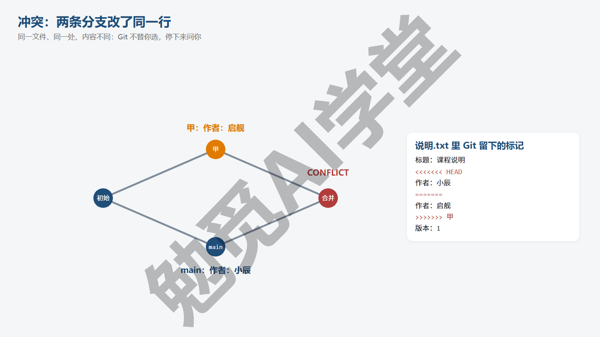

**哪些情况不会冲突。** 两边改的是不同的文件，不会冲突；改的是同一个文件里不同的、相隔较远的行，不会冲突；一边改了文件、另一边没动，不会冲突；一边新建了一个文件、另一边新建了另一个不同名的文件，也不会冲突。对文本文件的内容来说，只有“同一文件、相邻或相同的行、内容不同”这一种组合才会冲突；文件级别的几种情况见下一段。单人使用 Git、每次只开一条分支、做完就合，几乎不会碰到冲突；它主要出现在两条分支并行改了一段时间之后，以及多人协作的时候。

**哪些情况一定会冲突。** 两边都改了文件的同一行，而且改得不一样（比如都改了标题，改成了不同的内容）；一边删了一个文件、另一边修改了它（Git 不知道你是想删还是想留）；两边都新建了同名但内容不同的文件；两边都改了同一张图片或同一个 Word 文件（二进制文件没有“行”的概念，只要两边都动了就算同一处，5.5 节专门讲）。

**冲突什么时候出现。** 有三种情况：`git merge` 合分支时；《GitHub 与远程仓库》里 `git pull` 从 GitHub 拉取时（其实也是一次合并）；《撤销、还原与找回》里 `git stash pop` 或 `git revert` 时，要放回或要撤销的改动与后来的提交改到了同一处。三种情况的冲突标记是一样的，怎么读、怎么改也一样，只有最后收尾的一步略有差别（5.4 节末尾会说），学会一次，三种情况都用得上。

**一个具体的例子。** 你和同事各自负责一份课程说明的不同部分：你改开头的标题，同事改结尾的联系方式，两人各在自己的分支上提交、先后合进 main，全程不会有任何冲突，因为改的行相隔很远。换一种情况：两人都觉得“作者”那一行该填自己的名字，各自改了同一行，第二个合并的人就会看到 CONFLICT，Git 没法知道该留谁的名字，只能请人来定。冲突其实就是“两个人对同一处有不同意见”，Git 做的只是把这个分歧原样列出来。

**第一次会慢一点。** 第一次解冲突大概要花五到十分钟，因为要看懂那几个符号；第三次以后基本一两分钟。这是 Git 里最难适应的一小段；学会之后，多人协作和 AI 并行方案里的冲突都可以照这个办法处理。

### 5.2 亲手制造一次冲突

要学会解冲突，最好先自己造一个，在没有任何压力的练习仓库里看清全过程。按下面的步骤做，每一步都很短。

**准备起点。** 在练习文件夹里新建一个 `说明.txt`，内容三行：

```text
标题：课程说明
作者：待定
版本：1
```

提交它：`git add .` 然后 `git commit -m "初始"`。

**在分支上改第二行。** 开一条“甲”分支，把“作者：待定”改成“作者：启舰”，提交：

```text
git switch -c 甲
git add .
git commit -m "甲：作者填启舰"
```

（中间那步是用记事本改文件。）

**回到 main 也改第二行，改成不一样的。** 切回 main，把“作者：待定”改成“作者：小辰”，提交：

```text
git switch main
git add .
git commit -m "main：作者填小辰"
```

现在两条分支都从“作者：待定”出发改了同一行，改成了不同内容。用 `git log --oneline --graph --all` 看，是两条并排的线。

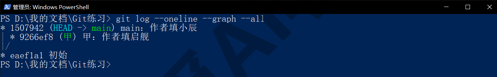

**合并，触发冲突。**

```text
git merge 甲
```

输出：

```text
Auto-merging 说明.txt
CONFLICT (content): Merge conflict in 说明.txt
Automatic merge failed; fix conflicts and then commit the result.
```

三行分别是：正在自动合并 `说明.txt`；在 `说明.txt` 里发生了内容冲突；自动合并失败，请解决冲突然后提交结果。最后一句已经把接下来要做的事说了：解决冲突，然后提交。

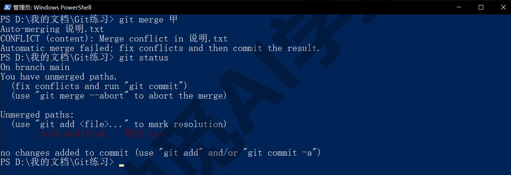

**此刻仓库处于什么状态。** 敲 `git status`：

```text
On branch main
You have unmerged paths.
  (fix conflicts and run "git commit")
  (use "git merge --abort" to abort the merge)

Unmerged paths:
  (use "git add <file>..." to mark resolution)
	both modified:   说明.txt
```

“You have unmerged paths”是说有文件还没合完；Unmerged paths 下面列出了哪些文件，both modified 表示两边都改了它。括号里给了两种做法：解决后 `git commit`，或者 `git merge --abort` 放弃这次合并。仓库现在处于“合并进行中”的状态，其他没冲突的文件已经合好了，只等你处理这一个。

如果你的练习里想再造一次，重复“两条分支改同一行”即可；课程后面 5.4 节的 abort 演示和 5.5 节的二进制冲突，都用同样的办法造出来。

### 5.3 读懂冲突标记

用记事本打开 `说明.txt`（在终端里用 `Get-Content -Encoding UTF8 说明.txt` 也能显示出来，Windows 自带的 PowerShell 不加这个参数中文会是乱码），它现在的内容是这样的：

```text
标题：课程说明
<<<<<<< HEAD
作者：小辰
=======
作者：启舰
>>>>>>> 甲
版本：1
```

Git 把冲突的那一处用三行特殊符号包了起来，其余没冲突的行（第一行和最后一行）原样保留。逐段翻译：

`<<<<<<< HEAD` 这一行是开始标记，后面的 HEAD 告诉你“下面这段是当前分支（你所在的 main）的版本”。它下面直到 `=======` 之间的内容（“作者：小辰”）就是 main 这边改成的样子。

`=======` 是分隔线，上面是你这边，下面是对方那边。

`>>>>>>> 甲` 是结束标记，后面的“甲”是你正在合并进来的分支名。`=======` 到它之间的内容（“作者：启舰”）就是甲分支改成的样子。

所以整段的意思是：这一行在 main 上是“小辰”，在甲上是“启舰”，你要哪个？

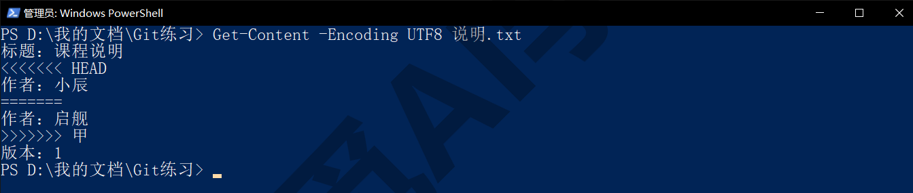

**用 diff 看也可以。** 冲突状态下敲 `git diff`，会看到一种带两列加号的特殊格式：

```text
++<<<<<<< HEAD
 +作者：小辰
++=======
+ 作者：启舰
++>>>>>>> 甲
```

两列符号分别对应两边：第一列是和你这边比、第二列是和对方那边比。刚开始不需要读懂这个格式，直接打开文件看标记更直观；知道它存在就行。

**多个冲突处。** 一个文件里可能有好几处冲突，每一处都是独立的一组三行标记；多个文件冲突时，status 里会列出每一个。一处一处、一个文件一个文件地处理就行，先处理哪个都可以。

**容易看错的三个地方。**

- 把 `=======` 当成表格线或分隔符删掉，结果两边内容都留下了。解完记得三行标记必须全部删除。
- 分不清上下：记住 HEAD 那边始终是“你现在所在的分支”，不是“你觉得更重要的那边”。
- 以为标记之外的内容也冲突了。没有，标记外的行 Git 已经合好了，别动。

**一次看多处冲突的例子。** 假设两条分支在同一个文件里既改了第 2 行的作者，又改了第 8 行的联系电话，文件里就会出现两组标记，中间夹着没冲突的第 3 到 7 行原文。处理时把每一组当成独立的小题：第一组决定作者留谁，第二组决定电话留哪个，互不影响。文件长的时候可以用记事本的查找功能搜 `<<<<<<<`，一处处跳过去，处理完再搜一遍，确认一个都不剩。

**标记里的名字会变。** 合分支时结束标记后面是分支名；`git pull` 时可能显示为一串哈希或远程分支名；`stash pop` 时显示为 Updated upstream 或 Stashed changes 一类的字样。形式不同，含义一样：上面是你这边，下面是进来的那边。

### 5.4 解决三步

解决冲突只有三步：编辑、删标记、提交。

**第 1 步：编辑文件，留下你要的内容。** 在记事本里把那一处改成你最终想要的样子。可以选一边（保留“作者：小辰”或“作者：启舰”），也可以两边都要、甚至写一个新的。这里选择两个都留：

```text
标题：课程说明
作者：启舰、小辰
版本：1
```

**第 2 步：把三行标记全部删掉。** `<<<<<<< HEAD`、`=======`、`>>>>>>> 甲` 这三行是 Git 加进去的标记，不是你的内容，一定要删干净。保存文件。用记事本的查找功能搜 `<<<<` 确认没有漏掉的标记。

**第 3 步：add 然后 commit。** add 在这里的含义是“告诉 Git 这个文件的冲突我解决了”：

```text
git add 说明.txt
```

再看 `git status`：

```text
On branch main
All conflicts fixed but you are still merging.
  (use "git commit" to conclude merge)
```

“所有冲突已解决，但你还在合并中，用 git commit 完成合并”。照做：

```text
git commit -m "合并甲：作者并列"
```

如果不带 `-m`，Git 会打开编辑器并预先填好 Merge branch '甲' 之类的说明，保存关闭即可。提交完，合并结束，`git log --oneline --graph --all` 里出现了一个合并提交，两条线在它这里汇合（提交编号每台电脑都不一样，和图里的对不上也正常）：

```text
*   a589d64 合并甲：作者并列
|\
| * 9266ef8 甲：作者填启舰
* | 1507942 main：作者填小辰
|/
* eaef1a1 初始
```

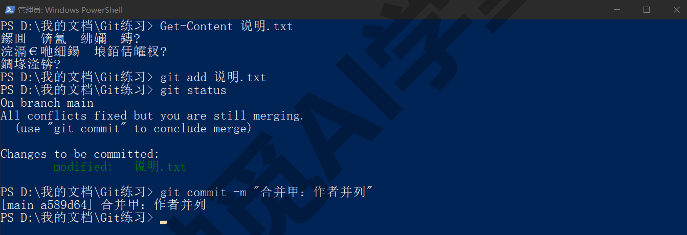

**反悔：merge --abort。** 冲突太多、一时处理不完，或者发现根本不该合，可以放弃这次合并、回到合并前的状态：

```text
git merge --abort
```

没有输出，`git status` 显示 working tree clean，一切和合并之前一样。这条命令只在“合并进行中”的状态下有效；它不会删掉任何分支，只是取消这一次合并动作，以后可以再合。

**不是 merge 引起的冲突，收尾稍有不同。** 读标记、编辑、删标记这几步完全一样，差别只在最后一步。`git pull` 引起的冲突就是一次合并，照常 add、commit。`git revert` 引起的冲突，add 之后用 `git revert --continue` 完成，它会打开编辑器让你确认那句 Revert 开头的说明，保存关闭即可；想放弃用 `git revert --abort`。`git stash pop` 引起的冲突，add 之后就结束了，不需要再 commit，但那份 stash 不会像平时那样自动删掉，确认改动都拿回来了再用 `git stash drop` 清掉它。三种情况下 `git status` 的括号提示里都会写明下一步该敲什么，照着敲就行。

**在编辑器里解冲突，更直观。** 用 VS Code 或 Cursor 打开冲突文件，编辑器会识别出标记，在冲突处上方显示几个按钮：Accept Current Change（采用当前更改，即 HEAD 这边）、Accept Incoming Change（采用传入更改，即对方那边）、Accept Both Changes（保留双方更改），以及 Compare Changes（对比）；按钮的中文文案随界面语言而变（需实机验证）。点一下按钮，编辑器会替你完成“留内容、删标记”两步，你只需保存后回终端 add、commit。有多处冲突就一处一处点。GitHub Desktop 遇到冲突时会弹出提示列出冲突文件，并提供在编辑器中打开的入口，新版本还能借助 Copilot 给出解决建议（以实际版本为准，需实机验证），见《图形界面与 AI 工具里的 Git》9.4 节。

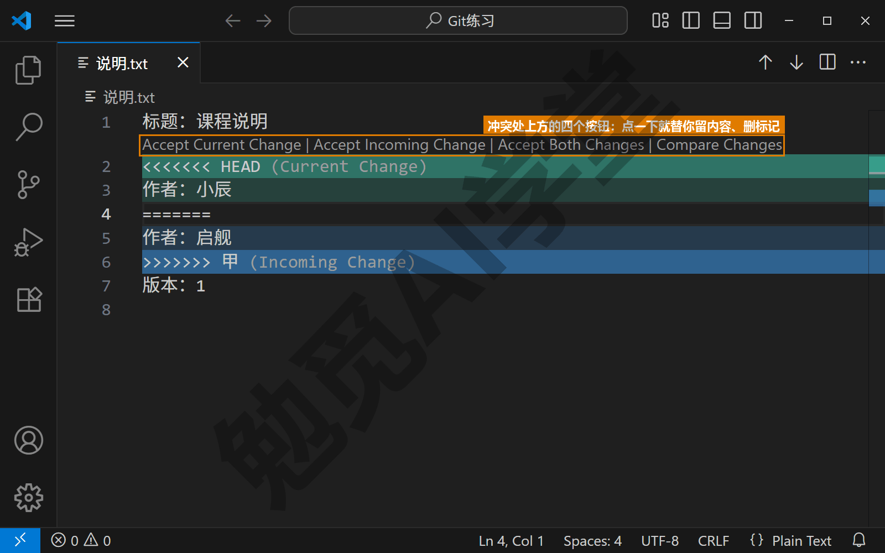

**解完之后检查一遍。** 提交前打开文件通读那一段，确认读得通、没有残留标记、没有把不该留的一边留下。冲突解决是少数需要人做判断的环节，值得多看十秒。

### 5.5 预防冲突，以及二进制文件的冲突

冲突可以解，但更好的是少碰到。三条习惯能把冲突压到很少。

**小步提交，尽早合并。** 一条分支上攒了两周的改动再合，改到同一处的可能性比每天合一次高得多。分支开着的时间越短，冲突越少。做完一件事就合回 main，是最有效的预防。

**一件事一条分支，不同分支改不同文件。** 如果你同时开着“改目录”和“改第三节”两条分支，它们天然不会冲突；如果两条分支都在改同一篇文稿的同一节，几乎一定会冲突。开分支之前想一下它会碰哪些文件，尽量让并行的分支各管一块。

**合并前先更新。** 多人协作时，把 main 上别人最新的改动先合进你的分支（或者先 pull），在自己的分支上把冲突解掉，再把分支合回 main，这样 main 上就不会出现冲突状态，《多人协作：PR 与 Issue》7.5 节会用到这个做法。

**二进制文件的冲突只能二选一。** 图片、Word、PPT、音频这类文件没有“行”，两边都改了它，Git 不可能把两张图拼成一张。这种冲突的输出多一行警告（下面的例子是在一条叫“丙”的分支上换了封面图，再合回 main）：

```text
warning: Cannot merge binary files: 封面.png (HEAD vs. 丙)
Auto-merging 封面.png
CONFLICT (content): Merge conflict in 封面.png
```

`git status -s` 里这个文件显示为 `UU 封面.png`（两个 U 表示两边都未合并）。解决办法是直接选一边：

```text
git checkout --ours 封面.png
git checkout --theirs 封面.png
```

`--ours` 保留你这边（HEAD）的版本，`--theirs` 保留对方（正在合进来的分支）的版本，二选一执行其中一条，输出 Updated 1 path from the index。然后照常 `git add 封面.png` 和 `git commit`。如果两张图你都想要，先选一边完成合并，再把另一边的从那条分支里取出来、换个文件名另存一份：用《撤销、还原与找回》3.6 节的 `git restore --source=丙 封面.png` 把丙那一版取到工作区，在资源管理器里把它改名（比如 `封面-丙.png`），再敲 `git restore 封面.png` 把刚选定的那一版拿回来，最后把两张图一起 add、commit。

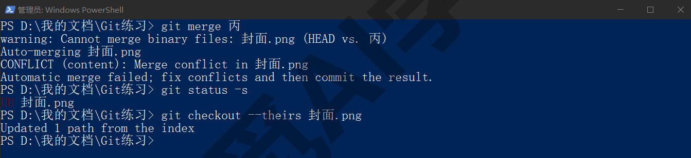

**对文本文件也可以整个文件选一边。** `--ours` 和 `--theirs` 对文本文件同样有效，适合“这个文件我确定整个都要对方的”这种情况，比一处一处删标记快。但它是整个文件二选一，文件里其他没冲突的改动也会一起换成那一边的，用之前想清楚。

**和 AI 工具配合时的预防。** 让 Codex 或 Cursor 在分支上改东西时，同一时间自己别去改 main 上的同一批文件；两个 AI 对话并行时，给它们分配不同的文件范围。这也是本篇 5.7、5.8 节工作树用法的基本原则。

### 5.6 rebase：先知道它是什么，暂时别用

你在资料、AI 工具的输出和 GitHub 的合并选项里都会看到 rebase（变基）这个词。本课不教它的操作，但要让你知道它是什么、为什么现在先不碰、在哪些地方会遇到它，免得被它卡住。

**rebase 是什么。** 合并（merge）是把两条线用一个合并提交接在一起，历史里保留分叉的样子。rebase 是另一种把两条线放到一起的办法：把你分支上的提交“搬”到对方最新提交的后面，重新排成一条直线，好像你是在对方做完之后才开始改的。结果是历史更直、没有合并提交，看起来更整齐。

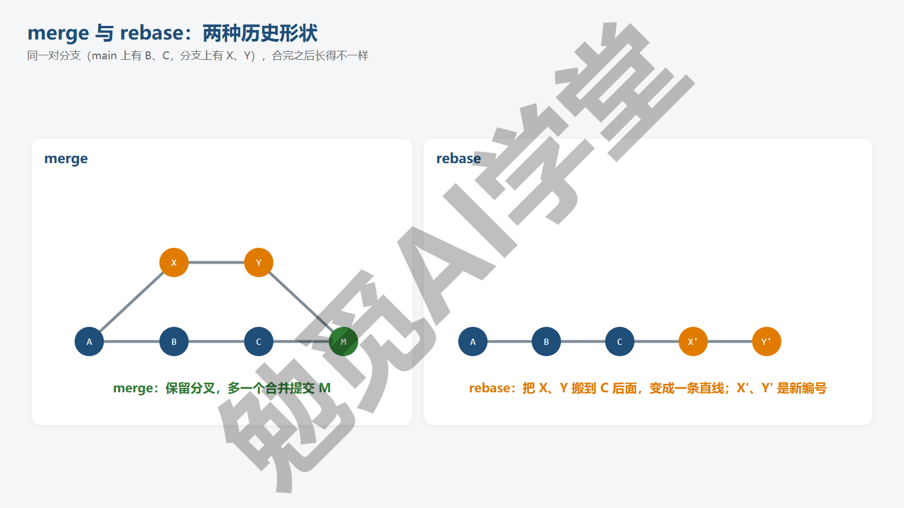

**为什么新手先别用。** rebase 会改写历史：被搬过去的提交会得到新的编号，原来的提交被替换。在自己电脑上、分支还没推出去时这没什么；一旦分支已经推到 GitHub、别人拿到过旧编号的提交，你再 rebase 并推送，两边历史就对不上，别人拉取时会出现一批重复的提交和冲突，还容易引出“强制推送”这个危险动作。另外 rebase 途中每搬一个提交都可能遇到一次冲突，一次搬十个提交就可能要解十次，比 merge 一次解完麻烦得多。对个人和小团队来说，merge 的历史虽然多几个分叉，但安全、每一步都能查回去、出了问题也容易处理。

**你会在哪里遇到它。** 有三个地方：

- `git pull` 有时会提示 divergent branches（分叉的分支）并要求你选择 merge、rebase 或 fast-forward only，《GitHub 与远程仓库》6.4 节会给一条配置把它定为 merge，之后不再询问。
- GitHub 网页合并 PR 时有一个选项叫 Rebase and merge，《多人协作：PR 与 Issue》7.4 节会讲三种合并方式的差别，选另外两种即可。
- AI 工具偶尔会建议“先 rebase 到 main 再推送”，你可以回答“用 merge 代替”，合出来的内容一样，只是历史里多一个分叉，风险小得多。

**还有两个词：交互式 rebase 和 cherry-pick。** 交互式 rebase（`rebase -i`）可以合并、拆分、重排、改写多次历史提交，是整理历史的工具，功能强但同样改写历史；cherry-pick（挑选）可以把某一次提交单独复制到另一条分支上。这两个词，看到时知道大意就行，本课不展开，等以后有整理历史的需要再学。

**如果已经被 AI 带进了 rebase 冲突。** 提示里会有 rebase in progress 字样，`git status` 的第一行会显示 interactive rebase in progress 或 rebase in progress 之类的状态，而不是平时的 On branch main。最简单的办法是放弃这次 rebase：

```text
git rebase --abort
```

仓库会回到 rebase 之前的状态，然后你改用 merge 就可以了。

### 5.7 工作树：让每条分支有自己的文件夹

分支有一个不便之处：同一时刻文件夹里只能是一条分支的样子。想同时看两个方案，只能来回切，切换时还得先提交或 stash。**工作树**（worktree）解决的就是这个问题：从同一个仓库再取出一份放到另一个文件夹（Git 把这个动作叫检出），各在一条分支上，两个文件夹同时存在、两边都能改，共用同一份历史。

**先分清两个词。** “工作区”是《第一个仓库：提交与历史》三区图里的第一格，指你正在操作的那个文件夹；“工作树”是这一节要讲的，指从同一个仓库另外取出来的那份文件夹。一个仓库默认只有一个工作区（也就是主工作树），用 worktree 命令可以再开几个。资料里有时也把工作区叫 working tree，看到时要留意它指的是哪一个。

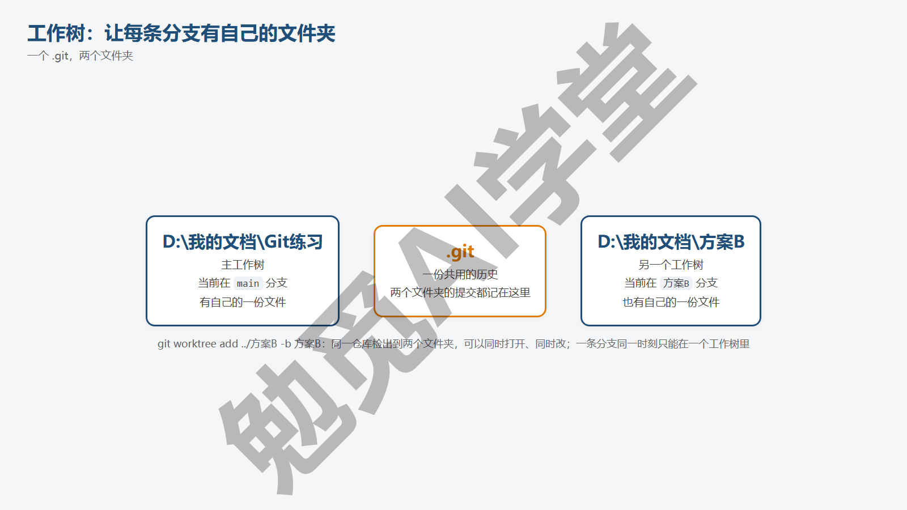

**开一个工作树。** 站在仓库里，把新工作树放到仓库旁边的文件夹，同时新建它所在的分支：

```text
git worktree add ../方案B -b 方案B
```

`../方案B` 是新文件夹的位置（两个点表示上一层，所以它和仓库文件夹并排），`-b 方案B` 是新建一条叫“方案B”的分支给它。输出（提交编号你的会不同）：

```text
Preparing worktree (new branch '方案B')
HEAD is now at 9d681ef 合并丙：封面用丙的
```

此时上一层目录里多了一个“方案B”文件夹，里面是仓库当前的全部文件。用已有的分支也可以，不加 `-b`，比如把 5.2 节建过的甲分支检出到另一个文件夹：`git worktree add ../甲 甲`。前提是这条分支此刻没有被别的工作树用着（见下文第二个坑），刚开出去的“方案B”就不能再这样检出一次。

**看有哪些工作树。**

```text
git worktree list
```

输出每行一个工作树，依次是路径、当前提交、方括号里的分支：

```text
D:/我的文档/Git练习  9d681ef [main]
D:/我的文档/方案B    9d681ef [方案B]
```

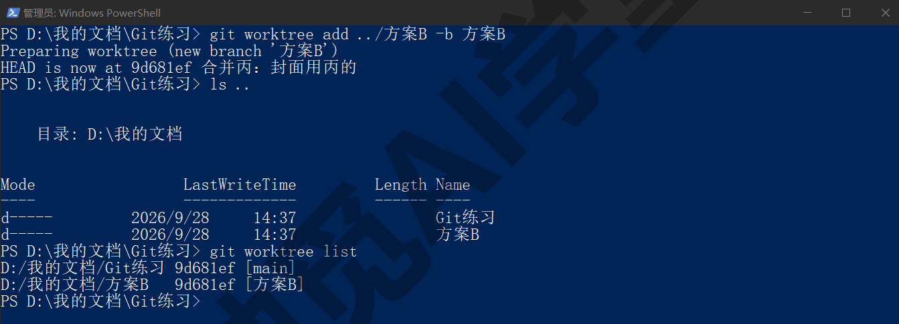

**在里面工作。** 在“方案B”文件夹里打开终端，它就是一个普通的仓库工作区：改文件、add、commit，提交会记在“方案B”分支上；主文件夹里同时可以在 main 上继续改，两边互不干扰。`git log --oneline --graph --all` 在哪个文件夹里敲都一样，看到的是同一份历史。

**删工作树。** 方案比较完、不需要那个文件夹了：

```text
git worktree remove ../方案B
```

它会删掉那个文件夹（里面有未提交改动时会拒绝，加 `--force` 才删）。分支本身不会被删，“方案B”分支和它的提交还在，要删分支用《分支与合并》4.2 节的 `git branch -d`。如果你直接在资源管理器里删了工作树文件夹，Git 的记录里会留下一条失效的登记，用 `git worktree prune` 清理。

**两个常见的坑。** 第一，**删工作树之前先离开那个文件夹**。站在“方案B”文件夹里执行 remove，Windows 会因为文件夹正在使用而拒绝删除。Git 会先问一句 Deletion of directory 'D:/我的文档/方案B' failed. Should I try again? (y/n)，回答 n 之后报错：

```text
error: failed to delete 'D:/我的文档/方案B': Permission denied
```

而且这时 Git 已经把登记去掉了，再执行一次会说 is not a working tree，留下一个 Git 已经不认的空文件夹，只能手动删。Cursor 课《实战三：装修预算估算器》18.6 节记录过同一个失误。正确的顺序是先 `cd` 回主仓库文件夹，再 remove。第二，**同一条分支不能同时检出到两个工作树**：

```text
fatal: 'main' is already used by worktree at 'D:/我的文档/Git练习'
```

想在另一个文件夹里也从 main 的内容开始改，用 `-b` 从 main 新开一条分支。

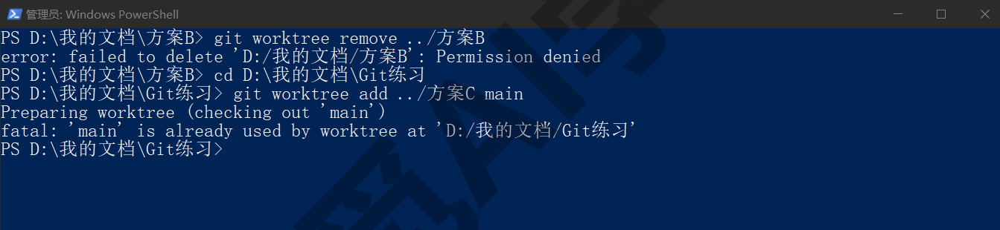

**硬盘占用。** 工作树是真的多放一份文件（历史仍然共用，不重复），所以一个几百 MB 的项目每多开一个工作树，就多占几百 MB。用完及时 remove。

### 5.8 用工作树并排比较，择优合入

工作树最典型的用法是：同一个改动想试两种做法，各开一个工作树，两个文件夹并排打开比较，选一个合进 main。这也是 Codex 和 Cursor “并行跑多个方案”功能背后的做法。

**第 1 步：开两个工作树，各一条分支。**

```text
git worktree add ../方案A -b 方案A
git worktree add ../方案B -b 方案B
```

**第 2 步：各自完成，各自提交。** 在“方案A”文件夹里按第一种思路改，提交；在“方案B”文件夹里按第二种思路改，提交。两个文件夹可以同时在资源管理器或编辑器里打开，直接对照文件、预览网页、比较效果。如果是让 AI 工具做，就分别在两个文件夹里各开一个对话，把两种要求分别交给它们。

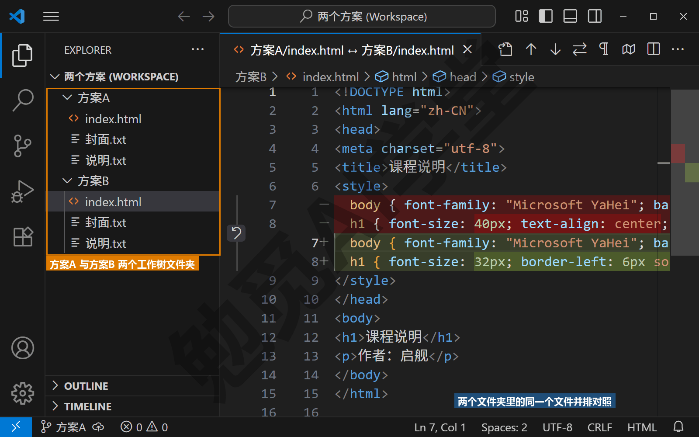

**第 3 步：回主文件夹，合入选中的那个。** 假设选了 B：

```text
cd D:\我的文档\Git练习
git merge 方案B
```

因为 main 从开分支之后没动过，这是一次快进合并。合完 main 就是 B 的样子。

**第 4 步：处理落选的 A。** 有两种选择：留档或删除。想留着以后参考，什么都不做也可以：分支“方案A”和它的提交一直留在历史里，那个文件夹也还在，打开就能看；不想留文件夹就只 remove 它的工作树、不删分支，以后用 `git switch 方案A` 回去看（工作树还在时不能这样切，会碰到 5.7 节说的“同一条分支不能同时检出两次”）。确定不要了，删工作树再删分支：

```text
git worktree remove ../方案A
git branch -D 方案A
```

（`-D` 是因为它没合并过，见《分支与合并》4.2 节。）“方案B”的工作树用完也 remove，分支已经合进 main，`git branch -d 方案B` 即可。

**两个都想要一部分。** 先合入其中一个，再把另一个里想要的文件用 `git restore --source=方案A 文件名` 单独取过来，看一遍、提交。注意 restore 是整个文件照搬，不会出现冲突标记：如果这个文件在 B 里也改过，B 的改动会被 A 的那份整个覆盖掉。这种情况不用 restore，改成再 `git merge 方案A` 把 A 也合进来，两边改到同一处就会出现冲突，按 5.4 节处理。

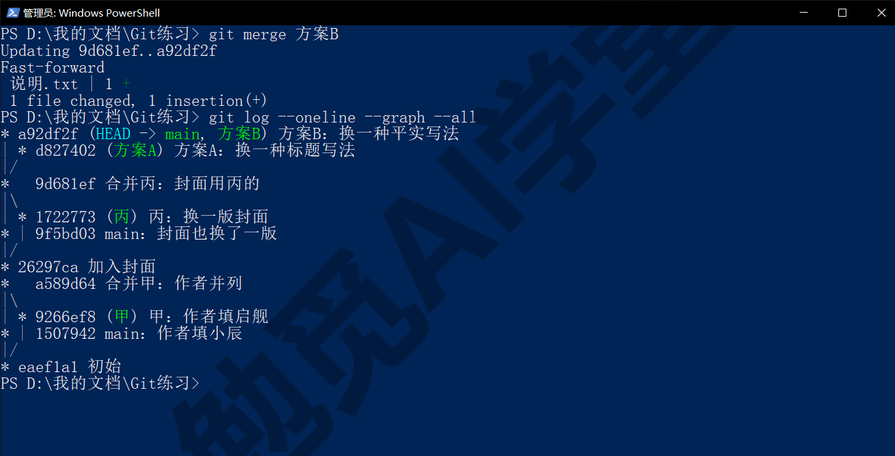

**在 AI 工具和图形界面里，这一步是什么样子。** Cursor 代理窗口里新建智能体时把运行环境选成“新建工作树”，以及 `/worktree`、`/best-of-n` 这些命令，见 Cursor 课《子智能体、并行与工作树》12.5 与 12.6 节，它们在后台做的就是本篇 5.7 的 `git worktree add`，每个方案一个文件夹一条分支，几个方案并排比较过后择优应用，就是 5.8 的合入；Cursor 课《实战三：装修预算估算器》18.4 节的两方案并行与 18.6 节“删工作树时工作目录还在里面”的失误，正是本篇讲的用法与坑。Codex 里新对话选择“新工作树”启动模式、自动化任务的“工作树”运行环境，见 Codex 课《自动化、Git 与远程操控》，背后做的也是同一件事。解冲突时，Cursor 与 VS Code 编辑器里的四个按钮见 5.4 节；GitHub Desktop 3.6 起也支持工作树管理和 Copilot 辅助解冲突（以实际版本为准），见《图形界面与 AI 工具里的 Git》9.4 与 9.6 节。

### 5.97 练习任务

方括号里的内容换成你自己的。

**任务一：制造并解决一次冲突。** 在 `[你的练习文件夹]` 里按 5.2 节的步骤，两条分支改同一行后合并，然后按 5.4 节三步解决：

```text
git merge [你的分支名]
git status
git add [冲突的文件]
git commit -m "[你的合并说明]"
```

完成标准：merge 输出里出现 CONFLICT；打开文件能指出哪段是你这边、哪段是对方；解决后文件里没有任何 `<<<<`、`====`、`>>>>`；graph 里出现合并提交。

**任务二：解到一半反悔，再重来。** 再造一次冲突，这次先放弃：

```text
git merge [你的分支名]
git merge --abort
git status
```

确认 status 干净后，重新 merge 并用编辑器（VS Code 或 Cursor）里的按钮解决。完成标准：abort 后 working tree clean；第二次用按钮解决成功并提交。

**任务三：两个工作树并排比较后择优合入。** 从 main 开两个工作树各一条分支，在两个文件夹里对同一个文件做不同的改动并各自提交，回主文件夹合入其中一个，删掉两个工作树：

```text
git worktree add ../方案A -b 方案A
git worktree add ../方案B -b 方案B
git merge [选中的分支]
git worktree remove ../方案A
git worktree remove ../方案B
git worktree list
```

完成标准：合并是快进；两个文件夹已删除；worktree list 只剩主工作树；落选分支仍能在 `git branch` 里看到。

### 5.98 本篇小结与自检

这一篇讲了冲突只在两条分支改同一文件同一处时出现、它是 Git 在问你要哪一个而不是错误；亲手造了一次冲突，读懂了 `<<<<<<< HEAD`、`=======`、`>>>>>>> 分支` 三段标记，学会了编辑、删标记、add 加 commit 三步解决与 merge --abort 反悔，以及编辑器按钮和二进制文件 `--ours`／`--theirs` 二选一；把 rebase 讲成“知道是什么、为什么先别用、在哪会遇到”；最后讲了工作树（同一仓库检出到多个文件夹各在一条分支上）的开、看、删、两个坑，以及并排比较、择优合入的完整做法。

可以对照下面的清单检查学习结果：

- [ ] 能说出什么情况会冲突、什么情况不会，以及冲突不是错误
- [ ] 亲手造过一次冲突，能读懂三段标记各代表哪一边
- [ ] 会按编辑、删标记、add 加 commit 三步解决，解完会检查有没有残留标记
- [ ] 知道 merge --abort 什么时候能用、它不会删分支
- [ ] 知道二进制文件冲突只能用 `--ours`／`--theirs` 二选一
- [ ] 能说出 rebase 是什么、为什么现在先不用、会在哪三个地方遇到它
- [ ] 分得清工作区和工作树，会 worktree add／list／remove／prune
- [ ] 知道删工作树前先离开那个文件夹、同一分支不能检出两次
- [ ] 用两个工作树并排比较过两个方案并择优合入

完成这些内容后，本机上的 Git 常用操作你已经都学过了：记录版本、撤销与找回、并行开分支、合并、解决冲突。下一篇《GitHub 与远程仓库》把仓库送上云端：注册账号、新建远程仓库、推送与拉取、克隆到另一台电脑，备份和换电脑都能用同一套做法解决。

### 5.99 新手常见问题

**Q1：冲突解错了怎么办？**

分两种情况。还没 commit 的话，`git merge --abort` 回到合并前，重新 merge 再解一次。已经 commit 了，这次合并就是一次普通提交，用《撤销、还原与找回》的办法处理：还没推出去用 `git reset --hard HEAD~1` 退掉合并提交重来，推出去了就直接在 main 上把文件改对再提交一次。

**Q2：为什么每次 pull 都提示 divergent branches？**

因为你本机和 GitHub 上各有对方没有的提交，Git 要你选合并方式却没有默认值。《GitHub 与远程仓库》6.4 节会给一条配置把默认定为 merge，设一次之后不再提示。看到提示里的 rebase 选项不要选，本篇 5.6 节讲了原因。

**Q3：工作树和分支到底什么关系？**

分支是历史里的一条线，工作树是磁盘上的一个文件夹。默认情况下你有很多分支但只有一个文件夹，看哪条分支就切到哪条；开工作树是给某条分支单独配一个文件夹，这样几条分支可以同时放在磁盘上。一个工作树同一时刻对应一条分支，一条分支同一时刻最多只能在一个工作树里。

**Q4：rebase 到底要不要学？**

现阶段不用。merge 能完成 rebase 能完成的所有合并需求，只是历史里多几个分叉。等你用 Git 超过半年、开始在意历史整洁、并且清楚“改写历史”意味着什么之后再学它。在那之前，看到 AI 或资料建议 rebase，用 merge 代替即可。

**Q5：工作树占多少硬盘？用完要删吗？**

每个工作树是一份完整的工作区文件（历史部分共用，不重复），所以项目文件有多大、每个工作树就多占多大。文本类项目只有几 MB，不必在意；带大量图片或视频的项目就要注意。比较完就 `git worktree remove`，分支留不留是另一回事；长期开着几个不用的工作树只会白占空间。
