## GitHub 与远程仓库

前五篇的一切都发生在你自己的电脑上。这一篇把仓库送上云端：注册 GitHub 账号，在网站上新建一个仓库，把本机的历史推上去；然后学会日常的推送与拉取、把仓库克隆到另一台电脑、决定公开还是私有、管好登录凭据。学完这一篇，电脑坏了不再意味着历史丢失，换电脑接着改，也只需要克隆一次。本篇 GitHub 网页上的按钮名以英文写出并附中文释义，网页界面随时可能调整，具体形态以你看到的页面为准。

这篇文章的实操内容不需要花钱：GitHub 的免费账号就够用，公开仓库和私有仓库都可以免费建，数量与额度以 GitHub 当前说明为准。

### 6.1 远程仓库是什么

《第一个仓库：提交与历史》的三区图里有工作区、暂存区、仓库三格，这一篇往右边再加一格，叫 **远程仓库**（remote），也就是放在别处的另一份完整仓库。“别处”通常是 GitHub 的服务器，但也可以是另一台电脑、一块移动硬盘，甚至同一台电脑上的另一个文件夹；本篇按最常见的情况写，远程就是 GitHub 上的仓库。

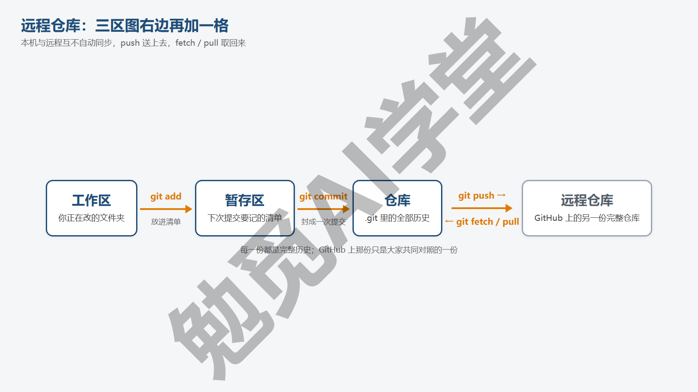

**两边互不自动同步。** 本机仓库和远程仓库是两份独立的历史，你在本机提交一百次，远程一次都不会变，直到你明确执行推送；反过来别人往远程推了东西，你的本机也不会变，直到你明确执行拉取。Git 不会在背后自动同步，这和网盘正好相反。好处是你始终知道两边各是什么状态；代价是要养成“做完一段就推”的习惯。

**origin 只是个昵称。** 远程仓库有一个网址，每次敲网址太长，所以 Git 允许给它起个短名字。习惯上第一个远程叫 origin（“源头”），这不是 Git 规定的名字，只是大家的习惯，改成别的名字也行。一个仓库可以有多个远程（《多人协作：PR 与 Issue》会用到第二个，叫 upstream），日常只有一个。查看当前有哪些远程：

```text
git remote -v
```

新仓库输出为空；连上远程之后每个远程显示两行（fetch 取回用的地址和 push 推送用的地址，通常一样）：

```text
origin	https://github.com/你的用户名/仓库名.git (fetch)
origin	https://github.com/你的用户名/仓库名.git (push)
```

**三个新动词。** **推送**（push）：把本机的提交送到远程。**取回**（fetch）：把远程的新提交下载到本机，但先不合进你的分支，只是让你能看到。**拉取**（pull）：取回并且合进当前分支，等于 fetch 加 merge 一步做完。这三个词贯穿本篇，6.4 节逐个展开。

**远程分支。** 连上远程之后，`git branch -a` 会多出几行以 remotes/origin/ 开头的分支，比如 origin/main。它们是“远程上那条分支在你上次取回时的样子”的本地记录，你不能直接在上面提交，Git 用它们来告诉你本机领先或落后了几步。看到它们不用管，知道是远程的影子即可。

**每一份都是完整的。** 远程仓库不是“正本”，你本机的也不是“副本”，两边都有全部历史，只是习惯上把远程当作大家共同对照的一份。所以即使 GitHub 上的仓库被删了，你本机这份照样完整；反过来电脑坏了，从 GitHub 克隆回来也是完整的历史。这就是用 Git 做备份比网盘多出来的保障。

### 6.2 GitHub 账号

前五篇不需要账号，从这里开始需要一个。这一节把注册时会遇到的几个决定讲清楚。

**注册。** 打开 github.com，点右上角 Sign up（注册），进入标题为 Sign up for GitHub 的页面：最上面的 Continue with Google／Continue with Apple 两个按钮是用第三方账号登录，本课不用；往下依次填 Email（邮箱）、Password（密码）、Username（用户名），在 Your Country/Region 里选国家或地区，点绿色的 Create account（创建账号）；接下来完成人机验证，然后到邮箱里收验证码填回页面（这两步的画面需实机验证）。整个过程只要几分钟，个人账号基本功能免费，付费方案的差别以账号页面显示为准。

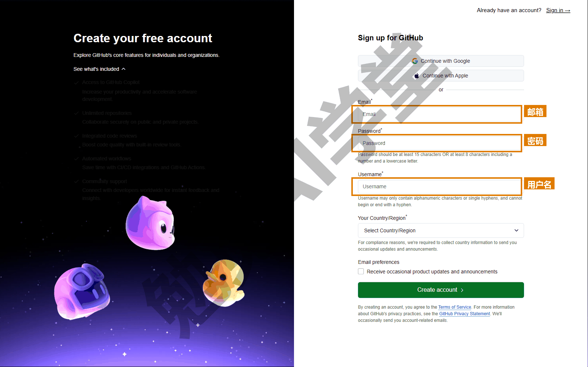

**用户名怎么选。** 用户名会出现在你所有仓库的网址里（github.com/用户名/仓库名），也会出现在《GitHub 网页端：Pages 上线与发布》8.4 节要讲的网页网址里（用户名.github.io），改起来牵连很多，最好一次选定。建议用容易拼写、只含小写字母和数字的名字；可以和你在其他平台的昵称一致，方便别人找到你。

**两步验证。** GitHub 自 2023 年起要求贡献代码的账号启用两步验证（two-factor authentication，登录时除密码外再验证一次），新账号很可能在注册后不久就被要求设置，范围以你账号里的提示为准（需实机验证）。建议不等提示，注册当天就到 Settings → Password and authentication（设置 → 密码与身份验证）页，在 Two-factor authentication（两步验证）一栏点绿色的 Enable two-factor authentication（启用两步验证）按钮。方式选验证器 App（手机上装一个生成一次性验证码的应用）最稳；后面几页的选项名以你看到的为准（需实机验证），设置完成时页面会给出一组恢复码（recovery codes），把它们保存到密码管理器或打印出来，手机丢了就靠它们登录。

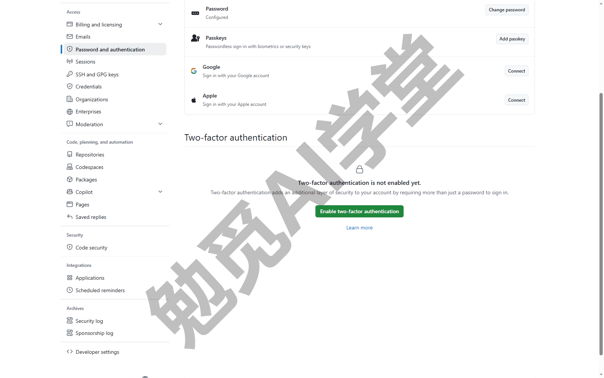

**署名邮箱与隐私。** 《认识 Git 与装好》1.7 节配置的 user.email 会随每次提交一起进入历史，仓库公开后任何人都能看到。不想公开真实邮箱的话，GitHub 提供一个匿名地址，格式类似 `数字+用户名@users.noreply.github.com`，在 Settings → Emails 里勾选 Keep my email addresses private（保持邮箱私密）后页面会显示它（需实机验证）。把它填进本机配置：

```text
git config --global user.email "你的匿名地址"
```

之后的提交就用匿名地址署名，GitHub 仍然能把提交对应到你的账号。之前已经提交过的历史不会自动改，介意的话新仓库从一开始就用匿名地址。

**账号与网络的准备。** 注册与登录需要能正常访问 github.com；网络条件因地区和运营商而异，能不能打开以你的实际情况为准。本课不展开网络工具，账号与网络的详细准备参考 Codex 课、Cursor 课里已经讲过的做法。

**认识自己的主页。** 登录后点右上角头像 → Your profile（你的主页）。这一页以后会列出你的全部公开仓库，是别人认识你的门面；刚注册时它是空的，本篇结束时会有第一个仓库。

### 6.3 新建远程仓库，把本机仓库推上去

现在把练习文件夹推到 GitHub 上。全程分两段：先在网页上新建一个空仓库，再在本机连上它并推送。

**第 1 步：在网页上新建仓库。** 登录 GitHub，点右上角的加号，在菜单里选 New repository（新建仓库；菜单项名需实机验证）。页面标题是 Create a new repository（创建一个新仓库），表单分 General（基本信息）和 Configuration（配置）两段，要填、要选的有这几项：

- Owner（所有者）默认就是你的账号，不用动；Repository name（仓库名）：建议和本机文件夹同名或相近，只用字母、数字、连字符，名字可用时下面会显示一行绿色的 is available；
- Description（描述）：一句话说明，可不填；
- Choose visibility（选择可见性）：一个下拉菜单，里面是 Public（公开）和 Private（私有）两项，先选 Private，6.6 节讲怎么决定，随时可改；
- Add README、Add .gitignore、Add license（初始化 README、.gitignore、许可证）：**这三项全部保持默认、一个都不加**——Add README 的开关留在 Off，Add .gitignore 留在 No .gitignore，Add license 留在 No license；上面的 Start with a template（从模板开始）也留在 No template。原因是你本机已经有一个带历史的仓库，如果网页这边也生成了文件，两边就各有一份互不相关的历史，第一次推送会被拒绝。这些文件本机想要的话自己建、自己提交。Add .gitignore 的下拉菜单可以按语言选一份模板，就是《第一个仓库：提交与历史》2.8 节提到的那套模板；本机已有仓库时它同样不选，想用模板就把模板内容复制进本机的 `.gitignore` 自己提交。

都定好后，点最下面绿色的 Create repository（创建仓库）。

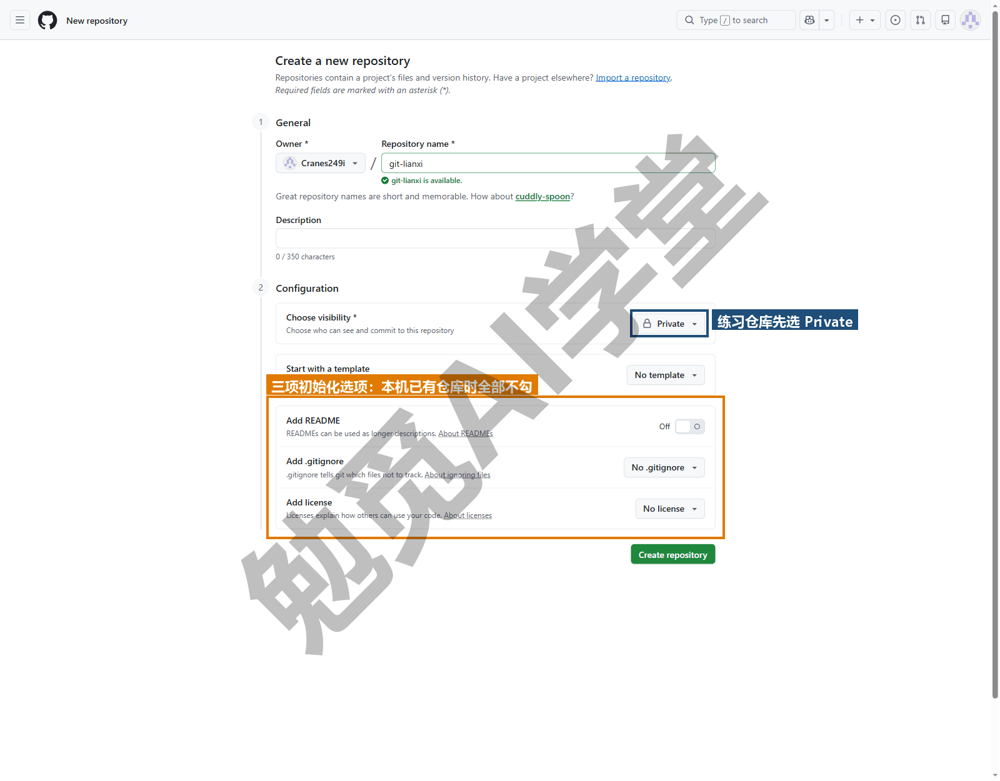

**第 2 步：读网页给出的命令。** 创建后进入一个空仓库页面，GitHub 会显示几组命令，分别对应不同的情况。找到页面下半部分标题为 “…or push an existing repository from the command line”（或者从命令行推送一个已有仓库）的那一组。页面上方 Quick setup 一栏里有 HTTPS／SSH 两个切换按钮，确认选的是 HTTPS：选了 SSH 的话网址会变成 git@github.com: 开头，本课没有配 SSH 密钥，推送时会报 Permission denied (publickey)（需实机验证）。这一组是三行：

```text
git remote add origin https://github.com/你的用户名/仓库名.git
git branch -M main
git push -u origin main
```

逐条翻译。第一条：给本机仓库添加一个叫 origin 的远程，地址就是刚建的这个仓库。第二条：把当前分支强制改名为 main（如果你的分支已经叫 main，这条什么都不改；还叫 master 的话，这一条就把它改成 main）。第三条：把 main 分支推送到 origin，`-u` 的意思是“记住这个对应关系”，以后在这条分支上只敲 `git push` 就行。页面上还有一组“…create a new repository on the command line”是给本机还没有仓库的人用的，不要选它。

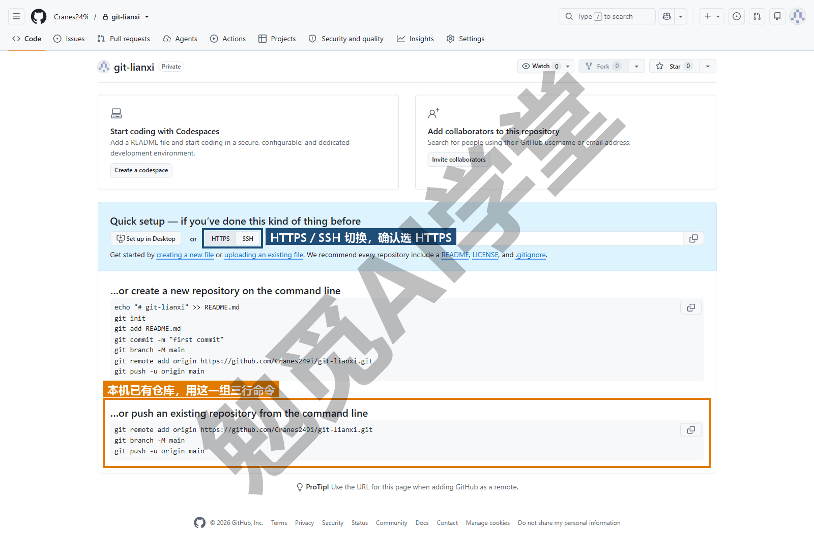

**第 3 步：在本机执行。** 回到练习文件夹的终端，把三行命令依次粘进去（第一行的网址从页面复制，不要手打）。第一条没有输出；第二条没有输出；第三条第一次执行时，Git Credential Manager 会弹出一个标题为 Connect to GitHub 的登录窗口，里面有 Browser/Device 和 Token 两个页签，默认那个页签上是 Sign in with your browser（用浏览器登录）和 Sign in with a code（用设备码登录）两个按钮。点 Sign in with your browser，浏览器会打开 GitHub 的授权页，页面标题是 Authorize Git Credential Manager，卡片上写着它要访问的是哪个账号，下面列出 Gists、Repositories、Workflow 三项权限，最下面是绿色的 Authorize git-ecosystem 按钮。登录并点下这个按钮，回到终端，推送就继续进行（需实机验证）。这是 GitHub 不再接受账号密码推送之后的正规登录方式，凭据由凭据管理器保存，以后不用再登录。推送成功的输出类似：

```text
To https://github.com/你的用户名/仓库名.git
 * [new branch]      main -> main
branch 'main' set up to track 'origin/main'.
```

第二行说远程上新建了 main 分支，第三行说本机 main 已经和 origin/main 对应起来。

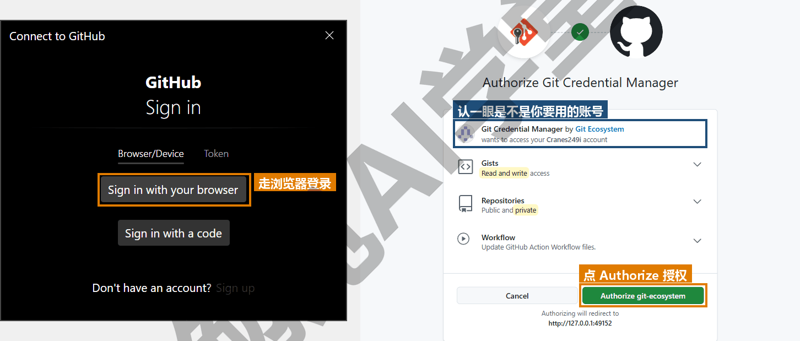

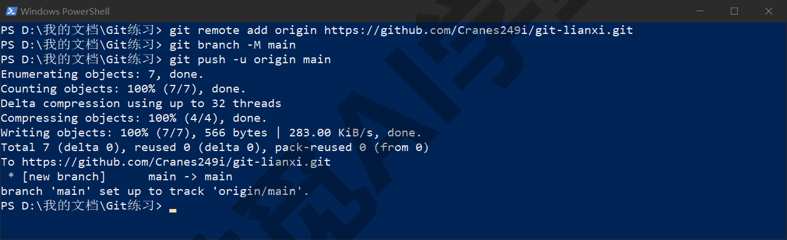

**Mac 上的第一次推送。** Mac 系统自带的 Git 没有 Git Credential Manager，第一次推送时终端会直接问 Username 和 Password：用户名填 GitHub 用户名，但 Password 一栏要填的是 6.7 节讲的个人访问令牌，不是登录密码（GitHub 不接受密码推送），输对之后钥匙串会记住它（需实机验证）。想和本课一样走浏览器登录，可以先用《认识 Git 与装好》1.6 节的 Homebrew 装上 Git Credential Manager：`brew install --cask git-credential-manager`，装好后第一次推送同样会弹出浏览器（需实机验证）。

**第 4 步：到网页上确认。** 刷新仓库页面，文件都在了，右上方能看到提交次数，点进去是你在本机做过的全部提交。此刻 `git status` 会多出一行：

```text
On branch main
Your branch is up to date with 'origin/main'.
```

“你的分支与 origin/main 一致”。从这一刻起，status 会一直告诉你本机比远程领先还是落后了几步。要注意它比的是本机记录的那份 origin/main 影子，不会联网去查：别人刚推上去的提交，要等你 fetch 或 pull 之后 status 才知道，6.4 节会看到这一点。

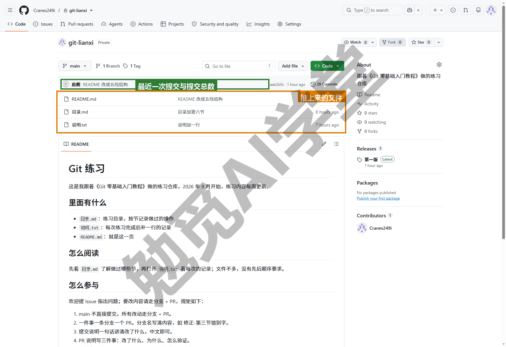

**推标签。** 《分支与合并》4.6 节说过标签不会自动推送，现在补上：

```text
git push --tags
```

输出每个新标签一行 `* [new tag] v1.0 -> v1.0`。之后网页上仓库的 Tags 页就能看到它，《GitHub 网页端：Pages 上线与发布》会用它做 Releases。

### 6.4 日常同步：push、fetch、pull

连好之后，日常只有三个动作。

**push：把本机提交推上去。** 在本机提交之后，`git status` 会说：

```text
Your branch is ahead of 'origin/main' by 1 commit.
  (use "git push" to publish your local commits)
```

ahead by 1 commit 是“领先远程一次提交”，括号里已经提示你推送：

```text
git push
```

因为 6.3 节用过 `-u`，这里不需要再写 origin main。输出：

```text
To https://github.com/你的用户名/仓库名.git
   55dafc2..2f960d6  main -> main
```

最后一行是远程 main 从哪个提交更新到了哪个提交。推完 status 又回到 up to date。

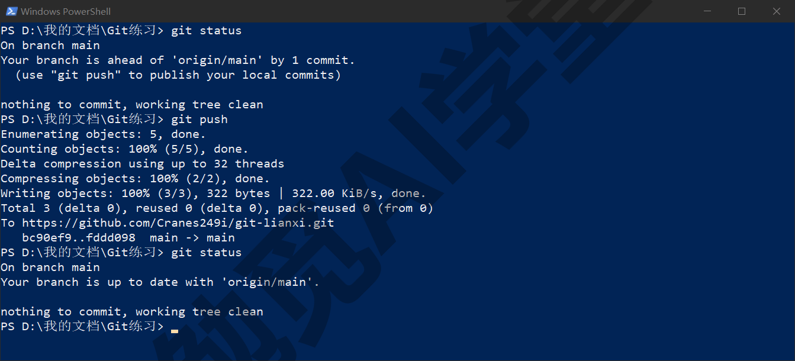

**fetch：先看看远程有什么，不动你的分支。** 另一台电脑（或者另一个人）往远程推了新提交，你本机还不知道。fetch 把它们下载下来，但只更新 origin/main 这个影子，不碰你的 main：

```text
git fetch
```

输出：

```text
From https://github.com/你的用户名/仓库名
   2f960d6..950cbee  main       -> origin/main
```

此时 `git status` 会说 Your branch is behind 'origin/main' by 1 commit, and can be fast-forwarded，意思是落后一次提交，而且可以快进。想先看看进来的是什么：

```text
git log --oneline main..origin/main
```

两个点表示“origin/main 有、main 没有的提交”。看完没问题，再合进来：`git merge origin/main`，或者直接用下面的 pull。

**pull：取回并合进来。** 等于 fetch 加 merge：

```text
git pull
```

对方领先、你原地没动时是一次快进，输出和《分支与合并》4.3 节一样带 Fast-forward 字样。这是最常用的写法，但先 fetch 再用 log 看一眼的做法，在“不确定别人推了什么”时更稳妥。

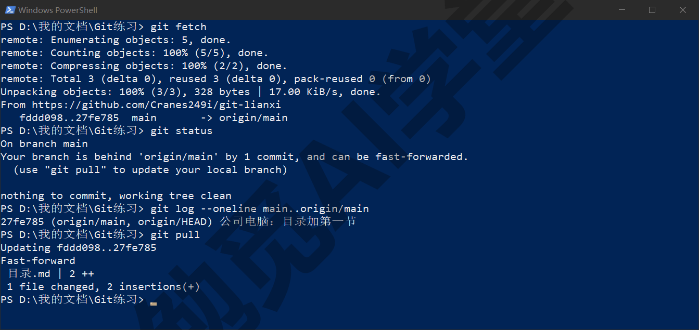

**推送被拒绝：non-fast-forward。** 两边都有新提交时（你在家提交了一次，公司电脑也推了一次），你的 push 会被拒绝：

```text
 ! [rejected]        main -> main (fetch first)
error: failed to push some refs to 'https://github.com/你的用户名/仓库名.git'
hint: Updates were rejected because the remote contains work that you do not
hint: have locally. This is usually caused by another repository pushing to
hint: the same ref. If you want to integrate the remote changes, use
hint: 'git pull' before pushing again.
```

意思是“远程上有你本机没有的提交，先 pull 再推”。这是保护，不是故障：Git 拒绝让你的推送覆盖别人的工作。照它说的做，`git pull` 把远程的合进来（两边都有新提交，所以会生成一个合并提交，Git 会像《分支与合并》4.4 节那样打开编辑器让你确认合并说明，保存关闭即可；改了同一处就按《冲突与工作树》讲的三步解决冲突），然后再 `git push`。看到这段提示时，不要用带 force 的推送去“解决”它，那会把远程上别人的提交抹掉，《撤销、还原与找回》3.10 节的危险清单里有它。

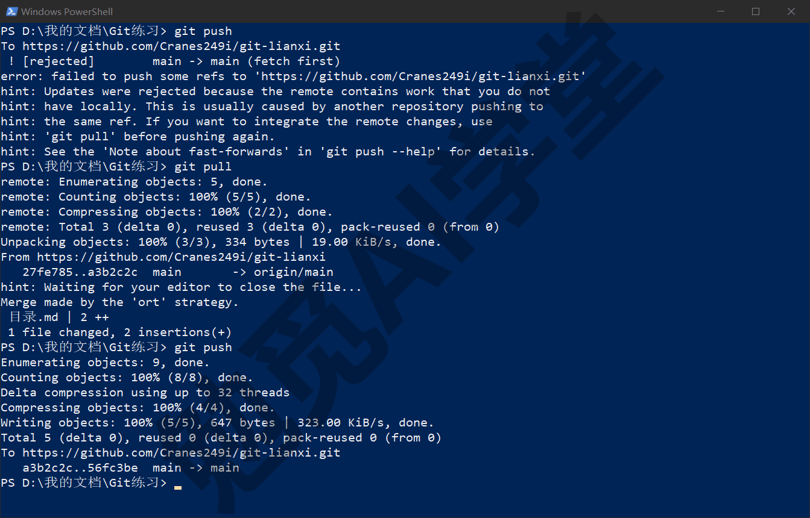

**divergent branches 提示与一条配置。** 在两边都有新提交的情况下 pull，Git 需要知道你想用 merge 还是 rebase 来合。Git for Windows 安装时“git pull 默认行为”那一页已经替你选了 merge（写在系统配置里），所以 Windows 上通常直接合并、不会追问。Mac 或没有这项配置的电脑上会看到这段提示并中止：

```text
hint: You have divergent branches and need to specify how to reconcile them.
hint: You can do so by running one of the following commands sometime before
hint: your next pull:
hint:
hint:   git config pull.rebase false  # merge
hint:   git config pull.rebase true   # rebase
hint:   git config pull.ff only       # fast-forward only
fatal: Need to specify how to reconcile divergent branches.
```

按《冲突与工作树》5.6 节的理由选 merge，设一次全局配置，之后不再提示：

```text
git config --global pull.rebase false
```

**推一条分支、删一条远程分支。** 在分支上工作并想让它也出现在 GitHub 上（《多人协作：PR 与 Issue》开 PR 要用），以《分支与合并》建过的改版分支为例，已经删掉的话换成你现有的任何一条分支：

```text
git push -u origin 改版
```

输出 `* [new branch] 改版 -> 改版`。分支的工作合并完成后，删掉远程上的这条分支：

```text
git push origin --delete 改版
```

输出 `- [deleted] 改版`。这只删远程那份，本机的同名分支还要按《分支与合并》4.2 节的办法另外删掉。

**一个节律。** 每天开工前先 pull，收工前 push；在两台电脑之间切换时，离开前 push、到达后先 pull。做到这两条，non-fast-forward 和冲突都会很少见。

### 6.5 克隆：把远程仓库完整取到另一台电脑

远程上有了仓库，换一台电脑、或者把别人的公开项目拿到本机，用**克隆**（clone）：

```text
git clone https://github.com/你的用户名/仓库名.git
```

输出 Cloning into '仓库名'... 然后 done.，当前文件夹下多出一个以仓库名命名的文件夹，里面是全部文件和全部历史。想指定文件夹名，在网址后面加一个名字：`git clone 网址 我的文稿`。

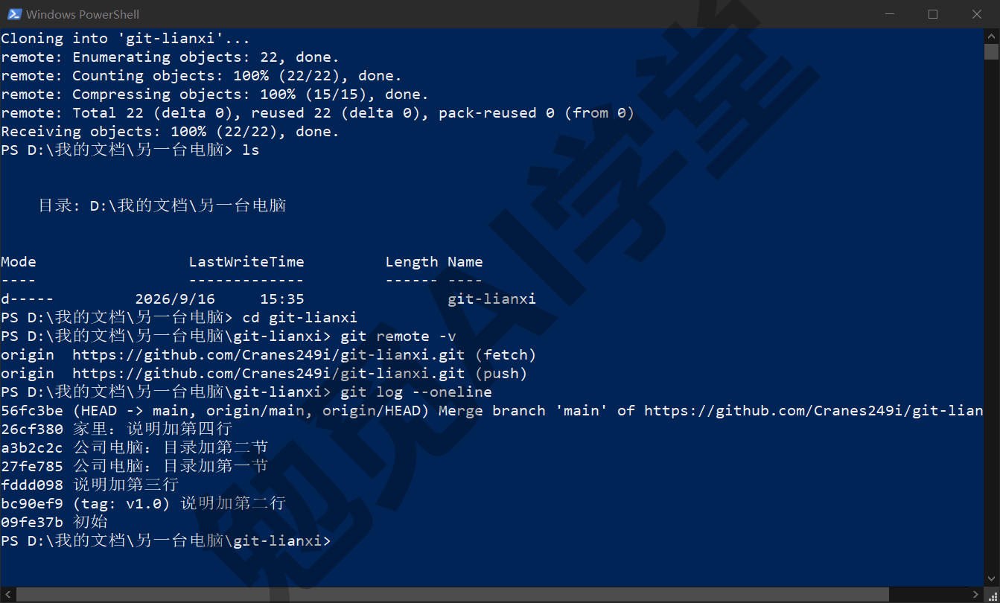

**克隆下来的仓库已经连好远程。** 进入文件夹敲 `git remote -v`，origin 已经指向你克隆时的网址；`git branch -a` 能看到 origin/main 影子；`git log --oneline` 是完整历史。你可以直接在里面改、提交、push，不需要再做 6.3 节的连接步骤。这就是“换电脑”的全部工作：装好 Git、配好署名、clone 一次。

**克隆不等于下载 zip。** GitHub 网页上有一个 Download ZIP（下载压缩包）按钮，它只给你最新一版的文件，没有 `.git`、没有历史，不能推送。要接着工作，一定用 clone。

**克隆到哪里。** 有两条建议。第一，路径短一点、层级少一点、尽量不带空格（《认识 Git 与装好》里用的 `D:\我的文档\Git练习` 这种就可以；`C:\Users\你\Documents\资料\2026\项目\子项目\` 这样一层层套下去，容易碰到路径过长的问题），《认识 Git 与装好》1.7 节的 longpaths 配置是碰到长路径问题时的补救办法。第二，**不要放在网盘同步文件夹里**（OneDrive、iCloud、坚果云这类；Windows 上开了 OneDrive 的文件夹备份时，桌面和文档也在同步范围内），网盘会在 Git 写 `.git` 的过程中同步半成品文件，时间长了很容易损坏仓库，《实战二：笔记与文档库的备份同步》11.1 节有复现的例子。Git 自己就是同步工具，不需要再套一层。

**拿别人的公开项目。** 任何公开仓库你都可以克隆，网址在仓库页面绿色的 Code 按钮下（需实机验证），选 HTTPS 那一栏复制。克隆后可以在本机随意修改、提交，但不能推回去，那是别人的仓库，你没有写权限；想把改动贡献回去要走《多人协作：PR 与 Issue》的 Fork（先把别人的仓库复制一份到自己账号下）流程。

**只要最新一版、不要全部历史。** 有些项目历史很大，只想拿最新代码跑一下，加 `--depth 1`：

```text
git clone --depth 1 https://github.com/用户名/仓库名.git
```

克隆出来只有最近一次提交，体积小很多，但不能用来翻历史。对自己的仓库不要用它。

**一个仓库一台电脑一份。** 同一台电脑上把同一个远程仓库克隆两次，得到的是两个互不知道对方存在的本机仓库，在一份里改了、另一份还是旧的，很容易改错地方。同一台电脑上想并行做两件事，用《冲突与工作树》5.7 节的工作树，不要重复克隆。本篇练习任务二为了模拟第二台电脑会故意再克隆一份，那是练习用的，练完把那个文件夹整个删掉即可。

### 6.6 公开还是私有

新建仓库时 Choose visibility 那一项选的是 Public 还是 Private，决定了世界上谁能看到它。

**默认选私有。** 私有仓库只有你（和你邀请的人）能看到，个人账号可以免费建私有仓库（数量与协作人数的限制以账号页面显示为准）。课程文稿、工作资料、个人笔记这类东西默认私有，需要公开的时候随时可以改：仓库 Settings → 最下方 Danger Zone（危险区）→ Change repository visibility（更改仓库可见性）这一行，点右侧的 Change visibility 按钮，再按页面提示确认（确认步骤的画面需实机验证）。

**公开能多做三件事。** 这三件事只有公开仓库能做（或做得方便）：用 GitHub Pages 免费发布网页（《GitHub 网页端：Pages 上线与发布》8.4 节，私有仓库要用 Pages 需要付费方案）；把作品或模板分享给任何人，对方有网址就能克隆；接受别人的贡献（《多人协作：PR 与 Issue》的 Fork 流程）。作品站、开源的模板、想让别人看到的项目，选公开。

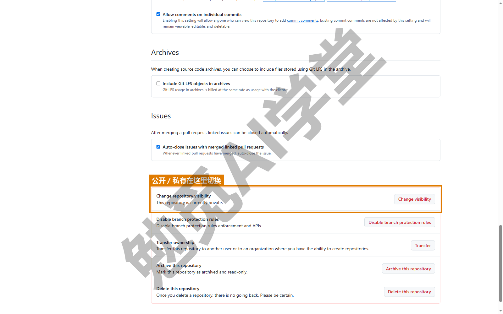

**公开前的隐私三问。** 把一个仓库从私有改公开之前，逐条过一遍：

- 历史里有没有密钥、密码、令牌？包括 `.env` 文件、配置文件里的 API key、写在脚本里的账号密码。
- 有没有别人的信息？联系人表格、聊天记录、含真实姓名电话的样例数据。
- 有没有不该公开的文件？未发布的稿件、内部文档、有版权的素材。

注意问的是“历史里”而不只是“现在的文件里”：一个密钥文件即使已经删掉，只要它曾经被提交过，任何人克隆后翻历史就能看到。所以《第一个仓库：提交与历史》2.8 节强调密钥类文件一开始就要进 `.gitignore`。

**已经推上去的密钥怎么办。** 顺序很重要，按下面三步做：

- 第 1 步，**立刻回到发这个密钥的那个服务（它的网站后台或设置页）把它作废、换一个新的**。这是唯一真正有效的补救：公开的那几分钟里，它可能已经被自动扫描的程序拿到了。
- 第 2 步，打开本机的仓库文件夹，把那个文件删掉、把它的文件名加进 `.gitignore`，然后在终端里照常 add、commit、push，这样最新版里没有它。
- 第 3 步不是操作，是要知道一件事：删文件不等于从历史里删，历史里那份还在。要彻底抹掉需要改写全部历史，用的工具叫 git filter-repo，本课只报名字不展开；而且改写历史意味着所有克隆过的人都得重新克隆。

第 1 步做到了，后两步就不那么紧迫。

**GitHub 的提醒。** GitHub 会自动扫描公开仓库里的常见密钥格式，发现后在仓库的 Security and quality（安全与质量）页签下、Secret scanning alerts（密钥扫描提醒）那一行提示，有些情况会直接通知密钥所属的服务商作废它（是否通知需实机验证）。看到这类提示不用慌，按上面三步处理即可，《GitHub 网页端：Pages 上线与发布》8.8 节会再讲怎么读这些提示。

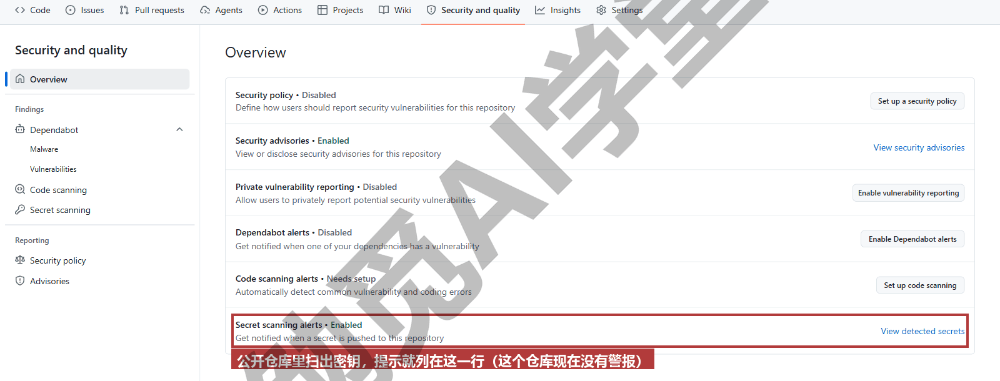

### 6.7 凭据管理与切换账号

6.3 节第一次推送时弹出的浏览器登录，是 Git Credential Manager（安装时第 14 步保留的凭据助手）在工作。这一节讲它把登录存在哪、什么时候需要动它。

**存在 Windows 凭据管理器里。** 登录成功后，凭据以 `git:https://github.com` 之类的名字存进 Windows 的“凭据管理器”（控制面板 → 用户帐户 → 凭据管理器 → Windows 凭据，或在开始菜单搜“凭据管理器”）。之后每次 push、pull，Git 都从这里取，所以不用再登录。macOS 上对应的是钥匙串访问（Keychain Access），原理相同。

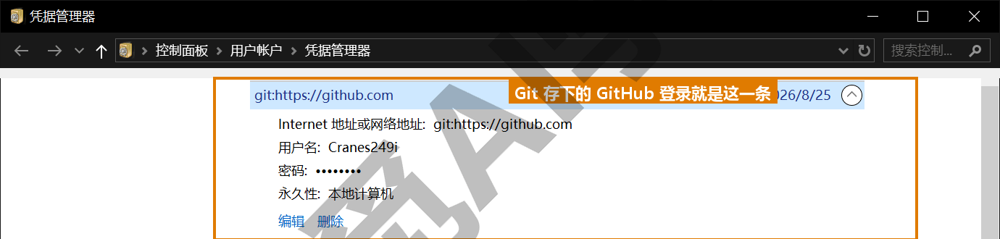

**什么时候要动它。** 有两种情况。第一，换账号：你想用另一个 GitHub 账号推送，但凭据管理器里存着旧账号，Git 会一直用旧的并报没有权限（Permission denied 或 403 一类的错误）。解决办法是在凭据管理器里找到 git:https://github.com 那条记录，点开它，点下面的“删除”，下次推送会重新弹出浏览器登录。第二，登录过期或被撤销：GitHub 那边撤销了授权（比如你在 GitHub 设置里断开了 Git Credential Manager 的连接），Git 会报认证失败（Authentication failed），同样删掉旧记录重新登录即可。

**一台电脑两个账号。** 个人账号和公司账号想同时用，凭据管理器按“网址”存凭据，同一个 github.com 默认只存一份，来回切换很麻烦。稳妥的做法是在仓库里为远程网址加上用户名，让两份凭据按不同网址区分：`https://个人用户名@github.com/...` 和 `https://公司用户名@github.com/...`，用 `git remote set-url origin 新网址` 改远程地址。凭据助手对这种写法的支持以实际表现为准，本课不展开。

**个人访问令牌是什么。** 你会在资料里看到 Personal Access Token（PAT，个人访问令牌）：一串代替密码的长字符串，在 GitHub 设置里生成、可设权限范围和有效期。它是给脚本、自动化、没有浏览器的服务器用的；有浏览器登录的日常使用不需要它，Mac 上没装 Git Credential Manager 时的第一次推送是个例外（6.3 节）。如果哪天凭据助手弹出的是要你输入密码的旧式窗口，那里填的应该是令牌而不是账号密码，GitHub 早已不接受密码推送。生成入口在右上角头像 → Settings → 左栏最下方的 Developer settings → Personal access tokens（需实机验证），生成时勾上仓库读写权限、设一个有效期，生成后立刻复制保存，页面只显示这一次；具体字段以页面为准，本课不展开。

**SSH 是另一种连接方式。** 除 HTTPS 之外，Git 还可以用 SSH 密钥对连接 GitHub：本机生成一对密钥，把公钥贴到 GitHub 设置里，之后不会再弹出登录窗口。它稍微复杂一点、排错也难一点，程序员用得多。本课主线用 HTTPS 加凭据助手，SSH 作为备选路线只报名字，等你熟练之后再考虑。

**凭据的安全。** 凭据管理器里的记录等于你的 GitHub 登录，别人拿到你的电脑账号就能以你的身份推送。公用或他人的电脑上用完记得删掉那条记录；自己的电脑设好锁屏密码。

### 6.8 国内访问不稳定时的实话

GitHub 的服务器在境外，国内访问的稳定性因地区、运营商和时段而异：有时网页打得开但克隆很慢，有时推送到一半中断报错，有时几分钟后又一切正常。这一节不推荐任何工具，只讲几件你能做的事，全部以你的实际网络为准。

**先判断是网络还是配置。** 推送或克隆报错时，先用浏览器打开 github.com 看能否正常访问；能打开而命令行不行，多半是命令行的连接比浏览器更容易受网络影响，等几分钟再试往往就好。报错里如果是 Authentication failed 或 Permission denied，那是 6.7 节的凭据问题，和网络无关。

**常见的网络类报错是什么样子。** 大致是 Failed to connect to github.com、Connection was reset、Recv failure、RPC failed、timed out 一类的英文，出现在 push、pull、clone 的时候。它们都表示“连不上或连接中断”，重试是第一选择。

**分步推、少量推。** 一次推很多大文件容易在中途断掉，可以先把大文件按《第一个仓库：提交与历史》2.8 节的原则排除，或分几次提交、几次推送。克隆大仓库不稳时先用 6.5 节的 `--depth 1` 拿到最新版，需要历史时再把其余的历史取回来（`git fetch --unshallow`）。

**把 Git 当本机工具用。** 网络不好不影响前五篇的一切：提交、历史、还原、分支、合并全部在本机完成。可以白天照常提交、网络稳定的时段再统一推送，Git 本来就设计成不联网也能正常用。

**其他托管平台。** 国内的 Gitee 等平台提供和 GitHub 概念基本相同的服务，在国内访问通常更稳，界面是中文，也支持把 GitHub 仓库整个导入过去，当作一份内容相同的副本。如果你的仓库不需要 Pages 和开源协作，用它们做备份完全可行；本课后面几篇的网页操作以 GitHub 为准，概念在其他平台上都对得上，按钮位置需要自己找一找。你也可以在本机同时配两个远程（origin 指 GitHub、另一个指 Gitee），每次各推一次。

**账号相关的说明。** 账号注册、两步验证、浏览器授权这些环节同样要能连上 github.com，见 6.2 节“账号与网络的准备”。

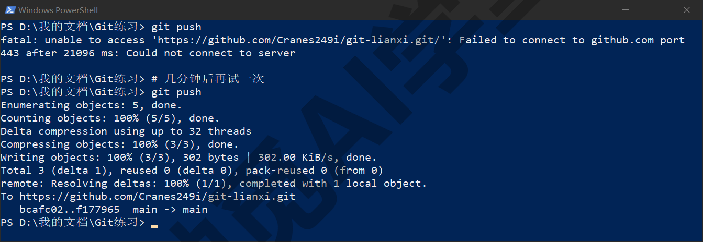

**在 AI 工具和图形界面里，这一步是什么样子。** Cursor 课《Git、GitHub 与代码审查》13.3 节里“连接 GitHub”是在 Cursor 中授权 GitHub App，那是给云端智能体、审查与 PR 功能用的账号连接，和本篇 6.3 节命令行推送用的凭据助手是两个互相独立的授权，互不替代；13.4 节的“推送”背后就是本篇的 `git push`。Codex 的 GitHub 插件也一样，先有本篇的远程仓库，插件才有东西可查。Obsidian 课《同步与备份全解》里 Git 这一种同步方案的插件配置，填的远程地址、凭据都是本篇 6.3 与 6.7 节的内容，《实战二：笔记与文档库的备份同步》会串起来。GitHub Desktop 里 Publish repository（发布仓库）一个按钮做完本篇 6.3 节的新建加连接加推送，工具栏那个大按钮的 Fetch origin／Pull origin／Push origin 三种状态对应 6.4 节，File → Clone repository...（克隆仓库）对应 6.5 节，见《图形界面与 AI 工具里的 Git》9.5 节。

### 6.97 练习任务

方括号里的内容换成你自己的。

**任务一：把练习仓库推上 GitHub。** 注册账号、开两步验证，在网页新建一个私有空仓库（三项初始化都不加），把 `[你的练习文件夹]` 连上并推送，再推标签：

```text
git remote add origin [网页给的网址]
git branch -M main
git push -u origin main
git push --tags
```

完成标准：网页上能看到全部文件、提交次数与本机 `git log --oneline` 行数一致、Tags 里有你的标签；`git status` 显示 up to date with 'origin/main'。

**任务二：克隆到第二个文件夹，来回同步一次。** 在另一个位置克隆同一个仓库当作“公司电脑”，改一行、提交、推送；回到原文件夹先 fetch 看看进来了什么，再 pull：

```text
git clone [你的仓库网址] 公司电脑
git fetch
git log --oneline main..origin/main
git pull
```

完成标准：fetch 后 status 显示 behind by 1 commit；log 里能看到公司电脑的那次提交；pull 后两个文件夹的 `git log --oneline` 完全一致。

**任务三：制造一次推送被拒，正确处理。** 在两个文件夹里各做一次不同文件的提交，先推其中一个，再推另一个触发 rejected，然后按提示处理：

```text
git push
git pull
git push
```

完成标准：第一次 push 出现 `! [rejected]` 与 fetch first 提示；pull 生成一个合并提交（或按《冲突与工作树》解掉冲突）；第二次 push 成功；全程没有用任何带 force 的命令。

### 6.98 本篇小结与自检

这一篇把三区图右侧加上了远程仓库，讲清了本机与远程互不自动同步、origin 只是昵称、每一份都是完整历史；注册 GitHub 账号时用户名要一次选定、两步验证当天就开、署名邮箱可用匿名地址；新建空仓库（三项初始化都不加）后用网页给的三行命令连接并首次推送，凭据助手弹浏览器登录；日常 push、fetch、pull 三个动作，推送被拒时先 pull 再 push、不用 force，divergent 提示用一条配置定为 merge，推分支与删远程分支；克隆是完整历史、不等于下载 zip、不要放进网盘同步文件夹；公开前过隐私三问，密钥推上去了先作废再删；凭据存在 Windows 凭据管理器，换账号就删那条记录；网络不稳时先判断是不是网络问题，再重试，一次少推一点，推不上去也不影响本机继续提交。

可以对照下面的清单检查学习结果：

- [ ] 能说出本机仓库与远程仓库为什么不会自动同步，origin 是什么
- [ ] 注册了 GitHub 账号，开了两步验证，保存了恢复码
- [ ] 新建空仓库时知道为什么三项初始化都不加
- [ ] 能逐条解释网页给的三行命令，知道 `-u` 记住了什么
- [ ] 分得清 push、fetch、pull，会用 `main..origin/main` 先看再合
- [ ] 遇到 rejected 知道先 pull 再 push，知道为什么不能 force
- [ ] 会推标签、推分支、删远程分支
- [ ] 知道克隆与下载 zip 的区别，知道仓库不要放进网盘同步文件夹
- [ ] 公开仓库前能过一遍隐私三问，知道密钥泄露的处理顺序
- [ ] 知道凭据存在哪、换账号怎么办，知道令牌和 SSH 是什么、暂时不需要

完成这些内容后，你的仓库已经有了云端备份，换电脑只需一次克隆。下一篇《多人协作：PR 与 Issue》讲 GitHub 上最重要的协作方式，也就是在分支上做完改动，通过 PR 让别人审查后合并，以及怎么参与别人的项目。

### 6.99 新手常见问题

**Q1：推上 GitHub 之后，别人是不是就能看到我的文件了？**

取决于仓库是公开还是私有。私有仓库只有你和你明确邀请的人能看到；公开仓库任何人都能浏览和克隆。新建时默认建议选私有，需要时再改公开，改之前按 6.6 节过一遍隐私三问。

**Q2：pull 和 fetch 到底有什么区别？**

fetch 只把远程的新提交下载到本机、更新 origin/main 这个影子，你的 main 和工作区不变，适合先看看别人推了什么；pull 等于 fetch 加 merge，一步把远程的合进你的 main。不确定进来的是什么时用 fetch 加 log 看一眼，确定就直接 pull。

**Q3：换电脑怎么把项目搬过去？**

在旧电脑上确保要带走的分支都已 push（当前分支看 `git status` 是否 up to date，其他分支各 `git push -u origin 分支名` 一次），标签用 `git push --tags`；在新电脑上装 Git、配好署名，然后 `git clone 仓库网址`，历史和文件就全有了。有两点要注意：被 `.gitignore` 排除的文件（比如密钥文件）不在仓库里，要另外复制过去；整个文件夹用 U 盘复制过去也可以（`.git` 在里面，历史完整），但不要靠网盘同步来搬，网盘可能只搬过去一份没同步完的半成品。

**Q4：密钥不小心推上去了怎么办？**

按 6.6 节的顺序：先到密钥所属的服务把它作废、换新的；再把文件从仓库删掉、加进 `.gitignore`、提交推送；最后要知道历史里那份还在，想彻底抹掉要用 git filter-repo 改写历史并让所有人重新克隆。第 1 步最重要，其他两步没那么紧迫。

**Q5：每次 push 都要登录吗？**

不用。第一次推送时凭据助手弹浏览器登录一次，之后凭据存在 Windows 凭据管理器（Mac 是钥匙串）里，自动使用。只有换账号、授权被撤销或凭据过期时才需要再登录一次，办法是删掉凭据管理器里那条 GitHub 记录。
