## 多人协作：PR 与 Issue

上一篇《GitHub 与远程仓库》把仓库送上了云端，但一直是你一个人在推和拉。这一篇解决的是你和别人一起改同一个仓库时怎么才不会互相覆盖：在分支上做完改动，到 GitHub 网页上发起一个合并请求，让别人看过、评论过再合进 main。这套做法叫 PR，也是你参与任何开源项目、或者让 AI 审查工具帮你审查改动的前提。本篇 GitHub 网页环节较多，按钮名以英文写出并附中文释义；网页界面随时可能调整，形态以你看到的页面为准。

这篇文章的实操内容不需要花钱：PR、Issue、Fork 都是 GitHub 免费账号自带的功能；7.3 节提到的 AI 审查工具只作介绍，本篇的操作用不到它们。

### 7.1 协作的两种模式

要和别人一起改同一个 GitHub 仓库，先问自己一个问题：这个仓库，你有没有直接推送的权限？答案不同，做法也分成两种。

**模式一：同一仓库，各开分支。** 如果仓库是你自己建的，或者仓库主人把你加成了协作者，你就有直接推送的权限，用的是这一种。这种情况下，通常谁都不直接在 main 上提交：各自从 main 开一条自己的分支，在分支上提交、推到远程，再到网页上发起合并请求，别人审查通过后才合进 main。加协作者的位置在仓库 Settings → 左侧 Access 下的 Collaborators（协作者）里，输入对方的 GitHub 用户名发出邀请，对方在邮件或通知里接受（邀请与接受的画面需实机验证）。

**模式二：Fork，再提回去。** 如果你想改的是别人的公开项目，比如给一个开源工具修个错字、补段文档，你对它没有推送权限，用的就是这一种。你要先 **Fork**（把它复刻一份到自己账号下），在自己那份上开分支、提交、推送，再向原仓库发起合并请求；合不合并，由原仓库的维护者审查后决定。具体步骤 7.6 节会展开。

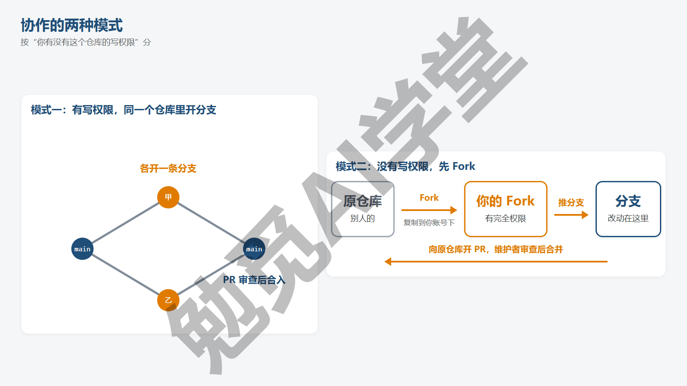

**三个新词。**

- **PR**（pull request，合并请求）：请求对方把你分支上的改动拉进他们的分支，网页上的一条 PR 包含改动内容、说明、讨论和审查记录。
- **Fork**：把别人的仓库复制一份到你自己的账号下，你对这份副本有完全的写权限。
- **Issue**（问题单）：仓库里的讨论条目，用来报告问题、提想法、记待办，7.7 节讲。

之后正文直接用 PR、Fork、Issue 三个词；现在不必把三个定义记牢，后面每一节都会在操作里反复用到它们。

**一个人用 GitHub，也值得开 PR。** 如果你现在只是一个人用 GitHub，多半会问：没有别人审，还要不要开 PR？值得开，有两点理由。第一，PR 页面会把你这条分支的全部改动逐行列出来，合并前你自己看一遍，等于一次强制的自我审查，很多错误就是在这里被发现的；第二，PR 保留了“为什么这样改”的说明和讨论，几个月后你回头看，比翻提交说明清楚得多。另外，Cursor 的 Bugbot、Codex 的 PR Chat 这类 AI 审查工具都工作在 PR 上，想让 AI 帮你审查改动，先得有 PR。所以本篇的做法你一个人也照样用，只是“审查者”换成了你自己或 AI。

**怎么判断自己属于哪种模式。** 你先想一下有没有拿到过这个仓库的权限：仓库是你建的，或者你接受过仓库主人发来的协作者邀请（邮件或站内通知里的 Accept invitation），走模式一；两者都不是，走模式二。页面上也有线索：你在右上角能看到 Settings（设置）页签，说明你是仓库主人（协作者看不到这个页签，但同样有推送权限）；只看到 Fork、Star（星标）之类的按钮，多半就只有读权限（需实机验证）。实在拿不准，直接 push 一次试试：没权限时 Git 会报 Permission denied 或 403（没有权限），那就转去 Fork。两种模式你可以同时在用：在自己团队的仓库里用模式一，给别人的开源项目用模式二，命令是同一套。

**两种模式的共同点。** 不论你走哪一种，改动都是同一套流程：在分支上提交，推到远程，到网页上开 PR，经过审查后合并，删掉分支，最后回本机同步。7.2 节先用模式一带你把这套流程走通，7.6 节再讲 Fork 多出来的几步。

### 7.2 PR 全程

你不需要找第二个人来练：用一个账号、两条分支就能把 PR 的整套流程走一遍，你既当提交者也当审查者（只是不能给自己点 Approve，7.3 节会说明）。下面假设你的仓库已经按《GitHub 与远程仓库》推到了 GitHub。

**第 1 步：在本机开分支、改、提交。** 先开分支，用编辑器改好文件，再加进暂存区并提交：

```text
git switch -c 修正错别字
git add .
git commit -m "修正 README 措辞"
```

分支名写清楚在做什么，它会出现在 PR 页面上。

**第 2 步：把分支推到远程。**

```text
git push -u origin 修正错别字
```

终端会输出 `* [new branch] 修正错别字 -> 修正错别字`。这一步之后 GitHub 上才有这条分支，才能开 PR。

**第 3 步：到网页上发起 PR。** 推送之后不久打开仓库页面，顶部通常会出现一条黄色横幅，写着你刚推了分支“修正错别字”，旁边有按钮 Compare & pull request（比较并发起合并请求），下图就是这条横幅。点它。如果横幅没出现也不要紧，点 Pull requests（合并请求）页签 → New pull request（新建）（需实机验证），进去后把页面顶部的 base（目标分支）选 main、compare（来源分支）选你的分支，这两个下拉菜单在第 4 步的图里能看到。

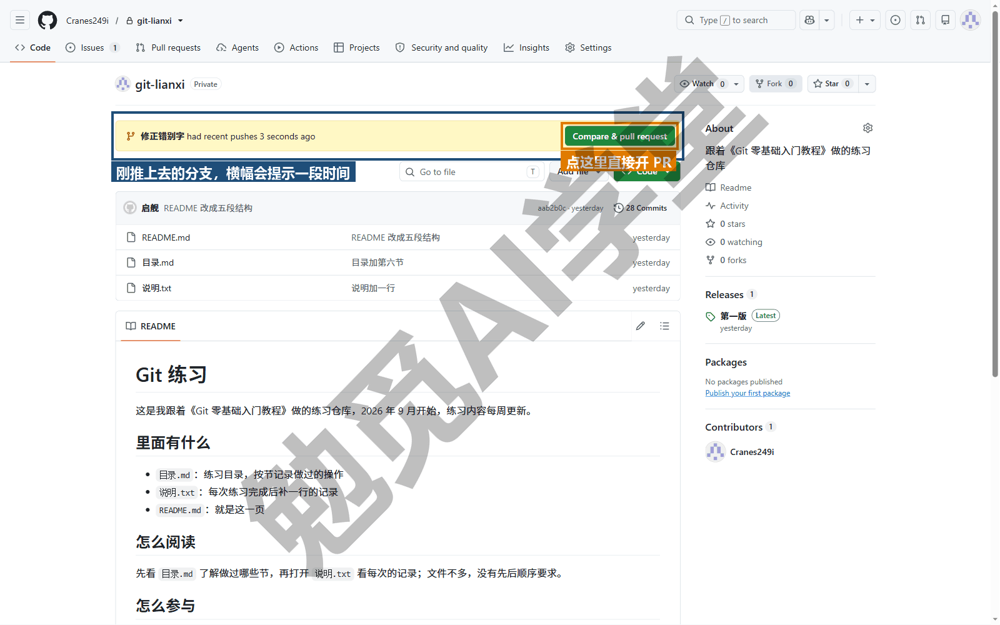

**第 4 步：写标题和说明。** 标题一句话讲清改了什么；说明写三件事：改了什么、为什么、怎么验证。可以照这个模板：

```text
## 改了什么
把 README 第一段“2026 年 9 月开始”改为“从 2026 年 9 月开始”，补上介词。

## 为什么
原句缺介词，读起来像半句话。

## 怎么验证
打开 README，第一段应为完整句子；其他内容未动。
```

页面下方会列出这条分支相对 main 的全部提交和文件改动，先自己看一眼，确认没有多余的东西混进来。然后点 Create pull request（创建合并请求）。

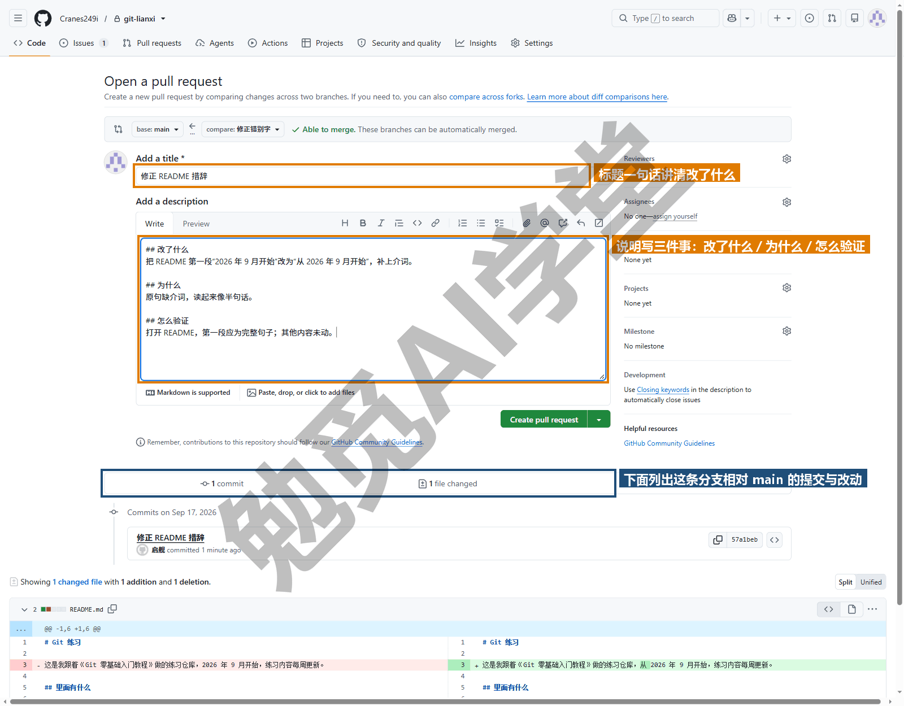

**第 5 步：看 Files changed。** PR 创建后进入它的页面，顶部有几个页签：Conversation（讨论）、Commits（提交）、Checks（自动检查，本课用不到）、Files changed（改动的文件），7.3 节第一张图的上方就是这一排页签。Files changed 就是 diff 的网页版，绿色是新增、红色是删除，和《第一个仓库：提交与历史》2.7 节的终端输出一一对应。审查者主要看这里，7.3 节讲怎么在这里留意见。

**第 6 步：合并。** 回到 Conversation 页签，底部有一个绿色的合并按钮，第一次用时上面写着 Merge pull request（合并），用过别的合并方式后会显示成上次用的那种（下图里是 Squash and merge）。点它之后，按钮下方会出现一块确认区，让你核对这次合并的提交说明（合并方式在按钮旁的小箭头里选，7.4 节讲三种），再点一次确认按钮 Confirm merge（确认合并；选了别的方式，按钮名会跟着变，如 Confirm squash and merge）（需实机验证）。合并成功后页面变成紫色的 Merged 状态，下方通常出现 Delete branch（删除分支）按钮，点它把远程上的这条分支删掉。

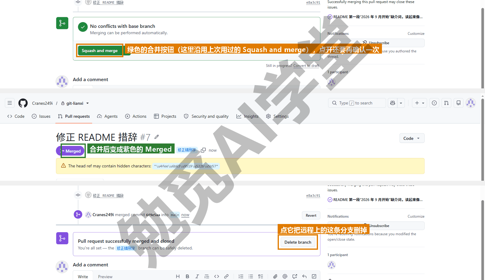

**第 7 步：本机同步。** 网页上的合并发生在远程，本机的 main 还不知道。切回 main、拉下来、删掉本地的功能分支：

```text
git switch main
git pull
git branch -d 修正错别字
```

pull 会把合并结果拉下来（本机 main 没有新提交时是一次快进）；`-d` 能成功，说明这条分支的内容确实已经在 main 里了。如果你在第 6 步选的是 Squash and merge 或 Rebase and merge，`-d` 会被拒绝，提示 the branch '修正错别字' is not fully merged，因为 main 上那个提交是新生成的、编号和分支上的不同，Git 看不出它们是同一份内容；确认 PR 页面已经显示 Merged 后改用 `git branch -D 修正错别字`（《分支与合并》4.2 节讲过 -D）。如果网页上没删远程分支，本机可以用《GitHub 与远程仓库》6.4 节的 `git push origin --delete 修正错别字`，这样删的话本机记录的 origin/修正错别字 影子也会一并清掉；在网页上点 Delete branch 删掉的，本机的影子会一直留着，`git fetch --prune` 才清掉。

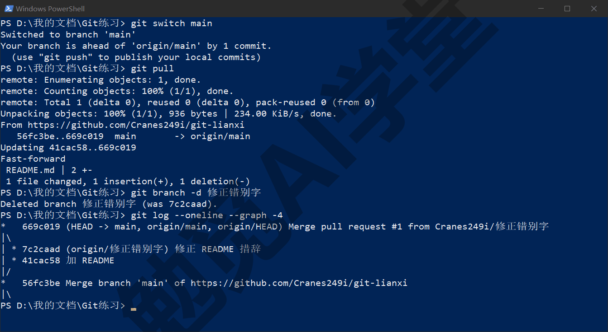

**这七步就是全部。** 以后你的每一次改动都是这同一套：开分支、改、推送、开 PR、审查、合并、同步。第一次走可能觉得步骤多，做熟之后几分钟就能走完。多人协作时唯一的差别，是第 6 步由别人来点合并，第 3 到第 5 步之间多出一段等待和讨论。

### 7.3 审查意见

开 PR 的目的，是让改动在合进 main 之前有人（或 AI）替你看一遍。这一节你两边都要做一遍：先学审查者怎么留意见，再学收到意见的提交者怎么回应。

**在某一行留评论。** 在 PR 的 Files changed 页签里，把鼠标移到某一行改动上，行号旁会出现一个加号，点它可以针对这一行写评论。评论可以是问题（“这里为什么删掉了原来的例子？”）、建议（“这句改成……更通顺”）或确认（“这段没问题”）。写完可以点 Comment（直接发这一条）或 Start a review（开始一次审查，把多条评论攒在一起最后一并提交）。

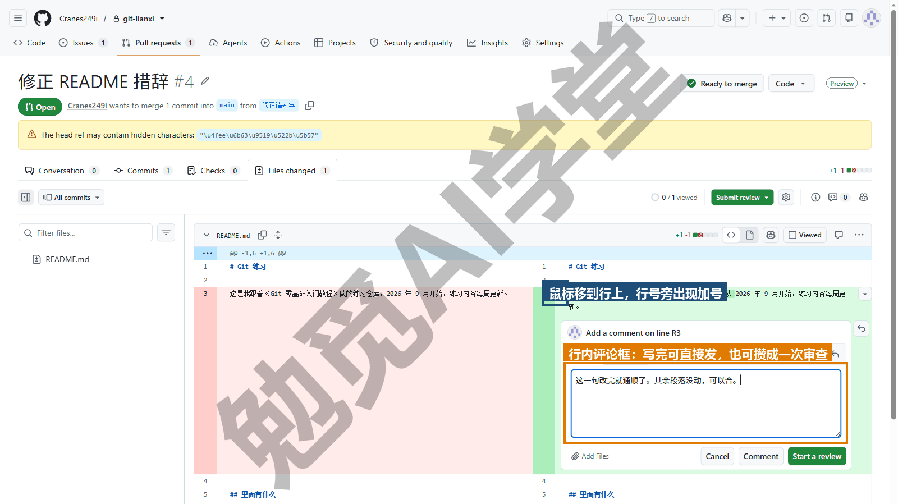

**给出审查结论。** 看完全部改动后，点右上角绿色的 Submit review（提交审查）按钮，在弹出的 Finish your review（完成审查）框里选三种结论之一：

- **Comment**（仅评论）：有想法要说，但不表态能不能合。
- **Approve**（批准）：看过了，可以合并。
- **Request changes**（要求修改）：有问题，改完再说；仓库设了分支保护（7.8 节讲）时，带着这个结论的 PR 无法合并。

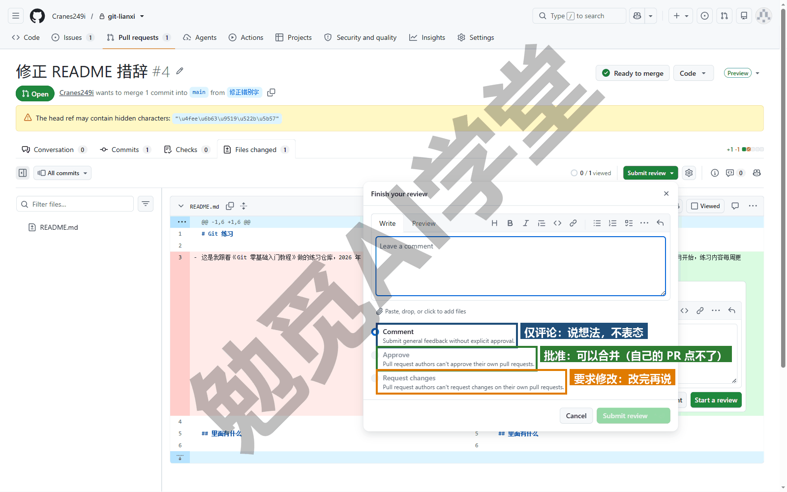

**自己的 PR 不能自己批准。** 你一个人练到这一步，弹出框里 Approve 和 Request changes 两项是灰的，下面写着 Pull request authors can't approve their own pull requests（上图）：GitHub 不允许 PR 的作者给自己的 PR 点这两项。所以你按 7.2 节一个人练习时，审查结论只能选 Comment，然后直接合并；Approve 与 Request changes 要等到你审别人开的 PR、或者别人审你的 PR 时才用得上，《实战三：参与开源项目 + 课程总结》里会真实经历一次。

**提交者怎么回应。** 如果你的 PR 被要求修改，不需要新开 PR：在本机同一条分支上继续改、提交、推送，PR 会自动带上新提交，Files changed 随之更新，评论下方可以回复说明改了什么。改完可以在右侧 Reviewers（审查者）栏里，点审查者名字旁边的 Re-request review（重新请求审查）图标提醒他再看（需实机验证）。审查者看过新提交后把结论改为 Approve，就可以合并了。这一来一回全部留在 PR 页面里，就是 7.1 节说的“为什么这样改”的记录。

**审查时看什么。** 轮到你审别人的改动时，非代码项目主要看三件事：改动范围有没有超出说明里写的（说改一句话，结果动了五个文件，要问）；内容本身对不对；有没有不该进来的文件（临时文件、密钥、大图）。看不懂的地方，直接在那一行留评论问就行。

**AI 审查工具在这一步做什么。** 你可以把它们理解成不用休息的审查者：Cursor 的 Bugbot 会在 PR 上自动留行内评论，指出可能的错误（Cursor 还有一个 Agent Review，审查的是还没推上去的本地改动，不在 PR 上）；Codex 的 PR Chat 让你在侧边栏里对着 PR 提问、看建议补丁；GitHub 自己的 Copilot 代码审查也能作为审查者被指派（各功能的开放范围与套餐要求以各产品页面为准）。它们留的评论和人留的看起来一样，提交者按同样的方式回应。它们擅长找出遗漏和不一致，不擅长判断“这个改动是不是你想要的”，最终点 Approve 的仍然应该是人。Cursor 课《Git、GitHub 与代码审查》和 Codex 课《自动化、Git 与远程操控》分别讲了各自工具的入口。

### 7.4 三种合并方式

你在第 6 步点合并时，按钮旁的小箭头里其实可以选三种合并方式，选哪一种，合并之后留下的历史看起来完全不同。下面每种各给一段合并后 `git log --oneline --graph` 的输出，提交编号是示例，你的会不同。

**Merge commit（创建合并提交）。** 这是默认选项。把分支上的全部提交原样并入，再加一个合并提交，历史里保留分叉；合并提交的说明由 GitHub 自动生成，一般写成 Merge pull request #1 from 你的用户名/功能，井号后面是 PR 的编号：

```text
*   a5ba0da Merge pull request #1 from 你的用户名/功能
|\
| * 3540b46 功能提交2
| * 8c511f8 功能提交1
* | 527a793 main 上的其他提交
|/
* 3369db6 修正 README 措辞
```

优点是什么都不丢、每一步都能追溯；缺点是分支上那些“改一下”“再改一下”的小提交也全进了 main，历史比较琐碎。

**Squash and merge（压缩合并）。** 把分支上的所有提交压成一个新提交放到 main 上。这个新提交的说明默认是 PR 标题加上 PR 编号，正文里列出被压掉的那几条提交的说明（分支上只有一个提交时直接沿用那个提交的说明），点合并时可以在弹出的框里改（需实机验证）：

```text
* f19b16c 功能 (#1)
* 1e8068c main 上的其他提交
* 3369db6 修正 README 措辞
```

main 的历史里一条 PR 只占一行，干净、好读；分支上的细碎过程不进 main（分支本身删掉后就看不到了，但 PR 页面会一直保留全部提交记录）。

**Rebase and merge（变基合并）。** 把分支上的提交逐个搬到 main 最新提交之后，排成一条直线，不加合并提交：

```text
* f6ee717 功能提交2
* 73ed9fd 功能提交1
* c1944a7 main 上的其他提交
* 3369db6 修正 README 措辞
```

这样合并出来的历史是一条没有分叉的直线，比前两种都直；但每个提交都换了编号（《冲突与工作树》5.6 节讲过，rebase 搬提交时就是这样），分支上的提交越多，越容易在这一步遇到冲突。

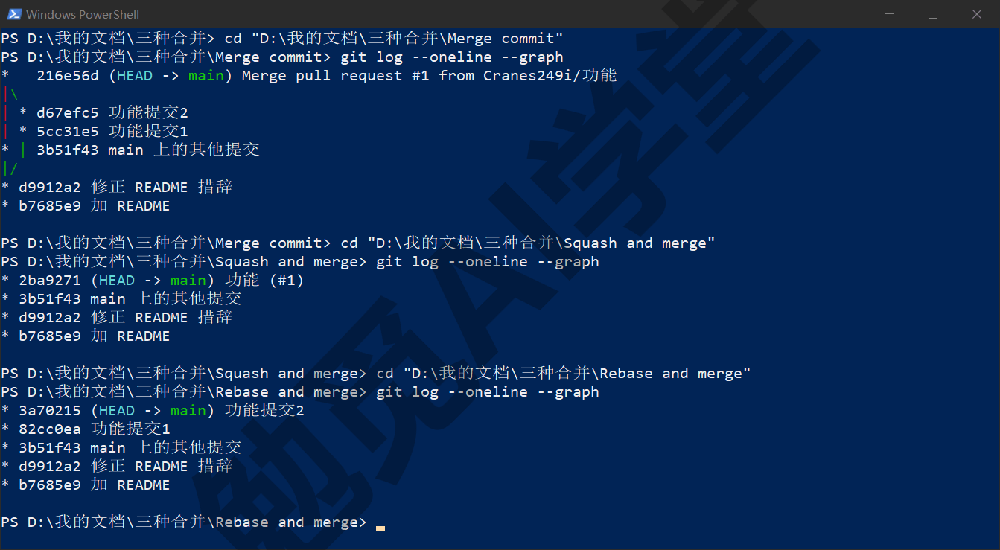

**怎么选。** 如果你是一个人用，或者在一个小团队里，建议用 **Squash and merge**：一条 PR 一个提交，main 的历史就是一张“做过哪些事”的清单，三个月后翻起来最快；细节也不会丢，PR 页面上全都还在。只有一点要记住：Squash 之后你在本机删那条分支要用 `-D`，原因见 7.2 节第 7 步。如果团队想保留分支里的每一步，用 Merge commit。Rebase and merge 除非团队明确要求，否则不要选，原因见《冲突与工作树》5.6 节。合并按钮旁的小箭头可以随时切换方式；你是仓库主人的话，也可以在 Settings → General 的 Pull Requests 区里限定只允许某几种（《GitHub 网页端：Pages 上线与发布》8.7 节有这一区的截图），团队成员就不必每次选择了。

**合并方式与本机命令的对应。** Merge commit 等于本机的 `git merge`（带 `--no-ff`）；Squash and merge 等于 `git merge --squash` 后再 commit 一次；Rebase and merge 等于在分支上 `git rebase main` 后快进。你知道了这层对应，看 AI 工具替你做的合并操作就不会陌生。

### 7.5 PR 里的冲突

你的 PR 开着的这段时间，main 可能已经被别人推进了新提交。如果那些提交改的和你是同一处，PR 页面会提示无法自动合并：This branch has conflicts that must be resolved（此分支存在必须解决的冲突），合并按钮变灰（下图）。这不是出了什么大错，只是《冲突与工作树》里解过的冲突换了个地方出现，有两种处理办法。

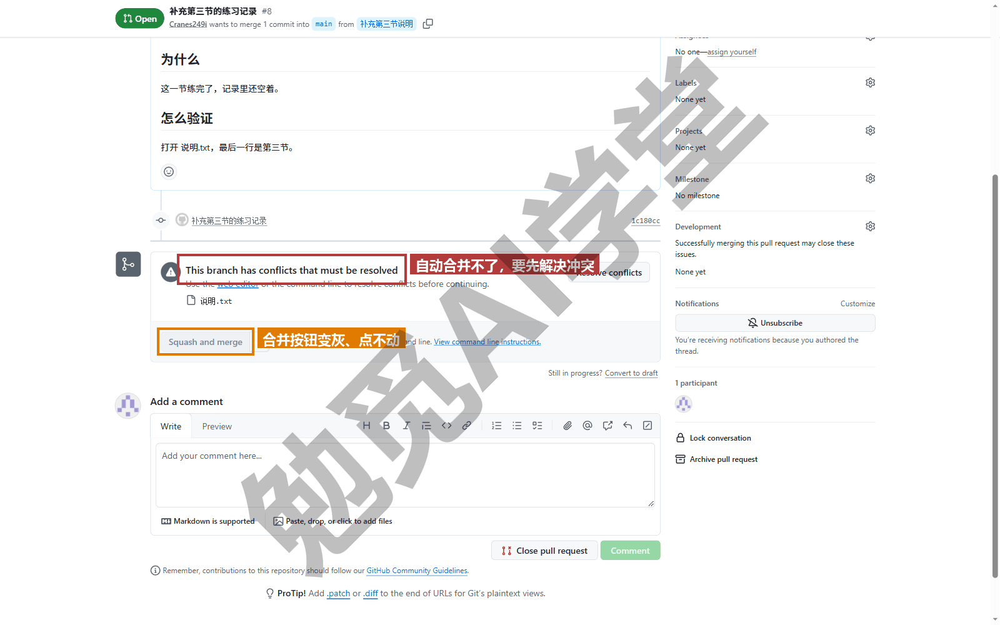

**办法一：在网页上解决。** 如果冲突只有一两处、改动也简单，直接在网页上解：提示旁边有一个 Resolve conflicts（解决冲突）按钮，点开是一个网页编辑器，冲突处用《冲突与工作树》5.3 节讲过的 `<<<<<<<`、`=======`、`>>>>>>>` 标记包着，你在网页里删标记、留内容，点 Mark as resolved（标记为已解决）、Commit merge（提交合并）（需实机验证）。

**办法二：在本机解决，再推上去。** 冲突多，或者你想在自己的编辑器里仔细看，就回本机处理。先把 main 的最新内容取回来，合进你的分支：

```text
git switch 修正错别字
git fetch origin
git merge origin/main
```

Git 会报出和《冲突与工作树》5.2 节一样的 CONFLICT，按那一篇 5.4 节三步解决（编辑、删标记、add 加 commit）。然后推送：

```text
git push
```

PR 会自动更新，冲突提示消失，合并按钮恢复可用。这种办法其实是“先把 main 合进我的分支、把冲突在我这边解掉，再让我的分支合进 main”，这样 main 上就不会出现冲突状态，是《冲突与工作树》5.5 节预防原则里“合并前先更新”的具体做法。

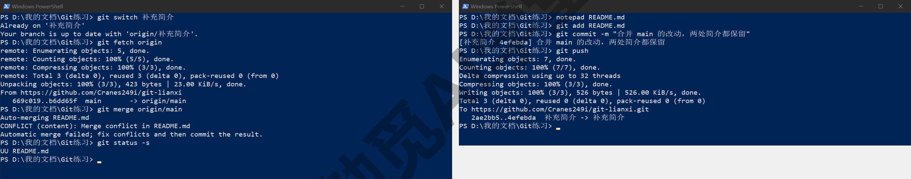

**Fork 模式下的写法。** 如果你的分支在 Fork 里，main 的最新内容在原仓库（叫 upstream，7.6 节会讲），命令换成 `git fetch upstream` 和 `git merge upstream/main`，其余一样。

**解完之后再看一眼 PR。** 无论哪种办法，冲突解决后 PR 页面的 Files changed 会多出解决冲突时产生的改动（如果你在解决时还改了别的内容，也会一起显示）。合并前重新过一遍，确认解决冲突时留下的是你想要的那一版、没有把对方的改动误删。冲突解决是整个 PR 流程里最容易引入错误的一步，值得多花一分钟。

**怎么预防。** PR 开得越久越容易冲突，你可以从三件事上预防：PR 尽量小、尽快合并；开 PR 前先把 main 合进自己的分支一次；改的时候避开别人正在动的文件。三条做到，冲突会很少见。如果你们团队经常有人同时改同一份长文档，可以约定按章节拆成多个文件，每个人的分支各改各的文件，冲突的概率会大幅下降。

### 7.6 Fork 工作流

轮到你给一个没有推送权限的仓库提改动了。全程六步，前四步和 7.2 节几乎相同，你只需要多理解一件事：“两个远程”。

**第 1 步：Fork。** 打开原仓库页面，点右上角的 Fork（复刻）按钮，在打开的页面里保持默认、点 Create fork（创建复刻），GitHub 就在你的账号下建一份副本，网址变成 github.com/你的用户名/仓库名，仓库名下方多一行“forked from 原仓库”。

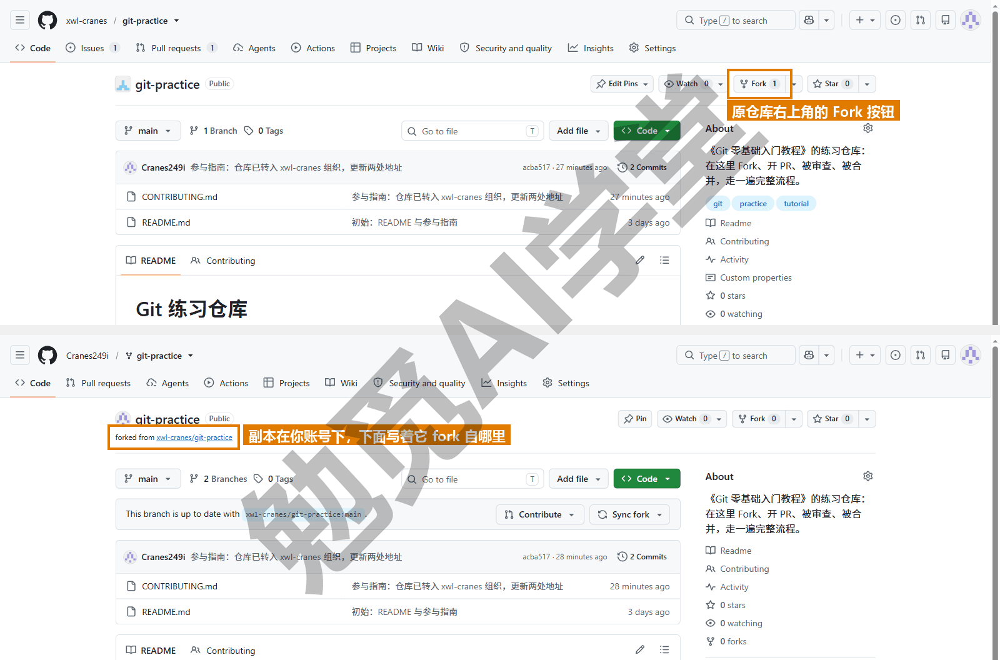

**第 2 步：克隆你的副本。**

```text
git clone https://github.com/你的用户名/仓库名.git
```

克隆下来之后，origin 指向的是你的副本（你有写权限的那份）。

**第 3 步：加上原仓库作为第二个远程。** 习惯叫它 upstream（上游）：

```text
git remote add upstream https://github.com/原作者/仓库名.git
git remote -v
```

现在有两个远程，四行输出：origin 两行指你的副本，upstream 两行指原仓库。你只往 origin 推，从 upstream 取。

**第 4 步：开分支、改、推到你的副本。**

```text
git switch -c 补充说明
git add .
git commit -m "补充参与说明"
git push -u origin 补充说明
```

**第 5 步：向原仓库开 PR。** 推送后到你的副本页面，同样会出现 Compare & pull request 横幅（需实机验证）。不同的是新建 PR 页面顶部会显示 base repository（目标仓库）是原仓库、head repository（来源仓库）是你的副本，这就是“跨 Fork 的 PR”。写好说明后点 Create pull request。之后的审查、回应、合并由原仓库的维护者操作，你在自己的分支上继续推提交就能更新 PR，和 7.3 节一样。

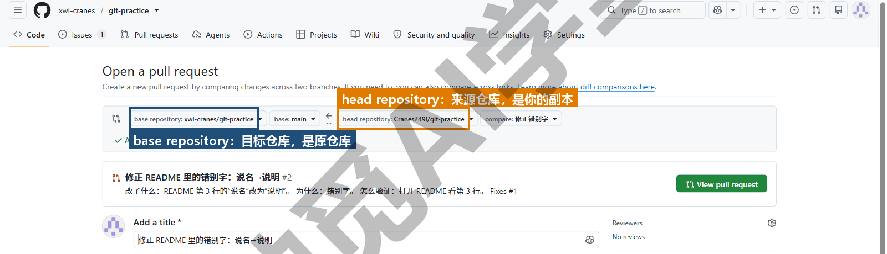

**第 6 步：让你的副本跟上原仓库。** 原仓库不断有新提交，你的副本不会自动更新。有两种做法。用命令行的话是四条命令：

```text
git switch main
git fetch upstream
git merge upstream/main
git push
```

fetch 把原仓库的新提交取到 upstream/main，merge 合进你本机的 main（通常是快进），push 把你的副本也更新。用网页的话，你的副本页面上会提示落后了几个提交（This branch is 1 commit behind），旁边有一个 Sync fork（同步复刻）按钮，点开后点 Update branch（更新分支），一键完成同样的事，然后本机 pull 一下。开新 PR 之前先做一次同步，能避开大部分 7.5 节的冲突。

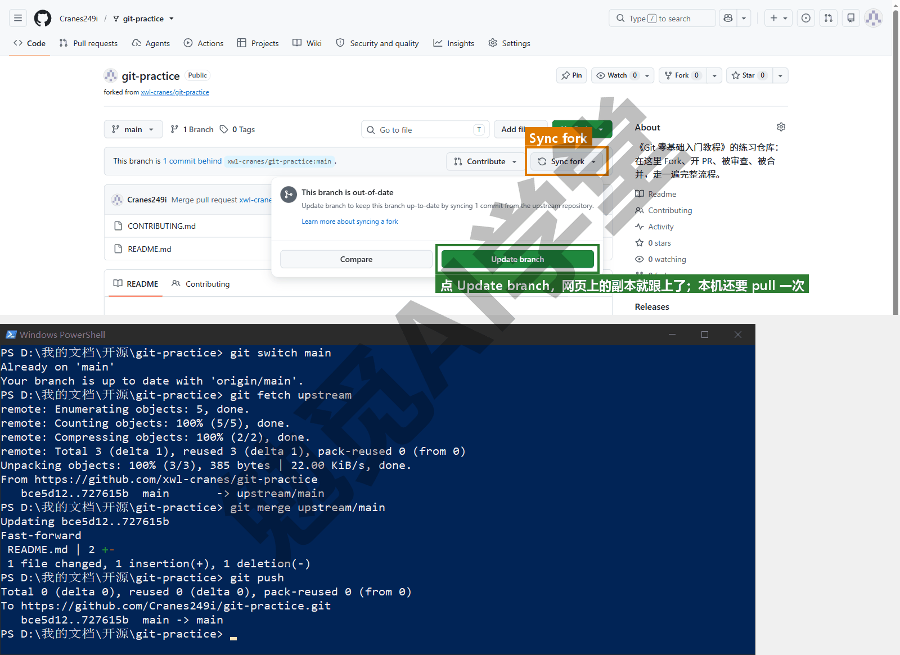

**PR 合并后清理。** 原仓库合并了你的 PR 之后，同步一次副本（第 6 步），在本机用 `git branch -d 补充说明` 删掉本地分支（维护者用的是 Squash 或 Rebase 方式的话要改用 `-D`，见 7.2 节第 7 步），再用 `git push origin --delete 补充说明` 删掉远程分支。你的副本可以留着下次用，也可以在 Settings 里删掉。

**一个练习用的公开仓库。** 如果你现在手边没有可以提 PR 的别人的项目，GitHub 官方维护着一个专供练习 Fork 与 PR 的仓库 octocat/Spoon-Knife，你可以随意 Fork 并提 PR，只是那些 PR 不会被合并。想体验“被审查、被合并”的完整流程，需要一个真实会处理你 PR 的仓库，《实战三：参与开源项目 + 课程总结》会安排。

### 7.7 Issue：报告问题与记录待办

有时候你发现了问题，但还没打算、或者不方便自己动手改，这时该用的是 Issue，不是 PR。PR 是“我已经改好了，请合并”；Issue 是“这里有个问题（或想法），先讨论”。仓库默认都有 Issues 页签，任何能看到仓库的人都可以开一条；仓库主人可以在 Settings 里把它关掉，Fork 出来的副本默认就是关着的，你要在副本上练 Issue 的话，得先去 Settings → General 页的 Features（功能）区里打开（需实机验证）。

**怎么写一条有用的 Issue。** 标题一句话说清是什么问题；正文写四件事：怎么复现（一步步操作）、期望看到什么、实际看到什么、环境（版本、系统），有截图就贴上；这四件事下文简称“四要素”。对比一下：“README 有错”几乎没法处理；“README 第一段‘2026 年 9 月开始’缺介词，建议改为‘从 2026 年 9 月开始’”维护者一看就能动手。你给自己的项目开 Issue 时同样这样写，几周后回头处理，靠的也是这些信息。

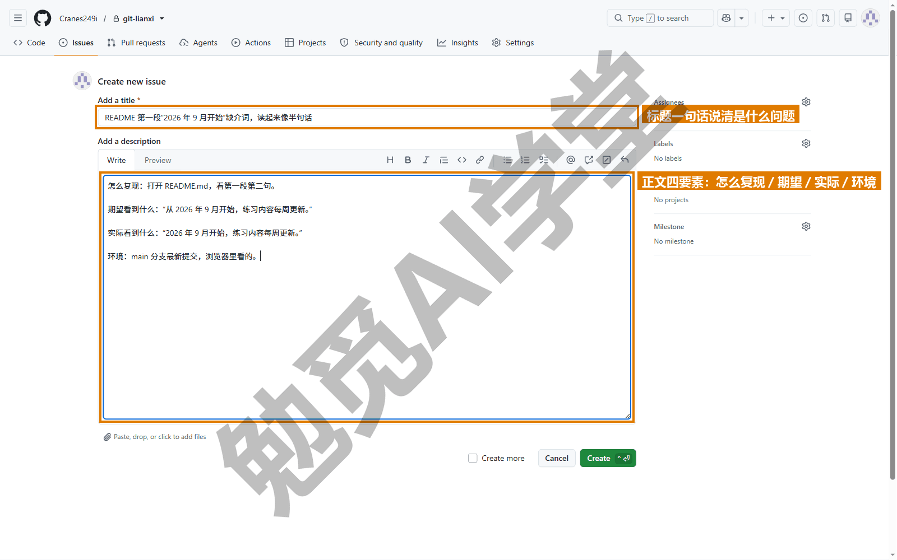

**Issue 还可以填三样东西。** Labels（标签）给条目分类（bug、文档、想法）；Assignees（指派）标明谁负责；Milestone（里程碑）把多条 Issue 归到一个目标下（比如“v1.0 发布前”）。三项都在新建 Issue 页面的右侧（上图）。个人项目用标签就够，其余两项是团队用的，知道它们在哪里就行。

**用 PR 关闭 Issue。** 这是 Issue 与 PR 最有用的联动：在 PR 的说明（或提交说明）里写上 `Fixes #12`（或 Closes #12、Resolves #12），其中 12 是 Issue 编号，PR 合进默认分支（一般就是 main）的那一刻 GitHub 会自动把 12 号 Issue 关闭，并在两边互相留下链接（下图）。这样从问题到修复就串成了一条可追溯的线。编号在 Issue 标题旁边，以 # 开头。

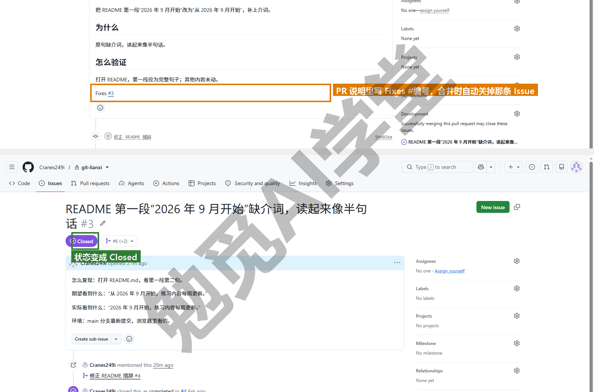

**一条 Issue 从开到关的样子。** 以自己的课程文稿仓库为例：你发现第三节的截图编号和正文对不上，开一条 Issue，标题“第三节截图编号与正文不一致”，正文写“复现：打开 03.md，正文引用 ep3-05，实际图为 ep3-06；期望：编号一致；环境：main 分支最新提交”。第二天你开分支 修正-第三节图号，改好后开 PR，说明里写 `Fixes #7`，合并。此时 7 号 Issue 自动关闭，Issue 页面的时间线末尾多出一条记录，写明它随 PR #8 的合并被关闭，PR 页面也链回 Issue。半年后有人问“那个图号问题怎么解决的”，从任一边点过去都能看到完整过程。

**Issue 也是待办清单。** 很多人把自己项目的 Issues 当任务列表用：想到要做的事开一条，做完关掉，Issues 页就是进度板。GitHub 还提供了 Projects（项目看板）把 Issue 和 PR 拖成看板视图，以及 Discussions（讨论区）用于不属于“问题”的开放式交流，两者本课不展开。

**给别人的项目开 Issue 的礼节。** 你去别人的项目开 Issue 之前，先搜一下有没有人报过同样的问题（Issues 页有搜索框）；按四要素写清楚；语气平和，维护者多数是志愿者。开 Issue 不需要任何权限，是你参与开源门槛最低的方式，比 PR 还低。

### 7.8 一页协作规矩

命令你都会了，最后是“规矩”。小团队协作出问题，多数不是因为谁不会命令，而是事先没说好规则。下面这一页你可以直接抄进自己仓库的 README 或团队文档，按需改。

```text
## 协作规矩

1. main 不直接提交。所有改动走分支 + PR。
2. 一件事一条分支一个 PR。分支名写清内容，如 修正-第三节错别字。
3. 提交说明一句话讲清改了什么，中文即可。
4. PR 说明写三件事：改了什么、为什么、怎么验证。
5. 合并方式统一用 Squash and merge；合并后删分支。
6. 谁合并：作者本人在拿到一个 Approve 后合并；紧急修复可自合并并事后说明。
7. 开 PR 前先同步 main；PR 尽量小、尽快合并。
8. 不进仓库的东西：密钥与密码、含个人信息的数据、大于 10 MB 的文件、
   临时与缓存文件。有疑问先问，不要先推。
9. 每天开工先 pull，收工前 push。
```

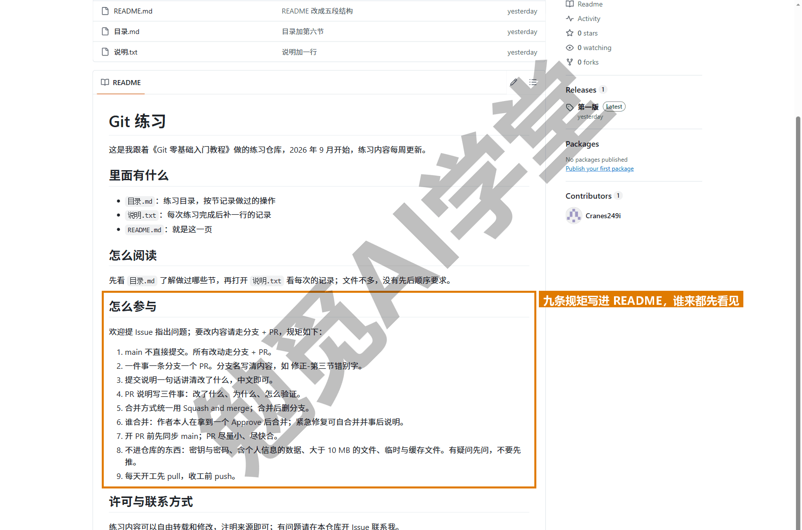

**分支保护是什么。** 上面的规矩靠人自觉，如果你想让 GitHub 替你强制执行，就用分支保护。在仓库 Settings 左侧的 Rulesets（规则集）里，或旧版的 Branches → Branch protection rules（分支保护规则）里，可以给 main 设规则：禁止直接推送、合并前必须有至少一个 Approve、必须通过检查（比如自动运行的测试）、禁止强制推送等（可选的规则项需实机验证）。设了之后默认连你这个仓库主人也要照规则走，要不要给管理员留例外可以另设。你一个人的项目一般不用；两人以上的团队建议至少设“main 禁止直接推送、PR 需一个 Approve”两条，两条设好只要几分钟，能挡住绝大多数误操作。本课只讲它在哪、能做什么，具体配置项以页面为准。

**协作者的加入与移除。** 你是仓库主人的话，模式一的团队成员在 Settings → Collaborators 里管理；被移除的人本机的克隆仍在，但推送会被拒绝。团队再大一点会用 GitHub 的 Organization（组织）来管理成员和权限，本课不展开。

**AI 参与协作的规矩。** 你让 Codex 或 Cursor 替你改东西时，把上面第 1、2、8 条也告诉它：让它在分支上工作、一件事一条分支、不要提交密钥和大文件。它们能读懂这类要求，通常也会照做；你负责在 PR 页面上做最后的审查和合并。

**在 AI 工具和图形界面里，这一步是什么样子。** Cursor 课《Git、GitHub 与代码审查》13.4 节里在代理窗口直接开 PR、看检查、合并，以及 `/split-to-prs` 把一大批改动拆成几个小 PR，都是本篇 7.2 节七步的按钮版，PR 说明由 AI 起草、你按 7.2 节第 4 步的三件事核对；Bugbot 是 7.3 节的审查者，Agent Review 在推送之前审查本地改动。Codex 课《自动化、Git 与远程操控》里侧边栏的 PR Chat 是在 7.3 节的 Files changed 上对话、看建议补丁并直接接受或拒绝。GitHub Desktop 里，Branch 菜单的 Create Pull Request（创建合并请求）会把你带到 7.2 节第 3 步的网页，之后的步骤都在网页完成，见《图形界面与 AI 工具里的 Git》9.5 节。

### 7.97 练习任务

方括号里的内容换成你自己的。

**任务一：一个人走完一次 PR。** 在 `[你的仓库]` 里开分支改一处、推送、到网页上开 PR 并按模板写说明，在 Files changed 里给自己留一条行内评论，用 Squash and merge 合并并删除远程分支，回本机同步（Squash 之后删本机分支要用 `-D`，原因见 7.2 节第 7 步）：

```text
git switch -c [分支名]
git push -u origin [分支名]
git switch main
git pull
git branch -D [分支名]
```

完成标准：PR 页面显示 Merged；main 的 `git log --oneline` 里这条 PR 只占一行；本机与远程分支都已删除。

**任务二：制造一次 PR 冲突并在本机解掉。** 开分支改某一行并推送、开 PR；然后在 main 上（在网页上直接编辑，或在本机另外克隆一份来改）改同一行并推送，观察 PR 出现冲突提示；回本机：

```text
git switch [分支名]
git fetch origin
git merge origin/main
git add [冲突文件]
git commit -m "合并 main，解决冲突"
git push
```

完成标准：PR 页面的冲突提示消失、合并按钮恢复；合并后 main 上那一行是你最终决定的内容。

**任务三：写一条 Issue 并用 PR 关闭它。** 在自己的仓库开一条 Issue（按四要素写），记下编号；开分支修好它、推送、开 PR，说明里写 `Fixes #[编号]`，合并。

完成标准：PR 合并后 Issue 自动变为 Closed，而且 Issue 页面里有指向这条 PR 的链接。

### 7.98 本篇小结与自检

这一篇讲了协作的两种模式（同仓库各开分支与 Fork 后提回去），以及 PR、Fork、Issue 三个词；用一个账号两条分支走通了 PR 七步（开分支、推送、到网页上开 PR、写三件事说明、看 Files changed、合并、本机同步）；审查者在行内留评论、给出 Comment／Approve／Request changes 三种结论，提交者在同一分支追加提交回应，AI 审查工具是不休息的审查者；三种合并方式的历史形状与个人小团队选 Squash 的理由；PR 冲突在网页上解决，或在本机把 main 合进分支再推；Fork 工作流的两个远程与 upstream 同步；Issue 的四要素写法与 Fixes #编号 自动关闭；最后给出一页可抄的协作规矩和分支保护的位置。

可以对照下面的清单检查学习结果：

- [ ] 能说出两种协作模式各用在什么时候，PR、Fork、Issue 各是什么
- [ ] 能不看书走完 PR 七步，知道每一步在本机还是在网页
- [ ] 会在 Files changed 里留行内评论，知道三种审查结论的含义
- [ ] 知道被要求修改后在同一分支追加提交即可，不必新开 PR
- [ ] 能说出三种合并方式后 main 历史的样子，知道为什么推荐 Squash
- [ ] PR 出现冲突时知道两种处理办法，会在本机 fetch、merge origin/main 再推
- [ ] 会 Fork、克隆副本、加 upstream、开分支推到副本、向原仓库开 PR、同步副本
- [ ] 会写四要素的 Issue，知道 Fixes #编号 的用法
- [ ] 有一页自己项目的协作规矩，知道分支保护在哪、能做什么

完成这些内容后，你已经能和任何人在 GitHub 上协作，也能参与任何开源项目了。下一篇《GitHub 网页端：Pages 上线与发布》回到网页本身：看懂仓库页面的每个区域、在网页上直接改文件、把网页作品用 GitHub Pages 变成一个网址、用 Releases 发布正式版本，以及大文件和仓库管理的常识。

### 7.99 新手常见问题

**Q1：一个人用 GitHub，要开 PR 吗？**

不强制，但值得。PR 页面把改动逐行列出来，合并前自己看一遍能发现不少问题；说明和讨论留在 PR 里，比提交说明更容易回顾；AI 审查工具也只在 PR 上工作。日常小改直接推 main 没问题，大改动建议走 PR。

**Q2：PR 和 push 有什么区别？**

push 是把你本机的提交送到远程某条分支上，是一个纯技术动作；PR 是在网页上发起的“请把这条分支合进那条分支”的请求，附带说明、审查和讨论，是一个协作流程。开 PR 之前必须先 push 分支，push 之后也可以不开 PR、直接在本机合并（自己的仓库可以这样做）。

**Q3：别人的项目我能直接推吗？**

不能，你没有写权限，push 会被拒绝。正确做法是 7.6 节的 Fork：复刻到自己账号、在副本上改、向原仓库开 PR，由维护者决定要不要合并。只报告问题不改代码的话，开一条 Issue 就够，不需要任何权限。

**Q4：合并方式选错了能改吗？**

已经合并的 PR 不能改合并方式。如果你选了 Merge commit 但想要 Squash 的效果，最简单的办法是接受它，下次注意；确实要改，只能在本机用《撤销、还原与找回》的办法退掉那次合并再重做，但这会改写已推送的历史，团队项目不要这样做。仓库主人可以在 Settings 里限定只允许一种合并方式，从源头避免选错。

**Q5：审查一定要人来做吗？**

不一定。AI 审查工具可以自动在 PR 上留评论、找问题，个人项目让它们先审查一遍很划算。但“这个改动是不是我想要的”“要不要合并”这类判断仍然应该由人来做，尤其是团队项目。
