## GitHub 网页端：Pages 上线与发布

前两篇里 GitHub 网页只是命令行的配角：建个空仓库、开个 PR。这一篇把网页本身当主角：看懂仓库页面的每个区域、在网页上直接改文件和上传、把 README 写成仓库的门面、用 GitHub Pages 把网页作品变成一个任何人都能打开的网址、用 Releases 发布带版本号的正式版、了解大文件的边界，以及改名、归档、删除这些仓库管理动作。本篇几乎全部在网页上操作，按钮名以英文写出并附中文释义，GitHub 界面随时可能调整，形态以你看到的页面为准；涉及本机的部分（`.nojekyll`、标签、大文件体积）仍在终端里做。

这篇文章的实操内容不需要花钱：本篇用公开仓库，GitHub Pages 对公开仓库免费，Releases 也免费；私有仓库用 Pages 要付费方案、LFS 只有免费额度，8.4 节与 8.6 节只作说明、不展开，本篇的操作用不到。

### 8.1 仓库首页有什么

你打开自己的一个仓库，默认打开的是 Code（代码）页签，这一页的几个区域以后会反复用到，先认一遍（各区位置以实际页面为准）。

**顶部页签。** 从左到右依次是 Code、Issues、Pull requests、Actions、Projects、Security and quality、Insights（下图是没登录时看到的样子）；登录后看自己的仓库，最右边还有 Settings，中间可能多出 Agents（GitHub 的 AI 助手入口，本课不用）和 Wiki（仓库开了 Wiki 功能才显示）。前三个前面两篇用过；Actions（自动执行任务的地方）本篇只在 8.4 节用到，到时会在这里看到 Pages 生成网站的记录；Security and quality（安全与质量）8.8 节讲；Settings（设置）只有仓库主人和管理员能看到，8.7 节讲；其余本课不展开。

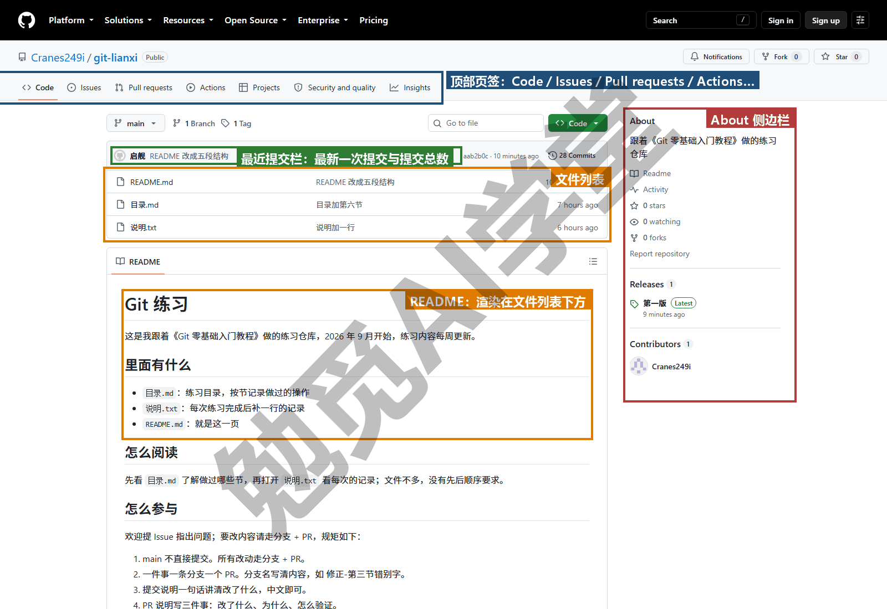

**文件列表与最近提交栏。** 中间是仓库根目录的文件和文件夹，和你本机文件夹里的一样（`.gitignore` 忽略的东西不在这里）。列表上方一栏显示最近一次提交的说明、提交人和时间，右侧有一个提交总数（上图里是 28 Commits），点它进入 Commits（提交历史）页，就是《第一个仓库：提交与历史》2.6 节 `git log` 的网页版，每一条可以点开看改动，也就是 `git show` 的网页版。

**README。** 文件列表下方会直接渲染（按 Markdown 格式显示出来）仓库根目录的 `README.md`，8.3 节专门讲。

**About 侧边栏。** 右侧的 About（关于）区显示仓库描述、网址、主题标签，以及 Releases（发布）、Packages 等入口。点它旁边的齿轮可以编辑描述和标签，8.3 节讲。

**看一个文件的历史，以及每一行是谁改的。** 点进任意文件，内容区上方有 Code（代码）与 Blame（逐行追溯）两个页签（Markdown 文件还多一个 Preview 预览页签），右侧是 Raw（原始内容）按钮；再往上一行的最近提交栏右端是 History（历史）按钮。History 列出只涉及这个文件的提交，对应 `git log -- 文件名`；Blame 把文件每一行旁边标上“这一行是谁在哪次提交里写的”，你想知道某句话是什么时候改成现在这样的，看它最快。这是命令行里不太方便、网页上却很方便的功能。

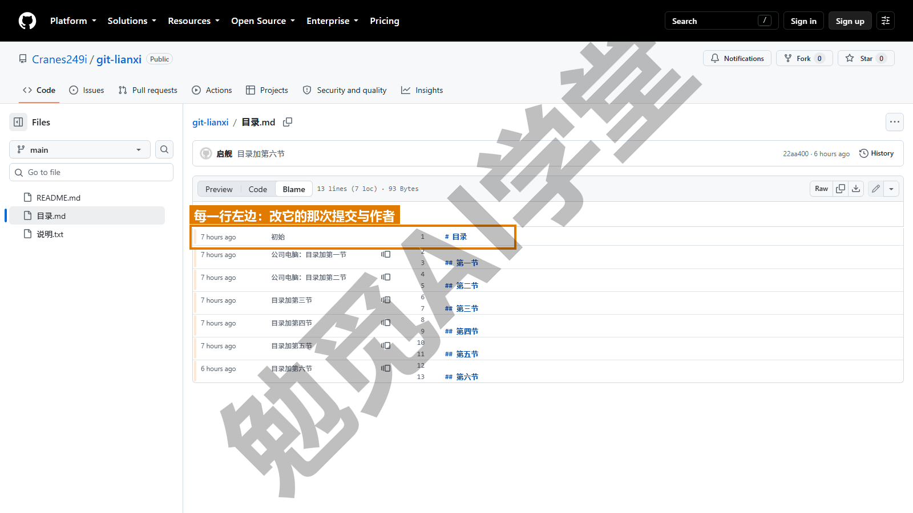

**看某一次提交。** 在 Commits 页点任意一条，进入这次提交的页面：上方是说明和涉及的文件数，下方逐文件显示红绿差异，右上角可以复制完整哈希（需实机验证）。它和 PR 的 Files changed 看起来一样，都是 diff 的网页形态。

**切换分支和标签。** 文件列表左上方有一个分支下拉菜单（默认显示 main，本节第一张图的左上角就有它），可以切到其他分支或某个标签查看那一版的文件，等于网页版的 `git switch`。旁边的数字显示分支数和标签数，点进去分别是 Branches 页和 Tags 页。

**绿色的 Code 按钮。** 文件列表右上角的 Code（代码）按钮点开有 HTTPS 网址（供 `git clone` 用）、Open with GitHub Desktop（用 GitHub Desktop 打开）、Download ZIP（下载压缩包）几个选项（需实机验证）。《GitHub 与远程仓库》6.5 节讲过，要接着工作用 clone，ZIP 只是没有历史的文件快照。

### 8.2 在网页上直接编辑与上传

有些改动你不值得为它回本机走一遍：改一个错字、补一句说明、往仓库里放一张图。这些在 GitHub 网页上就能直接做，做完就是一次提交。

**编辑一个文件。** 点进文件，点右上角的铅笔图标（Edit this file，编辑此文件；上一节 Blame 那张图的右上角就有它），页面变成一个在线编辑器。改完点右上角 Commit changes...（提交更改），弹出的对话框里填提交说明（默认已填好“Update 文件名”，建议改成《第一个仓库：提交与历史》2.5 节讲的那种一句话说明），选择直接提交到当前分支还是新建分支并开 PR（下图）。个人仓库直接提交到 main 即可；团队仓库不要直接提交到 main，选新建分支并开 PR，原因《多人协作：PR 与 Issue》7.8 节讲过。

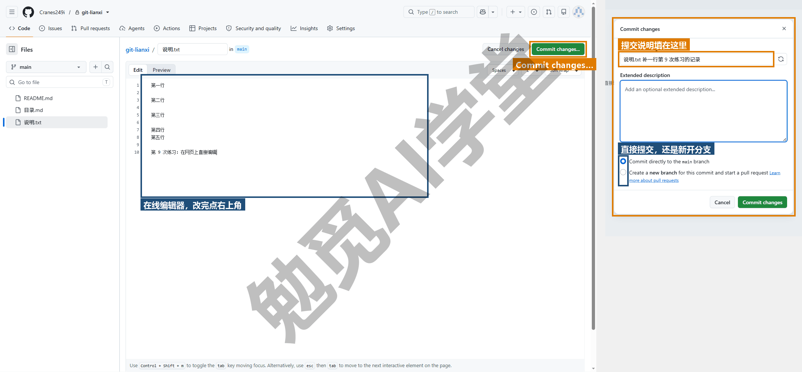

**新建文件。** 点文件列表右上方的 Add file（添加文件）→ Create new file（新建文件），输入文件名（可以带路径，如 `文档/说明.md`，输入斜杠会自动创建文件夹）、写内容、提交（需实机验证）。

**上传文件。** 点 Add file → Upload files（上传文件），把本机文件拖进页面，写说明，提交（需实机验证）。你要往仓库里放几张图，用它最方便；文件多或者文件大，还是回本机 add 再 push 更稳，8.6 节讲大文件的边界。

**用网页版编辑器改多个文件。** 在仓库任意页面按键盘上的句点键 `.`，会打开 github.dev，一个运行在浏览器里的 VS Code，可以同时改多个文件、有语法高亮（不同内容用不同颜色显示），改完在左侧源代码管理面板里写说明提交（需实机验证）。本课不展开，知道有这个入口即可；它的界面和《图形界面与 AI 工具里的 Git》9.8 节要讲的编辑器源代码管理面板一致。

**网页提交也是普通提交。** 你在网页上做的每一次编辑、新建、上传，都会成为仓库历史里的一次提交，作者是你的 GitHub 账号，说明就是你在对话框里填的那句。回到本机 pull 之后，`git log --oneline` 里就能看到它们，和命令行做的提交没有任何区别；同样也能用《撤销、还原与找回》的办法 revert。所以网页编辑不是“临时改一下”，它和其他提交一样正式，说明照样要写清楚。

**什么时候在网页上改、什么时候在本机改。** 你改的只是一句话、一个文件、不需要预览效果，在网页上改最快；牵涉多个文件、需要在本机预览网页或运行、有 AI 工具参与的改动，回本机做。两种方式产生的都是普通提交，历史里没有区别。

**在网页上改完，回本机记得先 pull。** 这是最常见的坑，你多半会撞上一次：在网页上改了 README，回到本机接着改别的、提交、push，结果被拒绝了，提示 rejected 与 fetch first。原因正是《GitHub 与远程仓库》6.4 节讲的：远程上多了你在网页上做的那次提交，本机不知道。处理办法一样：`git pull` 再 `git push`。养成“网页上动过就先回本机 pull 一次”的习惯。

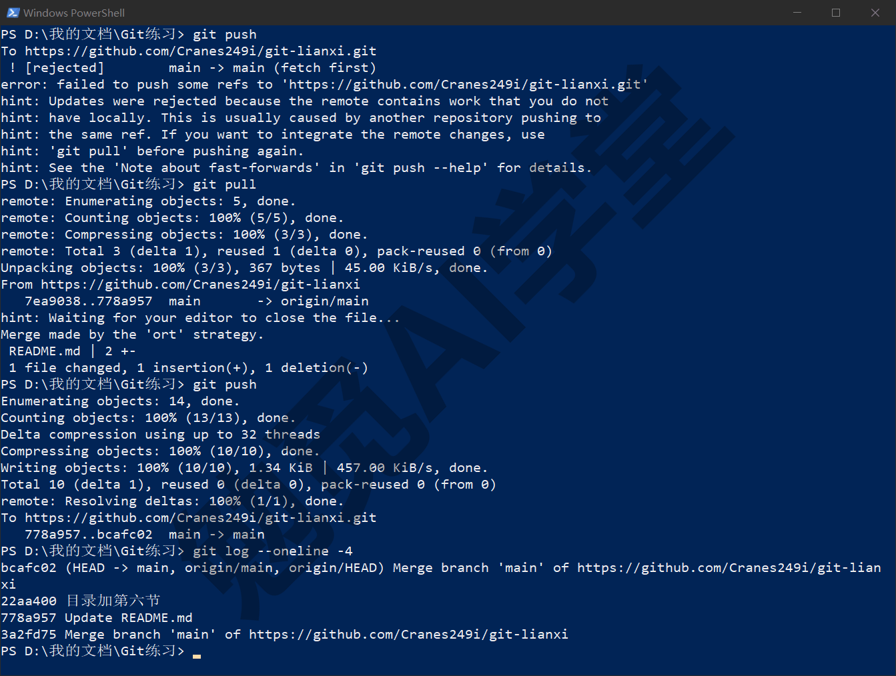

### 8.3 README 与仓库门面

`README.md` 是仓库的说明书，GitHub 把它渲染在文件列表下方，是别人（和几个月后的你）打开仓库看到的第一样东西。

**写什么。** 你的仓库如果是个人的文稿、作品、笔记类，README 写五段就够：这个仓库是什么（一句话）；里面有什么（文件夹结构，各放什么）；怎么使用或阅读（从哪个文件开始、有没有顺序）；怎么参与（如果接受协作，把《多人协作：PR 与 Issue》7.8 节那页规矩放在这里，或者放一个链接指向它）；许可与联系方式。工具类项目再加“怎么安装、怎么运行”。按“读的人完全不了解这个项目”来写，README 就够用了。

**用什么语法。** README 是 Markdown 文件，标题、列表、链接、图片、表格、代码块这些写法本课不重复讲，《Markdown 通用语法手册》六篇已经讲全，照它写即可。GitHub 支持手册里讲的通用语法与常见扩展语法（表格、任务列表、删除线等），渲染细节以页面为准。

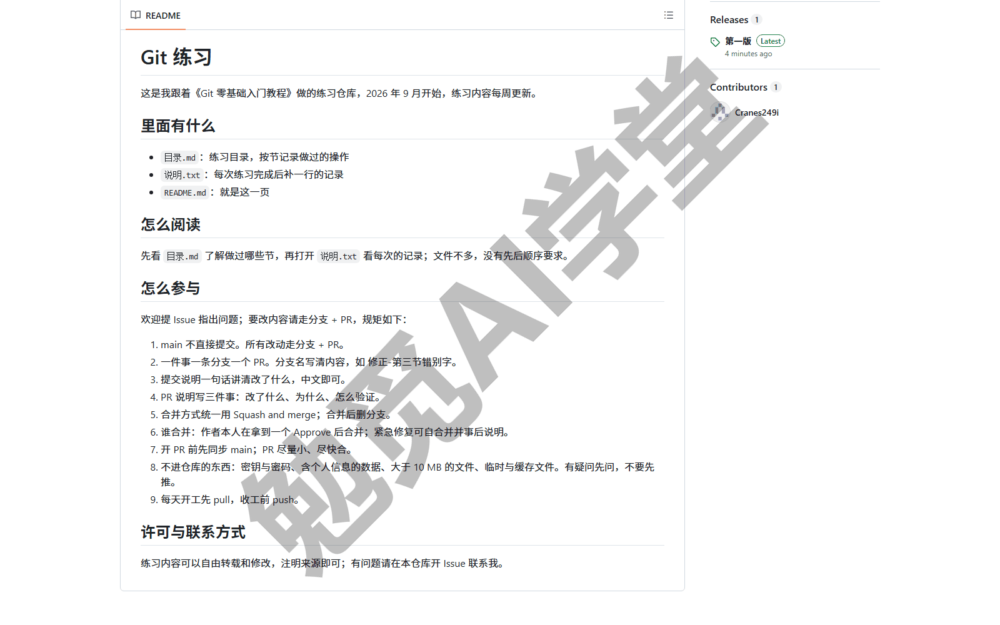

**放图。** README 里的图片可以引用仓库内的文件（相对路径写法与《Markdown 通用语法手册》一致，把图片文件放在仓库内的文件夹里并一起提交），也可以直接把图片拖进网页编辑器，GitHub 会上传并生成一个链接（需实机验证）。仓库内相对路径的做法更稳，仓库搬到哪里图都在。

**About 描述与主题标签。** 侧边栏 About 旁的齿轮点开，可以填 Description（描述，一句话，会出现在搜索结果和你的主页上）、Website（网址，8.4 节上线后把 Pages 地址填这里）、Topics（主题标签，如 markdown、tutorial，帮别人按主题找到你），对话框的样子见下图；开了 Pages 之后，Website 下面还会多一个 Use your GitHub Pages website 勾选项，勾上就自动填（需实机验证）。这些是仓库的“名片”，公开仓库建议都填。

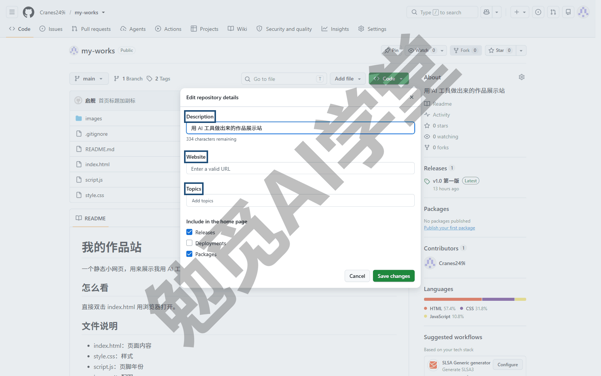

**LICENSE 是什么。** 许可证文件声明别人可以怎么使用你公开的内容。你的仓库如果只是自己用、或只分享给认识的人，不放许可证也完全能用；打算让陌生人自由使用、修改、传播时，就选一个合适的许可证放在根目录，在 Add file → Create new file 里把文件名填成 LICENSE，页面上会出现 Choose a license template（选择许可证模板）按钮，按提示选即可（需实机验证）。文稿类内容常用 CC 系列，代码类常用 MIT、Apache 一类，具体选哪个本课不展开，只需知道“公开分享时加一个”。

**一个好门面的样子。** 描述一句话说清；README 开头两行让人知道这是什么、给谁看；有一张首页截图或效果图；有明确的“从哪开始”。做到这四点，陌生人打开仓库首页就能看懂这是什么、从哪里开始。

### 8.4 GitHub Pages 上线

**GitHub Pages** 是 GitHub 提供的免费网页发布服务：把仓库里的 HTML、CSS、图片直接以一个网址对外提供，不需要你自己准备服务器。AI 生成的个人主页、作品集、课程电子书、活动页面，只要是不需要后台程序的纯前端页面（也叫静态网页），都可以用它上线。Codex 课走的是 Sites 与 Netlify，Cursor 课与 Obsidian 课的上线环节走的就是这里。

**两个前提。** 开始之前你先确认两件事：仓库是公开的（私有仓库用 Pages 需要付费方案，以 GitHub 当前说明为准）；仓库根目录（或 docs 文件夹）里有一个入口文件，`index.html`、`index.md` 或 `README.md` 三选一，GitHub 按这个顺序找（需实机验证）。用 AI 生成的网页项目通常根目录就有 `index.html`。

**第 1 步：进入 Pages 设置。** 仓库 Settings → 左侧边栏的 Pages（页面），在 Code, planning, and automation 这一组里。

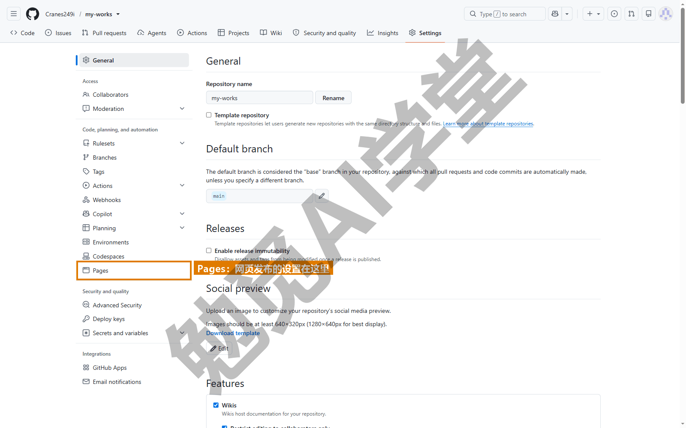

**第 2 步：选择发布源。** 在 Build and deployment（构建与部署）区，Source（来源）下拉菜单选 Deploy from a branch（从分支部署）。另一个选项 GitHub Actions 是给需要自己写构建流程的人用的，本课不用。

**第 3 步：选分支和文件夹。** 下方出现分支下拉菜单，选 main；文件夹下拉菜单选 `/ (root)`（根目录）；如果你的网页文件放在 docs 文件夹里，选 `/docs`，下拉菜单里只有这两个选项（需实机验证）。

**第 4 步：保存。** 点 Save（保存）。页面顶部会出现一条绿色提示 GitHub Pages source saved.（Pages 来源已保存），接着 GitHub 就在后台开始构建。

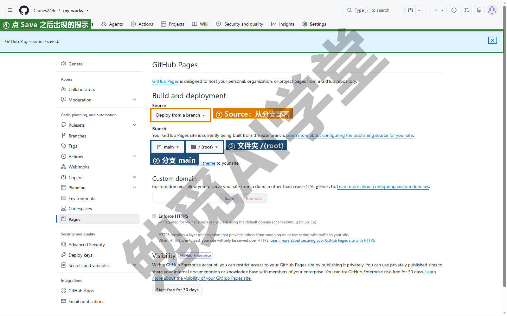

**第 5 步：等构建完成，拿到网址。** 切到仓库的 Actions 页签，会看到一条名为 pages build and deployment（页面构建与部署，也就是把仓库里的文件生成网站并发布）的流程在运行，绿色勾表示完成。回到 Settings → Pages，顶部出现 Your site is live at（你的站点已上线于）加一个网址（旁边的 Visit site 按钮也能打开它），网址的格式是：

```text
https://你的用户名.github.io/仓库名/
```

点开就是你的网页。首次生效通常需要几分钟，具体时长以实际情况为准；刷不出来先等一等。

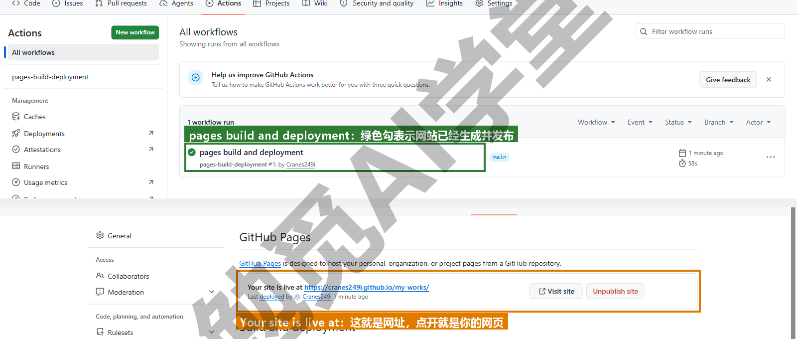

**之后怎么更新。** 你什么都不用再设。以后在本机改网页、提交、`git push` 到 main，GitHub 会自动重新构建，通常一两分钟后网址上就是新版。这就是“改一处、推上去、自动更新”的发布流程，比手动上传文件到服务器少很多步。

**`.nojekyll` 什么时候要。** 如果你的网页就是现成的 HTML、CSS、JS，不需要任何处理，建议在仓库根目录放一个名为 `.nojekyll` 的空文件。原因是 Pages 默认会用一个叫 Jekyll 的工具处理仓库内容（它主要面向用 Markdown 写博客的人），副作用是以下划线开头的文件夹（如 `_assets`）会被忽略、某些文件不会原样输出；放了这个文件，Pages 就会原样发布所有文件。本机创建它的命令：

```text
New-Item .nojekyll -ItemType File
git add .nojekyll
git commit -m "关闭 Jekyll 构建"
git push
```

提交输出里会显示 `create mode 100644 .nojekyll` 与 0 insertions（空文件）。AI 生成的网页项目建议一开始就加上它。

**用户主页仓库。** 如果你把仓库命名为 `你的用户名.github.io`，它的 Pages 网址就是根地址 `https://你的用户名.github.io/`，没有后面的仓库名，想做个人主页就用这一种。一个账号只能有一个这样的仓库；其他仓库仍然是“用户名.github.io/仓库名”的形式（需实机验证）。

**自定义域名。** 如果你有自己买的域名，Pages 设置页下方的 Custom domain（自定义域名）一栏可以把它指向这个站点，需要在域名服务商那里加一条指向 GitHub 的解析记录（域名的指向设置），GitHub 会自动配置 HTTPS（需实机验证）。本课不展开，有需要时按 GitHub 文档操作。

**不生效怎么排查。** 网址打不开时，你按下面的顺序查三条：

- 分支和文件夹选对了吗：入口文件是否真的在你选的分支和文件夹的根部。
- 入口文件名对不对：必须是 `index.html`、`index.md` 或 `README.md`，大小写是否区分以实际表现为准。
- 等够了吗：看 Actions 里那条流程是否还在跑、有没有红叉，红叉点进去看日志。

三条都没问题还打不开，再看仓库是不是私有的。

### 8.5 Releases：发布一个正式版本

《分支与合并》4.6 节打的标签（给某次提交起的固定名字）在网页上可以进一步做成 **Release**（发布）：一个带标题、说明、可附打包文件的正式版本页面。对写代码的人它是软件发布的标准做法；对不写代码的人，它是“交稿版本”“作品版本”的正式存档，每一版有名字、有说明、有可下载的打包文件，不用再在文件夹里堆“最终版_v3”。

**前提：标签要在 GitHub 上。** 本机打的标签按《GitHub 与远程仓库》6.3 节推上去：

```text
git tag -a v1.0 -m "第一版上线"
git push --tags
```

也可以不提前打，在网页创建 Release 时一并新建一个标签。

**第 1 步：进入 Releases。** 点仓库首页右侧 About 区下方的 Releases（发布），再点 Create a new release（创建新发布）或 Draft a new release（起草新发布）（需实机验证）。

**第 2 步：选标签。** Choose a tag（选择标签）下拉菜单里选已推上来的 v1.0，选好后按钮上会显示 Tag: 加标签名、下面写 Existing tag（已有标签）；或者输入一个新名字，下拉菜单会提示 Create new tag: v1.0 on publish（发布时创建新标签），并让你选它指向哪条分支（新建标签这一种做法需实机验证）。

**第 3 步：写标题和说明。** Release title（标题）写版本名或一句话；下方描述区写这一版有什么、比上一版改了什么。说明框上方有 Generate release notes（自动生成发布说明）按钮，会根据合并过的 PR 自动列出改动，个人项目可以用它起草再改。

**第 4 步：附文件（可选）。** 把打包好的 zip、PDF 拖进说明框下方的 Attach binaries（附加文件）区。GitHub 会自动附上这一版源文件的 zip 与 tar.gz 下载，不需要你手动打包整个仓库。

**第 5 步：发布。** 点页面底部的 Publish release（发布）；想先存草稿，点旁边的 Save draft（这两个按钮名需实机验证）。想标明是测试版，在 Release label（发布标记）里选 Pre-release（预发布）；默认选中的 Latest 会把它标成最新版。

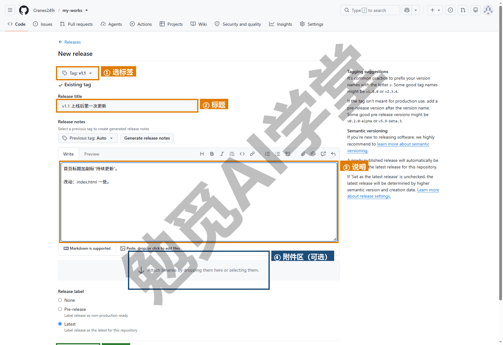

**发布后是什么样子。** 仓库首页 About 区的 Releases 显示最新版本号，点进去是所有 Release 的列表，每一条有标题、说明、发布时间、附件和源码下载。把 Release 页面的网址发给别人，对方不需要懂 Git 就能下载这一版。

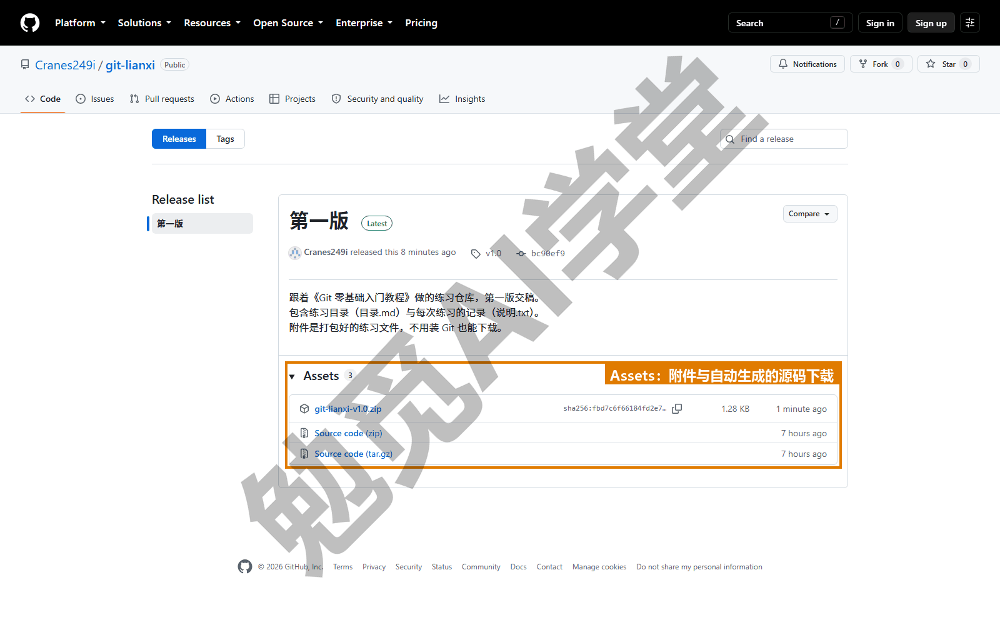

**标签与 Release 的关系。** 标签是 Git 里“固定在某次提交上的名字”，本机和远程都有；Release 是 GitHub 网页上基于某个标签做的“发布页”，只存在于 GitHub 上。删 Release 不会删标签，删标签会让对应的 Release 变成草稿。一个标签最多对应一个 Release。

**不写代码的人怎么用它。** 你如果不写代码，可以这样用它：课程文稿每完成一轮修订、作品每交付一版、模板每更新一次，打一个标签发一个 Release，说明里写清这一版的变化，附上导出的 PDF 或压缩包。以后任何人（包括你自己）要“第二版那份”，到 Releases 页点下载即可，不必翻历史。

### 8.6 大文件与二进制：边界在哪

《认识 Git 与装好》1.4 节说过 Git 对大体积二进制文件“能存但不该存”，这一节把边界讲具体。

**GitHub 的限制。** GitHub 对单个文件的大小有两道线：超过第一道会在推送时警告，超过第二道会直接拒绝推送；对整个仓库的体积有建议上限，超过后会收到提醒甚至限制。具体数值以 GitHub 当前的帮助文档为准，本课不列具体数字；大致可以这样记：几十 MB 的单文件就该警惕，几百 MB 就不该进仓库。

**为什么删掉也不会变小。** 删掉文件为什么救不回体积，拿一个只有几个网页文件的仓库做对比就能看出来：`.git` 文件夹约 30 KB；往里提交一个 30 MB 的视频后，`.git` 变成约 30 MB；接着用 `git rm 宣传片.mp4` 删掉它并提交，`.git` 仍然约 30 MB，一字节没少。用 `git count-objects -vH` 看，size 显示约 30 MiB（MiB 和 MB 大致相当）。原因是《第一个仓库：提交与历史》讲过的：Git 保存历史上每个版本的内容，视频虽然从最新版里删了，但“误加视频”那次提交里还有它，任何人翻回那次提交都能拿到。所以推送时那 30 MB 照样要传，仓库体积照样算。

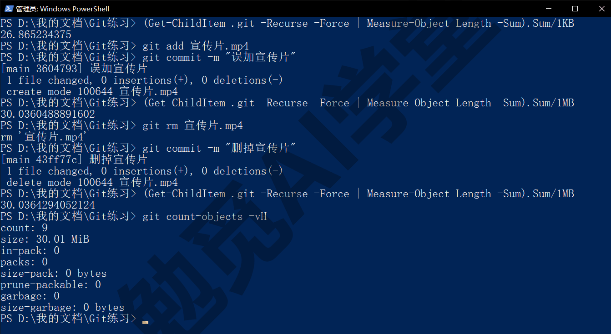

**哪些东西不要进仓库。** 视频、音频、安装包、压缩包、大体积设计源文件（Photoshop 的 PSD、Illustrator 的 AI、Sketch）、数据库文件、AI 模型文件、构建生成的文件，这些都不要进仓库。它们的共同点是体积大、每次修改整个文件都变、Git 看不出差异。处理的原则是：放网盘或其他文件存储服务，仓库里只留链接或下载说明；一开始就写进 `.gitignore`（`*.mp4`、`*.zip`、`*.psd` 一类）。图片是灰色地带：网页用的几百 KB 的图可以进仓库，几十 MB 的原图不要。

**误加了大文件怎么办。** 分两种情况。你还没推到 GitHub：按《撤销、还原与找回》3.4 节 `git reset` 退掉那次提交，把文件加进 `.gitignore` 再重新提交，历史里就干净了。已经推上去了：删文件再提交只能让最新版里没有它，历史里那份还在，仓库不会变小；要真正瘦身需要改写全部历史，工具叫 git filter-repo，本课不展开它的用法；它会让所有克隆过的人都必须重新克隆，所以个人仓库可以做，团队仓库要先通知。

**Git LFS 是什么。** Large File Storage（大文件存储）是 Git 的一个扩展：把大文件本体存到另外的地方，仓库里只留一个很小的记录文件（记着本体存在哪里），克隆或切换到某个版本时才去下载本体，推送时再把本体一起传上去。《认识 Git 与装好》安装向导组件页里勾着的 Git LFS 就是它。它解决“必须把大文件放进仓库一起管版本”的需求（比如游戏素材、设计团队的源文件），GitHub 对 LFS 的存储和流量有免费额度，超出要付费（以当前说明为准）。你现在先用“大文件放网盘、仓库放链接”的办法就够，真需要时再学 LFS，本课不展开。

**一个判断标准。** 把文件加进仓库之前问自己：这个文件我会改很多次吗？每次改动 Git 能看出差别吗？它有几 MB？三个问题里只要“会改很多次、看不出差别、很大”三条同时成立，就不要进仓库。

### 8.7 仓库管理：改名、转移、归档、删除

改名、转移、归档、删除这几个动作都在仓库 Settings → General（常规）页，你是仓库主人或管理员才能操作。

**改名。** 点 General 页顶部 Repository name（仓库名）旁的 Rename（重命名）。改名后仓库网址随之改变；旧网址会自动跳转到新网址，只要你以后不用旧名字再建一个仓库，跳转就一直有效（以 GitHub 说明为准）；已有的克隆仍能正常推送和拉取，但建议在本机更新一下远程地址：

```text
git remote set-url origin https://github.com/你的用户名/新仓库名.git
```

Pages 网址也会跟着变（用户名.github.io/新仓库名），而且旧的 Pages 网址不会跳转，已经发给别人的链接要重新发；不想让网址受改名影响，可以按 8.4 节绑一个自定义域名。

**默认分支。** General 页的 Default branch（默认分支）区可以把默认分支从 master 改成 main 或反过来（点分支名旁边的铅笔）。它决定别人打开仓库首先看到哪条分支、PR 默认合到哪。本机按《分支与合并》4.1 节改名后，远程这里也要对应改。

**Pull Requests 选项。** General 页往下有 Pull Requests 区，勾选允许哪几种合并方式、合并后是否自动删分支（Automatically delete head branches，建议勾上）。《多人协作：PR 与 Issue》7.4 节推荐只保留 Squash。

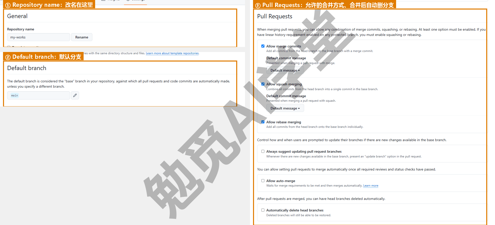

**Danger Zone（危险区）。** General 页最底部是一组红色按钮，新手要认识的是下面四个（图里还有一个 Disable branch protection rules，是关掉分支保护规则用的，本课用不到）：

- **Change repository visibility**（更改可见性）：公开与私有之间切换，改公开之前先按《GitHub 与远程仓库》6.6 节讲的隐私三问过一遍，看历史里有没有密钥、有没有别人的信息、有没有不该公开的文件。
- **Transfer ownership**（转移所有权）：把仓库整个交给另一个用户或组织，网址随之变化，历史、Issue、PR 全部保留。这适合项目交接的场合。
- **Archive this repository**（归档）：把仓库设为只读，任何人（包括你）都不能再提交、开 Issue 或 PR，页面顶部显示归档标记；随时可以取消归档。项目结束但想保留给人看，用它而不是删除。
- **Delete this repository**（删除）：GitHub 会先弹出几层确认（下图是第一层），最后要求你输入仓库全名（最后一步需实机验证）。删除后网址失效、Pages 下线，你本机的克隆完好；公开仓库被删后 Fork 出去的副本不受影响，私有仓库的 Fork 会一起被删。GitHub 的说明里提到部分仓库删除后一段时间内还能从账号设置里恢复，但不要把它当作保障，删之前确认本机有完整克隆。

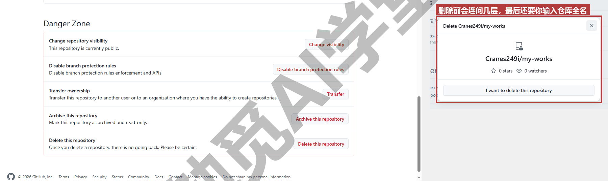

**归档还是删除。** 你只需要问自己一句：以后还想让人看到它吗？想，归档；确定不想让任何人（包括自己在网页上）再看到，删除。多数“做完了的项目”应该归档。

**Settings 里新手该看的三项。** 默认分支是不是 main；允许的合并方式是不是只有你想要的那种；Pages 有没有按 8.4 节配好。其他项保持默认即可。

### 8.8 通知与安全提示

仓库页面右上角有三个按钮，顶部还有一个页签，新手常不知道它们是什么。

**Watch、Star、Fork。** Watch（关注）决定这个仓库的动态要不要通知你：Participating and @mentions（只在有人提到你或你参与的讨论时）、All Activity（全部活动）、Ignore（忽略），或 Custom（自定义）里只勾 Releases（下图）。对自己的仓库默认已关注；对别人的仓库想在发新版时收到通知，选自定义只看 Releases 最不打扰。Star（星标）是收藏加点赞，星数是仓库受欢迎程度的粗略指标，你的星标列表在头像菜单的 Your stars 里，可以当书签用。Fork 是《多人协作：PR 与 Issue》7.6 节讲过的复刻，按钮旁的数字是被复刻的次数。

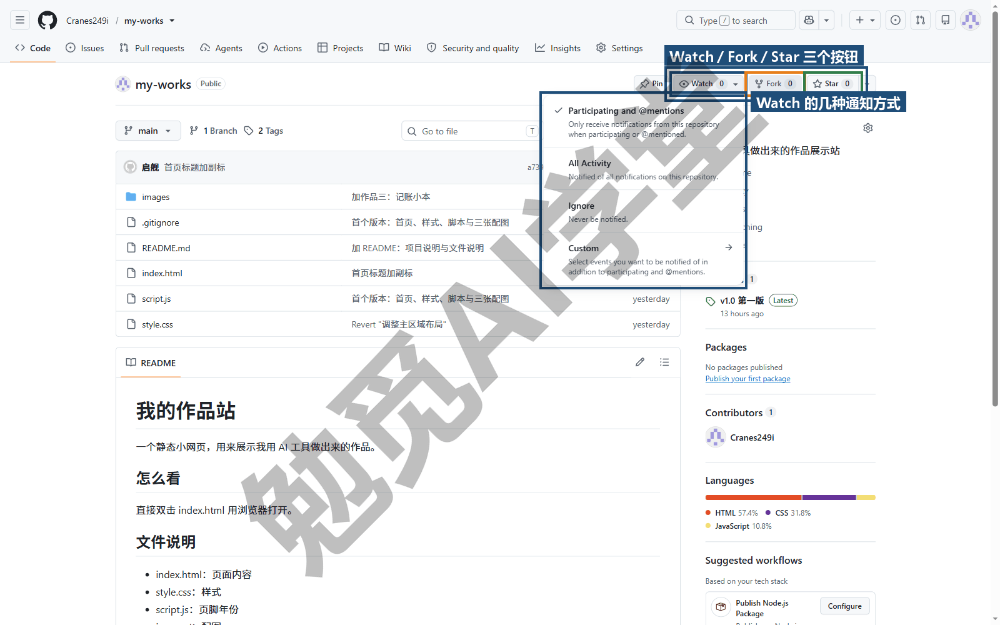

**Security and quality 页签。** 仓库的 Security and quality（安全与质量）页汇总几类自动检查，Overview（概览）里一行一类，本课认识其中三类：

- **Dependabot alerts**（依赖项警报）：如果你的仓库是用了第三方软件包的代码项目（比如 AI 生成的网页项目里有 `package.json`），GitHub 会检查这些包有没有已知的安全漏洞，有就发一条警报，通常附带一个升级版本的建议 PR。纯文稿仓库不会收到这类警报。
- **Secret scanning alerts**（密钥扫描警报）：GitHub 扫描公开仓库里符合常见密钥格式的内容（各类 API key、令牌），发现就提醒，某些类型会自动通知服务商作废。《GitHub 与远程仓库》6.6 节讲过处理顺序：先作废密钥，再清文件。
- **Code scanning**（代码扫描）：自动检查代码里有没有常见的安全问题，需要主动开启，本课不展开。

**收到提示怎么办。** 你收到提示时分三步：先看清是哪一类；Dependabot 的警报点进去看严重程度，严重程度低的可以先放着、攒几条一起处理，高的就接受它的升级 PR；密钥警报立即按《GitHub 与远程仓库》6.6 节处理。不要因为看到红色标记就慌，它们是 GitHub 在替你做检查，出现提示说明检查在起作用。

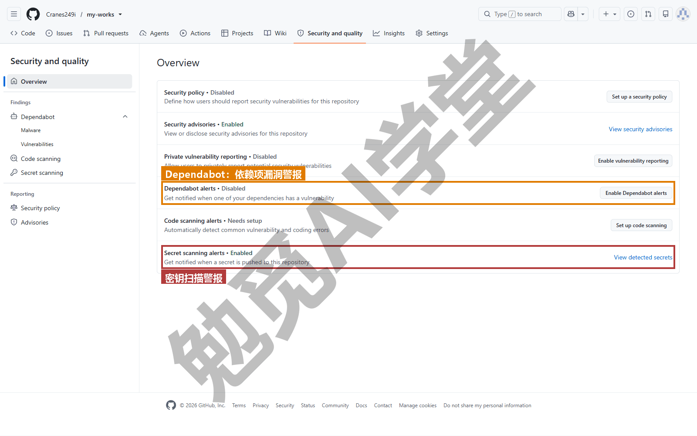

**通知在哪看。** 页面右上角的铃铛是通知中心，Issue、PR、审查请求、被提到都汇总在这里；邮件通知在头像菜单 Settings → Notifications 里调整发不发、多久发一次（需实机验证）。协作变多之后，把不重要的仓库改成只看 Releases，能少很多干扰。

**在 AI 工具和图形界面里，这一步是什么样子。** Cursor 课《实战一：小店官网》16.6 节和《毕业项目：个人数字工作台 + 课程总结》20.5 节的“推 GitHub、Pages 上线、改一处再发布”，做的就是本篇 8.4 节的五步加一次 push；Obsidian 课《毕业：数字花园上线》用 Quartz 把笔记发布成网站，最后一步同样是 Pages。Codex 课的部署走 Sites 与 Netlify，是另一条上线路线，各有适用场景，本课不重复。GitHub Desktop 里没有 Pages 和 Releases 的操作，这两件事只在网页上做；Desktop 的 Repository 菜单里 View on GitHub（在 GitHub 上查看）会直接打开本篇 8.1 节的仓库页面，见《图形界面与 AI 工具里的 Git》9.5 节。

### 8.97 练习任务

方括号里的内容换成你自己的。

**任务一：在网页上改一处，回本机同步。** 在 `[你的仓库]` 的网页上用铅笔编辑 README，加一句话并提交到 main；回本机先不 pull 直接改别的文件提交并 push，看到 push 被拒绝；然后按提示处理（pull 会生成一次合并提交并打开编辑器让你确认合并说明，保存关闭即可，《GitHub 与远程仓库》6.4 节讲过）：

```text
git push
git pull
git push
```

完成标准：第一次 push 出现 rejected；pull 后 `git log --oneline -3` 里能看到网页上那次提交（说明通常以 Update 开头）；第二次 push 成功。

**任务二：把作品站用 Pages 上线并更新一次。** 准备一个含 `index.html` 的公开仓库（可以用 AI 生成的任何网页，或手写一个只有标题的页面），加 `.nojekyll`，按 8.4 节五步开启 Pages，拿到网址后在本机改一处文字：

```text
New-Item .nojekyll -ItemType File
git add .
git commit -m "开启 Pages 并关闭 Jekyll"
git push
```

完成标准：`https://[用户名].github.io/[仓库名]/` 能打开；改一处文字推送后几分钟内网页更新；Actions 里有两条 pages build and deployment 记录都是绿色。

**任务三：打标签并发一个 Release。** 给当前 main 打附注标签 v1.0 并推送，在网页上基于它创建一个 Release，标题“第一版”，说明写三行，附一个导出的 PDF 或 zip：

```text
git tag -a v1.0 -m "第一版"
git push --tags
```

完成标准：Releases 页有一条 v1.0，能下载附件与源码 zip；仓库首页 About 区显示该版本号。

### 8.98 本篇小结与自检

这一篇把 GitHub 网页当主角讲了一遍：仓库首页的页签、文件列表、最近提交栏、README、About 侧边栏，以及文件的 History 与 Blame；网页上直接编辑、新建、上传文件，github.dev 只交代了入口，在网页上改完回本机要先 pull；README 五段结构、About 描述与主题标签、LICENSE 什么时候加；GitHub Pages 五步上线、之后 push 即更新、`.nojekyll` 的作用、用户主页仓库与自定义域名只交代了是什么、不生效三条排查；Releases 基于标签发布带说明和附件的正式版；大文件的两道线、删了也不会变小的实例、不该进仓库的东西、LFS 是什么；仓库改名、默认分支、合并方式、Danger Zone 四个按钮与归档优于删除；Watch、Star、Fork 与 Security and quality 页签里的两类警报。

可以对照下面的清单检查学习结果：

- [ ] 能指着仓库首页说出每个区域是什么，知道 History 与 Blame 各看什么
- [ ] 会在网页上编辑、新建、上传文件，知道在网页上改完回本机要先 pull
- [ ] README 会按五段写，About 的描述与标签会填，知道 LICENSE 什么时候要
- [ ] 能不看书走完 Pages 五步，知道网址格式、`.nojekyll` 的作用与不生效的三条排查
- [ ] 会推标签并基于它创建 Release，知道标签与 Release 的关系
- [ ] 知道大文件为什么删了也不会让仓库变小，哪些东西不该进仓库，LFS 是什么
- [ ] 知道改名后要更新本机远程地址，Danger Zone 四个按钮各做什么，归档与删除怎么选
- [ ] 知道 Watch 三档、Star 是什么，Security and quality 页两类警报怎么处理

完成这些内容后，GitHub 网页上和你有关的每个按钮你都认识了，网页作品也有了自己的网址。下一篇《图形界面与 AI 工具里的 Git》把前八篇的每条命令和图形界面里的按钮一一对上：GitHub Desktop 全导览、编辑器里的源代码管理面板、Codex 与 Cursor 里的 Git 各在哪一层，以及让 AI 跑 Git 时的安全做法。

### 8.99 新手常见问题

**Q1：Pages 设置好了，多久能打开？**

首次通常几分钟，以 Actions 里 pages build and deployment 那条流程变绿为准；之后每次 push 更新通常也只要一两分钟。超过十分钟还打不开，按 8.4 节三条排查：分支与文件夹、入口文件名、Actions 里有没有红叉；再确认仓库是公开的。

**Q2：私有仓库能用 Pages 吗？**

需要付费方案，免费个人账号的 Pages 只对公开仓库开放，以 GitHub 当前说明为准。不想公开源文件又想有网址的话，可以把网页文件单独放到一个公开仓库里发布，源文件留在私有仓库。

**Q3：Pages 的网址能改吗？**

网址由用户名和仓库名决定。改仓库名，Pages 网址就跟着变，而且旧的 Pages 网址不会自动跳转（仓库本身的旧网址会跳转，网页的不会），发出去的链接要更新；想去掉后面的仓库名，把仓库改名为 `用户名.github.io`；想用自己的域名，在 Pages 设置的 Custom domain 里绑定，之后再改仓库名也不影响网址。用户名本身也能改，但会影响你全部仓库的网址，不建议。

**Q4：Release 和 tag 有什么区别？**

标签是 Git 里固定在某次提交上的名字，本机和远程都有，用命令打标签、推上去；Release 是 GitHub 网页上基于一个标签做的发布页，有标题、说明、附件和下载，只存在于 GitHub。先有标签才能有 Release（网页创建 Release 时也可以一并新建标签）。

**Q5：大文件传不上去怎么办？**

推送时如果 GitHub 因为单文件过大而拒绝，先按《撤销、还原与找回》3.4 节在本机退掉含大文件的提交、把文件移出仓库并加进 `.gitignore`、重新提交再推。文件本身放网盘，仓库里留链接。如果确实必须在仓库里管这类文件的版本，再去了解 Git LFS。
