## 图形界面与 AI 工具里的 Git

前八篇全部用命令行。这一篇把那些命令和图形界面里的按钮一一对上：先装好 GitHub Desktop，把它的每个面板走一遍，看清每个按钮背后是哪条命令；再看编辑器（VS Code、Cursor）里的源代码管理面板；最后讲 Codex、Cursor、Obsidian 这些 AI 与笔记工具里的 Git 各在哪一层，以及让 AI 替你跑 Git 时的三条安全做法和读懂它输出的命令的办法。本篇 GitHub Desktop 与编辑器界面的按钮名以英文写出并附中文释义，软件版本更新后位置可能调整，形态以你看到的界面为准。

这篇文章的实操内容不需要花钱：GitHub Desktop 与 VS Code 都是免费软件；9.9 节讲 Codex、Cursor、Obsidian 里的 Git 时只讲分工，不要求你订阅它们。

### 9.1 为什么这一篇放在命令行之后

如果你只想点按钮，为什么要先学八篇命令？因为按钮背后全是命令，而按钮不会告诉你它在做什么。会了命令再点按钮，你看到 Discard changes 就知道那是 `git restore`、不可恢复；看到 Fetch origin 就知道它不会动你的分支；看到 Squash and merge 就知道 main 上会只留一个提交。反过来，先学按钮的人往往在“点了之后发生了什么”上卡住，出了问题只能重装软件或重新克隆。

**什么时候点按钮更好。** 有三类操作你用图形界面会明显更方便：看历史，彩色的分支图、点一下就展开的改动，比 `git log --graph` 好读；逐行暂存，勾选文件里的某几行提交，比 `git add -p` 直观得多；解冲突，编辑器里的四个按钮比在记事本里删标记快。日常“改完提交”这一套，图形界面也很方便。

**什么时候命令更稳。** 批量操作、远程相关的排错、工作树、标签，以及任何你需要看清楚“到底发生了什么”的时刻，命令行的输出比图形界面弹出的提示框信息量大得多。另外，命令在 Windows、Mac、任何编辑器、任何 AI 工具里都一样，图形界面每换一个软件都得重新找按钮。

**本篇的用法。** 你不需要把 GitHub Desktop 当成必须掌握的工具。把它当成一张“命令的地图”：装好、跟着 9.2～9.6 节把按钮逐个点一遍，每点一个想一下它对应哪条命令，9.7 节的总对照表就是这张地图的文字版。之后用哪个更合适，你自己定；很多人最终的习惯是编辑器面板看历史与逐行暂存、终端做其他一切。

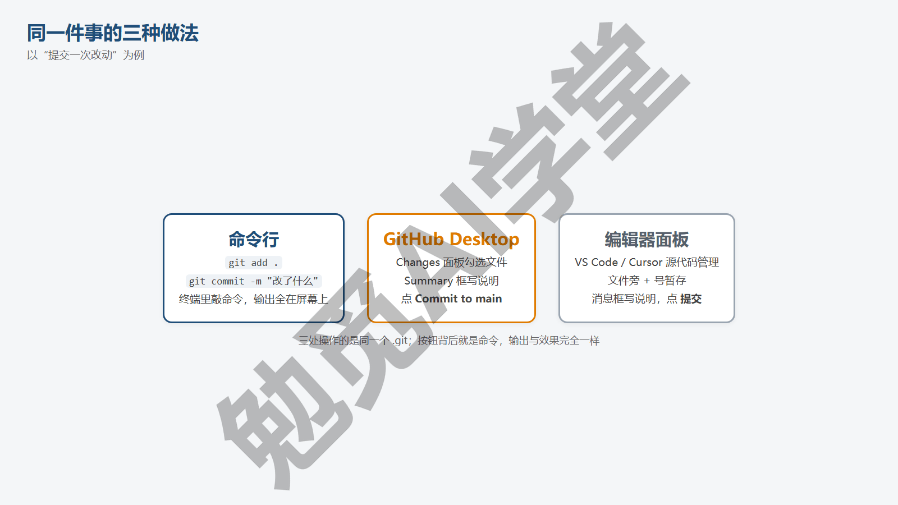

**一个例子。** 你让 AI 改了六个文件，其中四个满意、两个想丢掉。命令行做法是 `git status -s` 看清六个文件名，对两个不要的各敲一次 `git restore 文件名`，再 `git add .` 与 `git commit`。GitHub Desktop 做法是在 Changes 里右键那两个文件点 Discard changes，勾上其余四个，写摘要，点 Commit to main。两种做法结果完全一样，历史里都是一次只含四个文件的提交；区别只是一个靠敲字、一个靠点选。知道这层对应之后，你就能在任何工具里完成同一件事，而不是只会其中一种。

**三种界面的关系。** GitHub Desktop 是 GitHub 出的独立软件，只管 Git 和 GitHub 相关的操作，不编辑文件；编辑器（VS Code、Cursor）里的源代码管理面板是编辑器的一个侧边栏，改文件和提交在同一个窗口里完成；AI 工具（Codex、Cursor 的代理窗口）在这两层之上再加一层：它们会替你运行命令，并在自己的界面里显示改动。三层都操作同一个 `.git`，互不冲突，可以混用：用 Desktop 看历史、在编辑器里提交、让 AI 替你推送，仓库只有一份。

### 9.2 GitHub Desktop：装好与登录

GitHub Desktop 是 GitHub 官方的免费图形客户端，Windows 与 macOS 都有。它自带一份 Git 和凭据管理器，与你在《认识 Git 与装好》里装的 Git 不冲突，共用同一份 `.gitconfig` 配置。

**第 1 步：下载安装。** 打开 desktop.github.com 下载对应系统的安装包，Windows 上运行后会自动安装并启动，没有向导页（需实机验证）。

**第 2 步：登录 GitHub。** 首次启动的欢迎页有 Sign in to GitHub.com（登录 GitHub.com）按钮（下图）；点它会打开浏览器完成授权，回到软件后显示已登录的账号（授权流程需实机验证）。这次登录同时给了 Desktop 推送、拉取仓库时用的凭据，与《GitHub 与远程仓库》6.7 节命令行的凭据是两份，互不影响。

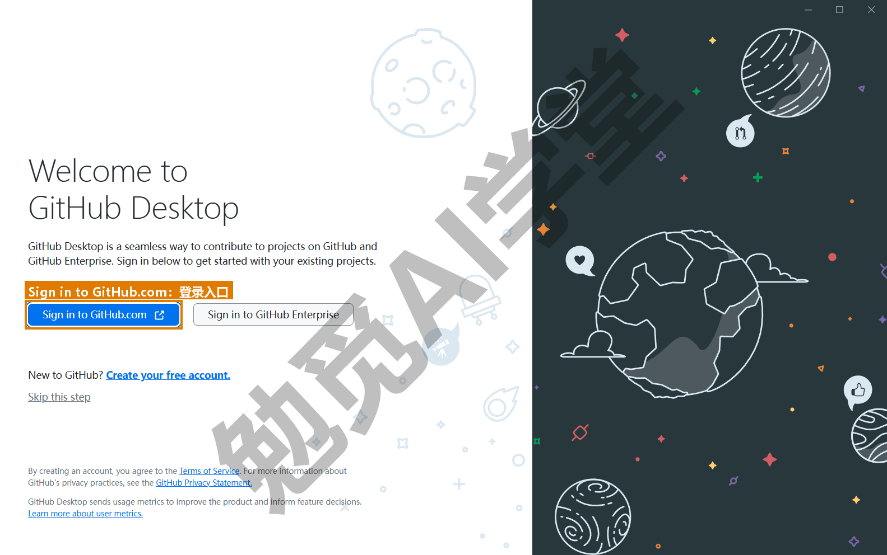

**第 3 步：确认署名。** 接下来的 Configure Git（配置 Git）页显示 Name 与 Email，默认从你的 GitHub 账号或本机 `.gitconfig` 读取；确认和《认识 Git 与装好》1.7 节设的一致，不一致就在这一页改成一致，然后点 Finish（完成）（需实机验证）。之后随时可以在 File → Options → Git（Windows）或 GitHub Desktop → Settings → Git（macOS）里改（需实机验证）。

**第 4 步：把练习仓库加进来。** 主界面左上角 Current repository（当前仓库）下拉菜单 → Add → Add existing repository...（添加现有仓库），选择你的练习文件夹。弹出的对话框叫 Add local repository（添加本地仓库），在 Local path（本地路径）一栏填上或用 Choose…（选择）选到练习文件夹，点 Add repository（添加仓库）。也可以从菜单 File → Add local repository... 进入。Desktop 会识别出它已经是一个 Git 仓库，把它加进左侧的仓库列表。同一处还有另外两个选项：Clone repository...（克隆仓库，等于 `git clone`，可以直接从你 GitHub 账号的列表里选）和 Create new repository...（新建仓库，等于 `git init`，可以一并生成 README、`.gitignore`、许可证）（需实机验证）。

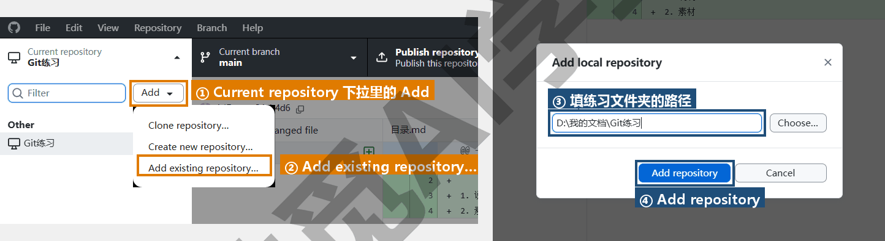

**认识主界面。** 加进来之后的窗口分三块：顶部一条工具栏，从左到右是 Current repository（当前仓库）、Current branch（当前分支）、以及一个随状态变化的大按钮（Fetch origin／Pull origin／Push origin／Publish repository）；左侧是 Changes（改动）与 History（历史）两个页签；右侧是主区域，显示选中文件的改动或选中提交的详情。这些按钮分别对应《第一个仓库：提交与历史》《分支与合并》《GitHub 与远程仓库》三篇的内容，接下来三节按这个顺序一组一组地走一遍。

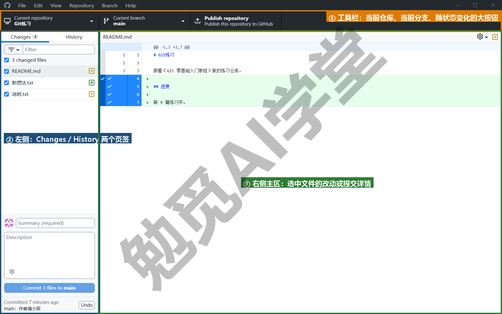

**如果不想装。** 你不想装也可以：本篇后面几节读一遍、对着 9.7 节的表理解每个按钮的含义即可，不装也不影响后面的实战篇。

### 9.3 Changes 与 History 面板：提交与历史的按钮版

**Changes 页签 = status + add + commit。** 左侧 Changes 列出工作区里所有有改动的文件（等于 `git status`），每个文件前有一个复选框，勾上就是 add 进暂存区，取消就是 restore --staged；默认全部勾上，所以直接提交等于 `git add .` 加 commit。点某个文件，右侧显示它的红绿差异（等于 `git diff`）。

**逐行暂存。** 在右侧差异视图里，改动过的每一行左侧行号旁都有一个勾，点它可以只选中或去掉这一行，按住拖过一段行号可以一次处理几行（以实际表现为准）；去掉几行之后，左侧文件前的复选框会变成半选状态，提交时只带上勾着的那些行。这就是《第一个仓库：提交与历史》2.4 节提到的 `git add -p` 的图形版，比终端里逐块回答方便得多，适合“一个文件里两件事分两次提交”的场景。

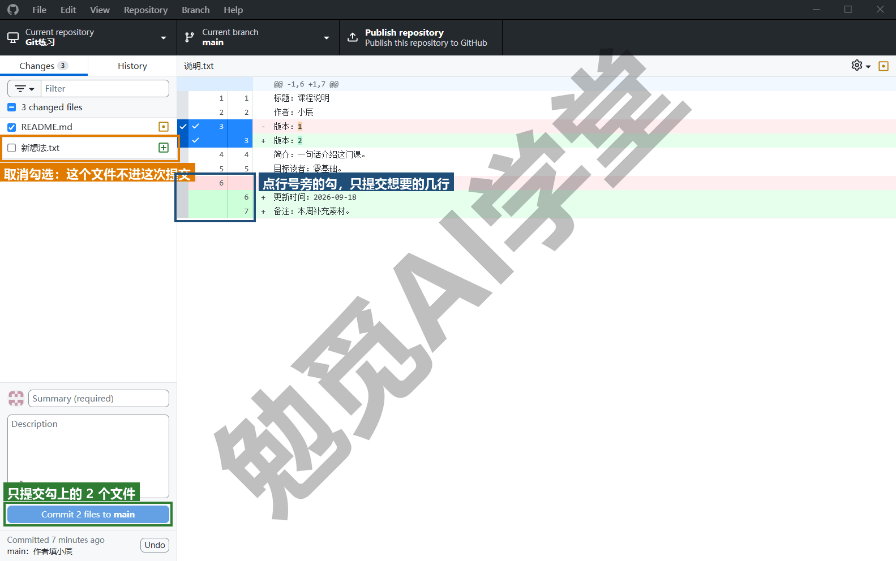

**提交。** 左下角有两个输入框：Summary (required)（摘要，必填）和 Description（描述，可选），下面是蓝色的 Commit to main（提交到 main）按钮，勾了几个文件就写成 Commit 3 files to main 这样。Summary 就是 `-m` 后面那句话，按《第一个仓库：提交与历史》2.5 节的标准写。点按钮，等于 `git commit -m`。新版 Desktop 在有 Copilot 权限时会显示一个生成提交说明的图标，能根据改动自动起草摘要（以实际版本与账号为准，需实机验证）。生成的说明照样读一遍再提交。

**丢弃改动。** 右键 Changes 里的文件 → Discard changes...（丢弃改动），等于 `git restore 文件`；选中多个一起右键，或用 Discard all changes（丢弃全部）等于 `git restore .`（需实机验证）。它和命令一样不可恢复，Desktop 会弹一个确认框；Windows 上，Desktop 会试着把丢弃的内容放进回收站（以实际表现为准），但不要指望靠回收站找回来。丢弃的如果是还没跟踪的新文件，就等于直接把文件删掉。

**History 页签 = log + show。** 切到 History，左侧是提交列表（每条一行：说明、作者头像、时间），等于 `git log`；点一条，右侧显示它改了哪些文件和逐文件的差异，等于 `git show`。列表顶部如果有和远程不同步的提交，会用向上／向下箭头标出，对应 status 里的 ahead／behind。

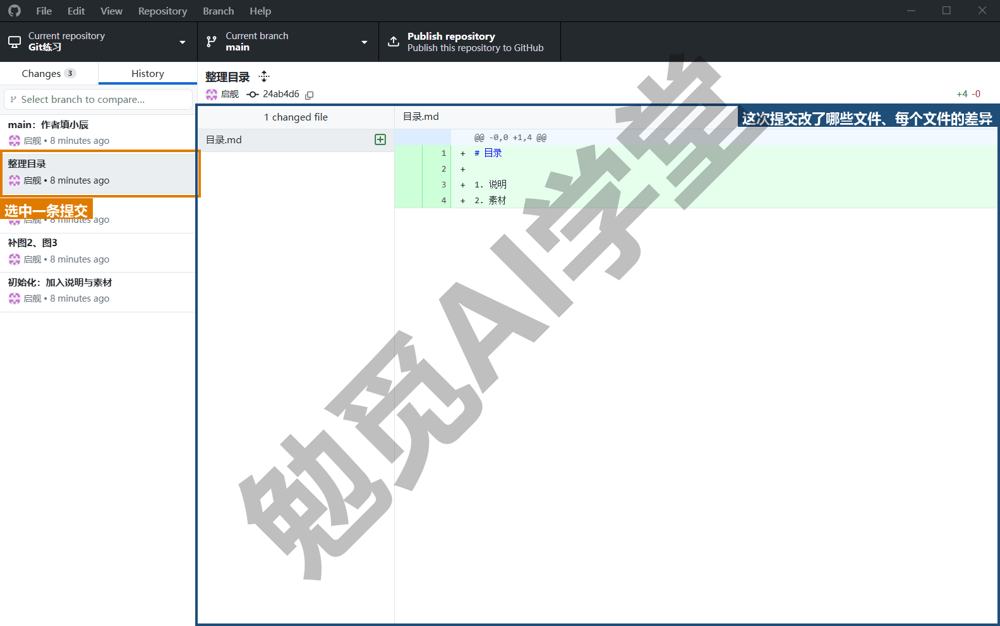

**对某次提交的右键操作。** 右键 History 里的一条提交，菜单里常用的有这几项（需实机验证）：

| 菜单项 | 做什么 | 等于哪条命令 |
| --- | --- | --- |
| Revert changes in commit（撤销此提交的改动） | 新增一个反向提交把它抵消 | `git revert` |
| Amend commit（修改提交） | 改最近一次提交，只对最新一条可用 | `--amend` |
| Create branch from commit（从此提交新建分支） | 从这条提交开一条新分支 | — |
| Create tag（创建标签） | 给这条提交打标签 | `git tag` |
| Copy SHA（复制哈希） | 复制这条提交的哈希 | — |

刚提交完，Changes 页签底部会出现一个 Undo（撤销）按钮，把最近一次提交退回成未提交的改动，等于 `reset --soft HEAD~1`（需实机验证）；除此之外 `reset` 三档和 `reflog` 没有对应按钮，真需要它们时回终端。

**查看某个文件的历史。** Desktop 没有单文件历史视图；你想看某个文件的历史，用《GitHub 网页端：Pages 上线与发布》8.1 节网页上的 History 按钮，或终端 `git log -- 文件名`，或 9.8 节编辑器的时间线。

### 9.4 分支、合并与冲突的按钮版

**Current branch 下拉菜单 = branch + switch。** 顶部工具栏中间的 Current branch 点开，列出全部本地分支和远程分支，点一条就切过去，等于 `git switch`；顶部有 New branch（新建分支）按钮，等于 `git switch -c`；列表分 Default branch（默认分支）与 Recent branches（最近用过的分支）两组，底部还有一个 Choose a branch to merge into main（选一条分支合进 main）按钮。切换时如果有未提交改动，Desktop 会弹框问你是带着改动切过去（Bring my changes）还是先收起来（Leave my changes，等于 stash）（需实机验证），对应《分支与合并》4.2 节讲的两种结果。

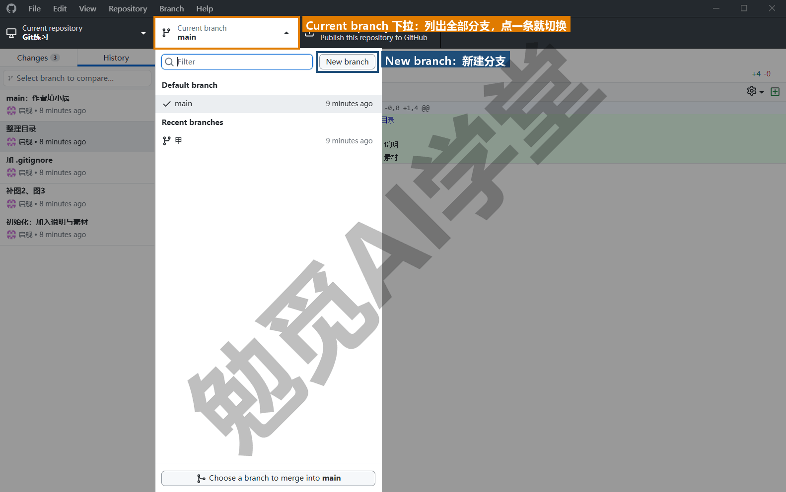

**Branch 菜单。** 顶部菜单栏的 Branch（分支）菜单集中了分支操作（需实机验证）：

| 菜单项 | 做什么 | 等于哪条命令 |
| --- | --- | --- |
| New branch（新建分支） | 开一条新分支 | `git switch -c` |
| Rename（改名） | 给当前分支改名 | `branch -m` |
| Delete（删除） | 删掉分支；有未合并提交会警告，勾选强制就是 `-D` | `branch -d` |
| Update from main（从 main 更新） | 把 main 合进当前分支 | 在分支上 `git merge main` |
| Compare to branch（对比分支） | 对比两条分支 | `git diff 分支1 分支2` |
| Merge into current branch...（合并进当前分支） | 把某条分支合进当前分支 | `git merge 分支` |
| Squash and merge into current branch...（压缩合并） | 把某条分支压成一个提交合进来 | `merge --squash` |
| Rebase current branch...（变基） | 《冲突与工作树》5.6 节讲过，先不碰 | — |
| Stash all changes（收起全部改动） | 把手头的改动先收起来 | `git stash` |
| Create pull request（创建 PR） | 跳到网页新建 PR | — |

**合并是快进还是合并提交。** 用 Merge into current branch 时，Desktop 会先在确认框里写明这次合并会带进几个提交，合并后 History 里能看出是一条直线还是多了一个 Merge 提交，判断办法与《分支与合并》4.3、4.4 节相同。

**冲突。** 合并遇到冲突时，Desktop 弹出对话框列出冲突文件，对话框标题是 Resolve conflicts before Merge（合并前先解决冲突），每个文件旁有 Open in 编辑器名（在编辑器中打开）按钮，比如装了 VS Code 就写 Open in Visual Studio Code；在编辑器里按《冲突与工作树》5.4 节处理（VS Code、Cursor 有四个按钮），保存后回到 Desktop，对话框会显示该文件已解决（以实际表现为准），全部解决后点 Continue merge（继续合并）完成，等于 add 加 commit；对话框里也有 Abort merge（中止合并）等于 `merge --abort`。3.6 及以后的版本在有 Copilot 权限时可以让 Copilot 解释冲突并给出建议方案，你审阅后接受或修改（以实际版本为准，需实机验证）。建议方案照样要自己读一遍。

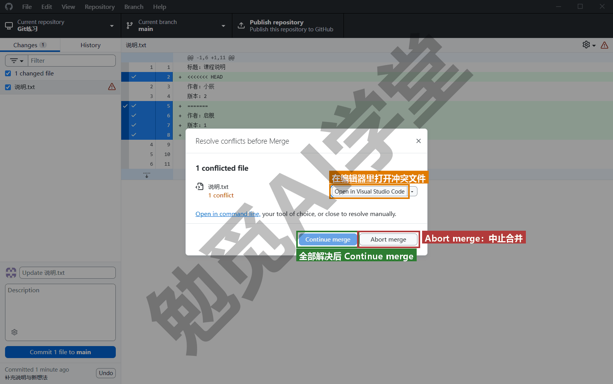

**Stash。** Branch → Stash all changes 收起后，Changes 页签会显示一条 Stashed changes（已收起的改动）横条，点开可以 Restore（取回，等于 `stash pop`）或 Discard（丢弃，等于 `stash drop`）（需实机验证）。Desktop 每条分支只保留一份 stash，同一分支上第二次收起会提示覆盖；要同时收起好几份，还是得用终端。

**标签。** 在 History 里右键提交 → Create tag，输入名字就能打好一个附注标签；推送时 Desktop 会连标签一起推（需实机验证），这一点比命令行省了一步 `push --tags`。

### 9.5 远程与协作的按钮版

**Publish repository = 新建远程 + 连接 + 首次推送。** 一个还没有远程的本地仓库，顶部大按钮显示 Publish repository（发布仓库）。点开的对话框上方是 GitHub.com 与 GitHub Enterprise 两个页签，默认打开的 GitHub.com 页签上填 Name（仓库名）与 Description（描述），勾不勾 Keep this code private（保持私有，默认勾着，想公开就取消），下面还有一个 Organization（组织）下拉，默认是 None，如果你在某个组织里，可以直接发到组织名下；填好点 Publish repository，Desktop 会在你的 GitHub 账号下新建仓库、设好 origin、推送 main，一个按钮做完《GitHub 与远程仓库》6.3 节的四步。有了远程之后，这个位置变成下面三种按钮之一。

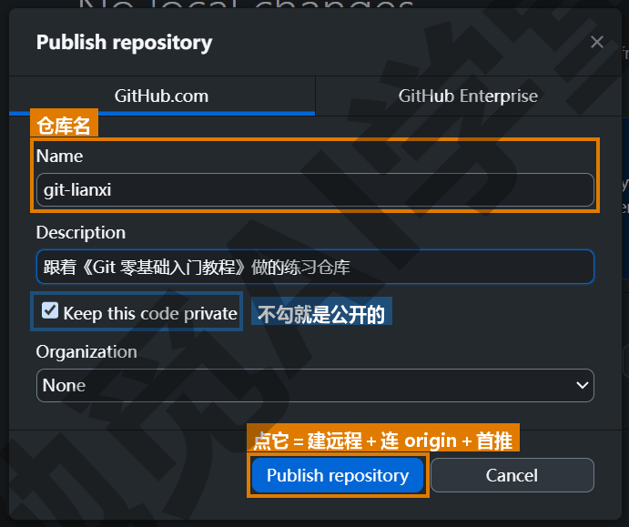

**Fetch origin／Pull origin／Push origin。** 大按钮的文字随状态变化：两边一致时显示 Fetch origin（取回），点它等于 `git fetch`；取回后发现远程领先，变成 Pull origin，按钮右边多出一个写着差几个提交的小角标（落后一个就是 1 ↓），点它等于 `git pull`；本机有未推送的提交时变成 Push origin，角标写成 1 ↑，点它等于 `git push`。按钮旁的小字“Last fetched 几分钟前”告诉你上次取回的时间，Desktop 会定期自动 fetch，所以它比命令行更早知道远程有变化。但它只自动 fetch、不自动 pull，你的分支不会在你不知道的时候被改动。

**推送被拒。** 你在两边都有新提交时点 Push，Desktop 会提示远程有你没有的提交、需要先取回（对话框里的按钮是 Fetch）（需实机验证），对应《GitHub 与远程仓库》6.4 节的 non-fast-forward。取回、合并（或解冲突）后再 Push。这时不要去找强制推送：Desktop 平时不显示它，只有你在本机 amend、rebase 或重排过已经推送的提交、两边历史分叉之后，大按钮才会变成 Force push origin（强制推送），Repository 菜单里也会多出 Force push 一项，点了会先弹出确认框，背后用的是带 `--force-with-lease` 的推送（需实机验证）。它和 9.9 节讲的一样是改写远程历史，只在自己一个人用的分支上点。

**Clone repository。** File → Clone repository...（克隆仓库）会打开一个对话框，上面有三个页签：GitHub.com（从你账号下的仓库列表里选）、GitHub Enterprise、URL（贴任意网址），下方选本地存放路径（需实机验证）。等于 `git clone 网址 路径`。克隆后自动加进左侧仓库列表。

**Create pull request。** Branch → Create pull request，Desktop 会先确认分支已推送，然后打开浏览器跳到《多人协作：PR 与 Issue》7.2 节第 3 步的新建 PR 页面（需实机验证）；分支推上去、工作区又没有未提交改动时，Changes 页签的主区会出现一张建议卡片 Preview the Pull Request from your current branch，卡片右边的按钮就是 Preview Pull Request（预览合并请求），卡片下方还标着它同时在 Branch 菜单里、快捷键 Ctrl+Alt+P；点开先在 Desktop 里看一遍这条分支相对 main 的全部改动，再点里面的 Create pull request 去网页（需实机验证）。之后的说明、审查、合并都在网页完成，合并后回 Desktop 切回 main 点 Pull origin，本机就和网页上一致了。

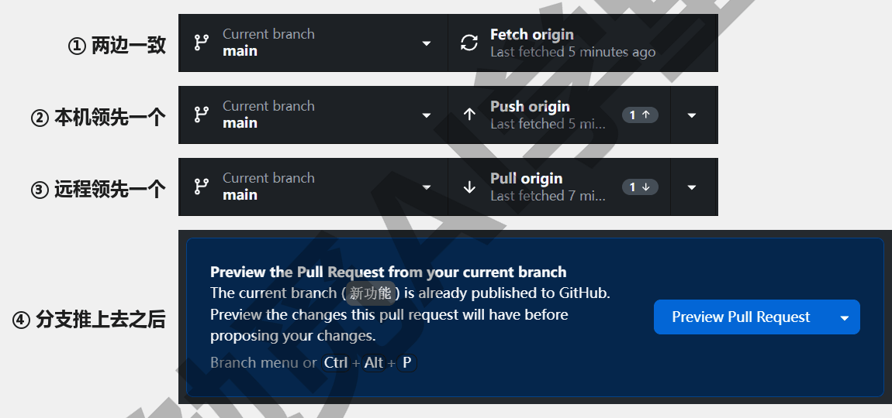

**Repository 菜单。** 顶部菜单栏的 Repository（仓库）菜单里常用的有这几项（需实机验证）：

- Push／Pull／Fetch：与大按钮相同；两边历史分叉时多一项 Force push，上一段讲过。
- View on GitHub（在 GitHub 上查看）：打开网页上的仓库页。
- Open in 终端名（在终端中打开，可在设置里选 PowerShell、Git Bash 等）：直接在当前仓库开一个终端。这是 Desktop 与命令行配合最方便的入口，图形界面里没有的操作，点这里进终端敲一条命令就行。
- Show in Explorer（在资源管理器中显示）：在资源管理器里打开仓库文件夹。
- Repository settings...（仓库设置）：可以看和改远程网址（等于 `remote set-url`）、编辑 `.gitignore`、设置这个仓库单独的署名。

**Fork 的处理。** 用 Desktop 克隆一个你 Fork 来的仓库时，它会问你打算怎么用这个 Fork：为原仓库贡献（To contribute to the parent project）还是自己独立用（For my own purposes）（需实机验证）。选“为原仓库贡献”，Desktop 会自动把原仓库设为 upstream 并在 Fetch 时同步，等于《多人协作：PR 与 Issue》7.6 节的 `remote add upstream` 与后续同步。

### 9.6 工作树的按钮版

GitHub Desktop 从 3.6 版本起支持 Git 工作树，把同一仓库的不同分支同时检出到不同文件夹，也就是《冲突与工作树》5.7 节的 `git worktree add`。这是为“AI 编程助手常常开多个工作树并行干活”的场景加的，让你能在图形界面里看到和切换这些文件夹（以实际版本为准；本节里新建、改名与删除工作树的入口需实机验证）。

**在哪里。** 第一个工作树从 Repository 菜单里的 New worktree...（新建工作树）新建，或者右键工具栏的 Current repository 下拉菜单选同名的一项（菜单项名需实机验证）；在弹出的 Add worktree（添加工作树）对话框里，Worktree name（工作树名）一栏填一个名字，文件夹位置不用选，Desktop 会按这个名字自动定好，路径显示在对话框底部；Branch name（分支名）一栏留空，就新建一条和工作树同名的分支，填一条已有的分支名，这个工作树就用那条分支；点 Create Worktree（创建工作树），等于 `worktree add 路径 -b 分支`；建成后 Desktop 会自动切到它（需实机验证）。有了至少一个工作树之后，工具栏 Current repository 与 Current branch 之间会多出一个 Current worktree（当前工作树）下拉菜单，顶部是 New worktree（新建工作树）按钮，列表分 Main worktree（主工作树，就是你原来的仓库文件夹）和 Linked worktrees（链接工作树）两组，每一项显示文件夹名和所在分支；点一项就切过去，Changes 与 History 随之显示那个文件夹、那条分支的状态（需实机验证）；链接工作树还可以在这里右键改名与删除（删除等于 `worktree remove`，主工作树不能删）（需实机验证）。

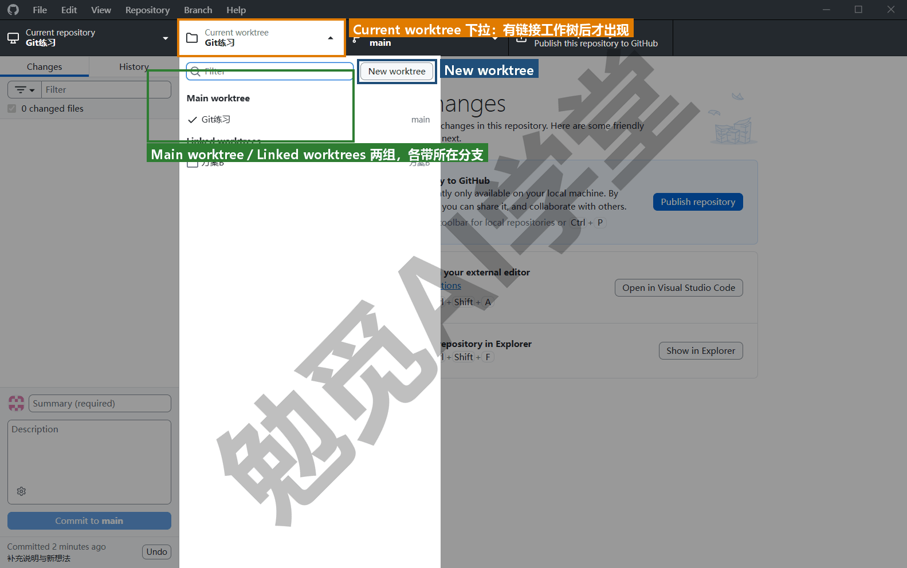

**和命令行混用。** 用终端 `git worktree add` 开的工作树，Desktop 能识别并列出；反过来 Desktop 建的工作树，终端 `git worktree list` 也能看到。两边操作的是同一份记录。

**AI 工具开的工作树。** Cursor 代理窗口选“新建工作树”运行环境、Codex 的“新工作树”启动模式，开出来的文件夹在 Desktop 的工作树列表里同样可见，你可以用 Desktop 的 History 面板对比几个方案的提交，再回终端或 AI 工具里做《冲突与工作树》5.8 节的择优合入。

**一个典型流程。** 你想比较两种首页排版：在 Desktop 里从主仓库新建工作树“方案A”（Worktree name 填“方案A”、Branch name 留空，Desktop 会新建同名分支并自动定好文件夹位置），再新建“方案B”；在两个文件夹里分别让 AI 或自己完成改动并提交；在 Current worktree 下拉菜单里切回 Main worktree，用 Branch → Merge into current branch 把选中的方案合进 main（main 没动过，是一次快进）；最后在 Current worktree 下拉菜单里删掉两个工作树，落选的分支留着或在 Branch → Delete 里删掉。这四步就是《冲突与工作树》5.8 节的四步，只是每一步换成了点选。History 面板在这个过程里很有用：在 Current worktree 下拉菜单里切到某个工作树，就能看到那个方案的提交列表和改动，比在两个终端窗口之间来回切换直观。

**两个坑和命令行里一样。** 你删工作树前先离开那个文件夹（在 Desktop 里就是先在 Current worktree 下拉菜单切回 Main worktree 再删）；同一条分支不能同时在两个工作树里检出，Desktop 会拒绝并提示（需实机验证）。

**没有这个功能的版本。** Desktop 版本低于 3.6、或你选择不装 Desktop，工作树全部用终端命令操作，《冲突与工作树》5.7 节的四条命令就够用了。

### 9.7 命令与按钮总对照表

把前八篇出现过的操作和 GitHub Desktop 里的位置放在一张表里。Desktop 按钮名以英文为准，位置随版本可能微调（全表需实机验证）；没有对应按钮的操作标“回终端”。这张表在《实战三：参与开源项目 + 课程总结》的命令速查卡里还会再出现一次。

| 要做什么 | 命令 | GitHub Desktop 位置 | 所在篇节 |
| --- | --- | --- | --- |
| 配置署名 | `git config --global user.name / user.email` | File → Options → Git | 1.7 |
| 新建仓库 | `git init` | File → New repository | 2.2 |
| 看三区状态 | `git status` | Changes 页签 | 2.3 |
| 暂存文件／部分行 | `git add 文件` / `git add -p` | Changes 里勾选文件／选中行 | 2.4 |
| 提交 | `git commit -m` | Summary 输入框 + Commit to 分支 | 2.5 |
| 看历史 | `git log --oneline --graph` | History 页签 | 2.6、4.5 |
| 看一次提交 | `git show 哈希` | History 里点选提交 | 2.6 |
| 看改动 | `git diff` / `--staged` | Changes 里点选文件 | 2.7 |
| 忽略文件 | 编辑 `.gitignore` | Repository → Repository settings → Ignored files | 2.8 |
| 修最近一次提交 | `git commit --amend` | History 右键 → Amend commit | 2.10 |
| 丢弃工作区改动 | `git restore 文件` / `.` | Changes 右键 → Discard changes | 3.2 |
| 撤回暂存 | `git restore --staged 文件` | Changes 里取消勾选 | 3.3 |
| 撤销提交（reset 三档） | `git reset --soft/--mixed/--hard` | 刚提交完可点 Changes 底部的 Undo（相当于 --soft 退一步）；其余回终端 | 3.4 |
| 反向抵消提交 | `git revert 哈希` | History 右键 → Revert changes in commit | 3.5 |
| 回头看旧版本 | `git switch --detach 哈希` | 回终端（History 右键可 Create branch from commit） | 3.6 |
| 找回丢失提交 | `git reflog` | 回终端 | 3.7 |
| 收起半成品 | `git stash` / `pop` | Branch → Stash all changes；Changes 里 Restore | 3.8 |
| 清未跟踪文件 | `git clean -fd` | Changes 右键 Discard（逐个） | 3.9 |
| 新建分支 | `git switch -c 名` | Current branch → New branch | 4.2 |
| 切分支 | `git switch 名` | Current branch 下拉菜单点选 | 4.2 |
| 删／改名分支 | `git branch -d` / `-m` | Branch → Delete / Rename | 4.2 |
| 合并 | `git merge 分支` | Branch → Merge into current branch | 4.3、4.4 |
| 压缩合并 | `git merge --squash` | Branch → Squash and merge into current branch | 7.4 |
| 打标签 | `git tag -a 名 -m` | History 右键 → Create tag | 4.6 |
| 解冲突 | 编辑、删标记、add、commit | 冲突对话框 → 在编辑器中打开 → Continue merge | 5.4 |
| 放弃合并 | `git merge --abort` | 冲突对话框 → Abort merge | 5.4 |
| 工作树 | `git worktree add/list/remove` | Current worktree 下拉菜单（Current repository 与 Current branch 之间，有工作树时才出现；首个从 Repository 菜单新建）（3.6+） | 5.7 |
| 新建远程并第一次推送 | `remote add` + `branch -M` + `push -u` | Publish repository 按钮 | 6.3 |
| 取回／拉取／推送 | `git fetch` / `pull` / `push` | 工具栏大按钮三态 | 6.4 |
| 推标签 | `git push --tags` | 随 Push 自动推送 | 6.3 |
| 克隆 | `git clone 网址` | File → Clone repository | 6.5 |
| 改远程网址 | `git remote set-url origin` | Repository settings → Remote | 8.7 |
| 开 PR | 推分支后网页操作 | Branch → Create pull request（跳网页） | 7.2 |
| 加 upstream 并同步 | `remote add upstream` + `fetch` + `merge` | 克隆 Fork 时选 To contribute to the parent project | 7.6 |
| 强制推送 | `git push --force-with-lease` | 大按钮变成 Force push origin（amend／rebase 后才出现）；Repository → Force push | 9.5、9.9 |
| 打开终端 | — | Repository → Open in 终端名 | 9.5 |

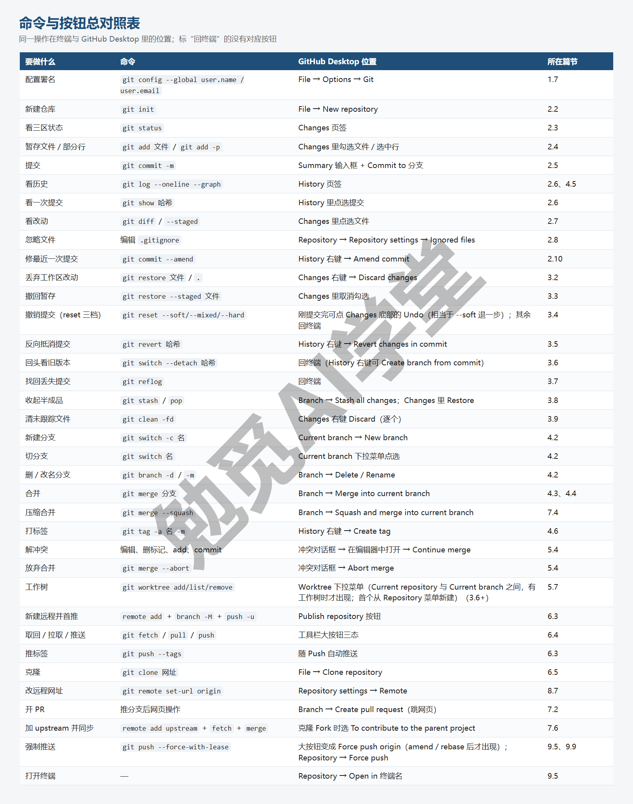

**怎么用这张表。** 你可以从两个方向用它。从命令找按钮：AI 工具告诉你它执行了 `git stash`，你想在图形界面里看到那份收起的改动，查表知道去 Changes 页签找 Stashed changes 横条。从按钮找命令：在 Desktop 里点了 Discard changes 之后想知道能不能撤回，查表看到它等于 `git restore`，回《撤销、还原与找回》3.2 节确认不可恢复。表里标“回终端”的几项（reset 三档、reflog、detach）正是《撤销、还原与找回》里最有力的几条命令，图形界面刻意不提供是为了防误操作，用到时按《撤销、还原与找回》里的写法敲即可。

### 9.8 编辑器里的源代码管理面板

VS Code 和 Cursor（它是在 VS Code 的基础上改出来的）左侧活动栏都有一个“源代码管理”图标（三个圆点连线的图形，快捷键 Ctrl+Shift+G），点开就是一个内置的 Git 面板。它做的事和 GitHub Desktop 的 Changes 页签几乎一样，好处是改文件和提交在同一个窗口里完成。

**面板结构。** 顶部是提交说明输入框和 Commit（提交）按钮；下面分 Staged Changes（暂存的更改）与 Changes（更改）两组，文件旁的加号是暂存（`git add`）、减号是取消暂存（`restore --staged`）、弯箭头是放弃更改（`restore`）；点文件名打开左右对照的差异视图（`git diff`）。中文界面下的文案以你看到的界面为准。

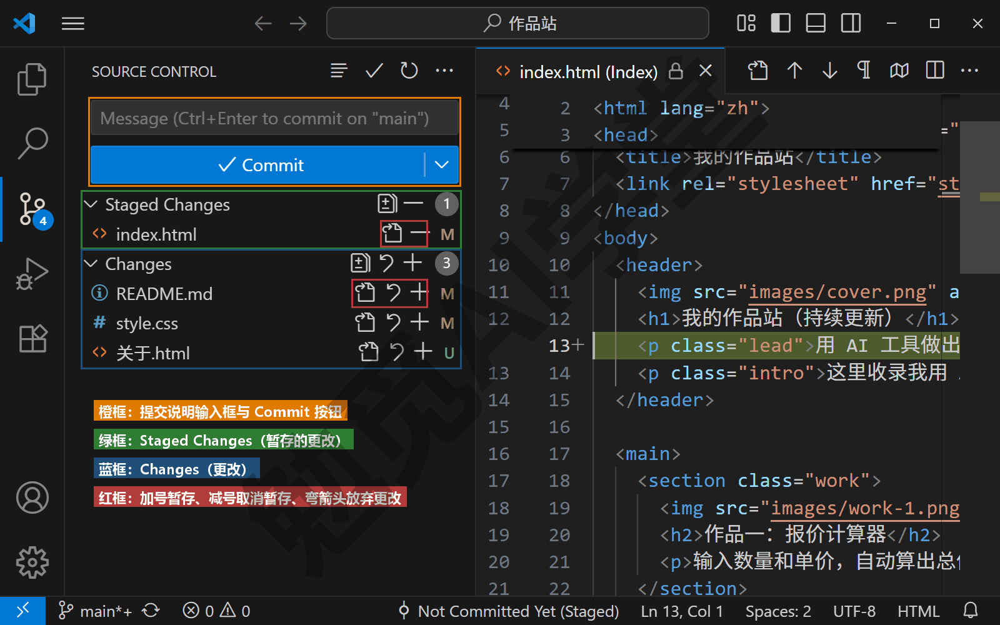

**逐行暂存。** 在差异视图里选中几行右键 → Stage Selected Ranges（暂存所选范围），只把这几行放进暂存区（需实机验证），和 Desktop 一样是 `git add -p` 的图形版。

**更多操作在三个点菜单里。** 面板标题栏的“...”菜单里有这几项（需实机验证）：

| 菜单项 | 做什么 |
| --- | --- |
| Pull／Push／Fetch | 拉取／推送／取回 |
| Checkout to... | 切换分支 |
| Branch | 新建、合并、删除分支 |
| Stash | 收起、取回改动 |
| Tags | 打标签 |
| Show Git Output | 显示 Git 输出 |

最后一项 Show Git Output 最有用：它会打开一个输出窗口，把面板每次点按钮时实际执行的 git 命令原样打出来。这是学习“按钮背后是什么”最直接的办法，也是排错时看清发生了什么的地方。

**状态栏。** 窗口左下角显示当前分支名，点它可以切换分支；旁边的同步图标显示 ahead／behind 数字，点它等于 pull 加 push（需实机验证）。

**时间线视图。** 编辑器左侧“资源管理器”面板（列文件的那一栏）底部的 Timeline（时间线）列出当前打开文件的提交历史，点一条看那次改动（需实机验证），正好补上 Desktop 没有的单文件历史。新版 VS Code 还内置了 Source Control Graph（源代码管理图）视图，画的就是《分支与合并》4.5 节的分支图，以实际版本为准。

**Cursor 里的两套改动视图别弄混。** 你在用 Cursor 的话，会碰到两套改动视图，容易弄混。Cursor 课《两套界面全导览》2.4 节和《Git、GitHub 与代码审查》13.2 节讲过，Cursor 的代理窗口有自己的差异视图：显示的是“这一轮对话里 AI 改了什么”，每个文件、每一块可以接受或拒绝。那是对 AI 改动的审阅，接受之后改动才留在工作区，它不碰 Git。源代码管理面板显示的是“工作区相对上次提交改了什么”，勾选文件并提交之后，改动才进 Git。两套视图分工是：先在代理差异视图里决定要不要 AI 的改动，再在源代码管理面板（或终端）里决定提交什么。Cursor 的差异视图也可以逐文件暂存与提交（13.2 节），那一步等于把两层合在了一起，但概念上仍是先审阅、后提交。

**编辑器面板与 Desktop 怎么选。** 两者的功能大部分是重合的。你已经在用 VS Code 或 Cursor 写东西，面板就在手边，一般不需要再装 Desktop；你不用编辑器、主要管文稿和笔记，用 Desktop 的独立窗口和 History 面板更合适。两者同时装也没有冲突。

### 9.9 AI 工具里的 Git：三层、三条与读懂命令

Codex、Cursor，以及 Obsidian 的 Git 插件，各自都有和“版本”“还原”有关的功能，新手常把它们和 Git 混在一起。这一节把它们分成三层，然后讲让 AI 替你跑 Git 时的三条安全做法，最后教你读懂 AI 输出的命令。

**第一层：临时快照。** Cursor 的检查点、Codex 审查面板的还原按钮，属于 AI 工具自己维护的快照：只覆盖 AI 在对话里改过的文件，用来在对话进行中快速回退到某一轮之前；对话归档或工作区重开之后一般不再可用，也不记录你手动的修改。Cursor 课《权限、沙盒与模型》3.6 节和 Codex 课《AGENTS.md、Diff 与还原》分别讲了它们的用法。它们对应本课的“撤销工作区改动”，但范围小、保留时间短。

**第二层：永久提交。** 永久提交就是本课前八篇的全部内容：你自己或 AI 执行的 `git commit`，进了 `.git`，永久有效、与工具无关、可以推到远程。AI 工具替你做的提交和你手敲的没有任何区别，都在 `git log` 里。Codex 审查面板的“提交”、Cursor 差异视图的提交、以及 AI 在终端里跑的 commit，都落在这一层。

**第三层：自动提交。** Obsidian 的 Git 插件可以按固定间隔自动 add、commit、push；Codex 与 Cursor 的自动化任务也可以定时跑 Git 命令。它们省去了手动提交的动作，代价是提交说明千篇一律、冲突时可能把标记直接写进文件（《实战二：笔记与文档库的备份同步》11.5 节会讲这个坑）。它是第二层的自动化，不是另一种版本系统。

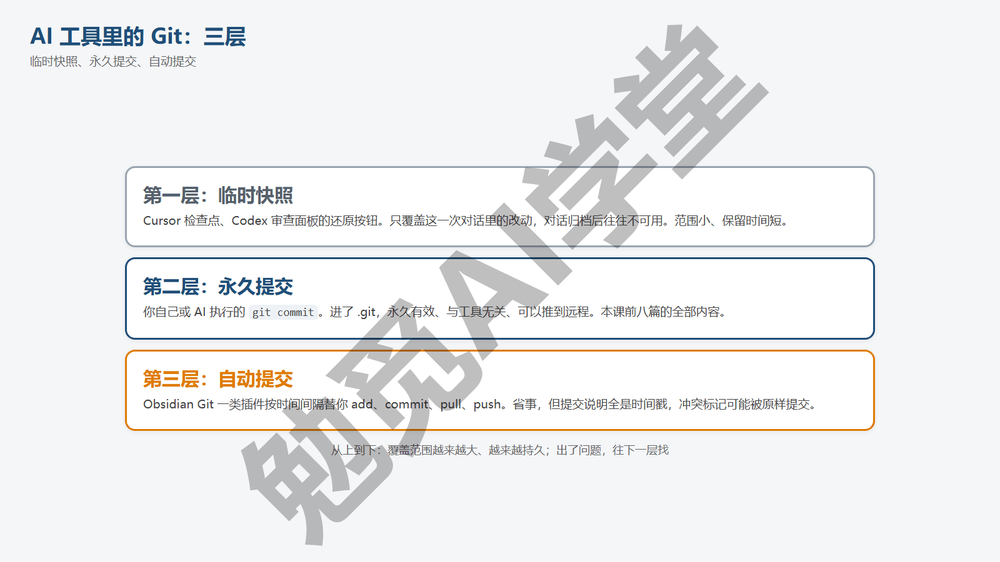

**三条安全做法。** 你让 AI 替你跑 Git 之前，记住三条：

第一，**让 AI 动手前，自己先 `git status`。** 看清工作区有没有未提交的改动、在哪条分支上。AI 不知道你昨晚手改了什么，它建议的“清理一下工作区”可能就是 `reset --hard`。

第二，**AI 提出带 force、`reset --hard`、`clean` 的命令时，先问它为什么。** 这三类是《撤销、还原与找回》3.10 节危险清单上的东西。多数情况下 AI 有更稳妥的办法（pull 再 push、revert、逐个 restore），问一句“有没有不丢东西的办法”，它通常都能给出一个。

第三，**AI 写的提交说明自己读一遍。** 它们擅长总结改动，但不知道你的意图；说明里写“调整样式”而你其实是改坏了想先存一版，以后翻历史会误导自己。改成《第一个仓库：提交与历史》2.5 节标准的一句话再确认。

**读懂 AI 输出的命令。** AI 工具运行或建议的 Git 命令通常是几条连在一起的一行。你把它拆开、逐条对回本课的命令速查卡，就都能认出来。下面几组是它们最常输出的：

`git add -A && git commit -m "说明"`：先把全部改动暂存再提交（`-A` 与 `.` 在仓库根目录效果一样）。注意中间的 `&&` 是“前一条成功再执行后一条”的连接符，在 Git Bash、Mac 终端和 PowerShell 7 里有效，**在 Windows 自带的 PowerShell 5.1 里不能用**，会报“标记“&&”不是此版本中的有效语句分隔符”。AI 给了这种一行式而你的终端报这个错，把它拆成两行分别执行即可。

`git commit -am "说明"`：`-a` 表示自动暂存所有已跟踪文件的改动再提交，等于对已跟踪文件 `add` 加 `commit` 一步做完；它不会带上新建的未跟踪文件。工作区干净时它什么都不做，只打印一遍 status。

`git checkout -- .`：旧写法的 `git restore .`，丢掉全部已跟踪文件的未暂存改动，未跟踪的新文件不受影响；不可恢复，见到先想一下要不要。

`git stash && git pull --rebase && git stash pop`：收起手头改动、用 rebase 方式拉取远程、再把改动取回。中间那步是《冲突与工作树》5.6 节说过先别碰的 rebase；如果你的提交还没推出去、又想历史干净，用它没有问题；拿不准就把 `--rebase` 去掉用普通 pull。顺利时这三步依次输出以 Saved working directory、Successfully rebased and updated、Dropped refs/stash@{0} 开头的三行。

`git push --force-with-lease`：比 `--force` 稍安全的强制推送，如果在你上次取回之后远程又被别人推过，它会拒绝而不是覆盖。AI 在你 amend 或 rebase 了已推送的提交之后常建议它，输出里会有 (forced update) 字样。它仍然是改写远程历史，只在自己一个人用的分支上接受它，团队分支上先问为什么。

`git reset --hard origin/main`：把本机 main 强行变成远程 main 的样子，丢掉本机所有未推送的提交和未提交的改动。AI 在“本机状态乱了、想和远程保持一致”时会建议它。执行前 `git log origin/main..main` 看看会丢掉哪些提交，有想要的先开一条分支把它们保住。

AI 给的一行式在 Windows 自带的 PowerShell 里报错、拆成两条就通了，实际画面是这样的：

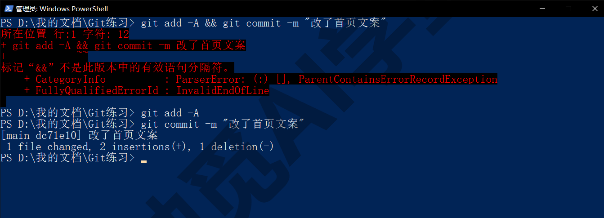

**在 AI 工具和图形界面里，这一步是什么样子。** 本篇本身就是这块内容的汇总，各课对应的位置集中列在这里：Codex 课《AGENTS.md、Diff 与还原》（Diff 面板与还原）、《自动化、Git 与远程操控》（审查面板暂存与提交、工作树、GitHub 插件与 PR Chat）；Cursor 课《权限、沙盒与模型》3.6 节（检查点与 Git 的分工）、《子智能体、并行与工作树》12.5 与 12.6 节（工作树、几个方案并排比较）、《Git、GitHub 与代码审查》（差异视图提交、连接 GitHub、PR 与审查）；Obsidian 课《同步与备份全解》（Git 插件自动提交）。看完本课再回到那几篇，每个按钮你都知道背后是哪条命令了。

### 9.97 练习任务

方括号里的内容换成你自己的。

**任务一：用 Desktop 做一次逐行暂存的提交，再用命令行核对。** 装好 GitHub Desktop，把 `[你的练习仓库]` 加进去，改一个文件的两处，只勾选其中一处提交，然后在终端：

```text
git log -p -1
git status -s
```

完成标准：log -p 显示的提交只包含你勾选的那几行；status -s 里该文件仍显示 ` M`（另一处改动还在工作区）。

**任务二：用 Desktop 开分支、制造并解决一次冲突。** 在 Desktop 里 New branch 开一条分支，改某一行并提交；切回 main 改同一行、再提交；Branch → Merge into current branch 合并触发冲突，用“在编辑器中打开”解决后 Continue merge。

完成标准：冲突对话框出现过；解决后 History 里出现合并提交；终端 `git log --oneline --graph -5` 能看到分叉与汇合。

**任务三：把 AI 最近替你跑的 Git 命令抄下来，逐条拆解。** 打开 Codex 或 Cursor 最近一次涉及 Git 的对话，把它执行过的命令原样抄到一个文本文件里，每条下面写一行“它做了什么、对应本课哪一节、有没有风险”。至少 5 条。

完成标准：每条都能对上 9.7 节表里的某一行或 9.9 节的某一组；凡带 force、`reset --hard`、`clean` 的都标出了风险。

### 9.98 本篇小结与自检

这一篇把命令和按钮对上了：先讲了为什么会命令再点按钮更稳、三类操作用图形界面更方便；装好 GitHub Desktop 并把它的四组按钮逐组点了一遍：Changes 与 History（对应《第一个仓库：提交与历史》）、Current branch 与 Branch 菜单及冲突对话框（对应《分支与合并》《冲突与工作树》）、Publish／Fetch／Pull／Push 与 Clone、Create pull request（对应《GitHub 与远程仓库》《多人协作：PR 与 Issue》）、3.6 起的工作树（对应《冲突与工作树》5.7 节）；给出了一张命令与按钮的总对照表；讲了编辑器源代码管理面板的结构、逐行暂存、Show Git Output 与时间线，以及 Cursor 代理差异视图与源代码管理面板的分工；最后把 AI 工具里的 Git 分成临时快照、永久提交、自动提交三层，给出让 AI 跑 Git 的三条安全做法，并逐条拆解了 AI 最常输出的六组命令。

可以对照下面的清单检查学习结果：

- [ ] 能说出三类用图形界面更方便的操作，和为什么先学命令再用按钮
- [ ] 装好了 GitHub Desktop（或至少读懂了它的四组按钮各对应哪几篇）
- [ ] 知道 Changes 里勾选、逐行选中、Discard changes 各等于哪条命令
- [ ] 知道 Branch 菜单里的 Merge、Squash and merge、Stash、Create pull request 各是什么
- [ ] 知道工具栏大按钮的三种状态各等于哪条命令，Desktop 什么时候才会出现 Force push origin
- [ ] 能用 9.7 节的表从命令找按钮、从按钮找命令
- [ ] 会用编辑器的源代码管理面板暂存、提交，知道 Show Git Output 在哪
- [ ] 分得清 Cursor 的代理差异视图与源代码管理面板
- [ ] 能说出 AI 工具里 Git 的三层与让 AI 跑 Git 的三条安全做法
- [ ] 能拆解 `git add -A && git commit`、`--force-with-lease`、`reset --hard origin/main` 这类命令并说出风险

完成这些内容后，本课的功能篇全部结束：命令、按钮、AI 工具三种用法你都见过了。下一篇《实战一：AI 项目从零到上线》把前九篇串成一个完整项目：一个 AI 生成的小网页，从第一次提交、分支试方案、预埋两次事故救回、开 PR 合并、打标签发 Release，到 Pages 上线再发布，全程走一遍。

### 9.99 新手常见问题

**Q1：用图形界面就够了，为什么还要学命令？**

因为按钮不会告诉你它在做什么，出了问题也没法排查；AI 工具替你跑的、资料里写的全是命令；图形界面每换一个软件按钮都不一样，命令在哪都相同。会命令之后再用按钮，你知道每一下点的是什么，这才是“会用图形界面”。

**Q2：GitHub Desktop 和编辑器里的面板选哪个？**

两者的功能大部分是重合的。已经在 VS Code 或 Cursor 里工作的人用面板，改文件和提交在同一个窗口里完成；主要管文稿笔记、不常开编辑器的人用 Desktop，独立窗口和 History 面板用起来更直接。两者可以同时装，操作的是同一个仓库。

**Q3：两个工具同时操作同一个仓库会乱吗？**

不会。终端、Desktop、编辑器面板、AI 工具操作的都是同一个 `.git` 文件夹，一边做了改动另一边刷新就能看到。唯一要避免的是两边同时执行会改写历史的操作（比如一边在 rebase、另一边在提交），日常用不会碰到。

**Q4：AI 说要 force push，我该答应吗？**

先问它为什么。如果是因为它 amend 或 rebase 了已经推送的提交，而且这条分支只有你一个人用，`--force-with-lease` 可以接受；如果是团队共用的分支，或者它只是想“解决推送被拒”，拒绝它，改用 pull 再 push。任何情况下不要接受不带 `--with-lease`、只写 `--force` 的强制推送。

**Q5：Desktop 里找不到 reset 和 reflog，怎么办？**

它们被刻意省掉了，因为容易误操作。需要时用 Repository → Open in 终端名 打开终端，按《撤销、还原与找回》3.4 与 3.7 节敲命令即可；Desktop 的 History 面板会实时反映结果。
