## 实战一：AI 项目从零到上线

前九篇把 Git 的命令、GitHub 的页面和图形界面的按钮各自讲全了。从这一篇起是三篇实战，不再按功能讲，而是按一个项目从头到尾的顺序把它们串起来用。这一篇的项目是一个 AI 生成的小网页：从“硬盘上一个文件夹”出发，走到“有完整历史、有分支记录、有版本号、有一个已合并的 PR、有一个任何人都能打开的网址”。中途会故意制造两次事故并救回来。全程只用前九篇讲过的命令，遇到已经讲过的细节只写出篇名与节号，不重复展开；GitHub 网页上的按钮名以英文写出并附中文释义，页面形态以你看到的页面为准。

先看做出来的样子（动图）：一个文件夹里的网页上了线，手机能打开；仓库里有合并过的 PR、发过的 v1.0，整个过程留在历史全图里。

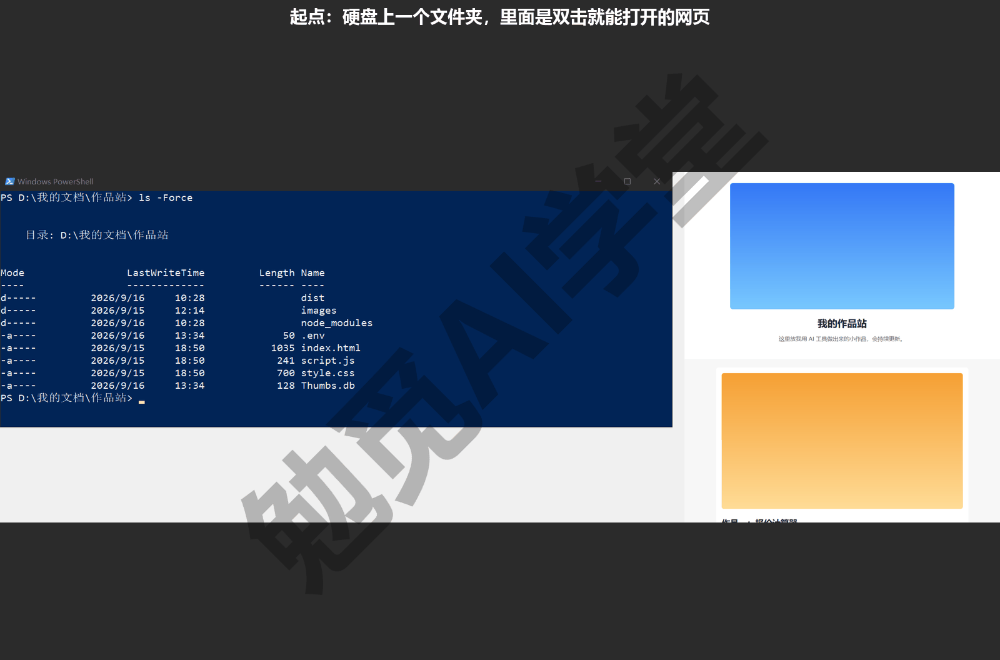

这篇文章的实操内容不需要花钱：本机 Git 加 GitHub 免费账号就够，公开仓库的 Pages 免费，示例包随课程提供。

### 10.1 项目定义与交付物

**项目是什么。** 你这一篇要带上线的项目是一个静态小网页，由四样东西组成：一个 `index.html`（页面内容）、一个 `style.css`（样式）、一个 `script.js`（页脚年份）、一个 images 文件夹（三张配图）。它不需要任何后台程序，双击 `index.html` 就能在浏览器里打开。这类项目正是 Codex、Cursor 这些 AI 工具最常替你生成的东西，也是 GitHub Pages 能直接上线的东西。

**用课程示例包，还是用自己的作品。** 两种都行。你手头没有现成作品、也没学过 AI 课，就用课程提供的示例包：到课程资源仓库的“Git零基础入门教程/资源包”文件夹里下载 [示例包-作品站.zip](%E8%B5%84%E6%BA%90%E5%8C%85/%E7%A4%BA%E4%BE%8B%E5%8C%85-%E4%BD%9C%E5%93%81%E7%AB%99.zip)，解压出来是一个“示例包-作品站”文件夹，内容就是上面四样，另外故意放了几个不该进仓库的文件，10.2 节会用到；用它做，全篇的输出会和正文几乎一致，对照起来最方便。你已经跟着 Cursor 课做过《实战一：小店官网》或跟着 Codex 课做过《报价计算器小应用》，可以直接用自己那个项目的文件夹，命令一条不变，只是文件名和输出里的数字会不同。用自己的项目的话，先确认它还没有被 Git 管理（文件夹里没有 `.git`，或者 `git status` 提示 not a git repository），否则从 10.3 节开始跟着做就可以。

**放在哪里。** 把解压出来的“示例包-作品站”文件夹（或你自己的项目文件夹）放到你的用户文件夹下，改名“作品站”：Windows 上是 `C:\Users\你\作品站`，macOS 上是 `/Users/你/作品站`。不要放在 OneDrive、iCloud 这类网盘同步的文件夹里，原因（网盘会在 Git 写 `.git` 的过程中同步半成品文件，容易把仓库弄坏）在《实战二：笔记与文档库的备份同步》11.1 节展开，这里先照做。在这个文件夹里打开终端（《认识 Git 与装好》1.8 节：右键“在终端中打开”，或先打开终端再 `cd` 进去）。

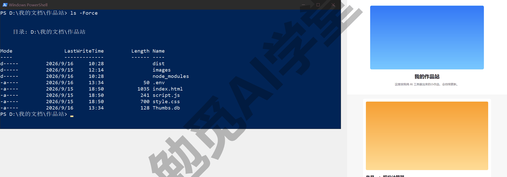

**做完之后要有什么。** 做完之后你手上应该有什么，开头就列清楚，做完对照检查：

| 交付物 | 数量 | 做完后在哪里核对 |
| --- | --- | --- |
| 提交，每次说明能一句话看懂做了什么 | 至少 10 次 | `git log --oneline` |
| 合并（快进也算） | 至少 2 次 | 10.6 节对照验收一段 |
| 标签 | 至少 1 个（v1.0） | `git tag` |
| 已合并的 PR | 1 个 | GitHub 的 Pull requests 页签 |
| 能在浏览器里打开的 GitHub Pages 网址 | 1 个 | 手机浏览器打开 |

这五项对应的正是一个项目在 Git 里留下的全部痕迹：历史、分支、版本、协作、发布。达到这五项，你对任何自己的项目都能做同样的事。

**流程一共七步。** 提前看一眼全图，后面每一节做其中一两步。前五步全在本机，后两步才需要网络和 GitHub 账号（《GitHub 与远程仓库》6.2 节注册并配好两步验证的那个）。

| 步 | 做什么 | 在哪一节 |
| --- | --- | --- |
| 一 | 建仓库，写忽略清单 | 10.2 |
| 二 | 首个提交与 README | 10.2 |
| 三 | 开分支做一次改版并合回 | 10.3 |
| 四 | 两个方案并排比较、择优合入 | 10.3 |
| 五 | 两次事故各救回一次 | 10.4 |
| 六 | 推上 GitHub，用 PR 合并一条分支 | 10.5 |
| 七 | 打标签、发 Release、Pages 上线，再改一处看更新 | 10.5 |

**时间预算。** 本机部分连读带做约一小时，GitHub 部分约半小时，网络不稳时 push 的等待另算（《GitHub 与远程仓库》6.8 节讲过这种情况）。你不必一口气做完：每一节结束时仓库都是干净的，`git status` 显示 nothing to commit，随时可以停下、下次接着做。

**一条贯穿全篇的习惯。** 每做一步之前先 `git status`，看清自己在哪条分支、有没有还没提交的改动，再动手。这是《第一个仓库：提交与历史》2.11 节提出的三句话“多提交、少强推、先 status”里的最后一句，实战里它比任何一条命令都重要：两次事故里的第二次，就是没看 status 直接敲危险命令造成的。

### 10.2 起步与规矩

**先看一眼文件夹。** AI 工具生成的项目文件夹里，除了你要的那几个文件，往往还混着一些不该进仓库的东西。为了让这一步有代表性，示例包里除了那四样真正的项目文件，还故意放了四样常见的“杂物”：一个 node_modules 文件夹（网页项目用到的依赖包，常常有几万个文件，随时可以重新下载）、一个 dist 文件夹（构建时从源文件生成的文件，不需要保存）、一个 `.env` 文件（里面是一行 `OPENAI_API_KEY=sk-...`，AI 项目最常见的密钥文件）、一个 `Thumbs.db`（Windows 资源管理器自动生成的缩略图缓存）。如果你用的是自己的项目，文件夹里很可能也有其中几样，甚至更多，比如 Python 项目的 `__pycache__`、`.venv`，macOS 的 `.DS_Store`，编辑器的 `.vscode`、`.idea`。

**第 1 步：初始化。** 在作品站文件夹里：

```text
git init
git status
```

你会看到类似下面的输出（分支名是 main，因为《认识 Git 与装好》1.7 节配过 `init.defaultBranch`；如果显示 master，按《分支与合并》4.1 节改名）：

```text
On branch main

No commits yet

Untracked files:
  (use "git add <file>..." to include in what will be committed)
	.env
	Thumbs.db
	dist/
	images/
	index.html
	node_modules/
	script.js
	style.css

nothing added to commit but untracked files present (use "git add" to track)
```

八项都是未跟踪，其中四项是杂物。此刻如果直接 `git add .` 再提交，密钥和几万个依赖文件就一起进了历史；密钥一旦提交再推上 GitHub，按《GitHub 与远程仓库》6.6 节的说法必须马上作废、重新申请一个，删掉文件也没用。所以建仓库之后的第一件事不是 add，而是写忽略清单。

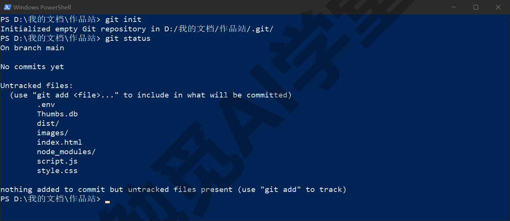

**第 2 步：写 `.gitignore`。** 在文件夹根目录新建一个名为 `.gitignore` 的文件（《第一个仓库：提交与历史》2.8 节讲过它的四种写法），内容如下，可以直接复制：

```text
# 依赖与构建生成的文件
node_modules/
dist/

# 密钥与本机配置
.env
.env.*
!.env.example

# 系统与编辑器杂物
Thumbs.db
.DS_Store
.vscode/
```

第一组两个文件夹名以斜杠结尾，表示忽略整个文件夹：依赖可以按项目里的清单文件重新装回来，构建生成的文件可以重新生成，两者都不该进历史。第二组先忽略 `.env` 以及 `.env.local`、`.env.production` 这类名字相近的文件，再用感叹号开头的一行把 `.env.example` 排除在忽略之外。这是常见做法：真密钥文件不进仓库，但留一个只有变量名、没有真值的样板文件进仓库，别人克隆后照着它填上自己的值。第三组是操作系统和编辑器自动生成的文件，和项目内容无关。以井号开头的行是注释，Git 不读。

AI 工具本身也会给出忽略清单：在 Codex 或 Cursor 里说“给这个项目写一个合适的 .gitignore”，它们会按项目类型生成一份更长的；GitHub 新建仓库时也可以选模板（《GitHub 与远程仓库》6.3 节见过）。拿到之后自己过一遍，确认 `.env` 和依赖文件夹在里面即可。

**第 3 步：确认忽略生效。**

```text
git status -s
```

```text
?? .gitignore
?? images/
?? index.html
?? script.js
?? style.css
```

四样杂物从列表里消失了，多出来的 `.gitignore` 自己要进仓库（它是项目的一部分，别人克隆时也需要）。这就是《第一个仓库：提交与历史》2.8 节说的：忽略清单只对还没被跟踪的文件有效，所以一定要在第一次 add 之前写好。

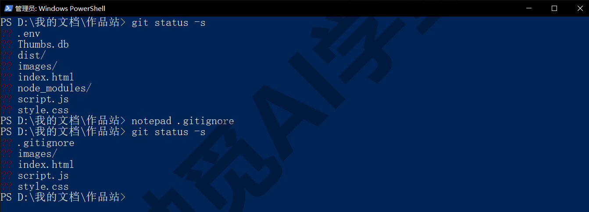

**第 4 步：首个提交。**

```text
git add .
git status
git commit -m "首个版本：首页、样式、脚本与三张配图"
```

add 之后 status 会显示 Changes to be committed 下七个 new file（一个 `.gitignore`、三张图、三个源文件），没有 `.env` 和 node_modules。提交后的输出是：

```text
[main (root-commit) 65dc6a0] 首个版本：首页、样式、脚本与三张配图
 7 files changed, 108 insertions(+)
 create mode 100644 .gitignore
 create mode 100644 images/cover.png
 create mode 100644 images/work-1.png
 create mode 100644 images/work-2.png
 create mode 100644 index.html
 create mode 100644 script.js
 create mode 100644 style.css
```

root-commit 表示这是仓库的第一个提交。哈希 65dc6a0 只是示例，你的会不同，后面所有的哈希也是这样。

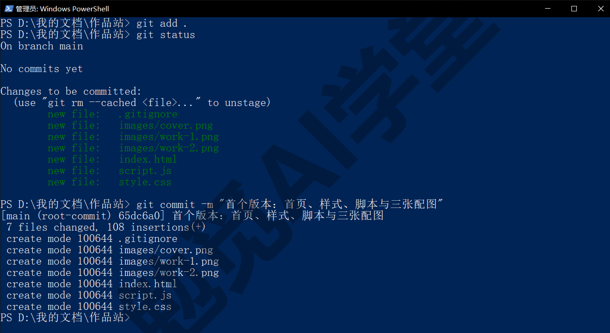

**第 5 步：写 README，第二次提交。** 在根目录新建 `README.md`，按《GitHub 网页端：Pages 上线与发布》8.3 节的五段写法，个人小项目三段就够：

```text
# 我的作品站

一个静态小网页，用来展示我用 AI 工具做出来的作品。

## 怎么看

直接双击 index.html 用浏览器打开。

## 文件说明

- index.html：页面内容
- style.css：样式
- script.js：页脚年份
- images/：配图
```

```text
git add README.md
git commit -m "加 README：项目说明与文件说明"
git log --oneline
```

```text
59aa0f7 加 README：项目说明与文件说明
65dc6a0 首个版本：首页、样式、脚本与三张配图
```

两次提交，两件事，各一句话。这是本项目的提交节律：一件事一次提交，说明写“做了什么”而不是“改了文件”（“加 README”比“更新文件”有用），改动之间先 `git status` 看一眼。README 单独提交而不和首个版本混在一起，是为了以后翻历史时“项目说明是什么时候加的”一眼可见。

**为什么先定规矩。** 这一节的两个动作，忽略清单和提交节律，花不了五分钟，却决定了这个项目之后所有历史的质量。忽略清单晚写一步，密钥和垃圾文件就一直留在历史里；提交节律不定，历史会变成一串“更新”“修改”“再改”，出事时没法退回去。AI 项目尤其如此：AI 一次改十几个文件是常事，没有节律的话，你既看不清它改了什么，也没法只撤销其中一部分。

### 10.3 迭代与试验

项目有了基础，接下来做两轮改动：一轮普通改版，练分支和快进合并；一轮两个方案并排比较，练分支和工作树。

**第一轮：开分支做深色主题。** 你想把页面改成深色配色，效果不确定，按《分支与合并》4.7 节的建议先开分支：

```text
git switch -c 改版-深色主题
```

在“改版-深色主题”分支上打开 `style.css`，把三种颜色改掉：body 的文字色 `#222` 改成 `#eee`、背景 `#f7f7f7` 改成 `#1e1e1e`，header 和作品卡片 `.work` 的背景 `#ffffff` 都改成 `#2a2a2a`（`#ffffff` 出现两次，所以一共动了四行）。保存后在浏览器里刷新 `index.html` 看效果，再回终端：

```text
git diff --stat
git add style.css
git commit -m "改版：深色主题配色"
```

```text
 style.css | 8 ++++----
 1 file changed, 4 insertions(+), 4 deletions(-)
[改版-深色主题 c8a9bb3] 改版：深色主题配色
 1 file changed, 4 insertions(+), 4 deletions(-)
```

`--stat` 只列文件和增删行数，适合提交前快速确认“改的是不是我以为的那几处”；想看具体内容用不带参数的 `git diff`（《第一个仓库：提交与历史》2.7 节）。

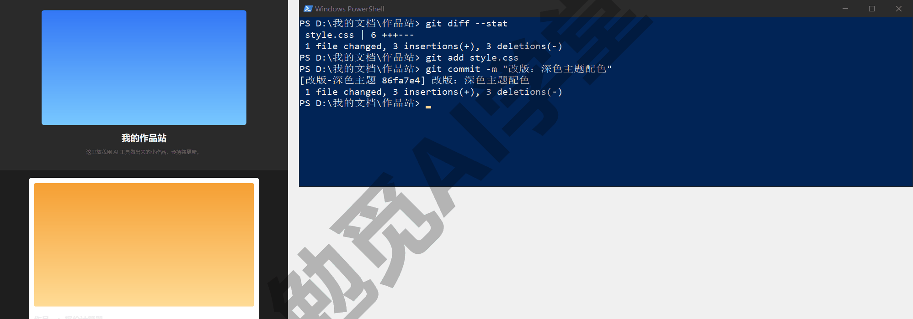

**合回 main。** 效果满意，切回 main 合并，再删掉用完的分支：

```text
git switch main
git merge 改版-深色主题
git branch -d 改版-深色主题
git log --oneline --graph --all
```

```text
Updating 59aa0f7..c8a9bb3
Fast-forward
 style.css | 8 ++++----
 1 file changed, 4 insertions(+), 4 deletions(-)
Deleted branch 改版-深色主题 (was c8a9bb3).
* c8a9bb3 改版：深色主题配色
* 59aa0f7 加 README：项目说明与文件说明
* 65dc6a0 首个版本：首页、样式、脚本与三张配图
```

Fast-forward 就是《分支与合并》4.3 节讲的快进：main 在分支开出去之后没动过，Git 只把 main 往前挪了一格，历史仍是一条直线。这是单人项目里最常见的合并形态，后面还会再遇到。

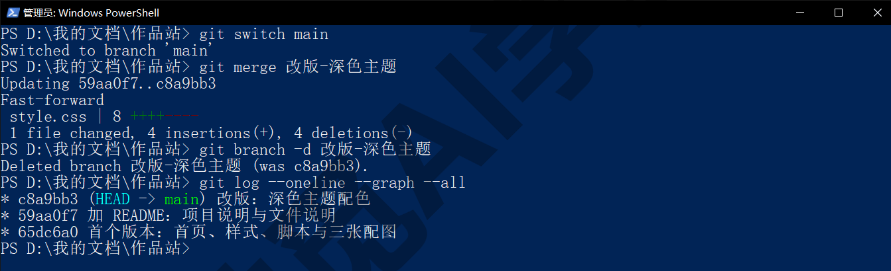

**第二轮：两个方案并排比较。** 作品区的排版你想在两种做法里选一种：方案 A 把作品排成左右两栏，方案 B 保持单列但给每张卡片加阴影。两种都做出来看一眼再定。按《冲突与工作树》5.8 节的做法：方案 A 在当前文件夹的分支上做，方案 B 用工作树在另一个文件夹里做，两个文件夹能同时在浏览器里打开对比。

先做方案 A：

```text
git switch -c 方案A-两栏
```

在 `index.html` 里把 `<main>` 改成 `<main class="two-col">`，在 `style.css` 末尾加一段：

```text
.two-col {
  display: grid;
  grid-template-columns: 1fr 1fr;
  gap: 16px;
}
```

```text
git add -A
git commit -m "方案A：作品两栏排列"
git switch main
```

`-A` 表示把所有改动（包括新文件和删除）一起暂存，和 `git add .` 在项目根目录时效果相同。提交后切回 main，准备开第二个方案。

方案 B 用工作树来做：

```text
git worktree add ../作品站-方案B -b 方案B-卡片
git worktree list
```

```text
Preparing worktree (new branch '方案B-卡片')
HEAD is now at c8a9bb3 改版：深色主题配色
C:/Users/你/作品站       c8a9bb3 [main]
C:/Users/你/作品站-方案B c8a9bb3 [方案B-卡片]
```

第一条命令在作品站旁边新建了一个“作品站-方案B”文件夹，里面是同一个仓库的另一份工作区，检出到新分支“方案B-卡片”；两个文件夹现在都停在 c8a9bb3。用资源管理器进入作品站-方案B，打开 `style.css`，在 `.work` 那一段的 `margin-bottom: 16px;` 后面加一行 `box-shadow: 0 2px 8px rgba(0, 0, 0, 0.3);`，保存。在这个文件夹里打开终端提交：

```text
git add -A
git commit -m "方案B：作品卡片加阴影"
```

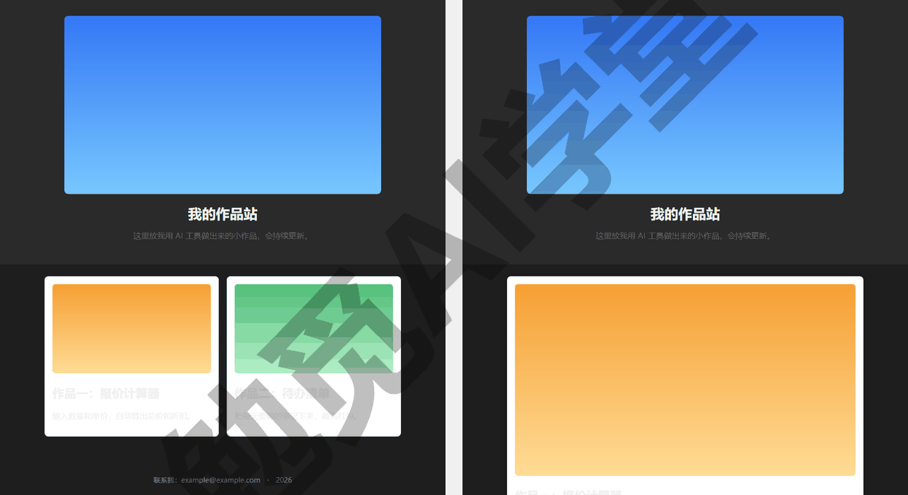

**比较并决定。** 回到作品站文件夹的终端（此时在 main 上），看全图和两个方案各改了什么：

```text
git log --oneline --graph --all
git diff main 方案A-两栏 --stat
git diff main 方案B-卡片 --stat
```

```text
* 52f8786 方案B：作品卡片加阴影
| * bbb8e28 方案A：作品两栏排列
|/
* c8a9bb3 改版：深色主题配色
* 59aa0f7 加 README：项目说明与文件说明
* 65dc6a0 首个版本：首页、样式、脚本与三张配图
 index.html | 2 +-
 style.css  | 7 +++++++
 2 files changed, 8 insertions(+), 1 deletion(-)
 style.css | 2 ++
 1 file changed, 2 insertions(+)
```

图上两条线从 c8a9bb3 分开，各走一步，main 停在分叉点。假设浏览器里看下来方案 B 更好看，合入 B：

```text
git merge 方案B-卡片
```

```text
Updating c8a9bb3..52f8786
Fast-forward
 style.css | 2 ++
 1 file changed, 2 insertions(+)
```

又是快进，因为 main 在分叉之后没有新提交。

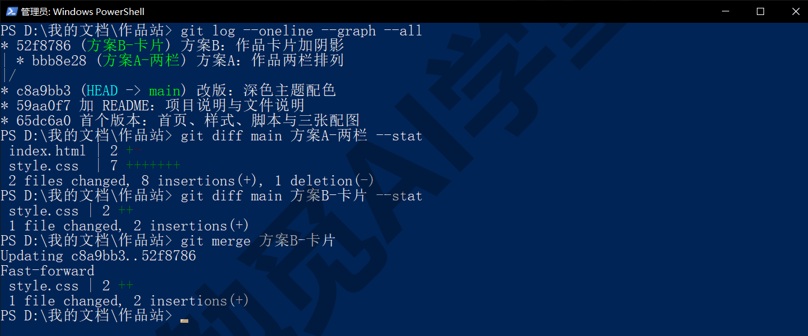

**清理现场。** 方案 B 已合入，它的工作树和分支都可以清掉；方案 A 落选，但不删，留档，以后想起来还能翻。按《冲突与工作树》5.7 节的提醒，删工作树之前确保终端没有站在那个文件夹里：

```text
git worktree remove ../作品站-方案B
git worktree list
git branch -d 方案B-卡片
git branch -m 方案A-两栏 留档-方案A-两栏
git branch
```

```text
C:/Users/你/作品站 52f8786 [main]
Deleted branch 方案B-卡片 (was 52f8786).
* main
  留档-方案A-两栏
```

作品站-方案B 文件夹已经从硬盘上消失，分支列表只剩 main 和改了名的留档分支。给落选分支加“留档-”前缀是一个简单办法，让以后看到它的人（包括你自己）知道这是有意保留的、不是忘了删。另一种做法是给它打一个标签再删分支（`git tag 落选-方案A 方案A-两栏` 后 `git branch -D 方案A-两栏`），提交仍然能通过标签找到，分支列表更干净；两种都行，本篇用改名加前缀这一种。

**这一节做了什么。** 开了三个分支、做了两次快进合并、用工作树并排比较了一次。AI 工具里“让它并行跑两个方案”的功能，背后就是这套动作：Cursor 课《子智能体、并行与工作树》里的“新建工作树”运行环境、Codex 课《自动化、Git 与远程操控》里的“新工作树”启动模式，做的都是 `worktree add` 加各自分支，只是文件夹由工具替你建、替你删。你现在手动做过一遍，再看它们的界面就知道每个按钮在动哪一层。

### 10.4 预埋两次事故

真实项目里的事故不会挑时间，这一节把两种最常见的事故各预演一次，并且故意用两种不同的办法救，之后遇到任何一种，你都有一套亲手做过的办法可以照搬。动手前先回看《撤销、还原与找回》3.1 节的六情形决策表：先判断改动走到了三区图的哪一格，再选办法。

**事故一：一次提交把样式改坏了，用 revert 撤掉。** 假设你让 AI 工具“调整一下主区域的布局”，它在 `style.css` 的 `main` 那段加了一行，你没细看就提交了。为了复现这个场景，自己动手在 `style.css` 的 `main {` 下一行加上 `display: none;`，保存，然后提交：

```text
git add -A
git commit -m "调整主区域布局"
```

刷新浏览器，页面中间的作品区整个不见了。先别急着改文件，查一下最近一次提交动了什么：

```text
git log --oneline -3
git diff HEAD~1 HEAD
```

```text
921e799 调整主区域布局
52f8786 方案B：作品卡片加阴影
c8a9bb3 改版：深色主题配色
diff --git a/style.css b/style.css
index 8f92a6e..4d8aa5d 100644
--- a/style.css
+++ b/style.css
@@ -27,6 +27,7 @@ h1 {
 }

 main {
+  display: none;
   max-width: 720px;
   margin: 24px auto;
   padding: 0 16px;
```

`HEAD~1 HEAD` 表示比较上一个提交和当前提交，只显示这一次提交的改动。问题就在绿色的加号行：`display: none;` 让整个 main 不显示。

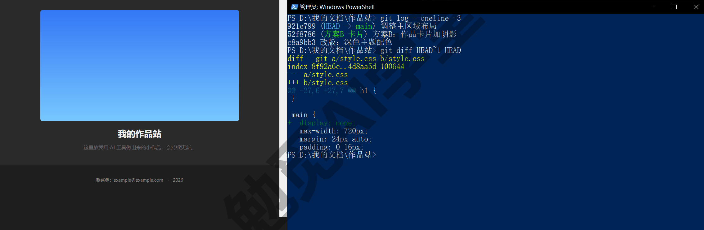

这个改动已经提交了，按六情形表属于“commit 了，还没推到 GitHub”那一行，`git reset --soft HEAD~1` 可以退掉它。但本篇故意用另一种办法，revert：

```text
git revert --no-edit HEAD
git log --oneline -4
```

```text
[main ce62aa2] Revert "调整主区域布局"
 1 file changed, 1 deletion(-)
ce62aa2 Revert "调整主区域布局"
921e799 调整主区域布局
52f8786 方案B：作品卡片加阴影
c8a9bb3 改版：深色主题配色
```

revert 不删除历史，而是新增一个“反向提交”把那一行删回去（《撤销、还原与找回》3.5 节）；输出里可能比样例多一行 Date，是这次提交的时间。刷新浏览器，作品区回来了。之所以选 revert 而不选 reset，有两个理由：一、历史里留下了“做过一次坏改动、又撤了”的完整记录，以后翻到这里能知道 `display: none` 试过、不行；二、这条分支很快就要推上 GitHub，推上去之后 reset 会改写别人已经拿到的历史，而 revert 不改写历史，什么时候用都稳妥。养成习惯：只要不确定这段历史有没有被别处拿到，撤销一律用 revert。

**事故二：一次 reset --hard 丢了半天工作，用 reflog 找回。** 先正常做两件事，模拟“半天”的工作量。第一件，在 `index.html` 里给作品二的说明补一句“支持按日期筛选”，提交。第二件，加一个作品三：把 images 里的 `work-2.png` 复制一份改名为 `work-3.png`，`index.html` 里照着作品二那段 `<section class="work">` 再复制一份，标题改成“作品三：记账小本”，图片指向 `images/work-3.png`，再提交。下面命令块里两组 add、commit 之间要先做完第二件：

```text
git add -A
git commit -m "作品二说明补充筛选功能"
git add -A
git commit -m "加作品三：记账小本"
git log --oneline -5
```

```text
f24322d 加作品三：记账小本
648dac7 作品二说明补充筛选功能
ce62aa2 Revert "调整主区域布局"
921e799 调整主区域布局
52f8786 方案B：作品卡片加阴影
```

现在制造事故。假设你只是想丢掉工作区里一点没提交的小改动，AI 工具建议“执行 `git reset --hard HEAD~2` 回到干净状态”，你没看 status 也没看清 `~2` 就答应了：

```text
git reset --hard HEAD~2
git log --oneline -3
ls images
```

```text
HEAD is now at ce62aa2 Revert "调整主区域布局"
ce62aa2 Revert "调整主区域布局"
921e799 调整主区域布局
52f8786 方案B：作品卡片加阴影
cover.png
work-1.png
work-2.png
```

两次提交从历史里消失，`work-3.png` 从文件夹里消失，`index.html` 里的作品三也没了（`ls` 在 PowerShell 里会列成一张表，看 Name 一列即可，样例只列了文件名）。`git status` 干干净净，Git 并不认为出了任何问题，因为你让它做的正是这件事。这是六情形表最后一行“提交或分支‘不见了’”。

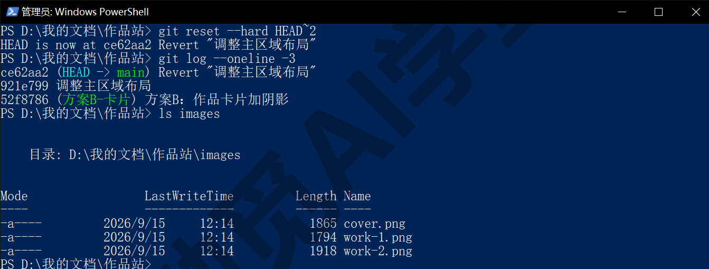

**找回。**

```text
git reflog -6
```

```text
ce62aa2 HEAD@{0}: reset: moving to HEAD~2
f24322d HEAD@{1}: commit: 加作品三：记账小本
648dac7 HEAD@{2}: commit: 作品二说明补充筛选功能
ce62aa2 HEAD@{3}: revert: Revert "调整主区域布局"
921e799 HEAD@{4}: commit: 调整主区域布局
52f8786 HEAD@{5}: merge 方案B-卡片: Fast-forward
```

reflog 记的是 HEAD 每一次移动（《撤销、还原与找回》3.7 节）。第一行是刚才那次 reset，第二行 f24322d 就是被丢掉的最新提交。回到它：

```text
git reset --hard f24322d
git log --oneline -5
ls images
```

log 里两条提交回来了，images 里 `work-3.png` 也回来了，两次提交和那张图全部找回，没有丢任何内容。

**Windows 上一个专门的坑。** 很多资料会写 `git reset --hard HEAD@{1}`，用 reflog 里的位置代替哈希。这条在 PowerShell 里直接敲会报错：

```text
error: unknown switch `e'
usage: git reset [--mixed | --soft | --hard | --merge | --keep] [-q] [<commit>]
```

原因是 `@{` 在 PowerShell 里是它自己的语法（一种叫“哈希表”的数据写法的开头，和 Git 的哈希不是一回事），PowerShell 先把这段拆散了才交给 Git，Git 收到的是残缺参数（报错里的字母可能和这里不同）。有两个解决办法：给它加单引号 `git reset --hard 'HEAD@{1}'`，或者像上面那样直接用提交编号（reflog 每行开头那串短哈希）。本课推荐用提交编号：HEAD@{1} 这种写法指的是“倒数第几次移动”，你每动一次它指的提交就变了，而提交编号永远指向同一个提交。macOS 的终端没有引号这个问题，但同样建议用提交编号。

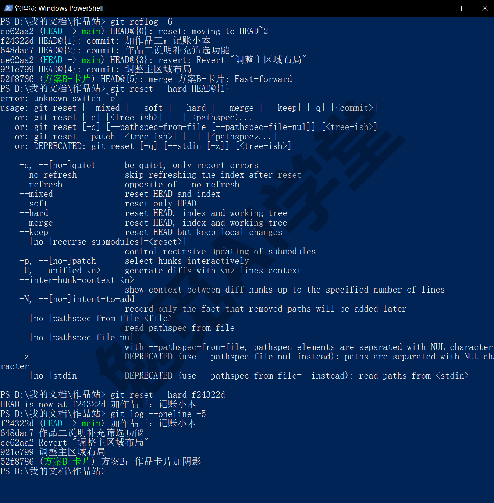

**两种补救办法各留了什么记录。** revert 在 `git log` 里留下一条 Revert 提交，谁都看得见，历史完整；reflog 找回不在 log 里留任何痕迹（历史看起来就像事故没发生过），痕迹只在 reflog 里，而且 reflog 只在本机、有保留期限。所以你可以这样选：改动已经推出去，或者你想让历史里留下出过问题的记录，用 revert；改动还只在本机、你想让历史干净，用 reset，出了差错再靠 reflog 找回。两次事故加起来，六情形表里“commit 了，还没推到 GitHub”“已经推到 GitHub”“提交或分支‘不见了’”三行涉及的办法都用过了。

### 10.5 放到云端、协作与上线

本机的部分做完了，接下来把项目推上 GitHub，用 PR 合并一条分支，打标签、发 Release、上线 Pages，最后改一处看网址自动更新。这一节网页操作多，每一步都在前面三篇讲过，这里只按项目顺序串起来，细节只指出在哪一节。

**第 1 步：在 GitHub 上建空仓库。** 按《GitHub 与远程仓库》6.3 节：右上角加号 → New repository（新建仓库），Repository name 填 `my-works`，Choose visibility（选择可见性）选 Public（公开，Pages 免费方案要求公开），Add README、Add .gitignore、Add license 三项全部保持默认、一个都不加（本机已经有了），点最下面的 Create repository（需实机验证）。仓库名建议用英文加连字符：GitHub 的仓库名不接受中文等字符，输入了会被替换成连字符（需实机验证）；本机文件夹叫“作品站”不影响，两者不需要同名。

**第 2 步：连上并推送。** 建好后页面上会显示命令，和《GitHub 与远程仓库》6.3 节一致；在作品站文件夹的终端里：

```text
git remote add origin https://github.com/你的用户名/my-works.git
git push -u origin main
git status
```

```text
To https://github.com/你的用户名/my-works.git
 * [new branch]      main -> main
branch 'main' set up to track 'origin/main'.
On branch main
Your branch is up to date with 'origin/main'.

nothing to commit, working tree clean
```

第一次推送会弹出浏览器让你授权登录（《GitHub 与远程仓库》6.7 节的凭据管理器；Mac 上没装凭据助手时会直接在终端里问用户名和令牌，那一篇 6.3 节讲过），授权一次以后不再问。刷新 GitHub 页面，8 个提交和 README 都在了。留档分支没有推上去，`push -u origin main` 只推 main，留档分支留在本机就够了；想备份它就 `git push -u origin 留档-方案A-两栏`。

**第 3 步：开一条分支做文案修订，推上去。** 团队项目里改动都走分支加 PR，个人项目也值得走一遍，练熟流程：

```text
git switch -c 文案修订
```

改两处文案，各提交一次。第一处，`index.html` 里首页简介“这里放我用 AI 工具做出来的小作品，会持续更新。”改成“这里收录我用 AI 工具做出来的小作品，持续更新。”，提交。第二处，页脚“联系我：”改成“联系方式：”，再提交（下面命令块里两组 add、commit 之间先去改第二处）。两次提交是有意的，PR 里合并方式选 Squash 时能看出效果：

```text
git add -A
git commit -m "文案：首页简介改写"
git add -A
git commit -m "文案：页脚联系方式措辞"
git push -u origin 文案修订
git log --oneline main..文案修订
```

```text
 * [new branch]      文案修订 -> 文案修订
branch '文案修订' set up to track 'origin/文案修订'.
d9ea5a0 文案：页脚联系方式措辞
3bdeda6 文案：首页简介改写
```

最后一条命令列出“在文案修订上有、在 main 上没有”的提交，这就是 PR 会包含的内容。

**第 4 步：网页上开 PR 并合并。** 按《多人协作：PR 与 Issue》7.2 节的七步来。推送后打开仓库页面，点顶部黄条上的 Compare & pull request（比较并发起 PR）。标题填“文案修订”，说明按《多人协作：PR 与 Issue》7.2 节的三件事写，也就是改了什么、为什么、怎么验证，比如“改了首页简介和页脚措辞，让语气更简洁；浏览器打开首页看这两处”，然后点 Create pull request（创建 PR）。到 Files changed（更改的文件）页签看一眼 diff，确认只有 `index.html` 的两处。回到 Conversation（对话）页签，在合并按钮旁的小箭头里选 Squash and merge（压缩合并），点下去之后再点 Confirm squash and merge（确认）（确认按钮名需实机验证）。合并后页面出现 Delete branch（删除分支）按钮，点一下把远程分支删掉。个人项目没有别人来审查，这一遍走的是流程本身；《多人协作：PR 与 Issue》7.3 节的审查环节，会在《实战三：参与开源项目 + 课程总结》里以贡献者身份在真实仓库上走一次。

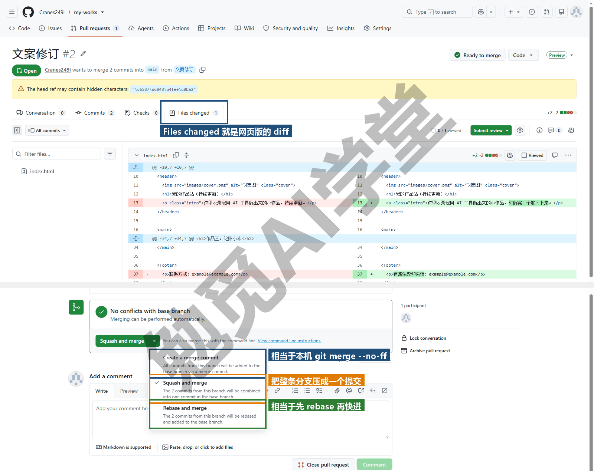

**第 5 步：回本机同步。** 网页上合并的结果在远程，本机的 main 还不知道：

```text
git switch main
git pull
git log --oneline -3
git fetch --prune
git branch -a
```

```text
Updating f24322d..1fcc783
Fast-forward
 index.html | 4 ++--
 1 file changed, 2 insertions(+), 2 deletions(-)
1fcc783 文案修订 (#1)
f24322d 加作品三：记账小本
648dac7 作品二说明补充筛选功能
 - [deleted]         (none)     -> origin/文案修订
* main
  文案修订
  留档-方案A-两栏
  remotes/origin/HEAD -> origin/main
  remotes/origin/main
```

main 上多了一个提交“文案修订 (#1)”：两次提交被压成一次，括号里是 PR 编号，这就是 Squash 的效果（《多人协作：PR 与 Issue》7.4 节）。`fetch --prune` 把网页上已删除的远程分支从本机的远程分支列表里清掉。本机的“文案修订”分支还在，删它：

```text
git branch -d 文案修订
```

```text
error: the branch '文案修订' is not fully merged
hint: If you are sure you want to delete it, run 'git branch -D 文案修订'
```

Git 拒绝了。原因是 Squash 生成的是一个新提交，Git 从提交关系上看不出“文案修订”的两个提交被合并过。Squash 合并之后一定会这样，不是出错，内容确实已经在 main 里（刚才 pull 下来的那次提交就是），放心用大写 `-D` 强删：

```text
git branch -D 文案修订
```

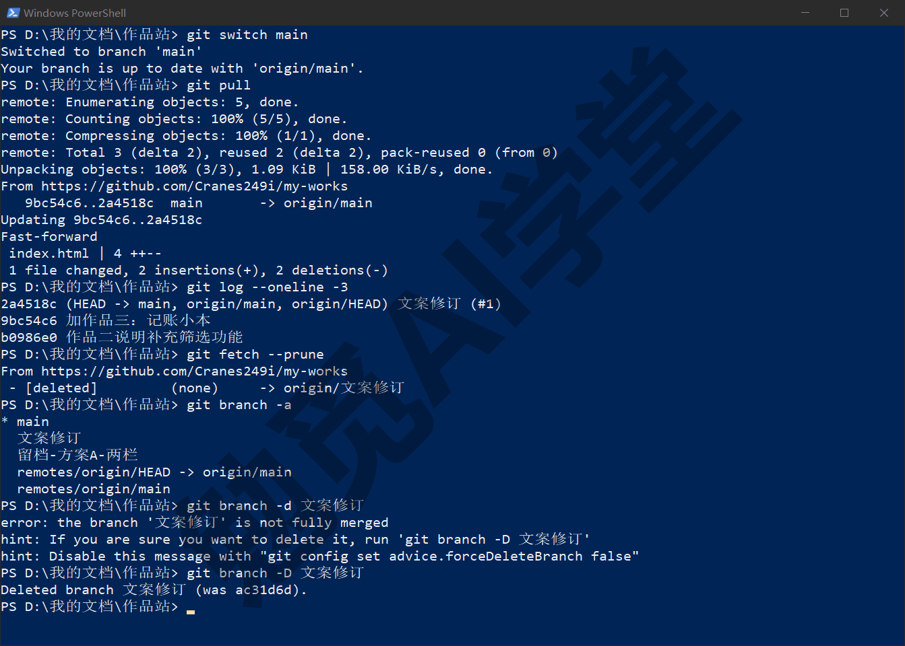

**第 6 步：打标签、发 Release。** 项目到这里可以算第一版了：

```text
git tag -a v1.0 -m "第一版上线"
git push --tags
```

```text
 * [new tag]         v1.0 -> v1.0
```

《分支与合并》4.6 节说过标签不会随普通 push 自动推送，要单独 `--tags`。然后按《GitHub 网页端：Pages 上线与发布》8.5 节的五步在网页上发 Release：点仓库首页右侧的 Releases，再点 Create a new release（创建新发布），在 Choose a tag 里选 v1.0，标题填“v1.0 第一版”，说明写这一版有什么，最后点 Publish release（需实机验证）。GitHub 会自动附上这一版源文件的压缩包；想附自己打包的文件，本篇练习任务三会做。

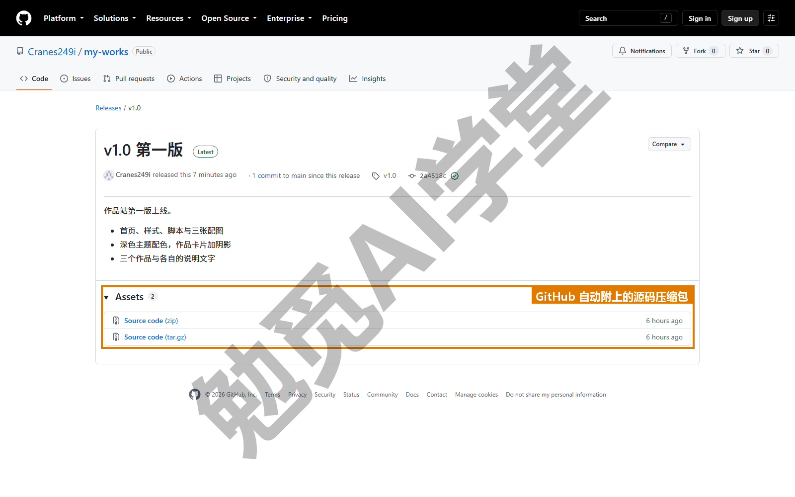

**第 7 步：Pages 上线。** 按《GitHub 网页端：Pages 上线与发布》8.4 节的五步：仓库 Settings → 左侧 Pages → Build and deployment 的 Source 选 Deploy from a branch → 分支选 main、文件夹选 `/ (root)` → Save。通常等一两分钟，Actions 页签里那条 pages build and deployment 变成绿勾后，回到 Settings → Pages，顶部出现 Your site is live at 加网址，格式是 `https://你的用户名.github.io/my-works/`（下图）。用手机或另一台电脑的浏览器打开它，作品站上线了。示例包的文件名和文件夹名都不以下划线开头，所以不需要 `.nojekyll`；如果你自己的项目有 `_assets` 之类的文件夹，按那一节加一个。

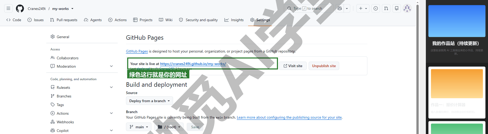

**第 8 步：改一处，再发布。** 上线之后的更新流程就是普通的“改、提交、push”，什么设置都不用再动。把 `index.html` 里的 `<h1>我的作品站</h1>` 改成 `<h1>我的作品站（持续更新）</h1>`：

```text
git add -A
git commit -m "首页标题加副标"
git push
git tag -a v1.1 -m "上线后第一次更新"
git push --tags
```

```text
   1fcc783..7211ebd  main -> main
 * [new tag]         v1.1 -> v1.1
```

过几分钟刷新网址（浏览器可能缓存旧页面，按 Ctrl+F5 强制刷新），标题变了（下图）。以后每次更新都是 add、commit、push 这三条；打不打标签，看这次更新值不值得给它一个版本号。

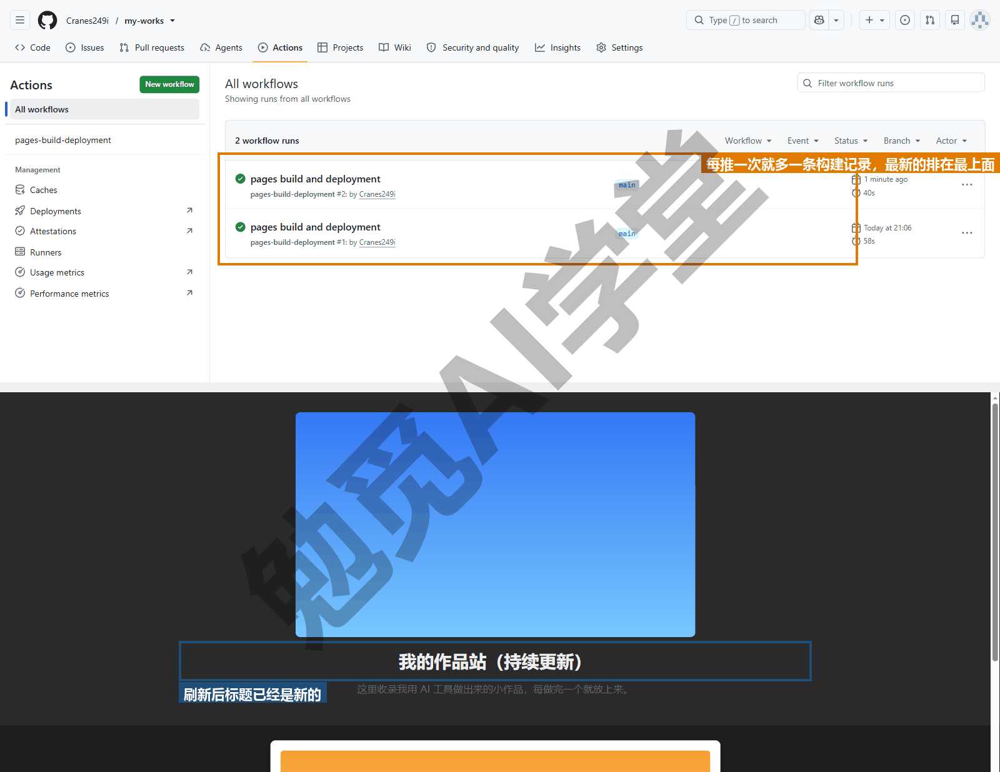

**这一节做了什么。** 从第 1 步到第 8 步，本机这边除了 add、commit、log、status、switch、branch 这些前几节已经用熟的，只多了 remote、push、pull、fetch、tag 五个，其余都在网页上点。本课把命令行放在前面讲，原因就在这里：网页上的每个按钮你都知道它对应本机的哪一步，出了问题（push 被拒、分支删不掉、Pages 不生效）也知道回哪一篇查。

### 10.6 复盘

**把全图读一遍。** 项目做完，站在作品站文件夹里：

```text
git log --oneline --graph --all
```

```text
* 7211ebd 首页标题加副标
* 1fcc783 文案修订 (#1)
* f24322d 加作品三：记账小本
* 648dac7 作品二说明补充筛选功能
* ce62aa2 Revert "调整主区域布局"
* 921e799 调整主区域布局
* 52f8786 方案B：作品卡片加阴影
| * bbb8e28 方案A：作品两栏排列
|/
* c8a9bb3 改版：深色主题配色
* 59aa0f7 加 README：项目说明与文件说明
* 65dc6a0 首个版本：首页、样式、脚本与三张配图
```

从下往上（从旧到新）读：65dc6a0 和 59aa0f7 是 10.2 节的起步；c8a9bb3 是第一轮改版，快进合并之后看不出曾经有过分支，这是快进的特点；接着历史分叉，bbb8e28 是留档的方案 A，它独自在右边一列，至今没有合入；52f8786 是方案 B，快进合入 main；921e799 和 ce62aa2 是事故一的坏提交和它的 Revert，成对留在历史里；648dac7 和 f24322d 是事故二里丢过又找回来的两次提交，历史里完全看不出它们丢过，痕迹只在 reflog；1fcc783 是 PR 的 Squash 提交，括号里的编号说明它来自网页；7211ebd 是上线后的第一次更新。标签 v1.0 在 1fcc783 上，v1.1 在 7211ebd 上；在终端里直接看 log，这些标签和 HEAD、分支名会以括号标注跟在哈希后面（《分支与合并》4.5 节），本篇的输出样例把这些括号省掉了。

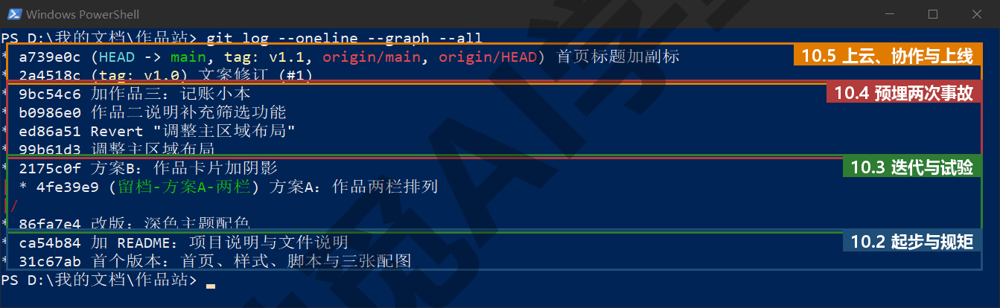

**对照验收标准。** 五条逐一核对：

```text
git log --oneline | Measure-Object -Line
git tag
git branch -a
```

main 上 10 次提交（PowerShell 的 Measure-Object 数行数；macOS 用 `git log --oneline | wc -l`）；合并 3 次（本机两次快进，加上网页上的 1 次 Squash 合并）；标签 2 个；已合并 PR 1 个（GitHub 的 Pull requests 页签 Closed 里能看到）；网址 1 个。`git log --merges` 会显示为空，因为两次本机合并都是快进、没有生成合并提交，网页的 Squash 也不生成。单人项目的历史通常就是这样一条直线加几个短分叉，不必为了“看起来有合并”去用 `--no-ff`。

**全篇用了哪些命令、各多少次。** 把 10.2～10.5 四节命令块里敲过的命令数一遍（复盘这一节和练习任务不计；status 只数写进命令块的那几次，按“每步之前先看一眼”的习惯实际会更多）：

| 命令 | 次数 | 在本篇做了什么 |
| --- | --- | --- |
| `git status` | 4 | 每步之前看清位置 |
| `git add` | 11 | 送进暂存区 |
| `git commit` | 11 | 十一次提交，含留档的方案 A 和后来被 Squash 压成一次的两次文案提交 |
| `git log` | 10 | 看历史、看分叉、看 PR 内容 |
| `git switch` | 6 | 建分支、来回切 |
| `git branch` | 7 | 看、删、改名 |
| `git merge` | 2 | 两次快进 |
| `git worktree` | 4 | 建、列、删第二个工作区 |
| `git diff` | 4 | 提交前确认、事故定位、方案对比 |
| `git revert` | 1 | 事故一 |
| `git reset` | 2 | 事故二的制造与找回（另有一次加引号前的失败尝试） |
| `git reflog` | 1 | 事故二的找回 |
| `git push` | 5 | 第一次推送、推分支、推更新、推标签两次 |
| `git pull` | 1 | 同步 PR 结果 |
| `git fetch` | 1 | 清远程分支 |
| `git remote` | 1 | 连上 GitHub |
| `git tag` | 2 | v1.0、v1.1 |
| `git init` | 1 | 只有一次 |

十八个命令，其中前六个占了全部次数的三分之二。这份清单基本就是日常用 Git 的全部：status、add、commit、log、switch、branch 天天用；merge、diff、push、pull 每天几次；worktree、revert、reset、reflog、tag 遇到才用；init、remote 一个项目只用一次。《实战三：参与开源项目 + 课程总结》12.5 节的速查卡按这个顺序排。

**如果换成你自己的项目。** 流程一字不改，只有三处会不同：忽略清单按你的项目类型写（AI 工具替你生成后自己过一遍）；两个方案的内容换成你真正在犹豫的两种做法；事故不必故意制造，真实项目里迟早会遇到，遇到时按 10.4 节的两种办法处理。练习任务一就是这件事。

**在 AI 工具和图形界面里，这一步是什么样子。** Cursor 课《实战一：小店官网》16.6 节里推上 GitHub、开 Pages 的部分，《实战三：装修预算估算器》18.4 节“工作树并行两方案”与 18.5 节“改坏一次怎么救”（用 revert 还原），Codex 课《报价计算器小应用》里用工作树并行做两个界面方案、改坏后用 Git 还原的两节，都是本篇某一节的浓缩版：那几篇里由工具替你点按钮的地方，本篇每一步都亲手敲过了。GitHub Desktop 里，本篇全部本机操作对应的按钮见《图形界面与 AI 工具里的 Git》9.7 节总对照表；Desktop 唯一做不到的是 10.4 节事故二的 reflog 找回，那一步只能回终端。

### 10.97 练习任务

方括号里的内容换成你自己的。

**任务一：用自己的一个真实项目完整重走 10.2～10.5。** 不用练习文件夹，用你正在做的、有实际内容的项目（Codex 或 Cursor 生成的网页、文档集、任何一个文件夹都行）。从建仓库和写忽略清单开始，做到 Pages 上线（如果不是网页项目，做到 Release 为止）：

```text
cd [你的项目文件夹]
git init
git status
```

完成标准：`git log --oneline` 至少 10 条、说明各能一句话看懂；至少开过 2 条分支并合并；有一个 v1.0 标签和对应的 Release；`.gitignore` 里有密钥文件和依赖文件夹的规则，`git status` 里看不到它们。

**任务二：把落选方案的分支也开成 PR，但不合并。** 把本篇留档的方案 A 分支推上 GitHub，为它开一条 PR，在说明里写清楚为什么最终没有选它，然后用 Close pull request（关闭 PR）按钮关闭而不合并（需实机验证）：

```text
git push -u origin 留档-方案A-两栏
```

完成标准：Pull requests 页签的 Closed 里有这条 PR，状态是 Closed 而不是 Merged；说明里有“为什么不选”的一段；本机 `git log --oneline --graph --all` 里方案 A 仍是一条独立的线。

**任务三：给 Release 附上打包 zip。** 用 PowerShell 把作品站打包（macOS 用 `zip -r my-works-v1.1.zip index.html style.css script.js images README.md`，同样只装这几样，不要把整个文件夹连 `.env`、node_modules 一起打进去），到 v1.1 的 Release 页面点 Edit release（编辑发布），把 zip 拖进附件区，Update release（需实机验证）：

```text
Compress-Archive -Path index.html, style.css, script.js, images, README.md `
  -DestinationPath [你的下载文件夹]\my-works-v1.1.zip
```

完成标准：Release 页面的 Assets（附件）区除了自动生成的 Source code 之外多了你的 zip；下载解压后双击 `index.html` 能打开、样式和图片齐全；zip 里没有 `.git` 文件夹。

### 10.98 本篇小结与自检

这一篇把前九篇的命令按一个项目的顺序串了一遍：建仓库之后先写忽略清单再 add，密钥和依赖文件夹绝不进历史；首个提交与 README 分开提交，一件事一次提交；用分支做改版并快进合回；用分支加工作树把两个方案并排比较、择优合入、落选留档；两次事故里，坏提交用 revert 留记录撤掉，误 reset 用 reflog 找回，PowerShell 里 `HEAD@{1}` 要加引号或直接用哈希；推上 GitHub 后用分支加 PR 走完 Squash 合并，本机 pull 之后 Squash 过的分支要用 `-D` 删；打标签、推标签、发 Release、Pages 上线，之后每次更新只是改、提交、push 三步。

可以对照下面的清单检查学习结果：

- [ ] 能默写项目级流程的七步：建仓与忽略、首提交与 README、分支改版、两方案并排、事故救回、放到云端与 PR、标签与上线
- [ ] 知道 AI 项目里 node_modules、dist、`.env`、系统缓存文件为什么不进仓库，会用 `!` 把样板文件排除在忽略之外
- [ ] 会用分支加工作树并排比较两个方案，会给落选分支留档
- [ ] 两次事故各用哪条命令救：坏提交 revert、误 reset 用 reflog 加 reset --hard 哈希；能说出两种补救办法在历史里留下的记录有什么不同
- [ ] 知道 Squash 合并后本机分支要用 -D 删，以及为什么
- [ ] 上线后再发布只需要改、提交、push，标签按需打
- [ ] 能对着 `git log --oneline --graph --all` 讲出这个项目发生过什么

完成这些内容后，你已经独立把一个项目从文件夹带到了网址。下一篇《实战二：笔记与文档库的备份同步》把对象换成你的笔记库或文档库，目标也从上线换成永久历史、云端备份和两台电脑之间的同步，会遇到与本篇不同的问题：忽略什么、附件怎么办、忘了 pull 先改了怎么解决。

### 10.99 新手常见问题

**Q1：AI 项目里到底哪些文件不该提交？**

大致分四类：

- 依赖包：node_modules、`.venv`、vendor 一类，可以按清单重新安装。
- 构建生成的文件：dist、build、out 一类，可以重新生成。
- 密钥与本机配置：`.env`、各种 `*.key`、含密码的配置文件。
- 系统与编辑器缓存：`Thumbs.db`、`.DS_Store`、`.vscode`、`.idea`、`__pycache__`。

判断标准是《GitHub 网页端：Pages 上线与发布》8.6 节的三问：会改很多次吗、Git 能看出差别吗、有多大；再加一问“里面有没有不能公开的东西”。不确定时让 AI 工具生成一份忽略清单再自己过一遍，重点核对密钥和依赖文件夹在不在里面。

**Q2：两个方案都想留，怎么办？**

三种做法按“留多久”选。短期比较，两条分支都留着，用工作树各占一个文件夹随时能看，比较完再决定；中期留档，像本篇那样给落选分支改名加“留档-”前缀，或者打一个标签再删分支；长期两者都要，说明它们不是“方案”而是两个不同的版本，考虑各自成为独立项目，或者在 main 里通过配置切换。不要做的是把两个方案的文件都放进 main 里“先留着”，那会让工作区变乱，也让以后的人分不清哪个在用。

**Q3：上线之后改坏了，怎么最快回退？**

看改坏的东西推上去没有。还没推的话，用 `git reset --soft HEAD~1` 退掉那次提交，改好再提交、再推。已经推了的话（Pages 上已经是坏版本），用 `git revert HEAD` 生成反向提交，再 `git push`，几分钟后网址恢复，这是最快也最稳妥的办法，全程不改写历史。不要在已推送的 main 上用 reset 再强推，那会让任何克隆过仓库的人（包括你的另一台电脑）下次 pull 时报错。

**Q4：Pages 上的旧版本还能看吗？**

Pages 只提供 main 分支最新提交的那一版，旧版本不会保留在网址上。要看旧版本有两个办法：本机 `git switch --detach v1.0`（《撤销、还原与找回》3.6 节）把文件夹切回那一版，双击 `index.html` 看；或者到 GitHub 的 Releases 页下载 v1.0 附带的源码压缩包，解压后打开。打标签和发 Release 的用处之一也在这里：每一版都有一个能拿回来的固定名字。

**Q5：GitHub 仓库名能用中文吗？本机文件夹名要和它一样吗？**

仓库名建议用英文、数字和连字符，GitHub 会把中文等字符替换掉（需实机验证），而且仓库名会出现在网址里，英文也方便告诉别人。本机文件夹名和仓库名不需要相同，本篇的文件夹叫“作品站”、仓库叫 my-works，Git 只认 `git remote add` 时给的网址；克隆时 `git clone 网址 文件夹名` 也可以另起本机名字（《GitHub 与远程仓库》6.5 节）。
