## 实战二：笔记与文档库的备份同步

上一篇《实战一：AI 项目从零到上线》把一个网页项目带到了网址上。这一篇换一种对象：你的笔记库、课程文档、工作资料，也就是一个以 Markdown 文本为主、夹着一些图片和附件、每天都在改的文件夹。它要的不是上线，而是三件事：任何一篇笔记都能回到任何一天的样子；有一份放在别处的完整备份；两台电脑之间能同步。Git 能同时满足这三件，但笔记库和代码项目有几处不一样的地方：该忽略什么、附件怎么办、两台电脑忘了先拉取会怎样、自动提交插件在背后做了什么。这一篇专门讲这些。全程用《认识 Git 与装好》到《GitHub 与远程仓库》的命令，已讲过的细节只写出篇名与节号。

先看做出来的样子（动图）：每天收工一次提交，云端有一份私有备份，另一台电脑一拉就同步，任何一天的笔记都能拿回来。

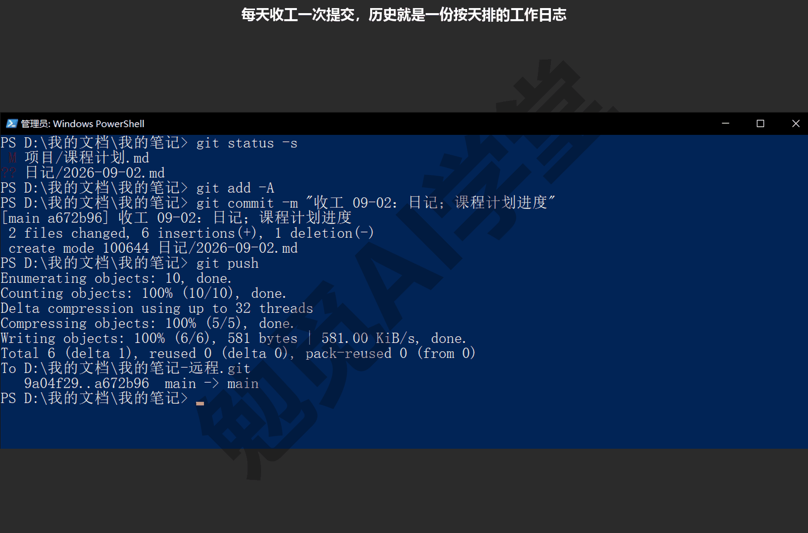

这篇文章的实操内容不需要花钱：GitHub 免费账号可以建私有仓库，Obsidian 本体免费；11.5 节提到的 Obsidian 官方同步是付费服务，本篇只作说明，不用它。

### 11.1 场景与目标

**三类典型对象。** 你手上的“笔记与文档库”多半是下面三类之一：

- **Obsidian 库**：一个文件夹，里面是成百上千个 .md 文件、一个存设置的 `.obsidian` 隐藏文件夹、一个放图片的附件文件夹。
- **课程或写作文档**：几十个 .md 或 .docx，配图放在同级文件夹里。
- **工作资料**：合同、报表、会议记录，格式混杂，Word、Excel、PDF 这类二进制文件占比高。

三类都是文本为主、天天改、丢了损失很大；不一样的是第三类里二进制文件多，Git 对它们只能存整份、看不出差异，《GitHub 网页端：Pages 上线与发布》8.6 节讲过。本篇以第一类为主线演示，后两类只在讲附件的处理办法时补一句。

**要解决的三个问题。**

- **后悔药**：“这篇笔记上周是什么样子”“我把哪一段删了”，任何一天都能翻回去，而且是永久的，不像 Obsidian 自带的“文件恢复”只保留几天的快照，也不像网盘的历史版本有数量上限。
- **备份**：电脑丢了、硬盘坏了，从远程仓库 `git clone` 一次，整个库连同全部历史原样回来。
- **同步**：家里和公司各一台电脑，两边都能改，改完合到一起。

前两件一台电脑就能做，第三件才需要两台。

**Git 和网盘怎么分工。** 很多人已经在用 OneDrive、iCloud、坚果云同步笔记，会问还要不要 Git。两者不是替代关系，本课的建议是各管一件事：网盘同步文件本身，自动、实时、手机也能看，适合“此刻最新的那一份”；Git 记历史，每一次有意义的改动都留一个可回退的点，适合“任何一天的那一份”。所以理想的安排是笔记库既在 Git 里，也可以在网盘里，但要守住下面这条硬规矩。

**`.git` 文件夹不要放进网盘同步的文件夹里。** 这是本篇最要紧的一件事，因为两者的工作方式是冲突的。《第一个仓库：提交与历史》2.2 节说过，Git 的全部历史存在 `.git` 文件夹里成千上万个小文件中，每次提交会新增几个、改写几个。网盘是按文件逐个同步的，它不知道这些小文件之间有关联：两台电脑先后各提交一次，网盘会把两边的 `.git` 内容“合”到一起，存内容的对象文件可能只传了一半、记录暂存区的索引文件可能被另一台电脑的版本覆盖、有的网盘还会生成“文件名-电脑名”式的冲突副本。结果是仓库内部前后不一致，表现为 `git status` 报错、`git log` 缺提交、或者 `git fsck` 报出类似下面的话（这是一个对象文件被损坏后的输出）：

```text
error: object file .git/objects/4b/cb01757f51d24abe7a1aeb82c0cb885c42bfdf is empty
error: 4bcb01757f51d24abe7a1aeb82c0cb885c42bfdf: object corrupt or missing
missing blob 4bcb01757f51d24abe7a1aeb82c0cb885c42bfdf
```

到这一步，修复往往比重新克隆一份更费时间。网盘同步导致的其他报错原文以你的实际情况为准（需实机验证）。所以本篇的安排是：笔记库放在本机一个不被网盘同步的文件夹里（Windows 上是 `C:\Users\你\我的笔记`，macOS 上是 `/Users/你/我的笔记`），两台电脑之间的同步交给 Git 的远程仓库；如果你必须把库留在网盘文件夹里，11.99 节的 Q4 给了把 `.git` 挪到网盘之外的办法。

**做完之后要有什么。** 做完这一篇，你手上应该有四件东西：笔记库有一个私有远程仓库；两台电脑（或本机两个文件夹模拟的两台）之间来回同步过；亲手解过一次 Markdown 文本的冲突；从历史里找回过一篇笔记的旧版本。四件都在本机能完成，你没有第二台电脑的话，用第二个文件夹代替，命令完全相同。

### 11.2 建仓与忽略

**先看一眼库里有什么。** 在资源管理器里打开库文件夹（或在终端里进入它敲 `ls -Force`，隐藏文件会一起列出来），一个 Obsidian 库通常由这几部分组成：几个笔记文件夹（本篇示例是 日记、项目、读书），一个附件文件夹，一个 `.obsidian` 文件夹，可能还有一个 `.trash` 文件夹（Obsidian 删除笔记时的回收站）。`.obsidian` 里的文件分两种：一种是你的设置，如 `app.json`（编辑器设置）、`appearance.json`（外观）、plugins 里各插件的配置，这些你通常会希望两台电脑一致，应该进仓库；另一种是每台电脑各自的状态，如 `workspace.json` 和 `workspace-mobile.json`（当前打开了哪些标签页、窗格怎么分），每次开关 Obsidian 都在变、两台电脑必然不同，进仓库只会天天冲突。

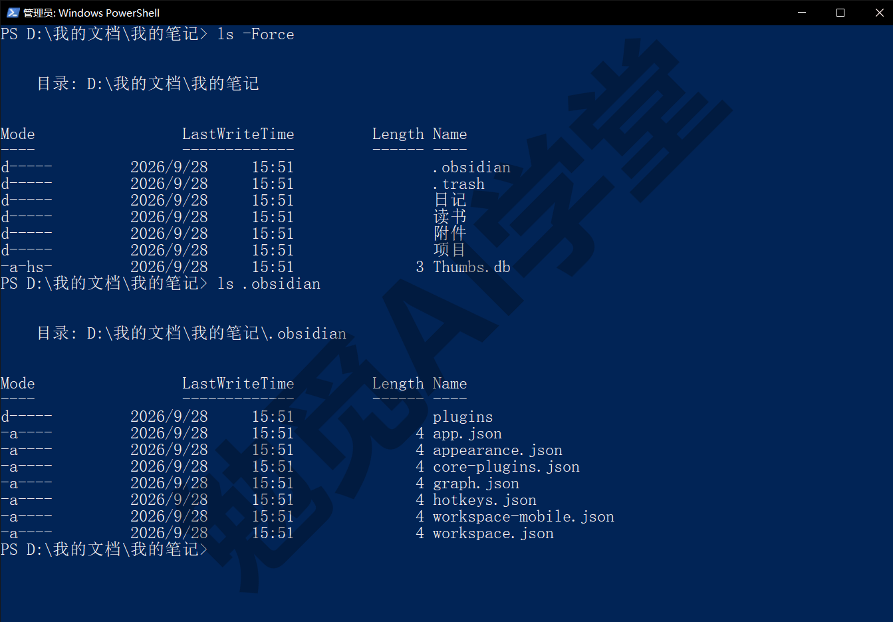

**第 1 步：初始化并看状态。** 在库文件夹里打开终端：

```text
git init
git status -s
```

```text
?? .obsidian/
?? .trash/
?? Thumbs.db
?? 日记/
?? 读书/
?? 附件/
?? 项目/
```

七项里，`.trash` 是回收站，`Thumbs.db` 是 Windows 缩略图缓存，都不该进仓库；`.obsidian` 里只有一部分该进；附件文件夹要看里面有什么再决定。

**第 2 步：写 `.gitignore`。** 在库根目录新建 `.gitignore`，内容可以直接复制：

```text
# Obsidian 每台电脑各不相同的窗口布局与缓存
.obsidian/workspace.json
.obsidian/workspace-mobile.json
.obsidian/cache
.trash/

# 系统杂物
.DS_Store
Thumbs.db

# 大附件走网盘，仓库只留图片
附件/*.m4a
附件/*.mp4
附件/*.mov
附件/*.zip
```

第一组是 Obsidian 的“每台电脑不同”的文件，第二组是操作系统杂物，第三组是附件的处理办法，下一段会讲。如果你的库里还装了会生成大量缓存的插件（有些插件在 `.obsidian/plugins/插件名/` 下放索引文件，几 MB、而且每次启动都变），把那个文件夹也加进来，判断办法是《GitHub 网页端：Pages 上线与发布》8.6 节的三问：会改很多次吗、Git 能看出差别吗、有多大。

**附件怎么处理。** 图片（截图、示意图，通常几十到几百 KB）建议进仓库：它们是笔记的一部分，克隆到另一台电脑时笔记里的图才能正常显示。录音、视频、压缩包、大 PDF 不进仓库：体积大、改一次整份变、Git 存着没有意义，而且 GitHub 对单文件和仓库体积有上限（《GitHub 网页端：Pages 上线与发布》8.6 节）。不进仓库的附件放网盘，笔记里写一句“录音见网盘某文件夹”即可。上面 `.gitignore` 第三组按扩展名排除，是最简单的写法；如果你习惯把大附件单独放一个文件夹（比如“大附件”），直接忽略整个文件夹更清楚。工作资料类的库里 .docx、.xlsx 多，它们可以进仓库，Git 会完整保存每个版本，只是看不出改了哪一段；但几十 MB 的单个文件要按那一节的三问想清楚再决定。

**第 3 步：确认忽略生效，首个提交。**

```text
git status -s
git add .
git status
git commit -m "笔记库建仓：现有笔记、图片与设置"
```

```text
?? .gitignore
?? .obsidian/
?? 日记/
?? 读书/
?? 附件/
?? 项目/
```

`.trash` 和 `Thumbs.db` 消失了；`.obsidian` 还在，但 add 之后 status 里只有 `app.json`、`appearance.json`、`core-plugins.json`、`graph.json`、`hotkeys.json` 这几份设置和 plugins 下的配置，没有 `workspace.json`；附件里只有 `截图1.png`，5 MB 的 `会议录音.m4a` 没进来。提交后的输出是：

```text
[main (root-commit) 9a04f29] 笔记库建仓：现有笔记、图片与设置
 11 files changed, 32 insertions(+)
 create mode 100644 .gitignore
 create mode 100644 .obsidian/app.json
 create mode 100644 .obsidian/appearance.json
 create mode 100644 .obsidian/core-plugins.json
 create mode 100644 .obsidian/graph.json
 create mode 100644 .obsidian/hotkeys.json
 create mode 100644 .obsidian/plugins/obsidian-git/data.json
 create mode 100644 日记/2026-09-01.md
 create mode 100644 读书/笔记方法.md
 create mode 100644 附件/截图1.png
 create mode 100644 项目/课程计划.md
```

哈希、文件名以你的库为准。一个已经用了几年、几千篇笔记的库，首个提交会有几千个 create mode 行，是正常的。

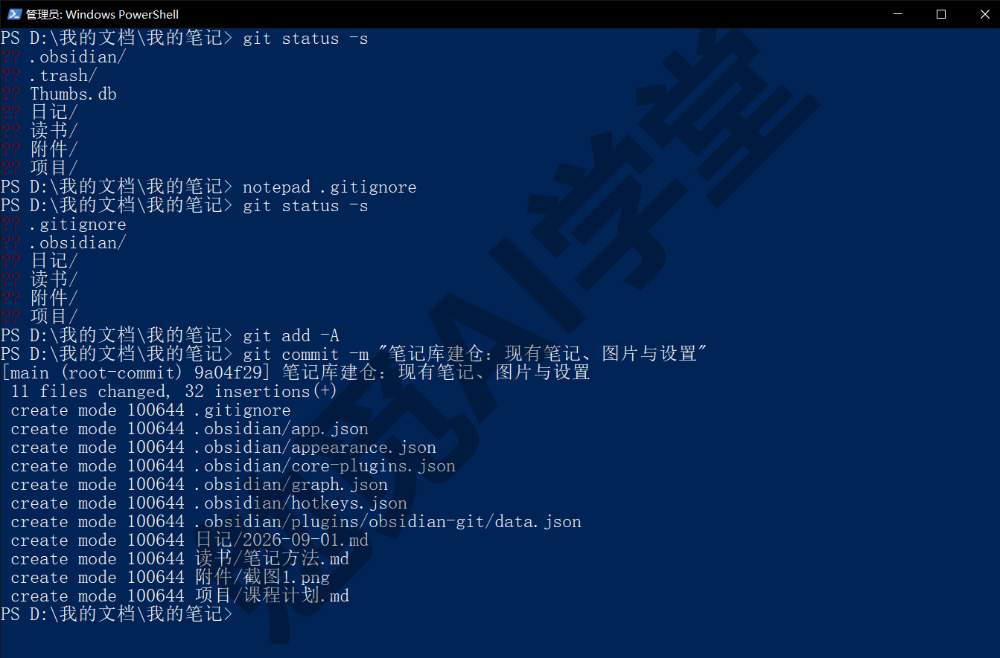

**第 4 步：私有远程。** 笔记是私人的，远程仓库要选私有。做法和《GitHub 与远程仓库》6.3 节一样：在 GitHub 页面右上角点加号、选 New repository，唯一的区别是 Choose visibility（可见性）选 Private（私有）、不选 Public（下图）；那一篇 6.6 节讲过私有仓库只有你（和你邀请的人）能看到，免费账号的私有仓库数量以 GitHub 当前说明为准。

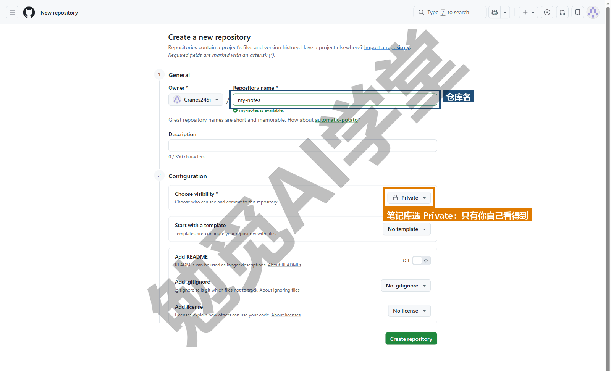

建好后，回到终端把本机仓库连上它并推送：

```text
git remote add origin https://github.com/你的用户名/my-notes.git
git push -u origin main
```

```text
 * [new branch]      main -> main
branch 'main' set up to track 'origin/main'.
```

到这里三个目标里的“备份”已经完成：远程上有了完整的库和历史。之后每次 push 都是在更新这份备份。

**已经在用网盘的库怎么办。** 如果你的库现在就在 OneDrive 文件夹里，先把整个库文件夹移出来（剪切到 `C:\Users\你\我的笔记`），在 Obsidian 里用“打开其他仓库”重新指向新位置（Obsidian 的中文界面把库叫“仓库”，和 Git 的仓库不是一回事；按钮名以实际界面为准），再从第 1 步开始。网盘里的那份可以删掉，或留着当第二份备份，但不要在网盘那份里 `git init`。

### 11.3 手动节律

笔记库和代码项目最大的不同是“改动是连续的”：写笔记不会有明确的“做完一件事”的时刻。所以节律要你自己定，定了就照做。

**什么时候提交。** 有三个时刻你要提交。每天收工时一次，这是底线，保证每天有一个可以回去的点；每次要做大改之前一次，比如准备重排整个文件夹结构、批量改名、让 AI 工具批量整理笔记之前，先提交一次，改坏了随时回去；每次换电脑之前一次，提交并 push，另一台电脑才拿得到。每写一篇笔记就提交一次没有必要，一天一两次足够。

**提交说明怎么写。** 笔记库的改动多而杂，说明写“日期 + 动了哪几处”最实用，以后翻历史时一眼能定位到某一天：

```text
git status -s
git add -A
git commit -m "收工 09-02：日记；课程计划进度"
git push
```

```text
 M 项目/课程计划.md
?? 日记/2026-09-02.md
[main a672b96] 收工 09-02：日记；课程计划进度
 2 files changed, 6 insertions(+), 1 deletion(-)
 create mode 100644 日记/2026-09-02.md
   9a04f29..a672b96  main -> main
```

第一条 `status -s` 是《第一个仓库：提交与历史》2.11 节那三句话里的“先 status”：看一眼今天动了什么，有没有不该进去的文件（比如一个新拖进来的 100 MB 视频还没写进忽略清单），再 add。`-A` 把新增、修改、删除一起暂存；笔记库里删笔记、改名是常事，`git add .` 在根目录时效果相同，两个都可以。

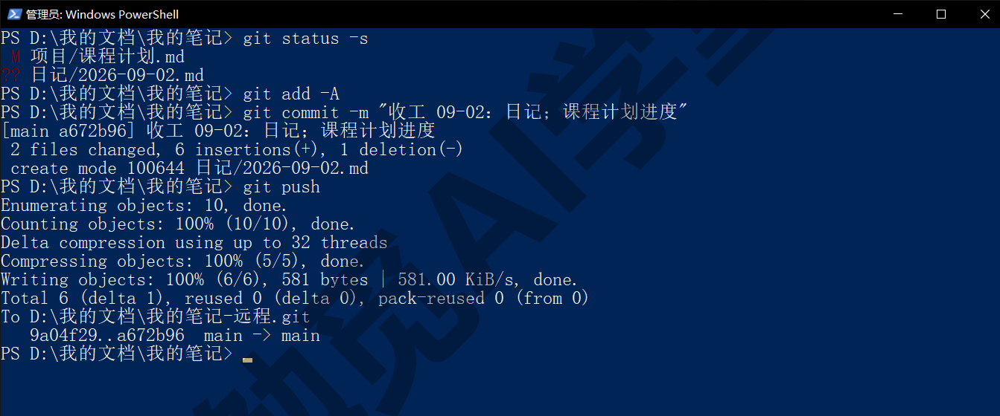

**每天收工时复制粘贴这一行。** 把上面四条命令存成一行，以后每天收工时复制粘贴就行。PowerShell 里几条命令放在一行要用分号连接（《图形界面与 AI 工具里的 Git》9.9 节讲过 PowerShell 5.1 不认 `&&`）：

```text
git status -s; git add -A; git commit -m "收工 09-02：改了什么"; git push
```

macOS 的终端用分号或 `&&` 都行。如果这一天没改任何东西，commit 会提示 nothing to commit，不是错误，忽略即可。

**大改之前的那一次。** 比如，你打算让 Cursor 把“读书”文件夹里三十篇笔记统一加上标签。动手前：

```text
git status -s
git add -A
git commit -m "大改前：读书文件夹加标签之前的状态"
```

改完看结果，满意就再提交一次“读书文件夹统一加标签”；不满意，按《撤销、还原与找回》3.2 节 `git restore .` 一条命令让所有已跟踪的文件回到大改前（AI 新建的文件不受影响，要用那一篇 3.9 节的 `git clean` 另外清），比在 Cursor 里逐个撤销快得多，也不依赖工具自己的检查点。这个办法就是《图形界面与 AI 工具里的 Git》9.9 节“三层”里的第二层，也就是永久提交，比第一层的工具检查点可靠。

**把节律变成习惯的办法。** 有三个小技巧帮你把它变成习惯：

- 把收工那一行命令存在笔记库的一篇“Git 备忘”笔记里，Obsidian 里一搜就有；
- 在 Obsidian 里装一个插件，让状态栏显示当前分支和还有几个文件没提交（Obsidian 课《同步与备份全解》有介绍，本课不展开），看到数字就知道该提交了；
- 干脆用 11.5 节讲的自动提交插件替你定时提交，但要先读完 11.5 节知道它的坑。

**提交多了会不会乱。** 不会。几百次“收工”提交在 `git log` 里就是一份按天排列的工作日志，翻起来反而方便；需要找某篇笔记的历史时用 11.6 节的按文件筛选，和提交总数无关。唯一要避免的是说明全写成“更新”“备份”，那样日志就失去了定位作用。

### 11.4 第二台电脑

**第 1 步：在第二台电脑上克隆。** 装好 Git、做完《认识 Git 与装好》1.7 节的配置后，在想放库的位置打开终端：

```text
git clone https://github.com/你的用户名/my-notes.git 我的笔记
```

私有仓库克隆时会弹出浏览器要求登录授权（《GitHub 与远程仓库》6.7 节的凭据管理器），授权一次即可。克隆下来的文件夹里有全部笔记、图片、`.obsidian` 里的设置，但没有 `workspace.json`，因为它被忽略了，Obsidian 第一次打开这个库时会自动生成一个，效果正是想要的：设置一致，窗口布局各自的。在 Obsidian 里“打开其他仓库”选这个文件夹即可开始用。没有第二台电脑的读者，在本机另一个位置克隆一份（比如 `C:\Users\你\公司电脑-我的笔记`），下文所有“公司电脑”上的操作都在这个文件夹里做，效果完全一样。

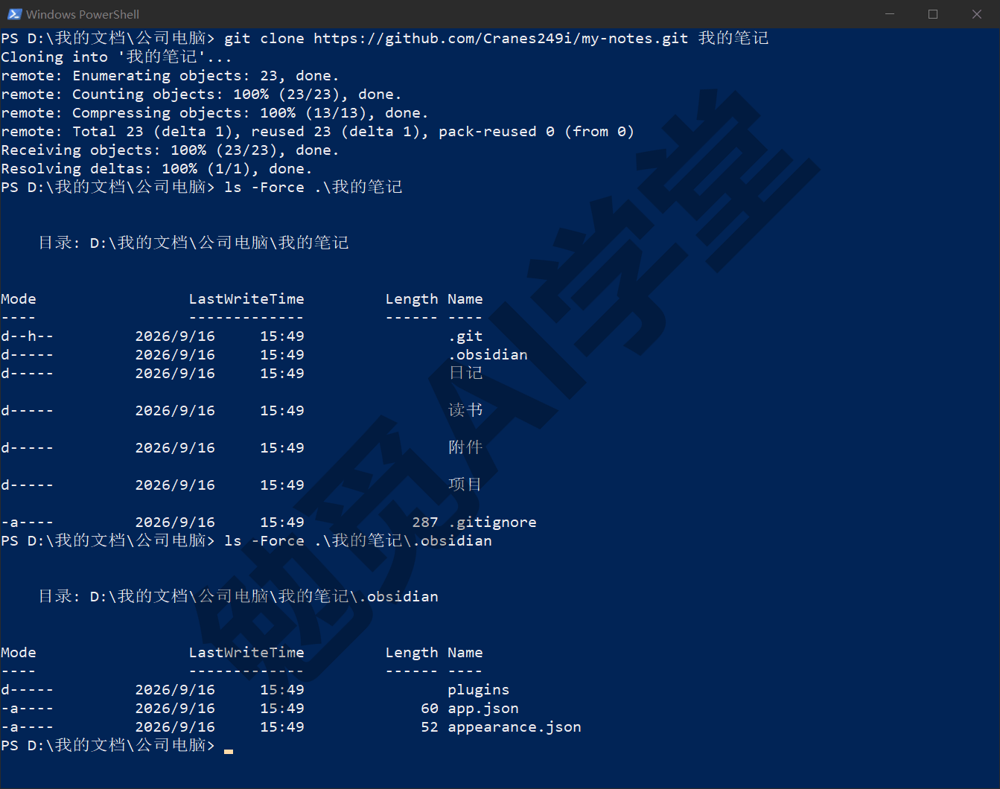

**第 2 步：在公司改完推上去，回家先拉取。** 在公司电脑上写一篇日记，收工提交并 push；回到家，第一件事是：

```text
git pull
```

```text
Updating a672b96..492e383
Fast-forward
 日记/2026-09-03.md | 3 +++
 1 file changed, 3 insertions(+)
 create mode 100644 日记/2026-09-03.md
```

公司写的日记出现在家里的文件夹里，Obsidian 会自动刷新文件列表。这就是同步的全部：一边 push，另一边 pull。只要记住一条顺序，**开始改之前先 pull，改完 push**，两台电脑之间就不会出现冲突。下面看看忘了这条顺序会怎样，分两种情形。

**忘了 pull 先改了（一）：还没提交就想 pull。** 公司电脑上改了“课程计划”的进度并推上去了；回家没 pull 就打开 Obsidian 也改了同一篇的进度那一行，还没提交，想起来该 pull：

```text
git status -s
git pull
```

```text
 M 项目/课程计划.md
error: Your local changes to the following files would be overwritten by merge:
	项目/课程计划.md
Please commit your changes or stash them before you merge.
Aborting
```

Git 拒绝了：pull 要改写 `课程计划.md`，而你在工作区里对它还有没提交的改动，直接覆盖会丢。按它说的做，有两个办法：提交（下面用这个办法），或者《撤销、还原与找回》3.8 节 `git stash` 收起来、pull、再 pop。

**忘了 pull 先改了（二）：提交了再 pull，遇到冲突。**

```text
git add -A
git commit -m "收工 09-04（家）：课程计划进度"
git push
```

```text
 ! [rejected]        main -> main (non-fast-forward)
error: failed to push some refs to 'https://github.com/你的用户名/my-notes.git'
hint: Updates were rejected because the tip of your current branch is behind
hint: its remote counterpart. If you want to integrate the remote changes,
hint: use 'git pull' before pushing again.
```

push 被拒：远程上有公司电脑的提交，本机不知道（《GitHub 与远程仓库》6.4 节的 non-fast-forward）。按提示 pull（Mac 上如果先看到 divergent branches 的提示，按《GitHub 与远程仓库》6.4 节设一次 `pull.rebase false` 再 pull）：

```text
git pull
```

```text
Auto-merging 项目/课程计划.md
CONFLICT (content): Merge conflict in 项目/课程计划.md
Automatic merge failed; fix conflicts and then commit the result.
```

两台电脑改了同一篇的同一行，Git 没法替你决定要哪个。这就是《冲突与工作树》5.2 节亲手制造过的那种冲突，只是这次是真实场景。`git status` 会显示 both modified: `项目/课程计划.md`。用 Obsidian 或记事本打开这篇笔记：

```text
# Git 课程计划

<<<<<<< HEAD
进度：第 4 篇写完
=======
进度：第 4 篇写完，第 5 篇开头
>>>>>>> a6f57a5a7dc0d50046fa5d76885d3bc42a8b0923

下一步：第 4 篇分支与合并
```

《冲突与工作树》5.3 节讲过怎么读：`<<<<<<< HEAD` 到 `=======` 之间是本机（家里）的版本，`=======` 到 `>>>>>>>` 之间是远程（公司）的版本。这里公司那边的版本比较新，保留它、删掉三行标记和家里那一行，文件变成正常的样子，然后：

```text
git add 项目/课程计划.md
git commit -m "合并公司电脑的改动：课程计划进度取公司版"
git push
git log --oneline --graph -5
```

```text
*   4b748b4 合并公司电脑的改动：课程计划进度取公司版
|\
| * a6f57a5 收工 09-04（公司）：课程计划进度
* | 4bd4e93 收工 09-04（家）：课程计划进度
|/
* 492e383 收工 09-03（公司）：日记
* a672b96 收工 09-02：日记；课程计划进度
```

图上两台电脑各走一步、在合并提交处汇合。以后公司电脑 pull 一次，两边就又一致了。Markdown 笔记的冲突就是这样解：看两段、留一段或拼一段、删标记、add、commit、push，全程用不了几分钟。

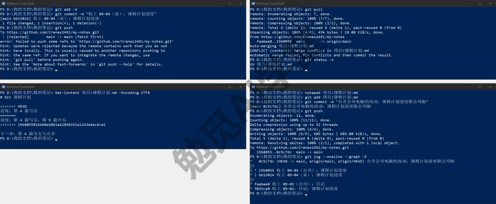

**Windows 上特有的一个坑：文件正被别的程序打开着。** Obsidian、Word、部分同步软件会一直占着打开的文件。这时 pull 或切分支要改写那个文件，Git 可能报：

```text
error: unable to unlink old '读书/笔记方法.md': Invalid argument
Switched to branch '试验'
M	读书/笔记方法.md
```

注意第二行，操作“成功”了，但第三行说那个文件处于修改状态，也就是 Git 没能替换它，文件里还是旧内容。这种状态下再想切回去会被拒（“would be overwritten by checkout”）。处理办法是先关掉占着文件的程序（或在 Obsidian 里关掉那篇笔记），然后 `git restore 读书/笔记方法.md` 让文件回到当前分支应有的样子，再做本来要做的操作。预防办法是 pull 之前先把 Obsidian 关掉，或者至少关掉正在编辑的笔记。这一条也收进《实战三：参与开源项目 + 课程总结》12.6 节的排错表。

**三台以上电脑或加上手机。** 规则不变：每台开始前 pull、结束后 push。设备越多，忘 pull 的概率越大、冲突越常见，所以 11.5 节的自动拉取值得开；手机的情况见 11.5 节末尾。

### 11.5 自动提交插件背后的命令与坑

**它是什么。** Obsidian 有一个社区插件叫 Git（常被叫作 Obsidian Git），能按设定的间隔自动做“提交并同步”（插件里叫 Commit-and-sync）：把库里所有改动 add、用带时间的说明 commit、pull、再 push；也能在 Obsidian 启动时自动 pull。插件的安装与每个设置项在 Obsidian 课《同步与备份全解》里讲，本课只讲它背后跑的是什么命令、会踩什么坑，因为出了事，插件的提示往往看不懂，回到命令行才看得清。

**它背后跑的命令。** 一次“提交并同步”等于你在终端里敲：

```text
git add -A
git commit -m "vault backup: 2026-09-05 09:00:00"
git pull
git push
```

说明里的时间是插件填的（默认格式类似 vault backup 加日期时间，以插件当前版本为准），间隔以分钟为单位，还可以把提交、拉取、推送分别设不同的间隔，或者设成“文件有改动后多少分钟再提交”（需实机验证）。所以它做的事和你每天收工时敲的那四条命令一模一样，只是改成每隔一段时间自动做一次。历史里会出现一长串 vault backup 提交，每条几个文件，这是正常形态：

```text
* 8edd815 vault backup: 2026-09-05 09:10:00
* 4b748b4 合并公司电脑的改动：课程计划进度取公司版
```

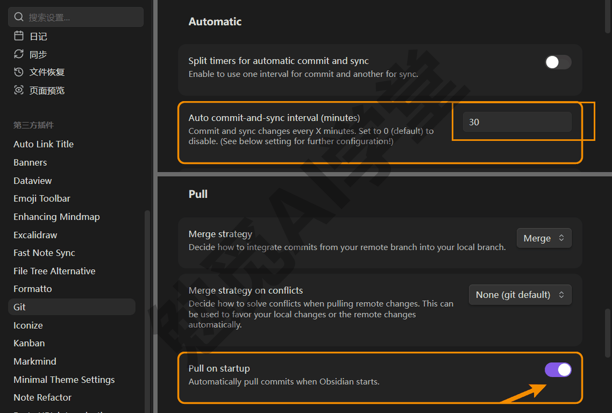

**它的坑：冲突标记会被写进笔记并提交。** 这是你开自动提交之前最需要知道的一件事。假设两台电脑都开着自动提交，都改了“笔记方法”这篇的末尾。公司那边先自动提交并推上去；家里这边自动提交时轮到 pull：

```text
Auto-merging 读书/笔记方法.md
CONFLICT (content): Merge conflict in 读书/笔记方法.md
Automatic merge failed; fix conflicts and then commit the result.
```

插件会弹出提示并生成一篇列出冲突文件的笔记（形态以插件为准）；在你处理完之前，后面每一轮自动提交都不会真的提交，只会提示 Did not commit, because you have conflicts in 1 file. Please resolve them and commit per command.（需实机验证）。容易出问题的是处理这一步。自动提交会等你处理完，插件的手动“提交”命令却不会拦你——如果你只是打开那篇笔记看了看、没把三行标记删干净，就顺手点了一次提交（或者自己 `git add` 了它），带着标记的笔记就会被提交，Git 不会阻止你提交带标记的文件（需实机验证）：

```text
[main 9da36f6] vault backup: 2026-09-05 09:20:00
```

于是带着 `<<<<<<<` 的笔记被提交、被推送，公司电脑下一次 pull 时也拿到了这份：

```text
# 笔记方法

卡片式笔记：一卡一个想法。

<<<<<<< HEAD
家里补：每周回顾一次。
=======
公司补：每天回顾一次。
>>>>>>> 20885669aa0640b0360d11824dd4f1ce2141d6db
```

它已经不再是一个“正在进行的冲突”，而是一篇内容里恰好有几行奇怪符号的普通笔记，`git status` 干干净净。这是它比普通冲突更隐蔽的地方。

**怎么清。** 先找出库里所有带标记的笔记：

```text
git grep -n "<<<<<<<" -- "*.md"
```

```text
读书/笔记方法.md:5:<<<<<<< HEAD
```

`git grep` 只搜已被 Git 跟踪的文件，比资源管理器搜索快得多。如果你用的是 Windows PowerShell 的蓝底窗口，这一行开头的文件名可能整段看不见，只剩 `:5:<<<<<<< HEAD`。原因是 Git 默认把文件名印成洋红色，而这个窗口里的洋红和背景是同一个颜色。给命令加上 `--no-color`，写成 `git grep -n --no-color "<<<<<<<" -- "*.md"`，文件名就会照常显示。逐篇打开，按《冲突与工作树》5.3 节的读法留下想要的内容、删掉标记，然后正常提交推送：

```text
git add -A
git commit -m "清理冲突标记：笔记方法"
git push
```

再跑一次 `git grep`，没有任何输出，就说明都清完了。

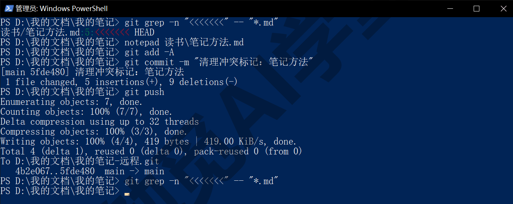

**怎么避免。** 有四条办法：

- 开启“启动时拉取”，每次打开 Obsidian 先把远程拿下来，冲突会少很多；
- 不要在两台电脑上同时开着同一个库编辑，收工 push 之后再去另一台；
- 把自动提交的间隔设长一点（几十分钟而不是几分钟），减少两边同时提交的机会；
- 看到插件的冲突提示立刻处理，标记删干净了再提交。

以上做到前两条就够用。

**用不用自动提交。** 它的好处是你不用记；坏处是提交说明全是自动填的日期时间、失去了 11.3 节“按天定位”的作用，以及上面的冲突标记问题。本课的建议是：你只在一台电脑上用库，可以开自动提交，当作定时备份；两台以上电脑，先用 11.3 节的手动节律把顺序养成习惯，再考虑开自动拉取加手动提交的组合。哪种都行，前提是知道它背后是这四条命令。

**手机上的一句实话。** 这个插件在手机版 Obsidian 上也能装，但插件作者在说明里明确写了手机端非常不稳定：手机上没有真正的 Git，插件用的是一套用 JavaScript 另写的、功能不全的替代品，不支持 SSH、受手机内存限制、库大了会在克隆或拉取时崩溃或卡住（以插件当前说明为准）。所以手机端的做法是：手机只看不改，或者手机用别的同步方式（Obsidian 官方同步、网盘）而电脑端用 Git 记历史，两者不冲突，只要 `.git` 不在网盘同步范围内。

### 11.6 从历史里找回

这一节带你完成第一个目标“后悔药”。下面分四种情形，都以“读书”和“日记”里的文件为例。

**这篇笔记上周是什么样子。** 先看它的历史：

```text
git log --oneline -- 日记/2026-09-01.md
```

```text
00bcb8a 收工 09-02：整理日记
9a04f29 笔记库建仓：现有笔记、图片与设置
```

两个横线后面跟文件路径，表示只列涉及这个文件的提交（《第一个仓库：提交与历史》2.6 节）。路径用正斜杠、相对库根目录写，PowerShell 里也这样写。想直接看某一版的内容，不改任何文件：

```text
git show 9a04f29:日记/2026-09-01.md
```

```text
# 2026-09-01

- 上午：整理课程大纲
- 下午：读《笔记方法》第 3 章
```

冒号前是提交、冒号后是路径，输出的就是那一版的全文。想看那一版和现在差在哪：

```text
git diff 9a04f29 HEAD -- 日记/2026-09-01.md
```

红色减号行 `- 下午：读《笔记方法》第 3 章` 就是后来删掉的那条。

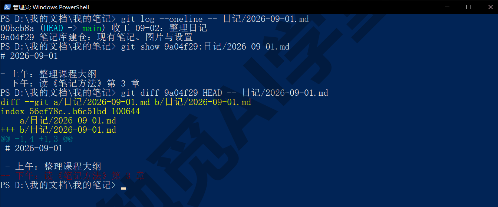

**把旧版本拿回来。** 确定要那一版，用《撤销、还原与找回》3.6 节的 `restore --source`：

```text
git restore --source=9a04f29 日记/2026-09-01.md
git status -s
```

```text
 M 日记/2026-09-01.md
```

文件变回了那一版，status 显示为已修改，因为它只是工作区里的一次改动，你可以再编辑，满意后提交：

```text
git add -A
git commit -m "恢复 09-01 日记的下午一条"
```

历史里既有“整理”那次也有“恢复”这次，谁都没被抹掉。只想拿回旧版里的某一段而不是整篇，就用 `git show` 打开旧版、把那几行复制过来，不必整篇恢复。

**误删了一篇笔记，还没提交。** 在 Obsidian 里删了“笔记方法”（Obsidian 删除笔记默认移到系统回收站，也可以在设置里改成移到库里的 `.trash`；本例假设已经彻底删除）：

```text
git status -s
git restore 读书/笔记方法.md
git status -s
```

```text
 D 读书/笔记方法.md
```

第一条 status 里的 D 表示工作区里它不见了；restore 之后 status 为空，文件回来了，《撤销、还原与找回》3.2 节的 restore 对删除同样有效。

**误删了一篇笔记，而且已经提交推送了。** 几天后才发现“读书”文件夹整理时把它删掉了：

```text
git log --oneline -- 读书/笔记方法.md
```

```text
6875d61 整理读书文件夹
9a04f29 笔记库建仓：现有笔记、图片与设置
```

最上面一条就是删掉它的提交。文件在那次提交的前一个提交里还在，所以从“那个提交的前一个”恢复，`~1` 表示前一个：

```text
git restore --source=6875d61~1 读书/笔记方法.md
git status -s
git add -A
git commit -m "找回误删的笔记方法"
```

```text
?? 读书/
[main 337b61b] 找回误删的笔记方法
 1 file changed, 5 insertions(+)
 create mode 100644 读书/笔记方法.md
```

status 里显示为 `??`（未跟踪）而不是 M，因为在当前版本里这个文件本来不存在；提交后它重新成为库的一部分，连同它删除前的全部内容。

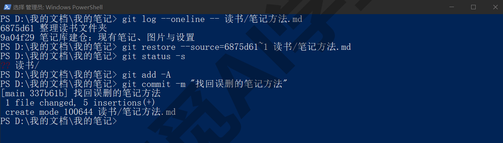

**只记得内容，不记得哪篇、哪天。** `-S` 后面跟一段文字，列出“这段文字的出现次数发生变化”的提交，也就是它被加进来或被删掉的那几次：

```text
git log --oneline -S "每周回顾" -- 读书/笔记方法.md
```

```text
5fde480 清理冲突标记：笔记方法
8edd815 vault backup: 2026-09-05 09:10:00
```

去掉 `-- 路径` 就在整个库里搜。找到提交后用 `git show 哈希:路径` 看内容、用 `restore --source` 拿回来，和前面一样。文件改过名的，在 `git log` 后加 `--follow` 能跨过改名追到旧名字的历史。

**和 Obsidian 自带的“文件恢复”怎么分工。** Obsidian 的核心插件“文件恢复”会每隔几分钟给改过的笔记存一份快照，保留几天（以设置为准）。它适合“五分钟前不小心删了一段”这种即时后悔；Git 适合“上个月那版”“去年这篇是什么样子”，永久、跨电脑、连删掉的文件也能找回。两者同时开没有冲突：一个管几分钟前的事，一个管几个月、几年前的事。

### 11.7 复盘与规矩

**这一篇做了什么。** 建仓时定了忽略清单（Obsidian 的窗口布局、回收站、系统缓存、大附件），首个提交推到私有远程完成了备份；定了收工节律与说明格式；第二台电脑克隆之后走了一遍 push、pull，故意忘了 pull 制造并解决了一次 Markdown 冲突；看清了自动提交插件背后的四条命令和它把冲突标记写进笔记的坑，学会了用 `git grep` 找标记；最后从历史里找回了旧版本和误删的笔记。后悔药、备份、同步三个目标都亲手验证过。

**一页备份规则。** 把全篇的规矩整理成一张表，可以复制进笔记库里的“Git 备忘”：

| 事项 | 规则 | 出事查哪里 |
| --- | --- | --- |
| 库放哪 | 本机非网盘同步的文件夹；`.git` 绝不进网盘 | 11.1、11.99 Q4 |
| 忽略什么 | `.obsidian/workspace*.json`、`.trash`、系统缓存、大附件 | 11.2 |
| 附件去向 | 图片进仓库；录音、视频、压缩包走网盘，笔记里留一句去处 | 11.2 |
| 提交节律 | 每天收工、每次大改前、每次换电脑前；说明写“日期 + 改了什么” | 11.3 |
| 两台电脑顺序 | 开始改之前 pull，改完 push；同一时间只在一台上编辑 | 11.4 |
| 冲突了 | 看两段、留一段、删标记、add、commit、push | 11.4、《冲突与工作树》5.4 |
| 自动提交 | 知道它是 add、commit、pull、push 四条；开“启动时拉取”；定期 `git grep "<<<<<<<"` | 11.5 |
| 找旧版本 | `log -- 文件` 定位，`show 哈希:路径` 看，`restore --source` 拿回 | 11.6 |
| 网盘与 Git | 网盘同步“此刻这一份”，Git 记“任何一天那一份”；手机走网盘或只看不改 | 11.1、11.5 |

**网盘与 Git 各管什么，再说一遍。** 网盘负责让最新的文件出现在每个设备上，包括手机；Git 负责让每一天的版本都能找回来，并在电脑之间提供可控的同步。两者可以并存，条件只有一个：`.git` 文件夹不在网盘同步范围内。做到这一点，你既有网盘的方便，也有 Git 的可靠。

**这套做法适用的范围。** 不只是 Obsidian。任何以文本为主的文件夹，课程稿、小说、博客源文件、配置文件、工作笔记，都可以照 11.2～11.6 节的做法管理，区别只在忽略清单的内容。以二进制为主的文件夹（照片库、视频素材）不适合，那是网盘和专门备份工具的领域，《认识 Git 与装好》1.4 节讲过 Git 不擅长什么。

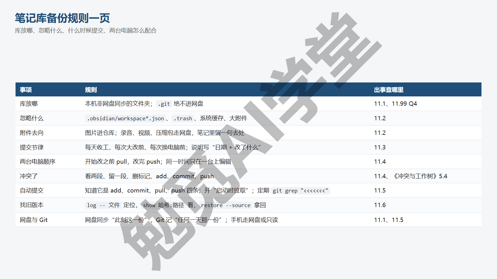

**在 AI 工具和图形界面里，这一步是什么样子。** Obsidian 课《同步与备份全解》讲同步的几种方案时，Git 方案的插件安装与设置项留在那一篇；本篇讲的是那些设置背后运行的命令，以及插件不会替你处理的事（冲突标记、`.git` 与网盘的关系）。GitHub Desktop 打开笔记库同样能用：Changes 页签就是 11.3 节的 status 加 add，Summary 框加 Commit to main 是 commit，工具栏的 Push origin 与 Pull origin（远程没有新提交时这个按钮显示为 Fetch origin）对应 11.4 节的 push 与 pull，History 页签点某次提交能看到那一次改了什么，见《图形界面与 AI 工具里的 Git》9.3 节与 9.5 节；11.6 节看整份旧文件的 `show`、`restore --source` 和 `log -S` 要回终端。

### 11.97 练习任务

方括号里的内容换成你自己的。

**任务一：给自己的笔记库或文档库建仓并推到私有远程。** 用你真实在用的库（先按 11.1 节确认它不在网盘同步文件夹里），写好忽略清单，做首个提交，推到一个新建的私有仓库：

```text
cd [你的笔记库文件夹]
git init
git status -s
```

完成标准：`git status -s` 里看不到 `workspace.json`、回收站和大附件；GitHub 上的仓库页面显示 Private 标记；`git status` 显示 Your branch is up to date with 'origin/main'。

**任务二：制造一次冲突并解掉。** 在第二台电脑（或本机第二个克隆文件夹）和第一台上改同一篇笔记的同一行，两边都提交，一边先 push，另一边 push 被拒后 pull、解冲突、提交、推送：

```text
git pull
git status
git add [冲突的那篇笔记]
git commit -m "合并另一台电脑的改动：[改了什么]"
git push
```

完成标准：pull 时出现过 CONFLICT (content)；解决后的笔记里没有 `<<<<<<<`；`git log --oneline --graph -5` 里能看到一次分叉与汇合；另一台电脑 pull 之后两边内容一致。

**任务三：找回一篇笔记两周前的版本。** 挑一篇最近改过多次的笔记，找出两周前左右的那次提交，看它当时的内容，把它恢复出来，然后决定是保留恢复的版本还是撤回：

```text
git log --oneline -- [笔记路径]
git show [哈希]:[笔记路径]
git restore --source=[哈希] [笔记路径]
```

完成标准：`git show` 显示出了旧版全文；restore 之后 `git status -s` 里该文件为 M；你做出了保留（提交）或撤回（`git restore [笔记路径]`）的决定，而且 `git status` 最终干净。

### 11.98 本篇小结与自检

这一篇把笔记库或文档库交给 Git 管理：`.git` 不进网盘同步文件夹，网盘管此刻的文件、Git 管每一天的历史；建仓先写忽略清单（窗口布局、回收站、系统缓存、大附件），图片进仓库、大附件走网盘，远程选私有；提交节律是每天收工、大改前、换电脑前，说明写日期加改了什么；两台电脑的顺序是先 pull 再改、改完 push，忘了会遇到“local changes would be overwritten”或 push 被拒后的冲突，按看两段、留一段、删标记、add、commit、push 解决；自动提交插件背后是 add、commit、pull、push 四条命令，它会把冲突标记提交进笔记，用 `git grep "<<<<<<<"` 找出来清掉，手机端不稳定；从历史找回用 `log -- 文件`、`show 哈希:路径`、`restore --source`，已提交的误删从删除提交的前一个恢复，`-S` 按内容搜。

可以对照下面的清单检查学习结果：

- [ ] 能说出 `.git` 为什么不能放进网盘同步文件夹，以及网盘与 Git 各管什么
- [ ] 知道 Obsidian 库里哪些文件该忽略、附件怎么分流
- [ ] 定了自己的提交节律和说明格式，收工那一行命令存好了随时能复制
- [ ] 会两台电脑的同步顺序，忘了 pull 的两种情形各怎么处理
- [ ] 冲突标记进了笔记（无论是手动还是自动提交造成的）会找、会清
- [ ] 知道自动提交插件背后的四条命令和手机端的限制
- [ ] 会看某篇笔记的历史、看旧版全文、恢复旧版、找回已提交的误删、按内容搜提交
- [ ] Windows 上文件被程序占着导致 pull 或切分支报 unable to unlink 时知道怎么处理

完成这些内容后，你的笔记库已经有了永久历史、云端备份和跨电脑同步。下一篇《实战三：参与开源项目 + 课程总结》走出自己的仓库：给一个不属于你的公开项目提交一次被合并的改动，把 Fork、PR、审查、Issue 以协作者身份完整走通，然后把全课的命令整理成一页速查卡和一张排错表。

### 11.99 新手常见问题

**Q1：Git 和网盘同时用会冲突吗？**

分两种情况。库文件夹本身在网盘里、`.git` 也在里面：会出问题，而且出得很隐蔽，网盘按文件同步 `.git` 里的几千个小文件，两台电脑先后提交后仓库内部会不一致，表现为报错、缺提交、`git fsck` 报对象损坏（11.1 节）。库在网盘之外、用 Git 远程同步：完全没有冲突，两者各管一件事。想两全的办法见 Q4。

**Q2：附件太多，仓库会很大吗？**

看附件类型。截图和示意图通常几十到几百 KB，几百张也就几十 MB，进仓库没有问题；录音、视频、压缩包常常几十 MB 一个，进仓库会让每次克隆都要拖着它们，而且删掉也不会变小（《GitHub 网页端：Pages 上线与发布》8.6 节讲过原因）。所以 11.2 节按扩展名把大附件忽略掉、放网盘。已经进了仓库的大附件，还没推的按《GitHub 网页端：Pages 上线与发布》8.6 节 reset 掉，推过的接受它，或者用 git filter-repo 一类的历史改写工具（那一节提到过它，本课不展开）。判断标准始终是三问：会改很多次吗、Git 能看出差别吗、有多大。

**Q3：手机上能用吗？**

能看、不建议改。Obsidian 手机版装 Git 插件后可以克隆和拉取，但插件作者明确说明手机端非常不稳定（没有真正的 Git、受内存限制、库大了会崩溃、不支持 SSH，以插件当前说明为准）。实用的组合是：电脑端用 Git 记历史和同步，手机端用网盘或 Obsidian 官方同步看和改；如果手机改了，回到电脑上由电脑那边提交进 Git。只要 `.git` 不在网盘同步范围内，两套并存没有问题。

**Q4：库已经放在 OneDrive 里了，再用 Git 行不行？**

最稳的做法是把库移出 OneDrive（11.2 节末尾）。如果库必须留在网盘里（比如手机要靠网盘看它），有一个办法：把 `.git` 放到网盘之外的位置，库文件夹里只留一个指向它的小文件。先在网盘之外建好一个放历史的文件夹（比如 `C:\Users\你\git仓库`，Git 只会创建最后一级的 `我的笔记.git`，上一级不存在会报 Invalid path），然后在库文件夹里执行：

```text
git init --separate-git-dir=C:\Users\你\git仓库\我的笔记.git
```

之后库文件夹里的 `.git` 不再是文件夹，而是一个一行的文本文件，写着历史真正存放的路径；所有 git 命令照常在库文件夹里敲，网盘同步的只是笔记本身和那个小文件。已经在库里 `git init` 过的，在库文件夹里再执行一次这条命令即可，Git 会把 `.git` 搬到指定位置。macOS 上把路径换成 `/Users/你/git仓库/我的笔记.git`。这个办法两台电脑都要各自做一次（各自的 `.git` 存放位置互不相干），历史仍然靠 push 和 pull 同步，不靠网盘。

**Q5：已经用了自动提交，历史全是 vault backup，还有救吗？**

有，而且不必改。历史的用处是内容能找回，说明只是辅助定位。找某篇笔记的旧版本用 `git log -- 文件路径` 按文件筛，找某段内容用 `-S` 按内容搜（11.6 节），都不依赖说明写了什么。想以后的说明有意义，可以保留自动拉取、关掉自动提交，改用 11.3 节收工那一行命令手动提交；或者在做了值得记的改动时额外手动提交一次，写清说明，两种提交在历史里并存没有问题。
