## 实战三：参与开源项目 + 课程总结

前两篇实战都在你自己的仓库里。这一篇走出去：给一个不属于你的公开仓库提交一次改动，并且让它被合并。整个过程是 Fork、克隆、开分支、改、推到自己的 Fork、向原仓库开 PR、被要求修改、再推、被批准、被合并、同步回自己的 Fork、用 PR 关闭一个 Issue，全程以协作者的身份走一遍。这是《多人协作：PR 与 Issue》讲过的流程第一次在真实关系里使用。后半篇是全课总结：功能对照表逐项核对、三区图与六情形决策表回放、一页命令速查卡、一张排错速查表、Git 不擅长什么与 Git 3.0 带来的变化、以后到哪里查。GitHub 网页上的按钮名以英文写出并附中文释义，形态以你看到的页面为准。

先看做出来的样子（动图）：别人的仓库里多了一条你提的、被合并的 PR，README 改正了，参与者名单里有你的名字，一个 Issue 随之自动关闭。

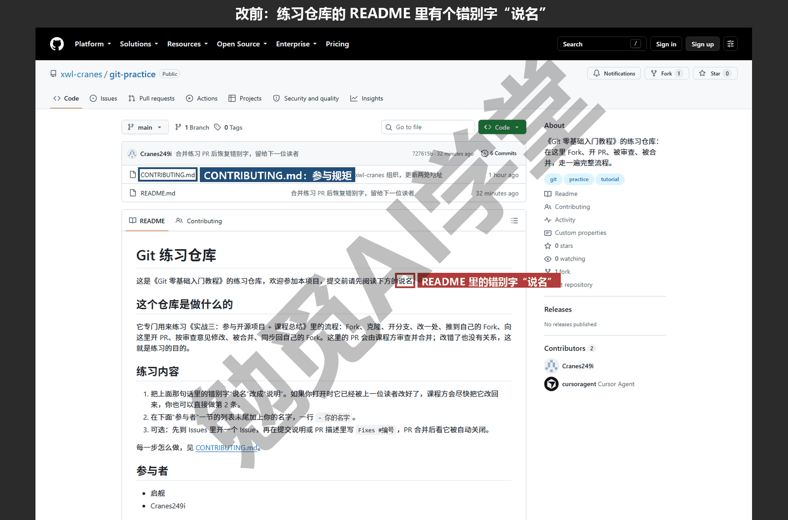

这篇文章的实操内容不需要花钱：Fork、PR、Issue 都是 GitHub 免费账号自带的功能，课程练习仓库公开，参与不收费。

### 12.1 目标：一次被合并的改动

**要做成什么。** 做完这一篇，你手上要有三件东西：一个被合并进别人仓库的 PR；一个被这个 PR 自动关闭的 Issue；12.5 节的功能对照表全部打勾。第一件是主线，后两件顺路完成。

**在哪个仓库上练。** 你有三个选择，按推荐顺序排：

- **课程练习仓库**：课程为本篇准备了一个公开仓库 `https://github.com/xwl-cranes/git-practice`，里面有一份故意留着错别字的 README 和一份参与指南 `CONTRIBUTING.md`；在这里练，你的 PR 会被课程方审查、提出修改意见、然后合并，本篇 12.3 节的审查环节就是按它写的。
- **GitHub 官方的练习仓库 octocat/Spoon-Knife**：GitHub 自己的 Fork 教程用的就是它，任何人都可以 Fork 并开 PR，但它不接受合并，只能练到“PR 提出”为止，12.3 节的后半段看不到效果。
- **一个你真正在用的开源项目**：几乎所有项目的文档里都能找到错别字或过时的说明，修一处文档是开源项目最欢迎的第一次贡献；但真实项目的维护者可能几天甚至几周才回应，也可能不合并，把它当作练完前两种之后正式的第一次贡献。

**动手前的三条礼仪。** 真实项目里的 PR 是在占用别人的时间，所以：

- 先读仓库里的 `CONTRIBUTING.md`（参与指南）或 README 里的“如何参与”一节，有的项目要求先开 Issue 再开 PR、要求提交说明用英文、要求签署协议；
- 改动要小而明确，第一次贡献改一处错别字、补一句缺失的说明就好，不要连带把整篇重排一遍；
- 说明写清楚，用《多人协作：PR 与 Issue》7.2 节的三件事：改了什么、为什么、怎么验证。

练习仓库对这三条没有硬性要求，但从第一次就照做，习惯会跟着你去真实项目。

**这一遍和《多人协作：PR 与 Issue》7.6 节有什么不同。** 那一节讲的是 Fork 工作流的命令和网页步骤本身；这一篇的对方是一个真实的仓库和真实的审查者，你的改动会被真的审、真的合。命令一条都没有新的，新的是节奏：推上去之后要等，等来的可能是修改意见，改完再推，PR 会自动更新。这种“一来一回”是协作的常态，也是本篇要让你亲身体验的部分。

**需要准备什么。** 你需要一个已经完成两步验证的 GitHub 账号（《GitHub 与远程仓库》6.2 节）；本机 Git 配好署名（《认识 Git 与装好》1.7 节，注意 user.email 要和 GitHub 账号的邮箱对应，或者用《GitHub 与远程仓库》6.2 节讲的 noreply 邮箱，否则提交不会计入你的贡献记录）；一个放克隆的文件夹位置（Windows 上如 `C:\Users\你\开源`，macOS 上如 `/Users/你/开源`）。全程在网络正常时约半小时，等待审查的时间另算。

**流程七步，先看全图。** Fork 到自己账号；克隆自己的 Fork 到本机；给本机仓库加上原仓库作为 upstream；开分支改动并推到自己的 Fork；向原仓库开 PR；按审查意见在同一分支追加提交；被合并后同步 upstream 回自己的 Fork 并清理分支。12.2 节做前五步，12.3 节做后两步，12.4 节把 Issue 接进来。

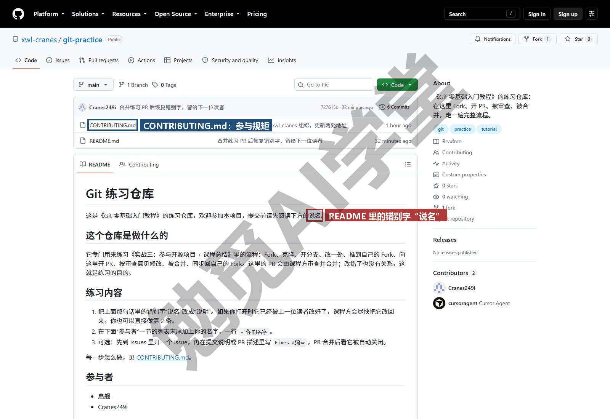

### 12.2 Fork、克隆、开分支、改、推、开 PR

**第 1 步：Fork。** 打开练习仓库页面，点右上角的 Fork（复刻）按钮，进入标题为 Create a new fork（新建复刻）的页面：Owner 是你的账号，Repository name 默认与原仓库同名，下方 Copy the main branch only（只复制 main 分支）默认勾选，保持即可，然后点 Create fork。几秒后页面跳到你账号下的同名仓库，仓库名下方有一行“forked from 原仓库”。《多人协作：PR 与 Issue》7.6 节讲过：Fork 是把别人的仓库复制一份到你的账号下，你对这份有完全的权限，原仓库你没有推送权限，所以改动必须先进你的 Fork，再通过 PR 请求原仓库接收。

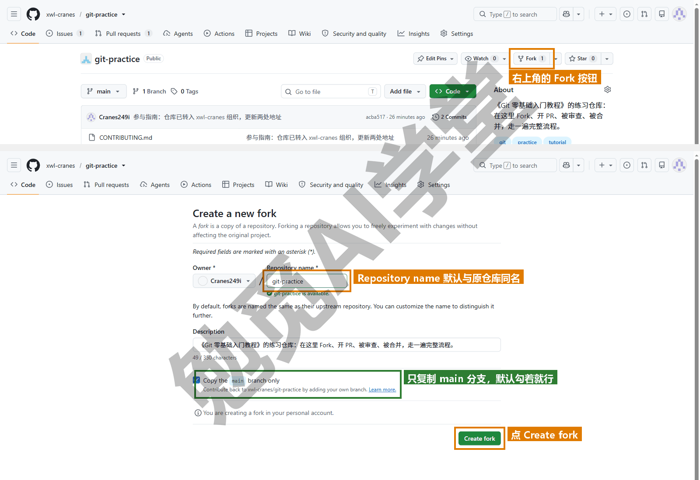

**第 2 步：克隆自己的 Fork。** 在你的 Fork 页面点绿色 Code 按钮，复制 HTTPS 网址（注意是你账号下的网址，不是原仓库的）（需实机验证），在本机放克隆的位置打开终端：

```text
git clone https://github.com/你的用户名/git-practice.git
cd git-practice
git remote -v
```

```text
origin	https://github.com/你的用户名/git-practice.git (fetch)
origin	https://github.com/你的用户名/git-practice.git (push)
```

此刻本机只认识一个远程 origin，指向你的 Fork。

**第 3 步：加上 upstream。** 原仓库在本机需要一个名字，习惯叫 upstream（上游）：

```text
git remote add upstream https://github.com/xwl-cranes/git-practice.git
git remote -v
git fetch upstream
git branch -a
```

```text
origin	https://github.com/你的用户名/git-practice.git (fetch)
origin	https://github.com/你的用户名/git-practice.git (push)
upstream	https://github.com/xwl-cranes/git-practice.git (fetch)
upstream	https://github.com/xwl-cranes/git-practice.git (push)
 * [new branch]      main       -> upstream/main
* main
  remotes/origin/HEAD -> origin/main
  remotes/origin/main
  remotes/upstream/HEAD -> upstream/main
  remotes/upstream/main
```

两个远程各有各的用处：origin 是你能推的地方，upstream 是你只取不推的地方（你没有权限推，推了也会被拒）。`fetch upstream` 把原仓库的分支取到本机，之后 `upstream/main` 这个名字就代表“原仓库现在的 main”。如果用 GitHub Desktop 克隆 Fork，它会问这份 Fork 是用来贡献给原项目还是自己用，选“贡献给原项目”时它替你加好 upstream（《图形界面与 AI 工具里的 Git》9.5 节）。

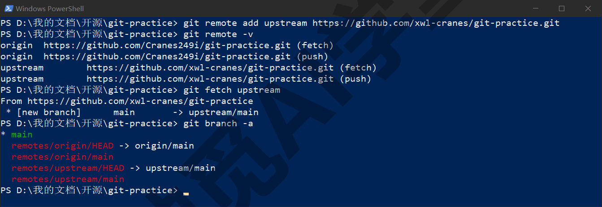

**第 4 步：开分支、改、提交。** 不要直接在 main 上改，你的 Fork 的 main 应该一直和 upstream 的 main 保持一致，改动放在分支上，PR 才干净：

```text
git switch -c 修正错别字
```

打开 `README.md`，找到那处错别字（课程练习仓库里是“说名”应为“说明”），改正，保存。提交前看一眼改了什么：

```text
git diff
```

```text
-这是《Git 零基础入门教程》的练习仓库，欢迎参加本项目，提交前请先阅读下方的说名。
+这是《Git 零基础入门教程》的练习仓库，欢迎参加本项目，提交前请先阅读下方的说明。
```

只有一行减一行加，正是想要的。提交：

```text
git add README.md
git commit -m "修正 README 里的错别字：说名→说明"
```

说明写清改的是哪个文件的哪个字，审查的人不必打开 diff 就知道这次提交是什么。

**第 5 步：推到自己的 Fork。**

```text
git push -u origin 修正错别字
git log --oneline upstream/main..修正错别字
```

```text
 * [new branch]      修正错别字 -> 修正错别字
branch '修正错别字' set up to track 'origin/修正错别字'.
4100c95 修正 README 里的错别字：说名→说明
```

推的目标是 origin（你的 Fork），不是 upstream。第二条命令列出“在你的分支上有、在原仓库 main 上没有”的提交，这就是 PR 将要包含的内容，开 PR 之前看一眼，确认没有多余的提交混进来。

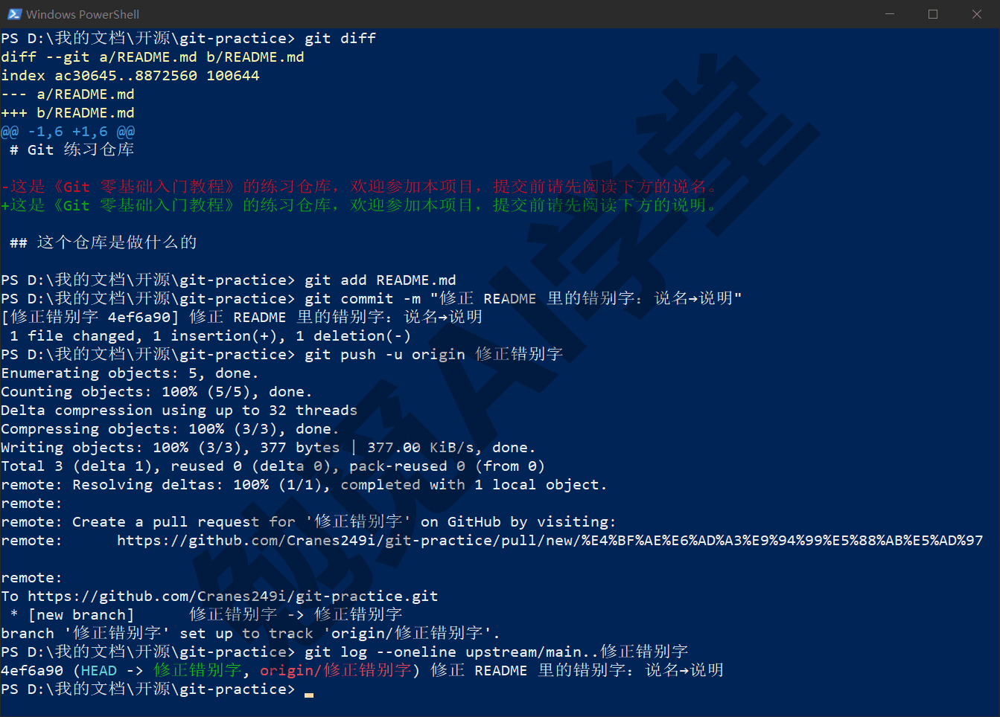

**第 6 步：向原仓库开 PR。** 推送后刷新你的 Fork 页面，顶部会出现黄条 “修正错别字 had recent pushes” 与 Compare & pull request（比较并发起 PR）按钮（需实机验证）；如果黄条没出现，到原仓库的 Pull requests 页签 → New pull request → 点 compare across forks（跨复刻比较）（需实机验证）。进入 Open a pull request（发起 PR）页面，最上面一行四个下拉菜单要看清：base repository（目标仓库）是原仓库、base 是 main；head repository（来源仓库）是你的 Fork、compare 是“修正错别字”。方向是“把我的分支合进原仓库的 main”，方向反了会变成向自己的 Fork 开 PR。标题默认取提交说明，可以直接用；描述按《多人协作：PR 与 Issue》7.2 节写三件事：

```text
改了什么：README 第 3 行的“说名”改为“说明”。
为什么：错别字。
怎么验证：打开 README 看第 3 行。
```

描述框下方、Create pull request 按钮左边有一个 Allow edits by maintainers（允许维护者编辑）的勾选项，默认勾上，保持，它允许原仓库的维护者直接在你的分支上做小修改，比如帮你改一个标点，省得一来一回。点 Create pull request（创建 PR）。PR 出现在原仓库的 Pull requests 页签里，编号（如 #2）是原仓库的编号序列。

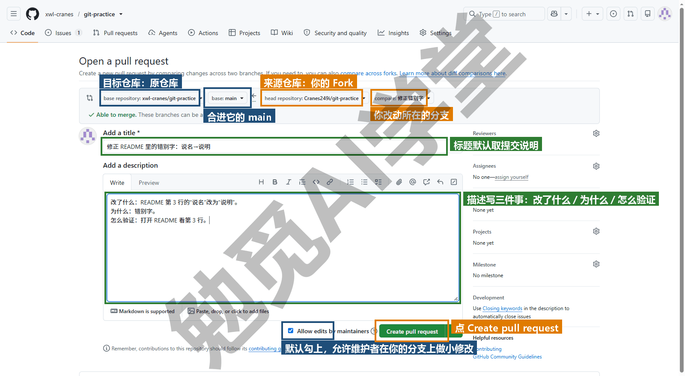

**推上去之后。** 页面会显示 This branch has no conflicts with the base branch（与目标分支没有冲突）和一个灰色的 Merge pull request 按钮，灰色是因为你没有原仓库的合并权限，合并要等维护者（需实机验证）。接下来是等待。练习仓库的审查由课程方来做，需要等上一段时间；真实项目等多久不一定。等待期间不要往这条分支上再推不相干的改动，也不要反复催，PR 页面就是沟通的地方，有话在那里留言。

### 12.3 处理审查意见，直到被合并

**收到 Request changes。** 假设审查者在你的 PR 上留了一条行内评论：“顺便请在‘参与者’一节加上你的名字，这是练习内容的第 2 条”，并给出 Request changes（要求修改）的结论。《多人协作：PR 与 Issue》7.3 节讲过三种结论；Request changes 意味着在你修改之前这条 PR 不会被合并。你会收到邮件和站内通知（需实机验证），PR 页面顶部显示 Changes requested 的红色标记（需实机验证）。

**在同一条分支上改，再推。** 你回应审查意见的做法不是开新分支、更不是开新 PR，而是在同一条分支上追加提交：

```text
git switch 修正错别字
```

打开 `README.md`，在“参与者”一节的列表末尾加一行 `- 你的名字`，保存：

```text
git diff --stat
git add README.md
git commit -m "按审查意见：在参与者一节加上名字"
git push
```

```text
 README.md | 1 +
 1 file changed, 1 insertion(+)
[修正错别字 6dd38ba] 按审查意见：在参与者一节加上名字
 1 file changed, 1 insertion(+)
   4100c95..6dd38ba  修正错别字 -> 修正错别字
```

这次 push 不用 `-u`，第一次推的时候已经设好了跟踪。刷新 PR 页面，新提交自动出现在 PR 的 Commits（提交）页签里，Files changed 里的 diff 也更新了，因为 PR 跟的是分支，不是某一次提交。然后在 PR 页面右侧 Reviewers（审查者）一栏，审查者名字旁有一个重新请求审查的图标（Re-request review），点一下通知对方（需实机验证）；也可以在评论区回一句“已按意见补上”。

```text
git log --oneline upstream/main..修正错别字
```

```text
6dd38ba 按审查意见：在参与者一节加上名字
4100c95 修正 README 里的错别字：说名→说明
```

PR 现在包含两个提交。审查者要求再改，就再来一轮；改动方向不对被否决，就在评论里讨论。

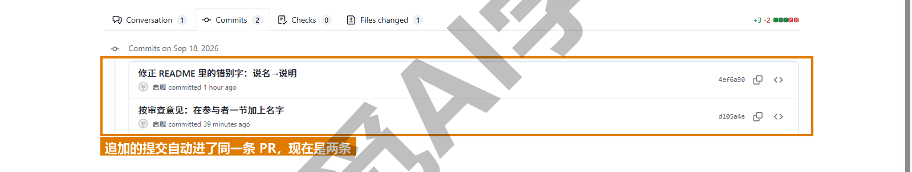

**Approve 与合并。** 审查者满意后给出 Approve（批准），PR 顶部变成绿色的 Approved（需实机验证）；维护者点 Merge pull request（合并 PR）→ Confirm merge（需实机验证），页面变成紫色的 Merged 标记（这一节末尾的图）。合并方式由维护者选（《多人协作：PR 与 Issue》7.4 节的三种）；练习仓库用 Merge commit，原仓库的 main 上会多一个“Merge pull request #2 from 你的用户名/修正错别字”的合并提交，你的两个提交原样保留在它下面。合并后维护者或你自己可以点 Delete branch 删掉你 Fork 上的那条分支（需实机验证），Fork 上的分支是你的，你有权删。

**同步回自己的 Fork。** 被合并的改动现在在原仓库的 main 上，你的 Fork 的 main 和本机的 main 都还不知道。按《多人协作：PR 与 Issue》7.6 节的顺序：

```text
git switch main
git fetch upstream
git log --oneline --graph main..upstream/main
git merge upstream/main
git push
```

```text
   1556539..b3af3e3  main       -> upstream/main
* b3af3e3 Merge pull request #2 from 你的用户名/修正错别字
* 6dd38ba 按审查意见：在参与者一节加上名字
* 4100c95 修正 README 里的错别字：说名→说明
Updating 1556539..b3af3e3
Fast-forward
 README.md | 3 ++-
 1 file changed, 2 insertions(+), 1 deletion(-)
   1556539..b3af3e3  main -> main
```

`fetch upstream` 取回原仓库的新提交；第三条命令列出原仓库 main 比本机 main 多的提交，也就是你的改动加上那个合并提交；`merge upstream/main` 让本机 main 快进到原仓库 main 的位置；`push` 把本机 main 推到 origin，你的 Fork 的 main 就和原仓库一致了。网页上也有一个 Sync fork（同步复刻）按钮做同一件事，但它只更新 GitHub 上的 Fork，本机还是要 pull 一次；命令行一次把三处都统一了。

**清理分支。**

```text
git push origin --delete 修正错别字
git branch -d 修正错别字
git fetch --prune
git branch -a
```

```text
 - [deleted]         修正错别字
Deleted branch 修正错别字 (was 6dd38ba).
* main
  remotes/origin/HEAD -> origin/main
  remotes/origin/main
  remotes/upstream/HEAD -> upstream/main
  remotes/upstream/main
```

第一条删 Fork 上的远程分支（网页上点过 Delete branch 的话这一步会提示分支不存在，跳过即可）；第二条删本机分支，因为它的提交已经通过合并进了 main，小写 `-d` 能删；第三条清掉本机记录的已不存在的远程分支。如果维护者用的是 Squash and merge，本机分支的提交在 main 上找不到原样，`-d` 会拒绝，按《实战一：AI 项目从零到上线》10.5 节确认内容已在 main 后用 `-D`。到这里，一次完整的开源贡献结束：原仓库有了你的改动，你的 Fork 和本机与原仓库一致，没有留下多余的分支。

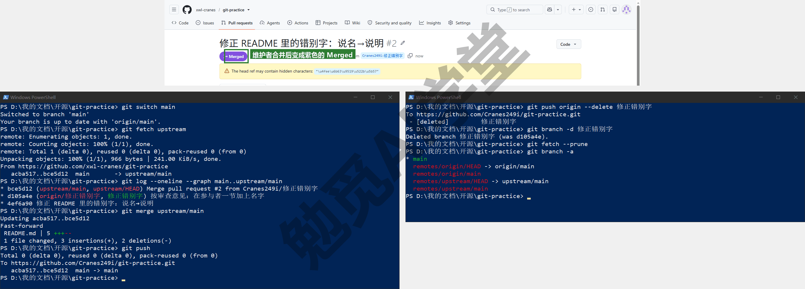

**下一次贡献从哪里开始。** 从 `git switch main`、`git fetch upstream`、`git merge upstream/main` 开始：先把自己的 main 更新到原仓库的最新状态，再 `git switch -c 新分支`。Fork 不需要重做，upstream 也还在。隔了很久再回来，第一件事仍是这三条。

### 12.4 用 PR 关闭一个 Issue

**Issue 与 PR 的关系。** 《多人协作：PR 与 Issue》7.7 节讲过 Issue 是问题单：报告一个问题、记录一件待办。PR 是解决方案。GitHub 把两者接在一起的办法很简单：在 PR 的描述或提交说明里写 `Fixes #编号`，PR 合并进默认分支时，那个 Issue 会被自动关闭，并在 Issue 页面留下“由某个 PR 关闭”的链接。除了 Fixes，Closes、Resolves 也可以，大小写不限，以 GitHub 当前说明为准。

**第 1 步：先有一个 Issue。** 到原仓库的 Issues 页签点 New issue（新建问题），标题写一句话，比如“把我的名字加进 README 的参与者一节”，描述按《多人协作：PR 与 Issue》7.7 节的四要素写，也就是怎么复现、期望看到什么、实际看到什么、环境，文档类问题写期望和实际两条就够，然后点 Create（创建）。记下它的编号，假设是 #1。课程练习仓库允许任何人开 Issue；真实项目开 Issue 之前先搜一下有没有人报过同样的问题。

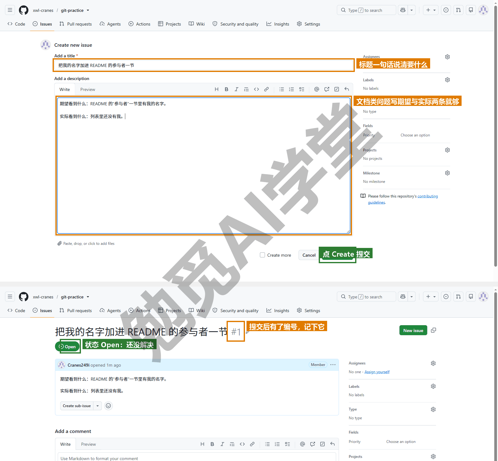

**第 2 步：在提交说明或 PR 描述里引用它。** 两处任选其一，都写也行。写在提交说明里的做法是用两个 `-m`，第一个是标题、第二个是正文（假设 12.3 节那次追加提交当时就这样写）：

```text
git commit -m "按审查意见：在参与者一节加上名字" -m "Fixes #1"
git log -1
```

```text
commit 6dd38ba1d0494d8d890eb340603226440fcc6810
Author: 启舰 <qijian@example.com>
Date:   Tue Sep 15 12:33:41 2026 +0800

    按审查意见：在参与者一节加上名字

    Fixes #1
```

`git log -1` 显示完整说明：标题一行、空一行、正文。写在 PR 描述里的做法更常见：编辑 PR 描述，在末尾加一行 `Fixes #1`，PR 页面右侧的 Development（开发）一栏会立刻显示出关联的 Issue。

**第 3 步：合并后看效果。** PR 被合并进原仓库的 main 之后，打开 Issue #1，状态变成紫色的 Closed，时间线里多了一条“某某 closed this as completed in #2”。不需要任何人手动关闭。

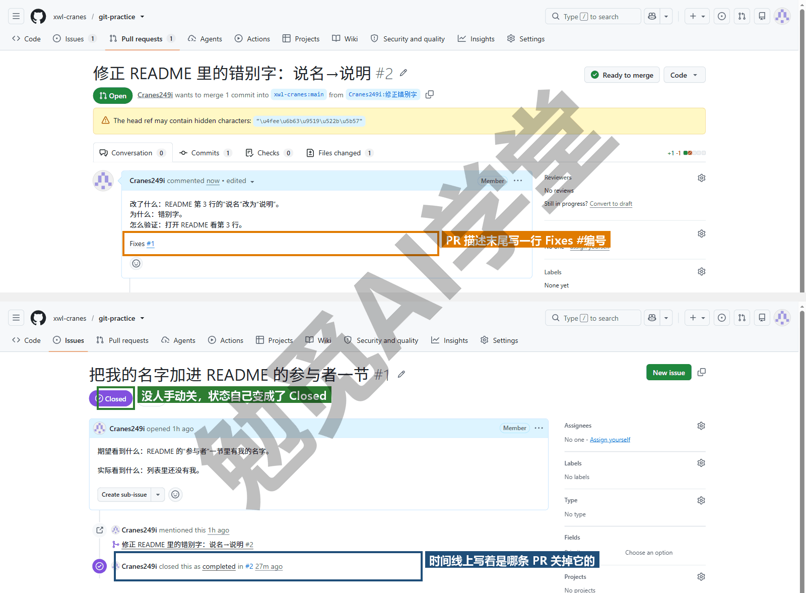

**两个边界。** 有两个边界你要知道。一是关键词只在 PR 合并进目标仓库的默认分支时生效，合并进其他分支不会关 Issue；二是 Issue 要在 PR 的目标仓库里，你在自己 Fork 里开的 Issue，原仓库的 PR 关不掉它。跨仓库引用要写全名 `xwl-cranes/git-practice#1`，本课不展开。

**为什么值得养成这个习惯。** 一个 Issue 加一个 PR，就是从问题、解决到验证的一条完整记录：以后任何人看到那条 Issue，包括几个月后回头查的你自己，都能顺着链接看到是哪次改动解决的、改了哪几行；看到那次提交，也能反过来知道它为什么而改。这比在提交说明里写“修了个 bug”有用得多。个人项目也可以这样用：把待办写成 Issue，做完的 PR 写 Fixes，仓库自己就有了一份待办与完成记录。

### 12.5 全课总结：对照表、三区图、三句话与速查卡

**功能对照表逐项核对。** 下面这张表汇总了本课十二篇讲到的全部内容。用法是你逐行问自己“这一项我会了吗”，会的打勾，不会的按篇节回去翻。

| 功能域 | 你应该会的 | 所在篇节 |
| --- | --- | --- |
| 概念 | 版本管理是什么、仓库与提交、Git 与 GitHub 的关系、Git 擅长与不擅长什么 | 1.1～1.4 |
| 安装配置 | Windows 与 macOS 安装、署名、默认分支、quotepath、autocrlf、longpaths、配置文件在哪 | 1.5～1.7 |
| 终端 | 打开终端、cd、ls、补全与历史、路径带空格加引号、`git help` | 1.8 |
| 三区与提交 | 三区图、init、status 与 `-s`、add 的几种写法、commit、哈希、提交节律 | 2.1～2.5、2.11 |
| 历史与差异 | log 各参数、show、diff 各形态、word-diff、二进制差异 | 2.6～2.7 |
| 忽略与文件操作 | `.gitignore` 写法、`rm --cached`、改名删除、mv、amend | 2.8～2.10 |
| 撤销与找回 | 六情形决策表、restore 两种、reset 三档、revert、detach、reflog、stash、clean、危险动作清单 | 3.1～3.10 |
| 分支 | 新建、切换、查看、删除、改名、HEAD、切分支时文件变化、带改动切分支 | 4.1～4.2 |
| 合并 | 快进与合并提交、读分支图、单人分支做法 | 4.3～4.5、4.7 |
| 标签 | 打标签、列出、查看、删除、推送标签、Releases | 4.6、6.3、8.5 |
| 冲突 | 制造、读标记、三步解决、abort、编辑器按钮、预防、二进制冲突 | 5.1～5.5 |
| rebase 等 | rebase、交互式 rebase、cherry-pick 是什么、什么时候会遇到 | 5.6 |
| 工作树 | add、list、remove、prune、并排比较、删工作树前先离开目录 | 5.7～5.8 |
| 远程基础 | remote、origin、push -u、push、pull、fetch、ahead 与 behind、两种拒绝、推标签、删远程分支 | 6.1、6.3～6.4 |
| GitHub 账号 | 注册、两步验证、用户名与邮箱、网络不稳时怎么办 | 6.2、6.8 |
| 克隆 | clone、与 zip 的区别、放哪里、depth | 6.5 |
| 隐私与凭据 | 公开与私有、密钥红线、凭据管理器、换账号 | 6.6～6.7、8.8 |
| 协作 | 两种协作模式、PR 七步、审查的三种结论、三种合并方式、PR 冲突、Fork 与 upstream、Issue 与 Fixes、协作规矩 | 7.1～7.8 |
| GitHub 网页 | 仓库首页各区、Commits、History、Blame、网页编辑上传、README、About、LICENSE | 8.1～8.3 |
| 上线与发布 | Pages 五步、入口文件、`.nojekyll`、不生效排查、Releases | 8.4～8.5 |
| 大文件与管理 | 大小边界、删了不变小、LFS 是什么、改名、转移、归档、删除、Settings 三项 | 8.6～8.8 |
| 图形界面 | GitHub Desktop 各面板、命令与按钮对照、编辑器源代码管理面板 | 9.2～9.8 |
| AI 工具分工 | 检查点、审查面板、自动提交三层、安全三条、读懂 AI 跑的命令 | 9.9、3.10 |
| 实战 | AI 项目全流程、笔记库备份同步、参与开源项目 | 10～12 |
| 总结与排错 | 速查卡、排错表、Git 3.0、以后到哪查 | 12.5～12.7 |

全部打勾，日常用 Git 就不需要再看别的教程了。有两三行没打勾很正常，翻回去补那一节即可，不必重读整篇。

**三区图回放。** 全课最重要的一张图是《第一个仓库：提交与历史》2.1 节的三区图：工作区是你看到的文件夹，暂存区是准备打包的清单，仓库是封存的记录，远程仓库是放在别处的另一份。每条命令都是在这四格之间搬东西：add 从工作区搬到暂存区，commit 从暂存区搬进仓库，push 从仓库搬到远程，pull 反过来；restore 和 reset 是往回搬；status 和 diff 是看各格之间差什么。以后碰到任何新命令，先问“它在图上把东西从哪搬到哪”，就不会用错。

**六情形决策表回放。** 《撤销、还原与找回》3.1 节的表，出事时先选行再动手：

| 改动走到了哪一格 | 用什么 | 篇节 |
| --- | --- | --- |
| 改了还没 add | `git restore 文件` | 3.2 |
| add 了还没 commit | `git restore --staged 文件` | 3.3 |
| commit 了还没 push | `git reset --soft` 或 `--mixed` 或 `--hard` | 3.4 |
| 已经 push | `git revert 哈希` | 3.5 |
| 只想回头看看 | `git switch --detach 哈希` 或 `restore --source` | 3.6 |
| 找不到刚才的提交 | `git reflog` 再 `reset --hard 哈希` | 3.7 |

三篇实战里出的每一次事故都落在这六行之一：《实战一：AI 项目从零到上线》的坏提交对应第四行、误 reset 对应第六行；《实战二：笔记与文档库的备份同步》的误删对应第一行和第五行。

**三句话回顾。** 《第一个仓库：提交与历史》2.11 节提出的“多提交、少强推、先 status”，现在你已经在三篇实战里各体会过一次：多提交，所以每一步都有地方可以回去；少强推，所以推出去的历史别人一直能接上；先 status，所以危险命令不会敲在错误的位置上。记住这三句话，本课讲的安全做法就都包含在里面了。

**命令速查一页卡。** 按《实战一：AI 项目从零到上线》10.6 节数出来的使用频率分四档排列，右侧给出 GitHub Desktop 里的位置（以《图形界面与 AI 工具里的 Git》9.7 节总对照表为准，位置随版本可能微调）。这一页可以单独打印或存进笔记库。

天天用：

| 要做什么 | 命令 | GitHub Desktop 里 | 篇节 |
| --- | --- | --- | --- |
| 看三区状态 | `git status` / `-s` | Changes 页签 | 2.3 |
| 暂存 | `git add 文件` / `-A` | 勾选文件 | 2.4 |
| 提交 | `git commit -m "说明"` | Summary 加 Commit to | 2.5 |
| 看历史 | `git log --oneline --graph --all` | History 页签 | 2.6、4.5 |
| 新建并切到分支 | `git switch -c 名` | Current branch → New branch | 4.2 |
| 切分支 | `git switch 名` | Current branch 下拉菜单 | 4.2 |
| 看分支 | `git branch` / `-a` | Current branch 下拉菜单 | 4.2 |

每天几次：

| 要做什么 | 命令 | GitHub Desktop 里 | 篇节 |
| --- | --- | --- | --- |
| 看改了什么 | `git diff` / `--staged` / `--stat` | Changes 里点文件 | 2.7 |
| 合并 | `git merge 分支` | Branch → Merge into current branch | 4.3～4.4 |
| 删分支 | `git branch -d 名` / `-D` | Branch → Delete | 4.2 |
| 推送 | `git push` / `push -u origin 名` | Push origin | 6.3～6.4 |
| 拉取 | `git pull` | Pull origin | 6.4 |
| 取回不合并 | `git fetch` / `fetch --prune` | Fetch origin | 6.4 |

遇到才用：

| 要做什么 | 命令 | GitHub Desktop 里 | 篇节 |
| --- | --- | --- | --- |
| 丢弃工作区改动 | `git restore 文件` / `.` | 右键 Discard changes | 3.2 |
| 撤回暂存 | `git restore --staged 文件` | 取消勾选 | 3.3 |
| 退掉未推的提交 | `git reset --soft/--mixed/--hard HEAD~1` | 刚提交完可点 Changes 底部 Undo（等于 --soft 退一步）；其余回终端 | 3.4 |
| 反向抵消已推提交 | `git revert 哈希` | History 右键 → Revert changes in commit | 3.5 |
| 看旧版本 | `git show 哈希:路径` / `switch --detach 哈希` | History 只能看每次提交改了什么；看整份旧文件回终端 | 3.6、11.6 |
| 拿回旧版文件 | `git restore --source=哈希 文件` | 回终端 | 3.6、11.6 |
| 找回丢失提交 | `git reflog` 再 `reset --hard 哈希` | 回终端 | 3.7 |
| 收起半成品 | `git stash` / `stash pop` | Branch → Stash all changes | 3.8 |
| 解冲突 | 改文件、删标记、`add`、`commit` | 冲突对话框 → 编辑器 → Continue merge | 5.4 |
| 放弃合并 | `git merge --abort` | Abort merge | 5.4 |
| 第二个工作区 | `git worktree add ../文件夹 -b 分支` / `list` / `remove` | Current worktree 下拉菜单（3.6+） | 5.7 |
| 打标签、推标签 | `git tag -a v1.0 -m "说明"`、`git push --tags` | History 右键 → Create tag | 4.6、6.3 |
| 删远程分支 | `git push origin --delete 名` | Branch → Delete（勾远程） | 6.4 |
| 同步 upstream | `git fetch upstream`、`git merge upstream/main` | 克隆 Fork 时选 To contribute to the parent project | 7.6、12.3 |
| 按文件或内容查历史 | `git log -- 文件` / `log -S "词"` | History 里点文件 | 11.6 |
| 找带冲突标记的文件 | `git grep -n "<<<<<<<"` | 回终端 | 11.5 |

一个项目只用一次：

| 要做什么 | 命令 | GitHub Desktop 里 | 篇节 |
| --- | --- | --- | --- |
| 配署名与 Windows 专用设置 | `git config --global user.name` 等 | File → Options → Git | 1.7 |
| 新建仓库 | `git init` | File → New repository | 2.2 |
| 写忽略清单 | 编辑 `.gitignore` | Repository settings → Ignored files | 2.8 |
| 连上远程并第一次推送 | `git remote add origin 网址`、`git push -u origin main` | Publish repository | 6.3 |
| 克隆 | `git clone 网址 [文件夹]` | File → Clone repository | 6.5 |
| 加 upstream（上游） | `git remote add upstream 网址` | 克隆 Fork 时选 To contribute to the parent project | 7.6 |

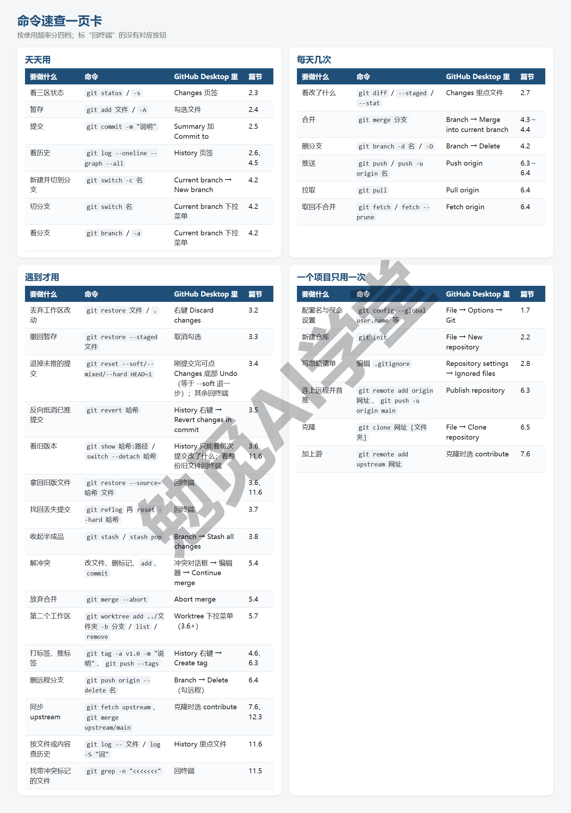

**怎么用这张卡。** 你忘了命令，先想“我要做什么”，在左列找；不确定某条命令会不会有危险，看它在哪一档：“遇到才用”那一档里 reset、restore 是会丢东西的，“每天几次”里的 `-D` 也是，敲之前先 status；`git clean` 没进这张卡，用法见《撤销、还原与找回》3.9 节。AI 工具替你跑了一条命令而你没见过，在“命令”那一列找，找到了就知道它在三区图上动了哪一格；找不到，说明它超出了本课范围，先问它“这条命令会不会改写历史或删除文件”再答应。

### 12.6 排错速查表

下面这张表按“看到什么”查。左列是你在终端里看到的关键句（原文节选；标注（需实机验证）的两条只能在 GitHub 上出现），右边是原因、解决办法和讲它的篇节。

| 看到什么 | 原因 | 怎么办 | 篇节 |
| --- | --- | --- | --- |
| fatal: not a git repository | 终端不在仓库文件夹里，或这个文件夹还没 init | `cd` 到正确的文件夹；确认里面有 `.git`；新项目先 `git init` | 2.2 |
| git: 'swich' is not a git command | 命令拼错 | 看下面 The most similar command 给的提示，照它敲 | 1.8 |
| Author identity unknown、Please tell me who you are | 没配署名 | `git config --global user.name` 与 `user.email` | 1.7 |
| warning: LF will be replaced by CRLF | autocrlf 在提示换行符会被转换，不是错误 | 忽略；或按 1.7 节把 autocrlf 设成你要的值 | 1.7 |
| 中文文件名显示成 "\350\257\264…" | quotepath 默认把非英文字符显示成反斜杠加数字 | `git config --global core.quotepath false` | 1.7 |
| 掉进满屏英文的窗口出不来 | 没带 `-m`，Git 打开了默认编辑器 Vim | 按 Esc，输入 `:q!` 回车放弃，或 `:wq` 保存；把默认编辑器改成记事本 | 2.5 |
| You are in 'detached HEAD' state | 用旧写法 checkout 或 switch --detach 到了某个提交上 | 看完 `git switch main` 回来；要保留在这里做的提交先 `git switch -c 新分支` | 3.6 |
| error: src refspec main does not match any | 还没有任何提交就 push，或本机分支不叫 main | 先 commit 一次；`git branch` 看名字，叫 master 就 `branch -m master main` | 6.3 |
| ! [rejected] main -> main (fetch first 或 non-fast-forward) | 远程上有你本机没有的提交 | `git pull` 再 `git push`；有冲突按 5.4 节解决 | 6.4 |
| fatal: refusing to merge unrelated histories | GitHub 建仓时勾了初始化 README，本机又有自己的历史，两边没有共同起点 | `git pull origin main --allow-unrelated-histories` 后再 push；以后建空仓库时不勾任何初始化 | 6.3 |
| hint: You have divergent branches | 两边都有新提交，而这台电脑没设 pull 的合并方式（Mac 与新装的电脑常见） | `git config --global pull.rebase false` 再 `git pull` | 6.4 |
| fatal: Authentication failed、Support for password authentication was removed | 用了账号密码，或保存的授权已失效（需实机验证） | 按 6.7 节删除凭据管理器里的条目，重新 push 走浏览器授权 | 6.7 |
| remote: error: File … exceeds GitHub's file size limit | 单个文件超过 GitHub 上限（需实机验证） | 没推的按 3.4 节 reset 掉那次提交并加进 `.gitignore`；已推的只能改写历史 | 8.6 |
| error: Your local changes … would be overwritten by merge / checkout | 有还没提交的改动，pull 或切分支会覆盖它 | 先 commit 或 `git stash`，做完再 `stash pop` | 3.8、11.4 |
| CONFLICT (content): Merge conflict in … | 两边改了同一处 | 打开文件看两段、留一段、删标记，`add`、`commit` | 5.4、11.4 |
| error: unable to unlink old '…': Invalid argument | 文件正被别的程序（Obsidian、Word）占着，Git 换不掉它 | 关掉那个程序；`git restore 文件` 让它回到分支应有的样子；重做 | 11.4 |
| error: object file … is empty、missing blob（`git fsck`） | `.git` 放在网盘同步文件夹里被同步损坏 | 从远程重新 clone 一份；把库移出网盘 | 11.1 |
| fatal: detected dubious ownership in repository | 仓库文件夹的所有者不是当前用户（外置盘、网盘同步文件夹、另一个账号建的） | 确认是自己的仓库后，照提示里那条 `git config --global --add safe.directory '路径'` 敲一遍 | 12.6 |
| error: unknown switch \`e'（敲的是 HEAD@{1}） | PowerShell 把 `@{` 当成自己的语法拆开了 | 加单引号 `'HEAD@{1}'`，或直接用 reflog 里的短哈希 | 10.4 |
| 标记“&&”不是此版本中的有效语句分隔符 | Windows 自带的 PowerShell 5.1 不支持 `&&` | 用分号 `;` 连接，或分两行敲 | 9.9 |
| error: the branch '…' is not fully merged | 这条分支被 Squash 合并过，Git 看不出它已合入 | 确认内容已在 main 后 `git branch -D 名` | 10.5 |

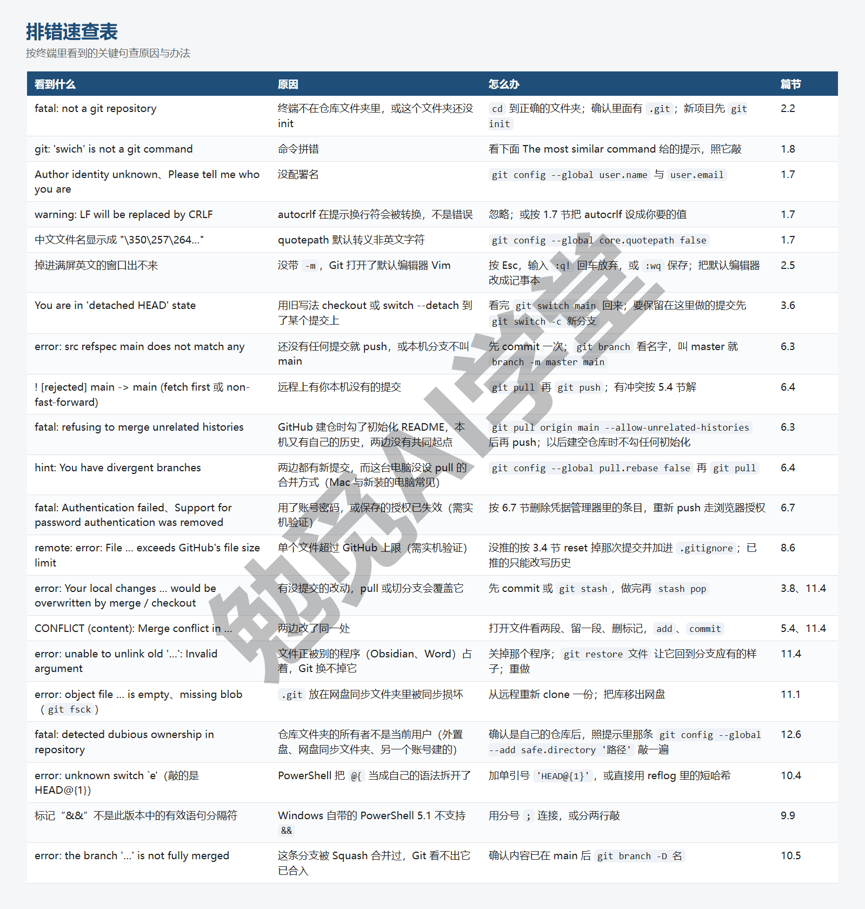

**dubious ownership 是什么。** 它是 Git 的一项安全保护：仓库所在文件夹的所有者和当前登录用户不一致时，Git 拒绝读取这个仓库的配置，防止别人放一个带恶意配置的仓库让你中招。在 Windows 上，你用外置硬盘、网盘同步文件夹、用管理员账号建后换普通账号用、公司电脑切换域账号，都会遇到它。下面是仓库所有者为系统账号时的报错：

```text
fatal: detected dubious ownership in repository at 'C:/Users/你/别人的仓库'
'C:/Users/你/别人的仓库/.git' is owned by:
	NT AUTHORITY/SYSTEM (S-1-5-18)
but the current user is:
	电脑名/你 (S-1-5-21-…)
To add an exception for this directory, call:

	git config --global --add safe.directory 'C:/Users/你/别人的仓库'
```

提示里给出的那条命令就是解决办法，逐字照敲即可，它只放行这一个文件夹。网上有人建议用 `safe.directory '*'` 放行全部，这会关掉整项保护，不建议。另一个办法是在资源管理器里把文件夹的所有者改成自己（属性 → 安全 → 高级 → 所有者），改完就不需要例外了（以你的系统版本为准）。

**表里没有的怎么办。** 把报错原文整句复制，加上 git 这个词搜索，Stack Overflow 上几乎都有；或者直接把原文贴给 AI 工具问“这是什么意思、安全的处理办法是什么”，然后按《图形界面与 AI 工具里的 Git》9.9 节的三条：它给的命令先看会不会改写历史或删文件，不确定就先 status、先备份。

### 12.7 诚实定位与跟上迭代

**Git 不擅长什么。** 你学完全课，也要知道它的边界，免得把它用在不合适的地方：

- **二进制与大文件**：图片、视频、Office 文档、设计源文件，Git 只能整份保存、看不出改了什么、删了也不变小（《GitHub 网页端：Pages 上线与发布》8.6 节），几百 MB 以上的文件夹应交给网盘或专门的备份工具。
- **需要“实时同步”的场景**：Git 的同步是你主动 push 和 pull，它不会像网盘那样后台自动传，手机端更是几乎没有好用的 Git（《实战二：笔记与文档库的备份同步》11.5 节）。
- **上手需要时间**：三区图、分支、远程这几个概念至少要用两三周才会熟练，本课十二篇就是在缩短这段时间，但缩不到零。
- **两个人同时改同一行**：它只能停下来问你，不会替你做决定，这是有意的设计，不是缺陷，但意味着协作仍然需要沟通。

知道这四条，其余场景 Git 一般都能胜任。

**Git 3.0 带来的三项变化。** Git 官方已经公布了下一个大版本的变更计划，正式发布日期以官方为准。对本课读者有影响的是三项：

- **新仓库的默认分支改为 main**：《认识 Git 与装好》1.7 节让你配的 `init.defaultBranch main`，在 3.0 之后不配也是 main，老仓库不受影响。
- **提交编号（哈希）的默认计算方式从 SHA-1 改为 SHA-256**：提交的完整编号从 40 位变成 64 位，你看到的短哈希照旧是前七位左右，用法一个字不变；但新旧两种计算方式的仓库不能直接互相推送，GitHub 对 SHA-256 仓库的支持进度以官方说明为准，在那之前新建仓库时可以保留旧的计算方式（安装时或 init 时以实际提示为准）。
- **引用存储格式改为 reftable**：这是 `.git` 内部记录分支和标签的方式，对你完全不可见，只需知道不同版本的 Git 打开同一个仓库时可能提示格式不同。

三项加起来对新手的实际影响是：本课讲的所有命令、概念、流程在 3.0 上全部照用，只有《认识 Git 与装好》1.7 节那一条配置会变成多余的。

**以后到哪里查。** 你以后查资料有三个地方，按先后顺序：

- `git help 命令名`（或 `git 命令名 --help`），Windows 上会在浏览器里打开该命令的完整手册（《认识 Git 与装好》1.8 节），这是最权威、和你装的版本完全一致的说明，缺点是全英文、写给熟手看。
- Pro Git 中文版：Git 官网上免费的整本书，本课覆盖了它前几章的全部内容，往后的章节（分支高级用法、服务器、内部原理）在你需要时可以接着读。
- GitHub Docs 的中文页面：GitHub 网页上任何按钮、设置、功能的说明，界面变了以它为准。

三处都查不到的，才去搜索或问 AI 工具。

**最后一句。** 全课开头把 Git 讲成给文件夹记账的工具，也是普通人的后悔药。到这一篇为止，你已经用它救回过改坏的文件、把项目和笔记放到了云端、给别人的项目提交过一次被接受的改动。剩下的事情是把它用成习惯：多提交、少强推、先 status。

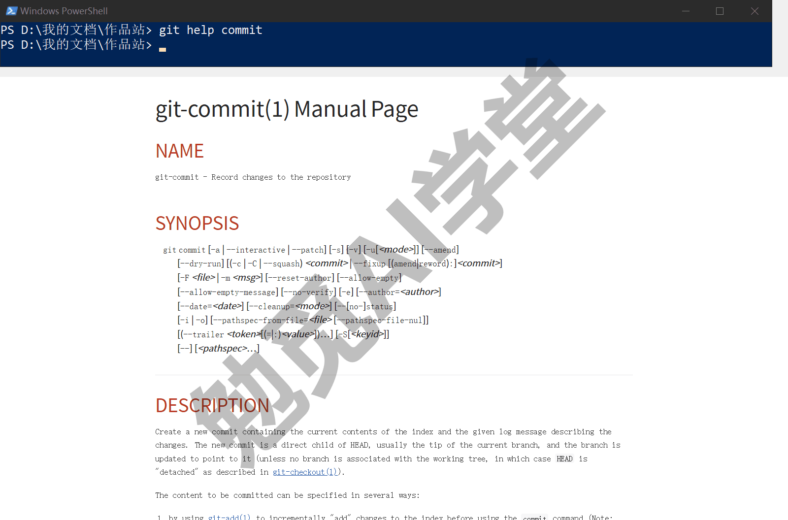

**在 AI 工具和图形界面里，这一步是什么样子。** Cursor 课《Git、GitHub 与代码审查》13.4 节“推送与 PR”，以及 Codex 课《自动化、Git 与远程操控》里 PR Chat 的“开 PR”，那两处都是在自己的仓库里由工具替你点按钮；本篇是第一次以协作者身份、面对别人的仓库、经过真实的审查把 PR 走通。工具帮你省的是点按钮的时间，Fork、upstream、审查回应、同步这些步骤它们不会替你决定。GitHub Desktop 里克隆 Fork 时选 To contribute to the parent project 会替你加好 upstream，Branch 菜单里的 Create Pull Request 跳到网页开 PR，其余环节仍在网页与本篇的命令里，见《图形界面与 AI 工具里的 Git》9.5 节。

### 12.97 练习任务

方括号里的内容换成你自己的。

**任务一：在练习仓库完成一次被合并的 PR。** 按 12.2～12.4 节完整走一遍：Fork、克隆、加 upstream、开分支改一处、推、开 PR、回应审查意见、被合并后同步并清理；PR 描述里写上 Fixes 加一个你自己开的 Issue 编号：

```text
git clone https://github.com/[你的用户名]/git-practice.git
cd git-practice
git remote add upstream https://github.com/xwl-cranes/git-practice.git
git switch -c [你的分支名]
```

完成标准：原仓库的 Pull requests 页签 Closed 里有一条你的 PR，标记为 Merged；你开的 Issue 状态为 Closed 并链接到这条 PR；本机 `git branch -a` 里没有那条工作分支，`git log --oneline -3` 与 `upstream/main` 一致。

**任务二：对着排错速查表把五条错误各制造并修复一次。** 在一个临时练习仓库里，按表中的说明故意触发下面五条，看到原文，再按“怎么办”一列修好：not a git repository、src refspec main does not match any、rejected non-fast-forward、refusing to merge unrelated histories、the branch is not fully merged。中间三条需要一个本机的裸仓库当远程（裸仓库就是只存历史、没有工作文件的仓库）：

```text
git init --bare [你的练习文件夹]\远程.git
git remote add origin [你的练习文件夹]\远程.git
```

完成标准：五条错误的原文你都亲眼见过；每一条修复后 `git status` 干净、`git push` 成功；能不看表说出其中任意三条的原因。

**任务三：把速查卡存进你的笔记库。** 把 12.5 节速查卡的四张表和 12.6 节的排错表复制成你笔记库里的一篇笔记（或打印一页），按自己的习惯增删，把用不到的行删掉、把踩过的坑补进去；然后用《实战二：笔记与文档库的备份同步》的节律提交并推送：

```text
git add [速查卡笔记路径]
git commit -m "加 Git 速查卡"
git push
```

完成标准：笔记库里有这篇笔记，而且已推到远程；至少改动了原表的三行（增、删或改）；下一次遇到报错时你先翻的是它，而不是搜索引擎。

### 12.98 本篇小结与自检

这一篇以协作者身份完整走通了参与开源项目的流程：Fork 到自己账号、克隆自己的 Fork、加 upstream、在分支上改一处并推到 Fork、向原仓库开 PR 并看清 base 与 head 的方向、收到 Request changes 后在同一分支追加提交再推、被 Approve 与合并后用 fetch upstream 加 merge 加 push 把本机与 Fork 同步到原仓库的状态、清理远程与本机分支；用 Fixes #编号 让 PR 合并时自动关闭 Issue。后半篇回顾了全课：功能对照表逐项打勾、三区图与六情形决策表、三句话、按使用频率分四档的命令速查卡、二十一条按报错原文查的排错表、Git 不擅长的四件事、Git 3.0 的三项变化对新手的实际影响、以后查资料的三个地方。

可以对照下面的清单检查学习结果：

- [ ] 能默写 Fork 工作流七步，知道 origin 与 upstream 各是什么、哪个能推
- [ ] 开 PR 时会核对 base 与 head 的方向，描述按三件事写
- [ ] 收到审查意见知道在同一分支追加提交而不是开新 PR，会重新请求审查
- [ ] 被合并后会同步 upstream 回本机与 Fork，会清理远程与本机分支，Squash 过的分支知道用 -D
- [ ] 会用 Fixes #编号 关联 Issue，知道它只在合并进目标仓库默认分支时生效
- [ ] 功能对照表全部打勾，没打勾的知道回哪一节
- [ ] 排错表上的报错见到原文能找到对应行；不在表上的知道怎么查
- [ ] 知道 Git 不擅长什么，Git 3.0 三项变化里哪一项会改掉本课的一条配置

完成这些内容后，你已经具备了独立使用 Git 与 GitHub 的全部日常能力：自己的项目从第一次提交到上线，笔记与文档的永久历史与跨设备同步，以及参与他人项目的完整协作流程。这一篇是《Git 零基础入门教程》的最后一篇；三门 AI 工具课里用到 Git 的每一处，现在你都知道它背后是哪条命令、出了问题回哪一节。

### 12.99 新手常见问题

**Q1：学完这套教程，还要学别的 Git 教程吗？**

日常使用不需要。本课覆盖了 12.5 节对照表上的全部内容，这些就是普通人和绝大多数开发者每天用到的全部。以下三种情况才需要往下学：进入一个有严格分支流程的大团队（学他们的流程文档，概念本课都有）；需要整理提交历史或自动化检查（学交互式 rebase 和钩子）；要管理大量二进制资源（学 Git LFS）。到那时再去找专门的教程即可，它们都建立在本课的概念上，不必再从零开始。

**Q2：日常到底哪几条命令够用？**

12.5 节速查卡“天天用”那一档的七条：status、add、commit、log、switch -c、switch、branch，加上“每天几次”里的 push、pull、merge，一共十条，覆盖单人项目的全部日常。多人协作再加 fetch 和 diff。其余的都是“出事才用”，出事时翻六情形决策表或排错表，不必背。《实战一：AI 项目从零到上线》10.6 节数过，一个完整项目从零到上线，前六条命令占了全部次数的三分之二。

**Q3：用图形界面就够了，为什么还要会命令？**

有三个理由：

- 按钮背后就是命令，按钮不会告诉你它做了什么，出了问题只有命令行的输出能说明白（《图形界面与 AI 工具里的 Git》9.1 节）；
- 最有力的几条命令（reset 三档、reflog 找回、`restore --source`、`log -S`），图形界面刻意不提供或藏得很深；
- AI 工具替你跑的全是命令，看不懂就只能盲目答应，而它们建议的 `reset --hard`、`push --force` 正是本课反复提醒要先看 status 的那几条。

会了命令再用图形界面，两边的长处都能用上；只会图形界面，出事时就没有别的办法了。

**Q4：Git 3.0 来了要重学吗？**

不用。12.7 节讲的三项变化里，默认分支改 main 只是让《认识 Git 与装好》1.7 节的一条配置变得多余；哈希变长不改变任何命令的用法，短哈希照用；reftable 对使用者不可见。本课全部命令、概念、流程在 3.0 上照用。唯一要留意的是新旧两种 ID 计算方式的仓库不能直接互推，以及 GitHub 对 SHA-256 仓库的支持进度，以官方说明为准；在支持完善之前，新建仓库时保留旧的计算方式即可（安装或 init 时以实际提示为准）。

**Q5：给真实的开源项目提了 PR，很久没人理，怎么办？**

先看项目是否还在维护：最近一次提交是多久以前、其他 PR 有没有被处理。还在维护的项目，等一到两周是正常的，可以在 PR 下礼貌地留一句“如果需要我补充什么请告诉我”，不要反复催；如果项目有讨论区或聊天群，那里问一句更有效。不再维护的项目，你的改动留在自己的 Fork 里也有价值，别人搜到时能用；确实需要这个改动的人可以从你的 Fork 克隆。无论哪种情况，都不要为了引起注意去改更多东西或开更多 PR。
