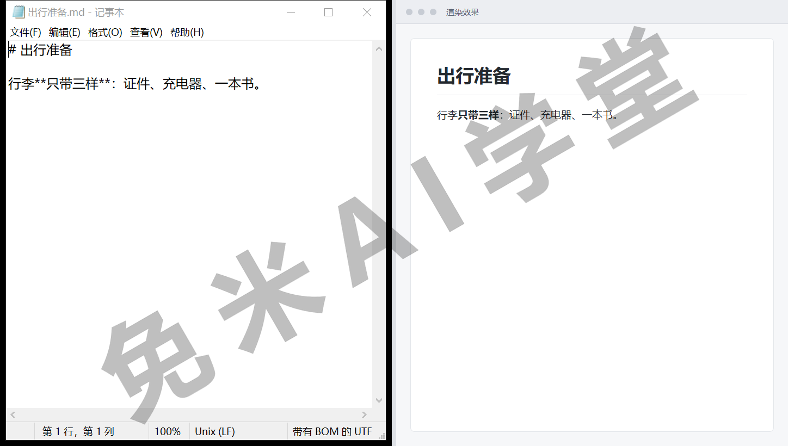
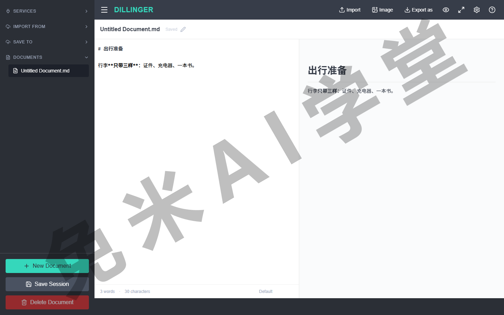
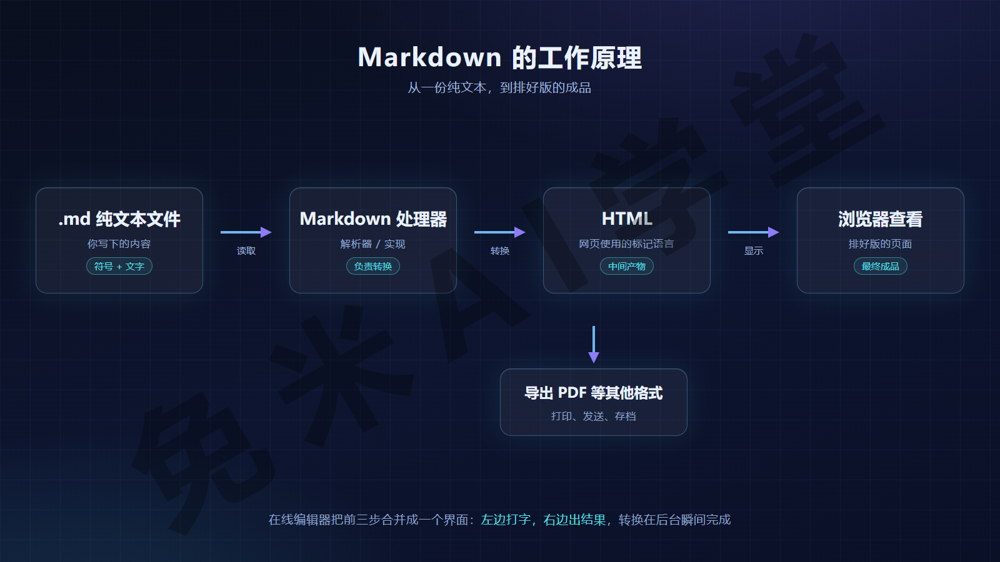
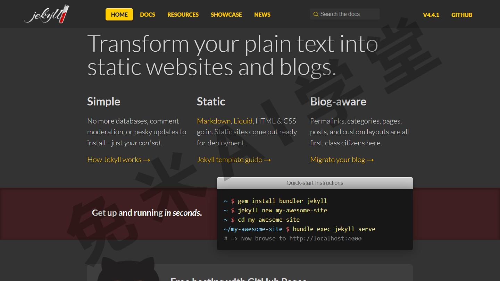
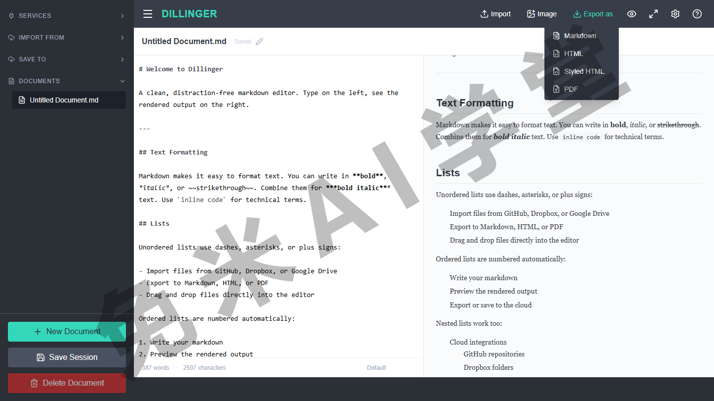
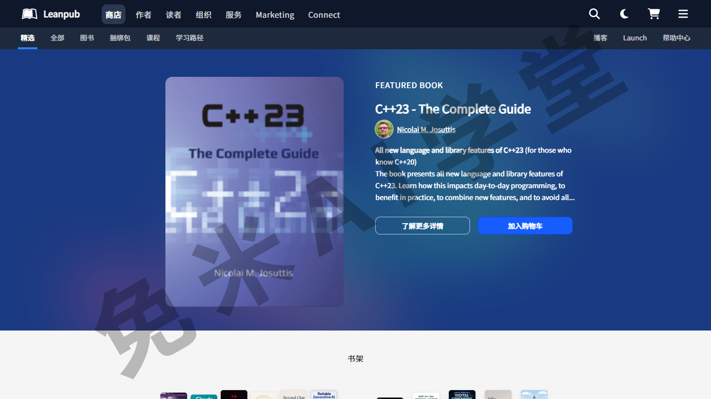
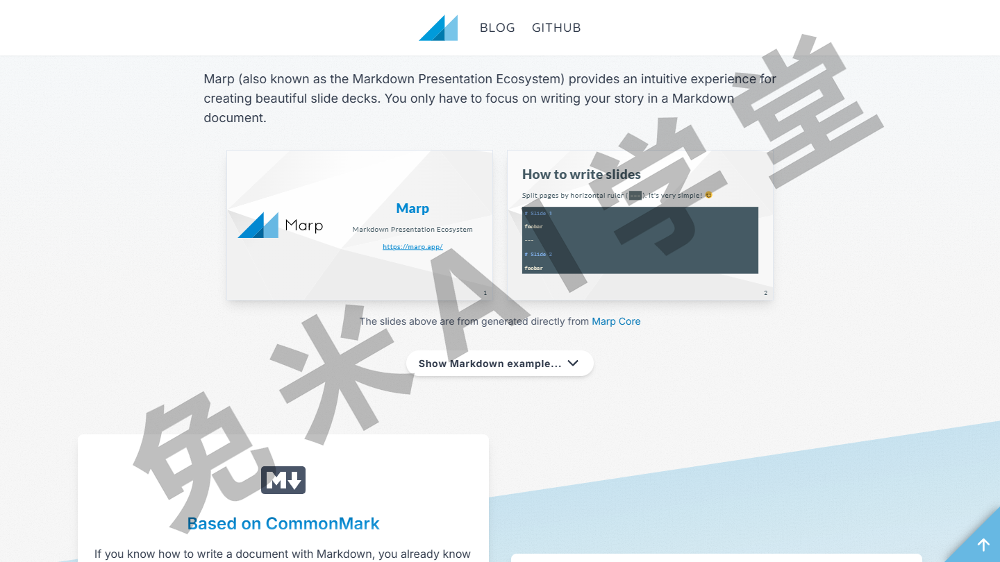
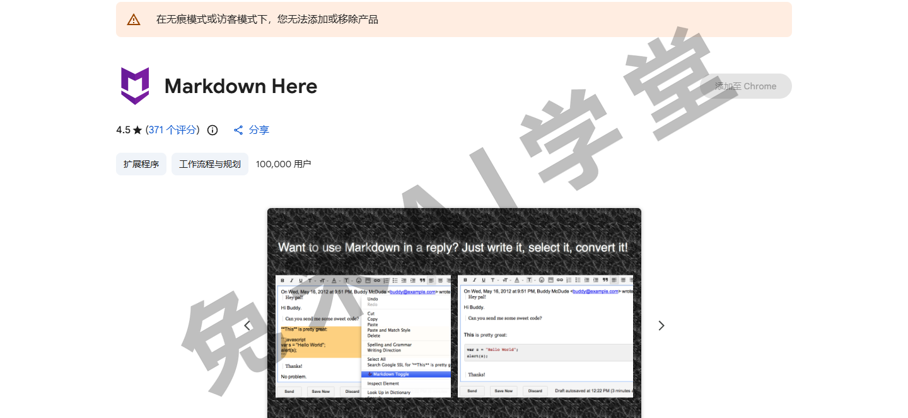
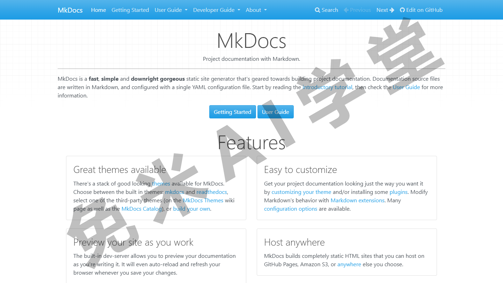
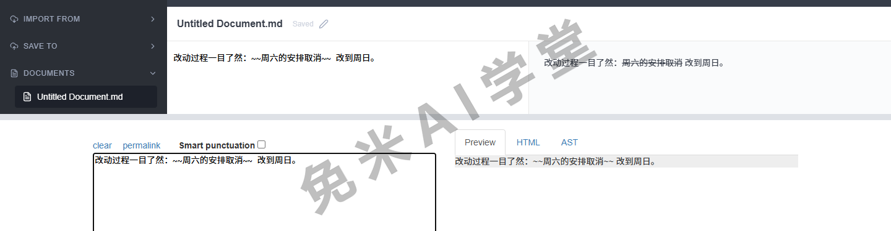

## 入门

这一篇解决“认识”的问题。动手学符号之前，先把 Markdown 本身弄清楚：它是什么、为什么值得用、你写下的纯文本是怎么变成排好版的页面的、它能用在哪些地方，以及“支持 Markdown”这句话里藏着什么含糊之处。

本教程共六个板块：入门、速查表、基本语法、扩展语法、变通、工具。本篇是第一个板块，不绑定任何一款软件，手边暂时没有专门工具也不影响阅读；需要动手的地方，一个浏览器就够。

### 1.1 Markdown 是什么

Markdown 是一种轻量级标记语言，用来在纯文本里添加格式标记。所谓“标记语言”，就是用约定好的符号在文字里标出“这里是标题”“这里要加粗”；“轻量”是说它符号少、规则简单。这两个术语都不必专门记住，看一个例子就有直观印象了。它由 John Gruber 在 2004 年创建，如今已是世界上最常用的标记语言之一。

它与 Word 类编辑器的本质差异在“格式怎么来”。在 Word 这类应用里，你选中文字、点一下按钮，变化立刻可见，这类工具通常称为“所见即所得”编辑器；写 Markdown 时你不点按钮，而是在文本中写入符号，由符号指示哪些文字应该长什么样。比如下面这几行：

```text
# 出行准备

行李**只带三样**：证件、充电器、一本书。
```

行首的 `#` 表示这一行是一级标题；成对的 `**` 把“只带三样”标成加粗。经过渲染，它就会显示成一个大字号标题和一句带粗体的话。



用它写作，好处集中在三点：

- **专注内容**——格式交给符号，注意力留在文字本身，不必一边写一边挑字号、调行距；
- **纯文本**——易读易写，任何软件都能打开；也可以方便地纳入版本控制（一种保留每次修改记录、可随时回看比对的管理方式）；
- **语法简单**——常用符号一共十来个，上手很快；写错了也不会弄坏什么，改掉重打即可。

如果你已经习惯了所见即所得的应用，一开始看到“满屏符号”可能需要一点时间适应。不过 Markdown 的首要设计目标就是“未经渲染也易读”：上面那段例子，即使不做任何转换，当作普通文字来读也毫不费劲，不会满眼都是格式指令。

### 1.2 为什么要使用 Markdown

点几下按钮就能设置格式，为什么还要学一套符号？理由主要有四条：

- **到处都能用**——主流的技术社区、博客平台大多支持 Markdown 写作；GitHub、Gitee 这类代码托管平台上，开源项目的 README、开发文档、Wiki 几乎都用它写；不少笔记软件、聊天工具也认它。学一次，处处能写。
- **纯文本，可移植**——md 文件几乎可以用任何应用程序打开。不喜欢手头这款 Markdown 应用了，把文件导入另一款接着用就是。这一点与 Word 类文字处理软件形成鲜明对比：后者会把内容锁进专有的文件格式里。
- **独立于平台**——任何操作系统、任何设备上都能创建和编辑 Markdown 文本，电脑、手机、平板不挑。
- **适应未来**——就算正在使用的应用将来停止维护了，你仍然能用任意文本编辑器读取内容。对书籍、论文这类需要长期甚至无限期保存的文件，这一条尤其重要。

一句话总结：内容是你的，不被某一款工具、某一种文件格式锁定。

### 1.3 工欲善其事，必先利其器

入门 Markdown 最好的方式就是马上用起来，而这件事不需要花一分钱，也不需要先装任何软件。

**在线编辑器网址**：https://dillinger.io/

动手前先交代一个客观情况：各平台采用的 Markdown 解析引擎不同、版本不同，定制和扩展的程度也不同，所以在不同平台上写 Markdown，体验并不完全一致。好在公认的标准语法各家都支持，这也是本教程把《基本语法》作为主线的原因：先把处处通用的部分学扎实，再谈各家差异。

最省事的起步方式是在线 Markdown 编辑器：打开网页就能写，左侧窗格输入，右侧窗格实时显示渲染结果，在搜索引擎里搜“在线 Markdown 编辑器”就能找到不少。建议你现在就开一个放在旁边，一边读本教程一边照着敲，敲一遍胜过读三遍。



等熟悉了 Markdown，再挑一款顺手的常驻应用也不迟；挑选思路与常见应用清单，《工具》里会专门讲。

### 1.4 Markdown 的工作原理

用 Markdown 写下的内容，存放在后缀为 .md 或 .markdown 的纯文本文件里。那么，这样一个纯文本文件，是怎么变成网页或可打印文档的？

这中间有两个角色。一个是 Markdown 应用程序，也就是你写作时用的软件；另一个叫 Markdown 处理器（也常称“解析器”或“实现”），它是应用内部真正执行转换的那段程序，负责把 Markdown 文本转换成 HTML。HTML 是网页使用的标记语言，浏览器天生认识它。这两个名词都不必记，你只需要知道：中间有一个“转换器”。

从建文件到看到成品，完整链路是四步：

1. 用文本编辑器或 Markdown 应用新建一个文件，后缀是 .md 或 .markdown；
2. 在 Markdown 应用中打开这个文件；
3. 应用调用处理器，把 Markdown 文本转换成 HTML；
4. 在浏览器中查看结果，或者由应用把它转换成 PDF 等其他格式。



实际用起来，你对这条链路的感知会因工具而异：在线编辑器把前三步合并成了一个界面，左边打字、右边出结果，转换在后台瞬间完成；如果用的是“文本编辑器加静态网站生成器”这类组合，四个步骤就会分得比较明显。

为什么要专门讲这个原理？因为它解释了一个新手常见的困惑：同一段 Markdown，在两个应用里的显示效果可能不一样。转换是处理器做的，处理器不同，结果自然可能有差异，这个话题在 1.6 展开。

### 1.5 Markdown 有什么用

学习 Markdown 的语法花不了多长时间，而一旦学会，几乎哪里都用得上：大多数人用它给网站写内容，但从技术文档、读书笔记到一封长邮件、一张购物清单，它都合适。下面是七类常见场景；场景里提到的工具只为让你有个着落，点到即止，是否仍在维护、是否收费以各自官网为准，完整清单与挑选建议在《工具》。

#### 网站

Markdown 本来就是为 Web 而生的。“静态网站生成器”（把一个文件夹的 md 文件批量转换成完整网站的程序）大多以 Markdown 为源文件：Jekyll 是其中的老牌选手，生成的网站可以托管在 GitHub Pages 上；中文社区常用的 Hexo、Hugo 思路相同。用 WordPress 写博客的人，一般可以通过插件获得 Markdown 支持。



#### 文件资料

写作业、写信、写普通文档，Markdown 的能力足够；它比不了 Word 的全套排版功能，换来的是轻快。写完导出成 PDF 或 HTML，打印、发送、上传都方便。VS Code、Typora、MarkText 这些编辑器都能胜任这类日常写作。



#### 笔记

做笔记几乎是 Markdown 的最佳场景：记录快、文件小、天生适合长期归档。原生支持它的笔记应用不少，Obsidian、思源笔记、Bear 都是常见选择；个别老牌笔记应用不原生支持 Markdown，通常可以借助第三方插件或导入导出来变通。


#### 书籍

想自出版电子书，Leanpub 这类服务可以把 Markdown 文件直接排成 PDF、EPUB、MOBI 格式的成书；要出纸质书，可以拿导出的 PDF 对接按需印刷类服务。



#### 演示文稿

Markdown 也能变成幻灯片：Marp、Remark 这类工具按约定的分隔符把文本切成一页页幻灯片，在浏览器里放映。它做不出复杂动画，胜在够快，内容为主的分享用它比拖拽排版省时间。



#### 邮件

经常写长邮件、又受不了网页邮箱那排格式按钮的人，可以试试 Markdown Here 这类浏览器扩展：邮件正文用 Markdown 写，发送前一键转换成排好版的格式（扩展的可用性以浏览器扩展商店为准）。



#### 技术文档

科技公司越来越多地用 Markdown 写产品文档。Read the Docs、MkDocs、Docusaurus、VuePress 这些工具，能把一整个仓库的 md 文件生成带导航和搜索的文档网站；开源项目的帮助文档、Wiki 更是几乎默认用它。



### 1.6 Markdown 方言

使用 Markdown 的过程中，最容易让人困惑的一点是：实际上，每个 Markdown 应用实现的语法都稍有不同，这些变体统称“方言”（英文写作 flavors）。

打个比方：同一门语言，不同地区的人都说，主干互相都听得懂，但习惯用法各有一套。Markdown 应用之间就是这样，两款软件都说自己“支持 Markdown”，细节上可能差别不小。

“支持 Markdown”这句话的含糊之处在于，它可能指好几种情况：

- 只支持基本语法，扩展语法一概不认；
- 基本语法之外，还支持一部分扩展语法；
- 在通用语法之上，另有自家独有的扩展写法。

不读它的文档、不实际试一试，你无法确定它属于哪一种。举一个具体例子：删除线写法 `~~划掉~~` 属于扩展语法，在 GitHub 上会正常渲染成删除线，在只支持基本语法的应用里就原样显示两组波浪线。下面是同一句话在两个渲染器里的实拍对比：



给新手的建议只有一条：选一个对 Markdown 支持良好的应用，并且以标准语法为主来写。这能最大限度保住文件的可移植性，将来你多半会需要在别的应用里打开或迁移这些文件。哪些应用支持良好，《工具》里有清单；常见方言（比如 GitHub 使用的 GFM）也会在那里介绍。

本教程的口径与此一致：以公认的标准语法为主线；哪些元素并非处处可用，《扩展语法》开篇会专门讲。

### 1.7 其它资源

网上关于 Markdown 的学习资源很多，下面这几个值得知道（用名字直接搜索即可找到官网，不必记网址）：

- **John Gruber 的原版文档**——Markdown 创建者亲笔写的最初说明，想追根溯源、了解设计初衷的话读这份；
- **CommonMark**——一份把各家实现统一起来的规范，官网带在线试写工具；当你想较真“标准写法到底是什么”时，以它为准最稳妥；
- **Markdown Tutorial**——开源的互动教学网站，在浏览器里边学边练，适合喜欢做题式学习的人；
- **Awesome Markdown**——社区维护的工具与资源汇总清单，想淘新工具时翻一翻；
- **GitHub 官方写作帮助**——讲解 GitHub 自家方言（GFM）的官方文档，经常在 GitHub 上写 README 的人值得通读一遍。

到这里，“认识”这一步就完成了。下一篇《速查表》会把全部语法元素浓缩成两张表，给你一幅可以随时回来查的全景地图；真正逐个符号动手，从《基本语法》开始。

### 1.8 练习任务

三个任务都不需要安装新软件。

**任务一：在线编辑器首次上手**

打开任意一个在线 Markdown 编辑器（搜索“在线 Markdown 编辑器”即可找到），把下面这段原样敲进左侧输入区：

```text
# 我的第一篇 Markdown

从今天开始，我改用**纯文本**写东西。

- 先学基本语法
- 再看扩展语法
```

完成标准：右侧预览出现大字号标题、加粗的“纯文本”和两行圆点列表；再试着把 `#` 后面的空格删掉观察一下，多数编辑器里标题样式会随之失效，补回空格就恢复（这个细节《基本语法》会正式讲）。

**任务二：建出你的第一个 .md 文件**

用系统自带的记事本（或任意文本编辑器）新建一个文件，写上几行内容，带上 `#` 标题和 `**加粗**` 标记，保存时把文件名写成 `我的笔记.md`（保存对话框里若有编码选项，选 UTF-8，可避免中文乱码）。保存后用记事本重新打开它。

完成标准：文件能正常打开，文字和符号原样都在。记事本不渲染样式、符号原样可见，这是正常现象，渲染需要 Markdown 应用参与（原理见 1.4）；而“任何软件都打得开”，正是 1.2 说的纯文本可移植。

**任务三：亲眼看一次“方言”差异**

把任务一那段内容，分别粘贴到两个都声称支持 Markdown 的地方（比如一款笔记软件和某个代码托管平台的 README 预览），再在末尾加一行扩展语法的删除线写法：`~~这行划掉~~`。

完成标准：对照两边的渲染结果，说出哪些元素两边一致、哪些不一致（删除线属于扩展语法，常会有一边不生效）；无论看到哪种结果，都能用 1.6 的“方言”概念解释它。

### 1.9 本篇小结与自检

- [ ] 我能用一两句话说清 Markdown 是什么，以及它与 Word 类“所见即所得”编辑器的本质差异
- [ ] 我能说出使用 Markdown 的至少三个理由：到处能用、纯文本可移植、独立于平台、适应未来
- [ ] 我知道 .md 文件变成排好版页面的链路：纯文本经 Markdown 处理器转成 HTML，再由浏览器显示或导出为其他格式
- [ ] 我至少能举出三类 Markdown 的使用场景，并说出对应的一款代表工具
- [ ] 我理解“方言”指什么，知道“支持 Markdown”这句话为什么需要进一步确认
- [ ] 我已经在在线编辑器里敲出过第一段 Markdown，也亲手建过一个 .md 文件

完成这些内容后，你已经知道 Markdown 是怎么回事、为什么值得学。下一篇《速查表》先把全部语法元素列成两张总表，当作随手可查的地图；真正逐个上手，从《基本语法》开始。

### 1.10 新手常见问题

**Q1：学 Markdown 需要会编程吗？**

不需要。Markdown 是给所有写字的人用的，全部内容就是十来个符号的用法。教程里会出现 HTML 这样的词，你只需要知道“那是网页的格式，转换由工具自动完成”即可，不需要会写。

**Q2：Markdown 能完全取代 Word 吗？**

看场景。日常笔记、博客文章、技术文档、README 这类以内容为主的写作，Markdown 更轻更快；需要精确控制版式、处理复杂表格、多人批注审阅的场合（正式公文、出版级排版），Word 类工具仍然更合适。两者按需取用，不必二选一。

**Q3：同一段 Markdown，在 A 应用里正常、粘到 B 应用就有地方不生效，是我写错了吗？**

多半不是。两个应用支持的语法范围可能不同，基本语法各家基本都认，扩展语法就未必（见 1.6）。把不生效的元素对照《扩展语法》查一眼，通常能确认那是方言差异，而不是你的笔误。

**Q4：.md 和 .markdown 两种后缀有区别吗？**

内容上没有任何区别，都是纯文本，.md 更短更常用。个别工具只认其中一种后缀，遇到不识别的情况，直接改后缀即可，文件内容不受影响。

**Q5：要先把所有语法背下来再往下学吗？**

不用。下一篇《速查表》就是为“忘了就查”准备的；常用符号写几天自然就熟，生僻的用到再查完全来得及。
