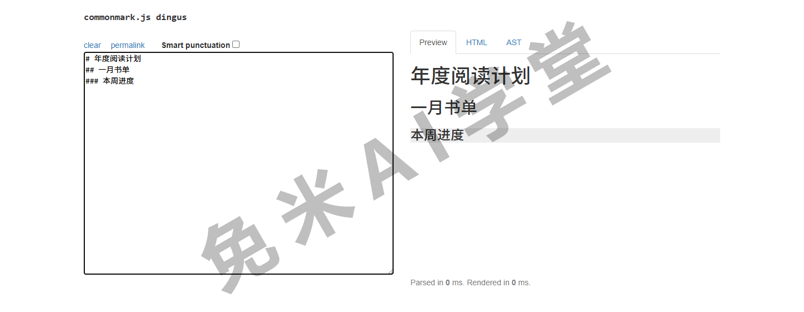
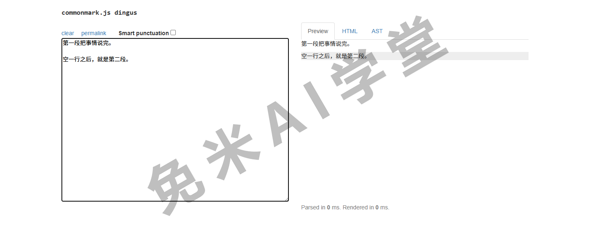
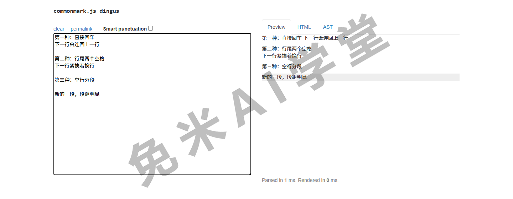
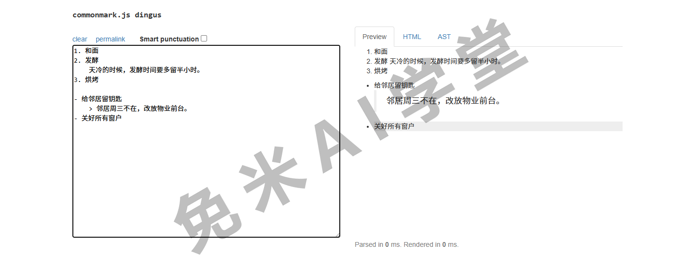
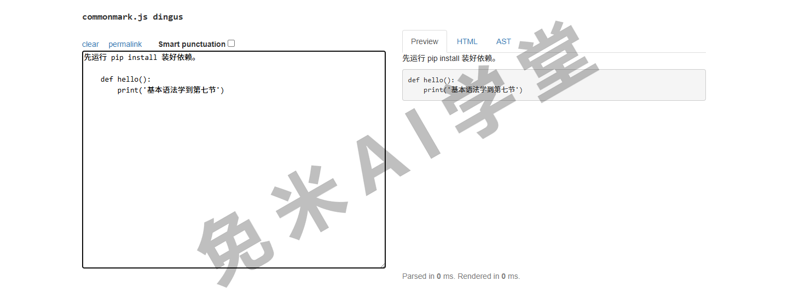
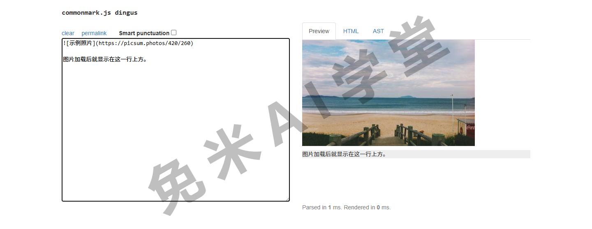
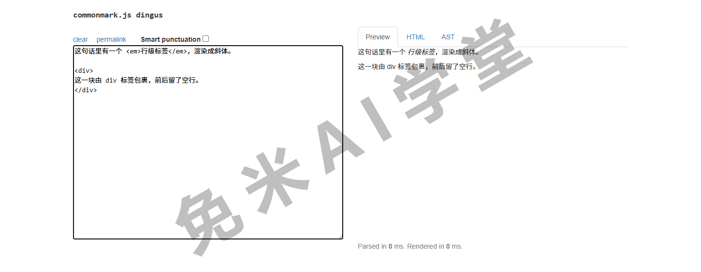

## 基本语法

这一篇把基本语法逐个讲透。基本语法是 Markdown 最初设计里就有的那批元素，几乎所有支持 Markdown 的应用都认它们；把这一篇学完，日常写作需要的排版能力就齐了。

### 3.0 概述

Markdown 的排版语法只有一个目的：让你专注内容本身。常用标记总共不到十个，通读本篇再动手练一轮，半天时间足够。

每节按固定的四步走：先直接给写法；然后给“Markdown 写法、对应 HTML、显示效果”的对照；有第二种写法的，补一段“可选写法”；最后是“最佳实践”，用“应该这样做、不要这样做”的对照表收尾。对照里的 HTML 你不需要会写，那一栏只是让你知道转换之后长什么样（背景见《入门》的工作原理一节），跳过不看也不影响使用。

还有一句口径先说明：本篇示例的显示效果以主流渲染器的表现为准，个别平台在细节上会有出入，判断思路见《入门》的方言一节。

### 3.1 标题

要创建标题，在一行的开头写井号，井号个数就是标题级别，从一级到六级；井号和标题文字之间必须有一个空格。

```text
# 年度阅读计划
## 一月书单
### 本周进度
```

处理器会把它们转换成这样的 HTML（自动完成，无需手写）：

```text
<h1>年度阅读计划</h1>
<h2>一月书单</h2>
<h3>本周进度</h3>
```

显示效果：级别越小字号越大。你正在读的这套教程就是现成的例子，本节标题“3.1 标题”渲染前写作 `### 3.1 标题`，是一个三级标题。



**可选写法**：一级和二级标题还有“下划线式”写法，在文字的下一行铺等号或连字符：

```text
年度阅读计划
============

一月书单
--------
```

等号对应一级，连字符对应二级。这种写法只覆盖前两级，主流用法仍是井号式，认识它主要是为了看懂别人的文件，以及理解 3.8 里分隔线的一个坑。

**最佳实践**：

| ✅ 应该这样做 | ❌ 不要这样做 |
| --- | --- |
| `# 年度计划`，井号后有空格 | `#年度计划`，缺空格，多数平台不识别 |
| 标题上下各留一个空行 | 标题紧贴上下文字，部分平台会解析异常 |

### 3.2 段落

要创建段落，用空行把文字隔开就行：空行之前是一段，之后是新的一段。段内的文字正常连着写。

```text
第一段把事情说完。

空一行之后，就是第二段。
```

处理器会把每段包成一对 `<p>` 标签，显示效果是两个独立段落，段与段之间有明显间距：



**最佳实践**：不要用空格或制表符去缩进段落的开头。行首一旦出现四个空格（或一个制表符），多数处理器会把那一行当成代码块（见 3.7），文字会变成等宽字体的原样展示，这是新手最常见的“排版事故”之一。


| ✅ 应该这样做 | ❌ 不要这样做 |
| --- | --- |
| 段落顶格写，段间用空行 | 行首敲空格或 Tab 做“首行缩进” |

想要首行缩进的排版效果怎么办？原生语法做不到，《变通》里有专门一节讲替代方案。

### 3.3 换行

段内换行（新起一行、但不产生段间距）的原生写法是：在行尾敲两个以上的空格，再回车，习惯上叫“尾随空格法”。

```text
第一行的行尾有两个空格  
第二行紧跟着渲染在它下面
```

上面示例第一行的行尾确实有两个空格，只是肉眼看不见。处理器会在那里生成一个 `<br>` 换行标签，显示效果是两行紧挨着，行距明显小于段距。

**可选写法**：直接在换行处写 HTML 标签 `<br>`（Markdown 里可以内嵌 HTML，3.12 会讲），效果相同而且看得见、丢不了：

```text
第一行的结尾写上换行标签<br>
第二行紧跟着渲染在它下面
```

**最佳实践**：尾随空格是不可见字符，团队协作时容易被同伴误删，一些编辑器保存时也会自动清理行尾空格。对通用性要求高的场合，建议优先 `<br>`；如果两行内容本身独立，干脆用空行分成两段更省心。



| ✅ 应该这样做 | ❌ 不要这样做 |
| --- | --- |
| 用 `<br>` 换行，意图看得见 | 把带尾随空格的文件交给别人还不打招呼 |

### 3.4 强调

加粗用两个星号包裹，斜体用一个星号包裹，又粗又斜用三个星号包裹。

| Markdown 写法 | HTML | 显示效果 |
| --- | --- | --- |
| `这批样品**必须**周五寄出` | `<strong>` | 这批样品**必须**周五寄出 |
| `合同里*最后一条*再核一遍` | `<em>` | 合同里*最后一条*再核一遍 |
| `***以下内容请全文阅读***` | `<em><strong>` | ***以下内容请全文阅读*** |

**可选写法**：星号都可以换成下划线，`__加粗__`、`_斜体_` 同样有效，但有一个例外要记住：想强调一个词的中间部分时，只能用星号。`Mark**down**` 能把 down 加粗，`Mark__down__` 则会原样显示，下划线写法在词内不生效。

**最佳实践**：

| ✅ 应该这样做 | ❌ 不要这样做 |
| --- | --- |
| 词中间加粗用星号：`Mark**down**` | 词中间用下划线：`Mark__down__` |
| 全文统一用一种符号 | 星号、下划线混着用 |

### 3.5 引用块

要创建引用块，在行首加一个大于号和空格。引用多段内容时，段与段之间的空行处也要放一个大于号，引用才不会断开：

```text
> 好记性不如烂笔头。
>
> 记了笔记，还要**常回头翻**。
```

渲染效果如下：

> 好记性不如烂笔头。
>
> 记了笔记，还要**常回头翻**。

引用块里可以嵌套第二层引用，行首写两个大于号 `>>`；也可以容纳标题、列表、加粗这些其他元素（上例第二段里就有一处加粗）。嵌套层的缩进样式各平台略有差异，以实际显示为准。

```text
> 组长转达：
>> 本周例会改到周四上午。
```

**最佳实践**：引用块的前后各留一个空行，避免和上下文粘连；引用内容较长时，别忘了每个空行处的大于号，漏掉会被拆成两个引用块。

| ✅ 应该这样做 | ❌ 不要这样做 |
| --- | --- |
| 引用前后留空行、空行处补 `>` | 引用与正文紧贴，多段引用漏写 `>` |

### 3.6 列表

**有序列表**：数字、点号、空格，然后写内容，每项一行。渲染时的编号会从第一项的数字开始自动排下去，中间写错数字也会被纠正过来：

```text
1. 检查行程单
2. 打印车票
3. 给家里报个平安
```

渲染效果如下：

1. 检查行程单
2. 打印车票
3. 给家里报个平安

**无序列表**：行首用连字符、星号或加号任选一种，后面跟空格：

```text
- 牛奶
- 鸡蛋
- 面包
```

渲染效果如下：

- 牛奶
- 鸡蛋
- 面包

**列表里嵌套其他内容**：列表项下面可以挂段落、引用、代码块、图片，规则都是“缩进对齐”：把那块内容缩进四个空格（或与上一级文字对齐），它就归属到那一项名下。四种各看一例。

嵌套段落，给某一项补充说明，最常用：

```text
1. 和面
2. 发酵
    天冷的时候，发酵时间要多留半小时。
3. 烘烤
```

嵌套引用，在某一项下转述一句话：

```text
- 出发前检查燃气
- 给邻居留钥匙
    > 邻居周三不在，改放物业前台。
- 关好所有窗户
```

嵌套代码块，注意这里要缩进八个空格——四个归列表、四个归代码块（3.7 讲过代码块本身就要四个）：

```text
1. 打开终端
2. 运行安装命令
        pip install requests
3. 看到版本号即成功
```

嵌套图片，路径写法同 3.10：

```text
- 早市的摊位图如下
    
- 下午的路线明天再补
```

嵌套的渲染效果举两例（说明文字、引用各一）：



**一个易踩的坑**：普通句子如果以“数字加点”开头，会被误认成有序列表。比如想写“2026. 年度总结开篇”，要把点号转义成 `2026\. 年度总结开篇`（转义的用法见 3.11）。

**最佳实践**：

| ✅ 应该这样做 | ❌ 不要这样做 |
| --- | --- |
| 同一个列表统一用 `-` | `-`、`*`、`+` 在同一列表里混用 |
| 有序列表从 `1.` 起排 | 行首“数字加点”想原样显示却不转义 |

### 3.7 代码

**行内代码**：用一对反引号包裹，适合命令、文件名、按键、符号本身这类内容。

| Markdown 写法 | HTML | 显示效果 |
| --- | --- | --- |
| `` 先运行 `pip install` 装好依赖 `` | `<code>` | 先运行 `pip install` 装好依赖 |

内容本身含有反引号时，外层改用两个反引号包裹：``这段代码里有一个 ` 号``。

**代码块**：整段代码用“缩进式代码块”，每一行都缩进四个空格：

```text
    def hello():
        print("基本语法学到第七节")
```



日常更常用的是三个反引号包裹的“围栏式代码块”，不用逐行缩进还能标注语言，它属于扩展语法，《扩展语法》里细讲；本教程自己展示示例用的就是围栏式。

**最佳实践**：

| ✅ 应该这样做 | ❌ 不要这样做 |
| --- | --- |
| 命令、文件名用行内代码标出 | 整段代码硬塞进行内反引号里 |

### 3.8 分隔线

单独一行写三个以上的星号、连字符或下划线，都会渲染成一条横贯页面的分隔线：`***`、`---`、`___` 效果相同。

```text
上半场的内容到此为止。

---

下半场从这里开始。
```

渲染效果如下：

---

**最佳实践**：分隔线前后务必各留一个空行。3.1 的可选写法里讲过，文字下一行紧跟一排连字符会被解析成二级标题；`---` 紧贴上一行文字时，触发的正是这个规则，分隔线就变没了。

| ✅ 应该这样做 | ❌ 不要这样做 |
| --- | --- |
| 分隔线独占一行，前后空行 | `---` 紧贴着上一行文字写 |

### 3.9 链接

**行内式链接**：方括号里写显示文字，紧跟的圆括号里写网址，还可以在网址后加一段引号包裹的题注（部分平台悬停时显示）。

| Markdown 写法 | HTML | 显示效果 |
| --- | --- | --- |
| `[示例站点](https://example.com "点击访问")` | `<a href>` | [示例站点](https://example.com "点击访问") |

**网址与邮箱的快捷写法**：用尖括号包裹，`<https://example.com>`、`<hello@example.com>`，会直接变成可点击的链接。

**给链接加格式**：链接整体可以再加粗或标成代码样式，把包裹符号写在方括号外面即可，例如 `**[必读](https://example.com)**`。

**可选写法（引用式链接）**：正文里只放一个短标记，网址集中放到文末定义，正文会干净很多，同一个网址也能复用：

```text
行程参考了[城市漫步指南][guide]，回程也照它安排。

[guide]: https://example.com
```

渲染后，读者看到的只有可点击的“城市漫步指南”，文末的定义行不会显示出来。

**最佳实践**：网址中间不能有空格，确实遇到带空格的地址，把空格写成 `%20`。

| ✅ 应该这样做 | ❌ 不要这样做 |
| --- | --- |
| `https://example.com/my%20doc` | 网址里留着原样空格 |

### 3.10 图片

要插入图片，在链接写法前面加一个感叹号：方括号里写替代文字，圆括号里写图片路径，可选题注：

```text

```

替代文字不是可有可无的装饰：图片加载失败时它会顶上显示，读屏软件也靠它向视障读者描述图片。本教程里的所有配图，用的就是这种写法。



**给图片套链接**：把整个图片写法放进链接的方括号里，图片就成了可点击的封面：

```text
[](https://example.com)
```

**最佳实践**：图片路径优先用相对路径（相对于 md 文件所在文件夹），文件挪到别的电脑照样能显示；盘符开头的绝对路径换一台机器必然裂图。

| ✅ 应该这样做 | ❌ 不要这样做 |
| --- | --- |
| 路径写成相对路径：`图片和附件/图.png` | 盘符绝对路径：`C:\Users\某人\Desktop\图.png` |

### 3.11 转义字符

想让格式符号按原样显示、不触发排版，在符号前面加一个反斜杠。

| Markdown 写法 | 显示效果 |
| --- | --- |
| `\*置顶\* 不是斜体` | \*置顶\* 不是斜体 |

最常用的场景有两类：行首的井号、连字符、“数字加点”想按原样显示（否则会变成标题、列表）；正文里要出现字面的星号、下划线（否则可能触发强调）。

可以用反斜杠转义的字符如下：

| 字符 | 说明 | 字符 | 说明 |
| --- | --- | --- | --- |
| `\` | 反斜杠自身 | `` ` `` | 反引号 |
| `*` | 星号 | `_` | 下划线 |
| `{ }` | 花括号 | `[ ]` | 方括号 |
| `( )` | 圆括号 | `#` | 井号 |
| `+` | 加号 | `-` | 连字符 |
| `.` | 点号 | `!` | 感叹号 |

竖线 `|` 也可转义，主要用在表格单元格里（《扩展语法》的表格一节会讲）。

**最佳实践**：只在符号“确实会触发格式”的位置转义即可，不必见符号就加反斜杠；拿不准的，切到渲染预览看一眼最直接。

| ✅ 应该这样做 | ❌ 不要这样做 |
| --- | --- |
| `2026\. 年度总结开篇` | 给整句每个标点都加反斜杠 |

### 3.12 内嵌 HTML

Markdown 允许在文本里直接写 HTML 标签，处理器会原样放行。对熟悉 HTML 的人，这是原生语法之外的补充手段；不熟悉的也不必专门去学，用到哪个记哪个就够。

行级标签直接写在句子里：

```text
这句话里有一个 <em>行级标签</em>，渲染成斜体。
```

块级元素（例如 `<div>`、`<table>`）有两条格式要求：它的前后要留空行，标签内部的内容不要缩进（缩进会触发 3.7 的代码块规则）：

```text
上一段正文。

<div>
这一块由 div 标签包裹，前后各留了一个空行，内容顶格书写。
</div>

下一段正文。
```



**最佳实践**：各应用对 HTML 的支持范围差别很大，不少笔记类应用会整段过滤 HTML。能用 Markdown 原生语法解决的，先用原生写法；哪些排版需求必须靠 HTML 补位（下划线、居中、调图片大小这些），《变通》整篇都在讲。

| ✅ 应该这样做 | ❌ 不要这样做 |
| --- | --- |
| 原生语法优先，HTML 只补缺口 | 大段版式全用 HTML 写，可移植性尽失 |

### 3.13 练习任务

三个任务接着用你手边的在线 Markdown 编辑器。

**任务一：完整排版一篇小笔记**

把下面这段白文按括号里的要求排成 Markdown：

```text
周末烘焙笔记(一级标题)
方子来自示例站点(把"示例站点"三个字做成链接,指向 https://example.com)
材料(二级标题)
高筋面粉、黄油、海盐(做成无序列表)
步骤(二级标题)
和面、发酵、烘烤(做成有序列表)
在发酵一项下面补一行说明并保持缩进:天冷时多等半小时
结尾原样显示这一句:*比例仅供参考*(星号要按原样显示)
```

完成标准：预览里标题分级正确、链接可点击、说明行归属在“发酵”名下、末句星号原样可见。

**任务二：修好三处经典错误**

下面这段 Markdown 有三处常见错误，逐一找出并修好：

```text
#今日待办
    先把快递取了，再去超市。
另外，把 Mark__down__ 这个词的后半截加粗。
```

完成标准：修好后，第一行渲染成一级标题，第二行是正常段落而不是代码块，第三行的 down 显示为粗体（三处错误分别对应 3.1、3.2、3.4 的最佳实践）。

**任务三：转义挑战**

写一行以“2026.”开头、句中含有字面星号和字面井号的句子，让它渲染后全部原样显示、不触发任何格式。

完成标准：预览里这一行既没有变成有序列表，星号和井号也原样可见；能说出每个反斜杠各自防住了什么。

### 3.14 本篇小结与自检

- [ ] 标题：井号个数定级别，井号后必须有空格，上下留空行
- [ ] 段落用空行分隔，段首不缩进；行首四个空格会触发代码块
- [ ] 换行有三种做法：尾随空格、`<br>`、空行分段，我知道各自的取舍
- [ ] 强调：两星加粗、一星斜体、三星粗斜；词内强调只能用星号
- [ ] 引用块行首加 `>`，多段引用空行处也要补 `>`，引用内可含其他元素
- [ ] 列表：有序“数字点空格”、无序统一一种符号；嵌套内容缩进对齐；行首“数字加点”要转义
- [ ] 行内代码用反引号，内容含反引号时外层用双反引号
- [ ] 链接与图片的写法只差一个感叹号；网址空格写成 `%20`；图片用相对路径
- [ ] 想让符号原样显示，用反斜杠转义
- [ ] HTML 可以内嵌但支持因平台而异，原生语法优先

完成这些内容后，日常写作的排版能力已经完整。下一篇《扩展语法》讲表格、围栏代码块、脚注、任务列表这些增强元素，以及“用之前先确认平台支持”的功课怎么做。

### 3.15 新手常见问题

**Q1：井号打了，标题没变大，为什么？**

九成是两个原因之一：井号后面没有空格，或者井号不在行首。对照 3.1 的最佳实践表检查，再看看标题上一行是否紧贴着其他文字。

**Q2：我敲了回车，预览里怎么没换行？**

单独一个回车在多数处理器里不产生换行。想段内换行，用 3.3 的尾随空格或 `<br>`；想另起一段，空一行。个别平台（比如部分笔记软件）对单回车会直接换行，属于方言差异。

**Q3：有序列表的编号和我写的数字不一样？**

正常现象。渲染编号从第一项的数字起自动递增，中间的数字写错也会被纠正。想让“数字加点”按原样显示而不是变成列表，按 3.6 的做法转义点号。

**Q4：星号和下划线都能强调，我该用哪个？**

建议统一用星号：词内强调只有星号有效，而且下划线在部分平台还与其他写法有歧义。同一份文档保持一种风格即可。

**Q5：转义和行内代码都能显示符号本身，有什么区别？**

转义只是取消符号的排版含义，文字外观不变；行内代码除了原样显示，还会带等宽字体和底色的“代码样式”。讲符号本身用行内代码更醒目，普通叙述里偶尔冒出一个字面星号用转义更自然。
