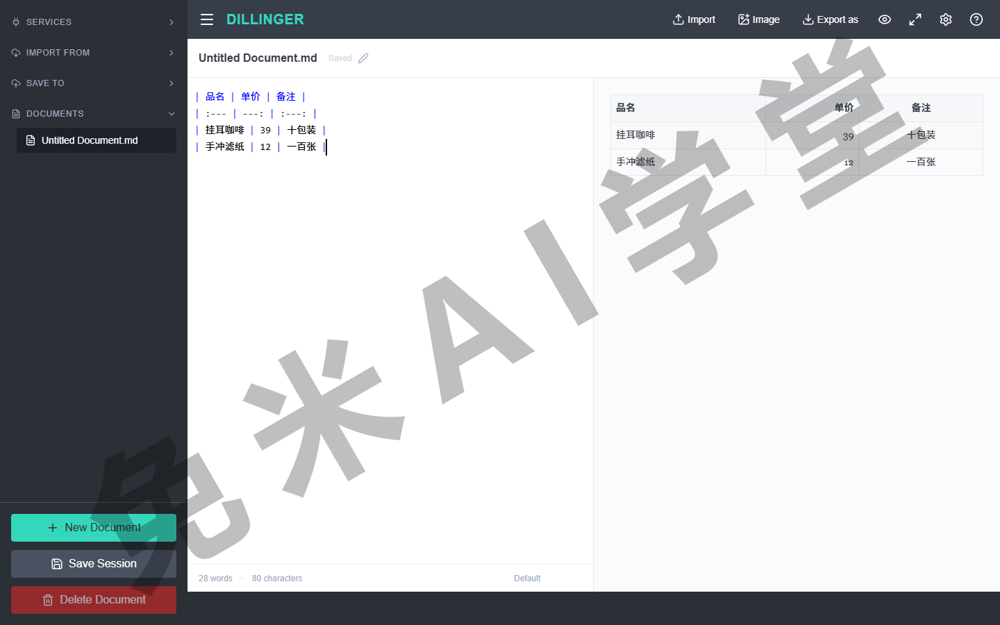
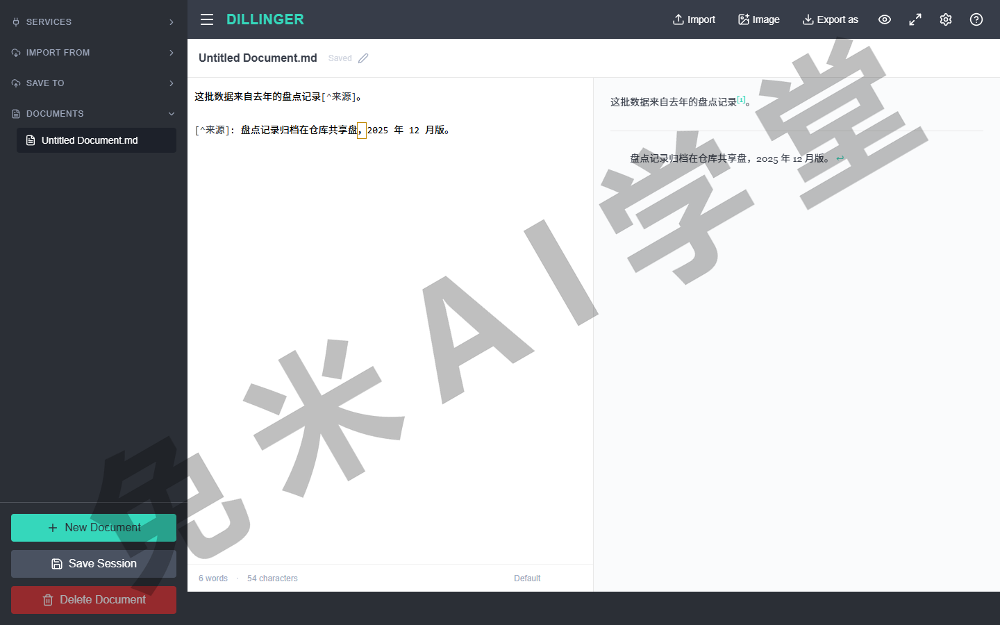
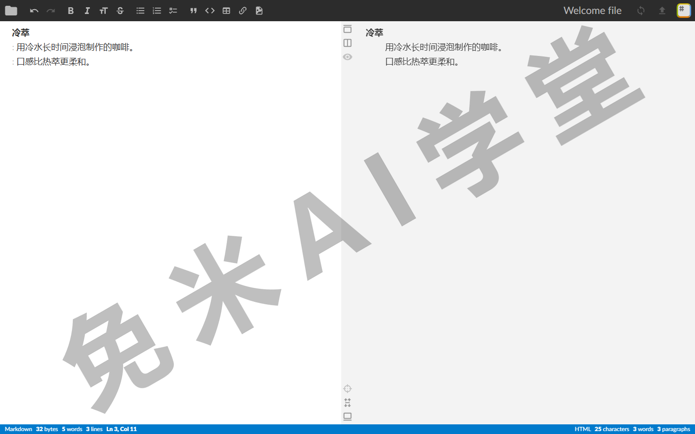
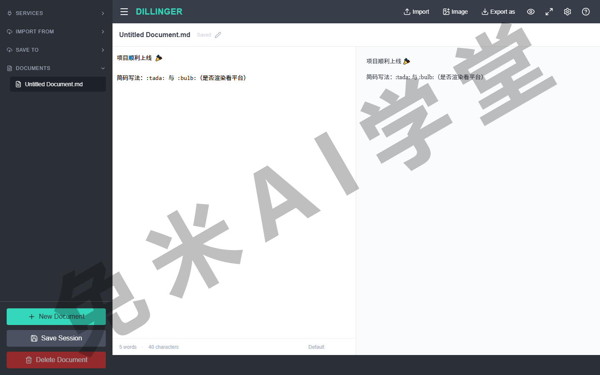

## 扩展语法

《基本语法》解决的是文章骨架，这一篇补上专项能力：表格、带高亮的代码块、脚注、任务列表这些。它们不在 Markdown 最初的设计里，是后来在实践中长出来的，所以多了一件必做的功课：用之前确认你的平台支持它。

### 4.0 概述与可用性

扩展语法从哪里来？主要两条路：

- **方言内建**——一些广泛使用的方言把常用扩展直接收进自家标准，比如 GitHub 使用的 GFM 就内建了表格、删除线、任务列表（方言是什么，《入门》1.6 讲过）；
- **处理器加扩展**——不少 Markdown 处理器支持装扩展插件，应用作者按需启用。

对你来说结论只有一条铁律：**并非所有应用都支持扩展语法**。动笔前查一眼目标应用的文档；更快的办法是把元素直接敲进去看渲染，《速查表》的练习任务二做的就是这件事。本篇按最通用的写法讲解，主流的代码托管平台和常见笔记应用大多支持这批元素，细节以目标平台为准。

### 4.1 表格

要创建表格，用竖线分隔列，并在第一行下方写一行连字符，把第一行定为表头。习惯上连字符每列写三个以上，源码更好读；两端的竖线可以省略，各列宽度也不必对齐。

```text
| 站点 | 值班日 |
| --- | --- |
| 前台 | 周一、周四 |
| 仓库 | 周二、周五 |
```

渲染效果如下：

| 站点 | 值班日 |
| --- | --- |
| 前台 | 周一、周四 |
| 仓库 | 周二、周五 |

**对齐**：在连字符行加冒号控制整列对齐，`:---` 左对齐、`---:` 右对齐、`:---:` 居中：

```text
| 品名 | 单价 | 备注 |
| :--- | ---: | :---: |
| 挂耳咖啡 | 39 | 十包装 |
```



**单元格里能放什么**：行内元素可以，链接、行内代码、加粗斜体都行；标题、引用、列表、分隔线、图片放不进去，这类需求看《变通》的表格格式一节。单元格里要显示竖线本身，用《基本语法》3.11 的转义写法 `\|`：单元格内容写 `A 方案 \| B 方案`，渲染后显示成“A 方案 | B 方案”，不会被拆成两列。

**提效提示**：列一多，手敲对齐很费眼，可以用“Markdown 表格生成器”这类网页工具把表画好、复制生成的源码粘回来（用这个名字搜索即可找到）。

**最佳实践**：

| ✅ 应该这样做 | ❌ 不要这样做 |
| --- | --- |
| 短信息进表格，长内容写正文 | 在单元格里硬塞成段文字 |
| 源码里各列用空格适当对齐，方便日后修改 | 表头行漏写连字符（整张表不渲染） |

### 4.2 围栏代码块

《基本语法》3.7 的缩进式代码块要逐行缩进四个空格，围栏式免了这道工序：上下各三个反引号，中间原样展示。开头的反引号后面标上语言名，还能获得语法高亮。写法如下（为了让反引号本身显示出来，示例用缩进方式展示，实际书写时反引号顶格写）：

    ```python
    def daka(name):
        print(name + " 已到岗")
    ```

渲染效果如下：

```python
def daka(name):
    print(name + " 已到岗")
```

**常用语言标注名**：标注名一般不区分大小写，同一语言往往有全名和别名两种写法。下表是各平台普遍支持的一批；完整名单以目标平台文档为准，拿不准就写全名，再不认就退回 `text`，只是没有高亮、不影响内容显示：

| 语言 | 标注名 | 语言 | 标注名 |
| --- | --- | --- | --- |
| Python | `python` 或 `py` | JavaScript | `javascript` 或 `js` |
| TypeScript | `typescript` 或 `ts` | HTML | `html` |
| CSS | `css` | JSON | `json` |
| Shell 脚本 | `bash`、`sh` | SQL | `sql` |
| Java | `java` | C 与 C++ | `c`、`cpp` |
| C# | `csharp` 或 `cs` | Go | `go` |
| Rust | `rust` | PHP | `php` |
| Ruby | `ruby` | YAML | `yaml` |
| XML | `xml` | 纯文本 | `text`（不高亮） |

要在文档里展示三个反引号本身，常用两个办法：标准做法是外层用四个反引号包裹（个别渲染器处理不好这种嵌套）；更稳妥的是像本节开头的示例那样改用缩进式代码块，什么渲染器都认。

**最佳实践**：

| ✅ 应该这样做 | ❌ 不要这样做 |
| --- | --- |
| 标注语言名，获得高亮 | 整段代码硬塞进行内反引号 |

### 4.3 脚注

要添加脚注，在正文放一个 `[^1]` 式的标记（数字或自定义名字都行），再在文档任意位置（习惯放文末）写 `[^1]: 注文` 定义内容。渲染后正文出现一个上标序号，点击跳到页尾的注文，注文旁通常有回跳链接。

```text
这批数据来自去年的盘点记录[^来源]。

[^来源]: 盘点记录归档在仓库共享盘，2025 年 12 月版。
    需要第二段注文时，缩进四个空格接着写，仍属于这一条脚注。
```

注文可以写多段，写法就是上例的最后一行：后续段落缩进四个空格。



**支持面提醒**：脚注在文档类平台（代码托管站、文档站生成器）支持较好，轻量笔记应用未必认。不支持时的退路是手写“注 1：”放在文末，虽然不能跳转，语义完全一样。

**最佳实践**：

| ✅ 应该这样做 | ❌ 不要这样做 |
| --- | --- |
| 用有含义的标记名：`[^盘点]` | 同一个标记定义两次（行为不可预期） |

### 4.4 标题编号（自定义 ID）

要给标题起一个固定的锚点名，在标题末尾加花括号：`### 库存盘点 {#inventory}`。之后就能用 `[见盘点一节](#inventory)` 做页内跳转，或者把 `#inventory` 挂在页面网址后面直达该节（形如 `https://example.com/文档页#inventory`）。长文导航、给同事发“直达某节”的链接，靠的就是它。

```text
### 库存盘点 {#inventory}

……

结论回顾请见[盘点一节](#inventory)。
```


**支持面提醒**：不少平台不认花括号这种自定义写法，但会按标题文字自动生成锚点（多数代码托管平台是这样），两种机制并存，以平台实际为准；《变通》的目录一节会用到这里的知识。另外说明一句：这个元素渲染出来就是普通标题，编号本身不显形，效果全在“能被链接跳转”上，所以本节没有单独的预览图，跳转效果在你自己的平台上点一次最直观。

**最佳实践**：

| ✅ 应该这样做 | ❌ 不要这样做 |
| --- | --- |
| ID 用小写字母和连字符，短而稳定 | ID 里放空格（多数平台失效） |

### 4.5 定义列表

要排“术语加解释”的词典式内容，术语单独一行，下一行以冒号加空格开头写定义；一个术语可以跟多条定义：

```text
冷萃
: 用冷水长时间浸泡制作的咖啡。
: 口感比热萃更柔和。
```

渲染后术语顶格、定义缩进，对应 HTML 的定义列表标签：



**支持面提醒**：这是支持面最窄的扩展元素之一，多数轻量笔记应用不认。不支持时的退路是加粗术语加正常段落，视觉效果接近，例如把上例改写成 `**冷萃**——用冷水长时间浸泡制作的咖啡。`

**最佳实践**：

| ✅ 应该这样做 | ❌ 不要这样做 |
| --- | --- |
| 先确认平台支持再用 | 不支持的平台硬用（冒号行原样露出） |

### 4.6 删除线

用两条波浪线包裹文字，渲染成删除线：

| Markdown 写法 | HTML | 显示效果 |
| --- | --- | --- |
| `~~周六的安排取消~~ 改到周日` | `<del>` | ~~周六的安排取消~~ 改到周日 |

适合勘误留痕、划掉作废项，改动过程一目了然。个别平台一条波浪线也能触发删除线，但别依赖，统一写两条。

**最佳实践**：

| ✅ 应该这样做 | ❌ 不要这样做 |
| --- | --- |
| 统一 `~~双波浪线~~` | 依赖单波浪线的平台特例 |

### 4.7 任务列表

在无序列表的基础上加一对方括号：`- [ ]` 是未完成，`- [x]` 是已完成，方括号里恰好一个空格或一个 x。

```text
- [x] 订门票
- [ ] 查天气
- [ ] 收拾背包
```

渲染效果如下：

- [x] 订门票
- [ ] 查天气
- [ ] 收拾背包


一些平台上复选框可以直接点击勾选，点一下会自动改写源文本里的 x，适合拿来做轻量任务管理；是否可交互以平台为准。

**最佳实践**：

| ✅ 应该这样做 | ❌ 不要这样做 |
| --- | --- |
| `- [ ]` 各部分之间留好空格 | 写成 `-[]`（挤在一起不渲染） |

### 4.8 Emoji

往文档里加表情符号有两条路：

- **复制粘贴法**——从表情百科类网站（例如 Emojipedia）把符号复制过来，直接粘进文档，例如写下 `项目顺利上线 🎉`，渲染后表情原样显示。最通用，所见即所得；做静态网站的注意源文件用 UTF-8 编码保存，避免乱码。
- **简码法**——用一对冒号包裹简码，例如 `:tada:`、`:bulb:`，渲染时替换成对应表情。写起来快，但简码表因平台而异，某个平台认的简码换个地方可能原样露出冒号。

下面这张实测图恰好把两条路的差别拍全了：粘贴的表情正常渲染，简码在这个平台原样露出，印证“简码看平台”：



**最佳实践**：

| ✅ 应该这样做 | ❌ 不要这样做 |
| --- | --- |
| 对外发布的文档用复制粘贴法 | 跨平台文档依赖简码 |

### 4.9 自动网址链接与禁用

多数处理器会把裸网址自动转成可点击的链接，直接写 https://example.com 就能点，效果与《基本语法》3.9 的尖括号写法相同。

反过来，如果不想让一个网址变成链接（比如它只是个示例），把它写成行内代码：`https://example.com`，链接化就被禁用了。

**最佳实践**：

| ✅ 应该这样做 | ❌ 不要这样做 |
| --- | --- |
| 示例网址用行内代码包住 | 靠删掉协议头防成链（部分平台照样识别） |

### 4.10 练习任务

三个任务继续在你的常用编辑器里做。

**任务一：三种对齐的报价表**

做一张三列表格：品名列左对齐、单价列右对齐、备注列居中；表内至少一处行内代码、一处加粗。

完成标准：渲染后三列对齐方式肉眼可辨；源码里冒号位置能对上 4.1 的规则。

**任务二：给待办笔记加装备**

把下面的白文按括号要求排出来：

```text
周末大扫除清单(做成任务列表,前两项标为已完成)
擦窗、拖地、整理书桌、清阳台
把"清阳台"一项划掉(临时取消),并加一个脚注说明原因:
阳台下周要装晾衣架,先不动
```

完成标准：任务列表渲染出复选框且前两项已勾；“清阳台”带删除线；脚注标记可跳转（平台不支持脚注的，按 4.3 的退路处理并说明）。

**任务三：扩展语法支持面普查**

把 4.1 至 4.9 的九个元素逐个敲进你最常用的平台，用 4.1 学的表格语法做一张“元素、是否支持”两列表，一举两得。

完成标准：表格本身渲染正常；九行结论填齐，能说出哪几个元素在你的平台要用退路方案。

### 4.11 本篇小结与自检

- [ ] 我知道扩展语法的两条来路（方言内建、处理器扩展），以及“用前查支持”这条铁律
- [ ] 表格：竖线分列、连字符行定表头、冒号控制对齐；单元格只认行内元素
- [ ] 围栏代码块：三反引号免缩进，标语言名开高亮；展示反引号本身用四反引号
- [ ] 脚注：正文标记加文末定义；不支持时手写“注 1：”兜底
- [ ] 标题编号：自定义 ID 做锚点；平台不认时还有自动锚点机制
- [ ] 定义列表支持面窄，退路是加粗术语加正文段
- [ ] 删除线统一双波浪线；任务列表的方括号里恰好一个空格或 x
- [ ] Emoji 首选复制粘贴法；裸网址自动成链，行内代码可禁用

完成这些内容后，Markdown 原生能力已全部在手。还有一批原生做不到的排版需求（下划线、居中、视频这些），下一篇《变通》给出替代方案。

### 4.12 新手常见问题

**Q1：表格里想显示竖线本身，怎么办？**

用转义写法 `\|`（《基本语法》3.11）。不转义的竖线会被当成列分隔符，表格结构就乱了。

**Q2：单元格里想换行、想放列表，怎么办？**

原生做不到，要借助内嵌 HTML，《变通》的表格格式一节专门讲；也先想一想是不是该把内容挪出表格。

**Q3：任务列表打出来没有复选框，为什么？**

先检查格式：连字符、方括号、内容之间的空格都不能省，方括号里要么一个空格要么一个 x。格式没错就是平台不支持任务列表，属于方言差异。

**Q4：脚注标记显示成了原样的方括号？**

你的平台不支持脚注。按 4.3 的退路改成手写“注 1：”，或者换一个支持脚注的平台发布。

**Q5：别人文档里的表情符号，到我这里变成了两个冒号夹一个单词？**

那是简码法的表情，你的平台不认这套简码。把对应表情用复制粘贴法替换掉即可。
