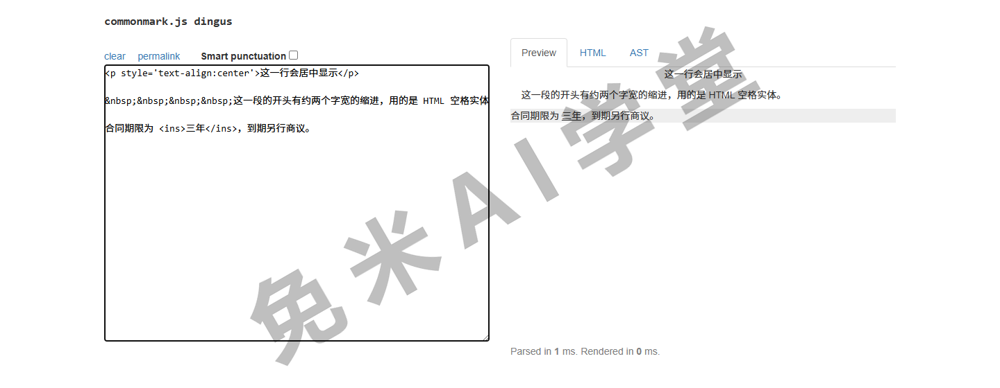
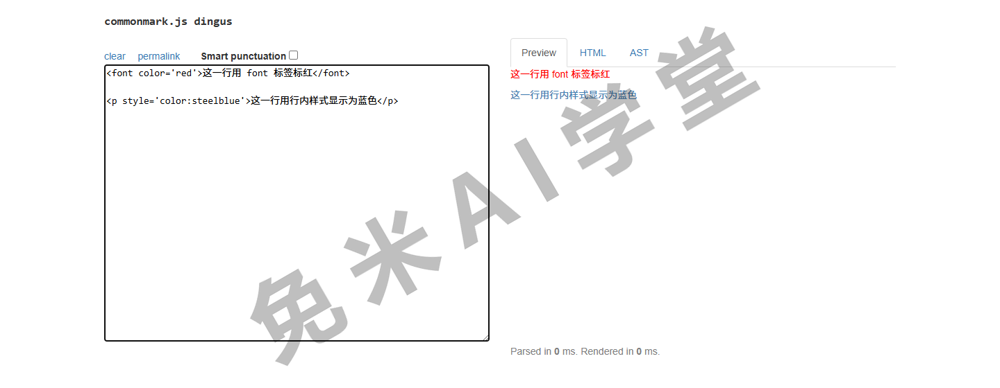
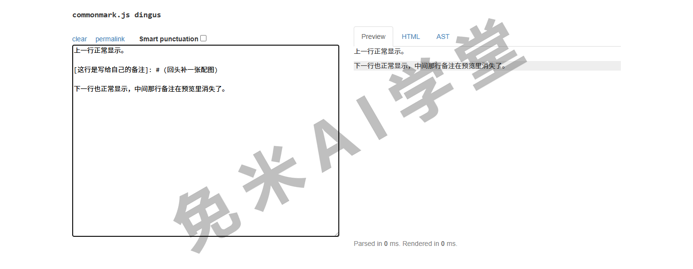
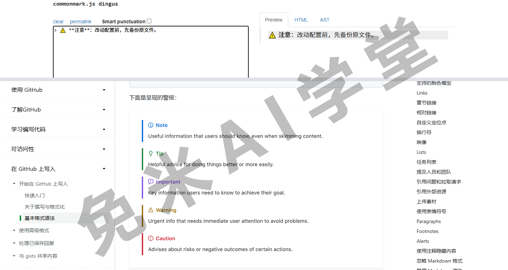
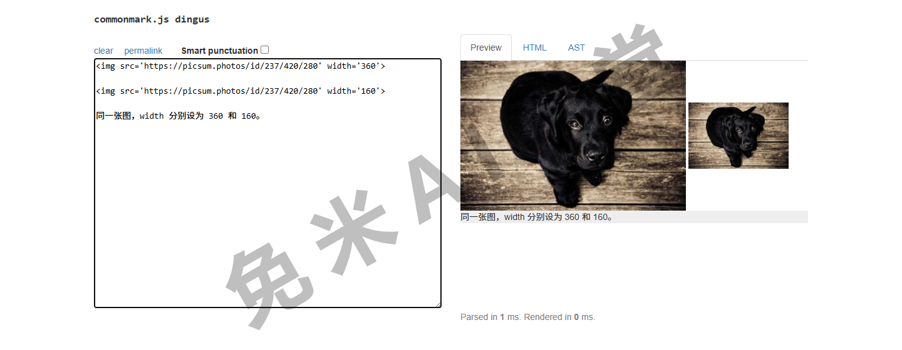
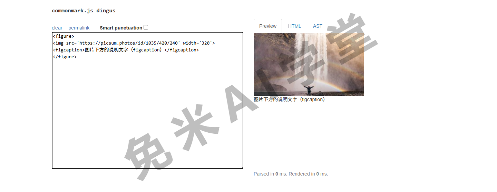
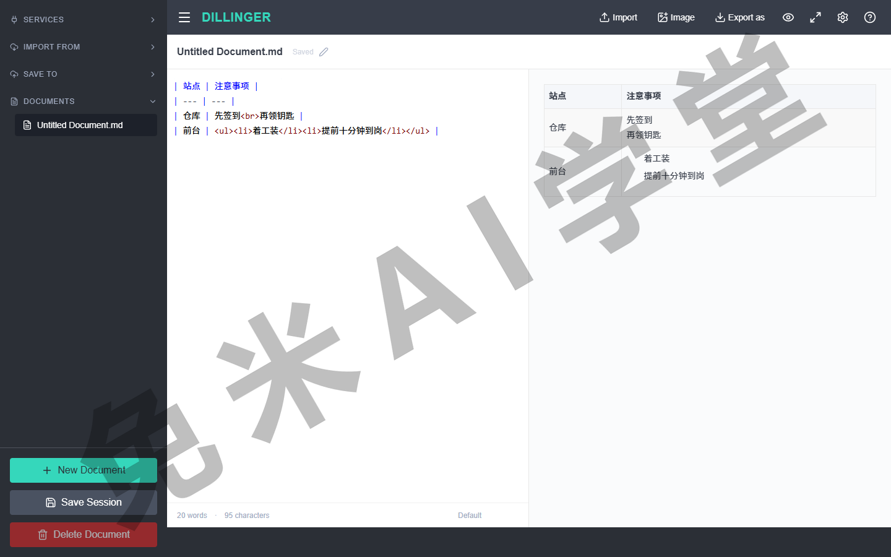
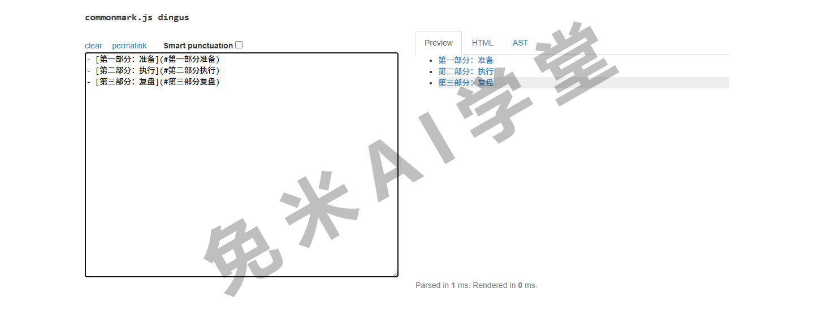
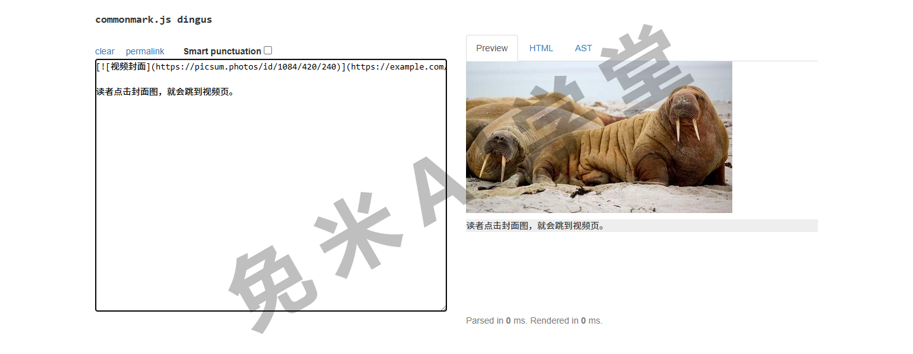

## 变通

基本语法加扩展语法学完，仍有一批常见排版需求是 Markdown 原生做不到的：下划线、居中、文字颜色、插视频……这一篇把常用的替代写法一次给全。绝大多数变通靠的是内嵌 HTML，规则在《基本语法》3.12 讲过：行级标签直接写，块级标签前后留空行、内部不缩进。

### 5.0 概述

一条重要提示放在最前面：**变通写法不保证在所有应用里生效**。尤其是很多笔记类应用会过滤 HTML，标签发出去就被吞掉。所以用任何变通之前，先在目标平台试一小段；发布后再抽查一眼。

另一条判断标准也先立好：如果你发现自己处处都在依赖变通写法，那说明这份文档可能不适合用 Markdown 承载，考虑换专门的排版工具。变通是补缺口的，不是主粮。

下面每节按同一个节奏走：原生为什么不支持，替代写法是什么，渲染出来什么效果。

### 5.1 下划线

原生没有下划线语法，这是有意为之：网页语境里带下划线的文字通常会被读者当成链接，容易误导。确实需要时，用行级标签 `<ins>`：

```text
合同期限为 <ins>三年</ins>，到期另行商议。
```

渲染后“三年”两个字带下划线显示（前提是平台放行 HTML）。

### 5.2 缩进（Tab）

原生把行首的空格和制表符留给了代码块与列表嵌套（《基本语法》3.2 讲过缩进误触），段首缩进没有正规写法。替代方案是在段首连写四个 HTML 空格实体：

```text
&nbsp;&nbsp;&nbsp;&nbsp;这一段的开头有约两个字宽的缩进。
```

中文写作里也常用另一招：段首直接敲两个全角空格，部分编辑器保存时不会清理它。两种写法在不同渲染器里的表现差异较大（需实机验证:两种缩进写法在主流渲染器的实际效果），发布前务必在目标平台预览确认。

### 5.3 文字居中

原生没有对齐概念。替代写法两种：`<center>` 标签，HTML 标准已把它标记为废弃、但多数浏览器仍然支持；更规范的是带行内样式的段落标签：

```text
<center>这一行用 center 标签居中</center>

<p style="text-align:center">这一行用行内样式居中</p>
```

渲染后两行都会水平居中。



### 5.4 文字颜色

原生不支持改文字颜色。替代写法同样两种：`<font color="red">`（已废弃仍广泛支持）或行内样式：

```text
<font color="red">这一行用 font 标签标红</font>

<p style="color:steelblue">这一行用行内样式显示为蓝色</p>
```

颜色可以写名称，也可以写十六进制码（如 `#ff6600`）。提醒一句：笔记类平台过滤 style 属性的很常见，这一招在博客、自建网站里更可靠。



### 5.5 注释（渲染时隐藏的内容）

想在源文件里留备忘、渲染时不显示，有一个非官方但流传很广的写法：

```text
[这行是写给自己的备注]: # (回头补一张配图)
```



渲染时整行不可见。注意两点：它本质是借用了链接定义的语法，个别平台可能露出原文，用前试一下；另外它只是“不渲染”，任何人打开源文件都看得到，别写敏感内容。

### 5.6 警告框

原生没有提示框、警告框组件。通用的模拟做法是引用块加表情符号加加粗：

```text
> :warning: **注意**：改动配置前，先备份原文件。
```

渲染出来是一条醒目的引用条，表情符号当图标使。另外，一些平台有自家的原生提示框语法（形如 `> [!NOTE]` 的写法，部分代码托管平台与笔记应用支持，名称与样式以平台文档为准），平台支持的话优先用原生的，样式更正式。



### 5.7 调整图片大小

原生图片语法不带尺寸参数，图有多大显示多大。要控制尺寸，改用 `` 标签：

```text

```

width 的单位是像素；只设宽度时高度会等比缩放，一般不必两个都写。



### 5.8 图片标题（Caption）

想在图片下方带一行说明文字，规范做法是 `<figure>` 配 `<figcaption>`：

```text
<figure>
    
    <figcaption>项目组在天台的合影</figcaption>
</figure>
```



渲染后说明文字居中显示在图下方。嫌标签多，还有个零成本变通：图片下一行紧跟一行斜体文字，视觉效果接近，兼容性最好：

```text

*项目组在天台的合影*
```

### 5.9 用新标签页打开链接

原生链接语法控制不了打开方式。要让读者点击后在新标签页打开，用 `<a>` 标签：

```text
<a href="https://example.com" target="_blank">在新标签页打开示例站</a>
```

`target="_blank"` 就是“新标签页”的开关。只有个别链接需要这样时再用，全文链接都套标签会显著降低源码可读性。渲染出来的样子就是一个普通链接，差别全在点击后的打开行为上，静态截图看不出来，所以本节不配预览图，动手点一次最直观。

### 5.10 符号（特殊字符）

版权号、箭头、温度这类键盘上没有的符号，两条路：直接复制粘贴符号本身（最省事，推荐）；或写 HTML 实体码，渲染时替换成符号。常用的十个：

| 符号 | 实体写法 | 符号 | 实体写法 |
| :---: | --- | :---: | --- |
| © | `&copy;` | ® | `&reg;` |
| ™ | `&trade;` | € | `&euro;` |
| ← | `&larr;` | → | `&rarr;` |
| ↑ | `&uarr;` | ↓ | `&darr;` |
| ° | `&deg;` | π | `&pi;` |

### 5.11 表格格式（换行与列表）

《扩展语法》4.1 说过，表格单元格只认行内元素。要在单元格里换行，用 `<br>`；要放列表，用 `<ul><li>`：

```text
| 站点 | 注意事项 |
| --- | --- |
| 仓库 | 先签到<br>再领钥匙 |
| 前台 | <ul><li>着工装</li><li>提前十分钟到岗</li></ul> |
```

渲染后第一格分两行，第二格是两项列表：



也提醒一句：单元格里都塞下列表了，多半说明表格已经超载，先考虑把内容拆成正文小节。

### 5.12 目录

长文开头的目录，部分解析器能自动生成（比如支持写一行 `[TOC]` 的平台，以平台文档为准）。不支持的，用锚点列表手动做一个：

```text
- [第一部分：准备](#第一部分准备)
- [第二部分：执行](#第二部分执行)
```



锚点的生成规则各平台不同（《扩展语法》4.4 讲过自动锚点与自定义 ID 两种机制），目录做完把每一项点一遍验证，这一步不能省。

### 5.13 插入视频

Markdown 原生完全不管视频。两条路：

**分享代码嵌入**——视频平台的“分享”面板一般提供一段嵌入代码（`<iframe>` 开头的一段 HTML），原样粘进文档即可。形态大致如下，具体以你从平台复制到的代码为准：

```text
<iframe src="https://example.com/player?vid=示例编号"
    width="640" height="360" frameborder="0"
    allowfullscreen></iframe>
```

能否生效取决于目标平台是否放行 iframe：多数笔记与文档平台不放行，博客和自建网站更可行。宽高参数可以按版面调整，比例以 16:9 居多。

**封面图套链接**——最稳妥的变通，用《基本语法》3.10 的图片套链接：读者点封面图跳到视频页，所有支持图片和链接的平台都有效：

```text
[](https://example.com/视频页)
```



### 5.14 练习任务

前两个任务请在一个支持内嵌 HTML 的编辑器里做（多数桌面编辑器和在线编辑器都支持，被过滤了就换一个再试）。

**任务一：三件套小样**

给一篇短文做出三个效果：居中的标题行、首行缩进的段落、一处下划线。

完成标准：三个效果预览可见；能说出其中哪一处用了“已废弃但仍可用”的标签，它的规范替代写法是什么。

**任务二：超载表格改造**

先做一张 5.11 式的表格：一列里有换行、一列里放两项列表；再把同样的内容改写成“正文小节”版本。

完成标准：两个版本都渲染正常；能说出这份内容更适合哪个版本、为什么。

**任务三：变通支持面扫描**

把本篇十三种变通在你最常用的发布平台逐个试一遍，重点观察哪些 HTML 被过滤。

完成标准：能报出你的平台“可用、被过滤、部分可用”三类各有哪些；对被过滤的，能说出退路（换写法、换平台或放弃该效果）。

### 5.15 本篇小结与自检

- [ ] 我知道变通的本质是用内嵌 HTML 补原生语法的缺口，平台过滤是最大变数
- [ ] 下划线用 `<ins>`；居中和颜色靠 `<center>`、`<font>` 或行内样式，前两者已废弃仍广泛支持
- [ ] 段首缩进用 HTML 空格实体或全角空格，发布前必须实测
- [ ] 注释写法能藏内容于渲染，但源文件里人人可见
- [ ] 警告框可用引用块模拟，平台有原生提示框语法时优先用原生
- [ ] 图片改尺寸、加说明分别用 `` 和 `<figure>`，斜体行是零成本替代
- [ ] 表格内换行用 `<br>`、放列表用 `<ul><li>`，超载先想拆表
- [ ] 目录、视频各有一手方案与一手变通，做完逐项验证
- [ ] 处处依赖变通时，重新评估该不该用 Markdown

完成这些内容后，原生加变通的完整排版工具箱就齐了。最后一篇《工具》解决“用什么写”：编辑器怎么挑、方言规范有哪些、解析引擎是怎么回事。

### 5.16 新手常见问题

**Q1：我的平台把 HTML 全过滤了，变通全军覆没，怎么办？**

先确认是全过滤还是选择性过滤（`<br>`、`` 常常被保留）。全过滤就接受现实：用原生语法能达到的排版为准，或换发布平台。

**Q2：`&nbsp;` 直接显示成了这串字符本身？**

说明平台没有把实体码当 HTML 解析。换全角空格试试；再不行，这个平台上就别做首行缩进了。

**Q3：注释写法安全吗？**

渲染层面不可见，源文件层面完全可见。协作仓库、公开仓库里的 md 源码人人能读，注释只适合放无害的备忘。

**Q4：`<center>` 都废弃了还能教吗？**

废弃指的是 HTML 标准不再推荐，浏览器出于兼容仍普遍支持，所以它依然是最省事的居中写法。讲究规范就用行内样式版本，效果一样。

**Q5：用多少变通算“过头”？**

没有硬指标，给一个经验判断：一篇文档里变通只出现在个别点缀处（一处居中、一两张控宽的图）算正常；几乎每段都要靠 HTML 才能达到预期版式，就该考虑换工具了。
