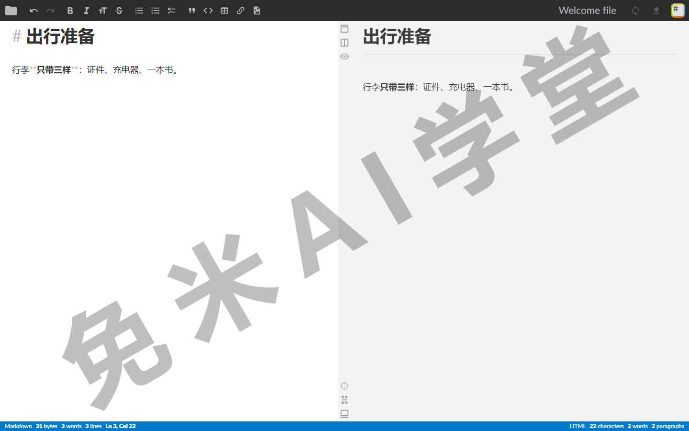
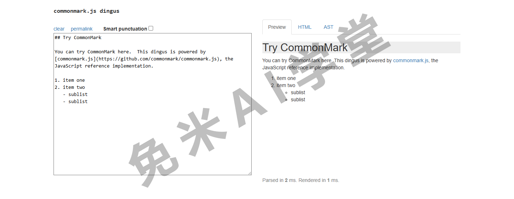

## 工具

语法在前五个板块里讲完了，最后解决“用什么写”。这一篇给出编辑器清单、常见方言规范和解析引擎一览。清单在撰写时逐个核对过项目现状，但工具的维护状态和价格随时会变，动手安装前以各官网为准。

### 6.1 编辑器

挑编辑器之前先回答三个问题：你在什么设备上写？主要写什么（随手笔记、长文、技术文档）？想不想要“边写边变样式”的即时渲染？带着答案看下面的分组。

**跨平台桌面编辑器**：

- **VS Code**——免费，本职是代码编辑器，装上 Markdown 相关插件后写文档同样顺手，自带分屏预览；经常和代码打交道的人首选；
- **Typora**——买断制收费，即时渲染的代表：敲完符号立刻变样式，全程不见源码，写作沉浸感最好，价格以官网为准；
- **Obsidian**——免费（个人使用），以“笔记库加双向链接”见长，适合把 Markdown 当第二大脑的用法；
- **MarkText**——免费开源，体验与 Typora 类似；曾停滞数年，2026 年起由原作者恢复活跃维护、版本更新频繁，官网与安装包以其代码仓库页为准；
- **Zettlr**——免费开源，面向学术写作，引用文献管理是特色。

**macOS 平台**：

- **妙言**——免费开源的轻量中文编辑器，界面干净；
- **iA Writer**——买断制收费，极简专注写作；
- **Ulysses**——订阅制，适合按项目管理长篇书稿。

**移动端**：iA Writer 有 iOS 版本；更常见的做法是直接用支持 Markdown 的笔记应用（Obsidian、思源笔记这类都有手机端），清单以各应用商店为准。

**通用文本编辑器**：Sublime Text、Vim（配 Markdown 插件）、Notepad++ 都能胜任纯文本编辑，本来就常驻这些工具的人不必搬家，缺的只是预览，可以配合浏览器插件或导出工具补上。

**在线编辑器**：不装任何东西就能写，《入门》1.3 推荐的起步方式：

- **StackEdit**——功能全，可同步到网盘，离线也能用；
- **Dillinger**——轻快简洁，导出 HTML、PDF 方便；
- **HackMD**——主打多人实时协作，团队共写文档时好用。

### 6.1 编辑器

挑编辑器之前先回答三个问题：你在什么设备上写？主要写什么（随手笔记、长文、技术文档）？想不想要“边写边变样式”的即时渲染？带着答案看下面的分组。

**跨平台桌面编辑器**：

- [VS Code](https://code.visualstudio.com/)（https://code.visualstudio.com/）——免费，本职是代码编辑器，装上 Markdown 相关插件后写文档同样顺手，自带分屏预览；经常和代码打交道的人首选；
- [Typora](https://typora.io/)（https://typora.io/）——买断制收费，即时渲染的代表：敲完符号立刻变样式，全程不见源码，写作沉浸感最好，价格以官网为准；
- [Obsidian](https://obsidian.md/)（https://obsidian.md/）——免费（个人使用），以“笔记库加双向链接”见长，适合把 Markdown 当第二大脑的用法；
- [MarkText](https://github.com/marktext/marktext)（https://github.com/marktext/marktext）——免费开源，体验与 Typora 类似；曾停滞数年，2026 年起由原作者恢复活跃维护、版本更新频繁，官网与安装包以其代码仓库页为准；
- [Zettlr](https://www.zettlr.com/)（https://www.zettlr.com/）——免费开源，面向学术写作，引用文献管理是特色。

**macOS 平台**：

- [妙言](https://github.com/tw93/MiaoYan)（https://github.com/tw93/MiaoYan）——免费开源的轻量中文编辑器，界面干净；
- [iA Writer](https://ia.net/writer)（https://ia.net/writer）——买断制收费，极简专注写作；
- [Ulysses](https://ulysses.app/)（https://ulysses.app/）——订阅制，适合按项目管理长篇书稿。

**移动端**：[iA Writer](https://ia.net/writer)（https://ia.net/writer）有 iOS 版本；更常见的做法是直接用支持 Markdown 的笔记应用（[Obsidian](https://obsidian.md/)（https://obsidian.md/）、[思源笔记](https://b3log.org/siyuan/)（https://b3log.org/siyuan/）这类都有手机端），清单以各应用商店为准。

**通用文本编辑器**：[Sublime Text](https://www.sublimetext.com/)（https://www.sublimetext.com/）、[Vim](https://www.vim.org/)（https://www.vim.org/）（配 Markdown 插件）、[Notepad++](https://notepad-plus-plus.org/)（https://notepad-plus-plus.org/）都能胜任纯文本编辑，本来就常驻这些工具的人不必搬家，缺的只是预览，可以配合浏览器插件或导出工具补上。

**在线编辑器**：不装任何东西就能写，《入门》1.3 推荐的起步方式：

- [StackEdit](https://stackedit.io/)（https://stackedit.io/）——功能全，可同步到网盘，离线也能用；
- [Dillinger](https://dillinger.io/)（https://dillinger.io/）——轻快简洁，导出 HTML、PDF 方便；
- [HackMD](https://hackmd.io/)（https://hackmd.io/）——主打多人实时协作，团队共写文档时好用。

**浏览器扩展**：Markdown Here，在网页邮箱里用 Markdown 写邮件再一键转排版（《入门》1.5 提过）。浏览器版本仍可安装、更新节奏较慢；Thunderbird 邮件客户端的用户改用社区接续维护的 Markdown Here Revival，以各扩展商店页为准。

**横向对比**：上面点过名的主力工具放到一张表里对照（收费与功能随版本变化，以官网为准）：

| 编辑器 | 平台 | 收费 | 渲染方式 | 一句话特色 |
| --- | --- | --- | --- | --- |
| VS Code | Win、Mac、Linux | 免费 | 分屏预览 | 程序员的全能工位 |
| Typora | Win、Mac、Linux | 买断制 | 即时渲染 | 沉浸写作体验最顺 |
| Obsidian | 桌面加移动端 | 个人免费 | 即时渲染 | 笔记库与双向链接 |
| MarkText | Win、Mac、Linux | 免费开源 | 即时渲染 | 类 Typora，2026 年恢复维护 |
| Zettlr | Win、Mac、Linux | 免费开源 | 编辑区内渲染 | 学术写作与文献引用 |
| 妙言 | macOS | 免费开源 | 分屏预览 | 轻量、中文界面 |
| iA Writer | Mac、iOS、Win | 买断制 | 分屏预览 | 极简专注 |
| Ulysses | Mac、iOS | 订阅制 | 即时渲染 | 长文项目管理 |
| StackEdit | 浏览器 | 免费 | 分屏预览 | 网盘同步、离线可用 |
| Dillinger | 浏览器 | 免费 | 分屏预览 | 轻快、导出方便 |
| HackMD | 浏览器 | 免费起步 | 分屏预览 | 多人实时协作 |

**一句话建议**：新手先用在线编辑器把语法学完，再按三个问题挑常驻工具；无论选哪款，坚持两条底线——对 Markdown 支持良好、文件以本地纯文本存储，这正是《入门》1.6 保住可移植性的做法。

### 6.2 Markdown 扩展（方言规范）

下面五个名字经常出现在各种应用的说明文档里，认识它们，看到时能对上号即可，不必深究：

- **CommonMark**——把“标准 Markdown”写成严格规范的努力，许多现代解析器以它为基准；想较真某个写法的标准行为，去它官网的在线试写工具验证（《入门》1.7 提过）；
- **GFM（GitHub Flavored Markdown）**——GitHub 使用的方言，在 CommonMark 基础上加了表格、删除线、任务列表、自动链接等扩展；因为 GitHub 的体量，它成了事实标准，本教程《扩展语法》讲的元素与它高度重合；
- **MultiMarkdown**——老牌扩展方言，面向学术与出版场景，脚注、引用文献支持较全；
- **Pandoc Markdown**——文档转换工具 Pandoc 的方言，功能最全，需要“Markdown 转 Word、PDF、电子书”的人绕不开它；
- **PHP Markdown Extra**——早期的扩展规范，定义列表、脚注等特性的出处之一，如今更多是历史与参考意义。

CommonMark 官网的在线试写工具长这样，《扩展语法》里拿不准的写法，随时可以丢进去看标准答案：

### 6.3 解析引擎

解析引擎（就是《入门》1.4 说的“处理器”）面向想做二次开发的读者：给自己的网站、工具加上 Markdown 支持时才会接触，普通写作者认知即可，不用记。

- **JavaScript**：marked（轻快）、markdown-it（插件生态丰富）；
- **C**：cmark（CommonMark 的参考实现）；
- **Go**：goldmark（静态网站生成器 Hugo 在用）；
- **Python**：Python-Markdown；
- **Ruby**：Redcarpet；
- **PHP**：Parsedown。

一句说明：早年间流行的一批引擎（如 Sundown）已停止维护，本表只列现役常用项；真到选型时，以各仓库当时的活跃度为准。

### 6.4 练习任务

**任务一：选定并跑通你的常驻编辑器**

按 6.1 开头的三个问题给自己选一款编辑器，装好（或打开在线版），把《入门》1.1 的示例敲进去跑通。

完成标准：能看到渲染效果；能说出你选它时三个问题各自的答案。

**任务二：查清你常用平台的方言归属**

翻一翻你最常用平台的帮助文档，确认它的 Markdown 属于哪个体系：GFM、CommonMark、自家扩展，还是没说清。

完成标准：能把该平台归进《入门》1.6 讲的三种情况之一，并举出一条它支持或不支持的扩展元素作为证据。

**任务三（进阶）：用规范当裁判**

打开 CommonMark 官网的在线试写工具，把你在前几篇里拿不准的两三个写法输进去（比如星号紧贴标点、列表嵌套的缩进量），看标准解析结果。

完成标准：至少验证两个写法；能说出“平台表现”和“规范行为”不一致时该信谁、为什么（提示：发布看平台，学习看规范）。

### 6.5 本篇小结与自检

- [ ] 我能按“设备、场景、要不要即时渲染”三个问题说出自己的选择
- [ ] 我知道桌面、在线、移动端各至少两款可用的编辑器
- [ ] 我知道 CommonMark 与 GFM 分别是什么、为什么重要
- [ ] 我知道“处理器、解析引擎”指的是同一类东西，普通写作者认知即可
- [ ] 我已经选定常驻编辑器并跑通了第一段 Markdown

到这里，整套教程完结：《入门》建立认识，《速查表》给出地图，《基本语法》与《扩展语法》管全部元素，《变通》补原生缺口，本篇解决工具。之后的路就是写：速查表随用随查，遇到渲染差异回《入门》的方言一节和《扩展语法》的可用性一节，日常问题基本都能就地解决。

### 6.6 新手常见问题

**Q1：免费工具够用吗，有必要买付费的吗？**

学习和日常写作，免费工具完全够用（在线编辑器、VS Code、Obsidian、MarkText 都免费）。付费工具买的主要是体验（Typora 的即时渲染、Ulysses 的长文管理），先用免费的写起来，觉得哪里不顺再针对性花钱。

**Q2：手机上怎么写 Markdown？**

装一个带手机端的笔记应用（Obsidian、思源笔记这类），语法完全一样；手机上写、电脑上排，是常见的分工。

**Q3：同一个文件，两个编辑器显示效果不一样，正常吗？**

正常，而且你现在能说出原因了：两边的解析引擎或方言不同（《入门》1.4 与 1.6）。以要发布的那个平台的显示为准来调整。

**Q4：写 Markdown 需要顺便学 HTML 吗？**

不需要系统学。《变通》里那十来个标签按需取用就够了；真到大量写 HTML 的程度，说明该换排版工具了。

**Q5：教程学完了，下一步做什么？**

开始写真东西：把手头的一篇笔记、一份说明改写成 Markdown，比再读十篇教程都有用。速查表放手边，语法忘了就查。
