## 认识与装好

这一篇先完成三件事：认识 Obsidian、判断它适不适合你，然后把它装到电脑上用起来。

装好之后，我们会连着做三个小任务：写第一篇笔记、从它链出第二篇、再看一眼图谱。整个过程不需要任何技术基础，跟着步骤操作即可。读完这一篇，你就拥有了一座当天就能开始日常使用的笔记库。

### 1.1 Obsidian 是什么：三大理念

你可能在某款在线笔记应用里存了几年的记录，然后遇到这样的事：服务涨价了，不续费就要被限制功能；或者产品宣布停止运营，限期让你导出数据；又或者只是网断了，笔记暂时就打不开了。这些事的共同点是：**笔记虽然是你写的，但它存在别人的服务器上，能不能继续用，不完全由你决定。**

Obsidian 走的是另一条路。你可以把它理解成**管理你硬盘上一个文件夹的本地笔记应用**：所有笔记都是存在你自己电脑里的普通文件，Obsidian 负责帮你编辑、组织和检索它们。它的做法可以概括成三大理念，也是这套课程后面反复会用到的判断依据。

**本地优先**——你的全部笔记都存在自己的硬盘上，写笔记、搜笔记、整理笔记都在本地完成，断网时这些功能照常可用，检索和打开的速度也不受网络快慢影响。联网只在你主动需要时才发生，比如下载安装包、安装插件或配置同步。对比在线笔记“打开网页才能用”的形态，这是最根本的差别。

**纯文本 md**——每篇笔记就是一个以 .md 结尾的纯文本文件。md 是 Markdown 的缩写，一种用简单符号表示格式的文本写法，现阶段不必专门去学，课程用到时会给出写法；想系统了解的话，姊妹篇《Markdown 通用语法手册》专门讲它（姊妹篇指课程配套、单独成课的《Markdown 通用语法手册》迷你系列，共六篇，后文不再注明）。纯文本带来一个非常实际的好处：这些文件用系统自带的记事本、手机上的任意文本应用都能打开，不存在“别的软件读不了”的专有格式。在资源管理器里看，一座笔记库就是一个普通文件夹，里面是一个个 .md 文件——把它整个复制到 U 盘，就是一次完整备份（看不到 .md 后缀的话，是 Windows 默认隐藏了文件扩展名，不影响使用）。哪怕有一天 Obsidian 不再更新，这些文件依然完好可读——这就是本课程会反复提到的“十年后还打得开的笔记”。

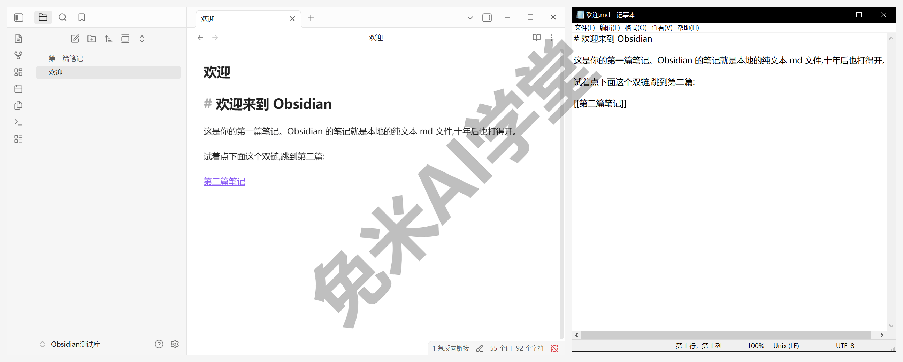

**数据完全自有**——笔记存在你的硬盘上、格式是通用纯文本，两件事合在一起，意味着数据的控制权完全在你手里：想备份就复制文件夹，想换工具就把文件夹带走，不需要向谁申请导出。隐私上也一样，默认情况下笔记内容不会离开你的电脑。

说完它是什么，也要说清它不是什么，避免带着错误的期待开始：

- 它**不是在线协作工具**——多人实时共同编辑一份文档不是它的主场，团队协作的需求在下一节的工具对比里有更合适的选择。
- 它**不是全托管服务**——官方不替你保管笔记，数据在你手里，备份和多设备同步也要自己安排，课程会在《同步与备份全解》里专门讲怎么安排。

这两点不是缺陷，而是“数据完全自有”的另一面：控制权归你，备份这类责任也随之归你。课程会带你把这份责任安排妥当。

### 1.2 和 Notion/语雀/OneNote/flomo 怎么选

笔记工具很多，各有各的长处。这里把最常被拿来比较的几款放在一起，每款一句话定位，帮你判断自己该用哪个——它们和 Obsidian 之间不是对错关系，是分工关系，看清各自的主场，选择其实不难。

- **Notion**：在线文档加数据库的组合，团队多人协作、共同维护一套资料是它的强项；数据主要存在官方云端，所有人看到的永远是同一份最新内容，离线使用则不是它的重点。
- **语雀**：国内团队常用的文档与知识库平台，写作、发布和团队共享都方便，中文环境下体验顺畅；同样是在线服务形态，适合团队知识沉淀和对外发布的场景。
- **OneNote**：微软家的自由画布笔记，随手涂画、手写批注、贴图剪藏都方便，和 Office 全家桶配合顺畅；数据主要存放在微软云端，多设备同步由微软账号打理。
- **flomo**：卡片式速记应用，手机上随手记一句想法特别顺手，主打“先记下来再说”；定位就是碎片记录，不主打长文写作与复杂组织，常和重型笔记工具搭配使用。
- **Obsidian**：本地纯文本笔记库，长处是数据自有、笔记互链和长期积累，插件生态可按需扩展；代价是协作与多端同步要自己安排——正是上一节说的“责任也随之归你”。

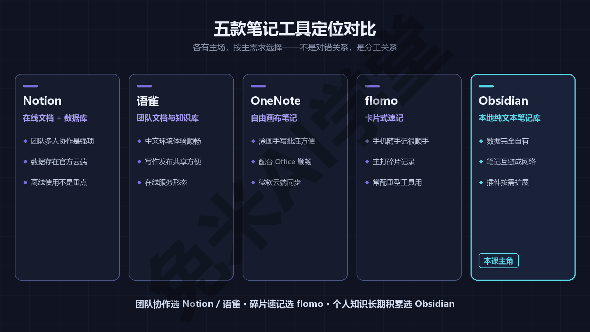

选择时抓住自己的主需求就行：要在线多人协作、团队共同维护一份资料，选 Notion 或语雀，它们本来就是为共同编辑设计的；只想随手记碎片想法，打开就记、记完就走，flomo 更轻快；想要数据存在自己手里、把个人知识一年一年攒下去，选 Obsidian——也就是这套课程接下来要做的事。

还可以用一个更实在的角度复核这个选择：想一想“笔记最终以什么形态、存在谁手里”。在线工具里，笔记存在你的账号里，账号背后是服务商的服务器；Obsidian 里，笔记就是你硬盘上的文件，和你的照片、文档没有区别。对上一节“十年后还打得开”有共鸣的读者，用这一条基本就能定案。

这几款工具也并不互斥。常见的组合用法是：团队协作的内容放 Notion 或语雀，手机上的闪念先进 flomo，个人知识的长期沉淀放 Obsidian。本课程先帮你把 Obsidian 这一块建好，将来要不要组合、怎么组合，主动权在你。

最后补充一点：这个选择没有想象中那么重大。Obsidian 用的是通用的 md 纯文本，进得来也出得去——从别的工具搬家进来有官方途径，将来想搬走也只是复制文件夹的事，课程后面的《导入、导出与发布》会专门讲搬家。选“错”了也不会被锁死。

### 1.3 免费与付费：零成本主线

很多人看到功能这么全，第一反应是“要花多少钱”。Obsidian 的答案在同类工具里比较少见：**核心功能全部免费，而且不需要注册账号**——没有试用期，没有“升级到高级版才能解锁”的功能墙，装完就能用上全部本地能力；连账号都不用注册，笔记从第一天起就不绑定任何在线身份（官方定价页的现行口径，以官网当前页面为准）。

工作场景同样免费。它早年曾要求企业用户购买商用许可，2025 年起已改为自愿支持性质，不再强制——也就是说，无论个人学习还是上班用它记工作笔记，都不需要付费（以官方现行条款为准）。这一条对上班族读者有实际意义：装进办公电脑记工作笔记，不牵扯采购和授权的顾虑（企业统一采购等特殊情形，以官方条款为准）。

官方的收费点只有两项增值服务，都是订阅制，解决的都是“本地之外”的需求，价格以官网当前页面显示为准：

- **Sync**：官方的多端同步服务，把电脑、手机上的库保持一致，省心程度最高；但它不是唯一解，网盘和 Git 也能走通同步，免费路线是存在的。
- **Publish**：把你选定的笔记发布成一个公开网站给别人看；同样有免费替代路线，课程毕业时就会用免费方案实操建站。

不订阅这两项，你少的只是“官方替你打理”的省心，能力上没有缺口：本地写作、组织、检索一样不少，社区插件本身也是免费的（怎么安全地开启和挑选，《社区插件系统》专篇讲）。同步该选官方 Sync、网盘还是 Git，《同步与备份全解》会把三条路的取舍讲清楚；发布笔记的几条路，《导入、导出与发布》也有专门一节。判断自己需不需要付费也有个简单标准：等真实需求出现再说——比如真的有了第二台设备要同步，再去比较 Sync 和免费路线，本篇的学习完全用不上它们。

顺着这个口径，把全课的零成本路线图先交代清楚：同步走免费路线，插件和主题免费，毕业时的笔记建站也用免费方案；唯一的可选付费项是《Obsidian×Codex：让 AI 管理你的笔记库》那一篇（需要 ChatGPT 订阅），主线学习不依赖它，跳过不影响任何一篇。官方口径你随时可以自己核对：打开官网定价页看一眼现行说明即可，本课程不替官方做承诺。

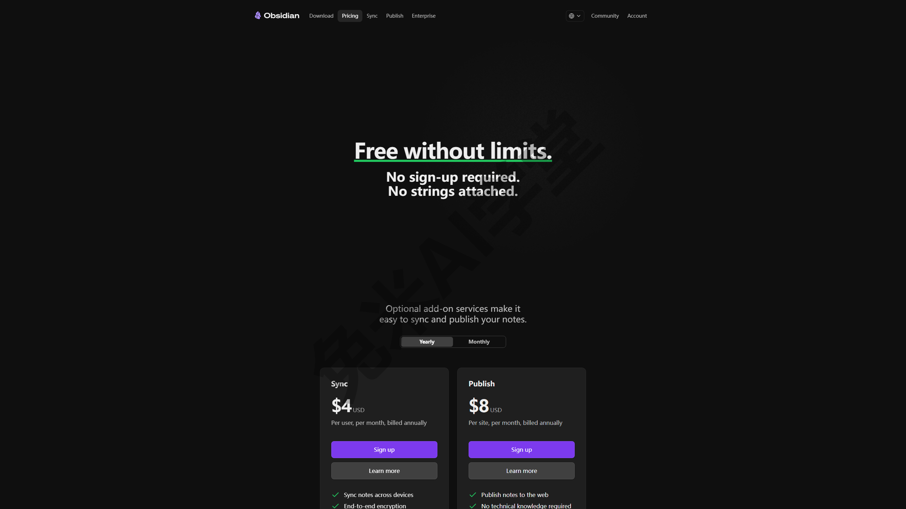

这里顺便定一个课程惯例：为了让费用问题全程透明，本课程走零成本主线，每篇交代当前方案花了多少钱，涉及付费能力的地方同时给出免费替代路线——这个惯例，课程称作**零成本记账**。第一笔账很好记：本篇花费 0 元，装好即用。全课的费用总账，会在最后一篇《毕业：数字花园上线》里一起算清。

### 1.4 下载安装与切中文

准备工作很简单：一台能上网的 Windows 电脑。Obsidian 也提供 macOS、Linux 和手机版本，本课程全程用 Windows 桌面端演示，其他平台的差异见篇末常见问题，手机端另有《移动端与网页剪藏》专篇。安装过程通常几分钟就能走完。

**第 1 步：下载安装包**

打开浏览器，访问 Obsidian 官网下载页（obsidian.md/download）。页面通常会自动识别你的操作系统，点击 **Download for Windows** 按钮下载安装文件（页面是英文界面，按钮样式与文案以官网当前页面为准）。整个下载过程不需要登录任何账号，这一点和上一节“不需要注册账号”是一回事。

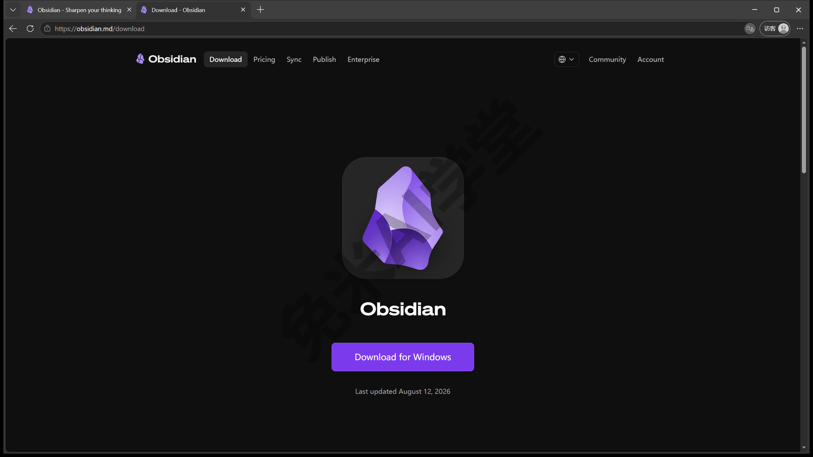

**第 2 步：运行安装器**

双击下载好的安装文件，按照提示完成安装——这一步没有需要纠结的选项，按默认提示走完即可（安装画面以你安装当天的版本为准）。装完后，从开始菜单或桌面图标打开 Obsidian，和打开其他应用没有区别。

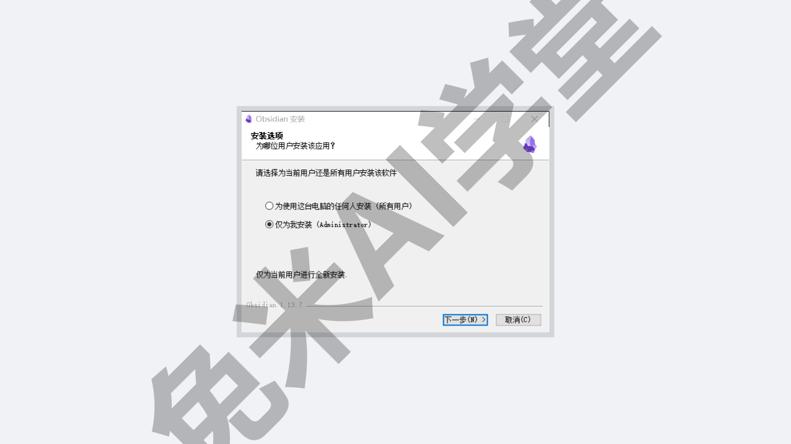

**第 3 步：认一眼首次启动画面**

第一次打开 Obsidian，你看到的不是笔记界面，而是一个库管理画面——它相当于 Obsidian 的“门厅”，以后你新建库、打开别的库，都会回到这里。画面上有“新建仓库”“打开本地仓库”“同步远程仓库”三组入口，下方还有语言下拉——界面把“库”译作“仓库”，是同一个概念，课程仍统一叫“库”。如果看到的是英文界面，不用担心装错，下面马上切中文。画面上其余入口这一篇都用不到，等后面篇目用到时再讲。先不急着点，下一节建库时会用到它。

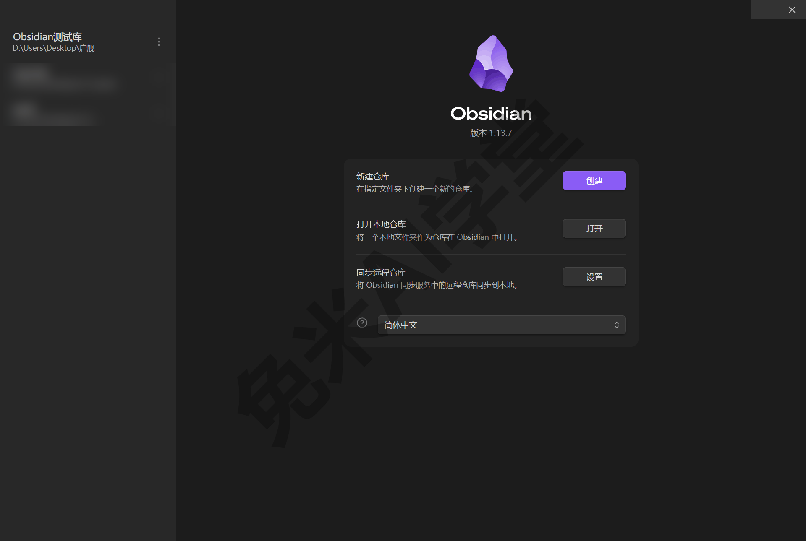

**切换中文界面**

Obsidian 支持中文界面。切换入口有两处：

- 一是首次启动的库管理画面上直接选择语言——最省事，建库之前界面就已经变成中文；
- 二是进入设置，在“关于”分组里找到“语言”一项，从列表中选择简体中文——已经跳过第一处的读者用这条路补上。

如果当前界面是英文，认准 **Language** 字样即可。选择简体中文后，界面是立即生效还是提示重启，以实际界面提示为准；如果切换后个别文字仍是英文，重启一次应用再看。

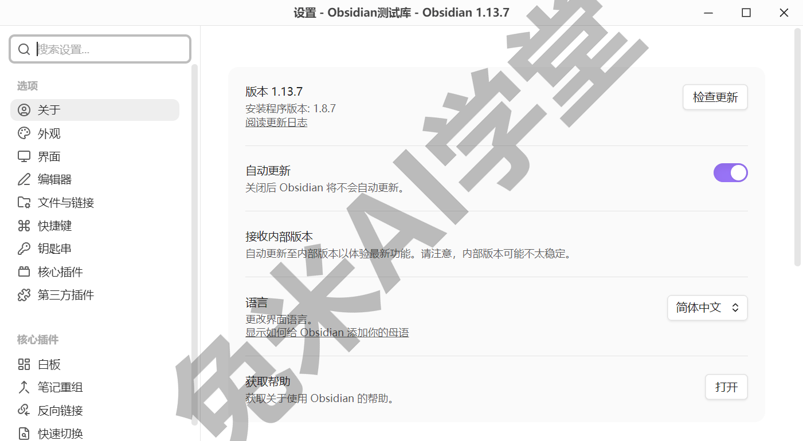

两点通用说明，后面每一篇都适用：

- 本课程全程使用中文界面演示。个别功能的界面译名可能和网上老教程、甚至官方帮助文档的叫法不同，属于正常现象，课程一律以当前实机界面的中文文案为准。
- 应用会随官方迭代持续更新，你看到的界面细节可能与课程截图略有出入，同样属于正常现象，一律以实机为准（更新提示的具体形态，以实际界面为准）。

### 1.5 建第一个库

软件装好了，下一步是建立你的第一座库。

**库是什么**——Obsidian 把存放笔记的地方叫“库”（vault，界面上也可能译作“仓库”，以实机显示为准；课程统一叫“库”，这个英文词不必记）。它的本质一句话就能说清：**一座库就是你硬盘上的一个普通文件夹**，你在 Obsidian 里写的每篇笔记，都是这个文件夹里的一个文件。

建好之后去资源管理器看，这个文件夹里除了你写的一篇篇 .md 笔记，还会多出一个名为 .obsidian 的配置文件夹——这座库的界面设置、插件都记录在里面，由软件自己维护，日常不用动它。顺带一提，每座库的设置和插件是各自独立的，这一点等你以后建第二座库时才会体会到，现在知道有这回事即可。这些细节先有个印象，《库、文件与搜索》会把库的门道讲透。

**动手建库**：回到首次启动的库管理画面，在“新建仓库”一栏点“创建”，然后做两个决定：

- **库名**：起一个简单好认的名字就行，比如“我的笔记”；这个名字同时就是那个文件夹的名字。
- **位置**：选一个你自己找得到的本地文件夹。建议放在非系统盘（比如 D 盘），路径别套太多层，方便以后备份和查看。

位置上再补一条经验：给库单独建一个专用文件夹，不要把“桌面”“下载”这类混着大量无关文件的目录整个当库——库里的所有文件都会被 Obsidian 纳入管理，无关文件混进来，以后搜索和图谱都会被搅浑。库以后也能整体搬动（它毕竟只是个文件夹），但起步时选好位置，能省去不少麻烦。

如果你电脑里已经攒了一批 md 文件，库管理画面上的“打开本地仓库”可以直接把现成文件夹变成库；本课程按新建库演示，从其他笔记工具搬家进来的完整做法，在《导入、导出与发布》里讲。

确认后 Obsidian 会打开这座库，你会看到正式的工作界面——左侧是文件列表，中间是编辑区。界面上的按钮不少，现在不必逐个认识，下一篇《界面与设置全导览》会带你每个按钮点一遍。

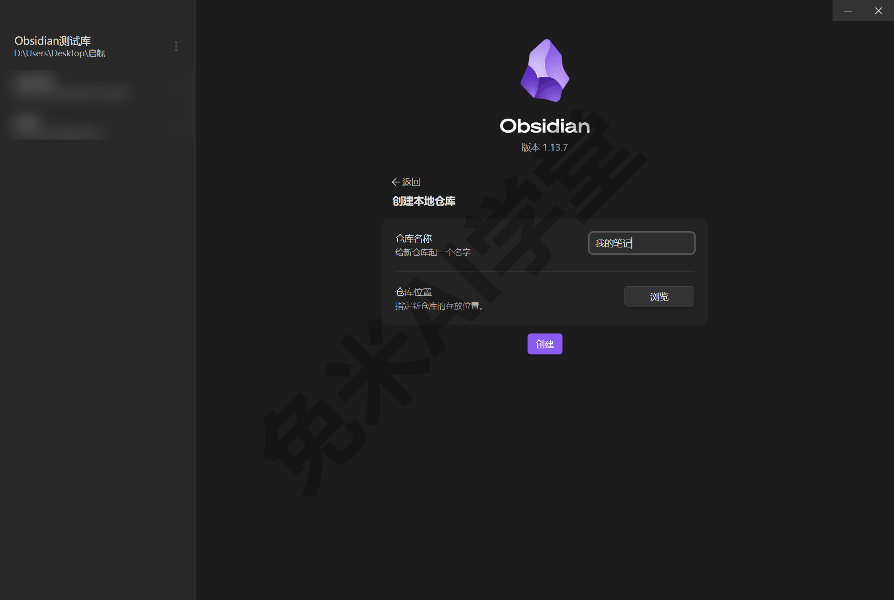

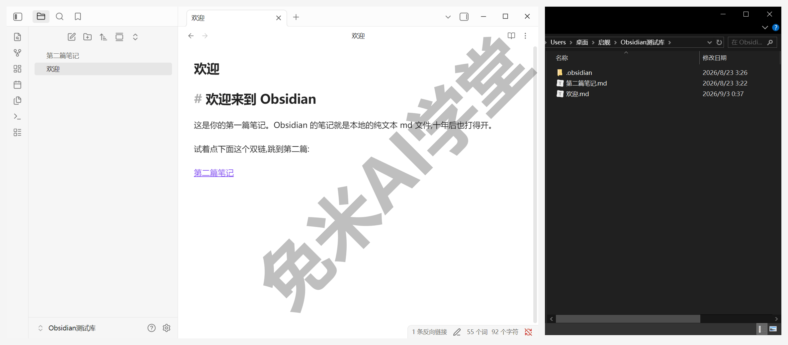

还有读者会问：工作和生活的笔记，要不要分成两个库？先不分，默认单库起步就好——分库有实实在在的代价，利弊和判断标准在《库、文件与搜索》里专门回答，到时候再决定不迟。

**一个安全提醒**：暂时不要把库建在网盘的自动同步文件夹里（比如 OneDrive、iCloud 这类软件正在实时同步的目录）。两套软件同时读写同一批文件，可能产生冲突。多设备同步是真实需求，但有更稳妥的做法，原因和正确方案在《同步与备份全解》里专门讲，现在先建在普通本地文件夹即可。

### 1.6 装完即用三连任务

库建好了，现在让它运转起来。下面三个小任务前后衔接，合起来正好把“写、连、看”各体验一遍，课程里把它们叫作**三连任务**。这一节先看完整演示，下一节轮到你自己做。

**第一步：写第一篇**

在左侧文件列表新建一篇笔记（入口通常是文件列表上方的“新建笔记”图标，图标名称与位置需实机验证，下一篇会逐个认），给它起个标题，随手写下几行字——写什么都行。写的过程和普通文本编辑一样，直接打字即可，不需要先学会任何东西。想让文字有格式（加粗、标题、列表），写法在姊妹篇的《基本语法》篇里，现在不影响使用。顺带留意一个细节：你给笔记起的标题，就是那个 .md 文件的文件名——改标题就是改文件名，这再次印证了“库就是文件夹”。

做完会看到：库文件夹里多了一个以标题命名的 .md 文件。

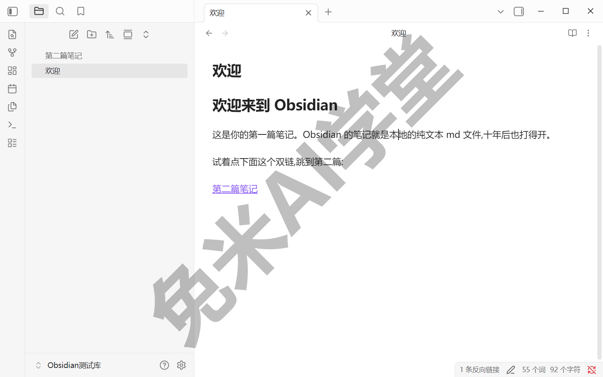

**第二步：链出第二篇**

在刚才那篇笔记的正文里，输入两个左方括号 `[[`，Obsidian 会弹出一个补全列表，库里已有的笔记都会出现在里面供你选择。我们这次故意不选已有的，接着输入一个还不存在的标题，比如 `[[我的第二篇笔记]]`，然后点击这个链接——**Obsidian 会自动创建这篇笔记并打开它**。

这就是你第一次用上双链。所谓双链，就是笔记之间可以互相链接，而且链接是双向可查的——不仅能从这头跳到那头，将来还能反过来看到“谁链接了我”。这是 Obsidian 的招牌能力，《双链与图谱》整篇都讲它。现在只需要记住一个动作：**链接可以指向还不存在的笔记，点击即创建**——想到什么先链出去，内容以后再补。这个动作成本很低，却是反向链接、图谱这些后续用法共同的原料，从第一天就值得用起来。

做完会看到：库里出现了第二个 .md 文件，两篇笔记之间有了一条链接。

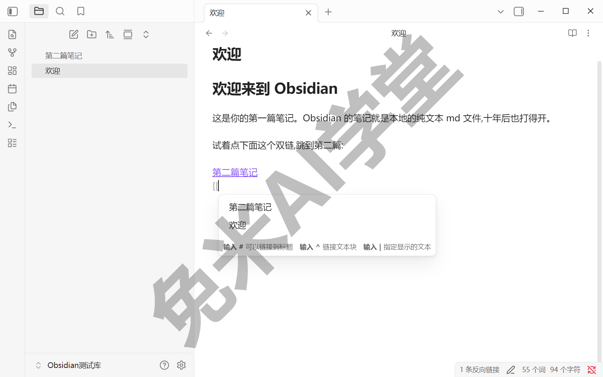

**第三步：看一眼图谱**

打开图谱视图（界面里叫“关系图谱”，功能区就有“查看关系图谱”按钮，命令面板里也能搜到，下一篇会逐个认）。你会看到两个点、一条线——两个点是你的两篇笔记，线就是刚才那条链接。

现在它当然简单，但这确实就是你知识网络的起点：以后每写一篇、每链一次，这张图上就会多一个点、多一条线。如果图上只有两个点、没有线，通常是因为第二篇不是从链接点进去创建的——回到第一篇重新点一次那个链接即可。图谱的真实用法在《双链与图谱》里专门讲。

看完随手把图谱窗口关掉也没关系——它只是数据的另一种展示方式，笔记本身不受任何影响。

做完会看到：图谱上两点一线，点击任意一个点可以跳到对应笔记。

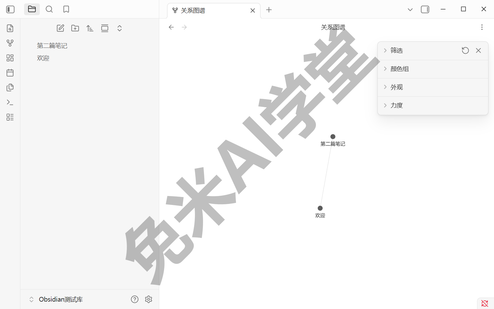

三步走完，这座库已经能写、能连、能看，从今天起就可以日常使用了。

### 1.7 三个练习任务

轮到你自己动手。三个任务和上一节的演示一一对应，做完就是完成了你自己的三连任务。

**任务一：写下你的第一篇**

新建一篇笔记，写下你安装 Obsidian 的理由，三五行即可。

完成标准：库文件夹里出现第一个 .md 文件，笔记里的文字排版正常显示。

**任务二：链出第二篇**

在第一篇里用 `[[ ]]` 链出一个你想深入的新主题，点击创建后写上两行；再在第二篇里用同样的方法补一条指回第一篇的链接。

完成标准：两篇之间点击链接可以互相跳转。

**任务三：看一眼你的图谱**

打开图谱，确认能看到两点一线；再到资源管理器里打开库文件夹，亲眼看到那两个 .md 文件。

完成标准：能指出图谱上的每个点分别对应硬盘上的哪个文件。

### 1.8 本篇小结与自检

这一篇认识了 Obsidian 的三大理念——本地优先、纯文本 md、数据完全自有，对比了同类工具的分工，并装好了你的第一座库。最需要记住的是：**笔记以纯文本存在你自己的硬盘里，软件没了文件还在，这就是“十年后还打得开”的底气。**

可以对照下面的清单检查学习结果：

- [ ] 能用一句话说出 Obsidian 与在线笔记工具的根本差别
- [ ] 已装好 Obsidian 并切换到中文界面
- [ ] 建好第一座库，知道它对应硬盘上的哪个文件夹
- [ ] 完成三连任务：写第一篇、链出第二篇、看过图谱
- [ ] 知道核心功能免费，付费点只有 Sync 与 Publish 两项

完成这些内容后，你已经有了一座能日常使用的库。下一篇《界面与设置全导览》把每个按钮、每页设置逐一过一遍——不少功能藏在设置里。

### 1.9 新手常见问题

**Q1：不会 Markdown，能直接用吗？**

能。Obsidian 默认的编辑视图一般会把格式实时渲染出来，直接打字就是正常的笔记，不学语法也能写。等你想用格式（标题、加粗、列表）时，再看姊妹篇的《基本语法》篇即可；编辑器为什么有时显示符号、有时不显示，下一篇《界面与设置全导览》讲三种视图时会说清。

**Q2：和 Notion 到底选哪个？**

按需求分工：要在线多人协作、团队一起维护文档，Notion 合适；要数据存在自己硬盘、格式通用、个人知识长期积累，Obsidian 合适。两者也可以并用——团队的事放 Notion，自己的积累放 Obsidian。

**Q3：手机上能用吗？**

能，Obsidian 有官方移动端应用。不过手机端要看到电脑上的笔记，前提是先把库同步过去，同步方案在《同步与备份全解》里讲清楚；手机端的界面差异和高频用法，《移动端与网页剪藏》有专篇。本课程主线用 Windows 桌面端演示。

**Q4：库文件夹放在哪个盘合适？**

建议放本地非系统盘（比如 D 盘），路径浅一点、自己找得到就好。暂时避开网盘的实时同步目录，原因见 1.5 的安全提醒；等《同步与备份全解》讲清方案后，再安排多设备同步。

**Q5：现在免费，以后会收费吗？**

官方现行口径是核心功能免费、个人与工作用途都不收费，2025 年起连商用许可也改为自愿支持，收费只收 Sync 和 Publish 两项增值服务；未来政策以官网为准，这里不替官方做承诺。更重要的一层保障在于：笔记是你硬盘上的纯文本文件，无论政策怎么变，已有数据都在你手里，随时可以带走——这也是“数据完全自有”在费用问题上的意义。
