## 界面与设置全导览

上一篇《认识与装好》装好了软件、建好了第一座库，还完成了写一篇、链一篇、看图谱的三连任务。这一篇暂时不学新功能，专心把软件本身摸熟：界面每个按钮点一遍，设置页分级过一遍，再给核心插件一张总览地图。

读完这一篇，你对整个软件会有一个明确的底：每样东西是什么、在哪里、要深讲的话在哪一篇。不需要现在记住所有细节——记不住的，这一篇本身就会教你怎么随时找回来。

### 2.1 界面五大区域总览

第一次认真打量 Obsidian 的界面，按钮确实不少。先别急着一个个点，把界面切成五块看，每块只负责一类事，后面的内容就都有地方安放了。

打开你在《认识与装好》里建的那座库，从左到右、从上到下，界面可以分成五个区域：

- **功能区**：最左侧那一条竖排图标栏，放的是常用动作的快捷按钮，比如打开命令面板、打开图谱，悬停任意图标会浮出它的名字；切换库、帮助、设置三个固定入口则在左侧边栏底部一行（2.2 细讲）。
- **左侧边栏**：紧挨功能区的一栏，文件列表、搜索、书签这些负责“找文件”的面板都集中在这里；面板以面板页签排列，整栏可以收起，给编辑区腾地方。
- **编辑区与标签页**：中间最大的一块，写笔记就在这里；顶部一排标签页，和浏览器一样可以同时打开好几篇笔记来回切换，还能拆成多栏对照着写（见 2.6）。
- **右侧边栏**：界面右侧的一栏，反向链接、出链、标签、大纲这些围绕当前笔记的信息面板集中在这里，同样可以整栏收起；写作时用它查看当前笔记的相关信息。
- **状态栏**：窗口右下角那一小行文字，显示字数、字符数这类当前状态；它的内容随开启的功能变化，不占地方但常被忽略，2.5 的字数统计就显示在这里。

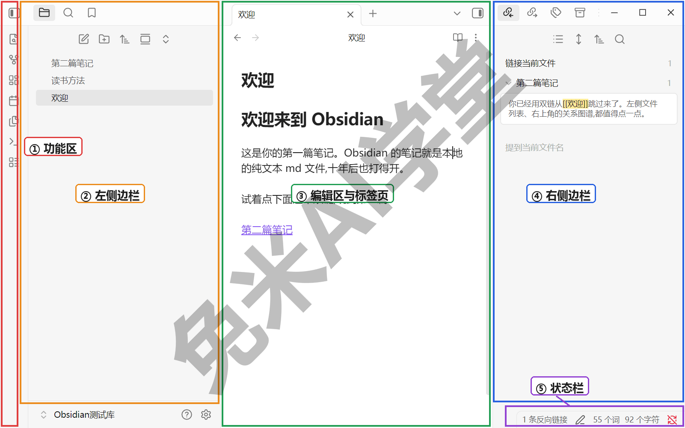

这五块的分工可以这样记：功能区管“动作入口”，两侧边栏管“辅助面板”，编辑区管“正文”，状态栏管“当前状态”。职责记个大概即可，读后面几节时随时回到这张图对照。

编辑区还有两个当场就能试的小细节：

- 标签页栏右端有一个加号，点它新建一个空标签页；在文件列表里点开笔记，默认在当前标签页打开，想另开一页保住当前这篇，用 2.6 的修饰键。
- 两侧边栏都能整体收起再展开（收起图标在界面顶部两侧），专心写作时把两栏都收掉，屏幕就只剩正文。

**先约定叫法**。全课后面提到界面，统一用这五个词：功能区、左侧边栏、编辑区、右侧边栏、状态栏，不必记英文名。之所以要约定，是因为网上教程对这几块的叫法五花八门（侧栏、面板区、工具条都有人叫），跟着课程走以这套叫法为准。另有一点提前说明：Obsidian 界面里的中文译名，和官方帮助文档、网上老教程的叫法也可能不完全一样（比如同一个面板，官方帮助里叫“文件浏览器”，界面里常显示为“文件列表”），课程一律以当前实机界面的文案为准。

还有一对容易混的词要提前分开：**标签** 和**标签页**。标签是给笔记做分类用的记号，《标签与属性》专篇讲它；标签页是编辑区顶部那种“开了几个页面”的页，和浏览器标签页同义。这一篇说到的都是后者。另外，两侧边栏里各面板缩成的小图标标签，课程叫“面板页签”，它标识的是面板、不是笔记，别和标签页混为一谈。

**编辑区的三种视图**。刚上手的人几乎都会遇到这个困惑：刚才还看得见的 `**` 星号怎么突然不见了？为什么这篇笔记能直接改，另一篇却怎么点都改不动？答案是同一篇笔记有三种显示方式，Obsidian 叫它们三种视图，看到的画面不同，笔记文件本身始终是同一个：

- **实时预览**：默认视图，能直接编辑；格式符号只在光标所在处显示，光标一离开就渲染成排版效果——边写边成型，平时写笔记就停在这里。
- **源码模式**：同样能编辑，但整篇的格式符号原样摆出来，看到的就是纯文本文件的本来面目；查符号、修排版错乱、编辑模板这类要“看清原文”的场合切过来最稳。
- **阅读视图**：只读不可编辑，整篇渲染成排版好的成品；读长文、把屏幕递给别人看时用它，也不怕误碰改动内容。

怎么切：编辑区右上角的视图切换按钮，负责在编辑和阅读两种状态之间切换，悬停按钮会提示当前所处的视图；编辑状态下用实时预览还是源码模式，在命令面板里搜“源码”，执行“切换实时阅览/源码模式”命令即可——命令名里的“实时阅览”就是实时预览。切完立刻能从画面上认出来：源码模式满屏符号，实时预览干干净净，阅读视图连光标都没有。

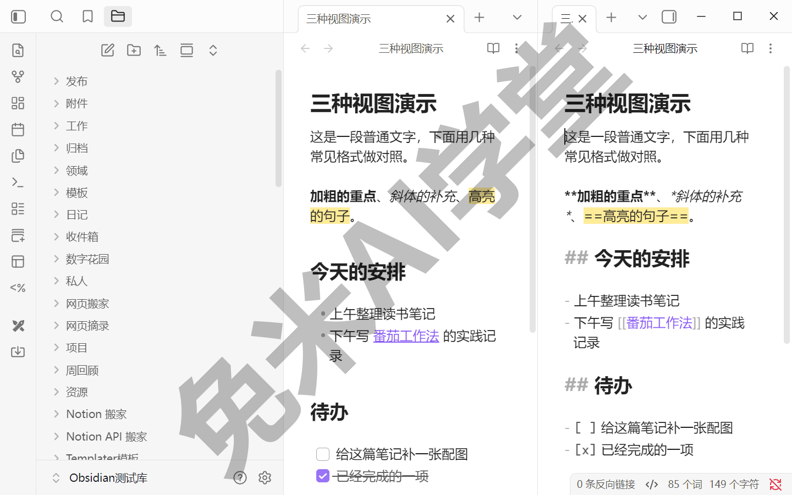

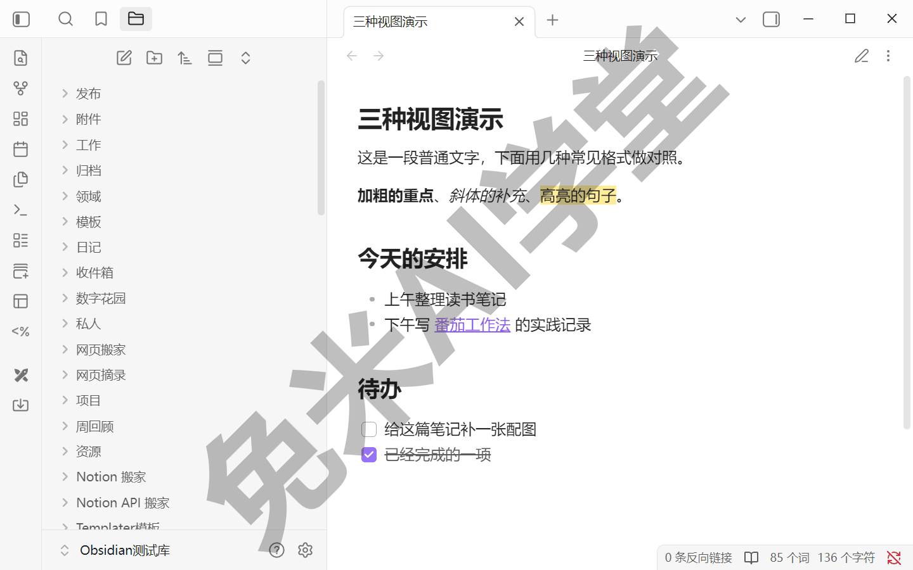

格式符号本身（加粗、标题、列表怎么写）是姊妹篇《Markdown 通用语法手册》的《基本语法》篇的内容；本篇只管视图，知道三种画面怎么回事、按钮在哪就够。

### 2.2 每个按钮点一遍

这一节把功能区和两侧边栏的按钮挨个点一遍。目标很轻：点过、见过，知道每个按钮点下去会发生什么，不要求背下来。

**功能区：常用动作一步直达**

功能区是最左侧的竖条图标栏。它解决的问题很直接：高频动作不值得每次都翻菜单，放个按钮一步到位。把鼠标悬停在任意图标上会浮出名字，遇到不认识的按钮，悬停一下就知道它是什么。

三个固定入口——切换库（显示当前库名）、帮助、设置——位于左侧边栏底部一行；其中设置那个齿轮图标，下面两节会频繁用到。功能区的按钮由各核心插件提供，开了哪些插件就出现哪些按钮。以默认配置为例，能看到打开快速切换、查看关系图谱、新建白板（Canvas）、打开/创建今天的日记、插入模板、打开命令面板、新建数据库（Bases）这一批（随开启的插件与版本增减，以实机为准）。

这些按钮对应的功能大多有自己的专篇，这里先不深究，2.5 的总览地图会把每一个都点名。功能区本身还有两个小技巧：

- 按钮可以拖拽换位置，把顺手的排到前面。
- 在功能区空白处单击右键，可以勾选隐藏或恢复某个按钮（交互需实机验证）。

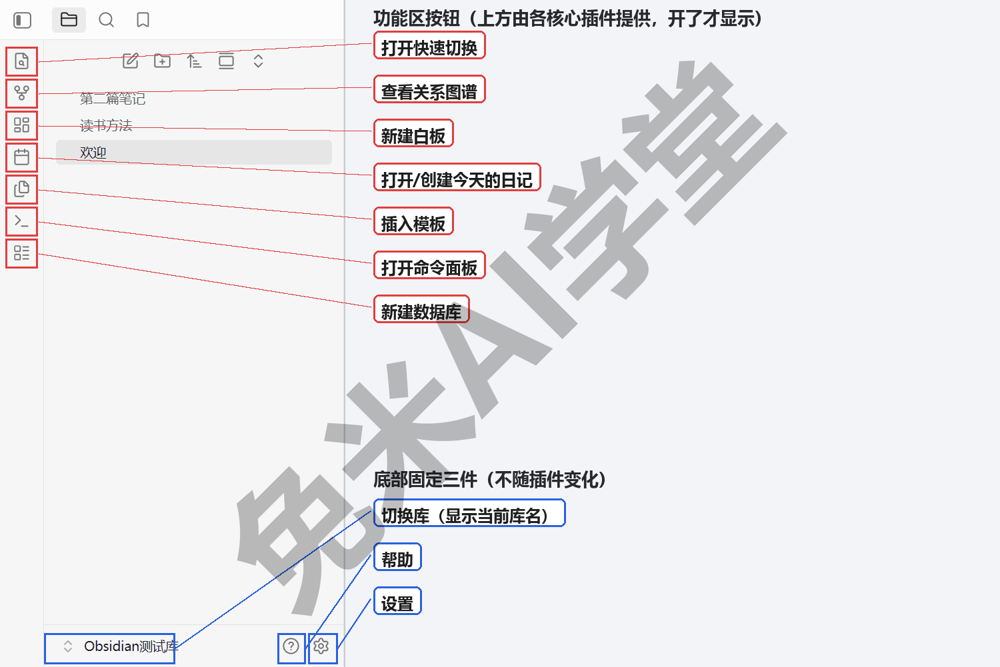

**左侧边栏：文件列表、搜索、书签**

左侧边栏默认停在**文件列表** 面板：你这座库里的文件和文件夹都列在这里，和资源管理器看到的一致——这正是《认识与装好》讲过的“库就是文件夹”。面板顶部有几个小按钮：新建笔记、新建文件夹，以及排序、折叠一类按钮（顶部按钮的确切组成需实机验证）。日常三个高频动作都在这里完成：

- 新建：点新建笔记按钮，列表里出现一篇“无标题”的新笔记，直接输入标题即可。
- 移动：把笔记拖进某个文件夹，松手即完成移动，硬盘上的文件也随之挪位。
- 右键：在文件或文件夹上单击右键，可以重命名、删除、移动，通常还有“在系统资源管理器中显示”一类入口（右键菜单项的确切组成需实机验证）。

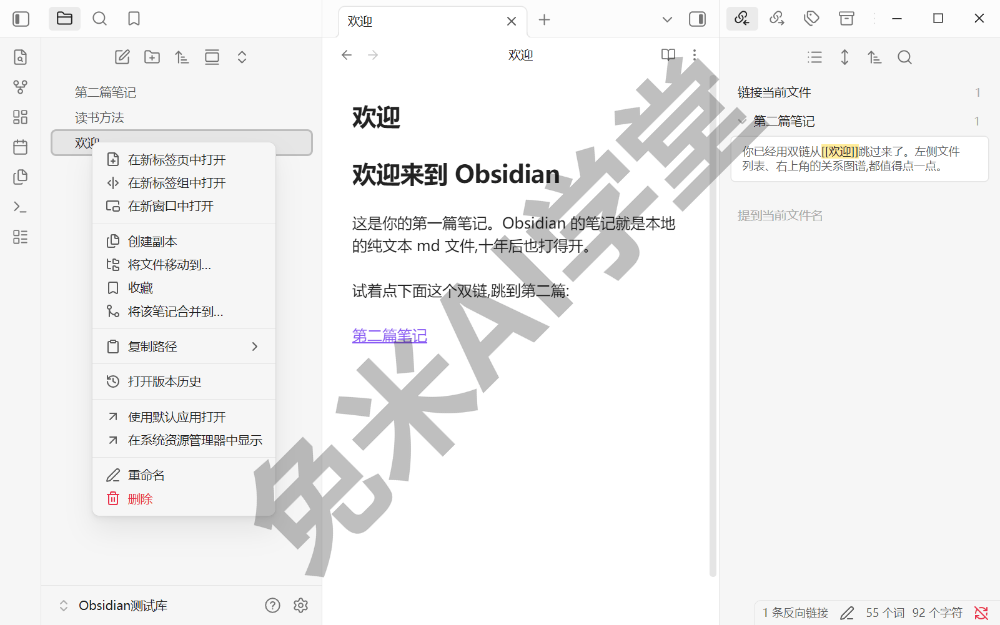

文件列表旁边还有两个面板页签。**搜索** 负责全库找内容，**书签** 负责收藏常用的笔记和搜索条件。这一篇认识入口即可，搜索操作符、书签分组这些完整用法，《库、文件与搜索》整篇展开。

**右侧边栏：围绕当前笔记的四个面板**

右侧边栏放着几个跟随当前笔记变化的面板，默认组成需实机验证，常见的有四个：

- **反向链接**：列出谁链接了当前笔记，用法在《双链与图谱》专篇讲。
- **出链**：列出当前笔记链出去了哪些笔记，同样在《双链与图谱》展开。
- **标签**：全库标签都列在这里，点一个就能筛出带它的笔记，《标签与属性》专篇讲。
- **大纲**：按标题层级列出当前笔记的目录，长文导航靠它——这个当场就能用起来，下面演示。

**大纲面板当场用一次**。写笔记的人迟早会遇到长文：滚动很久也找不到某一节在哪。大纲面板解决的就是这个：打开一篇有多级标题的笔记，再点开右侧的大纲面板，标题按层级列成一棵目录树，点击任意条目，编辑区立刻跳到对应位置。课程演示用的是一篇提前准备的长笔记；你手头还没有长笔记的话，先看演示理解用途即可（标题的写法，姊妹篇的《基本语法》篇里讲）。就这么一个小面板，长笔记里省下的翻找时间非常可观。

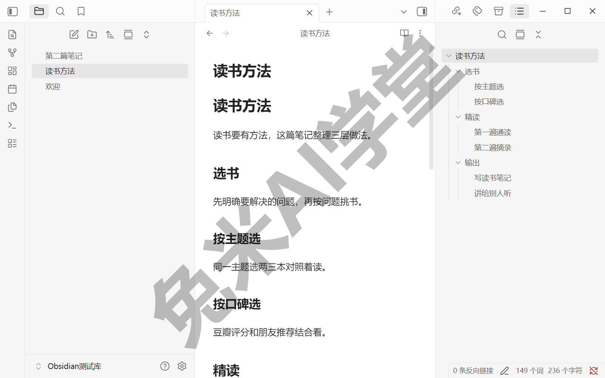

**面板可以拖动，拖乱了也能复原**

两侧边栏里的面板都以面板页签的形式排列，面板页签只显示小图标，悬停会浮出名字。面板页签可以拖拽换顺序，甚至从左侧拖到右侧；边栏本身也能整体收起，给编辑区腾地方。

万一不小心把面板拖没了、拖乱了，不用慌，两个办法都能救（交互以实际界面为准）：

- 把面板页签图标拖回原来的位置；
- 用下一节的命令面板搜索该面板的名字（比如搜“大纲”），对应面板会重新打开。

### 2.3 命令面板：万能入口

上一节点了一圈按钮，你大概已经在想：这么多入口，记不住怎么办？答案是不用记，记住一个就行——命令面板。

**它是什么**：一个按名字搜功能、直接执行的对话框。Obsidian 里几乎每个功能都登记成一条“命令”，命令面板就是这张总目录。按 `Ctrl+P` 呼出（官方帮助给出的默认快捷键，需实机验证）；也可以点功能区上的命令面板按钮。

呼出后输入关键词，列表实时过滤，方向键选中、回车执行；按 `Esc` 随时关闭，不会误执行任何东西（以实机为准）。它支持模糊匹配，记不全名字也能搜到；最近用过的命令会自动排在前面，越用越顺手（官方帮助口径，以实机表现为准）。列表里每条命令的右侧还会显示它绑定的快捷键（如果有），所以想查某个功能的快捷键，来这里搜命令比翻设置更快（显示形态以实机为准）。

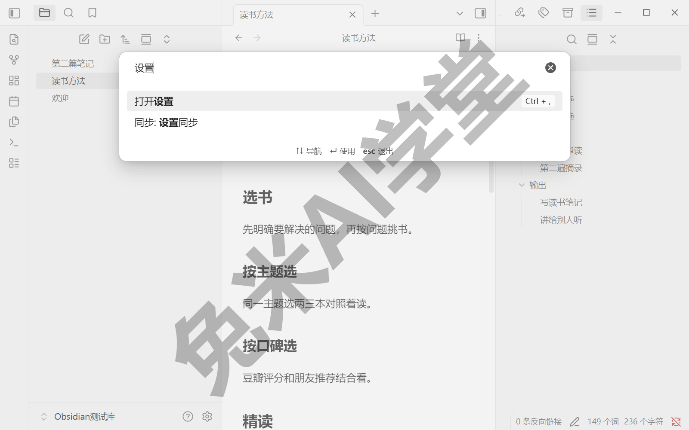

当场跑三条，每条都留意“输入什么、发生什么”：

- **打开设置**：呼出命令面板，输入“设置”，选中打开设置的命令回车——设置窗口弹出。这条最常用，以后忘了齿轮在哪就这么开。
- **新建笔记**：输入“新建”，选中新建笔记的命令回车——编辑区出现一篇无标题新笔记，和文件列表里点按钮效果相同。
- **切换深浅色**：输入“深色”或“浅色”，选中切换配色方案的命令回车——整个界面立即变色，再执行一次切回来（该命令的确切名称需实机验证；若当前版本没有这条命令，可在设置的外观分组里切换，见 2.4）。

体会一下这三条的共同点：全程没有找过任何按钮。功能的入口在哪可以忘，名字能搜到就行；后面各篇提到某个功能时，一律默认你可以用命令面板呼出它。

命令面板还有一层覆盖面上的意义：相当多的功能没有界面按钮，只能靠命令调用，后面各篇用到的插件功能里这种情况不少。所以哪怕你把界面按钮全认熟了，命令面板依然是唯一什么都能调的入口。

顺带把三个容易混的“搜索入口”分一下工：命令面板搜的是**功能**，全局搜索搜的是**笔记内容**，快速切换按名字直达**某篇笔记**——后两个都在《库、文件与搜索》里练熟。现在只需记住：想调功能，来命令面板。

再补一个小配置：**固定常用命令**。如果有几条命令天天用，可以把它们固定在命令面板列表顶部，呼出就能点，连关键词都不用输。入口在设置里命令面板插件自己的选项页，添加固定命令即可（入口与选项译名需实机验证）；固定后呼出命令面板，这几条常驻最上方。比固定命令更快的两种调用方式——给命令绑快捷键、在编辑器里输 `/` 直接调命令，《日记、模板与每日工作流》第一次用到时讲全。

### 2.4 设置页分级过

Obsidian 有个特点：不少功能藏在设置里。不少“原来还能这样”的能力，默认没开或者没有显出来，全在设置页里。这一节不逐项背设置，而是分级过：高频项当场调好，低频项知道在哪、归哪篇管。

**设置窗口长什么样**。点功能区底部的齿轮（或用命令面板搜“设置”），会弹出一个独立的设置窗口——这是 1.13 版本起的新形态，官方更新日志明确记载；按 `Esc` 可随时关闭。更喜欢旧式内嵌形态的话，设置里有对应开关可以关闭独立窗口（开关位于界面分组，确切名称与位置需实机验证）。窗口左侧是分组列表，右侧是当前分组的选项。分组大体分三段：应用本身的选项（通用、界面、编辑器、文件与链接、外观、快捷键这一批）、核心插件、第三方插件，再往下是各个已开启插件自己的选项页（分组名称与完整顺序需实机验证——1.13 设置改版后，官方帮助文档与实际界面存在出入，课程以实机为准）。

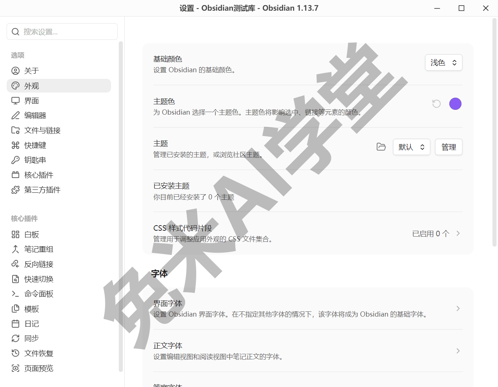

**设置搜索**。设置窗口自带搜索框，按设置项的名称和描述搜索，当前覆盖应用设置与核心插件的选项（官方口径；第三方插件的设置项要等插件适配后才能被搜到）。试一条：在搜索框输入“语言”，直接跳到语言设置项。以后任何时候想调什么却不知道在哪，先搜再翻。

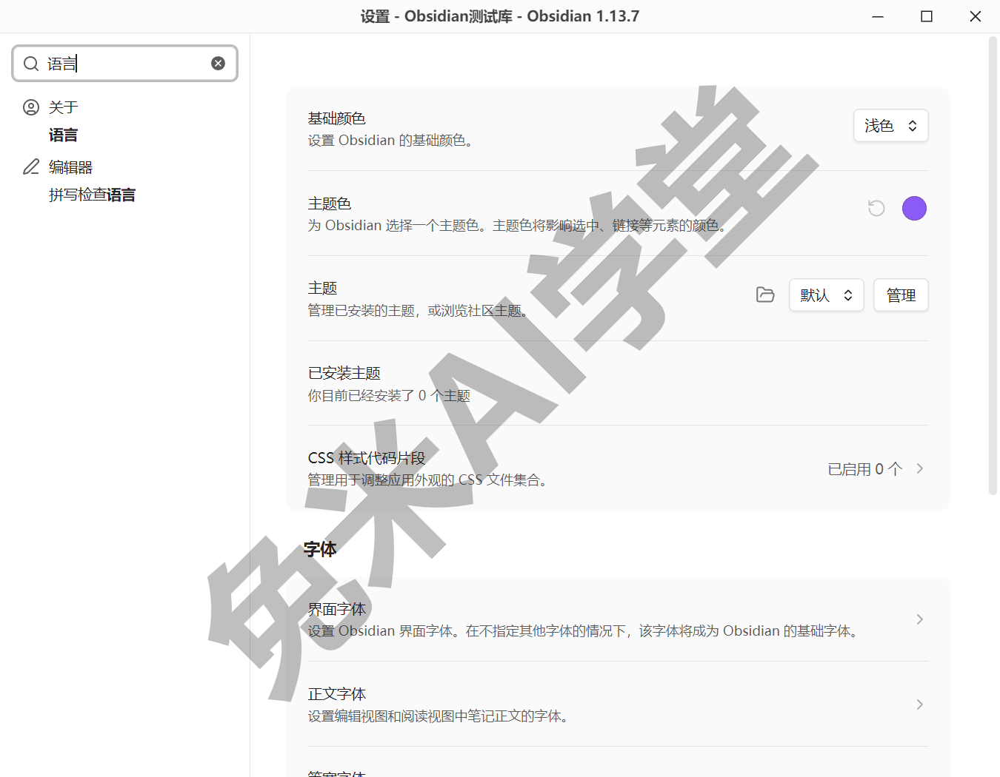

**高频三项，当场调好**：

**界面语言**——在通用分组。《认识与装好》装好时已经切过中文，这里记住位置就行：将来帮别人装机、或者不小心切错语言，回这里改。

**新建笔记存放位置**——在文件与链接分组，设置项是“新建笔记的默认存放位置”（设置项名需实机验证）。它决定每次新建的笔记落在哪个文件夹；不管它的话，新笔记会一直堆在库的根目录，库一大就乱。可选三种（选项措辞需实机验证）：

- 库根目录：默认值，新笔记建在库文件夹最外层。
- 当前文件所在文件夹：新笔记跟着你正在编辑的笔记走。
- 指定文件夹：所有新笔记统一进你指定的那个文件夹。

现阶段保持默认即可；等《日记、模板与每日工作流》建立起“收件箱”习惯，再回来把它指向收件箱文件夹，闪念笔记就有了统一的落点。

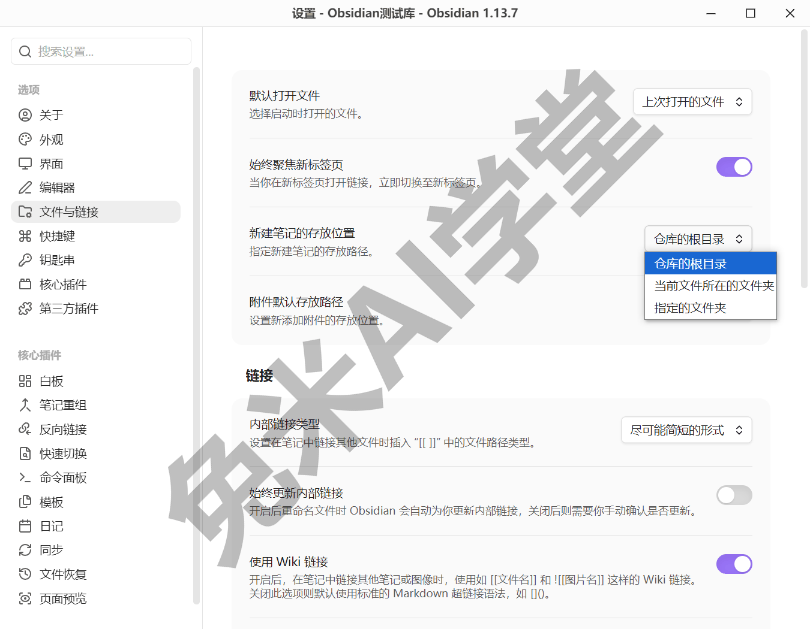

**默认视图与编辑模式**——在编辑器分组，两个相邻的设置项：“新标签页的默认视图”（阅读视图/编辑视图）与“默认编辑模式”（实时预览/源码）（两处设置项名需实机验证）。它们决定你打开一篇笔记时，看到的是能直接改的编辑画面，还是排版好的阅读画面。课程建议保持默认，和课程演示保持一致；三种视图各是什么样、什么时候用哪种，2.1 讲过，这两个设置项改的就是新笔记打开时落在三种视图的哪一种上。

**附件位置，点到为止**。文件与链接分组里还有一项“新附件的默认存放位置”（设置项名需实机验证），决定往笔记里粘贴的图片、文件存到库的哪里。现在不用动它，附件的归置规矩（放哪、怎么命名、怎么不弄丢），下一篇《库、文件与搜索》讲附件时一并交代。

**低频分组，知道归属即可**：

- **外观**：深浅配色、主题、字体字号、行宽都在这里；想把界面调成自己喜欢的样子，去《美化与工作区》。
- **同步**：官方 Sync 的配置入口在核心插件区的 Sync 选项页；要不要用它、和网盘与 Git 路线怎么选，《同步与备份全解》专篇裁决。
- **第三方插件**：这里默认处于受限模式，先别动；怎么安全地打开、怎么挑插件，《社区插件系统》整篇讲透。
- **快捷键**：任何命令都能在这里绑定按键；怎么搜命令、怎么绑，《日记、模板与每日工作流》给日记命令配快捷键时当场演示。

分级原则就一句：高频三项现在调好，低频分组记住归属，找不到就搜。

### 2.5 核心插件总览地图

Obsidian 的功能由一件件“插件”拼装而成——连日记、图谱这些看家功能，本质上也是插件。官方内置、随软件一起安装的这批叫**核心插件**；需要自己从商店安装的第三方作品叫**社区插件**，那是《社区插件系统》的主题，本篇先不碰。

核心插件的开关入口在设置 → 核心插件：每一项一个开关，旁边还有该插件自己的选项入口。官方明确说明部分核心插件默认关闭，但没有逐项公布默认状态（每项的默认开关需实机验证）。开关即时生效：比如把默认关闭的“漫游笔记”打开，界面上会立刻多出它的入口（以实机表现为准）。

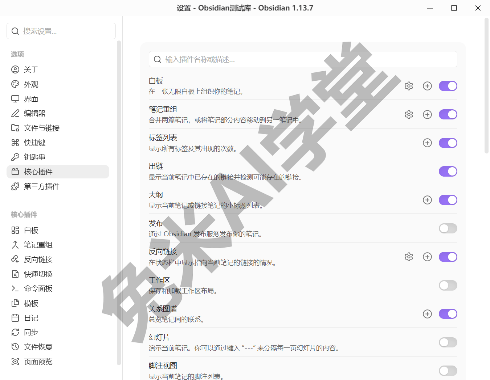

写作时官方帮助列出 30 项（数量随版本增减，以当前版本帮助页为准）。下表是全课的总览地图：每个插件干什么、深讲在哪篇，一次点齐。表中写“本篇”的当场已讲透；写“无专篇”的一句话就能用起来，不再单独展开。插件名按官方中文帮助的页名书写，界面内显示名可能略有差异（需实机验证逐项核对）。

| 插件 | 干什么 | 深讲在哪 |
| --- | --- | --- |
| 文件列表（帮助另译“文件浏览器”） | 浏览库里的文件和文件夹 | 本篇 2.2；库的门道见《库、文件与搜索》 |
| 搜索 | 全库查找内容 | 《库、文件与搜索》 |
| 快速切换 | 按名字直达任意笔记 | 《库、文件与搜索》 |
| 书签 | 收藏笔记、标题、搜索等 | 《库、文件与搜索》 |
| 命令面板 | 按名字搜功能并执行 | 本篇 2.3 |
| 大纲 | 当前笔记的标题目录 | 本篇 2.2 |
| 页面预览 | 悬停链接浮出内容预览 | 本篇 2.5 |
| 字数统计 | 状态栏显示字数与字符数 | 本篇 2.5 |
| 反向链接 | 列出谁链接了当前笔记 | 《双链与图谱》 |
| 出链 | 列出当前笔记链向了谁 | 《双链与图谱》 |
| 关系图谱 | 笔记关系可视化成网 | 《双链与图谱》 |
| 标签视图 | 全库标签一览与筛选 | 《标签与属性》 |
| 属性列表 | 全库属性与当前笔记属性 | 《标签与属性》 |
| 日记 | 按日期一键建当天笔记 | 《日记、模板与每日工作流》 |
| 模板 | 把预设内容插进笔记 | 《日记、模板与每日工作流》 |
| 时间戳笔记生成器 | 按时间戳标题建不重名笔记 | 《日记、模板与每日工作流》 |
| Canvas（帮助译“白板”） | 无限白板上摆卡片连线 | 《Canvas 画布》 |
| Bases（帮助译“数据库”） | 笔记属性汇成可编辑表格 | 《Bases 数据库》 |
| 文件恢复 | 定时快照，误删误改可恢复 | 《同步与备份全解》 |
| Sync | 官方多端同步服务 | 《同步与备份全解》 |
| Publish | 把笔记发布成网站 | 《导入、导出与发布》 |
| Markdown 格式转换器 | 把其他应用的笔记格式转成 Obsidian 风格 | 《导入、导出与发布》 |
| 笔记重组 | 合并两篇笔记或拆一篇为两篇 | 《卡片盒写作系统》 |
| 斜杠命令 | 编辑器里输 `/` 直接调命令 | 《日记、模板与每日工作流》 |
| 脚注视图 | 侧栏列出当前笔记的脚注（脚注写法见姊妹篇的《扩展语法》篇） | 无专篇 |
| 工作区 | 保存界面布局、一键切换 | 《美化与工作区》 |
| 录音机 | 录一段音频直接存进笔记 | 无专篇 |
| 漫游笔记 | 随机打开一篇，重温旧笔记 | 无专篇 |
| 幻灯片 | 把一篇笔记变成演示放映 | 无专篇 |
| 网页查看器 | 在应用内直接打开外部链接 | 无专篇 |

表中标“无专篇”的五项，用法一句话就够：在设置 → 核心插件里打开对应开关，然后用命令面板搜它的名字调用，部分项也会在功能区出现按钮（各项的具体入口以实机为准）；用途就是表里那一格，哪天用到再开。

另有两款官方团队维护、但走社区商店安装的插件：Importer（从 Notion、印象笔记等搬家进来，《导入、导出与发布》会用它）和 Maps（给 Bases 加地图视图，课内不涉及）。它们不在上面那批核心插件之列，《社区插件系统》讲安装方法时自然会遇到。

表看完先别急着到处开插件——默认配置已经够本篇和接下来几篇用；哪一篇用到哪个，再开哪个。当场再把两件小的用起来：

**页面预览**——悬停链接就能看到内容，不用真的点过去。它解决的是“只想瞄一眼、不想跳走”的需求。在文件列表、搜索结果、反向链接这些地方，悬停默认即预览；在编辑视图里，按住 `Ctrl` 再悬停链接才会触发（官方帮助口径，需实机验证）。用《认识与装好》里互链的那两篇试一下：悬停链接，浮出一张预览小卡，看完移开，阅读思路不被打断。

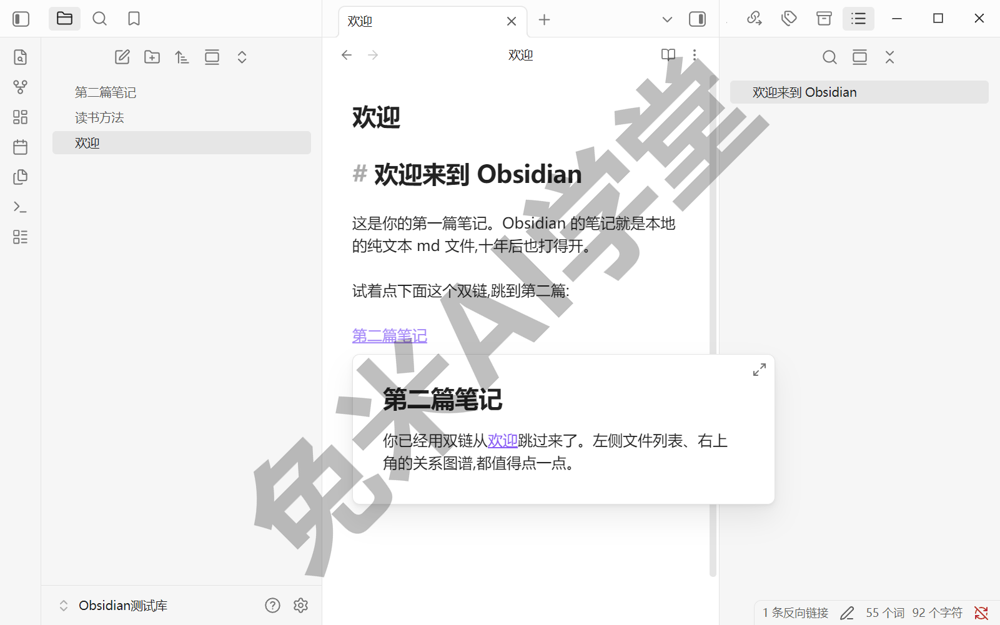

**字数统计**——状态栏右下角实时显示当前笔记的字数与字符数；选中一段文字时，只统计选中部分（以实机表现为准）。写有字数要求的稿子，看一眼右下角即可。

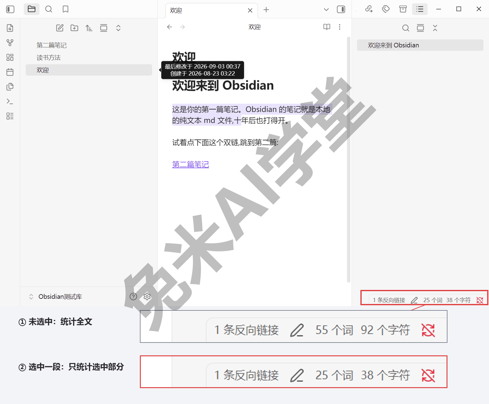

### 2.6 多窗格分屏基础

写笔记常有这样的时刻：想一边开着资料，一边写自己的稿——来回切标签页，切一次断一次思路。分屏解决的就是这个。

**摆出一个分屏**。两种做法（本节菜单名与交互均需实机验证，下同）：

- 右键编辑区顶部的标签页，选择“向右拆分”或“向下拆分”（菜单项中文名需实机验证）——编辑区立刻分成两栏，这篇笔记进了新栏。
- 或者直接拖：按住标签页，拖到另一篇笔记的边缘，出现高亮落点后松手，效果相同。

分出来的每一栏都是完整的编辑区，各有各的标签页，各开各的笔记；两栏之间的分界线可以拖动调宽窄。典型用法当场摆一次：左栏开你正在写的笔记，右栏开要参考的那篇——左边写、右边看，视线不用离开屏幕。

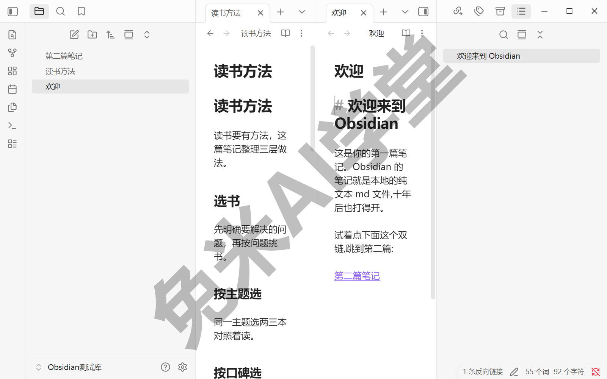

**收回去**。把右栏的标签页拖回左栏，或者把右栏的标签页都关掉，编辑区就回到单栏。分屏摆出来和收回去都只是一两个动作，随用随收。

**分几栏合适**。两栏是最常用的形态；屏幕不大时三栏以上会挤得每栏都看不清，不如回到标签页切换。左右拆分适合两篇笔记对照，向下拆分更适合同一篇的前后两段对照（比如一边看开头的设定、一边写结尾）。要长期挂着参考资料的话，把它拖成独立小窗、放到第二台显示器上更舒服。

**一个新手常踩的小坑**：分好屏后点了参考栏里的链接，参考内容被新页面顶掉了。这是因为链接默认在当前栏打开。应对办法有两类（以实机为准）——要么按住 `Ctrl` 再点链接，让它开到新标签页去，下面的修饰键表马上讲全；要么右键参考栏的标签页选择固定（官方帮助口径，中文名需实机验证），固定后的标签页不会被顶掉，之后打开的笔记会自动另开一页。

**顺手的修饰键**。打开链接时加修饰键，可以控制它开在哪里（官方帮助成文的修饰键表，键位需实机验证）：

- `Ctrl` + 单击链接：在新标签页打开，当前这篇保持不动（源码模式下需 `Ctrl+Shift`）。
- `Ctrl+Alt` + 单击：直接开成新的分栏，相当于边打开边分屏，两篇对照一步到位。
- `Ctrl+Alt+Shift` + 单击：开成一个独立的新窗口，适合直接拖去另一台显示器。

配套的标签页快捷键也来自同一张官方表：`Ctrl+T` 新建标签页，`Ctrl+Tab` 在标签页之间切换，`Ctrl+Shift+T` 重新打开刚关闭的标签页。和浏览器的习惯一致，基本不用专门学。

还有两个进阶形态，知道有就行：

- 把标签页整个拖出应用窗口，它会变成一个独立小窗，双显示器时特别好用。
- 标签组右上角的下拉菜单里有“堆叠标签页”（入口与中文名需实机验证），能把多篇笔记像卡片一样叠着滑动，属于尝鲜功能。

最后提一件事：摆好的布局（分屏、面板、侧边栏状态）可以整套保存下来、一键切换，这由“工作区”核心插件负责。布局管理与工作区的完整用法在《美化与工作区》专篇，本篇会摆分屏就够。

### 2.7 三个练习任务

三个任务对应本篇的三样核心能力：命令面板、设置页、分屏。做完它们，这一篇的内容就都亲手过了一遍。

**任务一：盲找五个功能**

只允许用命令面板（不点任何按钮），依次调出五个功能：打开设置、新建笔记、打开关系图谱、打开今天的日记、切换阅读视图（命令的确切名称需实机验证，搜关键词即可命中）。若某条命令搜不到，大多是因为对应核心插件未开启，去设置 → 核心插件里打开再试。

完成标准：五条命令全部搜到并执行成功，过程中没有点过一个界面按钮。

**任务二：设置寻宝**

在设置页完成三处修改：

- 外观分组里把配色方案切到另一种深浅色，再切回来；
- 文件与链接分组里把“新建笔记的默认存放位置”改成“当前文件所在文件夹”，再改回默认；
- 核心插件里开启“漫游笔记”，并随手用一次（功能区按钮或命令面板均可）。

完成标准：三处都改成功，且每一处都知道怎么改回来。

**任务三：摆一个分屏**

用《认识与装好》三连任务里互链的那两篇笔记：左右分屏、两篇对照，把其中一篇的内容补充两行，再把分屏还原成单栏。

完成标准：分屏与还原都能独立完成，说得出两栏分别开的是哪篇。

### 2.8 本篇小结与自检

这一篇把界面五大区域、常用面板、命令面板和设置页全部过了一遍，并拿到了核心插件总览地图。最需要记住的是：**记不住入口不要紧，几乎所有功能都能在命令面板里搜到；不少功能藏在设置页里，找不到就用设置搜索。**

可以对照下面的清单检查学习结果：

- [ ] 能说出界面五大区域各自负责什么
- [ ] 用命令面板调出过至少五个功能
- [ ] 在设置页里改过配色方案、新建笔记存放位置等三处以上设置
- [ ] 说得出至少五个核心插件分别在哪一篇深讲
- [ ] 会拖出左右分屏并还原

完成这些内容后，界面的每个区域你都已经点过、认过。下一篇《库、文件与搜索》解决新手最纠结的问题：库到底是什么、要不要分库、笔记怎么组织怎么找。

### 2.9 新手常见问题

**Q1：按钮太多，记不住怎么办？**

不需要记全。本篇的设计就是点过、见过即可，真正值得记的入口只有一个：`Ctrl+P` 呼出命令面板，按名字搜功能。常用按钮用几天自然就熟了；不常用的，等用到那一篇时会重新讲。

**Q2：不小心把面板拖乱了，怎么复原？**

先悬停面板页签图标认出各面板，把拖乱的图标拖回原位；拖丢了的面板，用命令面板搜它的名字重新打开（比如搜“大纲”）。就算一时收拾不好也不影响笔记数据——面板只是显示窗口，笔记文件一直原样存在库文件夹里。

**Q3：核心插件要不要全部打开？**

不用。默认配置已经覆盖日常所需，开得越多界面越拥挤。按课程节奏走：哪一篇用到哪个插件，再开哪个；每一项的用途和归属，回头翻 2.5 的总览地图即可。

**Q4：设置项显示英文看不懂怎么办？**

先确认界面语言已切到简体中文（设置 → 通用 → 语言，《认识与装好》里切过一次）。个别设置项、插件名暂未翻译属于正常现象，以实机显示为准；用设置搜索时中英文关键词都可以试，比如“language”和“语言”通常都能命中（以实机表现为准）。
